# 第十章：使用感知系统改进代理

AI **感知系统**是虚幻引擎游戏框架中的一个强大工具，因为它允许 AI 控制的演员感知并对其环境中的各种刺激做出反应。它为 AI 代理提供了一种通过不同的感官（如视觉、听觉或触觉）感知其他演员（如玩家或敌人）存在的方法。通过正确配置和使用感知系统，开发者可以创建能够对其周围事件做出适当反应的 AI 代理。更重要的是，这个系统允许开发者根据他们游戏的具体需求实现和配置定制的感官。这种灵活性使开发者能够创建独特且引人入胜的 AI 体验。

在本章中，我们将介绍虚幻引擎感知系统的主要组件，从一些理论开始，然后应用这些新获得的知识到实际案例中。

在本章中，我们将涵盖以下主题：

+   介绍感知系统

+   为代理添加感知功能

+   调试感知

+   创建感知刺激

# 技术要求

要跟随本章中介绍的主题，您应该已经完成了前面的章节，并理解了它们的内容。

此外，如果您希望从本书的配套仓库开始编写代码，您可以下载本书配套项目仓库中提供的**.zip**项目文件：[`github.com/PacktPublishing/Artificial-Intelligence-in-Unreal-Engine-5`](https://github.com/PacktPublishing/Artificial-Intelligence-in-Unreal-Engine-5)。

要下载最后一章末尾的文件，请点击**Unreal Agility Arena –** **第九章** **-** **结束**链接。

# 介绍感知系统

马库斯博士和维克托利亚教授似乎在他们的故事中开启了一个新的篇章：

*马库斯博士和维克托利亚教授知道，如果允许像他们的 AI 木偶这样的复杂合成生物不受限制地漫游，可能会造成灾难。因此，他们开始不知疲倦地开发一个复杂的隐藏摄像头网络，可以随时监控他们的创造物的移动和行动。有了这个警惕的监控系统，他们希望对他们进行严格的监督，保持完全的控制，确保他们* *有争议的研究* *的安全*。

在虚幻引擎中创建智能和反应灵敏的 AI 代理时，AI 感知系统是一个关键组件；这个强大的系统允许 AI 控制器——以及随之而来的 AI 代理——感知并对其虚拟环境中的不同刺激做出反应。

AI 感知系统的核心是**感官**和**刺激**。一个感官——如视觉或听觉——代表 AI 代理感知其环境的方式，并配置为检测特定类型的刺激，这些刺激是来自游戏世界中其他演员的感知数据源。

例如，*视觉感官*预先配置为检测任何可见的演员，而*伤害感官*在关联的 AI 控制器的演员受到外部伤害时触发。

注意

作为开发者，您可以通过扩展**AISense**类（如果您使用 C++）或**AISense_Blueprint**类（如果您使用蓝图）来创建针对您游戏特定需求定制的感官。

## AI 感知系统组件

AI 感知系统由以下主要类组成：

+   **AIPerceptionSystem**：这是核心管理器，负责跟踪所有 AI 刺激源。

+   **AIPerceptionComponent**：这代表 AI 代理的头脑，负责处理感知刺激。它需要附加到 AI 控制器才能正常工作。

+   **AIPerceptionStimuliSourceComponent**：此组件添加到可以生成刺激的演员上，并负责向监听元素广播感知数据。

+   **AIPerceptionSenseConfig**：这定义了特定感官的属性、可以感知的演员以及感知随时间或距离衰减的方式。

当具有**AIPerceptionStimuliSourceComponent**的演员生成刺激时，附近的**AIPerceptionComponents**通过其配置的感官检测它。然后，AI 控制器处理这些感知数据以触发所需的行为。

一旦您将**AIPerceptionComponent**添加到 AI 控制器中，您需要添加一个或多个**AIPerceptionSenseConfig**元素，以便为您的 AI 代理提供专用的感官。*图 10.1*展示了基于触觉的感知示例：

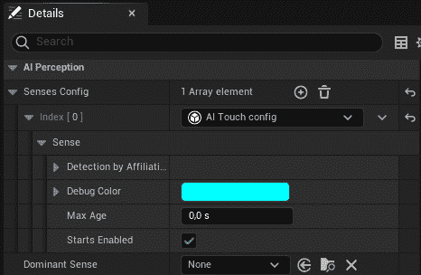

图 10.1 – 触觉配置

从之前的屏幕截图，您可能已经注意到一个**主导感官**属性；此属性允许您指定一个在确定感知演员位置时优先于其他感官的特定感官。

让我们探索可用的感官配置，正如之前提到的，这些配置定义了每个特定感官的属性：

## AIPerceptionSenseConfig 类型

Unreal Engine 提供了一系列预定义的**AIPerceptionSenseConfig**类，这些类很可能满足您的特定需求。让我们看看可用的选项：

+   **AIDamage**：如果您的 AI 代理需要响应诸如*任何伤害*、*点伤害*或*径向伤害*等伤害事件，请使用此配置

+   **AIHearing**：如果您需要检测周围环境中产生的声音，请使用此配置

+   **AIPrediction**：当您需要预测未来几秒钟的目标演员位置时，请使用此配置

+   **AISight**：当您希望您的 AI 代理在关卡中看到事物时，请使用此配置

+   **AITeam**：如果您想通知 AI 代理附近有盟友，请使用此配置

+   **AITouch**：当 AI 代理触摸其他演员或反过来，当其他事物触摸 AI 代理时，请使用此配置

## 刺激源

**AIPerceptionStimuliSourceComponent**类允许一个角色将自己注册为一个或多个感官的刺激源。例如，您可以将一个角色注册为视觉刺激源。这种注册允许 AI 代理在游戏关卡中视觉上感知到该角色。

一个刺激源可以为一个感官注册或注销，使其可检测或不可检测，由感知系统检测。

注意

由于**Pawn**和**Character**类在 Unreal Engine 中作为刺激源具有默认行为，因此它们对**AISight**感知是固有的可见的。这种设计选择通过消除为每个角色或单位手动配置可见性的需要，简化了 AI 行为开发。然而，如果您想让 AI 忽略特定的角色，您需要采取额外的步骤来相应地配置它们。

在本节中，我们介绍了感知系统及其主要元素。在下一节中，我们将致力于开发一个功能齐全的 AI 代理，它将让您在游戏中感知到其他角色。

# 为代理添加感知

在本节中，我们将创建一个新的 AI 代理，它将使用感知系统。我们将创建一个安全摄像头，它将探测附近的周边区域，寻找我们创建的模拟炮手可能的目标*第九章* ，*扩展行为树*。将其视为一种在黑暗环境中的红外摄像头。一旦摄像头发现目标，它将标记它，以便炮手能够在环境中定位它。

我们将首先创建一个**Actor**类，它将被用作摄像头模型。

## 创建 BaseSecurityCam 类

尽管我们将在 AI 控制器中实现感知系统，但一个在关卡中显示的漂亮模型将有助于您环境的视觉效果，所以让我们首先创建一个新的 C++类，从**Pawn**类扩展，命名为**BaseSecurityCam**。一旦创建了类，打开**BaseSecurityCam.h**文件，在**#** **include**声明之后添加以下前置声明：

```py
class UAIPerceptionComponent;
```

然后，通过将**UCLASS()**宏更改为以下内容，使该类成为**Blueprintable**：

```py
UCLASS(Blueprintable)
```

之后，移除**BeginPlay()**和**Tick()**声明，因为我们不会使用它们。

作为最后一步，在**GENERATED_BODY()**宏之后添加以下组件声明，用于显示模型：

```py
UPROPERTY(VisibleAnywhere, BlueprintReadOnly, Category="Security Cam",   meta=(AllowPrivateAccess="true"))
   UStaticMeshComponent* SupportMeshComponent;
UPROPERTY(VisibleAnywhere, BlueprintReadOnly, Category="Security Cam",   meta=(AllowPrivateAccess="true"))
UStaticMeshComponent* CamMeshComponent;
```

您现在可以打开**BaseSecurityCam.cpp**文件来实现这个类；作为第一步，移除**BeginPlay()**和**Tick()**函数。然后，找到构造函数并更改以下代码行：

```py
PrimaryActorTick.bCanEverTick = true;
```

更改为以下内容：

```py
PrimaryActorTick.bCanEverTick = false;
```

现在，在构造函数和上述代码行之后，添加以下代码块：

```py
SupportMeshComponent = CreateDefaultSubobject<UStaticMeshComponent>(TEXT("Support Mesh"));
RootComponent = SupportMeshComponent;
static ConstructorHelpers::FObjectFinder<UStaticMesh> SupportStaticMeshAsset(
    TEXT("/Game/_GENERATED/MarcoSecchi/SM_SecurityCam_Base.SM_SecurityCam_Base"));
if (SupportStaticMeshAsset.Succeeded())
{
    SupportMeshComponent->SetStaticMesh(SupportStaticMeshAsset.Object);
}
CamMeshComponent = CreateDefaultSubobject<UStaticMeshComponent>(TEXT("Cam Mesh"));
CamMeshComponent->SetRelativeLocation(FVector(61.f, 0.f, -13.f));
CamMeshComponent->SetupAttachment(RootComponent);
static ConstructorHelpers::FObjectFinder<UStaticMesh>   CamStaticMeshAsset(
    TEXT("/Game/_GENERATED/MarcoSecchi/SM_SecurityCam.SM_SecurityCam"));
if (CamStaticMeshAsset.Succeeded())
{
    CamMeshComponent->SetStaticMesh(CamStaticMeshAsset.Object);
}
```

您已经从本书的前几章中了解了所有这些，所以我想没有必要再次解释。随着安全摄像头模型的创建，我们现在可以实现相应的 AI 控制器，以及其感知能力。

## 创建 BaseSecurityCamAIController 类

要添加一个合适的摄像头控制器，让我们创建一个扩展 **AIController** 的 C++ 类，并将其命名为 **BaseSecurityCamAIController**。一旦创建了类，打开 **BaseSecurityCamAIController.h** 文件，并在 **#** **include** 声明之后添加以下前置声明：

```py
struct FAIStimulus;
struct FActorPerceptionUpdateInfo;
class UBehaviorTree;
```

然后，通过将 **UCLASS()** 宏更改为以下内容来使类 **Blueprintable**：

```py
UCLASS(Blueprintable)
```

之后，在现有的构造函数声明之后添加以下代码块：

```py
protected:
    UPROPERTY(EditAnywhere, BlueprintReadOnly, Category = "Dummy AI Controller")
    TObjectPtr<UBehaviorTree> BehaviorTree;
   virtual void OnPossess(APawn* InPawn) override;
    UFUNCTION()
    void OnTargetPerceptionUpdate(AActor* Actor, FAIStimulus       Stimulus);
```

您已经熟悉了行为树属性和来自 *第八章* 的 **OnPosses()** 函数，*设置行为树*；此外，**OnTargetPerceptionUpdate()** 函数将用作从感知系统获取信息时的事件处理程序。

您现在可以打开 **BaseSecurityCamAIController.cpp** 并将以下 **#include** 声明添加到文件顶部：

```py
#include "Perception/AIPerceptionComponent.h"
#include "Perception/AISenseConfig_Sight.h"
```

现在，定位构造函数，并在其中添加以下代码块：

```py
const auto SenseConfig_Sight = CreateDefaultSubobject<UAISenseConfig_  Sight>("SenseConfig_Sight");
SenseConfig_Sight->SightRadius = 1600.f;
SenseConfig_Sight->LoseSightRadius = 3000.f;
SenseConfig_Sight->PeripheralVisionAngleDegrees = 45.0f;
SenseConfig_Sight->DetectionByAffiliation.bDetectEnemies = true;
SenseConfig_Sight->DetectionByAffiliation.bDetectNeutrals = true;
SenseConfig_Sight->DetectionByAffiliation.bDetectFriendlies = true;
```

正如您所看到的，我们正在为视觉感知创建感知配置，以及一些其属性，例如 **SightRadius** 和 **LoseSightRadius**，这将确定感知系统可以检测到某物的距离和检测将丢失的距离。尽管这两个属性可能看起来很冗余，但请记住，一旦检测到目标，就很难失去对其的感知，除非这两个属性具有相同的值。**PeripheralVisionAngleDegrees** 将处理用于检查演员是否在视线中的锥形。最后，**DetectionByAffiliation** 属性用于处理检测到的演员是敌人、朋友还是中立；在这种情况下，我们想要检查所有这些，以便检测视线中的任何物体。

现在，是时候添加实际感知组件了，所以请在之前的代码之后添加以下代码段：

```py
PerceptionComponent = CreateDefaultSubobject<UAIPerceptionComponent>(TEXT("Perception"));
PerceptionComponent->ConfigureSense(*SenseConfig_Sight);
PerceptionComponent->SetDominantSense(SenseConfig_Sight-  >GetSenseImplementation());
PerceptionComponent->OnTargetPerceptionUpdated.AddDynamic(this,   &ABaseSecurityCamAIController::OnTargetPerceptionUpdate);
```

正如您所看到的，我们创建了 **AIPerceptionComponent** 实例，然后我们分配了之前创建的视野配置。最后，我们注册到 **OnTargetPerceptionUpdated** 代理，该代理将通知组件感知系统检测到的任何变化。

现在，是时候实现 **OnPosses()** 函数了，这是我们已知如何处理的：

```py
void ABaseSecurityCamAIController::OnPossess(APawn* InPawn)
{
    Super::OnPossess(InPawn);
    if (ensureMsgf(BehaviorTree, TEXT("Behavior Tree is nullptr! Please assign BehaviorTree in your AI Controller.")))
    {
       RunBehaviorTree(BehaviorTree);
    }
}
```

最后一步是实现事件处理程序。为此，请添加以下代码块：

```py
void ABaseSecurityCamAIController::OnTargetPerceptionUpdate(AActor* Actor, FAIStimulus Stimulus)
{
    if (Actor->Tags.Num() > 0) return;
    const auto SightID = UAISense::GetSenseID<UAISense_Sight>();
    if (Stimulus.Type == SightID && Stimulus.WasSuccessfullySensed())
    {
       Actor->Tags.Init({}, 1);
       Actor->Tags[0] = "ShootingTarget";
    }
}
```

此函数首先检查目标是否已被标记；在这种情况下，这意味着它已经被发现。然后它检索视觉感官的 ID，调用**GetSenseID()**，并检查刺激类型是否等于视觉感官 ID 以及刺激是否被成功感知。如果两个条件都为**真**，它初始化**Tags**数组，第一个元素设置为**ShootingTarget**的值，以便使其成为我们可用的模拟枪手的有效目标。

安全摄像头现在已准备就绪；我们只需要一个合适的环境来测试它。

在本节中，我们向您展示了如何正确创建 AI 代理，利用感知系统。在下一节中，我们将测试这个代理并学习如何在运行时正确调试感知信息。

# 调试感知

现在是时候测试我们的感知逻辑并学习如何在运行时正确调试感知系统了。为了做到这一点，我们需要对基础模拟角色进行一些小的改进。如前所述，**Pawn**和**Character**类已经注册了视觉刺激，因此我们不需要实现此逻辑。然而，我们需要处理伤害，因为我们将在**BP_RoamerDummyCharacter**和**BP_GunnerDummyCharacter**上做一些实验。看起来激动人心且愉快的时光就在眼前！

## 提升漫游行为树

改进我们的 AI 代理的第一步将是添加一些逻辑来处理模拟漫游行为树的伤害。特别是，我们希望当 AI 代理被 Nerf 枪弹击中时，它会坐下。我们将首先向专用黑板添加一个新键。

### 改进黑板

黑板需要一个新标志来有效地监控并记录被击中的角色。因此，打开**BB_Dummy**资产并执行以下操作：

1.  点击**新建键**按钮，然后从下拉菜单中选择**布尔值**。

1.  将新创建的键命名为**IsHit**。

如您所知，这将向行为树公开一个新键；此外，该键还将向 AI 控制器公开，正如我们稍后将看到的。

### 改进行为树

行为树需要管理被击中的 AI 代理；在我们的案例中，我们希望播放一个角色坐下的蒙太奇，因为它已经被从游戏中淘汰。所以，让我们先打开**BT_RoamerDummy**资产并执行以下操作：

1.  右键单击**根序列**节点并添加一个**黑板**装饰器，命名为**是否被击中？**。

1.  在选择装饰器后，执行以下操作：

    +   将**通知观察者**属性设置为**值更改时**

    +   将**观察者中止**属性设置为**自身**

    +   将**键查询**属性设置为**未设置**

    +   将**黑板键**属性设置为**IsHit**

1.  将根序列重命名为**游戏序列**并将其从**ROOT**节点断开连接。

1.  将一个**选择器**节点添加到**根节点**，并将其命名为**根选择器**。

1.  将**根选择器**节点连接到**游戏****序列**节点。

1.  将**根选择器**节点连接到一个**播放动作组**任务，并将新创建的节点命名为**坐动作组**。此节点应位于**游戏****序列**节点的右侧。

1.  在选择**坐动作组**节点时，将**动画动作组**属性设置为**AM_Sit**。修改后的行为树部分如图*10*.`2`所示：

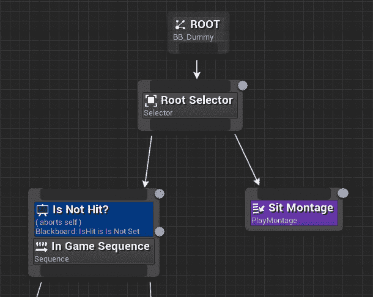

图 10.2 – 修改后的行为树

如您所见，行为树将继续按之前的方式工作，除非 AI 代理受到攻击；在这种情况下，角色将坐下并停止徘徊。

现在是时候改进 AI 控制器，以便管理即将到来的伤害。

## 增强**BaseDummyAIController**

任何木偶角色的 AI 控制器都需要处理任何伤害。为了简化，我们将在 AI 控制器内部而不是在角色内部处理所有这些；我们需要与黑板通信，而从控制器本身进行操作要简单得多和直接。

让我们从打开**BaseDummyAIController.h**文件并添加以下声明开始，用于处理伤害：

```py
UFUNCTION()
void OnPawnDamaged(AActor* DamagedActor, float Damage, const   UDamageType* DamageType, AController* InstigatedBy, AActor*     DamageCauser);
```

现在，打开**BaseDummyAIController.cpp**文件，在**OnPossess()**函数中，添加以下代码行：

```py
GetPawn()->OnTakeAnyDamage.AddDynamic(this, &ABaseDummyAIController::OnPawnDamaged);
```

接下来，添加以下实现：

```py
void ABaseDummyAIController::OnPawnDamaged(AActor* DamagedActor, float Damage, const UDamageType* DamageType,
    AController* InstigatedBy, AActor* DamageCauser)
{
    const auto BlackboardComp = GetBlackboardComponent();
    BlackboardComp->SetValueAsBool("IsHit", true);
    if (DamagedActor->Tags.Num() > 0)
    {
       DamagedActor->Tags[0] = "Untagged";
    }
}
```

当与 AI 控制器关联的 pawn 受到伤害时，将调用此函数；该函数检索 AI 控制器的黑板组件，并将**IsHit**键设置为**true**。然后，它将演员的第一个标签设置为**未标记**，这样它就不再是枪手木偶的有效目标。

在这个 AI 控制器设置完成后，现在是时候为安全摄像头创建一个蓝图了。

## 创建安全摄像头蓝图

现在，回到 Unreal Engine 编辑器，编译完成后，从**BaseSecurityCamAIController**类创建一个蓝图，命名为**AISecurityCamController**。您不需要添加行为树，因为所有逻辑都在控制器内部处理。

现在，从**BaseSecurityCam**类创建一个蓝图类，并将其命名为**BP_SecurityCam**。一旦创建完成，打开它，在**详细信息**面板中找到**AI 控制器类**属性，并将其值设置为**AISecurityCamController**。

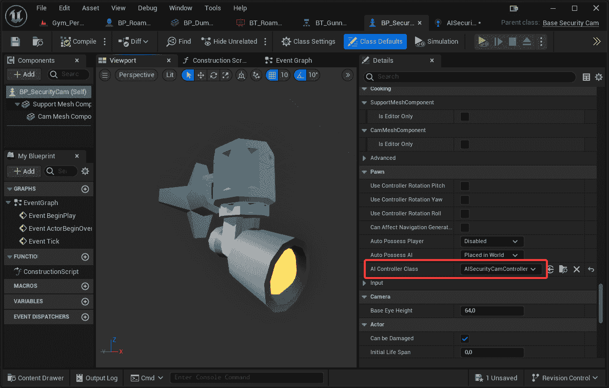

图 10.3 – 安全摄像头蓝图

我们已经收集了所有必要的元素来让我们的新健身房焕发生机，我们现在准备采取下一步并开始调试感知系统的过程。

## 创建健身房

我们现在将创建一个关卡来测试和调试一切。我们希望实现以下行为：

+   一个或多个 AI 代理将在关卡中移动

+   安全摄像头会尝试识别 AI 代理并将它们标记为可攻击的目标

+   枪手将等待 AI 代理被标记，以便射击它们

因此，让我们首先创建健身房：

1.  创建一个您选择的级别，从项目模板中提供的 Level Instances 和 Packed Level Actors 开始。

1.  添加一个 **NavMeshBoundsVolume** 角色以使其覆盖所有可通行区域。

1.  添加一些障碍物以使事情更有趣。

1.  向级别中添加一个 **BP_GunnerDummyCharacter** 实例。

1.  添加一个或多个 **BP_RoamerDummyCharacter** 实例。

1.  添加一些 **NS_Target** Niagara 角色作为路径查找系统的目标点；只需记住将它们标记为 **TargetPoint**。确保路径将 AI 代理带到枪手的视线中。

1.  向墙壁添加一个或多个 **BP_SecurityCam** 实例。最终结果应类似于 *图 10* *.4*：

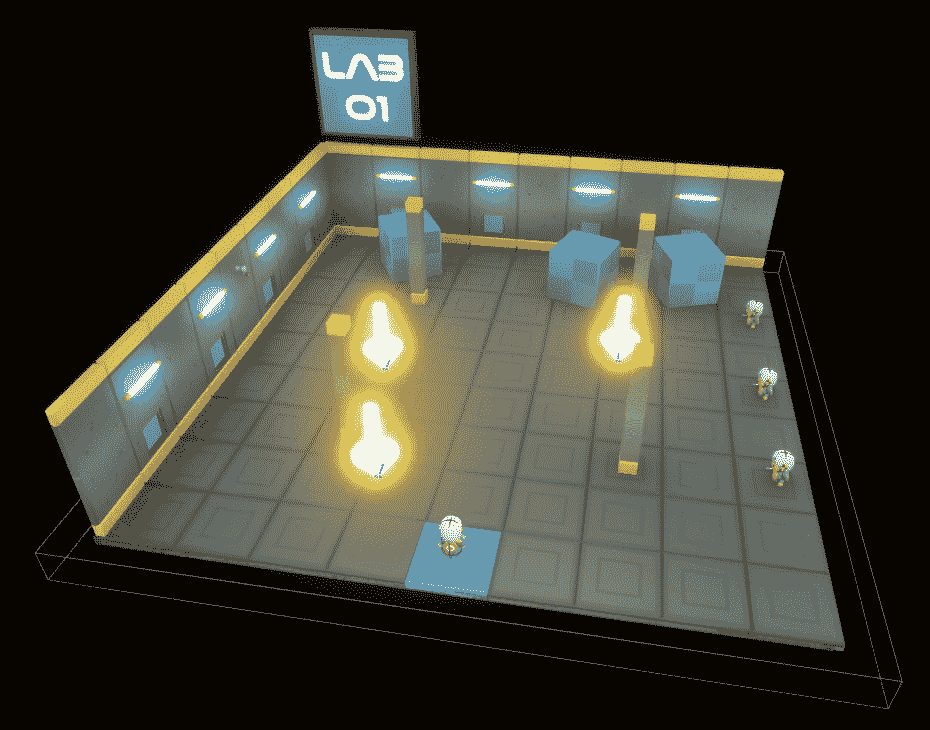

图 10.4 – 健身房

考虑到场景类型，枪手角色将向安全摄像头定位的目标射击，我决定通过添加模拟红外场景的后处理体积来使健身房更具吸引力，如图 *图 10* *.5* 所示：

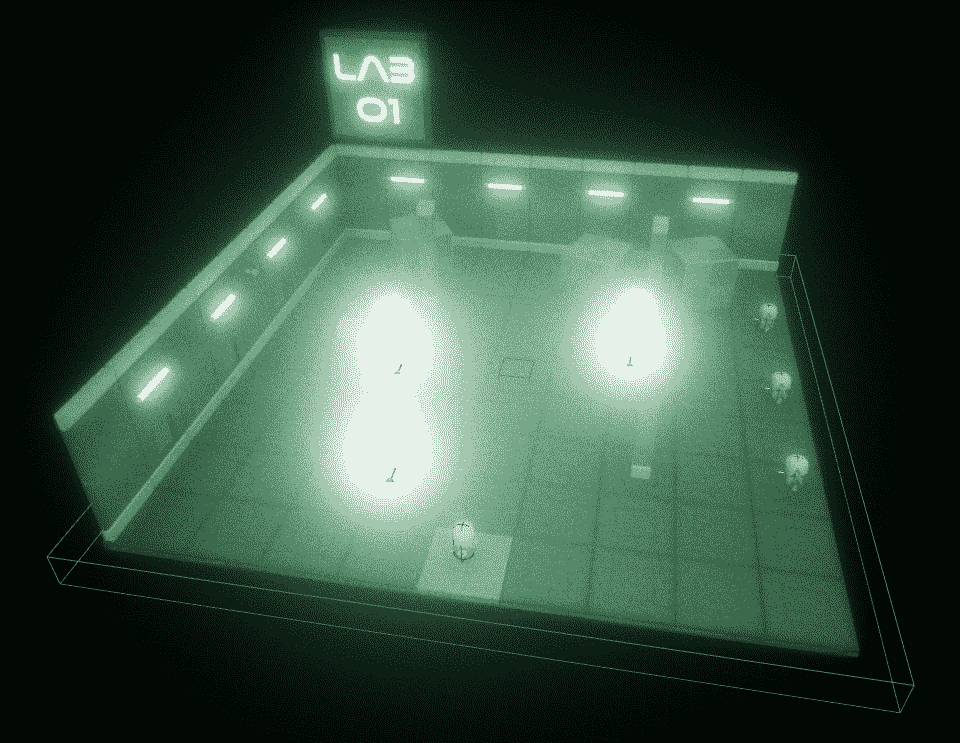

图 10.5 – 后处理体积的健身房

这显然不是强制性的，您可以自由设置您想要的后期处理环境。

现在健身房已经完成，是时候开始测试它并学习如何调试感知系统了。

## 启用感知调试

如果您开始模拟，您应该看到以下事情发生：

+   当漫游者四处游荡时，枪手由于没有意识到他们的存在，会欢呼

+   一旦某个漫游者进入摄像头的视线，枪手就会开始瞄准它

+   每当漫游者被击中时，它就会坐下并停止游荡

您可以调整安全摄像头的参数，使其对级别中发生的事情更加或更少关注。

在这一点上，您可能会好奇我们是如何确定代理是否在摄像头的视线中的。好吧，一旦启用调试工具，观察这一点实际上非常简单！

因此，让我们首先启用调试工具，如 *第六章* 中所述，*优化导航网格*。

注意

一旦开始模拟，您可能会想知道为什么安全摄像头顶部有一个小红图标，而所有虚拟木偶都有一个绿色图标，如图 *图 10* *.6* 所示。当启用 AI 调试工具时，如果 pawn 设置并运行了某些 AI 逻辑，则显示绿色图标；否则，图标将是红色。在我们的情况下，安全摄像头被一个专门的 AI 控制器控制，但没有行为树，所以图标将是红色。

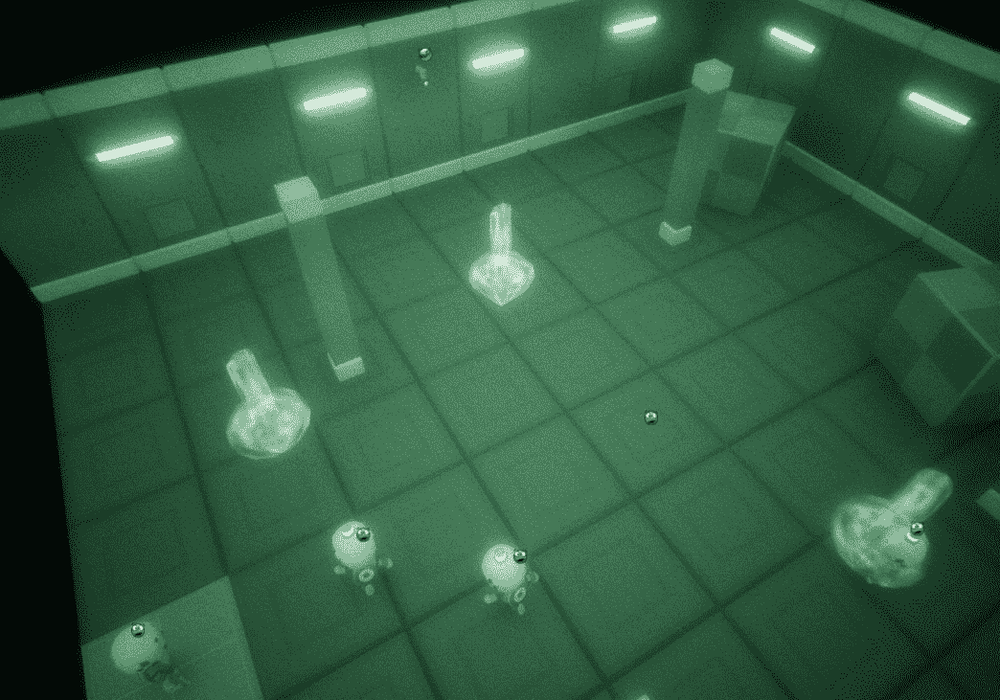

图 10.6 – AI 图标

现在，当模拟进行时，选择一个安全摄像头，并通过按下数字键盘上的 `4` 和 `5` 键分别启用 **感知** 和 **感知系统** 工具。你应该立即看到安全摄像头视感的可视化，如图 *图 10.7* 所示：

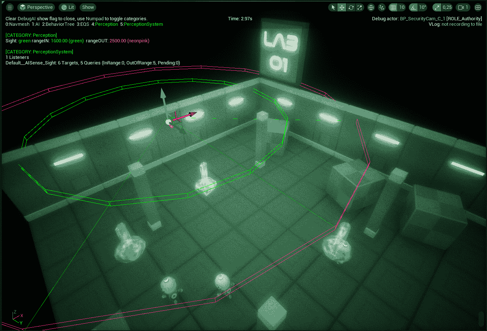

图 10.7 – 感知调试工具

显示将显示有关 AI 代理感知的一些重要信息，例如活动感官及其数据。此外，你还将看到代理感官的视觉表示。特别是，视感将显示以下内容：

+   一个代表代理视距范围的绿色圆形区域。

+   一个代表代理视距最大范围的粉红色圆形区域。一旦被发现的代理超出这个范围，视线接触将丢失。

+   一个代表代理周围视野的绿色角度。

一旦 AI 代理进入绿色圆圈，它将被感知系统检测到，你应该看到一条从安全摄像头开始到检测到的棋子结束的绿色线，如图 *图 10.8* 所示：

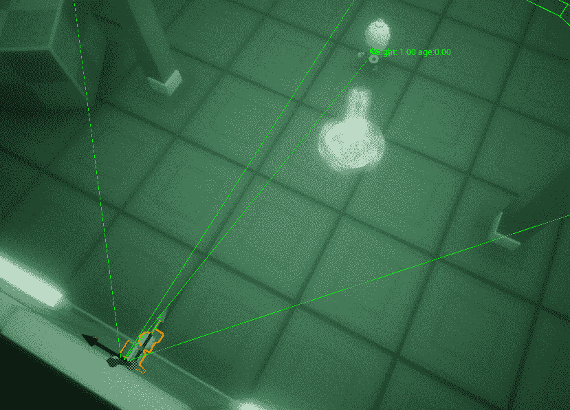

图 10.8 – 检测到的棋子

一个绿色的线框球体将显示检测点，当检测到的 AI 代理移动时，该点将更新。

一旦 AI 代理离开视线，检测点将停止跟随它，你应该看到球体旁边的 **年龄** 标签，更新其值；这是自检测丢失以来经过的时间。*图 10.9* 显示了这种情况：

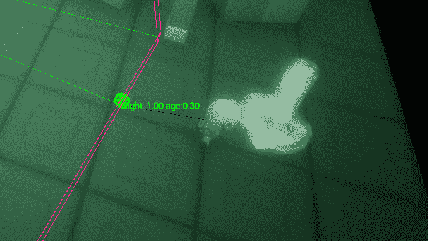

图 10.9 – 检测丢失

每个感官都有其显示信息的方式，因此我的建议是开始尝试每个感官，以了解如何调试和从调试工具中获取信息。

在本节中，我们创建了一个新的 gym 并测试了感知系统的工作方式；更重要的是，我向您展示了如何启用调试工具并更好地理解在运行时级别中发生的事情。在下一节中，我们将探讨感知刺激，以便使我们的级别更加精致和引人入胜。

# 创建感知刺激

在上一节中，我们使用了开箱即用的棋子功能，使其对视感可见。现在，我们将分析默认不可感知的演员；这意味着我们需要将 **AIPerceptionStimuliSourceComponent** 添加到演员中。更重要的是，我们将学习如何注册或注销这些刺激，以便使演员对感知系统可见或不可见。

## 创建目标演员

在本小节中，我们将创建一个新的角色，该角色将作为虚拟枪手木偶的目标，但有一个转折——这个角色将在关卡中产生一些干扰，并且不会被安全摄像头看到。一旦你知道如何从感知系统中注册和注销角色，实现这种功能相当简单。我们基本上创建了一个干扰设备，它将干扰——也就是说，它将对枪手视觉感知不可见。

为了保持简单，我将创建一个蓝图类；当处理刺激时，通常更方便直接从蓝图配置设置，而不是使用 C++类。通过利用蓝图，我们可以轻松调整和微调刺激的各个方面，使整个过程更加灵活和易于访问。这种方法允许更快地进行迭代和修改，最终导致更顺畅和更高效的流程。

要创建我们的干扰器，打开**蓝图**文件夹，创建一个从**Actor**扩展的新蓝图类，并将其命名为**BP_Scrambler**。一旦蓝图打开，按照以下步骤操作：

1.  在**组件**面板中，添加一个静态网格组件。

1.  在**详细信息**面板中，将**静态网格**属性设置为**SM_RoboGun_BaseRemote**，将**缩放**属性设置为**(3.0, 3.0, 3.0)**。

1.  添加一个**AIPerceptionStimuliSource**组件。

1.  在**详细信息**面板中，找到**注册为感官源**属性，通过点击**+**按钮添加新元素，并将值设置为**AISense_Sight**。

1.  保持**自动注册为源**属性未选中

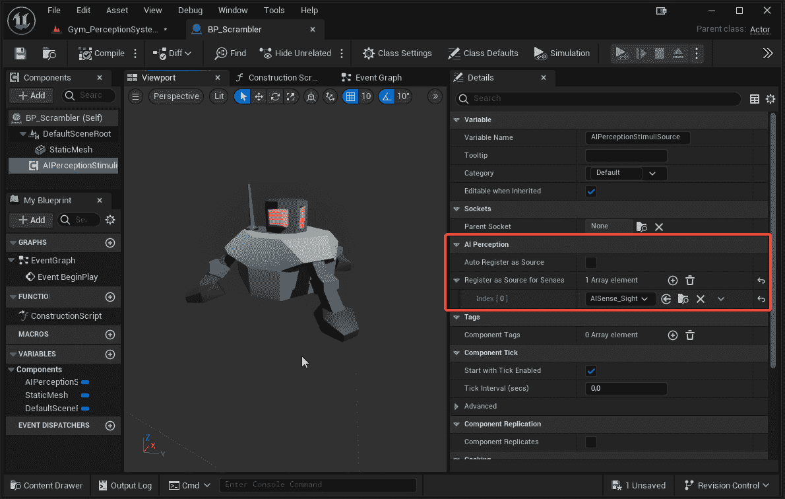

图 10.10 – 刺激源

现在，打开此蓝图的事件图，并执行以下操作：

1.  从**Event Begin Play**节点的输出执行引脚，添加一个**Delay**节点。

1.  从**Delay**节点的**完成**引脚，添加一个**注册感官**节点；这将自动将**AIPerception Stimuli Source**引用添加到**目标**输入引脚。

1.  从**Delay**节点的**持续时间**引脚，添加一个**随机浮点数在范围内**节点，将其**最小值**和**最大值**分别设置为**4.0**和**6.0**。

1.  从**感官类**输入引脚的下拉菜单中选择**AISense_Sight**。最终的图表应该看起来像*图 10.11*中描述的那样：

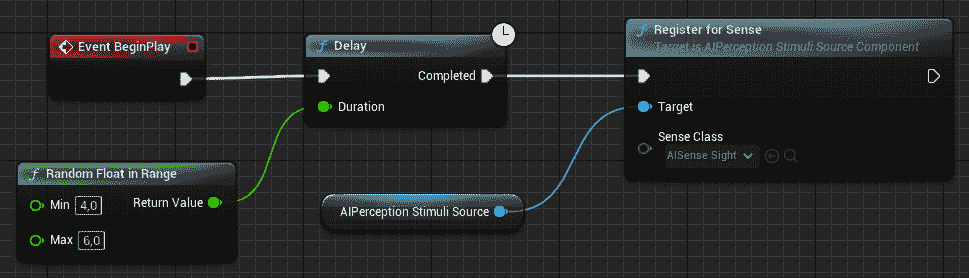

图 10.11 – 事件图

此图表将在随机间隔后简单地记录该角色的视觉感知，使该角色本身在关卡中的感知系统中可见。

注意

如果你需要注销刺激源，相应的蓝图节点是**从感官注销**。

让我们在一个全新的健身房中测试这个功能。

## 测试健身房

要创建测试关卡，按照以下步骤操作：

1.  创建一个你选择的关卡，从我在项目模板中提供的 Level Instances 和 Packed Level Actors 开始。

1.  添加一些障碍物以使事情更有趣。

1.  在关卡中添加 **BP_GunnerDummyCharacter**。

1.  添加一个 **BP_Scrambler** 实例，以便枪手木偶可以对其射击。

1.  在墙上添加一个 **BP_SecurityCam** 实例，使其位于混乱角力场的视线范围内。最终结果应类似于 *图 10.12*：

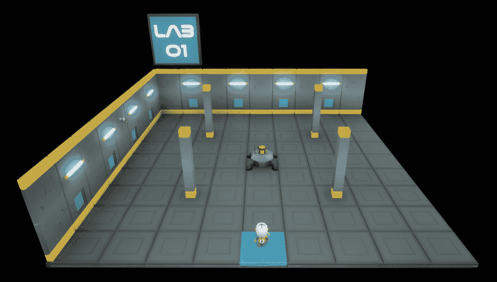

图 10.12 – 混乱角力场

通过启动模拟，您可以看到混乱角力场在随机间隔后才会被安全摄像头发现，在此之前它将不被注意。之后，混乱角力场将被标记为可行的目标，枪手将对其射击。尝试启用调试工具以检查感知系统发生了什么。

在本节的最后部分，我介绍了如何使任何演员可被感知系统检测到。通过遵循提供的步骤和指南，您可以无缝地将感知系统集成到您的项目中，使您的演员能够在虚拟环境中被准确识别和交互。

# 摘要

在本章中，您学习了 Unreal Engine 感知系统的基本知识。首先，我们展示了您可以为您的 AI 代理添加感官的主要元素；之后，您构建了一个具有视觉感官的 pawn，它可以检测到关卡周围的移动角色。然后，您学习了如何在运行时调试活跃的感官。最后，您向一个演员添加了一个刺激源，以便使其可被感知系统本身检测到。所有这些都为使用 Unreal Engine AI 框架创建沉浸式和动态体验打开了无限可能。

在下一章中，我将揭示一种从环境中收集数据的新方法；准备好吧，因为这个前沿特性仍处于实验阶段。但不用担心，我的朋友，因为这是一种值得获取的知识！
