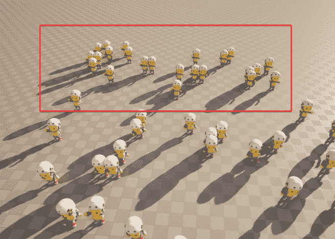

# 第十三章：使用 Mass 实现面向数据的计算

**Mass** 框架是 Unreal Engine 中相对较新的系统，允许开发者高效地管理和操作游戏环境中的大量对象。它提供了处理这些对象、优化性能以及实现 AI 和游戏机制行为的工具和功能。Mass 框架正成为创建需要大量 NPC 的游戏关卡并保持项目性能水平的必备工具。利用 Mass 框架对于游戏开发者来说至关重要，他们需要在保持最佳性能的同时，创建沉浸式和引人入胜的游戏体验。

在本章中，我们将介绍 Mass 的基础知识，并展示如何创建自己的 Mass 系统。特别是，我们将涵盖以下主题：

+   介绍 Mass 框架

+   设置 Mass

+   创建蓝图

# 技术要求

要跟随本章介绍的主题，您应该已经完成了前面的章节，并理解了它们的内容。

此外，如果您希望从本书的配套仓库开始编写代码，您可以下载项目仓库中提供的 **.zip** 项目文件：[`github.com/PacktPublishing/Artificial-Intelligence-in-Unreal-Engine-5`](https://github.com/PacktPublishing/Artificial-Intelligence-in-Unreal-Engine-5)

要下载最后一章末尾的文件，请点击 **Unreal Agility Arena –** **第十二章** **-** **末尾** 链接。

# 介绍 Mass 框架

Mass 框架是一个面向数据系统的框架，旨在管理大量实体上的高性能计算。正如您已经知道的，在 Unreal Engine 中，传统的做法是使用演员和组件来创建关卡对象。这种方法在演员内部组合逻辑方面提供了极大的灵活性，但随着项目的扩大，它通常会导致数据不一致，从而引发性能问题。例如，考虑一个大型在线多人游戏，其中不同的 AI 代理可以根据复杂的逻辑执行各种动作。最初，这种灵活性允许开发者轻松实现诸如角色交互和物品交易等功能，同时受到的最小限制。然而，随着更多角色和交互的添加，数据更新在网络中的不一致性可能会出现。

与此同时，Mass 采用面向数据的设计框架，提供了一种替代的数据存储方法，将数据与处理逻辑分离。这允许轻松管理关卡中的大量 – 或甚至巨大的 – 实体数量。

注意

在本章中，我经常会使用术语 **细节级别**（**LOD**）。如果您不熟悉这个术语，它是在游戏开发中一个关键概念，指的是根据它们与摄像机的距离来管理 3D 模型复杂性的技术。LOD 的主要目标是优化渲染性能，同时保持视觉保真度。当玩家靠近静态网格时，引擎使用该网格的高细节版本以确保其看起来清晰和详细。然而，当玩家远离时，引擎可以切换到更少细节的网格版本，这些版本需要更少的资源来渲染。

在接下来的小节中，我将为您快速介绍构成质量框架的主要定义和元素。

## 质量框架插件

质量框架依赖于四个主要插件：

+   **MassEntity**：使质量框架工作所需的核心插件

+   **MassGameplay**：此插件管理世界内的交互、移动、对象可视化、LOD 等情况

+   **MassAI**：此插件管理状态树、世界导航和规避等功能

+   **MassCrowd**：此插件专门用于处理人群，并拥有自己的专用可视化和导航系统

注意

在撰写本书时，**MassEntity** 处于测试版，被认为是生产就绪的。另一方面，**MassGameplay**、**MassAI** 和 **MassCrowd** 仍然是实验性的；这意味着您应该小心处理它们，因为随着时间的推移，事情可能会发生变化。

## 理解质量元素

**MassEntity** 中的主要数据结构是 **片段**——用于计算的数据的原子单元，例如可以表示变换、速度或 LOD 索引。片段可以组织成集合，其中特定的集合实例与一个 ID 相关联，形成一个 **实体**。

创建实体类似于面向对象编程中的类实例化。然而，实体是通过片段组合构建的，而不是严格定义一个类及其功能。这些组合组件在运行时是可修改的。

注意

片段和实体是仅包含数据的元素，不包含任何逻辑。

具有相同组成的实体集合称为 **架构**；每个架构都包含以特定方式排列的各种类型的片段。例如，一个架构可能具有具有变换和速度的片段组合，这表明与该架构相关联的所有实体共享相同的片段结构。

架构内的实体被分组到内存 **块** 中，优化了从内存中检索属于相应架构的实体的片段，以增强性能。

**ChunkFragment** 是连接到块而不是实体的片段，用于存储在处理中使用的特定于块的数据。ChunkFragments 是实体组成的一个组成部分。

**标签**是一个不包含任何数据的简单片段；标签包含在实体的组成中。

**处理器**是无状态的类，为片段提供处理逻辑；通过使用**实体查询**，它们指定它们操作所需的片段类型。处理器可以添加或删除实体的片段或标签，从而有效地改变组成。

提供特定功能的片段和处理器被称为**特性**；可以将多个特性的实例合并到实体中。每个特性的实例负责集成和设置片段，以确保实体显示与该特性相关的行为。典型的特性包括状态树管理、规避或调试可视化。

由于**MassGameplay**可能是 Mass 插件中最重要的一项，我们将重点关注它。让我们深入了解其主要功能。

## MassGameplay

如前所述，组成 Mass 框架的插件之一是**MassGameplay**插件，它直接源自**MassEntity**插件。**MassGameplay**插件包含一系列强大的子系统，如下所示：

+   **质量表示**：此子系统负责管理实体的不同视觉方面。

+   **质量生成器**：此子系统管理实体的生成过程。

+   **质量 LOD**：此子系统管理每个质量实体的 LOD。

+   **质量状态树**：此子系统将允许您在**MassEntity**中集成状态树。

+   **质量信号**：此子系统以类似事件分派的方式管理实体之间的消息。

+   **质量移动**：此子系统管理 Mass 代理的移动。

+   **质量智能对象**：此系统负责将智能对象（我将在下一章中介绍的功能）集成到**MassEntity**中。

+   **质量复制**：此子系统负责在多人游戏中通过网络复制实体；在撰写本书时，它仍处于实验阶段。

随着所有这些子系统的可用性，Mass 已成为一个极其强大的工具，可以有效地管理大量实体。

在本节中，我们介绍了 Mass 框架及其主要元素。在下一节中，我们将使用 Mass 创建我们的第一个关卡，利用其一些主要功能。

# 设置 Mass

故事还在继续……

马库斯博士和维多利亚教授在深入研究他们关于人工智能的开创性研究时，发现自己面临着一个新的挑战；实验室现在充满了大量的人工智能木偶，每个木偶都设计用来模仿人类的行为和反应。然而，管理和同步这些木偶证明是一项艰巨的任务。

*为了克服这个障碍，马克斯博士和维多利亚教授首先开发了一套复杂的算法，这些算法将作为管理木偶的核心系统。这个系统将使他们能够同步和协调 AI 木偶的运动和动作，使它们无缝协作。*

在本节中，我们将展示使用 Mass 所需的插件以及如何启用它们。此外，我们还将创建一个新的关卡以初步了解生成系统。

## 启用插件

为了使 Mass 完全功能化，您需要启用以下插件：

+   **MassEntity**

+   **MassGameplay**

+   **MassAI**

+   **MassCrowd**

+   **ZoneGraph**

+   **StateTree**

**ZoneGraph**和**StateTree**不是 Mass 框架的一部分，但需要包含在内，因为代码中存在一些依赖关系。

您已经熟悉**插件**窗口，所以打开它并启用上述插件。您将收到有关您将使用的实验性功能的警告，然后您将被提示重新加载 Unreal Engine 编辑器以注册插件。

一旦此过程完成，您就可以开始使用 Mass 了。

## 创建 MassEntityConfigAsset

在 Mass 中，配置实体是通过 Unreal Engine **数据资产**实现的。

如果您不熟悉数据资产，它是一种以结构化格式存储数据的资产类型。它通常用于存储各种类型的数据，例如配置设置、游戏参数、本地化文本等。

在 Mass 中，您将使用**MassEntityConfigAsset**数据类型，该类型将存储特性和片段信息。作为一个起点，我们将创建一个配置资产，它将使我们能够在关卡中调试对象生成位置的信息。这将使我们能够可视化我们正在开发的系统的当前状态，并在运行时进行分析。

要开始，在**内容抽屉**中，创建一个名为**DataAssets**的新文件夹并打开它。然后，执行以下步骤：

1.  右键点击**内容抽屉**并选择**杂项** | **数据资产**；为新创建的资产命名为**ME_DebugVisualizationConfig**。

1.  在**配置**部分，您应该看到一个**特性**数组；点击**+**按钮在数组中创建一个新项。

1.  从数组项下拉菜单中选择**调试可视化**。

1.  通过点击箭头展开数组项。

1.  展开**调试形状**属性。

1.  在**网格**属性中，搜索**Dummy_Base**并选择它，如图*图 13* *.1* 所示：

图 13.1 – ME_DebugVisualizationConfig

我们在这里所做的是相当简单的。我们创建了一个**MassEntity**配置文件，其中包含一个负责在关卡中对象生成位置显示调试网格的单个特性。

注意

如果你需要检查一切是否正常，你可以点击位于**数据资产**窗口中的**验证实体配置**按钮。你应该会收到一条消息，表明此资产没有错误。

我们现在将进行对象生成实现。

## 创建一个生成 EQS

为了利用 Mass Spawner 子系统，我们需要一个 EQS，它将返回一组位置，告诉子系统在哪里生成对象。如果你需要关于 EQS 的复习，我的建议是查看*第十一章*，*理解环境查询系统*，然后在你准备好时回到这一章。我们现在将创建一个环境查询，它将在网格上生成一些点。为了做到这一点，打开**AI**文件夹并按照以下步骤操作：

1.  右键单击并选择**人工智能** | **环境查询**。将新创建的资产命名为**EQS_SpawnEntitiesOnGrid**。双击资产以打开它。

1.  从**根节点**开始，点击并拖动以从**生成器**类别创建一个**点：网格**节点。

1.  点击节点，在**详细信息**面板中，执行以下操作：

    +   将**GridHalfSize**属性设置为**1500.0**

    +   在**投影数据**部分，将**轨迹模式**属性设置为**几何** **通过通道**

图 13.2 – 环境查询

我们刚刚实现的场景查询将创建一个 3,000 x 3,000 大小的网格——因为我们已将**GridHalfSize**属性设置为**1500.0**单位——并且将使用**通过通道的几何**轨迹方法来设置每个项目的位置。

注意

如果你不知道轨迹是什么以及虚幻引擎如何使用它们，我的建议是浏览官方文档，通过访问此页面来查看：[`dev.epicgames.com/documentation/en-us/unreal-engine/traces-in-unreal-engine---overview`](https://dev.epicgames.com/documentation/en-us/unreal-engine/traces-in-unreal-engine---overview)。

我们现在准备好在关卡中使用 Mass Spawner 子系统。

## 创建健身房

为了测试生成功能，我们将创建一个简单的健身房。要开始，创建一个你选择的关卡，从我在项目模板中提供的 Level Instances 和 Packed Level Actors 开始。如果你愿意，可以添加一些障碍物；我的关卡如*图 13* *.3* 所示：

图 13.3 – 健身房

现在，按照以下步骤操作：

1.  在**编辑器**工具栏上，点击**快速添加到项目**按钮，搜索**Mass Spawner**。选择它以在关卡中添加其实例。

1.  将**MassSpawner**对象放置在关卡中心。

1.  现在你已经将**MassSpawner**对象放置在关卡中，请选择它。在**详细信息**面板中，执行以下操作：

    +   将**计数**属性设置为**20**

    +   点击**实体类型**属性上的**+**按钮，向数组中添加一个项目

    +   展开标记为**Index[0]**的项目，并将**实体配置**属性设置为**ME_DebugVisualizationConfig**。

图 13.4 – 条目类型

我们刚刚设置了**MassSpawner**属性，使其生成 20 个实体，这些实体将使用我们之前创建的数据资产作为配置资产。现在我们需要告诉**MassSpawner**属性在哪里生成它们。为此，请按照以下步骤操作：

1.  在**详细信息**面板中，向**生成数据生成器**数组添加一个元素，并展开**Index[0]**元素。

1.  将**生成器实例**属性设置为**EQS** **SpawnPoints 生成器**。

1.  展开**生成器实例**及其**查询**子项。

1.  将**查询模板**设置为**EQS_SpawnEntitiesOnGrid**。

图 13.5 – 生成点生成器

在前面的步骤中，我们已经将生成器逻辑设置为我们之前创建的实体查询。现在是时候测试健身房了。

## 测试健身房

要测试健身房，你只需要模拟或玩游戏；你将看到 20 个调试模型在一个网格上生成，如图*图 13* *.6* 所示：

图 13.6 – 健身房

请注意，模型将被正确地放置在对象上；这是因为我们在环境查询中使用了**按通道几何**跟踪模式。

通过启用调试工具，你将获得有关级别内部发生情况的一些有见地的信息，以及大量选项，如图*图 13* *.7* 所示：

图 13.7 – 调试工具

我强烈建议你探索各种调试工具选项，因为它们可以极大地提高你识别和解决游戏问题的效率。例如，*图 13* *.8* 显示了通过使用*Shift* + `A`键组合启用的架构信息：

图 13.8 – 架构信息

在本节中，我们瞥见了使用 Mass 可以创建的内容；特别是，我们看到了如何通过**MassSpawner**子系统创建出生区域。在下一节中，我们将通过创建一组蓝图而不是一些调试模型来更详细地介绍。

# 生成蓝图

在本节中，我们将通过**MassSpawner**子系统进一步深入，因为我们将生成一组蓝图实例而不是简单地显示调试网格；这将使我们从简单的调试健身房过渡到真实案例环境。此外，我们将学习如何处理生成实体的 LOD。

让我们想象一下，我们想要创建一个音乐会，观众会自动生成，并且由 Mass 整体管理。我们将使用 Mass 框架创建这样的场景。

## 创建观众蓝图

作为第一步，我们将创建一个蓝图，它将作为一场想象中的音乐会的观众；实体将欢呼、坐下或简单地保持静止。此外，我们还将使用质量 LOD 管理系统。我们不会只创建一个蓝图，而是创建两个：一个将在靠近相机时由管理系统激活，另一个将在远离相机时激活。这将使我们能够在靠近相机时管理和显示更复杂的实体，而在远离相机时退回到较简单的实体。为了演示，我们将使用一个将保持静止且不会动画化的蓝图——当远离相机时可视化的那个，以及一个将显示随机动画的蓝图。

让我们从第一个蓝图开始，按照以下步骤操作：

1.  创建一个新的蓝图类，从**BaseDummyCharacter**继承，命名为**BP_AudienceLow**。

1.  打开蓝图，在**动画模式**属性中，选择**使用****动画资产**。

1.  取消选择**Looping**和**Playing**复选框。

1.  将**初始位置**属性设置为**0.4**。

一旦在级别中可视化，这个角色将只是站立并展示欢呼的姿态。

第二个蓝图将稍微复杂一些。要实现它，请按照以下步骤操作：

1.  创建一个新的蓝图类，从**BaseDummyCharacter**继承，命名为**BP_AudienceHigh**。

1.  创建一个新的**Anim Montage Object Reference**类型变量，命名为**MontageList**，并将其设置为数组。

1.  创建两个**浮点型**变量，分别命名为**MinInterval**和**MaxInterval**。

1.  编译蓝图以暴露**默认值**属性，并将**MinInterval**值设置为**3.0**，**MaxInterval**设置为**6.0**。

1.  在**MontageList** **默认值**中添加三个项目，分别设置为**AM_Cheer**、**AM_Interact**和**AM_Sit**。

1.  在事件图中，将**Event Begin Play**执行引脚连接到一个**Delay**节点。

1.  将**Delay**节点的**Duration**引脚连接到一个**Random Float in Range**节点。

1.  从**变量**部分，拖动一个**MinInterval**获取节点并将其连接到**Random Float in Range**节点的**Min**引脚。

1.  从**变量**部分，拖动一个**MaxInterval**获取节点并将其连接到**Random Float in Range**节点的**Max**引脚。这部分图表在*图 13.8*中描述：

图 13.9 – 延迟逻辑

这部分图表并没有什么特别之处，只是给代码逻辑添加了一个随机延迟。让我们继续编写代码，按照以下步骤操作：

1.  将**Delay**节点的输出执行引脚连接到一个**Play Montage**节点。

1.  从**组件**面板，将一个**网格**引用拖动到事件图中，并将其连接到**Play Montage**节点的**In Skeletal Mesh Component**引脚。

1.  在事件图中拖动一个**MontageList**获取器，并将其引脚连接到**Random Array** **Item**节点。

1.  将**Random**节点的**Out Item**引脚连接到**Play Montage**节点的**Montage to Play**引脚。此部分图表显示在*图 13* *.10*中：

图 13.10 – 播放蒙太奇逻辑

在这里我们正在做一件相当直接的事情；我们从数组中获取一个随机的动画蒙太奇，然后播放它。

最后要做的事情是创建一个无限循环，在延迟后持续播放动画蒙太奇。为此，请按照以下步骤操作：

1.  将**Play Montage**节点的**On Completed**输出执行引脚连接到**Delay**节点的输入执行引脚。

1.  添加几个重定向节点，以便使图表更清晰。代码显示在*图 13* *.11*中：

图 13.11 – 循环

我们的角色现在已准备就绪，一旦在级别中实例化，将不断播放随机动画。我们现在将创建放置在健身房中的**MassSpawner**的**MassEntityConfigAsset**。

## 创建一个 MassEntityConfigAsset

我们将要创建的**MassEntityConfigAsset**将比之前的更复杂。在这种情况下，我们需要在级别中生成角色，并且我们需要根据与摄像机的距离处理实例化内容。

要开始，打开**DataAssets**文件夹，创建一个新的**Mass Entity Config Asset**类型的**Data Asset**，并将其命名为**ME_AudienceConfig**。然后，打开它并执行以下步骤：

1.  在**特性**部分，通过点击**+**按钮三次添加三个数组元素。

1.  从每个项目的下拉菜单中，分别选择**Mass Stationary Distance Visualization Trait**、**Assorted Fragments**和**LODCollector**。

图 13.12 – 观众配置数据资产

我们现在将检查它们中的每一个，以获取它们如何工作的信息。

### 配置大众站距可视化特性

此特性负责在世界上可视化实体，并且需要正确设置，以便正确显示演员在级别中。因此，请按照以下步骤操作：

1.  展开特性项以显示所有设置。

1.  将**High Res Template Actor**属性设置为**BP_AudienceHigh**。

1.  将**Low Res Template Actor**属性设置为**BP_AudienceLow**。

1.  展开参数部分，将**High**和**Medium**属性设置为**High Res Spawned Actor**，将**Low**属性设置为**Low Res** **Spawned Actor**。

1.  检查**Keep Actor Extra** **Frame**属性。

图 13.13 – 大众站距可视化设置

如您在此处所见，我们根据之前创建的蓝图定义了一个高分辨率和低分辨率模板。然后我们使用这些定义来设置实体的 LOD 表示。检查**保留演员额外帧**标志将有助于在不同 LOD 之间切换时的渲染。

### 配置各种片段

**各种片段**特性使您能够定义一个可能由其他特性所需的片段数组。为了实现这一点，打开**各种片段**特性部分，然后是**片段**部分，并执行以下操作：

1.  通过点击**+**按钮两次添加两个片段到数组中。

1.  将列表的第一项设置为**变换片段**，第二项设置为**Mass** **演员片段**。

图 13.14 – 各种片段设置

**变换** **片段**负责存储实体世界变换，而**Mass 演员片段**将保留一个指向将被可视化特性使用的演员的指针。

### 配置 LODCollector

实体配置需要**LODCollector**特性来促进 LOD 级别之间的调整。**LODCollector**处理器通过考虑实体与观众的距离及其与摄像机视锥体的关系来评估每个实体的适当 LOD。

这不需要任何配置，所以您可以保持原样。

在数据资产正确配置后，我们可以继续设置我们的系统。

## 启用自动处理器注册

在创建和测试健身房之前，我们还需要再走一步。在撰写本书时，Mass 的当前版本需要一些属性在 Mass 设置中启用**自动与处理阶段注册**标志；这是由于 Mass 仍然处于测试版状态，尚未是最终版本。不设置此标志将导致 Mass 实体在游戏中不可见。这是由于与即将解决的**MassCrowd**插件存在一些冲突。

要解决这个问题，从主菜单中选择**编辑** | **项目设置**并打开**引擎** | **Mass**部分。之后，执行以下步骤：

1.  展开**模块** **设置**部分。

1.  展开**Mass** **实体**部分。

1.  展开**处理器** **CDOs**部分。

1.  在处理器数组中搜索**MassLODCollectorProcessor**、**MassRepresentationProcessor**和**MassVisualizationLODProcessor**。展开处理器并检查每个的**自动与处理阶段注册**标志。

图 13.15 – 与处理器阶段自动注册设置

启用这些设置后，我们可以继续创建测试健身房。

## 创建健身房

由于我们将与许多演员一起工作，我认为带我们心爱的木偶到户外呼吸新鲜空气会很有趣！这就是为什么，我们不会使用通常的封闭健身房，而会设置一个露天环境。让我们从以下步骤开始：

1.  通过使用**打开** **世界**模板创建一个新的关卡。

1.  在关卡中添加一个**MassSpawner**演员并选择它。

1.  在**设置**面板中，将**计数**属性设置为**50**。

1.  在**实体类型**数组中添加一个新项目并展开它。

1.  将**实体配置**属性设置为**ME_AudienceConfig**。

1.  在**生成数据生成器**数组中添加一个新项目并展开它。

1.  将**生成器实例**属性设置为**EQS SpawnPoints Generator**并展开其**查询**部分。

1.  展开**EQSRequest**部分，并将**查询模板**属性设置为**EQS_SpawnEntitiesOnGrid**。

图 13.16 – 大量生成器详细信息面板

模拟关卡，您应该得到...一些奇怪的东西！

图 13.17 – 错误位置

看起来所有角色都位于地板一半以下。这是因为角色的**胶囊**组件被计算为中心在局部坐标**(0.0, 0.0, 0.0)**。修复这个问题很简单，您只需要调整环境查询的单个属性。

让我们从复制**EQS_SpawnEntitiesOnGrid**并将其命名为**EQS_SpawnEntitiesOnGrid_ZOffset**开始。然后，执行以下步骤：

1.  打开新创建的资产并选择**SimpleGrid**节点。

1.  在**详细信息**面板中，展开**投影数据**部分，并将**投影后垂直偏移**设置为**120.0**。

1.  在您的关卡中，选择**MassSpawner**演员并将**查询模板**更改为**EQS_SpawnEntitiesOnGrid_ZOffset**。

如果您现在测试关卡，您的角色应该被正确定位，如图*图 13* *.18* 所示：

图 13.18 – 正确位置

此外，您应该注意到靠近摄像机的角色将会被动画化，而那些在远处的角色将保持在欢呼的位置，如图*图 13* *.19* 所示：

图 13.19 – 非动画角色

这是因为我们在**质量静止距离可视化**特性中定义的配置设置导致的。我强烈建议您重新打开**ME_AudienceConfig**资产，并调整**LODDistance**值——**高**、**中**、**低**和**关闭**——以查看您的实体行为。

在本节中，我向您展示了构成质量框架的一些更高级的特性。我们创建了一个新的配置数据资产，其任务是管理生成的实体的 LOD（细节层次）。然后我们创建了一个专门的 Mass Spawner，它通过利用环境查询在级别中创建大量演员。

# 摘要

在本章中，我们向您介绍了实验性但功能强大的 Mass 框架。从基础知识开始，我们介绍了构成整个系统的插件。之后，我们创建了一些利用 Mass 的工作示例：一个简单的调试场景用于检查 Mass Spawner，以及一个更复杂的示例，以深入了解如何将特性组合起来处理大量实体。

在需要模拟人群、物理交互和动态实体管理的场景中，使用此框架特别有益。因此，如果您的游戏需要这些类型的功能，您将极大地从使用 Mass 中受益。

在下一章——也是最后一章中，我们将向您展示另一个功能，它将提供一种处理和管理 AI 角色和玩家各种活动和交互的方法。准备好进行一次引人入胜的探索，因为事情即将变得更加有趣！
