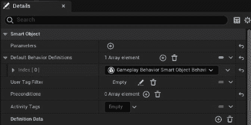
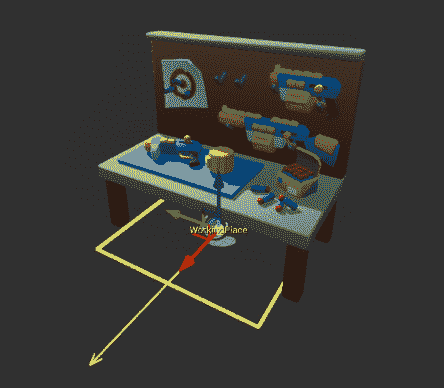
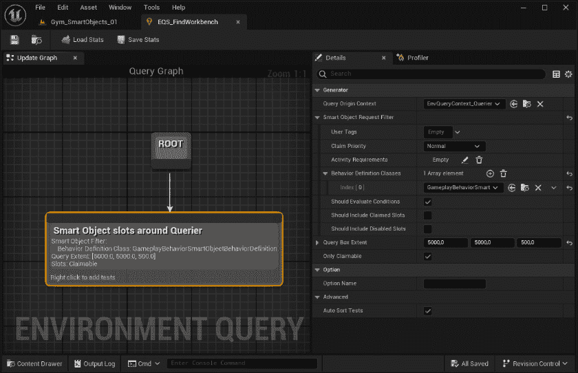

# 第十四章：使用智能对象实现可交互元素

在虚幻引擎中，**智能对象**代表一个高级系统，旨在帮助开发者创建游戏中的交互式和上下文感知元素。智能对象旨在通过允许角色（无论是玩家角色还是 AI 代理）通过预留系统以更有意义的方式与环境交互来增强游戏玩法。学习如何使用智能对象将使你，作为开发者，能够创建动态和交互式环境，从而增强游戏玩法并改善 AI 行为，以提供更沉浸式的玩家体验。

在本章中，你将学习智能对象交互的基础知识。我们将参观一个简单的例子，展示如何使 AI 代理与智能对象交互。

在本章中，我们将涵盖以下主题：

+   介绍智能对象

+   创建智能对象定义数据资产

+   实现智能对象逻辑

+   与智能对象交互

# 技术要求

要跟随本章介绍的主题，你应该已经完成了*第三部分*，*使用决策制作*的所有章节，并理解了它们的内容。特别是，我们将使用直到*第十一章* ，*理解环境* *查询系统*中实现的部分代码。

此外，如果你希望从本书的配套仓库开始编写代码，你可以下载项目仓库中提供的**.zip**项目文件：[`github.com/PacktPublishing/Artificial-Intelligence-in-Unreal-Engine-5`](https://github.com/PacktPublishing/Artificial-Intelligence-in-Unreal-Engine-5)

要下载最后一章末尾的文件，请点击**Unreal Agility Arena –** **第十一章** **-** **末尾**链接。

# 介绍智能对象

智能对象是在级别内放置的元素，AI 代理和玩家都可以与之交互。这些对象不包含任何执行逻辑，但持有所有必要的交互信息；此外，它们可以通过不同的方法在运行时查询，例如环境查询。

智能对象代表一个级别内的一组活动，可以通过预留系统访问；如果一个智能对象槽位被 AI 代理占用，则其他代理将无法使用它，直到它被释放。

## 介绍智能对象框架的主要元素

与所有虚幻引擎插件一样，智能对象被组织成一系列元素，每个元素负责特定任务。

**智能对象子系统**负责监控级别内所有可用的智能对象，并在启用智能对象插件时自动在世界上实例化。智能对象会自动注册到子系统中，以便于访问和跟踪。

**智能对象定义**是一个数据资产，它持有在多个智能对象运行时实例之间共享的不变数据。它包含过滤信息，例如用户所需的标签、活动标签、对象激活标签以及用于与智能对象交互的默认行为定义集。此外，智能对象定义还包含一个或多个**槽位**，玩家或 AI 代理可以声明使用该特定智能对象。每个槽位都可以相对于其父对象定位，允许你为同一演员定义不同位置的不同槽位。

要将一个演员指定为智能对象，你将使用**SmartObjectComponent**；这个组件将引用一个智能对象定义资产。

智能对象定义可以包含一个或多个**活动标签**来描述对象。它们还可以具有一个**标签查询**，它由一系列期望的标签组成。这个标签查询作为一个表达式来评估请求访问智能对象的用户是否有权与之交互。例如，一个智能对象定义可能需要一个**充电插头**标签，只有具有该确切标签的 AI 代理才能使用。

现在你已经对智能对象框架有了快速的了解，你就可以开始你的项目，并开始创建你自己的智能对象了。

从下一节开始，我们将向您介绍在虚幻引擎中使用智能对象的基础知识；我们不会涵盖框架的所有方面，因为它可以用多种方式使用——独立使用，或与行为树、状态树以及甚至与 Mass 一起使用。然而，到本章结束时，你应该对你可以用它实现什么有一个清晰的理解。

是时候卷起袖子，深入代码了！

# 创建智能对象定义数据资产

*马克斯博士靠在椅背上，满意地微笑着，环顾着杂乱的实验室。工具散落在各处，机器的微弱嗡嗡声充满了空气。在房间另一边，维克托利亚教授弯腰在一具他们的 AI 假人木偶上，她的眉头紧锁，全神贯注。*

*随着他们沉浸在工作中，升级木偶的想法逐渐成形。目标是明确的：创建不仅能够执行任务，而且在出现问题时能够自我修复的木偶。这一创新承诺将*革命性*。

*马克斯博士重新集中了注意力，手指在键盘上飞舞，输入着将赋予他们愿景生命的代码行。每一次按键都让他们更接近突破，当他们在讨论项目的潜力时，维克托利亚教授的眼睛闪烁着兴奋的光芒。*

在本节以及随后的章节中，你将创建一个健身房，其中 AI 代理在需要时将使用智能对象；我们将使用在*第九章*中实现的**BP_GunnerDummyCharacter**蓝图，通过更改其 AI 逻辑。枪手角色将随机行走，四处射击，当枪卡住时，将尝试在关卡中找到一个工作台来修复枪支。

要开始使用智能对象框架，我们首先需要做的是启用插件。

## 启用插件

要启用智能对象框架，请打开**插件**窗口，查找**SmartObjects**和**GameplayBehaviorSmartObjects**，并启用两者。当第二个插件仍然标记为实验性时，你会收到一个警告；继续并重新启动虚幻引擎编辑器。

一旦插件启用，你就可以创建你的第一个智能对象。

## 创建工作台定义资产

现在，我们将创建智能对象定义，正如之前提到的，它不会包含任何代码逻辑；它仅用于定义将使你即将创建的演员成为智能对象的数据。为此，打开**AI**文件夹并执行以下步骤：

1.  右键单击并选择**人工智能**|**智能对象定义**。

1.  将新创建的资产命名为**SOD_Workbench**并双击打开它。

1.  在**详细信息**面板中，找到**默认行为定义**数组属性并单击**+**按钮添加一个元素。

1.  将**Index[0]**元素设置为**游戏行为智能对象****行为定义**。



图 14.1 – 智能对象行为定义

如前所述，智能对象定义包含系统将使用的过滤数据。由于我们不会实现任何复杂的功能，我们不需要自定义定义，我们只需使用基本定义。

现在是添加插槽的时候了，所以请执行以下操作：

1.  在**详细信息**面板中，找到**插槽**部分并单击**+**按钮添加一个新的插槽。展开新创建的插槽。

1.  在**名称**属性中输入**工作区域**。

1.  将**形状**属性设置为**矩形**。

1.  将**大小**属性设置为**120.0**。

1.  将**偏移**属性设置为**（50.0，** **0.0，0.0）**。


图 14.2 – 插槽定义

此插槽将是 AI 代理可以声称的位置，以便在枪卡住后修复它，并且应该看起来像*图 14* *.3* 中的那样：


图 14.3 – 插槽

请记住，你可以添加你认为合适的任意数量的插槽。例如，更大的工作台可能有更多的工作区域，甚至可能是不同的区域——例如，一个用于修复枪支，另一个用于充电电池。

在本节中，我们创建了我们将要使用的智能对象定义，以创建智能对象演员。正如您所看到的，这里没有涉及任何逻辑，因为它将由我们在下一节中创建的蓝图来处理。

# 实现智能对象逻辑

我们现在准备好创建包含智能对象定义的蓝图，使其成为一个完全功能的智能对象。为此，请按照以下步骤操作：

1.  打开**蓝图**文件夹并创建一个新的从**Actor**扩展的蓝图。命名为**BP_Workbench**。双击新创建的资产以打开它。

1.  在**组件**面板中，添加一个**静态网格**组件并选择它。

1.  在**详细信息**面板中，将**旋转**属性设置为**(0.0, 0.0, -90.0)**，将**静态网格**属性设置为**Workbench_Decorated_Workbench_Decorated**。

1.  在**组件**面板中，添加一个**智能对象**组件并选择它。

1.  在**详细信息**面板中，定位**智能对象**类别并将**智能对象定义**属性设置为**SOD_Workbench**。现在视口应该看起来像*图 14.4*中所示：



图 14.4 – 视口

现在，打开**事件图**面板并执行以下步骤：

1.  添加一个**OnSmartObjectEvent**节点。

1.  将**事件数据**引脚连接到**断点** **SmartObjectEventData**节点。

1.  将**Break SmartObjectEventData**节点的**原因**引脚连接到**根据 ESmartObjectChangeReason 切换**节点，并点击**展开**按钮以显示所有切换情况。到目前为止，图应该看起来像*图 14.5*：


图 14.5 – 开始图

我们在这里所做的是相当简单的；每次我们从智能对象获取事件时，我们都会检查是什么导致了这个事件。这将帮助我们响应来自人工智能代理的任何交互。让我们通过以下步骤继续代码逻辑。

1.  将**OnSmartObject Event**节点的**交互者**引脚连接到**获取** **AIController**节点。

1.  将**获取 AI 控制器**节点的**返回值**连接到**获取** **黑板**节点。


图 14.6 – 检索黑板

1.  将**获取黑板**节点的**返回值**引脚连接到**设置值作为** **布尔值**节点。

1.  将**Switch on ESmartObjectChangeReason**节点的**On Released**输出执行引脚连接到**设置值作为** **布尔值**节点的输入执行引脚。

    从**设置值作为布尔值**节点的**键名**引脚处点击并拖动。释放鼠标，然后从弹出菜单中选择**提升为变量**以创建一个新变量。在**变量**面板中，将新创建的变量命名为**NeedsReloadKeyName**，这样图中的节点将显示**需要重新加载键名**标签。此部分图示在*图 14.7*：


图 14.7 – 设置黑板键

1.  编译蓝图并将变量**默认值**属性设置为**WeaponJammed**。

    在这个图的最后部分，我们设置了与智能对象交互的 AI 代理的黑板键值。我们是在**On Released**事件中这样做，即当智能对象已被声明、交互并随后释放以再次可声明时。这意味着一旦 AI 代理完成与智能对象的交互，我们将修复卡壳的枪械。

黑板和随之而来的**WeaponJammed**键尚未实现。在下一节中，我们将着手处理黑板本身及其相关的行为树，以便实现 AI 代理。

# 与智能对象交互

在本节中，我们将通过创建一个将充分利用之前创建的工作台蓝图的人工智能代理来最终确定智能对象系统。如前所述，AI 代理将在随机移动和射击；偶尔，枪械会卡壳，因此枪手需要前往工作台进行修理。AI 行为将由行为树处理，它将相当直接，但将帮助我们了解如何与智能对象交互。

让我们先创建一个有用的任务，我们将在行为树中使用它。

## 创建抛硬币任务

我们现在将创建一个模拟枪械卡壳的任务。这个任务将是一种加权硬币抛掷，并返回一个**bool**值——即正面或反面的结果。抛掷的权重将帮助我们定义枪械卡壳的可能性有多大。您应该已经熟悉行为树任务，但为了快速回顾，您可以查看*第八章* ，*设置行为树*。

要实现此任务，首先创建一个新的 C++类，扩展**BTTaskNode**，并将其命名为**BTTask_TossCoin**。然后，打开**BTTask_TossCoin.h**文件并添加以下代码块：

```py
public:
    UBTTask_TossCoin();
    UPROPERTY(EditAnywhere, Category="Blackboard")
    FBlackboardKeySelector BlackboardKey;
   UPROPERTY(EditAnywhere, Category="Task")
    float TrueProbability = 0.5f;
    virtual EBTNodeResult::Type ExecuteTask(UBehaviorTreeComponent& OwnerComp,
      uint8* NodeMemory) override;
```

这里值得提及的只有**TrueProbability**属性，它将允许我们加权结果——在我们的案例中，是枪械卡壳的概率。现在，打开**BTTask_TossCoin.cpp**文件，并在其顶部添加以下声明：

```py
#include "BehaviorTree/BlackboardComponent.h"
```

构造函数将非常简单，因为它只会给节点一个有意义的名称。将以下代码添加到您的类实现中：

```py
UBTTask_TossCoin::UBTTask_TossCoin()
{
    NodeName = "Toss Coin";
}
```

所有的代码逻辑都将放置在**ExecuteTask()**函数内部。让我们添加以下代码块：

```py
EBTNodeResult::Type UBTTask_TossCoin::ExecuteTask(UBehaviorTreeComponent& OwnerComp, uint8* NodeMemory)
{
    const auto BlackboardComp = OwnerComp.GetBlackboardComponent();
    if (BlackboardComp == nullptr)
      { return EBTNodeResult::Failed; }
    const auto RandomNumber = FMath::RandRange(0.0f, 1.0f);
    BlackboardComp->
      SetValueAsBool(BlackboardKey.SelectedKeyName,
        RandomNumber < TrueProbability);
    return EBTNodeResult::Succeeded;
}
```

如您所见，一旦我们检索到黑板组件，我们将随机生成一个**bool**结果，并在黑板本身中设置一个键值。

完成这个类后，我们现在可以专注于在行为树内部需要的一些环境查询。

## 创建环境查询

要实现枪手行为树，我们需要一些环境查询：一个用于生成枪手到达的随机位置，另一个用于查找工作台智能对象。让我们从第一个开始。

### 创建 FindShootLocation 环境查询

此查询将负责在**Nav Mesh**级别生成一组随机位置；基本上，我们将创建一个点阵，然后从这些点中选择一个作为射击点。为此，打开**AI**文件夹，通过**Artificial Intelligence** | **Environment Query**创建一个环境查询。将其命名为**EQS_FindShootLocation**。打开它并执行以下步骤：

1.  在图中，将**ROOT**节点连接到一个**Points:** **Grid**节点。

1.  选择新创建的节点，并将**GridHalfSize**属性设置为**2500.0**。

1.  确认**Projection Data** | **Trace Node**设置为**Navigation**。


图 14.8 – FindShootLocation 查询

如您所见，我们正在使用导航网格来寻找位置；这将确保我们的代理能够到达所选点。

### 创建 FindWorkbenchLocation 环境查询

第二个查询将在预定义区域内搜索智能对象。让我们先创建一个环境查询（**Artificial Intelligence** | **Environment Query**），并将其命名为**EQS_FindWorkbench**。打开它并执行以下步骤：

1.  在图中，将**ROOT**节点连接到一个**SmartObjects**节点。

1.  通过点击**+**按钮在**Behavior Definition Classes**数组属性中添加一个项。

1.  将**Index[0]**项设置为**GameplayBehaviorSmartObjectBehaviorDefinition**。

1.  将**Query Box Extent**设置为**(5000.0, 5000.0, 500.0)**。



图 14.9 – FindWorkbench 查询

此查询将寻找任何设置为**GameplayBehaviorSmartObjectBehaviorDefinition**的行为定义的智能对象；这是默认定义，也是我们在**SOD_Workbench**资产中使用的定义。需要注意的是，为了简化，我们在这里保持了非常基础的级别。我强烈建议您尝试通过使用标签过滤器或扩展您自己的工作台或其他智能对象的行为定义来实现一个过滤系统。

当环境查询完成后，我们可以开始实现行为树，从黑板开始。

## 创建黑板

我们的人工智能代理的黑板需要存储两个位置：一个用于射击目标，另一个用于工作台。此外，应该有一个标志来指示枪是否卡住。让我们先创建一个黑板，并将其命名为**BB_Tinkerer**，以清楚地反映我们人工智能代理的能力。然后，添加以下键：

+   一个名为**WorkbenchLocation**的**Vector**

+   一个名为**ShootLocation**的**Vector**

+   一个名为**WeaponJammed**的**Bool**

当黑板完成设置后，我们就可以创建行为树了。

## 创建行为树

行为树将有两个主要子分支来处理枪支卡住和不卡住的情况。让我们先创建一个新的行为树，命名为 **BT_Tinkerer** 。打开它，并将 **Blackboard Asset** 属性设置为 **BB_Tinkerer** 。然后，执行以下操作：

1.  将 **ROOT** 节点连接到一个 **Selector** 节点；命名为 **Root Selector** 。

1.  在 **Root Selector** 节点添加两个 **Sequence** 节点。左边的命名为 **Shoot Sequence** ，右边的命名为 **Fix Sequence** 。

1.  在 **Shoot Sequence** 节点添加一个 **Blackboard Decorator** 并选择它。

1.  在 **Details** 面板中执行以下操作：

    +   将 **Notify Observer** 属性设置为 **On Value Change**

    +   将 **Key Query** 属性设置为 **Is Not Set**

    +   将 **Blackboard Key** 设置为 **WeaponJammed**

    到目前为止，图表应该看起来像 *图 14.10* 中所示的那样：


图 14.10 – 序列

现在，让我们专注于图表中的 **Shoot Sequence** 部分。首先执行以下步骤：

1.  添加一个 **Move To** 任务，命名为 **Move to Shoot Location** ，并将 **Blackboard Key** 属性设置为 **ShootLocation** 。

1.  在 **Move to Shoot Location** 任务右侧添加一个 **PlayMontage** 任务，命名为 **Play Shoot Montage** ，并将 **Anim Montage** 属性设置为 **AM_1H_Shoot** 。

1.  在 **Play Shoot Montage** 任务右侧添加一个 **Wait** 任务。将 **Wait Time** 属性设置为 **3.0** 和 **Random Deviation** 设置为 **0.5** 。

1.  在 **Wait** 任务右侧添加一个 **TossCoin** 任务，命名为 **Randomize Jam** ，将 **Blackboard Key** 属性设置为 **WeaponJammed** ，并将 **True Probability** 属性设置为 **0.35** 。

    图表的 **Shoot Sequence** 部分应该看起来像 *图 14.11* 中描述的那样：


图 14.11 – 射击序列

图表的这部分将移动 AI 代理到选定的位置，开始射击序列，等待一段时间，并检查枪是否卡住。然而，我们需要添加一个服务使其完全功能化。让我们先选择 **Move to Shoot Location** 并添加一个 **Run EQSQuery** 节点。选择查询服务，并在 **Details** 面板中执行以下操作：

1.  命名为 **Find Shoot Location** 。

1.  将 **Query Template** 属性设置为 **EQS_FindShootLocation** 。

1.  将 **Run Mode** 设置为 **从最佳 25% 中随机选择一个项目** 。

1.  将 **Blackboard Key** 属性设置为 **ShootLocation** 。*图 14.12* 显示了图表中最终的 **Shoot Sequence** 部分：


图 14.12 – 最终的射击序列

此服务将执行环境查询，从生成的位置中选择一个随机项目，并将其分配给 **ShootLocation** 属性。

在这部分行为树完成之后，我们可以专注于图表的 **Fix Sequence** 部分。按照以下步骤操作：

1.  添加一个**移动到**任务，命名为**移动到工作台位置**，并将**黑板键**属性设置为**WorkbenchLocation**。

1.  在**移动到工作台位置**任务右侧添加一个**播放剪辑**任务，命名为**播放装弹剪辑**，并将**动画剪辑**属性设置为**AM_1H_Reload**。

1.  在**播放射击剪辑**任务右侧添加一个**等待**任务。将**等待时间**属性设置为**3.0**，并将**随机偏差**设置为**0.5**。

1.  在**等待**任务右侧添加一个**查找并使用游戏行为智能对象**任务，命名为**使用工作台**，将**查询模板**属性设置为**EQS_FindWorkbench**，并将**运行模式**属性设置为**单次最佳项**。**修复序列**应类似于*图 14* *.13* 中所示：


图 14.13 – 修复序列

你已经熟悉了大多数图形，但最后一个任务需要一些解释，因为它是最重要的。它将找到一个合适的智能对象，声明它并使用它。然后它将释放资源。尽管你无法完全控制智能对象的每个阶段，因为它们一个接一个地执行，但在实现像我们创建的简单行为时非常方便。

我们最后需要添加一个服务来在关卡中查找工作台。为此，选择**移动到工作台位置**任务并添加一个**运行 EQS 查询**节点。选择查询服务，并在**详细信息**面板中执行以下操作：

1.  命名为**查找****工作台位置**。

1.  将**查询模板**属性设置为**EQS_FindWorkbench**。

1.  将**运行模式**属性设置为**单次****最佳项**。

1.  将**黑板键**属性设置为**工作台位置**。*图 14* *.14* 显示了图形的最终**修复序列**部分：


图 14.14 – 最终修复序列

行为树现在已完成；我们只需将其集成到 AI 代理中并观察其行为。

## 创建角色蓝图

为了最终完成我们的 AI 代理，我们需要创建 AI 控制器和角色蓝图。幸运的是，我们已经实现了必要的类，我们只需要扩展它们。

让我们从以下步骤开始 AI 控制器：

1.  在**蓝图**文件夹中，创建一个新的蓝图类，从**BaseDummyAIController**扩展。

1.  命名为**AITikererDummyController**并打开它。

1.  将**行为树**属性设置为**BT_Tinkerer**。

现在是创建角色的时候了，请按照以下步骤操作：

1.  在**蓝图**文件夹中，右键单击**BP_GunnerDummyCharacter**并选择**创建子****蓝图类**。

1.  将新创建的资产命名为**BP_TinkererDummyCharacter**并打开它。

1.  在**详细信息**面板中，将**AI 控制器类**属性设置为**AITinkererDummyController**。

我们现在可以开始在健身房测试了。

## 在健身房测试智能对象

到现在为止，你应该已经熟悉了创建和测试健身房的过程，所以只需创建一个新的等级，并在其中添加一个**NavMeshBoundsVolume**演员，以便让你的 AI 代理能够通过寻路系统移动。然后，将一个**BP_Tinkerer**实例和一个**BP_Workbench**实例添加到等级中，并开始模拟。

你应该会观察到 AI 代理四处移动和射击。偶尔，武器会卡住，促使代理寻找工作台进行修理，然后再返回射击活动。


图 14.15 – 最终修复序列

在本节中，我们创建了一个入门级但功能齐全的健身房，有效地使用了智能对象。我强烈鼓励你通过调整卡住概率或添加更多工作台和枪手来尝试一些事情，以观察这些变化如何影响整体行为。

# 摘要

在本章的最后，我们学习了智能对象，这是一个高级框架，旨在帮助开发者构建游戏中的交互式和上下文感知元素。智能对象的目标是通过预订系统使玩家角色和 AI 代理能够更深入地与环境互动，从而丰富游戏体验，正如我们在本章所学。

作为一名开发者，通过使用智能对象，你可以创建更加沉浸式和互动的游戏体验，因为环境对象将使游戏世界中的对象能够实现复杂的行为和上下文相关的交互。利用这项技术，你的游戏将越来越吸引玩家，并使他们更加投入。

# 后记

*在他们的秘密实验室里，马克斯博士和维克托利亚教授看着他们的 AI 木偶准备进行一场史诗般的战斗，手持五彩缤纷的* *飞镖枪* *。*

*马克斯笑着，一个大胆的木偶从实验室桌子后面冲出来，发射泡沫飞镖。“我们创造了世界上第一个 AI 飞镖战斗联赛！”他* *自豪地宣称* *。

*维克托利亚笑着，对他们的创造物的热情感到高兴。“谁知道他们会如此热情地拥抱战斗* *呢？”*

*随着显示器发出的光芒照亮整个实验室，马克斯建议，“接下来是什么？一场* *锦标赛？”*

*“绝对！”维克托利亚回答，她的* *兴奋具有传染性* *。

*在那个隐藏的创新天堂中，他们意识到他们已经创造了一些非凡的东西——一个充满创造力和友好竞争的奇妙世界，充满了* *无限的可能性* *。

因此，这本书到此结束；我希望你和我写作时一样喜欢它！

这只是您进入虚幻引擎中令人兴奋的人工智能开发世界的起点！你可能正在问自己，“下一步是什么？”我完全理解，面对我展示的所有插件、框架和技术，可能会感到有些不知所措。为了帮助您，我已经为您准备了一个有趣的新任务！在项目模板中，您将找到一个名为 **CaptureTheFlag** 的关卡。请随意深入其中，创建您自己的以木偶为主角的 *Capture the Flag* 游戏。尝试将您迄今为止所学的一切结合起来，开发您自己的 AI 代理。

以您能聚集的所有热情投身其中，不要害怕实验和玩耍。记住，最好的体验往往来自于放松和享受乐趣，所以请尽情发挥，让它成为你自己的。

玩得开心！

# 附录——理解虚幻引擎中的 C++

本附录旨在为您提供额外的见解、资源和实用信息，以增强您对虚幻引擎框架中 C++ 编程的理解。这将帮助您在阅读本书时作为复习或参考，以防在跟随展示的代码时需要帮助。

本附录作为一本宝贵参考书，补充了本书的主要内容，为您提供在虚幻引擎中成功导航 C++ 世界所需的技术和信息。无论您是经验丰富的开发者，希望提高自己的技能，还是对虚幻引擎经验较少的熟练 C++ 程序员，我希望这个附录能丰富您的学习体验！

我们将涵盖以下主题：

+   介绍基本概念

+   解释高级功能

+   探索核心机制

# 技术要求

要跟随本章介绍的主题，您应该对编程有一定的了解，特别是对 C++ 语言的一些基本理解。此外，您还需要对虚幻引擎有良好的理解。

注意

本章将为您提供一个轻松的介绍，涉及在虚幻引擎中使用 C++ 的主要主题。如果您想更全面地探索使用虚幻引擎进行 C++ 编程，我建议您阅读 Zhenyu George Li 的书籍，书名为《Unreal Engine 5 Game Development with C++ Scripting》，由 Packt 出版。

# 介绍基本概念

如果你和我一样热爱游戏开发和编程，你可能会同意在虚幻引擎中编写 C++ 代码既愉快又出人意料地容易。Epic Games 在整合简化 C++ 使用的功能方面做得非常出色，这些功能几乎适用于每一位程序员。

虽然在虚幻引擎中确实可以编写标准的 C++ 代码，但利用引擎最广泛使用的功能——例如内置的垃圾回收器和反射系统——将有助于你在游戏中实现更好的性能。

在本节中，我将介绍 Unreal Engine C++特性的基本原理。

## 理解 C++类

令人惊讶的是，Unreal Engine C++类本质上是一个标准的 C++类！如果你已经对 C++中的面向对象编程有扎实的理解，你会发现这个环境非常熟悉。创建新的 C++类的过程首先是通过确定你想要表示的对象类型，例如演员或组件。在定义类型后，你在**头文件**（使用**.h**扩展名）中声明变量和方法，并在**源文件**（使用**.cpp**扩展名）中实现逻辑。

源文件的工作方式与任何常规的 C++文件相同，但头文件允许你为将可由继承自你的类的 Blueprint 访问的变量和函数指定附加信息。这也简化了运行时内存管理，我将在稍后解释。

让我们先介绍 Unreal Engine 框架使用的基类型。

### 基本类型

在 UE 中，开发过程中你将主要从以下三种类类型中进行派生：

+   **UObject**：这是 Unreal Engine 的基类，提供了如网络支持和属性及方法反射的核心功能

+   **AActor**：这是一个**UObject**类型，可以通过编辑器或运行时添加到游戏关卡中

+   **UActorComponent**：这是定义可以附加到演员或同一演员的另一个组件的组件的基本类

此外，UE 还提供了以下实体：

+   **UStruct**：用于创建简单的数据结构

+   **UEnum**：用于表示元素枚举

### Unreal Engine 前缀

Unreal Engine 类名以特定的字母开头；这些前缀用于指示类类型。主要使用的前缀如下：

+   *`U`*：用于从**UObject**派生的泛型对象，例如组件。一个很好的例子是**UStaticMeshComponent**类。

+   *`A`*：用于从演员（即**AActor**类）派生的对象，并且可以添加到关卡中。

+   *`F`*：用于泛型类和结构，例如**FColor**结构。

+   *`T`*：用于模板，例如**TArray**或**TMap**。

+   *`I`*：用于接口，例如**IGameplayTaskOwnerInterface**。

+   *`E`*：用于枚举，例如**EActorBeginPlayState**。

注意，这些前缀是强制性的；如果你尝试命名一个从**AActor**派生的类而没有*`A`*前缀，你将在编译时遇到错误。此规则仅适用于 C++类；Blueprint 可以没有这些前缀命名。一旦你进入编辑器，Unreal Engine 将隐藏 C++前缀。

## 属性

如您可能已经知道的，在编程语言中，**属性**指的是在类内部声明的变量。向 C++类添加属性需要一些额外的注意——具体来说，我们需要考虑我们编写的代码是否应该对从我们的类继承的蓝图可见或隐藏。

### 声明属性

属性声明使用标准的 C++变量声明语法，在**UPROPERTY()**宏之前，该宏指定了各种属性——例如在蓝图中的可见性——以及任何相关的元数据。以下是一个示例代码：

```py
UPROPERTY(VisibleAnywhere, Category="Damage")
float Damage;
```

在前面的示例中，将**Damage**变量设置为**VisibleAnywhere**将使该属性在蓝图上可见，但不能修改。此外，它将在**Details**面板的**Damage**类别中进行逻辑分组。

### 属性指定符

如您已经注意到的，**UPROPERTY()**可以包含一个参数列表，称为**属性指定符**，它将为属性添加额外的功能。其中一些列在这里：

+   **VisibleAnywhere**：属性在**Details**面板中显示，但不能修改。

+   **EditAnywhere**：属性可以在**Details**面板中修改，无论是蓝图还是放置在关卡中的实例。

+   **EditDefaultsOnly**：属性可以在蓝图的**Details**面板中修改，但不能在放置在关卡中的实例中进行修改。

+   **EditInstanceOnly**：属性可以在放置在关卡中的实例的**Details**面板中修改，但不能在蓝图中进行修改。

+   **BlueprintReadOnly**：属性可以在蓝图中被读取，但不能被分配。

+   **BlueprintReadWrite**：属性可以在蓝图中被读取和分配。

## 函数

函数与常规 C++函数的工作方式相同。此外，就像属性一样，您可以用宏——在这种情况下，**UFUNCTION()**——对其进行装饰，该宏可以包含适当的指定符。以下是一个示例代码：

```py
UFUNCTION(BlueprintCallable)
void Heal(float Amount);
```

在这种情况下，函数可以从子蓝图中调用，因为它已经用**BlueprintCallable**指定符进行了装饰。

要获取属性和函数指定符的完整列表，请访问官方文档：[`dev.epicgames.com/documentation/en-us/unreal-engine/metadata-specifiers-in-unreal-engine`](https://dev.epicgames.com/documentation/en-us/unreal-engine/metadata-specifiers-in-unreal-engine)。

## C++头文件预览

Unreal Engine 内置了一个令人难以置信的检查工具，称为**C++ Header Preview**，它允许您像 C++编写的蓝图类一样检查您的蓝图类。要激活此工具，只需导航到主菜单并选择**Tools** | **C++ Header Preview**，然后选择您希望查看的类。例如，*图 A.1*显示了本书项目中**BP_Scrambler**的头文件：


图 A.1 – C++头文件预览工具

如果你已经有一些蓝图知识，并希望温和地接触 C++编程，这是一个令人惊叹的工具。

在本节中，我向你介绍了虚幻引擎中 C++的一些最基本的功能；在下一节中，我将介绍一些你可能已经在 C++中熟悉但虚幻引擎中处理方式略有不同的更高级功能。

# 解释高级功能

在本节中，我们将探讨虚幻引擎如何处理 C++的一些常见功能，如类型转换和代表。

## 类型转换

在 C++（以及其他编程语言）中，**类型转换**是将变量从一种数据类型转换为另一种数据类型的过程。它允许你将对象视为不同类型，这在各种情况下可能很有用，例如在处理继承或与 API 接口时。要在虚幻引擎中进行类型转换，你使用**Cast<T>()**方法。以下是一个示例代码：

```py
APlayerCharacter* PlayerCharacter =
    Cast<APlayerCharacter>(Actor);
```

如你所见，我们正在尝试将**Actor**指针转换为**APlayerCharacter**类型。

在虚幻引擎中，**Cast<T>()**函数是一个安全地将指针转换为特定类类型的类型转换方法，因为当类型转换失败时，你的代码将返回**nullptr**而不是崩溃。

在虚幻引擎中进行类型转换应谨慎对待，有多个原因。首先，它可能会引入性能开销；如果频繁使用，这可能会减慢你的游戏。此外，过多的类型转换可能会使代码可读性和理解性复杂化。它可能会掩盖类之间的关系，使得开发者更难掌握代码库的结构。减少类依赖关系的一个有效方法是通过使用接口。

## 接口

在许多编程语言中，**接口**提供了一种为多个类定义函数的方法，而无需任何特定实现。例如，你的玩家角色可能会以不同的方式激活不同的物品。通过定义一个声明**Activate()**方法的接口，实现该接口的每个物品都将定义它自己的个人逻辑。

注意

在虚幻引擎中，接口与传统编程接口不同，因为你不需要为声明的函数提供实现。

在虚幻引擎中，接口需要**UINTERFACE()**宏声明和两个类声明（在同一文件中），具有两个不同的前缀。以下是一个示例，一个具有**Activate()**函数的**Activatable**接口，其代码大致如下：

```py
UINTERFACE(MinimalAPI)
class UActivatable : public UInterface
{
    GENERATED_BODY()
};
class IActivatable
{
    GENERATED_BODY()
    void Activate();
public:
    UFUNCTION(BlueprintCallable, BlueprintNativeEvent)
    void Activate();
};
```

在这个例子中，**UActivatable**类声明是一个包含与接口相关的所有反射信息的**UObject**类。作为一个**UObject**类，它具有你通常期望的所有功能，例如具有名称、序列化能力和反射支持。

相反，**IActivatable**类声明是编译器实际用于将虚拟函数注入你的类的原生类。

## 代表

在 C++ 中，**代理** 是一种类型，允许你引用一个函数，从而间接调用该函数。代理通常用于事件处理和回调机制，允许程序的不同部分以解耦的方式通信。在虚幻引擎中，代理专门设计用于与引擎的事件系统一起使用。它们允许你将函数绑定到事件，以便当事件发生时，绑定的函数会自动调用。

在虚幻引擎中，存在几种类型的代理：

+   **单播**：这些代理一次只允许将一个函数绑定到代理。它们适用于你想要确保只有一个事件处理器响应事件的场景。

+   **多播**：这些代理可以绑定多个函数，允许多个事件处理器响应同一事件。它们适用于需要多个组件或类监听同一事件并相应响应的场景。

+   **动态**：这些代理是一种可以序列化并与虚幻引擎的反射系统兼容的代理类型。它们允许你在运行时绑定和解绑函数，并且可以轻松地暴露给蓝图，使它们非常灵活。

+   **动态多播**：这些代理结合了动态和多播代理的特性。

如果你在一个混合蓝图/C++项目中工作，那么你很可能会主要使用动态多播代理；这将使你能够将代理暴露给蓝图并将多个函数绑定到它们。只需记住，尽管它们非常灵活且强大，但由于运行时绑定，使用它们可能会影响性能。

### 声明代理

每次声明代理时，你将使用以 **DECLARE_** 前缀开始的宏。例如，要声明一个具有单个参数的动态多播代理，你将使用以下语法：

```py
DECLARE_DYNAMIC_MULTICAST_DELEGATE_OneParam(OnDamageTakenSignature, float, Amount);
```

如你所见，代理声明定义了代理名称、参数类型和参数名称。

注意

要查看可用的代理声明的完整列表，请参阅官方文档：[`dev.epicgames.com/documentation/en-us/unreal-engine/delegates-and-lamba-functions-in-unreal-engine`](https://dev.epicgames.com/documentation/en-us/unreal-engine/delegates-and-lamba-functions-in-unreal-engine) 。

### 创建代理类型的变量

要从代理类型创建变量，你将使用以下语法：

```py
UPROPERTY(BlueprintAssignable)
OnDamageTakenSignature OnDamageTaken;
```

注意使用了 **BlueprintAssignable** 指示符，这将使此属性对蓝图可访问。

### 订阅代理

订阅代理的方式因是否为多播以及是否为动态或非动态而异。在我们的例子中，代理是动态且多播的，因此我们将使用以下语法：

```py
OnDamageTaken.AddDynamic(this, &ClassName::HandleDamage);
```

**HandleDamage()** 函数将与以下代码类似：

```py
void HandleDamage(float Amount)
{ /** Function implementation **/ }
```

### 调用代理

调用一个委托相当简单，您将使用**Broadcast()**函数来调用多播委托，否则使用**Execute()**函数。从我们的示例中调用委托将类似于以下代码：

```py
OnDamageTaken.Broadcast(30.f);
```

这里，**30.f**是监听对象所承受的伤害。

在本节中，我介绍了一些区分 Unreal Engine C++和标准 C++编程的关键特性。在下一节中，我们将深入探讨 Unreal Engine 的一些最重要的内部特性。

# 探索核心机制

在本节中，我们将深入了解更复杂的功能，例如内存管理和反射，并解释 Unreal Engine 是如何处理它们的。

## 垃圾回收

如您可能已经知道，**垃圾回收**（**GC**）是一种自动管理内存的方式。在 GC 管理的系统中，一旦一个对象不再被使用，它将被自动从内存中移除以释放空间。这允许您创建一个新的对象并使用它，当您完成使用后，您只需简单地继续即可。这个系统由**垃圾回收器**管理，它不断监控哪些对象仍在使用中。当一个对象不再需要时，垃圾回收器会自动释放相关的内存。

虽然许多现代编程语言（如 C#和 Python）都使用 GC，但像 C 和 C++这样的底层语言默认不包含垃圾回收器。因此，程序员必须手动跟踪内存使用情况，并在不再需要时释放它。这个过程可能会出错，并且对开发者来说更具挑战性。为了解决这个问题，Unreal Engine 实现了自己的 GC 系统。

### 实际上，Unreal Engine 是如何使用 GC 的？

当从**UObject**类派生的对象被实例化时，它将被注册到 Unreal Engine 的 GC 系统中。该系统会自动在预定义的时间间隔内运行——大约 30 到 60 秒——以识别和移除任何不再使用的对象。

GC 系统保留了一组定义为无限期保持活跃的根对象。此外，它使用反射——这是 C++所缺乏的，但 Unreal Engine 具有原生支持的功能——来检查对象的属性。这允许 GC 系统跟踪其他对象及其属性的引用。

在遍历其他对象时如果发现了一个对象，并且其中之一是根集合的一部分，那么该对象被认为是可到达的并且保持活跃状态。一旦检查完所有对象，如果无法通过引用到达根集中的任何对象，那么该对象被认为是不可到达的，并标记为垃圾回收。

当一个对象被垃圾回收时，它占用的内存被释放并返回给系统；任何引用此对象的指针将被设置为**null**。

注意

应该注意的是，如果你来自纯 C++背景，手动内存管理——你应该习惯使用的方法——在 Unreal Engine 中仍然是一个选项，但不能用于任何从**UObject**派生的类。

### 在 Unreal Engine 中使用 GC

如果你函数内部有一个指针，你不需要担心 GC，因为函数内的指针表现得像标准的 C/C++指针，并且不需要任何修改。

相反，如果你需要跨帧持久化对象的指针，你将需要添加一些小的附加代码；该指针需要作为你的类中的一个成员变量存储，并且你必须在它之前添加**UPROPERTY()**宏。这就是你需要做的，以便让后续的引用被 GC 系统考虑。

注意

**UPROPERTY()**宏只能在从**UObject**派生的类中使用；否则，你将不得不手动处理内存。

## 反射系统

反射这个术语指的是程序在运行时检查其自身结构的能力；这个特性非常宝贵，并且是 Unreal Engine 的核心技术之一，支持各种系统，如编辑器中的**Detail**面板、序列化、GC 以及蓝图和 C++之间的通信。

由于 C++没有对反射的原生支持，Epic Games 创建了自己的系统来收集、检查和修改与 C++类、结构体等相关数据，这些数据在引擎内部。

注意

反射系统还赋予了所有编辑器面板的能力，使得 Unreal Engine 的 UI 高度可定制。

为了让系统使用反射，你需要对任何你想暴露给系统的类型或属性进行注释。这个注释将使用宏，如**UCLASS()**、**UFUNCTION()**或**UPROPERTY()**。最后，为了启用这些注释，你需要添加**#include "AClassName.generated.h"**声明。这个声明是在你从 Unreal Engine 编辑器创建类时自动生成的，所以你不需要担心它。

例如，考虑以下从你在本书项目中创建的**BaseSecurityCam.h**文件中的代码块：

```py
#pragma once
#include "CoreMinimal.h"
#include "GameFramework/Actor.h"
#include "BaseSecurityCam.generated.h"
class UAIPerceptionComponent;
UCLASS(Blueprintable)
class UNREALAGILITYARENA_API ABaseSecurityCam :
    public APawn
{
    GENERATED_BODY()
    UPROPERTY(VisibleAnywhere,
              BlueprintReadOnly,
              Category="Security Cam",
              meta=(AllowPrivateAccess="true"))
    UStaticMeshComponent* SupportMeshComponent;
    UPROPERTY(VisibleAnywhere,
              BlueprintReadOnly,
              Category="Security Cam",
              meta=(AllowPrivateAccess="true"))
    UStaticMeshComponent* CamMeshComponent;
public:
    ABaseSecurityCam();
};
```

你可能已经注意到了**#include "BaseSecurityCam.generated.h"**声明以及**UPROPERTY()**宏在组件声明中的使用。

以下列表概述了反射系统内可用的基本标记元素：

+   **UCLASS()**：为从**UObject**派生的类生成反射数据

+   **USTRUCT()**：为结构体生成反射数据

+   **GENERATED_BODY()**：将被替换为类类型所需的所有必要样板代码

+   **UPROPERTY()**：通知引擎关联的成员变量将具有额外的功能，例如蓝图可访问性

+   **UFUNCTION()**：允许我们在扩展蓝图类中调用装饰过的函数或从蓝图本身覆盖该函数

反射系统也被垃圾回收器使用，所以你不需要担心内存管理，正如 GC 子节中解释的那样。

# 摘要

在本附录中，我概述了 C++在 Unreal Engine 中的应用，突出了其独特的特性和功能。我们探讨了 C++与引擎架构的集成，Unreal Engine C++与标准 C++之间的一些差异，以及在内置引擎中使用 C++的好处。我们还讨论了诸如委托和内存管理等关键概念，强调了它们最重要的特性和特性。此外，我们介绍了 C++头文件预览工具；如果你对 Unreal Engine 的 C++经验不多，但又想从蓝图过渡到 C++，这样的工具是必不可少的。
