# 第一章：1. AWS 简介

概述

在本章中，我们将从**云计算**、**人工智能**（**AI**）和**机器学习**（**ML**）的基本概念开始。这些是我们将在整本书中工作的基础元素。本章的指导说明将使你具备使用亚马逊简单存储服务（S3）存储和检索数据所需的技能，同时你将学习这项技术的核心概念。接下来，你将通过管理控制台和**命令行界面**（**CLI**）导入和导出文本数据来应用你的S3知识。到本章结束时，你将能够自信地使用管理控制台和CLI，以便你可以测试AI和ML服务。

# 简介

我们正处于一个前所未有的计算能力时代——无服务器计算具有自主功能，可以在几秒钟内弹性地从零扩展到一百万用户，然后再回到零，创新的智能机器人框架可以存在于云端的接触中心中，我们可以通过少量的配置启动它，以及从图像、表格和扫描的文档（如病历、商业和税务文件）中提取文本的能力。

当然，我们谈论的是触手可及的云服务，具体来说是从亚马逊提供的。2004年，亚马逊首次将云计算作为一项服务推出，现在（据《福布斯》报道）云市场规模已超过300亿美元，年增长率为30-50%。越来越多的人更愿意在云端进行计算。

那么，什么是云计算呢？它是一组计算服务，你可以根据需要和支付能力按需使用和支付。因此，企业从自己的托管服务转向云端。除此之外，你不仅得到了一种成本效益的计算方式，而且还能获得越来越多样化的这些服务。

虽然亚马逊提供了大量的云服务，但在本书中，我们将使用**亚马逊网络服务**（**AWS**）的**人工智能**（**AI**）和**机器学习**（**ML**）功能。在这个过程中，我们还将使用AWS Lambda进行无服务器计算，AWS简单存储服务（S3），以及AWS API网关进行网络和内容分发。

本章将向您介绍AWS界面，并教会您如何使用亚马逊简单存储服务（S3）存储和检索数据。然后，你将通过管理控制台和CLI导入和导出文本数据来应用你的S3知识。最后，你将学习如何定位和测试AI和ML服务。

在后面的章节中，你将有机会应用**自然语言处理**（**NLP**）技术来分析文档，编写无服务器计算程序，使用AI/ML服务进行主题和主题提取，构建自己的完全有能力的客户服务中心，拥有自己的电话号码，开发在您的客户服务中心中接听电话的机器人，最后，使用机器学习编程图像分析以从图像（如街牌）中提取文本并执行面部识别。总的来说，这将是一次有趣的旅程，我们将最终掌握一个庞大的AI和ML基础设施。

# AWS有何特别之处？

今天，有许多云服务提供商，市场份额分布如下：根据Canalys的分析（[https://www.canalys.com/static/press_release/2020/Canalys---Cloud-market-share-Q4-2019-and-full-year-2019.pdf](https://www.canalys.com/static/press_release/2020/Canalys---Cloud-market-share-Q4-2019-and-full-year-2019.pdf)），截至2019年第四季度，AWS是领先的供应商，占据了近三分之一的整体公共云基础设施市场（32%），领先于微软（18%）、谷歌（6%）和阿里巴巴（5%）。

这些数字因来源而异，并且在未来可能会发生变化，但所有人都同意，目前亚马逊是最大的提供商。其中一个原因是亚马逊提供了一系列非常广泛的云服务。事实上，他们的竞争优势之一正是这一点：一个非常广泛和深入的云计算生态系统。例如，在机器学习领域，亚马逊有成千上万的用例，其宣称的目标是AWS上提供所有可想象到的机器学习服务。这解释了为什么我们专注于在AWS上做机器学习。

## 什么是机器学习？

机器学习和人工智能是相辅相成的。机器学习是基于对世界及其历史的了解来预测现实世界结果的艺术和科学。你构建一个模型，让你能够预测未来。该模型基于一个公式或一个制定这种预测的过程。模型是通过数据训练的。

人工智能是一个更广泛的科学领域，它包括机器学习（ML）以及模仿人类行为和能力的所有方式。然而，人们对这些术语的使用方式因人而异，这取决于你询问的对象。人们也倾向于使用当前最流行的术语，这主要是为了搜索引擎优化。在这本书中，我们将自由地交替使用这两个术语。

机器学习在当今世界是必不可少的，因为它是所有行业竞争和运营数据策略的一个组成部分。更具体地说，机器学习使NLP的洞察力能够驱动聊天机器人，机器学习的洞察力在金融行业中得到应用；而机器学习应用允许高效的在线推荐引擎，例如Facebook上的朋友建议，Netflix展示你可能喜欢的电影，以及亚马逊上更多的考虑事项。

## 什么是人工智能？

人工智能是机器展示的智能。更具体地说，它指的是任何感知其环境并采取行动以增加成功实现其目标机会的设备。当代的例子包括理解人类语言、在最高水平的战略游戏中竞争（如象棋和国际象棋），以及自动驾驶汽车。

人工智能很重要，因为它为现有产品增加了智能。目前使用的产品将随着人工智能功能得到进一步改进；例如，Siri 被添加到新一代的苹果产品中。会话聊天机器人可以与大量数据结合，以改善家庭和办公室的技术。

在本章中，我们将向您介绍 AWS 上的机器学习之旅的第一批 AWS 服务。只要可能，我们将坚持使用 AWS 的免费层。您将获得一年的免费层，并且可用的计算资源数量有限。愿意投资一些美元使用常规 AWS 账户进行学习的读者会发现这笔钱花得很值。另一个选择是使用打包的实验室，如 **Qwiklabs**，它允许您随意进行实验室，并且增加了关闭实验室的便利性，这样您在机器运行时离开时不会产生意外费用。

# 什么是 Amazon S3？

**S3** 是一个在线云对象存储和检索服务。数据不再与服务器相关联，S3 存储是服务器独立的，可以通过互联网访问。存储在 S3 中的数据使用可通过互联网（HTTPS）访问的 **应用程序编程接口**（**API**）作为对象进行管理。

使用 S3 的好处如下：

+   Amazon S3 在最大的全球云基础设施上运行，以提供 99.99% 的耐用性。

+   它提供了最广泛的数据传输选项。

+   它允许您在不将数据移动到单独的分析系统的情况下运行大数据分析。

+   它支持安全标准和合规性证书。

+   它提供了一套灵活的存储管理和行政功能。

    注意

    更多信息，请访问 [https://aws.amazon.com/s3/](https://aws.amazon.com/s3/)。

## 为什么使用 S3？

**S3** 是一个存储和检索文件的场所。它适用于存储静态内容，如文本文件、图像、音频文件和视频文件。例如，如果网站仅由 HTML 和图像组成，S3 可以用作静态网页服务器。网站可以通过 FTP 客户端连接来提供静态文件。此外，S3 还可以用于存储用户生成的图像和文本文件。

然而，S3 最重要的两个应用如下：

+   要存储来自网页或移动应用的静态数据

+   要实现大数据分析

它可以很容易地与额外的 AWS ML 和基础设施服务一起使用。例如，导入到 Amazon S3 的文本文档可以通过在 AWS Lambda 函数中运行的代码进行总结，该函数使用 AWS Comprehend 进行分析。我们将在第 2 章“使用自然语言处理分析文档和文本”和第 3 章“主题建模和主题提取”中介绍 AWS Lambda 和 AWS Comprehend。

## 在 AWS 上使用 S3 的工作基础

访问 S3 的第一步是创建一个 AWS 免费层账户，该账户提供访问 AWS 管理控制台。AWS 管理控制台是一个网络应用程序，提供了一种访问所有 AWS 强大存储和 ML/AI 服务的途径。

第二步是了解访问级别。AWS 定义了**身份和访问管理**（**IAM**）。相同的电子邮件/密码用于访问 IAM。

## AWS 免费层账户

AWS 提供了一个免费层账户（在其各自的免费使用条款内），其中包括的存储服务之一是 S3。因此，在做出大额投资之前，通过测试服务来优化您的 ML 和 AI 工作流程，您可以最大限度地节约成本并减少错误。

### AWS 账户设置和导航

通常，您需要一个与亚马逊关联的 AWS 账户。有关步骤的详细描述可在 [https://support.sou.edu/kb/articles/amazon-web-services-account-creation](https://support.sou.edu/kb/articles/amazon-web-services-account-creation) 找到。步骤可能会有所不同，因为亚马逊可能会对其流程进行更改。

一般步骤如下：

1.  创建一个个人账户（如果需要的话；你们中的许多人可能已经是亚马逊客户了），可能还需要进行安全检查。

1.  创建一个 AWS 账户。AWS 账户创建还需要信用卡信息。但您也可以使用信用卡代码。

1.  AWS 免费层提供为期 1 年的有限功能。详细信息请参阅 [https://aws.amazon.com/free/?all-free-tier.sort-by=item.additionalFields.SortRank&all-free-tier.sort-order=asc](https://aws.amazon.com/free/?all-free-tier.sort-by=item.additionalFields.SortRank&all-free-tier.sort-order=asc)。

## 下载本书的支持材料

在本书中，您将使用 Jupyter 笔记本编程 AWS API，上传图像用于 AI 服务和文本文件到 S3，甚至为 Lambda 函数编写简短代码。这些文件和程序位于 GitHub 仓库中，[https://packt.live/2O67hxH](https://packt.live/2O67hxH)。您可以使用“下载 ZIP”按钮下载文件，然后解压缩文件：

![图 1.1：从 GitHub 下载支持文件

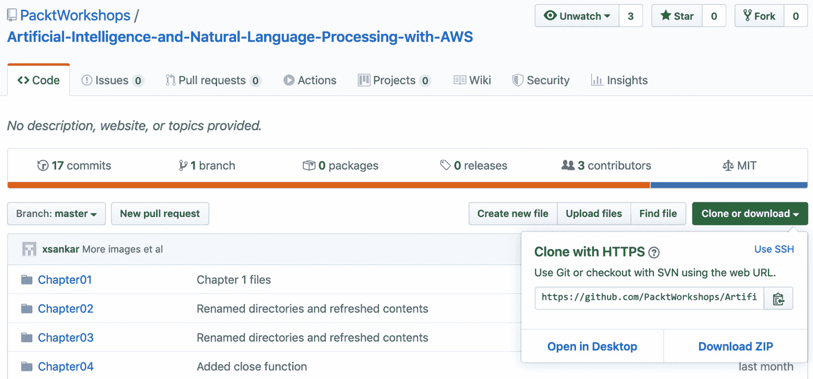

图 1.1：从 GitHub 下载支持文件

例如，我们将文件下载到了 `Documents/aws-book/The-Applied-AI-and-Natural-Language-Processing-with-AWS` 目录中：

![图 1.2：GitHub 支持文件在本地目录中

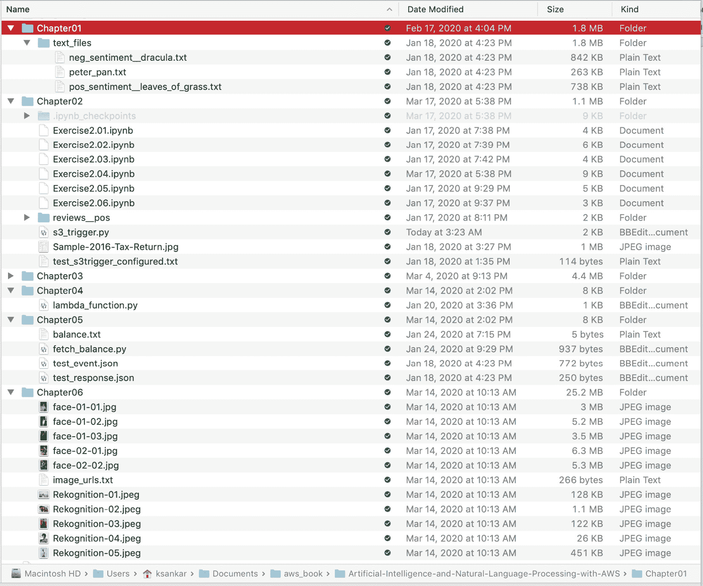

图 1.2：GitHub 支持文件在本地目录中

## 关于 Jupyter 笔记本的一些说明

本书中的某些程序使用Jupyter笔记本运行。您可以通过`.ipynb`文件扩展名来识别它们。如果您还没有使用过Jupyter笔记本，请参考*前言*中的`安装和设置`。

## 将数据导入和导出到S3

AWS处理大数据的方式是通过提供AWS导入/导出服务，这使得您可以将大量数据传输到AWS。

工作原理是您将存储设备邮寄到AWS，AWS将使用亚马逊的高速网络传输这些数据。您的数据将在到达后的下一个工作日加载到AWS。一旦数据加载完成，存储设备将归还给所有者。这是一种更经济高效的数据传输方式，比通过互联网传输要快得多。

如果您需要放入S3的数据量相对较小，您可以直接从您的计算机上传。今天，随着宽带网络容量的不断增加，“小”数据量变得越来越大。我们的指导原则是1 TB。一旦超过这个量，您可能需要考虑更快地将数据放入S3的方法。其中之一是**AWS导入/导出磁盘服务**（[https://aws.amazon.com/snowball/disk/details/](https://aws.amazon.com/snowball/disk/details/)），您可以在AWS提供的设备上打包您的数据，并将其邮寄给他们。大量数据可以在一天或几天内加载。

## S3与文件系统的区别

S3用于存储几乎任何类型的文件，因此，由于这种相似性，它可能会与传统文件系统混淆。然而，S3在几个方面与传统文件系统不同。传统文件系统中的文件夹在S3中是桶；传统文件系统中的文件在S3中是对象。S3使用对象，因为您可以在桶中存储任何数据类型（即，不仅仅是文件）。

另一个区别是对象的可访问性。存储在桶中的对象可以通过网络服务端点（例如，例如，Chrome或Firefox浏览器）访问，因此每个对象都需要一个全局唯一的名称。对象的名称限制与创建新网站时选择URL的限制类似。您需要根据相同的逻辑选择一个唯一的URL，就像您的房子有一个唯一的地址一样。

例如，如果您创建了一个名为`myBucket`的桶（具有公共权限设置），然后上传了一个名为`pos_sentiment__leaves_of_grass.txt`的文本文件到该桶，那么对象可以通过相应的子域通过网络浏览器访问。

# 核心S3概念

S3层次结构包括以下概念：

+   **数据存储类型**：S3是一个键值存储。您提供一个唯一的键，AWS将您的数据存储为值。您使用键检索数据。

+   **键**：键是分配给对象的名称，用于在桶内唯一标识它。桶中的所有对象都关联着一个键。

+   **对象**: 对象是你存储的内容。它们是不可更新的：如果你需要更改值中的一个字节，你必须重新上传整个对象。

图 1.3：使用唯一键和 myBucket 的对象存储

+   **桶**: 就像文件夹一样，桶是一个存储对象的容器。桶在根级别创建，没有文件系统层次结构。更具体地说，你可以有多个桶，但不能在桶内创建子桶。桶是对象的容器，你可以控制（在桶中创建、删除和列出对象）访问权限、查看访问日志，并选择亚马逊 S3 将存储桶的地理位置。

+   `us-central` 或 `ap-south`，根据用户的偏好，S3 存储桶的位置。可以在创建桶时选择区域。位置应根据数据将最常访问的位置来确定。总的来说，如果 S3 用于存储仅在一个特定地理区域内访问的网站文件，则特定区域选择对 S3 的影响最大。

    桶中不同形式的对象存储如下：

    

图 1.4：对象存储

## S3 操作

S3 API 非常简单，它包括以下针对相关实体的操作：

+   **桶**: 在桶中创建、删除和列出键

+   **对象**: 写入、读取和删除

这里有一个例子：


图 1.5：存储在 myBucket 中的对象

# 数据复制

亚马逊在多个位于亚马逊数据中心的服务器上跨区域复制数据。数据复制的优点包括高可用性和持久性。更具体地说，当你创建一个新的对象到 S3 时，数据被保存在 S3 中；然而，更改需要跨 S3 区域进行复制。总的来说，复制可能需要一些时间，你可能会注意到由于各种复制机制导致的延迟。

删除对象后，复制可能会造成延迟，使得删除的数据在完全复制之前仍然显示。由于复制延迟，创建对象并立即尝试在对象列表中显示它可能会延迟。

## REST 接口

S3 的原生接口是 **表示状态传输** (**REST**) API。建议始终使用 HTTPS 请求执行任何 S3 操作。我们将使用两个高级接口与 S3 交互，即 AWS 管理控制台和 AWS CLI。使用 API 访问对象非常简单，包括以下针对相关实体的操作：

+   **桶**: 在桶中创建、删除或列出键

+   **对象**: 写入、读取或删除

## 练习 1.01：使用 AWS 管理控制台创建 S3 桶

在此练习中，我们将在 AWS 上准备一个存储 ML 数据的地方。要导入文件，您需要访问 Amazon S3 控制台：

1.  您应该已经完成了本章前面详细说明的账户设置。前往 [https://aws.amazon.com/](https://aws.amazon.com/) 并点击“我的账户”然后“AWS 管理控制台”以在新浏览器标签页中打开 AWS 管理控制台：![图 1.6：通过用户账户访问 AWS 管理控制台

    ![img/B16061_01_06.jpg]

    图 1.6：通过用户账户访问 AWS 管理控制台

1.  如下所示，在“AWS 服务”下方的搜索栏中点击：![图 1.7：搜索 AWS 服务

    ![img/B16061_01_07.jpg]

    图 1.7：搜索 AWS 服务

1.  在搜索栏中输入`S3`，将出现一个自动填充的列表。然后，点击“云中的可扩展 S3 存储服务”选项：![图 1.8：选择 S3 服务

    ![img/B16061_01_08.jpg]

    图 1.8：选择 S3 服务

1.  现在我们需要创建一个 S3 存储桶。在 S3 仪表板中，点击“创建存储桶”按钮。如果您是第一次创建存储桶，您的屏幕将看起来像这样：![图 1.9：创建存储桶

    ![img/B16061_01_09.jpg]

    图 1.9：创建存储桶

    如果您已经创建了 S3 存储桶，您的仪表板将列出您创建的所有存储桶。**输入一个唯一的存储桶名称**：存储桶名称必须在 S3 中是唯一的。如果您遇到命名问题，请参阅 [https://docs.aws.amazon.com/AmazonS3/latest/dev/BucketRestrictions.html](https://docs.aws.amazon.com/AmazonS3/latest/dev/BucketRestrictions.html)。

    **区域**：如果默认区域自动填充，则保持默认位置。如果没有自动填充，请选择靠近您当前位置的区域。

1.  点击“下一步”按钮继续创建存储桶：![图 1.10：创建存储桶窗口

    ![img/B16061_01_10.jpg]

    图 1.10：创建存储桶窗口

1.  S3 存储桶提供了属性选项“版本控制”、“服务器访问日志”、“标签”、“对象级日志”和“默认加密”；然而，我们不会启用它们。

1.  您的存储桶将显示在存储桶列表中，如图所示：![图 1.11：存储桶已创建

    ![img/B16061_01_11.jpg]

图 1.11：存储桶已创建

在此练习中，我们已经在云中为我们的文件存储创建了一个位置。在下一个练习中，我们将学习如何将文件存储在此位置，并从中检索它们。

## 练习 1.02：使用您的 S3 存储桶导入和导出文件

在此练习中，我们将向您展示如何在 Amazon S3 上放置您的数据，以及如何从那里检索它。

按照以下步骤完成此练习：

**导入文件**：

1.  点击存储桶的名称以导航到存储桶：![图 1.12：导航到存储桶

    ![img/B16061_01_12.jpg]

    图 1.12：导航到存储桶

1.  您现在位于存储桶的主页。选择“上传”：![图 1.13：将文件上传到存储桶

    ![img/B16061_01_13.jpg]

    图1.13：将文件上传到存储桶

1.  要选择要上传的文件，点击`添加文件`：

    图1.14：向存储桶添加新文件

1.  我们将从[https://packt.live/3e9lwfR](https://packt.live/3e9lwfR) GitHub仓库上传`pos_sentiment__leaves_of_grass.txt`文件。最好的方法是将其下载到你的本地磁盘。然后你可以选择文件：

    图1.15：选择要上传到S3存储桶的文件

1.  在选择要上传的文件后，选择`下一步`：

    图1.16：选择要上传到存储桶的文件

1.  点击`下一步`按钮并保留默认选项：

    图1.17：上传文件时的权限页面

1.  你可以为你的对象设置属性设置，例如`存储类别`、`加密`和`元数据`。然而，保留默认值，然后点击`下一步`按钮：

    图1.18：设置属性

1.  点击`上传`按钮上传文件：

    图1.19：上传文件

1.  你将被引导到存储桶主屏幕上的你的对象：

图1.20：上传到存储桶的文件

**导出文件：**

1.  选择要导出文件旁边的复选框（*红色标记#1 – 请参阅以下截图*）。这将填充文件信息显示屏幕。点击`下载`（*红色标记#2 – 请参阅以下截图*）以检索文本文件：

图1.21：导出文件

文件将下载，如屏幕左下角所示：


图1.22：导出文件下载

在这个练习中，你学习了如何将文件导入到你的Amazon S3存储桶以及从存储桶导出文件。正如你所见，由于用户界面简单，这个过程相当容易。

# AWS CLI

CLI是一个基于Python（Boto）AWS SDK构建的开源工具，用于执行设置、确定调用是否按预期工作、验证状态信息等。CLI为所有AWS服务提供了另一个访问工具，包括S3。与控制台不同，CLI可以通过脚本进行自动化。

要将你的AWS账户认证到CLI，你必须创建一个配置文件以获取你的公钥和秘密密钥。接下来，你将安装并配置AWS CLI。

## 练习1.03：配置CLI

在这个练习中，我们将使用我们的AWS访问密钥ID和AWS秘密访问密钥配置CLI。按照以下步骤完成练习：

1.  首先，转到 `AWS 管理控制台` 然后是 `IAM`。您可能需要登录到账户。然后，点击 `用户`：![图 1.23：带有突出显示用户选项的管理控制台主页

    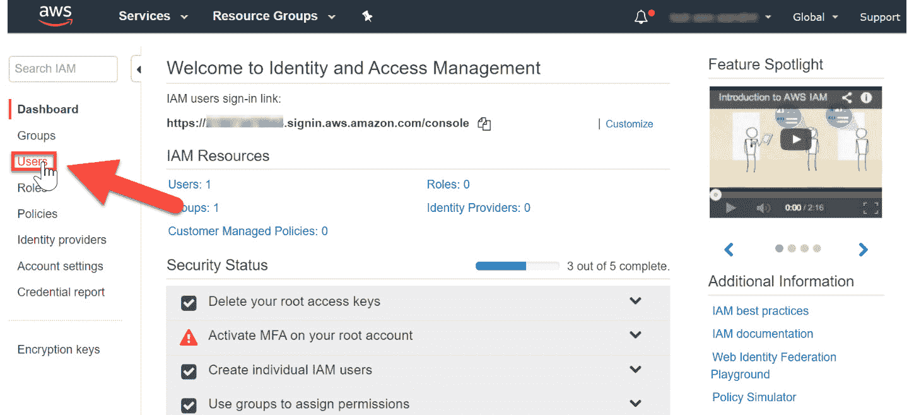

    图 1.23：带有突出显示用户选项的管理控制台主页

1.  在已登录的 AWS 管理控制台右上角，点击 `我的安全凭证`：![图 1.24：我的安全凭证

    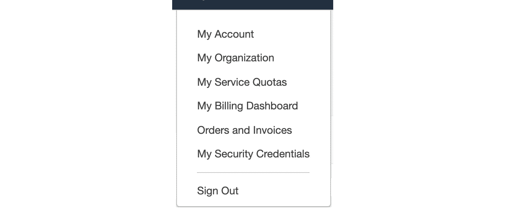

    图 1.24：我的安全凭证

1.  接下来，点击 `继续到安全凭证`：![图 1.25：安全凭证

    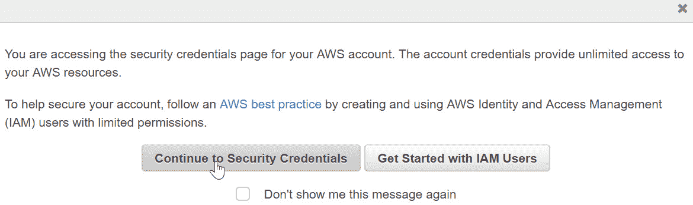

    图 1.25：安全凭证

1.  点击 `访问密钥（访问密钥 ID 和秘密访问密钥）` 选项：![图 1.26：访问密钥生成

    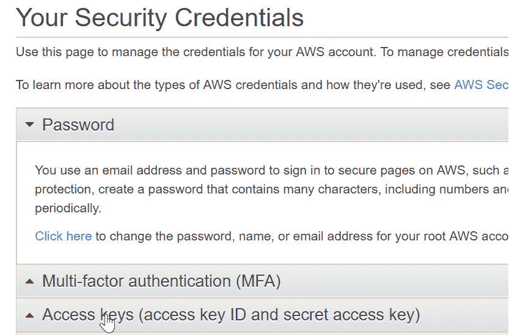

    图 1.26：访问密钥生成

1.  然后，点击 `创建新访问密钥`：![图 1.27：创建新的访问密钥

    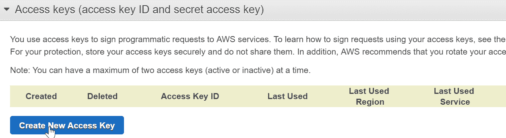

    图 1.27：创建新的访问密钥

1.  点击 `下载密钥文件` 下载密钥文件：![图 1.28：下载密钥文件

    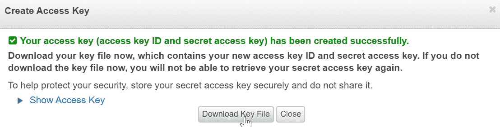

    图 1.28：下载密钥文件

    包含密钥的 `rootkey.csv` 文件将被下载。您可以通过打开文件来查看详细信息。

    注意

    将密钥存储在安全的位置。保护您的 AWS 账户，切勿在非安全位置共享、通过电子邮件或存储密钥。AWS 代表永远不会请求您的密钥，因此在处理潜在的钓鱼诈骗时要保持警惕。

1.  打开命令提示符并输入 `aws configure`。

1.  您将提示输入四个输入变量。输入您的信息，然后在每个输入后按 *Enter*：

    ```py
    AWS Access Key ID
    AWS Secret Access Key 
    Default region 
    Default output format (json)
    ```

1.  名称是在您的控制台中获得的（这里显示为 `Oregon`，但您的名称由您独特的位置决定）：![图 1.29：位置搜索

    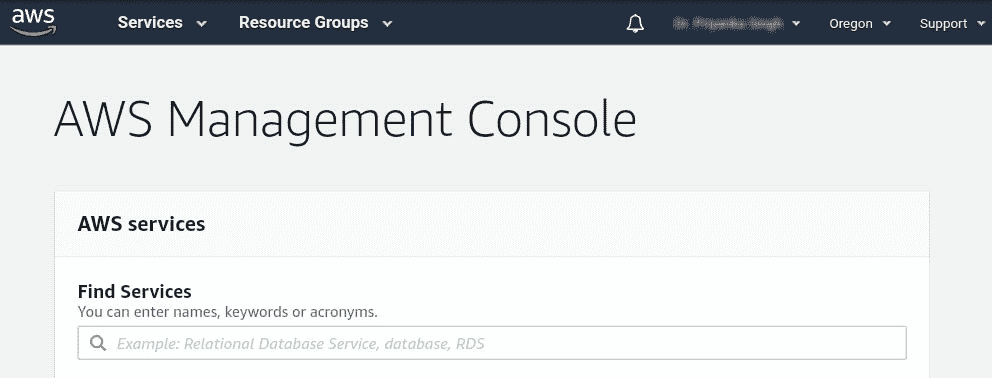

    图 1.29：位置搜索

1.  区域代码从以下 `可用区域` 列表中获得：![图 1.30：可用区域列表

    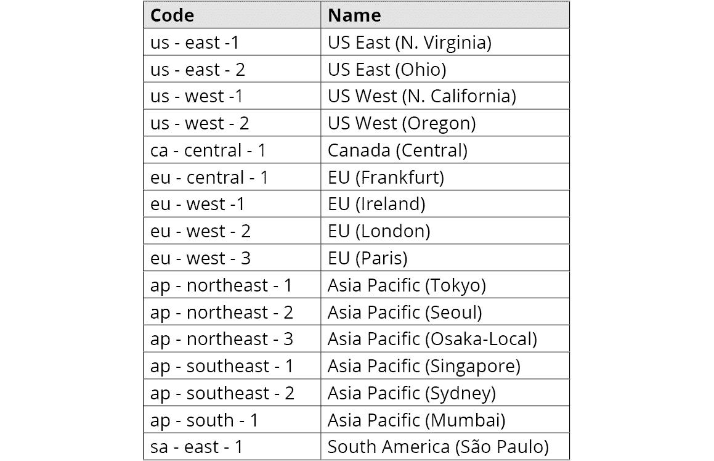

    图 1.30：可用区域列表

1.  命令提示符的最后一个输入变量将如下所示。然后，按 *Enter*：![图 1.31：命令提示符中 AWS CLI 配置的最后一步

    

图 1.31：命令提示符中 AWS CLI 配置的最后一步

您可以通过输入 `aws configure` 命令随时更改配置。

在这个练习中，您已配置了 AWS 账户的安全凭证。我们将使用这些凭证在本书的其余部分访问 AWS API。

# CLI 使用

当使用命令时，至少指定一个路径参数。两个路径参数是 **LocalPath** 和 **S3Uri**：

+   **本地路径**：这表示本地文件或目录的路径，可以写成绝对路径或相对路径。

+   `s3://myBucketName/myKey`。路径参数必须以 `s3://` 开头，以指示路径参数指的是 S3 对象。

总体命令结构是 `aws s3 <Command> [<Arg> …]`。以下表格显示了不同的命令及其描述和示例：


图 1.32：命令列表

# 递归和参数

逐个导入文件很耗时，尤其是当你有一个文件夹中有很多文件需要导入时。一个简单的解决方案是使用递归过程。递归过程是一种可以调用自身并节省用户输入相同导入命令的命令。

执行递归 CLI 命令需要向 API 传递一个参数。这听起来很复杂，但实际上非常简单。首先，参数只是一个传递给程序以影响接收程序操作的名字或选项。在我们的例子中，参数是 **递归**，执行递归命令的整个命令如下：

```py
aws s3 cp s3://myBucket . --recursive
```

使用此命令，将存储桶中的所有 S3 对象复制到指定的目录：


图 1.33：参数列表

## 活动 1.01：使用 CLI 将数据放入 S3

让我们先来谈谈在这个活动中使用的术语。将数据放入 S3 也可以称为 *上传*。从那里获取它被称为 *下载*。有时，它也被称为导入和导出。请不要与 AWS Import/Export 混淆，AWS Import/Export 是一个特定的 AWS 服务，用于将大量数据发送到 AWS 或从 AWS 获取数据。

在这个活动中，我们将使用 CLI 在 S3 中创建一个存储桶并导入第二个文本文件。假设你正在创建一个聊天机器人。你已经确定了包含将使你的聊天机器人更有效地与客户互动的内容的文本文件。在文本文件可以被解析之前，它们需要被上传到 S3 存储桶。一旦它们在 S3 中，就可以进行进一步的分析。为了确保这已经正确完成，你需要安装 Python、设置 Amazon CLI 工具，并使用 CLI 进行用户认证：

1.  配置 CLI 并验证它是否可以成功连接到您的 AWS 环境。

1.  创建一个新的 S3 存储桶。

1.  将你的文本文件导入到存储桶中。

1.  从存储桶中导出文件并验证导出的对象。

    注意

    这个活动的解决方案可以在第 276 页找到。

# 使用 AWS 控制台识别 ML 服务

AWS 控制台提供了一个基于网页的界面，用于导航、发现和利用 AWS 的人工智能和机器学习服务。在本主题中，我们将探讨两种使用控制台搜索 ML 服务的方法。此外，我们还将测试一个使用从网站检索的文本数据检索的 ML API。

## 练习 1.04：在 AWS 管理控制台中导航

在这个练习中，我们将导航AWS管理控制台以定位ML服务。从控制台开始，[https://console.aws.amazon.com/console/](https://console.aws.amazon.com/console/)，并且仅使用控制台搜索功能，让我们导航到Amazon Lex([https://console.aws.amazon.com/lex/](https://console.aws.amazon.com/lex/))服务信息页面：

1.  点击[https://console.aws.amazon.com/console/](https://console.aws.amazon.com/console/)导航到AWS控制台。您可能需要登录您的AWS账户。然后，点击`服务`：

    图1.34：AWS控制台

1.  滚动页面以查看所有ML服务。然后，点击`Amazon Lex`。如果Lex在您所在的位置不可用，您可以考虑切换到另一个服务。

    图1.35：ML选项

1.  您将被重定向到`Amazon Lex`的主屏幕：

图1.36：Amazon Lex主屏幕

您将在第5章“使用语音与聊天机器人”中有机会使用Amazon Lex。现在，您可以点击不同的`了解更多`链接以更好地了解Lex的功能。如果您迫不及待想要尝试，您可以点击`开始使用`。

定位新的AWS服务是发现更多工具以解决您的数据项目解决方案的关键技能。现在，让我们测试Amazon Comprehend的API功能。

## 练习1.05：测试Amazon Comprehend API功能

现在您已经掌握了S3，让我们进行一个快速练习，这个练习不仅限于存储文件，而且为您准备后续章节的内容。在这个练习中，我们将使用API探索器中的部分文本文件输入来显示文本分析输出。探索API是一种节省开发时间的技能，它确保输出符合您项目的所需格式。在这里，我们将测试AWS Comprehend文本分析功能。

注意

您将在第4章“对话式人工智能”中更详细地了解Comprehend。我们还将介绍各种AWS AI服务以及如何使用它们。在这里，我们进行练习是为了让您熟悉以多种方式与AWS交互。

这里是用户故事：假设您正在创建一个聊天机器人。在采取任何步骤之前，我们首先需要了解商业目标或陈述或目标。然后我们需要选择相关的AWS服务。例如，如果我们的商业目标与存储相关，我们将选择存储领域。

您已经确定了一个商业主题以及相应的文本文档，这些文档包含的内容将使聊天机器人使您的商业成功。您的下一步是确定/验证一个AWS服务来解析文本文档以获取情感、语言、关键词和实体。亚马逊的AI服务包括AWS Comprehend，它在这方面做得非常好。

在编写完整的程序之前，您需要通过 AWS 管理控制台的界面测试 AWS 服务的功能。为了确保这一点，您需要在网络上搜索一篇文章（用英语或西班牙语撰写），其中包含您感兴趣的主题内容。您知道探索 API 是一种可以节省开发时间的技能，因为它可以确保输出符合您项目的期望格式。

现在我们有了用户故事，让我们执行这个任务：

类似于 *练习 1.01*，*使用 AWS 管理控制台创建 S3 存储桶*，您应该已经按照本章前面详细说明的方式完成了账户设置。

1.  前往 [https://aws.amazon.com/](https://aws.amazon.com/) 并点击 `我的账户`，然后 `AWS 管理控制台` 以在新浏览器标签页中打开 AWS 管理控制台：

    图 1.37：通过用户账户访问 AWS 管理控制台

1.  在 AWS 管理控制台中点击搜索栏（位于 `查找服务` 下方）以搜索 `Amazon Comprehend`，您将被引导到以下所示的 `Amazon Comprehend 控制台` 屏幕：

    图 1.38：搜索 AWS 服务

1.  输入 `amazon comp`。随着您输入，Amazon 将自动完成并显示与搜索框中输入的名称匹配的服务：

    图 1.39：选择 AWS 服务

1.  您将看到 `Amazon Comprehend` 登录页面：

    图 1.40：Amazon Comprehend 页面

1.  点击 `启动 Amazon Comprehend`，您将被引导到 `实时分析` 页面。您可以使用他们的内置模型，或者提供自定义模型。我们将使用他们的内置模型：

    图 1.41：实时分析

    您可以输入文本并点击 `分析`。让我们复制一首沃尔特·惠特曼的诗从 [http://www.gutenberg.org/cache/epub/1322/pg1322.txt](http://www.gutenberg.org/cache/epub/1322/pg1322.txt) 并进行分析。导航到 `主题建模和文档`。有一个用于探索 API 的 GUI，右侧提供文本输入的实时输出。

1.  点击 `清除文本` 以清除所有默认服务。导航到新标签页中打开以下 URL：[http://www.gutenberg.org/cache/epub/1322/pg1322.txt](http://www.gutenberg.org/cache/epub/1322/pg1322.txt)。

1.  复制第一首诗并将其粘贴到 `输入文本` 框中：

    图 1.42：Amazon Comprehend 实时分析屏幕

1.  点击 `分析` 以查看输出：

    图 1.43：分析输出

1.  查看实体、“关键词”和“语言”标签页，然后点击“情感”标签页以查看情感分析：![图1.44：情感标签页结果

    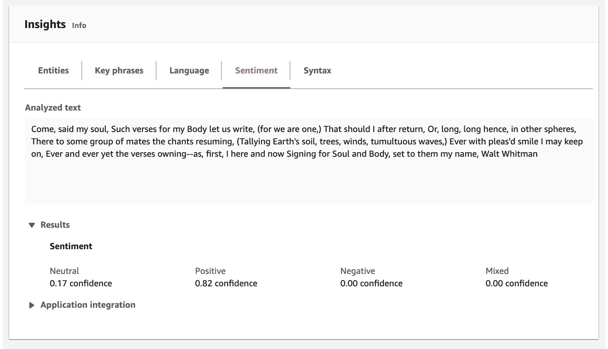

    图1.44：情感标签页结果

1.  您可以尝试其他标签页。语言将显示为99%的置信度，并且“语法”标签页很有趣，信息量很大。“关键词”标签页会下划线显示关键词并将它们列出：![图1.45：关键词标签页结果

    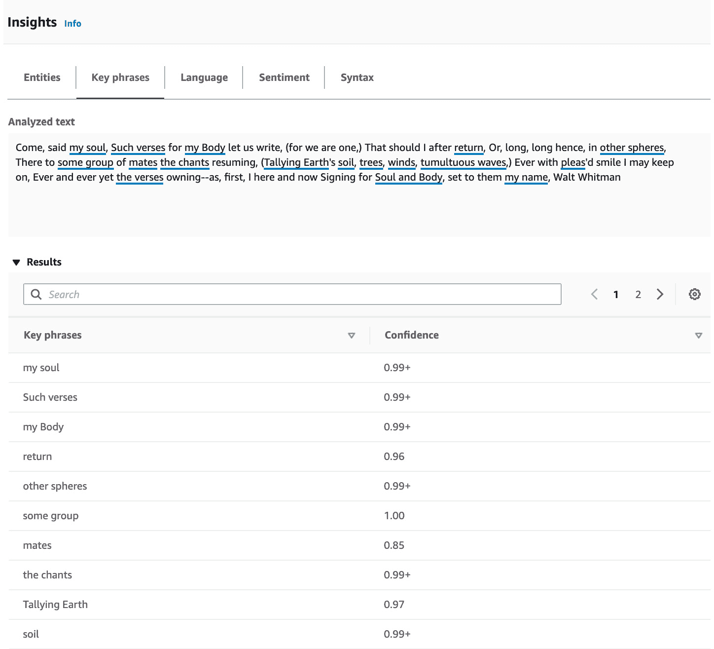

图1.45：关键词标签页结果

尝试一些其他文本——可能是IMDb的电影评论或亚马逊产品评论的评论——并查看Amazon Comprehend如何处理情感。一个有趣的事情是尝试讽刺或甚至是在最后一刻改变其极性的评论，例如，“这本书真的很棒，但电影很糟糕”或“剧本和导演是由那些无法理解小说好在哪里的人完成的，”以获得有趣的结果。

## AWS控制台界面在AI服务中的实用性

Comprehend控制台界面对于测试想法非常有用。正如您将在后面的章节中看到的那样，我们可以使用与Amazon Textract类似的界面来查看我们是否可以从表格、公司报表（如损益表或资产负债表）、医疗表格等表格中提取表格和其他信息。

虽然我们需要编程和开发来开发机器人流程自动化应用程序，但控制台界面帮助我们快速测试我们的业务假设。例如，可能您想自动化一个贷款处理流程，您需要手动从不同的文档中输入信息。为了查看是否有任何AWS AI服务符合需求，您可以使用AWS Textract控制台扫描所有相关文档并进行测试。在后面的第5章“计算机视觉和图像处理”中，您将处理扫描的文档和Amazon Textract。

您还可以检查AWS内置模型提取所需信息的准确性。可能您需要定制模型，可能文档对机器来说不易理解，但您可以更早地找到它们并相应地规划。可能您的应用程序涉及病历处理，这可能需要更复杂的定制模型。实际上，您可以在控制台中上传定制模型并进行测试。

# 摘要

在本章中，我们从了解云计算、AWS、机器学习和人工智能的基础知识开始。然后我们探索了S3，创建了存储桶，并将数据从S3导入和导出。同时，我们探讨了AWS命令行及其用途。最后，我们以AWS Comprehend的控制台界面为例，测试了与分析文本和文档相关的各种想法。

在下一章中，你将了解更多关于 AWS 人工智能服务、无服务器计算以及如何使用 **自然语言处理**（**NLP**）分析文本文档。研究新的 AWS 服务对于发现解决你正在工作的许多机器学习问题的额外解决方案至关重要。此外，正如你所见，AWS 有多种与其服务交互的方式，以帮助测试商业想法、评估 AI/ML 模型以及快速原型设计。
