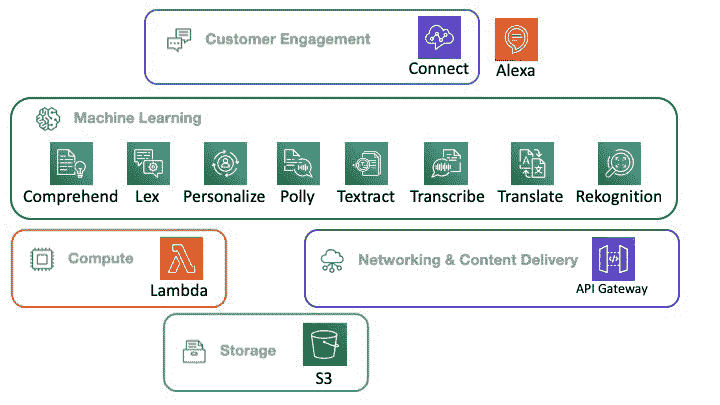
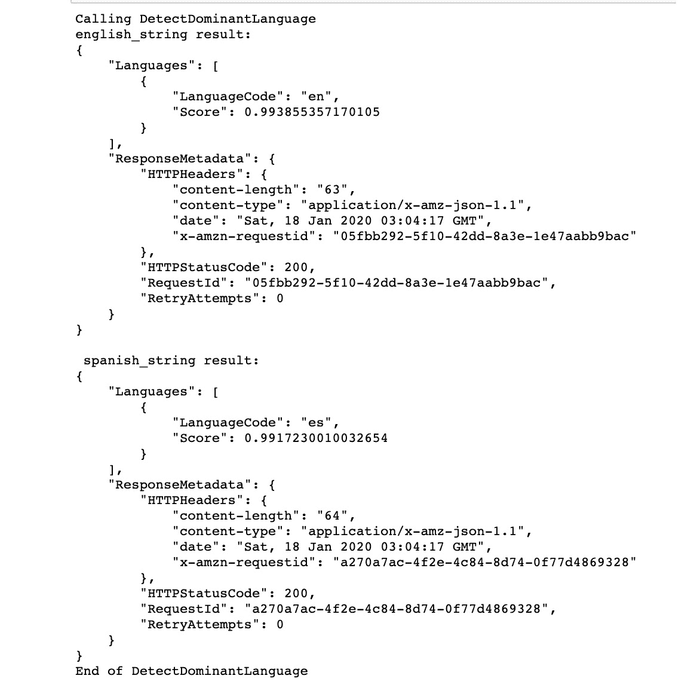
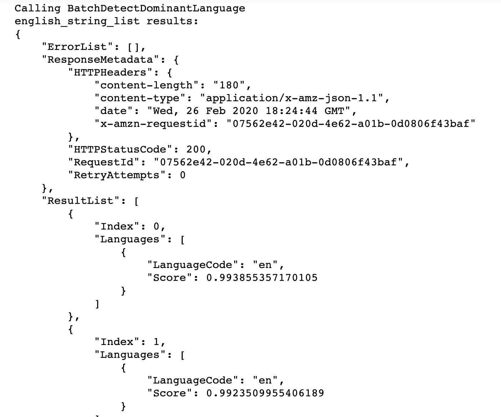
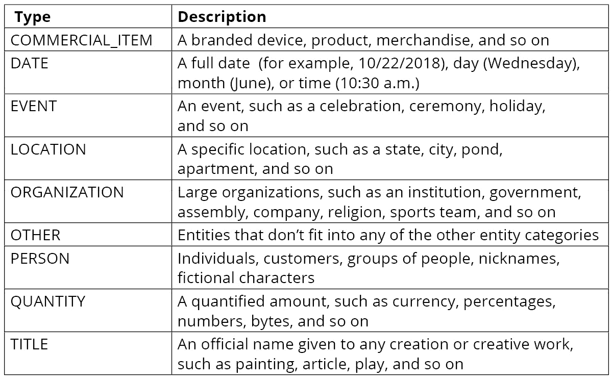
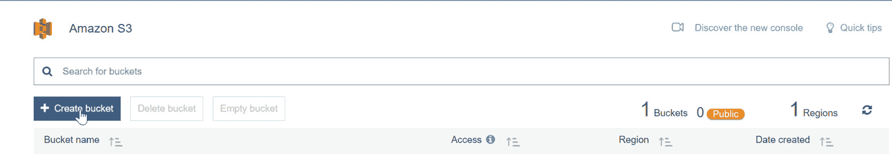
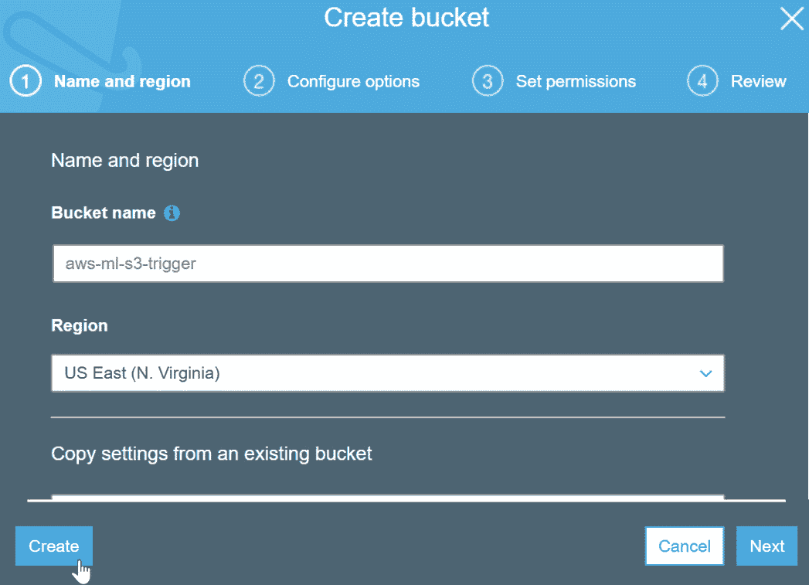
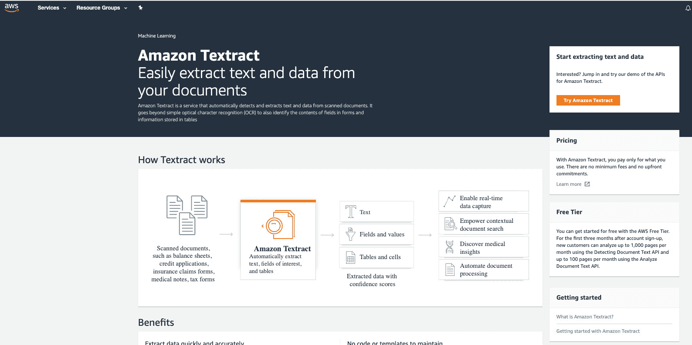
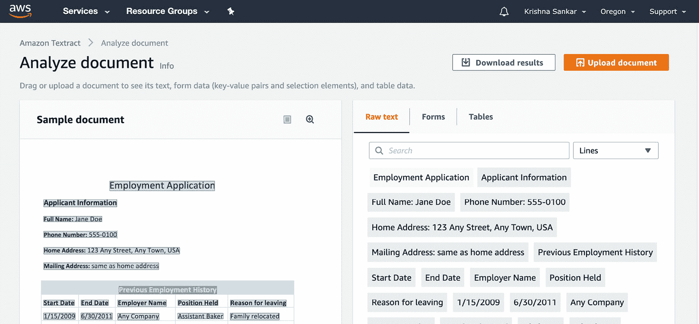
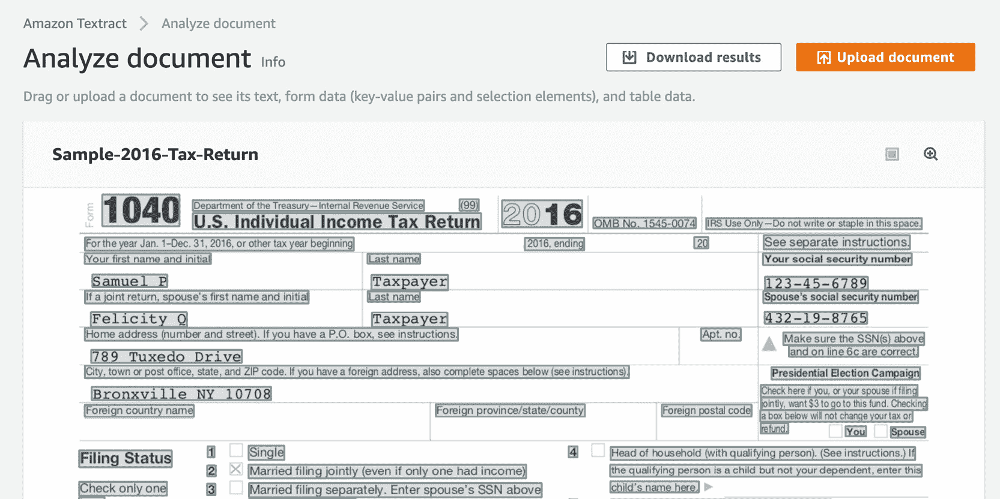
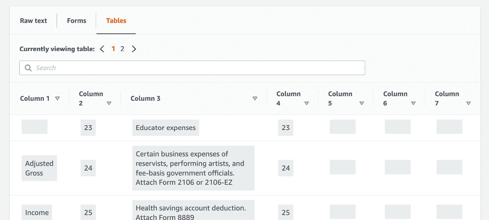

# 第二章：2. 使用自然语言处理分析文档和文本

概述

本章介绍了如何使用 Amazon Comprehend 来总结文本文档并创建 Lambda 函数来分析文本。您将学习如何通过应用无服务器计算范式来开发服务，并使用 Amazon Comprehend 来检查文本以确定其主要语言。您将从一系列文档中提取信息，例如实体（人物或地点）、关键词（指示内容的名词短语）、情感倾向和主题。

到本章结束时，您将能够设置一个 Lambda 函数，使用 Comprehend 处理和分析导入的文本，并使用 Amazon Textract 从扫描的纸质文档中提取结构化信息。

# 简介

自 2005 年亚马逊正式推出其 **弹性计算云**（**EC2**）网络服务以来，云计算已经从开发者服务发展到至关重要的基础设施。应用范围广泛——大多数高度可扩展的消费者平台，如 Netflix，都是基于 AWS 构建的，许多制药和基因组学，以及 BBC 和 The Weather Channel、宝马和佳能等组织也是如此。截至 2020 年 1 月，大约有 143 个不同的 AWS 服务，涵盖 25 个类别，从计算和存储到量子技术、机器人和机器学习。本书将介绍其中的一些，如下面的图表所示：





**S3** 是一种多功能的对象存储，我们用它来存储人工智能服务的输入以及这些服务的输出。您从 *第一章*，*AWS 简介* 开始就已经在使用 S3 了。


**Lambda** 是使无服务器计算成为可能的中介服务。您将在本章后面使用 Lambda 通过 Comprehend 分析文本。


**API Gateway** 是一种交付服务，可以使您创建可以通过各种客户端访问的微服务，例如通过 HTTP、WebSocket 和 REST 等互联网协议访问的 Web、移动和服务器应用程序。API Gateway 使您能够以安全且可扩展的方式公开您的微服务。在微服务和“API 首选”方法的时代，最大的挑战是 API 端点的创建、发布、监控和维护。几乎所有的 AWS 服务都是 API，并使用 API Gateway 基础设施。

亚马逊的机器学习服务，本书的主要焦点，截至 2020 年 1 月共有 16 个服务。它们也被称为 AI 服务，目前这两个术语可以互换使用。让我们快速了解一下我们感兴趣的服务。


**Comprehend**，本章的主题，是一个非常通用的文本分析服务。它执行各种任务——关键词提取、情感分析（正面、负面、中性或混合）、句法分析、实体识别、医疗**命名实体识别**（**NER**）、语言检测和主题建模。您将在本章后面的内容中看到它的实际应用。


**Lex**是一个用于构建对话式AI、机器人或智能助手的平台。对话式AI功能，如**自动语音识别**（**ASR**）和**自然语言理解**（**NLU**），已集成到Lex框架中。Lex提供了一个非常直观的对象模型，包括机器人、话语、槽位和会话，以及与Amazon Lambda的集成，从而让您能够在无服务器环境中开发有趣、智能的机器人。我们将在第4章“对话式人工智能”中看到Lex的更多应用。


**个性化**是一个非常实用的服务，它允许您个性化您的机器人。例如，可以整合个性化的推荐/内容投递，基于先前交互的个性化搜索，甚至基于用户行为的个性化通知和营销！虽然我们在这本书中不会使用亚马逊个性化服务，但我们想将您的注意力引向与本书中涵盖的服务密切相关的一些服务。这样，您就可以在扩展您的机器人和NLP服务功能的同时，添加极其丰富的功能。


**Polly**是一个使用**神经文本到语音**（**NTTS**）技术的文本到语音服务。它非常灵活且功能强大，提供两种风格：新闻播报风格和正常对话风格。声音不必单调——亚马逊Polly支持**语音合成标记语言**（**SSML**），这使您能够调整说话风格、音量、语速、音调、语调、强调、语调和其他特性。


**Textract**，正如其名所示，从文档中提取文本。它是一个适合流程自动化的**光学字符识别**（**OCR**）解决方案。它可以从税务表格、法律文件、医疗表格、银行表格、专利注册等文档中提取键值对或表格。


**Transcribe**是一个语音到文本的**自动语音识别**（**ASR**）服务，并且非常灵活；例如，它可以识别多个说话者，并且您可以过滤掉单词。它在医疗转录、时间戳字幕生成和客户交互转录中非常有用。


**Translate**是另一个非常实用的服务，它能够以可扩展、实时的方式翻译超过50种语言。


当然，**Rekognition** 是一种视觉分析和图像检测服务，能够执行各种任务，如面部识别、视频分析、物体检测和识别图像中的文本。*第6章*，*计算机视觉与图像处理*专门介绍了Amazon Rekognition。


与本章迄今为止我们探讨的AI服务不同，**Amazon Connect** 是一个功能丰富的联系中心应用。它由一个全渠道云联系中心组成，具有高质量的音频、Web/移动安全聊天和基于Web的联系控制面板。Amazon Connect的接触镜是一套联系中心分析服务，它增加了全文搜索和情感分析等功能，未来还将包括主题检测和自定义词汇等功能。与Amazon Lex的集成为聊天机器人提供了一个有趣的功能，我们可以利用Lex的灵活性来创建智能且有用的机器人。


当然，**Amazon Alexa** 是一个对话接口的平台，以及一系列利用Alexa服务成为智能助手的硬件设备，如智能扬声器。

包含客户参与平台如Connect和Alexa的原因是为了展示我们在本书中所做工作的更广泛可能性。虽然我们不会直接展示如何为基于Amazon Connect或Amazon Alexa的机器人**语音用户界面**（**VUI**）开发，但我们希望打开您的思路，了解在不同集成点——Web、移动、智能扬声器等等——实现全渠道客户体验的可能性。

如您所见，服务覆盖了广泛的层次，从存储和基础设施层到AI服务层，最终扩展到用户体验层。

# 无服务器计算

无服务器计算是一种相对较新的架构，它对云应用架构进行了不同的诠释。让我们从传统的本地服务器架构开始。

通常，传统的应用架构从一组计算机硬件、主机操作系统、虚拟化、容器以及由网络和存储连接起来的库和框架的应用堆栈开始。在这所有之上，我们编写业务逻辑。本质上，为了维护业务能力，我们必须维护服务器硬件、操作系统补丁、更新、库更新等等。我们至少还要担心可伸缩性、容错性和安全性。

使用云计算，应用架构不再依赖于计算机硬件，同时也具有弹性。我们仍然需要维护操作系统、库、补丁等等。这就是无服务器计算发挥作用的地方——用亚马逊的话说，无服务器计算“将更多的运营责任转移到AWS”。

无服务器计算在云计算的基础上进行了改进，消除了基础设施管理，从配置到根据负载进行扩展和缩减，以及整个运行时堆栈的修补和维护。正如亚马逊所描述的，无服务器计算确实“降低了成本，增加了敏捷性和创新”，并且如果设计得当，还可以实现自动高可用性。

O'Reilly 的报告将无服务器计算定义为“一种软件解决方案的架构方法，它依赖于在弹性运行时环境中运行的小型独立函数在短暂服务器上运行。”因此，存在服务器——无服务器并不是一个恰当的术语，但在某种程度上，服务器是透明的，由亚马逊在 Lambda 函数执行期间管理，这通常在毫秒级别。

## Amazon Lambda 和 Function as a Service

从本质上讲，无服务器计算是由函数驱动的，更准确地说，是由 **Function as a Service** (**FaaS**) 驱动的。Amazon Lambda 是无服务器计算的一个主要启用平台示例。

您将业务逻辑编写为一系列事件驱动的 Lambda 函数，这些函数是无状态的、容错的、自动扩展的。Lambda 函数有一个上游和一个下游——它响应上游事件；运行时处理器执行嵌入的代码，并将结果发送到下游目的地。上游事件可能是由放入队列中的某些内容或掉入 S3 存储桶或 **简单通知服务** (**SNS**) 消息中的某些内容生成的。下游可以是 S3 存储桶、队列、DynamoDB 等等。运行时支持多种语言，例如 Python、Go、Java、Ruby、Node.js 和 .NET。

Lambda 函数比微服务更细粒度——您可以将其视为一个纳米服务。它按 100 毫秒计费，并在 15 分钟后超时。有效负载大小为 6 MB。这为您提供了 Lambda 函数大小的估计。此外，正如您所注意到的，当 Lambda 函数空闲时没有费用——这意味着我们可以缩减到零。您还可以轻松实现数据并行化——为每行数据触发一个 Lambda 函数。由于一个 Lambda 函数可以触发另一个 Lambda 函数，您甚至可以进行任务并行化。当然，所有这些都要求仔细的架构设计，但这是值得的。

亚马逊的无服务器平台涵盖了计算、存储、网络、编排、API 代理、分析和开发者工具。我们将探讨其中的一些组件——Lambda 用于计算，S3 用于存储，API Gateway 用于网络。

## 无服务器计算作为一种方法

行业分析师和技术人员将无服务器计算视为一种方法和一套原则。Amazon Lambda 不是无服务器计算，而是该方法的推动者。无服务器计算架构确实减少了您需要构建的内容——我们现在编写的一些传统代码现在表现为函数链式管道、事件配置、触发器和 Lambda 函数的属性。基本业务逻辑确实需要编写，并将位于 Lambda 函数内部。因此，平台和业务代码之间有一个非常明确的分离，这就是无服务器计算的价值。

# Amazon Comprehend

Amazon Comprehend 是一种文本分析服务。它具有广泛的功能。Amazon Comprehend 可以提取关键短语和实体。它可以进行语言检测和主题建模。它还可以执行情感分析和语法分析。Amazon Comprehend 支持多语言。Amazon Comprehend 的应用包括：

+   理解各种非结构化文本项（如支持票、社交媒体帖子、客户反馈、客户投诉以及合同和医疗记录等业务文档）的主要主题和话题。

+   通过对内部程序、白皮书、笔记和描述、媒体帖子以及电子邮件等业务文档进行分类来管理知识。

+   品牌监控——有效地响应来自各种渠道的社交媒体帖子、评论和其他用户生成内容。通过优先处理内容并将内容路由到适当的人员或流程来加快响应速度。为了优先处理和更快地响应，企业需要分析内容中的语言、主题和媒体中提到的实体——所有这些都是 Amazon Comprehend 的功能。

+   Comprehend 的一项重要功能是，在底层，它通过监控错误并使用新的和改进的数据训练人工智能模型来改进模型。

+   此外，您还可以使用您特定领域的数据进行模型微调，从而提高准确性以适应您的应用程序，同时利用人工智能模型的一般能力。

+   Comprehend 的一项有趣的应用是从业务文档（如合同编号、合同条款、各种代码甚至药物剂量）中提取信息。

一个有趣的端到端用例是使用 Amazon Comprehend 分析一组文本文档，按主题组织文章，识别最常提到的特征，并按主题分组文章，以便为网站访客提供个性化推荐。


图 2.2：Amazon Comprehend 搜索流程

**Amazon Comprehend Medical** 是一个功能丰富的服务，用于分析患者健康记录、医生笔记和临床试验报告，以及医学本体学的链接。它甚至可以确定用于分析的药物剂量、测试结果和治疗信息：


图 2.3：Amazon Comprehend Medical 流程

Amazon Comprehend 服务不断从 Amazon 产品描述和消费者评论的新数据中学习，因此，它不断改进其理解来自政府、健康、媒体、教育、广告等各种主题的能力。

在 *第一章*，*AWS 简介* 中，你学习了如何使用 Amazon Comprehend 通过文档内容中的 **自然语言处理** **(NLP**) 提取洞察。在本章中，我们将深入探讨，你将学习如何使用 Amazon Comprehend API 通过识别文档中的语言、实体、关键词、情感和主题来产生洞察。这将使你能够理解基于深度学习的 NLP，以构建更复杂的应用程序，我们将在后续内容中介绍。

在本章的第二部分，你将了解 AWS Lambda，以及如何将此服务与 Amazon Comprehend 集成。你还将集成数据库，为构建可扩展的 NLP 处理应用程序提供基础。

# 什么是 NLP 服务？

Amazon Comprehend 是一个 NLP 服务。NLP 服务的总体目标是使机器理解我们的口语和书面语言。虚拟助手，如 Alexa 或 Siri，使用 NLP 从输入数据中产生洞察。输入数据由一种语言结构化，该语言具有独特的语法、句法和词汇。因此，处理文本数据需要首先识别语言，然后应用后续规则来识别文档的信息。NLP 的通用任务是捕获这些信息作为数值表示。这个通用任务被分解为具体任务，例如识别语言、实体、关键词、情感和主题。


图 2.4：Amazon Comprehend 数据流

如我们之前讨论的，Amazon Comprehend 使用预训练的模型来执行文档分析任务。这非常好，因为它使企业能够在不进行耗时的 AI 模型训练努力的情况下开发能力。而且 Amazon 不断跟进 ML 和 AI 的最新发展，不断重新训练模型——因此，模型在没有用户任何工作的情况下变得更好。此外，还有通过使用你的特定领域内容来微调模型的能力。

# 使用 Amazon Comprehend 检查文本并确定主要语言

Amazon Comprehend用于搜索和检查文本，然后从各种主题（健康、媒体、电信、教育、政府等）和文本数据格式中的语言中收集见解。因此，分析文本数据并利用更复杂的功能（如主题、实体和情感分析）的第一步是确定主导语言。确定主导语言确保了更深入分析的正确性。为了检查文本以确定主要语言，有两种操作（`DetectDominantLanguage`和`BatchDetectDominantLanguage`）。

这两个操作都期望文本以UTF-8格式，长度至少为20个字符，最大为5,000字节。如果你发送一个列表，它不应包含超过25个项目。

响应包括使用两位字母代码识别出的语言。以下表格显示了不同语言的代码：

注意

查看有关支持语言更新的列表：[https://docs.aws.amazon.com/comprehend/latest/dg/how-languages.html](https://docs.aws.amazon.com/comprehend/latest/dg/how-languages.html)。


图2.5：Amazon Comprehend支持的编程语言

有三种方式可以调用主导语言检测。结果是内容中的主导语言代码和由Comprehend算法确定的置信度分数：

+   `DetectDominantLanguage`将返回单个文档中的主导语言。

+   `BatchDetectDominantLanguage`在文档集上工作，并将返回每个文档中的主导语言列表。

+   虽然前面的两个API都在同步模式下工作，即你将内容发送到API，它将返回结果，但`StartDominantLanguageDetectionJob`在异步模式下处理作业集合。此API非常适合需要更多时间的长作业。


图2.6：主导语言分数置信度输出

## 练习2.01：使用命令行界面检测文本文档中的主导语言

在这个练习中，你将学习如何使用Comprehend的`DetectDominantLanguage`函数检测文本中的主导语言。以下步骤描述了如何检测主导语言：

注意

Jupyter笔记本的源代码可通过GitHub在以下存储库中获取：[https://packt.live/2O4cw0V](https://packt.live/2O4cw0V)。

本章的文件位于GitHub存储库的`Chapter02`文件夹中：[https://packt.live/31TIzbU](https://packt.live/31TIzbU)。正如我们在*第1章*，*AWS简介*中提到的，你应该已经将GitHub文件下载到本地子目录中。

例如，我们已经下载了`Documents/aws-book/The-Applied-AI-and-Natural-Language-Processing-with-AWS`目录中的文件。

1.  打开一个新的Jupyter Notebook。

    注意

    对于配置说明，请参阅 GitHub 上的 *预检查* 部分标题：[https://packt.live/2O4cw0V](https://packt.live/2O4cw0V)。

1.  在我们开始之前，必须安装 `boto3` 库。在一个新的 Jupyter Notebook 单元格中，输入以下命令来安装它：

    ```py
    !pip install boto3  
    ```

1.  现在，让我们继续导入 Boto3。Boto3 仅仅是 AWS SDK for Python。[https://boto3.amazonaws.com/v1/documentation/api/latest/index.html](https://boto3.amazonaws.com/v1/documentation/api/latest/index.html)）：

    ```py
    import boto3
    ```

1.  然后，导入 JSON 模块以序列化 JSON（[https://docs.python.org/3.6/library/json.html](https://docs.python.org/3.6/library/json.html)）：

    ```py
    import json
    ```

1.  实例化一个新的 Comprehend 客户端：

    ```py
    comprehend = boto3.client(service_name='comprehend')
    ```

1.  接下来，我们将英语和西班牙语字符串分配给 Comprehend 进行分析：

    ```py
    english_string = 'Machine Learning is fascinating.'
    spanish_string = 'El aprendizaje automático es fascinante.'
    ```

1.  接下来，我们打印一个字符串来指示我们的脚本即将执行的相应变量：

    ```py
    print('Calling DetectDominantLanguage')
    print('english_string result:')
    ```

1.  最后，使用 `english_string` 和 `spanish_string` 变量调用 Comprehend 的 `detect_dominant_language` 方法（[https://docs.aws.amazon.com/comprehend/latest/dg/API_DetectDominantLanguage.html](https://docs.aws.amazon.com/comprehend/latest/dg/API_DetectDominantLanguage.html)）。

    `json.dumps()` 将 JSON 数据写入终端中的 Python 字符串：

    ```py
    print('\n English string result:')
    print(json.dumps(comprehend.detect_dominant_language\
                    (Text = english_string), sort_keys=True, \
                    indent=4))
    print('\n spanish_string result:')
    print(json.dumps(comprehend.detect_dominant_language\
                    (Text = spanish_string), sort_keys=True, \
                    indent=4))
    print('End of DetectDominantLanguage\n')
    \ ) to split the logic across multiple lines. When the code is executed, Python will ignore the backslash, and treat the code on the next line as a direct continuation of the current line.
    ```

1.  保存笔记本。

1.  按下 *Shift* + *Enter* 来运行两个笔记本单元格。执行单元格将产生以下输出（见以下截图）：

    ](img/B16061_02_07.jpg)

图 2.7：检测主要语言输出 – 英语和西班牙语

如预期，`english_text` 字符串被识别为英语（使用 `en` 语言代码），置信度分数约为 ~0.99。

如预期，`spanish_text` 字符串被识别为西班牙语（使用 `es` 语言代码），置信度分数约为 ~0.99。

## 练习 2.02：使用 CLI 检测多个文档中的主要语言

在这个练习中，你将学习如何使用 Comprehend 的 `DetectDominantLanguage` 操作来处理多个文档。以下步骤描述了如何检测主要语言：

注意

*预检查说明* 和本练习的源代码可通过 GitHub 上的仓库获取：[https://packt.live/2Z8Vbu4](https://packt.live/2Z8Vbu4)。

1.  打开一个新的 Jupyter Notebook。

1.  在一个全新的空单元格中，导入 AWS SDK for Python（boto3：[https://boto3.amazonaws.com/v1/documentation/api/latest/index.html](https://boto3.amazonaws.com/v1/documentation/api/latest/index.html)）：

    ```py
    import boto3
    ```

1.  然后，再次导入 JSON 模块以序列化 JSON（[https://docs.python.org/3.6/library/json.html](https://docs.python.org/3.6/library/json.html)）：

    ```py
    import json
    ```

1.  实例化一个新的 Comprehend 客户端：

    ```py
    comprehend = boto3.client(service_name='comprehend')
    ```

1.  接下来，将一组英语和西班牙语字符串分配给 Comprehend 进行分析：

    ```py
    english_string_list = \
    ['Machine Learning is fascinating.', \
     'Studying Artificial Intelligence is my passion.']
    spanish_string_list = \
    ['El aprendizaje automático es fascinante.', \
     'Estudiar Inteligencia Artificial es mi pasión.']
    ```

1.  最后，我们使用`english_string_list`和`spanish_string_list`变量调用Comprehend的`batch_detect_dominant_language`方法（[https://docs.aws.amazon.com/comprehend/latest/dg/API_DetectDominantLanguage.html](https://docs.aws.amazon.com/comprehend/latest/dg/API_DetectDominantLanguage.html)）。然后，`json.dumps()`将JSON数据写入Python字符串到终端：

    ```py
    print('Calling BatchDetectDominantLanguage')
    print('english_string_list results:')
    print(json.dumps(comprehend.batch_detect_dominant_language\
                    (TextList=english_string_list), \
                    sort_keys=True, indent=4))
    print('\nspanish_string_list results:')
    print(json.dumps(comprehend.batch_detect_dominant_language\
                    (TextList=spanish_string_list), \
                    sort_keys=True, indent=4))
    print('End of BatchDetectDominantLanguage\n')
    ```

1.  保存笔记本。

1.  按 *Shift* + *Enter* 运行两个笔记本单元格。执行单元格将产生以下输出（见以下部分截图——输出太长无法全部显示；您可以在笔记本中查看完整输出）：![图 2.8：检测主要语言（多文档）输出——英语

    

图 2.8：检测主要语言（多文档）输出——英语

要记住的重要概念是Comprehend具有检测不同语言的能力，并且可以接受单个字符串或字符串列表的批量格式作为文本输入。

在这个主题中，我们回顾了Comprehend的`DetectDominantLanguage`方法的架构，以及如何传入字符串和字符串列表。接下来，我们将从一组文档中提取实体、短语和情感。

# 从一组文档中提取信息

在业务层面，了解客户在联系虚拟助手时是否愤怒或高兴以及原因，对于保留客户至关重要。在NLP层面，这需要提取更多信息并使用更复杂的算法。需要提取和量化的附加信息是`实体`、`关键短语`、`情感倾向`和`主题`。

## 检测命名实体——AWS SDK for Python (boto3)

实体是一个更广泛的概念——它是有自己身份的东西。实体可以是人、地点、公司名称或组织；它也可以是数字（例如数量、价格、天数）或日期、标题、政策编号或医疗代码。例如，在文本“Martin住在27 Broadway St.”中，**Martin**可能被检测为**人物**，而**27 Broadway St**可能被检测为**地点**。

实体还有一个分数来表示检测到的实体类型是否正确被检测到的置信水平。以下表格显示了完整的实体类型和描述列表：

![图 2.9：AWS Comprehend实体类型和描述



图 2.9：AWS Comprehend实体类型和描述

有三种方式来调用实体检测：

+   `DetectEntities`将返回单个文档中的实体。

+   `BatchDetectEntities`在文档集上工作，并将返回每个文档中的实体列表。

+   虽然前面的两个API都工作在同步模式下，即您将内容发送到API，它将返回结果，但`StartEntitiesDetectionJob`在异步模式下对一系列作业进行处理。此API非常适合需要更多时间的长作业。

## DetectEntities – 输入和输出

`DetectEntities` 接收一个 `LanguageCode` 和一个文本字符串作为输入，然后提供关于输入文本中每个实体的以下信息：`BeginOffset`、`EndOffset`、`Score`、`Text` 和 `Type`。以下表格显示了 AWS Comprehend `DetectEntities`、类型和描述的完整列表：

![图 2.10：AWS Comprehend 实体类型和描述

![img/B16061_02_10.jpg]

图 2.10：AWS Comprehend 实体类型和描述

## 练习 2.03：确定文档中的命名实体（DetectEntities 方法）

在这个练习中，我们将确定文档中的命名实体。为此，我们将使用 Amazon Comprehend 的 `DetectEntities` 操作。以下是检测命名实体的步骤：

注意

该练习的 *预检查说明* 和源代码可通过 GitHub 在以下存储库中获取：[https://packt.live/2ADssUI](https://packt.live/2ADssUI)。

1.  打开一个新的 Jupyter Notebook。

1.  使用以下命令导入 AWS SDK for Python (boto3: [https://boto3.amazonaws.com/v1/documentation/api/latest/index.html](https://boto3.amazonaws.com/v1/documentation/api/latest/index.html))：

    ```py
    import boto3
    ```

1.  现在，导入 `JSON` 模块以使用以下命令序列化来自 [https://docs.python.org/3.6/library/json.html](https://docs.python.org/3.6/library/json.html) 的 `JSON`：

    ```py
    import json
    ```

1.  现在，实例化一个新的 Comprehend 客户端：

    ```py
    comprehend = boto3.client(service_name='comprehend')
    ```

1.  现在，在实例化一个新的 Comprehend 客户端后，提供要分析的分析文本：

    ```py
    english_string = "I study Machine Learning in "\
                     "Seattle on Thursday."
    print('Calling DetectEntities')
    ```

1.  现在，`json.dumps()` 将 JSON 数据写入 Python 字符串：

    ```py
    print(json.dumps(comprehend.detect_entities\
                    (Text = english_string, LanguageCode='en'), \
                    sort_keys=True, indent=4))
    print('End of DetectEntities\n')
    ```

1.  按 *Shift* + *Enter* 运行两个笔记本单元。前面代码的输出如下所示：![图 2.11：AWS Comprehend DetectEntities 输出

    ![img/B16061_02_11.jpg]

图 2.11：AWS Comprehend DetectEntities 输出

置信度得分均为 ~0.99，因为输入是简单的示例。正如预期的那样，`Seattle` 被检测为 `LOCATION`，而 `Thursday` 被检测为 `DATE`：

![图 2.12：AWS Comprehend BeginOffset 和 EndOffset 检查

![img/B16061_02_12.jpg]

图 2.12：AWS Comprehend BeginOffset 和 EndOffset 检查

## 练习 2.04：在文档集中检测实体（文本文件）

在这个练习中，我们将确定多份文档中的命名实体。为此，我们将使用 Amazon Comprehend 的 `DetectEntities` 操作。以下是检测一组文档中命名实体的步骤：

注意

该练习的 *预检查说明* 和源代码可通过 GitHub 在以下存储库中获取：[https://packt.live/31UCuMs](https://packt.live/31UCuMs)。

1.  打开一个新的 Jupyter Notebook。

1.  使用以下命令导入 AWS SDK for Python (boto3: [https://boto3.amazonaws.com/v1/documentation/api/latest/index.html](https://boto3.amazonaws.com/v1/documentation/api/latest/index.html))：

    ```py
    import boto3
    ```

1.  现在，导入 `JSON` 模块以使用以下命令序列化来自 [https://docs.python.org/3.6/library/json.html](https://docs.python.org/3.6/library/json.html) 的 `JSON`：

    ```py
    import json
    ```

1.  我们还需要进行一些文件操作来遍历文档。导入 `glob` 模块，使用以下命令从 [https://docs.python.org/3.6/library/glob.html](https://docs.python.org/3.6/library/glob.html) 查找以 `.txt` 结尾的文本文件：

    ```py
    import glob
    ```

1.  我们还需要 `os` 库。使用以下命令从 [https://docs.python.org/3.6/library/os.html](https://docs.python.org/3.6/library/os.html) 导入 `os` 模块：

    ```py
    import os
    ```

1.  现在，实例化一个新的 Comprehend 客户端：

    ```py
    comprehend = boto3.client(service_name='comprehend')
    ```

    让我们获取所有文档的列表（假设在 Jupyter 笔记本中您已导航到 `Chapter02/Exercise02.04/` 目录并打开了 `Exercise2.04.ipynb` 笔记本）：

    ```py
    data_dir = 'review_pos directory. Depending on where you have downloaded and stored the .txt files on your system, the highlighted path must be modified in the code. 
    ```

1.  现在，我们可以遍历文档并检测文档中的实体。我们将对每个文档调用 `detect_entities`。和之前一样，我们也将使用 `json.dumps()` 将 JSON 数据写入 Python 字符串：

    ```py
    for file in file_list:
      with open(file, 'r', encoding="utf-8") as f:
        file_as_str = f.read()
        # python string formatting to print the text file name
        print('Calling detect_entities_from_documents.py on file: %s' \
              % file[-15:])
        # json.dumps() writes JSON data to a Python string
        print(json.dumps(comprehend.detect_entities\
                        (Text = file_as_str, LanguageCode='en'), \
                        sort_keys=True, indent=4))
        print('End of detect_entities\n')
    ```

1.  按 *Shift* + *Enter* 运行两个笔记本单元。前面代码的输出如下所示。这是一个长输出——我们只显示了单个文件的输出。您将看到 `/reviews__pos/*.txt` 子目录中所有文件的实体列表：。

1.  使用以下命令导入 AWS SDK for Python (boto3: [http://boto3.readthedocs.io/en/latest/](http://boto3.readthedocs.io/en/latest/))：

    ```py
    import boto3
    ```

1.  现在，导入 JSON 模块以序列化来自 [https://docs.python.org/3.6/library/json.html](https://docs.python.org/3.6/library/json.html) 的 JSON，使用以下命令：

    ```py
    import json
    ```

1.  现在，使用以下代码实例化一个新的 Comprehend 客户端：

    ```py
    comprehend = boto3.client(service_name='comprehend')
    ```

1.  现在，提供以下代码以分析使用的 `English` 文本：

    ```py
    english_string = 'robert redfords a river runs through '\
                     'is not a film i watch often. it is a '\
                     'masterpiece, one of the better films of '\
                     'recent years. The acting and direction is '\
                     'top-notch never sappy , always touching.'
    print('Calling DetectKeyPhrases')
    # json.dumps() writes JSON data to a Python string
    print(json.dumps(comprehend.detect_key_phrases\
         (Text = english_string, LanguageCode='en'), \
         sort_keys=True, indent=4))
    print('End of DetectKeyPhrases\n')
    ```

1.  通过执行带有 *Shift* + *Enter* 的单元格来运行代码。您将看到以下输出：

图 2.14：AWS Comprehend DetectKeyPhrase 输出

## 检测情感

Amazon Comprehend 有检测情感的能力，通常用于社交媒体帖子、博客文章、评论、电子邮件和其他用户生成内容。Amazon Comprehend 可以确定四种情感极性：积极、消极、中立和混合。混合情感很有趣，因为它可以区分不同的方面；例如，一个用户可能喜欢你的网站，但可能对产品的价格不感兴趣。

## 练习 2.06：进行情感分析

在这个练习中，我们将执行情感分析。为此，我们将使用 Amazon Comprehend 的 `DetectSentiment` 操作。以下是检测情感的步骤：

注意

*预检查说明* 和此练习的源代码可通过 GitHub 在以下存储库中获取：[https://packt.live/3ebVNU1](https://packt.live/3ebVNU1)。

1.  打开一个新的 Jupyter Notebook。

1.  使用以下命令从 [http://boto3.readthedocs.io/en/latest/](http://boto3.readthedocs.io/en/latest/) 导入 Python 的 `AWS SDK` (boto3)：

    ```py
    import boto3
    ```

1.  现在，使用以下命令导入 `JSON` 模块以序列化 JSON，来自 [https://docs.python.org/3.6/library/json.html](https://docs.python.org/3.6/library/json.html)：

    ```py
    import json
    ```

1.  现在，使用以下代码创建一个新的 Comprehend 客户端：

    ```py
    comprehend = boto3.client(service_name='comprehend')
    ```

1.  然后，提供要分析的文字字符串，使用以下代码：

    ```py
    english_string = 'Today is my birthday, I am so happy.'
    print('Calling DetectSentiment')
    # json.dumps() #writes JSON data to a Python string
    print('english_string results:')
    print(json.dumps(comprehend.detect_sentiment\
         (Text = english_string, LanguageCode='en'), \
         sort_keys=True, indent=4))
    print('End of DetectSentiment\n')
    ```

1.  通过按 *Shift* + *Enter* 执行单元格来运行代码。输出如下：

图 2.15：AWS Comprehend—DetectSentiment 输出

在这个练习中，我们看到了使用 AWS Comprehend 进行情感分析是多么容易。`DetectSentiment` 准确地预测了语句 *Today is my birthday, I am so happy* 的情感为积极。

# 设置 Lambda 函数并使用 Comprehend 分析导入的文本

我们已经使用 Amazon Comprehend 来执行各种 NLP 任务，例如检测实体和关键词以及进行情感分析。

## 集成 Comprehend 和 AWS Lambda 以实现响应式 NLP

在这个主题中，我们将集成 AWS Lambda 函数与 Comprehend，这提供了一个更强大、可扩展的基础设施。您可以使用 AWS Lambda 来响应事件运行您的代码，例如 Amazon S3 存储桶中数据的更改。

通过执行代码来响应事件，为开发可扩展的软件架构提供了一个现实世界的解决方案。总体而言，这增加了我们的数据管道，并提供了处理更复杂的大数据量和 NLP 操作的能力。

## 什么是 AWS Lambda？

AWS Lambda是一种无需配置或管理服务器的计算服务。AWS Lambda仅在需要时执行代码，并自动扩展。AWS Lambda在高度可用的计算基础设施上运行你的代码，该基础设施执行计算服务的管理。更具体地说，AWS Lambda执行以下操作：服务器和操作系统维护、容量配置和自动扩展、代码监控和日志记录。

总体而言，AWS Lambda的目标是创建短小、简单、模块化的代码段，你可以将它们组合成更大的处理基础设施。

## AWS Lambda是做什么的？

Lambda允许用户运行小段代码（Java、Node或Python）以完成特定任务。这些特定任务可以是存储并执行对AWS设置的更改，或者响应S3中的事件（我们将在本主题的后续部分探讨）。在Lambda之前，你通常需要一个单独的EC2服务器来运行整个代码；然而，Lambda允许小段代码在没有EC2的情况下运行。

## Lambda函数解剖

AWS Lambda提供了两种实现Python代码的选项。首先，你可以上传一个完整的Python代码文件。其次，你可以完全内联使用Lambda函数编辑器，这意味着你可以直接输入和修改代码，无需将任何文件上传到AWS。你输入的代码将在Lambda函数被调用时执行。第二种选项将允许更容易的测试，因此我们将使用它。

让我们检查Lambda函数的结构：

+   当你创建一个函数（例如，`s3_trigger`）时，AWS会创建一个同名的文件夹，并在文件夹内创建一个名为`Lambda_function.py`的Python文件。此文件包含`Lambda_handler`函数的占位符，这是我们的Lambda函数的入口点。入口点接受两个参数作为参数：`event`参数和`context`参数。

+   `event`参数提供了从`调用`进程发送到函数的有效负载值。它通常采用Python `dict`类型的格式，尽管它也可能是`list`、`str`、`int`、`float`或`NoneType`之一。

+   `context`参数的类型是`LambdaContext`，包含运行时信息。你将在后续章节的练习中使用这个参数。函数的返回值可以是任何可JSON序列化的类型。这个值在序列化后返回给调用应用程序。

我们将结合Lambda、S3和Amazon Comprehend，在文本文档上传到S3时自动执行文档分析。Lambda函数的架构如下：


图2.16：架构图

## 练习2.07：为S3设置Lambda函数

在这个练习中，我们将集成以下AWS服务：S3、Lambda和Amazon Comprehend。为了执行此练习，应回顾架构。将文件(`test_s3trigger_configured.txt`)上传到S3并查看Comprehend分析的结果。以下是为设置Lambda函数的步骤：

**创建S3存储桶**

1.  您应该拥有一个AWS账户，并且已经完成了*第1章*，*AWS简介*中的练习和活动。

1.  首先，导航到Amazon S3服务，[https://console.aws.amazon.com/s3/](https://console.aws.amazon.com/s3/)，并点击`创建存储桶`：![图2.17：为Lambda触发器创建S3存储桶

    

    图2.17：为Lambda触发器创建S3存储桶

    对于`存储桶名称`，键入`aws-ml-s3-trigger`，然后点击`创建`：

    注意

    AWS中的存储桶名称必须是唯一的，否则您将收到错误"`存储桶名称已存在`"。一种简单的方法是将日期和时间附加到存储桶名称上，例如，YYYYMMDDHHMM。在编写本章时，我创建了存储桶`aws-ml-s3-trigger-202001181023`。

    ![图2.18：创建S3存储桶

    

    图2.18：创建S3存储桶

1.  您的存储桶将被创建，并且您将被重定向到`S3存储桶`屏幕中的存储桶列表，如图所示：

    图2.23：AWS Lambda—使用从头开始创建作者选项创建函数

1.  对于运行时选项，从列表中选择`Python 3.6`：

    图 2.27: AWS Lambda—创建函数屏幕

1.  您将看到 Lambda 函数设计器。显示了很多信息。让我们专注于这次练习的要点：

    图 2.28: AWS Lambda—函数设计器

1.  点击 `添加触发器`，然后从下拉菜单中选择 `S3`：

    图 2.29: 触发器配置下拉菜单

1.  快速浏览一下选项，然后选择 `添加`：

    存储桶名称应该是您创建的 S3 触发器存储桶（在我的情况下，它是 `aws-ml-s3-trigger-202001181023`）；在 `事件类型` 部分，必须在下拉菜单中选择 `所有对象创建事件`，并勾选 `启用触发器`，如图所示：

    注意

    您可能会遇到错误 "`创建触发器时发生错误：配置冲突。同一存储桶上的配置不能共享相同的事件类型`。" 这可能发生在您创建了一个函数然后删除了它的情况下。最简单的方法是通过 `服务 | 存储/S3 | 点击存储桶 | 属性 | 事件` 删除事件，并确保在删除事件后点击 `保存` 按钮。

    

    图 2.30: Amazon S3 触发器配置

    您将在 Lambda `设计器` 屏幕上看到 S3：

    

    图 2.31: 带有 S3 的 Lambda 函数设计器

1.  再次，选择 `添加触发器` 并选择 `CloudWatch/Events/EventBridge`：

    图 2.32: 添加触发器配置

1.  然后点击 `规则` 旁边的框：

    图 2.33: 添加触发器 – 创建新规则

1.  选择 `创建新规则`。将显示以下屏幕。将规则名称输入为 `s3_trigger_CWRule`。

    图 2.34: 添加触发器—新规则配置

1.  在 `规则类型` 中选择 `事件模式`。然后从下拉菜单中选择 `简单存储服务 (S3)` 和 `所有事件`，然后点击 `添加`：

    图 2.35: 添加 S3 规则类型

1.  让我们更深入地探索一下界面，以便您能够熟悉在不同页面间导航。点击左上角的 `函数`：

    图 2.36: 顶部导航栏返回函数

1.  点击 `s3_trigger` 返回您正在工作的函数：

    图2.37：选择要工作的lambda函数

1.  接下来，将屏幕向下滚动到`函数代码`部分。默认代码将与以下内容相同或类似：

    图2.38：AWS Lambda——默认的lambda_function屏幕

    在这里，我们可以在`lambda_function`屏幕中完全输入和编辑我们的代码（只要`代码输入类型`设置为`编辑内联代码`，这是下拉菜单中的默认值）。

    注意

    对于这一步，你可以选择跟随操作并输入代码，或者从源代码文件夹中获取它，源代码文件夹位于[https://packt.live/2O6WsLW](https://packt.live/2O6WsLW)。

1.  首先，我们导入Python的**AWS SDK**（boto3: [http://boto3.readthedocs.io/en/latest/](http://boto3.readthedocs.io/en/latest/))）：

    ```py
    import boto3
    ```

1.  然后，导入JSON模块以序列化JSON ([https://docs.python.org/3.6/library/json.html](https://docs.python.org/3.6/library/json.html))：

    ```py
    import json
    ```

1.  接下来，创建一个接受两个参数——`event`和`context`的函数：

    ```py
    def Lambda_handler(event, context):
    ```

1.  接下来，创建`s3`客户端对象：

    ```py
    s3 = boto3.client("s3")
    ```

1.  添加一个`if`事件来检查是否发生事件。

1.  接下来，将`<输入存储桶名称>`替换为你创建的存储桶（在我们的例子中是`aws-ml-s3-trigger-202001181023`）：

    ```py
    bucket = "<input Bucket name>"
    ```

1.  接下来，访问`Records`事件的第一个索引以获取文本文件对象：

    ```py
    text_file_obj = event["Records"][0]
    ```

1.  接下来，将`filename`文本分配给一个变量并打印文件名：

    ```py
    filename = str(text_file_obj['s3']['object']['key'])
    print("filename: ", filename)
    ```

1.  接下来，通过获取存储桶和键来创建文件对象：

    ```py
    file_obj = s3.get_object(Bucket = Bucket, Key = filename)
    ```

1.  将文本分配给`body_str_obj`变量：

    ```py
    body_str_obj = str(file_obj['Body'].read())
    ```

1.  创建`comprehend`变量：

    ```py
    comprehend = boto3.client(service_name="comprehend")
    ```

1.  下三条代码调用相应的Comprehend函数，从文本文档中检测情感、实体和关键短语。然后，输出将打印到控制台：

    ```py
    sentiment_response = comprehend.detect_sentiment\
                         (Text = body_str_obj, \
                         LanguageCode = "en")
    print(«sentiment_response: \n», sentiment_response)
    entity_response = comprehend.detect_entities\
                      (Text = body_str_obj, LanguageCode = "en")
    print("\n\nentity_response: \n", entity_response)
    key_phases_response = comprehend.detect_key_phrases\
                          (Text = body_str_obj, \
                          LanguageCode = "en") 
    print("\n\nkey_phases_response: \n", key_phases_response)
    ```

1.  最后一条语句返回`'Hello from Lambda'`字符串，如下所示：

    ```py
    return {
          'statusCode' :200,
          'body' : json.dumps('Hello from Lambda')
        }
    ```

1.  现在，点击`保存`按钮：

图2.39：AWS Lambda – 保存屏幕

从这个练习中，`s3_trigger`函数可以访问S3，但不能访问Amazon Comprehend。我们需要将策略附加到`s3_trigger`函数，以便它能够访问Amazon Comprehend以执行文本分析函数（`detect_sentiment`、`detect_entities`和`detect_key_phrases`）。

## 练习2.08：将策略分配给S3_trigger以访问Comprehend

在这个练习中，我们将策略附加到`S3_trigger`函数，以便它能够访问Comprehend。分配策略的完成步骤如下：

1.  在Amazon管理控制台中，点击左上角的`服务`：

    图2.40：AWS Management Console中的AWS服务

1.  导航到`安全、身份和合规性`部分中的`身份和访问管理`仪表板。您也可以输入`IAM`并从下拉菜单中选择它：

    图2.41：IAM仪表板

1.  现在，一旦你进入 IAM 控制台，点击 `Roles`：![图 2.42：IAM 控制台的左侧

    ![图片 B16061_02_42.jpg]

    ![图 2.42：IAM 控制台的左侧

1.  现在，屏幕将填充角色列表。在角色列表中点击 `s3TriggerRole`：![图 2.43：选择 s3TriggerRole 的角色列表

    ![图片 B16061_02_43.jpg]

    ![图 2.43：选择 s3TriggerRole 的角色列表

1.  `s3TriggerRole` 选项将被启用。然后，点击 `Attach policies`：![图 2.44：s3TriggerRole 的权限选项卡

    ![图片 B16061_02_44.jpg]

    ![图 2.44：s3TriggerRole 的权限选项卡

1.  输入 `Comprehend` 以过滤策略。然后，点击 `ComprehendFullAccess` 旁边的复选框：![图 2.45：选择 ComprehendFullAccess 策略

    ![图片 B16061_02_45.jpg]

    ![图 2.45：选择 ComprehendFullAccess 策略

1.  一旦你选中了复选框，点击屏幕右下角的 `Attach policy`：![图 2.46：附加所选策略

    ![图片 B16061_02_46.jpg]

    ![图 2.46：附加所选策略

1.  你将被重定向到 `s3TriggerRole` 屏幕，你将收到以下消息：![图 2.47：成功附加策略的消息

    ![图片 B16061_02_47.jpg]

。

在执行 `s3_trigger` 之前，请考虑以下文本的以下方面：情感（正面、负面或中性）、实体（数量、人物、地点等）和关键词：

1.  首先，导航到 `S3_trigger` Lambda 函数。

1.  将 `test_s3trigger_configured.txt` 文件添加到 S3 存储桶中，以验证 Lambda `S3_trigger` 函数。

1.  现在，将文件上传到存储桶并监控文件。

1.  接下来，使用日志流在 `CloudWatch` 中点击 `View logs`：

1.  现在，以文本格式展开输出。

    下面的输出将是：

    `Sentiment_response` -> 被分类为 60.0% 可能是正面的

    `Sentiment_response`：

    ```py
    {'Sentiment': 'POSITIVE',
    'SentimentScore':{'Positive': 0.6005121469497681,
                      'Negative': 0.029164031147956848, 
                      'Neutral': 0.3588017225265503, 
                      'Mixed': 0.01152205839753151}, 
    ```

    `entity_response` -> 被分类为 70.5% 可能是数量

    `entity_response`：

    ```py
    {Entities':[{'Score':0.7053232192993164, 
                 'Type': 'QUANTITY','Text': '3 trigger', 
                 'BeginOffset': 35, 'EndOffset': 44}], 
    ```

    `key_phases_response` -> 被归类为89.9%可能“测试文件”和98.5%可能“s3触发”的关键短语：

    `key_phases_response`：

    ```py
    {'KeyPhrases': [{'Score': 0.8986637592315674, 
                     'Text': 'a test file', 
                     'BeginOffset': 8, 'EndOffset': 19}, 
                    {'Score': 0.9852105975151062, 
                     'Text': 'the s3 trigger', 'BeginOffset': 30, 
                     'EndOffset': 44}],
    ```

    注意

    本活动的解决方案可在第279页找到。

# 亚马逊Textract

另一个有趣的NLP亚马逊服务是Textract。本质上，Textract可以从文档中提取信息，通常是商业文档，如税务表格、法律文件、医疗表格、银行表格、专利注册等。它是一种用于扫描结构化文档的**光学字符识别（OCR**）解决方案，适用于**机器人流程自动化（RPA**）。Textract是一项相对较新的服务——于2018年11月预览，并于2019年5月正式推出。

Textract的优势在于它理解文档，可以提取适合下游处理的表格和/或键值对。许多业务流程，如健康保险处理、税务准备、贷款申请处理、现有贷款的监控和评估、合规评估和工程评估，都需要这些文档，通常手动处理以提取信息，然后开始数字化流程。使用Amazon Textract，可以自动化各种文档的手动接收，从而在批准贷款、加速健康索赔处理或快速批准工程设计时实现更快的周转，从而实现良好的商业价值。

## 练习2.09：使用亚马逊Textract提取税务信息

在这个练习中，你将从一个来自documentcloud.org（[https://www.documentcloud.org/documents/3462212-Sample-2016-Tax-Return.html](https://www.documentcloud.org/documents/3462212-Sample-2016-Tax-Return.html)）的样本税务申报文件中提取一页，看看Textract可以提取多少信息：

注意

样本文件（美国税表1040的第一页）可在[https://packt.live/2O5e1Mn](https://packt.live/2O5e1Mn)找到。

1.  对于这个练习，我们将直接使用Textract界面。这非常有用，可以尝试并了解文档是否适合OCR。

1.  首先，通过选择`服务 | 机器学习 | 亚马逊Textract`进入Textract仪表板。该页面上有很多有趣的细节。花时间阅读材料：![图2.48：亚马逊Textract仪表板

    

    图2.48：亚马逊Textract仪表板

1.  点击`尝试亚马逊Textract`。出现一个非常简单的实用页面：![图2.49：亚马逊Textract分析文档

    

    图2.49：亚马逊Textract分析文档

1.  点击`上传文档`并上传`Sample-2016-Tax-Return.jpeg`文件。服务思考一分钟，并显示非常信息丰富的标签页和它提取的信息：![图2.50：带有示例税务表格的亚马逊Textract分析文档屏幕

    

    图2.50：带有示例税务表格的亚马逊Textract分析文档屏幕

    原始文本很有趣，但我们正在寻找为我们的自动化流程带来更多价值。

1.  点击“表格”标签，您将看到一个非常有意思的页面——它可以获取键和值。例如，第7行提取为`7 Wages, salaries, tips, etc. Attach Form(s) W-2 7`，值为`93,500`。现在，下游的贷款处理应用程序可以获取值以及上下文并据此采取行动。

    您可以点击左侧图像上的其他字段，并在右侧看到提取的条目。

    您可以将结果下载为JSON、CSV、表格和文本格式。正如预期的那样，`keyvalues.csv`具有我们之前看到的第7行作为键，`93,500`作为值：

    

    图2.52：Amazon Textract 分析文档屏幕，显示示例税表文档“表格”标签中的键值

1.  “表格”标签也很有趣。Textract能够提取两个表格——顶部和底部部分，但不能提取中间部分：

    图2.53：显示表格（表格）的示例税表分析文档屏幕

1.  您可以通过点击“表格”标签来以表格格式查看提取的字段：![图2.54：Amazon Textract 分析文档屏幕

    显示表格（提取）

    

图2.54：显示表格（提取）的示例税表分析文档屏幕

现在您已经对Textract的功能有了了解，另一个有用的练习是开发一个使用Lambda的贷款处理管道。当美国税表1040的第1页作为JPEG文件被投入S3桶中时，触发一个Lambda函数，该函数接收文件并调用Textract，并将键值文件作为CSV存储在另一个桶中。如果您愿意冒险，您还可以开发一个位于Textract下游的Lambda函数，当输出文件创建时被触发，并且它可以通过短信或队列甚至移动应用警报通知贷款官员。

# 摘要

在本章中，我们从Amazon AI服务和无服务器计算的高级概念开始。在概念层面上，您了解了无服务器计算以及AWS平台上可用的各种AI服务。

总体而言，这些独立功能的综合为构建基于复杂机器学习的NLP应用（例如，Siri、Alexa等）奠定了基础。了解每个函数如何以及为什么工作将允许您构建自己的基于AWS的NLP应用。

然后，我们深入探讨了 Amazon Comprehend 的细节——Comprehend 的 `DetectDominantLanguage` 方法是如何构建的，以及如何传入字符串和字符串列表。你学习了如何提取实体、情感、关键词和主题，这些为复杂的 NLP 提供了数据。这使得 Amazon Comprehend 通过在已上传到 S3 的文本文档上自动进行文本分析而变得更加高效。

你还学习了如何使用 Amazon Textract 从扫描的文档中提取结构化信息（表格和键值对），作为处理自动化的前奏。

在下一章中，我们将探讨主题建模并执行主题提取。
