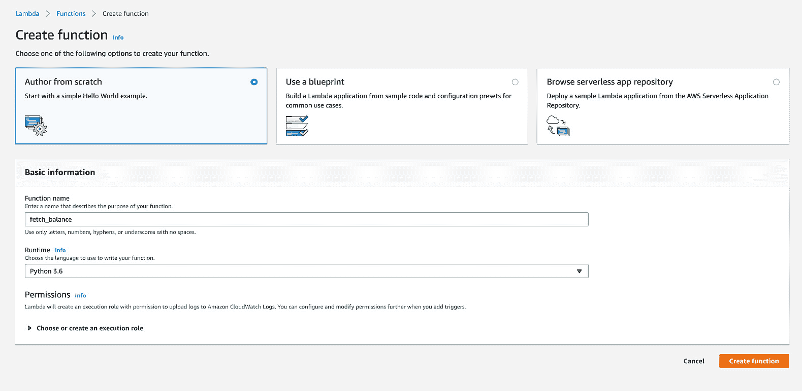
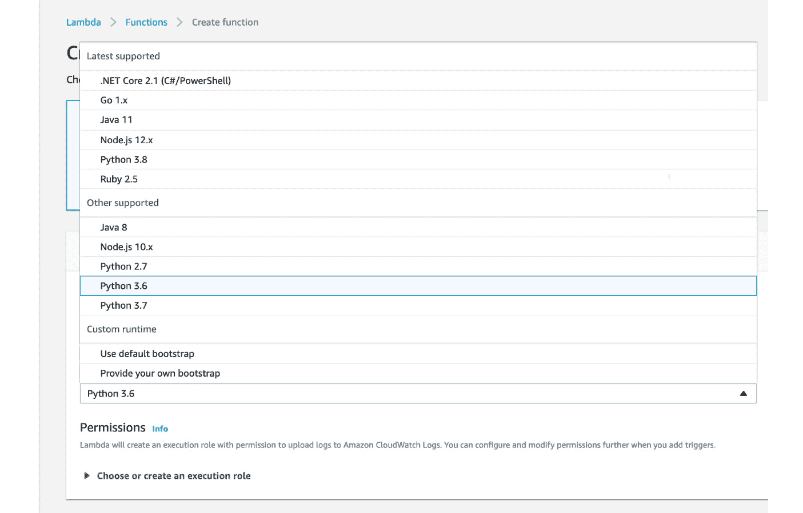
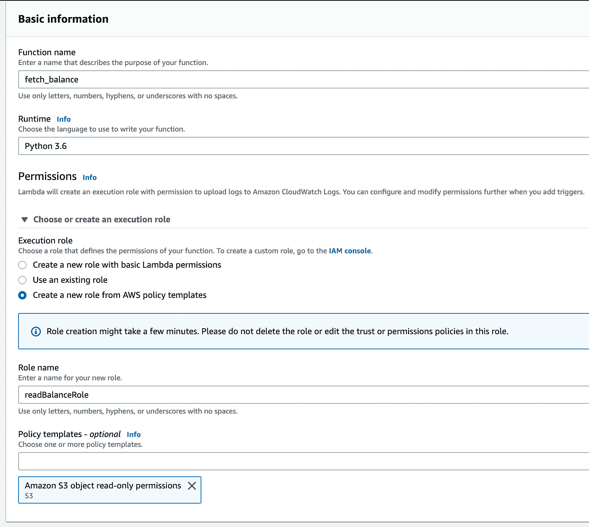
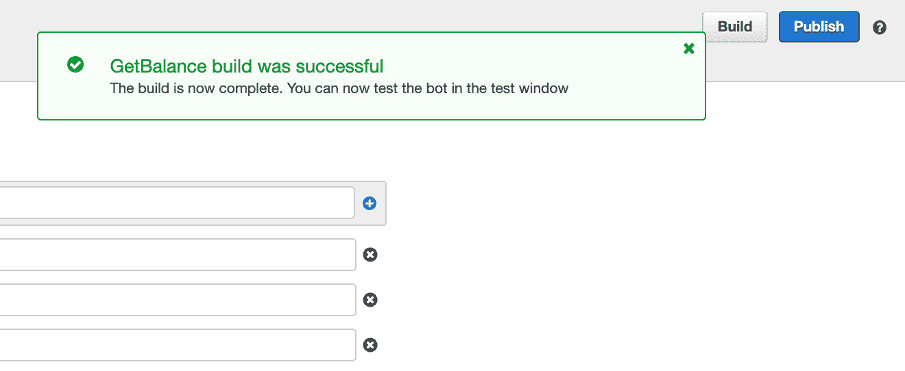

# 附录

# 1. AWS 简介

## 活动 1.01：使用 CLI 将数据放入 S3

**解决方案：**

1.  通过执行 `aws s3 ls` 来验证配置是否正确，以输出您的存储桶名称（存储桶名称将是唯一的）：

    图 1.46：命令行显示 S3 存储桶中的文件列表

    注意

    您将看到的列表可能与前面的截图略有不同。这取决于您已经执行了哪些活动或练习；您可能会在 S3 中看到更多一些文件。

1.  让我们创建一个新的 S3 存储桶。`mb` 是创建存储桶的命令：

    ```py
    aws s3 mb s3://lesson1-text-files-20200217
    ```

    

    图 1.47：创建 S3 存储桶的命令

    如果成功，您将看到 `make_bucket : message`。

    注意

    您的存储桶名称需要是唯一的，因此添加 YYYYMMDD 到名称（或类似的内容）使其变得唯一更容易。您将在后面的章节中看到这种技术。如果您查看早期的 `ls` 命令，您将看到使用的存储桶名称——甚至使用了 YYYYMMDDHHMM 来确保名称的唯一性。有关具体细节，请参阅 S3 的“存储桶命名规则” [https://docs.aws.amazon.com/awscloudtrail/latest/userguide/cloudtrail-s3-bucket-naming-requirements.html](https://docs.aws.amazon.com/awscloudtrail/latest/userguide/cloudtrail-s3-bucket-naming-requirements.html))。

1.  将您的文本文件导入到 S3 存储桶中。

    对于这些练习，我们为您从《德古拉》和《彼得·潘》中准备了一些听起来很有趣的文本摘录。这些文件位于 GitHub [https://packt.live/31WESlK](https://packt.live/31WESlK)。假设您已经在本地上克隆了存储库，使用命令行导航到本地目录。在我们的例子中，文件位于 `~/Documents/aws-book`：

    

    图 1.48：在命令行中导航到本地目录

1.  要将文件从本地目录复制到 S3，请使用命令 `aws s3 cp pos_sentiment__leaves_of_grass.txt s3://lesson1-text-files-20200217` 将文本文件导入到您的 S3 存储桶，如图 1.48 的末尾所示：

1.  同样，将 `neg_sentiment__dracula.txt` 和 `peter_pan.txt` 文件导出到 S3 存储桶：

    图 1.49：在命令行中从本地目录复制文件

1.  在命令行中导航到您的桌面。使用 `mkdir s3_exported_files` 命令创建一个名为 `s3_exported_files` 的新本地文件夹：

    图 1.50：在命令行中导航到桌面

1.  接下来，使用 `- -recursive` 参数递归地从 S3 存储桶中导出两个文件（`neg_sentiment__dracula.txt` 和 `peter_pan.txt`）到您的本地目录。以下是指令的输出：

    图 1.51：从 S3 存储桶复制文件的命令行

1.  使用 `dir` 或 `ls` 命令验证对象是否已成功导出到你的本地文件夹，如下截图所示。这是预期的输出：

图 1.52：从 S3 存储桶进行多文件复制的结果

# 2. 使用自然语言处理分析文档和文本

## 活动 2.01：将 Lambda 与 Amazon Comprehend 集成以执行文本分析

**解决方案**：

1.  将 `test_s3trigger_configured.txt` 文件上传到我们的 S3 存储桶以验证 Lambda `s3_trigger` 函数配置成功。

1.  导航到 S3 页面：[https://console.aws.amazon.com/s3/](https://console.aws.amazon.com/s3/).

1.  点击用于测试 `s3_trigger` 函数的存储桶名称（在我的情况下，为 `aws-ml-s3-trigger-202001181023`）：

    图 2.55：S3 存储桶列表

1.  点击 `上传`：

    图 2.56：S3 存储桶列表上传屏幕

    以下屏幕将显示：

    

    图 2.57：S3 上传存储桶添加文件屏幕

1.  点击 `添加文件`：

    图 2.58：S3 添加文件选择屏幕

1.  导航到 `test_s3trigger_configured.txt` 文件位置。选择该文件。

    该文件包含以下文本：

    ```py
    I am a test file to verify the s3 trigger was successfully configured on 1/20/2020 at 1:34 PM and tried 3 times!
    ```

    在我们执行 `s3_trigger` 之前，考虑以下文本方面的输出：情感（正面、负面或中性）、实体（数量、人物、地点等）和关键词。

    备注

    `test_s3trigger_configured.txt` 可在以下 GitHub 仓库中找到：[https://packt.live/3gAxqku](https://packt.live/3gAxqku).

1.  点击 `上传`，然后 `下一步`：

    图 2.59：用于 Lambda 触发测试的存储桶中添加的文件

1.  在设置权限选项卡中点击 `下一步`：

    图 2.60：用于 Lambda 触发测试的存储桶中添加的文件——对象权限

1.  保持默认的 `Standard` `存储类` 并点击 `下一步`：

    图 2.61：用于 Lambda 触发测试的存储桶中添加的文件——存储类

1.  选择 `上传`：

    图 2.62：用于 Lambda 触发测试的存储桶中添加的文件——上传

1.  你将在文件列表中看到该文件：

    图 2.63：用于 Lambda 触发测试的存储桶中添加的文件 – 文件列表

1.  现在我们来看看我们的Lambda是否被触发。通过`Services>Compute>Lambda>Functions>s3_trigger`导航回Lambda。点击`监控`：

    图2.64：选择监控选项卡

1.  点击`在CloudWatch中查看日志`：

    图2.65：在CloudWatch中选择查看日志

1.  点击日志流：

    图2.66：选择日志流

1.  选择`文本`旁边的单选按钮以展开输出：

    图2.67：点击单选按钮以展开Lambda输出

    以下是一些输出内容的前几行。要查看整个输出，您需要向下滚动以查看所有结果（见下文）。我们将在下一步解释总输出：

    

    图2.68：s3_trigger输出的顶部部分

    注意

    如果您遇到权限错误，请检查`Services>Security, Identity, & Compliance-IAM-Roles`中的`s3TriggerRole`的权限。策略列表应如下所示。如果其中之一缺失，您可以添加它们。

1.  此外，如果您删除并重新创建Lambda，您可以重用该角色——只需选择`使用现有角色`而不是`创建新角色`。总是好的，尝试各种配置并了解它们是如何相互配合的：

    图2.69：s3TriggerRole的策略

1.  现在我们来检查AWS Comprehend的Lambda结果。您可能会看到略有不同的置信度水平，因为亚马逊定期训练其算法。

    `Sentiment_response` -> 被分类为`51.0`%可能是中性的。这是一个陈述，所以中性是好的。

    `Sentiment_response`：

    ```py
    { {'Sentiment': 'NEUTRAL', 
       'SentimentScore': {'Positive': 0.21022377908229828, 
                          'Negative': 0.27646979689598083, 
                          'Neutral': 0.5132954716682434, 
                          'Mixed': 1.0932244549621828e-05},
    ```

    `entity_response` -> 它确实从文本中找到了日期和数量

    `entity_response`：

    ```py
    { 'Entities': [{'Score': 0.9891313314437866, 
                    'Type': 'DATE', 'Text': '1/20/2020 at 1:34 PM', 
                    'BeginOffset': 76, 'EndOffset': 96}, 
                   {'Score': 0.9999986290931702, 'Type': 'QUANTITY', 
                    'Text': '3 times', 'BeginOffset': 107, 
                    'EndOffset': 114}], 
    ```

    `key_phases_response` -> 它找到了关键短语，分数接近100%的置信度

    `key_phases_response`：

    ```py
    {'KeyPhrases': [{'Score': 0.9992266297340393, 
                     'Text': 'a test file', 'BeginOffset': 8, 
                     'EndOffset': 19}, 
                    {'Score': 0.9999999403953552, 
                     'Text': 'the s3 trigger', 'BeginOffset': 30, 
                     'EndOffset': 44}, 
                    {'Score': 0.9999963045120239, 
                     'Text': '1/20/2020', 'BeginOffset': 76, 
                     'EndOffset': 85}, 
                    {'Score': 0.9960731863975525, 
                     'Text': '1:34 PM', 'BeginOffset': 89, 
                     'EndOffset': 96}, 
                    {'Score': 0.9999966621398926, 'Text': '3 times', 
                     'BeginOffset': 107, 'EndOffset': 114}],
    ```

# 3. 主题建模和主题提取

## 活动三.01：对一组未知主题的文档执行主题建模

**解决方案**：

1.  对于这个活动，我们将使用1,000个电影评论文件。导航到以下链接（或导航到您已下载GitHub文件的本地目录）以获取包含电影评论的文本数据文件：[https://packt.live/3gISDZL](https://packt.live/3gISDZL)。肯定比手动下载1,000个文件要好。

1.  导航到S3仪表板[https://s3.console.aws.amazon.com/s3/home](https://s3.console.aws.amazon.com/s3/home)。

1.  点击您之前创建的存储桶（在我的情况下，它是"`aws-ml-input-for-topic-modeling-20200301`"）：

    图3.50：'input-for-topic-modeling'的S3主屏幕

1.  点击`创建文件夹`：

    图3.52：点击保存

    注意

    对于这一步，您可以选择跟随练习并输入Jupyter笔记本中的代码，或者从本章的源代码文件夹中获取笔记本文件（`text_files_to_s3.ipynb`）：[https://packt.live/2W077MR](https://packt.live/2W077MR)。复制文件并将其粘贴到编辑器中。

1.  首先，您将使用以下命令导入`os`和`boto3`包：

    ```py
    import os
    import boto3
    ```

1.  创建一个S3客户端：

    ```py
    # Create an S3 client
    s3 = boto3.client('s3')
    ```

1.  接下来，在突出显示的区域输入您唯一的存储桶名称：

    ```py
    BUCKET_NAME = '<insert a unique bucket name>'
    BUCKET_FOLDER = 'movie_review_files/'
    ```

1.  接下来，获取本地路径中文本文件的当前工作目录：

    ```py
    LOCAL_PATH = os.getcwd() +'\\os.getcwd() command will get the current path. Ensure that the movie review files are in a folder located at the same path. Based on the folder name, you have to change the highlighted value. Alternatively, you can assign a custom path to LOCAL_PATH as well.
    ```

1.  创建所有文本文件的列表：

    ```py
    text_files_list = [f for f in os.listdir(LOCAL_PATH) \
                       if f.endswith('.txt')]
    ```

1.  对所有文件进行迭代，并将每个文件上传到`s3`：

    ```py
    file_count = 0
    for filename in text_files_list:
      # print(filename)
      file_count += 1
    s3.upload_file(LOCAL_PATH + filename, BUCKET_NAME, \
                   BUCKET_FOLDER + filename)
    print(F"Completed uploading {file_count} files.")
    ```

1.  按*Shift* + *Enter*运行单元格。

1.  这将需要几分钟时间。结果是1,000个文本文件被上传到S3的`movie_review_files`文件夹：

    图3.53：上传到S3的movie_review_files

1.  参考以下图中的S3输出前几行：。您也可以从[https://aws.amazon.com/](https://aws.amazon.com/)进入，然后点击`我的账户`并选择`AWS管理控制台`。在控制台中，选择`服务`然后点击机器学习类别下的`Amazon Comprehend`。

1.  然后，点击`启动Amazon Comprehend`：

    图3.55：Amazon Comprehend的主屏幕

1.  现在，点击左侧工具栏上的第一个项目`分析作业`：

    图3.56：选择分析作业

1.  现在，点击`创建作业`：

    图 3.61：展开 S3 存储桶子文件夹

1.  点击“`movie_review_files`”文件夹旁边的单选按钮：

    图 3.62：选择 movie_review_files 文件夹

1.  现在，点击“选择”按钮。

    以下图显示了所选输入数据的 S3 位置：

    

    图 3.63：选择输入数据的 S3 位置

1.  从“输入格式”下拉菜单中选择“每文件一个文档”：

    图 3.64：选择每文件一个文档选项

1.  接下来，在“主题数量”输入字段中输入`40`：

    图 3.65：输入 40 个主题

1.  滚动到选择输出位置，然后点击“浏览 S3”：

    图 3.66：点击浏览 S3

1.  选择您为主题建模输出唯一命名的输出存储桶，然后点击“选择”：

    图 3.67：选择主题建模输出的 S3 存储桶

1.  滚动到“访问权限”，并选择如图所示的“使用现有的 IAM 角色”：

    图 3.68：在访问权限中选择使用现有的 IAM 角色

1.  在“角色名称”下拉菜单中，选择`AmazonComprehendServiceRole-myTopicModelingRole`：

    图 3.69：选择现有的 IAM 角色

1.  最终屏幕应如下所示：

    图 3.70：选择现有的 IAM 角色

1.  点击“创建作业”按钮。主题建模作业状态将首先显示为“已提交”：

    图 3.71：状态为已提交

1.  主题建模作业状态将随后显示为“进行中”。主题建模作业大约需要 20 分钟：

    图 3.72：状态为进行中

1.  当状态变为“完成”时，点击`unknown_topic_structure_job`链接：

    图 3.73：选择超链接的主题建模链接

    备注

    如您所见，我们第一次没有做对，状态显示为“失败”。可能需要尝试几次。如果作业失败，请点击“复制”（位于“创建作业”按钮左侧的按钮）并纠正错误。由于不能有重复的作业，一个好的流程是在作业名称后附加一个序列号，例如，`unknown_topic_structure_job_01`。

1.  滚动并单击主题建模输出超链接（您的将显示不同的唯一主题建模作业字母数字字符串）：![图3.74：单击主题建模输出S3位置

    ![img/B16061_03_74.jpg]

    图3.74：单击主题建模输出S3位置

1.  您将被引导到S3输出文件夹中实际的主题建模作业文件。点击“下载”：![图3.75：在输出文件上点击下载

    ![img/B16061_03_75.jpg]

    图3.75：在输出文件上点击下载

1.  将文件保存到本地目录；通常，`下载`文件夹或桌面都行：![图3.76：从S3保存下载的输出文件

    ![img/B16061_03_76.jpg]

    图3.76：从S3保存下载的输出文件

1.  导航到您下载文件的目录，通过双击提取CSV文件。在Windows中，右键单击`output.tar.gz`文件并选择“在此处提取”：![图3.77：选择此处提取

    ![img/B16061_03_77.jpg]

    图3.77：选择此处提取

    结果是两个CSV文件：`doc-topics.csv`和`topic-terms.csv`。

    作为参考，提取的CSV文件可在以下GitHub目录中找到，以及您在本地目录中下载它们的位置（在我的情况下，这是`/Users/ksankar/Documents/aws_book/The-Applied-AI-and-Natural-Language-Processing-with-AWS/Chapter03/Activity3.01`）：

    [https://packt.live/2AIccSw](https://packt.live/2AIccSw).

    [https://packt.live/3eaGdry](https://packt.live/3eaGdry).

    我们已经完成了第1部分：执行主题建模，对于这个活动。现在，让我们进入第2部分：未知主题的分析。

    注意

    对于这一步，您可以选择跟随练习并输入代码到Jupyter笔记本中，或者从您下载存储库的GitHub文件夹中获取`local_csv_to_s3_for_analysis.ipynb`文件并将其粘贴到Jupyter编辑器中。作为参考，源代码可通过以下GitHub存储库获取：[https://packt.live/3gDErks](https://packt.live/3gDErks)。

1.  首先，我们将导入`boto3`：

    ```py
    import boto3
    ```

1.  接下来，导入`pandas`：

    ```py
    import pandas as pd
    ```

1.  创建S3客户端对象。

    ```py
    region = 'us-west-2'
    s3 = boto3.client('s3',region_name = region)
    ```

1.  接下来，为存储源CSV文件的S3存储桶创建一个唯一名称。在这里，存储桶被命名为`unknown-tm-analysis-20200302`，但您需要创建一个唯一的名称：

    ```py
    #'<insert a unique bucket name>'
    bucket_name = 'unknown-tm-analysis-20200302'
    ```

1.  接下来，创建一个新的存储桶：

    ```py
    # Create a location Constraint
    location = {'LocationConstraint': region}
    # Creates a new bucket 
    s3.create_bucket(Bucket=bucket_name,\
                     CreateBucketConfiguration=location)
    ```

1.  创建一个CSV文件名列表以导入：

    ```py
    filenames_list = ['doc-topics.csv', 'topic-terms.csv']
    ```

1.  遍历每个要上传到S3的文件：

    ```py
    for filename in filenames_list: 
        s3.upload_file(filename, bucket_name, filename)
    ```

1.  接下来，检查文件名是否为`'doc-topics.csv'`：

    ```py
    if filename == 'doc-topics.csv':
    ```

1.  现在，获取`doc-topics.csv`文件对象并将其分配给`obj`变量：

    ```py
    obj = s3.get_object(Bucket=bucket_name, Key=filename)
    ```

1.  接下来，读取`csv`对象并将其分配给`doc_topics`变量：

    ```py
    doc_topics = pd.read_csv(obj['Body']) else:
    obj = s3.get_object(Bucket=bucket_name, Key=filename) \
                        topic_terms = pd.read_csv(obj['Body'])
    ```

1.  在主题列上合并文件以获取每个文档的最常见术语：

    ```py
    merged_df = pd.merge(doc_topics, topic_terms, on='topic')
    ```

1.  将`merged_df`打印到控制台：

    ```py
    print(merged_df)
    ```

1.  接下来，使用*Shift* + *Enter*执行笔记本单元格。

1.  控制台输出是一个合并的DataFrame，它提供了文档名称及其相应的术语和术语的权重（参见图）：

图 3.78：S3 创建存储桶调用的输出


图 3.79：活动合并主题建模输出

# 5. 使用语音与聊天机器人

## 活动第 5.01：创建自定义机器人和将机器人连接到 Amazon Connect

**解决方案：**

这是一个结合了我们之前章节所学内容的活动。尝试自己完成活动，并在需要时参考解决方案。你可能会犯错，会遇到看起来不起作用的事情。这些都是学习有趣领域的一部分。如果你逐步构建和测试，开发将更容易，并且会有更少的移动部件。

**步骤 1：创建 S3 存储桶并存储 balance.txt**

1.  首先，从 https://aws.amazon.com/ 导航到 Amazon S3 服务，然后导航到 `我的账户 – AWS 管理控制台-服务-存储-S3`。点击 `创建存储桶`：

    图 5.35：为用户账户余额创建 S3 存储桶

    对于 `存储桶名称`，输入 `account-balance`，然后点击 `创建`。

    **注意**

    AWS 中的存储桶名称必须唯一。否则，您将收到 `存储桶名称已存在` 错误。一种简单的方法是将日期和时间附加到存储桶名称上，例如，YYYYMMDDHHMM。在编写本章时，我们创建了一个名为 `account-balance-202001241911` 的存储桶，并且它工作正常。

1.  您的存储桶将被创建，并且您将被重定向到存储桶列表：

    图 5.36：S3 存储桶列表屏幕

1.  点击您正在使用的存储桶名称（在我们的例子中，为 `account-balance-202001241911`），然后点击 `上传`：

    图 5.37：上传屏幕上的 S3 存储桶列表

    以下屏幕将显示：

    

    图 5.38：S3 上传存储桶添加文件屏幕

1.  点击 `添加文件`：

    图 5.39：S3 添加文件选择屏幕

1.  导航到 `balance.txt` 文件位置。选择文件。

    **注意**

    `balance.txt` 文件可以从以下 GitHub 仓库获取：[https://packt.live/38CipvB](https://packt.live/38CipvB)。

    正如我们在 *第 1 章* 中提到的，*AWS 简介*，你应该已经将 GitHub 文件下载到本地子目录中。

    例如，将文件下载到 `Documents/aws-book/The-Applied-AI-and-Natural-Language-Processing-with-AWS` 目录。正如你可能猜到的，这个练习的文件位于 `Chapter05` 子目录中。

1.  选择完文件后，点击 `打开` 按钮上传文件：

    图 5.40：资源管理器中的文件选择窗口

1.  点击 `下一步`：

    图 5.41：S3 选择文件选项卡

1.  将权限设置为以下截图所示：

    图 5.42：S3 设置权限选项卡

1.  在“存储类”下保持默认的“标准”选项，然后点击“下一步”：

    图 5.47：Lambda 控制台

1.  在`Lambda`控制台中，点击“创建函数”。

1.  从可用选项中选择“从头开始创建作者”。对于“函数名称”，键入`fetch_balance`：![图 5.48：AWS Lambda – 使用从头开始创建作者选择创建函数

    

    图 5.48：AWS Lambda – 使用从头开始创建作者选择创建函数

1.  对于“运行时”选项，从列表中选择`Python 3.6`：![图 5.49：AWS Lambda—Python 3.6 选择

    

    图 5.49：AWS Lambda—Python 3.6 选择

1.  点击“选择或创建执行角色”，然后选择“从 AWS 策略模板创建新角色”。然后，在“角色名称”字段中输入`readBalanceRole`。

1.  在“策略模板”下点击下拉菜单，然后选择“Amazon S3 对象只读权限”。

1.  然后，点击“创建函数”按钮以在 AWS 中创建 Lambda 函数：![图 5.50：AWS Lambda—创建函数屏幕

    

    图 5.50：AWS Lambda—创建函数屏幕

    您将看到 Lambda 函数设计器。那里有很多信息。让我们关注这个活动的要点：

     下载的文件。

    导入`boto3`：

    ```py
    import boto3
    ```

1.  接下来，创建一个接受两个参数——`event`和`context`的函数：

    ```py
    def Lambda_handler(event, context):
    ```

1.  接下来，创建`s3`客户端对象：

    ```py
    s3 = boto3.client("s3")
    ```

1.  接下来，将`<输入桶名>`替换为您创建的桶（例如，在我的例子中是`account-balance-202001241911`）：

    ```py
    # e.g." account-balance-202001241911"
    bucket = "<input Bucket name>"
    ```

1.  接下来，将`filename`分配给一个变量，然后打印文件名：

    ```py
    filename = 'balance.txt'
    print("filename: ", filename)
    ```

1.  接下来，通过获取`Bucket`和`Key`创建文件对象：

    ```py
    file_obj = s3.get_object(Bucket = Bucket, Key = filename)
    ```

1.  从文件中提取账户余额：

    ```py
    account_balance =  (float(file_obj['Body'].read()))
    ```

1.  然后，将余额作为消息返回：

    ```py
    return close('Your balance is ' + str(account_balance))
    ```

1.  我们需要为我们的机器人提供一个`close`函数，它需要一个格式良好的 JSON 响应：

    ```py
    def close(message):
        return {
            'sessionAttributes': {},
            'dialogAction': {
                'type': 'Close',
                'fulfillmentState': 'Fulfilled',
                'message': {
                    'contentType': 'PlainText',
                    'content': message
                }
            }
        }
    ```

    记得经常`保存`函数：

    备注

    使用右上角的`测试`按钮测试和调试代码。您将在代码面板下方的`执行结果`中看到结果。

1.  点击右上角的`测试`按钮：

    图 5.56：配置名为 getBalance 的测试事件

1.  您将在`执行结果`选项卡下看到结果：

图 5.58：`fetch_balance`函数的执行结果 – 函数日志

**第 3 步：创建 Lex 机器人以使用 Lambda 函数获取余额**

1.  第一步是导航到 AWS 控制台中的`Amazon Lex`服务。您可以通过点击`服务`|`机器学习`|`Amazon Lex`或导航到[https://console.aws.amazon.com/lex](https://console.aws.amazon.com/lex)来实现。

1.  下一步是点击`创建`按钮，以便进入`聊天机器人`创建屏幕：

    图5.59：Amazon Lex控制台

1.  在这一点上，您可以通过点击`自定义聊天机器人`选项来创建一个自定义聊天机器人。这会显示聊天机器人的详细信息，可以填写，如下面的截图所示：

    图5.60：自定义聊天机器人选项

1.  `聊天机器人名称`字段可以设置为`GetBalance`。`输出语音`字段可以设置为任何声音，例如，您可以选择`Kendra`。这是因为我们将使用语音与聊天机器人进行交互。

1.  `会话超时`可以设置为默认的`5`分钟。`IAM角色`字段显示IAM角色的名称，Lex会自动创建该角色以供聊天机器人应用程序使用。对于`情感分析`，我们选择`否`。

1.  最后，`COPPA`字段指的是`儿童在线隐私保护法案`，这是在线应用程序必须遵守的。根据您是否希望13岁以下的用户使用您的聊天机器人，选择`是`或`否`。

    注意

    1998年通过了一项法律，以保护13岁以下儿童的隐私。该法律指出，在线网站在未经父母同意的情况下，不得收集13岁以下用户的个人信息，以及其他规定。您可以在[https://www.ftc.gov/enforcement/rules/rulemaking-regulatory-reform-proceedings/childrens-online-privacy-protection-rule](https://www.ftc.gov/enforcement/rules/rulemaking-regulatory-reform-proceedings/childrens-online-privacy-protection-rule)了解更多关于COPPA的信息。

1.  最后，点击`创建`按钮将创建聊天机器人，并带您进入聊天机器人的`编辑`屏幕。此屏幕将允许您为聊天机器人创建和定义意图，以及一个具有自定义槽类型的槽。

1.  点击`创建意图`按钮，将弹出`添加意图`的弹出对话框：

    图5.61：GetBalance聊天机器人的编辑标签

1.  相反，如果您已经定义了一个意图，您可以通过点击屏幕左侧菜单中`意图`标题旁边的`+`号来创建一个新的意图。

1.  `创建意图`窗口提供了一些选项，可以将意图添加到聊天机器人中。`导入意图`链接允许您从包含一个或多个Lex格式意图的`ZIP`文件中导入意图。

1.  搜索现有意图允许您重用您可能之前定义或导入的意图，以及Amazon Lex定义的内置意图。

1.  您只需点击`创建意图`链接，即可进入以下对话框。

1.  在`创建意图`对话框中，为新意图命名为`Balance`。当您告诉聊天机器人您对市场报价感兴趣时，聊天机器人将识别此意图。点击`添加`按钮完成此步骤：

    图 5.64：构建机器人

1.  将会出现一个带有另一个 `构建` 按钮的后续对话框，你也应该点击它：

    图 5.65：构建确认

1.  在此之后，你应该等待，直到你看到 `GetBalance 构建成功` 消息框。这可能需要几秒钟到几分钟：![图 5.66：机器人构建成功

    

    图 5.66：机器人构建成功

    你可以在屏幕右上角的 `测试机器人` 窗格中测试你的新意图，在机器人内部。

    注意

    如果 `测试机器人` 窗格不可见，你可能需要点击箭头按钮以展开它并使其可见。

    在窗格中输入语句以验证机器人能否从语句中识别出正确的意图：

    

图 5.69：测试 Lambda 函数

我们正在取得良好的进展。

**步骤 4：将 Amazon Connect 呼叫中心连接到 GetBalance 机器人**

我们将扩展在 `练习 5.01` 中创建的呼叫中心，以添加此 `GetBalance` 功能。

1.  从 `我的账户` | `AWS 管理控制台`，转到 `服务` | `客户参与` | `Amazon Connect`。选择你创建的实例（在我们的例子中是 `jarvis42`）：

    图5.71：Amazon Connect联系流程

1.  下一步是创建一个联系流程。转到仪表板，点击右上角的`查看联系流程`和`创建联系流程`：

1.  将其命名为`GetBalance`，并按照以下方式连接：

    图5.72：联系流程编辑器—添加入口点

1.  添加`获取客户输入`和一条友好的消息：

    图5.73：获取客户输入详情

1.  将其连接到我们的`GetBalance` Lex机器人和`Balance`意图：

    图5.74：获取客户输入配置

    然后，暂时将所有这些连接到挂断。这是一个简单的序列。您可以尝试各种流程：

    

    图5.75：添加挂断流程

    现在我们已经创建了另一个联系流程，让我们重新连接我们的电话号码来回答这个问题。

1.  前往`概览`，点击`登录URL`，然后输入您的Amazon Connect凭据：

    图5.76：概览屏幕

1.  点击`路由`和`电话号码`：

    图5.77：选择电话号码

1.  点击电话号码：

    图5.78：管理电话号码屏幕

1.  从下拉列表中选择`GetBalance`用于`Contact flow/IVR`：

    图5.79：将GetBalance添加到电话号码

1.  点击`保存`。现在您已经将机器人连接到了呼叫中心。

1.  拨打电话。它会问您`我能帮您什么忙？`您可以说`我有多少钱？`然后它会回答`您有42.0！`亚马逊做得很好：当我们通过测试控制台从键盘激活机器人时，它给我们发回了文本消息。然而，当我们通过Connect拨打时，它给我们的是语音回答。

这是个好时机，可以尝试不同的问题，甚至不同的人——您的朋友、您的配偶和其他人。通过相对较少的工作，语音机器人将能够理解他们在说什么，并回答这个简单的问题。您可以尝试不同的提示，也许甚至添加一个美元符号，看看它是否正确地说出来。

# 6. 计算机视觉和图像处理

## 活动第6.01节：在Rekognition中创建和分析不同的面部

**解决方案**:

1.  从亚马逊管理控制台导航到亚马逊Rekognition服务，并在左侧工具栏中选择`面部比较`。

1.  将第一组图像上传到 Rekognition 以便它可以识别和比较人脸，即[https://packt.live/31X6IP6](https://packt.live/31X6IP6) 和 [https://packt.live/2ZLseUd](https://packt.live/2ZLseUd)：

    图 6.56：用于人脸比较的第一组图像

    即使在不同角度、光照和色调下，Rekognition 也能以 `99.1`% 的置信度识别出这些人脸是同一个人：

    

    图 6.57：用于人脸比较的第一组图像的结果

    **额外挑战**

1.  第二组图像是 [https://images.unsplash.com/photo-1526510747491-58f928ec870f](https://images.unsplash.com/photo-1526510747491-58f928ec870f) 和 [https://images.unsplash.com/photo-1529946179074-87642f6204d7](https://images.unsplash.com/photo-1529946179074-87642f6204d7)：


图 6.58：用于人脸比较的第二组图像

再次证明，Rekognition 以 99.4% 的置信度识别出人脸，即使在不同的角度下：


图 6.59：用于人脸比较的第二组图像的结果

在那些令人印象深刻的成果基础上，我们得出这个活动的结论。
