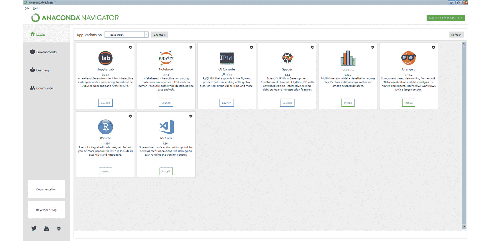
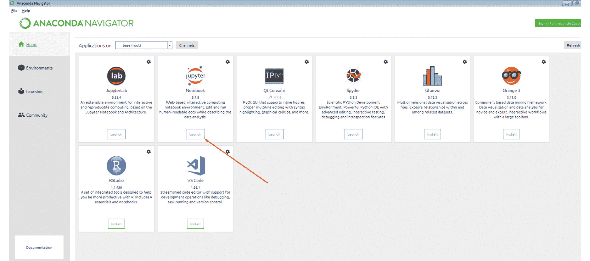

# 前言

# 关于本书

你已经知道**人工智能**（**AI**）和**机器学习**（**ML**）已经出现在你日常使用的许多工具中。但你是否希望能够创建你自己的 AI 和 ML 模型，并在这些领域提升你的技能，从而启动你的 AI 职业生涯？

*应用人工智能工作坊*通过实践练习和有用的示例帮助你入门，所有内容巧妙结合，帮助你获得技能，转变职业生涯。

本书首先教你如何使用回归分析预测结果。接下来，你将学习如何使用**K-近邻算法**（**KNN**）和**支持向量机**（**SVM**）分类器对数据进行分类。随着学习的深入，你将通过学习如何构建一个可靠的决策树模型来探索各种决策树，这个模型可以帮助你的公司找到客户可能购买的汽车。最后几章将介绍深度学习和神经网络。通过各种活动，如预测股价和识别手写数字，你将学习如何训练和实施**卷积神经网络**（**CNN**）和**递归神经网络**（**RNN**）。

本书结束时，你将学会如何预测结果并训练神经网络，并能够使用各种技术来开发 AI 和 ML 模型。

## 受众

*应用人工智能工作坊*是为软件开发人员和数据科学家设计的，旨在帮助他们通过机器学习丰富项目。虽然你不需要人工智能方面的经验，但建议你具备高中水平的数学知识，并至少掌握一种编程语言，最好是 Python。尽管这是一本入门书籍，但经验丰富的学生和程序员也可以通过专注于本书中的实际应用来提高他们的 Python 编程技能。

## 关于章节

*第一章*，*人工智能概述*，介绍了人工智能。你还将通过一个简单的井字游戏实现你的第一个人工智能，在这个游戏中，你将教会程序如何战胜人类玩家。

*第二章*，*回归分析简介*，介绍了回归分析。你将遇到各种技术，例如单变量和多变量的线性回归，以及多项式回归和支持向量回归。

*第三章*，*分类简介*，介绍了分类。这里，你将实现各种技术，包括 K-近邻算法和支持向量机。

*第四章*，*决策树简介*，介绍了决策树和随机森林分类器。

*第五章*，*人工智能：聚类*，开始引导你用全新的方式思考，进行第一个无监督学习模型。你将了解聚类的基础知识，并使用 k-means 算法实现平面聚类，使用均值漂移算法实现层次聚类。

*第六章*，*神经网络与深度学习*，介绍了 TensorFlow、卷积神经网络（CNN）和循环神经网络（RNN）。你还将使用神经网络和深度学习实现图像分类程序。

## 约定

文本中的代码词汇、文件夹名称、文件名、文件扩展名、路径名和用户输入以如下方式显示：“请注意，此函数位于 `tensorflow` 命名空间中，默认情况下不会引用它。”

一段代码设置如下：

```py
features_train = features_train / 255.0
features_test = features_test / 255.0
```

新术语和重要词汇以这样的方式显示：“**均值漂移**是层次聚类的一个例子，其中聚类算法决定了聚类的数量。”

## 代码展示

跨越多行的代码通过反斜杠（`\\`）进行拆分。当代码执行时，Python 会忽略反斜杠，并将下一行的代码视为当前行的直接延续。

例如：

```py
history = model.fit(X, y, epochs=100, batch_size=5, verbose=1, \
                   validation_split=0.2, shuffle=False)
```

注释被添加到代码中，以帮助解释特定的逻辑。单行注释使用 `#` 符号表示，如下所示：

```py
# Print the sizes of the dataset
print("Number of Examples in the Dataset = ", X.shape[0])
print("Number of Features for each example = ", X.shape[1])
```

多行注释用三引号括起来，如下所示：

```py
"””
Define a seed for the random number generator to ensure the 
result will be reproducible
"””
seed = 1
np.random.seed(seed)
random.set_seed(seed)
```

## 设置你的环境

在我们详细探索本书之前，我们需要设置特定的软件和工具。在接下来的部分中，我们将看到如何做到这一点。

## 在系统上安装 Jupyter

要在 Windows、MacOS 和 Linux 上安装 Jupyter，请执行以下步骤：

1.  前往 [`www.anaconda.com/distribution/`](https://www.anaconda.com/distribution/) 安装 Anaconda Navigator，这是一个界面，您可以通过它访问本地的 Jupyter Notebook。

1.  现在，根据你的操作系统（Windows、MacOS 或 Linux），你需要下载 Anaconda 安装程序。请查看以下图示，我们已经为 Windows 下载了 Anaconda 文件：

    ](img/B16060_00_01.jpg)

图 0.1：Anaconda 主界面

## 启动 Jupyter Notebook

从 Anaconda Navigator 启动 Jupyter Notebook 时，需要执行以下步骤：

1.  一旦你安装了 Anaconda Navigator，你将看到 *图 0.2* 中所示的界面：

    ](img/B16060_00_02.jpg)

    图 0.2：Anaconda 安装界面

1.  现在，点击 Jupyter Notebook 选项下的 `Launch` 启动你的本地系统中的 notebook：

    ](img/B16060_00_03.jpg)

图 0.3：Jupyter Notebook 启动选项

你已经成功在系统上安装了 Jupyter Notebook。

## 安装库

`pip` 已预装在 Anaconda 中。一旦 Anaconda 安装在你的机器上，所有必需的库都可以使用 `pip` 安装，例如 `pip install numpy`。或者，你也可以使用 `pip install –r requirements.txt` 一次性安装所有必需的库。你可以在 [`packt.live/3erXq0B`](https://packt.live/3erXq0B) 找到 `requirements.txt` 文件。

练习和活动将在 Jupyter Notebooks 中执行。Jupyter 是一个 Python 库，可以像其他 Python 库一样安装——即使用 `pip install jupyter`，但幸运的是，它已预装在 Anaconda 中。要打开一个笔记本，只需在终端或命令提示符中运行命令 `jupyter notebook`。

## 一些重要的包

本章的一些练习需要以下包：

+   EasyAI

+   Quandl

+   TensorFlow 2.1.0

按照此指南进行安装。在 Windows 上，打开命令提示符。在 macOS 或 Linux 上，打开终端。

要安装 `easyAI` 和 `Quandl`，请输入以下命令：

```py
pip install easyAI==1.0.0.4 Quandl==3.5.0 tensorflow==2.1.0
```

## 访问代码文件

你可以在 [`packt.live/31biHYK`](https://packt.live/31biHYK) 找到本书的完整代码文件。你还可以通过使用 [`packt.live/2Vbev7E`](https://packt.live/2Vbev7E) 提供的互动实验环境，直接在网页浏览器中运行许多活动和练习。

我们已经尽力支持所有活动和练习的互动版本，但我们也建议进行本地安装，以防某些情况下无法使用此支持。

如果你在安装过程中遇到任何问题或有疑问，请通过电子邮件联系我们：workshops@packt.com。
