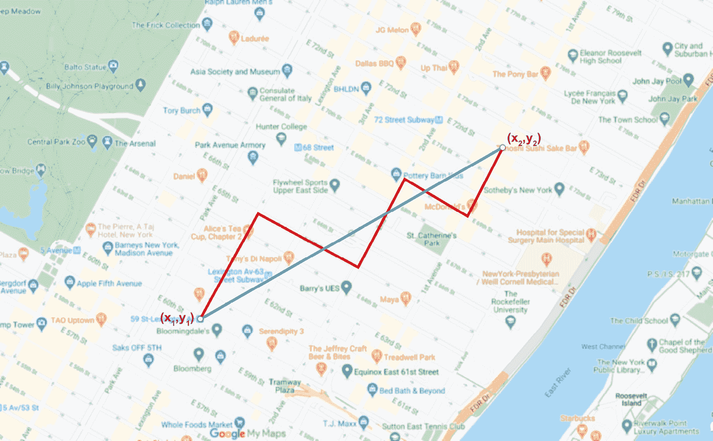
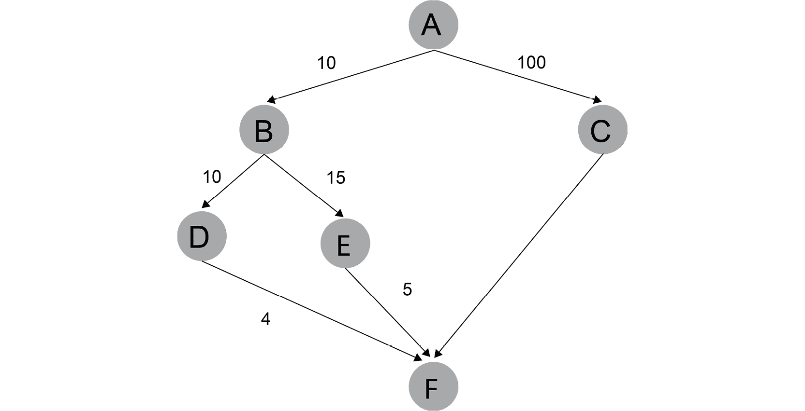
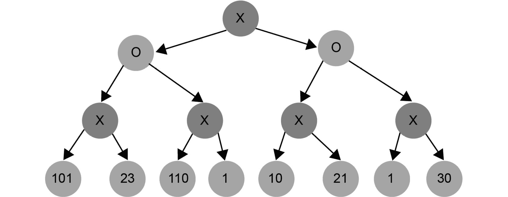
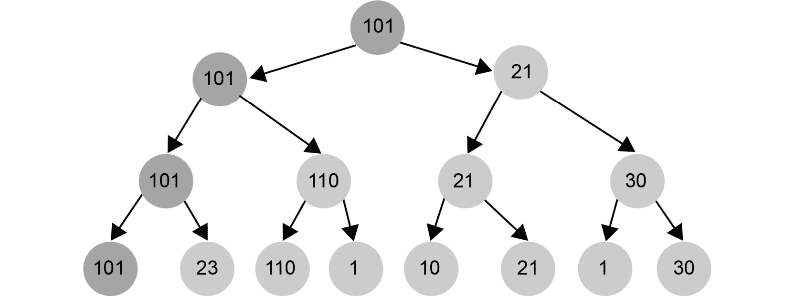

# 第一章：1\. 人工智能简介

概述

本章将向你介绍人工智能（AI）的基础知识，这些知识是各种人工智能领域的基础。你还将通过简单的编码练习使用 Python 编程语言接触不同的算法，包括 MinMax 和 A*。你还将通过一个简单的井字棋游戏实现你的第一个人工智能程序，在这个游戏中，你将教会程序如何击败人类玩家。到本章结束时，你将学会如何使用流行的 Python 库开发智能的人工智能驱动程序。

# 介绍

在讨论不同的人工智能技术和算法之前，我们将先了解人工智能和机器学习的基础知识，并介绍一些基本定义。将通过现实世界的例子以易于理解的方式呈现人工智能的基本概念。

人工智能尝试使用硬件和软件解决方案复制人类智能。它基于逆向工程。例如，人工神经网络是模拟人类大脑工作方式的模型。除了神经网络之外，神经科学中还有许多其他模型可以用来通过人工智能解决现实世界的问题。已知在各自领域中使用人工智能的公司包括：谷歌（Google），提供 Google 翻译；苹果（Apple），提供 Face ID；亚马逊（Amazon），提供 Alexa 产品；甚至 Uber 和特斯拉（Tesla），他们仍在致力于开发自动驾驶汽车。

另一方面，机器学习是一个常常与人工智能混淆的术语。它起源于 1950 年代，并由阿瑟·李·塞缪尔（Arthur Lee Samuel）于 1959 年首次定义。

在他的书《*机器学习*》中，汤姆·米切尔提出了一个简单的定义：“*机器学习领域关注的是如何构建能够随着经验自动改进的计算机程序。*”

我们可以理解为，机器学习是一个领域，目标是构建一个能够从数据中学习模式并随着更多数据的增加而提高学习能力的计算机程序。

他还提出了一个更正式的定义，即计算机程序如果在任务**T**上，通过性能度量**P**衡量后，其在**T**上的表现随着经验**E**的积累而改进，那么可以说它在从经验中学习。这可以转化为计算机程序需要什么才能被认为是在学习。我们可以将**E**（经验）理解为需要输入给机器的数据，**T**作为机器需要执行的决策类型，而**P**则是衡量其表现的标准。

从这两个定义中，我们可以得出结论：机器学习是实现人工智能的一种方式。然而，你也可以不使用机器学习就拥有人工智能。例如，如果你硬编码规则和决策树，或者应用搜索技术，你仍然可以创建一个人工智能代理，尽管你的方法与机器学习关系不大。

人工智能和机器学习帮助科学界应对大数据的爆炸性增长，每秒钟都会生成越来越多的数据。通过人工智能和机器学习，科学家们可以从这些庞大的数据集中提取人眼无法快速处理的信息。

现在我们已经了解了人工智能和机器学习，接下来让我们聚焦于人工智能。

## 人工智能如何解决问题？

*人工智能根据人类大脑处理信息的方式来自动化人类智能。*

每当我们解决问题或与他人互动时，我们都会经历一个过程。通过这样做，我们限制了问题或互动的范围。这个过程通常可以在人工智能中建模并自动化。

*人工智能使计算机看起来像人类一样思考。*

有时，感觉人工智能知道我们需要什么。只需想想你在网上购物后收到的个性化优惠券。人工智能知道我们最可能购买的产品。通过实施不同的技术和模型，机器能够学习你的偏好，我们将在本书后面讨论这些内容。

*人工智能是由执行低级指令的计算机实现的。*

即使一个解决方案看起来似乎很智能，我们仍然编写代码，就像在任何其他人工智能软件解决方案中一样。即使我们在模拟神经元，简单的机器代码和计算机硬件也执行着*思维*过程。

大多数人工智能应用都有一个主要目标。当我们与一个人工智能应用互动时，它看起来像人类，因为它能够将问题领域限制在一个主要目标上。因此，人工智能实现目标的过程可以被分解为更小、更简单的低级指令。

*人工智能可能会刺激人类感官和思维过程，应用于专业领域。*

你必须能够模拟人类的感官和思维，有时甚至要欺骗人工智能相信我们正在与另一个人互动。在某些特殊情况下，我们甚至可以增强我们自己的感官。

类似地，当我们与聊天机器人互动时，我们希望机器人能理解我们。我们期望聊天机器人甚至语音识别系统提供一个计算机与人类之间的接口，满足我们的期望。为了满足这些期望，计算机需要模拟人类的思维过程。

## 人工智能中的学科多样性

一辆无法感知高速公路上其他行驶的车辆的自动驾驶汽车将非常危险。人工智能代理需要处理并感知周围的环境才能驾驶汽车。然而，这还不够，因为如果没有理解运动物体的物理学，在正常环境中驾驶汽车几乎是不可能的，更不用说可能是致命的任务了。

为了创建一个可用的人工智能解决方案，涉及不同的学科，例如：

+   **机器人学**：在空间中移动物体

+   **算法理论**：构建高效的算法

+   **统计学**：推导有用的结果、预测未来并分析过去

+   **心理学**：模拟人类大脑的工作方式

+   **软件工程**：创建可维护的解决方案，能够经受住时间的考验

+   **计算机科学或计算机编程**：在实践中实现我们的软件解决方案

+   **数学**：执行复杂的数学运算

+   **控制理论**：创建前馈和反馈系统

+   **信息理论**：表示、编码、解码和压缩信息

+   **图论**：对空间中的不同点进行建模与优化，并表示层次结构

+   **物理学**：对现实世界进行建模

+   **计算机图形学和图像处理**：显示和处理图像与电影

本书将介绍这些学科中的一些内容，包括算法理论、统计学、计算机科学、数学和图像处理。

# AI 的领域与应用

现在我们已经了解了 AI 的基本概念，让我们继续看看它在现实生活中的应用。

## 人类行为的模拟

人类有五种基本感官，可以分为视觉（看）、听觉（听）、运动觉（动）、嗅觉（闻）和味觉（尝）。然而，为了理解如何创建智能机器，我们可以将这些学科分开如下：

+   听力和口语

+   理解语言

+   记忆事物

+   思维

+   视觉

+   运动

其中一些超出了我们讨论的范围，因为本章的目的是理解基础知识。例如，要移动机器臂，我们必须学习复杂的大学数学才能理解其原理，但在本书中，我们将仅关注实际应用：

+   **听力和口语**：通过语音识别系统，AI 可以从用户处收集信息。利用语音合成，AI 可以将内部数据转化为可理解的声音。语音识别和语音合成技术处理的是人类发出的声音或人类能够理解的声音的识别与构建。

    例如，假设你正在前往一个你不懂当地语言的国家旅行。你可以对着手机的麦克风说话，期望它能够*理解*你所说的内容，然后将其翻译成另一种语言。相反，当当地人说话时，AI 也可以将声音翻译成你能理解的语言。语音识别和语音合成使得这一切成为可能。

    注意

    语音合成的一个例子是谷歌翻译。你可以访问[`translate.google.com/`](https://translate.google.com/)，通过点击翻译后的单词下方的扬声器按钮，让翻译器朗读非英语的单词。

+   **理解语言**：我们可以通过处理自然语言来理解它。这个领域被称为自然语言处理（NLP）。

    在 NLP（自然语言处理）领域，我们往往通过学习音节之间的统计关系来学习语言。

+   **记忆**：我们需要表示我们对世界的了解。这就是创建知识库和分层表示（称为**本体论**）的作用。本体论对我们世界中的事物和观念进行分类，并包含这些类别之间的关系。

+   **思考**：我们的人工智能系统必须通过使用专家系统成为某一领域的专家。专家系统可以基于数学逻辑以确定性方式进行构建，也可以以模糊的、非确定性的方式进行构建。

    专家系统的知识库使用不同的技术表示。随着问题领域的扩大，我们创建了分层的本体论。

    我们可以通过将网络建模为大脑的构建模块来复制这个结构。这些构建模块称为神经元，而网络本身称为神经网络。

+   **视觉**：我们必须通过感官与现实世界互动。到目前为止，我们仅触及了听觉感官，涉及语音识别和合成。那么如果我们需要看东西呢？如果是这样，我们就必须创建计算机视觉技术来了解我们的环境。毕竟，识别面孔是有用的，而且大多数人类在这方面都是专家。

    计算机视觉依赖于图像处理。尽管图像处理本身不是直接的人工智能学科，但它是人工智能所需的学科。

+   **运动**：运动和触摸对我们人类来说是自然的，但对计算机来说却是非常复杂的任务。运动由机器人技术处理。这是一个非常需要数学的课题。

    机器人技术基于控制理论，您需要创建一个反馈回路，并根据收集到的反馈控制物体的运动。控制理论在其他领域也有应用，这些领域与空间中的物体运动完全无关。这是因为所需的反馈回路与经济学中建模的反馈回路相似。

## 模拟智能——图灵测试

艾伦·图灵，图灵机的发明者，图灵机是算法理论中使用的一个抽象概念，他提出了一种测试智能的方法。这个测试在人工智能文献中被称为**图灵测试**。

使用文本接口，提问者与人类和聊天机器人进行对话。聊天机器人的任务是误导提问者，使其无法分辨计算机是否是人类。

### 我们需要哪些学科才能通过图灵测试？

首先，我们需要理解口语语言，以了解提问者在说什么。我们通过使用**自然语言处理**（**NLP**）来实现这一点。我们还必须通过学习之前的问题和答案，并使用 AI 模型以可信的方式回应提问者。

我们需要成为人类大脑倾向于感兴趣的事物的专家。我们需要建立一个人类学的专家系统，涉及我们世界中的物体和抽象思想的分类法，以及历史事件甚至情感。

通过图灵测试非常困难。目前的预测表明，我们在 2020 年代末之前无法创建足够好的系统通过图灵测试。如果这还不够，我们可以进一步推进到完全图灵测试，它还包括运动和视觉。

接下来，我们将继续讨论人工智能中的工具和学习模型。

# 人工智能工具与学习模型

在前面的章节中，我们发现了人工智能的基础知识。人工智能的核心任务之一是学习。这就是智能体出现的地方。

## 智能体

在解决人工智能问题时，我们在环境中创建一个能够从周围环境收集数据并影响其环境的行为者。这个行为者被称为**智能体**。

一个智能体如下所示：

+   是自主的

+   通过传感器观察其周围环境

+   通过执行器在其环境中行动（执行器是负责移动和控制机制的组件）

+   将其活动指向实现目标

智能体还可以学习并访问知识库。

我们可以将智能体看作是一个将感知映射到行动的函数。如果智能体有一个内部知识库，那么感知、行动和反应也可能会改变知识库。

行动可能会得到奖励或惩罚。设定正确的目标并实施胡萝卜与大棒的策略有助于智能体学习。如果目标设定正确，智能体有机会战胜通常更复杂的人脑。这是因为人脑的主要目标是生存，不论我们在玩什么游戏。智能体的主要动机是达成目标。因此，智能体在没有任何知识的情况下做出随机动作时，并不会感到尴尬。

# Python 在人工智能中的作用

为了将基本的人工智能概念付诸实践，我们需要一种支持人工智能的编程语言。在本书中，我们选择了 Python。有几个原因使得 Python 成为人工智能的良好选择：

+   **便捷性与兼容性：** Python 是一种高级编程语言。这意味着你无需担心内存分配、指针或机器代码等问题。你可以便捷地编写代码，并依赖 Python 的强大功能。Python 也具有跨平台兼容性。

+   **流行度：** 强调开发者体验使得 Python 成为软件开发人员的热门选择。事实上，根据[`www.hackerrank.com`](https://www.hackerrank.com)的 2018 年开发者调查，Python 在所有年龄段的软件开发人员中，都是最受欢迎的编程语言。这是因为 Python 易于阅读且简单。因此，Python 非常适合快速应用开发。

+   **效率：** 尽管 Python 是一种解释型语言，但它与数据科学中使用的其他语言，如 R，具有可比性。其主要优势在于内存效率，因为 Python 能够处理大型内存数据库。

    注意

    Python 是一种多用途语言。它可以用于创建桌面应用、数据库应用、移动应用和游戏。Python 的网络编程功能也值得一提。此外，Python 是一个优秀的原型设计工具。

## 为什么 Python 在机器学习、数据科学和人工智能中占主导地位？

要理解 Python 在机器学习、数据科学和人工智能领域的主导地位，我们必须将 Python 与其他在这些领域也有应用的语言进行比较。

相比于 R 这种为统计学家设计的编程语言，Python 更加多功能和简便，因为它允许程序员构建各种各样的应用，从游戏到人工智能应用。

与 Java 和 C++ 相比，使用 Python 编写程序的速度要快得多。Python 还提供了高度的灵活性。

有一些语言在灵活性和便利性方面与 Python 类似：Ruby 和 JavaScript。Python 相对于这些语言有优势，因为 Python 拥有一个强大的人工智能生态系统。在任何领域，开源的第三方库支持在很大程度上决定了该语言的成功。Python 的第三方 AI 库支持非常出色。

## Python 中的 Anaconda

我们在*前言*中安装了 Anaconda。Anaconda 将是我们进行 AI 实验时的首选工具。

Anaconda 附带了包、IDE、数据可视化库和高性能并行计算工具，所有这些功能都集中在一个地方。Anaconda 隐藏了配置问题和维护数据科学、机器学习与 AI 堆栈的复杂性。这个特点在 Windows 系统中特别有用，因为在 Windows 中，版本不匹配和配置问题往往最为常见。

Anaconda 附带了 Jupyter Notebook，你可以在其中以文档样式编写代码和注释。当你实验 AI 特性时，代码的执行步骤像是一个互动式教程，你可以逐步运行每个代码片段。

注意

**IDE** 代表 **集成开发环境**。文本编辑器提供了一些高亮和格式化代码的功能，而 IDE 在文本编辑器的基础上提供了更多功能，包括自动重构、测试、调试、打包、运行和部署代码的工具。

## Python 的人工智能库

这里列出的库并不完整，因为 Anaconda 中可用的库超过 700 个。然而，这些特定的库会为你打下一个良好的基础，因为它们能帮助你在 Python 中实现基本的 AI 算法：

+   **NumPy**：NumPy 是 Python 的一个计算库。由于 Python 本身没有内置数组数据结构，我们必须使用库来高效地表示向量和矩阵。在数据科学中，我们需要这些数据结构来执行简单的数学运算。在未来的章节中，我们将广泛使用 NumPy。

+   **SciPy**：SciPy 是一个包含用于数据科学的算法的高级库。它是 NumPy 的一个很好的补充库，因为它提供了你需要的所有高级算法，无论是线性代数算法、图像处理工具，还是矩阵操作。

+   **pandas**：pandas 提供了快速、灵活且富有表现力的数据结构，如一维序列和二维 DataFrame。它高效地加载、格式化和处理不同类型的复杂表格数据。

+   **scikit-learn**：scikit-learn 是 Python 主要的机器学习库，基于 NumPy 和 SciPy 库。scikit-learn 提供了执行分类、回归、数据预处理以及监督和非监督学习所需的功能。

+   **NLTK**：本书不会涉及自然语言处理（NLP），但 NLTK 值得一提，因为它是 Python 的主要自然语言工具包。你可以使用这个库执行分类、分词、词干提取、标注、解析、语义推理等多种操作。

+   **TensorFlow**：TensorFlow 是 Google 的神经网络库，非常适合实现深度学习 AI。TensorFlow 的灵活核心可以用来解决各种数值计算问题。TensorFlow 的一些现实应用包括 Google 语音识别和物体识别。

## NumPy 库简要介绍

NumPy 库在本书中将发挥重要作用，因此值得深入探讨。

启动 Jupyter Notebook 后，你可以简单地按如下方式导入 `numpy`：

```py
import numpy as np
```

一旦导入了 `numpy`，你可以通过它的别名 `np` 来访问它。NumPy 包含了高效实现的一些数据结构，如向量和矩阵。

让我们看看如何定义向量和矩阵：

```py
np.array([1,3,5,7])
```

预期输出是这样的：

```py
array([1, 3, 5, 7])
```

我们可以使用以下语法声明一个矩阵：

```py
A = np.mat([[1,2],[3,3]])
A
```

预期输出是这样的：

```py
matrix([[1, 2],
        [3, 3]])
```

`array` 方法创建一个数组数据结构，而 `.mat` 创建一个矩阵。

我们可以对矩阵执行许多操作，包括加法、减法和乘法。我们来看看这些操作：

矩阵中的加法：

```py
A + A
```

预期输出是这样的：

```py
matrix([[2, 4],
        [6, 6]])
```

矩阵中的减法：

```py
A - A
```

预期输出是这样的：

```py
matrix([[0, 0],
        [0, 0]])
```

矩阵中的乘法：

```py
A * A
```

预期输出是这样的：

```py
matrix([[ 7,  8],
        [12, 15]])
```

矩阵的加法和减法按单元逐个进行。

矩阵乘法遵循线性代数规则。要手动计算矩阵乘法，你需要将两个矩阵对齐，具体如下：


图 1.1：两个矩阵的乘法计算

要获取矩阵的 *(i,j)* 元素，你需要计算矩阵第 *i* 行与第 *j* 列的点积（标量积）。两个向量的标量积是它们对应坐标的乘积之和。

另一个常见的矩阵运算是矩阵的行列式。行列式是与方阵相关的一个数字。使用 NumPy 的 `linalg` 函数（线性代数算法）计算行列式的代码如下所示：

```py
np.linalg.det( A )
```

预期输出如下所示：

```py
-3.0000000000000004
```

从技术上讲，行列式可以计算为 `1*3 – 2*3 = -3`。请注意，NumPy 使用浮点运算来计算行列式，因此结果的准确性并不完美。误差是由于大多数编程语言中浮点数表示的方式造成的。

我们还可以转置一个矩阵，如以下代码所示：

```py
np.matrix.transpose(A)
```

预期输出如下所示：

```py
matrix([[1, 3],
        [2, 3]])
```

计算矩阵的转置时，我们将其值翻转至主对角线的位置。

NumPy 还有许多其他重要的功能，因此我们将在本书的大部分章节中使用它。

## 练习 1.01：使用 NumPy 进行矩阵运算

我们将使用 Jupyter Notebook 和以下矩阵来解决这个练习。

我们将计算矩阵的平方，即矩阵的行列式和矩阵的转置，如下图所示，使用 NumPy：


](img/B16060_01_02.jpg)

图 1.2：一个简单的矩阵表示

以下步骤将帮助您完成此练习：

1.  打开一个新的 Jupyter Notebook 文件。

1.  导入 `numpy` 库并命名为 `np`：

    ```py
    import numpy as np
    ```

1.  使用 `np.mat` 创建一个名为 `A` 的二维数组，用于存储 `[[1,2,3],[4,5,6],[7,8,9]]` 矩阵：

    ```py
    A = np.mat([[1,2,3],[4,5,6],[7,8,9]])
    A
    ```

    预期输出如下所示：

    ```py
    matrix([[1, 2, 3],
            [4, 5, 6],
            [7, 8, 9]])
    ```

    注意

    如果您创建的是 `np.array` 而非 `np.mat`，则数组乘法的结果将不正确。

1.  接下来，我们使用星号进行矩阵乘法，并将结果保存在一个名为 `matmult` 的变量中，如以下代码片段所示：

    ```py
    matmult = A * A
    matmult
    ```

    预期输出如下所示：

    ```py
    matrix([[ 30, 36, 42],
            [ 66, 81, 96],
            [102, 126, 150]])
    ```

1.  接下来，通过进行矩阵乘法手动计算 `A` 的平方。例如，矩阵的左上角元素的计算方式如下：

    ```py
    1 * 1 + 2 * 4 + 3 * 7
    ```

    预期输出如下所示：

    ```py
    30
    ```

1.  使用 `np.linalg.det` 计算矩阵的行列式，并将结果保存在名为 `det` 的变量中：

    ```py
    det = np.linalg.det( A )
    det
    ```

    预期输出（可能会略有不同）如下所示：

    ```py
    0.0
    ```

1.  使用 `np.matrix.transpose` 获取矩阵的转置，并将结果保存在名为 `transpose` 的变量中：

    ```py
    transpose = np.matrix.transpose(A)
    transpose
    ```

    预期输出如下所示：

    ```py
    matrix([[1, 4, 7],
            [2, 5, 8],
            [3, 6, 9]])
    ```

    如果 `T` 是矩阵 `A` 的转置，那么 `T[j][i]` 等于 `A[i][j]`。

    注意

    若要访问该部分的源代码，请参阅 [`packt.live/316Vd6Z`](https://packt.live/316Vd6Z)。

    您也可以在网上运行此示例，访问 [`packt.live/2BrogHL`](https://packt.live/2BrogHL)。您必须执行整个 Notebook 以获得预期结果。

完成此练习后，您已经看到 NumPy 提供了许多用于向量、矩阵和其他数学结构的有用功能。

在接下来的部分，我们将使用 Python 实现一个有趣的井字游戏 AI。

# 游戏 AI 的 Python 实现

AI 游戏玩家其实就是一个有明确目标的智能代理：赢得游戏并击败所有其他玩家。AI 实验在游戏方面取得了惊人的结果。今天，没有人类能够在国际象棋游戏中击败 AI。

*围棋*曾是最后一个人类玩家能够持续击败电脑玩家的游戏。然而，在 2017 年，谷歌的围棋 AI AlphaGo 击败了世界排名第一的围棋选手。

## 游戏中的智能代理

智能代理根据游戏规则进行操作。代理可以通过其传感器感知当前游戏状态，并评估潜在的步骤。一旦代理找到最好的步骤，它就会通过执行器执行该动作。代理根据它拥有的信息找到最佳的动作以达到目标。动作会获得奖励或惩罚。胡萝卜和大棒就是奖励和惩罚的典型例子。想象一下，在你的小车前面有一只驴。你把胡萝卜放在驴眼前，于是它开始朝着胡萝卜走去。只要驴停下来，骑手可能就会用大棒惩罚它。这并不是人类的移动方式，但奖励和惩罚在某种程度上控制了生物体的行为。人类在学校、工作和日常生活中也会面临同样的情况。我们没有胡萝卜和大棒，而是通过收入和法律惩罚来塑造我们的行为。

在大多数游戏中，一系列好的动作会导致奖励。当人类玩家感到被奖励时，会感到快乐。人类倾向于采取最大化自己幸福的方式行动。而智能代理则只关心自己的目标，即最大化奖励并最小化影响其表现的惩罚。

在建模游戏时，我们必须确定它们的状态空间。一个动作会导致状态转变。当我们探索所有可能动作的后果时，我们得到一个决策树。随着我们开始探索所有玩家未来可能的动作，这棵树会变得更深，直到游戏结束。

AI 的优势在于每秒可以执行数百万种可能的步骤。因此，游戏 AI 通常归结为一次搜索练习。在探索游戏中所有可能的棋步序列时，我们得到一个游戏的状态树。

试想一下一个国际象棋 AI。通过构建一个包含所有可能棋步序列的状态树来评估所有可能的棋步，问题在哪里？

国际象棋是一个在复杂度上属于 EXPTIME 级别的游戏。可能的棋步数以组合方式爆炸式增长。

白方开始时有 20 种可能的走法：8 个兵可以走一步或两步，2 匹马可以走“上-上-左”或“上-上-右”。然后，黑方可以做这 20 种走法中的任何一种。仅仅每个玩家走一步，就已经有 20*20 = 400 种可能的组合。

第二步之后，我们得到了 8,902 种可能的棋盘排列，这个数字不断增长。只需要七步，你就得搜索 10,921,506 种可能的排列。

一局棋的平均长度大约是 40 步。有些特别的游戏可能需要超过 200 步才能结束。

结果是，计算机玩家根本没有足够的时间去探索整个状态空间。因此，搜索活动必须通过适当的奖励、惩罚和规则简化来引导。

## 广度优先搜索和深度优先搜索

创建游戏 AI 通常是一个搜索过程。因此，我们需要熟悉两种主要的搜索技术：

+   **广度优先搜索**（**BFS**）

+   **深度优先搜索**（**DFS**）

这些搜索技术应用于有向根树。

树是一种数据结构，它有**节点**和**边**，这些节点通过边连接在一起，使得树中任意两个节点之间正好有一条路径相连。请看下图：


图 1.3：有向根树

当树被根植时，树中有一个特殊的节点，称为**根节点**，这是我们开始遍历的地方。一个有向树是指树的边只能单向遍历。节点可以是内部节点或叶节点。**内部节点**至少有一条边，通过这条边我们可以离开该节点。**叶节点**没有任何指向外部的边。

在 AI 搜索中，树的根节点是起始状态。我们从这个状态开始，生成搜索树的后继节点并进行遍历。搜索技术的不同，取决于我们访问这些后继节点的顺序。

### 广度优先搜索（BFS）

BFS 是一种搜索技术，它从根节点（节点 1）开始，首先探索同一深度（或层级）上最靠近的节点，然后再移动到下一个深度：


图 1.4：广度优先搜索（BFS）树

在前面的图中，你可以看到 BFS 技术的搜索顺序。从根节点（`1`）开始，BFS 会移动到下一层，并探索最接近的节点（`2`），然后再查看同一层上的其他节点（`3` 和 `4`）。接着，它会移动到下一层，探索 `5` 和 `6`，因为它们彼此接近，然后回到节点 `3`，最后到达节点 `7`，以此类推。

### 深度优先搜索（DFS）

DFS 是一种搜索技术，它从根节点（节点 1）开始，尽可能多地探索同一分支，然后再移动到下一个最接近的分支：


图 1.5：深度优先搜索（DFS）树

在前面的图示中，你可以看到 DFS 技术的搜索顺序。从根节点（`1`）开始，DFS 会转到最接近的节点（`2`），并在第三层深度探索到分支的尽头（`3`），然后回到节点（`2`），完成探索它的第二个分支（`4`）。接着，它将返回到第二层深度并以相同的方式开始下一分支（`6`），最终完成最后一个分支（`7`）。

现在，假设我们有一个由根节点定义的树，并且有一个函数从根节点生成所有后继节点。在以下示例中，每个节点都有一个值和深度。我们从`1`开始，可能将值增加`1`或`2`。我们的目标是达到值`5`：

注意

```py
\ ) to split the logic across multiple lines. When the code is executed, Python will ignore the backslash, and treat the code on the next line as a direct continuation of the current line.
root = {'value': 1, 'depth': 1}
def succ(node):
    if node['value'] == 5:
        return []
    elif node['value'] == 4:
        return [{'value': 5,'depth': node['depth']+1}]
    else:
        return [{'value': node['value']+1, \
                 'depth':node['depth']+1}, \
                {'value': node['value']+2, \
                 'depth':node['depth']+1}]
```

在前面的代码片段中，我们将根节点初始化为值和深度为`1`。然后，我们创建了一个名为`succ`的函数，该函数以一个节点为输入。这个函数有三种不同的情况：

+   如果输入的节点值是`5`，则不返回任何内容，因为我们已经达到了目标（`5`）。

+   如果输入节点值为`4`，则返回值`5`并将当前深度加`1`。

+   如果值是其他任何内容，则将深度加`1`，并为该值创建两个情况，`+1`和`+2`。

首先，我们将执行 BFS，如下所示：

```py
def bfs_tree(node):
    nodes_to_visit = [node]
    visited_nodes = []
    while len(nodes_to_visit) > 0:
        current_node = nodes_to_visit.pop(0)
        visited_nodes.append(current_node)
        nodes_to_visit.extend(succ(current_node))
    return visited_nodes
bfs_tree(root)
```

在前面的代码片段中，我们通过将一个节点作为输入实现了`bfs_tree`函数。这个函数可以分为三部分：

`nodes_to_visit`和`visited_nodes`变量。

**第二部分**是实现 BFS 的地方：

+   `current_node`变量从`nodes_to_visit`变量中取出第一个元素。

+   `visited_nodes`变量将此元素添加到它的列表中。

+   `nodes_to_visit`变量将通过调用`succ`函数并以`current_node`作为输入生成的新节点添加到其中。

前面提到的三条指令被包装成一个由`nodes_to_visit`变量中元素数量定义的循环。只要`nodes_to_visit`中至少有一个元素，循环就会继续进行。

`visited_nodes`变量。

期望的输出是这样的：

```py
[{'value': 1, 'depth': 1},
 {'value': 2, 'depth': 2},
 {'value': 3, 'depth': 2},
 {'value': 3, 'depth': 3},
 {'value': 4, 'depth': 3},
 {'value': 4, 'depth': 3},
 {'value': 5, 'depth': 3},
 {'value': 4, 'depth': 4},
 {'value': 5, 'depth': 4},
 {'value': 5, 'depth': 4},
 {'value': 5, 'depth': 4},
 {'value': 5, 'depth': 5}]
```

如你所见，BFS 在深入到下一个深度层级之前，先在当前深度层级中遍历所有值，并且可以看到深度和数值是按顺序递增的。DFS 则不如此。

如果我们需要遍历一个图而不是一个有向根树，BFS 将有所不同：每当我们访问一个节点时，我们需要检查该节点是否已经访问过。如果该节点已访问过，我们将直接忽略它。

在这一章中，我们将仅在树上使用广度优先遍历（BFS）。深度优先遍历（DFS）与 BFS 非常相似。DFS 和 BFS 的区别在于访问节点的顺序。BFS 会在访问其他节点之前先访问一个节点的所有子节点，而 DFS 则深入树的深层。

看一下以下示例，在其中我们实现了 DFS：

```py
def dfs_tree(node):
    nodes_to_visit = [node]
    visited_nodes = []
    while len(nodes_to_visit) > 0:
        current_node = nodes_to_visit.pop()
        visited_nodes.append(current_node)
        nodes_to_visit.extend(succ(current_node))
    return visited_nodes
dfs_tree(root)
```

在上面的代码片段中，我们通过将一个节点作为输入实现了 `dfs_tree` 函数。该函数可以分为三部分：

`nodes_to_visit` 和 `visited_nodes` 变量。

**第二部分**是实现 DFS 的地方：

+   `current_node` 变量移除 `nodes_to_visit` 变量中的最后一个元素。

+   `visited_nodes` 变量将此元素添加到其列表中。

+   `nodes_to_visit` 变量将通过调用 `succ` 函数并将 `current_node` 作为输入生成的新节点添加到其中。

上面的三条指令被封装在一个循环中，循环的次数由 `nodes_to_visit` 变量中的元素个数决定。只要 `nodes_to_visit` 至少有一个元素，循环就会继续进行。

最后，也就是在 `visited_nodes` 中。

如你所见，BFS 和 DFS 之间的主要区别在于我们从 `nodes_to_visit` 中取出元素的顺序。对于 BFS，我们取第一个元素，而对于 DFS，我们取最后一个元素。

预期的输出是这样的：

```py
[{'value': 1, 'depth': 1},
 {'value': 3, 'depth': 2},
 {'value': 5, 'depth': 3},
 {'value': 4, 'depth': 3},
 {'value': 5, 'depth': 4},
 {'value': 2, 'depth': 2},
 {'value': 4, 'depth': 3},
 {'value': 5, 'depth': 4},
 {'value': 3, 'depth': 3},
 {'value': 5, 'depth': 4},
 {'value': 4, 'depth': 4},
 {'value': 5, 'depth': 5}]
```

注意到 DFS 算法如何快速深入（深度比 BFS 更快地达到更高的值）。它不一定先找到最短路径，但可以保证在探索第二条路径之前先找到一个叶子节点。

在游戏 AI 中，BFS 算法通常更适合评估游戏状态，因为 DFS 可能会迷失。想象一下，开始一场国际象棋游戏，DFS 算法可能会轻易迷失在探索走法选项中。

## 探索游戏的状态空间

让我们探索一个简单游戏的状态空间：井字游戏。状态空间是指游戏中所有可能的配置，在这种情况下，意味着所有可能的移动。

在井字游戏中，给定一个 3x3 的棋盘。两个玩家玩这个游戏。一个玩家使用标记 X，另一个玩家使用标记 O。X 先开始游戏，之后两名玩家轮流进行移动。游戏的目标是横向、纵向或对角线排列三个自己的标记。

让我们按照以下方式表示井字游戏棋盘的单元格：


图 1.6：井字游戏棋盘

在以下示例中，`X` 从位置 `1` 开始。`O` 在位置 `5` 反击，`X` 在位置 `9` 移动，然后 `O` 移动到位置 `3`：


图 1.7：井字游戏棋盘，标记为圈和叉

这是第二个玩家的错误，因为现在 `X` 被迫将标记放在单元格 `7` 上，创造了两种未来的赢得比赛的情景。无论 `O` 是否通过移动到单元格 `4` 或 `8` 来防守——`X` 都会通过选择另一个未占用的单元格赢得比赛。

注意

你可以在 [`www.half-real.net/tictactoe/`](http://www.half-real.net/tictactoe/) 尝试这个游戏。

为了简化，我们将只探讨 AI 玩家先手时的状态空间。我们将从一个随机下棋的 AI 玩家开始，它会在空白格子中随机放置一个符号。在与这个 AI 玩家对弈之后，我们将创建一棵完整的决策树。一旦我们生成了所有可能的游戏状态，你将体验到它们的组合爆炸。由于我们的目标是将这些复杂性简化，我们将使用几种不同的技术使 AI 玩家更智能，并减少决策树的大小。

在这个实验结束时，我们将拥有一棵少于 200 种不同游戏结局的决策树，作为奖励，AI 玩家将永远不会输掉一场游戏。

要进行随机移动，你需要知道如何使用 Python 从列表中选择一个随机元素。我们将使用`random`库的`choice`函数来实现：

```py
from random import choice
choice([2, 4, 6, 8])
```

这次输出是`6`，但对你来说，它可以是列表中的任何数字。

`choice`函数的输出是列表中的一个随机元素。

注意

在接下来的部分中，我们将使用阶乘符号。阶乘用"!"符号表示。根据定义，0! = 1，且 n! = n*(n-1)!。在我们的例子中，9! = 9*8! = 9*8*7! = … = 9*8*7*6*5*4*3*2*1。

## 估算井字游戏中可能状态的数量

粗略估算井字游戏状态空间每一层的可能状态数量：

+   在我们的估算中，我们不会在游戏结束前停止，直到所有格子都被填满。虽然玩家可能在游戏结束前就获胜，但为了统一起见，我们将继续进行游戏。

+   第一个玩家将选择九个格子中的一个。第二个玩家将选择剩下的八个格子中的一个。然后第一个玩家可以选择剩下的七个格子中的一个。这个过程一直持续，直到任一玩家获胜，或者第一个玩家被迫进行第九步最后一步。

+   因此，可能的决策序列数为 9! = 362,880。由于玩家可能在少于九步的情况下获胜，所以其中一些序列是无效的。至少需要五步才能获胜，因为第一个玩家需要三次移动。

+   为了计算状态空间的准确大小，我们需要计算在五步、六步、七步和八步内获胜的游戏数量。这个计算很简单，但由于其蛮力性质，超出了我们的讨论范围。因此，我们将专注于状态空间的数量级。

    注意

    在生成所有可能的井字游戏后，研究人员统计了 255,168 种可能的游戏。在这些游戏中，131,184 场由第一玩家获胜，77,904 场由第二玩家获胜，46,080 场以平局结束。请访问[`www.half-real.net/tictactoe/allgamesoftictactoe.zip`](http://www.half-real.net/tictactoe/allgamesoftictactoe.zip)下载所有可能的井字游戏。

即使是简单的井字游戏也有很多状态。试想一下，探索所有可能的象棋游戏会有多难。因此，我们可以得出结论，暴力搜索很少是理想的选择。

## 练习 1.02：为井字游戏创建一个具有随机行为的 AI

在这个练习中，我们将为井字游戏创建一个实验框架。我们将假设 AI 玩家总是先开始游戏。您将创建一个打印内部表示的函数，允许对手随机输入一个移动，并判断玩家是否获胜。

注意

为确保此操作正确进行，您需要完成前面的练习。

以下步骤将帮助您完成此练习：

1.  首先，打开一个新的 Jupyter Notebook 文件。

1.  我们将从`random`库中导入`choice`函数：

    ```py
    from random import choice
    ```

1.  现在，为了简化问题，将九个单元格建模为一个简单的字符串。一个九个字符长的 Python 字符串按以下顺序存储这些单元格："`123456789`"。我们来确定必须包含匹配符号的索引三元组，以便玩家获胜：

    ```py
    combo_indices = [[0, 1, 2], [3, 4, 5], [6, 7, 8], [0, 3, 6], \
                     [1, 4, 7], [2, 5, 8], [0, 4, 8], [2, 4, 6]]
    ```

1.  定义空单元格、AI 和对手玩家的符号常量：

    ```py
    EMPTY_SIGN = '.'
    AI_SIGN = 'X'
    OPPONENT_SIGN = 'O'
    ```

    在前面的代码片段中，我们为 AI 和玩家分配了不同的符号。

1.  创建一个打印棋盘的函数。我们将在棋盘的前后添加一个空行，以便更容易地读取游戏状态：

    ```py
    def print_board(board):
        print(" ")
        print(' '.join(board[:3]))
        print(' '.join(board[3:6]))
        print(' '.join(board[6:]))
        print(" ")
    ```

1.  描述人类玩家的移动。输入参数是棋盘、从`1`到`3`的行号和从`1`到`3`的列号。该函数的返回值是包含新移动的棋盘：

    ```py
    def opponent_move(board, row, column):
        index = 3 * (row - 1) + (column - 1)
        if board[index] == EMPTY_SIGN:
            return board[:index] + OPPONENT_SIGN + board[index+1:]
        return board
    ```

    在这里，我们定义了一个名为`opponent_move`的函数，它将帮助我们根据输入（行和列）计算棋盘上的索引。您将能够看到在棋盘上的结果位置。

1.  现在，我们需要为 AI 玩家定义一个随机移动。我们将使用`all_moves_from_board`函数生成所有可能的移动，然后从可能的移动列表中选择一个随机移动：

    ```py
    def all_moves_from_board(board, sign):
        move_list = []
        for i, v in enumerate(board):
            if v == EMPTY_SIGN:
                move_list.append(board[:i] + sign + board[i+1:])
        return move_list
    def ai_move(board):
        return choice(all_moves_from_board(board, AI_SIGN))
    ```

    在前面的代码片段中，我们定义了一个名为`all_moves_from_board`的函数，它遍历棋盘上的所有索引并检查它们是否为空（`v == EMPTY_SIGN`）。如果是这样，这意味着该位置可以进行移动，并且该索引已添加到移动列表（`move_list`）中。最后，我们定义了`ai_move`函数，以便 AI 随机选择一个与游戏中的移动相等的索引。

1.  确定玩家是否获胜：

    ```py
    def game_won_by(board):
        for index in combo_indices:
            if board[index[0]] == board[index[1]] == \
               board[index[2]] != EMPTY_SIGN:
                return board[index[0]]
        return EMPTY_SIGN
    ```

    在前面的代码片段中，我们定义了`game_won_by`函数，该函数检查棋盘上是否包含来自`combo_indices`变量的三个相同索引的组合，从而结束游戏。

1.  最后，创建一个游戏循环，以便我们测试计算机玩家和人类玩家之间的互动。在接下来的示例中，我们将进行暴力搜索：

    ```py
    def game_loop():
        board = EMPTY_SIGN * 9
        empty_cell_count = 9
        is_game_ended = False
        while empty_cell_count > 0 and not is_game_ended:
            if empty_cell_count % 2 == 1:
                board = ai_move(board)
            else:
                row = int(input('Enter row: '))
                col = int(input('Enter column: '))
                board = opponent_move(board, row, col)
            print_board(board)
            is_game_ended = game_won_by(board) != EMPTY_SIGN
            empty_cell_count = sum(1 for cell in board \
                                   if cell == EMPTY_SIGN)
        print('Game has been ended.')
    ```

    在前面的代码片段中，我们定义了函数，可以将其分解为不同部分。

    第一部分是初始化棋盘并填充空标记（`board = EMPTY_SIGN * 9`）。然后，我们创建一个空格计数器，这将帮助我们创建一个循环并确定 AI 的回合。

    第二部分是创建一个函数，让玩家和 AI 引擎相互对战。一旦某一玩家进行移动，`empty_cell_count`变量将减少 1。循环将继续，直到`game_won_by`函数找到胜者，或棋盘上没有更多可能的移动。

1.  使用`game_loop`函数来运行游戏：

    ```py
    game_loop()
    ```

    期望的输出（部分展示）是：

    

图 1.8：游戏的最终输出（部分展示）

注意

要访问此特定部分的源代码，请参考[`packt.live/3fUws2l`](https://packt.live/3fUws2l)。

你也可以在[`packt.live/3hVzjcT`](https://packt.live/3hVzjcT)上运行这个示例。你必须执行整个 Notebook，才能得到期望的结果。

完成这个练习后，你会发现，即使是一个随机游戏的对手，如果其对手犯了错误，也有可能会偶尔获胜。

## 活动 1.01：生成井字游戏中的所有可能步骤序列

本活动将探索当两名玩家随机游戏时可能出现的组合爆炸。我们将使用一个程序，基于之前的结果，生成计算机玩家和人类玩家之间所有可能的移动序列。

假设人类玩家可以做任何可能的移动。在这个例子中，由于计算机玩家是随机移动的，我们将检查两个随机玩家之间的胜负和平局：

以下步骤将帮助你完成这个活动：

1.  重用前一个*练习 1.02*中*步骤 2-9*的所有函数代码，*创建一个随机行为的井字游戏 AI*。

1.  创建一个函数，将`all_moves_from_board`函数应用于棋盘空间/方格列表中的每个元素。通过这种方式，我们将得到决策树的所有节点。决策树从`[ EMPTY_SIGN * 9 ]`开始，并在每次移动后扩展。

1.  创建一个`filter_wins`函数，将已完成的游戏从移动列表中移除，并将它们追加到包含 AI 玩家和对手玩家获胜状态的数组中。

1.  创建一个`count_possibilities`函数，打印并返回以平局结束、第一玩家获胜和第二玩家获胜的决策树叶子数：

1.  每个状态下我们最多有九个步骤。在第 0、2、4、6 和 8 次迭代中，AI 玩家移动。在所有其他迭代中，对手玩家移动。我们创建所有步骤中的所有可能移动，并从移动列表中移除已完成的游戏。

1.  最后，执行可能性的数量以体验组合爆炸。

期望的输出是这个：

```py
step 0\. Moves: 1
step 1\. Moves: 9
step 2\. Moves: 72
step 3\. Moves: 504
step 4\. Moves: 3024
step 5\. Moves: 13680
step 6\. Moves: 49402
step 7\. Moves: 111109
step 8\. Moves: 156775
First player wins: 106279
Second player wins: 68644
Draw 91150
Total 266073
```

注意

本活动的解决方案可以在第 322 页找到。

到目前为止，我们已经理解了智能代理的意义。我们还检查了游戏 AI 的游戏状态。现在，我们将专注于如何为代理创建和引入智能。

我们将研究如何减少状态空间中的状态数量，分析游戏棋盘可能经历的阶段，并使环境以一种我们能够获胜的方式运作。

看一下以下练习，我们将在其中教导智能代理获胜。

## 练习 1.03：教代理获胜

在本练习中，我们将看到如何减少获胜所需的步骤。我们将让我们在前一节中开发的代理检测能够获胜的游戏局面。

以下步骤将帮助你完成此练习：

1.  打开一个新的 Jupyter Notebook 文件。

1.  重用*步骤 2–6*中*活动 1*的前面代码，*生成井字游戏中所有可能的步骤序列*。

1.  定义两个函数，`ai_move`和`all_moves_from_board`。

    我们创建了`ai_move`，使其返回一个考虑自身先前走法的步骤。如果在该步中游戏可以获胜，`ai_move`将选择该步：

    ```py
    def ai_move(board):
        new_boards = all_moves_from_board(board, AI_SIGN)
        for new_board in new_boards:
            if game_won_by(new_board) == AI_SIGN:
                return new_board
        return choice(new_boards)
    ```

    在前面的代码片段中，我们定义了`ai_move`函数，它将在适用的情况下从当前游戏状态下的所有可能走法中选择一个获胜的走法。如果没有，它仍然会选择一个随机的走法。

1.  接下来，使用游戏循环测试代码片段。每当 AI 有机会赢得游戏时，它总是会将`X`放在正确的格子里：

    ```py
    game_loop()
    ```

    期望的输出是这个：

    

    图 1.9：代理获胜

1.  现在，计算所有可能的走法。为此，我们必须修改`all_moves_from_board`函数以包括这一改进。我们必须这么做，以便如果游戏被`AI_SIGN`获胜，它将返回该值：

    ```py
    def all_moves_from_board(board, sign):
        move_list = []
        for i, v in enumerate(board):
            if v == EMPTY_SIGN:
                new_board = board[:i] + sign + board[i+1:]
                move_list.append(new_board)
                if game_won_by(new_board) == AI_SIGN:
                    return [new_board]
        return move_list
    ```

    在前面的代码片段中，我们定义了一个生成所有可能走法的函数。一旦我们找到一个能让 AI 获胜的步骤，我们就返回它。我们不在乎 AI 是否有多个选项可以在一步内获胜——我们只是返回第一个可能性。如果 AI 无法获胜，我们返回所有可能的走法。让我们看看在每一步中计算所有可能性的意义。

1.  输入以下函数来查找所有可能性。

    ```py
    first_player, second_player, \
    draw, total = count_possibilities()
    ```

    期望的输出是这个：

    ```py
    step 0\. Moves: 1
     step 1\. Moves: 9
     step 2\. Moves: 72
     step 3\. Moves: 504
     step 4\. Moves: 3024
     step 5\. Moves: 8525
     step 6\. Moves: 28612
     step 7\. Moves: 42187
     step 8\. Moves: 55888
     First player wins: 32395
     Second player wins: 23445
     Draw 35544
     Total 91384
    ```

    注意

    若要访问此特定部分的源代码，请参考[`packt.live/317pyTa`](https://packt.live/317pyTa)。

    你也可以在线运行这个示例，访问[`packt.live/2YnLpDS`](https://packt.live/2YnLpDS)。你必须执行整个 Notebook 才能获得期望的结果。

通过这一点，我们已经看到 AI 在大多数情况下仍然无法获胜。这意味着我们需要引入更多的概念来增强 AI 的能力。为了教会 AI 如何获胜，我们需要教它如何进行防守性移动，以避免失败。

## 防守 AI 免受失败

在下一个活动中，我们将使 AI 电脑玩家的表现优于之前的练习，以减少状态空间和失败次数。

## 活动 1.02：教代理识别防守失败的情境

在这个活动中，我们将强制电脑防守，以防玩家在行、列或对角线上放置第三个标记：

1.  重用之前的*步骤 2–6*中的所有代码，*练习 1.03*，*教代理获胜*。

1.  创建一个名为`player_can_win`的函数，该函数通过`all_moves_from_board`函数获取棋盘上的所有移动，并通过一个名为`next_move`的变量遍历它。在每次迭代中，检查该标记是否能赢得比赛，然后返回`true`或`false`。

1.  扩展 AI 的移动，使其倾向于选择安全的移动。如果对方在下一步无法赢得游戏，那么该移动就是安全的。

1.  测试新应用程序。你会发现 AI 做出了正确的移动。

1.  将这一逻辑放入状态空间生成器，并通过生成所有可能的游戏，检查电脑玩家的表现。

预期输出如下：

```py
step 0\. Moves: 1
step 1\. Moves: 9
step 2\. Moves: 72
step 3\. Moves: 504
step 4\. Moves: 3024
step 5\. Moves: 5197
step 6\. Moves: 18606
step 7\. Moves: 19592
step 8\. Moves: 30936
First player wins: 20843
Second player wins: 962
Draw 20243
Total 42048
```

注意

该活动的解决方案可以在第 325 页找到。

一旦我们完成这个活动，我们会注意到，尽管我们努力提高 AI 的能力，它仍然能以**962**种方式输掉比赛。我们将在下一个活动中消除所有这些失败。

## 活动 1.03：修正 AI 的第一步和第二步，使其变得无敌

在这个活动中，我们将结合之前的活动，教 AI 如何识别胜利和失败，这样它就可以集中精力寻找比其他移动更有用的移动。我们将通过硬编码第一步和第二步来减少可能的游戏数：

1.  重用之前的*步骤 2–4*中的所有代码，*活动 1.02*，*教代理识别防守失败的情境*。

1.  计算棋盘上空白格的数量，并在空白格有 9 个或 7 个时进行硬编码的移动。你可以尝试不同的硬编码移动。

1.  占据任何一个角落，然后占据对角的另一个角落，可以避免失败。如果对方占据了对角的另一个角落，那么在中间下棋也不会失败。

1.  修正前两步后，我们只需要处理 8 种可能性，而不是 504 种。我们还需要引导 AI 进入一个状态，在这个状态下，硬编码规则足够使其永远不会输掉游戏。

预期输出如下：

```py
step 0\. Moves: 1
step 1\. Moves: 1
step 2\. Moves: 8
step 3\. Moves: 8
step 4\. Moves: 48
step 5\. Moves: 38
step 6\. Moves: 108
step 7\. Moves: 76
step 8\. Moves: 90
First player wins: 128
Second player wins: 0
Draw 60
Total 188
```

注意

该活动的解决方案可以在第 328 页找到。

让我们总结一下到目前为止我们应用的减少状态空间的重要技巧：

+   **经验性简化**：我们接受了最佳的第一步是角落移动。我们直接硬编码了一个移动，而不是考虑其他可能的选择，以便集中精力关注游戏的其他方面。在更复杂的游戏中，经验性移动往往具有误导性。最著名的国际象棋 AI 胜利通常包含了对国际象棋大师们普遍认知的违反。

+   **对称性**：在我们从角落位置开始移动后，我们注意到位置 1、3、7 和 9 在赢得游戏的角度上是等效的。即使我们没有进一步探讨这一点，我们也发现可以旋转棋盘来进一步减少状态空间，并将所有四个角落的移动视为相同的移动。

+   **不同排列的简化导致相同状态**：假设我们可以进行 A 或 B 的移动，并假设我们的对手进行了 X 移动，其中 X 既不等于 A 也不等于 B。如果我们探索 A、X、B 的序列，然后开始探索 B、X 的序列，那么我们就不必再考虑 B、X、A 的序列。这是因为这两个序列会导致完全相同的游戏状态，而我们之前已经探索过包含这三步的状态，即 A、X 和 B。序列的顺序并不重要，因为它们会导致相同的结果。这使我们能够显著减少可能的移动数量。

+   **玩家的强制性移动**：当玩家在水平方向、垂直方向或对角线方向上收集了两个符号，并且该行的第三个格子为空时，我们被迫占据该空格，无论是为了赢得游戏，还是为了防止对手赢得游戏。强制性移动可能会暗示其他强制性移动，从而进一步减少状态空间。

+   **对手的强制性移动**：当对手的某一移动显然是最佳时，考虑对手不做最佳移动的情形就没有意义。如果对手通过占据某个格子可以赢得游戏，我们就不需要在对手错失最佳移动时进行长时间的探索。通过不探索对手未能阻止我们赢得游戏的情况，我们节省的时间非常有限。这是因为在对手犯错后，我们会直接赢得游戏。

+   **随机移动**：当我们无法决定且没有能力进行搜索时，我们会随机移动。随机移动几乎总是不如基于搜索的推测，但有时我们别无选择。

# 启发式方法

在本节中，我们将通过定义和应用启发式方法来规范化信息化搜索技术，以引导我们的搜索。接下来的章节中，我们将探讨启发式方法并进行创建。

## 无信息和有信息搜索

在井字棋的例子中，我们实现了一个贪婪算法，首先专注于赢得比赛，然后专注于避免输掉比赛。当谈到立即赢得游戏时，贪婪算法是最优的，因为没有比赢得游戏更好的步骤。至于避免输掉比赛，关键在于我们如何避免失败。我们的算法仅仅选择一个随机的安全移动，而不考虑我们创造了多少个赢的机会。

广度优先搜索（BFS）和深度优先搜索（DFS）是无信息搜索的一部分，因为它们考虑了游戏中的所有可能状态，这可能非常耗时。另一方面，启发式信息搜索将智能地探索可用状态的空间，以更快地到达目标。

## 创建启发式方法

如果我们想做出更好的决策，可以应用启发式方法，通过考虑长期收益来指导搜索朝着正确的方向前进。通过这种方式，我们可以根据未来可能发生的事情，在当前做出更有信息的决策。这也有助于我们更快地解决问题。

我们可以按如下方式构建启发式方法：

+   从在游戏中做出移动的效用来看

+   从玩家的角度来看，给定游戏状态的效用

+   从距离目标的远近来看

启发式方法是根据它们的效用评估游戏状态或转移到新游戏状态的函数。启发式方法是使搜索问题具备信息的基石。

在本书中，我们将效用和成本作为对立的术语来使用。最大化效用和最小化移动成本被视为同义词。

启发式评估函数的一个常见示例出现在路径寻找问题中。假设我们想要到达一个目标或目的地。每一步都有一个与之相关的成本，表示旅行的距离。我们的目标是最小化到达目的地或目标的成本（即最小化旅行距离）。

解决此路径寻找问题的一个启发式评估示例是，取当前状态（位置）和目标（目的地）之间的坐标，计算这两点之间的距离。两点之间的距离是连接这两点的直线的长度。这个启发式方法被称为**欧几里得距离**（如*图 1.10*所示）。

现在，假设我们将路径寻找问题定义为一个迷宫，其中我们只能向上、向下、向左或向右移动。迷宫中有一些障碍物阻挡我们的移动，因此使用欧几里得距离并不理想。一个更好的启发式方法是使用曼哈顿距离，可以定义为当前状态和目标之间的水平和垂直距离之和。

## 可接受和不可接受的启发式方法

我们刚才定义的关于路径寻找问题的两个启发式方法，在其给定问题领域中被称为可接受启发式方法。

可接受性意味着我们可能低估了达到终局状态的成本，但从不高估它。稍后我们将探讨一种算法，找出当前状态和目标状态之间的最短路径。这个算法的最优性质取决于我们能否定义一个可接受的启发式函数。

一个非可接受启发式的例子就是应用于现实地图的欧几里得距离。

想象一下，我们想从曼哈顿的 A 点移动到 B 点。这里，欧几里得距离是两点之间的直线距离，但正如我们所知，在像曼哈顿这样的城市中，我们不可能直接走直线（*除非我们能飞*）。在这种情况下，欧几里得距离低估了到达目标的成本。一个更好的启发式方法应该是曼哈顿距离：



图 1.10：曼哈顿市中的欧几里得距离（蓝线）和曼哈顿距离（红线）

注意

上面的曼哈顿地图来源于 Google 地图。

由于我们高估了从当前节点到目标的旅行成本，当我们不能进行对角线移动时，欧几里得距离就不再适用了。

## 启发式评估

我们可以从起始玩家的角度，通过定义一步的效用值，为我们的井字游戏状态创建一个启发式评估。

### 启发式 1：简单的残局评估

我们来定义一个简单的启发式方法，通过评估棋盘。我们可以将游戏的效用值设为以下之一：

+   如果状态表明 AI 玩家将赢得游戏：+1。

+   如果状态表明 AI 玩家将输掉游戏：-1。

+   如果已经平局或无法从当前状态明确识别出赢家：0。

这个启发式方法很简单，因为任何人都可以看着棋盘分析一个玩家是否即将获胜。

这个启发式的效用值取决于我们能否提前进行多步操作。请注意，我们甚至在五步内都无法赢得比赛。在*活动 1.01*，*生成所有可能的井字游戏步骤序列*中，我们看到到达第五步时，我们已经有 13,680 种可能的组合。在这 13,680 种情况中，由于我们尚未能识别出明确的赢家，我们的启发式方法返回的值为零。

如果我们的算法只看这五步，那么我们对于如何开始游戏完全没有头绪。因此，我们应该发明一个更好的启发式方法。

### 启发式 2：一步的效用

我们来改变游戏的效用值，如下所示：

+   如果在一行、列或对角线中有两个 AI 标志，且第三个格子为空：为空格子加+1000。

+   如果对手在一行、列或对角线中有两个标志，且第三个格子为空：为空格子加+100。

+   如果在一行、列或对角线中有一个 AI 标志，另外两个格子为空：为空格子加+10。

+   如果在一行、列或对角线中没有 AI 或对手的标志：为空格子加+1。

+   被占用的单元格将获得负无穷大值。实际上，由于规则的性质，-1 也足够了。

为什么我们将前面三个规则与第四个规则的乘数因子设为 10？我们这样做是因为有八种可能的方式可以形成三连线、三列或对角线。所以，即使我们对游戏一无所知，我们也能确定较低级别的规则不会覆盖更高级别的规则。换句话说，如果我们能赢得比赛，我们就永远不会防守对手的棋步。

注意

由于我们的对手的任务也是赢得比赛，我们可以从对手的角度计算这个启发式函数。我们的任务是最大化这个值，从而防止对手做出最优的棋步。这也是 Minmax 算法背后的理念，稍后在本章会介绍。如果我们想将这个启发式函数转换为描述当前棋盘的函数，我们可以计算所有开放单元格的启发式值，并取出 AI 角色的最大值，这样我们就可以最大化我们的效用。

对于每个棋盘，我们将创建一个效用矩阵。

例如，考虑以下棋盘，其中 `O` 代表玩家，`X` 代表 AI：


图 1.11：井字游戏状态

从这里，我们可以构建其效用矩阵，如下图所示：


图 1.12：井字游戏效用矩阵

在第二行，左侧单元格如果选择了它将没有益处。请注意，如果我们有一个更优的效用函数，我们会奖励阻挡对手的棋步。

第三列的两个单元格因为两连线而分别获得`10`分的加成。

右上角的单元格也因为防御对手的对角线而获得`100`分。

从这个矩阵可以明显看出，我们应该选择右上角的移动。在游戏的任何阶段，我们都能够定义每个单元格的效用；这是一种静态的启发式函数评估。

我们可以使用这个启发式函数来指导我们做出最优的下一步棋，或者通过取这些值的最大值来更有根据地评分当前棋盘。实际上，我们已经以硬编码规则的形式使用了部分启发式函数。不过请注意，启发式函数的真正作用不是对棋盘进行静态评估，而是为限制搜索空间提供指导。

## 练习 1.04：使用启发式函数进行井字游戏静态评估

在这个练习中，您将使用启发式函数对井字游戏进行静态评估。

以下步骤将帮助您完成此练习：

1.  打开一个新的 Jupyter Notebook 文件。

1.  重用 *步骤 2-6* 中的代码，*活动 1.01：生成井字游戏的所有可能步骤序列*。

1.  创建一个函数，该函数以棋盘为输入，如果单元格为空则返回`0`，如果单元格不为空则返回`-1`：

    ```py
    def init_utility_matrix(board):
        return [0 if cell == EMPTY_SIGN \
                else -1 for cell in board]
    ```

1.  接下来，创建一个函数，它接受可能走法的效用向量，取效用向量中的三个索引表示一个三元组，并返回一个函数，如以下代码片段所示：

    ```py
    def generate_add_score(utilities, i, j, k):
        def add_score(points):
            if utilities[i] >= 0:
                utilities[i] += points
            if utilities[j] >= 0:
                utilities[j] += points
            if utilities[k] >= 0:
                utilities[k] += points
        return add_score
    ```

    在前面的代码片段中，返回的函数将期望一个`points`参数和`utilities`向量作为输入，并将分数添加到(`i`，`j`，`k`)的每个单元格，只要该单元格的原始值非负（`>=0`）。换句话说，我们仅增加了空白单元格的效用。

1.  现在，创建属于任意棋盘配置的效用矩阵，你将添加先前定义的`generate_add_score`函数来更新分数。你还将实现我们在本活动之前讨论的规则。具体规则如下：

    两个 AI 标记在行、列或对角线连续出现，且第三个单元格为空：空白单元格得+1000 分。

    对手在行、列或对角线连续出现两个标记，且第三个单元格为空：空白单元格得+100 分。

    一个 AI 标记在行、列或对角线连续出现，另外两个单元格为空：空白单元格得+10 分。

    没有 AI 或对手在行、列或对角线连续出现：空白单元格得+1 分。

    现在让我们创建效用矩阵：

    ```py
    def utility_matrix(board):
        utilities = init_utility_matrix(board)
        for [i, j, k] in combo_indices:
            add_score = generate_add_score(utilities, i, j, k)
            triple = [board[i], board[j], board[k]]
            if triple.count(EMPTY_SIGN) == 1:
                if triple.count(AI_SIGN) == 2:
                    add_score(1000)
                elif triple.count(OPPONENT_SIGN) == 2:
                    add_score(100)
            elif triple.count(EMPTY_SIGN) == 2 and \
                              triple.count(AI_SIGN) == 1:
                add_score(10)
            elif triple.count(EMPTY_SIGN) == 3:
                add_score(1)
        return utilities
    ```

1.  创建一个函数，选择具有最高效用值的走法。如果多个走法具有相同效用，该函数返回这两个走法：

    ```py
    def best_moves_from_board(board, sign):
        move_list = []
        utilities = utility_matrix(board)
        max_utility = max(utilities)
        for i, v in enumerate(board):
            if utilities[i] == max_utility:
                move_list.append(board[:i] \
                                 + sign \
                                 + board[i+1:])
        return move_list
    def all_moves_from_board_list(board_list, sign):
        move_list = []
        get_moves = best_moves_from_board if sign \
                    == AI_SIGN else all_moves_from_board
        for board in board_list:
            move_list.extend(get_moves(board, sign))
        return move_list
    ```

1.  现在，运行应用程序，如以下代码片段所示：

    ```py
    first_player, second_player, \
    draw, total = count_possibilities()
    ```

    预期输出如下：

    ```py
    step 0\. Moves: 1
    step 1\. Moves: 1
    step 2\. Moves: 8
    step 3\. Moves: 24
    step 4\. Moves: 144
    step 5\. Moves: 83
    step 6\. Moves: 214
    step 7\. Moves: 148
    step 8\. Moves: 172
    First player wins: 504
    Second player wins: 12
    Draw 91
    Total 607
    ```

    注意

    若要访问此特定部分的源代码，请参阅[`packt.live/2VpGyAv`](https://packt.live/2VpGyAv)。

    你也可以在网上运行此示例：[`packt.live/2YnyO3K`](https://packt.live/2YnyO3K)。你必须执行整个笔记本才能得到预期的结果。

通过完成此练习，我们观察到 AI 的表现较我们之前的活动 *Activity 1.03*（*固定 AI 的第一步和第二步，使其无敌*）有所下降。在这种情况下，将前两步硬编码比设置启发式方法更好，但这是因为我们还没有正确设置启发式方法。

## 使用启发式方法进行有指导的搜索

我们尚未真正体验到启发式方法的强大，因为我们在没有了解未来走法效果的情况下做出了决策，从而影响了对手的合理玩法。

因此，更准确的启发式方法比单纯将前两步固定的做法带来了更多的失败。请注意，在前一部分中，我们是根据通过运行具有固定前两步的游戏所生成的统计数据来选择这两步的。这种方法本质上就是启发式搜索应该实现的目标。

## 启发式方法的类型

静态评估无法与生成数十万种未来状态并选择最大化奖励的玩法竞争。这是因为我们的启发式方法并不精确，且很可能也不可接受。

我们在前面的练习中看到，启发式并不总是最优的。我们提出了规则，使得 AI 总是赢得游戏或以平局结束。这些启发式让 AI 很频繁地获胜，但也以少数几次失败为代价。启发式被称为可接受的，当我们低估了游戏状态的效用，但从未高估它。

在井字游戏的例子中，我们可能高估了某些游戏状态的效用，为什么呢？因为我们最终输掉了 12 次。那些导致失败的游戏状态具有最高的启发式得分。为了证明我们的启发式不是可接受的，我们需要做的就是找到一个我们忽略的潜在获胜游戏状态，而这个状态在选择导致失败的游戏状态时被忽视。

还有两个描述启发式的特征，即：最优和完整：

+   最优启发式始终能够找到最佳的解决方案。

+   完整的启发式有两个定义，取决于我们如何定义问题领域。从宽泛的意义上讲，如果启发式始终能够找到一个解，它就被称为完整的。严格来说，如果启发式能够找到所有可能的解，那么它才是完整的。我们的井字游戏启发式并不完整，因为我们故意忽略了许多可能的获胜状态，偏向选择了一个失败状态。

正如你所看到的，定义准确的启发式需要很多细节和思考，才能获得一个完美的 AI 智能体。如果你没有正确估计游戏状态中的效用，那么你可能会得到一个表现不佳的硬编码规则的 AI。

在下一节中，我们将探讨一种更好的方法，用于执行当前状态与目标状态之间的最短路径寻找。

# 使用 A* 算法进行路径寻找

在前两节中，我们学习了如何定义智能体，以及如何创建引导智能体走向期望状态的启发式。我们了解到，这种方法并不完美，因为有时我们会偏向忽略一些获胜状态，而选择一些失败状态。

现在，我们将学习一种结构化且最优的方法，以便使用 A*（“*A star*”而不是“*A asterisk*”）算法执行搜索，寻找当前状态与目标状态之间的最短路径。

请查看以下图像：


图 1.13：在迷宫中寻找最短路径

对于人类来说，只需通过查看图像就可以轻松找到最短路径。我们可以得出结论，最短路径有两个潜在候选：第一条路线从上方开始，第二条路线从左侧开始。然而，AI 并不了解这些选择。事实上，对于计算机玩家来说，最合理的第一步是移动到下图中由数字 `3` 标示的方格。

为什么？因为这是唯一一个能够减少起始状态与目标状态之间距离的步骤。所有其他步骤最初都会远离目标状态：


图 1.14：带有工具的最短路径寻找游戏板

在下一个练习中，我们将看到 BFS 算法在路径寻找问题中的表现，然后再向你介绍 A* 算法。

## 练习 1.05：使用 BFS 寻找最短路径

在这个练习中，我们将使用 BFS 算法找到到达目标的最短路径。

以下步骤将帮助你完成这个练习：

1.  打开一个新的 Jupyter Notebook 文件。

1.  首先导入 `math` 库：

    ```py
    import math
    ```

1.  接下来，使用 Python 描述棋盘、初始状态和最终状态。创建一个返回可能后继状态的函数。使用元组，其中第一个坐标表示行号（从 `1` 到 `7`），第二个坐标表示列号（从 `1` 到 `9`）：

    ```py
    size = (7, 9)
    start = (5, 3)
    end = (6, 9)
    obstacles = {(3, 4), (3, 5), (3, 6), (3, 7), (3, 8), \
                 (4, 5), (5, 5), (5, 7), (5, 9), (6, 2), \
                 (6, 3), (6, 4), (6, 5), (6, 7),(7, 7)}
    ```

1.  接下来，使用数组推导生成后继状态，如下代码所示：

    ```py
    def successors(state, visited_nodes):
        (row, col) = state
        (max_row, max_col) = size
        succ_states = []
        if row > 1:
            succ_states += [(row-1, col)]
        if col > 1:
            succ_states += [(row, col-1)]
        if row < max_row:
            succ_states += [(row+1, col)]
        if col < max_col:
            succ_states += [(row, col+1)]
        return [s for s in succ_states if s not in \
                visited_nodes if s not in obstacles]
    ```

    该函数生成当前区域所有可能的移动，前提是这些移动不会被障碍物阻塞。我们还添加了一个过滤器，以排除返回到我们已经访问过的区域的移动，从而避免无限循环。

1.  接下来，实现初始代价，如下代码片段所示：

    ```py
    def initialize_costs(size, start):
        (h, w) = size
        costs = [[math.inf] * w for i in range(h)]
        (x, y) = start
        costs[x-1][y-1] = 0
        return costs
    ```

1.  现在，使用 `costs`、`current_node` 和 `successor_node` 实现更新后的代价：

    ```py
    def update_costs(costs, current_node, successor_nodes):
        new_cost = costs[current_node[0]-1]\
                   [current_node[1]-1] + 1
        for (x, y) in successor_nodes:
            costs[x-1][y-1] = min(costs[x-1][y-1], new_cost)
    ```

1.  最后，实现 BFS 算法来搜索树的状态，并将结果保存在名为 `bfs` 的变量中：

    ```py
    def bfs_tree(node):
        nodes_to_visit = [node]
        visited_nodes = []
        costs = initialize_costs(size, start)
        while len(nodes_to_visit) > 0:
            current_node = nodes_to_visit.pop(0)
            visited_nodes.append(current_node)
            successor_nodes = successors(current_node, \
                                         visited_nodes)
            update_costs(costs, current_node, successor_nodes)
            nodes_to_visit.extend(successor_nodes)
        return costs
    bfs = bfs_tree(start)
    bfs
    ```

    在前面的代码片段中，我们重新使用了本书 *广度优先搜索* 部分中我们已经看过的 `bfs_tree` 函数。但我们添加了 `update_costs` 函数来更新代价。

    期望的输出是这样的：

    ```py
    [[6, 5, 4, 5, 6, 7, 8, 9, 10],
     [5, 4, 3, 4, 5, 6, 7, 8, 9],
     [4, 3, 2, inf, inf, inf, inf, inf, 10],
     [3, 2, 1, 2, inf, 12, 13, 12, 11],
     [2, 1, 0, 1, inf, 11, inf, 13, inf],
     [3, inf, inf, inf, inf, 10, inf, 14, 15],
     [4, 5, 6, 7, 8, 9, inf, 15, 16]]
    ```

    在这里，你可以看到一个简单的 BFS 算法成功地确定了从起始节点到任何节点（包括目标节点）的代价。

1.  现在，测量找到目标节点所需的步骤数，并将结果保存在`bfs_v`变量中，如下代码片段所示：

    ```py
    def bfs_tree_verbose(node):
        nodes_to_visit = [node]
        visited_nodes = []
        costs = initialize_costs(size, start)
        step_counter = 0
        while len(nodes_to_visit) > 0:
            step_counter += 1
            current_node = nodes_to_visit.pop(0)
            visited_nodes.append(current_node)
            successor_nodes = successors(current_node, \
                                         visited_nodes)
            update_costs(costs, current_node, successor_nodes)
            nodes_to_visit.extend(successor_nodes)
            if current_node == end:
                print('End node has been reached in ', \
                      step_counter, ' steps')
                return costs
        return costs
    bfs_v = bfs_tree_verbose(start)
    bfs_v
    ```

    在前面的代码片段中，我们添加了一个步骤计数器变量，以便在搜索结束时打印步数。

    期望的输出是这样的：

    ```py
    End node has been reached in 110 steps
    [[6, 5, 4, 5, 6, 7, 8, 9, 10],
     [5, 4, 3, 4, 5, 6, 7, 8, 9],
     [4, 3, 2, inf, inf, inf, inf, inf, 10],
     [3, 2, 1, 2, inf, 12, 13, 12, 11],
     [2, 1, 0, 1, inf, 11, inf, 13, inf],
     [3, inf, inf, inf, inf, 10, inf, 14, 15],
     [4, 5, 6, 7, 8, 9, inf, 15, 16]]
    ```

    注意

    若要访问此部分的源代码，请参考 [`packt.live/3fMYwEt`](https://packt.live/3fMYwEt)。

    你也可以在[`packt.live/3duuLqp`](https://packt.live/3duuLqp)上在线运行这个示例。你必须执行整个 Notebook 才能得到预期结果。

在这个练习中，我们使用了 BFS 算法来找到最短路径。BFS 用了`110`步到达目标。现在，我们将学习一个可以从起始节点找到目标节点最短路径的算法：A* 算法。

# 介绍 A* 算法

A* 是一个完整且最优的启发式搜索算法，能够找到当前游戏状态到获胜状态之间的最短路径。在这种状态下，完整性和最优性的定义如下：

+   完整性意味着 A* 总是能找到一个解决方案。

+   最优意味着 A*会找到最佳解。

要设置 A*算法，我们需要以下内容：

+   初始状态

+   目标状态的描述

+   用于衡量向目标状态推进的可接受启发式方法

+   生成通向目标的下一步方式

设置完成后，我们将使用以下步骤在初始状态下执行 A*算法：

1.  我们生成所有可能的下一步。

1.  我们按距离目标的远近顺序存储这些子节点。

1.  我们首先选择得分最好的子节点，然后对这个子节点应用这三步，将其作为初始状态。这样可以得到从起点到某个节点的最短路径。

例如，以下图形：



图 1.15：带有启发式距离的树

第一步是生成所有从起点`A`开始的可能移动方式，分别是从`A`到`B (A,B)`或到`C (A,C)`。

第二步是使用启发式值（距离）来排序两个可能的移动，`(A,B)`的启发式值为`10`，而`(A,C)`的启发式值为`100`，显然`(A,B)`较短。

第三步是选择最短的启发式值，`(A,B)`，并移动到`B`。

现在，我们将以`B`为起点重复相同的步骤。

最终，我们将通过路径(`A,B,D,F`)到达目标`F`，其累计启发式值为 24。如果我们选择另一条路径，例如(`A,B,E,F`)，其累计启发式值为 30，明显高于最短路径。

我们甚至没有考虑到(`A,C,F`)，因为它已经远远超出了最短路径。

在路径寻找中，一个好的启发式方法是欧几里得距离。如果当前节点为(x, y)，目标节点为(u, v)，则我们有以下公式：

*distance_from_end( node ) = sqrt( abs( x – u ) ** 2 + abs( y – v ) ** 2 )*

在这里，`distance_from_end(node)`是一个可接受的启发式估算，表示当前节点距离目标节点的距离。

我们还需要考虑以下内容：

+   `sqrt`是平方根函数。别忘了从`math`库导入它。

+   `abs`是绝对值函数，即`abs( -2 ) = abs( 2 ) = 2`。

+   `x ** 2`表示`x`的平方。

我们将使用`distance_from_start`矩阵来存储从起点到各个节点的距离。在算法中，我们会将这个成本矩阵称为`distance_from_start(n1)`。对于任何节点`n1`，其坐标为`(x1, y1)`，该距离等同于`distance_from_start[x1][y1]`。

我们将使用`succ(n)`符号来生成从`n`出发的后继节点列表。

注意

```py
""" ) shown in the code snippet below are used to denote the start and end points of a multi-line code comment. Comments are added into code to help explain specific bits of logic.
```

看一下算法的伪代码：

```py
frontier = [start], internal = {}
# Initialize the costs matrix with each cell set to infinity.
# Set the value of distance_from_start(start) to 0\. 
while frontier is not empty: 
    """
    notice n has the lowest estimated total 
    distance between start and end.
    """
    n = frontier.pop()
    # We'll learn later how to reconstruct the shortest path
    if n == end: 
        return the shortest path. 
    internal.add(n) 
    for successor s in succ(n): 
        if s in internal: 
            continue # The node was already examined
        new_distance = distance_from_start(n) + distance(n, s) 
        if new_distance >= distance_from_start(s): 
            """
            This path is not better than the path we have 
            already examined.
            """
            continue 
        if s is a member of frontier:
            update the priority of s
        else:
            Add s to frontier.
```

关于最短路径的检索，我们可以使用`costs`矩阵。该矩阵包含从起点到路径上每个节点的距离。由于在回退时成本总是减少，我们所需要做的就是从终点开始，贪婪地向着成本递减的方向回退：

```py
path = [end_node], distance = get_distance_from_start( end_node )
while the distance of the last element in the path is not 0:
    for each neighbor of the last node in path:
        new_distance = get_distance_from_start( neighbor )
        if new_distance < distance: 
            add neighbor to path, and break out from the for loop
return path
```

当我们只有一个起始状态和一个目标状态时，A*算法表现得尤为出色。A*算法的复杂度是`O( E )`，其中`E`表示场景中所有可能的边。在我们的示例中，每个节点最多有四条边：上、下、左、右。

注意

要按正确顺序排序边界列表，我们必须使用一种特殊的 Python 数据结构：优先队列。

看看下面的示例：

```py
# Import heapq to access the priority queue
import heapq
# Create a list to store the data
data = []
"""
Use heapq.heappush to push (priorityInt, value) 
pairs to the queue
"""
heapq.heappush(data, (2, 'first item'))
heapq.heappush(data, (1, 'second item'))
"""
The tuples are stored in data in the order 
of ascending priority
"""
[(1, 'second item'), (2, 'first item')]
"""
heapq.heappop pops the item with the lowest score 
from the queue
"""
heapq.heappop(data)
```

预期的输出是这个：

```py
(1, 'second item')
```

数据仍然包含第二个项目。如果你输入以下命令，你将能看到它：

```py
data
```

预期的输出是这个：

```py
[(2, 'first item')]
```

为什么算法使用的启发式方法是可接受的，这一点很重要？

因为这就是我们确保算法最优性的方式。对于任何节点`x`，我们在测量从起始节点到`x`的距离的总和。这是从`x`到终点节点的估计距离。如果这种估计从未高估`x`到终点节点的距离，我们就不会高估总距离。一旦到达目标节点，我们的估计就是零，从起点到终点的总距离变为准确值。

我们可以确信我们的解决方案是最优的，因为优先队列中没有其他项具有更低的估算成本。鉴于我们从不高估成本，我们可以确定，算法边界中的所有节点的总成本要么与我们找到的路径相似，要么更高。

在下面的示例中，我们可以看到如何实现 A*算法以找到最低成本的路径：


图 1.16：最短路径寻路游戏板

我们导入了`math`和`heapq`：

```py
import math
import heapq
```

接下来，我们将重用上一个*步骤 2–5*中的初始化代码，*练习 1.05*，*使用 BFS 找到最短路径*。

注意

我们省略了更新成本的函数，因为我们将在 A*算法中进行更新：

接下来，我们需要初始化 A*算法的边界和内部列表。对于`frontier`，我们将使用 Python 的`PriorityQueue`。不要直接执行此代码；我们将在 A*搜索函数中使用这四行代码：

```py
frontier = []
internal = set()
heapq.heappush(frontier, (0, start))
costs = initialize_costs(size, start)
```

现在，是时候实现一个启发式函数，用来衡量当前节点与目标节点之间的距离，采用我们在启发式部分看到的算法：

```py
def distance_heuristic(node, goal):
    (x, y) = node
    (u, v) = goal
    return math.sqrt(abs(x - u) ** 2 + abs(y - v) ** 2)
```

最后的步骤将是将 A*算法转换为可运行的代码：

```py
def astar(start, end):
    frontier = []
    internal = set()
    heapq.heappush(frontier, (0, start))
    costs = initialize_costs(size, start)
    def get_distance_from_start(node):
       return costs[node[0] - 1][node[1] - 1]
    def set_distance_from_start(node, new_distance):
        costs[node[0] - 1][node[1] - 1] = new_distance
    while len(frontier) > 0:
        (priority, node) = heapq.heappop(frontier)
        if node == end:
            return priority
        internal.add(node)
        successor_nodes = successors(node, internal)
        for s in successor_nodes:
            new_distance = get_distance_from_start(node) + 1
            if new_distance < get_distance_from_start(s):
                set_distance_from_start(s, new_distance)
                # Filter previous entries of s
                frontier = [n for n in frontier if s != n[1]]
                heapq.heappush(frontier, \
                              (new_distance \
                              + distance_heuristic(s, end), s))
astar(start, end)
```

预期的输出是这个：

```py
15.0
```

我们的实现与原始算法有一些差异。

我们定义了一个`distance_from_start`函数，使得访问`costs`矩阵更简便且更具语义。请注意，我们的节点索引从 1 开始，而在矩阵中，索引是从 0 开始的。因此，我们从节点值中减去 1 来获取索引。

在生成后继节点时，我们自动排除了在内部集合中的节点。`successors = succ(node, internal)`确保我们只得到尚未关闭检查的邻居节点，意味着它们的分数不一定是最优的。

因此，我们可以跳过步骤检查，因为内部节点永远不会出现在`succ(n)`中。

由于我们使用的是优先队列，我们必须在插入节点之前确定节点的预估优先级。然而，只有当我们知道该节点没有更低分数的条目时，才会将其插入到前沿中。

可能会出现节点已经在前沿队列中，且分数更高的情况。在这种情况下，我们会在将其插入优先队列的正确位置之前，移除这个条目。当我们找到终点节点时，我们只需返回最短路径的长度，而不是路径本身。

为了了解 A*算法的工作过程，请执行以下示例代码并观察日志：

```py
def astar_verbose(start, end):
    frontier = []
    internal = set()
    heapq.heappush(frontier, (0, start))
    costs = initialize_costs(size, start)
    def get_distance_from_start(node):
        return costs[node[0] - 1][node[1] - 1]
    def set_distance_from_start(node, new_distance):
        costs[node[0] - 1][node[1] - 1] = new_distance
    steps = 0
    while len(frontier) > 0:
        steps += 1
        print('step ', steps, '. frontier: ', frontier)
        (priority, node) = heapq.heappop(frontier)
        print('node ', node, \
              'has been popped from frontier with priority', \
              priority)
        if node == end:
            print('Optimal path found. Steps: ', steps)
            print('Costs matrix: ', costs)
            return priority
        internal.add(node)
        successor_nodes = successors(node, internal)
        print('successor_nodes', successor_nodes)
        for s in successor_nodes:
            new_distance = get_distance_from_start(node) + 1
            print('s:', s, 'new distance:', new_distance, \
                  ' old distance:', get_distance_from_start(s))
            if new_distance < get_distance_from_start(s):
                set_distance_from_start(s, new_distance)
                # Filter previous entries of s
                frontier = [n for n in frontier if s != n[1]]
                new_priority = new_distance \
                               + distance_heuristic(s, end)
                heapq.heappush(frontier, (new_priority, s))
                print('Node', s, \
                      'has been pushed to frontier with priority', \
                      new_priority)
    print('Frontier', frontier)
    print('Internal', internal)
    print(costs)
astar_verbose(start, end)
```

在这里，我们通过重新使用`astar`函数中的代码并添加打印功能来创建`astar_verbose`函数，从而生成日志。

预期的输出结果是：


图 1.17：Astar 函数日志

我们已经看到 A*搜索返回了正确的值。问题是，我们如何重建整个路径呢？

为此，我们从代码中删除了`print`语句以提高清晰度，并继续使用我们在前一步实现的 A*算法。我们不再返回最短路径的长度，而是返回路径本身。我们将编写一个函数，通过从终点节点向后遍历并分析`costs`矩阵来提取这个路径。暂时不要全局定义这个函数，我们将在之前创建的 A*算法中将其定义为局部函数：

```py
def get_shortest_path(end_node):
    path = [end_node]
    distance = get_distance_from_start(end_node)
    while distance > 0:
        for neighbor in successors(path[-1], []):
            new_distance = get_distance_from_start(neighbor)
            if new_distance < distance:
                path += [neighbor]
                distance = new_distance
                break  # for
    return path
```

现在我们已经看到了如何解构路径，让我们把它返回到 A*算法中：

```py
def astar_with_path(start, end):
    frontier = []
    internal = set()
    heapq.heappush(frontier, (0, start))
    costs = initialize_costs(size, start)
    def get_distance_from_start(node):
        return costs[node[0] - 1][node[1] - 1]
    def set_distance_from_start(node, new_distance):
        costs[node[0] - 1][node[1] - 1] = new_distance
    def get_shortest_path(end_node):
        path = [end_node]
        distance = get_distance_from_start(end_node)
        while distance > 0:
            for neighbor in successors(path[-1], []):
                new_distance = get_distance_from_start(neighbor)
                if new_distance < distance:
                    path += [neighbor]
                    distance = new_distance
                    break  # for
        return path
    while len(frontier) > 0:
        (priority, node) = heapq.heappop(frontier)
        if node == end:
            return get_shortest_path(end)
        internal.add(node)
        successor_nodes = successors(node, internal)
        for s in successor_nodes:
            new_distance = get_distance_from_start(node) + 1
            if new_distance < get_distance_from_start(s):
                set_distance_from_start(s, new_distance)
                # Filter previous entries of s
                frontier = [n for n in frontier if s != n[1]]
                heapq.heappush(frontier, \
                              (new_distance \
                              + distance_heuristic(s, end), s))
astar_with_path( start, end )
```

在前面的代码片段中，我们重新使用了之前定义的`a-star`函数，主要的不同之处在于添加了`get_shortest_path`函数。然后，我们使用这个函数替代优先队列，因为我们希望算法总是选择最短的路径。

预期的输出结果是：


图 1.18：显示优先队列的输出

从技术角度来看，我们不需要从`costs`矩阵中重建路径。我们可以在矩阵中记录每个节点的父节点，并简单地检索坐标以节省一些查找时间。

我们不指望你理解前面脚本的所有内容，因为它相当高级，所以我们将使用一个简化它的库。

## 使用 simpleai 库中的 A*搜索实践

`simpleai`库可在 GitHub 上获取，包含许多流行的 AI 工具和技术。

注意

你可以在此访问该库：[`github.com/simpleai-team/simpleai`](https://github.com/simpleai-team/simpleai)。`simpleai` 库的文档可以在此访问：[`simpleai.readthedocs.io/en/latest/`](http://simpleai.readthedocs.io/en/latest/)。要使用 `simpleai` 库，首先需要安装它。

`simpleai` 库可以通过以下方式安装：

```py
pip install simpleai
```

一旦安装了 `simpleai`，你就可以在 Jupyter Notebook 中导入 `simpleai` 库的类和函数：

```py
from simpleai.search import SearchProblem, astar
```

`SearchProblem` 为定义任何搜索问题提供了框架。`astar` 导入负责在搜索问题中执行 A* 算法。

为了简化起见，我们在之前的代码示例中没有使用类，以便专注于以简单的旧式风格呈现算法，避免杂乱无章。

注意

请记住，`simpleai` 库将强制我们使用类。

要描述一个搜索问题，你需要提供以下内容：

+   `constructor`：初始化状态空间，从而描述问题。我们通过将 `Size`、`Start`、`End` 和 `Obstacles` 作为属性添加到对象中，使这些值可用。在构造函数的末尾，不要忘记调用父类构造函数，并且不要忘记提供初始状态。

+   `actions( state )`：返回我们可以从给定状态执行的动作列表。我们将使用此函数生成新状态。从语义上讲，创建像 UP、DOWN、LEFT 和 RIGHT 这样的动作常量会更有意义，然后将这些常量作为结果进行解释。然而，在这个实现中，我们将简单地将动作解释为“移动到 `(x, y)`”，并将这个命令表示为 `(x, y)`。此函数大致包含了我们在 `succ` 函数中实现的逻辑，只不过我们不会根据已访问的节点集合来筛选结果。

+   `result( state0, action)`：返回应用于 `state0` 的动作所产生的新状态。

+   `is_goal( state )`：如果状态是目标状态，则返回 `true`。在我们的实现中，我们需要将状态与终点状态坐标进行比较。

+   `cost( self, state, action, newState )`：这是从 `state` 到 `newState` 通过 `action` 的移动成本。在我们的示例中，每次移动的成本均为 1。

请查看以下示例：

```py
import math
from simpleai.search import SearchProblem, astar
class ShortestPath(SearchProblem):
    def __init__(self, size, start, end, obstacles):
        self.size = size
        self.start = start
        self.end = end
        self.obstacles = obstacles
        super(ShortestPath, \
              self).__init__(initial_state=self.start)
    def actions(self, state):
        (row, col) = state
        (max_row, max_col) = self.size
        succ_states = []
        if row > 1:
            succ_states += [(row-1, col)]
        if col > 1:
            succ_states += [(row, col-1)]
        if row < max_row:
            succ_states += [(row+1, col)]
        if col < max_col:
            succ_states += [(row, col+1)]
        return [s for s in succ_states \
                if s not in self.obstacles]
    def result(self, state, action):
        return action
    def is_goal(self, state):
        return state == end
    def cost(self, state, action, new_state):
        return 1
    def heuristic(self, state):
        (x, y) = state
        (u, v) = self.end
        return math.sqrt(abs(x-u) ** 2 + abs(y-v) ** 2)
size = (7, 9)
start = (5, 3)
end = (6, 9)
obstacles = {(3, 4), (3, 5), (3, 6), (3, 7), (3, 8), \
             (4, 5), (5, 5), (5, 7), (5, 9), (6, 2), \
             (6, 3), (6, 4), (6, 5), (6, 7), (7, 7)} 
searchProblem = ShortestPath(size, start, end, obstacles)
result = astar(searchProblem, graph_search=True)
result.path()
```

在前面的代码片段中，我们使用了 `simpleai` 包来简化我们的代码。我们还必须定义一个名为 `ShortestPath` 的类才能使用该包。

预期输出如下：


图 1.19：使用 simpleai 库显示队列的输出

`simpleai` 库使得搜索描述比手动实现要简单得多。我们只需要定义一些基本方法，然后就可以访问一个有效的搜索实现。

在下一部分，我们将讨论 Minmax 算法及其剪枝技术。

# 使用 Minmax 算法和 Alpha-Beta 剪枝的游戏 AI

在前两个部分中，我们看到为简单的井字棋游戏创建一个获胜策略是多么困难。上一部分介绍了几种利用 A* 算法解决搜索问题的结构。我们还看到，像 `simpleai` 库这样的工具帮助我们减少了在代码中描述任务时所付出的努力。

我们将利用所有这些知识来提升我们的游戏 AI 技能，并解决更复杂的问题。

## 回合制多人游戏的搜索算法

类似井字棋这类回合制多人游戏与路径寻找问题相似。我们有一个初始状态，并且有一组结束状态，在这些状态下我们赢得了游戏。

回合制多人游戏的挑战在于对手可能移动的组合爆炸。这种差异使得我们有理由将回合制游戏与常规的路径寻找问题区别开来。

例如，在井字棋游戏中，从空白棋盘开始，我们可以选择九个格子中的一个并将我们的标志放在那里，假设我们先开始游戏。我们可以用 `succ` 函数来表示这个算法，象征着后继状态的创建。假设我们有一个初始状态，记作 `Si`。

在这里，我们有 `succ(Si) returns [ S1, S2, ..., Sn ]`，其中 `S1, S2, ..., Sn` 是后继状态：


图 1.20：表示函数后继状态的树形图

然后，对手也进行移动，这意味着我们需要从每个可能的状态开始，检查更多的状态：


图 1.21：表示父节点-后继节点关系的树形图

可能未来状态的扩展会在两种情况下停止：

+   游戏结束。

+   由于资源限制，对于某一效用的状态，超出某一深度后再继续解释更多的移动是不值得的。

一旦我们停止扩展，我们就必须对状态进行静态启发式评估。这正是我们之前在 A* 算法中所做的，选择最佳移动时；然而，我们从未考虑过未来的状态。

因此，尽管我们的算法变得越来越复杂，但如果不使用可能的未来状态知识，我们很难判断当前的移动是可能的胜利还是失败。

我们掌控未来的唯一方法是改变我们的启发式，同时知道未来我们会赢多少局、输多少局，或者平局。我们可以最大化我们的胜利，或者最小化我们的失败。我们仍然没有深入探讨，是否通过 AI 更聪明的操作，我们的失败本可以避免。

所有这些问题都可以通过深入挖掘未来状态并递归评估各分支的效用来避免。

为了考虑未来的状态，我们将学习 **Minmax** 算法及其变种 **NegaMax** 算法。

# Minmax 算法

假设有一个游戏，其中启发式函数可以从 AI 玩家角度评估游戏状态。例如，我们在井字棋练习中使用了一个特定的评估方法：

+   +1,000 分，表示获胜的棋步

+   +100 分，表示通过一步棋阻止对手获胜

+   +10 分，表示通过一步棋形成两行、列或对角线

+   +1 分，表示通过一步棋形成一行、列或对角线

这种静态评估在任何节点上实现都很简单。问题是，当我们深入到所有可能的未来状态的树中时，我们还不知道如何处理这些分数。这个时候，Minmax 算法就派上用场了。

假设我们构建了一棵树，树中包含每个玩家在某一深度范围内可能采取的每一步棋。在树的底部，我们评估每个选项。为了简单起见，假设我们的搜索树如下所示：


图 1.22：到达一定深度的搜索树示例

AI 以 `X` 作为棋子，玩家以 `O` 作为棋子。一个包含 `X` 的节点表示该轮是 `X` 走棋。一个包含 `O` 的节点表示该轮是 `O` 走棋。

假设树的底部全是 `O` 叶节点，并且由于资源限制，我们没有计算更多的值。我们的任务是评估这些叶节点的效用：



图 1.23：可能走法的搜索树示例

我们必须从自己的角度选择最佳的走法，因为我们的目标是最大化走法的效用。最大化收益的愿望代表了 Minmax 算法中的 Max 部分：


图 1.24：最佳走法的搜索树示例

如果我们向上一层移动，那么就轮到对手行动了。我们的对手会选择对我们最不利的值。因为对手的任务是最小化我们获胜的机会。这就是 Minmax 算法中的 Min 部分：


图 1.25：最小化获胜机会

在最上面，我们可以在效用为 `101` 和效用为 `21` 的两个走法之间进行选择。由于我们要最大化我们的价值，我们应该选择效用为 `101` 的走法：



图 1.26：最大化获胜机会

让我们看看如何实现这个想法：

```py
def min_max( state, depth, is_maximizing):
    if depth == 0 or is_end_state( state ):
        return utility( state )
    if is_maximizing:
        utility = 0
        for s in successors( state ):
            score = MinMax( s, depth - 1, false )
            utility = max( utility, score )
        return utility
    else:
        utility = infinity
        for s in successors( state ):
            score = MinMax( s, depth - 1, true )
            utility = min( utility, score )
        return utility
```

这是 Minmax 算法。我们从自己的角度评估叶节点。然后，从下往上，我们应用递归定义：

+   我们的对手通过选择对我们最不利的节点来进行最佳游戏。

+   我们通过选择对我们最有利的节点来进行最佳游戏。

为了理解 Minmax 算法在井字棋游戏中的应用，我们还需要一些额外的信息：

+   `is_end_state`是一个函数，用于判断是否应该评估当前状态，而不是继续深入搜索。这通常发生在游戏结束时，或者因为强制性走法导致游戏即将结束。利用我们的效用函数，可以安全地说，一旦我们获得 1,000 分或更高分数时，我们就有效地赢得了游戏。因此，`is_end_state`可以简单地检查节点的得分，判断是否需要继续深入。

+   尽管`successors`函数只依赖于状态，但传递轮到谁走的信息是很实际的。因此，如果需要，可以添加一个参数；你不必完全遵循伪代码。

+   我们希望尽量减少在实现 Minmax 算法时的努力。因此，我们将评估现有的算法实现。同时，在本节的其余部分，我们将简化算法描述的对偶性。

+   所建议的效用函数与我们在该算法中可能使用的效用函数相比，十分准确。一般而言，越是向深层次搜索，我们的效用函数所需的准确性就越低。例如，如果我们可以深入到井字棋的九步之内，我们所需要做的只是为胜利奖励 1 分，为平局奖励 0 分，为失败扣 1 分，因为在九步内，棋盘已完成，我们拥有了做出评估所需的所有信息。如果我们只能看到四步深度，这个效用函数在游戏开始时就完全没用了，因为我们至少需要五步才能赢得游戏。

+   Minmax 算法可以通过修剪树进一步优化。修剪是一种通过去除不贡献于结果的分支来优化算法的操作。通过消除不必要的计算，我们节省了宝贵的资源，这些资源可以用于深入搜索树。

## 使用 Alpha-Beta 剪枝优化 Minmax 算法

上述思考过程中的最后一个考虑因素促使我们探索通过集中注意力于关键节点，减少搜索空间，从而实现优化。

树中有一些节点组合，我们可以确定评估某个子树不会对最终结果产生贡献。我们将找出这些组合，进行分析，并总结出它们以优化 Minmax 算法。

让我们通过之前的节点示例来检查剪枝过程：


图 1.27：演示剪枝节点的搜索树

在计算了值为`101`、`23`和`110`的节点后，我们可以得出结论：在两层以上的地方，值为`101`的节点将被选择。为什么？

+   假设 X <= 110。在这种情况下，将选择`110`和 X 中的最大值，即`110`，而 X 将被忽略。

+   假设 X > 110。这里，`110` 和 X 的最大值是 X。往上一层，算法将从两者中选择最小值。`101` 和 X 的最小值始终是 `101`，因为 X > 110。因此，X 会在上一层被省略。

这就是我们修剪树的方式。

在右侧，假设我们计算了分支 `10` 和 `21`。它们的最大值是 `21`。计算这些值的意义是我们可以省略对节点 Y1、Y2 和 Y3 的计算，并且知道 Y4 的值小于或等于 `21`。为什么？

`21` 和 Y3 的最小值永远不会大于 `21`。因此，Y4 的值永远不会大于 `21`。

现在，我们可以在一个效用值为 `101` 的节点和一个效用最大值为 `21` 的节点之间做选择。显然，我们必须选择效用值为 `101` 的节点：


图 1.28：修剪树的示例

这就是 alpha-beta 剪枝的核心思想。我们剪枝掉那些我们知道不会被使用的子树。

让我们看看如何在 Minmax 算法中实现 alpha-beta 剪枝。

首先，我们将向 Minmax 的参数列表中添加 alpha 和 beta 参数：

```py
def min_max(state, depth, is_maximizing, alpha, beta):
    if depth == 0 or is_end_state(state):
        return utility(state)
    if is_maximizing:
        utility = 0
        for s in successors(state):
            score = MinMax(s, depth - 1, false, alpha, beta)
            utility = max(utility, score)
            alpha = max(alpha, score)
            if beta <= alpha:
                break
        return utility
    else:
        utility = infinity
        for s in successors(state):
            score = MinMax(s, depth - 1, true, alpha, beta)
            utility = min(utility, score)
        return utility
```

在前面的代码片段中，我们将 `alpha` 和 `beta` 参数添加到 `MinMax` 函数中，以便在最大化分支中计算出 `alpha` 和 `beta` 之间的最大值作为新的 alpha 值。

现在，我们需要对最小化分支做相同的操作：

```py
def min_max(state, depth, is_maximizing, alpha, beta):
    if depth == 0 or is_end_state( state ):
        return utility(state)
    if is_maximizing:
        utility = 0
        for s in successors(state):
            score = min_max(s, depth - 1, false, alpha, beta)
            utility = max(utility, score)
            alpha = max(alpha, score)
            if beta <= alpha: break
        return utility
    else:
        utility = infinity
        for s in successors(state):
            score = min_max(s, depth - 1, true, alpha, beta)
            utility = min(utility, score)
            beta = min(beta, score)
            if beta <= alpha: break
        return utility
```

在前面的代码片段中，我们在 `else` 分支中添加了新的 beta 值，它是最小化分支中 `alpha` 和 `beta` 之间的最小值。

我们已经完成了实现。建议你在我们的示例树上逐步执行算法，以便更好地理解实现过程。

有一个重要部分缺失，导致我们无法正确执行：`alpha` 和 `beta` 的初始值。任何在可能的效用值范围外的数字都可以作为初始值。我们将使用正负无穷大作为初始值来调用 Minmax 算法：

```py
alpha = infinity
beta = -infinity
```

在下一节中，我们将探讨使用 NegaMax 算法时的 DRY 技术。

# 使 Minmax 算法更简洁——NegaMax 算法

Minmax 算法运行良好，特别是结合了 alpha-beta 剪枝。唯一的问题是算法中存在 `if` 和 `else` 分支，它们实际上是相互否定的。

正如我们所知，在计算机科学中，有 DRY 代码和 WET 代码。**DRY** 代表 **Don't Repeat Yourself**（不要重复自己）。**WET** 代表 **Write Everything Twice**（写两遍所有内容）。当我们重复编写相同的代码时，我们增加了写错的机会，也加大了每次维护时出错的概率。因此，最好复用代码。

在实现 Minmax 算法时，我们总是从 AI 玩家的角度计算节点的效用。这就是为什么在实现中，我们需要有效用最大化的分支和有效用最小化的分支，它们本质上是对立的。由于我们偏向于编写描述问题的简洁代码，我们可以通过改变评估的视角来消除这种对立。

每当 AI 玩家的回合到来时，算法不需要做任何改变。

每当对手的回合到来时，我们会反转视角。最小化 AI 玩家的效用等同于最大化对手的效用。

这简化了 Minmax 算法：

```py
def Negamax(state, depth, is_players_point_of_view):
    if depth == 0 or is_end_state(state):
        return utility(state, is_players_point_of_view)
    utility = 0
    for s in successors(state):
        score = Negamax(s,depth-1,not is_players_point_of_view)
    return score
```

使用 NegaMax 算法时有一些必要条件；例如，棋盘状态的评估必须是对称的。如果从第一玩家的角度，某个游戏状态的价值为+20，那么从第二玩家的角度，它的价值应为-20。因此，我们通常将得分归一化，使其围绕零。

## 使用 EasyAI 库

我们已经使用过`simpleai`库，它帮助我们执行路径寻找问题的搜索。现在，我们将使用`EasyAI`库，它可以轻松处理二人对战游戏的 AI 搜索，将井字棋问题的实现简化为编写几个用于评估棋盘效用并判断游戏结束的函数。

要安装`EasyAI`，请在 Jupyter Notebook 中输入以下命令：

```py
!pip install easyAI
```

注

你可以在 GitHub 上查看该库的文档，网址为[`github.com/Zulko/easyAI`](https://github.com/Zulko/easyAI)。

## 活动 1.04：四连棋

在本活动中，我们将练习使用`EasyAI`库并开发启发式方法。我们将使用游戏*四连棋*进行练习。游戏棋盘宽 7 格，高 7 格。每当你进行一次移动时，你只能选择一个列来放置你的棋子。然后，重力会将棋子拉到底部的空格。你的目标是在对方之前，横向、纵向或斜向连接四个自己的棋子，或者当棋盘没有空位时，游戏结束。

注

游戏规则可以在[`en.wikipedia.org/wiki/Connect_Four`](https://en.wikipedia.org/wiki/Connect_Four)找到。

1.  打开一个新的 Jupyter Notebook 文件。

1.  编写`init`方法，生成游戏中所有可能的胜利组合，并保存以备将来使用。

1.  编写一个函数来列举所有可能的移动。然后，检查每一列是否有空位。如果有空位，则将该列视为可能的移动。

1.  创建一个函数来进行移动（它将类似于可能移动函数），然后检查该列并从底部开始找到第一个空格。

1.  重用井字棋示例中的输掉函数。

1.  实现显示方法，打印棋盘并尝试游戏。

    注

    本活动的解决方案可以在第 330 页找到。

预期的输出是这样的：


](img/B16060_01_29.jpg)

图 1.29：游戏《四子棋》的预期输出

# 摘要

在本章中，我们已经看到 AI 如何用于增强或替代人类的能力，例如听、说、理解语言、存储和检索信息、思考、看和移动。

然后，我们开始学习智能体以及它们如何与环境互动，通过看似智能的方式解决问题并追求目标。

接着，我们介绍了 Python，并学习了它在 AI 中的作用。我们研究了一些重要的 Python 库，用于开发 AI，并为智能体准备了数据。随后，我们基于预定义的规则创建了一个井字棋游戏。我们将这些规则量化成数字，这个过程我们称之为启发式。我们学习了如何在 A*搜索算法中使用启发式来找到问题的最优解。

最后，我们了解了 Minmax 和 NegaMax 算法，使得 AI 能够在双人游戏中获胜。在下一章中，你将接触到回归分析。
