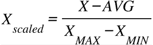
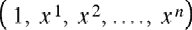

# 第二章：2\. 回归简介

概述

在本章中，您将学习回归技术。回归在尝试使用历史数据预测未来变量时非常有用。您将学习各种回归技术，如单变量和多变量线性回归，以及多项式回归和支持向量回归（SVR）。您将使用这些技术预测未来的股价。到本章结束时，您将能够熟练地运用回归技术解决各个领域的实际问题。

# 介绍

在上一章中，您已经了解了**人工智能**（**AI**）的基本知识，并使用它创建了井字游戏。在本章中，我们将讨论回归，它是一种机器学习算法，可用于衡量独立变量（称为**特征**）与依赖变量（称为**标签**）之间的关系。

线性回归是一个广泛应用于各个领域的概念，从金融（预测资产价格）到商业（预测产品销量），甚至到经济学（预测经济增长）。

本章大部分内容将讨论不同形式的线性回归，包括单变量线性回归、多变量线性回归、单变量多项式回归和多变量多项式回归。Python 提供了许多回归操作的支持，我们也将在本章稍后介绍这些内容。

我们还将使用一种替代回归模型，称为**支持向量回归**（**SVR**），以及不同形式的线性回归。在本章中，我们将使用一些样本数据集，以及从**Quandl** Python 库加载的股价数据，利用不同类型的回归来预测未来价格。

注意

尽管不建议您使用本章中的模型来提供交易或投资建议，但这是一次非常激动人心且有趣的旅程，它解释了回归的基本原理。

# 单变量线性回归

一个通用的回归问题可以通过以下示例定义。假设我们有一组数据点，需要找出最佳拟合曲线来大致拟合给定的数据点。这条曲线将描述输入变量`x`（即数据点）和输出变量`y`（即曲线）之间的关系。

请记住，在现实生活中，我们通常有多个输入变量决定输出变量。然而，使用单变量的线性回归有助于我们理解输入变量如何影响输出变量。

## 回归的类型

在本章中，我们将处理二维平面上的回归问题。这意味着我们的数据点是二维的，我们正在寻找一条曲线来近似如何从一个变量计算另一个变量。

在本章中，我们将遇到以下几种回归类型：

+   **使用一次多项式的单变量线性回归**：这是最基本的回归形式，其中一条直线近似未来数据的轨迹。

+   **使用一次多项式的多变量线性回归**：我们将使用一次方程，但也允许多个输入变量，称为特征。

+   **单变量的多项式回归**：这是单变量线性回归的通用形式。由于用来近似输入与输出之间关系的多项式可以是任意的次数，因此我们可以创建比直线更适合数据点的曲线。回归依然是线性的——不是因为多项式是线性的，而是因为回归问题可以通过线性代数来建模。

+   **多变量的多项式回归**：这是最通用的回归问题，使用高次多项式和多个特征来预测未来。

+   **SVR**：这种回归形式使用**支持向量机**（**SVMs**）来预测数据点。包括这种回归类型是为了说明 SVR 与其他四种回归类型的区别。

现在我们将处理第一种类型的线性回归：我们将使用一个变量，并且回归的多项式将描述一条直线。

在二维平面上，我们将使用笛卡尔坐标系，也被称为*笛卡尔坐标系*。我们有一个*x*轴和一个*y*轴，这两条轴的交点是原点。我们用*x*和*y*坐标来表示点的位置。

例如，点*(2, 1)*对应于下列坐标系中的黑色点：


图 2.1：点(2, 1)在坐标系中的表示

一条直线可以用方程*y = a*x + b*来描述，其中*a*是方程的斜率，决定了方程上升的陡峭度，*b*是常数，决定了直线与*y*轴的交点。

在*图 2.2*中，您可以看到三个方程：

+   这条直线的方程是*y = 2*x + 1*。

+   虚线的方程是*y = x + 1*。

+   虚线的方程是*y = 0.5*x + 1*。

您可以看到，所有三个方程都在*y*轴上交于*1*，它们的斜率由我们乘以*x*的因子来决定。

如果你知道*x*，你就可以求解*y*。类似地，如果你知道*y*，你也可以求解*x*。这个方程是一个一次多项式方程，它是单变量线性回归的基础：


图 2.2：y = 2*x + 1、y = x + 1 和 y = 0.5*x + 1 在坐标系中的表示

我们可以使用多项式方程来描述曲线而非直线；例如，多项式方程 *4x*4*-3x*3*-x*2*-3x+3* 将生成 *图 2.3*。这种类型的方程是具有一个变量的多项式回归的基础：


图 2.3：多项式方程的表示

注意

如果你想进一步实验笛卡尔坐标系，可以使用以下绘图工具：[`s3-us-west-2.amazonaws.com/oerfiles/College+Algebra/calculator.html`](https://s3-us-west-2.amazonaws.com/oerfiles/College+Algebra/calculator.html)。

## 特征和标签

在机器学习中，我们区分特征和标签。特征被视为我们的**输入**变量，而标签则是我们的**输出**变量。

在谈到回归时，标签的可能值是一个连续的有理数集合。可以将特征看作是 *x* 轴上的值，而标签则是 *y* 轴上的值。

回归任务是基于特征值预测标签值。

我们通常通过将特征的值投影到未来来创建标签。

例如，如果我们想通过历史月度数据来预测下个月的股票价格，我们将通过将股票价格特征向未来移动一个月来创建标签：

+   对于每个股票价格特征，标签将是下个月的股票价格特征。

+   对于最后一个月，预测数据将无法获得，因此这些值都是 `NaN`（不是一个数字）。

假设我们有 `1 月`、`2 月` 和 `3 月` 的数据，并且我们想要预测 `4 月` 的价格。我们每个月的特征将是当前月的价格，标签将是下一个月的价格。

例如，看看以下表格：


图 2.4：特征和标签的示例

这意味着 `1 月` 的标签是 `2 月` 的价格，`2 月` 的标签实际上是 `3 月` 的价格。`3 月` 的标签是未知的（`NaN`），因为这是我们要预测的值。

## 特征缩放

有时，我们会有多个特征（输入），它们可能具有完全不同范围的值。想象一下将地图上的微米与现实世界中的千米进行比较。由于数量级差异有九个零，这些值处理起来会非常困难。

一个较小的差异是英制和公制数据之间的差异。例如，磅和千克，厘米和英寸，它们的比较并不好。

因此，我们通常将特征缩放到更容易处理的归一化值，因为我们可以更轻松地比较这些范围的值。

我们将演示两种类型的缩放：

+   Min-max 归一化

+   均值归一化

Min-max 归一化的计算方法如下：


这里，*X*MIN 是特征的最小值，*X*MAX 是最大值。

特征缩放后的值将在 `[0;1]` 的范围内。

均值归一化的计算方法如下：



这里，`AVG` 是平均值。

特征缩放后的值将在 `[-1;1]` 的范围内。

这是在斐波那契数列的前 13 个数字上应用两种归一化的例子。

我们首先找到 min-max 归一化：

```py
fibonacci = [0, 1, 1, 2, 3, 5, 8, 13, 21, 34, 55, 89, 144]
# Min-Max normalization:
[(float(i)-min(fibonacci))/(max(fibonacci)-min(fibonacci)) \
for i in fibonacci]
```

预期输出是这样的：

```py
[0.0,
 0.006944444444444444,
 0.006944444444444444,
 0.013888888888888888,
 0.020833333333333332,
 0.034722222222222224,
 0.05555555555555555,
 0.09027777777777778,
 0.14583333333333334,
 0.2361111111111111,
 0.3819444444444444,
 0.6180555555555556,
 1.0]
```

现在，查看以下代码片段以找到均值归一化：

```py
# Mean normalization:
avg = sum(fibonacci) / len(fibonacci)
# 28.923076923076923
[(float(i)-avg)/(max(fibonacci)-min(fibonacci)) \
for i in fibonacci]
```

预期输出是这样的：

```py
[-0.20085470085470086,
 -0.19391025641025642,
 -0.19391025641025642,
 -0.18696581196581197,
 -0.18002136752136752,
 -0.16613247863247863,
 -0.1452991452991453,
 -0.11057692307692307,
 -0.05502136752136752,
 0.035256410256410256,
 0.18108974358974358,
 0.4172008547008547,
 0.7991452991452992]
```

注意

缩放可能会增加处理时间，但通常它是一个需要执行的重要步骤。

在 scikit-learn 库中，我们可以使用 `preprocessing.scale` 函数，它可以对 NumPy 数组进行缩放：

```py
import numpy as np
from sklearn import preprocessing
preprocessing.scale(fibonacci)
```

预期输出是这样的：

```py
array([-0.6925069 , -0.66856384, -0.66856384, -0.64462079,
       -0.62067773-0.57279161, -0.50096244, -0.38124715,
       -0.18970269,  0.12155706, 0.62436127,  1.43842524,
       2.75529341]
```

`scale` 方法执行标准化，这是一种归一化方式。注意，结果是一个 NumPy 数组。

## 将数据分为训练集和测试集

现在我们已经学会了如何对数据集进行归一化，我们还需要学习训练-测试拆分。为了衡量我们的模型能否很好地概括其预测性能，我们需要将数据集分为训练集和测试集。训练集供模型学习以构建预测，然后，模型将使用测试集来评估其预测的性能。

当我们分割数据集时，我们首先需要对其进行洗牌，以确保我们的测试集能够代表整个数据集。通常，拆分比例为 90% 用于训练集，10% 用于测试集。

通过训练和测试，我们可以衡量模型是否发生了过拟合或欠拟合。

**过拟合**发生在训练好的模型对训练数据拟合得过于完美时。模型在训练数据上表现得非常准确，但在实际应用中无法使用，因为它在其他数据上的准确度会降低。模型会对训练数据中的随机噪声进行调整，并假设这些噪声中存在的模式，从而得出错误的预测。

**欠拟合**发生在训练好的模型无法充分拟合训练数据，导致无法识别数据中的重要模式。因此，它无法对新数据做出准确的预测。一个例子是当我们尝试对一个非线性数据集进行线性回归时。例如，斐波那契数列是非线性的；因此，基于类似斐波那契数列的数据建模也不可能是线性的。

我们可以使用 scikit-learn 的 `model_selection` 库来进行训练-测试拆分。

假设，在我们的例子中，我们已经对斐波那契数据进行了缩放，并将其索引定义为标签：

```py
features = preprocessing.scale(fibonacci)
label = np.array(range(13))
```

现在，让我们将数据的 10%用作测试数据，`test_size=0.1`，并指定`random_state`参数，以便每次运行代码时都能得到完全相同的分割：

```py
from sklearn import model_selection
(x_train, x_test, y_train, y_test) = \
model_selection.train_test_split(features, \
                                 label, test_size=0.1, \
                                 random_state=8)
```

我们的数据集已被划分为特征（`x_train`和`x_test`）和标签（`y_train`和`y_test`）的测试集和训练集。

最后，让我们检查每个数据集，从`x_train`特征开始：

```py
x_train
```

预期输出为：

```py
array([ 1.43842524, -0.18970269, -0.50096244,  2.75529341,
       -0.6925069 , -0.66856384, -0.57279161,  0.12155706,
       -0.66856384, -0.62067773, -0.64462079])
```

接下来，我们检查`x_test`：

```py
x_test
```

预期输出为：

```py
array([-0.38124715, 0.62436127])
```

然后，我们检查`y_train`：

```py
y_train
```

预期输出为：

```py
array([11, 8, 6, 12, 0, 2, 5, 9, 1, 4, 3])
```

接下来，我们检查`y_test`：

```py
y_test
```

预期输出为：

```py
array([7, 10])
```

在前面的输出中，我们可以看到我们的数据分割已正确执行；例如，我们的标签已被分割为`y_test`，其中包含`7`和`10`索引，`y_train`包含其余的`11`个索引。相同的逻辑已应用于我们的特征，`x_test`中有`2`个值，`x_train`中有`11`个值。

注

如果你记得笛卡尔坐标系，你会知道水平轴是*x*轴，垂直轴是*y*轴。我们的特征位于*x*轴上，而我们的标签位于*y*轴上。因此，我们将特征和*x*视为同义词，而标签通常用*y*表示。因此，`x_test`表示特征测试数据，`x_train`表示特征训练数据，`y_test`表示标签测试数据，`y_train`表示标签训练数据。

## 使用 scikit-learn 在数据上拟合模型

现在我们将通过一个只有一个特征且数据最小的例子来说明回归过程。

由于我们只有一个特征，我们必须通过`x_train.reshape (-1,1)`将`x_train`格式化为包含一个特征的 NumPy 数组。

因此，在执行拟合最佳直线的代码之前，先执行以下代码：

```py
x_train = x_train.reshape(-1, 1)
x_test = x_test.reshape(-1, 1)
```

我们可以用以下代码在数据上拟合一个线性回归模型：

```py
from sklearn import linear_model
linear_regression = linear_model.LinearRegression()
model = linear_regression.fit(x_train, y_train)
model.predict(x_test)
```

预期输出为：

```py
array([4.46396931, 7.49212796])
```

我们还可以计算与模型相关的得分：

```py
model.score(x_test, y_test)
```

预期输出为：

```py
-1.8268608450379087
```

这个得分表示模型的准确性，定义为 R2 或**决定系数**。它表示我们可以从标签中预测特征的程度。

在我们的例子中，`-1.8268`的 R2 表示一个非常糟糕的模型，因为最佳得分为**1**。如果我们始终使用特征的平均值来预测标签，则可以获得**0**的得分。

注

在本书中，我们将省略此得分的数学背景。

我们的模型表现不佳有两个原因：

+   如果我们检查之前的斐波那契数列，11 个训练数据点和 2 个测试数据点显然不足以进行适当的预测分析。

+   即使我们忽略数据点的数量，斐波那契数列并没有描述*x*和*y*之间的线性关系。用直线近似非线性函数仅在我们观察到两个非常接近的数据点时才有用。

## 使用 NumPy 数组进行线性回归

NumPy 数组比 Python 列表更方便的一个原因是它们可以被视为向量。向量上定义了一些操作，可以简化我们的计算。我们可以对长度相同的向量执行操作。

让我们以两个向量 V1 和 V2 为例，每个向量有三个坐标：

V1 = (a, b, c)，其中 a=1，b=2，c=3

V2 = (d, e, f)，其中 d=2，e=0，f=2

这两个向量的加法将是：

V1 + V2 = (a+d, b+e, c+f) = (1+2, 2+0, 3+2) = (3,2,5)

这两个向量的乘积将是：

V1 + V2 = (a*d, b*e, c*f) = (1*2, 2*0, 3*2) = (2,0,6)

你可以将每个向量看作我们的数据集，例如，第一个向量是我们的**特征集**，第二个向量是我们的**标签集**。因为 Python 能够进行向量计算，这将大大简化我们线性回归模型所需的计算。

现在，让我们通过以下示例使用 NumPy 构建线性回归。

假设我们有两个数据集，每个数据集有 13 个数据点；我们想要构建一条最佳拟合所有数据点的线性回归线。

我们的第一组数据定义如下：

```py
[2, 8, 8, 18, 25, 21, 32, 44, 32, 48, 61, 45, 62]
```

如果我们将这个数据集的值（`2,8,8,18,25,21,32,44,32,48,61,45,62`）绘制为*y*轴，而每个值的索引（`1,2,3,4,5,6,7,8,9,10,11,12,13`）绘制为*x*轴，我们将得到如下图表：

![图 2.5：第一个数据集的绘制图]

](img/B16060_02_05.jpg)

图 2.5：第一个数据集的绘制图

我们可以看到，这个数据集的分布似乎呈线性，如果我们想画一条尽可能靠近每个点的直线，这并不难。在这种情况下，简单的线性回归看起来是合适的。

我们的第二组数据是前 13 个值，按照我们在*特征缩放*部分中看到的斐波那契数列进行缩放：

```py
[-0.6925069, -0.66856384, -0.66856384, -0.64462079, -0.62067773, -0.57279161, -0.50096244, -0.38124715, -0.18970269, 0.12155706, 0.62436127, 1.43842524, 2.75529341]
```

如果我们将这个数据集的值作为 *y* 轴，每个值的索引作为 *x* 轴，我们将得到如下图表：

![图 2.6：第二个数据集的绘制图]

](img/B16060_02_06.jpg)

图 2.6：第二个数据集的绘制图

我们可以看到，这个数据集的分布似乎不是线性的，如果我们想画一条尽可能靠近每个点的直线，线可能会错过很多点。在这种情况下，简单的线性回归可能会遇到困难。

我们知道，直线的方程是。

在这个方程中， 是斜率，而 是 *y* 截距。为了找到最佳拟合线，我们必须找到 和 的系数。

为了做到这一点，我们将使用最小二乘法，通过完成以下步骤来实现：

1.  对每个数据点，计算 *x*² 和 *xy*。

    求所有 *x*、*y*、*x*² 和 *x * y* 的和，得出。

1.  计算斜率，，作为 ，其中 *N* 是数据点的总数。

1.  计算 *y* 截距，，作为 。

现在，让我们以 NumPy 为例，使用以下代码应用这些步骤来处理第一个数据集。

让我们看一下第一步：

```py
import numpy as np
x = np.array(range(1, 14))
y = np.array([2, 8, 8, 18, 25, 21, 32, 44, 32, 48, 61, 45, 62])
x_2 = x**2
xy = x*y
```

对于 `x_2`，输出将是：

```py
array([  1,   4,   9,  16,  25,  36,  49,  64,  81, 
       100, 121, 144, 169],  dtype=int32)
```

对于 `xy`，输出将是：

```py
array([2, 16, 24, 72, 125, 126, 224, 
       352, 288, 480, 671, 540, 806])
```

现在，让我们继续下一步：

```py
sum_x = sum(x)
sum_y = sum(y)
sum_x_2 = sum(x_2)
sum_xy = sum(xy)
```

对于 `sum_x`，输出将是：

```py
91
```

对于 `sum_y`，输出将是：

```py
406
```

对于 `sum_x_2`，输出将是：

```py
819
```

对于 `sum_xy`，输出将是：

```py
3726
```

现在，让我们继续下一步：

```py
N = len(x)
a = (N*sum_xy - (sum_x*sum_y))/(N*sum_x_2-(sum_x)**2)
```

对于 `N`，输出将是：

```py
13
```

对于 `a`，输出将是：

```py
4.857142857142857
```

现在，让我们继续到最后一步：

```py
b = (sum_y - a*sum_x)/N
```

对于 `b`，输出将是：

```py
-2.7692307692307647
```

一旦我们用前述系数绘制出线 ，我们将得到以下图形：


图 2.7：第一数据集的线性回归绘制图

如你所见，我们的线性回归模型在这个具有线性分布的数据集上表现得非常好。

注意

你可以在 [`www.endmemo.com/statistics/lr.php`](http://www.endmemo.com/statistics/lr.php) 找到线性回归计算器。你还可以查看该计算器，以了解在给定数据集上最优拟合线的形态。

我们将对第二数据集重复相同的步骤：

```py
import numpy as np
x = np.array(range(1, 14))
y = np.array([-0.6925069, -0.66856384, -0.66856384, \
              -0.64462079, -0.62067773, -0.57279161, \
              -0.50096244, -0.38124715, -0.18970269, \
              0.12155706, 0.62436127, 1.43842524, 2.75529341])
x_2 = x**2
xy = x*y
sum_x = sum(x)
sum_y = sum(y)
sum_x_2 = sum(x_2)
sum_xy = sum(xy)
N = len(x)
a = (N*sum_xy - (sum_x*sum_y))/(N*sum_x_2-(sum_x)**2)
b = (sum_y - a*sum_x)/N
```

对于 `a`，输出将是：

```py
0.21838173510989017
```

对于 `b`，输出将是：

```py
-1.528672146538462
```

一旦我们用前述系数绘制出线 ，我们将得到以下图形：


图 2.8：第二数据集的线性回归绘制图

显然，在线性分布下，我们的线性回归模型能够很好地拟合数据。

注意

我们不必使用这种方法来进行线性回归。许多库，包括 scikit-learn，可以帮助我们自动化这一过程。一旦我们进行多个变量的线性回归，最好使用库来为我们执行回归。

## 使用 NumPy Polyfit 拟合模型

NumPy Polyfit 还可以用于创建具有一个变量的最佳拟合线进行线性回归。

回忆一下最优拟合线的计算：

```py
import numpy as np
x = np.array(range(1, 14))
y = np.array([2, 8, 8, 18, 25, 21, 32, 44, 32, 48, 61, 45, 62])
x_2 = x**2
xy = x*y
sum_x = sum(x)
sum_y = sum(y)
sum_x_2 = sum(x_2)
sum_xy = sum(xy)
N = len(x)
a = (N*sum_xy - (sum_x*sum_y))/(N*sum_x_2-(sum_x)**2)
b = (sum_y - a*sum_x)/N
```

求解系数的方程式  和  相当复杂。幸运的是，Python 中的 `numpy.polyfit` 函数可以执行这些计算，找出最优拟合线的系数。`polyfit` 函数接受三个参数：`x` 值的数组、`y` 值的数组，以及要查找的多项式的次数。由于我们要查找的是一条直线，因此多项式中 `x` 的最高次方为 `1`：

```py
import numpy as np
x = np.array(range(1, 14))
y = np.array([2, 8, 8, 18, 25, 21, 32, 44, 32, 48, 61, 45, 62])
[a,b] = np.polyfit(x, y, 1)
```

对于 `[a,b]`，输出将是：

```py
[4.857142857142858, -2.769230769230769]
```

### 在 Python 中绘制结果

假设你有一组数据点和一条回归线，我们的任务是将这些点和回归线一起绘制，以便我们能直观地看到结果。

我们将使用 `matplotlib.pyplot` 库来实现这一点。这个库有两个重要的函数：

+   `scatter`：此函数显示在平面上分布的散点，由一组 *x* 坐标和一组 *y* 坐标定义。

+   `plot`：此函数接受两个参数，绘制由两个点定义的线段或由多个点定义的一系列线段。与散点图类似，区别在于它不是显示单独的点，而是通过线条将它们连接起来。

使用三个参数的绘图函数绘制一个线段和/或根据第三个参数格式化的两个点。

一条线段由两个点定义。当 *x* 在 1 和 13 之间变化时（请记住数据集包含 13 个数据点），在 0 和 15 之间显示一条线段是合理的。我们必须将 *x* 的值代入方程式  以获得相应的 *y* 值：

```py
import numpy as np
import matplotlib.pyplot as plot
x = np.array(range(1, 14))
y = np.array([2, 8, 8, 18, 25, 21, 32, 44, 32, 48, 61, 45, 62])
x_2 = x**2
xy = x*y
sum_x = sum(x)
sum_y = sum(y)
sum_x_2 = sum(x_2)
sum_xy = sum(xy)
N = len(x)
a = (N*sum_xy - (sum_x*sum_y))/(N*sum_x_2-(sum_x)**2)
b = (sum_y - a*sum_x)/N
# Plotting the points
plot.scatter(x, y)
# Plotting the line
plot.plot([0, 15], [b, 15*a+b])
plot.show()
```

输出结果如下：


图 2.9：使用 matplotlib 绘制的第一个数据集线性回归图

回归线和散布的数据点如预期显示。

然而，绘图函数有一个更复杂的签名。你可以使用 `plot` 在图形上绘制散点、线条或任何曲线。这些变量按三元组进行解析：

+   `x` 值

+   `y` 值

+   以字符串形式的格式化选项

让我们创建一个函数，从一组近似的 `x` 值数组推导出一组近似的 `y` 值数组：

```py
def fitY( arr ):
    return [4.857142857142859 * x - 2.7692307692307843 for x in arr]
```

我们将使用 `fit` 函数绘制这些值：

```py
plot.plot(x, y, 'go',x, fitY(x), 'r--o')
```

每个第三个参数处理格式化。字母 `g` 代表绿色，而字母 `r` 代表红色。你也可以使用 `b` 来表示蓝色，`y` 来表示黄色，等等。在没有指定颜色的情况下，每个三元组将以不同的颜色显示。`o` 字符表示我们希望在每个数据点的位置显示一个点。因此，`go` 与移动无关——它请求绘图工具绘制绿色的点。`-` 字符负责绘制虚线。如果只使用 -1，将会显示一条直线而不是虚线。

输出结果如下：


图 2.10：使用拟合函数的绘图函数图

Python 的绘图库为你解决大多数图形问题提供了简单的解决方案。你可以在图形上绘制任意数量的线条、点和曲线。

在显示曲线时，绘图工具将点连接起来形成线段。还要记住，即使是复杂的曲线序列，也只是将点连接起来的近似值。例如，如果你执行来自 [`gist.github.com/traeblain/1487795`](https://gist.github.com/traeblain/1487795) 的代码，你将看到 `batman` 函数的线段被连接成了直线：


](img/B16060_02_11.jpg)

图 2.11：蝙蝠侠函数的图表

有许多不同的方法可以绘制曲线。我们已经看到，NumPy 库的 `polyfit` 方法返回一个系数数组来描述线性方程：

```py
import numpy as np
x = np.array(range(1, 14))
y = np.array([2, 8, 8, 18, 25, 21, 32, 44, 32, 48, 61, 45, 62])
np.polyfit(x, y, 1)
```

这里的输出如下：

```py
[4.857142857142857, -2.769230769230768]
```

这个数组描述了方程 *4.85714286 * x - 2.76923077*。

假设我们现在想绘制一条曲线，。这个二次方程由系数数组 `[-1, 3, -2]` 描述，如。我们可以自己编写一个函数来计算属于 `x` 值的 `y` 值。然而，NumPy 库已经有一个功能可以为我们完成这项工作——`np.poly1d`：

```py
import numpy as np
x = np.array(range( -10, 10, 1 ))
f = np.poly1d([-1,3,-2])
```

`poly1d` 调用创建的 `f` 函数不仅适用于单一值，还适用于列表或 NumPy 数组：

```py
f(5)
```

预期输出如下：

```py
-12
```

同样，对于 `f(x)`：

```py
f(x)
```

输出将是：

```py
array ([-132\. -110, -90, -72, -56, -42, -30, -20, -12, -6, -2,
        0, 0, -2, -6, -12, -20, -30, -42, -56])
```

现在，我们可以使用这些值来绘制非线性曲线：

```py
import matplotlib.pyplot as plot
plot.plot(x, f(x))
```

输出如下：


](img/B16060_02_12.jpg)

图 2.12：非线性曲线的图表

如你所见，我们可以使用 `pyplot` 库轻松创建非线性曲线的图表。

## 使用线性回归预测值

假设我们对属于 `x` 坐标 `20` 的 `y` 值感兴趣。根据线性回归模型，我们需要做的就是将 `20` 的值代入之前使用的代码中的 `x`：

```py
x = np.array(range(1, 14))
y = np.array([2, 8, 8, 18, 25, 21, 32, 44, 32, 48, 61, 45, 62])
# Plotting the points
plot.scatter(x, y)
# Plotting the prediction belonging to x = 20
plot.scatter(20, a * 20 + b, color='red')
# Plotting the line
plot.plot([0, 25], [b, 25*a+b])
```

输出如下：


](img/B16060_02_13.jpg)

图 2.13：显示使用线性回归预测值的图表

在这里，我们用红色表示了预测值。这个红点位于最优拟合直线的上方。

让我们看下一个练习，在这个练习中，我们将根据线性回归预测人口。

## 练习 2.01：预测小学的学生容量

在这个练习中，你将尝试预测小学容量的需求。你的任务是预测 2025 年和 2030 年入学儿童的数量。

注意

数据包含在 `population.csv` 文件中，你可以在我们的 GitHub 仓库中找到它：[`packt.live/2YYlPoj`](https://packt.live/2YYlPoj)。

以下步骤将帮助你完成此练习：

1.  打开一个新的 Jupyter Notebook 文件。

1.  导入 `pandas` 和 `numpy`：

    ```py
    import pandas as pd
    import numpy as np
    import matplotlib.pyplot as plot
    ```

1.  接下来，将 CSV 文件作为 DataFrame 加载到 Notebook 中并读取 CSV 文件：

    ```py
    file_url = 'https://raw.githubusercontent.com/'\
               'PacktWorkshops/The-Applied-Artificial-'\
               'Intelligence-Workshop/master/Datasets/'\
               'population.csv'
    df = pd.read_csv(file_url)
    df
    ```

    预期输出如下：

    

    ](img/B16060_02_14.jpg)

    图 2.14：读取 CSV 文件

1.  现在，将 DataFrame 转换为两个 NumPy 数组。为了简便起见，我们可以假设 `year` 特征从 `2001` 到 `2018`，对应的值为 `1` 到 `18`：

    ```py
    x = np.array(range(1, 19))
    y = np.array(df['population'])
    ```

    `x` 的输出将是：

    ```py
    array([1, 2, 3, 4, 5, 6, 7, 8, 9, 10, 11, 12, 13, 14, 15, 16, 17, 18])
    ```

    `y` 输出将是：

    ```py
    array([147026, 144272, 140020, 143801, 146233,
           144539, 141273, 135389, 142500, 139452,
           139722, 135300, 137289, 136511, 132884,
           125683, 127255, 124275], dtype=int64)
    ```

1.  现在，使用两个 NumPy 数组，使用 `polyfit` 方法（由于我们只有一个特征，设置多项式的次数为 `1`）来确定回归线的系数：

    ```py
    [a, b] = np.polyfit(x, y, 1)
    ```

    `[a, b]` 的输出将是：

    ```py
    [-1142.0557275541803, 148817.5294117647]
    ```

1.  现在，使用 `matplotlib.pyplot` 绘制结果，并预测未来至 `2030` 年：

    ```py
    plot.scatter( x, y ) 
    plot.plot( [0, 30], [b, 30*a+b] )
    plot.show()
    ```

    预期的输出是：

    

    图 2.15：显示 2030 年未来情况的图

    如你所见，数据呈线性关系，我们的模型似乎拟合得很好。

1.  最后，预测 `2025` 年和 `2030` 年的人口：

    ```py
    population_2025 = 25*a+b
    population_2030 = 30*a+b
    ```

    `population_2025` 的输出将是：

    ```py
    120266.1362229102
    ```

    `population_2030` 的输出将是：

    ```py
    114555.85758513928
    ```

    注意

    要访问此特定部分的源代码，请参考[`packt.live/31dvuKt`](https://packt.live/31dvuKt)。

    你也可以在线运行此示例，网址为[`packt.live/317qeIc`](https://packt.live/317qeIc)。你必须执行整个 Notebook 才能得到期望的结果。

通过完成这个练习，我们现在可以得出结论：未来开始上小学的儿童人口将减少，因此，如果我们当前已经满足需求，就不需要增加小学的容量。

# 多元线性回归

在前一节中，我们处理了一个变量的线性回归。现在我们将学习线性回归的扩展版本，在该版本中，我们将使用多个输入变量来预测输出。

## 多元线性回归

如果你回想一下线性回归中最佳拟合线的公式，它被定义为 ，其中  是线的斜率， 是线的 *y* 截距，*x* 是特征值，*y* 是计算出的标签值。

在多元回归中，我们有多个特征和一个标签。如果我们有三个特征，*x*1、*x*2 和 *x*3，我们的模型将变成 。

在 NumPy 数组格式中，我们可以将这个方程写成如下形式：

```py
y = np.dot(np.array([a1, a2, a3]), np.array([x1, x2, x3])) + b
```

为了方便起见，最好将整个方程定义为向量乘法形式。系数  将是 `1`：

```py
y = np.dot(np.array([b, a1, a2, a3]) * np.array([1, x1, x2, x3]))
```

多元线性回归是两个向量的简单标量积，其中系数 、、 和  决定了四维空间中最优拟合方程。

要理解多元线性回归的公式，你需要计算两个向量的标量积。由于标量积的另一个名称是点积，因此执行此操作的 NumPy 函数称为 `dot`：

```py
import numpy as np
v1 = [1, 2, 3]
v2 = [4, 5, 6]
np.dot(v1, v2)
```

输出将是 `32`，因为 `np.dot(v1, v2) = 1 * 4 + 2 * 5 + 3 * 6 = 32`。

我们仅需将每个坐标的乘积相加。

我们可以通过最小化数据点与由方程描述的最接近点之间的误差来确定这些系数。为了简单起见，我们将省略最佳拟合方程的数学解法，而改用 scikit-learn。

注意

在*n*维空间中，其中*n*大于 3，维度的数量决定了我们模型中不同的变量。在前面的例子中，我们有三个特征（*x*1、*x*2 和*x*3）和一个标签*y*。这就得到了四个维度。如果你想象四维空间，你可以将其视为一个有时间维度的三维空间。五维空间可以想象成四维空间，其中每个时间点都有一个温度。维度只是特征（和标签）；它们不一定与我们对三维空间的概念相关。

## 线性回归的过程

我们将按照以下简单步骤解决线性回归问题：

1.  从数据源加载数据。

1.  准备预测数据。数据以（`normalize`、`format`和`filter`）格式准备。

1.  计算回归线的参数。无论我们使用单变量还是多变量线性回归，都将遵循以下步骤。

## 从数据源导入数据

有多个库可以为我们提供数据源访问。由于我们将处理股票数据，让我们先看两个专门用于获取财务数据的例子：Quandl 和 Yahoo Finance。在继续之前，请先查看以下几个重要点：

+   Scikit-learn 提供了一些数据集，可以用于练习你的技能。

+   [`www.quandl.com`](https://www.quandl.com)为你提供免费的和付费的财务数据集。

+   [`pandas.pydata.org/`](https://pandas.pydata.org/)帮助你加载任何 CSV、Excel、JSON 或 SQL 数据。

+   Yahoo Finance 为你提供财务数据集。

## 使用 Yahoo Finance 加载股票价格

使用 Yahoo Finance 加载股票数据的过程非常简单。你只需在 Jupyter Notebook 中使用以下命令安装`yfinance`包：

```py
!pip install yfinance
```

我们将下载一个数据集，其中包含从 2015 年到 2020 年 1 月 1 日的标准普尔 500 指数的开盘价、最高价、最低价、收盘价、调整后收盘价和成交量值。标准普尔 500 指数是衡量美国 500 家大型上市公司股票表现的股市指数：

```py
import yfinance as yahoo
spx_data_frame = yahoo.download(“^GSPC”, “2015-01-01”, “2020-01-01”)
```

注意

数据集文件也可以在我们的 GitHub 仓库找到：[`packt.live/3fRI5Hk`](https://packt.live/3fRI5Hk)。

原始数据集可以在这里找到：[`github.com/ranaroussi/yfinance`](https://github.com/ranaroussi/yfinance)。

这就是你需要做的。包含标准普尔 500 指数的数据框已经准备好了。

你可以使用`plot`方法绘制指数收盘价：

```py
spx_data_frame.Close.plot()
```

输出如下：


图 2.16：显示自 2015 年以来 S&P 500 指数收盘价的图表

数据似乎不是线性的；多项式回归可能是该数据集更合适的模型。

也可以使用以下代码将数据保存为 CSV 文件：

```py
spx_data_frame.to_csv(“yahoo_spx.csv”)
```

注意

[`www.quandl.com`](https://www.quandl.com) 是我们在本章中将使用的可靠的金融和经济数据集来源。

## 练习 2.02：使用 Quandl 加载股票价格

本练习的目标是从 Quandl 包下载数据，并将其加载到一个 DataFrame 中，类似于我们之前在 Yahoo Finance 上所做的操作。

以下步骤将帮助您完成练习：

1.  打开一个新的 Jupyter Notebook 文件。

1.  使用以下命令安装 `Quandl`：

    ```py
    !pip install quandl
    ```

1.  使用 Quandl 下载 S&P 500 的数据到 DataFrame 中。其代码为 `“YALE/SPCOMP”`：

    ```py
    import quandl
    data_frame = quandl.get(“YALE/SPCOMP”)
    ```

1.  使用 DataFrame 的 `head()` 方法检查 DataFrame 中前五行数据：

    ```py
    data_frame.head()
    ```

    输出如下：

    

图 2.17：数据集作为输出显示

注意

要访问本节的源代码，请参考 [`packt.live/3dwDUz6`](https://packt.live/3dwDUz6)。

您也可以通过 [`packt.live/31812B6`](https://packt.live/31812B6) 在线运行此示例。您必须执行整个 Notebook 才能获得预期的结果。

完成本练习后，我们学会了如何下载外部数据集（CSV 格式）并将其导入为 DataFrame。我们还学习了 `.head()` 方法，它可以快速查看 DataFrame 中的前五行数据。

在下一节中，我们将继续准备数据集以执行多元线性回归。

## 为预测准备数据

在对数据集执行多元线性回归之前，我们必须选择相关的特征和回归所用的数据范围。

准备数据以进行预测是回归过程中的第二步。此步骤还包含几个子步骤。我们将在接下来的练习中逐步讲解这些子步骤。

## 练习 2.03：为预测准备 Quandl 数据

本练习的目标是从 Quandl 库下载外部数据集，并将其准备好以便在我们的线性回归模型中使用。

以下步骤将帮助您完成本练习：

1.  打开一个新的 Jupyter Notebook 文件。

    注意

    如果您的系统未安装 Quandl 库，请记得运行命令 `!pip install quandl`。

1.  接下来，使用 Quandl 下载 S&P 500 从 1950 年到 2019 年的数据到 DataFrame 中。其代码为 `“YALE/SPCOMP”`：

    ```py
    import quandl
    import numpy as np
    from sklearn import preprocessing
    from sklearn import model_selection
    data_frame = quandl.get(“YALE/SPCOMP”, \
                            start_date=”1950-01-01”, \
                            end_date=”2019-12-31”)
    ```

1.  使用 `head()` 方法来查看 `data_frame.head()` DataFrame 中的列：

    ```py
    data_frame.head()
    ```

    输出如下：

    

    图 2.18：数据集作为输出显示

    有些特征似乎高度相关。例如，`Real Dividend`列与`Real Price`按比例增长。它们之间的比率并不总是相似，但它们确实存在相关性。

    由于回归并不是为了检测特征之间的相关性，我们宁愿去除那些我们知道是相关的特征，并对那些没有相关性的特征进行回归。在这种情况下，我们将保留`Long Interest Rate`、`Real Price`和`Real Dividend`列。

1.  仅保留`Long Interest Rate`、`Real Price`和`Real Dividend`数据框中相关的列：

    ```py
    data_frame = data_frame[['Long Interest Rate', \
                             'Real Price', 'Real Dividend']]
    data_frame
    ```

    输出如下所示：

    

    图 2.19：仅显示相关列的数据集

    你可以看到数据框中有一些缺失值`NaN`。由于回归无法处理缺失值，我们需要将它们替换或删除。在实际情况中，我们通常选择替换它们。在这种情况下，我们将使用一种叫做**前向填充**的方法，用前一个值来替换缺失值。

1.  我们可以使用以下代码片段通过前向填充来替换缺失值：

    ```py
    data_frame.fillna(method='ffill', inplace=True)
    data_frame
    ```

    输出如下所示：

    

    图 2.20：缺失值已被替换

    现在我们已经清理了缺失数据，需要创建我们的标签。我们希望使用当前的`Real Price`、`Long Interest Rate`和`Real Dividend`列预测`Real Price`列的未来 3 个月数据。为了创建标签，我们需要将`Real Price`的值向上移动三个单位，并将其命名为`Real Price Label`。

1.  使用以下代码通过将`Real Price`移位 3 个月来创建`Real Price Label`标签：

    ```py
    data_frame['Real Price Label'] = data_frame['Real Price'].shift(-3)
    data_frame
    ```

    输出如下所示：

    

    图 2.21：新标签已创建

    将这些值移位的副作用是，`Real Price Label`的最后三行将出现缺失值，因此我们需要移除最后三行数据。然而，在此之前，我们需要将特征转换为 NumPy 数组并进行缩放。我们可以使用数据框的`drop`方法删除标签列，并使用`sklearn`中的预处理函数来缩放特征。

1.  使用以下代码创建一个 NumPy 数组来表示特征并进行缩放：

    ```py
    features = np.array(data_frame.drop('Real Price Label', 1))
    scaled_features = preprocessing.scale(features)
    scaled_features
    ```

    输出如下所示：

    ```py
    array([[-1.14839975, -1.13009904, -1.19222544],
           [-1.14114523, -1.12483455, -1.18037146],
           [-1.13389072, -1.12377394, -1.17439424],
           ...,
           [-1.360812  ,  2.9384288 ,  3.65260385],
           [-1.32599032,  3.12619329,  3.65260385],
           [-1.29116864,  3.30013894,  3.65260385]])
    ```

    第二个参数中的`1`指定我们要删除列。由于原始数据框未被修改，因此可以直接从中提取标签。现在，特征已经被缩放，我们需要删除特征中的最后三个值，因为它们是标签列中缺失值的特征。我们将它们保存以供稍后在预测部分使用。

1.  使用以下代码移除`features`数组中的最后三个值，并将它们保存到另一个数组中：

    ```py
    scaled_features_latest_3 = scaled_features[-3:]
    scaled_features = scaled_features[:-3]
    scaled_features
    ```

    `scaled_features`的输出如下所示：

    ```py
    array([[-1.14839975, -1.13009904, -1.19222544],
           [-1.14114523, -1.12483455, -1.18037146],
           [-1.13389072, -1.12377394, -1.17439424],
           ...,
           [-1.38866935,  2.97846643,  3.57443947],
           [-1.38866935,  2.83458633,  3.6161088 ],
           [-1.36429417,  2.95488131,  3.65260385]])
    ```

    `scaled_features`变量不再包含三个数据点，因为它们现在位于`scaled_features_latest_3`中。现在我们可以从 DataFrame 中删除最后三行缺失数据，然后使用`sklearn`将标签转换为 NumPy 数组。

1.  在以下代码中删除缺失数据的行：

    ```py
    data_frame.dropna(inplace=True)
    data_frame
    ```

    `data_frame`的输出如下：

    

    图 2.22：更新后的数据集，删除了缺失值

    正如您所见，DataFrame 中的最后三行也被删除了。

1.  现在让我们看看我们是否准确地创建了我们的标签。继续运行以下代码：

    ```py
    label = np.array(data_frame['Real Price Label'])
    label
    ```

    `label`的输出如下：

    

    图 2.23：显示预期标签的输出

    我们的变量包含所有标签，与 DataFrame 中的`Real Price Label`列完全相同。

    我们的下一个任务是将训练数据和测试数据分开。正如我们在*将数据分割为训练和测试*部分中看到的，我们将使用数据的 90%作为训练数据，剩下的 10%作为测试数据。

1.  使用`sklearn`中的以下代码将`features`数据分为训练集和测试集：

    ```py
    from sklearn import model_selection
    (features_train, features_test, \
    label_train, label_test) = model_selection\
                               .train_test_split(scaled_features, \
                                                 label, test_size=0.1, \
                                                 random_state=8)
    ```

    `train_test_split`函数对我们数据的行进行了洗牌，保持了对应关系，并将约 10%的所有数据放入测试变量中，保留了 90%用于训练变量。我们还使用`random_state=8`来复制结果。我们的数据现在可以用于多元线性回归模型。

    注意

    要访问此特定部分的源代码，请参阅[`packt.live/2zZssOG`](https://packt.live/2zZssOG)。

    您还可以在[`packt.live/2zW8WCH`](https://packt.live/2zW8WCH)上在线运行此示例。必须执行整个 Notebook 才能获得所需的结果。

通过完成此练习，我们已经学会了在执行回归之前进行数据准备的所有必要步骤。

## 执行和验证线性回归

现在我们的数据已准备好，我们可以执行线性回归。之后，我们将测量我们的模型性能，看看它的表现如何。

现在我们可以基于训练数据创建线性回归模型：

```py
from sklearn import linear_model
model = linear_model.LinearRegression()
model.fit(features_train, label_train)
```

一旦模型准备好，我们可以使用它来预测属于测试特征值的标签，并使用模型的`score`方法查看其准确性：

```py
label_predicted = model.predict(features_test)
model.score(features_test, label_test)
```

输出如下：

```py
0.9847223874806746
```

通过得分或 R2 为`0.985`，我们可以得出结论，该模型非常准确。这并不令人意外，因为金融市场的增长约为每年 6-7%。这是线性增长，模型基本上预测市场将以线性速度继续增长。得出市场 tend to increase in the long run 的结论并不是火箭科学。

## 预测未来

现在我们的模型已经训练完成，我们可以用它来预测未来的值。我们将使用`scaled_features_latest_3`变量，它是通过取特征 NumPy 数组中的最后三个值来创建的，并使用它来预测接下来三个月的指数价格，代码如下：

```py
label_predicted = model.predict(scaled_features_latest_3) 
```

输出结果如下：

```py
array ([3046.2347327, 3171.47495182, 3287.48258298])
```

通过观察输出，你可能会觉得预测标普 500 指数的值似乎很容易，并用它来通过投资赚钱。不幸的是，在实践中，使用这个模型来通过预测赚钱并不比在赌场赌博更好。这只是一个用来说明预测的例子，并不足以用于市场价格的短期或长期投机。除此之外，股价对许多外部因素敏感，如经济衰退和政府政策。这意味着过去的模式不一定能反映未来的模式。

# 多项式与支持向量回归

在执行多项式回归时，*x*与*y*之间的关系，或者使用它们的其他名称，特征和标签，并不是线性方程，而是多项式方程。这意味着我们可以在方程中使用多个系数和多个*x*的幂，而不是方程。

更复杂的是，我们可以使用多个变量进行多项式回归，其中每个特征可能有不同的系数，分别乘以特征的不同幂。

我们的任务是找到一条最能拟合我们数据集的曲线。一旦将多项式回归扩展到多个变量，我们将学习支持向量机（SVM）模型来执行多项式回归。

## 一维多项式回归

回顾一下，到目前为止我们已经执行了两种回归：

+   简单线性回归：

+   多元线性回归：

我们现在将学习如何进行一维多项式线性回归。多项式线性回归的方程是。

多项式线性回归具有一个系数向量，乘以一个多项式中*x*的幂次向量。

有时，多项式回归比线性回归效果更好。如果标签与特征之间的关系可以用线性方程描述，那么使用线性方程是非常合适的。如果我们有非线性增长的情况，多项式回归往往能更好地逼近特征与标签之间的关系。

最简单的一维线性回归实现是 NumPy 库中的`polyfit`方法。在接下来的练习中，我们将执行二次和三次的多项式线性回归。

注意

即使我们的多项式回归方程包含*x*的高阶系数，文献中仍将此方程称为多项式线性回归。回归之所以是线性的，并不是因为我们限制了方程中*x*的更高次幂的使用，而是因为方程中的系数*a*1、*a*2 等是线性的。这意味着我们使用线性代数的工具集，通过矩阵和向量来找到最小化逼近误差的缺失系数。

## 练习 2.04：一次、二次和三次多项式回归

此练习的目标是在本章早些时候使用的两个样本数据集上执行一次、二次和三次多项式回归。第一个数据集具有线性分布，第二个是斐波那契序列，具有非线性分布。

以下步骤将帮助您完成此练习：

1.  打开一个新的 Jupyter Notebook 文件。

1.  导入`numpy`和`matplotlib`包：

    ```py
    import numpy as np
    from matplotlib import pyplot as plot
    ```

1.  定义第一个数据集：

    ```py
    x1 = np.array(range(1, 14))
    y1 = np.array([2, 8, 8, 18, 25, 21, 32, \
                   44, 32, 48, 61, 45, 62])
    ```

1.  定义第二个数据集：

    ```py
    x2 = np.array(range(1, 14))
    y2 = np.array([0, 1, 1, 2, 3, 5, 8, 13, \
                   21, 34, 55, 89, 144])
    ```

1.  使用以下代码在第一个数据集上进行一次、二次和三次多项式回归，使用`numpy`中的`polyfit`方法：

    ```py
    f1 = np.poly1d(np.polyfit(x1, y1, 1))
    f2 = np.poly1d(np.polyfit(x1, y1, 2))
    f3 = np.poly1d(np.polyfit(x1, y1, 3))
    ```

    函数`f1`的输出如下：

    ```py
    poly1d([ 4.85714286, -2.76923077])
    ```

    如您所见，一次多项式回归具有两个系数。

    函数`f2`的输出如下：

    ```py
    poly1d([-0.03196803, 5.3046953, -3.88811189])
    ```

    如您所见，二次多项式回归具有三个系数。

    函数`f3`的输出如下：

    ```py
    poly1d([-0.01136364, 0.20666833, -3.91833167, -1.97902098])
    ```

    如您所见，三次多项式回归具有四个系数。

    现在我们已经计算了三次多项式回归，可以将它们与数据一起绘制在图表上，观察它们的行为。

1.  在以下代码中将三个多项式回归和数据绘制在图表上：

    ```py
    import matplotlib.pyplot as plot
    plot.plot(x1, y1, 'ko', # black dots \
              x1, f1(x1),'k-',  # straight line \
              x1, f2(x1),'k--',  # black dashed line \
              x1, f3(x1),'k-.' # dot line
    )
    plot.show()
    ```

    输出如下：

    

    图 2.24：显示第一个数据集多项式回归的图表

    当系数按从左到右的降阶顺序枚举时，我们可以看到更高阶的系数保持接近可忽略的状态。换句话说，三条曲线几乎重合，我们只能在右边缘附近检测到分歧。这是因为我们处理的数据集可以用线性模型非常好地逼近。

    实际上，第一个数据集是基于线性函数创建的。任何非零的*x*2 和*x*3 系数都是基于可用数据过拟合模型的结果。与任何更高阶多项式相比，线性模型更适合预测训练数据范围之外的值。

    让我们将这种行为与第二个例子进行对比。我们知道斐波那契序列是非线性的。因此，使用线性方程来近似它是欠拟合的明显情况。在这里，我们期望更高的多项式次数能够表现更好。

1.  使用以下代码，使用`numpy`中的`polyfit`方法在第二组数据集上执行 1 次、2 次和 3 次的多项式回归：

    ```py
    g1 = np.poly1d(np.polyfit(x2, y2, 1))
    g2 = np.poly1d(np.polyfit(x2, y2, 2))
    g3 = np.poly1d(np.polyfit(x2, y2, 3))
    ```

    `g1`的输出如下：

    ```py
    poly1d([ 9.12087912, -34.92307692])
    ```

    如你所见，1 次多项式回归有 2 个系数。

    `g2`的输出如下：

    ```py
    poly1d([ 1.75024975, -15.38261738, 26.33566434])
    ```

    如你所见，2 次多项式回归有 3 个系数。

    `g3`的输出如下：

    ```py
    poly1d([ 0.2465035, -3.42632368, 14.69080919, -15.07692308])
    ```

    如你所见，3 次多项式回归有 4 个系数。

1.  在以下代码中绘制三条多项式回归曲线和数据点：

    ```py
    plot.plot(x2, y2, 'ko', # black dots \
              x2, g1(x2),'k-',  # straight line \
              x2, g2(x2),'k--',  # black dashed line \
              x2, g3(x2),'k-.' # dot line
    )
    plot.show()
    ```

    输出如下：

    

    ](img/B16060_02_25.jpg)

图 2.25：展示第二组数据点和三条多项式曲线

差异很明显。二次曲线比线性曲线更好地拟合数据点。三次曲线更好。

注意

要访问此特定部分的源代码，请参阅[`packt.live/3dpCgyY`](https://packt.live/3dpCgyY)。

你也可以在[`packt.live/2B09xDN`](https://packt.live/2B09xDN)上在线运行这个示例。你必须执行整个笔记本才能获得期望的结果。

如果你研究比内特公式，你会发现斐波那契函数是一个指数函数，因为第*n*个斐波那契数是常数的*n*次幂。因此，使用的多项式次数越高，我们的近似值就会越精确。

## 多变量的多项式回归

当我们有一个次数为*n*的变量时，方程中有*n+1*个系数，如所示。

一旦我们处理了多个特征，*x*1, *x*2, …, *x*m，以及它们的最高次幂为*n*时，我们将得到一个*m * (n+1)*的系数矩阵。当我们开始探索细节并证明多项式模型如何工作时，数学推导会变得相当冗长。我们还会失去二维曲线的美观可视化。

因此，我们将应用在前一节中学习的单变量多项式回归的概念，并省略数学推导。当训练和测试一个线性回归模型时，我们可以计算均方误差来衡量模型的拟合效果。

在 scikit-learn 中，用于近似的多项式次数是模型中的一个简单参数。

由于多项式回归是一种线性回归形式，我们可以在不改变回归模型的情况下执行多项式回归。我们需要做的只是转换输入并保持线性回归模型。输入的转换通过`PolynomialFeatures`包的`fit_transform`方法完成。

首先，我们可以重用*练习 2.03*中的代码，*为预测准备 Quandl 数据*，直到*步骤 9*，并从`sklearn`的`preprocessing`模块中导入`PolynomialFeatures`：

```py
!pip install quandl
import quandl
import numpy as np
from sklearn import preprocessing
from sklearn import model_selection
from sklearn import linear_model
from matplotlib import pyplot as plot
from sklearn.preprocessing import PolynomialFeatures
data_frame = quandl.get(“YALE/SPCOMP”, \
                        start_date=”1950-01-01”, \
                        end_date=”2019-12-31”)
data_frame = data_frame[['Long Interest Rate', \
                         'Real Price', 'Real Dividend']]
data_frame.fillna(method='ffill', inplace=True)
data_frame['Real Price Label'] = data_frame['Real Price'].shift(-3)
features = np.array(data_frame.drop('Real Price Label', 1))
scaled_features = preprocessing.scale(features)
scaled_features_latest_3 = scaled_features[-3:]
scaled_features = scaled_features[:-3]
data_frame.dropna(inplace=True)
label = np.array(data_frame['Real Price Label'])
```

现在，我们可以使用`PolynomialFeatures`的`fit_transform`方法创建一个三次多项式回归：

```py
poly_regressor = PolynomialFeatures(degree=3)
poly_scaled_features = poly_regressor.fit_transform(scaled_features)
poly_scaled_features
```

`poly_scaled_features` 的输出如下：

```py
array([[ 1\.        , -1.14839975, -1.13009904, ..., -1.52261953,
        -1.60632446, -1.69463102],
       [ 1\.        , -1.14114523, -1.12483455, ..., -1.49346824,
        -1.56720585, -1.64458414],
       [ 1\.        , -1.13389072, -1.12377394, ..., -1.48310475,
        -1.54991107, -1.61972667],
       ...,
       [ 1\.        , -1.38866935,  2.97846643, ..., 31.70979016,
        38.05472653, 45.66924612],
       [ 1\.        , -1.38866935,  2.83458633, ..., 29.05499915,
        37.06573938, 47.28511704],
       [ 1\.        , -1.36429417,  2.95488131, ..., 31.89206605,
        39.42259303, 48.73126873]])
```

然后，我们需要将数据分为测试集和训练集：

```py
(poly_features_train, poly_features_test, \
poly_label_train, poly_label_test) = \
model_selection.train_test_split(poly_scaled_features, \
                                 label, test_size=0.1, \
                                 random_state=8)
```

`train_test_split` 函数会打乱数据行，保持其对应关系，并将大约 10% 的数据放入测试变量，剩下的 90% 用于训练变量。我们还使用 `random_state=8` 来重现结果。

我们的数据现在已准备好用于多项式回归模型；我们还将使用 `score` 函数来衡量其性能：

```py
model = linear_model.LinearRegression()
model.fit(poly_features_train, poly_label_train)
model.score(poly_features_test, poly_label_test)
```

输出如下：

```py
0.988000620369118
```

在得分或 R2 为 `0.988` 的情况下，我们的多项式回归模型略优于我们在*练习 2.03*，*为预测准备 Quandl 数据*中构建的多元线性回归模型（`0.985`）。可能两者模型都存在过拟合数据集的情况。

scikit-learn 中还有另一个执行多项式回归的模型，称为 SVM 模型。

# 支持向量回归

SVM 是二分类器，通常用于分类问题（你将在*第三章*，*分类简介*中学到更多）。SVM 分类器接收数据并尝试预测数据属于哪个类别。一旦确定了数据点的分类，它就会被标记。但 SVM 也可以用于回归；也就是说，除了标记数据，它还可以预测序列中的未来值。

SVR 模型使用我们数据之间的空间作为误差范围。基于误差范围，它对未来值进行预测。

如果误差范围过小，我们可能会导致模型过拟合现有数据集。如果误差范围过大，我们可能会导致模型欠拟合现有数据集。

对于分类器，核函数描述了划分状态空间的曲面，而在回归中，核函数衡量误差范围。这个核可以使用线性模型、多项式模型或许多其他可能的模型。默认的核函数是 **RBF**，即 **径向基函数**。

SVR 是一个高级话题，超出了本书的范围。因此，我们只会坚持一个简单的演示，作为在数据上尝试另一个回归模型的机会。

我们可以重复使用*练习 2.03*，*为预测准备 Quandl 数据*中的代码，直到*步骤 11*：

```py
import quandl
import numpy as np
from sklearn import preprocessing
from sklearn import model_selection
from sklearn import linear_model
from matplotlib import pyplot as plot

data_frame = quandl.get(“YALE/SPCOMP”, \
                        start_date=”1950-01-01”, \
                        end_date=”2019-12-31”)
data_frame = data_frame[['Long Interest Rate', \
                         'Real Price', 'Real Dividend']]
data_frame.fillna(method='ffill', inplace=True)
data_frame['Real Price Label'] = data_frame['Real Price'].shift(-3)
features = np.array(data_frame.drop('Real Price Label', 1))
scaled_features = preprocessing.scale(features)
scaled_features_latest_3 = scaled_features[-3:]
scaled_features = scaled_features[:-3]
data_frame.dropna(inplace=True)
label = np.array(data_frame['Real Price Label'])
(features_train, features_test, label_train, label_test) = \
model_selection.train_test_split(scaled_features, label, \
                                 test_size=0.1, \
                                 random_state=8)
```

然后，我们可以通过简单地将线性模型改为支持向量模型，使用 `sklearn` 中的 `svm` 方法来执行回归：

```py
from sklearn import svm
model = svm.SVR()
model.fit(features_train, label_train)
```

如你所见，执行 SVR 与执行线性回归完全相同，唯一的区别是将模型定义为 `svm.SVR()`。

最后，我们可以预测并衡量模型的性能：

```py
label_predicted = model.predict(features_test)
model.score(features_test, label_test)
```

输出如下：

```py
0.03262153550014424
```

如你所见，得分或 R2 值相当低，我们的 SVR 参数需要优化，以提高模型的准确性。

## 具有 3 次多项式核的支持向量机

让我们将 SVM 的核函数切换为多项式函数（默认度数为`3`），并测量新模型的性能：

```py
model = svm.SVR(kernel='poly') 
model.fit(features_train, label_train) 
label_predicted = model.predict(features_test) 
model.score(features_test, label_test)
```

输出如下：

```py
0.44465054598560627
```

我们通过将 SVM 的核函数更改为多项式函数，成功提高了模型的性能；然而，模型仍然需要大量的调优，才能达到线性回归模型的相同性能。

## 活动 2.01：使用多项式回归（1、2、3 次）和多个变量预测波士顿房价

在这个活动中，你需要使用 scikit-learn 进行 1、2、3 次线性多项式回归，并找到最优模型。你将使用波士顿房价数据集。波士顿房价数据集非常著名，并已作为回归模型研究的示例。

注意

关于波士顿房价数据集的更多详情，请访问[`archive.ics.uci.edu/ml/machine-learning-databases/housing/`](https://archive.ics.uci.edu/ml/machine-learning-databases/housing/)。

数据集文件也可以在我们的 GitHub 仓库中找到：[`packt.live/2V9kRUU`](https://packt.live/2V9kRUU)。

你需要根据波士顿房屋的特征（特征）预测房价（标签）。你的主要目标是使用数据集中的所有特征，构建 3 个线性模型，分别是 1 次、2 次和 3 次多项式回归。你可以找到以下数据集描述：


图 2.26：波士顿房价数据集描述

我们将定义`MEDV`字段作为标签，它是房屋的中位数价格（单位：千美元）。所有其他字段将作为我们模型的特征。由于这个数据集没有缺失值，我们不需要像之前的练习那样填补缺失值。

以下步骤将帮助你完成该活动：

1.  打开一个 Jupyter Notebook。

1.  导入所需的包并将波士顿房价数据加载到一个 DataFrame 中。

1.  准备数据集进行预测，将标签和特征转换为 NumPy 数组，并对特征进行缩放。

1.  通过将缩放后的特征转换为适合每个多项式回归的格式，创建三组不同的特征。

1.  将数据集拆分为训练集和测试集，`random state = 8`。

1.  执行一个一次多项式回归，并评估模型是否存在过拟合现象。

1.  执行一个二次多项式回归，并评估模型是否存在过拟合现象。

1.  执行一个三次多项式回归，并评估模型是否存在过拟合现象。

1.  比较三种模型在测试集上预测的结果与标签的差异。

预期输出如下：


图 2.27：基于预测的预期输出

注意

这个活动的解决方案可以在第 334 页找到。

# 总结

在本章中，我们已经学习了线性回归的基础知识。在了解了一些基础数学知识后，我们研究了使用单个变量和多个变量的线性回归数学原理。

然后，我们学习了如何从外部数据源加载数据，如 CSV 文件、Yahoo Finance 和 Quandl。在加载数据后，我们学习了如何识别特征和标签，如何对数据进行缩放，以及如何格式化数据以执行回归。

我们学习了如何训练和测试线性回归模型，以及如何预测未来。我们的结果通过一个易于使用的 Python 图形绘图库`pyplot`进行了可视化。

我们还学习了更复杂的线性回归形式：使用任意次数的线性多项式回归。我们学习了如何在多个变量上定义这些回归问题，并比较它们在波士顿房价数据集上的表现。作为多项式回归的替代方法，我们还介绍了支持向量机（SVM）作为回归模型，并试验了两种核函数。

在下一章中，你将学习分类及其模型。
