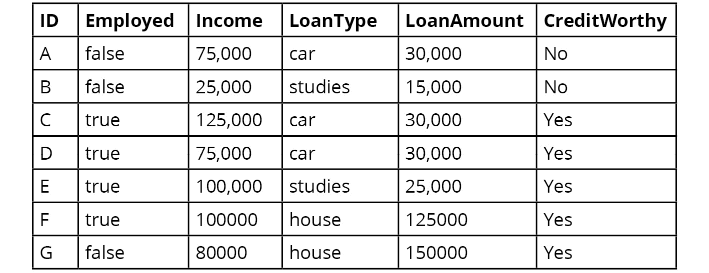
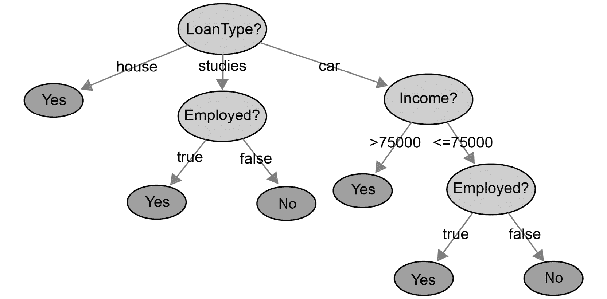
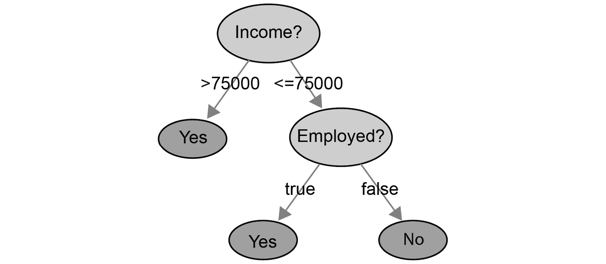
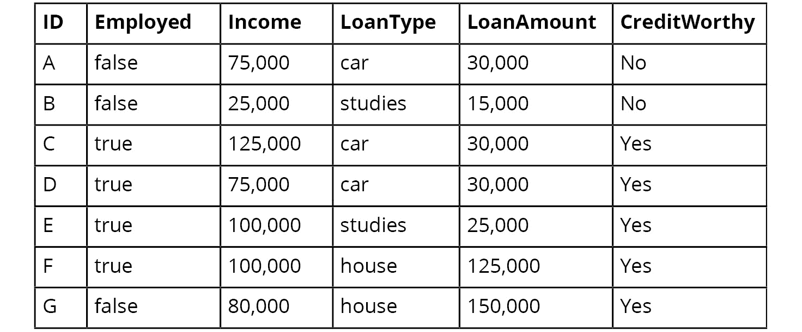
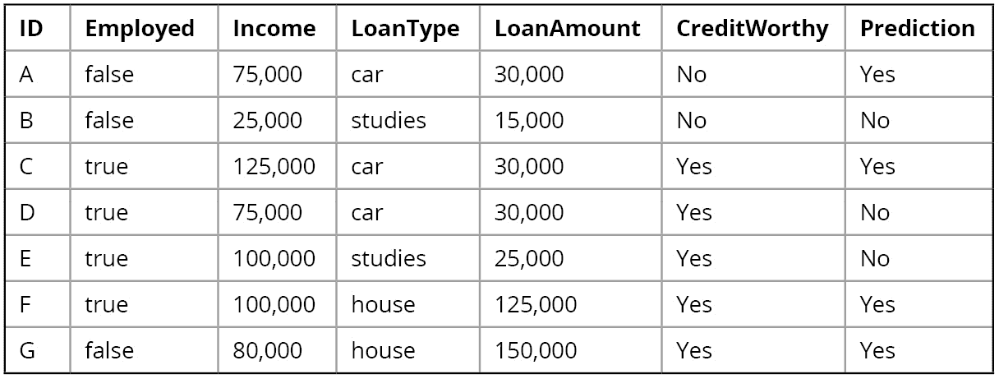
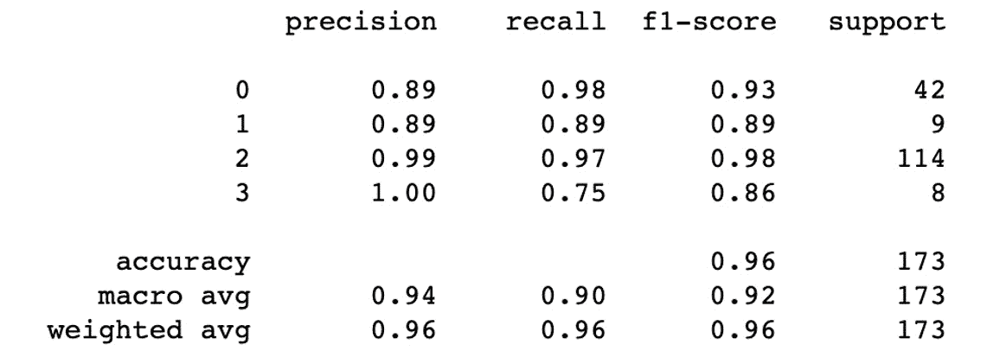
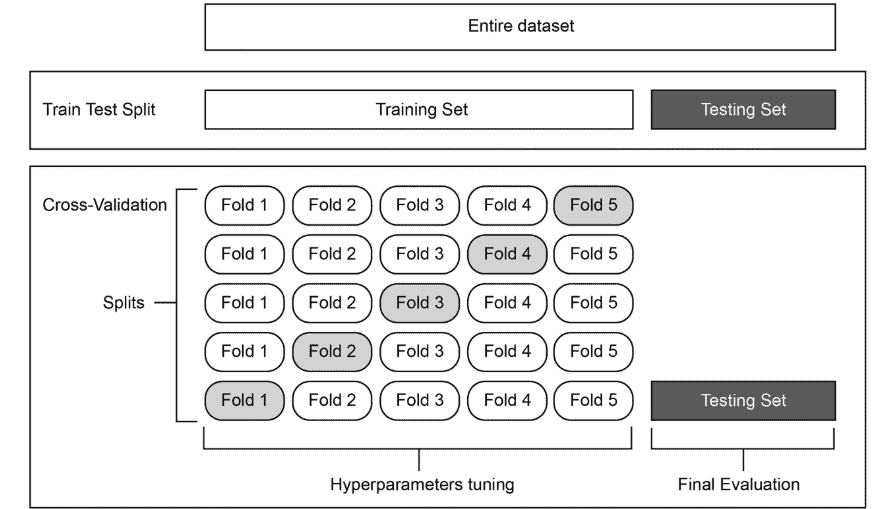

# 第四章：4\. 决策树简介

概述

本章将详细介绍两种类型的监督学习算法。第一个算法将帮助你使用决策树对数据点进行分类，而另一个算法则帮助你使用随机森林对数据点进行分类。此外，你还将学习如何手动和自动计算模型的精确度、召回率和 F1 分数。到本章结束时，你将能够分析用于评估数据模型效用的指标，并基于决策树和随机森林算法对数据点进行分类。

# 介绍

在前两章中，我们学习了回归问题与分类问题的区别，并且我们看到了如何训练一些最著名的算法。本章中，我们将介绍另一种算法类型：基于树的模型。

基于树的模型非常流行，因为它们可以建模复杂的非线性模式，并且相对容易理解。本章中，我们将介绍决策树和随机森林算法，这些是行业中最广泛使用的基于树的模型之一。

# 决策树

决策树有叶子节点、分支和节点。节点是做出决策的地方。决策树由我们用来制定决策（或预测）数据点的规则组成。

决策树的每个节点代表一个特征，而从内部节点出来的每条边代表树的一个可能值或值区间。树的每个叶子节点代表树的一个标签值。

这可能听起来有些复杂，但让我们来看一个应用实例。

假设我们有一个数据集，具有以下特征，并且响应变量是判断一个人是否有信用：



图 4.1：用于制定规则的示例数据集

记住，决策树只是一些规则的集合。查看*图 4.1*中的数据集，我们可以得出以下规则：

+   所有有房贷的人都被确定为有信用的人。

+   如果债务人有工作并且在学习，那么贷款是有信用的。

+   年收入超过 75,000 的人是有信用的。

+   年收入在 75,000 以下的、有车贷并且有工作的人员是有信用的。

按照我们刚才定义的规则顺序，我们可以建立一棵树，如*图 4.2*所示，并描述一种可能的信用评分方法：



图 4.2：贷款类型的决策树

首先，我们确定贷款类型。根据第一个规则，房屋贷款自动为信用良好。学习贷款由第二个规则描述，结果是一个包含另一个关于就业的决策的子树。由于我们已经涵盖了房屋贷款和学习贷款，因此只剩下汽车贷款。第三个规则描述了收入决策，而第四个规则描述了关于就业的决策。

每当我们必须对一个新的债务人进行评分，以确定其是否具有信用时，我们必须从决策树的顶部到底部进行遍历，并观察底部的真假值。

显然，基于七个数据点的模型准确性非常低，因为我们无法推广那些与现实完全不符的规则。因此，规则通常是基于大量数据来确定的。

这并不是构建决策树的唯一方法。我们还可以基于其他规则的顺序来构建决策树。让我们从*图 4.1*的数据集中提取一些其他规则。

**观察 1**：注意到所有收入超过 75,000 的个人都是信用良好的。

`收入 > 75,000 => 信用良好` 这个规则成立。

规则 1 将七个数据点中的四个（ID C、E、F、G）分类；对于剩下的三个数据点，我们需要更多的规则。

**观察 2**：在剩下的三个数据点中，有两个没有就业。其中一个是就业的（ID D），并且是信用良好的。由此，我们可以得出以下规则：

`收入 <= 75,000` 时，以下情况成立：`在职 == true => 信用良好`。

注意，使用这个第二个规则，我们也可以将剩下的两个数据点（ID A 和 B）分类为不信用良好。通过这两个规则，我们准确地分类了该数据集中的所有观察点：



图 4.3：收入的决策树

第二个决策树比较简单。同时，我们不能忽视这样一个事实：模型表示，*低收入的在职人员更可能无法偿还贷款*。不幸的是，训练数据不足（这个例子中只有七个观察点），这使得我们很可能得出错误的结论。

过拟合是决策树中常见的问题，当我们仅基于少量数据点做出决策时，这个决策通常不能代表整体情况。

由于我们可以按照任何可能的顺序构建决策树，因此定义一种高效的决策树构建方式是有意义的。因此，我们将探讨一种用于在决策过程中排序特征的度量方法。

## 熵

在信息论中，熵衡量一个属性的可能值分布的随机程度。随机程度越高，属性的熵值越高。

熵是事件的最高可能性。如果我们事先知道事件的结果，那么这个事件就没有随机性。因此，熵值为**零**。

我们使用熵来排序决策树中节点的分裂。以之前的例子为例，我们应该从哪个规则开始？是`Income <= 75000`还是`is employed`？我们需要使用一个度量标准来告诉我们哪个特定的分裂比另一个更好。一个好的分裂可以通过它清楚地将数据分成两个同质的组来定义。一个这样的度量是信息增益，它基于熵。

这里是计算熵的公式：


图 4.4：熵公式

*p*i 表示目标变量某一可能值发生的概率。所以，如果这一列有*n*个不同的唯一值，那么我们将为每个值计算概率*([p*1*, p*2*, ..., p*n*])*并应用公式。

要在 Python 中手动计算分布的熵，我们可以使用 NumPy 库中的`np.log2`和`np.dot()`方法。在`numpy`中没有自动计算熵的函数。

看看下面的例子：

```py
import numpy as np
probabilities = list(range(1,4)) 
minus_probabilities = [-x for x in probabilities]
log_probabilities = [x for x in map(np.log2, probabilities)]
entropy_value = np.dot(minus_probabilities, log_probabilities)
```

概率以 NumPy 数组或常规列表的形式给出，在*第 2 行*：*p*i。

我们需要创建一个包含*第 3 行*分布中取反值的向量：- *p*i。

在*第 4 行*，我们必须对分布列表中的每个值取以 2 为底的对数：logi pi。

最后，我们通过标量积来计算总和，也称为两个向量的点积：


图 4.5：两个向量的点积

注意

你第一次在*第二章*《回归分析导论》中学习了点积。两个向量的点积是通过将第一个向量的第*i*个坐标与第二个向量的第*i*个坐标相乘来计算的，针对每个*i*。一旦我们得到所有的乘积，就将它们求和：

*np.dot([1, 2, 3], [4, 5, 6])*

这将得到 1*4 + 2*5 + 3*6 = 32。

在下一个练习中，我们将计算一个小样本数据集的熵。

## 练习 4.01：计算熵

在这个练习中，我们将计算数据集中特征的熵，如*图 4.6*所示：



图 4.6：用于制定规则的样本数据集

注意

数据集文件也可以在我们的 GitHub 仓库中找到：

[`packt.live/2AQ6Uo9`](https://packt.live/2AQ6Uo9)。

我们将为`Employed`、`Income`、`LoanType`和`LoanAmount`特征计算熵。

以下步骤将帮助你完成这个练习：

1.  打开一个新的 Jupyter Notebook 文件。

1.  导入`numpy`包并命名为`np`：

    ```py
    import numpy as np
    ```

1.  定义一个名为`entropy()`的函数，它接收一个概率数组并返回计算得到的熵值，如下代码片段所示：

    ```py
    def entropy(probabilities):
        minus_probabilities = [-x for x in probabilities]
        log_probabilities = [x for x in map(np.log2, \
                                            probabilities)]
        return np.dot(minus_probabilities, log_probabilities)
    ```

    接下来，我们将计算 `Employed` 列的熵。该列仅包含两个可能的值：`true` 或 `false`。在七行数据中，`true` 出现了四次，因此其概率为 `4/7`。类似地，`false` 的概率为 `3/7`，因为它在数据集中出现了三次。

1.  使用 `entropy()` 函数计算 `Employed` 列的熵，概率分别为 `4/7` 和 `3/7`：

    ```py
    H_employed = entropy([4/7, 3/7])
    H_employed
    ```

    你应该得到以下输出：

    ```py
    0.9852281360342515
    ```

    这个值接近零，意味着这些组是相当同质的。

1.  现在，使用 `entropy()` 函数计算 `Income` 列的熵及其对应的概率列表：

    ```py
    H_income = entropy([1/7, 2/7, 1/7, 2/7, 1/7])
    H_income
    ```

    你应该得到以下输出：

    ```py
    2.2359263506290326
    ```

    与 `Employed` 列相比，`Income` 的熵较高。这意味着该列的概率分布更为分散。

1.  使用 `entropy` 函数计算 `LoanType` 列的熵及其对应的概率列表：

    ```py
    H_loanType = entropy([3/7, 2/7, 2/7])
    H_loanType
    ```

    你应该得到以下输出：

    ```py
    1.5566567074628228
    ```

    这个值大于 0，因此该列的概率分布较为分散。

1.  让我们使用 `entropy` 函数计算 `LoanAmount` 列的熵及其对应的概率列表：

    ```py
    H_LoanAmount = entropy([1/7, 1/7, 3/7, 1/7, 1/7])
    H_LoanAmount
    ```

    你应该得到以下输出：

    ```py
    2.128085278891394
    ```

    `LoanAmount` 的熵较高，因此其值相当随机。

    注意

    要访问此特定部分的源代码，请参考 [`packt.live/37T8DVz`](https://packt.live/37T8DVz)。

    你也可以在线运行这个示例，网址为 [`packt.live/2By7aI6`](https://packt.live/2By7aI6)。你必须执行整个 Notebook 才能得到预期的结果。

在这里，你可以看到 `Employed` 列的熵在四个不同的列中是最低的，因为它的值变化最小。

完成这个练习后，你已经学会了如何手动计算数据集每一列的熵。

## 信息增益

当我们根据某个属性的值对数据集中的数据点进行划分时，我们减少了系统的熵。

为了描述信息增益，我们可以计算标签的分布。在 *图 4.1* 中，我们的数据集包含五个可信和两个不可信的个体。初始分布的熵如下：

```py
H_label = entropy([5/7, 2/7])
H_label
```

输出结果如下：

```py
0.863120568566631
```

让我们看看如果根据贷款金额是否大于 15,000 来划分数据集，会发生什么：

+   在组 1 中，我们得到一个属于 15,000 贷款金额的数据点。这个数据点是不可信的。

+   在组 2 中，我们有五个可信的个体和一个不可信的个体。

每个组中标签的熵如下：

对于组 1，我们有如下情况：

```py
H_group1 = entropy([1]) 
H_group1
```

输出结果如下：

```py
-0.0
```

对于组 2，我们有如下情况：

```py
H_group2 = entropy([5/6, 1/6]) 
H_group2
```

输出结果如下：

```py
0.6500224216483541
```

为了计算信息增益，让我们计算组熵的加权平均值：

```py
H_group1 * 1/7 + H_group2 * 6/7
```

输出结果如下：

```py
0.5571620756985892
```

现在，为了找到信息增益，我们需要计算原始熵（`H_label`）与我们刚刚计算出的熵之间的差异：

```py
Information_gain = 0.863120568566631 - 0.5572
Information_gain
```

输出如下：

```py
0.30592056856663097
```

通过使用这个规则拆分数据，我们获得了一些信息。

在创建决策树时，在每个节点，我们的任务是使用能够最大化信息增益的规则来划分数据集。

我们也可以使用基尼不纯度代替基于熵的信息增益来构建最佳的决策树拆分规则。

## 基尼不纯度

除了熵之外，还有另一种广泛使用的度量标准可以用来衡量分布的随机性：基尼不纯度。

基尼不纯度的定义如下：


图 4.7：基尼不纯度

*p*i 代表目标变量可能值之一发生的概率。

熵的计算可能稍微慢一些，因为涉及到对数运算。另一方面，基尼不纯度在衡量随机性时的精确度较低。

注意

一些程序员更倾向于使用基尼不纯度，因为不需要进行对数计算。从计算的角度来看，这两种方法都不算特别复杂，因此可以使用其中任意一种。在性能方面，以下研究得出的结论是，这两种度量标准之间的差异通常非常小：[`www.unine.ch/files/live/sites/imi/files/shared/documents/papers/Gini_index_fulltext.pdf`](https://www.unine.ch/files/live/sites/imi/files/shared/documents/papers/Gini_index_fulltext.pdf)。

通过这一点，我们已经了解到，可以通过基于信息增益或基尼不纯度来优化决策树。不幸的是，这些度量标准仅适用于离散值。如果标签是在一个连续区间内定义的，比如价格范围或薪资范围，该怎么办呢？

我们必须使用其他度量标准。理论上，你可以理解基于连续标签创建决策树的思路，那就是回归。我们在本章中可以重用的一个度量标准是均方误差。与基尼不纯度或信息增益不同，我们必须最小化均方误差以优化决策树。由于这是一个初学者课程，我们将省略这一度量标准。

在下一部分，我们将讨论决策树的退出条件。

## 退出条件

我们可以根据越来越具体的规则持续地拆分数据点，直到决策树的每个叶子节点的熵为零。问题是，这种最终状态是否是理想的。

通常，这不是我们所期望的，因为我们可能会面临过拟合模型的风险。当模型的规则过于具体且过于挑剔，而做出决策的样本量又过小，我们就有可能得出错误的结论，从而在数据集中识别出一个实际上并不存在于现实中的模式。

例如，如果我们转动轮盘三次，得到的结果分别是 12、25 和 12，这就得出结论：每次奇数次转动结果为 12 的策略并不明智。假设每次奇数次转动结果都是 12，我们就发现了一个完全由随机噪音引起的规则。

因此，对我们仍然可以分割的数据集的最小大小施加限制是一个在实际中效果良好的退出条件。例如，如果在数据集小于 50、100、200 或 500 时就停止分割，就可以避免对随机噪音得出结论，从而最大限度地减少过拟合模型的风险。

另一种常见的退出条件是树的最大深度限制。一旦达到固定的树深度，我们就在叶子节点对数据点进行分类。

## 使用 scikit-learn 构建决策树分类器

我们已经学习了如何从`.csv`文件加载数据，如何对数据进行预处理，以及如何将数据拆分为训练集和测试集。如果你需要复习这些知识，可以回到前面的章节，在回归和分类的背景下重新学习这一过程。

现在，我们假设已经通过`scikit-learn train-test-split`调用返回了一组训练特征、训练标签、测试特征和测试标签：

```py
from sklearn import model_selection
features_train, features_test, \
label_train, label_test = \
model_selection.train_test_split(features, label, test_size=0.1, \
                                 random_state=8)
```

在前面的代码片段中，我们使用了`train_test_split`将数据集（特征和标签）拆分为训练集和测试集。测试集占观测数据的 10%（`test_size=0.1`）。`random_state`参数用于获取可重复的结果。

我们不会专注于如何获得这些数据点，因为这个过程与回归和分类的情况完全相同。

现在是时候导入并使用 scikit-learn 的决策树分类器了：

```py
from sklearn.tree import DecisionTreeClassifier
decision_tree = DecisionTreeClassifier(max_depth=6)
decision_tree.fit(features_train, label_train)
```

我们在`DecisionTreeClassifier`中设置了一个可选参数，即`max_depth`，用于限制决策树的深度。

注意

你可以阅读官方文档，获取参数的完整列表：[`scikit-learn.org/stable/modules/generated/sklearn.tree.DecisionTreeClassifier.html`](http://scikit-learn.org/stable/modules/generated/sklearn.tree.DecisionTreeClassifier.html)。

以下是一些更重要的参数：

+   `criterion`: Gini 代表基尼不纯度，entropy 代表信息增益。这将定义在每个节点上用于评估分割质量的度量标准。

+   `max_depth`: 这是定义树的最大深度的参数。

+   `min_samples_split`: 这是分割内部节点所需的最小样本数。

你也可以尝试文档中列出的所有其他参数。我们将在本节中省略它们。

一旦模型构建完成，我们就可以使用决策树分类器进行数据预测：

```py
decision_tree.predict(features_test)
```

你将在本节末尾的活动中构建一个决策树分类器。

## 分类器的性能评估指标

在拆分训练数据和测试数据之后，决策树模型有一个 `score` 方法，用来评估模型对测试数据分类的效果（也称为准确率）。我们在前两章中学习了如何使用 `score` 方法：

```py
decision_tree.score(features_test, label_test)
```

`score` 方法的返回值是一个小于或等于 1 的数字。我们越接近 1，模型就越好。

现在，我们将学习另一种评估模型的方法。

注意

你也可以将此方法应用于你在上一章构建的模型。

假设我们有一个测试特征和一个测试标签：

```py
predicted_label = decision_tree.predict(features_test)
```

让我们使用之前的信用评分示例，假设我们训练了一个决策树，现在有了它的预测结果：



图 4.8：用于制定规则的示例数据集

我们的模型一般来说做出了很好的预测，但也有少数错误。它错误地预测了 ID `A`、`D` 和 `E` 的结果。它的准确率得分将是 4 / 7 = 0.57。

我们将使用以下定义来定义一些度量标准，帮助你评估分类器的好坏：

+   `Creditworthy` 列（在我们的示例中）和相应的预测值都是 `Yes`。在我们的示例中，ID `C`、`F` 和 `G` 将属于这一类别。

+   `No`。只有 ID `B` 会被分类为真正负类。

+   `Yes`，但真实标签实际上是 `No`。这种情况适用于 ID `A`。

+   `No`，但真实标签实际上是 `Yes`，例如 ID `D` 和 `E`。

使用前面四个定义，我们可以定义四个度量标准，用来描述我们的模型如何预测目标变量。`#( X )` 符号表示 `X` 中的值的数量。从技术术语上讲，`#( X )` 表示 `X` 的基数：

**定义（准确率）**：*#（真正例）+ #(真正负类) / #(数据集)*

准确率是一个用来衡量分类器给出正确答案次数的指标。这是我们用来评估分类器得分的第一个度量标准。

在我们之前的示例中（*图 4.8*），准确率得分将是 TP + TN / 总数 = (3 + 1) / 7 = 4/7。

我们可以使用 scikit-learn 提供的函数来计算模型的准确率：

```py
from sklearn.metrics import accuracy_score
accuracy_score(label_test, predicted_label)
```

**定义（精度）**：*#真正例 / (#真正例 + #假正例)*

精度关注的是分类器认为是正类的值。这些结果中，有些是真正例，而有些是假正例。高精度意味着假正例的数量相对于真正例非常低。这意味着一个精确的分类器在找到正类时很少犯错。

**定义（召回率）**：*#真正例 / (#真正例 + #假负例)*

召回率关注的是测试数据中正类值的情况。分类器找到的这些结果是正例（True Positive）。那些分类器未找到的正类值是假阴性（False Negative）。一个召回率高的分类器能够找到大多数正类值。

使用我们之前的示例（*图 4.8*），我们将得到以下度量：

+   精确度 = TP / (TP + FP) = 4 / (4 + 1) = 4/6 = 0.8

+   召回率 = TP / (TP + FN) = 4 / (4 + 2) = 4/6 = 0.6667

通过这两个度量，我们可以轻松看到我们的模型在哪些地方表现更好或更差。在这个例子中，我们知道它倾向于误分类假阴性案例。这些度量比准确率分数更为细致，准确率分数仅提供一个整体分数。

F1 分数是一个结合精确度和召回率的度量。它的值范围在 0 到 1 之间。如果 F1 分数为 1，则表示模型完美地预测了正确的结果。另一方面，F1 分数为 0 则表示模型无法准确预测目标变量。F1 分数的优点是它考虑了假阳性和假阴性。

计算 F1 分数的公式如下：


图 4.9：计算 F1 分数的公式

最后需要指出的是，scikit-learn 包还提供了一个非常实用的函数，可以一次性显示所有这些度量：`classification_report()`。分类报告有助于检查我们预测的质量：

```py
from sklearn.metrics import classification_report
print(classification_report(label_test, predicted_label))
```

在下一个练习中，我们将练习如何手动计算这些分数。

## 练习 4.02：精确度、召回率和 F1 分数计算

在本练习中，我们将计算两个不同分类器在模拟数据集上的精确度、召回率和 F1 分数。

以下步骤将帮助你完成此练习：

1.  打开一个新的 Jupyter Notebook 文件。

1.  使用以下代码导入`numpy`包，并将其命名为`np`：

    ```py
    import numpy as np
    ```

1.  创建一个名为`real_labels`的`numpy`数组，包含值[`True, True, False, True, True`]。该列表表示我们模拟数据集的目标变量的真实值。打印其内容：

    ```py
    real_labels = np.array([True, True, False, True, True])
    real_labels
    ```

    预期输出如下：

    ```py
    array([ True, True, False, True, True])
    ```

1.  创建一个名为`model_1_preds`的`numpy`数组，包含值`[True, False, False, False, False]`。该列表表示第一个分类器的预测值。打印其内容：

    ```py
    model_1_preds = np.array([True, False, False, False, False])
    model_1_preds
    ```

    预期输出如下：

    ```py
    array([ True, False, False, False, False])
    ```

1.  创建另一个名为`model_2_preds`的`numpy`数组，包含值`[True, True, True, True, True]`。该列表表示第一个分类器的预测值。打印其内容：

    ```py
    model_2_preds = np.array([True, True, True, True, True])
    model_2_preds
    ```

    预期输出如下：

    ```py
    array([ True,  True,  True,  True,  True])
    ```

1.  创建一个名为`model_1_tp_cond`的变量，用来找到第一个模型的真正例：

    ```py
    model_1_tp_cond = (real_labels == True) \
                       & (model_1_preds == True)
    model_1_tp_cond
    ```

    预期输出如下：

    ```py
    array([ True, False, False, False, False])
    ```

1.  创建一个名为`model_1_tp`的变量，通过求和`model_1_tp_cond`来获取第一个模型的真正例数量：

    ```py
    model_1_tp = model_1_tp_cond.sum()
    model_1_tp
    ```

    预期输出如下：

    ```py
    1
    ```

    第一个模型只有`1`个真实阳性案例。

1.  创建一个名为`model_1_fp`的变量，用于获取第一个模型的假阳性数量：

    ```py
    model_1_fp = ((real_labels == False) \
                   & (model_1_preds == True)).sum()
    model_1_fp
    ```

    预期输出将如下所示：

    ```py
    0
    ```

    第一个模型没有假阳性。

1.  创建一个名为`model_1_fn`的变量，用于获取第一个模型的假阴性数量：

    ```py
    model_1_fn = ((real_labels == True) \
                   & (model_1_preds == False)).sum()
    model_1_fn
    ```

    预期输出将如下所示：

    ```py
    3
    ```

    第一个分类器有`3`个假阴性案例。

1.  创建一个名为`model_1_precision`的变量，用于计算第一个模型的精度：

    ```py
    model_1_precision = model_1_tp / (model_1_tp + model_1_fp)
    model_1_precision
    ```

    预期输出将如下所示：

    ```py
    1.0
    ```

    第一个分类器的精度得分为`1`，因此它没有预测出任何假阳性。

1.  创建一个名为`model_1_recall`的变量，用于计算第一个模型的召回率：

    ```py
    model_1_recall = model_1_tp / (model_1_tp + model_1_fn)
    model_1_recall
    ```

    预期输出将如下所示：

    ```py
    0.25
    ```

    第一个模型的召回率仅为`0.25`，因此它预测了相当多的假阴性。

1.  创建一个名为`model_1_f1`的变量，用于计算第一个模型的 F1 分数：

    ```py
    model_1_f1 = 2*model_1_precision * model_1_recall\
                 / (model_1_precision + model_1_recall)
    model_1_f1
    ```

    预期输出将如下所示：

    ```py
    0.4
    ```

    如预期所示，第一个模型的 F1 分数相当低。

1.  创建一个名为`model_2_tp`的变量，用于获取第二个模型的真实阳性数量：

    ```py
    model_2_tp = ((real_labels == True) \
                   & (model_2_preds == True)).sum()
    model_2_tp
    ```

    预期输出将如下所示：

    ```py
    4
    ```

    第二个模型有`4`个真实阳性案例。

1.  创建一个名为`model_2_fp`的变量，用于获取第二个模型的假阳性数量：

    ```py
    model_2_fp = ((real_labels == False) \
                   & (model_2_preds == True)).sum()
    model_2_fp
    ```

    预期输出将如下所示：

    ```py
    1
    ```

    第二个模型只有一个假阳性。

1.  创建一个名为`model_2_fn`的变量，用于获取第二个模型的假阴性数量：

    ```py
    model_2_fn = ((real_labels == True) \
                   & (model_2_preds == False)).sum()
    model_2_fn
    ```

    预期输出将如下所示：

    ```py
    0
    ```

    第二个分类器没有假阴性。

1.  创建一个名为`model_2_precision`的变量，用于计算第二个模型的精度：

    ```py
    model_2_precision = model_2_tp / (model_2_tp + model_2_fp) 
    model_2_precision
    ```

    预期输出将如下所示：

    ```py
    0.8
    ```

    第二个模型的精度得分相当高：`0.8`。它在假阳性方面并没有犯太多错误。

1.  创建一个名为`model_2_recall`的变量，用于计算第二个模型的召回率：

    ```py
    model_2_recall = model_2_tp / (model_2_tp + model_2_fn)
    model_2_recall
    ```

    预期输出将如下所示：

    ```py
    1.0
    ```

    在召回率方面，第二个分类器表现出色，没有将任何观测值错误分类为假阴性。

1.  创建一个名为`model_2_f1`的变量，用于计算第二个模型的 F1 分数：

    ```py
    model_2_f1 = 2*model_2_precision*model_2_recall \
                 / (model_2_precision + model_2_recall)
    model_2_f1
    ```

    预期输出将如下所示：

    ```py
    0.888888888888889
    ```

    第二个模型的 F1 分数相当高。

    注意

    要访问此特定部分的源代码，请参考[`packt.live/3evqbtu`](https://packt.live/3evqbtu)。

    你也可以在[`packt.live/2NoxLdo`](https://packt.live/2NoxLdo)在线运行此示例。你必须执行整个笔记本以获得预期的结果。

在本次练习中，我们展示了如何手动计算两个不同模型的精度、召回率和 F1 分数。第一个分类器具有优秀的精度，但召回率较差，而第二个分类器具有优秀的召回率和相当不错的精度。

## 使用 scikit-learn 评估分类器的性能

scikit-learn 包提供了一些函数，用于自动计算精度、召回率和 F1 分数。你需要先导入这些函数：

```py
from sklearn.metrics import recall_score, \
precision_score, f1_score
```

要获得精度分数，你需要从模型中获取预测结果，如下所示的代码片段：

```py
label_predicted = decision_tree.predict(data)
precision_score(label_test, predicted_label, \
                average='weighted')
```

计算 `recall_score` 可以这样进行：

```py
recall_score(label_test, label_predicted, average='weighted')
```

计算 `f1_score` 可以这样进行：

```py
f1_score(label_test, predicted_label, average='weighted')
```

在下一部分，我们将学习如何使用另一个工具——混淆矩阵，来分析分类器的性能。

# 混淆矩阵

之前，我们学习了如何使用一些计算指标来评估分类器的性能。还有另一个非常有趣的工具可以帮助你评估多类分类模型的性能：混淆矩阵。

混淆矩阵是一个方阵，其中行数和列数等于不同标签值（或类别）的数量。在矩阵的列中，我们放置每个测试标签值。在矩阵的行中，我们放置每个预测标签值。

混淆矩阵如下所示：


图 4.10：示例混淆矩阵

在前面的示例中，混淆矩阵的第一行展示了模型的表现：

+   正确预测 A 类 `88` 次

+   在真实值为 B 时预测 A 类 `3` 次

+   在真实值为 C 时预测 A 类 `2` 次

我们还可以看到，当模型预测 C 类时，真实值为 A（16 次）的错误情况。混淆矩阵是一个强大的工具，可以快速轻松地发现模型在某些类别上表现良好或不良。

scikit-learn 包提供了一个函数来计算并显示混淆矩阵：

```py
from sklearn.metrics import confusion_matrix
confusion_matrix(label_test, predicted_label)
```

在下一个活动中，你将构建一个决策树模型，用来将汽车分类为不可接受、可接受、良好和非常好四个类别，以便客户使用。

## 活动 4.01：汽车数据分类

在本活动中，你将构建一个可靠的决策树模型，帮助公司找到客户可能购买的汽车。我们假设租车公司正在专注于与客户建立长期关系。你的任务是构建一个决策树模型，将汽车分类为不可接受、可接受、良好和非常好四个类别。

注意

数据集文件也可以在我们的 GitHub 仓库中找到：[`packt.live/2V95I6h`](https://packt.live/2V95I6h)。

本活动的数据集可以在这里访问：[`archive.ics.uci.edu/ml/datasets/Car+Evaluation`](https://archive.ics.uci.edu/ml/datasets/Car+Evaluation)。

引用 – *Dua, D., & Graff, C.. (2017). UCI Machine Learning Repository*。

它由六个不同的特征组成：`buying`、`maintenance`、`doors`、`persons`、`luggage_boot`和`safety`。目标变量对给定汽车的接受度进行排名。它可以取四个不同的值：`unacc`、`acc`、`good`和`vgood`。

以下步骤将帮助你完成此活动：

1.  将数据集加载到 Python 中并导入必要的库。

1.  使用 scikit-learn 中的`LabelEncoder()`进行标签编码。

1.  使用`pop()`从 pandas 中提取`label`变量。

1.  现在，使用 scikit-learn 中的`train_test_split()`将训练数据和测试数据分开。我们将使用 10%的数据作为测试数据。

1.  使用`DecisionTreeClassifier()`及其方法`fit()`和`predict()`构建决策树分类器。

1.  使用`score()`检查基于测试数据的模型评分。

1.  使用 scikit-learn 中的`classification_report()`对模型进行更深入的评估。

预期输出：



图 4.11：显示预期分类报告的输出

注意

本活动的解决方案可以在第 353 页找到。

在接下来的部分，我们将研究随机森林分类器。

# 随机森林分类器

如果你考虑一下随机森林分类器这个名称，可以这样解释：

+   一片森林由多棵树组成。

+   这些树可以用于分类。

+   由于到目前为止我们唯一使用的分类树是决策树，因此可以理解随机森林是一片决策树的森林。

+   树的随机性意味着我们的决策树是以随机化的方式构建的。

因此，我们将根据信息增益或基尼不纯度来构建决策树。

一旦你理解了这些基本概念，你就基本上知道随机森林分类器的内容了。森林中的树木越多，预测的准确性就越高。在执行预测时，每棵树都执行分类。我们收集结果，获得最多投票的类别获胜。

随机森林可以用于回归和分类。在使用随机森林进行回归时，我们不再统计某个类别的最多投票数，而是取预测结果的算术平均值（平均数）并返回。尽管随机森林在分类中的表现非常理想，但在回归中的效果不如分类，因为用于预测值的模型通常是失控的，且经常返回一个范围较广的值。这些值的平均值往往意义不大。管理回归中的噪声比分类更为困难。

随机森林通常比简单的决策树表现更好，因为它们提供了冗余性。它们能更好地处理异常值，并且具有较低的过拟合模型的概率。决策树在使用训练数据时表现得很好，但一旦用于预测新数据，随机森林则失去其优势。随机森林广泛应用于分类问题，无论是银行或电子商务的客户细分、图像分类，还是医学领域。如果你拥有一台带有 Kinect 的 Xbox，你的 Kinect 设备就包含了一个随机森林分类器，用于检测你的身体。

随机森林是一种集成算法。集成学习的思想是，我们通过多个可能有不同弱点的代理的决策来获得一个综合视角。由于集体投票，这些弱点会被抵消，大多数投票结果很可能代表正确的结果。

## 使用 scikit-learn 进行随机森林分类

正如你可能已经猜到的，scikit-learn 包提供了`RandomForest`分类器的实现，使用的是`RandomForestClassifier`类。这个类提供了与迄今为止所有 scikit-learn 模型完全相同的方法——你需要实例化一个模型，然后使用`.fit()`方法对其进行训练，最后使用`.predict()`方法进行预测：

```py
from sklearn.ensemble import RandomForestClassifier
random_forest_classifier = RandomForestClassifier()
random_forest_classifier.fit(features_train, label_train)
labels_predicted = random_forest_classifier.predict\
                   (features_test)
```

在下一节中，我们将查看随机森林分类器的参数化。

## 随机森林分类器的参数化

我们将基于已有的知识，考虑可能的参数子集，这些知识来源于构建随机森林的描述：

+   `n_estimators`：随机森林中的树木数量。默认值为 10。

+   `criterion`：使用 Gini 或熵来确定在每棵树中是使用 Gini 不纯度还是信息增益。它将用于找到每个节点的最佳分裂。

+   `max_features`：每棵树考虑的最大特征数。可能的值包括整数。你还可以添加一些字符串，如`sqrt`，表示特征数量的平方根。

+   `max_depth`：每棵树的最大深度。

+   `min_samples_split`：在给定节点中，数据集中的最小样本数，以执行分裂。这也可以减少树的大小。

+   `bootstrap`：一个布尔值，指示在构建树时是否对数据点使用自助法。

## 特征重要性

随机森林分类器为你提供了每个特征在数据分类过程中有多重要的信息。记住，我们使用了许多随机构建的决策树来对数据点进行分类。我们可以衡量这些数据点的表现准确性，同时也能看到在决策过程中哪些特征是至关重要的。

我们可以通过以下查询来检索特征重要性得分的数组：

```py
random_forest_classifier.feature_importances_
```

在这个包含六个特征的分类器中，第四个和第六个特征显然比其他特征更重要。第三个特征的重要性得分非常低。

特征重要性分数在我们有很多特征时特别有用，尤其是当我们想要减少特征数量以避免分类器在细节中迷失时。当我们有大量特征时，我们容易导致模型过拟合。因此，通过剔除最不重要的特征来减少特征数量通常是有帮助的。

## 交叉验证

之前，我们学习了如何使用不同的度量标准来评估分类器的性能，例如在训练集和测试集上的准确率、精确率、召回率或 F1 分数。目标是在两个数据集上都获得较高的分数，并且这两个分数要非常接近。如果是这样，你的模型就能表现良好，并且不容易过拟合。

测试集用于作为代理，评估你的模型是否能够很好地泛化到未见过的数据，或者是否仅仅学习了对训练集有意义的模式。

但是，在需要调整多个超参数的情况下（例如对于`RandomForest`），你需要训练大量不同的模型并在测试集上测试它们。这种做法实际上削弱了测试集的作用。把测试集当作最终考试，决定你是否能通过某一科目。你不会被允许反复通过或重考。

避免过度使用测试集的一个解决方案是创建验证集。你将在训练集上训练模型，并使用验证集根据不同的超参数组合来评估模型的得分。一旦找到最佳模型，你将使用测试集确保它不会过度拟合。这通常是任何数据科学项目推荐的做法。

这种方法的缺点是，你减少了用于训练集的观测数据。如果你的数据集包含数百万行，这不是问题。但对于一个小型数据集，这可能会造成问题。这就是交叉验证派上用场的地方。

以下*图 4.12*显示了这种技术，在这种技术中，你会创建多个训练数据的分割。对于每个分割，训练数据被分为若干个折叠（本例中为五个），其中一个折叠将作为验证集，其余折叠用于训练。

例如，在上面的分割中，第五折将用于验证，其余四个折叠（1 到 4）将用于训练模型。你将对每个分割执行相同的过程。经过每个分割后，你将使用整个训练数据，最终的性能得分将是每个分割上训练的所有模型的平均值：



图 4.12：交叉验证示例

使用 scikit-learn，你可以轻松地执行交叉验证，以下是一个代码示例：

```py
from sklearn.ensemble import RandomForestClassifier
random_forest_classifier = RandomForestClassifier()
from sklearn.model_selection import cross_val_score
cross_val_score(random_forest_classifier, features_train, \
                label_train, cv=5, scoring='accuracy')
```

`cross_val_score`函数接受两个参数：

+   `cv`：指定拆分的次数。

+   `scoring`：定义你希望使用的性能指标。你可以在这里找到可能的值列表：[`scikit-learn.org/stable/modules/model_evaluation.html#scoring-parameter`](https://scikit-learn.org/stable/modules/model_evaluation.html#scoring-parameter)。

在下一部分，我们将探讨`RandomForest`的一个特定变体，称为`extratrees`。

## 极端随机森林

极端随机树通过在已经随机化的随机森林因素基础上随机化分裂规则，从而增加了随机森林内部的随机化程度。

参数化方式类似于随机森林分类器。你可以在这里查看完整的参数列表：[`scikit-learn.org/stable/modules/generated/sklearn.ensemble.ExtraTreesClassifier.html`](http://scikit-learn.org/stable/modules/generated/sklearn.ensemble.ExtraTreesClassifier.html)。

Python 实现如下：

```py
from sklearn.ensemble import ExtraTreesClassifier
extra_trees_classifier = \
ExtraTreesClassifier(n_estimators=100, \
                     max_depth=6)
extra_trees_classifier.fit(features_train, label_train)
labels_predicted = extra_trees_classifier.predict(features_test)
```

在接下来的活动中，我们将优化在*活动 4.01*中构建的分类器，*汽车数据分类*。

## 活动 4.02：为你的汽车租赁公司进行随机森林分类

在本活动中，你将优化分类器，以便在为你的车队选择未来的汽车时，更好地满足客户需求。我们将对你在本章前一个活动中使用的汽车经销商数据集进行随机森林和极端随机森林分类。

以下步骤将帮助你完成此活动：

1.  按照之前*活动 4.01*的*步骤 1 - 4*，*汽车数据分类*。

1.  使用`RandomForestClassifier`创建一个随机森林。

1.  使用`.fit()`训练模型。

1.  导入`confusion_matrix`函数来评估`RandomForest`的质量。

1.  使用`classification_report()`打印分类报告。

1.  使用`.feature_importance_`打印特征重要性。

1.  使用`extratrees`模型重复*步骤 2 到 6*。

预期输出：

```py
array([0.08844544, 0.0702334 , 0.01440408, 0.37662014,
       0.05965896, 0.39063797])
```

注意

本活动的解决方案可以在第 357 页找到。

完成本活动后，你已经学会了如何拟合`RandomForest`和`extratrees`模型，并分析它们的分类报告和特征重要性。现在，你可以尝试不同的超参数，看看能否提高结果。

# 总结

在本章中，我们学习了如何使用决策树进行预测。通过集成学习技术，我们创建了复杂的强化学习模型来预测任意数据点的类别。

决策树在表面上表现得非常准确，但它们容易导致模型过拟合。随机森林和极端随机树通过引入一些随机元素和投票算法来减少过拟合，其中多数投票获胜。

除了决策树、随机森林和极端随机树之外，我们还了解了评估模型效用的新方法。在使用了众所周知的准确率评分后，我们开始使用精确率、召回率和 F1 评分指标来评估我们的分类器的表现。所有这些数值都是从混淆矩阵中得出的。

在接下来的章节中，我们将描述聚类问题，并比较和对比两种聚类算法。
