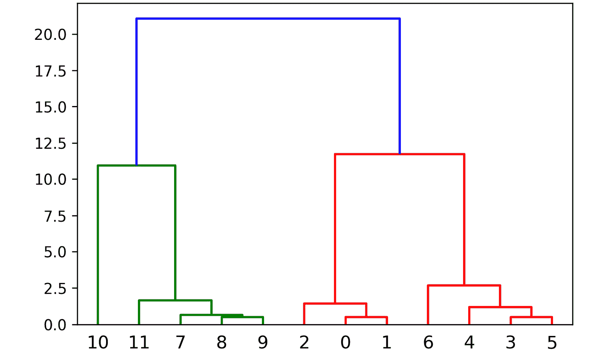

# 第五章：5\. 人工智能：聚类

概述

本章将介绍聚类的基础知识，这是一种无监督学习方法，与前几章中看到的监督学习方法相对。你将实现不同类型的聚类，包括使用 k-means 算法的平面聚类，以及使用均值漂移算法和聚合层次模型的层次聚类。你还将学习如何通过内在和外在方法来评估你的聚类模型的表现。到本章结束时，你将能够使用聚类分析数据，并将这一技能应用于解决各种领域的挑战。

# 引言

在上一章中，你已经了解了决策树及其在分类中的应用。你还在*第二章*《回归介绍》中了解了回归。回归和分类都是监督学习方法的一部分。然而，在本章中，我们将探讨无监督学习方法；我们将处理没有标签（输出）的数据集。机器需要根据我们定义的一组参数来告诉我们标签是什么。在本章中，我们将通过使用聚类算法来执行无监督学习。

我们将使用聚类分析数据，以发现特定的模式并创建群体。除此之外，聚类还可以用于许多其他目的：

+   市场细分帮助识别市场中你应该关注的最佳股票。

+   客户细分通过使用顾客的消费模式来识别顾客群体，以更好地推荐产品。

+   在计算机视觉中，图像分割是通过聚类来执行的。通过这种方式，我们可以在图像中找到不同的物体。

+   聚类也可以与分类相结合，生成多种特征（输入）的紧凑表示，然后可以将其输入分类器。

+   聚类还可以通过检测异常值来筛选数据点。

无论我们是在对基因学、视频、图像还是社交网络应用聚类，如果我们使用聚类分析数据，我们可能会发现数据点之间的相似性，值得将其统一处理。

例如，考虑一个店铺经理，负责确保店铺的盈利。店铺中的产品被划分为不同的类别，而有不同的顾客偏好不同的商品。每个顾客有自己的偏好，但他们之间也有一些相似之处。你可能会有一个顾客对生物产品感兴趣，倾向于选择有机产品，这也正是素食顾客感兴趣的商品。即使他们有所不同，但在偏好或模式上有相似之处，因为他们都倾向于购买有机蔬菜。这可以看作是一个聚类的例子。

在*第三章*，*分类简介*中，你学习了分类，它是监督学习方法的一部分。在分类问题中，我们使用标签来训练模型，以便能够对数据点进行分类。而在聚类中，由于我们没有特征标签，我们需要让模型自己找出这些特征属于哪个簇。这通常基于每个数据点之间的距离。

在本章中，你将学习 k-means 算法，它是最广泛使用的聚类算法，但在此之前，我们需要先定义聚类问题。

# 定义聚类问题

我们将定义聚类问题，以便能够发现数据点之间的相似性。例如，假设我们有一个由多个数据点组成的数据集。聚类帮助我们通过描述这些数据点的分布情况来理解数据的结构。

让我们看一下*图 5.1*中二维空间中数据点的示例：


图 5.1：二维空间中的数据点

现在，看看*图 5.2*。很明显，存在**三个**簇：


图 5.2：使用二维空间中的数据点形成的三个簇

这三个簇很容易识别，因为这些点彼此接近。这里你可以看到，聚类算法能够识别彼此接近的数据点。你可能还注意到，数据点`M`1、`O`1 和 `N`1 并不属于任何一个簇；这些是**离群点**。你构建的聚类算法应该能够妥善处理这些离群点，而不是将它们归入某个簇。

虽然在二维空间中很容易识别簇，但我们通常处理的是多维数据点，即具有多个特征的数据。因此，了解哪些数据点彼此接近非常重要。此外，定义用于检测数据点之间接近程度的距离度量也至关重要。一个著名的距离度量是欧几里得距离，我们在*第一章*，*人工智能简介*中学习过。在数学中，我们通常使用欧几里得距离来测量两个点之间的距离。因此，欧几里得距离是聚类算法中一个直观的选择，使我们能够在定位簇时判断数据点的接近度。

然而，大多数距离度量方法（包括欧几里得距离）存在一个缺点：随着维度的增加，这些距离会变得更加均匀。只有在维度或特征较少时，才容易看到哪些点与其他点最接近。然而，当我们添加更多特征时，相关特征与所有其他数据一起嵌入，并且很难从中区分出真正的相关特征，因为它们像噪声一样影响模型。因此，去除这些噪声特征可能会大大提高我们聚类模型的准确性。

注意

数据集中的噪声可以是无关信息或不需要的随机性。

在接下来的部分，我们将探讨两种不同的聚类方法。

# 聚类方法

聚类有两种类型：

+   **平面聚类**

+   **层次聚类**

在平面聚类中，我们需要指定机器要找到的聚类数目。平面聚类的一个例子是 k-means 算法，其中 *k* 指定我们希望算法使用的聚类数目。

然而，在层次聚类中，机器学习算法本身会自动确定需要的聚类数量。

层次聚类也有两种方法：

+   **凝聚性或自底向上的层次聚类**开始时将每个点视为一个独立的聚类。然后，最接近的聚类会合并在一起。这个过程会一直重复，直到最终得到一个包含所有数据点的单一聚类。

+   **分裂性或自顶向下的层次聚类**开始时将所有数据点视为一个聚类。然后，选择最远的数据点将聚类拆分成更小的聚类。这个过程会一直重复，直到每个数据点都变成自己的聚类。

*图 5.3* 给出了这两种聚类方法的更准确描述。


图 5.3：展示这两种方法的图

现在我们已经熟悉了不同的聚类方法，接下来让我们看看 scikit-learn 支持的不同聚类算法。

## scikit-learn 支持的聚类算法

在本章中，我们将学习 scikit-learn 支持的两种聚类算法：

+   k-means 算法

+   均值漂移算法

**K-means** 是平面聚类的一个示例，其中我们必须事先指定聚类的数量。k-means 是一种通用的聚类算法，当聚类数量不是很高且聚类大小相对均匀时，它表现良好。

**均值漂移**是层次聚类的一种示例，在这种算法中，聚类算法会自动确定聚类的数量。当我们事先不知道聚类数量时，可以使用均值漂移。与 k-means 相比，均值漂移支持那些聚类数量很多且大小差异较大的应用场景。

Scikit-learn 包含许多其他算法，但本章我们将重点关注 k-means 和均值漂移算法。

注意

有关聚类算法的完整描述，包括性能比较，请访问 scikit-learn 的聚类页面：[`scikit-learn.org/stable/modules/clustering.html`](http://scikit-learn.org/stable/modules/clustering.html)。

在下一节中，我们将从 k-means 算法开始。

# K-Means 算法

k-means 算法是一种平面聚类算法，正如前面提到的，它的工作原理如下：

+   设置 *k* 的值。

+   从数据集中选择 *k* 个数据点作为各个聚类的初始中心。

+   计算每个数据点到所选中心点的距离，并将每个点归类到初始中心点最接近的聚类中。

+   一旦所有点都被分配到 *k* 个聚类中，计算每个聚类的中心点。这个中心点不必是数据集中现有的数据点，它只是一个平均值。

+   重复这一过程，将每个数据点分配给与数据点最接近的聚类中心。重复此过程，直到中心点不再移动。

为了确保 k-means 算法能够终止，我们需要以下条件：

+   设定一个最大阈值，算法将在达到此值时终止。

+   移动点的最大重复次数。

由于 k-means 算法的特性，它很难处理大小差异较大的聚类。

k-means 算法有许多应用案例，已经成为我们日常生活的一部分，例如：

+   **市场细分**：公司收集各种关于客户的数据。对客户进行 k-means 聚类分析将揭示具有明确特征的客户群体（聚类）。属于同一细分市场的客户可以看作有着相似的模式或偏好。

+   **内容标签化**：任何内容（视频、书籍、文档、电影或照片）都可以分配标签，以便将相似的内容或主题进行分组。这些标签是聚类的结果。

+   **欺诈和犯罪活动检测**：欺诈者通常会留下与其他客户行为不同的异常线索。例如，在车险行业，正常客户会因事故索赔损坏的汽车，而欺诈者则会索赔故意损坏的车辆。聚类可以帮助检测损坏是否来自真实事故或伪造的事故。

在下一个练习中，我们将实现 scikit-learn 中的 k-means 算法。

## 练习 5.01：在 scikit-learn 中实现 K-Means。

在这个练习中，我们将在二维平面上绘制一个数据集，并使用 k-means 算法对其进行聚类。

以下步骤将帮助你完成这个练习：

1.  打开一个新的 Jupyter Notebook 文件。

1.  现在创建一个作为 NumPy 数组的人工数据集，以演示 k-means 算法。数据点如下代码片段所示：

    ```py
    import numpy as np
    data_points = np.array([[1, 1], [1, 1.5], [2, 2], \
                            [8, 1], [8, 0], [8.5, 1], \
                            [6, 1], [1, 10], [1.5, 10], \
                            [1.5, 9.5], [10, 10], [1.5, 8.5]])
    ```

1.  现在，使用`matplotlib.pyplot`在二维平面上绘制这些数据点，如下代码片段所示：

    ```py
    import matplotlib.pyplot as plot
    plot.scatter(data_points.transpose()[0], \
                 data_points.transpose()[1])
    ```

    预期的输出是这样的：

    

    图 5.4：使用 matplotlib.pyplot 在二维平面上显示数据点的图表

    注意

    我们使用了`transpose`数组方法来获取第一个特征和第二个特征的值。我们也可以使用适当的数组索引来访问这些列：`dataPoints[:,0]`，这等同于`dataPoints.transpose()[0]`。

    现在我们已经有了数据点，是时候对其执行 k-means 算法了。

1.  在 k-means 算法中，将`k`定义为`3`。我们期望图表的左下角、左上角和右下角各有一个聚类。添加`random_state = 8`以便重现相同的结果：

    ```py
    from sklearn.cluster import KMeans
    k_means_model = KMeans(n_clusters=3,random_state=8)
    k_means_model.fit(data_points)
    ```

    在前面的代码片段中，我们使用了`sklearn.cluster`中的`KMeans`模块。像往常一样，在使用`sklearn`时，我们需要先定义一个模型并设置参数，然后将模型应用到数据集上。

    预期的输出是这样的：

    ```py
    KMeans(algorithm='auto', copy_x=True, init='k-means++', 
           max_iter=300, n_clusters=3, n_init=10, n_jobs=None,
           precompute_distances='auto',
           random_state=8, tol=0.0001, verbose=0)
    ```

    输出显示了我们 k-means 模型的所有参数，但重要的参数是：

    `max_iter`：表示 k-means 算法的最大迭代次数。

    `n_clusters`：表示由 k-means 算法形成的聚类数量。

    `n_init`：表示 k-means 算法初始化随机点的次数。

    `tol`：表示检查 k-means 算法是否可以终止的阈值。

1.  聚类完成后，访问每个聚类的中心点，如下代码片段所示：

    ```py
    centers = k_means_model.cluster_centers_
    centers
    ```

    `centers`的输出将如下所示：

    ```py
    array([[7.625     , 0.75      ],
           [3.1       , 9.6       ],
           [1.33333333, 1.5       ]])
    ```

    该输出显示了我们三个聚类中心的坐标。如果你回顾*图 5.4*，你会看到聚类的中心点似乎位于图表的左下角（`1.3, 1.5`）、左上角（`3.1, 9.6`）和右下角（`7.265, 0.75`）。左上角聚类的*x*坐标为`3.1`，很可能是因为它包含了我们位于`[10, 10]`的异常数据点。

1.  接下来，用不同的颜色绘制聚类及其中心点。要找出哪个数据点属于哪个聚类，我们必须查询 k-means 分类器的`labels`属性，如下代码片段所示：

    ```py
    labels = k_means_model.labels_
    labels
    ```

    `labels`的输出将如下所示：

    ```py
    array([2, 2, 2, 0, 0, 0, 0, 1, 1, 1, 1, 1])
    ```

    输出数组显示了每个数据点属于哪个聚类。这就是我们绘制数据所需要的所有信息。

1.  现在，按照以下代码片段绘制数据：

    ```py
    plot.scatter(centers[:,0], centers[:,1])
    for i in range(len(data_points)):
        plot.plot(data_points[i][0], data_points[i][1], \
                  ['k+','kx','k_'][k_means_model.labels_[i]])
    plot.show()
    ```

    在前面的代码片段中，我们使用了`matplotlib`库将数据点与每个坐标的中心一起绘制。每个聚类都有自己的标记（`x`、`+`和`-`），其中心由一个实心圆表示。

    预期的输出是这样的：

    

    图 5.5：显示三个簇的中心点图

    查看*图 5.5*，你可以看到中心点位于它们的簇内，这些簇由`x`、`+`和`-`标记表示。

1.  现在，重新使用相同的代码，只选择两个簇而不是三个：

    ```py
    k_means_model = KMeans(n_clusters=2,random_state=8)
    k_means_model.fit(data_points)
    centers2 = k_means_model.cluster_centers_
    labels2 = k_means_model.labels_
    plot.scatter(centers2[:,0], centers2[:,1])
    for i in range(len(data_points)):
        plot.plot(data_points[i][0], data_points[i][1], \
                  ['k+','kx'][labels2[i]])
    plot.show()
    ```

    期望输出为：

    

    图 5.6：显示两个簇的数据点图

    这一次，我们只有`x`和`+`两种点，并且可以清楚地看到一个底部簇和一个顶部簇。有趣的是，第二次尝试中的顶部簇包含了与第一次尝试中的顶部簇相同的点。第二次尝试中的底部簇由第一次尝试中连接左下角和右下角簇的数据点组成。

1.  最后，使用 k-means 模型进行预测，如以下代码片段所示。输出将是一个包含每个数据点所属簇编号的数组：

    ```py
    predictions = k_means_model.predict([[5,5],[0,10]])
    predictions
    ```

    `predictions`的输出如下：

    ```py
    array([0, 1], dtype=int32)
    ```

    这意味着我们的第一个点属于第一个簇（位于底部），第二个点属于第二个簇（位于顶部）。

    注意

    要访问此特定部分的源代码，请参考[`packt.live/2CpvMDo`](https://packt.live/2CpvMDo)。

    你也可以在[`packt.live/2Nnv7F2`](https://packt.live/2Nnv7F2)上在线运行此示例。你必须执行整个 Notebook 才能获得期望的结果。

完成本练习后，你能够在样本数据点上使用一个简单的 k-means 聚类模型。

## scikit-learn 中的 K-Means 算法参数化

与*第二章*《回归介绍》、*第三章*《分类介绍》和*第四章*《决策树介绍》中的分类和回归模型类似，k-means 算法也可以进行参数化。完整的参数列表可以在[`scikit-learn.org/stable/modules/generated/sklearn.cluster.KMeans.html`](http://scikit-learn.org/stable/modules/generated/sklearn.cluster.KMeans.html)找到。

一些示例如下：

+   `n_clusters`：将数据点分为的簇的数量。默认值为`8`。

+   `max_iter`：最大迭代次数。

+   `tol`：检查是否可以终止 k-means 算法的阈值。

我们还使用了两个属性来检索簇中心点和簇本身：

+   `cluster_centers_`：返回簇中心点的坐标。

+   `labels_`：返回一个整数数组，表示数据点所属的簇编号。编号从零开始。

## 练习 5.02：检索中心点和标签

在本练习中，你将能够理解`cluster_centers_`和`labels_`的用法。

以下步骤将帮助你完成练习：

1.  打开一个新的 Jupyter Notebook 文件。

1.  接下来，创建与*练习 5.01*、*在 scikit-learn 中实现 K-Means*相同的 12 个数据点，但在这里执行四个簇的 k-means 聚类，如下所示的代码片段：

    ```py
    import numpy as np
    import matplotlib.pyplot as plot
    from sklearn.cluster import KMeans
    data_points = np.array([[1, 1], [1, 1.5], [2, 2], \
                            [8, 1], [8, 0], [8.5, 1], \
                            [6, 1], [1, 10], [1.5, 10], \
                            [1.5, 9.5], [10, 10], [1.5, 8.5]])
    k_means_model = KMeans(n_clusters=4,random_state=8)
    k_means_model.fit(data_points)
    centers = k_means_model.cluster_centers_
    centers
    ```

    `centers`的输出如下：

    ```py
    array([[ 7.625     ,  0.75      ],
           [ 1.375     ,  9.5       ],
           [ 1.33333333,  1.5       ],
           [10\.        , 10\.        ]])
    ```

    `cluster_centers_`属性的输出显示了中心点的*x*和*y*坐标。

    从输出结果中，我们可以看到`4`个中心，分别是右下角（`7.6, 0.75`）、左上角（`1.3, 9.5`）、左下角（`1.3, 1.5`）和右上角（`10, 10`）。我们还可以注意到，第四个簇（右上角簇）只有一个数据点。这个数据点可以被认为是一个**异常值**。

1.  现在，在簇上应用`labels_ 属性`：

    ```py
    labels = k_means_model.labels_
    labels
    ```

    `labels`的输出如下：

    ```py
    array([2, 2, 2, 0, 0, 0, 0, 1, 1, 1, 3, 1], dtype=int32)
    ```

    `labels_`属性是一个长度为`12`的数组，显示了每个`12`个数据点所属的簇。第一个簇与数字 0 相关，第二个与 1 相关，第三个与 2 相关，以此类推（请记住，Python 的索引从 0 开始，而不是从 1 开始）。

    注意

    要访问该部分的源代码，请参考[`packt.live/3dmHsDX`](https://packt.live/3dmHsDX)。

    您还可以在[`packt.live/2B0ebld`](https://packt.live/2B0ebld)上在线运行此示例。您必须执行整个 Notebook 以获得期望的结果。

通过完成此练习，您可以获取簇的中心坐标。同时，您也可以看到每个数据点被分配到哪个标签（簇）。

## 销售数据的 K-Means 聚类

在接下来的活动中，我们将查看销售数据，并对这些销售数据执行 k-means 聚类。

## 活动 5.01：使用 K-Means 聚类销售数据

在本活动中，您将处理销售交易数据集（Weekly dataset），该数据集包含了 800 种产品在 1 年内的每周销售数据。我们的数据集不会包含任何有关产品的信息，除了销售数据。

你的目标是使用 k-means 聚类算法识别具有相似销售趋势的产品。你需要尝试不同的簇数，以找到最佳簇数。

注意

数据集可以在[`archive.ics.uci.edu/ml/datasets/Sales_Transactions_Dataset_Weekly`](https://archive.ics.uci.edu/ml/datasets/Sales_Transactions_Dataset_Weekly)找到。

数据集文件也可以在我们的 GitHub 存储库中找到：[`packt.live/3hVH42v`](https://packt.live/3hVH42v)。

引用：*Tan, S., & San Lau, J. (2014). 时间序列聚类：市场篮子分析的优越替代方法。在《第一届国际先进数据与信息工程会议论文集（DaEng-2013）》（第 241-248 页）中*。

以下步骤将帮助您完成此活动：

1.  打开一个新的 Jupyter Notebook 文件。

1.  将数据集加载为 DataFrame，并检查数据。

1.  使用 pandas 的`drop`函数创建一个没有不必要列的新 DataFrame（即数据集中的前`55`列），并使用 pandas 的`inplace`参数。

1.  创建一个包含`8`个集群且`random_state = 8`的 k-means 聚类模型。

1.  从第一个聚类模型中提取标签。

1.  从第一个 DataFrame，`df`，只保留`W`列和标签作为新列。

1.  使用 pandas 中的`groupby`函数进行所需的聚合，以便获取每个集群的年度平均销售额。

预期输出如下：


图 5.7：使用 k-means 算法处理销售交易数据的预期输出

注意

本活动的解决方案见第 363 页。

现在你已经详细了解了 k-means 算法，我们将继续介绍另一种聚类算法，即均值漂移算法。

# 均值漂移算法

均值漂移是一种层次聚类算法，通过计算集群中心并在每次迭代时将其移动到模式位置来分配数据点到某个集群。模式是数据点最多的区域。在第一次迭代中，随机选择一个点作为集群中心，然后算法将计算所有在某个半径范围内的邻近数据点的均值。该均值将成为新的集群中心。第二次迭代将从计算所有邻近数据点的均值并将其设为新集群中心开始。每次迭代时，集群中心将向数据点最多的地方移动。当新集群中心无法包含更多数据点时，算法将停止。当算法停止时，每个数据点将被分配到一个集群。

与 k-means 算法不同，均值漂移算法还会确定所需的集群数量。这一点非常有优势，因为我们通常并不知道需要多少个集群。

这个算法也有许多应用场景。例如，Xbox Kinect 设备使用均值漂移算法来检测人体部位。每个主要部位（头部、手臂、腿部、手等）都是由均值漂移算法分配的数据点集群。

在下一个练习中，我们将实现均值漂移算法。

## 练习 5.03：实现均值漂移算法

在这个练习中，我们将使用均值漂移算法来实现聚类。

我们将使用`scipy.spatial`库来计算欧几里得距离，见于*第一章*，*人工智能导论*。这个库简化了计算坐标列表之间的距离（如欧几里得距离或曼哈顿距离）。更多关于此库的细节可以在[`docs.scipy.org/doc/scipy/reference/spatial.distance.html#module-scipy.spatial.distance`](https://docs.scipy.org/doc/scipy/reference/spatial.distance.html#module-scipy.spatial.distance)找到。

以下步骤将帮助你完成练习：

1.  打开一个新的 Jupyter Notebook 文件。

1.  我们将使用*练习 5.01*中的数据点，*在 scikit-learn 中实现 K 均值算法*：

    ```py
    import numpy as np
    data_points = np.array([[1, 1], [1, 1.5], [2, 2], \
                            [8, 1], [8, 0], [8.5, 1], \
                            [6, 1], [1, 10], [1.5, 10], \
                            [1.5, 9.5], [10, 10], [1.5, 8.5]])
    import matplotlib.pyplot as plot
    plot.scatter(data_points.transpose()[0], \
                 data_points.transpose()[1])
    ```

    我们现在的任务是找到点 P(x, y)，使得从点 P 出发，半径 R 范围内的数据点数量最大化。点的分布如下：

    

    图 5.8：显示数据点的图表，来自 data_points 数组

1.  将点`P1`等同于我们列表中的第一个数据点`[1, 1]`：

    ```py
    P1 = [1, 1]
    ```

1.  找到位于此点`r = 2`距离范围内的点。我们将使用`scipy`库，它简化了数学计算，包括空间距离：

    ```py
    from scipy.spatial import distance
    r = 2
    points1 = np.array([p0 for p0 in data_points if \
                        distance.euclidean(p0, P1) <= r])
    points1
    ```

    在前面的代码片段中，我们使用了欧几里得距离来找到所有位于点`P1`的半径`r`范围内的点。

    `points1`的输出将如下所示：

    ```py
    array([[1\. , 1\. ],
           [1\. , 1.5],
           [2\. , 2\. ]])
    ```

    从输出中，我们可以看到我们找到了三个位于`P1`半径内的点。它们是我们之前在图表左下方看到的三个点，位于本章的*图 5.8*中。

1.  现在，计算数据点的均值，以获得`P2`的新坐标：

    ```py
    P2 = [np.mean( points1.transpose()[0] ), \
          np.mean(points1.transpose()[1] )]
    P2
    ```

    在前面的代码片段中，我们计算了包含三个数据点的数组的均值，以便获得`P2`的新坐标。

    `P2`的输出将如下所示：

    ```py
    [1.3333333333333333, 1.5]
    ```

1.  现在，`P2`已被计算出来，再次检索给定半径内的点，如下所示的代码片段：

    ```py
    points2 = np.array([p0 for p0 in data_points if \
                        distance.euclidean( p0, P2) <= r])
    points2
    ```

    `points`的输出将如下所示：

    ```py
    array([[1\. , 1\. ],
           [1\. , 1.5],
           [2\. , 2\. ]])
    ```

    这些是我们在*步骤 4*中找到的相同的三个点，因此我们可以在此停止。我们已经找到了围绕均值`[1.3333333333333333, 1.5]`的三个点。以该中心为圆心，半径为`2`的点形成了一个簇。

1.  由于数据点`[1, 1.5]`和`[2, 2]`已经与`[1,1]`形成一个簇，我们可以直接继续使用我们列表中的第四个点`[8, 1]`：

    ```py
    P3 = [8, 1]
    points3 = np.array( [p0 for p0 in data_points if \
                         distance.euclidean(p0, P3) <= r])
    points3
    ```

    在前面的代码片段中，我们使用了与*步骤 4*相同的代码，但采用了新的`P3`。

    `points3`的输出将如下所示：

    ```py
    array([[8\. , 1\. ],
           [8\. , 0\. ],
           [8.5, 1\. ],
           [6\. , 1\. ]])
    ```

    这次，我们找到了四个位于`P4`半径`r`内的点。

1.  现在，按照以下代码片段计算均值：

    ```py
    P4 = [np.mean(points3.transpose()[0]), \
          np.mean(points3.transpose()[1])]
    P4
    ```

    在前面的代码片段中，我们计算了包含四个数据点的数组的均值，以便获得`P4`的新坐标，如*步骤 5*所示。

    `P4`的输出将如下所示：

    ```py
    [7.625, 0.75]
    ```

    这个均值不会改变，因为在下一次迭代中，我们会找到相同的数据点。

1.  请注意，我们在选择点`[8, 1]`时比较幸运。如果我们从`P = [8, 0]`或`P = [8.5, 1]`开始，我们只能找到三个点，而不是四个。让我们尝试使用`P5 = [8, 0]`：

    ```py
    P5 = [8, 0]
    points4 = np.array([p0 for p0 in data_points if \
                       distance.euclidean(p0, P5) <= r])
    points4
    ```

    在前面的代码片段中，我们使用了与*步骤 4*相同的代码，但采用了新的`P5`。

    `points4`的输出将如下所示：

    ```py
    array([[8\. , 1\. ],
           [8\. , 0\. ],
           [8.5, 1\. ]])
    ```

    这次，我们找到了三个位于`P5`的半径`r`内的点。

1.  现在，使用*步骤 5*中所示的偏移均值重新运行距离计算：

    ```py
    P6 = [np.mean(points4.transpose()[0]), \
          np.mean(points4.transpose()[1])]
    P6
    ```

    在前面的代码片段中，我们计算了包含三个数据点的数组的均值，以获得新的 `P6` 坐标。

    `P6` 的输出将如下所示：

    ```py
    [8.166666666666666, 0.6666666666666666]
    ```

1.  现在再做一次，但使用 `P7 = [8.5, 1]`：

    ```py
    P7 = [8.5, 1]
    points5 = np.array([p0 for p0 in data_points if \
                        distance.euclidean(p0, P7) <= r])
    points5
    ```

    在前面的代码片段中，我们使用了与 *步骤 4* 中相同的代码，但用了一个新的 `P7`。

    `points5` 的输出将如下所示：

    ```py
    array([[8\. , 1\. ],
           [8\. , 0\. ],
           [8.5, 1\. ]])
    ```

    这一次，我们又在 `P` 的半径 `r` 内找到了相同的三个点。这意味着，从 `[8,1]` 开始，我们得到了一个比从 `[8, 0]` 或 `[8.5, 1]` 开始更大的聚类。因此，我们必须选择包含最多数据点的中心点。

1.  现在，让我们看看如果从第四个数据点 `[6, 1]` 开始会发生什么：

    ```py
    P8 = [6, 1]
    points6 = np.array([p0 for p0 in data_points if \
                        distance.euclidean(p0, P8) <= r])
    points6
    ```

    在前面的代码片段中，我们使用了与 *步骤 4* 中相同的代码，但用了一个新的 `P8`。

    `points6` 的输出将如下所示：

    ```py
    array([[8., 1.],
           [6., 1.]])
    ```

    这次，我们只在 `P8` 的半径 `r` 内找到了两个数据点。我们成功找到了数据点 `[8, 1]`。

1.  现在，将均值从 `[6, 1]` 移动到计算得到的新均值：

    ```py
    P9 = [np.mean(points6.transpose()[0]), \
          np.mean(points6.transpose()[1]) ]
    P9
    ```

    在前面的代码片段中，我们计算了包含三个数据点的数组的均值，以获得新的 `P9` 坐标，正如 *步骤 5* 中所示。

    `P9` 的输出将如下所示：

    ```py
    [7.0, 1.0]
    ```

1.  检查是否通过这个新的 `P9` 得到了更多的点：

    ```py
    points7 = np.array([p0 for p0 in data_points if \
                        distance.euclidean(p0, P9) <= r])
    points7
    ```

    在前面的代码片段中，我们使用了与 *步骤 4* 中相同的代码，但用了一个新的 `P9`。

    `points7` 的输出将如下所示：

    ```py
    array([[8\. , 1\. ],
           [8\. , 0\. ],
           [8.5, 1\. ],
           [6\. , 1\. ]])
    ```

    我们成功找到了所有四个点。因此，我们已经成功定义了一个大小为 `4` 的聚类。均值将与之前相同：`[7.625, 0.75]`。

    注意

    要访问这一特定部分的源代码，请参考 [`packt.live/3drUZtE`](https://packt.live/3drUZtE)。

    你还可以在 [`packt.live/2YoSu78`](https://packt.live/2YoSu78) 在线运行这个示例。你必须执行整个 Notebook 才能得到期望的结果。

这是一个简单的聚类示例，应用了均值迁移算法。我们只是展示了算法在寻找聚类时会考虑什么。

然而，仍然有一个问题，那就是半径的值应该是多少？

请注意，如果没有设置 `2` 的半径，我们可以简单地从一个包含所有数据点的大半径开始，然后逐步减小半径，或者从一个非常小的半径开始，确保每个数据点都在其所属的聚类中，然后逐步增加半径，直到得到期望的结果。

在下一节中，我们将介绍均值迁移算法，但这次使用 scikit-learn。

## scikit-learn 中的均值迁移算法

让我们使用与 k-means 算法相同的数据点：

```py
import numpy as np
data_points = np.array([[1, 1], [1, 1.5], [2, 2], \
                        [8, 1], [8, 0], [8.5, 1], \
                        [6, 1], [1, 10], [1.5, 10], \
                        [1.5, 9.5], [10, 10], [1.5, 8.5]])
```

均值迁移聚类算法的语法与 k-means 聚类算法的语法类似：

```py
from sklearn.cluster import MeanShift
mean_shift_model = MeanShift()
mean_shift_model.fit(data_points)
```

一旦聚类完成，我们就可以访问每个聚类的中心点：

```py
mean_shift_model.cluster_centers_
```

期望的输出是这样的：

```py
array([[ 1.375     ,  9.5       ],
       [ 8.16666667,  0.66666667],
       [ 1.33333333,  1.5       ],
       [10\.        , 10\.        ],
       [ 6\.        ,  1\.        ]])
```

均值迁移模型找到了五个聚类，中心如前面的代码所示。

和 k-means 一样，我们也可以获得标签：

```py
mean_shift_model.labels_
```

预期输出是这样的：

```py
array([2, 2, 2, 1, 1, 1, 4, 0, 0, 0, 3, 0], dtype=int64)
```

输出数组显示哪个数据点属于哪个簇。这是我们绘制数据所需要的全部内容：

```py
import matplotlib.pyplot as plot
plot.scatter(mean_shift_model.cluster_centers_[:,0], \
             mean_shift_model.cluster_centers_[:,1])
for i in range(len(data_points)): 
    plot.plot(data_points[i][0], data_points[i][1], \
              ['k+','kx','kv', 'k_', 'k1']\
              [mean_shift_model.labels_[i]])
plot.show()
```

在之前的代码片段中，我们绘制了数据点和五个簇的中心。属于同一簇的每个数据点将使用相同的标记。簇中心则用点标记。

预期输出是这样的：


图 5.9：显示五个簇的数据点的图形

我们可以看到，三个簇包含多个点（左上、左下和右下）。那两个作为单独簇的数据点可以被视为异常值，正如之前提到的，它们离其他簇太远，因此不属于任何簇。

现在我们已经了解了均值漂移算法，可以来看看层次聚类，尤其是聚合层次聚类（*自下而上*的方法）。

## 层次聚类

层次聚类算法分为两类：

+   聚合（或自下而上）层次聚类

+   分割（或自上而下）层次聚类

本章我们将只讨论聚合层次聚类，因为它是两种方法中最广泛使用且最有效的。

聚合层次聚类（Agglomerative Hierarchical Clustering）最开始将每个数据点视为一个单独的簇，然后依次将最接近的簇按对进行合并（或聚合）。为了找到最接近的数据簇，聚合层次聚类使用欧几里得距离或曼哈顿距离等启发式方法来定义数据点之间的距离。还需要一个聚类函数来聚合簇内数据点之间的距离，从而定义簇之间的接近度的唯一值。

聚类函数的示例包括单一聚类（简单距离）、平均聚类（平均距离）、最大聚类（最大距离）和沃德聚类（平方差）。具有最小聚类值的簇对将被归为一组。此过程将重复进行，直到只剩下一个包含所有数据点的簇。最终，当只剩下一个簇时，该算法终止。

为了直观地表示簇的层次结构，可以使用树状图（dendrogram）。树状图是一棵树，底部的叶子表示数据点。两个叶子之间的每个交点表示这两个叶子的分组。根（顶部）表示一个包含所有数据点的唯一簇。请看*图 5.10*，它展示了一个树状图。



图 5.10：树状图示例

## scikit-learn 中的聚合层次聚类

看一下以下示例，我们使用了与 k-means 算法相同的数据点：

```py
import numpy as np
data_points = np.array([[1, 1], [1, 1.5], [2, 2], \
                        [8, 1], [8, 0], [8.5, 1], \
                        [6, 1], [1, 10], [1.5, 10], \
                        [1.5, 9.5], [10, 10], [1.5, 8.5]])
```

为了绘制树状图，我们需要先导入`scipy`库：

```py
from scipy.cluster.hierarchy import dendrogram
import scipy.cluster.hierarchy as sch
```

然后我们可以使用 SciPy 中的`ward`连接函数绘制一个树状图，因为它是最常用的连接函数：

```py
dendrogram = sch.dendrogram(sch.linkage(data_points, \
                            method='ward'))
```

树状图的输出结果如下所示：


图 5.11：基于随机数据点的树状图

使用树状图时，我们通常可以通过简单地在*图 5.12*中所示的最大垂直距离区域画一条水平线，并计算交点数量，来大致猜测一个合适的聚类数。在这个例子中，应该是两个聚类，但我们将选择下一个较大的区域，因为两个聚类的数量太小了。


图 5.12：树状图中的聚类划分

*y*轴表示聚类的接近度，而*x*轴表示每个数据点的索引。因此，我们的前三个数据点（`0,1,2`）属于同一个聚类，接下来的四个数据点（`3,4,5,6`）组成另一个聚类，数据点`10`独立成一个聚类，剩余的（`7,8,9,11`）则组成最后一个聚类。

层次聚类算法的语法与 k-means 聚类算法类似，不同之处在于我们需要指定`affinity`的类型（在这里我们选择欧几里得距离）和连接方式（在这里我们选择`ward`连接）：

```py
from sklearn.cluster import AgglomerativeClustering
agglomerative_model = AgglomerativeClustering(n_clusters=4, \
                                              affinity='euclidean', \
                                              linkage='ward')
agglomerative_model.fit(data_points)
```

输出结果为：

```py
AgglomerativeClustering(affinity='euclidean', 
                        compute_full_tree='auto',
                        connectivity=None, 
                        distance_threshold=None,
                        linkage='ward', memory=None,
                        n_clusters=4, pooling_func='deprecated')
```

类似于 k-means，我们也可以通过以下代码片段获得标签：

```py
agglomerative_model.labels_
```

预期输出为：

```py
array([2, 2, 2, 0, 0, 0, 0, 1, 1, 1, 3, 1], dtype=int64)
```

输出数组显示了每个数据点所属的聚类。这就是我们绘制数据所需的全部信息：

```py
import matplotlib.pyplot as plot
for i in range(len(data_points)): 
    plot.plot(data_points[i][0], data_points[i][1], \
              ['k+','kx','kv', 'k_'][agglomerative_model.labels_[i]])
plot.show()
```

在前面的代码片段中，我们绘制了数据点和四个聚类中心的图。每个属于同一聚类的数据点将具有相同的标记。

预期输出为：


图 5.13：显示四个聚类数据点的图

我们可以看到，与均值漂移方法的结果相比，层次聚类能够正确地将位于（`6,1`）的数据点与右下角的聚类组合在一起，而不是单独形成一个聚类。在像这样的情况下，当数据量非常少时，层次聚类和均值漂移比 k-means 效果更好。然而，它们的计算时间需求非常高，这使得它们在非常大的数据集上表现不佳。不过，k-means 非常快速，是处理大数据集的更好选择。

现在我们已经了解了一些不同的聚类算法，接下来需要开始评估这些模型并进行比较，以选择最适合聚类的最佳模型。

# 聚类性能评估

与监督学习不同，监督学习中我们始终可以使用标签来评估预测结果，而无监督学习则稍显复杂，因为我们通常没有标签。为了评估聚类模型，可以根据是否有标签数据采取两种方法：

+   第一种方法是外在方法，它需要标签数据的存在。这意味着，如果没有标签数据，必须有人为干预来标记数据，或者至少是其中的一部分。

+   另一种方法是内在方法。一般来说，外在方法试图根据标签数据为聚类分配一个分数，而内在方法则通过检查聚类的分离度和紧凑度来评估聚类。

    注意

    我们将跳过数学解释，因为它们相当复杂。

    您可以在 sklearn 网站上找到更多数学细节，网址为：[`scikit-learn.org/stable/modules/clustering.html#clustering-performance-evaluation`](https://scikit-learn.org/stable/modules/clustering.html#clustering-performance-evaluation )

我们将从外在方法开始（因为它是最广泛使用的方法），并使用 sklearn 在我们的 k 均值示例中定义以下分数：

+   调整后的兰德指数

+   调整后的互信息

+   同质性

+   完整性

+   V-度量

+   Fowlkes-Mallows 分数

+   互信息矩阵

让我们看一个示例，在这个示例中，我们首先需要从`sklearn.cluster`导入`metrics`模块：

```py
from sklearn import metrics
```

我们将重用在*练习 5.01*中使用的代码，*在 scikit-learn 中实现 K 均值算法：*

```py
import numpy as np
import matplotlib.pyplot as plot
from sklearn.cluster import KMeans
data_points = np.array([[1, 1], [1, 1.5], [2, 2], \
                        [8, 1], [8, 0], [8.5, 1], \
                        [6, 1], [1, 10], [1.5, 10], \
                        [1.5, 9.5], [10, 10], [1.5, 8.5]])
k_means_model = KMeans(n_clusters=3,random_state = 8)
k_means_model.fit(data_points)
k_means_model.labels_
```

我们使用`k_means_model.labels_`预测标签的输出是：

```py
array([2, 2, 2, 0, 0, 0, 0, 1, 1, 1, 1, 1])
```

最后，定义该数据集的真实标签，如下代码片段所示：

```py
data_labels = np.array([0, 0, 0, 2, 2, 2, 2, 1, 1, 1, 3, 1])
```

## 调整后的兰德指数

调整后的兰德指数是一个度量聚类预测与标签之间相似性的函数，同时忽略排列顺序。当标签是大而相等的聚类时，调整后的兰德指数表现得很好。

调整后的兰德指数的范围是**[-1.1]**，其中负值是不理想的。负分数意味着我们的模型表现比随机分配标签还要差。如果我们随机分配标签，分数接近 0。但是，越接近 1，说明我们的聚类模型在预测正确标签方面表现越好。

使用`sklearn`，我们可以通过以下代码轻松计算调整后的兰德指数：

```py
metrics.adjusted_rand_score(data_labels, k_means_model.labels_)
```

期望的输出是这样的：

```py
0.8422939068100358
```

在这种情况下，调整后的兰德指数表明我们的 k 均值模型与真实标签之间的差距不大。

## 调整后的互信息

调整后的互信息是一个度量聚类预测与标签之间的熵的函数，同时忽略排列顺序。

调整互信息没有固定的范围，但负值被认为是差的。我们越接近 1，聚类模型预测正确标签的效果就越好。

使用`sklearn`，我们可以通过以下代码轻松计算它：

```py
metrics.adjusted_mutual_info_score(data_labels, \
                                   k_means_model.labels_)
```

预期输出如下：

```py
0.8769185235006342
```

在这种情况下，调整互信息表明我们的 k-means 模型相当优秀，与真实标签的差距不大。

## V-Measure、同质性和完整性

V-Measure 被定义为同质性和完整性的调和均值。调和均值是一种平均值（其他类型的平均值有算术平均和几何平均），它使用倒数（倒数是一个数的倒数。例如，2 的倒数是，3 的倒数是）。

调和均值的公式如下：


](img/B16060_05_14.jpg)

图 5.14：调和均值公式

是值的数量，是每个点的值。

为了计算 V-Measure，我们首先需要定义同质性和完整性。

完美的同质性指的是每个聚类中的数据点都属于相同的标签。该同质性得分将反映我们的每个聚类在将数据从相同标签分组时的效果。

完美的完整性指的是所有属于相同标签的数据点被聚集到同一个聚类中的情况。同质性得分将反映每个标签的所有数据点是否都被很好地分组到同一个聚类中。

因此，V-Measure 的公式如下：


](img/B16060_05_15.jpg)

图 5.15：V-Measure 公式

的默认值为**1**，但可以根据需要进行调整，以进一步强调同质性或完整性。

这三个得分的范围是[**0,1**]，其中**0**表示最差得分，**1**表示完美得分。

使用`sklearn`，我们可以通过以下代码轻松计算这三个得分：

```py
metrics.homogeneity_score(data_labels, k_means_model.labels_)
metrics.completeness_score(data_labels, k_means_model.labels_)
metrics.v_measure_score(data_labels, k_means_model.labels_, \
                        beta=1)
```

`homogeneity_score`的输出如下：

```py
0.8378758055108827
```

在这种情况下，同质性得分表明我们的 k-means 模型中的聚类包含了不同的标签。

`completeness_score`的输出如下：

```py
1.0
```

在这种情况下，完整性得分表明我们的 k-means 模型成功地将每个标签的所有数据点放入同一个聚类中。

`v_measure_score`的输出如下：

```py
0.9117871871412709
```

在这种情况下，V-Measure 表明我们的 k-means 模型虽然不完美，但总体得分良好。

## Fowlkes-Mallows 得分

Fowlkes-Mallows 得分是衡量标签聚类内相似性和聚类预测的一个指标，它定义为精确度和召回率的几何均值（你在*第四章*，*决策树入门*中学到过这个概念）。

Fowlkes-Mallows 分数的公式如下：


图 5.16：Fowlkes-Mallows 公式

我们来分解一下：

+   真阳性（*TP*）：是所有预测与标签簇相同的观测值。

+   假阳性（*FP*）：是所有预测在同一簇中，但与标签簇不同的观测值。

+   假阴性（*FN*）：是所有预测不在同一簇中，但位于同一标签簇中的观测值。

Fowlkes-Mallows 分数的范围是 [**0, 1**]，其中 **0** 是最差的分数，**1** 是完美的分数。

使用 `sklearn`，我们可以通过以下代码轻松计算它：

```py
metrics.fowlkes_mallows_score(data_labels, k_means_model.labels_)
```

期望的输出是：

```py
0.8885233166386386
```

在这种情况下，Fowlkes-Mallows 分数表明我们的 k-means 模型相当不错，并且与真实标签相差不远。

## 聚类矩阵

聚类矩阵不是一个分数，而是报告每个真实/预测簇对的交集基数以及所需的标签数据。它非常类似于在《第四章，决策树简介》中看到的 *混淆矩阵*。该矩阵必须与标签和簇名称一致，因此我们需要小心地将簇命名为与标签相同，而在之前看到的分数中并未做到这一点。

我们将把标签从以下内容修改为：

```py
data_labels = np.array([0, 0, 0, 2, 2, 2, 2, 1, 1, 1, 3, 1])
```

到此：

```py
data_labels = np.array([2, 2, 2, 1, 1, 1, 1, 0, 0, 0, 3, 0])
```

然后，使用 `sklearn`，我们可以通过以下代码轻松计算聚类矩阵：

```py
from sklearn.metrics.cluster import contingency_matrix
contingency_matrix(k_means_model.labels_,data_labels)
```

`contingency_matrix` 的输出如下：

```py
array([[0, 4, 0, 0],
       [4, 0, 0, 1],
       [0, 0, 3, 0]])
```

`contingency_matrix` 输出的第一行表示有 `4` 个数据点的真实簇为第一簇（`0`）。第二行表示有 `4` 个数据点的真实簇为第二簇（`1`）；然而，在这个簇中错误地预测了一个额外的 `1`，但它实际上属于第四簇（`3`）。第三行表示有 `3` 个数据点的真实簇为第三簇（`2`）。

现在我们将看一下内在方法，当我们没有标签时，这种方法是必需的。我们将使用 sklearn 在我们的 k-means 示例中定义以下分数：

+   Silhouette Coefficient（轮廓系数）

+   Calinski-Harabasz 指数

+   Davies-Bouldin 指数

## Silhouette Coefficient（轮廓系数）

Silhouette Coefficient（轮廓系数）是一个内在评价的例子。它衡量数据点与其簇之间的相似度，相对于其他簇的相似度。

它包括两个分数：

+   `a`：数据点与同一簇内所有其他数据点之间的平均距离。

+   `b`：数据点与最近簇内所有数据点之间的平均距离。

轮廓系数公式为：


图 5.17：轮廓系数公式

轮廓系数的范围为[**-1,1**]，其中**-1**表示错误的聚类。接近零的分数表示聚类存在重叠。接近**1**的分数表示所有数据点都分配到了合适的聚类中。

然后，使用`sklearn`，我们可以通过以下代码轻松计算轮廓系数：

```py
metrics.silhouette_score(data_points, k_means_model.labels_)
```

`silhouette_score`的输出如下：

```py
0.6753568188872228
```

在这种情况下，轮廓系数表明我们的 k-means 模型存在一些重叠的聚类，并且可以通过将某些数据点从其中一个聚类中分离出来来进行改进。

## Calinski-Harabasz 指数

Calinski-Harabasz 指数衡量每个聚类内部数据点的分布情况。它被定义为聚类之间方差与每个聚类内部方差的比值。Calinski-Harabasz 指数没有范围，起始值为**0**。分数越高，聚类越密集。密集的聚类表明聚类定义得较好。

使用`sklearn`，我们可以通过以下代码轻松计算它：

```py
metrics.calinski_harabasz_score(data_points, k_means_model.labels_)
```

`calinski_harabasz_score`的输出如下：

```py
19.52509172315154
```

在这种情况下，Calinski-Harabasz 指数表明我们的 k-means 模型聚类比较分散，建议我们可能有重叠的聚类。

## Davies-Bouldin 指数

Davies-Bouldin 指数衡量聚类之间的平均相似性。相似性是聚类与其最近聚类之间的距离与聚类内每个数据点与聚类中心之间的平均距离之比。Davies-Bouldin 指数没有范围，起始值为**0**。分数越接近**0**越好，这意味着聚类之间分离得很好，是聚类效果良好的指示。

使用`sklearn`，我们可以通过以下代码轻松计算 Davies-Bouldin 指数：

```py
metrics.davies_bouldin_score(data_points, k_means_model.labels_)
```

`davies_bouldin_score`的输出如下：

```py
0.404206621415983
```

在这种情况下，Calinski-Harabasz 评分表明我们的 k-means 模型存在一些重叠的聚类，通过更好地分离某些数据点，可以对其中一个聚类进行改进。

## 活动 5.02：使用均值漂移算法和聚合层次聚类对红酒数据进行聚类

在这个活动中，您将使用红酒质量数据集，具体来说是红葡萄酒数据。该数据集包含 1,599 个红酒的质量数据以及它们的化学测试结果。

您的目标是构建两个聚类模型（使用均值漂移算法和聚合层次聚类），以识别相似质量的葡萄酒是否具有相似的物理化学性质。您还需要使用外部和内部方法评估并比较这两个聚类模型。

注意

数据集可以通过以下网址找到：[`archive.ics.uci.edu/ml/datasets/Wine+Quality`](https://archive.ics.uci.edu/ml/datasets/Wine+Quality)。

数据集文件可以在我们的 GitHub 仓库中找到，链接：[`packt.live/2YYsxuu`](https://packt.live/2YYsxuu)。

引用：*P. Cortez, A. Cerdeira, F. Almeida, T. Matos 和 J. Reis. 通过数据挖掘物理化学性质建模葡萄酒偏好。在《决策支持系统》期刊，Elsevier，47(4)：547-553，2009*。

以下步骤将帮助你完成该活动：

1.  打开一个新的 Jupyter Notebook 文件。

1.  将数据集加载为 DataFrame，使用`sep = ";"`，并检查数据。

1.  创建一个均值迁移聚类模型，然后提取该模型的预测标签及其创建的聚类数。

1.  在创建树状图并选择最佳聚类数后，创建一个聚合层次聚类模型。

1.  从第一个聚类模型中提取标签。

1.  为两个模型计算以下外部方法得分：

    调整后的兰德指数

    调整后的互信息

    V 度量

    Fowlkes-Mallows 分数

1.  为两个模型计算以下内部方法得分：

    轮廓系数

    Calinski-Harabasz 指数

    Davies-Bouldin 指数

期望输出为：

均值迁移聚类模型的每个得分值如下：

+   调整后的兰德指数：`0.0006771608724007207`

+   调整后的互信息：`0.004837187596124968`

+   V 度量：`0.021907254751144124`

+   Fowlkes-Mallows 分数：`0.5721233634622408`

+   轮廓系数：`0.32769323700400077`

+   Calinski-Harabasz 指数：`44.62091774102674`

+   Davies-Bouldin 指数：`0.8106334674570222`

聚合层次聚类的每个得分值如下：

+   调整后的兰德指数：`0.05358047852603172`

+   调整后的互信息：`0.05993098663692826`

+   V 度量：`0.07549735446050691`

+   Fowlkes-Mallows 分数：`0.3300681478007641`

+   轮廓系数：`0.1591882574407987`

+   Calinski-Harabasz 指数：`223.5171774491095`

+   Davies-Bouldin 指数：`1.4975443816135114`

    注意

    本活动的解决方案可以在第 368 页找到。

完成此活动后，你已对多个产品的多个列进行了均值迁移和聚合层次聚类。你还学习了如何使用外部和内部方法评估聚类模型。最后，你利用模型的结果及其评估，找到了现实世界问题的答案。

# 总结

在本章中，我们学习了聚类的基础知识。聚类是一种无监督学习形式，其中给定了特征，但没有标签。聚类算法的目标是根据数据点的相似性找到标签。

我们还学到聚类有两种类型，平面聚类和层次聚类，其中第一种类型需要指定聚类的数量，而第二种类型能够自动找到最佳的聚类数量。

k-means 算法是平面聚类的一个例子，而均值漂移和凝聚层次聚类则是层次聚类算法的例子。

我们还学习了评估聚类模型性能的众多评分标准，包括有标签的外部方法和无标签的内部方法。

在*第六章*，*神经网络与深度学习*中，你将接触到一个在过去十年因计算能力的爆炸性增长以及廉价、可扩展的在线服务器容量而变得流行的领域。这个领域是神经网络与深度学习的科学。
