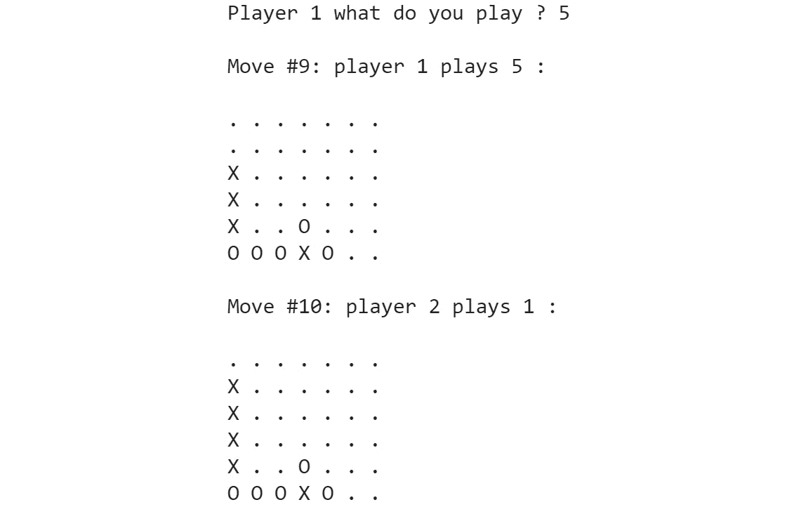
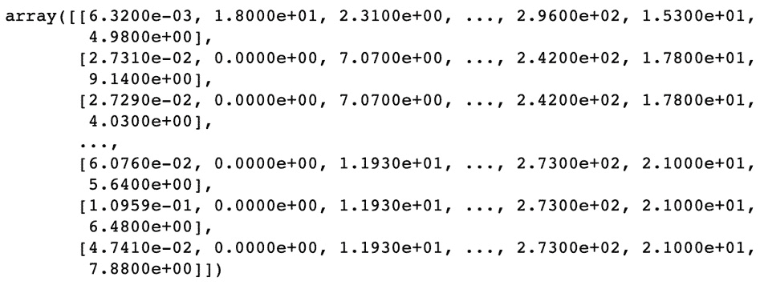
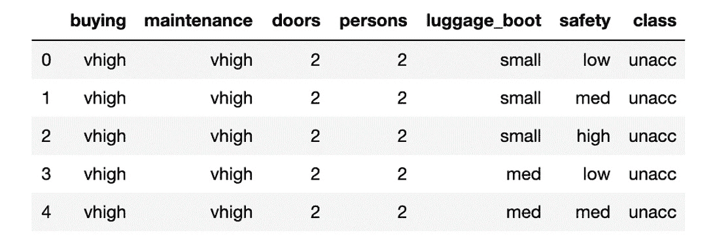
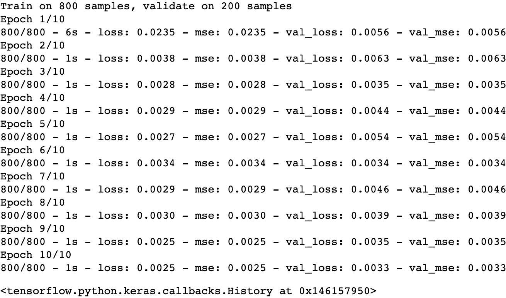

# 附录

# 1\. 人工智能简介

## 活动 1.01：生成井字棋游戏中的所有可能步骤序列

**解决方案**：

以下步骤将帮助你完成此活动：

1.  打开一个新的 Jupyter Notebook 文件。

1.  重用先前步骤*步骤 2–9*中的函数代码，*练习 1.02*，*为井字棋游戏创建具有随机行为的 AI*。

1.  创建一个函数，将`all_moves_from_board_list`函数映射到棋盘列表的每个元素。这样，我们将在每个深度获得决策树的所有节点：

    ```py
    def all_moves_from_board_list(board_list, sign):
        move_list = []
        for board in board_list:
            move_list.extend(all_moves_from_board(board, sign))
        return move_list
    ```

    在前面的代码片段中，我们定义了`all_moves_from_board`函数，它将列举所有棋盘上的可能移动，并将这些动作添加到一个名为`move_list`的列表中。

1.  创建一个名为 board 的变量，包含`EMPTY_SIGN * 9`的决策树，并使用`all_moves_from_board_list`函数对该棋盘和`AI_SIGN`进行调用。将其输出保存到一个名为`all_moves`的变量中，并打印其内容：

    ```py
    board = EMPTY_SIGN * 9
    all_moves = all_moves_from_board(board, AI_SIGN )
    all_moves
    ```

    预期输出如下：

    ```py
    ['X........',
     '.X.......',
     '..X......',
     '...X.....',
     '....X....',
     '.....X...',
     '......X..',
     '.......X.',
     '........X']
    ```

1.  创建一个`filter_wins`函数，将结束的游戏从动作列表中提取，并将它们追加到一个包含 AI 玩家和对手玩家获胜棋盘状态的数组中：

    ```py
    def filter_wins(move_list, ai_wins, opponent_wins):
        for board in move_list:
            won_by = game_won_by(board)
            if won_by == AI_SIGN:
                ai_wins.append(board)
                move_list.remove(board)
            elif won_by == OPPONENT_SIGN:
                opponent_wins.append(board)
                move_list.remove(board)
    ```

    在前面的代码片段中，我们定义了一个`filter_wins`函数，它将每个玩家的获胜状态添加到棋盘的列表中。

1.  使用`count_possibilities`函数，该函数打印并返回决策树叶子节点的数量，分别为平局、第一玩家获胜和第二玩家获胜，如下方代码片段所示：

    ```py
    def count_possibilities():
        board = EMPTY_SIGN * 9
        move_list = [board]
        ai_wins = []
        opponent_wins = []
        for i in range(9):
            print('step ' + str(i) + '. Moves: ' \
                  + str(len(move_list)))
            sign = AI_SIGN if \
                   i % 2 == 0 else OPPONENT_SIGN
            move_list = all_moves_from_board_list\
                        (move_list, sign)
            filter_wins(move_list, ai_wins, \
                        opponent_wins)
        print('First player wins: ' + str(len(ai_wins)))
        print('Second player wins: ' + str(len(opponent_wins)))
        print('Draw', str(len(move_list)))
        print('Total', str(len(ai_wins) \
              + len(opponent_wins) + len(move_list)))
        return len(ai_wins), len(opponent_wins), \
               len(move_list), len(ai_wins) \
               + len(opponent_wins) + len(move_list)
    ```

    我们在每个状态中最多有`9`个步骤。在第 0、2、4、6 和 8 次迭代中，AI 玩家进行移动。在所有其他迭代中，对手进行移动。我们在所有步骤中创建所有可能的动作，并从动作列表中提取完成的游戏。

1.  执行可能性数量以体验组合爆炸，并将结果保存在四个变量中，分别为`first_player`、`second_player`、`draw`和`total`：

    ```py
    first_player, second_player, \
    draw, total = count_possibilities()
    ```

    预期输出如下：

    ```py
    step 0\. Moves: 1
    step 1\. Moves: 9
    step 2\. Moves: 72
    step 3\. Moves: 504
    step 4\. Moves: 3024
    step 5\. Moves: 13680
    step 6\. Moves: 49402
    step 7\. Moves: 111109
    step 8\. Moves: 156775
    First player wins: 106279
    Second player wins: 68644
    Draw 91150
    Total 266073
    ```

如你所见，棋盘状态的树由总共`266073`个叶子节点组成。`count_possibilities`函数本质上实现了一个 BFS 算法，用于遍历游戏的所有可能状态。请注意，我们会多次计算这些状态，因为在*步骤 1*中将`X`放置在右上角与在*步骤 3*中将`X`放置在左上角会导致与从左上角开始再将`X`放置在右上角类似的状态。如果我们实现了重复状态的检测，我们需要检查的节点会更少。然而，在此阶段，由于游戏深度有限，我们将省略此步骤。

然而，决策树与 `count_possibilities` 检查的数据结构是相同的。在决策树中，我们通过探索所有可能的未来步骤来评估每个行动的效用。在我们的示例中，我们可以通过观察固定前几步后的胜负情况来计算初始步骤的效用。

注意

树的根节点是初始状态。树的内部状态是游戏尚未结束并且仍有可能进行移动的状态。树的叶子节点包含一个游戏已结束的状态。

要访问这一特定部分的源代码，请参考 [`packt.live/3doxPog`](https://packt.live/3doxPog)。

你也可以在网上运行此示例，访问 [`packt.live/3dpnuIz`](https://packt.live/3dpnuIz)。

你必须执行整个 Notebook 才能得到期望的结果。

## 活动 1.02：教授代理人认识到它何时防止失败

**解决方案**：

以下步骤将帮助你完成此活动：

1.  打开一个新的 Jupyter Notebook 文件。

1.  重用之前 *步骤 2–6* 中的所有代码，来自 *练习 1.03*，*教授代理人获胜*。

1.  创建一个名为 `player_can_win` 的函数，该函数使用 `all_moves_from_board` 函数获取所有棋盘上的移动，并通过 `next_move` 变量进行迭代。

    在每次迭代中，它检查玩家是否可以获胜。

    ```py
    def player_can_win(board, sign):
        next_moves = all_moves_from_board(board, sign)
        for next_move in next_moves:
            if game_won_by(next_move) == sign:
                return True
        return False
    ```

1.  扩展 AI 移动，使其更倾向于进行安全移动。如果一个移动是安全的，即对手无法在下一步获胜，那么该移动就被视为安全的：

    ```py
    def ai_move(board):
        new_boards = all_moves_from_board(board, AI_SIGN)
        for new_board in new_boards:
            if game_won_by(new_board) == AI_SIGN:
                return new_board
        safe_moves = []
        for new_board in new_boards:
            if not player_can_win(new_board, OPPONENT_SIGN):
                safe_moves.append(new_board)
        return choice(safe_moves) \
        if len(safe_moves) > 0 else new_boards[0]
    ```

    在前面的代码片段中，我们定义了 `ai_move` 函数，该函数通过查看所有可能的列表并选择一个玩家无法在下一步获胜的选项来告诉 AI 如何行动。如果你测试我们的新应用，你会发现 AI 已经做出了正确的决定。

1.  现在，将此逻辑放入状态空间生成器中，并通过生成所有可能的游戏来检查电脑玩家的表现：

    ```py
    def all_moves_from_board(board, sign):
        move_list = []
        for i, v in enumerate(board):
            if v == EMPTY_SIGN:
                new_board = board[:i] + sign + board[i+1:]
                move_list.append(new_board)
                if game_won_by(new_board) == AI_SIGN:
                    return [new_board]
        if sign == AI_SIGN:
            safe_moves = []
            for move in move_list:
                if not player_can_win(move, OPPONENT_SIGN):
                    safe_moves.append(move)
            return safe_moves if len(safe_moves) > 0 else move_list[0:1]
        else:
            return move_list
    ```

    在前面的代码片段中，我们定义了一个生成所有可能移动的函数。一旦我们找到了能够让玩家获胜的下一步，我们就返回一个反制的移动。我们不关心玩家是否有多个获胜选项——我们只返回第一个可能性。如果 AI 无法阻止玩家获胜，我们就返回所有可能的移动。

    让我们看看这在每一步计数所有可能性时意味着什么。

1.  计算所有可能的选项：

    ```py
    first_player, second_player, \
    draw, total = count_possibilities()
    ```

    预期输出是这样的：

    ```py
    step 0\. Moves: 1
    step 1\. Moves: 9
    step 2\. Moves: 72
    step 3\. Moves: 504
    step 4\. Moves: 3024
    step 5\. Moves: 5197
    step 6\. Moves: 18606
    step 7\. Moves: 19592
    step 8\. Moves: 30936
    First player wins: 20843
    Second player wins: 962
    Draw 20243
    Total 42048
    ```

我们现在做得比之前更好了。我们不仅再次去除了几乎 2/3 的可能游戏，而且，大多数时候，AI 玩家要么获胜，要么以平局收场。

注意

要访问这一特定部分的源代码，请参考 [`packt.live/2B0G9xf`](https://packt.live/2B0G9xf)。

你也可以在网上运行此示例，访问 [`packt.live/2V7qLpO`](https://packt.live/2V7qLpO)。

你必须执行整个 Notebook 才能得到期望的结果。

## 活动 1.03：修复 AI 的第一步和第二步，使其无敌

**解决方案**：

以下步骤将帮助你完成此活动：

1.  打开一个新的 Jupyter Notebook 文件。

1.  重用前面的*步骤 2–4*中的代码，*活动 1.02*，*教会代理在防止输局时识别局势*。

1.  现在，计算棋盘上空白格子的数量，并在空白格子有 9 个或 7 个时做出硬编码的移动。你可以尝试不同的硬编码移动。我们发现，占据任意一个角落，然后占据对角的角落，能够保证不输。如果对手占据了对角的角落，那么在中间位置做出移动也不会失败：

    ```py
    def all_moves_from_board(board, sign):
        if sign == AI_SIGN:
            empty_field_count = board.count(EMPTY_SIGN)
            if empty_field_count == 9:
                return [sign + EMPTY_SIGN * 8]
            elif empty_field_count == 7:
                return [board[:8] + sign if board[8] == \
                        EMPTY_SIGN else board[:4] + sign + board[5:]]
        move_list = []
        for i, v in enumerate(board):
            if v == EMPTY_SIGN:
                new_board = board[:i] + sign + board[i+1:]
                move_list.append(new_board)
                if game_won_by(new_board) == AI_SIGN:
                    return [new_board]
        if sign == AI_SIGN:
            safe_moves = []
            for move in move_list:
                if not player_can_win(move, OPPONENT_SIGN):
                    safe_moves.append(move)
            return safe_moves if len(safe_moves) > 0 else move_list[0:1]
        else:
            return move_list
    ```

1.  现在，验证状态空间：

    ```py
    first_player, second_player, draw, total = count_possibilities()
    ```

    预期的输出是这样的：

    ```py
    step 0\. Moves: 1
    step 1\. Moves: 1
    step 2\. Moves: 8
    step 3\. Moves: 8
    step 4\. Moves: 48
    step 5\. Moves: 38
    step 6\. Moves: 108
    step 7\. Moves: 76
    step 8\. Moves: 90
    First player wins: 128
    Second player wins: 0
    Draw 60
    Total 188
    ```

修正前两个步骤后，我们只需要处理 8 种可能，而不是 504 种。我们还引导 AI 进入了一个状态，在这个状态下，硬编码规则足够使它永远不会输掉游戏。修正步骤并不重要，因为我们会给 AI 提供硬编码的步骤，但它很重要，因为它是用来评估和比较每一步的工具。修正前两个步骤后，我们只需要处理 8 种可能，而不是 504 种。我们还引导 AI 进入了一个状态，在这个状态下，硬编码规则足以让它永不输掉游戏。正如你所见，AI 现在几乎是无敌的，它只会获胜或平局。

玩家对抗这个 AI 时，最好的结果是平局。

注意

若要访问此部分的源代码，请参考[`packt.live/2YnUcpA`](https://packt.live/2YnUcpA)。

你也可以在[`packt.live/318TBtq`](https://packt.live/318TBtq)上在线运行此示例。

你必须执行整个 Notebook，以获得预期的结果。

## 活动 1.04：四子棋

**解决方案**：

1.  打开一个新的 Jupyter Notebook 文件。

    我们通过编写`init`方法来设置`TwoPlayersGame`框架。

1.  将棋盘定义为一维列表，就像井字游戏的示例一样。我们也可以使用二维列表，但建模的难度不会有太大变化。除了像井字游戏那样进行初始化外，我们还将进一步操作。我们将生成游戏中所有可能的胜利组合，并将其保存以供以后使用，代码如下所示：

    ```py
    from easyAI import TwoPlayersGame, Human_Player
    class ConnectFour(TwoPlayersGame):
        def __init__(self, players):
            self.players = players
            self.board = [0 for i in range(42)]
            self.nplayer = 1  
            def generate_winning_tuples():
                tuples = []
                # horizontal
                tuples += [list(range(row*7+column, \
                           row*7+column+4, 1)) \
                           for row in range(6) \
                           for column in range(4)]
                # vertical
                tuples += [list(range(row*7+column, \
                           row*7+column+28, 7)) \
                           for row in range(3) \
                           for column in range(7)]
                # diagonal forward
                tuples += [list(range(row*7+column, \
                           row*7+column+32, 8)) \
                           for row in range(3) \
                           for column in range(4)]
                # diagonal backward
                tuples += [list(range(row*7+column, \
                           row*7+column+24, 6)) \
                           for row in range(3) \
                           for column in range(3, 7, 1)]
                return tuples
            self.tuples = generate_winning_tuples()
    ```

1.  接下来，处理`possible_moves`函数，这是一个简单的枚举。请注意，我们在移动名称中使用从`1`到`7`的列索引，因为在玩家界面中，从`1`开始列索引比从零开始更为方便。对于每一列，我们检查是否有空闲格子。如果有空位，我们就将该列设为一个可能的移动：

    ```py
        def possible_moves(self):
            return [column+1 \
                    for column in range(7) \
                    if any([self.board[column+row*7] == 0 \
                            for row in range(6)])
                    ]
    ```

1.  执行一次移动就像`possible_moves`函数一样。我们检查该移动的列，并从底部开始找到第一个空单元格。一旦找到，就占据它。你也可以阅读`make_move`和`unmake_move`两个函数的实现。在`unmake_move`函数中，我们从上到下检查列，并在第一个非空单元格处移除移动。请注意，我们依赖于`easyAI`的内部表示，以确保它不会撤销自己没有做的移动。否则，这个函数会在不检查的情况下删除对方玩家的棋子：

    ```py
        def make_move(self, move):
            column = int(move) - 1
            for row in range(5, -1, -1):
                index = column + row*7
                if self.board[index] == 0:
                    self.board[index] = self.nplayer
                    return
        # optional method (speeds up the AI)
        def unmake_move(self, move):
            column = int(move) - 1
            for row in range(6):
                index = column + row*7
                if self.board[index] != 0:
                    self.board[index] = 0
                    return
    ```

1.  由于我们已经有了必须检查的元组，我们可以大部分复用来自井字游戏示例的`lose`函数：

    ```py
        def lose(self):
            return any([all([(self.board[c] == self.nopponent)
                             for c in line])
                        for line in self.tuples])
        def is_over(self):
            return (self.possible_moves() == []) or self.lose()
    ```

1.  我们的最终任务是实现`show`方法，该方法打印棋盘。我们将重用井字游戏的实现，只需更改`show`和`scoring`变量：

    ```py
        def show(self):
            print('\n'+'\n'.join([
                ' '.join([['.', 'O', 'X']\
                          [self.board[7*row+column]] \
                          for column in range(7)])
                for row in range(6)]))
        def scoring(self):
            return -100 if self.lose() else 0
    if __name__ == "__main__":
        from easyAI import AI_Player, Negamax
        ai_algo = Negamax(6)
        ConnectFour([Human_Player(), \
                     AI_Player(ai_algo)]).play()
    ```

1.  现在所有函数都已完成，你可以尝试示例。随时和对手玩一两局。

    预期输出是这样的：

    

图 1.30：连接四子游戏的预期输出

完成此活动后，你会发现对手并不完美，但它的表现相当不错。如果你有一台强大的计算机，你可以增加`Negamax`算法的参数。我们鼓励你提出更好的启发式方法。

注意

要访问此特定部分的源代码，请参考[`packt.live/3esk2hI`](https://packt.live/3esk2hI)。

你也可以在[`packt.live/3dnkfS5`](https://packt.live/3dnkfS5)上在线运行此示例。

你必须执行整个 Notebook，才能获得期望的结果。

# 2\. 回归介绍

## 活动 2.01：使用 1、2 和 3 度多变量的多项式回归进行波士顿房价预测

**解决方案**：

1.  打开一个 Jupyter Notebook。

1.  导入所需的包并从`sklearn`加载波士顿房价数据到 DataFrame 中：

    ```py
    import numpy as np
    import pandas as pd
    from sklearn import preprocessing
    from sklearn import model_selection
    from sklearn import linear_model
    from sklearn.preprocessing import PolynomialFeatures
    file_url = 'https://raw.githubusercontent.com/'\
               'PacktWorkshops/'\
               'The-Applied-Artificial-Intelligence-Workshop/'\
               'master/Datasets/boston_house_price.csv'
    df = pd.read_csv(file_url)
    ```

    `df`的输出如下：

    

    图 2.28：显示数据集的输出

    在本章前面，你学习了执行线性回归所需的大部分包都来自`sklearn`。我们需要导入`preprocessing`模块来缩放数据，`linear_model`模块来训练线性回归，`PolynomialFeatures`模块来转换多项式回归的输入，以及`model_selection`模块来评估每个模型的性能。

1.  通过将标签和特征转换为 NumPy 数组并缩放特征，准备预测数据集：

    ```py
    features = np.array(df.drop('MEDV', 1))
    label = np.array(df['MEDV'])
    scaled_features = preprocessing.scale(features)
    ```

    `features`的输出如下：

    

    ```py
    array([[-0.41978194,  0.28482986, -1.2879095 , ..., 
            -0.66660821, -1.45900038, -1.0755623 ],
           [-0.41733926, -0.48772236, -0.59338101, ..., 
            -0.98732948, -0.30309415, -0.49243937],
           [-0.41734159, -0.48772236, -0.59338101, ..., 
            -0.98732948, -0.30309415, -1.2087274 ],
           ...,
           [-0.41344658, -0.48772236,  0.11573841, ..., 
            -0.80321172,  1.17646583, -0.98304761],
           [-0.40776407, -0.48772236,  0.11573841, ..., 
            -0.80321172,  1.17646583, -0.86530163],
           [-0.41500016, -0.48772236,  0.11573841, ..., 
            -0.80321172,  1.17646583, -0.66905833]])
    ```

    如你所见，我们的特征已经被正确缩放。

    由于我们没有缺失值，并且不像在*练习 2.03*中那样试图预测未来值（*准备 Quandl 数据进行预测*），我们可以直接将标签（`'MEDV'`）和特征转换为 NumPy 数组。然后，我们可以使用 `preprocessing.scale()` 函数对特征数组进行缩放。

1.  通过将缩放特征转换为适合每个多项式回归的格式，创建三组不同的特征集：

    ```py
    poly_1_scaled_features = PolynomialFeatures(degree=1)\
                             .fit_transform(scaled_features)
    poly_2_scaled_features = PolynomialFeatures(degree=2)\
                             .fit_transform(scaled_features)
    poly_3_scaled_features = PolynomialFeatures(degree=3)\
                             .fit_transform(scaled_features)
    ```

    `poly_1_scaled_features` 的输出如下：

    ```py
    array([[ 1\.        , -0.41978194,  0.28482986, ..., -0.66660821,
            -1.45900038, -1.0755623 ],
           [ 1\.        , -0.41733926, -0.48772236, ..., -0.98732948,
            -0.30309415, -0.49243937],
           [ 1\.        , -0.41734159, -0.48772236, ..., -0.98732948,
            -0.30309415, -1.2087274 ],
           ...,
           [ 1\.        , -0.41344658, -0.48772236, ..., -0.80321172,
             1.17646583, -0.98304761],
           [ 1\.        , -0.40776407, -0.48772236, ..., -0.80321172,
             1.17646583, -0.86530163],
           [ 1\.        , -0.41500016, -0.48772236, ..., -0.80321172,
             1.17646583, -0.66905833]])
    ```

    我们的 `scaled_features` 变量已正确转换，用于度数为 `1` 的多项式回归。

    `poly_2_scaled_features` 的输出如下：

    ![图 2.31：显示 poly_2_scaled_features 输出的图像]

    ](img/B16060_02_31.jpg)

    ```py
    array([[ 1\.        , -0.41978194,  0.28482986, ..., -2.28953024,
            -1.68782164, -1.24424733],
           [ 1\.        , -0.41733926, -0.48772236, ..., -0.04523847,
            -0.07349928, -0.11941484],
           [ 1\.        , -0.41734159, -0.48772236, ..., -0.11104103,
            -0.4428272 , -1.76597723],
           ...,
           [ 1\.        , -0.41344658, -0.48772236, ..., -1.36060852,
             1.13691611, -0.9500001 ],
           [ 1\.        , -0.40776407, -0.48772236, ..., -1.19763962,
             0.88087515, -0.64789192],
           [ 1\.        , -0.41500016, -0.48772236, ..., -0.9260248 ,
             0.52663205, -0.29949664]])
    ```

    我们的 `scaled_features` 变量已正确转换，用于度数为 `3` 的多项式回归。

    我们必须以三种不同的方式转换缩放特征，因为每个多项式回归度数需要不同的输入转换。

1.  将数据分为训练集和测试集，`random state = 8`：

    ```py
    (poly_1_features_train, poly_1_features_test, \
    poly_label_train, poly_label_test) = \
    model_selection.train_test_split(poly_1_scaled_features, \
                                     label, \
                                     test_size=0.1, \
                                     random_state=8)
    (poly_2_features_train, poly_2_features_test, \
    poly_label_train, poly_label_test) = \
    model_selection.train_test_split(poly_2_scaled_features, \
                                     label, \
                                     test_size=0.1, \
                                     random_state=8)
    (poly_3_features_train, poly_3_features_test, \
    poly_label_train, poly_label_test) = \
    model_selection.train_test_split(poly_3_scaled_features, \
                                     label, \
                                     test_size=0.1, \
                                     random_state=8)
    ```

    由于我们有三组不同的缩放转换特征，但相同的标签集，我们必须执行三次不同的拆分。通过在每次拆分中使用相同的标签集和 `random_state`，我们确保每次拆分都获得相同的 `poly_label_train` 和 `poly_label_test`。

1.  执行度数为 1 的多项式回归，并评估模型是否存在过拟合：

    ```py
    model_1 = linear_model.LinearRegression()
    model_1.fit(poly_1_features_train, poly_label_train)
    model_1_score_train = model_1.score(poly_1_features_train, \
                                        poly_label_train)
    model_1_score_test = model_1.score(poly_1_features_test, \
                                       poly_label_test)
    ```

    `model_1_score_train` 的输出如下：

    ```py
    0.7406006443486721
    ```

    `model_1_score_test` 的输出如下：

    ```py
    0.6772229017901507
    ```

    为了估计模型是否过拟合，我们需要比较应用于训练集和测试集的模型得分。如果训练集的得分远高于测试集，则表示过拟合。在此案例中，度数为 1 的多项式回归在训练集上的得分为 `0.74`，而测试集上的得分为 `0.68`。

1.  执行度数为 2 的多项式回归，并评估模型是否存在过拟合：

    ```py
    model_2 = linear_model.LinearRegression()
    model_2.fit(poly_2_features_train, poly_label_train)
    model_2_score_train = model_2.score(poly_2_features_train, \
                                        poly_label_train)
    model_2_score_test = model_2.score(poly_2_features_test, \
                                       poly_label_test)
    ```

    `model_2_score_train` 的输出如下：

    ```py
    0.9251199698832675
    ```

    `model_2_score_test` 的输出如下：

    ```py
    0.8253870684280571
    ```

    就像一次多项式回归度数为 1 的情况，我们的多项式回归度数为 2 时过拟合的情况更加严重，但最终却取得了更好的结果。

1.  执行度数为 3 的多项式回归，并评估模型是否存在过拟合：

    ```py
    model_3 = linear_model.LinearRegression()
    model_3.fit(poly_3_features_train, poly_label_train)
    model_3_score_train = model_3.score(poly_3_features_train, \
                                        poly_label_train)
    model_3_score_test = model_3.score(poly_3_features_test, \
                                       poly_label_test)
    ```

    `model_3_score_train` 的输出如下：

    ```py
    0.9910498071894897
    ```

    `model_3_score_test` 的输出如下：

    ```py
    -8430.781888645262
    ```

    这些结果非常有趣，因为三次多项式回归成功地达到了接近完美的分数`0.99`（1 是最高分）。这给出了一个警告信号，表明我们的模型过度拟合了训练数据。当模型应用于测试集时，我们得到了一个非常低的负分数`-8430`，这进一步确认了过拟合问题。提醒一下，0 分是通过将数据的均值作为预测值得到的。这意味着我们的第三个模型的预测结果比单纯使用均值还要差。

1.  比较 3 个模型在测试集上的预测结果与标签：

    ```py
    model_1_prediction = model_1.predict(poly_1_features_test)
    model_2_prediction = model_2.predict(poly_2_features_test)
    model_3_prediction = model_3.predict(poly_3_features_test)
    df_prediction = pd.DataFrame(poly_label_test)
    df_prediction.rename(columns = {0:'label'}, inplace = True)
    df_prediction['model_1_prediction'] = \
    pd.DataFrame(model_1_prediction)
    df_prediction['model_2_prediction'] = \
    pd.DataFrame(model_2_prediction)
    df_prediction['model_3_prediction'] = \
    pd.DataFrame(model_3_prediction)
    ```

    `df_prediction`的输出如下：

    

图 2.32：显示期望预测值的输出

在对每个模型应用`predict`函数，得到它们各自测试集的预测值之后，我们将它们与标签值一起转换成一个单独的`df_prediction`数据框。增加多项式回归的次数并不意味着模型的表现一定会比低次模型更好。实际上，增加次数会导致模型在训练数据上的过拟合。

注意

要访问此特定部分的源代码，请参考[`packt.live/3eD8gAY`](https://packt.live/3eD8gAY)。

你也可以在[`packt.live/3etadjp`](https://packt.live/3etadjp)上在线运行此示例。

你必须执行整个 Notebook 才能得到期望的结果。

在这个活动中，我们学习了如何对波士顿房价数据集进行 1 到 3 度的多项式回归，并看到增加度数会导致模型过拟合。

# 3\. 分类简介

## 活动 3.01：提高信用评分的准确度

**解决方案**：

1.  打开一个新的 Jupyter Notebook 文件，执行上一个练习*Exercise 3.04*中的所有步骤，*Scikit-Learn 中的 K-最近邻分类*。

1.  从`sklearn`导入`neighbors`：

    ```py
    from sklearn import neighbors
    ```

1.  创建一个名为`fit_knn`的函数，该函数接受以下参数：`k`、`p`、`features_train`、`label_train`、`features_test`和`label_test`。这个函数将使用训练集拟合`KNeighborsClassifier`，并打印训练集和测试集的准确度评分，如下代码片段所示：

    ```py
    def fit_knn(k, p, features_train, label_train, \
                features_test, label_test):
        classifier = neighbors.KNeighborsClassifier(n_neighbors=k, p=p)
        classifier.fit(features_train, label_train)
        return classifier.score(features_train, label_train), \
               classifier.score(features_test, label_test)
    ```

1.  调用`fit_knn()`函数，设置`k=5`和`p=2`，将结果保存到`2`个变量中并打印。这些变量是`acc_train_1`和`acc_test_1`：

    ```py
    acc_train_1, acc_test_1 = fit_knn(5, 2, features_train, \
                                      label_train, \
                                      features_test, label_test)
    acc_train_1, acc_test_1
    ```

    期望的输出是这样的：

    ```py
    (0.78625, 0.75)
    ```

    使用`k=5`和`p=2`时，KNN 取得了接近`0.78`的不错的准确率。但训练集和测试集的分数差异较大，这意味着模型存在过拟合问题。

1.  调用`fit_knn()`函数，设置`k=10`和`p=2`，将结果保存到`2`个变量中并打印。这些变量是`acc_train_2`和`acc_test_2`：

    ```py
    acc_train_2, acc_test_2 = fit_knn(10, 2, features_train, \
                                      label_train, \
                                      features_test, label_test)
    acc_train_2, acc_test_2
    ```

    期望的输出是这样的：

    ```py
    (0.775, 0.785)
    ```

    将邻居数量增加到 10 降低了训练集的准确性，但现在它与测试集的准确性非常接近。

1.  使用`k=15`和`p=2`调用`fit_knn()`函数，将结果保存在`2`个变量中，并打印它们。这些变量是`acc_train_3`和`acc_test_3`：

    ```py
    acc_train_3, acc_test_3 = fit_knn(15, 2, features_train, \
                                      label_train, \
                                      features_test, label_test)
    acc_train_3, acc_test_3
    ```

    预期的输出是这样的：

    ```py
    (0.76625, 0.79)
    ```

    使用`k=15`和`p=2`时，训练集和测试集之间的差异增加了。

1.  使用`k=25`和`p=2`调用`fit_knn()`函数，将结果保存在`2`个变量中，并打印它们。这些变量是`acc_train_4`和`acc_test_4`：

    ```py
    acc_train_4, acc_test_4 = fit_knn(25, 2, features_train, \
                                      label_train, \
                                      features_test, label_test)
    acc_train_4, acc_test_4
    ```

    预期的输出是这样的：

    ```py
    (0.7375, 0.77)
    ```

    将邻居数量增加到`25`对训练集产生了显著影响，但模型仍然存在过拟合。

1.  使用`k=50`和`p=2`调用`fit_knn()`函数，将结果保存在`2`个变量中，并打印它们。这些变量是`acc_train_5`和`acc_test_5`：

    ```py
    acc_train_5, acc_test_5 = fit_knn(50, 2, features_train, \
                                      label_train, \
                                      features_test, label_test)
    acc_train_5, acc_test_5
    ```

    预期的输出是这样的：

    ```py
    (0.70625, 0.775)
    ```

    将邻居数量增加到`50`既没有改善模型性能，也没有解决过拟合问题。

1.  使用`k=5`和`p=1`调用`fit_knn()`函数，将结果保存在`2`个变量中，并打印它们。这些变量是`acc_train_6`和`acc_test_6`：

    ```py
    acc_train_6, acc_test_6 = fit_knn(5, 1, features_train, \
                                      label_train, \
                                      features_test, label_test)
    acc_train_6, acc_test_6
    ```

    预期的输出是这样的：

    ```py
    (0.8, 0.735)
    ```

    更改为曼哈顿距离有助于提高训练集的准确性，但模型仍然存在过拟合。

1.  使用`k=10`和`p=1`调用`fit_knn()`函数，将结果保存在`2`个变量中，并打印它们。这些变量是`acc_train_7`和`acc_test_7`：

    ```py
    acc_train_7, acc_test_7 = fit_knn(10, 1, features_train, \
                                      label_train, \
                                      features_test, label_test)
    acc_train_7, acc_test_7
    ```

    预期的输出是这样的：

    ```py
    (0.77, 0.785)
    ```

    使用`k=10`时，训练集和测试集的准确性相差无几：大约为`0.78`。

1.  使用`k=15`和`p=1`调用`fit_knn()`函数，将结果保存在`2`个变量中，并打印它们。这些变量是`acc_train_8`和`acc_test_8`：

    ```py
    acc_train_8, acc_test_8 = fit_knn(15, 1, features_train, \
                                      label_train, \
                                      features_test, label_test)
    acc_train_8, acc_test_8
    ```

    预期的输出是这样的：

    ```py
    (0.7575, 0.775)
    ```

    将`k`增加到`15`时，模型的准确性有所提高，且过拟合情况不再那么严重。

1.  使用`k=25`和`p=1`调用`fit_knn()`函数，将结果保存在`2`个变量中，并打印它们。这些变量是`acc_train_9`和`acc_test_9`：

    ```py
    acc_train_9, acc_test_9 = fit_knn(25, 1, features_train, \
                                      label_train, \
                                      features_test, label_test)
    acc_train_9, acc_test_9
    ```

    预期的输出是这样的：

    ```py
    (0.745, 0.8)
    ```

    使用`k=25`时，训练集和测试集准确性之间的差异在增加，因此模型存在过拟合。

1.  使用`k=50`和`p=1`调用`fit_knn()`函数，将结果保存在`2`个变量中，并打印它们。这些变量是`acc_train_10`和`acc_test_10`：

    ```py
    acc_train_10, acc_test_10 = fit_knn(50, 1, features_train, \
                                        label_train, \
                                        features_test, label_test)
    acc_train_10, acc_test_10
    ```

    预期的输出是这样的：

    ```py
    (0.70875, 0.78)
    ```

    使用`k=50`时，模型在训练集上的表现显著下降，且模型显然出现了过拟合。

在此活动中，我们尝试了多个`n_neighbors`和`p`的超参数组合。我们发现的最佳组合是`n_neighbors=10`和`p=2`。使用这些超参数，模型几乎没有过拟合，并且在训练集和测试集上都达到了大约`78%`的准确性。

注意

若要访问此特定部分的源代码，请参考[`packt.live/2V5TOtG`](https://packt.live/2V5TOtG)。

你也可以在网上运行这个例子，链接：[`packt.live/2Bx0yd8`](https://packt.live/2Bx0yd8)。

你必须执行整个 Notebook 才能获得期望的结果。

## 活动 3.02：在 scikit-learn 中进行支持向量机优化

**解决方案**：

1.  打开一个新的 Jupyter Notebook 文件并执行之前提到的所有步骤，*练习 3.04*，*scikit-learn 中的 K 最近邻分类*。

1.  从`sklearn`导入`svm`：

    ```py
    from sklearn import svm
    ```

1.  创建一个名为`fit_knn`的函数，接受以下参数：`features_train`、`label_train`、`features_test`、`label_test`、`kernel="linear"`、`C=1`、`degree=3`和`gamma='scale'`。该函数将使用训练集拟合 SVC，并打印训练集和测试集的准确度得分：

    ```py
    def fit_svm(features_train, label_train, \
                features_test, label_test, \
                kernel="linear", C=1, \
                degree=3, gamma='scale'):
        classifier = svm.SVC(kernel=kernel, C=C, \
                             degree=degree, gamma=gamma)
        classifier.fit(features_train, label_train)
        return classifier.score(features_train, label_train), \
               classifier.score(features_test, label_test)
    ```

1.  调用`fit_knn()`函数，使用默认的超参数值，将结果保存在`2`个变量中并打印。这些变量是`acc_train_1`和`acc_test_1`：

    ```py
    acc_train_1, \
    acc_test_1 =  fit_svm(features_train, \
                          label_train, \
                          features_test, \
                          label_test)
    acc_train_1,  acc_test_1
    ```

    期望的输出是这样的：

    ```py
    (0.71625, 0.75)
    ```

    使用默认的超参数值（线性模型），模型在训练集和测试集上的表现差异较大。

1.  调用`fit_knn()`函数，设置`kernel="poly"`、`C=1`、`degree=4`和`gamma=0.05`，将结果保存在`2`个变量中并打印。这些变量是`acc_train_2`和`acc_test_2`：

    ```py
    acc_train_2, \
    acc_test_2 = fit_svm(features_train, label_train, \
                         features_test, label_test, \
                         kernel="poly",  C=1, \
                         degree=4, gamma=0.05)
    acc_train_2,  acc_test_2
    ```

    期望的输出是这样的：

    ```py
    (0.68875, 0.745)
    ```

    使用四次多项式时，模型在训练集上的表现不佳。

1.  调用`fit_knn()`函数，设置`kernel="poly"`、`C=2`、`degree=4`和`gamma=0.05`，将结果保存在`2`个变量中并打印。这些变量是`acc_train_3`和`acc_test_3`：

    ```py
    acc_train_3, \
    acc_test_3 = fit_svm(features_train, \
                         label_train, features_test, \
                         label_test, kernel="poly",  \
                         C=2, degree=4, gamma=0.05)
    acc_train_3,  acc_test_3
    ```

    期望的输出是这样的：

    ```py
    (0.68875, 0.745)
    ```

    增加正则化参数`C`对模型的表现没有任何影响。

1.  调用`fit_knn()`函数，设置`kernel="poly"`、`C=1`、`degree=4`和`gamma=0.25`，将结果保存在`2`个变量中并打印。这些变量是`acc_train_4`和`acc_test_4`：

    ```py
    acc_train_4, \
    acc_test_4 = fit_svm(features_train, \
                         label_train, features_test, \
                         label_test, kernel="poly",  \
                         C=1, degree=4, gamma=0.25)
    acc_train_4,  acc_test_4
    ```

    期望的输出是这样的：

    ```py
    (0.84625, 0.775)
    ```

    将 gamma 值增加到`0.25`显著提高了模型在训练集上的表现。然而，测试集的准确度较低，因此模型存在过拟合现象。

1.  调用`fit_knn()`函数，设置`kernel="poly"`、`C=1`、`degree=4`和`gamma=0.5`，将结果保存在`2`个变量中并打印。这些变量是`acc_train_5`和`acc_test_5`：

    ```py
    acc_train_5, \
    acc_test_5 = fit_svm(features_train, \
                         label_train, features_test, \
                         label_test, kernel="poly",  \
                         C=1, degree=4, gamma=0.5)
    acc_train_5,  acc_test_5
    ```

    期望的输出是这样的：

    ```py
    (0.9575, 0.73)
    ```

    将 gamma 值增加到`0.5`极大地改善了模型在训练集上的表现，但它明显出现了过拟合，因为测试集上的准确度得分明显降低。

1.  调用`fit_knn()`函数，设置`kernel="poly"`、`C=1`、`degree=4`和`gamma=0.16`，将结果保存在`2`个变量中并打印。这些变量是`acc_train_6`和`acc_test_6`：

    ```py
    acc_train_6, \
    acc_test_6 = fit_svm(features_train, label_train, \
                         features_test, label_test, \
                         kernel="poly",  C=1, \
                         degree=4, gamma=0.16)
    acc_train_6,  acc_test_6
    ```

    期望的输出是这样的：

    ```py
    (0.76375, 0.785)
    ```

    使用`gamma=0.16`时，模型的准确度得分比最佳的 KNN 模型更高。训练集和测试集的得分都接近`0.77`。

1.  调用`fit_knn()`函数，使用`kernel="sigmoid"`，将结果保存在`2`个变量中并打印出来。这些变量是`acc_train_7`和`acc_test_7`：

    ```py
    acc_train_7, \
    acc_test_7 = fit_svm(features_train, label_train, \
                         features_test, label_test, \
                         kernel="sigmoid")
    acc_train_7,  acc_test_7
    ```

    预期输出如下：

    ```py
    (0.635, 0.66)
    ```

    Sigmoid 核的准确率得分较低。

1.  调用`fit_knn()`函数，使用`kernel="rbf"`和`gamma=0.15`，将结果保存在`2`个变量中并打印出来。这些变量是`acc_train_8`和`acc_test_8`：

    ```py
    acc_train_8, \
    acc_test_8 = fit_svm(features_train, \
                         label_train, features_test, \
                         label_test, kernel="rbf", \
                         gamma=0.15)
    acc_train_8,  acc_test_8
    ```

    预期输出如下：

    ```py
    (0.7175, 0.765)
    ```

    `rbf`核在`gamma=0.15`时获得了较好的分数。尽管如此，模型仍然有些过拟合。

1.  调用`fit_knn()`函数，使用`kernel="rbf"`和`gamma=0.25`，将结果保存在`2`个变量中并打印出来。这些变量是`acc_train_9`和`acc_test_9`：

    ```py
    acc_train_9, \
    acc_test_9 = fit_svm(features_train, \
                         label_train, features_test, \
                         label_test, kernel="rbf", \
                         gamma=0.25)
    acc_train_9,  acc_test_9
    ```

    预期输出如下：

    ```py
    (0.74, 0.765)
    ```

    模型性能在`gamma=0.25`时有所提升，但仍然存在过拟合。

1.  调用`fit_knn()`函数，使用`kernel="rbf"`和`gamma=0.35`，将结果保存在`2`个变量中并打印出来。这些变量是`acc_train_10`和`acc_test_10`：

    ```py
    acc_train_10, \
    acc_test_10 = fit_svm(features_train, label_train, \
                          features_test, label_test, \
                          kernel="rbf", gamma=0.35)
    acc_train_10, acc_test_10
    ```

    预期输出如下：

    ```py
    (0.78125, 0.775)
    ```

使用`rbf`核和`gamma=0.35`时，我们在训练集和测试集上获得了非常相似的结果，模型的性能高于我们在前一个活动中训练的最佳 KNN 模型。这是我们在德国信用数据集上的最佳模型。

注意

若要访问此特定部分的源代码，请参考[`packt.live/3fPZlMQ`](https://packt.live/3fPZlMQ)。

你也可以在[`packt.live/3hVlEm3`](https://packt.live/3hVlEm3)在线运行此示例。

必须执行整个 Notebook 才能得到期望的结果。

在本次活动中，我们尝试了 SVM 分类器的不同主超参数值：`kernel`、`gamma`、`C`和`degrees`。我们观察了这些超参数如何影响模型的表现以及它们过拟合的趋势。经过反复试验，我们最终找到了最佳的超参数组合，并获得了接近 0.78 的准确率。这个过程被称为**超参数调优**，是任何数据科学项目的重要步骤。

# 4\. 决策树简介

## 活动 4.01：汽车数据分类

**解决方案**：

1.  打开一个新的 Jupyter Notebook 文件。

1.  导入`pandas`包并命名为`pd`：

    ```py
    import pandas as pd
    ```

1.  创建一个名为`file_url`的新变量，该变量将包含原始数据集的 URL：

    ```py
    file_url = 'https://raw.githubusercontent.com/'\
               'PacktWorkshops/'\
               'The-Applied-Artificial-Intelligence-Workshop/'\
               'master/Datasets/car.csv'
    ```

1.  使用`pd.read_csv()`方法加载数据：

    ```py
    df = pd.read_csv(file_url) 
    ```

1.  打印`df`的前五行：

    ```py
    df.head()
    ```

    输出结果如下：

    

    图 4.13：数据集的前五行

1.  导入`preprocessing`模块，来自`sklearn`：

    ```py
    from sklearn import preprocessing
    ```

1.  创建一个名为`encode()`的函数，该函数接受一个 DataFrame 和列名作为参数。该函数将实例化`LabelEncoder()`，用列的唯一值进行拟合，并转化其数据。它将返回转换后的列：

    ```py
    def encode(data_frame, column):
        label_encoder = preprocessing.LabelEncoder()
        label_encoder.fit(data_frame[column].unique())
        return label_encoder.transform(data_frame[column])
    ```

1.  创建一个`for`循环，该循环将遍历`df`的每一列，并使用`encode()`函数对它们进行编码：

    ```py
    for column in df.columns:
        df[column] = encode(df, column)
    ```

1.  现在，打印`df`的前五行：

    ```py
    df.head()
    ```

    输出结果如下：

    

    ](img/B16060_04_14.jpg)

    图 4.14：数据集的前五行已更新

1.  使用`.pop()`从 pandas 中提取类别列，并将其保存到名为`label`的变量中：

    ```py
    label = df.pop('class')
    ```

1.  从`sklearn`导入`model_selection`：

    ```py
    from sklearn import model_selection
    ```

1.  使用`test_size=0.1`和`random_state=88`将数据集划分为训练集和测试集：

    ```py
    features_train, features_test, label_train, label_test = \
    model_selection.train_test_split(df, label, \
                                     test_size=0.1, \
                                     random_state=88)
    ```

1.  从`sklearn`导入`DecisionTreeClassifier`：

    ```py
    from sklearn.tree import DecisionTreeClassifier
    ```

1.  实例化`DecisionTreeClassifier()`并将其保存到名为`decision_tree`的变量中：

    ```py
    decision_tree = DecisionTreeClassifier()
    ```

1.  使用训练集拟合决策树：

    ```py
    decision_tree.fit(features_train, label_train)
    ```

    输出结果如下：

    

    ](img/B16060_04_15.jpg)

    图 4.15：决策树在训练集上的拟合

1.  打印决策树在测试集上的得分：

    ```py
    decision_tree.score( features_test, label_test )
    ```

    输出结果如下：

    ```py
    0.953757225433526
    ```

    决策树在我们第一次尝试时的准确率为`0.95`，这非常值得注意。

1.  从`sklearn.metrics`导入`classification_report`：

    ```py
    from sklearn.metrics import classification_report
    ```

1.  打印测试标签和预测的分类报告：

    ```py
    print(classification_report(label_test, \
          decision_tree.predict(features_test)))
    ```

    输出结果如下：

    

    ](img/B16060_04_16.jpg)

图 4.16：展示预期的分类报告的输出

从这个分类报告中，我们可以看到模型在四个类别的精确度得分上表现得相当好。至于召回率，我们可以看到它在最后一个类别上的表现较差。

注意

若要访问此部分的源代码，请参阅[`packt.live/3hQDLtr`](https://packt.live/3hQDLtr)。

你也可以在线运行此示例，[`packt.live/2NkEEML`](https://packt.live/2NkEEML)。

你必须执行整个 Notebook 才能获得预期的结果。

完成此活动后，你已准备好汽车数据集并训练了决策树模型。你已学会如何获取其准确率和分类报告，从而分析其精确度和召回率得分。

## 活动 4.02：为你的租车公司进行随机森林分类

**解决方案**：

1.  打开一个 Jupyter Notebook。

1.  重用*活动 1*中*步骤 1 - 4*的代码，*汽车数据分类*。

1.  从`sklearn.ensemble`导入`RandomForestClassifier`：

    ```py
    from sklearn.ensemble import RandomForestClassifier
    ```

1.  实例化一个随机森林分类器，设置`n_estimators=100`，`max_depth=6`，并设置`random_state=168`。将其保存到一个名为`random_forest_classifier`的变量中：

    ```py
    random_forest_classifier = \
    RandomForestClassifier(n_estimators=100, \
                           max_depth=6, random_state=168)
    ```

1.  用训练集拟合随机森林分类器：

    ```py
    random_forest_classifier.fit(features_train, label_train)
    ```

    输出结果如下：

    

    ](img/B16060_04_17.jpg)

    图 4.17：展示随机森林分类器及其超参数值的日志

    这些是`RandomForest`分类器及其超参数值的日志。

1.  使用随机森林分类器对测试集进行预测，并将其保存到名为`rf_preds_test`的变量中。打印其内容：

    ```py
    rf_preds_test = random_forest_classifier.fit(features_train, \
                                                 label_train)
    rf_preds_test
    ```

    输出结果如下：

    

    ](img/B16060_04_18.jpg)

    图 4.18：显示测试集预测的输出

1.  从`sklearn.metrics`导入`classification_report`：

    ```py
    from sklearn.metrics import classification_report
    ```

1.  打印带有标签和测试集预测的分类报告：

    ```py
    print(classification_report(label_test, rf_preds_test))
    ```

    输出如下：

    

    图 4.19：显示带有标签和测试集预测的分类报告的输出

    前述报告中的 F1 得分告诉我们，随机森林在类`2`上的表现良好，但在类`0`和`3`上表现不佳。模型无法准确预测类`1`，但测试集中只有 9 个观测值。准确率为`0.84`，而 F1 得分为`0.82`。

1.  从`sklearn.metrics`导入`confusion_matrix`：

    ```py
    from sklearn.metrics import confusion_matrix
    ```

1.  显示测试集的真实标签和预测标签的混淆矩阵：

    ```py
    confusion_matrix(label_test, rf_preds_test)
    ```

    输出如下：

    ```py
    array([[ 32, 0, 10, 0], 
          [ 8, 0, 0, 1], 
          [ 5, 0, 109, 0], 
          [ 3, 0, 0, 5]])
    ```

    从这个混淆矩阵中，我们可以看出，`RandomForest`模型在准确预测第一类时遇到困难。它错误地预测了 16 个案例（8 + 5 + 3）为这一类。

1.  使用`.feature_importance_`打印测试集的特征重要性得分，并将结果保存在名为`rf_varimp`的变量中。打印其内容：

    ```py
    rf_varimp = random_forest_classifier.feature_importances_
    rf_varimp
    ```

    输出如下：

    ```py
    array([0.12676384, 0.10366314, 0.02119621, 0.35266673, 
           0.05915769, 0.33655239])
    ```

    前述输出显示最重要的特征是第四个和第六个，分别对应`persons`和`safety`。

1.  从`sklearn.ensemble`导入`ExtraTreesClassifier`：

    ```py
    from sklearn.ensemble import ExtraTreesClassifier
    ```

1.  实例化`ExtraTreesClassifier`，设置`n_estimators=100`、`max_depth=6`、`random_state=168`，并将其保存在名为`random_forest_classifier`的变量中：

    ```py
    extra_trees_classifier = \
    ExtraTreesClassifier(n_estimators=100, \
                         max_depth=6, random_state=168)
    ```

1.  使用训练集拟合`extratrees`分类器：

    ```py
    extra_trees_classifier.fit(features_train, label_train)
    ```

    输出如下：

    

    图 4.20：使用训练集的 extratrees 分类器的输出

    这些是`extratrees`分类器及其超参数值的日志。

1.  使用`extratrees`分类器对测试集进行预测，并将结果保存在名为`et_preds_test`的变量中。打印其内容：

    ```py
    et_preds_test = extra_trees_classifier.predict(features_test)
    et_preds_test
    ```

    输出如下：

    

    图 4.21：使用 extratrees 对测试集进行预测

1.  打印带有标签和测试集预测的分类报告：

    ```py
    print(classification_report(label_test, \
          extra_trees_classifier.predict(features_test)))
    ```

    输出如下：

    

    图 4.22：带有标签和测试集预测的分类报告

    前面报告中的 F1 得分显示，随机森林在类别`2`上的表现良好，但在类别`0`上的表现较差。模型无法准确预测类别`1`和`3`，但测试集中只有分别为`9`和`8`的观测值。准确率为`0.82`，F1 得分为`0.78`。因此，我们的`RandomForest`分类器在`extratrees`上表现得更好。

1.  显示测试集的真实标签与预测标签的混淆矩阵：

    ```py
    confusion_matrix(label_test, et_preds_test)
    ```

    输出将如下所示：

    ```py
    array([[ 28,   0,  14,   0],
           [  9,   0,   0,   0],
           [  2,   0, 112,   0],
           [  7,   0,   0,   1]])
    ```

    从这个混淆矩阵中，我们可以看出，`extratrees`模型在准确预测第一和第三类别时遇到了困难。

1.  使用`.feature_importance_`打印测试集上的特征重要性分数，并将结果保存在一个名为`et_varimp`的变量中。打印其内容：

    ```py
    et_varimp = extra_trees_classifier.feature_importances_
    et_varimp
    ```

    输出将如下所示：

    ```py
    array([0.08844544, 0.0702334 , 0.01440408, 0.37662014, 0.05965896,
           0.39063797])
    ```

前面的输出向我们展示了最重要的特征是第六个和第四个特征，分别对应`safety`和`persons`。有趣的是，`RandomForest`也有相同的两个最重要特征，但顺序不同。

注意

要访问此特定部分的源代码，请参考[`packt.live/2YoUY5t`](https://packt.live/2YoUY5t)。

你也可以在[`packt.live/3eswBcW`](https://packt.live/3eswBcW)上在线运行这个示例。

必须执行整个 Notebook 才能获得所需的结果。

# 5. 人工智能：聚类

## 活动 5.01：使用 K-Means 聚类销售数据

**解决方案**：

1.  打开一个新的 Jupyter Notebook 文件。

1.  将数据集加载为 DataFrame 并检查数据：

    ```py
    import pandas as pd
    file_url = 'https://raw.githubusercontent.com/'\
               'PacktWorkshops/'\
               'The-Applied-Artificial-Intelligence-Workshop/'\
               'master/Datasets/'\
               'Sales_Transactions_Dataset_Weekly.csv'
    df = pd.read_csv(file_url)
    df
    ```

    `df`的输出如下所示：

    

    ](img/B16060_05_18.jpg)

    图 5.18：显示数据集内容的输出

    如果你查看输出，你会注意到我们的数据集包含`811`行，每一行代表一个产品。它还包含`107`列，第一列是产品代码，然后是`52`列以`W`开头，表示每周的销售数量，最后是`52`列的归一化版本，以`Normalized`开头。归一化列比绝对销售列`W`更适合用于 k-means 算法，它将帮助我们的算法更快地找到每个聚类的中心。由于我们将处理归一化列，因此可以删除每个`W`列和`Product_Code`列。我们还可以删除`MIN`和`MAX`列，因为它们对我们的聚类没有任何帮助。还要注意，周数从`0`到`51`而不是从`1`到`52`。

1.  接下来，创建一个没有不必要列的新 DataFrame，如以下代码片段所示（数据集的前`55`列）。你应该使用`inplace`参数来帮助你：

    ```py
    df2 = df.drop(df.iloc[:, 0:55], inplace = False, axis = 1)
    ```

    `df2`的输出如下所示：

    

    ](img/B16060_05_19.jpg)

    ```py
    drop function of the pandas DataFrame in order to remove the first 55 columns. We also set the inplace parameter to False in order to not remove the column of our original df DataFrame. As a result, we should only have the normalized columns from 0 to 51 in df2 and df should still be unchanged.
    ```

1.  创建一个具有`8`个聚类和`random state = 8`的 k-means 聚类模型：

    ```py
    from sklearn.cluster import KMeans
    k_means_model = KMeans(n_clusters=8, random_state=8)
    k_means_model.fit(df2)
    ```

    我们构建了一个 k-means 模型，除了`n_clusters=8`和`random_state=8`之外，其他参数都使用默认值，以获得`8`个聚类并实现可重复的结果。

1.  从聚类算法中提取标签：

    ```py
    labels = k_means_model.labels_
    labels
    ```

    `labels`的输出将如下所示：

    

    图 5.20：标签输出数组

    从这个输出中很难看出任何意义，但`labels`的每个索引代表基于相似的周销售趋势，产品被分配到的聚类。现在，我们可以使用这些聚类标签将产品聚集在一起。

1.  现在，从第一个 DataFrame `df`中，仅保留`W`列，并将标签作为新列添加，如以下代码片段所示：

    ```py
    df.drop(df.iloc[:, 53:], inplace = True, axis = 1)
    df.drop('Product_Code', inplace = True, axis = 1)
    df['label'] = labels
    df
    ```

    在前面的代码片段中，我们删除了所有不需要的列，并将`labels`作为新列添加到了 DataFrame 中。

    `df`的输出将如下所示：

    

    图 5.21：包含新标签作为新列的更新 DataFrame

    现在我们已经有了标签，可以对`label`列进行聚合，计算每个聚类的年销售平均值。

1.  执行聚合（使用 pandas 中的`groupby`函数），以便获得每个聚类的年销售平均值，如以下代码片段所示：

    ```py
    df_agg = df.groupby('label').sum()
    df_final = df[['label','W0']].groupby('label').count()
    df_final=df_final.rename(columns = {'W0':'count_product'})
    df_final['total_sales'] = df_agg.sum(axis = 1)
    df_final['yearly_average_sales']= \
    df_final['total_sales'] / df_final['count_product']
    df_final.sort_values(by='yearly_average_sales', \
                         ascending=False, inplace = True)
    df_final
    ```

    在前面的代码片段中，我们首先使用`groupby`函数和 DataFrame 的`sum()`方法，计算每个`W`列和聚类的每个产品的销售总和，并将结果存储在`df_agg`中。然后，我们在`df`的单个列（任意选择）上使用`groupby`函数和`count()`方法，计算每个聚类的产品总数（注意我们还必须在聚合后重命名`W0`列）。接下来的步骤是对`df_agg`中的所有销售列求和，以获得每个聚类的总销售额。最后，我们通过将`total_sales`除以`count_product`计算每个聚类的`yearly_average_sales`。我们还加入了最后一步，通过`yearly_average_sales`对聚类进行排序。

    `df_final`的输出将如下所示：

    

图 5.22：销售交易数据集的预期输出

现在，通过这个输出，我们可以看到我们的 k-means 模型成功地将表现相似的产品聚集在一起。我们可以清楚地看到，`3`号聚类中的`115`个产品是最畅销的产品，而`1`号聚类中的`123`个产品表现非常差。这对于任何企业都是非常有价值的，因为它帮助企业自动识别并将表现相似的产品聚集在一起，而不受产品名称或描述的偏见影响。

注：

若要访问此特定部分的源代码，请参阅[`packt.live/3fVpSbT`](https://packt.live/3fVpSbT)。

你还可以在网上运行此示例：[`packt.live/3hW24Gk`](https://packt.live/3hW24Gk)。

你必须执行整个 Notebook 才能获得期望的结果。

完成这个活动后，你已经学会了如何对多个列进行 k-means 聚类，适用于多个产品。你还学会了聚类在没有标签数据的情况下对企业有多么有用。

## 活动 5.02: 使用均值迁移算法和凝聚层次聚类对红酒数据进行聚类

**解决方案**：

1.  打开一个新的 Jupyter Notebook 文件。

1.  使用`sep = ";"`加载数据集为 DataFrame，并检查数据：

    ```py
    import pandas as pd
    import numpy as np
    from sklearn import preprocessing
    from sklearn.cluster import MeanShift
    from sklearn.cluster import AgglomerativeClustering
    from scipy.cluster.hierarchy import dendrogram
    import scipy.cluster.hierarchy as sch
    from sklearn import metrics
    file_url = 'https://raw.githubusercontent.com/'\
               'PacktWorkshops/'\
               'The-Applied-Artificial-Intelligence-Workshop/'\
               'master/Datasets/winequality-red.csv'
    df = pd.read_csv(file_url,sep=';')
    df
    ```

    `df`的输出如下：

    

    图 5.23: df 显示数据集作为输出

    注意

    前面截图中的输出被截断了。

    我们的数据集包含`1599`行，每一行代表一瓶红酒。它还包含`12`列，最后一列是葡萄酒的质量。我们可以看到其余的 11 列将是我们的特征，我们需要对它们进行缩放，以帮助提高我们模型的准确性和速度。

1.  从初始的 DataFrame `df` 创建 `features`、`label` 和 `scaled_features` 变量：

    ```py
    features = df.drop('quality', 1)
    label = df['quality']
    scaled_features = preprocessing.scale(features)
    ```

    在前面的代码片段中，我们将标签（`quality`）与特征分开。然后，我们使用来自`sklearn`的`preprocessing.scale`函数对特征进行缩放，因为这将提高我们的模型性能。

1.  接下来，创建一个均值迁移聚类模型，然后获取该模型预测的标签和创建的聚类数量：

    ```py
    mean_shift_model = MeanShift()
    mean_shift_model.fit(scaled_features)
    n_cluster_mean_shift = len(mean_shift_model.cluster_centers_)
    label_mean_shift = mean_shift_model.labels_
    n_cluster_mean_shift
    ```

    `n_cluster_mean_shift`的输出如下：

    ```py
    10
    ```

    我们的均值迁移模型已经创建了`10`个聚类，这已经超过了我们在`quality`标签中所拥有的组数。这可能会影响我们的外部评分，并可能是一个早期的指标，表明具有相似物理化学性质的葡萄酒不应该属于同一质量组。

    `label_mean_shift`的输出如下：

    

    图 5.24: label_mean_shift 的输出数组

    这是一个非常有趣的输出，因为它清楚地显示出我们数据集中大多数葡萄酒非常相似；聚类`0`中的葡萄酒数量远多于其他聚类。

1.  现在，在创建树状图并为其选择最佳聚类数量后，创建一个凝聚层次聚类模型：

    ```py
    dendrogram = sch.dendrogram(sch.linkage(scaled_features, \
                                method='ward'))
    agglomerative_model = \
    AgglomerativeClustering(n_clusters=7, \
                            affinity='euclidean', \
                            linkage='ward')
    agglomerative_model.fit(scaled_features)
    label_agglomerative = agglomerative_model.labels_
    ```

    `dendrogram`的输出如下：

    

    图 5.25: 显示聚类树状图的输出

    从这个输出中，我们可以看到七个聚类似乎是我们模型的最佳数量。我们通过在*y*轴上寻找最低分支和最高分支之间的最大差异来得到这个数字。在我们的案例中，对于七个聚类，最低分支的值为`29`，而最高分支的值为`41`。

    `label_agglomerative`的输出如下：

    

    图 5.26: 显示 label_agglomerative 的数组

    我们可以看到我们有一个主要的聚类，`1`，但不像均值漂移模型中那样显著。

1.  现在，计算以下两种模型的外部方法得分：

    a. 从调整后的 Rand 指数开始：

    ```py
    ARI_mean=metrics.adjusted_rand_score(label, label_mean_shift)
    ARI_agg=metrics.adjusted_rand_score(label, label_agglomerative)
    ARI_mean
    ```

    `ARI_mean`的输出将如下所示：

    ```py
    0.0006771608724007207
    ```

    接下来，输入`ARI_agg`以获取预期值：

    ```py
    ARI_agg
    ```

    `ARI_agg`的输出将如下所示：

    ```py
    0.05358047852603172
    ```

    我们的聚合模型的`adjusted_rand_score`比均值漂移模型高得多，但两个得分都非常接近`0`，这意味着两个模型在真实标签的表现上都不太理想。

    b. 接下来，计算调整后的互信息：

    ```py
    AMI_mean = metrics.adjusted_mutual_info_score(label, \
                                                  label_mean_shift)
    AMI_agg = metrics.adjusted_mutual_info_score(label, \
                                                 label_agglomerative)
    AMI_mean
    ```

    `AMI_mean`的输出将如下所示：

    ```py
    0.004837187596124968
    ```

    接下来，输入`AMI_agg`以获取预期值：

    ```py
    AMI_agg
    ```

    `AMI_agg`的输出将如下所示：

    ```py
    0.05993098663692826
    ```

    我们的聚合模型的`adjusted_mutual_info_score`比均值漂移模型高得多，但两个得分都非常接近，`V_mean`将如下所示：

    ```py
    0.021907254751144124
    ```

    接下来，输入`V_agg`以获取预期值：

    ```py
    V_agg
    ```

    `V_agg`的输出将如下所示：

    ```py
    0.07549735446050691
    ```

    我们的聚合模型的 V-Measure 比均值漂移模型高，但两个得分都非常接近，`FM_mean`将如下所示：

    ```py
    0.5721233634622408
    ```

    接下来，输入`FM_agg`以获取预期值：

    ```py
    FM_agg
    ```

    `FM_agg`的输出将如下所示：

    ```py
    0.3300681478007641
    ```

    这一次，我们的均值漂移模型的 Fowlkes-Mallows 得分高于聚合模型，但两个模型的得分仍然处于得分范围的较低位置，这意味着两个模型在真实标签的表现上都不太理想。

    总结而言，通过外部方法评估，我们的两个模型都未能根据葡萄酒的物理化学特性找到包含相似质量的聚类。我们将通过使用内部方法评估来确认这一点，以确保我们的模型聚类已被良好定义，并且能正确地将相似的葡萄酒分组在一起。

1.  现在，计算以下两种模型的内部方法得分：

    a. 从轮廓系数开始：

    ```py
    Sil_mean = metrics.silhouette_score(scaled_features, \
                                        label_mean_shift)
    Sil_agg = metrics.silhouette_score(scaled_features, \
                                       label_agglomerative)
    Sil_mean
    ```

    `Sil_mean`的输出将如下所示：

    ```py
    0.32769323700400077
    ```

    接下来，输入`Sil_agg`以获取预期值：

    ```py
    Sil_agg
    ```

    `Sil_agg`的输出将如下所示：

    ```py
    0.1591882574407987
    ```

    我们的均值漂移模型的轮廓系数（Silhouette Coefficient）高于聚合模型，但两个得分都非常接近，`CH_mean`将如下所示：

    ```py
    44.62091774102674
    ```

    接下来，输入`CH_agg`以获取预期值：

    ```py
    CH_agg
    ```

    `CH_agg`的输出将如下所示：

    ```py
    223.5171774491095
    ```

    我们的聚合模型的 Calinski-Harabasz 指数比均值漂移模型高得多，这意味着聚合模型的聚类更加密集且界限更加明确。

    c. 最后，计算 Davies-Bouldin 指数：

    ```py
    DB_mean = metrics.davies_bouldin_score(scaled_features, \
                                           label_mean_shift)
    DB_agg = metrics.davies_bouldin_score(scaled_features, \
                                          label_agglomerative)
    DB_mean
    ```

    `DB_mean`的输出将如下所示：

    ```py
    0.8106334674570222
    ```

    接下来，输入`DB_agg`以获取预期值：

    ```py
    DB_agg
    ```

    `DB_agg`的输出将如下所示：

    ```py
    1.4975443816135114
    ```

    我们的凝聚模型的 David-Bouldin 指数高于均值迁移模型，但两者的分数都接近**0**，这意味着两者在定义其聚类方面表现良好。

    注意：

    若要访问此特定部分的源代码，请参考[`packt.live/2YXMl0U`](https://packt.live/2YXMl0U)。

    你也可以在线运行这个示例，链接：[`packt.live/2Bs7sAp`](https://packt.live/2Bs7sAp)。

    你必须执行整个 Notebook 才能得到期望的结果。

总结来说，通过内在方法评估，我们的两个模型都得到了很好的定义，并且验证了我们对红酒数据集的直觉，即相似的物理化学属性与相似的质量无关。我们还看到，在大多数评分中，凝聚层次模型的表现优于均值迁移模型。

# 6. 神经网络与深度学习

## 活动 6.01：为数字数据集找到最佳准确度评分

**解决方案**：

1.  打开一个新的 Jupyter Notebook 文件。

1.  导入`tensorflow.keras.datasets.mnist`为`mnist`：

    ```py
    import tensorflow.keras.datasets.mnist as mnist
    ```

1.  使用`mnist.load_data()`加载`mnist`数据集，并将结果保存到`(features_train, label_train), (features_test, label_test)`：

    ```py
    (features_train, label_train), \
    (features_test, label_test) = mnist.load_data()
    ```

1.  打印`label_train`的内容：

    ```py
    label_train
    ```

    预期输出是这样的：

    ```py
    array([5, 0, 4, ..., 5, 6, 8], dtype=uint8)
    ```

    `label`列包含与`0`到`9`这`10`个手写数字对应的数值：

1.  打印训练集的形状：

    ```py
    features_train.shape
    ```

    预期输出是这样的：

    ```py
    (60000, 28, 28)
    ```

    训练集由`60,000`个形状为`28` x `28`的观察值组成。我们需要将输入展平以适应神经网络。

1.  打印测试集的形状：

    ```py
    features_test.shape
    ```

    预期输出是这样的：

    ```py
    (10000, 28, 28)
    ```

    测试集由`10,000`个形状为`28` x `28`的观察值组成。

1.  通过将`features_train`和`features_test`除以`255`来进行标准化：

    ```py
    features_train = features_train / 255.0
    features_test = features_test / 255.0
    ```

1.  导入`numpy`为`np`，`tensorflow`为`tf`，以及从`tensorflow.keras`导入`layers`：

    ```py
    import numpy as np
    import tensorflow as tf
    from tensorflow.keras import layers
    ```

1.  使用`np.random_seed()`和`tf.random.set_seed()`分别设置 NumPy 和 TensorFlow 的种子为`8`：

    ```py
    np.random.seed(8)
    tf.random.set_seed(8)
    ```

1.  实例化一个`tf.keras.Sequential()`类并将其保存到一个名为`model`的变量中：

    ```py
    model = tf.keras.Sequential()
    ```

1.  实例化`layers.Flatten()`，并设置`input_shape=(28,28)`，然后将其保存到名为`input_layer`的变量中：

    ```py
    input_layer = layers.Flatten(input_shape=(28,28))
    ```

1.  实例化一个`layers.Dense()`类，设置`128`个神经元并使用`activation='relu'`，然后将其保存到名为`layer1`的变量中：

    ```py
    layer1 = layers.Dense(128, activation='relu')
    ```

1.  实例化第二个`layers.Dense()`类，设置`1`个神经元并使用`activation='softmax'`，然后将其保存到名为`final_layer`的变量中：

    ```py
    final_layer = layers.Dense(10, activation='softmax')
    ```

1.  使用`.add()`将刚刚定义的三层添加到模型中，并在每一层之间（展平层除外）添加一个`layers.Dropout(0.25)`层：

    ```py
    model.add(input_layer)
    model.add(layer1)
    model.add(layers.Dropout(0.25))
    model.add(final_layer)
    ```

1.  实例化一个`tf.keras.optimizers.Adam()`类，学习率为`0.001`，并将其保存到名为`optimizer`的变量中：

    ```py
    optimizer = tf.keras.optimizers.Adam(0.001)
    ```

1.  使用`.compile()`编译神经网络，参数为`loss='sparse_categorical_crossentropy', optimizer=optimizer, metrics=['accuracy']`：

    ```py
    model.compile(loss='sparse_categorical_crossentropy', \
                  optimizer=optimizer, \
                  metrics=['accuracy'])
    ```

1.  使用`.summary()`打印模型的概述：

    ```py
    model.summary()
    ```

    预期输出是这样的：

    

    图 6.29：模型总结

    该输出总结了我们神经网络的架构。我们可以看到它由四层组成，包括一层展平层，两层密集层和一层 Dropout 层。

1.  实例化`tf.keras.callbacks.EarlyStopping()`类，使用`monitor='val_loss'`和`patience=5`作为学习率，并将其保存为名为`callback`的变量：

    ```py
    callback = tf.keras.callbacks.EarlyStopping(monitor='val_loss', \
                                                patience=5)
    ```

1.  使用训练集拟合神经网络，并指定`epochs=10`，`validation_split=0.2`，`callbacks=[callback]`和`verbose=2`：

    ```py
    model.fit(features_train, label_train, epochs=10, \
              validation_split = 0.2, \
              callbacks=[callback], verbose=2)
    ```

    期望的输出是这样的：

    

图 6.30：使用训练集拟合神经网络

在仅经过`10`个 epochs 后，我们在训练集上的准确率为`0.9825`，在验证集上的准确率为`0.9779`，这些结果非常惊人。在本节中，您学习了如何使用 TensorFlow 从头开始构建并训练神经网络以进行数字分类。

注意

要访问此特定部分的源代码，请参考 [`packt.live/37UWf7E`](https://packt.live/37UWf7E)。

您也可以在线运行此示例，网址是 [`packt.live/317R2b3`](https://packt.live/317R2b3)。

您必须执行整个 Notebook 才能得到预期的结果。

## 活动 6.02：使用 CNN 评估 Fashion 图像识别模型

**解决方案**：

1.  打开一个新的 Jupyter Notebook。

1.  导入`tensorflow.keras.datasets.fashion_mnist`为`fashion_mnist`：

    ```py
    import tensorflow.keras.datasets.fashion_mnist as fashion_mnist
    ```

1.  使用`fashion_mnist.load_data()`加载 Fashion MNIST 数据集，并将结果保存到`(features_train, label_train), (features_test, label_test)`中：

    ```py
    (features_train, label_train), \
    (features_test, label_test) = fashion_mnist.load_data()
    ```

1.  打印训练集的形状：

    ```py
    features_train.shape
    ```

    期望的输出是这样的：

    ```py
    (60000, 28, 28)
    ```

    训练集由`60,000`张大小为`28`*`28`的图像组成。

1.  打印测试集的形状：

    ```py
    features_test.shape
    ```

    期望的输出是这样的：

    ```py
    (10000, 28, 28)
    ```

    测试集由`10,000`张大小为`28`*`28`的图像组成。

1.  按照以下代码片段的方式，重塑训练集和测试集的维度为(`number_rows`, `28`, `28`, `1`)：

    ```py
    features_train = features_train.reshape(60000, 28, 28, 1)
    features_test = features_test.reshape(10000, 28, 28, 1)
    ```

1.  通过将`features_train`和`features_test`除以`255`来标准化它们：

    ```py
    features_train = features_train / 255.0
    features_test = features_test / 255.0
    ```

1.  导入`numpy`为`np`，`tensorflow`为`tf`，并从`tensorflow.keras`导入`layers`：

    ```py
    import numpy as np
    import tensorflow as tf
    from tensorflow.keras import layers
    ```

1.  使用`np.random_seed()`和`tf.random.set_seed()`将`8`设置为`numpy`和`tensorflow`的种子：

    ```py
    np.random.seed(8)
    tf.random.set_seed(8)
    ```

1.  实例化一个`tf.keras.Sequential()`类，并将其保存为名为`model`的变量：

    ```py
    model = tf.keras.Sequential()
    ```

1.  使用`64`个形状为`(3,3)`的卷积核和`activation='relu'`，以及`input_shape=(28,28)`，实例化`layers.Conv2D()`并将其保存为名为`conv_layer1`的变量：

    ```py
    conv_layer1 = layers.Conv2D(64, (3,3), \
                  activation='relu', input_shape=(28, 28, 1))
    ```

1.  使用`64`个形状为`(3,3)`的卷积核和`activation='relu'`，实例化`layers.Conv2D()`并将其保存为名为`conv_layer2`的变量：

    ```py
    conv_layer2 = layers.Conv2D(64, (3,3), activation='relu')
    ```

1.  使用`128`个神经元和`activation='relu'`，实例化`layers.Flatten()`，然后将其保存为名为`fc_layer1`的变量：

    ```py
    fc_layer1 = layers.Dense(128, activation='relu')
    ```

1.  使用`10`个神经元和`activation='softmax'`，实例化`layers.Flatten()`，然后将其保存为名为`fc_layer2`的变量：

    ```py
    fc_layer2 = layers.Dense(10, activation='softmax')
    ```

1.  使用 `.add()` 方法将刚才定义的四个层添加到模型中，并在每个卷积层之间添加一个大小为 `(2,2)` 的 `MaxPooling2D()` 层：

    ```py
    model.add(conv_layer1)
    model.add(layers.MaxPooling2D(2, 2))
    model.add(conv_layer2)
    model.add(layers.MaxPooling2D(2, 2))
    model.add(layers.Flatten())
    model.add(fc_layer1)
    model.add(fc_layer2)
    ```

1.  实例化一个 `tf.keras.optimizers.Adam()` 类，学习率为 `0.001`，并将其保存到名为 `optimizer` 的变量中：

    ```py
    optimizer = tf.keras.optimizers.Adam(0.001)
    ```

1.  使用 `.compile()` 编译神经网络，设置 `loss='sparse_categorical_crossentropy'`，`optimizer=optimizer`，`metrics=['accuracy']`：

    ```py
    model.compile(loss='sparse_categorical_crossentropy', \
                  optimizer=optimizer, metrics=['accuracy'])
    ```

1.  使用 `.summary()` 打印模型概述：

    ```py
    model.summary()
    ```

    预期的输出是这样的：

    

    图 6.31：模型概述

    概述显示该模型需要优化超过 `240,000` 个参数。

1.  使用训练集拟合神经网络，并指定 `epochs=5`、`validation_split=0.2` 和 `verbose=2`：

    ```py
    model.fit(features_train, label_train, \
              epochs=5, validation_split = 0.2, verbose=2)
    ```

    预期的输出是这样的：

    

    图 6.32：使用训练集拟合神经网络

    经过 `5` 个训练周期后，我们在训练集上达到了 `0.925` 的准确率，在验证集上达到了 `0.9042` 的准确率。我们的模型有些过拟合。

1.  评估模型在测试集上的表现：

    ```py
    model.evaluate(features_test, label_test)
    ```

    预期的输出是这样的：

    ```py
    10000/10000 [==============================] - 1s 108us/sample - loss: 0.2746 - accuracy: 0.8976
    [0.27461639745235444, 0.8976]
    ```

我们在测试集上预测来自 Fashion MNIST 数据集的服装图像时，达到了 `0.8976` 的准确率。你可以尝试自己提高这个得分并减少过拟合。

注意

要访问该特定部分的源代码，请参考 [`packt.live/2Nzt6pn`](https://packt.live/2Nzt6pn)。

你也可以在网上运行这个示例，访问 [`packt.live/2NlM5nd`](https://packt.live/2NlM5nd)。

必须执行整个 Notebook 才能获得预期的结果。

在本次活动中，我们设计并训练了一个用于识别来自 Fashion MNIST 数据集服装图像的 CNN 架构。

## 活动 6.03：使用 RNN 评估雅虎股票模型

**解决方案**：

1.  打开一个 Jupyter Notebook。

1.  导入 `pandas` 作为 `pd` 和 `numpy` 作为 `np`：

    ```py
    import pandas as pd
    import numpy as np
    ```

1.  创建一个名为 `file_url` 的变量，包含指向原始数据集的链接：

    ```py
    file_url = 'https://raw.githubusercontent.com/'\
               'PacktWorkshops/'\
               'The-Applied-Artificial-Intelligence-Workshop/'\
               'master/Datasets/yahoo_spx.csv'
    ```

1.  使用 `pd.read_csv()` 加载数据集，并将其保存到名为 `df` 的新变量中：

    ```py
    df = pd.read_csv(file_url)
    ```

1.  使用 `.iloc` 和 `.values` 提取第二列的值，并将结果保存到名为 `stock_data` 的变量中：

    ```py
    stock_data = df.iloc[:, 1:2].values
    ```

1.  从 `sklearn.preprocessing` 导入 `MinMaxScaler`：

    ```py
    from sklearn.preprocessing import MinMaxScaler
    ```

1.  实例化 `MinMaxScaler()` 并将其保存到名为 `sc` 的变量中：

    ```py
    sc = MinMaxScaler()
    ```

1.  使用 `.fit_transform()` 标准化数据，并将结果保存到名为 `stock_data_scaled` 的变量中：

    ```py
    stock_data_scaled = sc.fit_transform(stock_data)
    ```

1.  创建两个空数组，命名为 `X_data` 和 `y_data`：

    ```py
    X_data = []
    y_data = []
    ```

1.  创建一个名为 `window` 的变量，它将包含值 `30`：

    ```py
    window = 30
    ```

1.  创建一个从 `window` 值开始的 `for` 循环，遍历数据集的长度。在每次迭代中，使用 `window` 将 `stock_data_scaled` 的前几行添加到 `X_data` 中，并将当前的 `stock_data_scaled` 值添加到其中：

    ```py
    for i in range(window, len(df)):
        X_data.append(stock_data_scaled[i - window:i, 0])
        y_data.append(stock_data_scaled[i, 0])
    ```

    `y_data` 将包含每天的开盘股票价格，`X_data` 将包含过去 30 天的股票价格。

1.  将`X_data`和`y_data`转换为 NumPy 数组：

    ```py
    X_data = np.array(X_data)
    y_data = np.array(y_data)
    ```

1.  将`X_data`调整形状为（行数，列数，1）：

    ```py
    X_data = np.reshape(X_data, (X_data.shape[0], \
                        X_data.shape[1], 1))
    ```

1.  使用前`1,000`行作为训练数据，并将它们保存到两个变量中，分别叫做`features_train`和`label_train`：

    ```py
    features_train = X_data[:1000]
    label_train = y_data[:1000]
    ```

1.  使用第`1,000`行之后的行作为测试数据，并将它们保存到两个变量中，分别叫做`features_test`和`label_test`：

    ```py
    features_test = X_data[:1000]
    label_test = y_data[:1000]
    ```

1.  导入`numpy`为`np`，`tensorflow`为`tf`，并从`tensorflow.keras`导入`layers`：

    ```py
    import numpy as np
    import tensorflow as tf
    from tensorflow.keras import layers
    ```

1.  设置`8`为 NumPy 和 TensorFlow 的`seed`，使用`np.random_seed()`和`tf.random.set_seed()`：

    ```py
    np.random.seed(8)
    tf.random.set_seed(8)
    ```

1.  实例化一个`tf.keras.Sequential()`类，并将其保存到一个变量中，名为`model`：

    ```py
    model = tf.keras.Sequential()
    ```

1.  实例化`layers.LSTM()`，使用`50`个单元，`return_sequences='True'`，并且`input_shape=(X_train.shape[1], 1)`，然后将其保存到一个变量中，名为`lstm_layer1`：

    ```py
    lstm_layer1 = layers.LSTM(units=50,return_sequences=True,\
                              input_shape=(features_train.shape[1], 1))
    ```

1.  实例化`layers.LSTM()`，使用`50`个单元和`return_sequences='True'`，然后将其保存到一个变量中，名为`lstm_layer2`：

    ```py
    lstm_layer2 = layers.LSTM(units=50,return_sequences=True)
    ```

1.  实例化`layers.LSTM()`，使用`50`个单元和`return_sequences='True'`，然后将其保存到一个变量中，名为`lstm_layer3`：

    ```py
    lstm_layer3 = layers.LSTM(units=50,return_sequences=True)
    ```

1.  实例化`layers.LSTM()`，使用`50`个单元，并将其保存到一个变量中，名为`lstm_layer4`：

    ```py
    lstm_layer4 = layers.LSTM(units=50)
    ```

1.  实例化`layers.Dense()`，使用`1`个神经元，并将其保存到一个变量中，名为`fc_layer`：

    ```py
    fc_layer = layers.Dense(1)
    ```

1.  使用`.add()`方法将你刚才定义的五个层添加到模型中，并在每个 LSTM 层之间添加一个`Dropout(0.2)`层：

    ```py
    model.add(lstm_layer1)
    model.add(layers.Dropout(0.2))
    model.add(lstm_layer2)
    model.add(layers.Dropout(0.2))
    model.add(lstm_layer3)
    model.add(layers.Dropout(0.2))
    model.add(lstm_layer4)
    model.add(layers.Dropout(0.2))
    model.add(fc_layer)
    ```

1.  实例化一个`tf.keras.optimizers.Adam()`类，学习率为`0.001`，并将其保存到一个变量中，名为`optimizer`：

    ```py
    optimizer = tf.keras.optimizers.Adam(0.001)
    ```

1.  使用`.compile()`编译神经网络，参数为`loss='mean_squared_error', optimizer=optimizer, metrics=[mse]`：

    ```py
    model.compile(loss='mean_squared_error', \
                  optimizer=optimizer, metrics=['mse'])
    ```

1.  使用`.summary()`打印模型的摘要：

    ```py
    model.summary()
    ```

    预期的输出是这样的：

    

    图 6.33：模型摘要

    汇总显示我们有超过`71,051`个参数需要优化。

1.  使用训练集拟合神经网络，并指定`epochs=10, validation_split=0.2, verbose=2`：

    ```py
    model.fit(features_train, label_train, epochs=10, \
              validation_split = 0.2, verbose=2)
    ```

    预期的输出是这样的：

    

    图 6.34：使用训练集拟合神经网络

    经过`10`个训练周期后，我们在训练集上获得了`0.0025`的均方误差分数，在验证集上获得了`0.0033`，说明我们的模型有些过拟合。

1.  最后，评估模型在测试集上的表现：

    ```py
    model.evaluate(features_test, label_test)
    ```

    预期的输出是这样的：

    ```py
    1000/1000 [==============================] - 0s 279us/sample - loss: 0.0016 - mse: 0.0016
    [0.00158528157370165, 0.0015852816]
    ```

我们在测试集上获得了`0.0017`的均方误差分数，这意味着我们可以相当准确地使用过去 30 天的股价数据作为特征来预测雅虎的股价。

注意

要访问该特定部分的源代码，请参考[`packt.live/3804U8P`](https://packt.live/3804U8P)。

你也可以在线运行此示例，访问[`packt.live/3hWtU5l`](https://packt.live/3hWtU5l)。

你必须执行整个 Notebook 才能获得期望的结果。

在这项活动中，我们设计并训练了一个 RNN 模型，用于预测基于过去 30 天数据的 Yahoo 股票价格。
