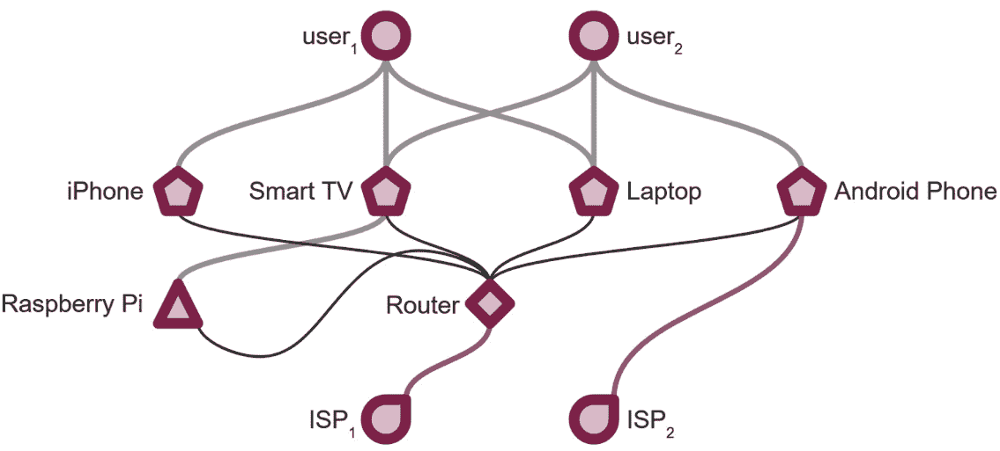
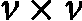
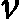

# 第一章：图学习简介

图形数据是一种强大且直观的信息表达方式，许多实际场景使用图形数据表达要比表格方式更为合适。图形数据分析已经是几十年的研究课题，但由于计算能力的提升，它最近才开始受到关注。

在本书中，我们旨在向你介绍**图形**的世界。我们将从讨论图形数据是什么以及图形相关的基本数学术语开始。接下来，我们将绕道讨论一些常见的图算法及其在图形数据分析中的应用。我们还将扩展关于图形数据分析的讨论，涉及图形深度学习的需求，以及为何它作为一个专门子领域，与应用现有架构有所不同。

在本章中，我们将涵盖以下主题：

+   我们需要图形吗？

+   图的形式化

+   图的类型和属性

+   图形数据结构

+   传统的基于图的解决方案

+   **表示学习**的需求

+   **图神经网络**（**GNNs**）及其作为独立领域的需求

# 我们需要图形吗？

最近的**人工智能**（**AI**）革命只是一个大趋势的冰山一角，这一趋势已影响计算机行业数十年。随着时间的推移，计算性能在消耗功率和成本上指数级增长；信息存储成本也在指数级下降。为了更好理解这一点，2024 年，一个 100 美元的硬盘可以存储一 TB 数据，而在 1990 年代初，存储同样数据的成本超过一百万美元！

使用计算机及其衍生产品，如软件、网页应用程序、游戏和多媒体内容，已深深融入我们的日常生活。这种依赖关系催生了对所有交互实体行为的理解需求：人类、计算机硬件、像网页应用程序这样的软件，甚至整个组织。最终目标是找到方法提高交互效率，从而可能带来前所未有的商业机会。

最初，由于时间的限制，收集到的信息较为零散，记录的事实提供了系统的一个非常高层次的概述，且仅涉及系统中的少量变量（对于数据科学家来说，类似于聚合级别的数据，且维度较少）。在某个时刻，有人意识到计算能力和数据存储已经足够便宜，可以更加细致地记录事实：不仅可以更频繁地单独记录每个场景，还可以在每次拍摄快照时记录其他变量。数据革命开始了，利益相关者意识到，通过捕捉并审查这些交互实体的足够数据，可以绘制出它们在生态系统中的行为全貌。2010 年代人们致力于数据及其产品的商品化，以至于即使是获得 A 轮融资的初创公司也采用了数据解决方案：无论是数据仓库、Elasticsearch，还是推荐引擎。

回到原点，让我们理解数据的含义。一个数据点本质上只是一个事实陈述。关于*事实在数据中的表示方式*，讨论非常少。数据的事实表示方式通常是表格形式，这对于围绕现有数据生态系统构建的能力而言通常运作良好。数据科学研究和工程的重点一直围绕现有的数据库架构，这也是表格形式的表示最为广泛的原因。然而，表格形式并不是唯一的表示方式。本章的目的是围绕图形表示法构建案例，并说明为什么图形表示法可以成为许多实际场景中的最佳选择。

图数据通过**节点**（也称为对象、顶点或名词）和**边**（也称为关系、链接或动词）来表示。某些现实生活中的场景需要强调对象之间的关系，而不仅仅是将每个对象视为独立实体。图数据结构为我们提供了一种自然的方式来表达这些场景，这与表格格式等其他方式不同。通过将实体视为节点、关系视为两个节点之间的边这一简单结构，图形表示能够有效地建模来自各个领域的信息：从网络拓扑到生物系统，再到供应链和分子结构。

## 案例研究

为了更清楚地说明这一点，让我们考虑社交网络中常见的一个问题。对于一个用户（比如 John），我们想要确定另一个用户（比如 Mary）是否是其二度连接。二度连接简单来说是指 Mary 和 John 有共同的连接，但 Mary 并不直接与 John 相连接（即 Mary 是 John 的朋友）。社交媒体平台通常在用户对之间跟踪这一信息，并决定是否应该推荐他们连接。我们将从两个角度解决这个问题：首先使用表格表示，然后使用图形表示。

### 表格表示

首先，我们需要了解数据库中表的架构。在典型的社交媒体平台数据库中，可能会有几个表 – 一个用于用户（包含年龄、位置、加入日期等人口统计信息）、一个用于帖子（包含关于发布帖子的详细信息，如发布帖子的用户、帖子内容、发布日期、可见性等），以及其他许多表。对我们而言关键的表是所谓的 **连接表**。它应该记录直接连接的用户信息（即具有一度连接的用户）。架构应该类似于这样：

```py
connections(
    conn_id: UUID,
    user_id_1: UUID FOREIGN KEY,
    user_id_2: UUID FOREIGN KEY,
    date_of_conn: TIMESTAMP,
    status_of_conn: TEXT
)
```

*表 1.1* 显示了一个包含几个数据点的表：

| **conn_id** | **user_id_1** | **user_id_2** | **date_of_conn** | **status_of_conn** |
| --- | --- | --- | --- | --- |
| conn_uuid_0 | john_uuid | alex_uuid | 2022-10-30 | active |
| conn_uuid_1 | alex_uuid | greg_uuid | 2023-03-12 | active |
| conn_uuid_2 | greg_uuid | mary_uuid | 2023-04-11 | active |
| conn_uuid_3 | mary_uuid | alex_uuid | 2023-06-09 | active |

表 1.1 – 以表格格式存储的示例数据

要确定 John 和 Mary 是否具有二度连接，可以执行类似以下的 SQL 查询：


图 1.1 – 在先前介绍的表上执行的 SQL 查询，以检索二度连接

该查询的关键部分包含递归自连接操作，其中每个递归级别包含特定程度的连接。初始过滤条件 **user_id_1 = 'john_uuid'** 或 **user_id_2 = 'john_uuid'** 确保我们只关注与 John 有某种级别连接的用户。最后，通过过滤条件 **degree = 2** ，我们可以获取所有与 John 有二度连接的用户列表。

这种方法的效率如何？最坏情况下的时间复杂度可以渐进地评估，并用**大 O 记法**表示。设  为社交媒体平台上用户的数量，

图 1.2 – 将表 1.1 中的数据表示为图

我们如何找到约翰和玛丽是否有二度连接的答案呢？我们可以在这个图上应用一个直观的算法：

1.  **从源点开始**：从选择的起始点开始，通常称为图的*源点*或**初始节点**。这是你当前的探索位置。在我们的用例中，初始节点将是约翰的节点。

1.  **按层级探索邻居**：在进入它们的邻居之前，先访问当前节点的所有邻居。想象一下按层次探索图形，每次向外扩展一级。这确保你在继续探索更远的节点之前，先发现所有距离较近的节点。

1.  **标记访问的节点**：当你访问每个节点时，将其标记为已访问，以避免重新访问同一节点。使用队列来跟踪你遇到节点的顺序。在标记节点时，你还可以跟踪从初始节点跳跃到达该节点的次数。继续这个过程，直到访问到从起始点能够到达的所有节点。

简单来说，这个算法通过逐渐远离起始点来探索图，逐层检查相邻节点，并跟踪已访问的节点以避免重复。这就像一颗小石子落入池塘，产生的涟漪先向周围扩散，然后再向更远的地方扩展。这个算法叫做**广度优先搜索**（**BFS**），它是最流行的图算法之一：


图 1.3 – 在图上运行 BFS

使用这个算法，如果玛丽的节点被标记为已访问，并且跳数为*2*，那么我们可以放心地说，约翰和玛丽有二度连接。

BFS 的时间复杂度是多少？如前所述，用户的数量假定为  ，一度连接的数量为  。实际上，BFS 至多访问图中的所有顶点和边一次，所以时间复杂度就是简单的  。在实际场景中，连接数远远超过平台上的用户数，因此时间复杂度可以近似为  。

是  比  更好吗？当然好。我们可以看到，通过改变问题的解决方法视角，我们可以实现一个更高效的解决方案。为了进一步测试你的理解，假设问题保持不变，只是你现在需要检查约翰和玛丽是否为三度连接，而不是二度连接。那么这两种方法的时间复杂度会受到什么影响？

图在实际应用中非常有用。但在我们讨论图的某些属性和算法如何用于解决图问题之前，我们需要定义一种通用语言，用来指代图及其属性。以下部分将介绍数学中图的常见定义，以及如何通过简单的表示方式涵盖图所能表示的所有不同类型的数据。

# 图的形式化

图是数学中非常流行的概念。在这个领域，常用的术语已经得到了广泛的接受。让我们仔细看一下。

## 定义和语义

随着对图表示作为实际问题相关话题的论述，我们先花点时间来定义什么是图。图是一个抽象概念。从数学角度来看，通常表示为  ，其中  是图，包含一组顶点  和一组边  。每个  的元素是一个元组  ，其中  ，表示两个顶点之间的连接。数学定义就是这些；如何将语义应用于此完全取决于你。

在前一节中提到的例子中，社交媒体平台的用户由顶点表示，两个用户之间的连接由边表示。此外，顶点和边不一定是完全相同的。考虑一下家庭网络的图表示：



图 1.4 – 一个经典的异构图，其中有多种类型的元素作为节点进行表示。边所代表的交互也具有异质性

在这里，节点表示家庭网络中所有的实体，从人类用户到**物联网**（**IoT**）设备、路由器和智能电视。边的语义范围从互动到网络通信，再到媒体流播放。形式上，顶点和边的集合可以定义如下：

```py
V = {useri, user2, iPhone, Smart TV, Laptop, Android Phone, Raspberry Pi, Router, ISP1, ISP2}
E = {
  (user1,iPhone: interacts with),
  (user1,Smart TV: interacts with),
  (user1,Laptop: interacts with),
  (user2,Smart TV: interacts with),
  (user2,Laptop: interacts with),
  (user2,Android Phone: interacts with),
  (iPhone,Router: communicates with),
  (Smart TV,Router: communicates with),
  (Laptop,Router: communicates with),
  (Android Phone,Router: communicates with),
  (Raspberry Pi,Smart TV: streams to),
  (Raspberry Pi,Router: communicates with),
  (Router,ISP1: is connected to),
  (Android Phone,ISP2: is connected to)
}
```

通过为节点或边添加更多特定信息，可以进一步增强图表示。一种常见的表示方法是使用特征向量。我们将在未来的章节中学习如何为节点和边添加特征。

这里的关键是，图是一种非常强大的事实表示方式。理解了这个定义后，我们可以尝试探讨一些图的派生特性。图的某些特性暗示了关于图中节点和边如何组织的高层次事实。接下来的部分将重点介绍几种流行的图属性和类型。

# 图的类型和属性

已识别出几种类型的图，每种图都有其独特的属性，但我们将重点讨论最流行的几种。请注意，这些类型不一定是互斥的，也就是说，一个图可以同时标记为多种类型。

## 有向图

当图的边具有单向关系时，图就是**有向图**。许多场景中，表示的关系是单向的。在表示家谱的图中，一条边可能代表“*是父母*”的关系，而另一条边可能代表“*是宠物*”的关系。这样的关系无法在节点之间倒转，并且保持相同的含义。

## 二分图

**二分图**是一种图，其顶点可以被划分为两个不相交的集合，使得每条边都连接一个集合中的顶点和另一个集合中的顶点。换句话说，图中没有连接同一集合内顶点的边。从数学上讲，图，，是二分图当且仅当顶点集被划分为两个非空集合，和，使得图中每条边都连接中的一个顶点和中的一个顶点。

二分图通常表示为  ，其中  和  是两个不相交的顶点集合，! <mml:math  ><mml:mi>E</mml:mi></mml:math> 是连接  到  的边集合。二分图的一个常见应用是在建模两种不同类型实体之间的关系，其中边表示不同类型实体之间的连接或关系。

二分图在实际应用中非常常见。在电子商务中，**推荐系统**（也称为**推荐引擎**，参见*第二章*和*第九章*）是建立在二分图数据上的，其中节点由用户和商品组成。用户和商品之间的交互仅限于用户与商品之间的互动，而用户与用户、商品与商品之间没有交互。这种互动可以表现为用户点击或订购商品的形式：


图 1.5 – 二分图的经典示例，来自电子商务应用

另一个二分图的例子是**婚姻问题**，其中一个集合中的顶点代表男性，另一个集合中的顶点代表女性，边表示夫妻之间的婚姻关系。另一个例子是建模推荐系统中客户与产品之间的互动。

## 连通图

完全**连通图**，也称为**完全图**，是每一对不同顶点都通过边连接的图，形成一个每个节点与其他每个节点都直接相连的网络。它们具有很高的连通性，但随着节点数量的增加，计算复杂度也会增加。

## 加权图

图还可以附加额外的信息，包括节点和边。当边作为标量附加信息添加时，图被称为**加权图**。

在讨论图的类型时，我们来介绍一些图的常见属性。这些不是我们之前提到的附加到图上的标签，而是一些度量或属性，独立于所讨论的图的类型。

## 子图

**子图**是由原始图的一个顶点和边的子集构成的图。更正式地说，设是一个具有顶点集和边集的图。图的一个子图是一个图，记作，使得是的子集，且 E( 是的子集。通常，寻找具有有用性质（如二分图或连通图）的子图是解决更大问题的重要步骤。

## 中心性

**中心性**是图论中的一个度量，它量化了一个节点在网络中的重要性或影响力。具有高中心性的节点在网络中更为中心，在其结构和动态中发挥着更重要的作用。中心性有多种度量方式，每种方式捕捉节点重要性的不同方面。以下是一些常见的中心性度量：

+   **度数中心性**：一个节点的度数中心性是连接到它的边的数量（即它的邻居数量）。具有高度数中心性的节点通常连接紧密，可能在传播信息或影响力方面起着关键作用。

+   **接近中心性**：接近中心性衡量一个节点与网络中所有其他节点的接近程度。它是从一个节点到所有其他节点的最短路径距离之和的倒数。具有高接近中心性的节点可以迅速与其他节点进行交互，并且在通信效率方面通常处于中心位置。

+   **介数中心性**：介数中心性量化了通过一个节点的最短路径数量。具有高介数中心性的节点对其他节点之间的通信有显著影响。高介数中心性的节点在网络中充当桥梁或门控者，控制着信息流动。

+   **特征向量中心性**：特征向量中心性不仅考虑节点的连接数，还考虑其邻居的中心性。它基于这样的原则：与高评分节点的连接对节点的中心性贡献更大。具有高特征向量中心性的节点通常与其他中心节点连接，使其在整个网络结构中非常重要。

+   **PageRank**：PageRank 是一种用于网页搜索算法（例如，谷歌的 PageRank）的中心性度量。它根据节点的入链数量和质量来赋予节点重要性。具有高 PageRank 的节点被认为是有影响力的，因为它们与其他重要节点相连。

中心性度量有助于识别网络中的关键节点，这对于理解信息流动、识别有影响力的个体或在各种应用中（如社交网络、交通系统和生物网络）针对节点进行干预都非常重要。根据分析的具体背景和目标，可能需要不同的中心性度量。

## 社区结构

在图论中，**社区结构**指的是将网络或图分为节点的群组或簇，这些节点在内部连接密集，但组与组之间的连接较少。社区内的节点更可能具有相似的属性、兴趣或功能，识别社区结构是分析复杂网络的组织和动态的基础。检测图中的社区对理解系统的模块化组织至关重要，并且在许多领域（如社交网络分析、生物学和信息检索）都有应用。

## 同构

**同构**是图论中的一个概念，处理两个图之间的结构相似性。若两个图的顶点之间存在一一对应关系，并且邻接关系得以保持，则认为这两个图是同构的。换句话说，从结构角度来看，这两个图本质上是相同的，即使顶点和边的标签可能不同。

图同构是计算机科学中的一个基础问题，应用广泛，如化学、计算机辅助设计和模式识别等领域。尽管它在实际应用中非常重要，但找到一个快速的图同构算法仍然是一个具有挑战性的问题，而且是否存在具有多项式时间复杂度的算法仍然是一个悬而未决的问题：


图 1.6 – G 和 H 是同构图。要理解这一点，请注意以下映射关系：g 1 →h 1，g 2 →h 2，g 3 →h 3，依此类推。

专用图的属性可以被利用，以进一步洞察这些图所表示的场景。现在，让我们来看看如何将图输入到机器中，以便它们可以被算法读取。

# 图数据结构

我们应该如何将图数据输入到计算机程序中，以便能够应用基于图的算法来解决问题？这一点将在本节中讨论。每种表示方法都有其优缺点，我们将从确定边是否存在以及更新图的时间复杂度的角度来探讨它们。

## 邻接矩阵

**邻接矩阵**旨在通过矩阵记录图的结构。创建一个矩阵，例如  ，大小为  （其中  表示节点数，或者从数学角度来看，，因为它只涉及检查矩阵中的特定单元格。然而，向图中添加新顶点会比较困难，并且根据矩阵的实现，可能需要完全重新初始化。最后，邻接矩阵的空间复杂度也较大，按  的顺序计算。存在稀疏矩阵的实现，它们可能减少矩阵在内存中所需的空间，但它们也有自己的缺点。当图较小且静态且需要频繁查找时，邻接矩阵是一个不错的选择。

## 邻接表

另一种常用于存储图数据的流行数据结构是**邻接表**。它包含一个字典，字典的键是节点名称，每个条目包含一个与该键节点通过边连接的所有节点的列表。与邻接矩阵不同，邻接矩阵的空间复杂度是  ，而邻接表的空间复杂度是  。然而，邻接表在许多数据相关任务中更具灵活性，且具有更高效的时间复杂度。插入顶点和边的操作是 ；访问邻居节点的操作也需要 ，而判断一条边是否存在则可能需要  的时间。如果图本身稀疏，邻接表是一个不错的选择：


图 1.7 – 对于给定的图 G，M 和 L 分别是邻接矩阵和邻接表

到目前为止，我们讨论了邻接矩阵和邻接表这两种在算法中常用的图表示数据结构。然而，根据问题的不同，还有许多其他图数据结构可以使用。每种图数据结构都有其优缺点，这是一个很好的研究领域，值得进一步探讨。

# 传统的基于图的解决方案

许多计算机科学家通过设计优雅的解决方案解决了涉及图的看似复杂问题，留下了浓厚的历史印记。然而，图并不仅仅局限于算法书籍中，图相关的问题在实际中也非常常见。许多商业问题和科学研究实际上可以转化为图问题，现有的解决方案可以在这些问题上实施，以生成所需的输出。在这一节中，我们将讨论图领域中最常见的问题、一些解决这些问题的方法，以及这些问题在实际场景中常见的应用。

## 搜索

执行图搜索时有两种基本的方法：广度优先搜索（BFS）和深度优先搜索（DFS）。这两种方法都是从起始点开始遍历图，直到所有可以从初始节点到达的节点，但它们的区别在于各自的处理方式。

在广度优先搜索（BFS）中，算法逐层探索图，从源顶点开始，先访问所有邻居节点，再进入下一层。这种方法确保了离源节点较近的节点会先被访问，而更深层的节点则会后访问。另一方面，**深度优先搜索**（**DFS**）则是沿着每个分支尽可能深入，直到无法继续，然后回溯。它会在到达某个分支的末端之前，先深入探索这一分支，才会转向下一个分支。

广度优先搜索（BFS）非常适合在无权图中寻找最短路径，并且常用于网络路由协议和社交网络分析中。深度优先搜索（DFS）则通过深度探索，非常适合用于拓扑排序、环检测，以及解决迷宫探索和拼图问题等。

现在我们对搜索算法有了基本的了解，接下来让我们来看另一类问题——**划分**。在实际中，理解图划分的需求非常频繁。

## 划分

在图论中，划分指的是将图的顶点或边分割成互不相交的子集或组件。划分的目标是以某种方式将图的元素分组，以满足特定的属性或达成某个目标。图划分有不同的类型，选择哪种划分标准取决于应用或当前问题的需求：

+   **顶点划分**：这涉及将图的顶点集合划分为互不重叠的子集。顶点划分的目的是为了在每个子集中的顶点数量上实现平衡。这是并行计算中的负载平衡、网络设计和社交网络分析中常见的问题。

+   **边划分**：顾名思义，这涉及将图的边集合划分为互不重叠的子集。与顶点划分类似，这里的目标是平衡每个子集中边的数量或边的总权重。边划分问题通常应用于分布式计算中的通信优化，最小化子集间的通信。

+   **图割**：这涉及通过去除最少数量的边来划分图。目的是在满足某些约束条件的同时，最小化割的大小（去除边的总权重）。应用包括图像分割和社交网络中的社区检测。

+   **K-路划分**：这是上述概念的推广，涉及将顶点或边划分为  个互不重叠的子集。在 K-路划分问题中，我们需要在每个  子集中的元素数量上实现平衡，这类问题出现在 **超大规模集成**（**VLSI**）设计和并行计算等领域。你可以在这里阅读更多内容：[ https://patterns.eecs.berkeley.edu/?page_id=571 ](https://patterns.eecs.berkeley.edu/?page_id=571)。

图划分问题通常是 NP 难的，这意味着对于大型图而言，找到最优解在计算上可能是不可行的。因此，各种启发式算法、近似算法和优化技术被用来在合理的时间内找到良好的解决方案。

在图论领域中，另一个重要问题是路径优化，许多供应链企业和网络研究人员一直对此类问题的解决方案感兴趣。

## 路径优化

图论中两个常见问题是找到两节点之间的最短路径和最宽路径。它们的应用显而易见，涉及供应链中的路线优化和社交网络分析（前述案例研究中提到的问题也可以视为两节点之间的最短路径问题，特别是如果通过要求边加权进行了轻微修改的话）。

最宽路径问题是最短路径问题的变种。正式地，问题定义如下：给定一个加权图，最宽路径问题寻找一条从源顶点到目标顶点的路径，使得路径上最小的边权（瓶颈）最大化。这在网络设计或通信系统中尤为相关，目标是最大化瓶颈链路的容量。

寻找两个节点之间最短路径的最流行方法是**迪杰斯特拉算法**。虽然不深入细节，这里是该算法的简短步骤总结：

1.  **初始化**：

    1.  从源顶点开始。

    1.  将源顶点的临时距离设为 0，所有其他顶点的临时距离设为无穷大。

    1.  将所有顶点标记为未访问。

1.  **迭代探索**：

    1.  选择未访问的临时距离最小的顶点。

    1.  对于选定的顶点，考虑它的所有邻居。

    1.  通过将当前顶点到每个邻居的距离加起来，更新每个邻居的临时距离。

    1.  如果更新后的距离小于当前的临时距离，则更新它。

    1.  将当前顶点标记为已访问。

1.  **终止**：

    1.  重复迭代过程，直到目标顶点被访问或所有顶点都被访问。

    1.  最终分配的距离表示从源顶点到所有其他顶点的最短路径。

    1.  通过从目标顶点回溯到源顶点，利用存储的最短距离信息来重建最短路径。

总结来说，Dijkstra 算法以逐步的方式探索图，始终选择具有最小暂定距离的顶点。它逐渐构建从源点到所有其他顶点的最短路径，同时标记已访问的顶点。最终的结果是从源点到图中所有其他顶点的一组最短距离和路径。最宽路径问题也可以通过相同的算法解决，但不是保持每个节点的最小暂定距离，而是保持瓶颈权重（或者是所有路径中最小权重的最大值）。该算法的时间复杂度很大程度上依赖于所使用的实现方法，复杂度范围从![<mml:math  ><mml:mi>O</mml:mi><mml:mo>(</mml:mo><mml:mfenced separators="|"><mml:mrow><mml:mfenced open="|" close="|" separators="|"><mml:mrow><mml:mi>V</mml:mi></mml:mrow></mml:mfenced><mml:mo>+</mml:mo><mml:mfenced open="|" close="|" separators="|"><mml:mrow><mml:mi>E</mml:mi></mml:mrow></mml:mfenced></mml:mrow></mml:mfenced><mml:mi>*</mml:mi><mml:mi>l</mml:mi><mml:mi>o</mml:mi><mml:mi>g</mml:mi><mml:mo>(</mml:mo><mml:mo>|</mml:mo><mml:mi>V</mml:mi><mml:mo>|</mml:mo><mml:mo>)</mml:mo><mml:mo>)</mml:mo></mml:math>](img/66.png) ![<mml:math  ><mml:mi>O</mml:mi><mml:mo>(</mml:mo><mml:mfenced separators="|"><mml:mrow><mml:mfenced open="|" close="|" separators="|"><mml:mrow><mml:mi>V</mml:mi></mml:mrow></mml:mfenced><mml:mo>+</mml:mo><mml:mfenced open="|" close="|" separators="|"><mml:mrow><mml:mi>E</mml:mi></mml:mrow></mml:mfenced></mml:mrow></mml:mfenced><mml:mi>*</mml:mi><mml:mi>l</mml:mi><mml:mi>o</mml:mi><mml:mi>g</mml:mi><mml:mo>(</mml:mo><mml:mo>|</mml:mo><mml:mi>V</mml:mi><mml:mo>|</mml:mo><mml:mo>)</mml:mo><mml:mo>)</mml:mo></mml:math>](img/67.png) 到。然而，当边权为负时，Dijkstra 算法会失败，而且当图几乎完全连接时也会效率低下。在这种情况下，可以使用**Bellman-Ford** **算法**等替代方法。

现在我们已经基本了解了图数据上执行的各种分析方法，接下来让我们看看另一种强大的学习图数据中模式的方式。表示学习的核心思想将在以下部分中介绍；我们将学习表示学习是解决许多涉及图的复杂问题的重要第一步。

# 表示学习的需求

在这里，我们将介绍一个新概念——**图形的表示学习**。让我们通过一个小类比来理解这意味着什么。一个典型的公司组织包含几个实体：员工、IT 设备、办公室等。所有这些实体之间保持不同类型的关系：员工之间可以基于组织层级相关联；一个员工可能使用几件 IT 设备；几件设备，如服务器，可以相互连接；员工和设备可以分别在某个特定办公室报到或位于该办公室，等等。

图形，确实是表示这些信息的一种自然方式，如下所示：


图 1.8 – 显示组织中不同实体相互作用的图形

图形在视觉上非常直观。然而，对图形进行算法计算并不是一件简单的事情。我们能否找到一种方法，在一些共同的字段中尽可能捕捉每个实体的特征和关系信息？考虑为每个实体设计一张独特的 ID 卡，其中包含以下字段：姓名、子组织、启动日期、行业年限和地理位置。因此，几张 ID 卡可能长这样：


图 1.9 – 几个具有相同字段的实体 ID 卡示例

现在，如果你只看到了所有实体的 ID 卡而没有看到前面的图形，你能回答一些问题吗？比如哪个员工汇报给谁？或者，哪张 ID 卡是员工的，哪张是办公室的，哪张是 IT 设备的？仅凭 ID 卡上的信息，确定这些问题的答案并不容易（或完全可行），但我们可以接近正确答案。要回答一个员工是否在另一个员工的层级下，我们可以检查两个员工是否具有相同的**子组织**和**地理位置**值，并且层级更高的员工在**行业年限**上是否高于另一个员工。猜测某张 ID 卡是否属于办公室，可能只需要检查该实体的**子组织**值是否为空，等等。

尽管这种方法一开始听起来不太直观，但仅仅通过 ID 卡而不是图形，使用这种启发式方法来尝试回答这些实际问题，计算机和现代实现可以高效地完成。这里的 ID 卡试图*表示*图形中实体的特征和关系。

更正式地说，前面示例中的身份证是与图的每个节点相关的固定维度的向量嵌入。应用了一种学习算法，旨在在这些嵌入向量中尽可能多地捕捉图结构中的信息。这些嵌入向量集随后用于回答有关图的难题，而不依赖于原始图形本身。

为什么我们要尝试学习表示？与直接处理原始图形相比，使用嵌入向量有什么好处？让我们来看看：

+   **可扩展性**：传统的图算法对于大规模图形可能会变得计算上昂贵且不切实际。表示学习方法通过生成紧凑的嵌入向量来捕捉图形的关键信息，从而实现更可扩展和高效的计算。

+   **任务灵活性**：表示学习生成的嵌入向量是与任务无关的，这意味着它们可以用于各种下游任务。传统的图算法通常是针对特定问题设计的，将其适配到不同的任务中可能会面临挑战。而嵌入向量提供了更灵活和多功能的方式来处理各种任务。

+   **包含节点和边的特征**：许多现实世界的图形都带有与节点和边相关的额外特征。表示学习方法可以自然地将这些特征纳入学习过程，从而对图形特征进行更全面的理解。传统的图算法可能不容易集成外部特征。

+   **处理动态图**：表示学习非常适合处理结构不断演变的动态图。学习到的嵌入向量可以捕捉时间模式和变化，提供比传统图算法更适应的方式，而传统算法可能未能本质上解决时间因素。

+   **对未见数据的泛化能力**：表示学习旨在生成能够很好地泛化到未见数据的嵌入向量。这在图结构不完全已知或可能发生变化的情况下尤为有用。传统的图算法可能无法有效地对新的或未见过的图实例进行泛化。

+   **噪声鲁棒性**：嵌入向量可以对噪声或不完整的图数据更具鲁棒性。传统的图算法可能对噪声敏感，但表示学习方法可以学会忽略无关信息，专注于图形的最重要部分。

+   **与机器学习模型的集成**：表示学习促进了图数据与机器学习模型的集成。学习到的嵌入向量可以作为各种机器学习任务的输入特征，使得实践者能够在统一框架中利用图基算法和非图基算法的优势。

通过捕捉图数据中的关键信息并将其压缩成嵌入，应用机器学习技术于图结构数据变得更加可行，并且可以高效地处理各种任务。

# GNN 和需要单独关注的领域

在本章中，我们不会深入讨论 GNN 的具体工作原理或它们与其他流行的神经网络架构的不同之处。在这里，我们只是尝试解释为什么有必要将 GNN 单独研究，而不是与其他深度学习架构一起研究。

在讨论差异之前，我们必须先讨论相似性。GNN 是一种专门用于处理图数据并输出表示或节点嵌入的架构选择。类似于卷积网络对于读取像素数据的重要性，GNN 架构集被优化用于读取图数据。基于 GNN 的学习任务与其他深度学习解决方案的轨迹相同：通过迭代优化模型的参数，以使损失函数最小化。在 GNN 的情况下，损失函数通常尝试捕捉并保留关于图结构的有意义信息。

现在，让我们来看看这些差异，以及为什么 GNN 需要特别关注：

+   **不规则的图结构**：图可以具有不规则和变化的结构，节点可能有不同数量的邻居。这种不规则性对传统的深度学习架构构成挑战，因为传统架构通常假设输入大小是固定的。例如，在社交网络中，个体可能有不同数量的连接（朋友、关注者等等）。

+   **置换不变性**：图中节点的顺序不应影响 GNN 的输出。实现置换不变性对于确保模型能够跨不同节点顺序进行泛化至关重要。一个置换不变性的好例子是化学中的分子图。分子的性质仅依赖于其结构，而不是原子标号的顺序。

+   **图同构问题**：确定两个图是否同构是一个计算上复杂的问题。GNN 需要能够捕捉并区分不同的图结构。

+   **节点和图分类**：GNN 通常需要执行如节点分类或图分类等任务。这些任务要求模型能够捕获图的局部和全局信息，这可能是一个挑战。

+   **处理不同类型的边**：图可能具有不同类型的边，每种边代表节点之间不同的关系。GNN（图神经网络）需要能够建模并利用这种边类型的异质性。

+   **池化与聚合**：在图中聚合邻居信息是 GNNs 中的一个基本操作。设计有效的池化和聚合策略，以捕获重要信息，同时避免信息丢失或冗余，是一个挑战。一个很好的例子是推荐系统如何从用户朋友的偏好中池化信息。表示应当能够捕捉到这种池化的思路。

+   **捕捉长程依赖**：GNNs 需要捕捉图中的长程依赖关系。与**递归神经网络**（**RNNs**）中的顺序数据不同，后者的依赖关系通常是局部的，图可能存在跨越长距离的依赖关系。

+   **可解释的表示**：在图神经网络（GNNs）中，理解和解释学习到的表示是至关重要的，尤其是在那些可解释性至关重要的应用中。可解释性在使用电子健康记录进行医学诊断时尤为关键。GNNs 可以用来分析患者记录，其中节点表示不同的健康参数。可解释的表示对于医疗专业人员理解并信任模型在诊断疾病或预测患者结果时的决策过程至关重要。

GNNs 提供了机器学习方法在处理表格数据时所具备的许多优势，但它们是在图数据的背景下发挥作用。使用 GNNs 作为解决与图相关问题的中介步骤有几个重要的意义。我们将在接下来的章节中探索更多类似的话题。

# 摘要

在本章中，我们介绍了图学习和表示的基础概念。我们从激励性示例开始，说明了图结构如何自然地捕捉实体之间的关系，使其成为一种强大的数据表示。接着，我们讨论了图的正式定义、常见图类型和关键属性。我们还介绍了流行的图算法，如搜索、划分和路径优化，以及它们的实际应用场景。

这里提出的一个关键观点是图上表示学习的需求。将图数据转化为向量嵌入使我们能够利用机器学习模型的能力。诸如可扩展性、灵活性和鲁棒性等好处使得图嵌入成为一种促进技术。

最后，我们证明了专门化 GNN 架构的必要性。诸如不规则结构、排列不变性以及复杂操作如聚合和池化等因素都要求定制化的解决方案。GNNs 为跨领域学习关系数据开辟了新的可能性。

在下一章中，我们将讨论图学习如何在实际中应用。图学习和表示有多个层次，所有这些层次都有商业和学术意义。本章所涵盖的主题将作为你理解后续章节中概念的基础。
