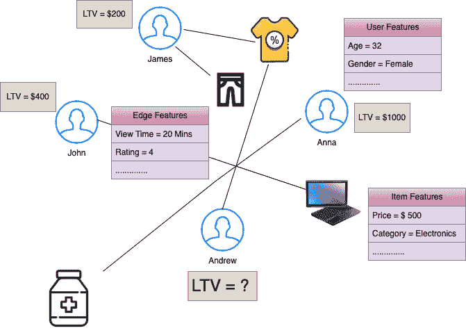
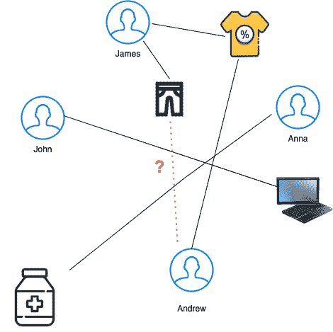
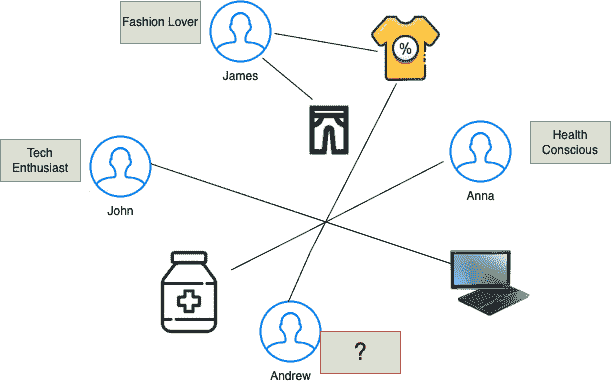

# 第二章：现实世界中的图学习

在数据科学和**机器学习**（**ML**）日新月异的领域中，基于图的学习的变革性力量已成为揭示现实世界现象复杂性的关键力量。从社交网络和交通系统到生物学交互和电子商务，许多复杂的系统可以通过图的视角进行抽象和分析。本章将深入探讨现实世界中的图学习领域，我们将在其中探讨这样一个引人注目的观点：许多复杂的现实问题可以有效地转化为节点、边和图级的预测任务。

**图**，由表示实体的**节点**和捕捉它们之间关系的**边**组成，为建模互联结构提供了直观的框架。通过利用图中固有的关系，我们获得了一个强大的工具，用于理解多领域中的动态和模式。重点将放在利用图的拓扑结构和结构中蕴含的预测潜力，从而为解决从**推荐系统**和欺诈检测到药物发现和城市规划等问题提供解决方案。

图学习的核心是*节点*，即网络中的基本实体。节点可以是从社交网络用户到生物分子，再到交通系统中的城市等任何事物。通过学习和预测节点的属性或行为，我们可以构建诸如个性化推荐和定向营销等应用。

*边*，表示节点之间的关系，增加了复杂性。边可以捕捉社交联系、生物交互或网络连接。通过学习和预测边的属性或结果，我们可以深入了解实体之间如何相互关联。这对于链接预测、异常检测和网络优化等任务至关重要。

超越单个节点和边，图级预测提供了一个全局视角。通过学习和分析图的整体结构和特征，我们可以发现从网络中涌现出的模式、社区和现象。这对于城市规划等场景非常有用，在这些场景中，城市基础设施的设计可以影响日常生活的各个方面。

本章将探讨以下主题：

+   节点级学习

+   边级学习

+   图级学习

+   真实世界应用

# 节点级学习

**节点级学习** 是学习和预测图中单个节点的属性或行为的任务。根据目标变量的类型和范围，节点级学习可以分为四个子任务：**节点分类**、**节点回归**、**节点聚类** 和 **节点异常检测**。

## 节点分类

**图节点分类** 是一种机器学习任务，旨在根据节点的特征和连接关系为节点分配标签或类别。例如，在一个电商图中，我们可以根据用户与商品的互动，将用户分类到不同的偏好组。为此，我们需要从节点和边缘中提取特征，如人口统计信息、商品属性、流行度、评论、购买频率以及在商品上的停留时间。这些特征捕捉了用户和商品的特征与偏好，以及它们互动的强度和性质。通过在一部分带标签的节点上训练机器学习模型，我们可以预测未标记节点的标签。这样，我们就可以将用户分为如 *健康意识*、*科技爱好者* 或 *时尚爱好者* 等群体，并为他们提供更相关和个性化的推荐。

看这个图：

这里，** 是节点集合，** 是边集合，每个节点 ** 拥有一个特征向量 ** *.*

节点分类任务旨在根据节点的特征和图结构预测每个节点 ** 的标签。数学上，这可以表示为：

 

这里， 是节点分类函数，考虑了节点 的特征和图结构，以生成预测标签。该函数通常通过从带标签的训练数据集中的示例学习，其中*节点*与真实标签相关联。目标是将这种学习泛化，以便准确地对未见数据中的未知标签节点进行分类。

图 2.1 – 电商中的节点分类任务

在*图 2.1*中，一个带标签的电商图，我们的目标是确定 Andrew 属于哪个类别。

一些其他现实世界中的节点分类任务示例如下：

+   **信息检索**：节点分类可以根据网页、文档、查询或用户的内容、结构和交互来进行分类。例如，节点分类可以帮助将查询分类为电商查询图中的不同意图，或将网页在网络图中分类为不同主题。

+   **社交网络分析**：节点分类可以用来根据用户或实体的属性、行为和关系，在社交网络中识别其角色、社区或兴趣。例如，它可以帮助我们在 Twitter 上检测假冒或恶意账户。

+   **生物信息学**：节点分类可以根据生物分子或细胞的特征和关联推测它们的功能、相互作用或属性。例如，节点分类可以帮助预测蛋白质在蛋白质-蛋白质相互作用网络中的功能，或在单细胞基因表达网络中识别细胞类型。

接下来，让我们看看当我们有一个连续值需要预测时会发生什么。

## 节点回归

与分类相比，**节点回归**涉及预测与单个节点相关的数值。这个任务在理解节点的定量方面至关重要的场景中特别有用。在电子商务系统中，一个可能的使用场景是基于客户与产品及其他特征的互动来预测**生命周期价值**（**LTV**）。例如，您可以将电子商务平台建模为一个二分图，其中客户和产品是*节点*，购买、评分或浏览是*边*。您可以从节点和边中提取特征，如客户人口统计、产品属性、历史购买模式、流行度和互动强度。然后，您可以训练一个回归模型来预测每个客户的 LTV，这可以帮助您细分客户并优化营销策略。

图 2.2 – 电子商务 LTV 预测的节点回归

*图 2.2*展示了一个标记的电子商务图，用于通过节点回归预测 LTV。该图包含表示用户（James、John、Anna、Andrew）、物品（服装和电子产品）以及与用户、物品及其互动相关的各种特征的节点。目标是基于图结构和可用特征预测 Andrew 的 LTV。

其他一些节点回归的现实世界示例包括：

+   **产品需求**：给定一个以产品为*节点*、产品之间相似性为*边*的产品图，节点回归可以基于相关产品的销售情况预测某个产品的需求。这有助于库存和供应链管理。

+   **房地产网络中的房产估值**：房地产图中的节点可能表示单独的房产。节点回归可以根据位置、面积、设施以及附近最近的房产销售等特征预测房产价值。

现在让我们看看在图系统中如何利用聚类技术。

## 节点聚类

**节点聚类**旨在将具有相似特征或连接模式的节点进行分组。通过识别图中的社区，这个任务为我们提供了对内在结构和关系的更深理解。例如，在一个引用网络中，研究相似主题的研究人员可能会形成不同的聚类，揭示出兴趣社区。

继续以电商为例，节点聚类可以用于根据客户的购买行为和偏好对其进行分组。这种方法有助于深入理解客户群体，推动精准营销活动，并提升个性化推荐的质量。通过使用图聚类算法，我们可以识别出具有相似购买模式的客户群体，或者与常被相似客户群体购买的商品进行互动的客户。节点聚类可以作为一个有价值的工具，用于为特定客户群体量身定制营销策略，并优化推荐系统，从而为用户提供更加个性化的购物体验。

图 2.3 – 基于购买行为的电商客户节点聚类

在*图 2* *.3*中，我们可以看到如何在节点层面应用聚类，以根据用户的购买历史对其进行分类。

其他一些现实世界中的节点聚类示例如下：

+   **引文网络**：在学术引文网络中，*节点*可以表示学术论文，*边*可以表示引用。根据相似的主题、关键词或引用模式对论文进行聚类，可以帮助研究人员进行文献综述并识别研究趋势。

+   **物联网（IoT）网络**：在物联网网络中，*节点*可以表示连接的设备，*边*可以表示通信链路。根据设备的功能、使用模式或兼容性对其进行聚类，可以帮助优化网络流量、资源分配，并识别潜在的安全威胁。

有时，我们可能希望识别图数据中的异常情况。让我们看看该如何操作！

## 节点异常检测

**图学习中的节点异常检测**是指识别偏离正常模式的图节点。例如，考虑一个在线零售平台，用户在平台上创建账户、浏览产品并进行购买。节点异常检测可以用来发现显示出异常购买行为的用户，例如过高频率的交易、异常大的购物车尺寸或购买习惯的突然变化。检测这些异常对标记潜在的欺诈活动至关重要，从而确保为真正的用户提供一个安全可靠的在线购物体验。

其他一些现实世界中的节点聚类任务示例如下：

+   **网络入侵检测**：在计算机网络中，识别表现出异常通信模式的节点（计算机或设备），例如数据传输突然增加或可疑的访问尝试，有助于检测潜在的安全威胁或入侵。

+   **电信网络**：电信网络中的节点可以是移动设备或通信塔。异常检测可以帮助识别异常的呼叫模式、意外的漫游行为或网络流量的突然激增。

+   **金融欺诈检测**：在金融交易网络中，异常检测可以识别可能表明欺诈活动的异常模式，例如洗钱或内部交易。

+   **网络安全**：通过检测不寻常的访问模式或数据传输行为，识别网络中被攻击的用户账户或设备。

接下来，让我们深入探讨边学习——连接节点并定义关系的关键。

# 边缘级学习

**边缘级** **学习**是图机器学习的一个分支，专注于根据节点和边的特征以及图的结构，预测图中边的属性或标签。边缘级图学习在链接预测、推荐系统、欺诈检测和社交网络分析等任务中非常有用。

**链接预测**指的是预测图或网络中缺失或未来的边/链接的问题。给定一个网络的快照，目标是根据现有的图结构和节点属性，估算两个节点之间形成边的可能性。

在电子商务图中，链接预测可以用来预测用户与产品之间的潜在新边，代表未来的可能购买。具体来说，我们可以基于用户的历史交互以及类似用户的购买模式，预测用户可能感兴趣的产品。

图 2.4 – 电子商务用户-商品推荐的链接预测

在*图 2.4*中，我们看到，给定**用户-商品交互**的图数据，我们可以使用链接预测任务来判断向特定客户推荐某个产品是否会导致转化。

链接预测的一些实际应用包括：

+   **推荐系统**：链接预测可以根据用户的偏好、行为或反馈，推荐产品、服务或内容。例如，在一个电影流媒体服务中，*节点*代表用户和电影，*边*代表明确/隐式评分，链接预测可以用来估算客户对他们还未观看的电影的评分。

+   **社交网络分析**：链接预测可以用于分析社交网络的结构和动态，例如寻找社区、影响者或潜在的朋友。例如，在一个社交网络图中，*节点*代表用户，*边*代表朋友关系或互动，链接预测可以用来预测两位用户之间关系的强度或亲密度，或预测两位用户连接的概率。

现在，让我们探索链接预测与边分类任务之间的区别。

## 边分类

**边分类**是预测图中每条边的离散标签的任务，例如边的类型、类别或状态。例如，在一个电子商务图中，*节点*代表商品和顾客，*边*代表交易或评价，边分类可以用来分类每条边所表示的关系类型，如休闲浏览、认真兴趣或购买意图。这将帮助我们更好地理解用户行为和意图。

图 2.5 – 用于电子商务会话意图的边分类

在*图 2* *.5*中，展示了边分类的应用，演示了如何根据用户的购买历史将用户划分为不同的细分群体。

一些实际的边分类应用示例如下：

+   **出版物引用**：在一个出版物引用网络中，*节点*代表论文，*边*代表引用，边分类可以用来将边分类为正面或负面，表示引用的情感或语气。

+   **社交网络**：在社交网络中，边分类可以用来将边分类为强关系或弱关系，表示用户之间关系的强度或亲密度。

类似于节点，回归也可以在图的边上执行。

## 边回归

**边回归**是预测图中边的连续值的任务，例如边的权重、强度或相似度。在电子商务的案例中，边回归可以用来估算顾客在做出购买决策之前，基于用户与各类相似商品的历史互动，以及其他用户和商品特征，所花费的时间。

图 2.6 – 用于预测发现和购买之间时间的边回归

*图 2* *.6* 展示了我们如何使用边回归来预测连续标签，例如在某个特定商品上的停留时间。

一些实际的边回归应用示例如下：

+   **预测地点间的交通流量**：在一个道路网络图中，边回归可以基于历史流量和连接模式预测两个地点之间的交通量。这有助于交通优化。

+   **预测产品共购率**：在电子商务图中，边回归可以根据过去的共购数据预测未来两个商品可能会一起购买的频率。

边学习超越了监督学习的技术；它还可以应用于无监督学习方法。

## 边聚类

这是将图中的边缘根据其特征或标签分组的任务，使得同一组中的边缘彼此之间的相似度高于与其他组中的边缘。例如，在电子商务图中，**边缘聚类**可以用于识别具有相似模式的边缘组，比如频繁或高价值的购买。

图 2.7 – 基于交易价值的购买聚类

*图 2* *.7* 展示了我们如何根据交易价值对边缘进行聚类，将相似的交易放入同一类别。

边缘聚类的其他应用如下：

+   **账户间的金融交易聚类**：边缘聚类可以将相似类型的货币转账或流动分组，有助于识别可疑的模式。

+   **网页之间的超链接聚类**：边缘聚类可以将网页之间的超链接分为多个类别，如导航链接、商业链接、关联链接等。

与节点类似，我们也可能遇到需要检测的异常边缘。

## 边缘异常检测

**边缘异常检测**是识别图中偏离正常模式的边缘的任务，比如那些具有异常特征、标签或连接的边缘。在电子商务图中，边缘异常检测可以用于检测欺诈交易和虚假评论等异常。以下列表列出了一些边缘级异常检测的应用。

边缘异常检测的一些应用如下：

+   **检测欺诈性资金转移**：在银行交易图中，识别出在不相关账户之间的异常高价值转账作为异常边缘，可能揭示潜在的欺诈行为。

+   **检测未经授权的网络访问**：在企业网络图中，边缘异常可能代表设备之间的稀有连接，表明有恶意行为者或已被攻破的设备。

+   **检测股市操纵**：在股票交易网络中，账户之间的异常边缘可能揭示非法交易共谋或“拉高出货”计划的模式。

在我们深入探讨前一部分的边缘学习复杂性时，可以看出其应用已经超越了传统的边界。接下来，让我们进入学习领域的最上层，关注图级学习。

# 图级学习

**图级学习**是指在整个图的层面上进行操作的机器学习任务和技术，而不是仅仅针对图中的单个节点或边缘。图级学习侧重于基于整个图或子图结构生成预测、分类或洞察。

### 图级预测

这里的目标是为整个图谱进行预测或分类，而不是单个节点或边。例如，给定一个特定时间的电商用户-商品交互图谱，我们可以基于图谱层级学习预测任何特殊事件或一般模式。在城市规划和交通管理中，**图谱级预测** 可用于预测整个道路网络的交通流量。这能够优化交通信号时间、路线规划和基础设施建设。

图 2.8 – 基于电商图谱快照的事件预测

*图 2.8* 展示了我们如何使用整个图谱在图谱层面进行某些预测。

## 图谱级表示

学习 **图谱层级表示** 涉及捕捉整个图谱的基本特征和特性。像 **图神经网络**（**GNNs**）这样的技术被用来聚合来自单个节点和边的信息，创建整个图谱的数值表示。

图 2.9 – 用浮点数向量表示图谱

*图 2.9* 展示了我们如何使用现代深度学习技术将整个图谱表示为一个嵌入向量。这些表示可以进一步用于构建下游任务的模型，如 **回归**、**分类** 或 **聚类**。

让我们通过整个流程来看看一个社交网络分析的示例用例：产品推荐

1.  **数据收集与图谱构建**：从社交网络平台收集用户数据（*节点*）及其交互（*边*）。构建一个图谱，其中用户为节点，朋友关系或交互为边。包括用户属性（年龄、兴趣）作为节点特征，交互类型作为边特征。

1.  **GNN 模型**：选择一个 GNN 架构（例如，**图卷积网络**（**GCN**）或 **GraphSAGE**）。定义 GNN 层的数量及其维度。

1.  **节点级表示学习**：对于每个节点，使用 GNN 聚合来自其邻居的信息。这个过程为每个用户创建一个学习到的嵌入，捕捉他们的属性和网络结构。

1.  **图谱级表示**：使用读出函数（例如，求和、平均或最大池化）来聚合节点嵌入。这一步生成一个表示整个图谱的单一向量。

1.  **训练过程**：定义一个任务特定的损失函数（例如，产品推荐的二元交叉熵）。使用反向传播来更新 GNN 参数，优化图谱级任务。

1.  **图谱嵌入输出**：训练好的模型现在会为任何输入图谱输出一个固定大小的向量（例如，128 维）。这个向量捕捉了社交网络的全局特性。

1.  **下游任务 – 产品推荐**：将图嵌入作为分类器的输入，预测某个产品在网络中的受欢迎程度。根据产品成功和失败的历史数据训练该分类器。

1.  **部署和推断**：对于一个新产品，生成当前社交网络图的嵌入。将这个嵌入输入到已训练的分类器中，预测该产品的潜在受欢迎程度。

正如我们所见，图层次学习在生物信息学、社交网络分析、化学和推荐系统等各种应用中都至关重要。图层次学习中使用的技术通常利用图的层次结构和关系特性来捕捉复杂的依赖关系，并在更高的抽象层次上进行预测。

图 2.10 – 节点、边和图层次学习

*图 2* *.10* 将所有三个学习层次——*节点*、*边* 和 *图*——整合到同一个画布上。这展示了图学习如何在不同层次上运作。每个层次代表图结构中数据的不同方面，并且在每个层次上有特定的应用。

# 现实世界中的应用

本节将探讨图学习积极应用的一些领域。

## 推荐系统

图学习已经成为推荐系统领域中的一项强大工具，增强了其能力和有效性。推荐系统旨在预测用户的偏好并提供个性化建议，而图学习利用数据固有的关系结构，更高效地实现这一目标。

图 2.11 – 用户-物品链接预测用于推荐

*图 2* *.11* 展示了如何将电子商务推荐中的用户-物品亲和度任务转化为链接预测问题。这个任务是推荐系统中一个领域的示例，在这个领域中，图学习可以发挥重要作用。

### 用户-物品图表示

图学习使得用户和物品可以作为图中的节点进行表示，边表示它们之间的交互或关系。这种表示方式捕捉了用户-物品交互中的复杂依赖关系和连接，从而更细致地理解用户偏好。

例如，在社交网络中，用户和帖子可以作为图中的*节点*进行表示，*边* 表示交互，例如点赞、评论或分享。然后，图学习可以捕捉用户与帖子的关系，从而实现个性化内容推荐。

### 隐式反馈与显式反馈

推荐系统通常处理显式和隐式反馈。图学习可以通过结合图结构来有效地建模隐式反馈，例如点击、浏览和停留时间，从而捕捉用户和物品之间的关系。这有助于在显式反馈稀缺时做出准确的预测。

### 基于邻域的推荐

基于图的推荐系统利用**基于邻域的学习**的概念。通过分析图中围绕某个用户或物品的局部结构，这些系统可以推荐与用户或其他相似用户已经互动或喜欢的物品相似的项目。

以电影推荐系统为例。可以通过分析邻域用户（具有相似品味的用户）喜欢或观看的电影来推测某个用户的偏好。图学习识别这些局部结构来推荐电影。

### 异构图

在现实场景中，推荐系统常常处理异构信息，包括用户、物品和各种互动。图学习可以处理**异构图**，其中节点代表不同类型的实体，从而更全面地建模关系和偏好。

例如，在学术论文推荐系统中，节点可以代表作者、论文、会议和关键词。异构图学习捕捉这些实体之间的关系，允许基于用户的研究兴趣进行个性化推荐。

### 冷启动问题

**冷启动问题**发生在新用户或新物品的互动历史有限时，这使得提供准确推荐变得具有挑战性。图学习可以通过利用图结构来缓解这一问题，基于相似的用户或物品识别和推荐项目，即使没有直接的互动，也能从多级跳跃中汲取学习。

### 时间动态

图学习可以扩展以捕捉推荐系统中的**时间动态**。通过在图中加入时间戳边缘，模型可以随时间适应用户偏好的变化，改善对不断变化的用户行为的推荐准确性。

例如，在新闻推荐系统中，包含文章和用户的图可以加入时间戳边缘。图学习可以考虑用户兴趣随时间的演变，确保最近的互动对推荐的影响大于较旧的互动。

我们将在*第九章*中探讨图学习方法来解决各种推荐系统问题。

## 知识图谱

**知识图谱**是捕捉关系和实体的结构化信息的强大表示。图学习可以显著增强知识图谱的能力，提供更细致的洞察、高效的查询和改进的推理。

图 2.12 – 电子商务知识图谱

接下来，我们将探讨知识图谱中图学习可以发挥重要作用的各个方面。

## 实体和关系嵌入

图学习技术，如 GNNs（图神经网络），可以为知识图谱中的实体和关系生成嵌入。这些嵌入捕捉实体和关系的潜在特征，从而实现更有效的表示和理解其基础语义。例如，在医学知识图谱中，图学习模型可以为疾病、症状和治疗生成嵌入。该模型捕捉潜在特征，帮助更细致地理解关系，如特定症状与疾病之间的关联。

### 链接预测

图学习在知识图谱中的链接预测任务中发挥着重要作用。通过分析现有结构，基于图的模型可以预测实体之间缺失的关系，帮助完善图谱并发现隐性连接。

考虑一个表示学术合作的科学知识图谱的例子。图学习通过识别尚未合作但有共同研究兴趣的研究人员之间的潜在合作关系，预测缺失的链接。

## 语义相似性和实体解析

图学习可以帮助确定实体之间的语义相似性。通过考虑图结构，模型可以识别相关实体，促进诸如实体解析之类的任务，其中不同的记录指向同一实体并将其连接起来。

例如，在零售公司客户数据的知识图谱中，图学习可以识别客户档案之间的语义相似性，帮助实体解析，通过链接指向同一客户的不同记录，无论它们存储在多个数据库中。

### 知识图谱补全

图学习可以通过预测缺失的事实来帮助解决知识图谱的不完整性问题。这对于生物学、医学和金融等领域的知识图谱尤其有价值，因为这些领域中的信息不断变化，可能导致不完整的表示。

### 本体对齐

图学习可以通过捕捉不同本体中实体之间的结构和语义关系来促进**本体对齐**。这对于整合来自不同来源的信息，并确保知识图谱之间的互操作性至关重要。

例如，在具有多个本体的医疗健康知识图谱中，图学习可以通过识别实体之间的关系和相似性来对齐本体，从而确保来自不同医疗来源的信息无缝集成。

图学习通过提供复杂的表示学习、推理和预测工具，丰富了知识图谱领域。随着基于图的技术与知识图谱的协同作用不断增长，我们可以预见将来会有更强大和智能的系统，用于组织、查询和从复杂的互联数据集中提取知识。

## 其他应用

让我们探索图学习在解决现实问题中积极应用的各种其他领域。

### 自然语言处理

**自然语言处理**（**NLP**）涵盖了多个关键应用领域，在这些领域中，图学习技术能够增强语言理解和处理能力。以下是图基方法做出重大贡献的主要领域：

+   **语义表示** : 捕捉词汇之间的语义关系

+   **命名实体识别（NER）** : 提高实体识别准确性

+   **共指消解** : 改进文本中的指代解析

+   **依存句法分析** : 精确分析句子结构

+   **情感分析** : 利用图连接进行细致的情感分析

+   **问答系统** : 基于语义关系检索答案

+   **对话系统** : 使用图结构管理对话型**人工智能**（**AI**）中的上下文

+   **基于图的语言模型** : 集成上下文信息以更好地理解语言

### 网络安全

在网络安全领域，图学习作为分析复杂网络（如设备和用户之间的互联关系）的一种强大工具应运而生。通过利用基于图的模型，网络安全专家可以检测模式、异常和潜在威胁，从而以一种全面和积极的方式强化数字防御机制。

图学习在网络安全中的主要应用包括以下内容：

+   **异常检测** : 识别网络流量中的异常模式

+   **威胁情报** : 集成并分析威胁情报数据

+   **攻击图分析** : 建模并分析潜在的攻击路径

+   **用户行为分析** : 基于用户交互检测异常行为

+   **漏洞评估** : 识别并优先处理系统漏洞

+   **欺诈检测** : 通过图模式揭示欺诈活动

### 社交网络

图学习有助于揭示用户之间复杂的模式和关系。通过将社交结构建模为图，这种方法能够提取有价值的洞察，促进多个关键应用的发展：

+   **社区检测** : 识别社交网络图中的凝聚群体

+   **影响预测** : 预测网络中的影响力和信息流动

+   **推荐系统** : 利用图数据增强个性化推荐

+   **欺诈检测** : 通过社交关系揭示欺诈活动

+   **意见动态**：分析意见和信息在网络中的传播

+   **用户参与预测**：基于社交互动预测用户参与度

这些应用案例展示了图学习在不同领域的多样性，展示了它在解决多样化挑战中的适用性，能够深入理解社会动态，并优化在现代世界中不断演变的互联数据上构建智能的过程。

# 摘要

图提供了一个强大的框架，用于建模互联的现实世界系统，其中*节点*表示实体，*边*捕捉关系。节点级学习旨在预测单个节点的属性和行为，促进个性化推荐等应用。另一方面，边级学习深入分析实体之间的关系，支持链路预测和异常检测等任务。同时，图级学习提供了一个整体视角，以理解整体结构、识别社区并预测新兴模式，这在城市规划等应用中具有重要价值。

图学习在现实世界中的应用可以在推荐系统中得到体现，它增强了基于邻居的建议功能，解决了隐性反馈，并应对了冷启动问题。此外，知识图谱利用图学习技术生成实体和关系的嵌入，预测缺失的链接，对本体进行对齐，并补全缺失的信息。除了推荐系统和知识图谱，图学习还广泛应用于自然语言处理、网络安全、社交网络分析和生物信息学等多个领域。

在下一章中，我们将进一步探讨图表示学习的概念，该概念旨在将图结构编码为低维向量，并被各种机器学习任务所利用。
