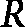

# 第三章：图表示学习

在解释了为什么将深度学习技术应用于图数据是值得的努力之后，让我们直接进入正题。在本章中，我们将向你介绍**图** **表示学习**。

首先，我们将从传统的（基于表格数据的）**机器学习**（**ML**）的角度来审视表示学习，然后将这一思想扩展到图数据领域。接下来，我们将讨论在尝试学习图数据中的特征时需要解决的初步挑战。随后，你将了解几种简单的图表示学习算法，即**Node2Vec**和**DeepWalk**，并理解它们之间的差异。最后，我们将讨论这类**浅层编码**技术的局限性，以及为什么我们需要更强大的算法来捕捉图中的复杂关系。

我们还将介绍相关算法的 Python 实现。我们将选择 Python 作为编程语言，并主要使用**PyTorch Geometric**（**PyG**）库来实现我们的算法。其他库也很流行（例如**Tensorflow-图神经网络（GNNs）**），但 PyG 在本文写作时似乎是行业中最为成熟的。

在本章中，我们将涵盖以下主题：

+   表示学习——它是什么？

+   图表示学习

+   图学习框架

+   DeepWalk

+   Node2Vec

+   浅层编码的局限性

# 表示学习——它是什么？

现代与机器学习（ML）相关的任务和实验已经形成了一个标准化的工作流管道。以下是步骤的快速简化概述：

1.  将业务/领域特定的问题转化为机器学习问题（监督学习或无监督学习，正在优化的度量标准，度量的基准水平等等）。

1.  获取数据。

1.  善待数据（通过基于现有列引入新列、填补缺失值等方式）。

1.  在数据上训练一个机器学习模型，并在测试集上评估其性能。通过新的模型迭代这一步骤，直到达到令人满意的性能。

这份清单中最重要且最耗时的步骤之一是决定如何从现有的列中创建新列，以增加数据中指定的知识。

要理解这一点，我们先来了解一下什么是数据集。在数据集中，一行实际上只是一个事件的记录。行中的不同列（特征）代表了不同的变量（或维度、指标等），这些变量的值是在该事件中记录下来的。现在，为了让机器学习模型学习有用的信息，数据集中必须记录那些主要的*有用*特征的值。当我们称某些特征为有用时，指的是当这些特征的值发生变化时，会显著改变事件的整体结果。

让我们通过一个例子来理解这个问题。在**自然语言处理**（**NLP**）领域，一个极其流行的问题是预测给定前面几个单词后，下一个单词会是什么。我们不会深入探讨这个问题，而是集中在几个已经做出不同特征选择的场景上。这里的不同特征基本上就是前面的几个单词：

```py
Feature_1 (F1): The last word of the unfinished sentence.
Feature_2 (F2): The 2nd last word of the unfinished sentence.
Feature_3 (F3): The 3rd last word of the unfinished sentence.
… and so on.
```

以以下未完成的句子为例：

*As the sun set over the horizon, the mountains cast* *elongated ___.*

特征（以及给定训练数据集下的期望单词）如下所示：

| F11 | F10 | F9 | F8 | F7 | F6 | F5 | F4 | F3 | F2 | F1 | P |
| --- | --- | --- | --- | --- | --- | --- | --- | --- | --- | --- | --- |
| As | the | sun | set | over | the | horizon | the | mountains | cast | elongated | shadows |

表 3.1 – 用于预测下一个单词的特征

通过理解什么是特征，我们来看一下可以作为*合格特征*用于模型训练的不同特征子集。让我们看三个不同的案例：

```py
Case 1: All features with a lookback window of 10.
{F1, F2, F3, …, F8, F9, F10}
Case 2: The 10th last word to the 5th last word
{F5, F6, F7, F8, F9, F10}
Case 3: All even positioned last words till the 10th position
{F2, F4, F6, F8, F10}
```

在这个实例中，我们有以下训练集（括号中的单词表示模型需要预测的单词）：

```py
R1: As the sun set over the horizon, the sky turned a fiery (orange).
R2: As the sun set over the horizon, the clouds glowed with a golden (hue).
R3: As the sun set over the horizon, the ocean shimmered with reflected (light).
R4: As the sun set over the horizon, the landscape transformed into a (silhouette).
```

现在，让我们看看一旦对三个使用案例执行特征转换后，数据集会是什么样子。

这是*案例 1*：

| R | F10 | F9 | F8 | F7 | F6 | F5 | F4 | F3 | F2 | F1 |
| --- | --- | --- | --- | --- | --- | --- | --- | --- | --- | --- |
| R1 | sun | set | over | the | horizon | the | sky | turned | a | fiery |
| R2 | set | over | the | horizon | the | clouds | glowed | with | a | golden |
| R3 | sun | set | over | the | horizon | the | ocean | shimmed | with | reflected |
| R4 | sun | set | over | the | horizon | the | landscape | transformed | into | a |

表 3.2 – 使用 10 的回看窗口的特征（案例 1）

这是*案例 2*：

| R | F10 | F9 | F8 | F7 | F6 | F5 |
| --- | --- | --- | --- | --- | --- | --- |
| R1 | sun | set | over | the | horizon | the |
| R2 | set | over | the | horizon | the | clouds |
| R3 | sun | set | over | the | horizon | the |
| R4 | sun | set | over | the | horizon | the |

表 3.3 – 使用从倒数第 10 个到倒数第 5 个窗口的特征（案例 2）

最后，我们有*案例 3*：

| R | F10 | F8 | F6 | F4 | F2 |
| --- | --- | --- | --- | --- | --- |
| R1 | sun | over | horizon | sky | a |
| R2 | set | the | the | glowed | a |
| R3 | sun | over | horizon | ocean | with |
| R4 | sun | over | horizon | landscape | into |

表 3.4 – 使用偶数索引单词的特征（案例 3）

在哪个案例中，您认为模型会学到有用的东西？

*案例 1*，毫无疑问。这个例子可能很简单，但它展示了特征选择的决策如何深刻影响模型在整个流程中的表现。特征选择是一个步骤，它涉及从原始数据中挑选出有用的信息；这个步骤中的错误可能会带来灾难性的后果。

在理解了特征选择为何是重要的一步后，我们回到关于表示学习的讨论。表示学习几乎在机器学习的所有子领域中都可以遇到。

在图像领域，表示学习最初沿着传统统计方法的线路进行探索，例如**主成分分析**（ **PCA** ）。然而，考虑到要学习的数据是像素数据，或者等效地说，是一组浮点值的二维矩阵，研究了更适合该任务的其他想法。在这一领域最成功的想法是使用**卷积滤波器**从数据矩阵中提取有意义的模式。这是现代图像处理中大部分机器学习任务的基础驱动力。**卷积神经网络**（ **CNN** ）的初始层依赖于找到合适值的滤波器，以便在通过图像时从中提取有意义的模式。

在自然语言领域，特征学习的关键突破是理解每个标记与其前一个标记的依赖关系。需要制定一种表示，该表示在我们通过每个标记时进行学习，同时保持到目前为止所学知识的状态。**循环神经网络**（ **RNNs** ）保持了记忆的概念，其中，随着标记的顺序传递，内存向量基于内存状态和新标记进行更新。其他架构，如**长短期记忆**（ **LSTM** ），改进了 RNN 模型，以支持更长范围的依赖关系和标记之间的交互。其他传统方法包括算法如**GloVe**和**Word2Vec**，它们属于浅层变体。

在表格数据中，有几种经过验证的特征操作方法可用于去噪和从数据中提取有意义的信息。常见的降维方法如 PCA 和**编码器-解码器网络**在工业中证明了它们的有效性。使用矩阵分解方法处理不完整和稀疏的交互矩阵，以生成嵌入向量已成为构建面向业务的技术（如搜索和推荐引擎）的非常有效的第一步。

在表示学习领域的创新列表是无穷无尽的。关键是，表示学习与所解决问题的领域密切相关。实际上，这是一种引导算法的方式，使其使用更有效的技术而不是通用架构，并且不利用其试图学习的底层数据的不变模式。

# 图表示学习

在前一部分，我们讨论了在不同类型数据（如图像、表格和文本）上进行表示学习的必要性。在这一部分，我们将尝试将这一思路扩展到图数据上。从理论上讲，图数据比我们迄今为止处理过的所有其他数据表示方法（如图像的矩阵、文本的词令和表格）更具表达力。随着表达能力的增强，挑战也随之而来，如何找到一种表示框架，以捕获相关信息，尽管数据表示本身施加的约束较少。文本中的词语是顺序的，图像中的像素以二维矩阵形式表示，而表格数据假设行之间是独立的（大多数情况下）。

数据中固有的这种模式使我们在表示学习阶段可以加以利用（想想词的 skip-grams 或图像的卷积滤波器）。然而，图中的约束非常松散——实际上松散到没有明显的模式可供利用。图数据相比其他形式的数据，提出了两个主要挑战：

+   **计算成本增加**：表示学习的目标之一是输出能使模型学习更明显模式的特征。如在《*第一章*》中讨论的那样，图中有几个有用的特性可以利用，从而进行快速推理。理解两个节点之间的最短路径是一个可以添加到表示中的有用特征，但计算这个最短路径平均需要![<mml:math  ><mml:mi>O</mml:mi><mml:mo>(</mml:mo><mml:mo>|</mml:mo><mml:msup><mml:mrow><mml:mi>V</mml:mi><mml:mo>|</mml:mo></mml:mrow><mml:mrow><mml:mn>2</mml:mn></mml:mrow></mml:msup><mml:mo>)</mml:mo></mml:math>时间。使用传统技术进行模式挖掘，在我们尝试将机器学习应用于图数据时是一个很困难的过程。

+   **以分布式方式攻击问题很难**：现代机器学习管道之所以高效，是因为它们能够随着数据量的增长而水平扩展。图像、文本和表格数据的传统数据表示方法，由于数据元素间本身的独立性，可以很容易地进行并行处理。而图数据很难拆分成独立的小块，每一块之间没有相互依赖（本质上，这就是图划分）。这是最大的瓶颈，也是当前活跃的研究领域，旨在使基于图的机器学习解决方案能够应用于生产中的实际用例。一项相关的优秀资源是 Mu 等人于 2023 年发布的《*图神经网络与分布式图划分器和协调相遇*》[`www.sciencedirect.com/science/article/abs/pii/S0925231222011894`](https://www.sciencedirect.com/science/article/abs/pii/S0925231222011894)。

鉴于这些问题，人们很快意识到，传统的表示学习方法（虽然适用于其他类型的数据）对图数据并不适用。因此，必须采用一种针对图数据量身定制的新方法。尽管我们提到的关于图数据与传统数据在表示学习中的问题存在差异，图表示学习在某些目标上与其他领域的表示学习保持部分共性。图表示学习的目标包括找到一种表示机制，能够减少真实数据中的噪音，并突出图中存在的模式。表示空间还需要对现代机器学习算法友好，以便轻松计算梯度和标量积。

考虑到所有这些目标和约束，图表示学习试图找到一种变换，使得以下两个目标得以实现：

+   **表示捕捉节点之间的关系**。如果两个节点通过一条边连接，这两个节点的表示之间的距离应该很小。这个概念也应该适用于更高阶的情况。因此，如果一个子图是密集连接的，该子图的节点表示在表示空间中也应该形成一个密集的簇。

+   **表示被优化，以便能够解决所面临的推理问题**。流行的图问题包括节点分类、链接预测和重要节点识别。如果没有这个目标，图表示将过于通用，无法解决那些能带来商业提升的有趣问题。

总结来说，图表示学习涉及为图中的每个节点找到嵌入（或向量），以便捕捉图结构和与推理问题相关的重要信息。这个目标通常被称为重建约束，在该领域中，给定节点嵌入，你可以在某种程度上重建图数据。在我们深入探讨各种图表示学习方法之前，有两个问题需要澄清：

+   图数据通常不仅仅是一个*节点*（*V*）和*边*（*E*）的集合。通常，所有的节点（以及可能的边）都包含附加信息，即使用额外的字段来描述节点和边的性质。现代的表示方法也必须有办法将这些信息融入到嵌入中，因为它们在推理任务中往往至关重要。

+   图表示学习是图学习中的一个普遍步骤。与传统的机器学习方法一样，一些方法包括独立的步骤，先学习表示嵌入，然后学习用于推断的模型。其他方法将这两个步骤结合在一起，其中嵌入步骤由负责输出推断结果的模型内部处理。在图学习的世界里，同样的两种方法适用。

现在，让我们深入探讨一些图表示学习的方法。图表示学习已经有了大量的研究工作，不同的方法尝试解决问题的不同方面。在不深入探讨这一领域算法的时间顺序发展的情况下，我们将讨论当前行业中最相关的方法。所有方法可以分为两个概念：**浅层编码**和**深层编码**。

用一句话来解释区别，当只有节点嵌入的字段需要估计时，编码是*浅层的*；如果需要估计更多的参数，同时估计节点嵌入字段，那么这种编码方法就叫做*深层*编码。

本章的剩余部分将主要集中于图表示学习中最流行的浅层编码算法：DeepWalk 和 Node2Vec。在接下来的章节中提到的不同 GNN 架构是深层编码技术的例子。

# 图学习框架

如果我们从整体上看待图上学习推断模型的方法，我们会注意到一个模式。每个解决方案可以分为三个不同的步骤：

1.  第一步涉及提出一种机制，给定图中的一个节点，找到一个**局部子图**。这个术语在此需要定义。例如，包含与目标节点的边直接相连的所有节点的图可以被视为局部子图。另一个例子是与目标节点有一度或二度连接的节点集合。这个局部子图在学术文献中通常被称为目标节点的感受野。

1.  第二步涉及一种机制，它从目标节点及其感受野中获取输入，并输出节点嵌入。节点嵌入只是某一维度的实值向量。重要的是要在该度量空间中定义相似性度量。两个向量之间的低相似度得分表明它们在该空间中彼此接近。

1.  最后一步是定义学习目标。学习目标是一个函数，旨在模拟需要优化的学习节点嵌入。这可能涉及尝试模拟图的结构，其中如果节点之间有边连接，它们的嵌入会更相似。或者，这也可能涉及一些图推断任务，比如优化嵌入，以便节点可以被正确分类。

在你浏览本书的剩余部分时，应该始终牢记这个框架。接下来的几个章节中将概述几种算法和学习模型，你应该时刻关注如何将算法的不同组成部分与这个框架相符合。在掌握这些知识的基础上，我们来看看 DeepWalk 算法及其变种。

# DeepWalk

DeepWalk 是一种学习技术，属于必须在图上执行随机游走以寻找最佳嵌入的算法子类别。为了理解基于随机游走的学习技术，我们需要回顾并从上一部分的内容继续。记住，这项工作的目标是为图中的每个节点生成一个嵌入，以便只有在节点在图中也非常相似的情况下，它们在向量空间中的嵌入才会非常相似。

为了实现这个目标，我们必须定义在向量空间和图中的*相似*是什么意思。向量空间中的相似度通常使用余弦相似度函数来定义（当然也可以使用其他相似度函数，如 L1 相似度，但对于图的应用，余弦相似度仍然是最流行的）。我们从定义余弦相似度开始。

假设我们有两个节点的嵌入， 和 ：


在这种情况下，余弦相似度函数，![<mml:math  ><mml:mi>C</mml:mi><mml:mi>o</mml:mi><mml:mi>s</mml:mi><mml:mfenced separators="|"><mml:mrow><mml:msub><mml:mrow><mml:mi>v</mml:mi></mml:mrow><mml:mrow><mml:msub><mml:mrow><mml:mi>n</mml:mi></mml:mrow><mml:mrow><mml:mn>1</mml:mn></mml:mrow></mml:msub></mml:mrow></mml:msub><mml:mo>,</mml:mo><mml:mi> </mml:mi><mml:msub><mml:mrow><mml:mi>v</mml:mi></mml:mrow><mml:mrow><mml:msub><mml:mrow><mml:mi>n</mml:mi></mml:mrow><mml:mrow><mml:mn>2</mml:mn></mml:mrow></mml:msub></mml:mrow></mml:msub></mml:mrow></mml:mfenced></mml:math>](img/87.png) 定义如下：

![<math  display="block"><mrow><mrow><mi>cos</mi><mfenced open="(" close=")"><mrow><msub><mi>v</mi><msub><mi>n</mi><mn>1</mn></msub></msub><mo>,</mo><msub><mi>v</mi><msub><mi>n</mi><mn>2</mn></msub></msub></mrow></mfenced><mo>=</mo><mfrac><mrow><mo>(</mo><msub><mi>x</mi><mn>1</mn></msub><mo>.</mo><msub><mi>y</mi><mn>1</mn></msub><mo>+</mo><msub><mi>x</mi><mn>2</mn></msub><mo>.</mo><msub><mi>y</mi><mn>2</mn></msub><mo>+</mo><msub><mi>x</mi><mn>3</mn></msub><mo>.</mo><msub><mi>y</mi><mn>3</mn></msub><mo>+</mo><mo>…</mo><mo>+</mo><msub><mi>x</mi><mi>d</mi></msub><mo>.</mo><msub><mi>y</mi><mi>d</mi></sub></mrow><msqrt><mrow><mfenced open="(" close=")"><mrow><msubsup><mi>x</mi><mn>1</mn><mn>2</mn></msubsup><mo>+</mo><msubsup><mi>x</mi><mn>2</mn><mn>2</mn></msubsup><mo>+</mo><mo>…</mo><mo>+</mo><msubsup><mi>x</mi><mi>d</mi><mn>2</mn></msubsup></mrow></mfenced><mo>(</mo><msubsup><mi>y</mi><mn>1</mn><mn>2</mn></msubsup><mo>+</mo><msubsup><mi>y</mi><mn>2</mn><mn>2</mn></msubsup><mo>+</mo><mo>…</mo><mo>+</mo><msubsup><mi>y</mi><mi>d</mi><mn>2</mn></msubsup><mo>)</mo></mrow></msqrt></mfrac></mrow></mrow></math>](img/88.png)

解释在机器学习领域已经有了广泛的研究，因此这里没有展开详细说明。简而言之，余弦相似度可以看作是两个向量在向量空间中方向相似度的得分。指向几乎相同方向的向量会有接近 1 的余弦相似度得分，而互相垂直的两个向量则会有接近 0 的得分。

容易的部分是定义嵌入之间的相似度得分。现在，我们需要为图中的节点之间定义一个相似度得分。

## 随机游走 – 它是什么，为什么要这样做

我们如何定义图中两个节点之间的相似度？是否可以简单地说，如果它们通过边直接连接，则赋值为 1；如果它们没有直接连接，但有共同的邻居，则赋值为共同邻居的自然对数；如果不满足这两个条件，则赋值为 0。

可以投入很多思考来找到两个节点之间相似性的最佳定义，你可以想象这个定义需要接近图的一个关键结构特性。所有试图定义节点间相似度的启发式方法都有其优缺点。然而，我们可以实现一个简单且数学上优雅的想法：**随机游走**。

随机游走的概念是相当直观的。该算法用于在图中找到某个节点的邻域，假设是。根据某种策略，假设是（我们稍后会解释策略的含义），我们尝试找到那些属于邻域的元素；这里，邻域是。以下步骤解释了该算法：

1.  从开始，我们通过策略来决定（带有一定的随机性）应该跳到与相连接的哪个节点。我们将该节点称为。将添加到集合中。

1.  重复*步骤 1*，但从开始，而不是。策略的输出将是，并将其添加到中。重复此过程，直到你的集合中有足够的条目为止。

就这样！我们几乎完成了算法中的随机游走步骤。在我们考虑随机游走如何生成邻域之前，先来讨论一下策略。该策略，，决定了我们应该从前一个节点跳到哪个节点。最简单的策略是随机选择，在所有连接的节点中，你以与其他节点相同的概率随机选择一个节点。也可以采用其他策略，例如，可以对未访问过的节点给予更多偏向，而不是反复将相同的节点添加到邻域中。不同策略的选择通常是此类浅层嵌入学习算法之间的区分因素。

为什么是随机游走？随机游走是一种有效采样图中重要特征的好方法。首先，如果我们注意到某个节点在另一个节点的随机游走邻域中出现的概率很高，我们可能会得出它们应该非常相似的结论。这样的技术不依赖于复杂的启发式方法，而这些方法通常受限于连接的度数。基于随机游走的采样不需要担心连接度数，就能在统计层面上找出最适合成为邻域一部分的候选节点。其次，它是一种快速高效的采样方式。训练步骤不需要评估图中所有的节点，只需要关注邻域中的节点。

在下一小节中，我们将基于对随机游走的理解，提出一种估计嵌入分量的方法。

## 节点嵌入的估计

现在我们已经了解了节点的邻域集合 ，针对节点 ，让我们理解它如何与学习节点嵌入的任务相关。回想一下，在我们开始讨论随机游走之前，我们关注的子问题是找到一种方法来估计图中两个节点的相似性。为图中的节点提出相似性函数是一项艰巨的任务，但我们能否对这个相似性分数做出一些有指导性的假设呢？

一个重要的假设可能如下：“*当两个节点相似时，一个节点很可能位于另一个节点的邻域内。*” 如果我们假设这个说法是正确的，那么我们几乎解决了问题。现在，我们可以利用这个假设来得出节点的嵌入。无需深入探讨概率魔法（例如似然函数等），这个想法的关键是，如果在图空间中这个假设成立，那么在定义嵌入的向量空间中它也必须成立。如果是这样的话，我们需要找到嵌入空间，使得当一个节点位于另一个节点的邻域内时，似然函数能够最大化。

所以，如果  是节点  的嵌入向量，我们可以找到  的分量，以便最大化以下值：


概率的负对数是对数似然函数的一种形式。现在，由于这必须在所有节点及其嵌入中都成立，我们必须在考虑所有节点的同时优化这些分量，本质上是最大化：

![<math  display="block"><mrow><mrow><mi>L</mi><mo>=</mo><mrow><munder><mo>∑</mo><mrow><mi>v</mi><mo>∈</mo><mi>V</mi></mrow></munder><msub><mi>L</mi><mi>v</mi></msub></mrow><mo>=</mo><mrow><munder><mo>∑</mo><mrow><mi>v</mi><mo>∈</mo><mi>V</mi></mrow></munder><mrow><munder><mo>∑</mo><mrow><mi>u</mi><mo>∈</mo><msub><mi>N</mi><mi>R</mi></msub><mfenced open="(" close=")"><mi>v</mi></mfenced></mrow></munder><mrow><mo>−</mo><mo>(</mo><mi mathvariant="normal">l</mi><mi mathvariant="normal">o</mi><mi mathvariant="normal">g</mi><mo>(</mo><mi>P</mi><mo>(</mo><mi>u</mi><mo>|</mo><msub><mi>z</mi><mi>v</mi></msub><mo>)</mo><mo>)</mo></mrow></mrow></mrow></mrow></mrow></math>](img/110.png)

最后的步骤是将概率函数与我们之前定义的相似度函数联系起来。在嵌入空间内创建概率分布的一种常见方法是使用**softmax**函数，它将一个函数转换为概率密度函数：

![<math  display="block"><mrow><mrow><mi>P</mi><mfenced open="(" close=")"><mrow><msub><mi>z</mi><mi>u</msub><mo>|</mo><msub><mi>z</mi><mi>v</mi></msub></mrow></mfenced><mo>=</mo><mi>s</mi><mi>o</mi><mi>f</mi><mi>t</mi><mi>m</mi><mi>a</mi><mi>x</mi><mfenced open="(" close=")"><mrow><mi>s</mi><mi>i</mi><mi>m</mi><mfenced open="(" close=")"><mrow><msub><mi>z</mi><mi>u</msub><mo>,</mo><msub><mi>z</mi><mi>v</mi></msub></mrow></mfenced></mrow></mfenced><mo>=</mo><mfrac><mrow><mi mathvariant="normal">e</mi><mi mathvariant="normal">x</mi><mi mathvariant="normal">p</mi><mo>(</mo><mi>s</mi><mi>i</mi><mi>m</mi><mfenced open="(" close=")"><mrow><msub><mi>z</mi><mi>u</mi></msub><mo>,</mo><msub><mi>z</mi><mi>v</mi></msub></mrow></mfenced><mo>)</mo></mrow><mrow><msub><mo>∑</mo><mrow><mi>u</mi><mo>∈</mo><mi>V</mi></mrow></msub><mrow><mi mathvariant="normal">e</mi><mi mathvariant="normal">x</mi><mi mathvariant="normal">p</mi><mo>(</mo><mi>s</mi><mi>i</mi><mi>m</mi><mfenced open="(" close=")"><mrow><msub><mi>z</mi><mi>u</mi></msub><mo>,</mo><msub><mi>z</mi><mi>v</mi></msub></mrow></mfenced><mo>)</mo></mrow></mrow></mfrac></mrow></mrow></math>](img/111.png)

这里， 是我们之前定义的余弦相似度函数。通过将这个定义代入到我们的优化度量中，我们得到了需要优化的损失函数的最终参数化形式：

![<math  display="block"><mrow><mrow><mi>L</mi><mo>=</mo><mrow><munder><mo>∑</mo><mrow><mi>v</mi><mo>∈</mo><mi>V</mi></mrow></munder><mrow><munder><mo>∑</mo><mrow><mi>u</mi><mo>∈</mo><msub><mi>N</mi><mi>R</mi></msub><mfenced open="(" close=")"><mi>v</mi></mfenced></mrow></munder><mrow><mo>−</mo><mo>(</mo><mi mathvariant="normal">l</mi><mi mathvariant="normal">o</mi><mi mathvariant="normal">g</mi><mo>(</mo><mfrac><mrow><mi mathvariant="normal">e</mi><mi mathvariant="normal">x</mi><mi mathvariant="normal">p</mi><mo>(</mo><mi>s</mi><mi>i</mi><mi>m</mi><mfenced open="(" close=")"><mrow><msub><mi>z</mi><mi>u</mi></msub><mo>,</mo><msub><mi>z</mi><mi>v</mi></msub></mrow></mfenced><mo>)</mo></mrow><mrow><msub><mo>∑</mo><mrow><mi>u</mi><mo>∈</mo><mi>V</mi></mrow></msub><mrow><mi mathvariant="normal">e</mi><mi mathvariant="normal">x</mi><mi mathvariant="normal">p</mi><mo>(</mo><mi>s</mi><mi>i</mi><mi>m</mi><mfenced open="(" close=")"><mrow><msub><mi>z</mi><mi>u</mi></msub><mo>,</mo><msub><mi>z</mi><mi>v</mi></msub></mrow></mfenced><mo>)</mo></mrow></mrow></mfrac><mo>)</mo></mrow></mrow></mrow></mrow></mrow></math>](img/113.png)

使用梯度下降法，我们将找到嵌入，，以使得最大化。这将确保我们找到符合我们标准的嵌入。

请注意，优化过程还有其他一些步骤，使得该过程在计算上可行，其中最重要的一步是负采样的概念。在这里，我们并不是在每次迭代中计算**softmax**函数对所有节点的归一化组件（分母），而是随机选取一些不在目标节点邻域中的节点，并计算它们的总和。这种优化问题被称为**噪声对比估计**，它是 NLP 学习任务中的一种常见技术。它通常被称为**跳字模型**。

在我们结束这一部分时，也许是时候提一下，前述的完整算法被称为*DeepWalk*，正如原始论文中所述，该论文于 2014 年发布（[`dl.acm.org/doi/10.1145/2623330.2623732`](https://dl.acm.org/doi/10.1145/2623330.2623732)）。DeepWalk 算法是一个高效的浅层编码估计过程。然而，这种方法的简洁性也是其主要缺点之一：随机无偏的随机游走策略常常会偏离目标节点太远，因此它会采样到与目标节点不太局部的邻域。因此，嵌入表示并没有基于节点的最局部信息进行优化。其他一些算法在本文的工作基础上进行了改进。我们将在下一节讨论一个这样的显著改进，称为*Node2Vec*。

下面是 DeepWalk 的伪代码：

```py
function DeepWalk(Graph G, walk_length L, num_walks R, dimensions d):
    Initialize walks = []
    for each node v in G:
        for i = 1 to R:
            walk = RandomWalk(G, v, L)
            append walk to walks
    model = Word2Vec(walks, dimensions=d)
    return model
function RandomWalk(Graph G, start_node v, length L):
    walk = [v]
    for i = 1 to L:
        neighbors = GetNeighbors(G, v)
        next_node = RandomChoice(neighbors)
        append next_node to walk
        v = next_node
    return walk
```

上述伪代码概述了两个主要功能：

+   首先，**DeepWalk**为图中的每个节点生成多个随机游走，并使用 Word2Vec 创建嵌入表示。

+   其次，**RandomWalk**执行一次从给定节点出发、指定长度的随机游走。

# Node2Vec

DeepWalk 算法使用无偏的随机化游走来生成任何目标节点的邻域。其无偏的特性确保了图结构以统计上最佳的方式被捕捉，但在实际应用中，这通常并不是最优的选择。Node2Vec 的前提是，我们在随机游走策略中引入偏差，确保采样以一种方式进行，使得图的局部和全局结构都能在邻域中得到体现。Node2Vec 中的大多数其他概念与 DeepWalk 相同，包括学习目标和优化步骤。

在我们深入探讨算法的细节之前，让我们快速回顾一下图遍历方法。

## 图遍历方法

正如我们在*第一章* 中简要介绍的，图遍历的两种最常见方法是**广度优先搜索** (**BFS**) 和 **深度优先搜索** (**DFS**)。BFS 是图探索中的局部优先方法，在这个方法中，从一个起始节点出发，首先会探索所有一度连接，再远离起始节点进行探索。DFS 则采取全局优先的图探索方法，其重点是在到达叶子节点后回溯之前尽可能深入地探索图。DeepWalk 算法中使用的随机游走策略在统计学上更接近 DFS 方法，而不是 BFS 方法，这就是为什么邻域中的局部结构被低估的原因。

*随机游走策略如何模拟 BFS* *和 DFS？*

首先，让我们考虑 DFS 的情况。在随机游走过程中，当当前节点是某个节点时，我们有两个选择：访问上一个访问过的节点，或者访问另一个节点。如果我们能确保当当前节点没有其他连接节点时，才发生第一个选择，那么我们可以确保随机游走遵循 DFS 遍历。

为了让随机游走模拟 BFS，需要更多的考虑。首先，随机游走的实体需要跟踪上一步来自哪个节点。从当前节点出发，我们有三种选择：回到上一个节点，去一个比上一个节点更远的节点，或者去一个与当前节点等距的节点。如果我们最小化第二种选择的发生概率，就可以有效地实现 BFS 遍历。

所以，我们可以在随机游走算法中加入偏差，以模拟 BFS 和 DFS 的遍历模式。有了这些知识，我们可以对随机游走进行更精细的控制，使得邻域包含我们感兴趣的局部结构和全局结构的表示。

## 完善随机游走策略

让我们正式化之前提到的策略。为此，我们将使用两个超参数：**p** 和 **q**。第一个超参数 **p** 与决定随机游走是否会回到上一步所经过节点的权重相关。第二个超参数 **q** 决定随机游走是否有可能去更远的节点，或者是否会偏向于此。它也可以被理解为一个参数，用来决定 BFS 策略相对于 DFS 策略的偏好程度。*图 3.1* 中的例子可以帮助说明这一点：


图 3.1 – 展示 Node2Vec 超参数效果的小图

看看这个图。在这里，随机游走在上一步从节点**n** L 迁移到了**n**。在当前步骤，它需要决定应该迁移到哪个节点，选择的节点有**n** 1 、**n** 2 或**n** L。下一步的迁移概率由超参数**p**和**q**决定。假设**c**是迁移到**n** 1 的概率。那么，迁移到**n** L 的概率是**c/p**，而迁移到**n** 2 的概率是**c/q**。在这里，**c**应该是使得所有概率的总和为 1 的值。

为了澄清这一点，概率值之所以是这样，是因为每个节点所代表的含义；**n** L 是上次访问的节点，因此它的访问会额外加权**p**值。在这里，**n** 1 是 BFS 选项，因为它与**n** L 的距离与**n**的距离相同，而**n** 2 是 DFS 选项，因为它距离**n** L 更远。这就是它们访问比例是**q**的原因。

通过这种为每一步邻域创建赋予偏差的策略，我们可以确保邻域既包括与目标节点的局部上下文相关的节点，也包括与其全局上下文相关的节点。请注意，这种随机游走策略被称为二阶随机游走策略，因为我们需要保持一个状态——即，知道从哪个状态开始走的。

这是 Node2Vec 的伪代码：

```py
function Node2Vec(Graph G, walk_length L, num_walks R, dimensions d, p, q):
    Initialize walks = []
    for each node v in G:
        for i = 1 to R:
            walk = BiasedRandomWalk(G, v, L, p, q)
            append walk to walks
    model = Word2Vec(walks, dimensions=d)
    return model
function BiasedRandomWalk(Graph G, start_node v, length L, p, q):
    walk = [v]
    for i = 1 to L:
        current = walk[-1]
        previous = walk[-2] if len(walk) > 1 else None
        next_node = SampleNextNode(G, current, previous, p, q)
        append next_node to walk
    return walk
```

Node2Vec 通过引入受**p**和**q**参数控制的有偏随机游走来扩展 DeepWalk。**BiasedRandomWalk**函数使用这些参数来平衡探索局部邻域（**q**）和到达更远节点（**p**）之间的关系，从而实现更灵活的图结构探索。

## Node2Vec 与 DeepWalk

接下来的步骤与 DeepWalk 中提到的步骤相同。我们尝试最大化目标节点邻域中嵌入的节点与目标节点之间的相似度。这个优化步骤在所有节点上执行时，可以为我们提供最优的嵌入。与 DeepWalk 的不同之处在于，嵌入的优化目标不同。在 DeepWalk 中，节点的邻居选择与 Node2Vec 情境中的选择不同。

到此为止，我们已经覆盖了两种最流行的浅层图表示学习算法。我们已经了解了 DeepWalk 和 Node2Vec 这两种相似的算法如何优雅地使用随机游走方法生成浅层节点嵌入。然而，我们也需要理解这种方法的局限性，因为这些限制将为本书后续讨论的主题提供动机。

# 浅层编码的局限性

浅层嵌入的优点是易于理解且相对容易实现。然而，它们也有几个缺点，尤其是与深度编码技术相比：

+   **这种方法无法结合节点或边级别的特征**。在使用图数据时，通常会附加辅助信息到每个节点或每条边上，以描述进一步的属性。默认情况下，随机游走方法无法将这些信息融入其嵌入中。

+   **它们可能在计算上非常昂贵**。为什么？如果我们对某一维度的嵌入感兴趣，**d**，且节点数为**v**，那么我们需要学习总共**v.d**个值。具有隐藏层的深度方法可能会有更少的参数需要学习，从而使得过程在计算上更为高效。

+   从前面的内容出发，由于在这种方法中需要学习的参数非常多，**我们通常无法利用通过使表示更加密集所带来的优势**。更密集的表示（使用更少的参数）通常能减少学习到的噪声。显然，低于某一最小阈值时，参数的数量将过少，无法有效地表示正在学习的图数据的复杂性。

+   最后，**浅层编码的学习方法没有提供将图推断任务融入学习问题中的功能**。这些嵌入是基于图结构学习的，旨在用于一般用途，而不是针对特定的推断任务进行优化。

许多这些局限性可以通过更为复杂的架构来克服，这些架构经过优化，可以学习节点嵌入。

# 摘要

在本章中，我们介绍了图表示学习，这是使用机器学习处理图数据领域的一个基本概念。首先，我们讨论了表示学习在机器学习中的一般意义。当专注于图时，你了解到表示学习的主要目标是找到能够模拟图结构的嵌入，并学习执行推断任务所必需的关键概念（如果有的话）。

我们还探讨了 DeepWalk 和 Node2Vec，这两种流行的图表示学习方法，它们是一类利用随机游走生成节点邻域的算法。基于这个邻域，你可以优化嵌入值，使得邻域中节点的嵌入与相关节点的嵌入高度相似。最后，我们探讨了在实际应用中使用这些方法的缺点。

在下一章中，我们将专注于最流行的深度学习架构，这些架构可以用于学习图节点的嵌入。你将学习这些架构如何利用图中的模式，同时保持图数据中的不变性。

# 第二部分：高级图学习技术

本书的这一部分将探索图形学习中的高级概念，包括图形的深度学习架构、该领域的常见挑战以及大型语言模型的整合。你将了解图形人工智能系统中的最前沿方法、技术挑战和新兴解决方案。

本部分包含以下章节：

+   *第四章*，*图形的深度学习模型*

+   *第五章*，*图形深度学习挑战*

+   *第六章*，*利用大型语言模型进行图形学习*
