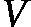
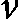

# 第四章：图的深度学习模型

近年来，随着**图神经网络**（**GNNs**）的出现，机器学习领域迎来了范式转变，GNN 成为了处理图结构数据预测任务的强大工具。在这里，我们将深入探讨 GNN 的变革潜力，强调其作为可优化变换的作用，能够处理多样的图属性，如节点、边缘和全局上下文，同时保持重要的图对称性，尤其是排列不变性。

GNN 的基础在于**信息传递神经网络**（**MPNN**）框架。通过该框架，GNN 利用一种复杂的机制，在图结构中进行信息交换和聚合，使得模型能够捕捉数据中的复杂关系和依赖性。

GNN 的一个显著特点是遵循*图输入，图输出*架构。这意味着模型接受一个图作为输入，该图包含嵌入在节点、边缘和全局上下文中的信息。这种固有的结构与许多现实世界的问题相吻合，数据通常展现出复杂的关系和依赖性，最适合通过图来表示。

GNN 的优势在于其能够在不改变图的连接性的情况下，对输入图执行逐步的嵌入变换。这一逐步变换确保了模型不断优化对数据中潜在模式和结构的理解，从而提升预测能力。

本章将涵盖以下主题：

+   图中的信息传递

+   解码 GNN

+   **图卷积网络**（**GCNs**）

+   **图采样与聚合**（**GraphSAGE**）

+   **图注意力网络**（**GATs**）

# 技术要求

本章要求读者具备图和表示学习的基本理解，这些内容已在前几章中讲解。章节中的代码以及 GitHub 上的代码可以直接在 Google Colab 上使用，只需额外安装**PyTorch Geometric**（**PyG**）包。书中的代码示例可以在其 GitHub 仓库中找到：[`github.com/PacktPublishing/Applied-Deep-Learning-on-Graphs`](https://github.com/PacktPublishing/Applied-Deep-Learning-on-Graphs)。

# 图中的信息传递

与传统的神经网络不同，GNN（图神经网络）需要考虑图的固有结构，使得节点能够交换信息并根据其局部邻域更新自身表示。这一核心机制是通过**信息传递**实现的，这是一个节点间迭代传递信息并聚合邻居信息的过程。

GNN 在图结构数据上进行操作，并使用信息传递机制基于邻居节点的信息更新节点表示。让我们深入探讨 GNN 中信息传递的数学解释。

考虑一个无向图  ，其中  是节点集合，，从其邻居收集信息。

    1.  令  表示节点  的邻居集合。

    节点  的聚合消息是通过聚合其邻居的信息计算得出的：

![<mml:math   display="block"><mml:msub><mml:mrow><mml:mi>m</mml:mi></mml:mrow><mml:mrow><mml:mi>v</mml:mi><mml:mi> </mml:mi></mml:mrow></mml:msub><mml:mo>=</mml:mo><mml:mi> </mml:mi><mml:mi>a</mml:mi><mml:mi>g</mml:mi><mml:mi>g</mml:mi><mml:mi>r</mml:mi><mml:mi>e</mml:mi><mml:mi>g</mml:mi><mml:mi>a</mml:mi><mml:mi>t</mml:mi><mml:mi>e</mml:mi><mml:mi> </mml:mi><mml:mfenced separators="|"><mml:mrow><mml:mfenced open="{" close="}" separators="|"><mml:mrow><mml:msub><mml:mrow><mml:mi>h</mml:mi></mml:mrow><mml:mrow><mml:mi>u</mml:mi><mml:mi> </mml:mi></mml:mrow></mml:msub><mml:mo>:</mml:mo><mml:mi> </mml:mi><mml:mi>u</mml:mi><mml:mi> </mml:mi><mml:mi>ϵ</mml:mi><mml:mi> </mml:mi><mml:mi>N</mml:mi><mml:mfenced separators="|"><mml:mrow><mml:mi>v</mml:mi></mml:mrow></mml:mfenced></mml:mrow></mml:mfenced></mml:mrow></mml:mfenced></mml:math>](img/129.png)

聚合函数可以有所不同（例如，求和、均值或注意力加权和）。

1.  **更新函数**：

    1.  基于聚合的消息  和当前节点表示 ，更新节点表示 。

    1.  **UPDATE** 函数  (  ) 是一个神经网络层，它将聚合的消息和当前节点表示作为输入，并生成更新后的表示：

 = 

**UPDATE** 函数通常涉及一个具有可学习参数的神经网络层。

这些步骤会迭代应用固定次数，或直到收敛，以细化节点表示。整个过程可以通过几个公式表达：

![<mml:math   display="block"><mml:msub><mml:mrow><mml:mi>m</mml:mi></mml:mrow><mml:mrow><mml:mi>v</mml:mi></mml:mrow></mml:msub><mml:mi> </mml:mi><mml:mo>=</mml:mo><mml:mi> </mml:mi><mml:mi>a</mml:mi><mml:mi>g</mml:mi><mml:mi>g</mml:mi><mml:mi>r</mml:mi><mml:mi>e</mml:mi><mml:mi>g</mml:mi><mml:mi>a</mml:mi><mml:mi>t</mml:mi><mml:mi>e</mml:mi><mml:mfenced separators="|"><mml:mrow><mml:msub><mml:mrow><mml:mi>h</mml:mi></mml:mrow><mml:mrow><mml:mi>u</mml:mi><mml:mi> </mml:mi></mml:mrow></mml:msub><mml:mo>:</mml:mo><mml:mi> </mml:mi><mml:mi>u</mml:mi><mml:mi> </mml:mi><mml:mo>∈</mml:mo><mml:mi> </mml:mi><mml:mi>N</mml:mi><mml:mfenced separators="|"><mml:mrow><mml:mi>v</mml:mi></mml:mrow></mml:mfenced></mml:mrow></mml:mfenced></mml:math>](img/137.png)

![<mml:math xmlns:mml="http://www.w3.org/1998/Math/MathML" xmlns:m="http://schemas.openxmlformats.org/officeDocument/2006/math" display="block"><mml:msubsup><mml:mrow><mml:mi>h</mml:mi></mml:mrow><mml:mrow><mml:mi>v</mml:mi></mml:mrow><mml:mrow><mml:mi>'</mml:mi></mml:mrow></mml:msubsup><mml:mi> </mml:mi><mml:mo>=</mml:mo><mml:mi> </mml:mi><mml:mi>u</mml:mi><mml:mi>p</mml:mi><mml:mi>d</mml:mi><mml:mi>a</mml:mi><mml:mi>t</mml:mi><mml:mi>e</mml:mi><mml:mfenced separators="|"><mml:mrow><mml:msub><mml:mrow><mml:mi>h</mml:mi></mml:mrow><mml:mrow><mml:mi>v</mml:mi><mml:mo>,</mml:mo><mml:mi> </mml:mi></mml:mrow></mml:msub><mml:msub><mml:mrow><mml:mi>m</mml:mi></mml:mrow><mml:mrow><mml:mi>v</mml:mi></mml:mrow></mml:msub></mml:mrow></mml:mfenced></mml:math>](img/138.png)

这些方程捕捉了图神经网络（GNN）中信息传递机制的本质。聚合函数、**更新**函数以及迭代次数的具体选择取决于 GNN 的架构（例如，GraphSAGE、GCN、**门控图神经网络**（**GGNNs**）等）。

例如，在一个简单的**GraphSAGE**公式中，聚合函数可能是均值操作，**更新**函数可能是一个简单的神经网络层：

![<mml:math   display="block"><mml:msub><mml:mrow><mml:mi>m</mml:mi></mml:mrow><mml:mrow><mml:mi>v</mml:mi><mml:mi> </mml:mi></mml:mrow></mml:msub><mml:mo>=</mml:mo><mml:mi> </mml:mi><mml:mfrac><mml:mrow><mml:mn>1</mml:mn></mml:mrow><mml:mrow><mml:mfenced open="|" close="|" separators="|"><mml:mrow><mml:mi>N</mml:mi><mml:mfenced separators="|"><mml:mrow><mml:mi>v</mml:mi></mml:mrow></mml:mfenced></mml:mrow></mml:mfenced></mml:mrow></mml:mfrac><mml:mrow><mml:munder><mml:mo stretchy="false">∑</mml:mo><mml:mrow><mml:msubsup><mml:mrow><mml:mi> </mml:mi></mml:mrow><mml:mrow><mml:mi>u</mml:mi><mml:mi> </mml:mi><mml:mi>ϵ</mml:mi><mml:mi> </mml:mi><mml:mi>N</mml:mi><mml:mfenced separators="|"><mml:mrow><mml:mi>v</mml:mi></mml:mrow></mml:mfenced></mml:mrow><mml:mrow><mml:mi> </mml:mi></mml:mrow></mml:msubsup></mml:mrow></mml:munder><mml:mrow><mml:msub><mml:mrow><mml:mi>h</mml:mi></mml:mrow><mml:mrow><mml:mi>u</mml:mi></mml:mrow></mml:msub></mml:mrow></mml:mrow></mml:math>](img/139.png)

![<mml:math xmlns:mml="http://www.w3.org/1998/Math/MathML" xmlns:m="http://schemas.openxmlformats.org/officeDocument/2006/math" display="block"><mml:msubsup><mml:mrow><mml:mi>h</mml:mi></mml:mrow><mml:mrow><mml:mi>v</mml:mi></mml:mrow><mml:mrow><mml:mi>'</mml:mi></mml:mrow></mml:msubsup><mml:mi> </mml:mi><mml:mo>=</mml:mo><mml:mi> </mml:mi><mml:mi>σ</mml:mi><mml:mi> </mml:mi><mml:mfenced separators="|"><mml:mrow><mml:mi>W</mml:mi><mml:mi> </mml:mi><mml:mo>⋅</mml:mo><mml:mi> </mml:mi><mml:mi>c</mml:mi><mml:mi>o</mml:mi><mml:mi>n</mml:mi><mml:mi>c</mml:mi><mml:mi>a</mml:mi><mml:mi>t</mml:mi><mml:mi> </mml:mi><mml:mfenced separators="|"><mml:mrow><mml:msub><mml:mrow><mml:mi>h</mml:mi></mml:mrow><mml:mrow><mml:mi>v</mml:mi></mml:mrow></mml:msub><mml:mi> </mml:mi><mml:mo>,</mml:mo><mml:mi> </mml:mi><mml:msub><mml:mrow><mml:mi>m</mml:mi></mml:mrow><mml:mrow><mml:mi>v</mml:mi></mml:mrow></mml:msub></mml:mrow></mml:mfenced></mml:mrow></mml:mfenced></mml:math>](img/140.png)

这里， 是一个激活函数， 是一个可学习的权重矩阵，而 是连接操作。


图 4.1 – 图中的信息传递

通过这些迭代步骤，信息传递使得节点能够学习到不仅仅是自身的内在特征，还能从其连接的邻居以及图的整体结构中获取信息。这使得 GNN 能够有效地建模图结构数据中的复杂关系和依赖。

现在，让我们尝试理解如何正式定义 GNN。

# 解码 GNN

**GNN** 是一种神经网络架构，旨在处理图结构数据。它学习一个函数，将图及其相关特征映射到一组节点级、边级或图级的输出。以下是 GNN 的正式数学定义。

给定一个图  ，其中  是节点集，![GNN 是一个函数 ![<mml:math xmlns:mml="http://www.w3.org/1998/Math/MathML" xmlns:m="http://schemas.openxmlformats.org/officeDocument/2006/math"><mml:msub><mml:mrow><mml:mi>f</mml:mi></mml:mrow><mml:mrow><mml:mi>θ</mml:mi></mml:mrow></mml:msub><mml:mi mathvariant="normal"> </mml:mi><mml:mo>:</mml:mo><mml:mi mathvariant="normal"> </mml:mi><mml:mi>G</mml:mi><mml:mo>×</mml:mo><mml:msup><mml:mrow><mml:mi mathvariant="double-struck">R</mml:mi></mml:mrow><mml:mrow><mml:mfenced open="|" close="|" separators="|"><mml:mrow><mml:mi>V</mml:mi></mml:mrow></mml:mfenced><mml:mo>×</mml:mo><mml:mi>d</mml:mi></mml:mrow></mml:msup><mml:mo>→</mml:mo><mml:msup><mml:mrow><mml:mi mathvariant="double-struck">R</mml:mi></mml:mrow><mml:mrow><mml:mfenced open="|" close="|" separators="|"><mml:mrow><mml:mi>V</mml:mi></mml:mrow></mml:mfenced><mml:mo>×</mml:mo><mml:msup><mml:mrow><mml:mi>d</mml:mi></mml:mrow><mml:mrow><mml:mi mathvariant="normal">'</mml:mi></mml:mrow></mml:msup></mml:mrow></mml:msup></mml:math>](img/150.png) ，由可学习权重  参数化，它将图  及其节点特征  映射到一组新的节点表示 ![<mml:math xmlns:mml="http://www.w3.org/1998/Math/MathML" xmlns:m="http://schemas.openxmlformats.org/officeDocument/2006/math"><mml:mi>H</mml:mi><mml:mi mathvariant="normal"> </mml:mi><mml:mo>∈</mml:mo><mml:mi mathvariant="normal"> </mml:mi><mml:msup><mml:mrow><mml:mi mathvariant="double-struck">R</mml:mi></mml:mrow><mml:mrow><mml:mfenced open="|" close="|" separators="|"><mml:mrow><mml:mi>V</mml:mi></mml:mrow></mml:mfenced><mml:mo>×</mml:mo><mml:msup><mml:mrow><mml:mi>d</mml:mi></mml:mrow><mml:mrow><mml:mi mathvariant="normal">'</mml:mi></mml:mrow></mml:msup></mml:mrow></mml:msup></mml:math>](img/154.png) ，其中  是输出节点表示的维度。

该函数  通过一系列的消息传递和聚合步骤计算，通常被组织为  层。在每一层  ，节点表示按照如下方式更新：

![<mml:math   display="block"><mml:msubsup><mml:mrow><mml:mi>h</mml:mi></mml:mrow><mml:mrow><mml:mi>v</mml:mi></mml:mrow><mml:mrow><mml:mi>l</mml:mi></mml:mrow></mml:msubsup><mml:mo>=</mml:mo><mml:mi mathvariant="normal"> </mml:mi><mml:mi>U</mml:mi><mml:mi>P</mml:mi><mml:mi>D</mml:mi><mml:mi>A</mml:mi><mml:mi>T</mml:mi><mml:msup><mml:mrow><mml:mi>E</mml:mi></mml:mrow><mml:mrow><mml:mfenced separators="|"><mml:mrow><mml:mi>l</mml:mi></mml:mrow></mml:mfenced></mml:mrow></mml:msup><mml:mfenced separators="|"><mml:mrow><mml:msubsup><mml:mrow><mml:mi>h</mml:mi></mml:mrow><mml:mrow><mml:mi>v</mml:mi></mml:mrow><mml:mrow><mml:mi>l</mml:mi><mml:mo>-</mml:mo><mml:mn>1</mml:mn></mml:mrow></mml:msubsup><mml:mo>,</mml:mo><mml:mi mathvariant="normal"> </mml:mi><mml:mi>A</mml:mi><mml:mi>G</mml:mi><mml:msup><mml:mrow><mml:mi>G</mml:mi></mml:mrow><mml:mrow><mml:mfenced separators="|"><mml:mrow><mml:mi>l</mml:mi></mml:mrow></mml:mfenced></mml:mrow></mml:msup><mml:mfenced separators="|"><mml:mrow><mml:mfenced open="{" close="}" separators="|"><mml:mrow><mml:msubsup><mml:mrow><mml:mi>h</mml:mi></mml:mrow><mml:mrow><mml:mi>u</mml:mi></mml:mrow><mml:mrow><mml:mi>l</mml:mi><mml:mo>-</mml:mo><mml:mn>1</mml:mn></mml:mrow></mml:msubsup><mml:mo>:</mml:mo><mml:mi mathvariant="normal"> </mml:mi><mml:mi>u</mml:mi><mml:mi mathvariant="normal"> </mml:mi><mml:mo>∈</mml:mo><mml:mi mathvariant="normal"> </mml:mi><mml:mi>N</mml:mi><mml:mfenced separators="|"><mml:mrow><mml:mi>v</mml:mi></mml:mrow></mml:mfenced></mml:mrow></mml:mfenced></mml:mrow></mml:mfenced></mml:math>](img/159.png)

让我们分解一下：

+    是第  节点在第  层的表示，且满足条件  。其中， 表示一个实值向量空间，维度为  。

+   **UPDATE 函数** ![<math ><mrow><mrow><mi>U</mi><mi>P</mi><mi>D</mi><mi>A</mi><mi>T</mi><msup><mi>E</mi><mi>l</mi></msup><mo>:</mo><mspace width="0.25em" /><msup><mi mathvariant="double-struck">R</mi><mfenced open="(" close=")"><msub><mi>d</mi><mrow><mi>l</mi><mo>−</mo><mn>1</mn></mrow></msub></mfenced></msup><mspace width="0.25em" /><mi mathvariant="normal">Χ</mi><mspace width="0.25em" /><msup><mi mathvariant="double-struck">R</mi><mrow><mfenced open="(" close=")"><msub><mi>d</mi><mi>l</mi></msub></mfenced><mspace width="0.25em" /></mrow></msup><mo>→</mo><mspace width="0.25em" /><mspace width="0.25em" /><msup><mi mathvariant="double-struck">R</mi><mrow><mfenced open="(" close=")"><msub><mi>d</mi><mi>l</mi></msub></mfenced><mspace width="0.25em" /></mrow></msup></mrow></mrow></math>](img/166.png) 是一个可学习的函数，通过基于节点先前的表示和从邻居聚合的消息来更新节点表示。

+   聚合（AGG）函数 ![<mml:math  ><mml:mi>A</mml:mi><mml:mi>G</mml:mi><mml:msup><mml:mrow><mml:mi>G</mml:mi></mml:mrow><mml:mrow><mml:mfenced separators="|"><mml:mrow><mml:mi>l</mml:mi></mml:mrow></mml:mfenced></mml:mrow></mml:msup><mml:mo>:</mml:mo><mml:msup><mml:mrow><mml:mi mathvariant="double-struck">R</mml:mi></mml:mrow><mml:mrow><mml:msub><mml:mrow><mml:mi>d</mml:mi></mml:mrow><mml:mrow><mml:mi>l</mml:mi><mml:mo>-</mml:mo><mml:mn>1</mml:mn></mml:mrow></mml:msub><mml:mi>*</mml:mi></mml:mrow></mml:msup><mml:mo>→</mml:mo><mml:mi> </mml:mi><mml:msup><mml:mrow><mml:mi mathvariant="double-struck">R</mml:mi></mml:mrow><mml:mrow><mml:msub><mml:mrow><mml:mi>d</mml:mi></mml:mrow><mml:mrow><mml:mi>l</mml:mi></mml:mrow></mml:msub></mml:mrow></mml:msup></mml:math>](img/167.png) 是一种置换不变的聚合函数，结合了相邻节点的表示。常见选择包括求和、平均值和最大值。

+    表示图  中节点  的邻居集合。

在  层消息传递和聚合之后，最终的节点表示由  代表所有  。

更新函数通常实现为神经网络，如多层感知器（MLPs）或注意机制，具有可学习参数。

对于图级任务，会应用一个 READOUT 函数来获取最终的节点表示以获得图级表示：

![<mml:math   display="block"><mml:msub><mml:mrow><mml:mi>h</mml:mi></mml:mrow><mml:mrow><mml:mi>G</mml:mi></mml:mrow></mml:msub><mml:mo>=</mml:mo><mml:mi mathvariant="normal"> </mml:mi><mml:mi>R</mml:mi><mml:mi>E</mml:mi><mml:mi>A</mml:mi><mml:mi>D</mml:mi><mml:mi>O</mml:mi><mml:mi>U</mml:mi><mml:mi>T</mml:mi><mml:mfenced separators="|"><mml:mrow><mml:mfenced open="{" close="}" separators="|"><mml:mrow><mml:msubsup><mml:mrow><mml:mi>h</mml:mi></mml:mrow><mml:mrow><mml:mi>v</mml:mi></mml:mrow><mml:mrow><mml:mi>L</mml:mi></mml:mrow></mml:msubsup><mml:mo>:</mml:mo><mml:mi mathvariant="normal"> </mml:mi><mml:mi>v</mml:mi><mml:mi mathvariant="normal"> </mml:mi><mml:mo>∈</mml:mo><mml:mi mathvariant="normal"> </mml:mi><mml:mi>V</mml:mi></mml:mrow></mml:mfenced></mml:mrow></mml:mfenced></mml:math>](img/174.png)

在这里，**READOUT**是一个排列不变的函数，它将节点表示聚合为一个单一的向量，如求和、均值或更复杂的池化操作。

图级别的表示随后可以用于下游任务，如图分类或回归。

这是图神经网络（GNN）的一个通用公式框架，许多具体的架构都属于这一框架，例如 GCN、GraphSAGE、GAT 和 MPNN 等，每种架构都有自己不同的**UPDATE**、**AGG**和**READOUT**函数变体。

让我们理解图学习如何借用卷积网络的概念，并利用它从图中提取学习。

# GCN

**GCN**是 GNN 的一种特定类型，它将卷积的概念扩展到图结构化数据。GCN 通过聚合来自邻近节点的信息来学习节点表示，从而能够捕捉节点特征和图结构。

在 GCN 中，第 l 层的图卷积操作定义如下：

![<mml:math   display="block"><mml:msup><mml:mrow><mml:mi>H</mml:mi></mml:mrow><mml:mrow><mml:mfenced separators="|"><mml:mrow><mml:mi>l</mml:mi><mml:mo>+</mml:mo><mml:mn>1</mml:mn></mml:mrow></mml:mfenced></mml:mrow></mml:msup><mml:mo>=</mml:mo><mml:mi>σ</mml:mi><mml:mfenced separators="|"><mml:mrow><mml:msup><mml:mrow><mml:mi>D</mml:mi></mml:mrow><mml:mrow><mml:mo>-</mml:mo><mml:mfrac><mml:mrow><mml:mn>1</mml:mn></mml:mrow><mml:mrow><mml:mn>2</mml:mn></mml:mrow></mml:mfrac></mml:mrow></mml:msup><mml:mi>A</mml:mi><mml:mi mathvariant="normal"> </mml:mi><mml:msup><mml:mrow><mml:mi>D</mml:mi></mml:mrow><mml:mrow><mml:mfrac><mml:mrow><mml:mn>1</mml:mn></mml:mrow><mml:mrow><mml:mn>2</mml:mn></mml:mrow></mml:mfrac></mml:mrow></mml:msup><mml:mi mathvariant="normal"> </mml:mi><mml:msup><mml:mrow><mml:mi>H</mml:mi></mml:mrow><mml:mrow><mml:mfenced separators="|"><mml:mrow><mml:mi>l</mml:mi></mml:mrow></mml:mfenced></mml:mrow></mml:msup><mml:mi mathvariant="normal"> </mml:mi><mml:msup><mml:mrow><mml:mi>W</mml:mi></mml:mrow><mml:mrow><mml:mfenced separators="|"><mml:mrow><mml:mi>l</mml:mi></mml:mrow></mml:mfenced></mml:mrow></mml:msup></mml:mrow></mml:mfenced></mml:math>](img/177.png)

让我们来分解一下：

+   ![<mml:math  ><mml:msup><mml:mrow><mml:mi>H</mml:mi></mml:mrow><mml:mrow><mml:mfenced separators="|"><mml:mrow><mml:mi>l</mml:mi></mml:mrow></mml:mfenced></mml:mrow></mml:msup><mml:mo>∈</mml:mo><mml:msup><mml:mrow><mml:mi>R</mml:mi></mml:mrow><mml:mrow><mml:mfenced open="|" close="|" separators="|"><mml:mrow><mml:mi>V</mml:mi></mml:mrow></mml:mfenced><mml:mo>×</mml:mo><mml:msub><mml:mrow><mml:mi>d</mml:mi></mml:mrow><mml:mrow><mml:mi>l</mml:mi></mml:mrow></mml:msub></mml:mrow></mml:msup></mml:math>](img/178.png) 是层  中节点表示的矩阵，其中  是输入节点特征。

+    是添加了自环的邻接矩阵 ，其中  是单位矩阵。

+    是  的对角度矩阵，其中 ![<mml:math  ><mml:mover accent="true"><mml:mrow><mml:msub><mml:mrow><mml:mi>D</mml:mi></mml:mrow><mml:mrow><mml:mi>i</mml:mi><mml:mi>i</mml:mi></mml:mrow></mml:msub></mml:mrow><mml:mo>^</mml:mo></mml:mover><mml:mo>=</mml:mo><mml:mrow><mml:msubsup><mml:mo stretchy="false">∑</mml:mo><mml:mrow><mml:mi>j</mml:mi></mml:mrow><mml:mrow><mml:mo>̂</mml:mo></mml:mrow></mml:msubsup><mml:mrow><mml:msub><mml:mrow><mml:mi>A</mml:mi></mml:mrow><mml:mrow><mml:mi>i</mml:mi><mml:mi>j</mml:mi></mml:mrow></mml:msub></mml:mrow></mml:mrow></mml:math>](img/186.png) .

+   ![<mml:math  ><mml:msup><mml:mrow><mml:mi>W</mml:mi></mml:mrow><mml:mrow><mml:mfenced separators="|"><mml:mrow><mml:mi>l</mml:mi></mml:mrow></mml:mfenced></mml:mrow></mml:msup><mml:mi> </mml:mi><mml:mo>∈</mml:mo><mml:mi> </mml:mi><mml:msup><mml:mrow><mml:mi>R</mml:mi></mml:mrow><mml:mrow><mml:msub><mml:mrow><mml:mi>d</mml:mi></mml:mrow><mml:mrow><mml:mi>l</mml:mi></mml:mrow></mml:msub><mml:mi> </mml:mi><mml:mi>x</mml:mi><mml:mi> </mml:mi><mml:msub><mml:mrow><mml:mi>d</mml:mi></mml:mrow><mml:mrow><mml:mi>l</mml:mi><mml:mo>+</mml:mo><mml:mn>1</mml:mn></mml:mrow></mml:msub></mml:mrow></mml:msup><mml:mi>​</mml:mi><mml:mi>​</mml:mi></mml:math>](img/187.png) 是一层的可学习权重矩阵 。

+   是一个非线性激活函数，例如**修正线性单元**（**ReLU**）函数或 sigmoid 函数。

术语是对称归一化邻接矩阵，它确保节点表示在不同层之间的一致性。

想象一个引用网络，其中每个节点代表一篇科学论文，每条边代表连接两篇论文的引用。每篇论文有一个特征向量，代表其内容（例如，词袋模型）。GCN 可以通过学习节点表示来将论文分类到不同的类别（例如，计算机科学、物理学、生物学），这些节点表示同时捕捉了内容和引用网络的结构。

基于我们对 GCN 的数学理解，接下来我们来看一段使用 PyG 的示例代码：

```py
import torch
import torch.nn.functional as F
from torch_geometric.datasets import Planetoid
from torch_geometric.nn import GCNConv
# Load the Cora dataset
dataset = Planetoid(root='data/Cora', name='Cora')
```

对于这个示例，我们导入必要的库，并使用 PyG 中的**Planetoid**类加载**Cora 数据集**。Cora 数据集是一个引用网络数据集，其中*节点*代表科学论文，*边*代表论文之间的引用。该数据集包含 2,708 个节点，10,556 条边和 7 个类别，表示不同的研究领域：

```py
# Get the graph data
data = dataset[0]
# Print some statistics about the graph
print(f'Number of nodes: {data.num_nodes}')
print(f'Number of edges: {data.num_edges}')
print(f'Number of features: {data.num_features}')
print(f'Number of classes: {dataset.num_classes}')
```

在这里，我们通过**dataset[0]**访问图数据。然后，我们打印一些关于图的统计信息，包括节点数、边数、特征数和类别数：

```py
Number of nodes: 2708
Number of edges: 10556
Number of features: 1433
Number of classes: 7
```

现在我们已经理解了数据的结构，让我们来构建模型的基本模块：

```py
# Define the GCN model
class GCN(torch.nn.Module):
    def __init__(self, in_channels, hidden_channels, out_channels):
        super(GCN, self).__init__()
        self.conv1 = GCNConv(in_channels, hidden_channels)
        self.conv2 = GCNConv(hidden_channels, out_channels)
    def forward(self, x, edge_index):
        x = self.conv1(x, edge_index)
        x = F.relu(x)
        x = F.dropout(x, training=self.training)
        x = self.conv2(x, edge_index)
        return F.log_softmax(x, dim=1)
```

接下来，我们定义 GCN 模型。该模型由两层 GCN（**GCNConv**）组成，中间有一个隐藏层。**__init__**方法使用指定的输入、隐藏和输出维度来初始化层。**forward**方法定义了模型的前向传播过程，其中**x**和**edge_index**会传递到 GCN 层。ReLU 激活函数和 dropout 会在第一层之后应用，**log-softmax**则应用于第二层的输出：

```py
# Set the model parameters
in_channels = dataset.num_node_features
hidden_channels = 16
out_channels = dataset.num_classes
# Create an instance of the GCN model
model = GCN(in_channels, hidden_channels, out_channels)
```

在这里，我们根据数据集设置模型的参数。输入维度（**in_channels**）设置为数据集中的节点特征数，隐藏维度（**hidden_channels**）设置为**16**，输出维度（**out_channels**）设置为数据集中的类别数。然后，我们用这些参数创建一个 GCN 模型的实例：

```py
# Define the optimizer and loss function
optimizer = torch.optim.Adam(
    model.parameters(), lr=0.01, weight_decay=5e-4)
criterion = torch.nn.NLLLoss()
# Train the model
model.train()
for epoch in range(200):
    optimizer.zero_grad()
    out = model(data.x, data.edge_index)
    loss = criterion(out[data.train_mask],
                     data.y[data.train_mask])
    loss.backward()
    optimizer.step()
```

在这一部分，我们定义了优化器（**Adam**）和损失函数（**负对数似然损失（NLLLoss）**）以训练模型。我们将学习率设置为**0.01**，权重衰减设置为**5e-4**。

然后我们训练模型 200 个周期。在每个周期中，我们执行以下操作：

1.  将优化器的梯度清零。

1.  对节点特征和边索引执行前向传播。

1.  使用模型输出和训练节点的真实标签（由**data.train_mask**指定）计算损失。

1.  执行反向传播以计算梯度。

1.  使用优化器更新模型参数：

    ```py
    # Evaluate the model
    model.eval()
    _, pred = model(data.x, data.edge_index).max(dim=1)
    correct = float(pred[data.test_mask].eq(
        data.y[data.test_mask]).sum().item())
    accuracy = correct / data.test_mask.sum().item()
    print(f'Accuracy: {accuracy:.4f}')
    Accuracy: 0.8000
    ```

最后，我们在测试集上评估训练后的模型。我们通过**model.eval()**将模型设置为评估模式。我们对整个图进行前向传播，并使用**max(dim=1)**获得预测的类别标签。然后，我们通过比较预测标签和测试节点的真实标签（由**data.test_mask**指定）来计算准确率。

这段代码提供了一个使用 PyG 在 Cora 数据集上实现 GCN 的基本实现。

注意

在运行此代码之前，请确保已安装 PyG。您可以使用**pip install torch-geometric**来安装它。

总体而言，这段代码创建了一个 GCN 模型实例，使用指定的超参数（隐藏单元、学习率、周期数）在 Cora 数据集上进行训练，并在测试集上评估训练后的模型，以衡量其在准确度方面的表现。

## 使用 GCN 执行不同的图任务

GCN 可以用于在图中不同层次上学习和执行任务。以下是 GCN 可以执行的任务：

+   **节点级任务**：GCN 可用于**节点分类**，目标是预测图中每个节点的标签。这在前面的示例中有所展示，其中 GCN 用于分类 Cora 引文网络中的节点。

+   **边级任务**：GCN 可以适应**边预测**或**链接预测**任务，目标是预测图中边的存在性或属性。为此，可以使用 GCN 学习到的节点表示来计算边的得分或概率。

+   **图级任务**：GCN 可用于**图分类**或**回归**任务，目标是预测整个图的标签或连续值。为此，需要对 GCN 学习到的节点表示应用池化操作（例如全局平均池化或全局最大池化），以获得图级表示，然后将其输入分类器或回归器。

GCN 是强大且广泛使用的图神经网络（GNN）类型，通过结合节点特征和图结构，能够有效地学习节点表示。它们在各种基于图的任务中表现出色，且可以适应节点级、边级和图级的问题。

随着时间的推移，许多对原始 GCN（图卷积网络）进行优化的方案相继被提出，并在行业中得到了应用。其中一种优化方法，尤其适用于扩展图学习过程的，是 GraphSAGE。

# GraphSAGE

**GraphSAGE**引入了一种可扩展且自适应的图表示学习方法，解决了 GCN 的一些局限性，并增强了其可扩展性。GraphSAGE 的核心在于采用了邻域采样与聚合策略，突破了 GCN 固定权重聚合机制的限制。

在 GraphSAGE 中，学习节点表示的过程涉及反复从局部邻域中采样和聚合信息。设是一个图，其中包含节点和边，且表示节点在第层的嵌入。GraphSAGE 的更新规则可以表示如下：

![<mml:math   display="block"><mml:msubsup><mml:mrow><mml:mi>f</mml:mi></mml:mrow><mml:mrow><mml:mi>i</mml:mi></mml:mrow><mml:mrow><mml:mi>l</mml:mi><mml:mo>+</mml:mo><mml:mn>1</mml:mn></mml:mrow></mml:msubsup><mml:mi mathvariant="normal">​</mml:mi><mml:mo>=</mml:mo><mml:mi>A</mml:mi><mml:mi>g</mml:mi><mml:mi>g</mml:mi><mml:mi>r</mml:mi><mml:mi>e</mml:mi><mml:mi>g</mml:mi><mml:mi>a</mml:mi><mml:mi>t</mml:mi><mml:mi>e</mml:mi><mml:mfenced separators="|"><mml:mrow><mml:mfenced open="{" close="}" separators="|"><mml:mrow><mml:msubsup><mml:mrow><mml:mi>f</mml:mi></mml:mrow><mml:mrow><mml:mi>j</mml:mi></mml:mrow><mml:mrow><mml:mi>l</mml:mi></mml:mrow></mml:msubsup><mml:mi mathvariant="normal">​</mml:mi><mml:mo>,</mml:mo><mml:mo>∀</mml:mo><mml:mi>j</mml:mi><mml:mo>∈</mml:mo><mml:mi>S</mml:mi><mml:mi>a</mml:mi><mml:mi>m</mml:mi><mml:mi>p</mml:mi><mml:mi>l</mml:mi><mml:mi>e</mml:mi><mml:mi>N</mml:mi><mml:mi>e</mml:mi><mml:mi>i</mml:mi><mml:mi>g</mml:mi><mml:mi>h</mml:mi><mml:mi>b</mml:mi><mml:mi>o</mml:mi><mml:mi>r</mml:mi><mml:mi>s</mml:mi><mml:mfenced separators="|"><mml:mrow><mml:mi>i</mml:mi></mml:mrow></mml:mfenced></mml:mrow></mml:mfenced></mml:mrow></mml:mfenced></mml:math>](img/197.png)

这里，表示节点 在每次迭代中动态采样的邻居子集。这种适应性使得 GraphSAGE 比 GCN 在大规模图或计算资源有限的情况下更高效，保持了可扩展性。

PyG 代码的结构与 GCN 相同；我们只是使用**torch_geometric.nn**中的**GraphSAGE**模块。

要修改之前的代码以使用 GraphSAGE 而非 GCN，你需要做一些更改。以下是需要更新的代码行：

1.  将**GCNConv**的**import**语句替换为**SAGEConv**：

    ```py
    from torch_geometric.nn import SAGEConv
    ```

1.  更新**GCN**模型类，使用**SAGEConv**层代替**GCNConv**：

    ```py
    # Define the GraphSAGE model
    class GraphSAGE(torch.nn.Module):
        def __init__(self, in_channels, hidden_channels,
                     out_channels):
            super(GraphSAGE, self).__init__()
            self.conv1 = SAGEConv(in_channels, hidden_channels)
            self.conv2 = SAGEConv(hidden_channels, out_channels)
        def forward(self, x, edge_index):
            x = self.conv1(x, edge_index)
            x = F.relu(x)
            x = F.dropout(x, training=self.training)
            x = self.conv2(x, edge_index)
            return F.log_softmax(x, dim=1)
    ```

1.  更新**model**创建行，以使用**GraphSAGE**模型而不是**GCN**：

    ```py
    # Create an instance of the GraphSAGE model
    model = GraphSAGE(in_channels, hidden_channels, out_channels)
    ```

做出这些更改后，代码将使用 GraphSAGE 模型而不是 GCN。其余代码，包括数据集加载、训练和评估，保持不变。


图 4.2 – 利用邻域采样的 GraphSAGE 网络

有时，根据邻居与特定节点的相关性，为邻居分配不同的权重是一个好主意。我们现在来看一下 GAT，它借用了语言模型中的注意力概念。

# GAT

**GAT** 是**GCN**的扩展，结合了注意力机制，根据邻居节点的相关性为其分配不同的权重。虽然**GCN**应用固定的聚合函数来组合邻居节点的特征，**GAT**通过在聚合过程中学习每个邻居的重要性，提供了更灵活和自适应的方法。**GAT**的核心就是注意力网络。

## 注意力网络

**注意力网络**，通常被称为**注意力机制**或**注意力模型**，是机器学习和人工智能中的一个强大概念，特别是在神经网络领域。它的灵感来源于人类注意力的工作方式——在处理信息时专注于输入数据的特定部分。

注意力机制使模型能够动态地关注输入数据的不同部分，赋予每个部分不同程度的重要性或关注度。这使得模型在做出预测或决策时，可以权衡不同输入的相关性。

注意力网络通常用于涉及序列数据的任务，如**自然语言处理**（**NLP**）任务，包括机器翻译、文本摘要和情感分析。在这些任务中，模型需要处理一系列单词或标记，并理解它们之间的上下文关系。通过使用注意力机制，模型可以有效地捕捉长程依赖，并关注输入序列中相关的部分。

这是在图学习中如何利用注意力机制：

+   在 GATs（图注意力网络）中，注意力机制用于计算节点与其邻居之间的注意力系数。

+   注意力系数表示每个邻居特征对目标节点的重要性。

+   注意力机制通常通过 MLP（多层感知机）或单层神经网络来实现。

+   注意力系数是基于学习到的注意力机制的权重以及目标节点和其邻居的特征来计算的。

让我们看看如何在图的设置中计算注意力系数。

## 注意力系数的计算

对于每个节点，计算其所有邻居的注意力系数。节点  和其邻居  之间的注意力系数按以下方式计算：

![<math  display="block"><mrow><mrow><msub><mi>α</mi><mrow><mi>i</mi><mi>j</mi></mrow></msub><mo>=</mo><mfrac><mrow><mi>exp</mi><mfenced open="(" close=")"><mrow><mi>L</mi><mi>e</mi><mi>a</mi><mi>k</mi><mi>y</mi><mi>R</mi><mi>e</mi><mi>L</mi><mi>U</mi><mfenced open="(" close=")"><mrow><msup><mi>W</mi><mi>T</mi></msup><mo>⋅</mo><mfenced open="[" close="]"><mrow><msub><mi>h</mi><mi>i</mi></msub><mo>∥</mo><msub><mi>h</mi><mi>j</mi></msub></mrow></mfenced></mrow></mfenced></mrow></mfenced></mrow><mfenced open="(" close=")"><mrow><msubsup><mo>∑</mo><mrow><mi>k</mi><mo>=</mo><mn>1</mn></mrow><mi>n</mi></msubsup><mrow><mi>exp</mi><mfenced open="(" close=")"><mrow><mi>L</mi><mi>e</mi><mi>a</mi><mi>k</mi><mi>y</mi><mi>R</mi><mi>e</mi><mi>L</mi><mi>U</mi><mfenced open="(" close=")"><mrow><msup><mi>W</mi><mi>T</mi></msup><mo>⋅</mo><mfenced open="[" close="]"><mrow><msub><mi>h</mi><mi>i</mi></msub><mo>|</mo><msub><mi>h</mi><mi>k</mi></msub></mrow></mfenced></mrow></mfenced></mrow></mfenced></mrow></mrow></mfenced></mfrac></mrow></mrow></math>](img/202.png)

+    是连接操作，而  是泄漏 ReLU 激活函数。

+    和  分别表示节点  和  的学习到的节点嵌入表示。

+    是一个可学习的注意力权重向量，该向量在所有节点中共享。

注意力系数使用**softmax**函数进行归一化，以确保每个节点的系数和为 1。

现在我们理解了如何计算注意力系数，接下来让我们看看这些系数是如何在 GNN 的聚合步骤中被利用的。

## 邻居特征的聚合

一旦计算出注意力系数，就使用加权和对邻居节点的特征进行聚合。

节点 的聚合特征计算如下：

![<mml:math xmlns:mml="http://www.w3.org/1998/Math/MathML" xmlns:m="http://schemas.openxmlformats.org/officeDocument/2006/math" display="block"><mml:msubsup><mml:mrow><mml:mi>h</mml:mi></mml:mrow><mml:mrow><mml:mi>i</mml:mi></mml:mrow><mml:mrow><mml:mi mathvariant="normal">'</mml:mi></mml:mrow></mml:msubsup><mml:mo>=</mml:mo><mml:mi>σ</mml:mi><mml:mfenced separators="|"><mml:mrow><mml:mrow><mml:munderover><mml:mo stretchy="false">∑</mml:mo><mml:mrow><mml:mi>j</mml:mi><mml:mi>ϵ</mml:mi><mml:msub><mml:mrow><mml:mi>N</mml:mi></mml:mrow><mml:mrow><mml:mi>i</mml:mi></mml:mrow></mml:msub></mml:mrow><mml:mrow><mml:mi mathvariant="normal"> </mml:mi></mml:mrow></mml:munderover><mml:mrow><mml:msub><mml:mrow><mml:mi>α</mml:mi></mml:mrow><mml:mrow><mml:mi>i</mml:mi><mml:mi>j</mml:mi></mml:mrow></mml:msub></mml:mrow></mml:mrow><mml:mi mathvariant="normal">*</mml:mi><mml:msub><mml:mrow><mml:mi>h</mml:mi></mml:mrow><mml:mrow><mml:mi>j</mml:mi></mml:mrow></mml:msub></mml:mrow></mml:mfenced></mml:math>](img/211.png)

这里， 是一种非线性激活函数，如 ReLU。聚合特征  代表了节点  在考虑了邻居的重要性后的更新表示。


图 4.3 – 由节点 1 在其邻域上执行的多头注意力（K = 3 个头）

为了捕捉节点之间关系的多个方面，我们可以利用多头注意力的概念。

## 多头注意力

在 GNN 中，**多头注意力**可以作为传统注意力的扩展，应用于学习节点的表示。每个“头”可以看作是应用于节点邻域的不同视角或注意力机制。通过并行运行多个头，GNN 可以捕捉节点局部图结构和特征空间的多样化方面。这使得模型能够以多种方式聚合来自邻居节点的信息，从而增强其学习节点表示的能力，这些表示融入了图中多种模式和关系。

在多头注意力中，有几个需要注意的方面：

+   GAT 可以采用多头注意力来捕捉节点关系的不同方面。

+   在多头注意力中，多个注意力机制并行使用，每个机制都有自己的一组可学习参数。

+   每个注意力头的输出特征会被连接或平均，以获得最终的节点表示。

+   多头注意力使得模型能够学习多样的模式，并捕捉节点之间不同类型的依赖关系。

有时，单个注意力层可能无法捕捉图中复杂的关系。堆叠多个层可以帮助改善学习空间。

## 堆叠 GAT 层

我们也可以使用多个 GAT 层，类似于 GCN：

+   与 GCN 类似，GAT 层可以堆叠以捕捉更高阶的依赖关系，并学习图的更抽象表示。

+   在每一层中，来自前一层的更新节点表示作为输入传递到下一层。

+   在多个 GAT 层之后获得的最终节点表示可以用于下游任务，例如节点分类或图分类。

GAT 无缝地结合了**自适应感受野**和**可解释的注意力机制**的优点，使其成为处理图结构数据的强大工具。GAT 的自适应感受野使得节点在信息聚合过程中可以动态调整其关注相关邻居的程度。更重要的是，GAT 提供了可解释的注意力系数，使得我们能够清楚地理解模型的决策过程。注意力权重的透明性使我们能够直观地了解哪些邻居在节点表示中贡献显著，从而促进了模型的可解释性并便于调试。

这种适应性与可解释性的结合使得 GAT 在捕捉精细的局部信息的同时，保持全局视角，从而在各种基于图的任务中取得成功。

让我们看看 GAT 的模型代码：

```py
class GAT(torch.nn.Module):
    def __init__(self, in_channels, hidden_channels,
                 out_channels, heads=8, dropout=0.6):
        super(GAT, self).__init__()
        self.conv1 = GATConv(
            in_channels, hidden_channels,
            heads=heads, dropout=dropout)
        self.conv2 = GATConv(
            hidden_channels * heads, out_channels,
            heads=1, dropout=dropout)
    def forward(self, x, edge_index):
        x = self.conv1(x, edge_index)
        x = F.elu(x)
        x = F.dropout(x, training=self.training)
        x = self.conv2(x, edge_index)
        return F.log_softmax(x, dim=1)
```

在这段代码中，GAT 模型类使用了两个**GATConv** 层来定义。第一层有多个由 **heads** 参数指定的注意力头，而第二层只有一个注意力头。使用的激活函数是 **指数线性单元**（**ELU**）函数。

请注意，在 GAT 类的 **__init__** 方法中，我们在指定第二个 **GATConv** 层的输入通道时，将 **hidden_channels** 乘以 **heads**。这是因为第一层的输出由于多个注意力头的原因，具有 **hidden_channels * heads 的维度**。

# 总结

本章中，我们提供了关于基于图的深度学习模型的全面概述，从信息传递的基本概念开始，然后深入探讨了特定的 GNN 架构，如 GCN、GraphSAGE 和 GAT。

基于图的模型依赖于信息传递，这是一个关键操作，其中节点与邻居交换信息，以更新它们的表示。GCN 在图上执行卷积，聚合邻居节点的信息来学习节点表示。GraphSAGE 通过邻域采样高效地为大规模图生成嵌入。GAT 整合了注意力机制，使得节点在信息传递过程中能够为邻居分配不同的重要性权重。这些技术增强了基于图的模型捕捉数据结构中复杂关系和模式的能力。

在对流行的图学习算法有了基础理解后，我们将在接下来的章节中探讨 GNN 面临的当代挑战。
