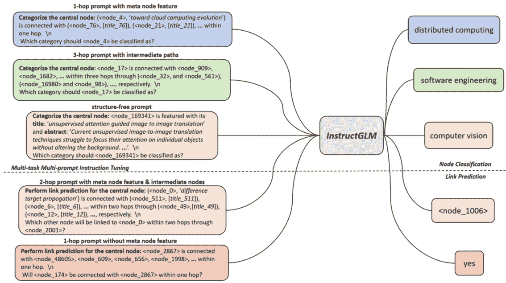

# 第六章：利用大型语言模型进行图学习

传统上，**图神经网络**（**GNNs**）一直是图学习任务的主力，取得了显著的成果。然而，最近的研究探索了**大型语言模型**（**LLMs**）在该领域的巨大潜力。

本章将深入探讨 LLMs 与图学习的交集，探讨这些强大的语言模型如何提升基于图的任务。我们将从 LLMs 的概述开始，随后讨论 GNNs 的局限性以及引入 LLMs 的动机。接下来，我们将探讨在图学习中使用 LLMs 的各种方法，**检索增强生成**（**RAG**）与图的交集，并解释这种整合的优势和挑战。

本章将探讨以下主题：

+   理解 LLMs

+   图中的文本数据

+   图学习中的 LLMs

+   将 RAG 与图学习结合

+   集成 LLMs 的挑战

# 理解 LLMs

LLMs 是**人工智能**（**AI**）中的一项重大进展，特别是在**自然语言处理**（**NLP**）和理解方面。这些模型旨在以一种既有意义又具有上下文相关性的方式理解、生成和与人类语言互动。LLMs 的发展和演化标志着一系列创新，这些创新扩大了其在各个领域的能力和应用。

从本质上讲，LLMs 是在互联网上的海量文本数据集、书籍、文章和其他书面语言来源上进行训练的。该训练过程涉及分析语言的模式、结构和语义，使得这些模型能够根据接收到的输入生成连贯且符合上下文的文本。训练过程依赖于深度学习技术，特别是神经网络，允许模型通过接触更多数据来不断改进其语言能力。

LLMs 的一个关键特点是它们的规模，通常通过其包含的参数数量来衡量。早期的模型只有数百万个参数，但如今最先进的模型拥有数十亿甚至上百亿个参数。规模的增加与模型理解和生成类似人类文本的能力显著提高相关，这使得它们在广泛的应用中更为有效。

LLMs 有广泛的应用，从简单的任务，如语法纠正和文本补全，到更复杂的任务，如写文章、生成代码、翻译语言，甚至创作诗歌或散文。它们还被用于对话代理，作为聊天机器人和虚拟助手的核心，能够与用户进行更自然和有意义的互动。

LLMs 的发展经历了几个重要的里程碑：

+   **1990 年代** ：**统计语言模型**（**SLMs**）的时代开始，利用**n-gram 模型**基于前面几个词预测序列中的下一个词。由于数据稀疏问题，这些模型在高阶预测方面面临挑战。

+   **2000 年代初** ：**神经语言模型**（**NLMs**）的引入，采用了如**多层感知机**（**MLPs**）和**递归神经网络**（**RNNs**）等神经网络，标志着向深入理解语言关系的转变。

+   **2010 年代** ：词嵌入技术的发展，如**Word2Vec**和**GloVe**，它们将词语表示为连续的向量空间，使得模型能够捕捉语义意义和上下文。

+   **2017** ：变换器架构的引入，使得处理序列数据取得突破，无需递归处理。这一架构是许多后续 LLM 的基础。

+   **2018** ：**生成预训练变换器**（**GPT**）由 OpenAI 发布，展示了变换器在语言理解和生成方面的强大能力。

+   **2019** ：**双向编码器表示法来自变换器**（**BERT**）由谷歌提出，革命性地引入了一个能够从文本中双向理解上下文的模型。

+   **2020 年代** ：更大规模的模型开始出现，如**GPT-3**，展现了生成类人文本的卓越能力，同时出现了能够将 LLM 与其他 AI 领域相结合的模型，如图学习。

+   **2023 – 2024** ：LLM 的强大进展引发了广泛关注，首先是 ChatGPT，接着是**GPT-4**、Anthropic 的 Claude、谷歌的 Gemini 和 Meta 的 Llama，这表明了更专业化、更强大的语言模型趋势。

LLM 的显著成就激发了将其能力应用于图机器学习任务的兴趣。一方面，LLM 的广泛知识和逻辑能力为改善传统的 GNN 模型提供了有前景的前景。另一方面，图中的有组织表示和具体知识有可能缓解 LLM 的一些主要缺点，包括它们产生误导性信息的倾向和解释性问题。

# 图中的文本数据

部署 GNN 的一个基本障碍是获取节点和边的复杂特征表示。当这些元素与复杂的文本属性（如描述、标题或摘要）相关联时，这一点尤为重要。

传统方法，如词袋模型或使用预训练词嵌入模型，一直是常见的做法。然而，这些技术通常无法把握文本中固有的微妙语义差异。它们往往忽视上下文及词语之间的相互依赖，导致丧失对于 GNN 进行最佳表现所需的关键信息。

为了克服这一挑战，越来越需要更先进的方法来理解和将语言的丰富性编码到图结构中。这正是 LLM 的优势所在。通过深刻理解语言的细微差别和上下文，LLM 能够生成捕捉更广泛语言特征的嵌入。

通过将 LLM 整合到 GNN 的特征提取过程中，您可以潜在地编码更丰富、更具信息性的表示，这些表示能够反映文本属性的真实语义内容，从而提升 GNN 在执行如节点分类、链路预测和图生成等任务时的准确性和效率。

LLM 的能力不仅仅局限于生成文本嵌入作为特征。LLM 擅长从原始文本属性中生成增强信息。它们可以用来生成标签/标签以及其他有用的元数据，且可以以无监督/半监督的方式进行处理。

LLM 的一个重要优势是它们能够在极少或没有标注数据的情况下适应新任务，这得益于它们在广泛文本数据集上的预训练。这种少量样本学习的能力有助于减少图神经网络（GNN）对大量标注数据集的依赖。

一种策略是通过将图的结构和节点信息框架化为自然语言提示，直接利用 LLM 预测图相关任务的结果。像 InstructGLM 这样的技术通过精心设计的提示，优化像 Llama 和 GPT-4 这样的 LLM，详细描述图的拓扑结构，包括节点连接和邻域等方面。这些优化后的 LLM 能够在推理阶段无需任何标注样本即可预测**节点分类**和**链路预测**等任务。

## 利用 InstructGLM

**InstructGLM**是一个框架，利用自然语言描述图结构和节点特征，并通过指令调优来解决图相关问题。它是一个提议的指令微调**图语言模型**（**GLM**），利用自然语言指令进行图机器学习，为图相关任务提供强大的自然语言处理（NLP）接口。

InstructGLM 框架涉及一个多任务、多提示的教学调优过程，用于优化大语言模型（LLM）并有效地将其与图结构结合。该方法旨在通过在图结构上利用自监督学习，并利用 LLMs 作为文本编码器，减少对标注数据的依赖，从而提升性能和效率。

InstructGLM 技术采用语言线索，阐明图中连接模式和节点特征。这些提示作为教学机制，指导 LLMs 理解图的复杂结构和内在含义。

如*图 6* *.1*所示，InstructGLM 框架提出了一种复杂的多任务、多提示指令调优方法，适用于大型语言模型（LLMs）：

图 6.1 – InstructGLM 多任务应用。来源：Ye 等，2024（https://arxiv.org/abs/2308.07134）

该图展示了 InstructGLM 的核心组件，展示了不同类型的提示及其应用：

+   **1 跳提示与元节点特征**：这种提示类型根据节点的直接连接对中心节点进行分类，如图左上角蓝色框所示。

+   **3 跳提示与中间路径**：如绿色框所示，此提示探索最多三跳的连接，为节点分类提供更广泛的上下文。

+   **无结构提示**：黄色框展示了 InstructGLM 如何基于节点的内在特征对其进行分类，而不依赖于结构信息。

+   **2 跳提示与元节点特征及中间节点**：如粉色框所示，这种提示类型用于链接预测任务，考虑最多两跳的连接。

+   **1 跳提示无元节点特征**：另一种链接预测提示，如橙色框所示，该提示关注节点的直接连接，而不包含额外的节点信息。

*图 6* *.1* 同样强调了 InstructGLM 在节点分类和链接预测任务中的双重关注，正如由虚线分隔的这两个主要功能所示。

尽管将 LLMs 作为不透明预测器已经取得了有效的结果，但在处理更复杂的图任务时，它们的准确性下降，因为在这种任务中，结构的详细建模至关重要。因此，一些方法将 LLMs 与 GNNs 结合使用，其中 GNN 绘制图的结构，而 LLM 基于节点的文本描述，增强了对节点的深层语义理解。

接下来，让我们看看 LLMs 如何帮助我们进行图学习。

# LLMs 在图学习中的应用

研究人员已经深入探讨了将 LLMs 融入图学习过程的各种策略。每种方法都有其独特的优势和潜在用途。让我们看看 LLMs 能发挥的几个关键功能。

## LLMs 作为增强工具

传统的图神经网络（GNNs）依赖于初始节点特征的质量，通常这些特征的文本描述有限。而 LLMs 凭借其广泛的知识和语言理解能力，能够弥补这一差距。通过增强这些特征，LLMs 使得 GNNs 能够捕捉图中复杂的关系和动态，从而在节点分类或链接预测等任务中表现出色。

有两种主要方法可以利用 LLM 作为增强工具。第一种是 **特征级增强**，可以通过多种方式使用 LLM 来实现：

+   **同义词与相关概念**：LLM 通过识别同义词和语义相关的概念，超越了文本描述的表面层次。这有助于捕捉可能没有明确提到的更广泛的信息。例如，如果产品描述提到 *防水* 和 *登山靴*，LLM 可以推断该产品适合户外活动。

+   **隐式关系**：LLMs 可以从文本中提取隐式关系。这些关系对于理解图中节点的上下文至关重要。例如，在社交网络中，LLM 可能会根据两个节点之间频繁的互动推断出它们之间的友谊，即使词语 *friend* 从未明确提及。

+   **外部知识集成**：LLMs 可以访问并集成外部知识库，进一步丰富节点表示。这可能涉及将产品信息与用户评论关联，或将蛋白质描述（在生物网络中）与已知的蛋白质-蛋白质相互作用连接起来。

另一种方法是 **文本级增强**，可以用于为节点创建更丰富、更具信息性的文本描述。

该方法侧重于为节点创建全新的文本描述，尤其在原始描述有限或缺乏上下文时特别有益。LLM 作为内容生成器，利用关于节点及其在图中的上下文信息，创造出新的、更具信息量的描述。这个上下文可能包括以下方面：

+   原始文本描述

+   邻接节点的标签

+   图的结构（例如，连接到节点的边的数量）

LLM 利用这些信息生成丰富的文本描述，捕捉与邻接节点的关系、整体网络结构以及任何相关的外部知识。这个新生成的描述成为节点的增强特征，为 GNN 提供了对节点在图中作用的更全面理解。

### LLM 增强的优势与挑战

基于 LLM 的增强为图学习提供了若干优势：

+   **改进的特征表示**：增强的节点特征捕捉了节点在图中上下文的更丰富、更细致的理解。这使得 GNN 能够学习更复杂的关系和模式，从而在节点分类、链接预测和社区检测等任务中提高性能。

+   **处理有限数据**：LLMs 可以解决节点描述稀缺或缺乏细节的情况。通过推断关系和利用外部知识，它们能够创建更具信息性的表示，从而缓解有限数据可用性带来的挑战。

+   **识别隐含连接**：LLMs 可以超越节点特征中的表层信息，基于它们对语言的理解识别出微妙的连接。这对于诸如揭示社交网络中隐藏社群或预测生物网络中节点之间存在链接等任务至关重要。

然而，虽然 LLM 增强提供了一条引人注目的前进道路，但也存在一些需要克服的挑战：

+   **计算成本**：训练和运行 LLMs 可能会耗费大量计算资源，尤其是在处理大规模图形时。需要谨慎优化策略以确保可伸缩性。

+   **数据偏倚继承**：LLMs 并不免于其训练数据中存在的偏见。关键在于确保用于增强的 LLM 是在高质量、无偏见的数据上训练的，以防止结果偏斜。

+   **可解释性难题**：理解 LLMs 如何生成增强特征可能具有挑战性。这种透明度不足可能使得解释使用这些特征的 GNN 结果变得困难。研究人员正在积极开发方法，使 LLMs 实现的增强过程更加透明。

### 真实世界应用

这里有多个真实世界的例子，展示了 LLMs 如何增强图学习过程。

+   **药物发现与生物信息学**：在药物发现中，预测不良**药物-药物相互作用**（**DDIs**）对患者安全至关重要。传统方法通常因为可能的药物组合和相互作用数量庞大而难以应对。GNNs 可以通过将药物表示为*节点*，已知相互作用表示为*边*来建模这些关系。当结合 LLMs 时，LLMs 会处理生物医学文献以提取有关药物机制、副作用和相互作用的信息，使得这些模型显著增强。LLMs 生成的嵌入丰富了 GNN 中的节点和边特征，从而更准确地预测潜在的 DDIs，最终实现更安全的药物管理。

+   **社交网络分析**：LLMs 可以增强 GNNs 在社交媒体上检测虚假信息的能力。GNNs 可以模拟社交网络，*节点*代表用户，*边*代表互动，如点赞、分享和评论。通过处理帖子内容，LLMs 可以提取主题、情感以及潜在误导信息，这些信息随后被整合到图中。这种丰富化使得 GNN 能够更好地识别虚假信息的群集，并预测哪些用户最有可能传播虚假信息，从而更有效地干预以维护信息的完整性。

+   **金融欺诈检测**：金融欺诈检测涉及在数百万笔交易中识别可疑模式。GNNs 可以将这些交易表示为图，其中 *节点* 代表账户，*边* 代表交易。LLM 可以分析交易描述和备注，提取出欺诈的关键词和模式，增强 GNN 的节点和边特征。这一集成使得 GNN 能够通过考虑交易模式和文本描述中的上下文信息，更准确地检测欺诈交易，从而构建出更强大的欺诈检测系统。

+   **学术研究和协作网络**：识别潜在的研究合作者对推动科学发现至关重要。图神经网络（GNNs）可以建模学术网络，其中 *节点* 代表研究人员，*边* 代表共同署名或引用关系。LLM 可以分析论文摘要、关键词和研究兴趣，将这些文本特征转换为嵌入并集成到图中。这一增强功能使 GNN 能够通过考虑结构关系和研究兴趣的语义相似性来推荐潜在合作者，从而促进更有效的科学合作。

+   **知识图谱构建**：构建全面的知识图谱涉及从各种来源（通常是非结构化的）集成信息。GNNs 可以通过 *节点* 代表实体，*边* 代表关系来建模知识图谱。LLM 可以从新闻文章、科研文献和网页等文本数据源中提取实体和关系，并利用这些信息来丰富知识图谱，增加额外的节点和边。这一增强功能使得 GNN 能够通过整合来自多种文本来源的详细和上下文丰富的信息，构建更完整、更准确的知识图谱，促进更好的知识表示和发现。

LLM 与 GNN 的集成为通过结合文本数据中的丰富上下文信息来增强各种应用提供了一种强大的方法。

## LLM 作为预测器

随着语言理解的进步，得益于基于 Transformer 的大型语言模型（LLMs），研究人员正在探索如何最佳地将图数据在文本中呈现给 LLMs。一篇名为 *语言模型能否解决自然语言中的图问题？*（[`arxiv.org/html/2305.10037v3`](https://arxiv.org/html/2305.10037v3)）的最新论文讨论了如何通过 LLM 从文本描述构建图，从而增强其图形理解能力。该论文展示了如何通过提示帮助 LLM 理解图结构，并通过提示中提供的一组指令（算法）给出结果。

*图 6* *.2* 展示了通过提示技术进行图分析的三种不同方法：

）](img/B22118_06_2.jpg)

图 6.2 – 使用提示理解图结构。来源：Wang 等，2024（[`arxiv.org/html/2305.10037v3`](https://arxiv.org/html/2305.10037v3)）

注意

图示*构建图提示与算法提示概述*（[`arxiv.org/html/2305.10037v3`](https://arxiv.org/html/2305.10037v3)）由 Wang 等（2024）发布，采用 CC BY 4.0 许可协议。

此插图展示了如何通过不同的提示策略引导 LLM 理解和解决与图相关的问题：

+   **标准提示**：第一列展示了标准提示方法。这里展示了一个简单的无向图，节点编号从 0 到 4。该提示通过描述图的结构，包括连接各节点的边的权重，来提供上下文。提出的问题是找出从节点 0 到节点 2 的最短路径，展示了一个基本的图遍历问题。

+   **构建图提示**：中间一列介绍了一种更复杂的方法，称为构建图提示。该方法首先指示 LLM 基于给定的信息构建图，然后引导模型通过识别节点 0 和节点 2 之间的所有可能路径并计算其总权重的过程。这个逐步的方法帮助 LLM 系统地分析图并确定最短路径。

+   **算法提示**：最右边一列展示了算法提示，这是所展示的最先进的技术。它概述了一个**深度优先搜索**（**DFS**）算法，用于在无向图中找到两个节点之间的最短路径。该方法详细说明了如何实现该算法，包括跟踪距离和回溯以识别最优路径。然后，提示将这个算法应用于相同的图问题，演示了如何使用更复杂的分析方法来解决图遍历问题。

**GPT4Graph**（[`arxiv.org/pdf/2305.15066`](https://arxiv.org/pdf/2305.15066)）研究使用图标记语言和自我提示来改善 LLM 在生成最终输出之前的理解。主要策略是输入图数据，确保 LLM 理解它，然后进行查询。然而，由于上下文长度的限制，这种方法在处理大型图时存在可扩展性问题，并且需要为新任务提供新的提示。为了应对这些挑战并提升图学习能力，我们来探讨如何将 RAG 与图学习结合。

# 将 RAG 与图学习结合

RAG 是一个 AI 框架，它结合了 LLM 的强大功能和外部知识检索，以产生更准确、相关和最新的响应。其工作原理如下：

1.  **信息检索**：当接收到查询时，RAG 会搜索知识库或数据库以找到相关信息。

1.  **上下文增强**：检索到的信息随后被用来增强语言模型的输入，提供额外的上下文。

1.  **生成**：LLM 利用这种增强的输入生成既流畅又基于检索信息的回答。

RAG 提供了几个令人信服的好处：

+   **提高准确性**：通过将回答基于检索到的信息，RAG 减少了幻觉现象，提升了事实准确性。

+   **最新信息**：知识库可以定期更新，使系统能够访问当前信息，而无需重新训练整个模型。

+   **透明度**：RAG 可以提供信息来源，从而增加可信度并支持事实核查。

虽然传统的 RAG 方法已经证明有效，但将 RAG 与图谱学习技术结合，提供了更强大的信息检索和生成能力。

## 图谱 RAG（GRAG）方法的优势

图谱学习利用数据中固有的结构和关系，可以显著提高检索到的信息的上下文和相关性。将图谱与 RAG（检索增强生成）结合的主要好处如下：

+   **结构化上下文**：图谱捕捉实体之间的复杂关系，提供比平面文本文档更丰富的上下文。

+   **多跳推理**：图谱结构使得可以跨多个连接实体检索信息，从而促进更复杂的推理任务。

+   **改善相关性**：通过考虑文本信息和拓扑信息，基于图谱的检索能够识别出更相关的信息，用于生成过程。

在接下来的章节中，我们将探讨几种特定方法的优势。

### 知识图谱 RAG

**知识图谱 RAG**利用结构化的知识图谱来增强检索和生成过程。这种方法具有几个关键优势：

+   **精确的实体和关系检索**：通过利用知识图谱的结构化特性，该方法不仅能检索到相关实体，还能检索到它们之间的关系。例如，生物医学知识图谱不仅能检索到特定药物，还能检索到其与其他药物的相互作用、副作用以及批准用途。

+   **上下文丰富**：检索到的信息包括图谱中实体的更广泛上下文。这使得大语言模型（LLM）能够理解实体在更大信息网络中的位置，从而提供更为细致和准确的回答。

+   **层次化信息访问**：知识图谱通常包含层次化关系（例如，*是* 和 *一部分*）。这种结构允许更灵活的检索，系统可以根据需要访问具体细节和更广泛的类别。

+   **多跳推理**：知识图 RAG 可以通过检索连接实体和关系的路径来促进多跳推理。这对于需要从多个来源获取信息并在图中拼凑起来的复杂查询尤为有用。

### GNNs

正如我们所看到的，GNNs 是学习图结构数据表示的强大工具。在 RAG 的背景下，它们提供了几个优势：

+   **学习图嵌入**：GNNs 可以创建节点、边和子图的稠密向量表示（嵌入）。这些嵌入捕捉了局部和全局的结构信息，从而有效地检索相关的图组件。

+   **捕获图拓扑**：与传统神经网络不同，GNNs 明确建模图中实体之间的关系。这使它们能够捕捉图中理解信息的上下文和相关性的复杂拓扑特征。

+   **可扩展性**：GNNs 能够高效处理大规模图，使其适用于现实世界中的知识库，这些知识库通常包含数百万个实体和关系。

+   **归纳学习**：许多 GNN 架构支持归纳学习，使它们能够推广到未见过的节点，甚至是全新的图。这对于不断更新的动态知识库特别有用。

### GRAG

**图 RAG**（**GRAG**）是一种先进的技术，它强调在检索和生成过程中子图结构的重要性：

+   **子图感知检索**：与检索单独的实体或关系不同，GRAG 专注于检索相关的子图。这种方法保留了感兴趣实体周围的局部结构，为生成过程提供了更丰富的上下文。

+   **拓扑保持生成**：GRAG 在生成过程中保持对图拓扑的意识。这确保生成的文本遵循在检索的子图中存在的结构关系，从而产生更连贯、事实一致的输出。

+   **软剪枝**：GRAG 通常采用软剪枝机制来优化检索到的子图。这个过程移除不太相关的节点和边，同时保持整体结构，有助于将 LLM 的焦点集中在最相关的信息上。

+   **层次化文本转换**：GRAG 通常包括将子图转换为层次化文本描述的方法。这种转换既保留了文本内容，又保留了图的结构信息，使得 LLM 可以处理丰富的结构化输入。

+   **多跳推理支持**：通过保持子图结构，GRAG 自然支持多跳推理任务。LLM 可以遍历检索到的子图，连接远距离的信息片段，从而实现更复杂的推理。

让我们考虑 GRAG 在一个技术公司客户支持系统中的应用，该系统使用结构化为知识图谱的知识库。该知识图谱包含有关产品、错误代码、故障排除步骤和用户手册的互联信息。

假设用户提交了以下查询：*如何解决我的* *SmartHome 路由器上的错误代码 E101？*

传统方法可能会检索到孤立的实体，如产品名称或错误代码，这可能导致片段化或不完整的答案。GRAG 采用独特的方法，提供准确且富有上下文的回答：

1.  GRAG 专注于子图感知的检索，提取与*错误代码 E101*和*SmartHome 路由器*相关的结构化、连贯的子图。该子图可以包括错误原因（例如，网络配置冲突）、故障排除步骤（例如，更新固件、重置路由器或更改网络设置），以及与路由器用户手册或固件更新页面的相关链接。

1.  一旦子图被检索到，GRAG 会应用软修剪机制，以保持本地图结构的完整性。与问题无关的或次要的信息，如其他设备的故障排除步骤或不相关的错误代码，将被移除。

1.  GRAG 将修剪后的子图转换为层次化的文本描述，保持图结构的同时，将信息转换为 LLM 可以顺利处理的形式。我们的子图被转换为文本层次结构，组织信息如下：

    1.  *错误代码 E101* 及其原因概述（网络配置冲突）

    1.  按逻辑顺序提供的故障排除步骤

    1.  在相关的情况下，提供额外的细节，包括用户报告将 E101 错误与近期固件更新相关联的情况。

1.  GRAG 采用拓扑保持生成方法，确保子图中编码的关系和结构反映在响应中。系统现在可以生成详细的回复：

    *您的 SmartHome 路由器上的错误代码 E101 通常是由于网络配置冲突引起的。要解决此问题，请检查您的路由器固件是否已更新。如果已更新，请按住重置按钮 10 秒钟重置路由器。您还可能需要更新网络设置，以避免 IP 冲突。请注意，一些用户在近期固件更新后报告遇到此错误，因此，如果问题仍然存在，回滚到之前的版本可能会有所帮助。*

    如前所述，GRAG 的一大优势是其多跳推理支持。例如，系统可能会将*错误代码 E101*与网络配置冲突相连接，再从那里连接到用户手册中的具体故障排除步骤。这使得 LLM 能够推断复杂的关系，并提供全面的答案而不遗漏有价值的上下文。

这些方法在利用图结构进行 RAG 方面具有独特优势。选择哪种方法通常取决于应用的具体需求、知识库的性质以及所处理查询的复杂性。此外，由于存在诸如管理大型噪声图、保持低延迟以及使 LLM 能够处理结构化图输入等挑战，仔细实施所选方法至关重要。

# 将 LLM 与图学习相结合的挑战

值得注意的是，将 LLM 与图学习相结合涉及若干挑战：

+   **效率与可扩展性**：LLM 需要大量的计算资源，这在实际应用中，尤其是在资源有限的设备上，带来了部署挑战。知识蒸馏（即将 LLM（教师模型）的知识传递给更小、更高效的 GNN（学生模型））提供了一种有前景的解决方案。

+   **数据泄露与评估**：LLM 在大规模数据集上进行预训练，可能会面临数据泄露的风险，从而抬高性能指标。缓解这一问题需要新的数据集和仔细的测试数据抽样。建立公平的评估基准对于准确的性能评估也至关重要。

+   **迁移性与可解释性**：增强 LLM 在不同图领域之间迁移知识的能力，并提高其可解释性至关重要。诸如链式思维提示等技术可以利用 LLM 的推理能力，提供更好的透明度。

+   **多模态集成**：图通常包含多种数据类型，包括图像、音频和数值数据。将 LLM 集成到这些多模态环境中是一个激动人心的研究机会。随着 LLM 生成质量的快速提升，它将在增强图数据和学习中的智能方面发挥至关重要的作用。

# 总结

在本章中，我们探讨了将 LLM 与图学习相结合，重点介绍了 LLM 如何增强传统的 GNN。我们讨论了 LLM 的发展历程、其在图中处理文本数据的能力，以及其在改善节点表示和图相关任务中的潜力。你了解了多种在图学习中利用 LLM 的方法，包括特征层面和文本层面的增强，以及通过像 InstructGLM 这样的技术将 LLM 作为预测器使用。

我们还展示了在药物发现、社交网络分析和金融欺诈检测等领域的实际应用，以说明这种集成的实际效益。此外，你还了解了将 LLM 与图学习结合时面临的挑战，如计算成本、数据偏差和可解释性问题，同时学习了该领域未来可能的进展。

在下一章，我们将更深入地探讨将深度学习应用于图中的方法。

# 第三部分：实际应用与实施

本书的这一部分将带你深入探讨图深度学习在各个领域的实际应用。你将学习如何将基于图的方法应用于自然语言处理，构建推荐系统，并在计算机视觉应用中利用图结构。

本部分包含以下章节：

+   *第七章*，*图深度学习实践*

+   *第八章*，*自然语言处理中的图深度学习*

+   *第九章*，*使用图深度学习构建推荐系统*

+   *第十章*，*计算机视觉中的图深度学习*
