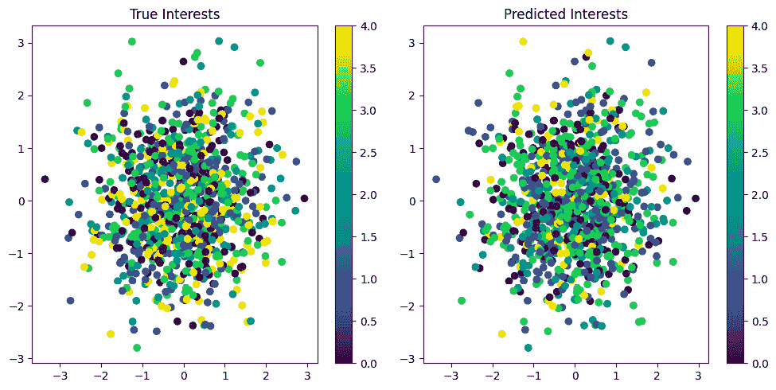

# 第七章：图神经网络在实践中的应用

在前几章探讨了图深度学习的理论方面之后，现在是时候通过实际应用来深入了解它了。

社交网络已经成为我们数字生活的一个重要部分，生成了大量数据，可以提供有价值的关于人类行为、关系和社会动态的见解。图深度学习提供了强大的工具，可以分析和提取这些复杂网络中的有意义信息。在本章中，我们将使用**PyTorch** **Geometric**（**PyG**）探讨图深度学习技术在社交网络分析中的实际应用。

在这里，我们将专注于一个假设的数据集，代表大学生的社交网络。这个示例将展示图机器学习如何应用于现实场景，比如预测用户兴趣、推荐新连接以及识别社区结构。

我们的数据集包含以下元素：

+   **节点**：每个节点代表大学中的一个学生。

+   **边缘**：节点之间的边表示学生之间的友谊或连接。

+   **节点特征**：每个学生（节点）都有相关特征，包括以下内容：

    +   年龄

    +   学年

    +   学术专业（编码为独热向量）

+   **节点标签**：每个学生被分配到五个兴趣组之一，我们将用这个进行节点分类任务。

本章中，我们将解决两个主要任务：

+   **节点分类**：我们将基于学生的特征和网络中的连接来预测学生兴趣。此任务展示了**图神经网络**（**GNNs**）如何利用节点属性和网络结构来预测单个节点的情况。

+   **链接预测**：我们将开发一个模型，通过预测图中的潜在边缘来推荐新朋友。这展示了图深度学习如何应用于推荐系统和网络增长预测。

我们将使用最先进的 GNN 架构来实现这些任务。此外，我们将可视化我们的结果，以便直观地了解网络结构和模型的性能。

到本章结束时，您将对如何将图深度学习技术应用于社交网络数据有实际的理解，能够解读结果，并将这些方法应用到自己的项目中。虽然我们使用合成数据集进行演示，但这里涉及的技术可以很容易地应用于现实世界的社交网络数据。

让我们开始进入图深度学习在社交网络分析中的实际应用世界吧！我们将深入探索以下主题：

+   设置环境

+   创建图数据集

+   节点分类 – 预测学生兴趣

+   链接预测 – 推荐新朋友

# 设置环境

在深入实现我们的图形深度学习模型之前，首先需要设置开发环境，安装必要的库和工具。在这一部分，我们将涵盖必需的导入，并解释它们在项目中的作用。

首先，让我们开始导入所需的库：

```py
import torch
import torch_geometric
from torch_geometric.data import Data
from torch_geometric.nn import GCNConv, GAE
from torch_geometric.utils import train_test_split_edges
from torch_geometric.transforms import RandomLinkSplit
from sklearn.manifold import TSNE
from sklearn.cluster import KMeans
import matplotlib.pyplot as plt
import networkx as nx
from sklearn.metrics import roc_auc_score
```

让我们分解这些导入及其用途：

+   **torch** ：用于张量操作和构建神经网络的核心 PyTorch 库。

+   **torch_geometric** ：PyG，是一个针对图形和其他不规则结构的深度学习扩展库，基于 PyTorch。

+   **torch_geometric.data.Data** ：一个用于创建 PyG 中图形数据对象的类，包含节点特征、边索引和标签。

+   **torch_geometric.nn.GCNConv** ：**图卷积网络**（**GCN**）层，用于节点分类。

+   **torch_geometric.nn.GAE** ：**图自编码器**（**GAE**），用于链接预测。

+   **torch_geometric.utils.train_test_split_edges** ：一个实用函数，帮助拆分图形数据，用于链接预测任务。

+   **torch_geometric.transforms.RandomLinkSplit** ：一种用于通过将数据拆分为训练集、验证集和测试集来准备链接预测的变换。

+   **sklearn.manifold.TSNE** ：**t-分布随机邻居嵌入**（**t-SNE**），用于在可视化节点嵌入时进行降维。

+   **sklearn.cluster.KMeans** ：用于聚类节点嵌入，以识别社交群体。

+   **matplotlib.pyplot** ：用于创建图形和结果可视化的库。

+   **networkx** ：提供额外工具用于处理图形的库，用于一些可视化。

确保在 Python 环境中安装了所有这些库。你可以使用**pip**进行安装：

```py
pip install torch torch_geometric scikit-learn matplotlib networkx
```

请注意，安装 PyG（**torch_geometric**）可能需要根据您的系统和 CUDA 版本进行额外的步骤。请参考官方文档以获取详细的安装说明：[`pytorch-geometric.readthedocs.io/en/latest/`](https://pytorch-geometric.readthedocs.io/en/latest/)。

导入了这些库后，我们现在准备好开始使用我们的社交网络数据，并实现我们的图形深度学习模型。

# 创建图形数据集

下一步是创建一个合成的社交网络数据集，以展示我们的图形深度学习技术。虽然真实世界的数据理想，但使用合成数据可以让我们专注于算法的实现和理解，而不必担心数据获取和预处理的复杂性。

在这里，我们将创建一个代表大学生的社交网络数据集。完整代码可以在[`github.com/PacktPublishing/Applied-Deep-Learning-on-Graphs`](https://github.com/PacktPublishing/Applied-Deep-Learning-on-Graphs)找到。

让我们分解这段代码，并解释每一部分。

1.  我们设置一个随机种子以保证可复现性：

    ```py
    torch.manual_seed(42)
    ```

    这确保了每次运行代码时生成相同的“随机”数据。

1.  我们定义我们的数据集参数：

    ```py
    num_nodes = 1000
    num_features = 10
    num_classes = 5
    ```

    +   **num_nodes**是我们网络中学生（节点）的数量。

    +   **num_features**是每个学生的特征数。我们使用 10 个特征来表示年龄、年级和 8 个可能的学术专业。

    +   **num_classes**是不同兴趣组的数量，它将作为我们进行节点分类的目标。

1.  我们使用**torch.randn()**创建节点特征（**x**）：

    ```py
    x = torch.randn((num_nodes, num_features))
    ```

    这生成了一个大小为**(num_nodes, num_features)**的张量，填充了来自标准正态分布的随机值。在实际的数据集中，这些特征将是学生的实际属性。

1.  我们使用**torch.randint()**创建边（**edge_index**）：

    ```py
    edge_index = torch.randint(0, num_nodes, (2, 5000))
    ```

    这将在节点之间生成 5,000 个随机边。**edge_index**张量的形状为**(2, 5000)**，其中每一列表示一条边，格式为**[源节点，目标节点]**。

1.  我们使用**torch.randint()**创建节点标签（**y**）：

    ```py
    y = torch.randint(0, num_classes, (num_nodes,))
    ```

    这将每个节点（学生）随机分配到五个兴趣组中的一个。

1.  我们创建一个 PyG 的**Data**对象，它有效地存储我们的图数据。我们传入节点特征（**x**）、边索引（**edge_index**）和节点标签（**y**）：

    ```py
    data = Data(x=x, edge_index=edge_index, y=y)
    data.num_classes = num_classes
    ```

1.  最后，我们打印一些关于数据集的信息，以验证其结构：

    ```py
    print(f"Number of nodes: {data.num_nodes}")
    print(f"Number of edges: {data.num_edges}")
    print(f"Number of node features: {data.num_node_features}")
    print(f"Number of classes: {data.num_classes}")
    ```

这个合成数据集现在代表了一个社交网络：

+   每个*node*都是一个拥有 10 个特征（表示年龄、年级和专业等属性）的学生。

+   *Edges*代表学生之间的友谊。

+   每个学生属于五个兴趣组中的一个。

代码的输出将如下所示：

```py
Number of nodes: 1000
Number of edges: 5000
Number of node features: 10
Number of classes: 5
```

在实际的场景中，你通常会从文件或数据库中加载数据并进行预处理，以适应这种结构。我们创建的**Data**对象现在可以与 PyG 的 GNN 模型一起使用。

在接下来的章节中，我们将使用这个数据集执行节点分类、链路预测和图聚类任务。

# 节点分类——预测学生兴趣

在这一部分，我们将实现一个 GCN，以根据学生的特征和社交网络中的连接预测学生的兴趣。这个任务展示了 GNN 如何利用节点属性和网络结构来做出关于单个节点的预测。

让我们从定义我们的 GCN 模型开始：

```py
class GCN(torch.nn.Module):
    def __init__(self, in_channels, hidden_channels, out_channels):
        super().__init__()
        self.conv1 = GCNConv(in_channels, hidden_channels)
        self.conv2 = GCNConv(hidden_channels, out_channels)
    def forward(self, x, edge_index):
        x = self.conv1(x, edge_index).relu()
        x = self.conv2(x, edge_index)
        return x
# Initialize the model
model = GCN(in_channels=num_features,
            hidden_channels=16,
            out_channels=num_classes)
```

如你所见，我们的 GCN 模型由两个图卷积层组成。第一个层接收输入特征并生成隐藏表示，而第二个层则生成最终的类别预测。

现在，让我们来训练模型。你可以在[`github.com/PacktPublishing/Applied-Deep-Learning-on-Graphs`](https://github.com/PacktPublishing/Applied-Deep-Learning-on-Graphs)查看完整的代码。我们来分解训练过程：

1.  我们定义了一个优化器（**Adam**）和一个损失函数（**CrossEntropyLoss**）来训练我们的模型：

    ```py
    optimizer = torch.optim.Adam(model.parameters(), lr=0.01)
    criterion = torch.nn.CrossEntropyLoss()
    ```

1.  **train()**函数执行训练的一个步骤：

    ```py
    def train():
        model.train()
        optimizer.zero_grad()
        out = model(data.x, data.edge_index)
        loss = criterion(out, data.y)
        loss.backward()
        optimizer.step()
        return loss
    ```

    +   它将模型设置为训练模式。

    +   它计算模型的前向传播。

    +   它计算预测结果与真实标签之间的损失。

    +   它执行反向传播并更新模型参数。

1.  **test()**函数评估模型的性能：

    ```py
    def test():
        model.eval()
        out = model(data.x, data.edge_index)
        pred = out.argmax(dim=1)
        correct = (pred == data.y).sum()
        acc = int(correct) / int(data.num_nodes)
        return acc
    ```

    +   它将模型设置为评估模式。

    +   它计算前向传播。

    +   它计算预测的准确性。

1.  我们训练模型**200**个周期，每**10**个周期打印一次损失和准确性：

    ```py
    for epoch in range(200):
        loss = train()
        if epoch % 10 == 0:
            acc = test()
            print(f'Epoch: {epoch:03d}, Loss: {loss:.4f}, \
                  Accuracy: {acc:.4f}')
    ```

1.  最后，我们再次评估模型，以获得最终的准确性：

    ```py
    final_acc = test()
    print(f"Final Accuracy: {final_acc:.4f}")
    ```

为了可视化我们的模型表现如何，让我们创建一个函数来绘制预测的兴趣组与真实兴趣组的对比：

```py
def visualize_predictions(model, data):
    model.eval()
    out = model(data.x, data.edge_index)
    pred = out.argmax(dim=1)
    plt.figure(figsize=(10, 5))
    plt.subplot(121)
    plt.title("True Interests")
    plt.scatter(
        data.x[:, 0], data.x[:, 1], c=data.y, cmap='viridis')
    plt.colorbar()
    plt.subplot(122)
    plt.title("Predicted Interests")
    plt.scatter(
        data.x[:, 0], data.x[:, 1], c=pred, cmap='viridis')
    plt.colorbar()
    plt.tight_layout()
    plt.show()
visualize_predictions(model, data)
```

该函数创建两个散点图：一个显示真实的兴趣组，另一个显示预测的兴趣组。



图 7.1：模型性能：真实兴趣与预测兴趣

在*图 7.1*中，每个点代表一个学生，基于他们的前两个特征进行定位。可视化包括两个散点图，分别标记为**真实兴趣**和**预测兴趣**。这些图中的每个点都代表一个学生。这些图中的颜色从紫色（**0.0**）到黄色（**4.0**），表示不同的兴趣组。左图显示了学生的实际或“真实”兴趣组，而右图展示了模型对这些兴趣组的预测。这些分布之间的相似性传达了图学习技术在此类预测中的有效性。

在实际应用中，这个节点分类任务可以用于根据学生的个人信息和社交连接预测他们的兴趣。这对于个性化内容推荐、定向广告或提升学生在大学活动中的参与度具有重要价值。

请记住，虽然我们的合成数据集提供了一个干净的示例，现实世界中的数据往往需要更多的预处理、处理缺失值，并且在处理个人数据时需要仔细考虑隐私和伦理问题。

图学习的另一个方面是链路预测任务。这在许多现实场景中都会出现，特别是在我们尝试预测某些连接的情况下。

# 链路预测——推荐新朋友关系

在本节中，我们将实现一个用于链路预测的 GAE。该任务旨在预测网络中的潜在新连接，可用于推荐学生之间的新朋友关系。

首先，让我们定义我们的 GAE 模型：

```py
class LinkPredictor(torch.nn.Module):
    def __init__(self, in_channels, hidden_channels):
        super().__init__()
        self.encoder = GCNConv(in_channels, hidden_channels)
    def encode(self, x, edge_index):
        return self.encoder(x, edge_index).relu()
    def decode(self, z, edge_label_index):
        return (
            z[edge_label_index[0]] * z[edge_label_index[1]]
        ).sum(dim=-1)
    def forward(self, x, edge_index, edge_label_index):
        z = self.encode(x, edge_index)
        return self.decode(z, edge_label_index)
# Initialize the model
model = LinkPredictor(in_channels=num_features, hidden_channels=64)
```

我们的**LinkPredictor**模型使用 GCN 层将节点特征编码为嵌入，并使用简单的点积操作进行解码（预测链接）。

现在，让我们使用以下代码为链路预测准备数据：

```py
from torch_geometric.transforms import RandomLinkSplit
# Prepare data for link prediction
transform = RandomLinkSplit(
    num_val=0.1, num_test=0.1, is_undirected=True,
    add_negative_train_samples=False
)
train_data, val_data, test_data = transform(data)
# Define optimizer
optimizer = torch.optim.Adam(model.parameters(), lr=0.01)
```

**RandomLinkSplit**变换将我们的图分成训练集、验证集和测试集，用于链路预测。它删除一些边以进行验证和测试，并生成负样本（不存在的边）。

现在，让我们定义训练和评估函数：

1.  初始化训练过程，准备优化器，并对输入数据进行编码：

    ```py
    def train_link_predictor():
        model.train()
        optimizer.zero_grad()
        z = model.encode(train_data.x, train_data.edge_index)
    ```

1.  现在，我们定义正向边并为训练生成负向边：

    ```py
        pos_edge_index = train_data.edge_index
        neg_edge_index = torch_geometric.utils.negative_sampling(
            edge_index=pos_edge_index,
            num_nodes=train_data.num_nodes,
            num_neg_samples=pos_edge_index.size(1),
        )
    ```

1.  结合正向和负向边并创建相应的标签：

    ```py
        edge_label_index = torch.cat([
            pos_edge_index, neg_edge_index], dim=-1)
        edge_label = torch.cat([
            torch.ones(pos_edge_index.size(1)),
            torch.zeros(neg_edge_index.size(1))
        ], dim=0)
    ```

1.  模型进行预测，计算损失，执行反向传播，并更新模型参数：

    ```py
        out = model.decode(z, edge_label_index)
        loss = torch.nn.BCEWithLogitsLoss()(out, edge_label)
        loss.backward()
        optimizer.step()
        return loss
    ```

1.  这开始了测试函数，设置模型为评估模式，并在没有梯度计算的情况下进行预测：

    ```py
    def test_link_predictor(data):
        model.eval()
        with torch.no_grad():
            z = model.encode(data.x, data.edge_index)
            out = model.decode(z, data.edge_label_index)
    ```

1.  最后，我们将预测结果转换为 NumPy 数组，并计算**接收者操作特征曲线下面积**（**ROC AUC**）得分，以评估模型的表现：

    ```py
        y_true = data.edge_label.cpu().numpy()
        y_pred = out.cpu().numpy()
        return roc_auc_score(y_true, y_pred)
    ```

现在，让我们编写训练和预测模块：

1.  我们训练模型 **100** 轮，每 **10** 轮打印一次损失和验证 AUC：

    ```py
    for epoch in range(100):
        loss = train_link_predictor()
        if epoch % 10 == 0:
    ```

    **train_link_predictor()** 函数编码节点特征，预测正负样本的链接，并计算二元交叉熵损失。

1.  **test_link_predictor()** 函数使用 AUC 指标评估模型的性能：

    ```py
            val_auc = test_link_predictor(val_data)
            print(f'Epoch: {epoch:03d}, Loss: {loss:.4f}, \
                  Val AUC: {val_auc:.4f}')
    ```

1.  最后，我们在测试集上评估模型，得到最终的 AUC 评分：

    ```py
    test_auc = test_link_predictor(test_data)
    print(f"Test AUC: {test_auc:.4f}")
    ```

    这里是代码输出：

    ```py
    Epoch: 000, Loss: 0.6911, Val AUC: 0.5528
    Epoch: 010, Loss: 0.6779, Val AUC: 0.5297
    Epoch: 020, Loss: 0.6732, Val AUC: 0.5068
    Epoch: 030, Loss: 0.6696, Val AUC: 0.5156
    Epoch: 040, Loss: 0.6666, Val AUC: 0.5172
    Epoch: 050, Loss: 0.6668, Val AUC: 0.5139
    Epoch: 060, Loss: 0.6642, Val AUC: 0.5142
    Epoch: 070, Loss: 0.6631, Val AUC: 0.5132
    Epoch: 080, Loss: 0.6611, Val AUC: 0.5130
    Epoch: 090, Loss: 0.6600, Val AUC: 0.5135
    Test AUC: 0.4843
    ```

为了展示我们如何使用这个模型推荐新的友谊关系，我们创建一个函数，用于预测给定学生最可能的新连接：

1.  定义函数，设置模型为评估模式，并编码图数据：

    ```py
    def recommend_friends(student_id, top_k=5):
        model.eval()
        with torch.no_grad():
            z = model.encode(data.x, data.edge_index)
    ```

1.  这里，我们为给定学生与其他学生之间的所有可能连接创建一个边索引：

    ```py
            other_students = torch.arange(data.num_nodes)
            other_students = other_students[
                other_students != student_id]
            edge_index = torch.stack([
                torch.full_like(other_students, student_id),
                other_students
            ])
    ```

1.  这段代码为所有可能的连接预测分数，并根据这些分数选择前 *k* 个推荐：

    ```py
            scores = model.decode(z, edge_index)
            top_scores, top_indices = scores.topk(top_k)
            recommended_friends = other_students[top_indices]
    ```

1.  最后，函数返回推荐的朋友及其相应的分数，以下是一个示例：

    ```py
        return recommended_friends, top_scores
    # Example usage
    student_id = 42  # Example student ID
    recommended_friends, scores = recommend_friends(student_id)
    print(f"Top 5 friend recommendations for student {student_id}:")
    for friend, score in zip(recommended_friends, scores):
        print(f"Student {friend.item()}: Score {score:.4f}")
    ```

    代码输出如下：

    ```py
    Top 5 friend recommendations for student 42:
    Student 381: Score 1.8088
    Student 91: Score 1.6567
    Student 662: Score 1.5878
    Student 467: Score 1.5143
    Student 870: Score 1.4449
    ```

这个 **recommend_friends** 函数接受学生 ID，并基于链接预测模型返回前 *k* 个推荐的新连接。

在实际应用中，这个链接预测模型可以用于为大学社交网络平台提供好友推荐系统。它可以帮助学生根据共享的特征和网络结构扩展他们的社交圈。

链接预测模型的应用远不止大学社交网络，它还涵盖了多个领域，例如职业社交平台（如 LinkedIn）用于职业连接和商业合作，学术研究网络用于寻找潜在的合著者和研究伙伴，商业应用用于供应链伙伴匹配和 B2B 网络，医疗保健网络用于患者转诊和提供者合作，通过兴趣小组推荐和活动参与者匹配来构建社区，以及内容推荐系统用于发现相似资源和专家内容匹配。这些应用展示了该模型在提升各行业和用例的连接性和合作机会方面的多功能性。

请记住，在使用真实用户数据实现此类系统时，必须考虑隐私问题，并可能需要将其他因素（如用户偏好或共同朋友）纳入推荐算法中。

# 总结

本章中，我们介绍了图深度学习在社交网络分析中的实际应用，使用了 PyG（PyTorch Geometric）。我们聚焦于一个假设的数据集，代表了大学生社交网络，展示了如何将基于图的机器学习应用于实际场景。

我们共同完成了两个主要任务：节点分类用于预测用户兴趣，链接预测用于推荐新连接。通过逐步的指导，你学会了如何创建一个合成数据集，实现 GCN（图卷积网络）进行节点分类，并使用 GAE（图自编码器）进行链接预测。我们将代码分解成多个片段，涉及数据准备、模型训练、评估和可视化，帮助你理解将图深度学习技术应用于社交网络数据的实际操作。

在接下来的章节中，我们将探讨图深度学习在多个领域的应用，从自然语言处理开始。
