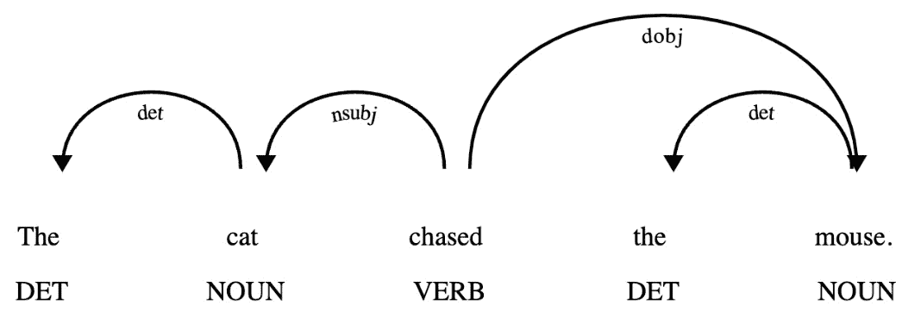
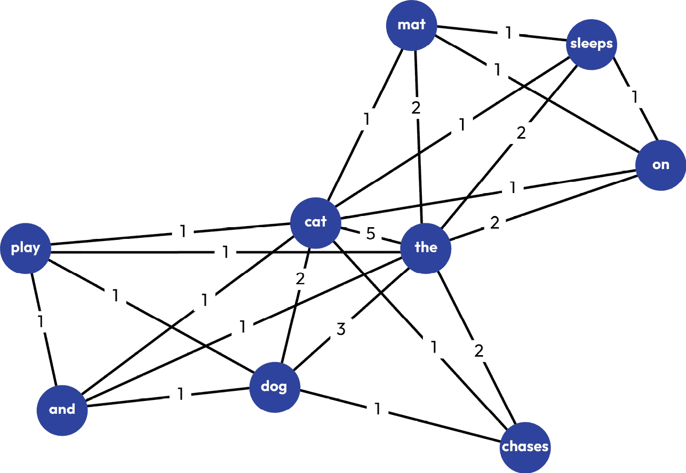
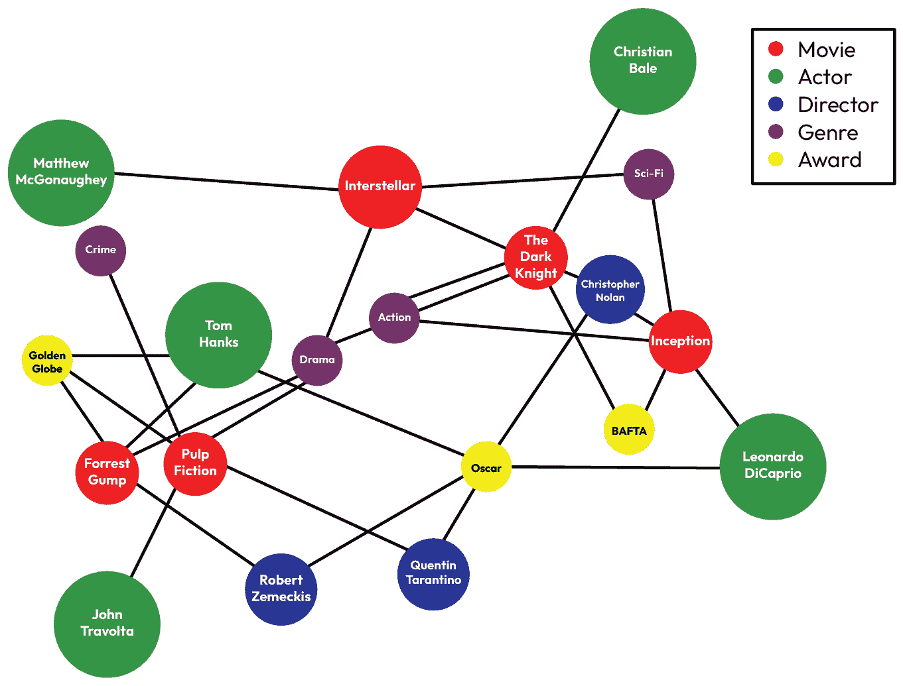
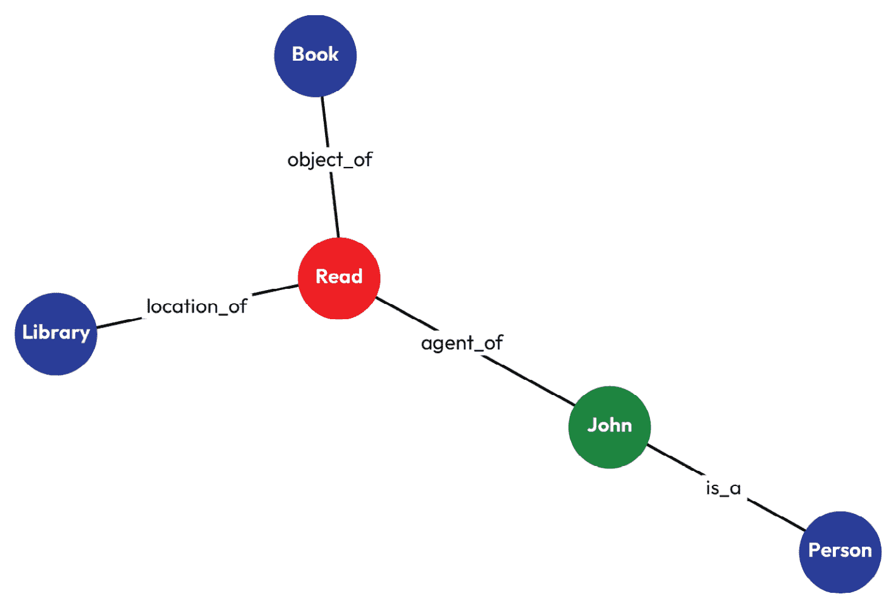
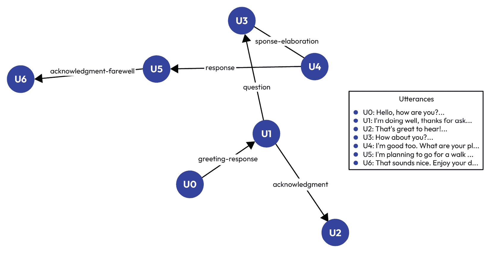
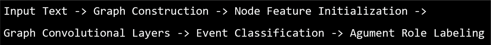
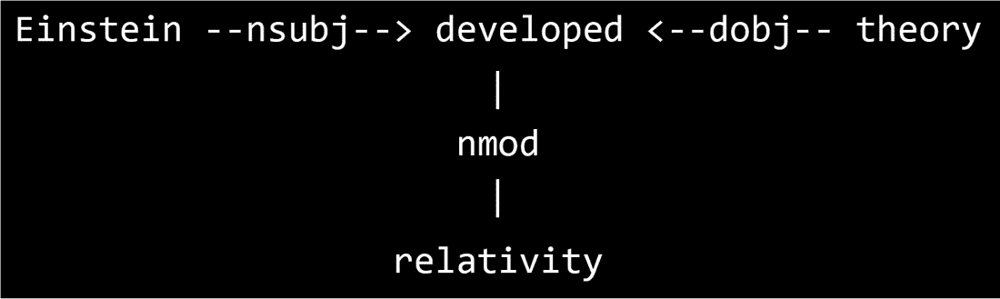
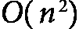
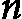

# 第八章：图深度学习与自然语言处理

语言本身天生就是结构化的和关系性的。词语组成句子，句子组成文档，这些文档包含了通过复杂方式相互关联的概念，以传达意义。图结构提供了一个理想的框架来捕捉这些错综复杂的关系，超越传统模型。通过将文本表示为图，我们可以利用图论的丰富表达力和深度学习的计算能力来解决挑战性的**自然语言处理**（**NLP**）问题。

在本章中，我们将深入探讨 NLP 中图表示的基本概念，探索各种类型的语言图，如依存树、共现网络和知识图。然后，我们将在此基础上，研究专门为语言任务适配的**图神经网络**（**GNNs**）的架构和机制。

我们将讨论以下主题：

+   图结构在 NLP 中的应用

+   基于图的文本摘要

+   使用 GNN 的**信息提取**（**IE**）

+   基于图的**对话系统**

# 图结构在 NLP 中的应用

自然语言处理（NLP）近年来取得了显著进展，基于图的方法作为一种强大的范式，开始在表示和处理语言信息方面崭露头角。在这一部分，我们介绍了 NLP 中的图结构概念，强调它们的重要性，并探讨了各种类型的语言图。

## 图表示在语言中的重要性

图表示在捕捉语言中的内在结构和关系方面起着至关重要的作用。它们相较于传统的顺序或**词袋模型**，提供了多个优势。词袋模型是一种简单的文本表示技术，它通过计算每个词的频率将文档转换为向量，忽略语法和词序：

+   **结构信息**：图结构可以明确表示语言的层级性和关系性，保留可能在线性表示中丢失的重要语言结构。

+   **上下文关系**：通过连接相关元素，图能够比顺序模型更有效地捕捉远程依赖和上下文信息。

+   **灵活性**：图结构可以表示不同层次的语言信息，从词级关系到文档级连接，甚至跨文档的链接。

+   **可解释性**：图表示通常与人类对语言结构的直观理解相符合，使得它们更具可解释性和可分析性。

+   **外部知识的整合**：图结构有助于将外部知识源（如本体论或知识库）整合进 NLP 模型。

+   **多模态整合**：图结构可以自然地表示不同模态之间的关系，例如文本、图像和语音。

## 语言图的类型

在自然语言处理中，常用几种图结构，每种结构捕捉语言信息的不同方面：

+   **依赖树**表示句子中词语之间的语法关系：

    +   **节点**是词语，**边**表示句法依赖关系。

    +   **示例**：在“*The cat chased the mouse*”中，根动词是“*chased*”，而“*cat*”和“*mouse*”是它的依赖词。*图 8.1* 展示了这个句子的依赖树表示，并说明了依赖树如何表示句子中词语之间的语法关系：



图 8.1 – 句子“The cat chased the mouse”的依赖树表示

图示将“*chased*”作为根动词，箭头表示与其他词的句法依赖关系，如“*cat*”（主语）和“*mouse*”（宾语）。它还包括每个词的词性标注，如**DET**（限定词）、**NOUN**（名词）和**VERB**（动词）。

+   **共现图**捕捉基于词语在语料库中共同出现的关联。它们在词义消歧和语义相似度等任务中非常有用。

    +   **节点**表示词汇，**边**表示它们共同出现的频率。

    +   **示例**：假设我们有以下句子：

        +   “*The cat and* *dog play.*”

        +   “*The dog chases* *the cat.*”

        +   “*The cat sleeps on* *the mat.*”

    在这个例子中，我们将创建一个共现图，其中出现在同一句子中的词语之间建立连接：



图 8.2 – 词汇共现图

+   **知识图谱**表示事实信息以及实体之间的关系：

    +   **节点**是实体（例如，人、地点、概念），**边**是关系。

    +   **示例**：一些例子包括 ConceptNet、Wikidata 和特定领域的本体。



图 8.3 – 电影行业知识图谱

*图 8.3* 展示了电影行业中各种元素之间的关系，包括导演、电影、类型和奖项。*节点*表示实体，如电影制片人（例如，**克里斯托弗·诺兰**、**昆汀·塔伦蒂诺**）、电影（例如，**星际穿越**、**低俗小说**）、类型（例如，**科幻**、**犯罪**）和奖项（例如，**奥斯卡**、**英国电影和电视艺术学院奖**）。这些节点之间的连接展示了创意人才、电影类别和行业认可之间复杂的相互作用，为电影及其关键人物的多面性提供了见解。

+   **语义图** 表示句子或文档的含义。它们用于语义分析和抽象意义表示等任务。在自然语言处理中，**语义解析** 是将自然语言表达转换为其含义的形式化、结构化表示的任务。它涉及将词语和短语映射到概念，识别关系，并生成捕捉输入文本潜在语义的逻辑形式或可执行代码。这一过程使得机器能够更准确和可操作地理解和处理人类语言。

    +   **节点** 可以是概念、事件或命题，**边** 显示语义关系。

    +   **示例**：*图 8.4* 中的语义图说明了句子 “*John read a book in the library*” 如何被分解成其组成部分和关系。图中的节点表示概念，边显示它们之间的语义关系：



图 8.4 – 语义图形表示

具体而言，该图显示了以下内容：

+   “*John*” 与 “*Read*” 通过 **agent_of** 标签连接，指示 John 是执行动作的人。

+   “*Book*” 与 “*Read*” 通过 **object_of** 标签连接，显示正在阅读的书籍。

+   “*Library*” 与 “*Read*” 通过 **location_of** 标签连接，指示阅读发生的地点。

+   “*John*” 也与 “*Person*” 通过 **is_a** 关系连接，将 John 归类为一个人。

+   **对话图** 表示更长文本或对话的结构，用于对话理解和文本连贯性分析等任务。

    +   **节点** 可以是句子或话语，**边** 显示话语关系。

    +   **示例**：*图 8.5* 描述了一个简单对话的语篇图，表示为一个简单对话。图中有七个节点（**U0** 到 **U6**），每个节点代表对话中的一句话，通过有向边连接，显示了话语之间的流动和关系。边上标有诸如 **greeting-response**、**acknowledgment**、**question**、**response** 和 **acknowledgment-farewell** 等话语关系。对话从问候开始（**U0**），接着是回应（**U1**），然后分支到承认（**U2**）和问题（**U3**）。对话继续以进一步的回应为特点，并以告别结束（**U6**）。图例提供了每个话语的简要片段，为对话流程提供上下文：



图 8.5 – 对话图：简单对话

这种可视化表示有效地展示了话语图如何用于分析对话的结构、一致性和进展，使其成为对话理解和文本一致性分析等任务的有价值工具。

现在，让我们来看看图学习在自然语言处理中的一些实际应用场景。

# 基于图的文本摘要

基于图的方法在文本摘要中变得越来越流行，因为它们能够捕捉文本元素之间的复杂关系。在这里，我们将探讨两大类基于图的摘要方法：抽取式和生成式。

## 使用图中心性进行抽取式摘要

**抽取式摘要** 涉及从原始文本中选择和排列最重要的句子，以形成一个简明的摘要。基于图的抽取式摘要方法通常遵循以下步骤：

1.  构建文本的图表示。

1.  应用中心性度量来识别重要的节点（句子）。

1.  提取排名靠前的句子来构成摘要。

### 图构建

文本被表示为一个图，其中 *节点* 是句子，*边* 表示句子之间的相似性。常见的相似性度量包括以下几种：

+   **词频-逆文档频率**（**TF-IDF**）向量的余弦相似性

+   **Jaccard 相似性** 的词集

+   **语义相似性** 使用词嵌入

### 中心性度量

可以使用几种 **图中心性** 度量来对句子的 importance 进行排序：

+   **度数中心性** 衡量节点的连接数。

+   **特征向量中心性** 考虑邻居节点的重要性。

+   **PageRank** 是特征向量中心性的一种变体，最初由 Google 用于对网页进行排名。

+   **超链接诱导主题搜索**（**HITS**）计算节点的中心和权威分数。

### 示例 – TextRank 算法

**TextRank**，由 Mihalcea 和 Tarau 在 2004 年提出（[`aclanthology.org/W04-3252/`](https://aclanthology.org/W04-3252/)），是一种受 PageRank 启发的流行图-based 抽取式摘要方法。

让我们来看一个简化的 Python 实现：

1.  首先，我们导入必要的库——**NetworkX** 用于图操作，**NumPy** 用于数值计算，**scikit-learn** 用于 TF-IDF 向量化和余弦相似性计算：

    ```py
    import networkx as nx
    import numpy as np
    from sklearn.metrics.pairwise import cosine_similarity
    from sklearn.feature_extraction.text import TfidfVectorizer
    ```

1.  然后，我们定义 **textrank** 函数，它接受一个句子列表和要返回的前几个句子的数量。它从句子中创建一个 TF-IDF 矩阵，并使用余弦相似性计算相似性矩阵：

    ```py
    def textrank(sentences, top_n=2):
        tfidf = TfidfVectorizer().fit_transform(sentences)
        similarity_matrix = cosine_similarity(tfidf)
    ```

1.  我们从相似性矩阵中创建一个图，并在该图上计算 **pagerank**。每个句子是一个 *节点*，而相似性是 *边的权重*：

    ```py
        graph = nx.from_numpy_array(similarity_matrix)
        scores = nx.pagerank(graph)
    ```

1.  最后，我们根据 **pagerank** 分数对句子进行排序，并返回前 **n** 个句子作为摘要：

    ```py
        ranked_sentences = sorted(((
            scores[i], s) for i, s in enumerate(sentences)
        ), reverse=True)
        return [s for _, s in ranked_sentences[:top_n]]
    ```

这是**textrank**函数的示例用法。在此案例中，我们定义了一个示例文本，将其拆分为句子，应用**textrank**算法，并打印摘要：

```py
text = """
Natural language processing (NLP) is a subfield of linguistics, computer science, and artificial intelligence concerned with the interactions between computers and human language. The ultimate objective of NLP is to read, decipher, understand, and make sense of human languages in a valuable way. NLP is used in many applications, including machine translation, speech recognition, and chatbots.
"""
sentences = text.strip().split('.')
summary = textrank(sentences)
print("Summary:", ' '.join(summary))
```

## 图到序列模型的抽象总结

**抽象总结**旨在生成新的句子，以捕捉原始文本的精髓。图到序列模型通过利用输入文本的结构信息，在这方面取得了有前景的结果。

对于抽象总结，图通常被构建来表示更细粒度的关系：

+   **节点**：单词、短语或概念

+   **边**：句法依赖关系、语义关系或共现

一个典型的图到序列模型用于抽象总结，通常包括以下内容：

+   **图编码器**使用 GNN（例如，**图卷积网络**（**GCNs**）或**图注意力网络**（**GATs**））来编码输入图。

+   **序列解码器**生成摘要文本，通常使用注意力机制来关注编码图的相关部分。

### 抽象意义表示（AMR）到文本的总结

**抽象意义表示**（**AMR**）是文本的语义图表示。**AMR 到文本总结**是图到序列抽象总结的一个例子。让我们考虑一个使用**PyTorch**的概念性示例：

1.  我们导入了必要的库——**PyTorch**用于深度学习操作，**PyTorch Geometric**用于 GNN，以及用于神经网络层和功能的特定模块：

    ```py
    import torch
    import torch.nn as nn
    import torch.nn.functional as F
    from torch_geometric.nn import GCNConv
    from torch_geometric.data import Data
    ```

1.  然后，我们定义了**AMRToTextSummarizer**类，这是一个神经网络模块。它初始化了一个 GCN 层，一个**门控循环单元**（**GRU**）层，以及一个全连接层：

    ```py
    class AMRToTextSummarizer(nn.Module):
        def __init__(self, input_dim, hidden_dim, output_dim):
            super().__init__()
            self.graph_conv = GCNConv(input_dim, hidden_dim)
            self.gru = nn.GRU(
                hidden_dim, hidden_dim, batch_first=True)
            self.fc = nn.Linear(hidden_dim, output_dim)
    ```

1.  这是网络的前向传播。我们首先应用图卷积来编码图结构，然后使用 GRU 进行序列解码，最后应用全连接层生成输出：

    ```py
        def forward(self, data):
            # Graph encoding
            x, edge_index = data.x, data.edge_index
            h = self.graph_conv(x, edge_index)
            h = F.relu(h)
            # Sequence decoding
            h = h.unsqueeze(0)  # Add batch dimension
            output, _ = self.gru(h)
            output = self.fc(output)
            return output
    ```

1.  我们设置模型参数并创建一个示例图以进行演示。在这里，我们定义了输入、隐藏层和输出的维度，并创建了一个包含三个节点的图：

    ```py
    input_dim = 100  # Dimension of input node features
    hidden_dim = 256
    output_dim = 10000  # Vocabulary size
    edge_index = torch.tensor([
        [0, 1, 2], [1, 2, 0]], dtype=torch.long)
    x = torch.randn(3, input_dim)
    data = Data(x=x, edge_index=edge_index)
    ```

1.  最后，我们实例化模型，使用示例数据进行前向传播，并打印输出 logits 的形状。输出形状为（1，3，10000），表示批次大小为 1，3 个节点，以及 10,000 个词汇的 logits：

    ```py
    model = AMRToTextSummarizer(input_dim, hidden_dim, output_dim)
    summary_logits = model(data)
    print("Summary logits shape:", summary_logits.shape)
    ```

这个示例演示了一个图到序列模型用于抽象总结的基本结构。实际上，将采用更复杂的架构、注意力机制和训练过程。

# 使用 GNN 的文本信息抽取（IE）

信息抽取（IE）是 NLP 中的一项关键任务，涉及从非结构化文本中自动提取结构化信息。GNN 在该领域取得了有前景的成果，特别是在事件抽取和开放信息抽取（Open IE）方面。在本节中，我们探讨了 GNN 如何应用于这些 IE 任务。

## 事件抽取

**事件提取**是识别和分类文本中提到的事件的任务，并确定其参与者和属性。由于 GNN 能够捕捉文档中实体和事件之间的复杂关系，因此在此任务中已被证明非常有效。

### 用于事件提取的图构建

在事件提取中，文档通常被表示为图，其中**节点**表示实体、事件和标记，而**边**表示各种关系，如句法依赖、共指链和时间顺序。

请考虑以下句子：“*约翰·史密斯于周一辞去 TechCorp 首席执行官职务*。”

图表示可能包括以下内容：

+   **节点**: 约翰·史密斯（人名）、TechCorp（公司名）、首席执行官（职位）、周一（时间）、辞职（事件）

+   **边**:（约翰·史密斯） -[AGENT]->（辞职），（辞职） -[ROLE]->（首席执行官），（辞职） -[ORG]->（TechCorp），（辞职） -[TIME]->（周一）

### 基于 GNN 的事件提取模型

基于 GNN 的事件提取模型通常包括以下内容：

1.  使用预训练的词嵌入或上下文嵌入对初始节点特征进行编码。

1.  通过应用多层图卷积来传播图中的信息。

1.  使用最终的节点表示来分类事件及其论据。

*图 8* *.6* 显示了一个示例架构：



图 8.6 – 基于 GNN 的事件提取模型架构和流程

一项最新研究（[`aclanthology.org/2021.acl-long.274/`](https://aclanthology.org/2021.acl-long.274/)）表明，基于 GNN 的模型在超越传统的基于序列的模型方面表现优越，尤其在捕捉长程依赖关系和处理单一文档中的多个事件时表现突出。具体来说，基于图的的方法在处理跨句子事件和多事件场景方面取得了显著的改进，这得益于一个异构图交互网络，该网络捕捉了全局上下文，并且有一个*追踪器*模块，模型了事件之间的相互依赖关系。该模型的有效性在提取涉及多个散布在不同句子中的论据的事件时尤为明显，这验证了 GNN 在捕捉长程依赖关系方面相比传统序列模型的优越性。

## 开放信息提取

**开放信息提取**（**OpenIE**）旨在从文本中提取关系三元组（主语、关系、宾语），而不受预定义关系集的限制。GNN 已成功应用于此任务，利用了句子的图结构特性。

### 基于图的开放信息提取方法

在基于图的开放信息提取（OpenIE）系统中，句子通常被转换为依赖解析树，然后作为 GNN 的输入图。

例如，在句子“*爱因斯坦提出了相对论*”中，依赖解析可能如下所示：



图 8.7 – 使用依赖解析的基于图的 OpenIE 方法

### GNN 处理 OpenIE

GNN 通过多个步骤处理图形：

1.  **节点编码**：每个单词使用上下文嵌入进行编码。

1.  **图卷积**：信息沿依赖边传播。

1.  **关系预测**：模型预测节点对之间的潜在关系。

1.  **三元组形成**：基于预测构建有效的主语-关系-宾语三元组。

使用我们之前的示例，输出将如下所示：（爱因斯坦，开发，相对论）。

## 基于 GNN 的信息提取的优势

基于 GNN 的信息提取方法提供了几个优势：

+   捕捉可能被顺序模型遗漏的长程依赖

+   将各种类型的语言信息（句法、语义、指代）整合到一个统一的框架中

+   处理具有复杂结构的文档，如科学论文或法律文档

该领域未来的研究可能会集中在将 GNN 与其他深度学习架构（如 transformers）结合，以创建融合两种方法优点的混合模型，从而实现更准确和全面的信息提取。

# 基于图的对话系统

对话系统是复杂的人工智能应用，旨在通过自然语言促进人机互动。这些系统采用各种 NLP 技术，如自然语言理解、对话管理和自然语言生成，来解释用户输入、维护上下文并生成适当的回应。现代对话系统通常结合机器学习算法，以提高其性能，并根据用户偏好和过去的互动进行自我学习和调整。它们在多个领域中都有应用，包括客户服务、虚拟助手、教育工具和互动故事讲述，不断发展以提供更自然和高效的人机沟通。

基于图的方法在提升对话系统的性能和能力方面展现了显著的前景。通过利用图结构来表示对话上下文、知识和语义关系，这些系统能够更好地理解用户意图、跟踪对话状态，并生成更连贯、上下文适当的回应。

## 使用 GNN 进行对话状态跟踪

**对话状态跟踪**（**DST**）是面向任务的对话系统中的一个关键组件，负责在整个对话过程中保持用户目标和偏好的最新表示。GNN 已成功应用于提高 DST 的准确性和鲁棒性。

在典型的基于 GNN 的 DST 方法中，对话历史被表示为图形，其中*节点*代表话语、槽位和数值，而*边*则捕捉这些元素之间的关系。随着对话的进行，图形会动态更新，GNN 层被应用于在图形中传播信息，从而实现更准确的状态预测。

例如，Chen 等人于 2020 年提出的**图状态追踪器**（**GST**）( [`doi.org/10.1609/aaai.v34i05.6250`](https://doi.org/10.1609/aaai.v34i05.6250) )使用 GAT 来建模不同对话元素之间的依赖关系。该方法在基准数据集如 MultiWOZ 上表现出了优越的性能，特别是在处理复杂的多领域对话时。

## 基于图的响应生成

图结构还可以显著提高生成响应的质量和相关性，无论是在任务导向型还是开放领域的对话系统中。通过结合知识图谱或对话流图，这些系统可以生成更具信息性、连贯性和上下文适宜性的响应。

一种方法是使用图到序列模型，其中输入的对话上下文首先被转换为图形表示，然后图感知解码器生成响应。这使得模型能够捕捉对话历史中的长程依赖关系和复杂关系。

例如，Yang 等人于 2021 年提出的**GraphDialog**模型( [`doi.org/10.18653/v1/2020.emnlp-main.147`](https://doi.org/10.18653/v1/2020.emnlp-main.147) )构建了一个对话图，捕捉了局部上下文（最近的话语）和全局上下文（整体对话流程）。该模型随后使用图注意力机制生成更符合整个对话历史的响应。该方法将对话表示为结构化的图，其中*节点*代表话语，*边*捕捉它们之间的各种关系，如时间序列和语义相似性。图结构使得模型能够更好地理解对话中的长程依赖关系和主题联系，超越了传统顺序模型的局限性。此外，图注意力机制帮助模型在生成响应时专注于相关的历史上下文，即使它发生在对话的许多轮之前。

该架构在维持长时间对话中的连贯性以及处理需要整合对话不同部分上下文的复杂多主题对话中表现出了特别的效果。

## 使用图的知识驱动对话

将外部知识纳入对话系统对于生成信息丰富且引人入胜的响应至关重要。基于图的方法提供了一种有效的方式，在对话模型中表示和利用大规模知识库。

知识图谱可以通过多种方式集成到对话系统中：

+   **作为事实信息源**：系统可以查询知识图谱以检索相关事实，并将其融入响应中。

+   **用于实体链接和消歧**：图结构可以帮助解决歧义，并将对话中的提及链接到知识库中的特定实体。

+   **引导响应生成**：图结构可以为生成过程提供指导，确保生成的响应与已知事实和关系一致。

这种方法的一个例子是**知识感知图增强 GPT-2**（**KG-GPT2**）模型，该模型由 W Lin 等人提出（[`doi.org/10.48550/arXiv.2104.04466`](https://doi.org/10.48550/arXiv.2104.04466)）。该模型将知识图谱集成到预训练的语言模型中，使其能够在开放领域的对话中生成更有信息量且事实正确的响应。

假设你正在使用虚拟助手规划伦敦之行。你首先询问关于酒店的信息，然后是餐厅，最后是交通工具。基于传统的 GPT-2 系统，可能难以在这些不同领域之间连接相关信息。例如，如果你提到想要“*伦敦市中心的豪华酒店*”，然后又询问“*我酒店附近的餐厅*”，系统需要理解你是在寻找伦敦市中心的高档餐厅。

上述论文中提出的模型通过使用图网络在相关信息之间建立连接来解决这个问题。它分为三个步骤：

1.  首先，它通过 GPT-2 处理你的对话以理解上下文。

1.  然后，它使用图注意力网络（GATs）来连接不同服务之间的相关信息（如位置、价格范围等）。

1.  最终，它利用这种增强的理解来更好地预测你想要的内容。

研究人员发现，当面对有限的训练数据时，这种方法尤其有效。换句话说，这意味着系统即使没有见过许多类似的对话，也能够学会做出良好的推荐。例如，如果它学到预订豪华酒店的人通常也会预订高档餐厅和高级出租车，它可以将这种模式应用到新的对话中。

他们的方法在现有系统上显示了显著的改进，尤其是在理解不同服务（如酒店和餐厅）之间的关系并保持对话的一致性方面。这使得该系统在实际应用中（如旅行预订或餐厅预定系统）更加自然和高效。

## 基于图的对话策略学习

在任务导向的对话系统中，图结构也可以被用来改善对话策略学习。通过将对话状态、动作空间和任务结构表示为图，强化学习算法能够更有效地探索和利用动作空间。

例如，2021 年陈等人提出的**基于图的对话策略**（**GDP**）框架（[`aclanthology.org/C18-1107`](https://aclanthology.org/C18-1107)）使用 GNN 来建模不同对话状态和行动之间的关系。该方法可以更高效地进行策略学习，特别是在复杂的多领域场景中。

使用图形进行语言理解存在一个潜在的可扩展性问题，这与非线性记忆复杂度相关。基于图的自然语言处理中的二次记忆复杂度问题源于，当将文本转换为一个完全连接的图时，每个标记/词语都需要与其他每个标记连接，从而导致的连接，其中是序列长度。

例如，在一份 1,000 字的文档中，必须在内存中存储 100 万个边。对于类似于 Transformer 的架构，这尤其成问题，因为每个连接还存储了注意力权重和边特征。现代自然语言处理任务通常需要处理更长的序列或同时处理多个文档，这使得这种二次扩展在内存使用和计算资源方面变得不可持续。常见的缓解策略包括稀疏注意力机制、层次图结构和滑动窗口方法，但这些方法可能会丧失文本中的重要长程依赖性。有关可扩展性问题的更深入讨论，请参见*第五章*。

# 总结

本章涵盖了广泛的主题，从自然语言处理中的图表示基础概念开始，逐步深入到各种应用。包括基于图的文本摘要、使用 GNN 的信息抽取（IE）、开放信息抽取（OpenIE）、将自然语言映射到逻辑、基于知识图谱的问答和基于图的对话系统。

你已经了解到，基于图的方法为增强对话系统的各个方面提供了强大的工具，从状态跟踪到响应生成和策略学习。随着该领域研究的不断深入，我们可以期待看到更多利用图表示提供的丰富结构信息的更复杂、更强大的对话系统。

在下一章中，我们将探讨图学习在推荐系统中的一些非常常见的应用场景。
