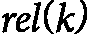

# 第九章：使用图神经网络构建推荐系统

**推荐系统**已经成为我们数字化生活的重要组成部分，深刻地影响了我们与各种内容、产品和服务的互动方式。从电商巨头亚马逊到流媒体平台 Netflix，再到社交媒体网络 Facebook，这些系统在提升用户体验、推动互动和提升业务成果方面发挥着至关重要的作用。当我们深入探讨使用图神经网络构建推荐系统时，了解这些系统的发展历程以及基于图的方法的变革潜力至关重要。

传统上，推荐系统依赖于**协同过滤**（**CF**）、基于内容的过滤和混合方法等技术。尽管这些方法在一定程度上取得了成功，但它们往往未能充分捕捉到用户-物品交互的复杂性和互联性，以及围绕这些交互的丰富上下文信息。这就是图神经网络进入的地方，它为我们处理推荐任务提供了一种范式转变。

基于图的推荐方法提供了诸多优势，包括能够为多种信息类型提供丰富的多模态表示，捕捉超越直接用户-物品交互的高阶关系，通过信息传播有效处理数据稀疏问题，具备解决冷启动问题的归纳学习能力，通过图结构分析增强可解释性，并且灵活地融入各种类型的辅助信息和异构数据。综合来看，这些特点使得基于图的方法能够通过利用用户-物品交互数据及相关上下文信息中固有的复杂关系和结构，提供更全面、准确和适应性强的推荐。

在本章内容中，我们将探讨以下主题：

+   推荐系统的基本原理

+   推荐系统中的图结构

+   基于图的推荐模型

+   训练图神经网络模型

+   基于图的推荐系统的可解释性

+   **冷启动问题**

# 推荐系统的基本原理

推荐系统，也称为 **推荐引擎**，是旨在预测和建议用户可能感兴趣或相关的项目或内容的智能算法。这些系统通过分析用户行为、偏好和项目特征中的模式，生成个性化的推荐。推荐系统的主要目的是通过提供相关内容来提升用户体验，增加用户参与度和留存率，推动电子商务平台的销售和转化，帮助在庞大的项目目录中发现内容，并在各个领域个性化服务。推荐系统在解决信息过载问题中发挥着至关重要的作用，通过根据用户偏好和行为过滤和优先排序内容。

推荐系统已经成为我们数字体验中不可或缺的一部分，影响着我们在电子商务、娱乐、社交媒体等各个领域的选择。本节将深入探讨推荐系统的核心概念、类型和评估指标，为理解其在现代应用中的作用奠定坚实的基础。

假设我们正在考虑一个流媒体服务，它正在为其用户构建一个推荐系统。该公司拥有用户与电影的交互数据以及每部电影的元数据。我们将探讨如何利用这些数据提供更好的推荐，并有效地提高用户的净推荐值和观看时长。

## 推荐系统的类型

推荐系统主要有三种类型，每种类型都有其独特的推荐生成方法：

+   **协同过滤（CF）** 基于这样一个前提：过去有相似偏好的用户，未来也会有相似的偏好。它利用用户与物品的交互数据来识别模式并做出预测。主要有两种方法：基于用户的协同过滤，它会推荐类似用户喜欢的物品；基于物品的协同过滤，它会推荐与用户过去喜欢的物品相似的物品。协同过滤的优势在于能够捕捉复杂的用户偏好，并且在数据稀疏的情况下表现良好。然而，它也面临一些挑战，如新用户或新物品的冷启动问题以及在大数据集中的可扩展性问题。

    在我们的电影推荐系统中，假设有一位用户 Alice，她给几部电影打了很高的分数，包括 *《肖申克的救赎》*（5 星）、*《低俗小说》*（4 星）和 *《教父》*（5 星）。基于用户的协同过滤（CF）会找到与 Alice 有相似评分模式的用户，例如 Bob，他给这些电影打的分也很相似，并且给 *《盗梦空间》* 打了高分。因此，系统可能会根据 Bob 的高评分推荐 *《盗梦空间》* 给 Alice。而基于物品的协同过滤（CF）则会找到与 Alice 高评分的电影相似的电影。它可能会发现喜欢 *《肖申克的救赎》* 的用户也喜欢 *《绿里奇迹》*，从而向 Alice 推荐这部电影。

+   **基于内容的过滤**根据物品的特征和用户过去的偏好推荐物品。它为每个用户和物品构建一个基于其特征的档案，并使用用户档案与物品特征之间的相似度来生成推荐。这种方法的优点是能为推荐提供解释，并且对于小众物品效果良好。然而，它在扩展用户兴趣方面存在局限性，并且需要丰富的物品元数据。在我们的电影示例中，我们会分析 Alice 喜欢的电影特征，如《肖申克的救赎》（剧情片，由弗兰克·达拉邦特执导，蒂姆·罗宾斯和摩根·弗里曼主演，1994 年上映）和《教父》（犯罪/剧情片，由弗朗西斯·福特·科波拉执导，马龙·白兰度和阿尔·帕西诺主演，1972 年上映）。在这种情况下，系统可能会推荐其他 1970 年代或 1990 年代的剧情电影，或者推荐有摩根·弗里曼或阿尔·帕西诺出演的影片。

+   **混合系统**结合了多种推荐方法，利用它们的优势并减少其弱点。常见的混合策略包括加权方法，这些方法结合来自不同推荐系统的得分；切换方法，根据上下文选择不同的推荐系统；以及特征组合技术，利用来自不同来源的特征作为单一推荐系统的输入。混合系统通常能提供更好的性能，但在设计和实施方面带来了更大的复杂性。在我们的示例中，混合方法可能会结合协同过滤（CF）和基于内容的过滤。它可以使用 CF 来找到与 Alice 相似的用户，然后根据她偏好的内容特征，如偏爱某些年代的电视剧或电影，过滤这些推荐结果。

*表 9.1* 提供了不同类型的比较，突出了它们的关键特征、优点和局限性：

| **特征** | **协同过滤（CF）** | **基于内容的过滤** | **混合系统** |
| --- | --- | --- | --- |
| 所需数据 | 用户-物品交互 | 物品特征和用户偏好 | 两种类型的数据 |
| 优点 | - 能很好地捕捉用户偏好 - 发现新兴趣 - 在物品信息最少的情况下有效 | - 物品无冷启动问题 - 可以解释推荐 - 适合小众物品 | - 更高的准确性 - 克服单一方法的局限性 - 更加稳健 |
| 缺点 | - 冷启动问题 - 稀疏性问题 - 对新物品有限制 | - 限制偶然性 - 需要详细的物品特征 - 过度专门化 | - 实现复杂 - 计算开销大 - 需要更多数据 |
| 最佳使用场景 | 电子商务、社交媒体 | 新闻文章、专业内容 | 大型平台、流媒体服务 |

表 9.1 – 不同推荐系统类型的比较

## 关键指标与评估

评估推荐系统的性能对于理解其有效性和指导改进至关重要。常用的几个指标和评估技术包括：

### 准确性指标

这是我们定义这些常用度量的方法：

+   **精度**衡量推荐项中相关项所占的比例：

    +   精度 = （相关推荐项的数量） / （推荐项的总数）

+   **召回率**衡量成功推荐的相关项所占的比例：

    +   召回率 = （相关推荐项的数量） / （相关项的总数）

+   **F1 得分**是精度和召回率的调和均值，提供一个平衡的衡量：

    +   F1 = 2 × (精度 × 召回率) / (精度 + 召回率)

+   **均值平均精度**（**MAP**）计算每个用户的平均精度分数的均值：

    +   ![<mml:math  ><mml:mi>M</mml:mi><mml:mi>A</mml:mi><mml:mi>P</mml:mi><mml:mi mathvariant="normal"> </mml:mi><mml:mo>=</mml:mo><mml:mi mathvariant="normal"> </mml:mi><mml:mfenced separators="|"><mml:mrow><mml:mfrac><mml:mrow><mml:mn>1</mml:mn></mml:mrow><mml:mrow><mml:mfenced open="|" close="|" separators="|"><mml:mrow><mml:mi>U</mml:mi></mml:mrow></mml:mfenced></mml:mrow></mml:mfrac><mml:mo>⋅</mml:mo><mml:mi mathvariant="normal"> </mml:mi><mml:mi mathvariant="normal">Σ</mml:mi><mml:mfenced separators="|"><mml:mrow><mml:mi>A</mml:mi><mml:mi>P</mml:mi><mml:mfenced separators="|"><mml:mrow><mml:mi>u</mml:mi></mml:mrow></mml:mfenced></mml:mrow></mml:mfenced></mml:mrow></mml:mfenced></mml:math>](img/217.png)，其中我们有以下内容：

        +    是用户的数量。

        +    是该用户的平均精度，。

        +    / 相关项的数量

        +    是截断点的精度，。

        +    是指示函数（如果项 相关则为 1，否则为 0）。

+   **规范化折扣累积增益**（**NDCG**）衡量排名的质量，同时考虑推荐列表中相关项的位置：

    +   ，其中我们有以下内容：

        +   ![<mml:math  ><mml:mi>D</mml:mi><mml:mi>C</mml:mi><mml:mi>G</mml:mi><mml:mfenced separators="|"><mml:mrow><mml:mi>D</mml:mi><mml:mi>i</mml:mi><mml:mi>s</mml:mi><mml:mi>c</mml:mi><mml:mi>o</mml:mi><mml:mi>u</mml:mi><mml:mi>n</mml:mi><mml:mi>t</mml:mi><mml:mi>e</mml:mi><mml:mi>d</mml:mi><mml:mi mathvariant="normal"> </mml:mi><mml:mi>C</mml:mi><mml:mi>u</mml:mi><mml:mi>m</mml:mi><mml:mi>u</mml:mi><mml:mi>l</mml:mi><mml:mi>a</mml:mi><mml:mi>t</mml:mi><mml:mi>i</mml:mi><mml:mi>v</mml:mi><mml:mi>e</mml:mi><mml:mi mathvariant="normal"> </mml:mi><mml:mi>G</mml:mi><mml:mi>a</mml:mi><mml:mi>i</mml:mi><mml:mi>n</mml:mi></mml:mrow></mml:mfenced><mml:mo>=</mml:mo><mml:mi mathvariant="normal">Σ</mml:mi><mml:mfenced separators="|"><mml:mrow><mml:mi>r</mml:mi><mml:mi>e</mml:mi><mml:msub><mml:mrow><mml:mi>l</mml:mi></mml:mrow><mml:mrow><mml:mi>i</mml:mi></mml:mrow></mml:msub><mml:mo>/</mml:mo><mml:mrow><mml:mrow><mml:msub><mml:mrow><mml:mi mathvariant="normal">log</mml:mi></mml:mrow><mml:mrow><mml:mn>2</mml:mn></mml:mrow></mml:msub></mml:mrow><mml:mo>⁡</mml:mo><mml:mrow><mml:mfenced separators="|"><mml:mrow><mml:mi>i</mml:mi><mml:mo>+</mml:mo><mml:mn>1</mml:mn></mml:mrow></mml:mfenced></mml:mrow></mml:mrow></mml:mrow></mml:mfenced></mml:math>](img/227.png)

        +    是理想的 （最大可能的 ）。

        +    是位置  上项目的相关性得分。

        +    是排名列表中的位置。

假设我们向爱丽丝推荐了五部电影，她最终喜欢了其中三部，那么精度将为 3/5 = 0.6 或 60%。如果爱丽丝总共会喜欢 10 部电影，那么召回率为 3/10 = 0.3 或 30%。F1 分数作为一种平衡度量，在这种情况下大约为 0.4 或 40%。

### 错误度量

错误度量通常衡量预测评分与实际评分之间的平均差异，例如以下情况：

+   **均方误差**（**MAE**）衡量预测评分与实际评分之间的平均绝对差异：

    +   ![<math ><mrow><mrow><mi>M</mi><mi>A</mi><mi>E</mi><mo>=</mo><mi mathvariant="normal">Σ</mi><mfenced open="|" close="|"><mrow><mi mathvariant="normal">a</mi><mi mathvariant="normal">c</mi><mi mathvariant="normal">t</mi><mi mathvariant="normal">u</mi><mi mathvariant="normal">a</mi><mi mathvariant="normal">l</mi><mo>−</mo><mi mathvariant="normal">p</mi><mi mathvariant="normal">r</mi><mi mathvariant="normal">e</mi><mi mathvariant="normal">d</mi><mi mathvariant="normal">i</mi><mi mathvariant="normal">c</mi><mi mathvariant="normal">t</mi><mi mathvariant="normal">e</mi><mi mathvariant="normal">d</mi></mrow></mfenced><mo>/</mo><mi>n</mi></mrow></mrow></math>](img/234.png)，其中  是预测的数量

+   **均方根误差**（**RMSE**）与 MAE 相似，但对大误差的惩罚更加严格：

    +   ![<mml:math  ><mml:mi>R</mml:mi><mml:mi>M</mml:mi><mml:mi>S</mml:mi><mml:mi>E</mml:mi><mml:mo>=</mml:mo><mml:mo>√</mml:mo><mml:mo>(</mml:mo><mml:mi mathvariant="normal">Σ</mml:mi><mml:mo>(</mml:mo><mml:mi mathvariant="normal">a</mml:mi><mml:mi mathvariant="normal">c</mml:mi><mml:mi mathvariant="normal">t</mml:mi><mml:mi mathvariant="normal">u</mml:mi><mml:mi mathvariant="normal">a</mml:mi><mml:mi mathvariant="normal">l</mml:mi><mml:mo>-</mml:mo><mml:mi mathvariant="normal">p</mml:mi><mml:mi mathvariant="normal">r</mml:mi><mml:mi mathvariant="normal">e</mml:mi><mml:mi mathvariant="normal">d</mml:mi><mml:mi mathvariant="normal">i</mml:mi><mml:mi mathvariant="normal">c</mml:mi><mml:mi mathvariant="normal">t</mml:mi><mml:mi mathvariant="normal">e</mml:mi><mml:mi mathvariant="normal">d</mml:mi><mml:msup><mml:mrow><mml:mo>)</mml:mo></mml:mrow><mml:mrow><mml:mn>2</mml:mn></mml:mrow></mml:msup><mml:mo>/</mml:mo><mml:mi>n</mml:mi><mml:mo>)</mml:mo></mml:math>](img/236.png)

例如，如果我们为五部电影预测了评分，且我们预测与 Alice 实际评分之间的平均差距为 0.42 星，这就是我们的 MAE。这表明，平均而言，我们的预测偏差大约是 0.42 星。

### 覆盖率、多样性和意外性

覆盖率指标评估系统推荐广泛物品的能力。**物品覆盖率**衡量系统能够推荐的目录中物品的百分比，而**用户覆盖率**则表示系统能够为多少用户生成推荐。在我们的电影系统中，我们可能会衡量我们能够推荐目录中 3,000 部电影的百分比（物品覆盖率），以及我们 1,000 个用户中有多少收到推荐（用户覆盖率）。

同时，多样性指标评估推荐项目之间的多样性（或不相似性），确保用户收到的建议是多样的，而不是相似的。另一方面，**意外性**则评估系统提供意想不到但相关的推荐的能力，为用户创造愉悦的惊喜。它结合了意外性和相关性两个元素，通常通过意外性得分和相关性评估来衡量。虽然两者相关，但多样性和意外性是不同的：多样化的推荐不一定总是意外的，意外的推荐通常会增加多样性，但反之则不然。

这些指标对于创建一个平衡的推荐系统至关重要，该系统能够为用户提供多样化、有趣且令人惊喜的推荐（更多内容请参见 [`doi.org/10.1145/2926720`](https://doi.org/10.1145/2926720) ）。

### A/B 测试和用户反馈

尽管离线指标提供了有价值的见解，但实际表现最好通过**A/B 测试**和**用户反馈**来评估。A/B 测试涉及通过与真实用户比较两个版本的推荐系统，并衡量关键绩效指标，如点击率、转化率或用户参与度。用户反馈，无论是显式（通过评分或调查）还是隐式（通过点击或购买行为），对于持续改进和验证推荐系统至关重要。长期的用户满意度，通过用户留存率和参与度指标来衡量，也是评估推荐对用户信任和平台忠诚度影响的重要因素。

评估推荐系统需要一种整体性的方法，既考虑离线指标，也考虑实际表现。随着推荐系统的日益复杂，尤其是图深度学习技术的整合，评估方法不断发展，以捕捉推荐质量和用户满意度的细微方面。

# 推荐系统中的图结构

图结构已成为建模推荐系统中复杂关系的强大范式。通过将用户、项目及其交互表示为图中的节点和边缘，我们可以捕获传统基于矩阵的方法常常忽略的丰富、多维的信息。

## 用户-项目交互图

基于图的推荐系统的基础是**用户-项目交互图**。在这个结构中，用户和项目被表示为*节点*，而交互（例如评分、观看或购买）则形成它们之间的*边缘*。

对于电影推荐系统，图可能如下所示：

+   **节点** ：用户（U1，U2，U3……）和电影（M1，M2，M3……）

+   **边缘** ：评分或观看（例如，U1 -> M1，权重为 4 星）

这个简单的结构已经可以进行比传统用户-项目矩阵更细致的分析。例如，我们可以轻松识别以下内容：

+   流行电影（有许多入边的节点）

+   活跃用户（具有许多出边的节点）

+   相似的用户或电影（具有相似边缘模式的节点）

假设用户 U1 已观看并评价过电影 M1（4 星）、M2（3 星）和 M3（5 星）。为了向 U1 推荐新电影，我们可以遍历图，找到评分模式相似的用户，推荐他们喜欢但 U1 尚未观看的电影。

## 融入附加信息

现实世界的推荐系统通常可以访问超出用户-项目交互的数据。图结构擅长无缝地整合这些附加信息。在电影推荐中，我们可能会通过以下方面来增强我们的图：

+   **电影属性**：

    +   类型（动作、喜剧、剧情等）

    +   导演

    +   演员

    +   上映年份

+   **用户属性**：

    +   年龄

    +   性别

    +   位置

+   **社交连接**：

    +   用户之间的好友关系

这些额外的节点和边缘创建了一个异构图，其中不同类型的节点和关系共存。这种丰富的结构使得更复杂的推荐算法成为可能。让我们扩展一下之前的例子。现在，电影 M1 有了额外的连接：

+   **类型**：动作

+   **导演**：D1

+   **演员**：A1, A2

用户 U1 与以下方面相关联：

+   **年龄** **组**：25-34

+   **位置**：纽约

通过遍历这个增强后的图，我们可以做出更细致的推荐。例如，我们可以推荐一部由 D1 导演的动作片，这部片子在 U1 所在的纽约地区的同龄人群体中很受欢迎，即使它与 U1 之前观看的电影没有直接关联。

## 时间图

时间是推荐系统中的一个关键因素，尤其是对于电影这样的领域，偏好变化可能非常迅速。**时间图**将时间信息融入图结构。

有几种方法可以在图中表示时间：

+   **时间戳边缘**：每个交互边缘都包含一个时间戳

+   **基于时间的节点拆分**：为同一用户或项目在不同时间点创建多个节点

+   **动态图**：图结构本身会演变，节点和边缘会出现或消失

对于电影推荐，时间图可以捕捉以下内容：

+   用户偏好的变化

+   电影流行度的生命周期

+   观看习惯的季节性趋势

假设用户 U1 在 2020 年主要观看喜剧片，但在 2021 年转向观看剧情片。时间图会保留这一信息，使推荐系统能够优先考虑用户最近的偏好，同时仍然考虑长期模式。

我们可能这样表示：

```py
U1_2020 -> M1 (Comedy, watched Jan 2020)
U1_2020 -> M2 (Comedy, watched Jun 2020)
U1_2021 -> M3 (Drama, watched Jan 2021)
U1_2021 -> M4 (Drama, watched May 2021)
```

这种结构使得顺序推荐成为可能，系统可以根据用户最近的观看历史和整体趋势推荐下一部电影。

## 多关系图

在电影推荐等复杂领域中，不同类型的关系常常共存。**多关系图**使我们能够显式地表示这些多样化的连接。

对于电影，我们可能有以下几种关系：

+   **用户-电影** : **"已评分"** , **"已观看"** , 和 **"已加入心愿单"**

+   **用户-用户** : **"是朋友"** 和 **"有相似的品味"**

+   **电影-电影** : **"有相同的类型"** , **"有相同的导演"** , 和 **"是续集"**

每种关系在推荐过程中可以具有不同的语义和重要性。以下是一个例子：

```py
U1 --("rated", 5)-> M1
U1 --("is friends with")-> U2
U2 --("rated", 4)-> M2
M1 --("has same director")-> M2
```

这种多关系结构使得基于路径的推荐变得更加复杂。例如，我们可能会因为以下原因推荐 M2 给 U1：

+   U1 的朋友 U2 给予了高度评价。

+   它与 U1 喜欢的 M1 有相同的导演。

通过利用这些复杂的关系，多关系图使得推荐更加具备上下文性和可解释性。

图结构在捕捉复杂关系、整合多样化信息源和建模时间动态方面表现出色。正如我们在后续章节中所看到的，这些丰富的图结构为复杂的深度学习模型奠定了基础，能够生成高度个性化且精准的推荐。

# 基于图的推荐模型

基于图的推荐模型作为捕捉用户与项目之间复杂关系的强大工具，已在推荐系统中崭露头角。这些模型利用用户-项目交互图中固有的丰富结构信息，生成更加准确和个性化的推荐。在本节中，我们将探讨三种主要的基于图的推荐模型，从带有图正则化的**矩阵分解**（**MF**）开始。

## 带有图正则化的 MF

**MF**是 CF 中的一种基本技术，它与图结构的结合使得推荐质量得到了显著提升。**图正则化**在 MF 模型中的作用是帮助将用户-项目交互图的结构信息纳入学习过程中。

基本思路是向传统 MF 目标函数中添加一个正则化项，鼓励图中相连的节点具有相似的潜在表示。这种方法有助于捕捉用户-项目图的局部结构，并能产生更准确的推荐。

对于电影推荐，考虑一个场景，其中用户和电影是节点，评分是边。图正则化项会鼓励那些评分相似的用户拥有相似的潜在因素，并且那些被相似评分的电影也会拥有相似的潜在因素。

带有图正则化的 MF 的典型目标函数可能如下所示：

![<math  display="block"><mrow><mrow><mi>L</mi><mspace width="0.25em" /><mo>=</mo><mspace width="0.25em" /><msub><mi mathvariant="normal">Σ</mi><mrow><mfenced open="(" close=")"><mrow><mi>u</mi><mo>,</mo><mi>i</mi></mrow></mfenced><mspace width="0.25em" /><mi mathvariant="normal">ϵ</mi><mspace width="0.25em" /><mi>o</mi></mrow></msub><msup><mfenced open="(" close=")"><mrow><msub><mi>r</mi><mrow><mi>u</mi><mi>i</mi><mspace width="0.25em" /></mrow></msub><mo>−</mo><mspace width="0.25em" /><msubsup><mi>p</mi><mi>u</mi><mi>T</mi></msubsup><msub><mi>q</mi><mi>i</mi></msub></mrow></mfenced><mn>2</mn></msup><mspace width="0.25em" /><mo>+</mo><mspace width="0.25em" /><mi>λ</mi><mfenced open="(" close=")"><mrow><mo>∥</mo><mi>P</mi><msubsup><mo>∥</mo><mi>F</mi><mn>2</mn></msubsup><mspace width="0.25em" /><mo>+</mo><mspace width="0.25em" /><mo>∥</mo><mi>Q</mi><msubsup><mo>∥</mo><mi>F</mi><mn>2</mn></msubsup></mrow></mfenced><mspace width="0.25em" /><mo>+</mo><mspace width="0.25em" /><mi>α</mi><mspace width="0.25em" /><msub><mi mathvariant="normal">Σ</mi><mrow><mfenced open="(" close=")"><mrow><mi>u</mi><mo>,</mo><mi>v</mi></mrow></mfenced><mspace width="0.25em" /><mi mathvariant="normal">ϵ</mi><mspace width="0.25em" /><msub><mi mathvariant="normal">ℇ</mi><mi>u</mi></msub></mrow></msub><mo>∥</mo><msub><mi>p</mi><mi>u</mi></msub><mo>−</mo><mspace width="0.25em" /><msub><mi>p</mi><mi>v</mi></msub><msup><mo>∥</mo><mn>2</mn></msup><mspace width="0.25em" /><mo>+</mo><mspace width="0.25em" /><mi>β</mi><mspace width="0.25em" /><msub><mi mathvariant="normal">Σ</mi><mrow><mfenced open="(" close=")"><mrow><mi>i</mi><mo>,</mo><mi>j</mi></mrow></mfenced><mspace width="0.25em" /><mi mathvariant="normal">ϵ</mi><mspace width="0.25em" /><msub><mi mathvariant="normal">ℇ</mi><mi>i</mi></msub></mrow></msub><mspace width="0.25em" /><mo>∥</mo><msub><mi>q</mi><mi>i</mi></msub><mo>−</mo><mspace width="0.25em" /><msub><mi>q</mi><mi>j</mi></msub><msup><mo>∥</mo><mn>2</mn></msup></mrow></mrow></math>](img/237.png)

这里， 和  分别是用户的潜在因子  和物品的潜在因子 ， 和  是用户-用户图和物品-物品图中的边集，而  和  是正则化参数。

该方法在传统的 MF（矩阵分解）方法上表现出更好的性能，特别是在数据稀疏的场景下，因为它能够利用图结构为交互较少的用户或物品做出更好的预测。

## 图神经网络模型

正如我们在*第四章*中看到的，**图神经网络** (**GNNs**) 通过在图结构数据上进行直接学习，革命性地改变了基于图的推荐领域。以下模型能够捕捉高阶连接模式，并学习丰富的节点表示，结合了节点特征和图结构。

### PinSage

**PinSage** 是由 Pinterest 开发的一个开创性 GNN 模型，用于大规模推荐系统。它采用**GraphSAGE**架构，有效地为 Web 规模图中的节点生成嵌入。

在电影推荐的背景下，PinSage 可以用来为用户和电影生成嵌入。该模型会聚合节点的局部邻域信息，不仅捕捉直接交互，还能捕捉更高阶的关系。例如，它可以识别出两个没有看过相同电影的用户，如果他们观看过相似的电影，可能仍然具有相似的口味。

PinSage 的关键步骤如下：

1.  **邻域采样**：对于每个节点，采样固定数量的邻居，以使大规模图上的计算变得可行。

1.  **特征聚合**：使用可学习的聚合函数从采样的邻居中聚合特征。

1.  **嵌入生成**：将聚合的邻域信息与节点特征结合，生成最终的嵌入。

### 神经图协同过滤

**神经图协同过滤** (**NGCF**) 显式地将用户-物品图结构融入到嵌入学习过程中。它在用户-物品交互图上传播嵌入，以捕捉协同信号。

对于电影推荐，NGCF 从用户和电影的初始嵌入开始，然后通过沿着用户-电影交互图的边传递信息，逐步更新这些嵌入。这个过程使得模型能够捕捉用户与电影之间的高阶连接性。

NGCF 中的嵌入更新过程可以描述如下：

![<mml:math   display="block"><mml:msubsup><mml:mrow><mml:mi>e</mml:mi></mml:mrow><mml:mrow><mml:mi>u</mml:mi></mml:mrow><mml:mrow><mml:mfenced separators="|"><mml:mrow><mml:mi>k</mml:mi></mml:mrow></mml:mfenced></mml:mrow></mml:msubsup><mml:mi> </mml:mi><mml:mo>=</mml:mo><mml:mi> </mml:mi><mml:mi>σ</mml:mi><mml:mi> </mml:mi><mml:mfenced separators="|"><mml:mrow><mml:msubsup><mml:mrow><mml:mi>W</mml:mi></mml:mrow><mml:mrow><mml:mn>1</mml:mn></mml:mrow><mml:mrow><mml:mfenced separators="|"><mml:mrow><mml:mi>k</mml:mi></mml:mrow></mml:mfenced></mml:mrow></mml:msubsup><mml:msubsup><mml:mrow><mml:mi>e</mml:mi></mml:mrow><mml:mrow><mml:mi>u</mml:mi></mml:mrow><mml:mrow><mml:mfenced separators="|"><mml:mrow><mml:mi>k</mml:mi><mml:mo>-</mml:mo><mml:mn>1</mml:mn></mml:mrow></mml:mfenced></mml:mrow></mml:msubsup><mml:mi> </mml:mi><mml:mo>+</mml:mo><mml:mi> </mml:mi><mml:mrow><mml:munderover><mml:mo stretchy="false">∑</mml:mo><mml:mrow><mml:mi> </mml:mi><mml:mi>i</mml:mi><mml:mi>ϵ</mml:mi><mml:msub><mml:mrow><mml:mi>N</mml:mi></mml:mrow><mml:mrow><mml:mi>u</mml:mi></mml:mrow></mml:msub></mml:mrow><mml:mrow><mml:mi> </mml:mi></mml:mrow></mml:munderover><mml:mrow><mml:mfrac><mml:mrow><mml:mn>1</mml:mn></mml:mrow><mml:mrow><mml:msqrt><mml:mfenced open="|" close="|" separators="|"><mml:mrow><mml:msub><mml:mrow><mml:mi>N</mml:mi></mml:mrow><mml:mrow><mml:mi>u</mml:mli></mml:mrow></mml:msub></mml:mrow></mml:mfenced><mml:mfenced open="|" close="|" separators="|"><mml:mrow><mml:msub><mml:mrow><mml:mi>N</mml:mi></mml:mrow><mml:mrow><mml:mi>i</mml:mrow></mml:msub></mml:mrow></mml:mfenced><mml:msqrt></mml:mrow></mml:mfrac><mml:msubsup><mml:mrow><mml:mi>W</mml:mi></mml:mrow><mml:mrow><mml:mn>2</mml:mn></mml:mrow><mml:mrow><mml:mfenced separators="|"><mml:mrow><mml:mi>k</mml:mi></mml:mrow></mml:mfenced></mml:mrow></mml:msubsup></mml:mrow></mml:mrow><mml:msubsup><mml:mrow><mml:mi>e</mml:mi></mml:mrow><mml:mrow><mml:mi>i</mml:mrow><mml:mrow><mml:mfenced separators="|"><mml:mrow><mml:mi>k</mml:mi><mml:mo>-</mml:mo><mml:mn>1</mml:mn></mml:mrow></mml:mfenced></mml:mrow></mml:msubsup></mml:math>](img/246.png)

这里， 是用户的嵌入， ，位于第 层。 是用户与之交互的项目集， ，而 和  是可学习的权重矩阵。

### LightGCN

**LightGCN** 通过去除特征转换和非线性激活，简化了 NGCF 模型，专注于**图卷积网络**（**GCNs**）在协同过滤（CF）中的最核心部分：邻域聚合。

在电影推荐的背景下，LightGCN 将用户和电影表示为二分图中的节点。然后，该模型执行多层邻域聚合，以捕捉高阶连接性。最终的嵌入是所有层的嵌入的加权和。

LightGCN 中的嵌入传播规则如下：

![<mml:math   display="block"><mml:msubsup><mml:mrow><mml:mi>e</mml:mi></mml:mrow><mml:mrow><mml:mi>u</mml:mi></mml:mrow><mml:mrow><mml:mfenced separators="|"><mml:mrow><mml:mi>k</mml:mi><mml:mo>=</mml:mo><mml:mn>1</mml:mn></mml:mrow></mml:mfenced></mml:mrow></mml:msubsup><mml:mi> </mml:mi><mml:mo>=</mml:mo><mml:mi> </mml:mi><mml:mi> </mml:mrow><mml:munderover><mml:mo stretchy="false">∑</mml:mo><mml:mrow><mml:mi> </mml:mi><mml:mi>i</mml:mi><mml:mi>ϵ</mml:mi><mml:msub><mml:mrow><mml:mi>N</mml:mi></mml:mrow><mml:mrow><mml:mi>u</mml:mi></mml:mrow></mml:msub></mml:mrow><mml:mrow><mml:mi> </mml:mi></mml:mrow></mml:munderover><mml:mrow><mml:mfrac><mml:mrow><mml:mn>1</mml:mn></mml:mrow><mml:mrow><mml:msqrt><mml:mfenced open="|" close="|" separators="|"><mml:mrow><mml:msub><mml:mrow><mml:mi>N</mml:mi></mml:mrow><mml:mrow><mml:mi>u</mml:mi></mml:mrow></mml:msub></mml:mrow></mml:mfenced><mml:mfenced open="|" close="|" separators="|"><mml:mrow><mml:msub><mml:mrow><mml:mi>N</mml:mi></mml:mrow><mml:mrow><mml:mi>i</mml:mi></mml:mrow></mml:msub></mml:mrow></mml:mfenced></mml:msqrt></mml:mrow></mml:mfrac><mml:msubsup><mml:mrow><mml:mi>e</mml:mi></mml:mrow><mml:mrow><mml:mi>i</mml:mi></mml:mrow><mml:mrow><mml:mfenced separators="|"><mml:mrow><mml:mi>k</mml:mi></mml:mrow></mml:mfenced></mml:mrow></mml:msubsup></mml:mrow></mml:mrow></mml:math>](img/254.png)

LightGCN 的简单性使其在计算上非常高效，同时在许多推荐任务上仍能达到最先进的性能。

# 训练图深度学习模型

训练图深度学习模型以用于推荐系统是一个复杂的过程，需要仔细考虑多个因素。在本节中，我们将提供一个全面的训练指南。

## 数据预处理

有效的数据预处理对基于图的推荐模型的成功至关重要。让我们深入了解其中的步骤。

### 构建交互图

创建一个高质量的交互图是基于图的推荐系统的基础。让我们来看一下：

1.  **节点创建**：

    +   为每个用户和电影分配唯一的标识符。

    +   创建节点属性以存储相关信息。

1.  **边创建**：

    +   根据用户-电影交互创建边。

    +   考虑不同类型的交互（例如，评分、观看和点赞）。

1.  **边加权**：

    +   根据交互强度为边分配权重。

    +   标准化权重，以确保不同交互类型之间的一致性。

1.  **处理** **时间信息**：

    +   将交互的时间戳作为边的属性。

    +   考虑为重复的交互创建多个边。

这是构建更详细图的示例伪代码：

```py
import networkx as nx
from datetime import datetime
def build_movie_graph(interactions):
    G = nx.Graph()
    for user_id, movie_id, rating, timestamp in interactions:
        # Add user node with type attribute
        user_node = f"user_{user_id}"
        G.add_node(user_node, type="user", 
                   last_active=timestamp)

        # Add movie node with type attribute
        movie_node = f"movie_{movie_id}"
        G.add_node(movie_node, type="movie")

        # Add or update edge
        if G.has_edge(user_node, movie_node):
            G[user_node][movie_node]['weight'] += 1
            G[user_node][movie_node]['last_interaction'] = timestamp
            G[user_node][movie_node]['ratings'].append(float(rating))
        else:
            G.add_edge(user_node, movie_node, 
                       weight=1, 
                       last_interaction=timestamp, 
                       ratings=[float(rating)])
    return G
```

以下函数将图中的边权重标准化，以提供相对的交互强度度量：

```py
def normalize_edge_weights(G):
    for edge in G.edges():
        ratings = G.edges[edge].get('ratings', [])
        if ratings:
            avg_rating = np.mean(ratings)
            # Store average rating:
            G.edges[edge]['rating'] = avg_rating
            # Normalize to [0,1]:
            G.edges[edge]['weight'] = avg_rating / 5.0  
        else:
            G.edges[edge]['rating'] = 0
            G.edges[edge]['weight'] = 0
```

### 特征工程

你可以通过丰富的特征来增强图的表现，以提升模型性能：

+   **用户特征**：

    +   人口统计信息，如年龄、性别和位置

    +   行为特征，如平均评分、类型偏好和活跃度

    +   派生特征，如基于观看模式的用户细分

+   **电影特征**：

    +   基本属性，如类型、发行年份和时长

    +   制作细节，如导演、演员、预算和制作公司

    +   性能指标，如票房收入和评论评分

    +   派生特征，如流行度评分和类型嵌入

+   **时间特征**：

    +   基于时间的用户特征，如观看频率和自上次活动以来的时间

    +   基于时间的电影特征，如电影的年龄和季节性流行度

+   **基于图的特征**：

    +   节点度数，如用户评分的电影数量或电影的评分数量

    +   中心性度量，如 PageRank 和介数中心性

    +   社区检测——例如，将社区标签分配给节点

这是一个高级特征工程的示例：

```py
import numpy as np 
from sklearn.preprocessing import StandardScaler 
def engineer_user_features(G, user_data):
    user_features = {}
    for node, data in G.nodes(data=True):
        if data['type'] == 'user':
            user_id = node.split('_')[1]
            # Add check if user exists in user_data:
            if user_id in user_data:  
                user_info = user_data[user_id]
                # Basic features
                features = [
                    float(user_info['age']),  # Convert to float
                    float(user_info['gender_encoded']),
                    float(user_info['location_encoded']),
                ]

                # Behavioral features
                # Get ratings directly from edges
                ratings = [G[node][edge].get(
                    'rating', 0) for edge in G[node]]
                avg_rating = np.mean(ratings) if ratings else 0
                rating_count = G.degree(node)
                features.extend([avg_rating, float(rating_count)])

                # Add genre preferences
                genre_preferences = calculate_genre_preferences(
                    G, node)
                features.extend(genre_preferences)

                user_features[node] = np.array(
                    features, dtype=np.float32)

    return user_features
```

以下函数计算给定用户的类型偏好。这作为前述特征工程过程的一部分：

```py
def calculate_genre_preferences(G, user_node):
    genre_counts = {genre: 0 for genre in GENRE_LIST}
    total_ratings = 0

    # Iterate through neighboring movie nodes
    for neighbor in G[user_node]:
        if neighbor.startswith('movie_'):
            movie_id = neighbor.split('_')[1]
            if movie_id in movie_data:
                genres = movie_data[movie_id]['genres']
                rating = G[user_node][neighbor]['rating']
                for genre in genres:
                    if genre in genre_counts:
                        genre_counts[genre] += rating
                total_ratings += 1

    # Normalize genre preferences
    genre_preferences = []
    for genre in GENRE_LIST:
        if total_ratings > 0:
            genre_preferences.append(
                genre_counts[genre] / total_ratings)
        else:
            genre_preferences.append(0)

    return genre_preferences
```

## 模型训练技巧

训练图深度学习模型用于推荐系统涉及多种先进技术，以提高性能和效率。

### 损失函数

您可以根据推荐任务选择和组合适当的**损失函数**：

+   **二元交叉熵**（**BCE**）可以用于*隐式*反馈：

    ```py
    def bce_loss(predictions, targets):
        return F.binary_cross_entropy_with_logits(
            predictions, targets)
    ```

+   **均方误差**（**MSE**）可以用于*显式*反馈（评分预测）：

    ```py
    def mse_loss(predictions, targets):
        return F.mse_loss(predictions, targets)
    ```

+   **贝叶斯个性化排名**（**BPR**）**损失**可以用于成对排名：

    ```py
    def bpr_loss(pos_scores, neg_scores):
        return -F.logsigmoid(pos_scores - neg_scores).mean()
    ```

+   **边际排名损失**是另一种用于成对排名的选项：

    ```py
    def margin_ranking_loss(pos_scores, neg_scores, margin=0.5):
        return F.margin_ranking_loss(
            pos_scores, neg_scores,
            torch.ones_like(pos_scores), margin=margin)
    ```

+   **损失函数组合**可以结合多个损失函数进行多任务学习：

    ```py
    def combined_loss(pred_ratings, true_ratings, 
                      pos_scores, neg_scores, alpha=0.5):
    # Convert inputs to floating point tensors if they aren't already
        pred_ratings = pred_ratings.float()
        true_ratings = true_ratings.float()
        pos_scores = pos_scores.float()
        neg_scores = neg_scores.float()

        rating_loss = mse_loss(pred_ratings, true_ratings)
        ranking_loss = bpr_loss(pos_scores, neg_scores)
        return alpha * rating_loss + (1 - alpha) * ranking_loss
    ```

### 训练循环

您还可以实现一个高级**训练循环**，结合各种优化技巧：

+   **梯度累积以获得更大的有效批次大小**：这项技术通过在多个批次上累积梯度，允许更大的有效批次大小，然后再进行优化器步骤：

    ```py
    # Inside the training loop
    for batch_idx, batch in enumerate(generate_batches(train_graph)):
        # ... (model forward pass and loss calculation)
        # Gradient accumulation
        loss = loss / ACCUMULATION_STEPS
        loss.backward()
        if (batch_idx + 1) % ACCUMULATION_STEPS == 0:
            optimizer.step()
            optimizer.zero_grad()
    ```

+   **学习率调度**：**ReduceLROnPlateau**调度器根据验证损失调整学习率，当损失趋于平稳时降低学习率：

    ```py
    scheduler = ReduceLROnPlateau(
        optimizer, mode='min', factor=0.5, patience=3
    ) 
    # Inside the training loop 
    scheduler.step(val_loss)
    ```

+   **基于验证性能的早停**：当验证损失在指定数量的训练轮次内没有改善时，这项技术会停止训练，防止过拟合：

    ```py
    # Inside the training loop
    if val_loss < best_val_loss:
        best_val_loss = val_loss
        no_improve_count = 0
        torch.save(model.state_dict(), 'best_model.pth')
    else:
        no_improve_count += 1
        if no_improve_count >= patience:
            print(f"Early stopping after {epoch} epochs")
            break
    # After training
    model.load_state_dict(torch.load('best_model.pth'))
    ```

+   **梯度裁剪防止梯度爆炸**：梯度裁剪防止梯度过大，避免训练过程中出现不稳定：

    ```py
    # Inside the training loop, before optimizer step
    torch.nn.utils.clip_grad_norm_(
        model.parameters(), max_norm=1.0)
    ```

# 可扩展性和优化

处理大规模图形需要高级技术来提高训练和推理效率。我们在*第五章*中讨论了可扩展性问题；在这里，我们将查看一些实用的技术示例，帮助我们解决这一问题。

## 使用邻域采样的迷你批量训练

我们可以使用**小批量训练**与邻域采样来代替处理整个图：

1.  采样一部分用户节点：

    ```py
    def create_mini_batch(G, batch_size, n_pos=5, n_neg=5, 
                          n_neighbors=10, n_hops=2):
        # Get all user nodes
        all_user_nodes = [n for n in G.nodes() if 
                          n.startswith('user_')]
        if not all_user_nodes:
            raise ValueError("No user nodes found in graph")

        # Randomly select users
        user_nodes = random.sample(
            all_user_nodes, 
            min(batch_size, len(all_user_nodes))
        )
        # Create subgraph
        subgraph = G.subgraph(user_nodes).copy()
    ```

    这一步随机选择一部分用户节点来形成小批量。

1.  对于每个用户，采样固定数量的正向和负向电影交互。这里，我们从用户的邻居中采样正向电影交互，从用户未交互过的电影中采样负向交互：

    ```py
        # Sample positive and negative movies
        pos_movies = []
        neg_movies = []
        all_movies = [n for n in G.nodes() if 
                      n.startswith('movie_')]

        for user in user_nodes:
            user_movies = [n for n in G[user] if 
                           n.startswith('movie_')]
            pos_sample = random.sample(
                user_movies, min(n_pos, len(user_movies))
            ) if user_movies else []
            available_neg = list(set(all_movies) - 
                                 set(user_movies))
            neg_sample = random.sample(available_neg, min(
                n_neg, len(available_neg))
            ) if available_neg else []

            pos_movies.extend(pos_sample)
            neg_movies.extend(neg_sample)

        return subgraph, user_nodes, pos_movies, neg_movies
    ```

1.  执行**多跳邻域采样**来创建一个包含相关节点及其邻居的子图：

    ```py
    def sample_neighbors(graph, nodes, n_neighbors, n_hops):
        sampled_nodes = set(nodes)
        for _ in range(n_hops):
            new_nodes = set()
            for node in sampled_nodes:
                neighbors = list(graph.neighbors(node))
                sampled = random.sample(
                    neighbors, min(n_neighbors, len(neighbors))
                )
                new_nodes.update(sampled)
            sampled_nodes.update(new_nodes)
        return list(sampled_nodes)
        # Inside create_mini_batch function 
        all_nodes = user_nodes + pos_movies + neg_movies 
        sampled_nodes = sample_neighbors(
            graph, all_nodes, n_neighbors, n_hops)
    ```

1.  最后，我们创建子图并在采样的子图中进行消息传递：

    ```py
    subgraph = graph.subgraph(sampled_nodes)
    return subgraph, user_nodes, pos_movies, neg_movies
    ```

## 分布式训练

对于极大的图，你可以实现**分布式训练**：

1.  **图划分**：将图分割到多个机器上，以便进行分布式处理：

    ```py
    def partition_graph(graph, rank, world_size):
        # Implement graph partitioning logic here
        # This is a placeholder function
        num_nodes = graph.number_of_nodes()
        nodes_per_partition = num_nodes // world_size
        start_node = rank * nodes_per_partition
        end_node = start_node + nodes_per_partition if rank < \
            world_size - 1 else num_nodes
        local_nodes = list(graph.nodes())[start_node:end_node]
        return graph.subgraph(local_nodes)
    # Usage in distributed_train function
    local_graph = partition_graph(graph, rank, world_size)
    ```

1.  **分布式消息传递**：为跨机器的分布式消息传递实现高效的通信协议：

    ```py
    import torch.distributed as dist
    def distributed_message_passing(local_graph, node_features):
        # Perform local message passing
        local_output = local_message_passing(
            local_graph, node_features)
        # Gather results from all processes
        gathered_outputs = [torch.zeros_like(local_output) for _ in
                            range(dist.get_world_size())]
        dist.all_gather(gathered_outputs, local_output)
        # Combine gathered results
        global_output = torch.cat(gathered_outputs, dim=0)
        return global_output
    # Usage in model forward pass
    def forward(self, graph, node_features):
        # ... other layers
        node_features = distributed_message_passing(
            graph, node_features)
        # ... remaining layers
    ```

1.  **参数服务器架构**：使用**DistributedDataParallel**（**DDP**）将模型参数更新集中在所有进程中：

    ```py
    from torch.nn.parallel import DistributedDataParallel as DDP
    def distributed_train(rank, world_size, graph):
        setup(rank, world_size)
        # Create model and move it to GPU with id rank
        model = GraphRecommender(...).to(rank)
        model = DDP(model, device_ids=[rank])
        optimizer = optim.Adam(model.parameters(), lr=0.001)
        # ... training loop
        cleanup()
    ```

通过实施本节中概述的所有策略，如高效的图构建、全面的特征工程、复杂的损失函数和可扩展的训练方法，你可以开发出强大且有效的基于图的推荐系统。

# 基于图的推荐的可解释性

随着推荐系统变得更加复杂，对**可解释人工智能**（**XAI**）的需求也在增加。基于图的模型为增强推荐的可解释性提供了独特的机会。

## 解释性机制的注意力

正如我们在*第四章* 中看到的，**图注意力网络**（**GATs**）可以被用来提供哪些节点或特征对推荐贡献最大的洞察。对于电影推荐，这可以揭示哪些演员、导演或类型对用户的偏好有最重要的影响。

设想一个用户，他经常观看由汤姆·克鲁斯主演的动作电影。注意力机制可能会突出显示汤姆·克鲁斯在电影演员图节点中的存在，在该用户的推荐过程中，这一因素的权重会比其他因素更高。

## 基于路径的解释

**基于元路径的模型**可以通过展示导致推荐的推理路径，提供直观的解释。

例如，电影推荐可以这样解释：*我们推荐“盗梦空间”是因为你喜欢“黑暗骑士”（相同导演：克里斯托弗·诺兰）和“星际穿越”（相似类型：* *科幻惊悚片）。*

企业面临的主要挑战之一是缺乏数据。一款新产品可能没有足够的客户数据来构建这些复杂的推荐模型。这个挑战被称为冷启动问题，我们将探讨如何利用图算法来解决它。

# 冷启动问题

推荐系统中的冷启动问题是指为没有多少或没有交互数据的新用户或新项目做出准确推荐的挑战。在电影推荐系统中，当一个新用户加入平台并且没有观看历史，或者当一部新电影发布并且没有用户评分或互动时，就会发生这种情况。

冷启动问题在电影推荐系统中特别具有挑战性，尤其是对于新用户或新发布的电影。

## 图嵌入传递

解决冷启动问题的一种方法是**图嵌入传递**，这是一种在没有交互数据的情况下，用于初始化推荐图中新节点（电影或用户）表示的技术。以下是一般描述：

+   对于新项目（例如电影）：

    +   根据元数据或内容特征识别相似的现有项目。

    +   使用这些相似项目的嵌入来初始化新项目的嵌入。

    +   这为新项目在嵌入空间中提供了一个起始点，反映了其可能的特征。

+   对于新用户：

    +   使用可用的人口统计或偏好信息来寻找相似的现有用户。

    +   根据这些相似用户的嵌入初始化新用户的嵌入。

    +   当新用户与系统交互时，他们的嵌入表示可以进行微调。

例如，当一部新的超级英雄电影上映时，我们可以通过对图中其他超级英雄电影的嵌入进行平均，来初始化它的嵌入表示：

```py
def initialize_new_movie(movie_id, similar_movies, movie_embeddings):
    if not similar_movies:
        return np.zeros(next(iter(movie_embeddings.values())).shape)

    similar_embeddings = [
        movie_embeddings[m] for m in similar_movies if 
        m in movie_embeddings
    ]
    if not similar_embeddings:
        return np.zeros(next(iter(movie_embeddings.values())).shape)

    return np.mean(similar_embeddings, axis=0)
```

## 基于内容的特征集成

另一种有效的减少冷启动问题的方法是利用来自可用元数据或项目描述的基于内容的特征。通过集成多种基于内容的特征，如文本属性、分类信息以及任何可用的数值数据，系统可以为没有交互历史的新项目或用户生成初步推荐。这种集成的特征表示可以用来计算项目相似性或训练机器学习模型，根据项目特征预测用户偏好。

例如，当一个新用户注册时，我们可以根据他们的偏好（如类型、演员和导演）创建与电影的边缘连接，即使他们还没有观看任何内容：

```py
def create_initial_edges(user_id, preferences, movie_graph):
    for pref in preferences:
        similar_movies = [
            m for m in movie_graph.nodes if 
            pref in movie_graph.nodes[m]['attributes']]
        for movie in similar_movies:
            movie_graph.add_edge(
                user_id, movie, weight=0.5 # Initial weak connection
            )
    return movie_graph
    # Usage
    updated_graph = create_initial_edges(
        'new_user_123', ['Sci-Fi', 'Tom Hanks'], movie_graph)
```

这些只是我们在利用图形的推荐系统中解决冷启动问题的几种方法。

# 总结

在本章中，我们介绍了图深度学习作为推荐系统的先进方法。你了解了推荐系统的基本概念，包括不同类型和评估指标。

然后，我们深入研究了用于表示用户-项目交互的图结构，结合了边信息，并捕捉了时间动态。我们探索了多种基于图的推荐模型，从带有图正则化的 MF 模型到先进的 GNN 模型。你还熟悉了各种训练技巧、可扩展性挑战以及图基推荐系统中的高级主题，如可解释性和冷启动问题。

在下一章，我们将探讨图学习在计算机视觉中的应用。
