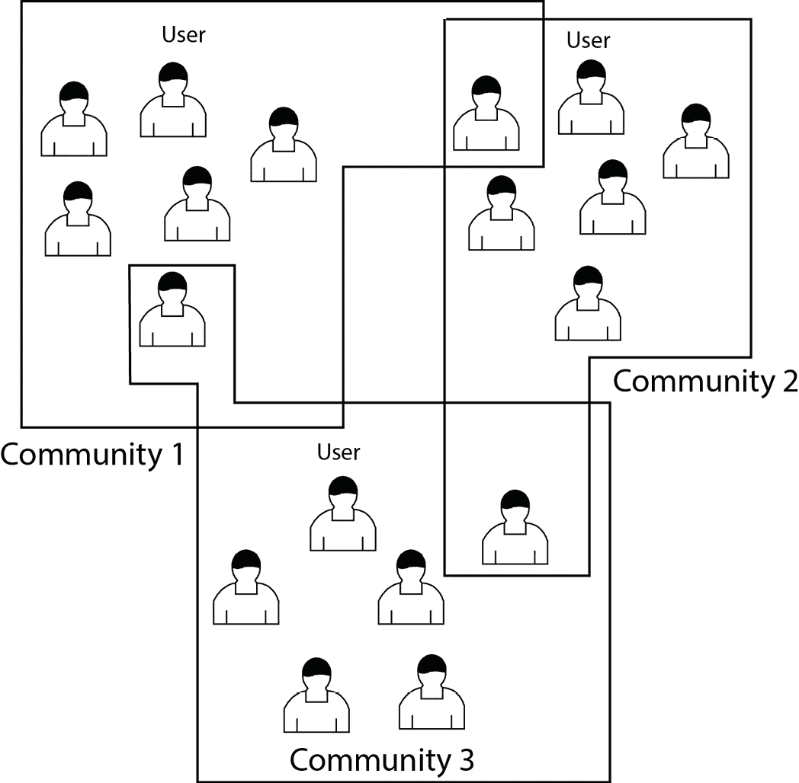

# 第十一章：新兴应用

图神经网络深度学习在众多领域展示了惊人的多样性，远远超出了其在**自然语言处理**（**NLP**）、推荐系统和**计算机视觉**（**CV**）中的广泛应用，正如我们在*第八章*、*第九章*和*第十章*中所看到的那样。在这里，我们将探讨基于图的方式在多个领域所取得的重要影响或展现出的潜力。

随着我们深入探讨这些应用，我们将看到图神经网络深度学习技术如何适应不同的情境，常常为长期存在的挑战提供创新解决方案。例如，在城市规划中，这些方法已被用于优化公共交通网络和预测交通流量，推动了更智能、更高效城市的发展。在材料科学领域，研究人员正在利用基于图的模型来预测材料的性质，并设计具有特定特征的新化合物，可能加速在可再生能源和先进制造等领域的创新。

本章中我们将审视的应用不仅展示了图神经网络深度学习的广泛影响，也突显了这些技术的可迁移性。许多为某一领域开发的方法常常在其他领域意外找到应用，促进了思想和方法论的跨领域交流。在每个应用的讨论中，我们将讲解它们所面临的独特挑战、所采用的具体图神经网络技术以及所取得的成果。

在本章结束时，您将全面理解图神经网络深度学习在各个行业和科学领域的深远影响，包括以下内容：

+   生物学与医疗健康

+   社交网络分析

+   金融服务

+   网络安全

+   能源系统

+   **物联网**（**IoT**）

+   法律治理与合规

# 生物学与医疗健康

图结构数据在生物学和医疗健康中无处不在，从分子相互作用到大脑连接组。**图神经网络**（**GNNs**）已成为在这些复杂关系结构上进行学习的强大工具。

## 蛋白质-蛋白质相互作用网络

**蛋白质-蛋白质相互作用**（**PPI**）网络表示细胞内蛋白质之间的物理接触。这些相互作用对理解细胞过程和开发新疗法至关重要。图神经网络（**GNNs**）可以有效地对 PPI 网络进行建模和分析，达到以下目的：

+   **预测新的相互作用**：GNNs 可以通过学习已知相互作用中的模式来推断新的蛋白质-蛋白质相互作用（PPIs）。例如，Gainza 等人（2020 年）（[`doi.org/10.1093/bioinformatics/btab154`](https://doi.org/10.1093/bioinformatics/btab154)）开发了一种 GNN 模型，通过学习蛋白质表面的几何特征和化学特征来预测 PPIs。另一个例子是张和陈（2018 年）的**子图神经网络用于链接预测（SEAL）模型**（[`arxiv.org/pdf/1802.09691`](https://arxiv.org/pdf/1802.09691)），该模型在**人类蛋白质参考数据库**（**HPRD**）上的 PPI 预测中取得了最先进的性能。它通过学习蛋白质对周围的局部子图来预测相互作用。

+   **识别功能模块**：通过基于学习到的嵌入对蛋白质进行聚类，GNNs 可以发现功能性蛋白质复合物。Xing 等人（[`doi.org/10.1093/bioinformatics/btac088`](https://doi.org/10.1093/bioinformatics/btac088)）使用了**图注意力网络**（**GAT**）来识别与疾病相关的蛋白质模块。

+   **预测蛋白质功能**：GNNs 可以通过 PPI 网络传播已知的功能注释来预测未注释蛋白质的功能。例如，Kulmanov 和 Hoehndorf（[`doi.org/10.1093/bioinformatics/btaa763`](https://doi.org/10.1093/bioinformatics/btaa763)）的**DeepGOPlus 模型**结合了序列信息和 PPI 网络，以提高功能预测的准确性。

## 药物发现与开发

基于图的模型正在革新药物发现管道的各个阶段：

+   **分子性质预测**：GNNs 可以通过分子图学习来预测如溶解度、毒性和结合亲和力等性质。Gilmer 等人（[`arxiv.org/abs/1704.01212`](https://arxiv.org/abs/1704.01212)）的**消息传递神经网络**（**MPNN**）开创了这一方法。

+   **新药设计**：生成型 GNN 模型可以创建具有期望性质的新分子结构。例如，Shi 等人（[`arxiv.org/abs/2001.09382`](https://arxiv.org/abs/2001.09382)）的**GraphAF 模型**采用基于流的方法，逐原子生成分子。

+   **药物-靶标相互作用预测**：GNNs（图神经网络）可以将药物和蛋白质建模为图形，以预测它们之间的相互作用。Nguyen 等人（[`doi.org/10.1093/bioinformatics/btaa921`](https://doi.org/10.1093/bioinformatics/btaa921)）的研究使用了**GraphDTA 模型**来完成这一任务。

+   **多药物副作用预测**：GNNs 可以通过在知识图中建模药物-药物相互作用，预测药物组合的副作用。Zitnik 等人（[`doi.org/10.1093/bioinformatics/bty294`](https://doi.org/10.1093/bioinformatics/bty294)）的**Decagon 模型**就是一个典型的例子。

## 疾病预测与进展建模

基于图的模型可以整合多种生物医学数据，提升疾病预测和理解的能力：

+   **电子健康记录（EHR）分析**：患者记录可以被建模为时间图，GNN 捕捉诊断、药物和实验室测试之间的复杂关系。Choi 等人提出的**GRAM 模型**（[`pubmed.ncbi.nlm.nih.gov/33717639`](https://pubmed.ncbi.nlm.nih.gov/33717639)）采用基于图的注意力机制对医学本体进行建模，以提高风险预测。

+   **疾病基因预测**：GNN 可以整合蛋白质相互作用、基因表达和已知的疾病关联，以识别新型疾病基因。Li 等人（[`www.ncbi.nlm.nih.gov/pmc/articles/PMC8275341`](https://www.ncbi.nlm.nih.gov/pmc/articles/PMC8275341)）的模型使用了异质性的**图卷积网络**（**GCN**）来完成这一任务。

+   **癌症亚型分类**：图形模型可以整合多组学数据（例如基因表达、突变、拷贝数变异），以提高癌症亚型的预测。Zhang 等人（[`doi.org/10.1016/j.engappai.2023.106717`](https://doi.org/10.1016/j.engappai.2023.106717)）的工作使用了多视角 GCN 来实现这一目的。

## 脑连接组学分析

GNN 特别适合分析大脑连接数据：

+   **脑部疾病分类**：GNN 可以通过学习结构或功能连接组来分类神经和精神疾病。Li 等人提出的**BrainGNN 模型**（[`doi.org/10.1016/j.media.2021.102233`](https://doi.org/10.1016/j.media.2021.102233)）使用层次化的 GNN 进行自闭症谱系障碍的分类。

+   **认知状态预测**：图形模型可以将大脑连接模式映射到认知状态或行为上。Wang 等人（[`www.ncbi.nlm.nih.gov/pmc/articles/PMC7935029`](https://www.ncbi.nlm.nih.gov/pmc/articles/PMC7935029)）的工作使用了动态 GCN 来预测来自**功能性磁共振成像**（**fMRI**）数据的认知状态。

## 基因组学和基因调控网络

图形深度学习方法正在推进我们对基因调控和基因组结构的理解：

+   **增强子-启动子相互作用预测**：GNN 可以建模染色质的三维结构，以预测长距离的调控相互作用。Sun 等人（[`genomebiology.biomedcentral.com/articles/10.1186/s13059-023-02916-x`](https://genomebiology.biomedcentral.com/articles/10.1186/s13059-023-02916-x)）的模型使用了 Hi-C 数据上的 GCN 来完成这一任务。

+   **变异效应预测**：GNN 可以建模遗传变异对基因调控和表型的影响。Zhou 等人提出的**ExPecto 模型**（[`www.ncbi.nlm.nih.gov/pmc/articles/PMC6094955`](https://www.ncbi.nlm.nih.gov/pmc/articles/PMC6094955)）采用了一种深度学习方法，结合了调控语法来预测变异对基因表达的效应。

图深度学习方法在生物学和医疗健康等各个领域产生了重大影响。通过有效地建模复杂的关系数据，这些方法推动了我们对生物系统的理解，并改善了临床决策。

# 社交网络分析

社交网络提供了丰富的关系数据，可以自然地表示为图，其中用户为*节点*，用户之间的连接为*边*。图深度学习技术已经成为分析和提取社交网络数据洞察力的强大工具。

## 社区检测

社区检测旨在识别社交网络中密切连接的用户群体，如*图 11.1*所示。传统的社区检测算法，如模块化优化或谱聚类，通常在大规模网络中表现不佳。图神经网络（GNNs）通过学习能够捕捉局部和全局网络结构的节点嵌入，提供了一个有前景的替代方案：



图 11.1 – 社区检测

例如，Wang 等人（2024）（[`doi.org/10.1016/j.neucom.2024.127703`](https://doi.org/10.1016/j.neucom.2024.127703)）提出了一种**图自编码器**（**GAE**）方法用于社区检测。该模型通过图卷积层将节点编码到低维潜空间中，然后尝试从这些嵌入表示中重构图结构。通过在重构任务上训练，嵌入表示能够自然地将属于同一社区的节点聚集在一起。解码器随后可以用来分配社区标签。

## 影响传播建模

理解信息和影响如何在社交网络中传播，对于病毒营销和公共健康活动等应用至关重要。GNNs 可以通过学习节点属性和网络结构如何影响传播模式，从而建模复杂的扩散动态。

Qiu 等人提出的**DeepInf 模型**（[`dl.acm.org/doi/10.1145/3219819.3220077`](https://dl.acm.org/doi/10.1145/3219819.3220077)）使用图注意力网络（GAT）预测用户是否会受到影响并采纳某种行为，基于其本地网络邻域。注意力机制使得模型在进行预测时能够聚焦于最具影响力的邻居。

## 用户行为预测

预测用户行为和偏好是推荐系统和定向广告的关键任务。GNNs 通过融入社交上下文和网络效应，能够提高预测精度。

例如，Fan 等人提出的**GraphRec 模型**（[`arxiv.org/abs/1902.07243`](https://arxiv.org/abs/1902.07243)）使用图卷积网络（GCN）从用户-物品互动图中学习用户和物品的嵌入表示，应用于社交推荐。该模型还融合了社交聚合层，用于捕捉用户社交连接的影响力。

## 假新闻检测

社交媒体上的虚假信息传播已经成为一个重大的社会挑战。基于图的深度学习模型可以通过分析内容特征和传播模式，帮助检测假新闻。

例如，Lu 和 Li 提出的**GCAN 模型**（[`aclanthology.org/2020.acl-main.48`](https://aclanthology.org/2020.acl-main.48)）使用图感知**共注意力网络**（**CAN**）来联合建模新闻内容和用户参与模式。该模型学习新闻文章、用户资料和用户与新闻互动的表示，以进行预测。

通过捕捉复杂的关系结构并学习丰富的节点表示，GNN 可以提高社交网络分析任务的表现。

# 金融服务

基于图的深度学习模型已经成为分析金融数据中复杂关系和模式的强大工具。通过将金融实体及其相互作用表示为图中的节点和边，这些模型能够捕捉传统方法常常遗漏的复杂依赖关系。

## 交易网络中的欺诈检测

基于图的深度学习在金融领域最具影响力的应用之一是检测交易网络中的欺诈活动。传统的欺诈检测系统通常依赖于基于规则的方法或孤立地分析交易。然而，欺诈行为往往涉及多个实体之间复杂的互动模式，且通常是随时间变化的。

GNN 可以建模整个交易网络，其中节点表示账户或用户，边表示交易或实体之间的关系。通过在图结构中传播和聚合信息，GNN 可以识别那些在单独查看交易时可能看不见的可疑模式。

例如，阿里巴巴的一个团队开发了一个基于 GNN 的欺诈检测系统，名为**GraphConsis**，其表现显著超过传统方法。该模型将用户、商家和设备表示为异构图中的节点，边则表示各种类型的交互。通过学习捕捉本地和全局图结构的节点嵌入，GraphConsis 能够识别协调的欺诈团伙，并检测交易模式中的细微异常。

## 信用风险评估

评估信用 worthiness 是金融机构的一个关键任务。基于图的模型可以通过整合多种数据源并建模借款人、他们的财务活动及外部因素之间的复杂关系，从而增强信用评分。

例如，研究人员提出了多个基于图的信用评分模型。这些方法构建了一个图，其中*节点*代表贷款申请人，*边*代表基于各种特征的申请人之间的相似性。模型随后使用 GCN 传播信用信息，跨相似的申请人进行传播，从而得到更准确、可靠的信用评分。这类模型还可以在学习过程中引入领域知识作为约束，确保模型的预测符合既定的金融原则。

## 基于公司关系图的股市预测

股市是一个复杂的系统，其中公司业绩往往因供应链关系、竞争以及更广泛的经济因素而相互关联。基于图的模型能够捕捉这些复杂的关系，从而提高股价预测和投资组合管理的效果。

一项由研究人员进行的研究提出了**长短期记忆图卷积神经网络**（**LSTM-GCN**）模型，用于股市预测（[`arxiv.org/abs/2303.09406`](https://arxiv.org/abs/2303.09406)）。该模型构建了一个公司的动态图，其中边代表价值链关系和历史股价的相关性。LSTM-GCN 模型随后学习从邻近公司及历史时间段的信息中进行聚合，以预测未来的股价。

## 反洗钱系统

洗钱通常涉及复杂的交易网络，旨在掩盖非法资金的来源。基于图的深度学习模型特别适用于**反洗钱**（**AML**）应用，因为它们能够分析整个交易网络，从中识别出可疑的模式。

例如，研究人员开发了一种基于 GNN 的 AML 系统，称为**GCN-AML**，该系统在比特币交易图上运行（[`arxiv.org/abs/1908.02591`](https://arxiv.org/abs/1908.02591)）。该模型将比特币地址表示为节点，将交易表示为边，构建一个大规模的图结构。通过将 GCN 应用于该结构，GCN-AML 能够学习识别洗钱活动的指示模式，如资金的分层和整合。该系统在检测已知的洗钱案件方面表现出高度准确性，同时也揭示了先前未被识别的可疑活动。

## 个性化金融推荐

基于图的模型还可以通过建模客户、产品和金融行为之间的关系来增强个性化金融服务。

例如，一家主要银行实施了基于 GNN 的个性化金融产品推荐系统。该系统构建了一个异构图，包含 *客户节点*、*产品节点* 和各种 *互动边*（例如，过去的购买、查询和人口统计相似性）。通过学习捕捉客户偏好和产品特征的嵌入，GNN 可以生成高度相关和个性化的产品推荐，从而提高客户满意度和产品采纳率。

## 系统性风险评估

监管机构和中央银行越来越感兴趣于使用基于图的模型来评估金融网络中的系统性风险，特别是在 2008 年金融危机之后。

例如，研究人员提出使用 GNN 来建模银行间借贷网络并预测系统性风险。通过将银行表示为节点，将其借贷关系表示为边，GNN 可以学习识别金融系统中脆弱的机构和潜在的传播路径。这种方法相比传统的压力测试方法，能够实现更为动态和数据驱动的系统性风险评估。

基于图的深度学习模型为分析金融系统复杂、互联的特性提供了强大的工具。随着这些技术的不断发展，我们可以预见到会出现更多利用金融数据丰富关系结构的复杂应用，旨在改善决策、风险管理和金融服务行业中的客户体验。

# 网络安全

GNN（图神经网络）已成为网络安全应用中的一种强大工具，利用许多安全相关数据集的固有图结构来检测威胁和异常。

## 为什么选择图用于网络安全？

许多网络安全数据集和问题自然适合图表示：

+   网络流量和通信可以建模为图，其中设备作为 *节点*，连接作为 *边*。

+   系统调用追踪形成进程交互的时间图。

+   用于欺诈检测的社交网络本质上是图结构的。

+   软件依赖图表示代码组件之间的关系。

通过使用基于图的模型，我们可以捕捉和分析复杂的关系和模式，而这些可能被传统的**机器学习**（**ML**）方法忽视。

## 网络入侵检测

GNN 在通过分析流量模式来检测网络入侵和异常方面显示出潜力。在这个应用中，以下几点是相关的：

+   *节点* 代表设备或 IP 地址。

+   *边* 表示网络连接或数据传输。

+   *节点特征* 可能包括设备类型、操作系统等。

+   *边特征* 可能包括协议、端口号、数据量等。

GNN 可以学会识别可能表明正在进行的攻击或受损设备的可疑通信模式。例如，基于 GNN 的**入侵检测系统**（**IDS**）可能会标记出不常通信的节点之间的异常数据传输，或者发现某个节点突然建立了许多新连接：


图 11.2 – 使用图学习进行入侵检测

## 恶意软件检测

程序行为的图表示，如系统调用图或控制流图，可以通过 GNN 进行分析，从而检测恶意软件。在这种情况下，注意以下几点：

+   *节点*表示系统调用或代码块。

+   *边*表示时间顺序或控制流。

+   *节点特征*可能包括调用类型、参数、返回值等。

GNN 可以学会区分良性和恶意的行为模式。例如，GNN 可能会识别出具有勒索病毒文件加密操作特征的系统调用序列。

让我们来看一个**高级持续威胁**（**APT**）检测的例子。APT 是复杂的长期网络攻击，特别难以检测。让我们考虑一个假设的基于 GNN 的 APT 检测系统：

1.  **图构建**

    +   *节点*表示网络实体（设备、用户、IP 地址）。

    +   *边*表示通信或访问事件。

    +   *节点特征*包括设备类型、已安装的软件和用户角色。

    +   *边特征*包括通信协议、数据量和时间戳。

        让我们看一个例子：

        ```py
        def construct_graph(network_data):
            # devices, users, IP addresses
            nodes = create_nodes(network_data)
            # communications, access events
            edges = create_edges(network_data)
            for node in nodes:
                # device type, software, user role
                node.features = extract_node_features(node)
            for edge in edges:
                # protocol, data volume, timestamp
                edge.features = extract_edge_features(edge)
            return Graph(nodes, edges)
        ```

1.  **GNN 架构**

    +   使用 GAT 来学习节点嵌入。

    +   *时间边*通过递归机制处理（例如，**门控递归单元**（**GRU**）单元）。

    +   多个 GNN 层捕捉多跳关系。

        这可能是如何工作的：

        ```py
        class APTDetectionGNN(nn.Module):
            def __init__(self, in_features, hidden_features,
                         num_layers):
                super().__init__()
                self.gat_layers = nn.ModuleList([
                    GATConv(in_features if i == 0 else hidden_features, 
                            hidden_features
                    )for i in range(num_layers)
                ])
                self.gru = nn.GRU(hidden_features, hidden_features)
                self.output = nn.Linear(hidden_features, 1)
            def forward(self, x, edge_index, edge_attr):
                for gat in self.gat_layers:
                    x = F.relu(gat(x, edge_index, edge_attr))
                x, _ = self.gru(x.unsqueeze(0))
                return self.output(x.squeeze(0)).squeeze(-1)
        ```

1.  **训练**

    下面是我们为 APT 事件检测编写模型训练代码的方法，使用历史标签数据。

    ```py
    def train_model(model, labeled_data, unlabeled_data, 
                    num_epochs=10):
        optimizer = torch.optim.Adam(model.parameters())

        for epoch in range(num_epochs):
            model.train()

            # Supervised learning
            optimizer.zero_grad()
            x, edge_index, edge_attr, y = labeled_data
            out = model(x, edge_index, edge_attr)
            loss = F.binary_cross_entropy_with_logits(out, y)
            loss.backward()
            optimizer.step()

            # Print training progress
            if epoch % 2 == 0:
                print(f"Epoch {epoch}, Loss: {loss.item():.4f}")
    ```

1.  **检测**

    +   GNN 为每个节点输出异常分数。

    +   高异常分数的节点会被标记以供调查。

    +   可以分析注意力权重，以解释哪些连接对异常分数做出了贡献。

        让我们采用以下方法：

        ```py
        def detect_apts(model, graph, threshold=0.5):
            model.eval()
            with torch.no_grad():
                x, edge_index, edge_attr, _ = graph
                anomaly_scores = torch.sigmoid(model(
                    x, edge_index, edge_attr))
                suspicious_nodes = (
                    anomaly_scores > threshold
                ).nonzero().flatten()

                results = []
                for node in suspicious_nodes:
                    attention_weights = model.get_attention_ weights(
                        node)
                    results.append({
                        'node': node.item(),
                        'score': anomaly_scores[node].item(),
                        'attention': attention_weights
                    })

                return results
        ```

        这种方法通过将看似无关的事件（如异常的登录时间、非典型的系统访问和低量的数据外泄）连接起来，从而形成一个连贯的正在进行中的攻击图景，能够检测微妙的 APT 模式。然后，可以分析模型的注意力权重，解释哪些连接对异常分数做出了贡献，为安全团队提供有价值的洞察。

# 能源系统

基于图的深度学习模型可以作为分析和优化复杂能源系统的强大工具。通过将能源网络表示为图，这些模型能够捕捉不同组件之间错综复杂的关系和依赖关系，从而实现更准确的预测、更高效的控制策略和更好的决策制定。

## 能源系统的图表示

能源系统可以自然地表示为图形，其中*节点*通常表示发电机、变压器、输电线路和负载等物理组件，而*边*表示这些组件之间的连接和交互。这种图结构使我们能够建模以下内容：

+   组件之间的功率流

+   网络中的相互依赖关系

+   空间和时间关系

+   系统拓扑和连接性

## 负载预测

基于图的深度学习模型在预测电力网络中的电力需求方面表现出优越性能。通过整合电网拓扑和负载之间的空间相关性，这些模型能更有效地捕捉复杂模式，而不是传统的时间序列方法。

例如，可以在城市电网中使用 GCN-LSTM 混合模型进行短期负荷预测，其中每个*节点*表示一个变电站，*边*表示输电线路。该模型从相邻变电站和历史负荷数据中聚合信息，以进行准确的预测。

## 故障检测和定位

GNN 可以分析异常在电力网络中的传播，实现快速检测和故障定位。

例如，可以使用基于 GAT 的模型来识别输电网络中的故障组件。注意机制使模型在检测异常时能够集中关注最相关的邻近节点，从而提高准确性和可解释性。

## 最优功率流

GNNs 可以比传统方法更高效地学习解决诸如**最优功率流**（**OPF**）等复杂优化问题。

例如，可以训练基于 GNN 的模型来近似 OPF 解决方案，考虑网络约束和可再生能源的不确定性。该模型可以在毫秒内生成接近最优的解决方案，实现电力调度的实时优化。

## 可再生能源预测

**时空 GNNs**（**STGNNs**）特别适用于预测可再生能源发电，因为它们能捕捉空间相关性（例如附近风电场之间）和时间模式。

例如，STGNN 模型可用于预测跨越**光伏**（**PV**）安装网络的太阳能发电。该模型可以整合天气数据、历史发电量和站点之间的空间关系，以提高预测精度。

## 能量存储管理

基于图的**强化学习**（**RL**）模型可以优化分布式能量存储系统的运行，考虑网络约束和市场条件。

例如，可以使用**图强化学习**（**GRL**）代理来协调微电网中的电池能量存储系统网络。该代理可以学习如何最优化地充电和放电电池，平衡可再生能源的整合、峰值削减和电力市场参与。

## 脆弱性评估

GNNs 可以分析电力网对各种扰动的韧性，并识别关键组件。

例如，基于 GCN 的模型可用于评估电力网对级联故障的脆弱性。该模型可以学习预测故障在网络中的传播，并识别对系统稳定性至关重要的最关键节点。

# 物联网

基于图的深度学习模型可用于分析物联网系统中复杂的相互连接关系。通过将物联网设备、传感器及其交互作用表示为图结构中的*节点*和*边*，这些模型能够捕捉到重要的关系信息和依赖关系，这对于各种物联网应用至关重要。

## 设备交互建模

物联网系统中的一个基本挑战是建模异构设备和传感器之间的复杂交互。GNNs 提供了一种优雅的解决方案，通过自然地将设备表示为*节点*，并将它们的通信或依赖关系表示为图中的*边*。

GCNs 在这项任务中尤其有效。在 GCN 中，每个节点通过卷积操作从其邻居汇聚信息，使得模型能够学习到包含节点特征和图结构的表示。这使得 GCN 能够捕捉到物联网设备之间复杂的交互模式。

例如，在智能家居环境中，GCN 可以建模各个智能电器、环境传感器和用户设备之间的关系。该模型可以学习一个设备（例如，运动传感器）的激活如何影响其他设备（例如，灯光或恒温器）的行为。然后，可以利用这种学习到的表示来执行任务，如预测设备状态或优化整体系统性能。

## 传感器网络中的异常检测

检测物联网传感器网络中的异常对于识别故障、安全漏洞或异常事件至关重要。基于图的深度学习模型通过利用传感器读数之间的空间和时间相关性，能够在这一任务中表现出色。

GATs 在这个领域已经显示出了有希望的成果。GATs 使用注意力机制为相邻节点分配不同的权重，使模型能够专注于最相关的信息进行异常检测。这在大规模物联网部署中尤其有用，因为并非所有传感器交互都是同等重要的。

实际应用中，基于 GAT 的异常检测系统可能如下工作：

1.  将传感器表示为图中的*节点*，其*边*根据物理接近度或逻辑关系建立。

1.  使用历史传感器读数作为*节点特征*。

1.  应用图注意力层来学习捕捉正常行为模式的表示。

1.  使用这些学习到的表示来识别可能表明异常的偏差。

这种方法已成功应用于检测城市水分配网络、**工业控制系统**（**ICS**）和智能电网基础设施中的异常。

## 预测性维护

预测性维护是**工业物联网**（**IIoT**）环境中的一个关键应用，其中意外的设备故障可能导致巨大的成本和安全风险。基于图的深度学习模型可以通过整合工业系统不同组件之间的复杂相互依赖性来增强预测性维护。

**时间图神经网络**（**TGNN**）特别适合于这一任务，因为它们可以同时建模组件之间的空间关系和它们的时间演变。一个用于预测性维护的 TGNN 可能实现以下目标：

1.  将设备组件表示为*节点*，并将它们的物理或功能连接表示为*边*。

1.  使用传感器读数和操作数据的时间序列作为动态*节点特征*。

1.  应用 GCN 和**循环神经网络**（**RNN**）层以捕捉空间和时间模式。

1.  预测未来组件状态或故障概率。

这种方法已被证明在预测制造厂、风力涡轮机和飞机发动机中的设备故障方面优于传统的机器学习方法。

## 智能家居应用

在智能家居环境中，基于图的深度学习可以通过建模设备、用户和环境之间的复杂互动来增强各种应用。

例如，智能家居自动化的基于图的推荐系统可能使用如下的异构图结构：

+   设备、用户和房间被表示为不同类型的*节点*。

+   *边*表示交互（例如，用户与设备的交互）或关系（例如，设备的位置）。

+   *节点特征* 包括设备特征、用户偏好和环境数据。

通过应用图嵌入或图卷积矩阵补全等技术，系统可以生成个性化的自动化规则或设备使用推荐，这些规则和推荐考虑到智能家居生态系统的完整上下文。

# 法律治理和合规性

GNN（图神经网络）可以成为法律和合规领域的有用工具，为解决复杂挑战提供创新解决方案。通过利用图结构来表示法律实体、文档和法规之间的复杂关系，这些技术正在彻底改变法律专业人士和合规人员处理工作的方式。

## 法律和监管数据的知识图谱构建

深度学习在法律领域中图谱应用的主要之一是构建和利用**知识图谱**。这些图谱作为法律和监管信息的全面存储库，捕捉法律、法规、法院案件和法律概念等各种实体之间的复杂关系：

+   **实体提取与关系映射**：深度学习模型，特别是基于自然语言处理（NLP）技术的模型，广泛应用于自动提取法律文本中的实体和关系。然后，可以使用图神经网络（GNNs）来优化和扩展这些关系，创建一个丰富、互联的法律知识网络。

+   **多语言集成**：在多个官方语言的地区，例如**欧盟**（**EU**），基于图的深度学习有助于跨不同语言集成法律信息。这使得创建支持跨境合规和法律研究的多语言法律知识图成为可能。

+   **动态更新**：法律环境不断变化。深度学习模型可以被训练以持续更新知识图，包括新的立法、判例法和监管变动，确保图保持最新并具有相关性。

## 自动化合规监控与风险评估

基于图的深度学习为自动化合规流程和评估监管风险提供了强大的工具：

+   **复杂法规中的模式识别**：GNNs 可以分析作为图形表示的监管文本结构，识别传统文本分析方法可能忽视的模式和关系。这一能力对于理解新法规对不同业务领域的影响尤为重要。

+   **实时合规检查**：通过将组织的操作和监管要求表示为图形，深度学习模型可以执行实时合规检查。这些模型可以标记潜在的违规行为并建议纠正措施，从而显著减少不合规的风险。

+   **预测风险分析**：通过分析历史合规数据和以图形形式呈现的当前监管趋势，深度学习模型能够预测未来的合规风险。这使得组织能够在潜在问题变成严重问题之前，主动解决可能出现的风险。

## 法律文件分析与合同管理

基于图的深度学习正在改变法律文件的分析和管理方式：

+   **法律文件的语义理解**：通过将法律文件表示为互联概念和条款的图，深度学习模型能够更细致地理解文件内容。这使得文件分类、比较和信息检索变得更加准确。

+   **自动化合同审查**：GNNs 可以被训练用于分析合同图，识别关键条款、潜在风险和不一致之处。这大大加快了合同审查过程并提高了准确性。

+   **法律先例分析**：通过将判例法表示为一个互联的裁决图，深度学习模型能够更有效地分析法律先例。这有助于案件准备和预测法律争议的潜在结果。

## 监管智能与政策影响评估

图上的深度学习正在提升组织对规制变动的理解和应对能力：

+   **监管变动管理**：通过将监管框架表示为图，深度学习模型可以分析某一规制变动对其他相关规制的影响。这有助于组织全面理解监管变化的影响，并相应调整其合规策略。

+   **政策影响预测**：GNN（图神经网络）可以用来建模拟议的规制或政策变动的潜在影响。通过分析不同领域的法律与商业操作之间的联系，这些模型能够预测新政策可能如何影响各方利益相关者。

# 总结

在本章中，我们探讨了图深度学习在各个领域的多样化应用。你了解了基于图的 approaches 是如何革新生物学与医疗保健、社交网络分析、金融服务、网络安全、能源系统、物联网和法律治理与合规等领域的。

我们还强调了 GNN 及其他基于图的模型如何捕捉复杂的关联数据结构，从而在药物发现、欺诈检测、网络优化和预测性维护等领域取得突破。通过展示这些技术的适应性和可迁移性，我们解释了图深度学习在跨行业和学科解决复杂现实问题中的深远影响。

在下一章中，我们将探讨图深度学习的未来发展，并揭示哪些领域将深受这些强大模型的影响。
