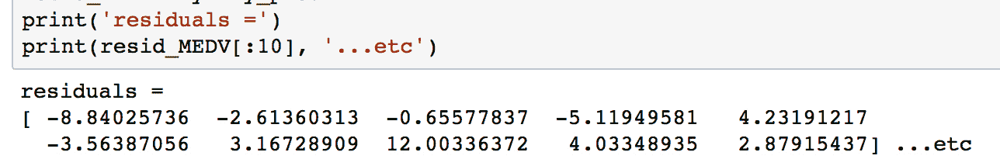

# 第一章：Jupyter 基础

Jupyter Notebooks 是 Python 数据科学家使用的最重要工具之一。这是因为它们是开发可复现的数据分析管道的理想环境。数据可以在单一 Notebook 中加载、转换和建模，在这里可以快速简便地测试代码和探索想法。此外，所有这些都可以通过格式化文本进行"**内联**"文档记录，因此你可以为自己做笔记，甚至生成结构化报告。其他类似的平台，例如 RStudio 或 Spyder，向用户呈现多个窗口，这会导致繁琐的任务，比如复制粘贴代码和重新运行已执行的代码。这些工具通常涉及**读取求值提示循环（REPLs）**，其中代码在一个具有保存内存的终端会话中运行。这种开发环境对于可复现性不好，也不适合开发。Jupyter Notebooks 通过提供一个单一窗口解决了所有这些问题，在这个窗口中，代码片段被执行，输出结果则内联显示。这使得用户可以高效地开发代码，并允许他们回顾以前的工作以供参考，甚至进行修改。

我们将通过解释什么是 Jupyter Notebook 开始本章，并继续讨论它为何在数据科学家中如此受欢迎。接着，我们将一起打开一个 Notebook，并通过一些练习学习如何使用该平台。最后，我们将在*基本功能和特点*一节中深入进行第一次分析，进行探索性分析。

到本章结束时，你将能够：

+   了解什么是 Jupyter Notebook，以及它为何对数据分析有用

+   使用 Jupyter Notebook 功能

+   学习 Python 数据科学库

+   执行简单的探索性数据分析

本书中的所有代码都可以在代码包中的章节特定 IPython 笔记本中找到。本书中的所有彩色图表也都包含在代码包中。

# 基本功能和特点

在这一节中，我们首先通过示例和讨论展示 Jupyter Notebooks 的实用性。接着，为了涵盖 Jupyter Notebooks 的基础知识，我们将看到如何启动和与平台互动的基本用法。对于那些已经使用过 Jupyter Notebooks 的人来说，这部分内容大多是复习；不过，你一定也会在这一主题中看到新的内容。

# 什么是 Jupyter Notebook，它为何有用？

Jupyter Notebooks 是本地运行的 Web 应用程序，其中包含实时代码、公式、图形、交互式应用和 Markdown 文本。标准语言是 Python，这也是本书将使用的语言；然而，请注意，它也支持多种替代语言。其中包括另一个主要的数据科学语言 R：


熟悉 R 的人会知道 R Markdown。Markdown 文档允许将 Markdown 格式的文本与可执行代码结合使用。Markdown 是一种用于在网页上格式化文本的简单语言。例如，大多数 GitHub 仓库都有一个 `README.md` `Markdown` 文件。这个格式适用于基本的文本格式化。它与 HTML 相似，但允许的自定义程度要小得多。

Markdown 中常用的符号包括井号（#）用来将文本设置为标题，方括号和圆括号用来插入超链接，星号用来创建斜体或粗体文本：


在了解了 Markdown 的基本知识之后，让我们回到 R Markdown，Markdown 文本可以与可执行代码一起编写。Jupyter Notebooks 为 Python 提供了等效的功能，尽管正如我们将看到的，它们与 R Markdown 文档的功能有很大不同。例如，R Markdown 假设除非另行指定，否则你在编写 Markdown，而 Jupyter Notebooks 假设你在输入代码。这使得 Jupyter Notebooks 在快速开发和测试时更具吸引力。

从数据科学的角度来看，Jupyter Notebook 有两种主要类型，取决于其使用方式：实验室风格和交付风格。

实验室风格的 Notebook 旨在作为编程类比于研究期刊。这些应该包含你所做的所有工作，包括加载、处理、分析和建模数据。其目的是记录你所做的一切，以便将来参考，因此通常不建议删除或修改之前的实验室风格 Notebook。同时，随着分析的进展，最好累积多个带有日期戳的 Notebook 版本，以防你想回顾之前的状态。

交付风格的 Notebook 旨在展示成果，应该只包含实验室风格 Notebook 中的部分内容。例如，这可能是与同事分享的有趣发现，或者是给经理的详细分析报告，或是给利益相关者的关键发现总结。

在任何情况下，一个重要的概念是可重复性。如果你在记录软件版本时做得很细致，那么接收报告的人将能够重新运行 Notebook 并计算出与您相同的结果。在科学界，可重复性变得越来越困难，这无疑是一个清新的突破。

# 导航平台

现在，我们将打开一个 Jupyter Notebook 并开始学习其界面。在这里，我们假设你对该平台没有先前的了解，并且会讲解基本的使用方法。

# 介绍 Jupyter Notebooks

1.  在终端中导航到配套材料目录。

在 Mac 或 Linux 等 Unix 系统中，可以使用 `ls` 命令显示目录内容，使用 `cd` 命令更改目录。在 Windows 系统中，使用 `dir` 显示目录内容，使用 `cd` 更改目录。如果您想将驱动器从 `C:` 更改为 `D:`，可以执行 `d:` 来切换驱动器。

1.  在终端中输入以下命令，启动新的本地 Notebook 服务器：`jupyter notebook.`

    默认浏览器的新窗口或标签页将打开 Notebook Dashboard，指向工作目录。在这里，您将看到该目录下的文件夹和文件列表。

1.  点击一个文件夹以导航到该路径，并点击文件以打开它。尽管它的主要用途是编辑 IPYNB Notebook 文件，Jupyter 也可以作为标准文本编辑器使用。

1.  重新打开用于启动应用的终端窗口。我们可以看到 `NotebookApp` 正在本地服务器上运行。特别地，您应该能看到如下行：

    `[I 20:03:01.045 NotebookApp] Jupyter Notebook 正在运行，地址为：http:// localhost:8888/ ? oken=e915bb06866f19ce462d959a9193a94c7c088e81765f9d8a`

    访问该 HTTP 地址将会在您的浏览器窗口中加载应用，正如启动应用时自动完成的操作。关闭窗口并不会停止应用；这应该在终端中通过输入 *Ctrl + C* 来完成。

1.  在终端中按 *Ctrl + C* 来关闭应用。您可能还需要确认通过输入 `y`。同时关闭浏览器窗口。

1.  启动 NotebookApp 时，您可以选择多种选项。在终端中，通过运行以下命令查看可用选项列表：

    `jupyter notebook –-help.`

1.  其中一个选项是指定一个特定端口。通过运行以下命令，可以在 `本地端口 9000` 启动 NotebookApp：

    `jupyter notebook --port 9000`

1.  创建新 Jupyter Notebook 的主要方法是通过 Jupyter Dashboard。点击右上角的 **New**，并从下拉菜单中选择一个内核（即，选择 Notebooks 部分中的某个选项）：


Kernels 为 Notebook 提供编程语言支持。如果您已经通过 Anaconda 安装了 Python，那么该版本应该是默认的内核。Conda 虚拟环境也将在此可用。

虚拟环境是管理同一台机器上多个项目的绝佳工具。每个虚拟环境可能包含不同版本的 Python 和外部库。Python 内置有虚拟环境；然而，Conda 虚拟环境与 Jupyter Notebooks 的集成更好，并具有其他一些优点。相关文档请参阅 [`conda.io/docs/user-guide/tasks/manage-environments.html`](https://conda.io/docs/user-guide/tasks/manage-environments.html)。

1.  在新创建的空白 Notebook 中，点击顶部单元格并输入`print('hello world')`，或者任何其他可以向屏幕输出的代码片段。通过点击单元格并按*Shift + Enter*来执行，或者在**Cell 菜单**中选择**Run Cell**。

任何来自代码的`stdout`或`stderr`输出都会在单元格运行时显示在下面。此外，最后一行中写的对象的字符串表示也会显示出来。这非常方便，特别是在显示表格时，但有时我们不希望最后的对象被显示。在这种情况下，可以在行末添加分号（; ）来抑制显示。

新单元格默认期望并运行代码输入；然而，它们也可以改为渲染 Markdown 格式的内容。

1.  点击一个空白单元格，并将其更改为接受 Markdown 格式的文本。这可以通过工具栏中的下拉菜单图标来完成，或者从**Cell**菜单中选择**Markdown**。在这里输入一些文本（任何文本都可以），并确保使用 Markdown 格式符号，如#。

1.  集中注意力在 Notebook 顶部的工具栏：


工具栏中有一个播放图标，可以用来运行单元格。然而，正如我们稍后会看到的，使用键盘快捷键*Shift +* *Enter* 来运行单元格更为便捷。紧挨着这个图标的是一个停止图标，可以用来停止单元格的运行。例如，如果某个单元格运行时间过长，这个功能就非常有用：


新单元格可以通过**Insert**菜单手动添加：


可以使用图标或通过**Edit 菜单**中的选项来复制、粘贴和删除单元格：


单元格也可以通过这种方式上下移动：


在**Cell**菜单下有一些有用的选项，可以运行一组单元格或整个 Notebook：


1.  试验工具栏选项，移动单元格、插入新单元格和删除单元格。

了解这些 Notebook 的一个重要概念是单元格之间的共享内存。其实很简单：每个在工作表中存在的单元格都可以访问全局变量集。例如，在一个单元格中定义的函数可以在任何其他单元格中调用，变量也同样如此。正如预期的那样，函数作用域内的任何内容都不是全局变量，只能在该特定函数内访问。

1.  打开 Kernel 菜单以查看选项。Kernel 菜单对于停止脚本执行以及在内核崩溃时重新启动 Notebook 非常有用。内核也可以随时在此处切换，但由于可复现性问题，不建议为单个 Notebook 使用多个内核。

1.  打开 **文件** 菜单查看选项。**文件** 菜单包含将 Notebook 下载为各种格式的选项。特别推荐保存为 HTML 版本的 Notebook，内容会被静态渲染，并且可以在网页浏览器中像预期一样打开和查看。

Notebook 的名称会显示在左上角。新的 Notebooks 将自动命名为 **Untitled**。

1.  通过点击左上角当前名称来更改你的 IPYNB `Notebook` 文件的名称，并输入新的名称。然后，保存文件。

1.  关闭浏览器中的当前标签页（退出 Notebook），然后进入仍然打开的 Jupyter 仪表盘标签页。（如果它没有打开，可以通过从终端复制并粘贴 HTTP 链接来重新加载它。）

由于我们没有关闭 Notebook，而只是保存并退出，它会在 Jupyter 仪表盘的文件部分旁边显示绿色的书本符号，并在右侧显示“运行中”，旁边是最后修改的日期。从这里可以关闭 Notebooks。

1.  通过选择你正在使用的 Notebook（在名称左侧的复选框）并点击橙色的关闭按钮来退出该 Notebook：


如果你计划花费大量时间与 Jupyter Notebooks 一起工作，学习键盘快捷键是值得的。这将大大加快你的工作流程。特别有用的命令是学习手动添加新单元格以及将单元格从代码转换为 Markdown 格式的快捷键。点击 **键盘快捷键**，在 **帮助菜单** 中查看相关内容。

# Jupyter 功能

Jupyter 有许多吸引人的功能，使得 Python 编程更加高效。这些功能包括从查看文档字符串到执行 Bash 命令等各种方法。让我们一起在这一部分中探索这些功能。

官方的 IPython 文档可以在这里找到：[`ipython.readthedocs.io/en/stable/`](https://ipython.readthedocs.io/en/stable/)。其中包含了我们将在此讨论的功能以及其他功能的详细信息。

# 探索一些 Jupyter 最有用的功能

1.  从 Jupyter 仪表盘中，导航到 `chapter-1` 目录，并通过选择它打开 `chapter-1-workbook.ipynb` 文件。Jupyter Notebooks 的标准文件扩展名是 `.ipynb`，这个扩展名是在它们被称为 IPython Notebooks 时引入的。

1.  向下滚动到 Jupyter Notebook 中的子主题 `Jupyter Features`。我们首先回顾基本的键盘快捷键。这些快捷键尤其有助于避免频繁使用鼠标，从而大大加快工作流程。以下是最有用的键盘快捷键。学会使用这些快捷键将大大提高你使用 Jupyter Notebooks 的体验，并提升你的效率：

    +   *Shift + Enter* 用于运行单元格

    +   *Esc* *键* 用于退出单元格

    +   *M* 键用于将单元格更改为 Markdown（按下 Esc 后）

    +   *Y* 键用于将单元格切换为代码模式（按下 Esc 后使用）

    +   *箭头键* 用于移动单元格（按下 Esc 后使用）

    +   *回车* *键* 用于进入单元格

说到快捷键，帮助选项对初学者和经验丰富的编码人员都很有用。它能在每一个不确定的步骤上提供指导。

用户可以通过在任何对象的末尾添加问号并运行单元格来获得帮助。Jupyter 会查找该对象的文档字符串，并在应用程序底部弹出的窗口中返回。

1.  运行 **获取帮助** 部分的单元格，查看 Jupyter 如何在 Notebook 底部显示文档字符串。添加一个新单元格并获取你选择的对象的帮助：


Tab 补全可以用于以下操作：

+   +   列出导入外部库时可用的模块

    +   列出导入的外部库的可用模块

    +   函数和变量补全

当你需要了解一个模块的可用输入参数时，特别是当你探索一个新库，发现新模块，或者仅仅是为了加速工作流程时，这些命令特别有用。它们能节省写出变量名或函数的时间，并减少由于输入错误导致的 bug。Tab 补全功能非常强大，今天你可能会发现，离开 Jupyter 后再用其他编辑器写 Python 时，可能会感到不习惯！

1.  点击 Tab 补全部分的一个空代码单元格，并尝试按照上面提到的方式使用 Tab 补全。例如，第一个建议可以通过键入 `import`（包括后面的空格），然后按 Tab 键来完成：


1.  最后但同样重要的基本 Jupyter Notebook 功能是**魔法**命令。这些命令由一个或两个百分号符号组成，后面跟着命令。以`%%`开头的魔法命令将作用于整个单元格，而以`%`开头的魔法命令只会作用于当前行。通过示例你会更容易理解这一点。

滚动到 **Jupyter 魔法函数** 部分，运行包含 `%lsmagic 和 %matplotlib inline` 的单元格：


`%lsmagic` 列出可用的选项。我们将讨论并展示一些最常用的魔法命令。你最常见的魔法命令可能是 `%matplotlib inline`，它允许在 Notebook 中直接显示 matplotlib 图形，而不需要显式使用 `plt.show()`。

计时功能非常实用，有两种类型：标准计时器 `(%time 或 %%time)` 和测量多次迭代平均运行时间的计时器 `(%timeit 和 %%timeit)`。

1.  运行 **计时器** 部分的单元格。注意使用一个和两个百分号的区别。

即使使用的是 Python 内核（正如你现在所做的），也可以通过魔法命令调用其他语言。内置选项包括 JavaScript、R、Pearl、Ruby 和 Bash。Bash 特别有用，因为你可以使用 Unix 命令来查看当前目录位置（`pwd`）、查看目录内容（`ls`）、创建新文件夹（`mkdir`），以及写入文件内容（`cat / head / tail`）。

1.  运行 **“在笔记本中使用 bash”** 部分的第一个单元。这一单元会向工作目录中的一个文件写入一些文本，打印目录内容，打印一个空行，然后写回新创建的文件的内容并将其删除：


1.  运行以下仅包含 `ls` 和 `pwd` 的单元。注意，我们不需要显式使用 Bash 魔法命令就能使其正常工作。

还有许多外部魔法命令可以安装。一个流行的命令是 `ipython-sql`，它允许在单元中执行 SQL 代码。

1.  如果你还没有安装 `ipython-sql`，请现在进行安装。打开一个新的终端窗口并执行以下代码：

```py
  pip install ipython-sql
```


1.  运行 `%load_ext sql` 单元，将外部命令加载到 Notebook 中：


这使得可以连接到远程数据库，从而直接在 Notebook 中执行查询（并记录查询内容）。

1.  运行包含 SQL 示例查询的单元：


在这里，我们首先连接到本地 sqlite 数据源；然而，这一行也可以指向本地或远程服务器上的特定数据库。然后，我们执行一个简单的 `SELECT` 查询，展示如何将单元转换为运行 SQL 代码，而不是 Python 代码。

1.  接下来，我们简要讨论一个有助于文档编写的魔法命令。这个命令是`%version_information`，但它并不是 Jupyter 的标准命令。像我们刚才看到的 SQL 命令一样，它可以通过命令行使用 pip 安装。

如果还没有安装，请通过终端使用 `pip` 安装版本文档工具。打开一个新的窗口并运行以下代码：

```py
pip install version_information
```

安装完成后，可以通过 `%load_ext version_information` 将其导入任何 Notebook。最后，一旦加载完成，就可以用来显示 Notebook 中每个软件的版本信息。

1.  运行加载并调用 `version_information` 命令的单元：


# 将 Jupyter Notebook 转换为 Python 脚本

你可以将 Jupyter Notebook 转换为 Python 脚本。这相当于将每个代码单元的内容复制并粘贴到一个 `.py` 文件中。Markdown 部分也会作为注释包含在内。

转换可以通过`NotebookApp`或如下命令行进行：

`jupyter nbconvert --to=python chapter-1-notebook.ipynb`


这很有用，例如，当你想使用像`pipreqs`这样的工具来确定 Notebook 的库需求时。该工具可以确定项目中使用的库，并将它们导出到`requirements.txt`文件中（你可以通过运行`pip install pipreqs`来安装该工具）。

该命令是从不包含`.py`文件的文件夹外部调用的。例如，如果`.py`文件位于名为`chapter-1`的文件夹中，你可以执行以下操作：

```py
pipreqs chapter-1/

```


`chapter-1-workbook.ipynb`生成的`requirements.txt`文件如下所示：

```py
     cat chapter-1/requirements.txt
     matplotlib==2.0.2
     numpy==1.13.1
     pandas==0.20.3
     requests==2.18.4
     seaborn==0.8
     beautifulsoup4==4.6.0
     scikit_learn==0.19.0
```

# Python 库

现在我们已经了解了 Jupyter Notebook 的基础知识，甚至包括一些更高级的功能，接下来我们将转向本书中将要使用的 Python 库。一般来说，库是扩展 Python 默认函数集的工具。常见的标准库包括`datetime`、`time`和`os`。这些被称为标准库，因为它们在每次安装 Python 时都会默认包含。

对于 Python 的数据科学，最重要的库是外部库，也就是说，它们并不是 Python 自带的。

本书中我们将使用的外部数据科学库包括`NumPy`、`Pandas`、`Seaborn`、`matplotlib`、`scikit-learn`、`Requests`和`Bokeh`。我们将简要介绍每一个库。

使用行业标准导入库是一个好主意，例如，`import numpy as np`；这样，代码更具可读性。尽量避免使用如`from numpy import *`之类的方式，因为这可能会不小心覆盖已有的函数。此外，为了提高代码可读性，最好通过点号（.）将模块与库链接。

+   **NumPy** 提供了多维数据结构（数组），其操作速度远快于标准的 Python 数据结构（例如，列表）。这部分是通过在后台使用 C 语言执行操作来实现的。NumPy 还提供了各种数学和数据处理功能。

+   **Pandas** 是 Python 对 R 中的 DataFrame 的回应。它以二维表格结构存储数据，其中列代表不同的变量，行对应于样本。Pandas 提供了许多方便的数据处理工具，比如填充`NaN`条目和计算数据的统计描述。与 Pandas DataFrame 的工作是本书的重点之一。

+   **Matplotlib** 是一种绘图库，灵感来源于 MATLAB 平台。熟悉 R 的人可以将其看作是 Python 版的 ggplot。它是最流行的 Python 绘图库，支持高度自定义。

+   **Seaborn** 是 matplotlib 的扩展，它包含了许多数据科学中有用的绘图工具。一般来说，这可以比手动使用 matplotlib 和 scikit-learn 等库来创建相同的内容更快地完成分析。

+   **Scikit-learn** 是最常用的机器学习库。它提供了顶级的算法和非常优雅的 API，模型通过实例化后再与数据进行拟合。它还提供了数据处理模块和其他有助于预测分析的工具。

+   **Requests** 是进行 HTTP 请求的首选库。它使得从网页获取 HTML 并与 API 接口变得非常简单。对于解析 HTML，许多人选择 `BeautifulSoup4`，我们在本书中也会介绍这个库。

+   **Bokeh** 是一个交互式可视化库。它的功能类似于 matplotlib，但允许我们为图表添加悬停、缩放、点击等交互功能。它还允许我们在 Jupyter Notebook 中渲染并与图表进行互动。

在介绍了这些库之后，让我们回到 Notebook 中，通过运行导入语句来加载它们。这将引导我们进入第一次分析，开始使用数据集进行工作。

# 导入外部库并设置绘图环境

1.  打开 `chapter 1` Jupyter Notebook，滚动到 `Python Libraries` 部分。

就像常规的 Python 脚本一样，库可以在 Notebook 中的任何时候导入。最佳实践是将你使用的大部分包放在文件的顶部。有时，在 Notebook 中途加载库也是完全可以的。

1.  运行单元格来导入外部库并设置绘图选项：


为了使 Notebook 设置更加美观，通常在顶部与导入库一起设置各种选项是很有用的。例如，下面的代码可以运行，用于将图表外观更改为比 `matplotlib` 和 Seaborn 默认值更具美感的样式：

```py
    import matplotlib.pyplot as plt
    %matplotlib inline
    import seaborn as sns
    # See here for more options: 
    https://matplotlib.org/users/customizing.html
    %config InlineBackend.figure_format='retina'
    sns.set() # Revert to matplotlib defaults
    plt.rcParams['figure.figsize'] = (9, 6)
    plt.rcParams['axes.labelpad'] = 10
    sns.set_style("darkgrid")
```

到目前为止，在本书中，我们已经介绍了如何使用 Jupyter Notebooks 进行数据科学的基础知识。我们从探索平台并熟悉界面开始。然后，我们讨论了最有用的功能，包括标签自动完成和魔法函数。最后，我们介绍了本书中将使用的 Python 库。

接下来的部分将非常互动，我们将一起使用 Jupyter Notebook 进行第一次分析。

# 我们的第一次分析 - 波士顿房价数据集

到目前为止，本章主要集中在 Jupyter 的功能和基本使用上。现在，我们将把这些知识付诸实践，进行一些数据探索和分析。

我们在这一部分将要查看的数据集是所谓的 *波士顿房价数据集*。它包含了关于波士顿市不同地区房屋的美国人口普查数据。每个样本对应一个独特的地区，包含大约十几个测量指标。我们应该把样本看作行，把测量指标看作列。这个数据集最早发布于 1978 年，非常小，只有大约 500 个样本。

既然我们对数据集的背景有了一些了解，现在让我们为探索和分析制定一个大致的计划。如果适用，这个计划将包含正在研究的相关问题。在本例中，目标不是回答某个问题，而是展示 Jupyter 的实际操作，并演示一些基本的数据分析方法。

我们分析的一般方法将是：

+   使用 Pandas DataFrame 将数据加载到 Jupyter 中

+   定量理解特征

+   寻找模式并生成问题

+   解答问题

# 使用 Pandas DataFrame 将数据加载到 Jupyter 中

数据通常存储在表格中，这意味着它可以保存为 `comma-separated variable (CSV)` 文件。该格式以及许多其他格式可以通过 Pandas 库加载为 Python 中的 DataFrame 对象。其他常见的格式包括 `tab-separated variable (TSV)`、SQL 表格和 JSON 数据结构。实际上，Pandas 支持所有这些格式。然而，在这个示例中，我们不会以这种方式加载数据，因为数据集可以直接通过 scikit-learn 获取。

加载数据进行分析后，一个重要的步骤是确保数据是干净的。例如，我们通常需要处理缺失数据，并确保所有列都具有正确的数据类型。我们在本节中使用的数据集已经清理过，因此我们不需要担心这个问题。不过，在第二章中，我们会遇到更杂乱的数据，并探索处理它的技巧。

# 加载波士顿住房数据集

1.  在第一章的 Jupyter Notebook 中，滚动到子主题 `Using Pandas DataFrame 加载数据到 Jupyter`，位于 `Our First Analysis`：`波士顿住房数据集`。波士顿住房数据集可以通过 `sklearn.datasets` 模块使用 `load_boston` 方法访问。

1.  运行本节中的前两个单元格，以加载波士顿数据集并查看数据结构类型：


第二个单元格的输出告诉我们它是一个 scikit-learn Bunch 对象。让我们获取更多关于它的信息，以便了解我们正在处理的内容。

1.  运行下一个单元格以从 scikit-learn utils 导入基本对象，并在我们的 Notebook 中打印 docstring：


阅读结果的 docstring 表明它本质上是一个字典，可以基本上当作字典来处理。

1.  通过运行下一个单元格来打印字段名称（即字典的键）。我们发现这些字段是自解释的：[`'DESCR'`，`'target'`，`'data'`，`'feature_names'`]。

1.  运行下一个单元格，打印包含在 boston[`'DESCR'`] 中的数据集描述。注意，在这个调用中，我们显式地希望打印字段值，以便 Notebook 能够以比字符串表示更可读的格式渲染内容（也就是说，如果我们只是输入 boston[`'DESCR'`]，而没有用 print 语句包装它）。我们随后看到数据集信息，正如我们之前总结的那样：

```py
    Boston House Prices dataset
    ===========================
    Notes
    ------
    Data Set Characteristics:
    :Number of Instances: 506
    :Number of Attributes: 13 numeric/categorical predictive
    :Median Value (attribute 14) is usually the target
    :Attribute Information (in order):
    - CRIM per capita crime rate by town
    …
    - MEDV Median value of owner-occupied homes in $1000's
    :Missing Attribute Values: None 
```

特别重要的是特征描述（在 `Attribute Information` 下）。我们将在分析过程中使用这些作为参考。

现在，我们将创建一个包含数据的 Pandas DataFrame。这有几个好处：我们的所有数据都将包含在一个对象中，DataFrame 提供了有用且计算高效的方法，并且像 Seaborn 这样的其他库有与 DataFrame 集成的工具。

在这种情况下，我们将使用标准构造方法来创建 DataFrame。

1.  运行 Pandas 导入和获取 `pd.DataFrame` 文档字符串的单元格：


文档字符串显示了 DataFrame 输入参数。我们希望将 boston[`'data'`] 作为数据输入，并使用 boston[`'feature_names'`] 作为列标题。

1.  运行接下来的几行代码来打印数据、数据的形状和特征名称：


从输出中，我们看到数据是一个 `2D NumPy 数组`。运行命令 boston[`'data'`].shape 会返回样本数量（第一个输出）和特征数量（第二个输出）。

1.  通过运行以下代码将数据加载到 Pandas DataFrame `df` 中：

```py
df = pd.DataFrame(data=boston['data'], columns=boston['feature_names'])
```

在机器学习中，正在建模的变量称为目标变量；它是你试图根据特征预测的内容。对于这个数据集，建议的目标是 MEDV，即房屋中位数价值，以千美元为单位。

1.  运行下一个单元格来查看目标的形状：


我们看到它的长度与特征的长度相同，这正是我们所期望的。因此，它可以作为新列添加到 DataFrame 中。

1.  通过运行包含以下内容的单元格，将目标变量添加到 `df`：

```py
    df['MEDV'] = boston['target']

```

1.  为了将目标与特征区分开来，将目标存储在 DataFrame 的前面会很有帮助。

    通过运行包含以下内容的单元格，将目标变量移到 df 的前面：

```py
     y = df['MEDV'].copy()
     del df['MEDV']
     df = pd.concat((y, df), axis=1)
```

在这里，我们引入了一个虚拟变量 y 来保存目标列的副本，之后再从 DataFrame 中删除它。然后我们使用 Pandas 的连接函数，将其与剩余的 DataFrame 按照第一轴（而不是第零轴，后者是合并行）连接起来。

你经常会看到使用点符号来引用 DataFrame 的列。例如，以前我们可以写 `y = df.MEDV.copy()`。但是，这种方式无法用来删除列；`del df.MEDV` 会引发错误。

1.  现在数据已经完全加载，我们来看看 DataFrame。

我们可以通过`df.head()`或`df.tail()`查看数据的一个简略概况，使用`len(df)`来确保样本数量符合预期。运行接下来的几个单元格来查看`df`的头部、尾部和长度：


每一行都有一个索引值，在表格的左侧以**粗体**显示。默认情况下，这些是从 0 开始并按顺序递增的整数，每一行对应一个索引。

1.  打印`df.dtypes`将显示每一列中包含的数据类型。

运行下一个单元格查看每一列的数据类型。

对于这个数据集，我们看到每个字段都是浮动类型，因此很可能是连续变量，包括目标变量。这意味着预测目标变量是一个回归问题。

1.  接下来，我们需要做的是清理数据，处理任何缺失的数据，Pandas 会将缺失数据自动标记为`NaN`。可以通过运行`df.isnull()`来识别这些缺失数据，它会返回与`df`相同形状的布尔型 DataFrame。要获取每列中 NaN 的数量，我们可以使用`df.isnull().sum()`。运行下一个单元格来计算每列中`NaN`值的数量：


对于这个数据集，我们看到没有 NaN 值，这意味着我们无需立即进行数据清理，可以继续分析。

1.  为了简化分析，在探索之前我们将移除一些列。我们不会关注这些列，而是将重点放在其余的列上，进行更详细的分析。

通过运行包含以下代码的单元格来移除一些列：

```py
  for col in ['ZN', 'NOX', 'RAD', 'PTRATIO', 'B']:
     del df[col]
```

# 数据探索

由于这是一个我们以前从未见过的全新数据集，首要目标是理解数据。我们已经看到了数据的文本描述，这对于定性理解非常重要。接下来我们将计算一个定量的描述。

# 探索波士顿住房数据集

1.  导航到子主题*Jupyter Notebook 中的数据探索*并运行包含`df.describe()`的单元格：


这段代码计算了每一列的各种属性，包括均值、标准差、最小值和最大值。这个表格提供了一个高层次的视图，展示了数据的分布情况。注意，我们通过在输出中添加`.T`来对结果进行转置，这会交换行和列。接下来的分析中，我们将指定一组列进行重点关注。

1.  运行定义这些“焦点列”的单元格：

```py
    cols = ['RM', 'AGE', 'TAX', 'LSTAT', 'MEDV'] 
```

1.  可以使用方括号从`df`中选择这个子集的列。运行`df[cols].head()`来显示这个 DataFrame 的子集：


提醒一下，让我们回顾一下这些列的含义。根据数据集文档，以下是我们所看到的：

+   +   RM 每个住宅的平均房间数

    +   AGE 1940 年之前建造的自有住房单元的比例

    +   TAX 每$10,000 的全值房产税率

    +   LSTAT % 低收入群体比例

    +   MEDV 业主自住住房的中位数价值（以 $1000 为单位）

为了在这些数据中寻找模式，我们可以从计算成对相关性开始，使用 `pd.DataFrame.corr`。

1.  通过运行包含以下代码的单元格，计算我们选择的列的成对相关性：

```py
   df[cols].corr()

```


这个结果表格显示了每对值之间的相关性得分。较大的正相关得分表示强正相关（即方向相同）。正如预期的那样，我们在对角线看到的最大值为 1。

皮尔逊系数被定义为两个变量之间的协方差，除以它们标准差的乘积：


协方差则定义如下：


这里，n 是样本数量，*x[i]* 和 *y[i]* 是被求和的单个样本， 和  是每组的均值。

与其眼睛费力地看前面的表格，不如用热图将其可视化。这可以通过 Seaborn 轻松完成。

1.  运行下一个单元格来初始化绘图环境，如本章前所述。然后，要创建热图，运行包含以下代码的单元格：

```py
     import matplotlib.pyplot as plt
     import seaborn as sns
     %matplotlib inline 

     ax = sns.heatmap(df[cols].corr(),
     cmap=sns.cubehelix_palette(20, light=0.95, dark=0.15))
     ax.xaxis.tick_top() # move labels to the top
     plt.savefig('../figures/chapter-1-boston-housing-corr.png',
     bbox_inches='tight', dpi=300)

```


我们调用 `sns.heatmap` 并传入成对相关矩阵作为输入。我们在这里使用自定义的颜色调色板来覆盖 Seaborn 默认设置。该函数返回一个 `matplotlib.axes` 对象，变量 `ax` 引用该对象。最终图像会作为高分辨率 PNG 保存到 `figures` 文件夹中。

1.  在数据集探索的最后一步，我们将使用 Seaborn 的 `pairplot` 函数来可视化我们的数据。

1.  使用 Seaborn 的 `pairplot` 函数可视化 DataFrame。运行以下代码单元：

```py
     sns.pairplot(df[cols],
     plot_kws={'alpha': 0.6},
     diag_kws={'bins': 30}) 
```


在之前使用热图可视化相关性概况后，这个图表可以让我们更加详细地观察各个关系。

查看对角线上的直方图，我们可以看到以下内容：

+   +   a: RM 和 MEDV 的分布形态最接近正态分布。

    +   b: AGE 向左偏斜，而 LSTAT 向右偏斜（这可能看起来有点违反直觉，但偏斜是根据均值相对于最大值的位置来定义的）。

    +   c: 对于 TAX，我们发现大部分分布集中在 700 附近。这也是

        从散点图中可以看出

仔细观察右下角的 **MEDV** 直方图，我们实际上看到了一些类似于 **TAX** 的现象，即在 $50,000 附近有一个较大的上限区间。回想一下我们在执行 `df.describe()` 时，**MDEV** 的最小值和最大值分别是 5k 和 50k。这表明数据集中的房屋中位数价值被限制在了 50k。

# 使用 Jupyter Notebooks 进行预测分析简介

继续分析波士顿房价数据集，我们可以看到它为我们提供了一个回归问题，在这个问题中，我们根据一组特征预测一个连续的目标变量。具体来说，我们将预测中位房价（**MEDV**）。我们将训练仅以一个特征作为输入的模型来进行预测。这样，模型在概念上简单易懂，我们可以更专注于 scikit-learn API 的技术细节。然后，在下一章中，你将能够更轻松地处理相对复杂的模型。

# 使用 Seaborn 和 scikit-learn 进行线性模型分析

1.  滚动到 Jupyter Notebook 中的子主题 `Introduction to predictive analytics`，并查看上方我们在前一节中创建的配对图。特别地，查看左下角的散点图：


请注意，每个房屋的房间数（**RM**）和属于下层阶级的百分比（**LSTAT**）与中位房价（**MDEV**）高度相关。让我们提出以下问题：给定这些变量，我们能多好地预测 **MDEV**？

为了帮助回答这个问题，首先让我们使用 Seaborn 可视化这些关系。我们将绘制散点图，并加上最佳拟合线性模型。

1.  通过运行包含以下内容的单元格来绘制散点图，并加上线性模型：

```py
    fig, ax = plt.subplots(1, 2)
    sns.regplot('RM', 'MEDV', df, ax=ax[0],
    scatter_kws={'alpha': 0.4}))
    sns.regplot('LSTAT', 'MEDV', df, ax=ax[1],
    scatter_kws={'alpha': 0.4})) 
```


最佳拟合线是通过最小化普通最小二乘误差函数来计算的，这是 Seaborn 在我们调用 `regplot` 函数时自动完成的。还请注意线周围的阴影区域，表示 95%的置信区间。

这些 95%的置信区间是通过在垂直于最佳拟合线的区间内取数据的标准差来计算的，有效地确定了最佳拟合线每个点的置信区间。实际上，这涉及到 Seaborn 对数据进行自助法（bootstrap）处理，这个过程通过带有放回的随机抽样生成新的数据。自助法样本的数量是根据数据集的大小自动确定的，但也可以通过传递 `n_boot` 参数手动设置。

1.  Seaborn 还可以用来绘制这些关系的残差图。通过运行包含以下内容的单元格来绘制残差图：

```py
    fig, ax = plt.subplots(1, 2)
    ax[0] = sns.residplot('RM', 'MEDV', df, ax=ax[0],
                      scatter_kws={'alpha': 0.4})
    ax[0].set_ylabel('MDEV residuals $(y-\hat{y})$')
    ax[1] = sns.residplot('LSTAT', 'MEDV', df, ax=ax[1],
                      scatter_kws={'alpha': 0.4})
    ax[1].set_ylabel('')
```


这些残差图上的每个点是该样本（y）与线性模型预测值（ŷ）之间的差异。大于零的残差表示模型低估了数据点。类似地，小于零的残差表示模型高估了数据点。

这些图中的模式可能表明模型存在不足。在前面的每个案例中，我们看到正区域内斜对角排列的散点。这是由 MEDV 的$50,000 上限造成的。RM 数据围绕 0 聚集，表明拟合效果良好。另一方面，LSTAT 似乎聚集在 0 以下。

1.  离开可视化后，拟合度可以通过计算均方误差来量化。我们现在将使用 scikit-learn 来完成这一步。通过运行包含以下内容的单元，定义一个计算最佳拟合线和均方误差的函数：

```py
      def get_mse(df, feature, target='MEDV'):
      # Get x, y to model
      y = df[target].values
      x = df[feature].values.reshape(-1,1)
      ...
      ...
      error = mean_squared_error(y, y_pred)
      print('mse = {:.2f}'.format(error))
      print() 
```

在`get_mse`函数中，我们首先将变量 y 和 x 分别赋值为目标**MDEV**和依赖特征。这些变量通过调用`values`属性被转换为`NumPy`数组。依赖特征数组被重新塑形为 scikit-learn 期望的格式；这仅在建模一维特征空间时才需要。接着，模型被实例化并在数据上进行拟合。对于线性回归，拟合过程包括使用最小二乘法计算模型参数（最小化每个样本的平方误差和）。最后，在确定参数后，我们预测目标变量，并使用结果计算 MSE。

1.  通过运行包含以下内容的单元来调用`get_mse`函数，分别对 RM 和 LSTAT 进行计算：

```py
      get_mse(df, 'RM')
      get_mse(df, 'LSTAT') 

```


比较**MSE**后，结果显示**LSTAT**的误差略低。然而，回顾散点图，似乎我们使用多项式模型来拟合 LSTAT 会取得更好的效果。在接下来的活动中，我们将通过使用 scikit-learn 计算三次多项式模型来验证这一点。

暂时不考虑我们的波士顿住房数据集，想象另一个可能应用多项式回归的实际场景。以下示例是天气数据建模。在下图中，我们可以看到温度（线条）和降水量（柱状图）数据，来自加拿大不列颠哥伦比亚省温哥华市：


这些字段中的任何一个都可能很好地拟合四次多项式。例如，如果你有兴趣预测连续日期范围内的温度或降水量，这将是一个非常有价值的模型。

你可以在这里找到数据来源：

[`climate.weather.gc.ca/climate_normals/results_e.html?stnID=888.`](http://climate.weather.gc.ca/climate_normals/results_e.html?stnID=888.)

# 活动：构建三次多项式模型

将注意力转回到波士顿住房数据集，我们希望建立一个三次多项式模型，来与线性模型进行比较。回想一下我们实际想要解决的问题：在给定低收入阶层人口百分比的情况下，预测中位数房价。这个模型可能会对有意购买波士顿房产、关心社区中低收入阶层比例的购房者有帮助。

使用 scikit-learn 来拟合一个多项式回归模型，以根据 LSTAT 值预测中位数房价 (MEDV)。我们希望建立一个具有较低均方误差（MSE）的模型。

# 使用 Seaborn 和 scikit-learn 进行线性模型建模

1.  滚动到 Jupyter Notebook 中 `Subtopic Introduction to Predictive Analysis` 底部的空单元格。这些单元格位于线性模型 MSE 计算单元格下方的 Activity 标题下。

在我们完成活动时，您应当将这些空单元格填充为代码。随着这些单元格的填充，您可能需要插入新的单元格；请根据需要进行操作！

1.  由于我们的数据包含在 DataFrame `df` 中，我们首先通过以下代码提取我们的依赖特征和目标变量：

```py
    y = df['MEDV'].values
    x = df['LSTAT'].values.reshape(-1,1) 
```

这与我们之前为线性模型所做的完全相同。

1.  通过打印前几个样本 `print(x[:3])` 来查看 x 的样子：


注意，每个数组中的元素本身是一个长度为 1 的数组。这就是 `reshape(-1, 1)` 的作用，它是 scikit-learn 所期望的格式。

1.  接下来，我们将把 x 转换成“多项式特征”。这种做法的理由可能并不立即显而易见，但稍后会解释清楚。

    从 scikit-learn 导入适当的转换工具并实例化一个三次多项式特征变换器：

```py
    from sklearn.preprocessing import PolynomialFeatures
    poly = PolynomialFeatures(degree=3) 
```

1.  此时，我们仅拥有特征变换器的一个实例。现在，让我们使用它通过运行 `fit_transform` 方法来转换 LSTAT 特征（存储在变量 x 中）。

通过运行以下代码构建多项式特征集：

```py
     x_poly = poly.fit_transform(x) 
```

1.  通过打印前几个样本 `print(x_poly[:3])` 来查看 `x_poly` 的样子。


与 x 不同，每行中的数组现在具有 4 的长度，其中值已计算为 x⁰、x¹、x² 和 x³。

我们现在将使用这些数据来拟合一个线性模型。将特征标记为 a、b、c 和 d，我们将计算线性模型的系数 α[0]、α[1]、α[2] 和 α[3]：


我们可以插入 a、b、c 和 d 的定义，得到以下多项式模型，其中系数与之前相同：


1.  我们将导入线性回归类，并像之前计算 **MSE** 时一样构建我们的线性分类模型。运行以下代码：

```py
    from sklearn.linear_model import LinearRegression
    clf = LinearRegression()
    clf.fit(x_poly, y) 
```

1.  提取系数并使用以下代码打印出多项式模型：

```py
    a_0 = clf.intercept_ + clf.coef_[0]   #intercept
    a_1, a_2, a_3 = clf.coef_[1:]         #other coefficients
    msg = 'model: y = {:.3f} + {:.3f}x + 
    {:.3f}x² + {:.3f}x³'\.format(a_0, a_1,  a_2, a_3)
    print(msg) 
```


为了获取实际的模型截距，我们必须添加 `intercept_` 和 `coef_[0]` 属性。然后，高阶系数由 `coef_` 的其余值给出。

1.  通过运行以下代码，确定每个样本的预测值并计算残差：

```py
    y_pred = clf.predict(x_poly)
    resid_MEDV = y - y_pred 
```

1.  通过运行 `print(resid_MEDV[:10])` 打印一些残差值：



我们很快会绘制这些结果，以便与线性模型的残差进行比较，但首先我们将计算**MSE**。

1.  运行以下代码来打印第三阶多项式模型的 MSE：

```py
    from sklearn.metrics import mean_squared_error
    error = mean_squared_error(y, y_pred)
    print('mse = {:.2f}'.format(error)) 
```


如图所示，与线性模型（其 MSE 为 38.5）相比，多项式模型的**MSE**显著更小。这个误差指标可以通过取平方根转换为平均误差（以美元为单位）。对于多项式模型，计算得出的房屋中位数值的平均误差仅为 $5,300。

现在，我们将通过绘制多项式最佳拟合线和数据点来可视化模型。

1.  通过运行以下代码绘制多项式模型以及样本数据：

```py
    fig, ax = plt.subplots()
    # Plot the samples
    ax.scatter(x.flatten(), y, alpha=0.6)
    # Plot the polynomial model
    x_ = np.linspace(2, 38, 50).reshape(-1, 1)
    x_poly = poly.fit_transform(x_)
    y_ = clf.predict(x_poly)
    ax.plot(x_, y_, color='red', alpha=0.8)
    ax.set_xlabel('LSTAT'); ax.set_ylabel('MEDV'); 
```


在这里，我们通过在一组 x 值上计算多项式模型的预测值来绘制红色曲线。x 值的数组是使用`np.linspace`创建的，结果是从 2 到 38 之间均匀分布的 50 个值。

现在，我们将绘制相应的残差图。之前我们使用了 Seaborn，但为了展示 scikit-learn 模型的结果，我们需要手动绘制。由于我们之前已经计算了残差，可以通过`resid_MEDV`变量作为参考，我们只需将这些数值绘制在散点图上。

1.  通过运行以下代码绘制残差图：

```py
    fig, ax = plt.subplots(figsize=(5, 7))
    ax.scatter(x, resid_MEDV, alpha=0.6)
    ax.set_xlabel('LSTAT')
    ax.set_ylabel('MEDV Residual $(y-\hat{y})$')    
    plt.axhline(0, color='black', ls='dotted'); 
```


与线性模型的 LSTAT 残差图相比，多项式模型的残差似乎更紧密地集中在 y - ŷ = 0 附近。注意，y 是样本 MEDV，ŷ 是预测值。依然能看到明显的模式，比如在 x = 7 和 y = -7 附近的聚集，这表明模型拟合不佳。

在成功使用多项式模型拟合数据之后，让我们通过查看分类特征来完成这一章。特别地，我们将构建一组分类特征，并利用它们更详细地探索数据集。

# 使用分类特征进行分段分析

经常会遇到包含连续变量和分类变量的数据集。在这种情况下，我们可以通过将连续变量与分类字段进行分段，来学习数据并寻找模式。

以一个具体的例子为例，假设你正在评估广告活动的投资回报率。你所能访问的数据包含某些计算出的**投资回报率（ROI）**指标。这些数值是按天计算并记录的，而你正在分析去年的数据。你的任务是从数据中找到改进广告活动的见解。查看 ROI 的每日时间序列，你会看到数据中有一个每周的波动。通过按星期几进行分段，你可以发现以下 ROI 分布（其中 0 代表一周的第一天，6 代表最后一天）。


举个具体例子，假设你正在评估一场广告活动的投资回报率。你能访问的数据包含一些计算出的投资回报率（**ROI**）指标。这些值是每天计算并记录的，你正在分析去年的数据。你的任务是从数据中挖掘改进广告活动的见解。查看 ROI 的日时间序列时，你会看到数据中有每周的波动。通过按星期几分段，你会发现以下的 ROI 分布（其中 0 表示一周的第一天，6 表示最后一天）。

由于我们正在使用的波士顿住房数据集中没有类别字段，我们将通过有效地将连续字段离散化来创建一个。在我们的例子中，这将涉及将数据分为“低”、“中”和“高”类别。需要注意的是，我们创建类别数据字段并不是仅为了说明本节中的数据分析概念。如将要看到的那样，做此操作可以揭示数据中一些原本难以察觉或完全无法获得的见解。

# 从连续变量创建类别字段并进行分段可视化

1.  向上滚动至 Jupyter Notebook 中的配对图，我们在其中比较了 MEDV、LSTAT、TAX、AGE 和 RM：


看看包含 AGE 的面板。作为提醒，这个特征定义为*1940 年前建成的业主自住单元的比例*。我们将把这个特征转换为一个类别变量。转换后，我们将能够重新绘制这个图，并根据年龄类别使用颜色对每个面板进行分段。

1.  向下滚动至子主题`构建与探索类别特征`，点击进入第一个单元格。输入并执行以下命令以绘制 AGE 的累积分布：

```py
    sns.distplot(df.AGE.values, bins=100,
    hist_kws={'cumulative': True},
    kde_kws={'lw': 0})
    plt.xlabel('AGE')
    plt.ylabel('CDF')
    plt.axhline(0.33, color='red')
    plt.axhline(0.66, color='red')
    plt.xlim(0, df.AGE.max()); 
```


请注意，我们设置了`kde_kws={'lw': 0}`以避免在前面的图中绘制核密度估计。

从图中可以看出，低 AGE 的样本非常少，而 AGE 较大的样本则更多。这一点可以从分布在右侧的陡峭程度看出。

1.  红色线条表示分布中的 1/3 和 2/3 点。通过观察分布与这些水平线的交点，我们可以看到大约 33%的样本的 AGE 小于 55，另外 33%的样本的 AGE 大于 90！换句话说，三分之一的住宅社区有不到 55%的房屋是 1940 年前建造的。这些社区被视为相对较新的社区。而在另一端，另三分之一的住宅社区有超过 90%的房屋是 1940 年前建造的。这些社区被视为非常旧的社区。

我们将使用红色水平线与分布交点的地方作为指导，将特征划分为：**相对较新**、**相对较旧**和**非常旧**。

1.  将分割点设置为 50 和 85，通过运行以下代码创建一个新的分类特征：

```py
    def get_age_category(x):
        if x < 50:
            return 'Relatively New'
        elif 50 <= x < 85:
            return 'Relatively Old'
        else:
            return 'Very Old'
    df['AGE_category'] = df.AGE.apply(get_age_category)
```

在这里，我们使用了非常实用的 Pandas 方法`apply`，它将一个函数应用到给定的列或列集。此处应用的函数`get_age_category`接受一个表示数据行的参数，并为新列返回一个值。在这种情况下，传递的数据行只是一个单一的值，即样本的`AGE`。

`apply`方法很棒，因为它可以解决多种问题，并且使代码易于阅读。然而，通常情况下，像`pd.Series.str`这样的矢量化方法可以更快地完成相同的任务。因此，建议尽量避免使用它，特别是在处理大数据集时。我们将在接下来的章节中看到一些矢量化方法的示例。

1.  通过键入`df.groupby('AGE_category').size()`检查我们将多少样本分配到了每个年龄类别。

    进入一个新的单元格并运行


从结果来看，可以看到两个类别的样本量大致相等，**非常旧**组的样本量大约比其他组多 40%。我们希望保持类别的大小相当，这样每个类别都能得到充分代表，且从分析中得出结论变得简单。

可能并不总是能够将样本均匀地分配到各个类别中，在现实世界中，类别不平衡是非常常见的。在这种情况下，需要记住的是，关于代表性较少的类别，做出具有统计学意义的结论是很困难的。对于类别不平衡的数据进行预测分析尤其具有挑战性。以下博客文章提供了一个关于在进行机器学习时处理类别不平衡的优秀总结：[`svds.com/learning-imbalanced-classes/`](https://svds.com/learning-imbalanced-classes/)。

让我们看看在新特征`AGE_category`的划分下，目标变量是如何分布的。

1.  通过运行以下代码绘制小提琴图：

```py
    sns.violinplot(x='MEDV', y='AGE_category', data=df,
    order=['Relatively New', 'Relatively Old', 'Very Old']); 
```


小提琴图展示了每个年龄类别的中位数房价分布的核密度估计。我们可以看到，它们都类似于正态分布。**非常旧**组包含最低的中位数房价样本，并且宽度相对较大，而其他组则更集中在它们的平均值周围。年轻组则偏向高端，这从其右半部分的扩大以及分布中白点在粗黑线位置的变化可以明显看出。

这个白色点表示均值，粗黑线大致覆盖了 50%的人群（它填充了白点两侧的第一个四分位数）。细黑线表示箱线图的须，覆盖了 95%的人群。通过传递`inner='point'`给`sns.violinplot()`，这个内部可视化可以修改为显示各个数据点。现在让我们来做一下。

1.  重新制作小提琴图，将`inner='point'`参数添加到`sns.violinplot`调用中：


为了测试目的，制作这样的图表是有益的，这样可以查看底层数据如何与可视化连接。例如，我们可以看到，**Relatively New**段的中位数房价大约没有低于 16,000 美元的，因此分布尾部实际上没有数据。由于我们的数据集很小（大约 500 行），我们可以看到每个段都是这种情况。

1.  重新制作之前的 pairplot，但现在为每个 AGE 类别添加颜色标签。只需传递`hue`参数，代码如下：

```py
    cols = ['RM', 'AGE', 'TAX', 'LSTAT', 'MEDV', 'AGE_category']
    sns.pairplot(df[cols], hue='AGE_category',
    hue_order=['Relatively New', 'Relatively Old', 'Very Old'],
    plot_kws={'alpha': 0.5}, diag_kws={'bins': 30}); 
```


从直方图来看，每个段的基础分布在**RM**和**TAX**上看起来类似。而**LSTAT**的分布则显得更为独特。我们可以通过再次使用小提琴图来更加深入地关注它们。

1.  制作一个小提琴图，比较每个`AGE_category`段的 LSTAT 分布：


与**MEDV**的小提琴图不同，其中每个分布的宽度大致相同，在这里我们看到宽度随着**AGE**的增加而增加。主要是老旧房屋的社区（非常旧的段）包含的下层居民从很少到很多不等，而相对较新的社区则更有可能以较高阶层为主，超过 95%的样本中，低阶层的比例低于非常旧的社区。这是合理的，因为相对较新的社区房价会更贵。

# 总结

在这一章中，你已经了解了 Jupyter 数据分析的基本知识。

我们从 Jupyter 的使用说明和一些功能（如魔法函数和自动补全）开始。接着，转向数据科学相关内容，我们介绍了 Python 数据科学中最重要的库。

在本章后半部分，我们在一个实时 Jupyter Notebook 中进行了探索性分析。在这里，我们使用了散点图、直方图和小提琴图等可视化工具来加深对数据的理解。我们还进行了简单的预测建模，这一主题将在本书的下一章中深入探讨。

在接下来的章节中，我们将讨论如何进行预测分析，准备数据建模时需要考虑的事项，以及如何使用 Jupyter Notebooks 实现并比较各种模型。
