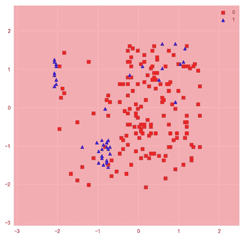

# 第二章：数据清洗与高级机器学习

数据分析的总体目标是发现可操作的洞察，从而带来积极的商业成果。在预测分析中，目标是通过基于过去的趋势和模式，确定目标最可能的未来结果。

预测分析的好处不仅仅局限于大科技公司。任何企业，只要拥有合适的数据，都可以找到从机器学习中获益的方式。

世界各地的公司正在收集大量数据，并利用预测分析来降低成本并增加利润。最常见的例子之一来自科技巨头谷歌、脸书和亚马逊，他们在大规模运用大数据。例如，谷歌和脸书根据预测算法为你提供个性化广告，这些算法预测你最有可能点击什么内容。类似地，亚马逊根据你的历史购买记录，推荐你最有可能购买的个性化产品。

现代预测分析依赖于机器学习，在机器学习中，计算机模型被训练来从数据中学习模式。正如我们在上一章中简要看到的，软件如 scikit-learn 可以与 Jupyter Notebooks 配合使用，来高效地构建和测试机器学习模型。正如我们将继续看到的，Jupyter Notebooks 是进行这类工作的理想环境，因为我们可以进行临时测试和分析，并且轻松保存结果以便后续参考。

在本章中，我们将通过在 Jupyter Notebook 中运行各种示例和活动来再次采用实践方法。上一章我们看到了一些机器学习的例子，而在本章中，我们将采取更加缓慢且深思熟虑的方法。以员工留存问题作为本章的核心示例，我们将讨论如何处理预测分析，在为建模准备数据时需要考虑的因素，以及如何使用 Jupyter Notebooks 实施并比较各种模型。

到本章结束时，你将能够：

+   制定机器学习分类策略

+   预处理数据以准备进行机器学习

+   训练分类模型

+   使用验证曲线来调整模型参数

+   使用降维方法来提升模型性能

# 准备训练预测模型

在这里，我们将介绍训练预测模型所需的准备工作。尽管这一步骤在技术上可能没有训练模型本身那么引人注目，但不应掉以轻心。确保你在开始构建和训练可靠模型的细节之前有一个良好的计划非常重要。此外，一旦你决定了合适的计划，在准备数据进行建模时，一些技术步骤也不容忽视。

我们必须小心不要在技术任务的细节中迷失方向，从而失去目标。技术任务包括那些需要编程技能的工作，例如构建可视化、查询数据库和验证预测模型。很容易花费数小时试图实现某个特定功能，或将图表调整得完美无缺。虽然这样做无疑有益于提高我们的编程技能，但我们也不应忘记问问自己，这些工作是否真的值得投入时间，尤其是在当前项目的背景下。

此外，请记住，Jupyter Notebooks 特别适合这个步骤，因为我们可以用它们来记录我们的计划，例如，写下关于数据的粗略笔记或我们有兴趣训练的模型列表。在开始训练模型之前，最好更进一步，写出一个结构清晰的计划。这样不仅能帮助你在构建和测试模型时保持进度，还能让其他人在看到你的工作时理解你在做什么。

在讨论准备工作后，我们还将介绍准备训练预测模型的另一个步骤，即清理数据集。这是 Jupyter Notebooks 特别适合的任务，因为它们为执行数据集转换并跟踪准确的更改提供了理想的测试平台。清理原始数据所需的数据转换可能变得复杂和繁琐，因此跟踪你的工作非常重要。如第一章所述，其他工具无法提供像 Jupyter Notebooks 这样高效的选项。

# 确定预测分析计划

在制定预测建模计划时，应首先考虑利益相关者的需求。如果模型不能解决相关问题，那么即便是完美的模型也毫无意义。围绕业务需求制定战略，确保成功的模型能带来可操作的洞察。

虽然原则上可以解决许多业务问题，但能否交付解决方案始终取决于必要数据的可用性。因此，考虑业务需求时需要结合可用的数据源。在数据充足时，这不会产生太大影响，但随着可用数据量的减少，可解决的问题范围也会变小。

这些想法可以形成一个标准的过程，用于确定预测分析计划，流程如下：

1.  查看可用数据，以了解现实中可解决的业务问题范围。在这个阶段，可能还为时过早去思考具体能解决哪些问题。确保你了解可用的数据字段以及它们适用的

    时间框架。

1.  通过与关键利益相关者交谈，确定业务需求。寻找一个通过解决该问题可以得出可操作的商业决策的场景。

1.  评估数据的适用性时，考虑特征空间是否足够多样和大。此外，还要考虑数据的状况：是否存在某些变量或时间范围的大量缺失值？

步骤 2 和步骤 3 应该重复执行，直到一个实际可行的计划逐渐成型。此时，你已经能大致了解模型的输入是什么，以及你可能期望的输出是什么。

一旦我们确定了一个可以用机器学习解决的问题，并且有了适当的数据源，我们应该回答以下问题，为项目奠定框架。这样做将帮助我们确定可以使用哪些类型的机器学习模型来解决问题：

+   训练数据是否已标注了我们想要预测的目标变量？

如果答案是肯定的，那么我们将进行监督学习。监督学习有许多实际应用，而针对未标注数据进行预测分析的商业案例则较为罕见。

如果答案是否定的，那么你正在使用未标注的数据，因此是在进行无监督学习。一个无监督学习方法的例子是聚类分析，其中标签会被分配给每个样本所属的最近聚类。

+   如果数据是已标注的，那么我们是在解决回归问题还是分类问题？

在回归问题中，目标变量是连续的，例如预测明天的降水量（以厘米为单位）。在分类问题中，目标变量是离散的，我们要预测的是类别标签。最简单的分类问题是二分类问题，其中每个样本被分为两个类别之一。例如，明天会下雨吗？

+   数据长什么样子？有多少个不同的数据源？

考虑数据的大小，包括宽度和高度，其中宽度指的是列数（特征），高度指的是行数。某些算法在处理大量特征时比其他算法更有效。一般来说，数据集越大，准确性就越高。然而，对于大数据集，训练可能会非常慢且内存消耗较大。这可以通过对数据进行聚合或使用降维技术来减少。

如果有不同的数据源，它们能否合并成一个单一的表格？如果不能，那么我们可能需要为每个数据源训练模型，并为最终预测模型进行集成平均。一个可能需要这样做的例子是，拥有不同规模的多组时间序列数据。假设我们有以下数据源：一个每日时间尺度上的 AAPL 股票收盘价格表和一个按月时间尺度的 iPhone 销量数据。

我们可以通过将每个样本的月销售数据添加到日时间尺度表中来合并数据，或者将每日数据按月分组，但可能更好的方式是为每个数据集建立两个模型，然后在最终的预测模型中结合每个模型的结果。

# 机器学习数据预处理

数据预处理对机器学习有着巨大的影响。就像“你就是你吃的东西”这句谚语一样，模型的表现直接反映了它所训练的数据。许多模型依赖于数据的转换，使得连续特征值具有可比的限制。同样，分类特征应当被编码为数值型数据。虽然这些步骤很重要，但相对简单，不会花费太多时间。

数据预处理中通常最耗时的部分是清理杂乱的数据。只需看看这张饼图，显示了一项特定调查中数据科学家们花费最多时间的工作。


另一个需要考虑的方面是许多数据科学家使用的数据集大小。随着数据集大小的增加，杂乱数据的出现频率也随之增加，清理这些数据的难度也随之增加。

简单地丢弃缺失数据通常不是最佳选择，因为很难证明丢弃大多数字段都有值的样本是合理的。这样做可能会丧失宝贵的信息，进而影响最终模型的表现。

数据预处理的步骤可以归纳如下：

+   根据共同字段合并数据集，将所有数据汇总成一个表格

+   特征工程以提高数据质量，例如使用降维技术构建新特征

+   通过处理重复行、错误或缺失值以及其他出现的问题来清理数据

+   通过标准化或归一化所需数据并将其拆分为训练集和测试集来构建训练数据集

让我们探索一些进行数据预处理的工具和方法。

# 探索数据预处理工具和方法

1.  在项目目录中通过执行`jupyter notebook`启动`NotebookApp`。然后进入`chapter-2`目录并打开`chapter-2-workbook.ipynb`文件。找到位于顶部附近加载包的单元并运行它。

我们将首先展示一些来自 Pandas 和 scikit-learn 的基本工具。接着，我们将深入研究重建缺失数据的方法。

1.  向下滚动到子主题`预处理机器学习数据`，运行包含`pd.merge`的单元，以在笔记本中显示合并函数的文档字符串：


如我们所见，该函数接受左右两个 DataFrame 进行合并。你可以指定一个或多个列来进行分组，并且可以选择如何进行分组，也就是说，使用左、右、外部或内部的值集。让我们来看一个使用的例子。

1.  退出帮助弹窗并运行包含以下示例 DataFrame 的单元格：

```py
    df_1 = pd.DataFrame({'product': ['red shirt', 'red shirt', 'red shirt',
                                 'white dress'],
                     'price': [49.33, 49.33, 32.49, 199.99]}),
    df_2 = pd.DataFrame({'product': ['red shirt', 'blue pants',
                                 'white tuxedo', 'white dress'],
                     'in_stock': [True, True, False, False]})    
```

在这里，我们将从零开始构建两个简单的 DataFrame。如你所见，它们包含一个名为 `product` 的列，其中有一些共享的条目。

现在，我们将对 `product` 共享列执行内部合并并打印结果。

1.  运行下一个单元格以执行内部合并：


注意，只有共享的项目 **红色衬衫** 和白色连衣裙被包含在内。为了包含两个表中的所有条目，我们可以改用外部合并。现在就来做吧。

1.  运行下一个单元格以执行外部合并：


这将返回每个表中的所有数据，其中缺失值已标记为 `NaN`。

1.  运行下一个单元格以执行外部合并：


这将返回每个表中的所有数据，其中缺失值已标记为 `NaN`。

由于这是我们第一次在本书中遇到 `NaN` 值，现在是讨论它们在 Python 中如何工作的好时机。

首先，你可以通过以下方式定义一个 `NaN` 变量，例如 `a = float('nan')`。

然而，如果你想测试相等性，你不能简单地使用标准比较方法。

最好通过像`NumPy`这样的库中的高层函数来实现。以下代码演示了这一点：


这些结果可能看起来有些反直觉。然而，这背后是有逻辑的。如果你想更深入地理解标准比较返回 False 的根本原因，可以查看这个非常好的 Stack Overflow 讨论：[`stackoverflow.com/questions/1565164/what-is-the-rationale-for-all-comparisons-returning-false-for-ieee754-nan-values.`](https://stackoverflow.com/questions/1565164/what-is-the-rationale-for-all-comparisons-returning-false-for-ieee754-nan-values)

1.  你可能已经注意到，我们最近合并的表格在前几行有重复的数据。让我们看看如何处理这个问题。

运行包含 `df.drop_duplicates()` 的单元格，以返回没有重复行的 DataFrame 版本：


这是最简单的“标准”去除重复行的方法。要将这些更改应用到 df，我们可以选择 `set inplace=True` 或做类似 `df = df.drop_duplicated()` 的操作。让我们来看另一种方法，它使用掩码来选择或去除重复行。

1.  运行包含 `df.duplicated()` 的单元格，打印出 True/False 序列，标记重复行：


我们可以对这个结果求和，以确定有多少行是重复的，或者它可以用作掩码来选择重复的行。

1.  通过运行接下来的两个单元格来实现：


1.  我们可以使用简单的波浪线（`~`）计算掩码的相反值，以提取去重后的 DataFrame。运行以下代码，并确信输出与`df.drop_duplicates()`的结果相同：

`df[~df.duplicated()]`


1.  这也可以用来从完整的 DataFrame 子集删除重复项。例如，运行包含以下代码的单元格：

`df[~df['product'].duplicated()]`


在这里，我们正在做以下事情：

+   +   为产品行创建一个掩码（一个`True`/`False`系列），其中重复项用`e`标记

    +   使用波浪线（`~`）获取该掩码的相反值，这样重复项就被标记为 False，其他所有项为`True`

    +   使用该掩码过滤掉`df`中`False`的行，这些行对应于重复的产品

正如预期的那样，我们现在看到只有第一行红色衬衫留下来，因为重复的产品行已被删除。

为了继续步骤，让我们用`df`的去重版本替换它。这可以通过运行`drop_duplicates`并传递`inplace=True`参数来实现。

1.  通过运行包含以下代码的单元格，去重 DataFrame 并保存结果：

    `df.drop_duplicates(inplace=True)`

继续其他预处理方法，让我们忽略重复行，首先处理缺失数据。这是必要的，因为模型不能在不完整的样本上进行训练。以蓝色裤子和白色燕尾服的缺失价格数据为例，我们展示一些处理`NaN`值的不同选项。

1.  一个选择是删除行，如果你的 NaN 样本大部分值缺失，这可能是个好主意。通过运行包含`df.dropna()`的单元格来执行此操作：


1.  如果某个特征的大部分值都缺失，最好完全删除该列。通过运行包含之前相同方法的单元格来执行此操作，但这次传递`axes`参数以指示列而不是行：


仅删除`NaN`值通常不是最佳选择，因为丢失数据永远不好，特别是当样本值只有少部分缺失时。Pandas 提供了一种以多种不同方式填充`NaN`条目的方法，其中一些我们将在本章中展示。

1.  运行包含`df.fillna?`的单元格，以打印 Pandas `NaN-fill` 方法的文档字符串：


请注意`value`参数的选项；例如，它可以是一个单一值，或者是基于索引的字典/系列类型映射。或者，我们可以将`value`保持为 None，并传递一个填充方法。我们将在本章中展示每种情况的示例。

1.  通过运行包含以下代码的单元格，用平均产品价格填充缺失的数据：

    `df.fillna(value=df.price.mean())`


1.  现在，通过运行包含以下代码的单元格，使用 pad 方法填充缺失的数据：

    `df.fillna(method='pad')`


请注意，**白色裙子**的价格被用来填充下面缺失的值。

为了总结本节内容，我们将准备一个简单的表格，用于训练机器学习算法。别担心，我们不会在这么小的数据集上训练任何模型！我们从编码类别数据的类标签开始这个过程。

1.  在编码标签之前，先运行`Building training data sets`部分中的第一个单元格，以添加另一列数据，表示产品的平均评分：


假设我们希望使用这个表格来训练一个预测模型，我们应该首先考虑将所有变量更改为数值类型。

1.  最简单的列是布尔列表：`in_stock`。在使用该列来训练预测模型之前，应将其转换为数值型数据，例如 0 和 1。这可以通过多种方式实现，例如运行包含以下代码的单元格：`df.in_stock = df.in_stock.map({False: 0, True: 1})`


1.  另一种编码特征的选择是 scikit-learn 的 LabelEncoder，它可以用于将类别标签映射为整数，方法上更为简便。我们通过运行包含以下代码的单元格来测试这一点：

```py
    from sklearn.preprocessing import LabelEncoder
    rating_encoder = LabelEncoder()
    _df = df.copy()
    _df.rating = rating_encoder.fit_transform(df.rating)
    _df 
```


这可能会让你想起我们在上一章构建多项式模型时进行的预处理。在这里，我们实例化一个标签编码器，然后“训练”它并使用`fit_transform`方法“转换”我们的数据。我们将结果应用于我们的数据框副本`_df`。

1.  然后，可以使用我们在变量`rating_encoder`中引用的类，通过运行`rating_encoder.inverse_transform(df.rating)`将特征转换回来：


你可能会注意到一个问题。我们正在处理一个所谓的“序数”特征，其中标签具有固有的顺序。在这种情况下，我们应该期望“低”评级会被编码为 0，而“高”评级会被编码为 2。然而，结果并不是我们所看到的那样。为了实现正确的序数标签编码，我们应该再次使用 map，并自行构建字典。

1.  通过运行包含以下代码的单元格，正确地编码序数标签：

```py
    ordinal_map = {rating: index for index, rating in enumerate
    (['low','medium', 'high'])}
    print(ordinal_map)
    df.rating = df.rating.map(ordinal_map) 
```


我们首先创建映射字典。通过字典推导式和枚举来实现，但从结果来看，这个字典也可以很容易地手动定义。然后，就像之前处理`in_stock`列时那样，我们将字典映射应用到特征上。从结果来看，我们可以看到评分（rating）现在比之前更有意义，其中`low`被标记为 0，`medium`为 1，`high`为 2。

现在我们已经讨论了有序特征，让我们简单谈一下另一种类型的特征，即名义特征（nominal features）。这些字段没有固有的顺序，在我们的例子中，`product`就是一个完美的例子。

大多数 scikit-learn 模型可以在这样的数据上进行训练，其中我们使用字符串而非整数编码标签。在这种情况下，必要的转换是在幕后完成的。然而，这并不适用于所有 scikit-learn 模型，或者其他机器学习和深度学习库。因此，最好在预处理阶段自行进行编码。

1.  一个常用的技术是将类别标签从字符串转换为数值，这称为独热编码（one-hot encoding）。这种方法将不同的类别拆分成独立的特征。可以通过`pd.get_dummies()`优雅地完成。执行以下代码单元来实现：`df = pd.get_dummies(df)`

最终的 DataFrame 如下所示：


在这里，我们看到了独热编码的结果：`product`列被拆分成了 4 列，每列代表一个唯一的值。在每一列中，我们看到 1 或 0，表示该行是否包含特定的值或产品。

接下来，忽略数据缩放（通常应该进行数据缩放），最后一步是将数据划分为训练集和测试集，供机器学习使用。这可以通过使用 scikit-learn 的 train_test_split 来完成。假设我们要预测某个项目是否有库存，基于其他特征值。

1.  通过运行以下代码单元来将数据划分为训练集和测试集：

```py
    features = ['price', 'rating', 'product_blue pants',
    'product_red shirt', 'product_white dress',
    'product_white tuxedo']
    X = df[features].values
    target = 'in_stock'
    y = df[target].values
    from sklearn.model_selection import train_test_split
    X_train, X_test, y_train, y_test = \
    train_test_split(X, y, test_size=0.3) 
```


在这里，我们选择数据的子集并将其输入`train_test_split`函数。此函数有四个输出，分别解包为特征（X）和目标（y）的训练集和测试集。

观察输出数据的形状，其中测试集大约包含 30%的样本，而训练集大约包含 70%的样本。

稍后，我们会看到类似的代码块，用于准备真实数据以用于训练预测模型。

这部分内容结束了，涉及到为机器学习应用清理数据的过程。我们花点时间注意一下，我们的 Jupyter Notebook 在测试各种数据转换方法时的效果，并最终记录了我们选择的处理流程。这可以轻松应用于数据的更新版本，只需要在处理之前调整特定代码单元。并且，如果我们想对处理流程进行任何更改，这些更改可以轻松地在笔记本中进行测试，特定的单元格可以更改以适应调整。最好的方法可能是将笔记本复制到一个新文件中，这样我们始终可以保留原始分析的副本作为参考。

接下来进入一个活动，我们将应用本节的概念，对大型数据集进行处理，并为训练预测模型做准备。

# 活动：为员工留任问题准备训练预测模型

假设你被聘请为一家公司做自由职业工作，帮助他们找出员工流失的原因。他们已经收集了一些认为有助于此目的的数据，包括员工满意度、评估、工作时长、部门和薪水等详细信息。

公司通过发送名为`hr_data.csv`的文件与您共享他们的数据，并询问您认为可以做些什么来帮助减少员工流失。将我们目前所学的概念应用到实际问题中，特别是我们旨在：

+   根据可用数据，确定使用预测分析提供有影响力的商业洞察的计划。

+   为机器学习模型准备数据。

从这一活动开始，直到本章的剩余部分，我们将使用*人力资源分析*，这是一个 Kaggle 数据集。我们在本书中使用的数据集与在线版本之间有一个小的区别。我们的员工资源分析数据包含一些`NaN`值，而这些数据在在线版本中已被手动移除。

数据集用于展示数据清洗技巧。我们还添加了一个名为`is_smoker`的数据列，目的是为了相同的目的。

1.  打开`chapter-2-workbook.ipynb`笔记本文件，滚动到活动部分。

1.  运行以下代码检查表头：

```py
      %%bash
      head ../data/hr-analytics/hr_data.csv 
```

根据输出结果，确保它看起来是标准的 CSV 格式。对于 CSV 文件，我们应该能够简单地通过`pd.read_csv`加载数据。

1.  通过运行`df = pd.read_csv('../data/hranalytics/hr_data.csv')`来使用 Pandas 加载数据。使用自动完成功能来帮助输入文件路径。

1.  通过打印`df.columns`来检查列，确保数据已按预期加载，然后通过`df.head()`和`df.tail()`打印 DataFrame 的前后部分：


我们可以看到它似乎已正确加载。根据尾部索引值，数据有将近 15,000 行；让我们确保没有遗漏任何数据。

1.  使用以下代码检查`CSV 文件`中的行数（包括标题）：

```py
    with open('../data/hr-analytics/hr_data.csv') as f:
    print(len(f.read().splitlines())) 
```


1.  将此结果与`len(df)`进行比较，以确保我们已加载所有数据：


现在，客户的数据已经正确加载，让我们思考如何使用预测分析找出员工离职的原因。

让我们从创建预测分析计划的第一步开始：

+   +   **查看可用数据**：我们已经通过查看列、数据类型和样本数量完成了这一步

    +   **确定业务需求**：客户已经明确表达了他们的需求：减少离职员工的数量

    +   **评估数据的适用性**：让我们尝试制定一个计划，以便根据提供的数据帮助满足客户的需求

回想一下，正如前面提到的，有效的分析技术能带来具有影响力的商业决策。考虑到这一点，如果我们能预测员工离职的可能性，企业就可以有针对性地对这些员工进行特别处理。例如，可以提高他们的薪水或减少他们的项目数量。此外，利用模型还可以估算这些变化的影响！

为了评估这个计划的有效性，让我们思考一下我们的数据。每一行代表一个员工，员工要么在公司工作，要么已**离职**，这由名为“left”的列标记。因此，我们可以训练一个模型，根据一组特征来预测这个目标。

评估目标变量。通过运行以下代码检查分布和缺失值数量：

```py
    df.left.value_counts().plot('barh')
    print(df.left.isnull().sum()) 
```


这是第二行代码的输出：


大约四分之三的样本是没有离职的员工，离职的员工占其余四分之一。这告诉我们我们正在处理一个不平衡的分类问题，这意味着在计算准确度时，我们需要采取特别措施来考虑每个类别。我们还发现，目标变量没有缺失值（没有`NaN`值）。

现在，我们来评估特征：

1.  执行`df.dtypes`打印每列的数据类型。请注意，我们有连续型和离散型特征的混合：


1.  运行以下代码显示特征分布：

```py
    for f in df.columns:
    try:
    fig = plt.figure()
    …
    print('-'*30) 
```

这段代码稍显复杂，但它非常有用，可以展示数据集中连续型和离散型特征的概览。实际上，它假设每个特征都是连续的，并尝试绘制其分布；如果特征是离散的，它会转而绘制值计数。

结果如下：


对于许多特征，我们看到其值分布广泛，表明特征空间具有很好的多样性。这是令人鼓舞的；如果特征值紧密分布在一个小范围内，可能对模型来说不太有用。`promotion_last_5years`就是这种情况，我们可以看到绝大多数样本的值为 0。

接下来，我们需要做的是从数据集中移除所有的`NaN`值。

1.  通过运行以下代码来检查每列中有多少`NaN`值：

    `df.isnull().sum() / len(df) * 100`


我们可以看到，大约有 2.5%的`average_monthly_hours`数据缺失，`time_spend_company`有 1%的数据缺失，而`is_smoker`有 98%的数据缺失！让我们使用一些已经学到的策略来处理这些缺失值。

1.  由于`is_smoker`指标几乎没有任何信息，让我们删除这一列。通过运行以下代码来实现：`del df['is_smoker']`。

1.  由于`time_spend_company`是一个整数字段，我们将使用中位数值来填充该列中的`NaN`值。这可以通过以下代码实现：

```py
    fill_value = df.time_spend_company.median()
    df.time_spend_company = df.time_spend_company.fillna(fill_value) 
```

处理的最后一列是`average_montly_hours`。我们可以做类似的操作，使用中位数或四舍五入后的均值作为整数填充值。不过，我们不妨尝试利用它与另一个变量之间的关系。这可能使我们能够更准确地填充缺失的数据。

1.  绘制`average_monthly_hours`按`number_project`分组的箱形图。可以通过运行以下代码来实现：

```py
  sns.boxplot(x='number_project', y='average_montly_hours', data=df) 
```


我们可以看到项目数量与`average_monthly_hours`之间的相关性，这一结果并不令人惊讶。我们将利用这种关系，通过根据每个样本的项目数量，使用该组的均值来填充`average_monthly_hours`中的`NaN`值。

1.  运行以下代码来计算每个组的均值：

```py
    mean_per_project = df.groupby('number_project')\.
    average_montly_hours.mean()
    mean_per_project = dict(mean_per_project)
    print(mean_per_project) 
```


然后，我们可以将其映射到`number_project`列，并将结果序列对象作为参数传递给`fillna`。

1.  通过执行以下代码来填充`average_monthly_hours`中的`NaN`值：

```py
      fill_values = df.number_project.map(mean_per_project)
      df.average_montly_hours = df.average_montly_hours.fillna(fill_values) 
```

1.  通过运行以下断言测试，确认`df`中没有更多的`NaN`值。如果没有抛出错误，那么就说明你已经成功地从表格中移除了`NaN`：

    `assert df.isnull().sum().sum() == 0`

1.  最后，我们将把字符串和布尔字段转换为整数表示。特别地，我们将手动将目标变量`left`从`yes`和`no`转换为`1`和`0`，并构建独热编码特征。通过运行以下代码来实现：

```py
  df.left = df.left.map({'no': 0, 'yes': 1})
  df = pd.get_dummies(df) 
```

1.  打印`df.columns`以显示字段：


我们可以看到，`department`和`salary`已经被拆分成了多个二元特征。

准备机器学习数据的最后一步是特征缩放，但出于各种原因（例如，某些模型不需要缩放），我们将在下一个活动的模型训练工作流中进行这一步骤。

1.  我们已经完成了数据预处理，准备进入模型训练阶段！让我们通过运行以下代码来保存我们预处理过的数据：

```py
     df.to_csv('../data/hr-analytics/hr_data_processed.csv', index=False) 
```

再次提醒，在执行初步数据分析和清理时，Jupyter Notebook 是多么适合我们的需求。举个例子，假设我们把这个项目放置在当前状态下几个月后再回来。那时，我们可能已经不记得我们离开时到底发生了什么。然而，参考回这个笔记本，我们就能重新追溯我们的步骤，并迅速回忆起之前对数据的学习内容。此外，我们还可以用新的数据更新数据源，并重新运行笔记本，准备新数据集以便用于我们的机器学习算法。请记住，在这种情况下，最好首先复制笔记本，以免丢失最初的分析。

总结一下，我们已经学习并应用了训练机器学习模型的准备方法。我们从讨论如何识别可以通过预测分析解决的问题的步骤开始。这包括：

+   查看可用数据

+   确定业务需求

+   评估数据的适用性

我们还讨论了如何识别有监督学习与无监督学习，以及回归问题与分类问题。

在识别问题后，我们学习了使用 Jupyter Notebooks 构建和测试数据转换管道的技巧。这些技巧包括处理缺失数据、转换分类特征和构建训练/测试数据集的方法和最佳实践。

在本章的其余部分，我们将使用这些预处理过的数据来训练各种分类模型。为了避免盲目应用我们不了解的算法，我们首先介绍这些算法并概述它们的工作原理。然后，我们使用 Jupyter 训练并比较它们的预测能力。在这里，我们有机会讨论机器学习中的一些更高级的主题，比如过拟合、k 折交叉验证和验证曲线。

# 训练分类模型

正如我们在上一章中已经看到的，使用诸如 scikit-learn 这样的库和 Jupyter 等平台，预测模型可以通过几行代码进行训练。这是通过抽象化优化模型参数所涉及的复杂计算来实现的。换句话说，我们处理的是一个“黑盒”，其中内部操作被隐藏起来。正是这种简化带来了误用算法的风险，例如，在训练过程中过度拟合，或者未能在未见过的数据上进行正确测试。我们将展示如何避免在训练分类模型时遇到这些陷阱，并通过使用 k 折交叉验证和验证曲线来产生可信的结果。

# 分类算法简介

回顾两种监督式机器学习方法：回归和分类。在回归中，我们预测一个连续的目标变量。例如，回忆一下第一章中的线性和多项式模型。在本章中，我们关注的是另一种监督式机器学习方法：分类。这里的目标是使用可用的度量标准来预测样本的类别。

在最简单的情况下，只有两种可能的类别，这意味着我们正在进行二分类。这是本章示例问题的情况，我们试图预测一个员工是否离职。如果我们有两个以上的类别标签，那么我们就是在进行多分类。

尽管使用 scikit-learn 训练模型时，二分类和多分类之间几乎没有差别，但在“黑盒”内部进行的操作却明显不同。特别是，多分类模型通常使用一对多方法。对于具有三个类别标签的情况，方法如下：当模型“拟合”数据时，训练三个模型，每个模型预测样本是否属于某个特定类别或其他类别。这可能会让人联想到我们之前做的特征的独热编码。当对一个样本进行预测时，返回的是具有最高置信度的类别标签。

在本章中，我们将训练三种类型的分类模型：支持向量机、随机森林和 k-近邻分类器。这些算法各不相同。然而，正如我们将看到的，由于使用了 scikit-learn，它们在训练和用于预测时是非常相似的。在切换到 Jupyter Notebook 并实现这些模型之前，我们将简要了解它们的工作原理。支持向量机尝试找到最佳超平面以区分不同类别。这是通过最大化超平面与每个类别最近样本之间的距离来实现的，这些样本被称为支持向量。

这种线性方法也可以通过核技巧来建模非线性类别。该方法将特征映射到一个更高维度的空间，在其中确定超平面。我们所讨论的这个超平面也被称为决策面，我们将在训练模型时可视化它。

k-最近邻分类算法记住训练数据，并根据特征空间中最近的 K 个样本进行预测。对于三个特征，这可以通过一个包围预测样本的球体来可视化。然而，通常我们处理的不止三个特征，因此绘制超球体来找到最近的 K 个样本。

随机森林是一组决策树，每棵树都在不同的训练数据子集上训练。

决策树算法通过一系列决策对样本进行分类。例如，第一个决策可能是“如果特征 x_1 小于或大于 0”。然后，数据会根据这个条件被分割，并输入到树的下行分支中。决策树中的每一步都根据最大化信息增益的特征分割来做出决策。

本质上，这个术语描述了试图选择目标变量最佳分割的数学方法。

训练随机森林的过程包括为一组决策树创建自助采样（即带替换的随机抽样数据）数据集。然后根据多数投票做出预测。这些模型的好处是减少过拟合，并且具有更好的泛化能力。

决策树可以用来建模连续数据和分类数据的混合，这使得它们非常有用。此外，正如我们在本章后面会看到的那样，可以通过限制树的深度来减少过拟合。要详细了解（但简洁的）决策树算法，可以查看这个流行的 Stack Overflow 回答：[`stackoverflow. com/a/1859910/3511819`](https://stackoverflow.com/questions/1859554/what-is-entropy-and-information-gain/1859910#1859910)。在那里，作者展示了一个简单的示例，并讨论了节点纯度、信息增益和熵等概念。

# 使用 scikit-learn 训练双特征分类模型

我们将继续处理在第一个话题中介绍的员工留存问题。我们之前准备了一个数据集来训练分类模型，预测员工是否离职。现在，我们将使用这个数据来训练分类模型：

1.  如果你还没有这样做，请启动 `NotebookApp` 并打开 `chapter-2-workbook.ipynb` 文件。向下滚动到 `Topic Training classification models`。运行前几行代码来设置默认图像大小并加载我们之前保存到 `CSV 文件` 的处理数据。

在这个例子中，我们将训练基于两个连续特征的分类模型：

`satisfaction_level` 和 `last_evaluation`。

1.  通过运行包含以下代码的单元格，绘制连续目标变量的双变量和单变量图：

```py
  sns.jointplot('satisfaction_level', 
 'last_evaluation', data=df, kind='hex') 
```


如前面的图片所示，数据中存在一些非常明显的模式。

1.  通过运行包含以下代码的单元格，重新绘制目标变量分段的双变量分布：

```py
      plot_args = dict(shade=True, shade_lowest=False)
      for i, c in zip((0, 1), ('Reds', 'Blues')):
      sns.kdeplot(df.loc[df.left==i, 'satisfaction_level'],
          df.loc[df.left==i, 'last_evaluation'],
          cmap=c, **plot_args) 
```


现在，我们可以看到这些模式与目标变量之间的关系。接下来，我们将尝试利用这些模式来训练有效的分类模型。

1.  通过运行包含以下代码的单元格，将数据划分为训练集和测试集：

```py
     from sklearn.model_selection import train_test_split
     features = ['satisfaction_level', 'last_evaluation']
        X_train, X_test, y_train, y_test = 
        train_test_split(df[features].values, df['left'].values,
        test_size=0.3, random_state=1) 
```

我们的前两个模型——支持向量机和 k 最近邻算法——在输入数据进行缩放，使所有特征处于相同的数量级时最为有效。我们将通过 scikit-learn 的 `StandardScaler` 来完成这一点。

1.  加载 `StandardScaler` 并创建一个新的实例，如变量 `scaler` 所引用。将 `scaler` 拟合到训练集并进行转换，然后转换测试集。运行包含以下代码的单元格：

```py
    from sklearn.preprocessing import StandardScaler
    scaler = StandardScaler()
    X_train_std = scaler.fit_transform(X_train)
    X_test_std = scaler.transform(X_test) 
```

在进行机器学习时，一个常见的错误是将 `scaler` 拟合到整个数据集，而实际上它应该只拟合训练数据。例如，在将数据划分为训练集和测试集之前进行缩放是错误的。我们不希望这样做，因为模型训练不应受到测试数据的任何影响。

1.  导入 scikit-learn 的支持向量机类，并通过运行包含以下代码的单元格，将模型拟合到训练数据上：

```py
    from sklearn.svm import
    SVC svm = SVC(kernel='linear', C=1, random_state=1)
    svm.fit(X_train_std, y_train)
```

接下来，我们训练一个线性支持向量机分类模型。C 参数控制误分类的惩罚，从而可以控制模型的方差和偏差。

1.  通过运行包含以下代码的单元格，计算此模型在未见数据上的准确度：

```py
    from sklearn.metrics import accuracy_score
    y_pred = svm.predict(X_test_std)
    acc = accuracy_score(y_test, y_pred)
    print('accuracy = {:.1f}%'.format(acc*100))
    >> accuracy = 75.9% 
```

我们预测测试样本的目标值，然后使用 scikit-learn 的 `accuracy_score` 函数来确定准确度。结果看起来很有前景，大约为 75%！对于我们的第一个模型来说，这还不错。不过，请记住，目标变量是不平衡的。让我们看看每个类别的预测准确度。

1.  计算混淆矩阵，然后通过运行包含以下代码的单元格来确定每个类别内的准确度：

```py
      from sklearn.metrics import confusion_matrix
      cmat = confusion_matrix(y_test, y_pred)
      scores = cmat.diagonal() / cmat.sum(axis=1) * 100
      print('left = 0 : {:.2f}%'.format(scores[0]))
      print('left = 1 : {:.2f}%'.format(scores[1]))
      >> left = 0 : 100.00%
      >> left = 1 : 0.00% 
```

看起来模型只是将每个样本都分类为 0，这显然是完全没有帮助的。让我们使用等高线图显示特征空间中每个点的预测类别。这通常被称为决策区域图。

1.  使用 `mlxtend` 库中的一个有用函数绘制决策区域。运行包含以下代码的单元格：

```py
      from mlxtend.plotting import plot_decision_regions
      N_samples = 200
      X, y = X_train_std[:N_samples], y_train[:N_samples]
      plot_decision_regions(X, y, clf=svm) 
```



该函数绘制决策区域以及作为参数传递的一组样本。为了正确看到决策区域而不受太多样本阻碍视线，我们仅传递了测试数据的一个包含 200 个样本的子集给`plot_decision_regions`函数。在这种情况下，当然无关紧要。我们看到结果完全是红色的，表示特征空间中的每个点都将被分类为 0。

不出意料，线性模型无法很好地描述这些非线性模式。回想一下，我们先前提到了使用 SVM 分类非线性问题的内核技巧。让我们看看这样做是否可以改善结果。

1.  运行包含 SVC 单元格以打印 scikit-learn SVM 的文档字符串。向下滚动并查看参数描述。请注意`kernel`选项，默认情况下实际上是启用的`rbf`。使用此内核选项训练新的 SVM，运行包含以下代码的单元格：

```py
     svm = SVC(kernel='rbf', C=1, random_state=1)
     svm.fit(X_train_std, y_train)
```

1.  为了更轻松地评估此及未来模型的性能，让我们定义一个名为`check_model_fit`的函数，计算各种度量标准，以便比较模型。运行定义此函数的单元格。

此函数中进行的每个计算在此示例中均已看到；它仅计算准确性并绘制决策区域。

1.  运行包含以下代码的单元格，显示对训练数据进行新训练的核支持向量机（kernel-SVM）的结果：

```py
  check_model_fit(svm, X_test_std, y_test) 
```


结果好多了。现在，我们能够捕捉数据中一些非线性模式，并正确分类大多数离职员工。

# 绘制决策区域函数

`plot_decision_regions`函数由 Sebastian *Raschka*开发的 Python 库`mlxtend`提供。值得一看源代码（当然是用 Python 编写的）以理解这些绘图是如何绘制的。这并不是太复杂。

在 Jupyter Notebook 中，从`mlxtend.plotting`导入`plot_decision_regions`函数，然后使用`plot_decision_regions?`查看帮助，并滚动到底部查看本地文件路径：


然后，打开文件并查看它！例如，你可以在笔记本中运行`cat`：


这样也可以，但是对于代码没有颜色标记不理想。最好复制它（以免意外更改原始内容），然后使用您喜爱的文本编辑器打开它。

当注意绘制决策区域映射代码时，我们看到预测`Z`在跨越特征空间的数组`X_predict`上的等高线图。


让我们继续下一个模型：k 最近邻。

# 为我们的模型训练 k 最近邻

1.  加载 scikit-learn 的 KNN 分类模型，并通过运行包含以下代码的单元格来打印文档字符串：

```py
      from sklearn.neighbors import KNeighborsClassifier
      KNeighborsClassifier?
```

`n_neighbors` 参数决定了在进行分类时使用多少个样本。如果权重参数设置为均匀（uniform），则类别标签由多数投票决定。另一个有用的权重选择是距离，其中距离较近的样本在投票中具有较高的权重。像大多数模型参数一样，这个选择的最佳值取决于特定的数据集。

1.  训练一个 KNN 分类器，`n_neighbors=3`，然后计算准确率和决策区域。运行包含以下代码的单元格：

```py
    knn = KNeighborsClassifier(n_neighbors=3)
    knn.fit(X_train_std, y_train) 

    check_model_fit(knn, X_test_std, y_test) 

```


我们看到整体准确度有所提高，尤其是类别 1 的准确度有了显著改善。然而，决策区域图表表明我们正在对数据进行过拟合。通过硬性的、"锯齿状"的决策边界以及随处可见的小块蓝色区域可以明显看出这一点。我们可以通过增加最近邻的数量来软化决策边界，并减少过拟合。

1.  通过运行包含以下代码的单元格，训练一个 `n_neighbors=25` 的 KNN 模型：

```py
    knn = KNeighborsClassifier(n_neighbors=25)
    knn.fit(X_train_std, y_train)
    check_model_fit(knn, X_test_std, y_test) 
```


如我们所见，决策边界明显不再那么锯齿状，蓝色区域也大大减少。类别 1 的准确率略有下降，但我们需要使用更全面的方法，比如 k 折交叉验证，来决定是否

这两个模型之间有显著的差异。

请注意，增加`n_neighbors`对训练时间没有影响，因为模型仅仅是在记忆数据。然而，预测时间会受到很大影响。

在使用真实世界数据进行机器学习时，算法的运行速度足够快以达到其目的非常重要。例如，预测明天天气的脚本如果运行时间超过一天，那就完全没有用！内存也是一个需要考虑的因素，尤其是在处理大量数据时。

# 训练随机森林

观察训练和预测每个模型的相似性，尽管它们内部差异很大。

1.  训练一个由 50 棵决策树组成的随机森林分类模型，每棵树的最大深度为 5。运行包含以下代码的单元格：

```py
       from sklearn.ensemble import RandomForestClassifier
       forest = RandomForestClassifier(n_estimators=50,
       max_depth=5,
       random_state=1)
       forest.fit(X_train, y_train)
       check_model_fit(forest, X_test, y_test) 
```


注意决策树机器学习算法所产生的独特的轴对齐决策边界。

我们可以访问构建随机森林时使用的任何单个决策树。这些树被存储在模型的 `estimators_attribute` 中。让我们绘制其中一棵决策树，以便了解其中的内容。执行此操作需要**图形**可视化依赖项，安装起来有时可能会有些困难。

1.  通过运行包含以下代码的单元格，在 Jupyter Notebook 中绘制其中一棵决策树：

```py
    from sklearn.tree import export_graphviz
    import graphviz
    dot_data = export_graphviz(
        forest.estimators_[0],
        out_file=None,
        feature_names=features,
        class_names=['no', 'yes'],
        filled=True, rounded=True,
        special_characters=True)
    graph = graphviz.Source(dot_data)
    graph 
```


我们可以看到，每条路径被限制为五个节点，这是由于设置了`max_depth=5`。橙色框表示`no`（没有离开公司）的预测，蓝色框表示`yes`（已经离开公司）的预测。每个框的阴影（浅色、深色等）表示置信度，和`gini`值相关。

总结一下，我们已经完成了本节中的两个学习目标：

+   我们获得了对支持向量机（SVM）、k-近邻分类器（kNN）和随机森林的定性理解。

+   我们现在能够使用 scikit-learn 和 Jupyter Notebook 训练多种模型，从而有信心构建和比较预测模型。

特别地，我们使用了员工离职问题的预处理数据来训练分类模型，预测员工是否已经离开公司。为了简化问题并专注于算法，我们构建了一个模型，仅根据两个特征来预测：满意度和最后评估值。这种二维特征空间还使我们能够可视化决策边界，并识别过拟合的表现。

在接下来的部分中，我们将介绍机器学习中的两个重要主题：k 折交叉验证和验证曲线。

# 使用 k 折交叉验证和验证曲线评估模型

到目前为止，我们已经在数据的一个子集上训练了模型，然后在未见过的部分——即测试集——上评估了性能。这是一个良好的做法，因为模型在训练数据上的表现并不能很好地反映它作为预测器的效果。通过过拟合一个模型，很容易在训练数据集上提高准确率，但这可能会导致在未见过数据上的表现较差。

也就是说，仅仅在这样分割的数据上训练模型是不够的。数据中存在自然的变异，导致不同的训练和测试分割下准确率有所不同（即使是轻微的）。此外，仅使用一个训练/测试分割来比较模型可能会引入偏向某些模型的偏差，并导致过拟合。

**k 折** **交叉验证** 提供了解决这个问题的方案，并通过每次准确性计算的误差估计来考虑数据的变异性。这反过来又自然地引出了使用验证曲线来调整模型参数。这些曲线绘制了准确率与超参数之间的关系，比如在随机森林中使用的决策树数量或最大深度。

这是我们第一次使用超参数这个术语。它指的是在初始化模型时定义的参数，例如 SVM 的 C 参数。这与训练好的模型参数不同，后者是训练好的 SVM 的决策边界超平面方程。

该方法在下图中进行了说明，我们可以看到如何从数据集中选择 k 个折叠：


k 折交叉验证算法如下：

1.  将数据划分为大小接近的 k 个“折叠”。

1.  在不同的折叠组合上测试和训练 k 个模型。每个模型将包括*k - 1*个训练数据折叠，留下的折叠用于测试。在这种方法中，每个折叠最终都会作为验证数据使用一次。

1.  通过取 k 个值的均值来计算模型的精度。同时计算标准偏差，以便为该值提供误差条。

通常设置*k = 10*，但如果使用大数据集，应考虑选择较小的 k 值。

这种验证方法可以可靠地比较不同超参数下的模型性能（例如，SVM 的 C 参数或 KNN 分类器中的最近邻数量）。它也适用于比较完全不同的模型。

一旦识别出最佳模型，应在整个数据集上重新训练该模型，然后再用于预测实际分类。

在使用 scikit-learn 实现时，通常会使用一种稍微改进的普通 k 折算法。这被称为分层 k 折。其改进之处在于，分层 k 折交叉验证在折叠中保持大致均衡的类标签分布。正如你想象的那样，这减少了模型的整体方差，并降低了高度不平衡的模型造成偏差的可能性。

验证曲线是训练和验证度量值与某些模型参数的函数的图表。它们帮助我们做出合理的模型参数选择。在本书中，我们将使用精度得分作为这些图表的度量标准。

有关绘制验证曲线的文档，请访问：[ http://scikit-learn.org/stable/auto_examples/model_selection/plot_validation_curve.html](http://scikit-learn.org/stable/auto_examples/model_selection/plot_validation_curve.html)。

考虑这个验证曲线，其中精度得分作为 gamma SVM 参数的函数进行绘制：


从图表的左侧开始，我们可以看到两组数据在得分上是一致的，这是好现象。然而，得分与其他 gamma 值相比也相对较低，因此我们认为模型存在欠拟合数据的情况。随着 gamma 值的增加，我们可以看到一个点，此时这两条线的误差条不再重叠。从这个点开始，我们看到分类器开始对数据进行过拟合，因为模型在训练集上的表现越来越好，而在验证集上的表现相对较差。通过寻找误差条重叠的两条线上的高验证得分，我们可以找到 gamma 参数的最优值。

请记住，对于某个参数的学习曲线只有在其他参数保持不变的情况下才有效。例如，如果在此图中训练 SVM，我们可以选择γ值为 10⁻⁴。但我们也可能希望优化 C 参数。C 的不同值会导致前面的图像发生变化，我们选择的γ值可能不再是最优的。

# 在 Python 中使用 K 折交叉验证和验证曲线，结合 scikit-learn 工具。

1.  如果你还没有这样做，启动`NotebookApp`并打开`chapter-2- workbook.ipynb 文件`。向下滚动到子主题`K-fold 交叉验证`和`验证曲线`部分。

训练数据应该已经加载到笔记本的内存中，但为了提醒我们正在使用的数据内容，我们可以重新加载它。

1.  加载数据并选择`satisfaction_level`和`last_evaluation`特征作为训练/验证集。我们这次不使用训练集和测试集的划分，因为我们将使用 K 折交叉验证。运行包含以下代码的单元：

```py
      df = pd.read_csv('../data/hr-analytics/hr_data_processed.csv')
      features = ['satisfaction_level', 'last_evaluation']
      X = df[features].values
      y = df.left.values 
```

1.  通过运行包含以下代码的单元来实例化一个随机森林模型：

```py
   clf = RandomForestClassifier(n_estimators=100, max_depth=5) 
```

1.  为了使用分层 K 折交叉验证训练模型，我们将使用`model_selection.cross_val_score`函数。

使用分层 K 折验证训练我们模型`clf`的 10 个变种。注意，scikit-learn 的`cross_val_score`默认执行这种类型的验证。运行包含以下代码的单元：

```py
    from sklearn.model_selection import cross_val_score
    np.random.seed(1)
    scores = cross_val_score(
        estimator=clf,
        X=X,
        y=y,
        cv=10)
    print('accuracy = {:.3f} +/- {:.3f}'.format(scores.mean(), scores.
    std()))
    >> accuracy = 0.923 +/- 0.005 
```

注意我们如何使用`np.random.seed`来设置随机数生成器的种子，从而确保每一折和随机森林中的每棵决策树在随机选择样本时具有可重复性。

1.  通过这种方法，我们将准确度计算为每折的平均值。我们还可以通过打印分数来查看每一折的单独准确度。要查看这些，请运行`print(scores)`：

```py
    >> array([ 0.93404397, 0.91533333, 0.92266667, 0.91866667,
        0.92133333,
        0.92866667, 0.91933333, 0.92 , 0.92795197, 0.92128085]) 
```

使用`cross_val_score`非常方便，但它没有告诉我们每个类的准确度。我们可以通过`model_selection`中的`StratifiedKFold`类手动执行此操作。该类以折数作为初始化参数，然后使用 split 方法为数据构建随机抽样的“掩码”。掩码只是一个数组，包含另一个数组中项目的索引，之后可以通过`data[mask]`来返回这些项目。

1.  定义一个自定义类来计算 K 折交叉验证的分类准确度。运行包含以下代码的单元：

```py
      from sklearn.model_selection import StratifiedKFold
      …
          print('fold: {:d} accuracy: {:s}'.format(k+1, str(class_acc)))
      return class_accuracy 
```

1.  我们可以通过类似第 4 步的代码来计算分类准确度。执行以下代码来实现：

```py
    from sklearn.model_selection import cross_val_score
    np.random.seed(1)
    …
    >> fold: 10 accuracy: [ 0.98861646 0.70588235]
    >> accuracy = [ 0.98722476 0.71715647] +/- [ 0.00330026 0.02326823] 
```

现在我们可以看到每折的分类准确度了！是不是很酷？

1.  接下来我们展示如何使用`model_selection.validation_curve`计算验证曲线。该函数使用分层 K 折交叉验证来训练模型，以求得给定参数的不同值。

进行必要的计算，通过训练随机森林模型在一系列 max_depth 值上绘制验证曲线。运行包含以下代码的单元格：

```py
    from sklearn.model_selection import validation_curve

    clf = RandomForestClassifier(n_estimators=10)
    max_depths = np.arange(3, 16, 3)
    train_scores, test_scores = validation_curve(
        estimator=clf,
        X=X,
        y=y,
        param_name='max_depth',
        param_range=max_depths,
        cv=10);
```

这将返回每个模型的交叉验证得分数组，其中模型具有不同的最大深度。为了可视化结果，我们将利用在 scikit-learn 文档中提供的一个函数。

1.  运行定义了 `plot_validation_curve` 的单元格。然后，运行包含以下代码的单元格以绘制图表：

```py
    plot_validation_curve(train_scores, test_scores, max_depths,
    xlabel='max_depth')
```


回想一下，设置决策树的最大深度如何限制过拟合？这在验证曲线中得到了体现，我们看到在较大的 max_depth 值右侧发生了过拟合。`max_depth` 的一个良好值似乎是 `6`，此时训练和验证的准确率一致。当 `max_depth` 等于 `3` 时，我们看到模型在训练和验证准确率较低的情况下出现了欠拟合。

总结一下，我们已经学习并实现了两种重要的构建可靠预测模型的技术。第一种技术是 k 折交叉验证，它用于将数据拆分为多个训练/测试批次并生成准确率。然后，我们从这些准确率中计算出平均值和标准差，作为误差的衡量标准。这很重要，因为它可以帮助我们衡量模型的可变性，并提供可信的准确率。

我们还学到了另一种确保结果可信的技术：验证曲线。这些曲线可以帮助我们通过比较训练和验证准确率，直观地看到模型是否发生了过拟合。通过在选定的超参数范围内绘制曲线，我们能够识别其最优值。

在本章的最后部分，我们将迄今为止学到的所有内容结合起来，构建我们最终的员工流失问题预测模型。我们希望通过将数据集中的所有特征包含在模型中，相较于之前训练的模型，提高模型的准确性。我们将再次看到熟悉的主题，如 k 折交叉验证和验证曲线，但也会介绍一些新的内容：降维技术。

# 降维技术

降维可以简单地通过从训练数据中删除不重要的特征来实现，但也存在一些更复杂的方法，如**主成分分析（PCA）**和**线性判别分析（LDA）**。这些技术允许数据压缩，将从大量特征中提取的最重要信息压缩成少数几个特征。

在这个子主题中，我们将重点介绍 PCA。这项技术通过将数据投影到一个新的正交“主成分”子空间来转换数据，其中具有最高特征值的成分编码了用于训练模型的大部分信息。然后，我们可以选择这些主成分中的一部分来代替原始的高维数据集。例如，PCA 可以用来编码图像中每个像素的信息。在这种情况下，原始特征空间的维度等于图像中像素的数量。然后，可以使用 PCA 来减少这个高维空间，在训练预测模型时，大部分有用的信息可能会减少到只有几个维度。这不仅节省了训练和使用模型的时间，还通过去除数据集中的噪声提高了模型的性能。

和我们之前看到的模型一样，利用 PCA 的好处并不需要对 PCA 有详细的理解。然而，我们将进一步深入 PCA 的技术细节，以便更好地理解它。PCA 的关键思想是通过基于相关性的特征间模式来识别特征，因此 PCA 算法计算协方差矩阵，并将其分解为特征向量和特征值。然后，使用这些向量将数据转换到一个新的子空间，从中可以选择一定数量的主成分。

在接下来的部分中，我们将看到一个例子，展示如何使用 PCA 来改善我们在员工留存问题上使用的随机森林模型。这将是在对完整特征空间训练分类模型之后进行的，以查看降维如何影响我们的准确性。

# 为员工留存问题训练预测模型

我们已经花费了大量的精力来规划机器学习策略、预处理数据并构建员工留存问题的预测模型。回顾一下我们的商业目标是帮助客户防止员工离职。我们决定的策略是建立一个分类模型，预测员工离职的概率。通过这种方式，公司可以评估当前员工离职的可能性，并采取措施加以防范。

根据我们的策略，我们可以总结出我们正在进行的预测建模类型如下：

+   基于标记训练数据的监督学习

+   具有两个类标签（即二分类问题）的分类问题

特别地，我们正在训练模型来确定员工是否已经离开公司，前提是有一组连续和类别特征。在活动*为员工留任问题训练预测模型的准备*中，我们已经准备好了机器学习数据，接着使用了 SVM、k 近邻和随机森林算法，且只用了两个特征。这些模型能够以 90%以上的总体准确率做出预测。然而，当查看具体类别的准确性时，我们发现，离职员工（`class-label 1`）的预测准确率只能达到 70-80%。让我们看看通过利用完整的特征空间能提高多少准确率。

1.  在`chapter-2-workbook.ipynb`笔记本中，向下滚动到本节的代码。我们应该已经加载了前几节处理过的数据，但如果需要，可以通过执行`df = pd.read_csv('../data/hr-analytics/hr_data_processed.csv')`重新加载数据。然后，使用`print(df.columns)`打印 DataFrame 的列。

1.  通过复制并粘贴`df.columns`的输出到一个新列表中来定义所有特征的列表（确保去掉目标变量）。然后，像之前一样定义`X`和`Y`。步骤如下：

```py
    features = ['satisfaction_level', 'last_evaluation', 'number_project',
    'average_montly_hours', 'time_spend_company', 'work_accident',
        …
        X = df[features].values
        y = df.left.values 
```

查看特征名称，回忆每个特征的值是什么样的。向上滚动回到我们在第一项活动中制作的直方图，帮助提醒你记忆。前两个特征是连续型的，这些特征我们在之前的两次练习中用于训练模型。接下来，我们有一些离散特征，比如`number_project`和`time_spend_company`，然后是一些二元特征，如`work_accident`和`promotion_last_5years`。我们还有一些二进制特征，比如`department_IT`和`department_accounting`，这些特征是通过独热编码创建的。

对于这种混合特征类型的数据，随机森林是一种非常有吸引力的模型。首先，它们能够处理由连续型和类别数据组成的特征集，尽管这并不特别；例如，SVM 也可以在混合特征类型上进行训练（只要进行适当的预处理）。

如果你有兴趣使用 SVM 或 k 近邻分类器训练混合型输入特征，可以使用这个 StackExchange 回答中的数据缩放方法：[`stats.stackexchange.com/questions/82923/mixing-continuous-and-binary-data-with-linear-svm/83086#83086`](https://stats.stackexchange.com/questions/82923/mixing-continuous-and-binary-data-with-linear-svm)。

一种简单的方法是按如下方式预处理数据：

+   +   标准化连续变量

    +   对类别特征进行独热编码

    +   将二元值从`0`和`1`转换为`-1`和`1`

    +   然后，可以使用这些混合特征数据来训练各种分类模型。

1.  我们需要为我们的随机森林模型找出最佳的参数。首先，通过使用验证曲线调整`max_depth`超参数。通过运行以下代码计算训练和验证的准确度：

```py
    %%time
    np.random.seed(1)
    clf = RandomForestClassifier(n_estimators=20)
    max_depths = [3, 4, 5, 6, 7,
    9, 12, 15, 18, 21]
    train_scores, test_scores = validation_curve(
    estimator=clf,
        X=X,
        y=y,
    param_name='max_depth',
    param_range=max_depths,
    cv=5); 
```

我们正在使用 k 折交叉验证测试 10 个模型。通过设置`k = 5`，我们为每个模型生成五个准确度估计，从中提取平均值和标准差来绘制验证曲线。总共训练 50 个模型，由于`n_estimators`设为 20，我们一共训练了 1,000 棵决策树！所有这些大约只用了 10 秒钟！

1.  使用我们在上一练习中创建的自定义`plot_validation_curve`函数绘制验证曲线。运行以下代码：

```py
    plot_validation_curve(train_scores, test_scores,
    max_depths, xlabel='max_depth'); 
```


对于较小的最大深度，我们看到模型对数据出现欠拟合。通过允许决策树更深并编码数据中更复杂的模式，总体准确度显著提高。随着最大深度的进一步增加，准确度接近 100%，我们发现模型开始对数据过拟合，导致训练和验证准确度之间的差距增大。根据此图，我们选择将`max_depth`设为 6。

我们本该对`n_estimators`做同样的操作，但为了节省时间，我们将跳过这一部分。你可以自己绘制它；你会发现对于一个较大范围的值，训练集和验证集之间是一致的。通常，使用更多的决策树估计器来训练随机森林会更好，但这会增加训练时间。我们将使用 200 个估计器来训练我们的模型。

1.  使用我们之前创建的`cross_val_class_score`函数（按类别进行 k 折交叉验证）来测试所选模型，随机森林，`max_depth = 6`和`n_estimators = 200`：

```py
     np.random.seed(1) 
     clf = RandomForestClassifier(n_estimators=200, max_depth=6) 
     scores = cross_val_class_score(clf, X, y)
     print('accuracy = {} +/- {}'\ .format(scores.mean(axis=0),
     scores.std(axis=0)))
     >> accuracy = [ 0.99553722 0.85577359] +/- [ 0.00172575 0.02614334] 
```

现在我们使用完整的特征集，准确度明显提高，远高于之前仅使用两个连续特征时的情况！

1.  通过运行以下代码使用箱线图可视化准确度：

```py
    fig = plt.figure(figsize=(5, 7))
    sns.boxplot(data=pd.DataFrame(scores, columns=[0, 1]),
    palette=sns.color_palette('Set1'))
    plt.xlabel('Left')
    plt.ylabel('Accuracy') 
```


随机森林可以提供特征性能的估计。

在 scikit-learn 中，特征重要性是通过衡量每个特征对节点不纯度变化的贡献来计算的。关于如何确定随机森林分类器中的特征重要性，您可以查看以下 Stack Overflow 帖子：[`stackoverflow.com/questions/15810339/how-are-feature-importances-in-randomforestclassifier-determined`](https://stackoverflow.com/questions/15810339/how-are-feature-importances-in-randomforestclassifier-determined)。

1.  通过运行以下代码绘制存储在`feature_importances_`属性中的特征重要性：

```py
    pd.Series(clf.feature_importances_, name='Feature importance',
        index=df[features].columns)\
        .sort_values()\
        .plot.barh()
    plt.xlabel('Feature importance')
```


看起来来自独热编码变量（部门和薪资）并没有提供太多有用的贡献。此外，`promotion_last_5years`和`work_accident`特征似乎也不是很有用。

让我们使用主成分分析（PCA）将所有这些弱特征压缩成少数几个主成分。

1.  从 scikit-learn 中导入 PCA 类，并转换特征。运行以下代码：

```py
    from sklearn.decomposition import PCA
    pca_features = \
    …
    pca = PCA(n_components=3)
    X_pca = pca.fit_transform(X_reduce) 
```

1.  输入并执行单独的`X_pca`来查看其字符串表示：

```py
    >> array([[-0.67733089, 0.75837169, -0.10493685],
    >> [ 0.73616575, 0.77155888, -0.11046422],
    >> [ 0.73616575, 0.77155888, -0.11046422],
        >> ...,
    >> [-0.67157059, -0.3337546 , 0.70975452],
    >> [-0.67157059, -0.3337546 , 0.70975452],
    >> [-0.67157059, -0.3337546 , 0.70975452]]) 
```

由于我们要求返回前三个成分，因此会返回三个向量。

1.  使用以下代码将新特征添加到我们的 DataFrame 中：

```py
    df['first_principle_component'] = X_pca.T[0]
    df['second_principle_component'] = X_pca.T[1]
    df['third_principle_component'] = X_pca.T[2] 
```

选择我们降维后的特征集来训练新的随机森林。运行以下代码：

```py
    features = ['satisfaction_level', 'number_project', 'time_spend_
        company',
    'average_montly_hours', 'last_evaluation',
    'first_principle_component',
    'second_principle_component',
    'third_principle_component']
    X = df[features].values
    y = df.left.values 
```

1.  使用 k 折交叉验证评估新模型的准确性。可以通过运行与之前相同的代码来完成，其中 X 现在指向不同的特征。代码如下：

```py
    np.random.seed(1)
    clf = RandomForestClassifier(n_estimators=200, max_depth=6)
    scores = cross_val_class_score(clf, X, y)
    print('accuracy = {} +/- {}'\.format(scores.mean(axis=0), 
    scores.std(axis=0)))
    >> accuracy = [ 0.99562463 0.90618594] +/- [ 0.00166047 0.01363927] 
```

1.  以与之前相同的方式，使用箱线图可视化结果。代码如下：

```py
    fig = plt.figure(figsize=(5, 7))
    sns.boxplot(data=pd.DataFrame(scores, columns=[0, 1]),
    palette=sns.color_palette('Set1'))
    plt.xlabel('Left')
    plt.ylabel('Accuracy') 
```


与之前的结果相比，我们发现类别 1 的准确性有所提升！现在，大多数验证集返回的准确率都超过了 90%。90.6%的平均准确率与降维前的 85.6%准确率相比，提升明显！

让我们选择这个作为最终模型。在投入生产之前，我们需要在整个样本空间上重新训练它。

1.  通过运行以下代码训练最终的预测模型：

```py
    np.random.seed(1)
    clf = RandomForestClassifier(n_estimators=200, max_depth=6)
    clf.fit(X, y)
```

1.  使用`externals.joblib.dump`将训练好的模型保存到二进制文件中。运行以下代码：

```py
    from sklearn.externals import joblib
    joblib.dump(clf, 'random-forest-trained.pkl') 
```

1.  检查它是否已保存到工作目录中，例如，运行：`!ls *.pkl`。然后，通过运行以下代码，测试我们能否从文件中加载模型：

```py
     clf = joblib.load('random-forest-trained.pkl') 
```

恭喜！我们已经训练好了最终的预测模型！现在，让我们看一个示例，了解它如何为客户提供业务洞察。

假设我们有一个特定的员工，我们称她为 Sandra。管理层注意到她工作非常努力，并在最近的调查中报告了低工作满意度。因此，他们希望了解她离职的可能性。

为了简单起见，我们将她的特征值作为训练集中的一个样本（但假装这是假数据）。

1.  通过运行以下代码列出 Sandra 的特征值：

```py
    sandra = df.iloc[573]
    X = sandra[features]
        X
    >> satisfaction_level 0.360000
    >> number_project 2.000000
    >> time_spend_company 3.000000
    >> average_montly_hours 148.000000
    >> last_evaluation 0.470000
    >> first_principle_component 0.742801
    >> second_principle_component -0.514568
    >> third_principle_component -0.677421
```

下一步是询问模型它认为 Sandra 应该属于哪个组。

1.  通过运行以下代码，预测 Sandra 的类别标签：

```py
    clf.predict([X])
    >> array([1]) 
```

模型将她分类为已经离开公司；这不是一个好兆头！我们可以进一步采取措施，计算每个类别标签的概率。

1.  使用`clf.predict_proba`预测我们的模型预测 Sandra 离职的概率。运行以下代码：

```py
    clf.predict_proba([X])
    >> array([[ 0.06576239, 0.93423761]])
```

我们看到模型预测她已离职的准确率为 93%。由于这显然是管理层的一个警示信号，他们决定减少她每月的工时至 100 小时，并将她在公司的时间减少到 1 年。

1.  使用 Sandra 新计划的指标计算新的概率。运行以下代码：

```py
   X.average_montly_hours = 100
   X.time_spend_company = 1
     clf.predict_proba([X])
     >> array([[ 0.61070329, 0.38929671]])
```

很棒！我们现在可以看到模型仅返回了 38%的可能性，表明她已经离职！相反，现在它预测她不会离开公司。

我们的模型帮助管理层做出了数据驱动的决策。通过减少她在公司的时间，模型告诉我们她最有可能继续留在公司！

# 总结

在本章中，我们已经了解了如何在 Jupyter Notebooks 中训练预测模型。

首先，我们讨论了如何规划机器学习策略。我们思考了如何设计一个能够提供可操作的商业洞察的计划，并强调了利用数据帮助设定现实商业目标的重要性。我们还解释了机器学习术语，如监督学习、无监督学习、分类和回归。

接下来，我们讨论了使用 scikit-learn 和 pandas 进行数据预处理的方法。这包括了关于机器学习中一个令人意外且非常耗时的部分——处理缺失数据的详细讨论和示例。

在本章后半部分，我们训练了用于二元问题的预测分类模型，比较了各种模型（如支持向量机（SVM）、k-最近邻（k-NN）和随机森林）的决策边界。然后，我们展示了如何使用验证曲线做出好的参数选择，以及如何通过降维来提高模型性能。最后，在活动的结尾，我们探索了如何将最终模型应用于实际中，以做出数据驱动的决策。
