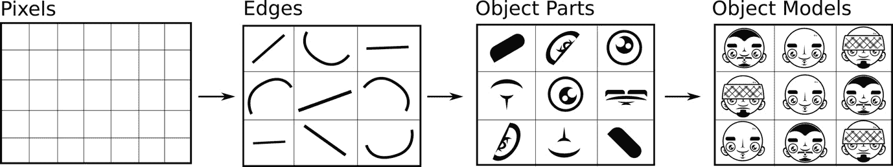
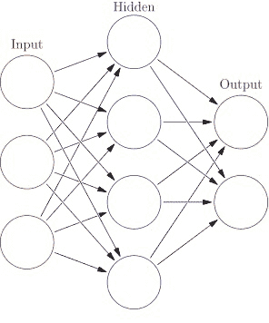
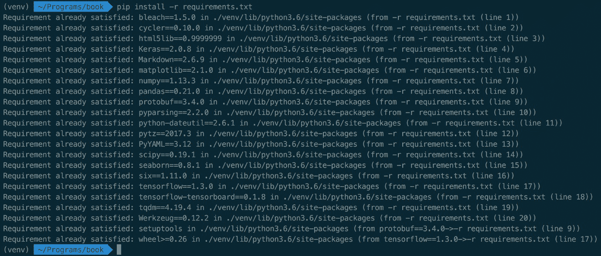
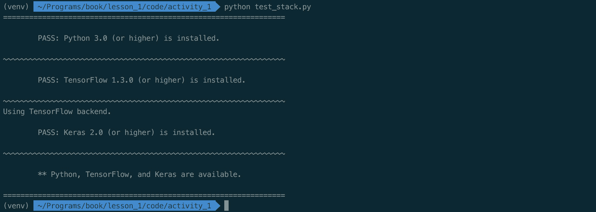
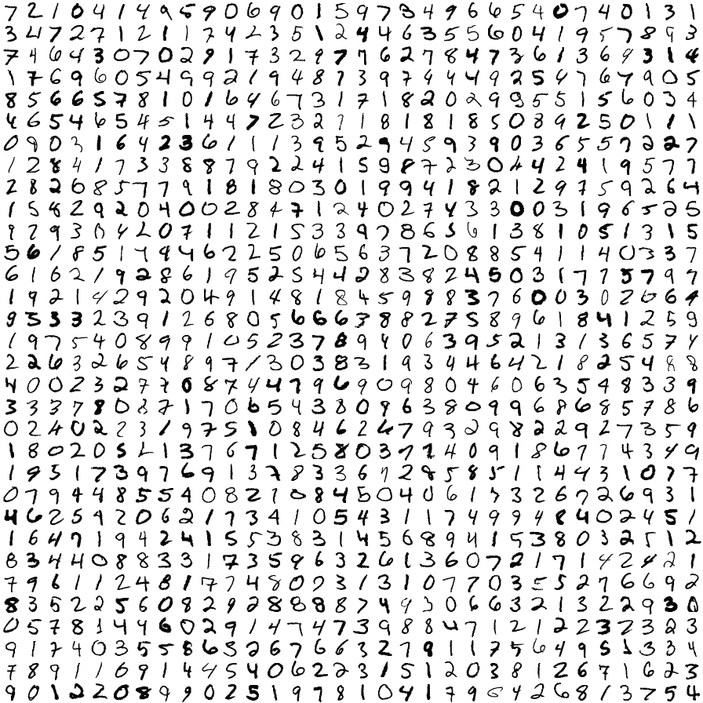
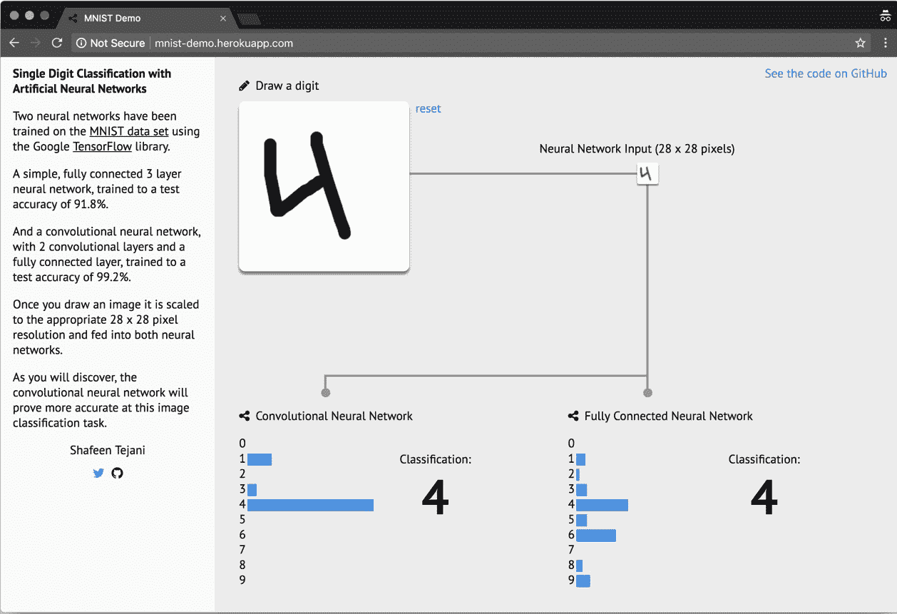
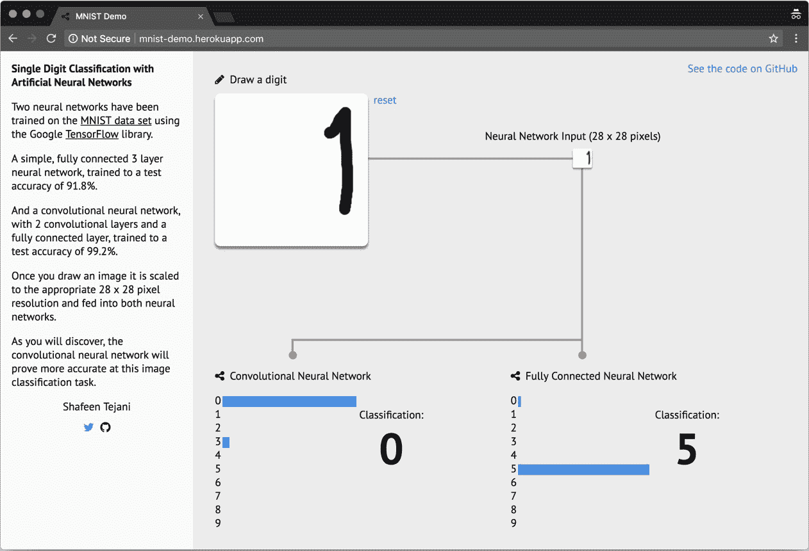
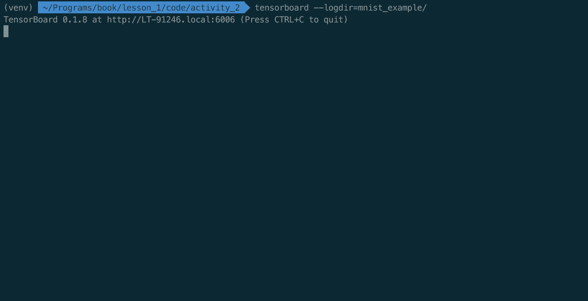
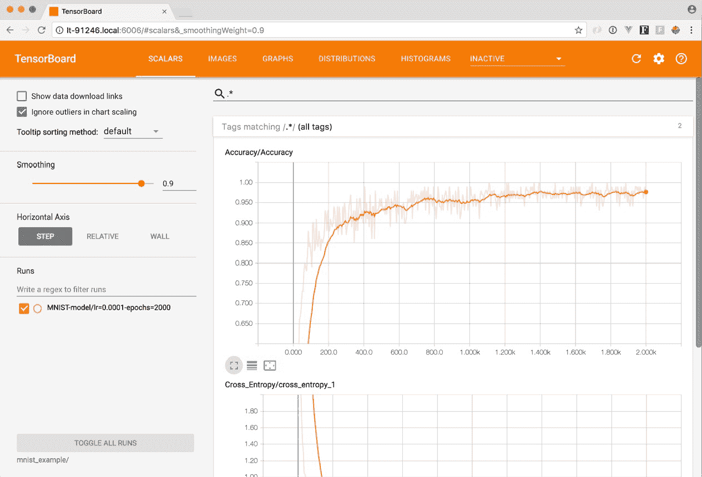

# 第四章：神经网络与深度学习简介

MNIST 数据集的图像边缘没有包含数字。因此，两个网络都不会给位于该区域的像素分配相关的值。如果我们将数字画得更靠近指定区域的中心，两个网络在分类数字时的准确率都明显提高。这表明，神经网络的强大程度取决于用来训练它们的数据。如果用于训练的数据与我们尝试预测的数据有很大不同，那么网络很可能会产生令人失望的结果。本章将涵盖神经网络的基础知识以及如何设置深度学习编程环境。我们还将探索神经网络的常见组件及其基本操作。最后，我们将通过探索使用 TensorFlow 创建的训练神经网络来结束本章内容。

本章的内容是理解神经网络能够做什么。我们不会涉及深度学习算法背后的数学概念，而是描述构成深度学习系统的基本元素。我们还将探讨神经网络在解决实际问题中的应用实例。

本章将为你提供一个关于如何设计使用神经网络解决问题的系统的实际直觉——包括如何判断一个给定的问题是否可以用这些算法解决。其核心是，本章挑战你将问题看作是思想的数学表示。到本章结束时，你将能够将问题看作这些表示的集合，并开始识别这些表示如何通过深度学习算法进行学习。

本章结束时，你将能够：

+   探讨神经网络的基础知识

+   设置深度学习编程环境

+   探索神经网络的常见组件及其基本操作

+   通过探索使用 TensorFlow 创建的训练神经网络，结束本章内容

# 什么是神经网络？

神经网络——也称为**人工神经网络**——最早由麻省理工学院教授沃伦·麦卡洛克和沃尔特·皮茨于 20 世纪 40 年代提出。

欲了解更多信息，请参阅《解释：神经网络》。麻省理工学院新闻办公室，2017 年 4 月 14 日。可在以下网址获取：

[`news.mit.edu/2017/explained-neural-networksdeep-learning-0414`](http://news.mit.edu/2017/explained-neural-networks-deep-learning-0414)。

受神经科学进展的启发，他们提议创建一个能够再现大脑工作方式（无论是人类还是其他）的计算机系统。其核心思想是一个作为相互连接网络运作的计算机系统。也就是说，一个由许多简单组件组成的系统，这些组件既解释数据，又相互影响如何解释数据。这个核心思想至今依然存在。

深度学习在很大程度上被认为是现代神经网络的研究。可以把它看作是神经网络的一个现代名称。主要的区别在于，深度学习中使用的神经网络通常要大得多——即，它们有更多的节点和层——相比早期的神经网络。深度学习算法和应用通常需要资源才能取得成功，因此使用“深度”一词来强调它的规模和大量的相互连接的组件。

# 成功的应用

神经网络自从 20 世纪 40 年代起便开始研究，虽然形式各异。但直到最近，深度学习系统才在大规模工业应用中取得了成功。

当代神经网络的倡导者在语音识别、语言翻译、图像分类和其他领域取得了巨大的成功。它如今的显著地位得益于计算能力的大幅提升以及**图形处理单元**（**GPU**）和**张量处理单元**（**TPU**）的出现——它们能够进行比普通 CPU 更多的同时数学运算，并且数据的可用性也大大增加。

不同 AlphaGo 算法的功耗。AlphaGo 是 DeepMind 提出的一个项目，旨在开发一系列击败围棋的算法。它被认为是深度学习强大能力的一个典型例子。TPU 是由 Google 开发的一种芯片组，专门用于深度学习程序。

图示展示了用于训练不同版本 AlphaGo 算法的 GPU 和 TPU 数量。来源：[`deepmind.com/blog/alphago-zero-learning-scratch/`](https://deepmind.com/blog/alphago-zero-learning-scratch/)

在本书中，我们不会使用 GPU 来完成我们的活动。使用神经网络并不需要 GPU。在本书提供的一些简单示例中——所有计算都可以通过普通笔记本电脑的 CPU 完成。然而，当处理非常大的数据集时，GPU 会非常有帮助，因为训练神经网络所需的长时间将变得不切实际。

下面是神经网络在一些领域取得巨大影响的例子：

+   **翻译文本**：2017 年，Google 宣布推出一种新的翻译算法，称为 **Transformer**。该算法由一个递归神经网络（LSTM）构成，使用双语文本进行训练。Google 表示，与行业标准（BLEU）相比，该算法在准确性方面表现突出，并且计算效率也很高。在撰写本文时，Transformer 被报告为 Google Translate 的主要翻译算法。

Google Research Blog。Transformer：一种用于语言理解的新型神经网络架构。2017 年 8 月 31 日。网址：[`research.googleblog.com/2017/08/transformernovel-neural-network.html`](https://ai.googleblog.com/2017/08/transformer-novel-neural-network.html)。

+   **自动驾驶车辆**：Uber、NVIDIA 和 Waymo 被认为正在使用深度学习模型来控制驾驶相关的各项车辆功能。每家公司都在研究多个可能性，包括利用人类训练网络、在虚拟环境中模拟车辆驾驶，甚至创建一个类似小城市的环境，在其中车辆可以根据预期和意外事件进行训练。

Alexis C. Madrigal：深入 Waymo 的秘密世界，了解自动驾驶汽车的训练。The Atlantic。2017 年 8 月 23 日。网址：[https://](https://www.theatlantic.com/technology/archive/2017/08/inside-waymos-secret-testing-and-simulation-facilities/537648/)

[www.theatlantic.com/technology/archive/2017/08/inside-waymos-secret-testing-and-simulationfacilities/537648/](https://www.theatlantic.com/technology/archive/2017/08/inside-waymos-secret-testing-and-simulation-facilities/537648/)。

NVIDIA：*端到端深度学习用于自动驾驶汽车*。2016 年 8 月 17 日。网址：[`devblogs.nvidia.com/`](https://devblogs.nvidia.com/deep-learning-self-driving-cars/)

[parallelforall/deep-learning-self-driving-cars/](https://devblogs.nvidia.com/deep-learning-self-driving-cars/)。

Dave Gershgorn：Uber 的新 AI 团队正在寻找通往自动驾驶汽车的最短路径。Quartz。2016 年 12 月 5 日。网址：[`qz.com/853236/ubers-new-ai-team-is-looking-for-theshortest-route-to-self-driving-cars/`](https://qz.com/853236/ubers-new-ai-team-is-looking-for-the-shortest-route-to-self-driving-cars/)

+   **图像识别**：Facebook 和 Google 使用深度学习模型来识别图像中的实体，并自动将这些实体标记为联系人中的人物。在这两种情况下，网络都是通过已标记的图像以及来自目标朋友或联系人的图像来进行训练的。两家公司都报告称，这些模型在大多数情况下能够高精度地推荐朋友或联系人。

虽然在其他行业中还有更多的例子，但深度学习模型的应用仍处于起步阶段。许多成功的应用尚未到来，包括你自己创造的那些。

# 为什么神经网络工作得如此出色？

为什么神经网络如此强大？神经网络之所以强大，是因为它们可以用来预测任何给定的函数，并给出合理的逼近。如果某人能够将一个问题表示为数学函数，并且拥有正确表示该函数的数据，那么深度学习模型原则上——在有足够资源的情况下——能够逼近该函数。这通常被称为*神经网络的普适性原理*。

欲了解更多信息，请参考 Michael Nielsen 的《神经网络与深度学习：神经网络能够计算任何函数的可视化证明》。可访问：[`neuralnetworksanddeeplearning.com/chap4.html`](http://neuralnetworksanddeeplearning.com/chap4.html)。

本书中不会深入探讨普适性原理的数学证明。然而，神经网络的两个特性应该能够给你正确的直觉，帮助你理解这一原理：表示学习和函数逼近。

欲了解更多信息，请参考 Kai Arulkumaran, Marc Peter Deisenroth, Miles Brundage 和 Anil Anthony Bharath 的文章《深度强化学习简短调查》。arXiv. 2017 年 9 月 28 日。可访问：[`www.arxiv-vanity.com/papers/1708.05866/`](https://www.arxiv-vanity.com/papers/1708.05866/)

# 表示学习

用于训练神经网络的数据包含表示（也称为*特征*），这些表示解释了你试图解决的问题。例如，如果某人想从图像中识别人脸，那么包含人脸的图像中每个像素的颜色值将作为起点。然后，模型将在训练过程中不断地通过组合像素来学习更高层次的表示。



图 1：从输入数据开始的一系列更高级的表示。图像衍生自原始图像，来源于：Yann LeCun, Yoshua Bengio & Geoffrey Hinton. "Deep Learning". Nature 521, 436–444 (2015 年 5 月 28 日) doi:10.1038/nature14539

用正式的语言来说，神经网络是计算图，其中每一步从输入数据中计算出更高层次的抽象表示。

每一步都代表着进入不同抽象层次的进展。数据通过这些层次，逐步构建出更高层次的表示。该过程最终完成时会得到最高层次的表示：即模型试图预测的那个表示。

# 函数逼近

当神经网络学习数据的新表示时，它们通过将权重和偏差与不同层次的神经元结合来实现这一过程。每次训练周期进行时，它们都会使用一种叫做反向传播的数学技术调整这些连接的权重。每一轮的权重和偏差都会得到改进，直到达到最佳状态。这意味着神经网络可以在每个训练周期中衡量它的错误，调整每个神经元的权重和偏差，并重新尝试。如果它确定某个修改比上一次的结果更好，它会继续强化这个修改，直到达到最佳解决方案。

简而言之，这个过程就是神经网络能够近似函数的原因。然而，有许多原因可能导致神经网络无法完美地预测一个函数，其中最主要的原因是：

+   许多函数包含随机特性（即随机性）

+   可能会过拟合训练数据中的特殊性

+   可能缺乏训练数据

在许多实际应用中，简单的神经网络能够以合理的精度近似一个函数。这类应用将是我们的重点。

# 深度学习的局限性

深度学习技术最适用于那些可以用正式数学规则定义的问题（即作为数据表示）。如果一个问题很难以这种方式定义，那么深度学习很可能无法提供有用的解决方案。此外，如果用于某个问题的数据有偏差，或者只包含生成该问题的潜在函数的部分表示，那么深度学习技术只能复制该问题，而无法学会如何解决它。

记住，深度学习算法通过学习数据的不同表示来近似给定的函数。如果数据没有恰当地代表一个函数，那么神经网络很可能会错误地表示该函数。考虑以下类比：你正在尝试预测全国的汽油价格（即燃料价格），并创建一个深度学习模型。你使用信用卡账单中关于日常汽油消费的支出数据作为该模型的输入数据。模型可能最终学会你汽油消费的模式，但它很可能无法准确地表示由其他因素引起的汽油价格波动，这些因素在你的数据中每周才出现一次，比如政府政策、市场竞争、国际政治等。最终，模型在生产环境中使用时会得出错误的结果。

为了避免这个问题，确保用于训练模型的数据尽可能准确地代表模型试图解决的问题。

要深入讨论这个话题，请参考 François Chollet 即将出版的书籍《深度学习与 Python》。François 是 Keras 的创始人，Keras 是本书中使用的 Python 库。章节《深度学习的局限性》对理解这一话题尤其重要。该书的工作版本可通过以下链接访问：[`blog.keras.io/the-limitations-of-deep-learning.html`](https://blog.keras.io/the-limitations-of-deep-learning.html)。

# 固有偏见和伦理考虑

研究人员建议，如果在没有考虑训练数据中固有偏见的情况下使用深度学习模型，不仅可能导致效果不佳的解决方案，还可能引发伦理上的复杂问题。

例如，在 2016 年末，来自中国上海交通大学的研究人员创建了一个神经网络，通过仅仅使用面部照片就能够正确分类犯罪分子。研究人员使用了 1,856 张中国男性的图片，其中一半是已被定罪的。

他们的模型以 89.5%的准确率识别出了囚犯。([` blog.keras.io/the-limitations-of-deep-learning.html`](https://blog.keras.io/the-limitations-of-deep-learning.html))。《麻省理工科技评论》。神经网络通过面部识别来识别犯罪分子。2016 年 11 月 22 日。可通过以下链接访问：[`www.technologyreview.com/s/602955/neural-network-learns-to-identify-criminals-by-their-faces/`](https://www.technologyreview.com/s/602955/neural-network-learns-to-identify-criminals-by-their-faces/)。

这篇论文在科学界和大众媒体中引发了极大的争议。该方案的一个关键问题在于未能正确识别输入数据中固有的偏见。也就是说，本研究中使用的数据来自两个不同的来源：一个是犯罪分子，另一个是非犯罪分子。一些研究人员建议，他们的算法识别的是与研究中使用的不同数据来源相关的模式，而不是从人脸中识别出相关的模式。尽管可以从技术角度讨论模型的可靠性，但关键的批评还是从伦理角度出发：我们应该清楚地识别深度学习算法所使用的输入数据中的固有偏见，并考虑其应用将如何影响人们的生活。

Timothy Revell。使用面部识别技术“识别”犯罪分子的担忧。《新科学家》2016 年 12 月 1 日。可通过以下链接访问：[`www.newscientist.com/article/2114900-concernsas-face-recognition-tech-used-to-identify-criminals/`](https://www.technologyreview.com/s/602955/neural-network-learns-to-identify-criminals-by-their-faces/)。有关学习算法（包括深度学习）伦理问题的更多了解，请参考 AI Now 研究所的工作([`ainowinstitute.org/`](https://ainowinstitute.org/))，该机构旨在理解智能系统的社会影响。

# 神经网络的常见组成部分和操作

神经网络有两个关键组件：层和节点。节点负责特定的操作，而层是由多个节点组成的，用于区分系统的不同阶段。

通常，神经网络有以下三类层：

+   **输入**：接收输入数据并进行初步解释的地方

+   **隐藏**：计算发生的地方，数据在这里被修改并传递

+   **输出**：输出被组装和评估的地方



图 2：神经网络中最常见层的示意图。由 Glosser.ca - 自主创作，衍生自文件：人工神经网络.svg，CC BY-SA 3.0，https://commons.wikimedia.org/w/index.php?curid=24913461

隐藏层是神经网络中最重要的层。它们被称为*隐藏*层，因为在这些层中生成的表示在数据中不可用，而是从数据中学习到的。正是在这些层中，神经网络的主要计算过程发生。

节点是数据在网络中表示的地方。与节点相关联的有两个值：偏差和权重。这两个值会影响数据如何被节点表示并传递给其他节点。当网络学习时，它会有效地调整这些值以满足优化函数。

神经网络的大部分工作发生在隐藏层中。不幸的是，目前并没有明确的规则来确定一个网络应该有多少层或节点。在实现神经网络时，人们通常会花时间尝试不同层和节点的组合。建议总是从一个单层开始，并且节点的数量应该反映输入数据的特征数（即数据集中有多少*列*）。然后，继续添加层和节点，直到达到满意的性能——或者当网络开始过拟合训练数据时。

当代神经网络实践通常仅限于实验节点和层的数量（例如，网络的深度）以及每层执行的操作类型。许多成功的案例表明，神经网络仅通过调整这些参数就能超越其他算法。

作为直观的理解，想象数据通过输入层进入神经网络系统，然后在网络中通过节点逐一传递。数据所走的路径将取决于节点的互联程度、每个节点的权重和偏差、每层执行的操作类型以及数据在这些操作后的状态。神经网络通常需要多次“运行”（或训练周期），以不断调整节点的权重和偏差，这意味着数据在图的不同层之间会多次传递。

本节为您提供了神经网络和深度学习的概述。此外，我们讨论了初学者理解以下关键概念的直觉：

+   在原则上，神经网络可以近似大多数函数，只要有足够的资源和数据。

+   层和节点是神经网络的最重要结构组件。通常，人们花费大量时间来修改这些组件，以找到适用的架构。

+   权重和偏差是网络在训练过程中“学习”的关键属性。

这些概念将在我们下一节中证明其有用性，因为我们将探索一个实际训练过的神经网络，并对其进行修改以训练我们自己的网络。

# 配置深度学习环境

在完成本章之前，我们希望您与一个真实的神经网络进行交互。我们将首先介绍本书中使用的主要软件组件，并确保它们已正确安装。然后，我们将探索一个预训练的神经网络，并探讨之前讨论的一些组件和操作，这些操作位于“什么是神经网络？”部分。

# 用于深度学习的软件组件

我们将在深度学习中使用以下软件组件：

# Python 3

我们将使用 Python 3。Python 是一种通用编程语言，在科学界非常流行，因此在深度学习中被广泛采用。本书不支持 Python 2，但可以用它来训练神经网络，而不是 Python 3。即使选择在 Python 2 中实现解决方案，考虑迁移到 Python 3，因为其现代功能集比前者更为强大。

# TensorFlow

TensorFlow 是一个用于执行图形形式的数学操作的库。TensorFlow 最初由 Google 开发，今天是一个拥有许多贡献者的开源项目。它专为神经网络而设计，是创建深度学习算法时最受欢迎的选择之一。

TensorFlow 也以其生产组件而闻名。它附带 TensorFlow Serving [(https://github.com/tensorflow/serving),](https://github.com/tensorflow/serving) 这是一个用于提供深度学习模型的高性能系统。此外，经过训练的 TensorFlow 模型可以在其他高性能编程语言（如 Java、Go 和 C）中使用。这意味着可以在从微型计算机（即 RaspberryPi）到 Android 设备的任何设备上部署这些模型。

# Keras

为了与 TensorFlow 高效交互，我们将使用 Keras ([`keras.io/`](https://keras.io/))，一个提供高级 API 以开发神经网络的 Python 包。虽然 TensorFlow 专注于组件之间的计算图交互，但 Keras 则专注于神经网络。Keras 使用 TensorFlow 作为其后端引擎，使得开发这类应用程序更加容易。

截至 2017 年 11 月（TensorFlow 版本 1.4），Keras 作为 TensorFlow 的一部分进行分发。它在 `tf.keras` 命名空间下可用。如果你已经安装了 TensorFlow 1.4 或更高版本，你的系统中已经包含了 Keras。

# TensorBoard

TensorBoard 是一个数据可视化工具套件，用于探索 TensorFlow 模型，并与 TensorFlow 原生集成。TensorBoard 通过消耗 TensorFlow 在训练神经网络时创建的检查点和摘要文件来工作。这些文件可以在接近实时（延迟 30 秒）或者在网络训练完成后进行探索。

TensorBoard 使得实验和探索神经网络的过程变得更加容易——而且追踪你的网络训练过程非常令人兴奋！

# Jupyter Notebooks，Pandas 和 NumPy

在使用 Python 创建深度学习模型时，通常会从交互式工作开始，慢慢开发出一个最终变成更结构化软件的模型。在这个过程中，经常使用三个 Python 包：Jupyter Notebooks，Pandas 和 `NumPy`：

+   Jupyter Notebooks 创建使用 web 浏览器作为界面的交互式 Python 会话

+   Pandas 是一个用于数据处理和分析的包

+   NumPy 经常用于数据的形状变换和执行数值计算

这些包偶尔使用。它们通常不构成生产系统的一部分，但在探索数据和开始构建模型时常被使用。我们更详细地关注其他工具。

Michael Heydt（2017 年 6 月，Packt 出版）的《*学习 Pandas*》和 Dan Toomey（2016 年 11 月，Packt 出版）的《*学习 Jupyter*》提供了如何使用这些技术的全面指南。这些书籍是继续深入学习的好参考。

| **组件**  | **描述**  | **最低版本**  |
| --- | --- | --- |
| Python  | 通用编程语言。流行的用于开发深度学习应用程序的语言。  |  3.6  |
| TensorFlow  | 开源图计算 Python 包，通常用于开发深度学习系统。  |  1.4  |

| Keras  | 提供高层次接口到 TensorFlow 的 Python 包。  |  2.0.8-tf（与 TensorFlow 一起分发）

|

| TensorBoard  | 基于浏览器的软件，用于可视化神经网络统计数据。  |  0.4.0  |
| --- | --- | --- |
| Jupyter Notebook  | 基于浏览器的软件，用于交互式工作与 Python 会话。  |  5.2.1  |
| Pandas  | 用于分析和处理数据的 Python 包。  |  0.21.0  |
| NumPy  | 用于高性能数值计算的 Python 包。  |  1.13.3  |

表 1：创建深度学习环境所需的软件组件

# 活动：验证软件组件

在我们探索一个训练好的神经网络之前，让我们验证所有必需的软件组件是否已准备好。我们提供了一个脚本来验证这些组件的可用性。让我们花点时间运行脚本，并处理可能遇到的任何问题。

现在我们将测试是否所有本书所需的软件组件都在您的工作环境中可用。首先，我们建议使用 Python 的原生模块 `venv` 创建一个 Python 虚拟环境。虚拟环境用于管理项目依赖项。我们建议您为每个创建的项目配置独立的虚拟环境。现在让我们创建一个。

如果您更喜欢使用 `conda` 环境，可以随意使用它们。

1.  可以使用以下命令创建一个 Python 虚拟环境：

```py
      $ python3 -m venv venv
      $ source venv/bin/activate
```

1.  后者命令会将字符串（`venv`）添加到命令行的开头。使用以下命令来停用您的虚拟环境：

```py
      $ deactivate 
```

确保在处理项目时始终激活您的 Python 虚拟环境。

1.  激活虚拟环境后，通过执行 pip 对 `requirements.txt` 文件进行操作，确保正确的组件已安装。这将尝试在该虚拟环境中安装本书使用的模型。如果它们已存在，则不会执行任何操作：



图 3：终端运行 pip 安装 requirements.txt 中的依赖项的图片

运行以下命令来安装依赖项：

```py
      $ pip install –r requirements.txt 
```

这将为您的系统安装所有必需的依赖项。如果它们已经安装，该命令将简单地通知您。

这些依赖项对于所有代码活动的正常运行至关重要。

作为此活动的最后一步，让我们执行脚本 `test_stack.py`。该脚本正式验证此书所需的所有包是否已安装并在您的系统中可用。

1.  学生们，运行脚本 `Chapter_4/activity_1/test_stack.py` 检查 Python 3、TensorFlow 和 Keras 是否可用。使用以下命令：

```py
      $ python3 chapter_4/activity_1/test_stack.py 
```

脚本返回有用的消息，说明已安装什么以及需要安装什么。

1.  在您的终端中运行以下脚本命令：

```py
      $ tensorboard --help 
```

您应该看到一条帮助信息，解释每个命令的作用。如果没有看到该消息，或者看到错误消息，请向您的讲师寻求帮助：



图 4：终端运行 `python3 test_stack.py` 的图片。脚本返回消息，告知所有依赖项已正确安装。

如果出现类似以下消息，无需担心：

运行时警告：模块'`tensorflow.python.framework.fast_tensor_util`'的编译时版本 3.5 与运行时版本 3.6 不匹配，返回 f(*args, **kwds)

如果您运行的是 Python 3.6 并且分发

TensorFlow wheel 是在不同版本（在此情况下为 3.5）下编译的。您可以安全地忽略该消息。

一旦我们确认安装了 Python 3、TensorFlow、Keras、TensorBoard 以及`requirements.txt`中列出的软件包，我们就可以继续进行演示，了解如何训练神经网络，然后使用这些工具来探索已经训练好的网络。

# 探索训练好的神经网络

在本节中，我们将探索一个已经训练好的神经网络。我们这么做是为了理解神经网络如何解决一个实际问题（预测手写数字），同时熟悉 TensorFlow 的 API。在探索这个神经网络时，我们会看到许多在前面章节中介绍过的组件，如节点和层，但我们也会看到许多不太熟悉的组件（例如激活函数）——我们将在后续章节中进一步探讨这些内容。然后，我们将通过一个练习，讲解该神经网络是如何训练的，并且尝试自己训练这个网络。

我们将要探索的网络已经经过训练，可以识别手写数字（整数）。它使用了 MNIST 数据集（[` yann.lecun.com/exdb/mnist/`](http://yann.lecun.com/exdb/mnist/)），这是一个经典的数据集，常用于探索模式识别任务。

# MNIST 数据集

**修改版国家标准与技术研究院**（**MNIST**）数据集包含一个包含 60,000 张图像的训练集和一个包含 10,000 张图像的测试集。每张图像包含一个手写数字。这个数据集最初是由美国政府创建的，用来测试不同的计算机系统识别手写文字的方法。能够做到这一点对于提高邮政服务、税收系统和政府服务的效率具有重要意义。由于 MNIST 数据集对现代方法来说过于简单，因此现在的研究通常使用不同的、更新的数据集（例如 CIFAR）。然而，MNIST 数据集仍然非常有助于理解神经网络的工作原理，因为已知的模型可以高效地实现较高的准确率。

CIFAR 数据集是一个机器学习数据集，包含按照不同类别组织的图像。与 MNIST 数据集不同，CIFAR 数据集包含多个领域的类别，如动物、活动和物体。CIFAR 数据集可以在以下链接找到：[`www.cs.toronto.edu/~kriz/cifar.html`](https://www.cs.toronto.edu/~kriz/cifar.html)。



图 5：MNIST 数据集训练集的摘录。每张图像是一个单独的 20x20 像素图像，包含一个手写数字。原始数据集可以在以下链接找到：http://yann.lecun.com/exdb/mnist/。

# 使用 TensorFlow 训练神经网络

现在，让我们训练一个神经网络，使用 MNIST 数据集来识别新的数字。

我们将实现一种特殊用途的神经网络，称为“卷积神经网络”，来解决这个问题（我们将在后续章节中更详细地讨论这些内容）。我们的网络包含三层隐藏层：两层全连接层和一层卷积层。卷积层由以下 TensorFlow 的 Python 代码片段定义：

```py
    W = tf.Variable(
        tf.truncated_normal([5, 5, size_in, size_out],
        stddev=0.1),
        name="Weights")    
    B = tf.Variable(tf.constant(0.1, shape=[size_out]), 
        name="Biases")

    convolution = tf.nn.conv2d(input, W, strides=[1, 1, 1, 1],
    padding="SAME")
    activation = tf.nn.relu(convolution + B)

    tf.nn.max_pool(
    activation,
    ksize=[1, 2, 2, 1],
    strides=[1, 2, 2, 1],
    padding="SAME") 
```

我们在训练网络时只执行这段代码一次。

变量 W 和 B 代表权重和偏置。这些值是隐藏层中的节点用来改变网络对数据的解释的，数据在网络中传递时会被这些值所修改。暂时不要担心其他变量。

**全连接层**由以下 Python 代码片段定义：

```py
    W = tf.Variable(
        tf.truncated_normal([size_in, size_out], stddev=0.1),
        name="Weights")
    B = tf.Variable(tf.constant(0.1, shape=[size_out]),
        name="Biases")
        activation = tf.matmul(input, W) + B
```

这里，我们还有两个 TensorFlow 变量 W 和 B。请注意这些变量的初始化有多简单：W 被初始化为一个来自剪枝高斯分布的随机值（剪枝范围为`size_in 和 size_out`），标准差为 0.1，B（偏置项）被初始化为`0.1`，这是一个常数。这两个值会在每次运行时不断变化。这段代码执行两次，产生两个全连接网络——一个将数据传递给另一个。

这 11 行 Python 代码代表了我们的完整神经网络。在*第五章*，*模型架构*中，我们将详细讲解每个组件如何使用 Keras 实现。目前，请重点理解网络如何在每次运行时改变每一层中 W 和 B 的值，以及这些代码片段如何构成不同的层。这 11 行 Python 代码是数十年神经网络研究的结晶。

现在让我们训练这个网络，评估它在 MNIST 数据集上的表现。

# 训练神经网络

按照以下步骤设置本次练习：

1.  打开两个终端实例。

1.  在两个终端中，导航到`chapter_4/exercise_a`目录。

1.  在两个终端中，确保你的 Python 3 虚拟环境是激活状态，并且`requirements.txt`中列出的依赖已安装。

1.  其中之一是通过以下命令启动 TensorBoard 服务器：

    `$ tensorboard --logdir=mnist_example/`

1.  在另一个终端中，从该目录中运行`train_mnist.py`脚本。

1.  在浏览器中打开当你启动服务器时提供的 TensorBoard URL。

在你运行`train_mnist.py`脚本的终端中，你将看到一个包含模型训练进度的进度条。当你打开浏览器页面时，你会看到几个图表。点击显示`Accuracy`的图表，放大它并让页面刷新（或者点击`refresh`按钮）。你将看到随着训练轮次的增加，模型的准确度逐渐提高。

利用这个时刻，解释神经网络在训练过程早期迅速达到高精度的强大能力。

我们可以看到，在大约 200 个周期（或步骤）后，网络超过了 90% 的准确率。也就是说，网络在测试集上正确预测了 90% 的数字。随着训练的进行，网络继续提高准确率，直到第 2000 步，最终达到 97% 的准确率。

现在，我们还将测试这些网络在未见数据上的表现。我们将使用由 Shafeen Tejani 创建的一个开源 Web 应用，探索训练好的网络是否能正确预测我们创建的手写数字。

# 使用未见数据测试网络性能

在浏览器中访问 [`mnist-demo.herokuapp.com/`](http://mnist-demo.herokuapp.com/) 并在指定的白色框中绘制一个 0 到 9 之间的数字：



图 6：我们可以手动绘制数字并测试两个训练网络准确性的 Web 应用

来源：[`github.com/ShafeenTejani/mnist-demo`](https://github.com/ShafeenTejani/mnist-demo)。

在应用程序中，你可以看到两个神经网络的结果。我们训练的那个在左边（叫做 CNN）。它能正确分类你所有的手写数字吗？试着在指定区域的边缘绘制数字。例如，试着在该区域的右边缘附近绘制数字**1**：



图 7：两个网络都难以估算绘制在区域边缘的值

在这个例子中，我们看到数字**1**被绘制在绘图区域的右侧。在两个网络中，这个数字是**1**的概率都是**0**。

MNIST 数据集不包含图像边缘的数字。因此，两个网络都没有为该区域内的像素分配相关的值。如果我们将数字绘制得离指定区域的中心更近，这两个网络在分类数字时会表现得更好。这表明神经网络的强大程度仅取决于用来训练它们的数据。如果训练数据与我们试图预测的数据相差甚远，网络很可能会产生令人失望的结果。

# 活动：探索训练过的神经网络

在本节中，我们将探索我们在练习中训练的神经网络。我们还将通过调整超参数来训练一些其他的网络。让我们先来探索在练习中训练的网络。

我们已经将训练好的网络作为二进制文件提供在该目录下。让我们使用 TensorBoard 打开这个训练好的网络，并探索其组成部分。

使用你的终端，导航到目录 `chapter_4/activity_2` 并执行以下命令启动 TensorBoard：

```py
  $ tensorboard --logdir=mnist_example/ 
```

现在，在浏览器中打开 TensorBoard 提供的 URL。你应该能够看到 TensorBoard 的标量页面：



图 8：启动 TensorBoard 实例后的终端图像

在你打开`tensorboard`命令提供的网址后，你应该能够看到以下 TensorBoard 页面：



图 9：TensorBoard 登录页面的图像

现在，让我们来探索我们训练好的神经网络，看看它的表现如何。

在 TensorBoard 页面上，点击**Scalars**页面，并放大**准确率**图表。现在，将**平滑**滑块移到**0.9**。

准确率图表衡量了网络在测试集上猜测标签的准确性。刚开始时，网络的标签猜测完全错误。这是因为我们将网络的权重和偏置初始化为随机值，所以它的第一次尝试只是一个猜测。然后，网络将在第二次运行时调整其层的权重和偏置；网络将通过改变权重和偏置来投资于那些给出正面结果的节点，而通过逐渐减少它们对网络的影响（最终达到 0）来惩罚那些表现不佳的节点。正如你所看到的，这是一种非常高效的技巧，可以快速得到良好的结果。

让我们将注意力集中在**准确率**图表上。看看算法是如何在大约 1,000 个 epoch 后达到很高的准确率（> 95%）的？在 1,000 到 2,000 个 epoch 之间发生了什么？

如果我们继续训练更多的 epoch，网络会变得更准确吗？在 1,000 到 2,000 个 epoch 之间，网络的准确率持续提高，但提升的速度在减慢。如果继续训练，网络可能会有轻微的改进，但在当前架构下，它无法达到 100%的准确率。

这个脚本是一个修改版的官方 Google 脚本，旨在展示 TensorFlow 是如何工作的。我们将脚本分成了更易理解的函数，并添加了许多注释来引导你的学习。尝试通过修改脚本顶部的变量来运行这个脚本：

```py
     LEARNING_RATE = 0.0001
     EPOCHS = 2000
```

现在，尝试通过修改这些变量的值来运行那个脚本。例如，试着将学习率修改为**0.1**，将 epoch 设置为**100**。你认为网络能够获得相似的结果吗？

你的神经网络中有许多其他参数可以修改。现在，尝试调整网络的 epoch 和学习率。你会发现，这两个参数本身就能极大地改变网络的输出——但也有其限制。尝试看看通过仅仅改变这两个参数，是否能够使当前架构下的网络训练更快。

使用 TensorBoard 验证你的网络训练情况。通过将起始值乘以 10，多次调整这些参数，直到你注意到网络有所改善。这种调整网络并找到更好准确率的过程类似于今天在工业应用中用来改进现有神经网络模型的方法。

# 总结

在本章中，我们使用 TensorBoard 探索了一个基于 TensorFlow 训练的神经网络，并用不同的训练轮次和学习率训练了我们自己的修改版网络。这为你提供了如何训练一个高效神经网络的实际操作经验，并且让你有机会探索其一些局限性。

你认为我们能否在真实的比特币数据上实现类似的准确度？我们将在**第五章**，*模型架构*中尝试使用一种常见的神经网络算法来预测未来的比特币价格。在**第六章**，*模型评估与优化*中，我们将评估并改进该模型，最后在**第七章**，*产品化*中，我们将创建一个通过 HTTP API 提供该系统预测的程序。
