# 第五章：模型架构

基于第四章《神经网络与深度学习介绍》的基本概念，我们现在进入一个实际问题：我们能否使用深度学习模型预测比特币价格？在本章中，我们将学习如何构建一个尝试进行此预测的深度学习模型。我们将通过将所有这些组件结合起来，构建一个简单但完整的深度学习应用程序的初步版本来结束本章。

在本章结束时，您将能够：

+   为深度学习模型准备数据

+   选择正确的模型架构

+   使用 Keras，这是一个 TensorFlow 抽象库

+   使用训练好的模型进行预测

# 选择合适的模型架构

深度学习是一个正在进行激烈研究活动的领域。研究人员致力于发明新的神经网络架构，这些架构可以解决新问题或提高之前实现的架构的性能。在本节中，我们将研究旧的和新的架构。

旧的架构已经被广泛应用于解决各种问题，并且通常被认为是在开始新项目时的正确选择。较新的架构在特定问题上取得了巨大成功，但它们更难以推广。后者作为下一步探索的参考非常有趣，但在启动项目时并不是一个好的选择。

# 常见架构

考虑到众多架构的可能性，有两种流行的架构经常作为许多应用的起点：**卷积神经网络**（**CNNs**）和**递归神经网络**（**RNNs**）。这些是基础性网络，应该作为大多数项目的起点。我们还介绍了另外三种网络，因其在该领域的重要性：**长短期记忆**（**LSTM**）网络，RNN 的变种；**生成对抗网络**（**GANs**）；以及深度强化学习。这些后者架构在解决当代问题时取得了巨大成功，但使用起来相对更为复杂。

# 卷积神经网络

卷积神经网络因其在处理具有网格状结构的问题中表现出色而声名显赫。它们最初是为了分类图像而创建的，但已经在许多其他领域得到了应用，从语音识别到自动驾驶汽车。

CNN 的核心思想是将紧密相关的数据作为训练过程的一个要素，而不仅仅是单独的数据输入。这个理念在图像处理中尤其有效，因为图像中位于另一个像素右侧的像素与该像素相关，因为它们是更大构图的一部分。在这种情况下，网络训练的目标就是预测该构图。因此，将几个像素组合在一起比仅使用单独的像素要好。

**卷积**这个名称是用来表示这个过程的数学表达式：

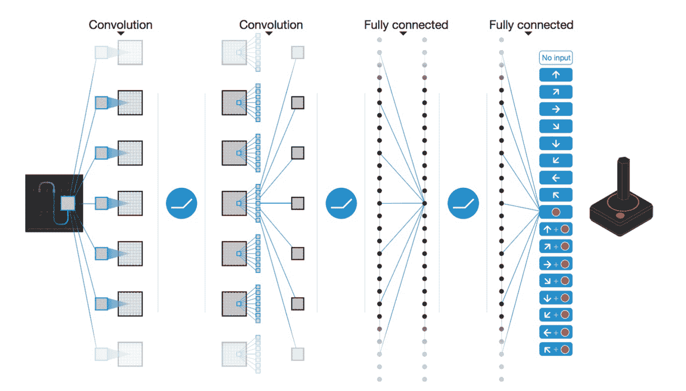

图 1：卷积过程的插图 图像来源：Volodymyr Mnih 等人。

欲了解更多信息，请参考《通过深度强化学习实现人类级别的控制》，2015 年 2 月，《自然》杂志。可通过以下链接访问：[`storage.googleapis.com/deepmind-media/dqn/DQNNaturePaper.pdf`](https://storage.googleapis.com/deepmind-media/dqn/DQNNaturePaper.pdf)。

# 循环神经网络

卷积神经网络通过一组输入来工作，这些输入会不断改变网络各层和节点的权重和偏置。这种方法的一个已知限制是，它的架构在决定如何改变网络的权重和偏置时忽略了这些输入的顺序。

循环神经网络正是为了应对这个问题而创建的。RNNs 旨在处理序列数据。这意味着在每个迭代中，层级可以受到前一层输出的影响。在给定序列中的先前观察的记忆在评估后续观察时起着重要作用。

由于语音识别问题具有序列性质，RNNs（循环神经网络）在该领域得到了成功的应用。此外，它们还用于翻译问题。谷歌翻译当前的算法——称为**Transformer**——使用 RNN 将文本从一种语言翻译成另一种语言。

欲了解更多信息，请参考《Transformer：一种用于语言理解的新型神经网络架构》，作者：Jakob Uszkoreit，谷歌研究博客，2017 年 8 月。可通过以下链接访问：[`ai.googleblog.com/2017/08/transformer-novel-neural-network.html`](https://ai.googleblog.com/2017/08/transformer-novel-neural-network.html)。

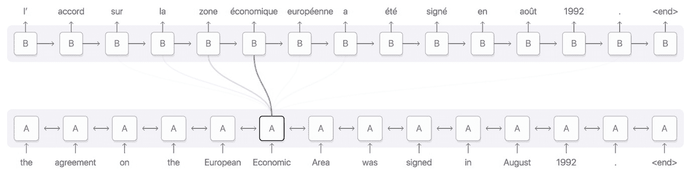

图 2：来自 distill.pub 的插图（https://distill.pub/2016/augmented-rnns/）

图 2 显示了英语中的单词与法语中的单词之间的关系，这种关系取决于它们在句子中出现的位置。RNNs 在语言翻译问题中非常流行。

长短期记忆网络（LSTM）是为了解决梯度消失问题而创建的 RNN 变种。梯度消失问题是由于记忆组件距离当前步骤太远，导致它们因距离较远而获得较低的权重。LSTM 是 RNN 的一种变体，包含一个叫做**忘记门**的记忆组件。该组件可用于评估近期和旧的元素如何影响权重和偏置，具体取决于观察在序列中的位置。

欲了解更多细节，请参见 Sepp Hochreiter 和 Jürgen Schmidhuber 于 1997 年首次提出的 LSTM 架构。当前的实现版本已有多次修改。关于 LSTM 每个组件如何工作的详细数学解释，建议参考 Christopher Olah 于 2015 年 8 月发布的文章《理解 LSTM 网络》，可访问：[`colah.github.io/posts/2015-08-Understanding-LSTMs/`](http://colah.github.io/posts/2015-08-Understanding-LSTMs/)。

# 生成对抗网络

**生成对抗网络** (**GANs**) 是由 Ian Goodfellow 及其在蒙特利尔大学的同事们于 2014 年发明的。GANs 提出，应该有两个神经网络相互竞争，以此来优化权重和偏置，而不是仅有一个神经网络去最小化其错误。

欲了解更多细节，请参见 Ian Goodfellow 等人所著的《生成对抗网络》，发表于 arXiv. 2014 年 6 月 10 日。可访问：[`arxiv.org/abs/1406.2661`](https://arxiv.org/abs/1406.2661)。

GANs 拥有一个生成新数据（即“假”数据）的网络和一个评估由第一个网络生成的数据是否真实的网络。它们相互竞争，因为它们都在学习：一个学习如何更好地生成“假”数据，另一个则学习如何区分数据是否为真实。它们在每一个迭代周期中不断优化，直到两者都收敛。此时，评估生成数据的网络无法再区分“假”数据和真实数据。

GANs 已成功应用于数据具有明确拓扑结构的领域。其最初的实现是使用 GAN 生成与真实图像相似的物体、人物面孔和动物的合成图像。图像生成是 GAN 应用最为广泛的领域，但在其他领域的应用也偶尔出现在研究论文中。

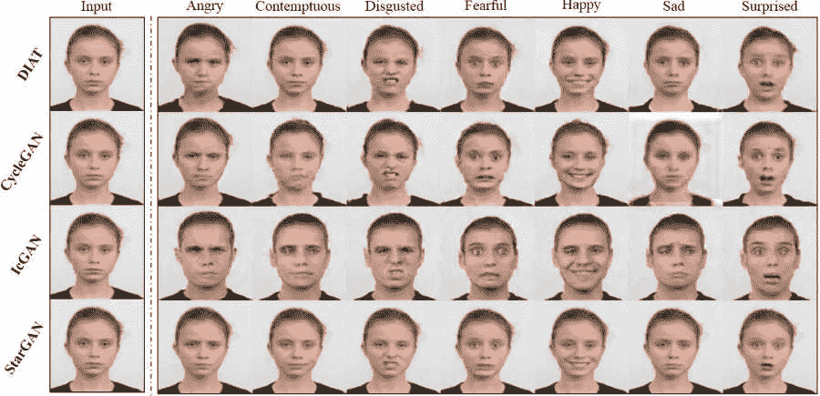

图 3：展示不同 GAN 算法在根据给定情绪变化人物面孔的结果。来源：StarGAN 项目。可访问：[`github.com/yunjey/StarGAN`](https://github.com/yunjey/StarGAN)。

# 深度强化学习

原始的深度强化学习（DRL）架构由 Google 旗下的人工智能研究机构 DeepMind 提出，该机构位于英国。

DRL 网络的关键思想是它们本质上是无监督的，并且通过试错学习，只优化奖励函数。也就是说，与其他使用监督学习方法来优化预测错误（与已知正确答案相比）的网络不同，DRL 网络并不知道处理问题的正确方式。它们只是被给定系统规则，并且每当它们正确执行一个任务时，就会获得奖励。这个过程需要大量的迭代，最终训练网络在多个任务中表现出色。

如需更多信息，请参见，Volodymyr Mnih 等人的《通过深度强化学习实现人类级别控制》，2015 年 2 月，发表于《自然》杂志。可在以下地址获取：[`storage.googleapis.com/deepmind-media/dqn/DQNNaturePaper.pdf`](https://storage.googleapis.com/deepmind-media/dqn/DQNNaturePaper.pdf)。

深度强化学习（DRL）模型在 DeepMind 创建 AlphaGo 后获得了广泛关注，AlphaGo 是一个在围棋游戏中超越职业选手的系统。DeepMind 还创建了能够自学并以超人类水平玩视频游戏的 DRL 网络：

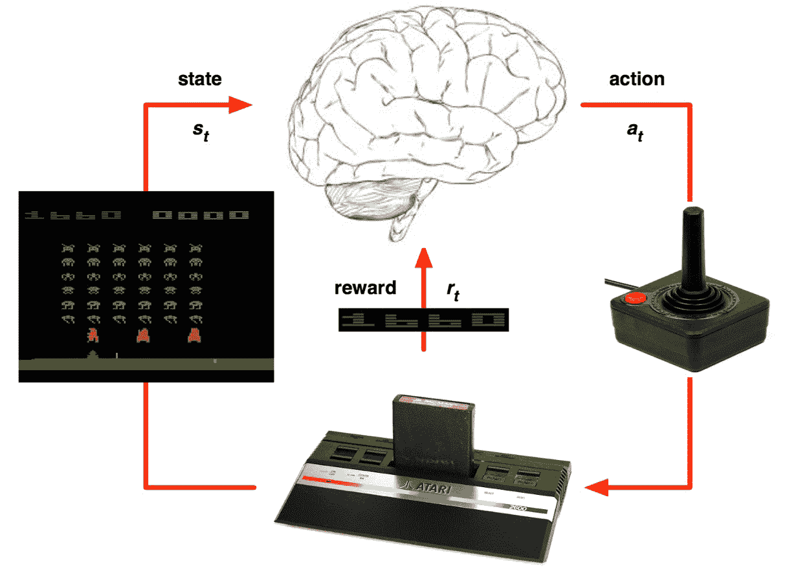

图 4：表示 DQN 算法如何工作的图像

如需更多信息，请参见，DQN 是 DeepMind 为了击败 Atari 游戏而创建的。该算法使用深度强化学习解决方案，不断提高其奖励。图片来源：[`keon.io/deep-q-learning/`](https://keon.io/deep-q-learning/)。

| **架构** | **数据结构** | **成功应用** |
| --- | --- | --- |

| 卷积神经网络（CNNs）

| 网格状拓扑结构（即，图像）

| 图像识别和分类 |
| --- |
| 循环神经网络（RNN）和长短期记忆（LSTM）网络 | 序列数据（即，时间序列数据） | 语音识别、文本生成与翻译 |
| 生成对抗网络（GANs） | 网格状拓扑结构（即，图像） | 图像生成 |
| 深度强化学习（DRL） | 具有明确规则和清晰定义奖励函数的系统 | 玩视频游戏和自动驾驶车辆 |

表 1：不同的神经网络架构在不同领域取得了成功。网络的架构通常与当前问题的结构相关。

# 数据归一化

在构建深度学习模型之前，还有一步是必须的：数据归一化。

数据归一化是机器学习系统中的常见做法。尤其在神经网络中，研究人员提出归一化是训练 RNN（和 LSTM）的一个关键技术，主要是因为它能减少网络的训练时间，并提高网络的整体性能。

欲了解更多信息，请参考 Sergey Ioffe 等人在 arXiv 上发布的《批量归一化：通过减少内部协变量偏移加速深度网络训练》，2015 年 3 月，网址：[`arxiv.org/abs/1502.03167`](https://arxiv.org/abs/1502.03167)。

决定采用哪种归一化技术取决于数据和具体问题。以下是常用的几种技术。

# Z-分数

当数据呈正态分布（即高斯分布）时，可以计算每个观测值与其均值之间的标准差距离。

当识别数据点与分布中更可能发生的事件之间的距离时，这种归一化非常有用。Z-分数的定义为：

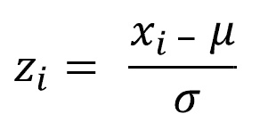

这里，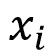 是 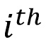 的观测值，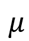 是均值，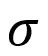 是该序列的标准差。

欲了解更多信息，请参考标准分数文章（Z-分数）。维基百科，网址：[`en.wikipedia.org/wiki/Standard_score`](https://en.wikipedia.org/wiki/Standard_score)。

# 点相对归一化

这种归一化计算给定观测值与序列第一个观测值之间的差异。这种归一化有助于识别相对于起始点的趋势。点相对归一化的定义为：

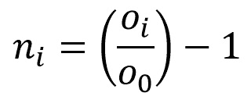

这里， 是 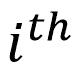 的观测值，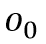 是该序列的第一个观测值。

正如 Siraj Raval 在他的视频《如何轻松预测股票价格 深度学习入门》第 *7* 集中所建议的，视频可在 YouTube 上观看：[`www.youtube.com/watch?v=ftMq5ps503w`](https://www.youtube.com/watch?v=ftMq5ps503w)。

# 最大值和最小值归一化

这种归一化计算给定观测值与序列的最大值和最小值之间的距离。当处理的序列中的最大值和最小值不是异常值并且对未来预测有重要作用时，这种归一化非常有用。

这种归一化技术可以应用于：

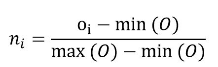

这里，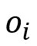 是 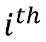 的观测值，*O* 代表包含所有 O 值的向量，min (O) 和 max (O) 函数分别表示该序列的最小值和最大值。

在下一个活动中，我们将探索比特币数据集并为模型准备数据。我们将准备可用的比特币数据以供 LSTM 模型使用。这包括选择感兴趣的变量，选择相关的时间段，并应用前述的点相对归一化技术。

# 结构化你的问题

与研究人员相比，实践者在开始一个新的深度学习项目时，花在确定选择哪种架构上的时间要少得多。获取能够正确代表给定问题的数据是开发这些系统时需要考虑的最重要因素，其次是理解数据集固有的偏差和局限性。

在开始开发深度学习系统时，考虑以下反思问题：

+   **我有正确的数据吗？** 这是训练深度学习模型时最难的挑战。首先，用数学规则定义你的问题。使用精确的定义，并将问题组织为类别（分类问题）或连续尺度（回归问题）。现在，如何收集关于这些度量的数据呢？

+   **我有足够的数据吗？** 通常，深度学习算法在大数据集上的表现明显优于在小数据集上的表现。知道训练一个高性能算法需要多少数据，取决于你试图解决的问题类型，但尽量收集尽可能多的数据。

+   **我可以使用预训练模型吗？** 如果你正在处理的问题是更一般应用的一个子集——但在同一领域内——考虑使用预训练模型。预训练模型可以帮助你在解决问题时，专注于问题的具体模式，而不是领域的更一般特征。一个好的起点是官方的 TensorFlow 仓库（[`github.com/tensorflow/models`](https://github.com/tensorflow/models)）。

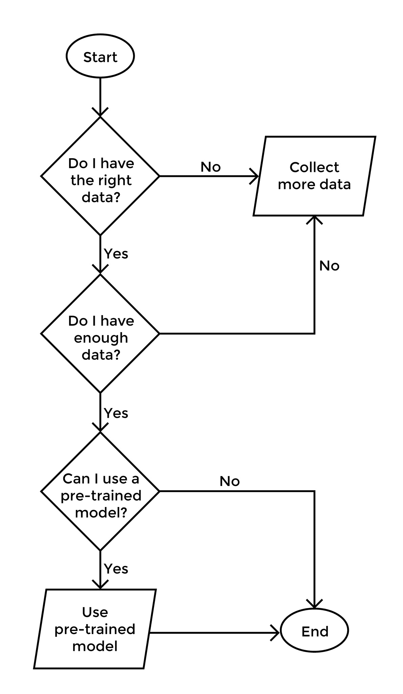

图 5：深度学习项目开始时需要考虑的关键反思问题的决策树

在某些情况下，数据可能根本无法获得。根据具体情况，可以使用一系列技术有效地从输入数据中生成更多数据。这个过程称为**数据增强**，在处理图像识别问题时具有成功的应用。

一个很好的参考是文章《使用深度神经网络分类浮游生物》，可以在[`benanne.github.io/2015/03/17/plankton.html`](http://benanne.github.io/2015/03/17/plankton.html)找到。作者展示了一系列技术，用于增强一小组图像数据，以增加模型的训练样本数量。

# 活动：探索比特币数据集并为模型准备数据

我们将使用一个公开的数据集，该数据集最初来自于 CoinMarketCap，一个追踪不同加密货币统计信息的流行网站。数据集已与本章一起提供，将会被使用。

我们将使用 Jupyter Notebooks 探索数据集。Jupyter Notebooks 提供通过网页浏览器访问的 Python 会话，使你可以互动地处理数据。它们是探索数据集的流行工具，在本书的活动中会被使用。

使用终端，导航到目录 `Chapter_5/activity_3` 并执行以下命令启动 Jupyter Notebook 实例：

```py
     $ jupyter notebook 
```

现在，在浏览器中打开应用程序提供的网址。你应该能够看到一个 Jupyter Notebook 页面，页面上显示了文件系统中的多个目录。你应该能看到以下输出：

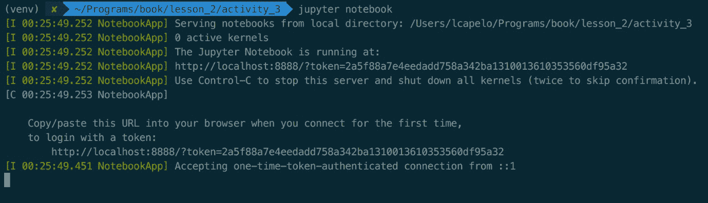

图 6：启动 Jupyter Notebook 实例后的终端图像。导航到浏览器中显示的网址，你应该能够看到 Jupyter Notebook 的登录页面。

现在，导航到目录并点击文件 Activity `Exploring_Bitcoin_ Dataset.ipynb`。这是一个 Jupyter Notebook 文件，它将会在新的浏览器标签中打开。应用程序将自动为你启动一个新的 Python 交互式会话。

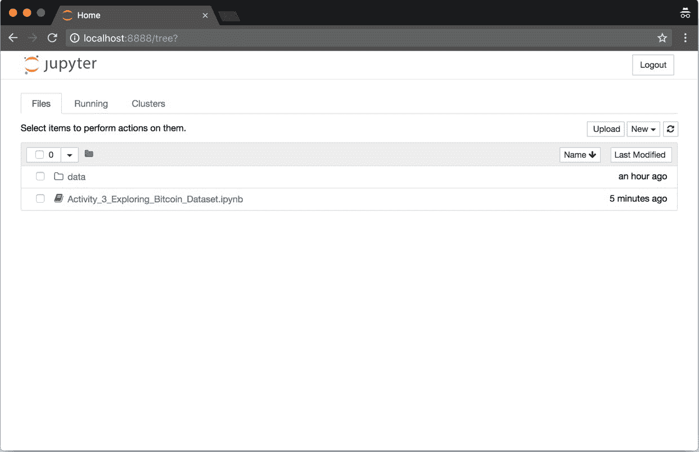

图 7：你的 Jupyter Notebook 实例的登录页面

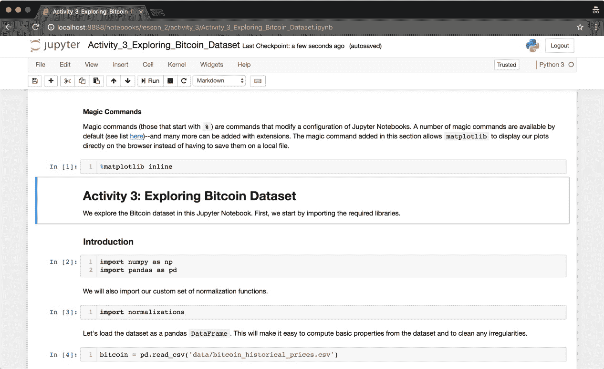

图 8：Notebook Activity_Exploring_Bitcoin_Dataset.ipynb 的图片。你现在可以与该 Notebook 进行交互并进行修改。

打开我们的 Jupyter Notebook 后，让我们现在探索本章提供的比特币数据。

数据集 `data/bitcoin_historical_prices.csv` 包含自 2013 年初以来的比特币价格数据。最新的观测数据为 2017 年 11 月——该数据集来自 `CoinMarketCap`，这是一个每天更新的在线服务。数据集包含八个变量，其中两个（日期和周数）描述了数据的时间周期——这些可以用作索引——另外六个（`open`、`high`、`low`、`close`、`volume` 和 `market_capitalization`）则可以用来理解比特币价格和价值是如何随时间变化的：

| **变量**  | **描述**  |
| --- | --- |
| `date`  | 观察的日期。  |
| `iso_week`  | 给定年份的周数。  |
| `open`  | 单个比特币的开盘值。  |
| `high`  | 给定日期期间内的最高值。  |
| `low`  | 给定日期期间内的最低值。  |
| `close`  | 交易日结束时的值。  |
| `volume`  | 当天交易的比特币总量。  |
| `market_capitalization`  | 市值，计算公式为 市值 = 价格 * 流通供应量。  |

表 2：比特币历史价格数据集中可用的变量（即列）

使用打开的 Jupyter Notebook 实例，现在让我们探索这两个变量的时间序列：`close` 和 `volume`。我们将从这些时间序列开始，探索价格波动模式。

导航到已打开的 Jupyter Notebook 实例 Activity `Exploring_Bitcoin_ Dataset.ipynb`。现在，执行标题为 Introduction 下的所有单元格。这将导入所需的库并将数据集导入内存。

在数据集导入内存后，转到探索部分。你会看到一段生成 `close` 变量时间序列图的代码片段。你能为 `volume` 变量生成相同的图吗？

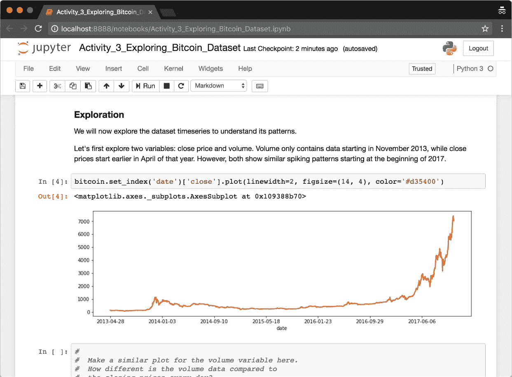

图 9：比特币收盘价的时间序列图，数据来自 `close` 变量。请在下方的新单元格中重现该图，但使用 `volume` 变量。

你一定已经注意到，2017 年这两个变量都有大幅上升。这反映了一个当前现象，即比特币的价格和价值自 2017 年初以来持续增长。

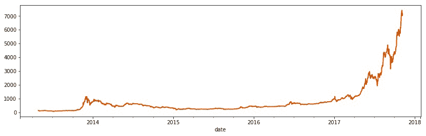

图 10：比特币收盘价（以美元计）。注意到 2013 年底和 2014 年初的早期价格飙升。同时，也可以注意到自 2017 年初以来，最近的价格已经飙升。

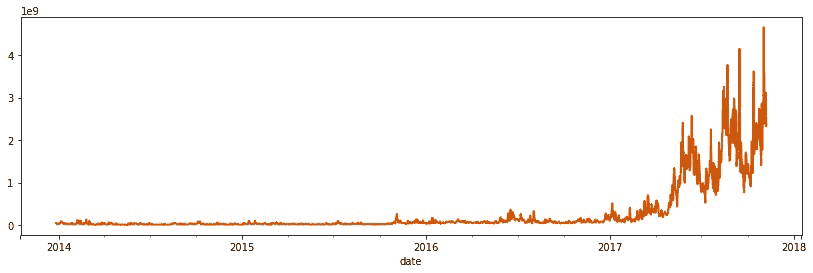

图 11：比特币交易量（以美元计）显示，从 2017 年开始，市场上的比特币交易量显著增加。与每日收盘价相比，总体交易量的波动性要大得多。

此外，我们还注意到，很多年前，比特币的价格波动不如近几年那样剧烈。虽然这些早期的周期可以被神经网络用来理解某些模式，但考虑到我们关注的是预测未来不远的价格，我们将排除较旧的观察数据。让我们只筛选 2016 年和 2017 年的数据。

导航到“准备数据集以供模型使用”部分。我们将使用 pandas API 筛选 2016 年和 2017 年的数据。Pandas 提供了一个直观的 API 来执行此操作：

```py
     bitcoin_recent = bitcoin[bitcoin['date'] >= '2016-01-01']
```

变量 `bitcoin_recent` 现在包含了我们原始比特币数据集的一个副本，但仅包含 2016 年 1 月 1 日或之后的观测数据。

作为最后一步，我们现在使用 *数据归一化* 部分描述的点相对归一化技术来归一化我们的数据。我们只归一化两个变量（close 和 volume），因为这两个是我们要预测的变量。

在包含本章节的同一目录下，我们放置了一个名为 `normalizations.py` 的脚本。该脚本包含了本章节中描述的三种归一化技术。我们将该脚本导入到 Jupyter Notebook 中，并将函数应用于我们的系列。

导航到“准备数据集以供模型使用”部分。现在，使用 `iso_week` 变量按周对所有日期观察进行分组，使用 pandas 方法 `groupby()`。然后，我们可以直接对该周内的系列应用归一化函数 `normalizations.point_relative_normalization()`。我们将该归一化的输出存储为同一个 pandas 数据框中的新变量，方法如下：

```py
     bitcoin_recent['close_point_relative_normalization'] =
     bitcoin_recent.groupby('iso_week')['close'].apply(
     lambda x: normalizations.point_relative_normalization(x))
```

现在，变量 `close_point_relative_normalization` 包含了 `close` 变量的归一化数据。请对 `volume` 变量执行相同的操作：

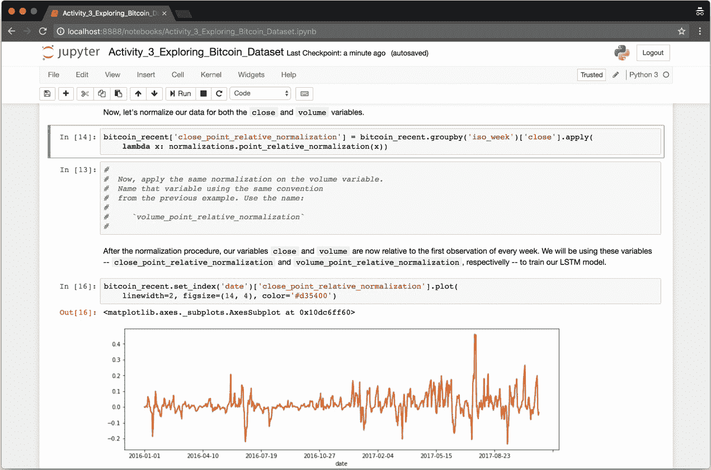

图 12：Jupyter Notebook 的图像，聚焦于应用标准化函数的部分。

标准化的收盘变量包含每周有趣的方差模式。我们将使用该变量来训练我们的 LSTM 模型。

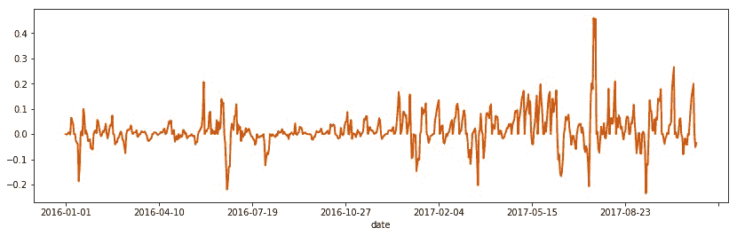

图 13：显示来自标准化变量 close_point_relative_normalization 的系列图。

为了评估我们的模型表现如何，我们需要将其准确性与其他数据进行对比。我们通过创建两个数据集来实现这一点：一个训练集和一个测试集。在本次活动中，我们将使用 80%的数据集来训练我们的 LSTM 模型，剩下的 20%用于评估其表现。

鉴于数据是连续的，并且以时间序列的形式存在，我们使用最后 20%的可用周作为测试集，前 80%作为训练集：

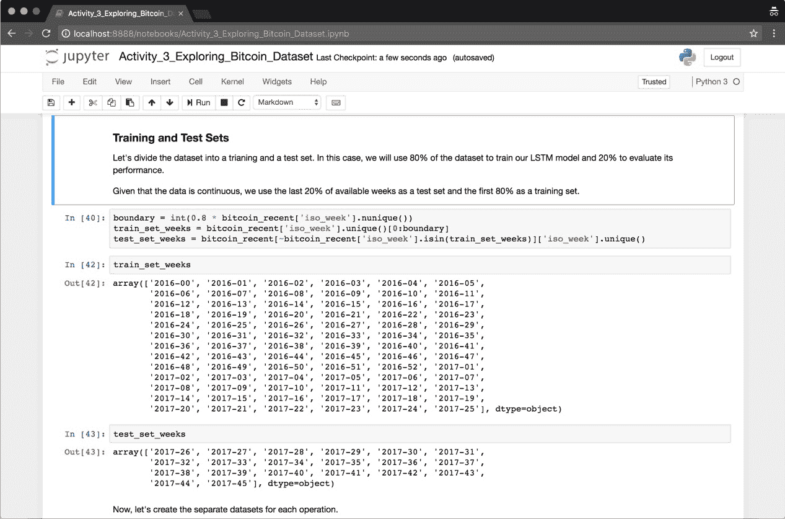

图 14：使用周数创建训练集和测试集

最后，导航到“存储输出”部分，并将过滤后的变量保存到磁盘，如下所示：

```py
     test_dataset.to_csv('data/test_dataset.csv', index=False)
     train_dataset.to_csv('data/train_dataset.csv', index=False)
     bitcoin_recent.to_csv('data/bitcoin_recent.csv', index=False)
```

在本节中，我们探索了比特币数据集，并为深度学习模型做好了准备。

我们了解到，在 2017 年，比特币的价格暴涨。这一现象需要较长时间才能发生——并且可能受到许多外部因素的影响，这些因素是仅凭这些数据无法解释的（例如，其他加密货币的出现）。我们还使用了点相对标准化技术来处理比特币数据集，并按周进行划分。我们这样做是为了训练 LSTM 网络学习比特币价格变化的每周模式，以便它可以预测未来一整周的价格。然而，比特币的统计数据显示其每周波动很大。我们能预测比特币未来的价格吗？

那么，七天后的价格将是多少？我们将在下一节中使用 Keras 构建一个深度学习模型来探索这个问题。

# 使用 Keras 作为 TensorFlow 接口

本节重点介绍 Keras。我们使用 Keras 是因为它将 TensorFlow 的接口简化为通用抽象。在后台，计算仍然是在 TensorFlow 中进行的——图形仍然是使用 TensorFlow 组件构建的——但接口要简单得多。我们减少了对单独组件（如变量和操作）的关注，更多地关注构建网络作为一个计算单元。Keras 使得实验不同的架构和超参数变得更加容易，从而更快地朝着高效的解决方案迈进。

从 TensorFlow 1.4.0（2017 年 11 月）开始，Keras 现在正式与 TensorFlow 一起分发为`tf.keras`。这表明 Keras 现在与 TensorFlow 紧密集成，且它很可能会继续作为开源工具开发很长一段时间。

# 模型组件

正如我们在《神经网络与深度学习简介》第四章中所看到的，LSTM 网络也有输入、隐藏和输出层。每个隐藏层都有一个激活函数，用于评估该层的相关权重和偏差。如预期的那样，网络按顺序从一层传递数据到另一层，并通过每次迭代的输出来评估结果（即一个 epoch）。

Keras 提供直观的类来表示每一个这些组件：

| **组件**  | **Keras 类**  |
| --- | --- |
| 完整顺序神经网络的高级抽象。  | `keras.models.Sequential()`  |
| 密集连接层。  | `keras.layers.core.Dense()`  |
| 激活函数。  | `keras.layers.core.Activation()`  |
| LSTM 循环神经网络。这个类包含了专属于这个架构的组件，其中大部分被 Keras 抽象化。  | `keras.layers.recurrent.LSTM()`  |

表 3：Keras API 中关键组件的描述。我们将使用这些组件来构建深度学习模型。

Keras 的`keras.models.Sequential()`组件代表了一个完整的顺序神经网络。该 Python 类可以独立实例化，然后随后添加其他组件。

我们对构建 LSTM 网络感兴趣，因为这些网络在处理顺序数据时表现良好——而时间序列是顺序数据的一种。使用 Keras，完整的 LSTM 网络实现如下所示：

```py
     from keras.models import Sequential
     from keras.layers.recurrent import LSTM
     from keras.layers.core import Dense, Activation

     model = Sequential()

     model.add(LSTM(
     units=number_of_periods,
     input_shape=(period_length, number_of_periods)
     return_sequences=False), stateful=True)
     model.add(Dense(units=period_length))
     model.add(Activation("linear"))
     model.compile(loss="mse", optimizer="rmsprop")

```

*Snippet 1*：使用 Keras 的 LSTM 实现

这个实现将在《模型评估与优化》第六章中进一步优化。

Keras 的抽象化允许专注于使深度学习系统更高性能的关键元素：正确的组件序列是什么，包括多少层和节点，以及使用哪种激活函数。所有这些选择都由将组件添加到实例化的`keras.models.Sequential()`类的顺序或通过传递给每个组件实例化的参数（即`Activation("linear")`）确定。最终的`.compile()`步骤使用 TensorFlow 组件构建神经网络。

构建网络后，我们使用`model.fit()`方法来训练我们的网络。这将产生一个经过训练的模型，可以用来进行预测：

```py
     model.fit(
     X_train, Y_train,
     batch_size=32, epochs=epochs)

```

*Snippet* 2.1：使用`model.fit()`的示例

变量`X_train`和`Y_train`分别用于训练的一组数据和用于评估损失函数的较小数据集（即测试网络预测数据的效果）。

最后，我们可以使用`model.predict()`方法进行预测：

```py
      model.predict(x=X_train)
```

*Snippet* 2.2：使用`model.predict()`的示例

前面的步骤涵盖了 Keras 在处理神经网络时的范式。尽管不同的架构可以以非常不同的方式处理，但 Keras 通过使用三个组件——网络架构、拟合和预测，简化了处理不同架构的接口：

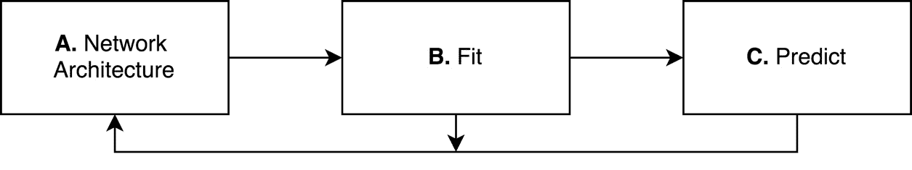

图 15：Keras 神经网络范式：A. 设计神经网络架构，B. 训练神经网络（或拟合），C. 做出预测

Keras 在每个步骤中都允许更大的控制。然而，它的重点是尽可能简单地帮助用户在最短的时间内创建神经网络。这意味着我们可以从一个简单的模型开始，然后在上述每个步骤中添加复杂性，使初始模型的性能更好。

我们将在接下来的活动和章节中利用这个范式。在下一个活动中，我们将创建最简单的 LSTM 网络。然后，在 *第六章*，*模型评估与优化*，我们将不断评估并修改该网络，使其更加强大和高效。

# 活动：使用 Keras 创建 TensorFlow 模型

在本活动中，我们将使用 Keras 创建一个 LSTM 模型。

Keras 作为一个接口连接低层次的程序；在这个例子中是 TensorFlow。当我们使用 Keras 设计神经网络时，该神经网络会被 *编译* 为一个 TensorFlow 计算图。

导航到打开的 Jupyter Notebook 实例 `Activity_4_Creating_a_ TensorFlow_Model_Using_Keras.ipynb`。现在，执行 **构建模型** 下的所有单元格。在该部分，我们构建了第一个 LSTM 模型，设置了两个参数：训练观察值的输入大小（对于单个日期等同为 1）和预测期的输出大小——在我们的案例中是七天：

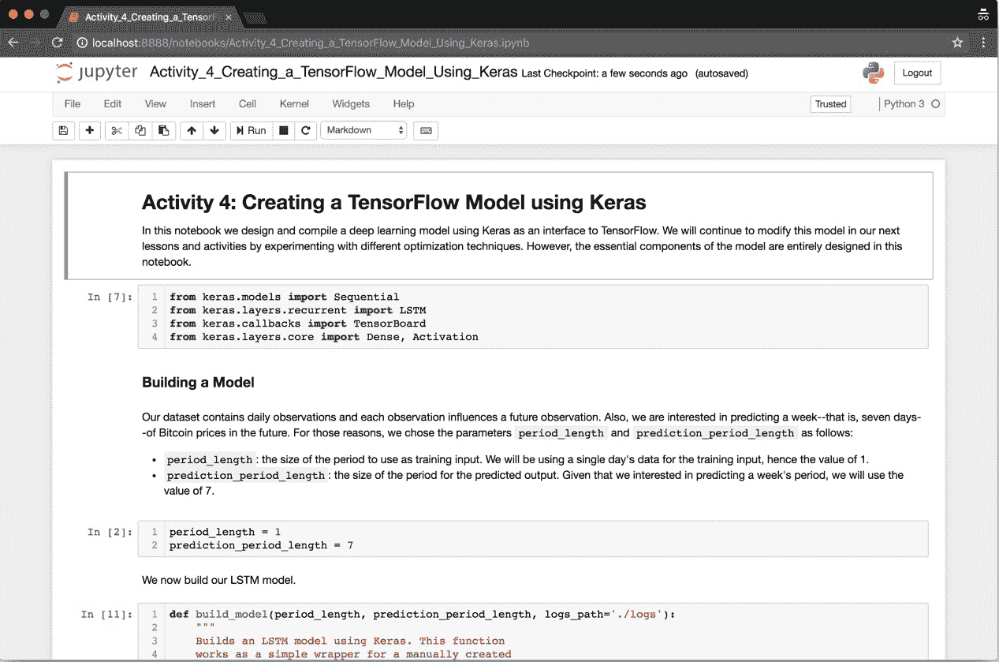

使用 Jupyter Notebook `Activity_4_Creating_a_TensorFlow_Model_Using_Keras.ipynb` 来构建与 *模型组件* 部分相同的模型，设置输入和输出的周期长度，以便进行实验。

在模型编译完成后，我们继续将其存储为磁盘上的 `h5 文件`。定期将模型版本存储到磁盘上是一个好习惯，这样你就可以将模型架构与其预测能力一起保存在硬盘上。

仍然在同一个 Jupyter Notebook 中，导航到 **保存模型** 头部。在该部分，我们将使用以下命令将模型存储为磁盘上的文件：

```py
     model.save('bitcoin_lstm_v0.h5')
```

模型 '`bitcoin_lstm_v0.h5`' 还没有经过训练。当在没有先前训练的情况下保存模型时，实际上只保存了模型的架构。该模型稍后可以通过 Keras 的 `load_model()` 函数加载，如下所示：

```py
     1 model = keras.models.load_model('bitcoin_lstm_v0.h5')
```

当加载 Keras 库时，您可能会遇到以下警告：使用 TensorFlow 后端。Keras 可以配置为使用其他后端而不是 TensorFlow（即 Theano）。为了避免此消息，您可以创建一个名为`keras.json`的文件，并在其中配置其后端。该文件的正确配置取决于您的系统。因此，建议您访问 Keras 官方文档，了解相关主题：[`keras.io/backend/`](https://keras.io/backend/)[.](https://keras.io/backend/)

在本节中，我们学习了如何使用 Keras（TensorFlow 的接口）构建深度学习模型。我们研究了 Keras 的核心组件，并使用这些组件基于 LSTM 模型构建了第一个比特币价格预测系统的版本。

在我们接下来的章节中，我们将讨论如何将本章中的所有组件整合到一个（几乎完整的）深度学习系统中。该系统将产生我们第一次的预测，作为未来改进的起点。

# 从数据准备到建模

本节专注于深度学习系统的实现方面。我们将使用在*选择正确的模型架构*一节中的比特币数据，以及在*使用 Keras 作为 TensorFlow 接口*一节中的 Keras 知识，将这两个组件结合起来。本节通过构建一个系统来结束本章，该系统从磁盘读取数据，并将其作为一个整体输入模型。

# 训练神经网络

神经网络的训练可能需要较长时间。许多因素会影响该过程需要的时间。其中，有三个因素通常被认为是最重要的：

+   网络架构

+   网络有多少层和神经元

+   用于训练过程的数据量

其他因素也可能大大影响网络的训练时间，但神经网络在解决业务问题时的优化大多数来源于探索这三点。

我们将使用上一节中的归一化数据。回想一下，我们已经将训练数据存储在一个名为`train_dataset.csv`的文件中。我们将使用 pandas 将该数据集加载到内存中，以便进行简便的探索：

```py
    import pandas as pd
    train = pd.read_csv('data/train_dataset.csv')
```

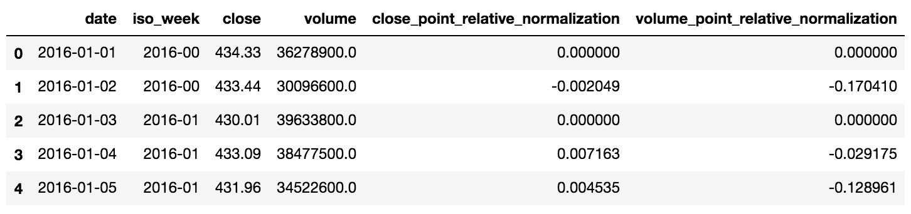

图 17：显示从`train_dataset.csv`文件加载的训练数据集的前五行的表格

我们将使用来自变量`close_point_relative_normalization`的系列数据，这是一组归一化的比特币收盘价序列（来自变量 close），自 2016 年初以来的数据。

变量`close_point_relative_normalization`是基于每周归一化的。每个观测值都相对于该周期间第一天的收盘价差异进行归一化。这个归一化步骤很重要，它将帮助我们的网络更快地训练。


图 18：展示从归一化变量 close_point_relative_normalization 中绘制的时间序列图。这个变量将用于训练我们的 LSTM 模型。

# 调整时间序列数据

神经网络通常处理向量和张量，这些都是组织数据的数学对象，它们在多个维度上组织数据。在 Keras 中实现的每个神经网络都会根据规格组织一个向量或张量作为输入。一开始，理解如何将数据调整为给定层所期望的格式可能会令人困惑。为了避免混淆，建议从一个尽可能简单的网络开始，然后逐步添加组件。Keras 的官方文档（在**层**部分）对学习每种层的要求非常重要。

Keras 官方文档可以在 [`keras.io/layers/core/`](https://keras.io/layers/core/) 获取。该链接直接将您带到 Layers 部分。

`NumPy` 是一个流行的 Python 库，用于执行数值计算。深度学习社区使用它来操作向量和张量，并将它们为深度学习系统做准备。特别是，`numpy.reshape()` 方法在调整数据以适应深度学习模型时非常重要。该方法允许操作 NumPy 数组，这些数组是 Python 对象，类似于向量和张量。

我们现在使用 2016 和 2017 年的周数据来组织来自 `close_point_relative_normalization` 变量的价格。我们将数据分成不同的组，每组包含七个观察值（每个周的一天），总共有 77 个完整的周。

我们这样做是因为我们对预测一周的交易价格感兴趣。

我们使用 ISO 标准来确定一周的开始和结束时间。其他类型的组织方式也是完全可能的。这种方式简单且直观，但仍有改进的空间。

LSTM 网络使用三维张量。每个维度都代表网络的一个重要属性。这些维度是：

+   **周期长度**：周期长度，即每个周期中有多少观察值

+   **周期数量**：数据集中可用的周期数量

+   **特征数量**：数据集中可用的特征数量

我们从变量 `close_point_relative_normalization` 获取的数据目前是一个一维向量——我们需要将其调整为符合这三个维度的格式。

我们将使用一周的时间周期。因此，我们的周期长度是七天（周期长度 = 7）。我们的数据中有 77 个完整的周。我们将在训练期间使用最后一个周进行模型测试。这使得我们剩下 76 个不同的周（周期数量 = 76）。最后，我们将在这个网络中使用单一的特征（特征数量 = 1）——我们将在未来的版本中加入更多的特征。

我们如何重塑数据以匹配这些维度？我们将使用基础 Python 属性和来自 `numpy` 库的 `reshape()` 函数的组合。首先，我们用纯 Python 创建 76 个不同的周组，每个周组有七天：

```py
     group_size = 7
     samples = list()
     for i in range(0, len(data), group_size):
     sample = list(data[i:i + group_size])
     if len(sample) == group_size:
     samples.append(np.array(sample).reshape(group_size, 1).tolist())

     data = np.array(samples) 
```

代码片段 3：创建不同周组的 Python 代码片段

结果变量数据是一个包含所有正确维度的变量。Keras 的 LSTM 层期望这些维度按特定顺序组织：特征数量、观测数量和周期长度。

让我们重塑数据集以匹配该格式：

```py
     X_train = data[:-1,:].reshape(1, 76, 7)
     Y_validation = data[-1].reshape(1, 7)
```

代码片段 4：创建不同周组的 Python 代码片段

每个 Keras 层都会期望其输入以特定的方式组织。然而，Keras 通常会根据需要重新塑形数据。每次添加新层或遇到维度问题时，都应参考 Keras 层的文档 ([`keras.io/layers/core/`](https://keras.io/layers/core/))。

*代码片段 4* 还将我们数据集中的最后一周选择为验证集（`via data[-1]`）。我们将尝试使用前 76 周的数据预测数据集中的最后一周。接下来的步骤是使用这些变量来拟合我们的模型：

```py
      model.fit(x=X_train, y=Y_validation, epochs=100) 
```

*代码片段 5*：展示如何训练我们的模型

LSTM 是计算开销较大的模型。在现代计算机上，训练我们的数据集可能需要几分钟时间。大部分时间都花费在计算的开始阶段，当时算法创建完整的计算图。训练开始后，速度会逐渐提升：

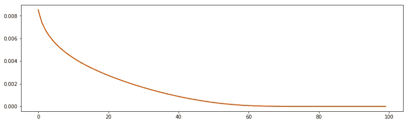

图 19：显示在每个 epoch 评估的损失函数结果的图形

这比较了模型在每个 epoch 中的预测结果，然后使用均方误差技术与实际数据进行比较。此图显示了这些结果。

一目了然，我们的网络表现得非常好：它从一个非常小的误差率开始，并持续减少。那么，我们的预测结果告诉我们什么呢？

# 进行预测

在我们的网络训练完成后，我们现在可以进行预测。我们将对超出时间范围的未来一周进行预测。

一旦我们通过 `model.fit()` 训练了我们的模型，做出预测就变得非常简单：

```py
     model.predict(x=X_train)
```

*代码片段 6*：使用之前用于训练的相同数据进行预测

我们使用与训练数据相同的数据进行预测（即 `X_train` 变量）。如果我们有更多数据可用，我们可以使用这些数据，只要我们将其重新塑形为 LSTM 所要求的格式。

# 过拟合

当神经网络在验证集上发生过拟合时，意味着它学会了训练集中存在的模式，但无法将其推广到未见过的数据（例如，测试集）。在下一章中，我们将学习如何避免过拟合，并创建一个系统来评估我们的网络并提升其性能：

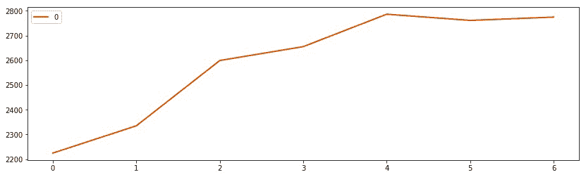

图 20：去归一化后，我们的 LSTM 模型预测 2017 年 7 月底，比特币的价格将从 2200 美元上涨到约 2800 美元，单周上涨 30％

# 活动：组装深度学习系统

在本活动中，我们将所有构建基础深度学习系统的关键元素汇集在一起：数据、模型和预测。

我们将继续使用 Jupyter Notebooks，并将使用之前练习中准备的数据（`data/train_dataset.csv`）以及我们本地存储的模型（`bitcoin_lstm_v0.h5`）。

1.  启动 Jupyter Notebook 实例后，导航到名为`Activity_5_Assembling_a_Deep_Learning_System.ipynb`的 Notebook 并打开它。从标题开始执行单元格以加载所需的组件，然后导航到标题**数据整形**：

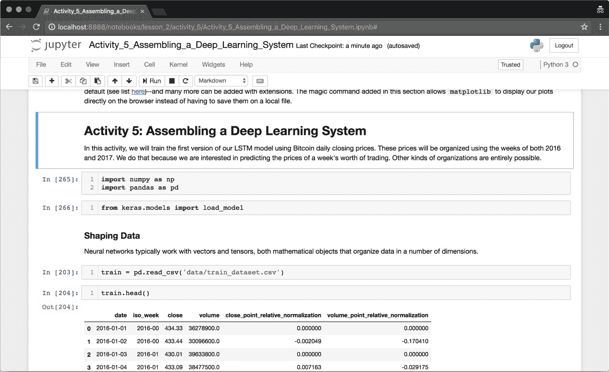

图 21：展示归一化变量`close_point_relative_normalization`的时间序列图

`close_point_relative_normalization`变量将用于训练我们的 LSTM 模型。

我们将从加载我们在之前活动中准备的数据集开始。我们使用 pandas 将该数据集加载到内存中。

1.  使用 pandas 将训练数据集加载到内存中，如下所示：

```py
      train = pd.read_csv('data/train_dataset.csv')
```

1.  现在，通过执行以下命令，快速检查数据集：

```py
      train.head()
```

正如本章所解释的，LSTM 网络需要三维张量。这些维度是：周期长度、周期数和特征数。

现在，继续创建每周的分组，然后重新排列生成的数组以匹配这些维度。

1.  随时使用提供的`create_groups()`函数来执行此操作：

```py
       create_groups(data=train, group_size=7)
```

该函数的默认值为 7 天。如果你将该数字更改为其他值，比如 10，会发生什么呢？

现在，确保将数据分成两个集合：训练集和验证集。我们通过将比特币价格数据集的最后一周分配到评估集来实现这一点。然后，我们训练网络来评估这一最后一周的数据。

将训练数据的最后一周分离出来，并使用`numpy.reshape()`进行重塑。重塑非常重要，因为 LSTM 模型只接受这种格式的数据：

```py
       X_train = data[:-1,:].reshape(1, 76, 7)
       Y_validation = data[-1].reshape(1, 7)
```

我们的数据现在已经准备好用于训练。现在我们加载之前保存的模型，并用给定的 epochs 数量训练它。

1.  导航到标题**加载我们的模型**，并加载我们之前训练的模型：

```py
      model = load_model('bitcoin_lstm_v0.h5')
```

1.  现在，用我们的训练数据`X_train`和`Y_validation`来训练该模型：

```py
      history = model.fit(
      x=X_train, y=Y_validation,
      batch_size=32, epochs=100)
```

请注意，我们将模型的日志存储在名为 history 的变量中。这些日志对于探索模型训练准确率的具体变化，以及理解损失函数的表现非常有用：

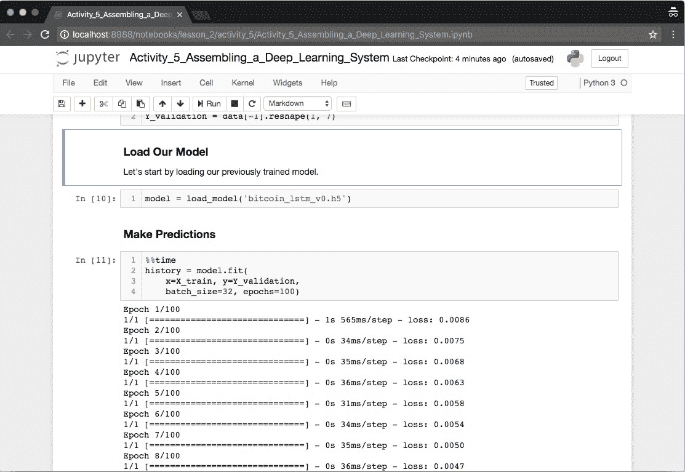

图 22：Jupyter Notebook 部分，我们加载了之前的模型，并用新数据训练它

最后，让我们用训练好的模型进行预测。

1.  使用相同的`data X_train`，调用以下方法：

```py
      model.predict(x=X_train)
```

1.  模型立即返回一个标准化值的列表，包含未来七天的预测数据。使用 `denormalize()` 函数将数据转化为美元值。请使用最新的可用值作为参考来调整预测结果：

```py
       denormalized_prediction = denormalize(predictions, last_weeks_value)
```

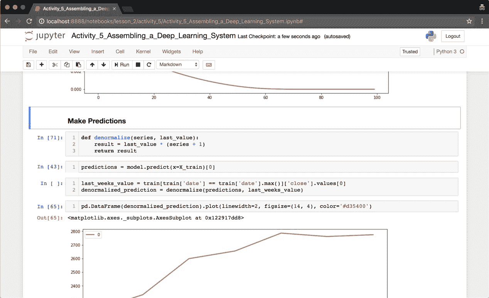

图 23：Jupyter Notebook 部分，展示了我们预测未来七天比特币价格的过程。

我们的预测表明，比特币价格可能会大约上涨 30%。

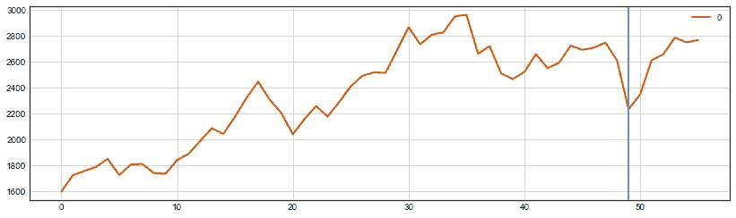

图 24：使用我们刚刚建立的 LSTM 模型预测未来七天的比特币价格走势。

我们在这张图中结合了两个时间序列：真实数据（线之前）和预测数据（线之后）。该模型展示的方差与之前看到的模式类似，并且它暗示未来七天内可能会有价格上涨。

1.  完成实验后，使用以下命令保存你的模型：

```py
      model.save('bitcoin_lstm_v0_trained.h5')
```

我们将保存这个训练好的网络以供将来参考，并与其他模型的表现进行比较。

网络可能已经从我们的数据中学习到了一些模式，但它是如何在如此简单的架构和如此少的数据下做到这一点的呢？LSTM 是一种从数据中学习模式的强大工具。然而，我们将在接下来的课程中学习到，它们也可能会遭遇 *过拟合* 问题，这是神经网络中常见的现象，其中模型学习到了训练数据中的一些模式，但这些模式在预测现实世界的数据时并没有什么用处。我们将学习如何处理这一问题，并改进我们的网络以进行有用的预测。

# 总结

在本章中，我们已经组装了一个完整的深度学习系统：从数据到预测。此活动中创建的模型需要进行多次改进才能算得上有用。然而，它为我们提供了一个很好的起点，之后我们将不断改进。

我们的下一章将探索评估模型性能的技术，并继续进行修改，直到我们得到一个既有用又健壮的模型。
