# 第六章：模型评估与优化

本章重点讨论如何评估神经网络模型。与其他类型的模型不同，使用神经网络时，我们会调整网络的超参数以提高其性能。然而，在修改任何参数之前，我们需要先衡量模型的表现。

到本章结束时，你将能够：

+   评估模型

    +   探索神经网络处理的不同类型问题

    +   探索损失函数、准确率和错误率

    +   使用 TensorBoard

    +   评估指标和技术

+   超参数优化

    +   添加层和节点

    +   探索并添加训练轮次

    +   实现激活函数

    +   使用正则化策略

# 模型评估

在机器学习中，常常定义两个不同的术语：参数和超**参数**。参数是影响模型如何从数据中做出预测的属性。超参数则是指模型如何从数据中学习。参数可以从数据中学习并动态修改，而超参数则是更高级的属性，通常不会从数据中学习。如需更详细的概述，请参考 Sebastian Raschka 和 Vahid Mirjalili 所著的《Python 机器学习》（Packt，2017 年）。

# 问题分类

通常，神经网络解决的问题分为两类：分类和回归。分类问题是关于从数据中预测正确的类别；例如，温度是热还是冷。回归问题则是关于预测连续标量中的值；例如，实际的温度值是多少？

这两类问题的特点如下：

+   **分类**：以类别为特征的问题。类别可以不同，也可以相同；它们还可以是二分类问题。然而，每个数据元素必须清晰地被分配到某个类别。一个分类问题的例子是，使用卷积神经网络为图像分配标签 *车* 或 *非车*。在第四章《神经网络与深度学习简介》中探索的 MNIST 示例是另一个分类问题的例子。

+   **回归**：以连续变量（即标量）为特征的问题。这些问题通过范围来衡量，并评估网络与真实值的接近程度。例如，一个时间序列分类问题，其中使用循环神经网络预测未来的温度值。比特币价格预测问题是另一个回归问题的例子。

尽管评估这两类问题模型的整体结构相同，但我们会采用不同的技术来评估模型的表现。在接下来的部分中，我们将探讨分类或回归问题的评估技术。

本章中的所有代码片段都实现于*活动 6 和 7*。欢迎跟着一起做，但不必感到强制性，因为它们将在活动中更详细地重复。

# 损失函数、准确度和误差率

神经网络利用衡量网络与验证集（即从数据中分离出来作为训练过程一部分的部分数据）比较时的表现的函数。这些函数称为**损失函数**。

损失函数评估神经网络预测的*错误*程度；然后它们会将这些错误反向传播并调整网络，改变单个神经元的激活方式。损失函数是神经网络的关键组件，选择合适的损失函数对网络性能有着重要影响。

错误是如何传播到网络中的每个神经元的？

错误通过一个称为反向传播的过程进行传播。反向传播是一种将损失函数返回的错误传播到神经网络中每个神经元的技术。传播的错误会影响神经元的激活方式，最终影响该网络的输出。

包括 Keras 在内的许多神经网络包默认使用此技术。

如需了解更多关于反向传播的数学内容，请参考*深度学习*（作者：Ian Goodfellow 等，麻省理工学院出版社，2016 年）。

我们对回归和分类问题使用不同的损失函数。对于分类问题，我们使用准确率函数（即预测正确的比例）。而对于回归问题，我们使用误差率（即预测值与观测值的接近程度）。

下表提供了常见损失函数的总结，并列出了它们的常见应用：

| **问题类型**  | **损失函数**  | **问题**  | **示例**  |
| --- | --- | --- | --- |

| 回归  | 均方误差（MSE）

| 预测一个连续函数。即在一系列值的范围内预测值。

| 使用过去的温度测量预测未来的温度。

|

| 回归  | 均方根误差（RMSE）  | 与前面相同，但处理负值。RMSE 通常提供更具可解释性的结果。  | 与前面相同。  |
| --- | --- | --- | --- |

| 回归  | 平均绝对百分比误差

(MAPE)

| 预测连续函数。与去归一化范围工作时，表现更好。  | 使用产品属性（例如，价格、类型、目标受众、市场条件）预测产品的销售。

|

| 分类  | 二元交叉熵  |  对两个类别或两者之间的分类

值（即，`true` 或 `false`）。

| 根据网站访问者的浏览器活动预测其性别。

|

| 分类  | 分类交叉熵

| 从已知类别集中分类多类问题

分类的类别数。

| 根据说话者的口音预测其国籍，条件是说出一段英语句子。 |
| --- |

对于回归问题，MSE 函数是最常用的选择。而对于分类问题，二元交叉熵（用于二分类问题）和多类别交叉熵（用于多分类问题）是常见的选择。建议从这些损失函数开始，然后在神经网络的发展过程中，尝试其他函数，以提升性能。

对于回归问题，MSE 函数是最常用的选择。而对于分类问题，二元交叉熵（用于二分类问题）和多类别交叉熵（用于多分类问题）是常见的选择。建议从这些损失函数开始，然后在神经网络的发展过程中，尝试其他函数，以提升性能。

我们在**第五章**中开发的网络使用 MSE 作为其损失函数。在接下来的章节中，我们将探讨该函数在网络训练过程中的表现。

# 不同的损失函数，相同的架构

在继续进入下一节之前，让我们从实践角度探讨一下，这些问题在神经网络中的差异。

TensorFlow Playground 应用程序由 TensorFlow 团队提供，帮助我们理解神经网络是如何工作的。在这里，我们看到一个神经网络，其中的层包括：输入层（左侧）、隐藏层（中间）和输出层（右侧）。

我们还可以选择不同的样本数据集进行实验，位于最左侧。最后，在最右侧，我们看到网络的输出。

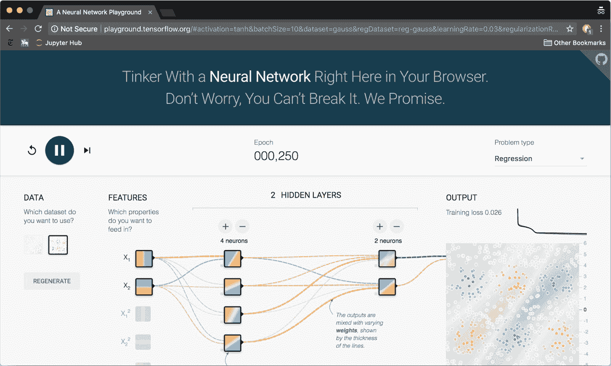

图 1：TensorFlow Playground 网页应用程序。在这个可视化中，使用神经网络的参数来获取一些

直观地了解每个参数如何影响模型结果。

该应用程序帮助我们探索在前一节中讨论的不同问题类别。当我们选择**分类**作为**问题类型**（右上角）时，数据集中的点只有两种颜色值：蓝色或橙色。

当我们选择**回归**时，点的颜色会在橙色和蓝色之间的色值范围内变化。在处理分类问题时，网络根据错误的蓝色和橙色数量来评估其损失函数；在处理分类问题时，它会检查每个点距离正确色值的远近，如下图所示：

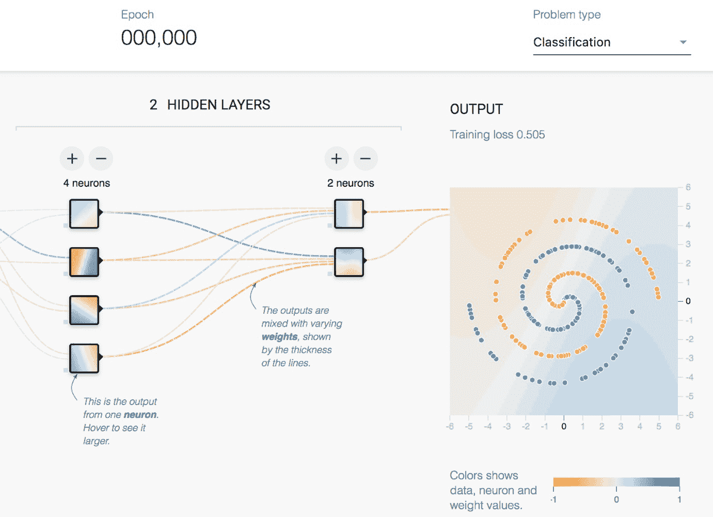

图 2：TensorFlow Playground 应用程序的细节。不同的色值分配给点，

这取决于问题类型。

点击播放按钮后，我们会注意到训练损失区域的数字随着网络不断训练而持续下降。每个问题类别中的数字非常相似，因为损失函数在两个神经网络中扮演着相同的角色。然而，每个类别所使用的实际损失函数是不同的，且根据问题类型选择。

# 使用 TensorBoard

评估神经网络是 TensorBoard 的强项。如同在*C*hapter 4*《神经网络与深度学习简介》中所解释的，TensorBoard 是随 TensorFlow 一起提供的一套可视化工具。其中之一的功能是，在每个 epoch 后，可以探索损失函数评估结果。TensorBoard 的一个伟大特点是，用户可以单独组织每次运行的结果，并比较每次运行的损失函数指标。之后，用户可以决定需要调整哪些超参数，并对网络的表现有一个大致的了解。最棒的是，这一切都可以实时完成。

为了在我们的模型中使用 TensorBoard，我们将使用 Keras 回调函数。我们通过导入 `TensorBoard` 回调函数，并在调用 `fit()` 函数时将其传递给模型。以下代码展示了如何在我们之前章节中创建的比特币模型中实现：

```py
    from keras.callbacks import TensorBoard
    model_name = 'bitcoin_lstm_v0_run_0'
    tensorboard = TensorBoard(log_dir='./logs/{}'.format(model_name))
    model.fit(x=X_train, y=Y_validate,
    batch_size=1, epochs=100,
    verbose=0, callbacks=[tensorboard])
```

*代码片段 1*：在我们的 LSTM 模型中实现 TensorBoard 回调函数的代码片段

Keras 回调函数在每个 epoch 运行结束时被调用。在这种情况下，Keras 调用 TensorBoard 回调函数，将每次运行的结果存储到磁盘中。还有许多其他有用的回调函数可以使用，用户也可以使用 Keras API 创建自定义回调函数。

更多信息请参考 Keras 回调文档（[`keras.io/callbacks/`](https://keras.io/callbacks/)）。

在实现 TensorBoard 回调函数后，`loss` 函数的指标现在可以在 TensorBoard 界面中查看。你可以运行 TensorBoard 进程（`with tensorboard --logdir=./logs`）并在训练网络时保持它运行（使用 `fit()`）。评估的主要图形通常称为*损失*。用户可以通过将已知指标传递给 `fit()` 函数中的 metrics 参数来添加更多指标，这些指标将在 TensorBoard 中进行可视化，但不会用于调整网络权重。

交互式图形将继续实时更新，帮助你理解每个 epoch 中发生的情况。

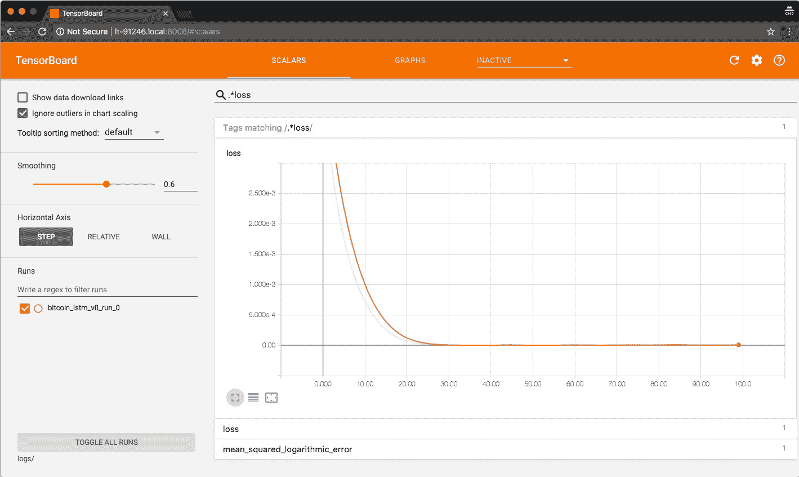

图 3：TensorBoard 实例的截图，显示了损失函数结果以及添加到指标参数中的其他指标

# 实现模型评估指标

在回归和分类问题中，我们将输入数据集拆分为三个数据集：训练集、验证集和测试集。训练集和验证集用于训练网络。训练集作为输入提供给网络，验证集由损失函数用来将神经网络的输出与真实数据进行比较，并计算预测的误差。最后，测试集在网络训练完毕后用于评估网络在未见过的数据上的表现。

并没有明确的规则来确定训练集、验证集和测试集应如何划分。常见的方法是将原始数据集划分为 80% 的训练集和 20% 的测试集，然后将训练集进一步划分为 80% 的训练集和 20% 的验证集。有关此问题的更多信息，请参考 Sebastian Raschka 和 Vahid Mirjalili 合著的《*Python 机器学习*》（Packt，2017）。

在分类问题中，您将数据和标签作为相关但不同的数据传递给神经网络。网络随后学习数据如何与每个标签相关。在回归问题中，您不传递数据和标签，而是将感兴趣的变量作为一个参数传递，将用于学习模式的变量作为另一个参数。Keras 为这两种用例提供了接口，即 `fit()` 方法。请参见 *代码片段 2* 了解示例：

```py
    model.fit(x=X_train, y=Y_train,
    batch_size=1, epochs=100,
    verbose=0, callbacks=[tensorboard],
    validation_split=0.1,
    validation_data=(X_validation, Y_validation))
```

*代码片段 2*：演示如何使用 `validation_split` 和 `validation_data` 参数的代码片段

`fit()` 方法可以使用 `validation_split` 或 `validation_data` 参数，但不能同时使用这两个参数。

损失函数评估模型的进展并在每次运行时调整其权重。然而，损失函数仅描述训练数据和验证数据之间的关系。为了评估模型是否正确执行，我们通常使用第三组数据——即未用于训练网络的数据——并将我们模型的预测结果与该数据集中的实际值进行比较。

这就是测试集的作用。Keras 提供了 `model.evaluate()` 方法，使得将训练好的神经网络与测试集进行评估的过程变得简单。请参见以下代码了解示例：

```py
     model.evaluate(x=X_test, y=Y_test)
```

*代码片段 3*：演示如何使用 `evaluate()` 方法的代码片段

`evaluate()` 方法返回损失函数的结果以及传递给 `metrics` 参数的函数结果。在比特币问题中，我们将频繁使用该方法来测试模型在测试集上的表现。

你会注意到，比特币模型看起来与上述示例有些不同。这是因为我们使用了 LSTM 架构。LSTM 被设计用来预测序列。因此，我们不使用一组变量来预测另一个单一变量——即使它是回归问题。相反，我们使用单一变量（或一组变量）的先前观察值来预测该变量（或变量组）未来的观察值。在`Keras.fit()`的`y`参数包含了与`x`参数相同的变量，只不过是预测的序列。

# 评估比特币模型

我们在*C*hapter 4*中创建了一个测试集，*神经网络与深度学习简介*。该测试集包含了 19 周的比特币每日价格观察数据，相当于原始数据集的约 20％。

我们还使用数据集的其他 80％（即包含 56 周数据的训练集，减去一个用于验证集的数据）在*C*hapter 5*中训练了神经网络，*模型架构*，并将训练好的网络存储在磁盘上（`bitcoin_lstm_v0`）。现在，我们可以在测试集的每一周（共 19 周）使用`evaluate()`方法，查看该神经网络的表现。

然而，要做到这一点，我们必须提供前 76 周的数据。这是因为我们的网络被训练为通过连续的 76 周数据预测一个周的数据（我们将在*C*hapter 7*中重新训练我们的网络，以使用更长时间的数据周期，并在*产品化*章节中讨论将神经网络部署为 Web 应用程序时处理此行为）：

```py
    combined_set = np.concatenate((train_data, test_data), axis=1)
        evaluated_weeks = []
        for i in range(0, validation_data.shape[1]):
        input_series = combined_set[0:,i:i+77]

       X_test = input_series[0:,:-1].reshape(1, input_series.shape[1] - 1,)
       Y_test = input_series[0:,-1:][0]

       result = B.model.evaluate(x=X_test, y=Y_test, verbose=0)
       evaluated_weeks.append(result)
```

*Snippet 4*：实现`evaluate()`方法以评估我们模型在测试数据集上表现的代码片段

在前面的代码中，我们使用 Keras 的`model.evaluate()`评估每一周的数据，然后将输出存储在变量`evaluated_weeks`中。接着，我们将每周的 MSE 结果绘制在下图中：

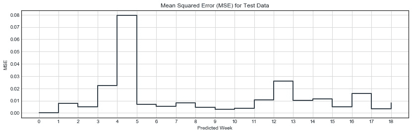

图 4：测试集每周的 MSE；注意，在第 5 周，模型预测的结果比其他任何一周都要差。

我们模型的 MSE 结果表明，大多数周我们的模型表现良好，除了第 5 周，其 MSE 值上升至约`0.08`。除了第 5 周，我们的模型似乎在几乎所有其他测试周的表现都很好。

# 过拟合

我们的第一个训练过的网络（`bitcoin_lstm_v0`）可能正遭受一种叫做过拟合的现象。过拟合是指模型在训练时优化验证集，但这样做牺牲了从我们感兴趣的现象中提取更具普适性的模式。过拟合的主要问题是，模型学会了如何预测验证集数据，但无法预测新的数据。

我们模型中使用的损失函数在训练结束时达到了非常低的水平（约为 2.9 * 10^-6）。不仅如此，这个过程发生得很早：用于预测数据中最后一周的 MSE 损失函数在大约第 30 个训练周期时降低到了一个稳定的水平。这意味着我们的模型几乎完美地预测了第 77 周的数据，使用了前 76 周的数据。难道这可能是过拟合的结果吗？

我们再看一下*图 4*。我们知道我们的 LSTM 模型在验证集上达到了极低的值（约为 2.9 * 10^-6），但它在测试集上也达到了较低的值。然而，关键的区别在于尺度。我们测试集中每一周的 MSE 大约比验证集高出 4,000 倍（平均而言）。这意味着模型在我们的测试数据上的表现比在验证集上要差得多。这一点值得关注。

然而，尺度掩盖了我们 LSTM 模型的能力：即使在测试集上的表现要差得多，预测的 MSE 误差仍然非常非常低。这表明我们的模型可能正在从数据中学习到模式。

# 模型预测

一方面是通过比较 MSE 误差来衡量我们的模型，另一方面是能够直观地解释其结果。

使用相同的模型，接下来我们将使用 76 周的数据作为输入，为接下来的几周生成一系列预测。我们通过将 76 周的滑动窗口应用到完整的数据序列上（即训练集加测试集），并为每个窗口做出预测来实现。预测是通过 Keras 的`model.predict()`方法完成的：

```py
    combined_set = np.concatenate((train_data, test_data), axis=1)

        predicted_weeks = []
        for i in range(0, validation_data.shape[1] + 1):
        input_series = combined_set[0:,i:i+76]
        predicted_weeks.append(B.predict(input_series))
```

*代码片段 5*：使用`model.predict()`方法为测试数据集中的所有周做出预测的代码片段

在前面的代码中，我们使用`model.predict()`进行预测，然后将这些预测存储在`predicted_weeks`变量中。接着我们绘制了结果预测图，得到了以下图形：

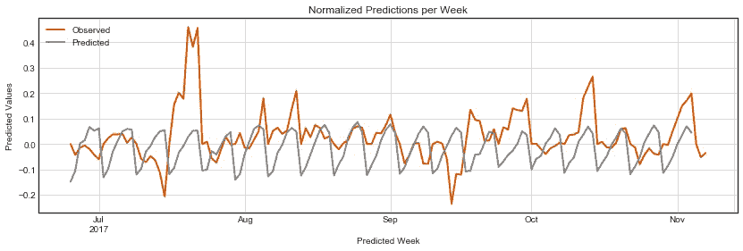

*图 5*：测试集中每一周的 MSE。请注意，在第 5 周，模型的预测比其他任何一周都要差。

我们模型的结果（如*图 5*所示）表明，它的表现并没有那么糟糕。通过观察预测线的模式，可以发现网络已经识别出一个每周波动的模式，其中标准化的价格在周中会上升，然后在周末下降。除了几个星期——最显著的是第 5 周，与我们之前的 MSE 分析相同——大多数周的数据都接近正确值。

现在让我们去归一化预测结果，以便使用与原始数据相同的尺度（即美元）来调查预测值。我们可以通过实现一个去归一化函数来做到这一点，该函数利用预测数据中的日期索引来识别测试数据中相应的一周。确定该周后，函数会取该周的第一个值，并使用该值通过倒置的点相对归一化技术去归一化预测值：

```py
    def denormalize(reference, series,

    normalized_variable='close_point_relative_normalization',
    denormalized_variable='close'):
    week_values = observed[reference['iso_week']==series['iso_week'].
    values[0]]
    last_value = week_values[denormalized_variable].values[0]
    series[denormalized_variable] = 
    last_value*(series[normalized_variable]+1)

    return series

    predicted_close = predicted.groupby('iso_week').apply
    (lambda x: denormalize(observed, x))
```

*代码片段 6*：使用倒置的点相对归一化技术对数据进行去归一化处理。`denormalize()`函数取自测试集第一天的第一个收盘价，作为与之对应的那一周的数据。

我们的结果现在通过美元与测试集进行对比。如图 5 所示，`bitcoin_lstm_v0` 模型在预测未来七天比特币价格方面表现得相当不错。但是，我们如何用易于理解的方式来衡量这个表现呢？

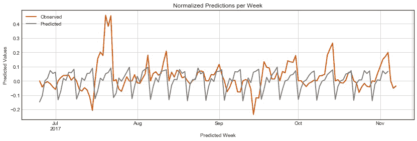

图 6：测试集中每周的均方误差（MSE）；注意到在第 5 周，模型预测的结果比其他任何一周都要差。

# 解释预测

我们的最后一步是为我们的预测增加可解释性。图 6 显示我们的模型预测与测试数据相对接近，但到底有多接近呢？

Keras 的 `model.evaluate()` 函数对于理解模型在每次评估步骤中的表现非常有用。然而，鉴于我们通常使用归一化数据集来训练神经网络，`model.evaluate()` 方法生成的指标也很难解释。

为了解决这个问题，我们可以收集模型的完整预测集，并使用 *表 1* 中的另外两个更容易解释的函数将其与测试集进行比较：分别是 `mape()` 和 `rmse()`，它们分别表示 MAPE 和 RMSE：

```py
    def mape(A, B):
    return np.mean(np.abs((A - B) / A)) * 100

    def rmse(A, B):
    return np.sqrt(np.square(np.subtract(A, B)).mean())

```

*代码片段 7*：`mape()` 和 `rmse()` 函数的实现

这些函数是使用 `NumPy` 实现的。原始实现来自 [`stats.stackexchange.com/questions/58391/mean-absolute-percentage-error-mape-in-scikit-learn`](https://stats.stackexchange.com/questions/58391/mean-absolute-percentage-error-mape-in-scikit-learn)（MAPE）和 [`stackoverflow.com/questions/16774849/mean-squared-error-in-numpy`](https://stackoverflow.com/questions/16774849/mean-squared-error-in-numpy)（RMSE）。

在使用这两个函数将我们的测试集与预测结果进行比较后，我们得到了以下结果：

+   去归一化后的 RMSE：$399.6

+   去归一化后的 MAPE：8.4%

这意味着我们的预测与真实数据的差异平均约为 $399。这相当于与实际比特币价格的差异大约为 8.4%。

这些结果有助于理解我们的预测。我们将继续使用`model.evaluate()`方法来跟踪我们的 LSTM 模型如何改进，同时也会计算每个版本模型在完整系列上的`rmse()`和`mape()`，以解释我们在预测比特币价格时的准确度。

# 活动：创建一个主动的训练环境

在此活动中，我们为神经网络创建了一个训练环境，促进其训练和评估。这个环境对于下一章尤为重要，在那一章中，我们将寻找最佳的超参数组合。

首先，我们将启动一个 Jupyter Notebook 实例和一个 TensorBoard 实例。接下来的活动中，这两个实例可以保持打开状态。

1.  使用终端，导航到目录`chapter_6/activity_6`，并执行以下代码以启动 Jupyter Notebook 实例：

```py
      $ jupyter notebook
```

1.  在浏览器中打开应用程序提供的 URL，并打开名为`Activity_6_Creating_an_active_training_environment.ipynb`的 Jupyter Notebook：

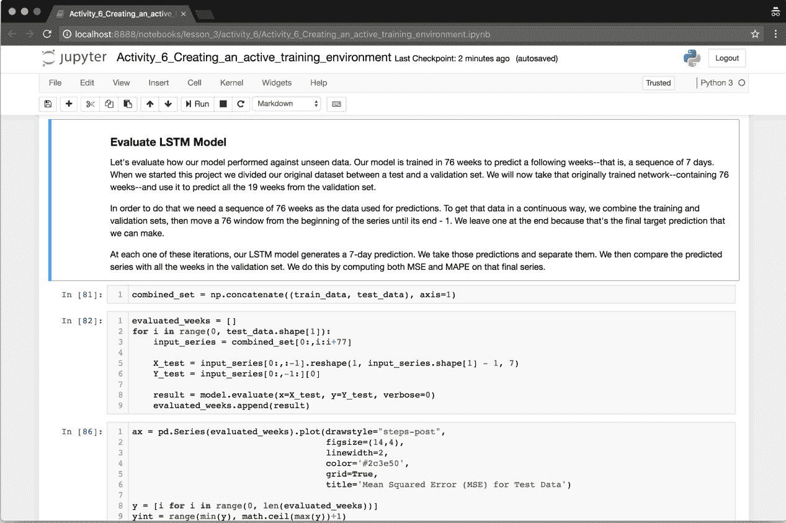

图 7：Jupyter Notebook 中高亮显示的“评估 LSTM 模型”部分

1.  同时，使用终端启动一个 TensorBoard 实例，执行以下命令：

```py
      $ cd ./chapter_3/activity_6/
      $ tensorboard --logdir=logs/
```

1.  打开屏幕上出现的 URL，并保持该浏览器标签页打开。

1.  现在，将训练集（`train_dataset.csv`）和测试集（`test_dataset.csv`）以及我们之前编译的模型（`bitcoin_lstm_v0.h5`）加载到 Notebook 中。

1.  使用以下命令将训练集和测试集加载到 Jupyter Notebook 实例中：

```py
      $ train = pd.read_csv('data/train_dataset.csv')
      $ test = pd.read_csv('data/test_dataset.csv') 
```

1.  此外，使用以下命令加载我们之前编译的模型：

```py
      $ model = load_model('bitcoin_lstm_v0.h5')
```

现在，让我们评估模型在测试数据上的表现。我们的模型使用 76 周的数据来预测未来一周的情况，即接下来的七天。当我们构建第一个模型时，我们将原始数据集分为训练集和测试集。现在，我们将合并这两个数据集（我们称之为合并集），并滑动一个 76 周的窗口。在每个窗口中，我们执行 Keras 的`model.evaluate()`方法，评估网络在该特定周的表现。

1.  执行“评估 LSTM 模型”标题下的单元格。这些单元格的关键概念是对测试集中的每一周调用`model.evaluate()`方法。以下这一行是最重要的：

```py
       $ result = model.evaluate(x=X_test, y=Y_test, verbose=0) 
```

1.  每个评估结果现在存储在变量`evaluated_weeks`中。这个变量是一个简单的数组，包含测试集中每一周的 MSE 预测结果。现在可以继续绘制这些结果：


如我们在章节中讨论的那样，MSE 损失函数很难解释。为了便于理解模型的表现，我们还会对测试集中的每一周调用`model.predict()`方法，并将其预测结果与实际值进行比较。

1.  导航到**解释模型**结果部分并执行**做出预测**子标题下的代码单元格。请注意，我们正在调用`model.predict()`方法，但使用的是稍有不同的参数组合。我们只使用`X`，而不是同时使用`X`和`Y`值：

```py
      predicted_weeks = []
      for i in range(0, test_data.shape[1]):
      input_series = combined_set[0:,i:i+76]
      predicted_weeks.append(model.predict(input_series)) 
```

在每个窗口，我们将对下一周进行预测并存储结果。我们现在可以将归一化结果与测试集中的归一化值进行比较，如下图所示：


图 9：绘制从*model.predict()*返回的每周归一化值

我们也将进行相同的比较，但使用去归一化后的值。为了去归一化我们的数据，我们首先需要识别测试集和预测结果之间的等效周。然后，我们取该周的第一个价格值，并用它来反转第*5 章*中的基于点的归一化方程，*模型架构*。

1.  导航到标题“去归一化预测”并执行该标题下的所有单元格。

1.  在这一部分，我们定义了`denormalize()`函数，它执行完整的去归一化过程。与其他函数不同，这个函数接受的是一个 Pandas DataFrame，而不是 NumPy 数组。我们这样做是为了使用日期作为索引。这是该部分标题下最相关的代码块：

```py
      predicted_close = predicted.groupby('iso_week').apply(
         lambda x: denormalize(observed, x))
```

我们的去归一化结果（如以下图所示）显示，我们的模型做出的预测与实际比特币价格非常接近。但到底有多接近呢？

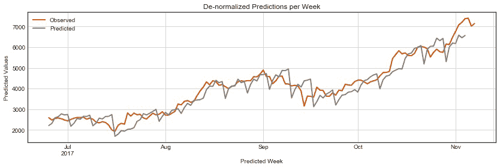

图 10：绘制从`model.predict()`返回的每周去归一化值

LSTM 网络使用均方误差（MSE）值作为其损失函数。然而，正如在章节中讨论的，MSE 值难以解释。为了解决这个问题，我们实现了两个函数（从`script utilities.py`中加载），它们分别实现了 RMSE 和 MAPE 函数。这些函数通过返回与我们原始数据使用相同量纲的度量，并通过将量纲差异作为百分比进行比较，从而为我们的模型增加了解释性。

1.  导航到“去归一化预测”标题并从`utilities.py`脚本中加载两个函数：

```py
      from scripts.utilities import rmse, mape 
```

脚本中的函数实际上非常简单：

```py
      def mape(A, B):
      return np.mean(np.abs((A - B) / A)) * 100

      def rmse(A, B):
      return np.sqrt(np.square(np.subtract(A, B)).mean())
```

每个函数都是通过 NumPy 的向量化操作来实现的。它们在相同长度的向量上运行良好。它们被设计用于应用于完整的结果集。

使用`mape()`函数，我们现在可以理解，我们的模型预测结果与测试集的价格相差大约 8.4%。这相当于根均方误差（使用`rmse()`函数计算）大约为 399.6 美元。

在进入下一节之前，回到 Notebook 中找到标题为**使用 TensorBoard 重新训练模型**的部分。你可能已经注意到我们创建了一个名为`train_model()`的辅助函数。这个函数是我们模型的封装器，它训练（`using model.fit()`）我们的模型，并将其结果存储在一个新的目录下。TensorBoard 随后将这些结果作为判别器，显示不同模型的统计数据。

1.  请修改传递给`model.fit()`函数的一些参数值（例如试试 epochs）。现在，运行从磁盘加载模型到内存的单元（这将替换你训练过的模型）：

```py
      model = load_model('bitcoin_lstm_v0.h5') 
```

1.  现在，再次运行`train_model()`函数，但使用不同的参数，表示一个新的运行版本：

```py
      train_model(X=X_train, Y=Y_validate, version=0, run_number=0)
```

在本节中，我们学习了如何使用损失函数评估网络。我们了解到，损失函数是神经网络的关键元素，它们评估网络在每个 epoch 的表现，并且是将调整回传到层和节点的起点。我们还探讨了为什么一些损失函数可能难以解释（例如 MSE），并通过使用另外两个函数——RMSE 和 MAPE——来解释我们 LSTM 模型的预测结果。

最重要的是，本章以一个主动训练环境作为结尾。我们现在拥有一个能够持续训练深度学习模型并评估其结果的系统。这将在我们下一节优化网络时发挥关键作用。

# 超参数优化

我们已经训练了一个神经网络，利用前 76 周的比特币价格预测接下来七天的比特币价格。平均来说，这个模型给出的预测值与实际比特币价格之间的误差约为 8.4%。

本节描述了提高神经网络模型性能的常见策略：

+   添加或移除层并更改节点数量

+   增加或减少训练的 epoch 次数

+   尝试不同的激活函数

+   使用不同的正则化策略

我们将使用到目前为止在*模型评估*部分开发的相同主动学习环境来评估每个修改，衡量这些策略如何帮助我们开发出更精确的模型。

# 层和节点 - 添加更多层

单隐层神经网络在许多问题上可以表现得相当好。我们的第一个比特币模型（`bitcoin_lstm_v0`）就是一个很好的例子：它使用单个 LSTM 层，能够预测接下来七天的比特币价格（来自测试集），误差率约为 8.4%。然而，并不是所有问题都能用单层模型建模。

你要预测的函数越复杂，你需要添加更多层的可能性就越高。判断是否应该添加新层的一个好直觉是了解它们在神经网络中的作用。

每一层都会创建输入数据的模型表示。链条中的早期层创建较低级别的表示，而后期层则创建更高级别的表示。

虽然这个描述可能难以转化为现实世界的问题，但它的实际直觉很简单：在处理具有不同表示级别的复杂函数时，你可能想要尝试添加层。

# 添加更多节点

层所需的神经元数量与输入和输出数据的结构有关。

例如，如果你正在将一张 4 x 4 像素的图像分类到两个类别中的一个，你可以从一个具有 12 个神经元的隐藏层开始（每个神经元对应一个像素），然后再加一个只有两个神经元的输出层（每个神经元对应一个预测类别）。

在添加新层时，通常会添加新的神经元。然后，可以添加一个层，该层的神经元数量与前一层相同，或者是前一层神经元数量的倍数。例如，如果你的第一个隐藏层有 12 个神经元，你可以尝试添加一个第二层，它的神经元数量可以是 12、6 或 24。

添加层和神经元可能会导致性能的显著限制。可以随意尝试添加层和节点。通常的做法是从较小的网络开始（即网络中有少量的层和神经元），然后根据其性能的提升逐渐增长。

如果上面的内容听起来不够精确，你的直觉是对的。引用 YouTube 前视频分类负责人 Aurélien Géron 的话，*找到合适数量的神经元仍然有些像黑魔法*。

《动手学机器学习》 by Aurelién Géron，O'Reilly 出版，2017 年 3 月。

最后，提醒一句：你添加的层越多，你需要调整的超参数也就越多——并且训练网络所需的时间也会更长。如果你的模型表现不错，并且没有对数据过拟合，可以在添加新层之前，先尝试本章中提到的其他策略。

# 层和节点 - 实现

我们将通过添加更多层来修改我们原来的 LSTM 模型。在 LSTM 模型中，通常会按顺序添加 LSTM 层，在 LSTM 层之间建立链条。在我们的案例中，新的 LSTM 层具有与原始层相同的神经元数量，因此我们不需要配置该参数。

我们将修改后的模型命名为`bitcoin_lstm_v1`。将每个尝试不同超参数配置的模型命名为不同的名称是一个好习惯。这有助于你跟踪每种不同架构的表现，并在 TensorBoard 中轻松比较模型之间的差异。我们将在本章末尾比较所有不同的修改过的架构。

在添加新的 LSTM 层之前，我们需要将第一个 LSTM 层的 `return_sequences` 参数修改为 True。这样做是因为第一个层期望的数据输入是一个序列，这与第一个层的数据输入格式相同。当这个参数设置为 `False` 时，LSTM 层会输出不兼容的预测参数。

考虑以下代码示例：

```py
    period_length = 7
    number_of_periods = 76
    batch_size = 1

    model = Sequential()
    model.add(LSTM(
        units=period_length,
        batch_input_shape=(batch_size, number_of_periods, period_length),
        input_shape=(number_of_periods, period_length),
        return_sequences=True, stateful=False))

    model.add(LSTM(
        units=period_length,
        batch_input_shape=(batch_size, number_of_periods, period_length),
        input_shape=(number_of_periods, period_length),
        return_sequences=False, stateful=False))

    model.add(Dense(units=period_length))
    model.add(Activation("linear"))

    model.compile(loss="mse", optimizer="rmsprop") 
```

*代码片段 8*：向原始 `bitcoin_lstm_v0` 模型添加第二个 LSTM 层，使其变为 `bitcoin_lstm_v1`。

# 轮次

轮次是网络在响应数据传递和损失函数时调整权重的次数。运行更多轮次的模型可以让它从数据中学习更多，但也会面临过拟合的风险。

在训练模型时，建议以指数方式增加轮次，直到损失函数开始趋于平稳。对于 `bitcoin_lstm_v0` 模型，其损失函数大约在 100 个轮次时趋于平稳。

我们的 LSTM 模型使用的数据量较小，因此增加训练轮次对性能几乎没有显著影响。例如，如果尝试在 103 个轮次下训练该模型，模型几乎没有任何改进。但如果训练的模型使用的是大量数据，情况则会有所不同。在这种情况下，大量的轮次对模型的良好性能至关重要。

我建议你使用以下关联：用于训练模型的数据量越大，所需的轮次就越多，以实现良好的性能。

# 轮次 - 实现

我们的比特币数据集相对较小，因此增加模型训练的轮次可能对性能的提升影响不大。为了让模型训练更多轮次，只需在 `model.fit()` 中更改轮次参数：

```py
    number_of_epochs = 10**3
    model.fit(x=X, y=Y, batch_size=1,
        epochs=number_of_epochs,
        verbose=0,
    callbacks=[tensorboard]) 
```

*代码片段 9*：改变我们模型训练的轮次，使其变为`bitcoin_lstm_v2`。

这个更改将我们的模型升级到了 v2，实际上使其变为 `bitcoin_lstm_v2`。

# 激活函数

激活函数评估了需要激活每个神经元的程度。它们决定了每个神经元将传递给网络下一个元素的值，使用来自前一层的输入和损失函数的结果——或者决定神经元是否应当传递任何值。

激活函数是神经网络研究领域的一个重要话题。如果你想了解当前关于此主题的研究概况，以及对激活函数工作原理的更详细回顾，请参考 Ian Goodfellow 等人撰写的《Deep Learning》，MIT 出版社，2017 年。

TensorFlow 和 Keras 提供了许多激活函数——并且偶尔会新增一些。作为介绍，有三个函数非常重要，值得我们关注；我们将逐一探索它们。

本节内容深受 Avinash Sharma V 的文章 *理解神经网络中的激活函数* 启发，文章链接为：[`medium.com/the-theory-of-everything/understanding-activation-functions-in-neural-networks-9491262884e0`](https://medium.com/the-theory-of-everything/understanding-activation-functions-in-neural-networks-9491262884e0)。

# 线性（恒等函数）

线性函数仅根据常数值激活神经元，其定义如下：

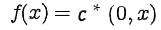

当 c = 1 时，神经元将按原样传递值，而不受激活函数的修改。使用线性函数的问题在于，由于神经元是线性激活的，链式层次现在作为一个大的单一层来工作。换句话说，失去了构建具有多层的网络的能力，其中一层的输出影响另一层：

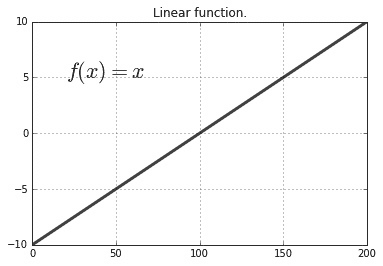

图 11：线性函数示意图

线性函数的使用通常被认为在大多数网络中已经过时。

# 双曲正切（Tanh）

Tanh 是一个非线性函数，其公式如下：

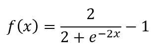

这意味着它们对节点的影响是持续评估的。而且，由于其非线性特性，可以使用此函数改变一层如何影响链中下一层。当使用非线性函数时，各层以不同方式激活神经元，从数据中学习不同的表示变得更容易。然而，它们具有类似 Sigmoid 的模式，会反复惩罚极端的节点值，造成一种称为“梯度消失”的问题。梯度消失对网络学习能力产生负面影响：

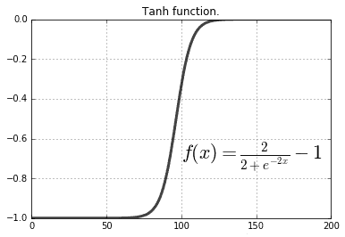

图 12：`tanh` 函数示意图

Tanhs 是常用的选择，但由于其计算开销较大，通常会使用 ReLU 作为替代。

# 修正线性单元

ReLU 具有非线性特性，其定义如下：

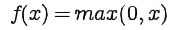

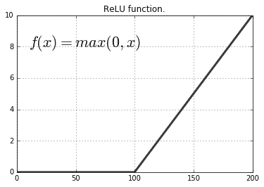

图 13：ReLU 函数示意图

ReLU 函数通常被推荐作为在尝试其他函数之前的一个很好的起点。ReLU 倾向于惩罚负值。因此，如果输入数据（例如，归一化至 -1 到 1 之间）包含负值，这些值将会受到 ReLU 的惩罚。这可能不是预期的行为。

我们在网络中将不会使用 ReLU 函数，因为我们的归一化过程会生成许多负值，从而导致学习模型的速度大大减慢。

# 激活函数 - 实现

在 Keras 中实现激活函数的最简单方法是实例化`Activation()`类，并将其添加到`Sequential()`模型中。`Activation()`可以使用 Keras 中提供的任何激活函数进行实例化（完整列表请见[`keras.io/activations/`](https://keras.io/activations/)）。在我们的例子中，我们将使用`tanh`函数。

在实现激活函数后，我们将模型的版本提升为`v2`，使其成为`bitcoin_lstm_v3`：

```py
    model = Sequential()

    model.add(LSTM(
        units=period_length,
        batch_input_shape=(batch_size, number_of_periods, period_length),
        input_shape=(number_of_periods, period_length),
        return_sequences=True, stateful=False))

    model.add(LSTM(
        units=period_length,
        batch_input_shape=(batch_size, number_of_periods, period_length),
        input_shape=(number_of_periods, period_length),
        return_sequences=False, stateful=False))

    model.add(Dense(units=period_length))
    model.add(Activation("tanh"))

    model.compile(loss="mse", optimizer="rmsprop") 
```

*代码片段 10*：将激活函数`tanh`添加到`bitcoin_lstm_v2`模型中，更新为`bitcoin_lstm_v3`

还有许多其他值得尝试的激活函数。TensorFlow 和 Keras 都在各自的官方文档中提供了已实现的函数列表。在实现自己的激活函数之前，最好先从 TensorFlow 和 Keras 中已经实现的函数开始。

# 正则化策略

神经网络尤其容易出现过拟合。过拟合发生在网络学习了训练数据的模式，但无法找到可以应用于测试数据的可泛化模式。

正则化策略是指通过调整网络学习的方式来处理过拟合问题的技术。在本书中，我们讨论了两种常见的策略：L2 正则化和 Dropout。

# L2 正则化

L2 正则化（或称权重衰减）是一种常见的解决过拟合模型的技术。在一些模型中，某些参数的变化幅度较大。L2 正则化会对这些参数进行惩罚，从而减少这些参数对网络的影响。

L2 正则化使用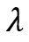参数来决定惩罚模型神经元的程度。通常将该值设置为非常小的数值（即`0.0001`）；否则，可能会完全消除某个神经元的输入。

# Dropout（丢弃法）

Dropout 是一种基于简单问题的正则化技术：如果从层中随机移除一部分节点，剩下的节点会如何适应？事实证明，剩余的神经元会适应，学习表示那些之前由缺失神经元处理的模式。

Dropout 策略实现起来简单，通常在避免过拟合方面非常有效。这将是我们首选的正则化策略。

# 正则化策略 – 实现

为了使用 Keras 实现 Dropout 策略，我们导入`Dropout()`类，并将其添加到每个 LSTM 层之后的网络中。

这一添加有效地将我们的网络变为`bitcoin_lstm_v4`：

```py
    model = Sequential()
    model.add(LSTM(
        units=period_length,
        batch_input_shape=(batch_size, number_of_periods, period_length),
        input_shape=(number_of_periods, period_length),
        return_sequences=True, stateful=False))

    model.add(Dropout(0.2))
    model.add(LSTM(
        units=period_length,
        batch_input_shape=(batch_size, number_of_periods, period_length),
        input_shape=(number_of_periods, period_length),
        return_sequences=False, stateful=False))

    model.add(Dropout(0.2))

    model.add(Dense(units=period_length))
    model.add(Activation("tanh"))

    model.compile(loss="mse", optimizer="rmsprop") 
```

*代码片段 11*：在此代码片段中，我们将`Dropout()`步骤添加到我们的模型（`bitcoin_lstm_v3`）中，更新为`bitcoin_lstm_v4`

也可以使用 L2 正则化代替 Dropout。为此，只需实例化`ActivityRegularization()`类，并将 L2 参数设置为较小的值（例如`0.0001`）。然后，将其放置在网络中添加 Dropout()类的位置。可以通过将其添加到网络中，同时保留两个`Dropout()`步骤，或简单地将所有`Dropout()`实例替换为`ActivityRegularization()`来进行实验。

# 优化结果

总的来说，我们已经创建了四个版本的模型。这些版本中的三个是通过应用本章所述的不同优化技术创建的。

在创建了所有这些版本后，我们现在需要评估哪个模型表现最好。为此，我们使用与第一个模型相同的指标：MSE、RMSE 和 MAPE。MSE 用于比较模型在每一周预测中的误差率，RMSE 和 MAPE 用于使模型结果更易于解释。

| **模型**  | **MSE（最后一轮）**  | **RMSE（整个序列）**  | **MAPE（整个序列）**  | **训练时间**  |
| --- | --- | --- | --- | --- |
| bitcoin_lstm_v0  | **-** |  399.6  |  8.4%  | ** -** |
| bitcoin_lstm_v1  |  7.15*10^(-6)  |  419.3  |  8.8%  | 49.3 秒  |
| bitcoin_lstm_v2  |  3.55*10^(-6)  |  425.4  |  9.0%  | 1 分 13 秒  |
| bitcoin_lstm_v3  |  2.8*10^(-4)  |  423.9  |  8.8%  | 1 分 19 秒  |
| bitcoin_lstm_v4  |  4.8*10^(-7)  |  442.4  |  8.8%  | 1 分 20 秒  |

表 2：所有模型的结果

有趣的是，我们的第一个模型（`bitcoin_lstm_v0`）在几乎所有的指标中表现最好。我们将使用该模型来构建我们的 Web 应用程序，并持续预测比特币价格。

# 活动：优化深度学习模型

在这个活动中，我们对第五章*模型架构*（`bitcoin_lstm_v0`）中创建的模型应用了不同的优化策略。该模型在完整的去归一化测试集上的 MAPE 性能约为 8.4%。我们将尝试减少这个差距。

1.  使用终端，通过执行以下命令启动 TensorBoard 实例：

```py
      $ cd ./chapter_3/activity_7/
      $ tensorboard --logdir=logs/ 
```

1.  打开屏幕上出现的 URL，并保持该浏览器标签页打开。同时，启动一个 Jupyter Notebook 实例：

```py
       $ jupyter notebook
```

打开出现在另一个浏览器窗口中的 URL。

1.  现在，打开名为`Activity_7_Optimizing_a_deep_learning_model.ipynb`的 Jupyter Notebook，导航到 Notebook 的标题并导入所有所需的库。我们将像之前的活动一样加载训练和测试数据。我们还将使用实用函数`split_lstm_input()`将其分割为训练组和测试组。

在 Notebook 的每个部分，我们都会在模型中实现新的优化技术。每次我们这样做时，都会训练一个全新的模型，并将其训练后的实例存储在一个描述模型版本的变量中。例如，我们的第一个模型`bitcoin_lstm_v0`在 Notebook 中被称为`model_v0`。在 Notebook 的最后，我们使用 MSE、RMSE 和 MAPE 评估所有模型。

1.  现在，在打开的 Jupyter Notebook 中，导航到**Adding Layers**（添加层）和**Nodes**（节点）部分。你将在下一个单元格中看到我们第一个模型。这是我们在**第五章** *模型架构* 中构建的基础 LSTM 网络。现在，我们需要向这个网络添加一个新的 LSTM 层。

利用本章的知识，继续添加一个新的 LSTM 层，编译并训练模型。在训练模型时，请记得经常访问正在运行的 TensorBoard 实例。

你将能够看到每个模型的运行并比较它们的损失函数结果：

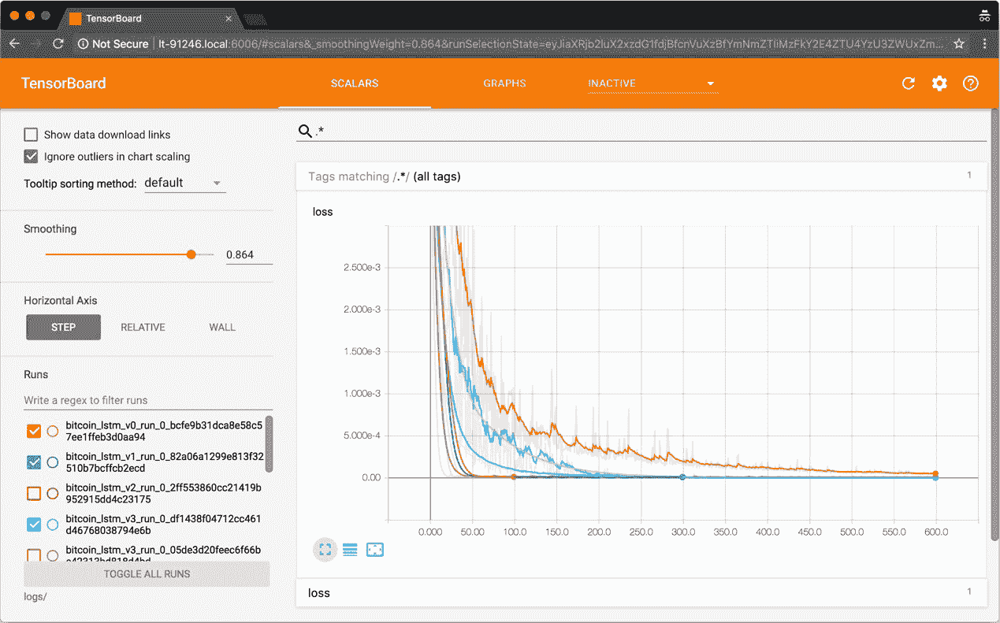

图 14：运行 TensorBoard 实例，显示多个不同的模型运行。TensorBoard 实际上是一个非常

有助于实时跟踪模型训练进展。

1.  现在，导航到**Epochs**（训练轮次）部分。在这一部分，我们将探索不同规模的**epochs**。使用工具函数`train_model()`来命名不同的模型版本和运行：

```py
      train_model(model=model_v0, X=X_train, Y=Y_validate, epochs=100,
      version=0, run_number=0) 
```

使用不同的 epoch 参数训练模型。

目前，你需要确保模型不会过拟合训练数据。你希望避免这种情况，因为如果模型过拟合，它将无法预测训练数据中表现出的模式，而这些模式在测试数据中可能会有不同的表现形式。

在你完成对 epoch 的实验后，继续进行下一个优化技术：激活函数。

1.  现在，导航到 Notebook 中的**Activation Functions**（激活函数）部分。在这一部分，你只需要更改以下变量：

```py
      activation_function = "tanh" 
```

本节中我们使用了`tanh`函数，但你可以尝试其他激活函数。查看[`keras.io/activations/`](https://keras.io/activations/)中列出的激活函数，并尝试其他可能的选项。

我们的最终选择是尝试不同的正则化策略。这通常更为复杂，可能需要多次迭代才能看到任何改进——特别是在数据量如此之少的情况下。此外，添加正则化策略通常会增加网络的训练时间。

1.  现在，导航到 Notebook 中的**Regularization Strategies**（正则化策略）部分。在这一部分，你需要实现`Dropout()`正则化策略。找到合适的位置将此步骤加入，并在我们的模型中实现。

1.  你还可以尝试 L2 正则化（或者两者结合使用）。和`Dropout()`一样，使用`ActivityRegularization`（`l2=0.0001`）进行操作。

1.  现在，导航到笔记本中的**评估模型**部分。在这一部分，我们将评估模型对测试集未来 19 周数据的预测。然后，我们将计算预测系列与测试系列之间的 RMSE 和 MAPE。

我们已经实现了与第 6 个活动相同的评估技术，所有功能都封装在实用函数中。只需运行本节的所有单元格直到笔记本结束，即可查看结果。

抓住这个机会调整前面提到的优化技术的值，尝试超越该模型的性能。

# 总结

在这一章节中，我们学习了如何使用均方误差（MSE）、均方根误差（RMSE）和平均绝对百分比误差（MAPE）来评估我们的模型。我们在由我们的第一个神经网络模型进行的 19 周预测系列中计算了后两个指标。然后，我们了解到该模型表现良好。

我们还学习了如何优化模型。我们查看了通常用于提高神经网络性能的优化技术。此外，我们实现了其中的一些技术，并创建了几个不同的模型来预测比特币价格，具有不同的误差率。

在下一章节中，我们将把我们的模型转化为一个 Web 应用，完成两件事：定期使用新数据重新训练我们的模型，并能够通过 HTTP API 接口进行预测。
