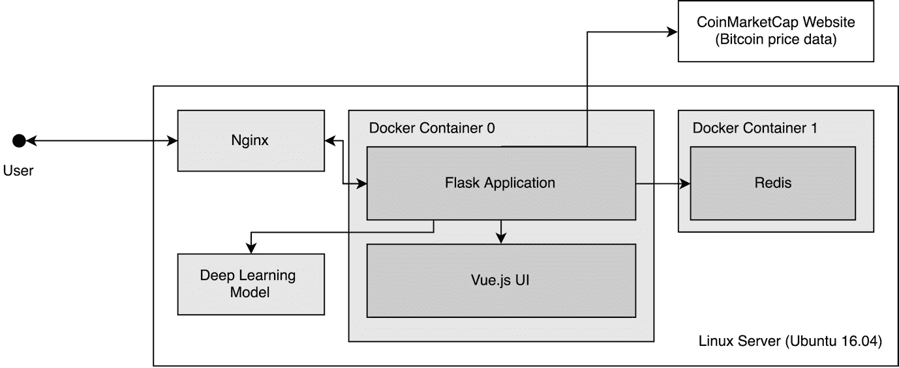
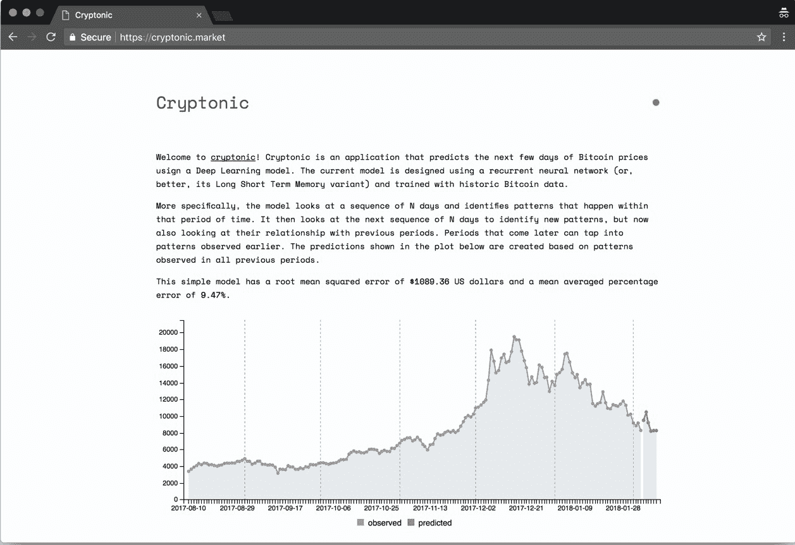

# 第七章：产品化

本章重点讨论如何将深度学习模型进行*产品化*。我们使用“*产品化*”一词来定义将深度学习模型转化为软件产品的过程，使其能够被其他人和应用程序使用。

我们关注的是能够在新数据可用时使用它的模型，持续从新数据中学习模式，并因此做出更好的预测。我们研究了处理新数据的两种策略：一种是重新训练现有模型，另一种是创建一个完全新的模型。然后，我们将在比特币价格预测模型中实现后一种策略，以使其能够持续预测新的比特币价格。

本章还提供了如何将模型部署为 Web 应用程序的练习。到本章结束时，我们将能够部署一个有效的 Web 应用程序（具有功能齐全的 HTTP API）并根据需要进行修改。

我们以 Web 应用程序为例，来展示如何部署深度学习模型，因为它简单且普遍（毕竟，Web 应用程序非常常见），但也有许多其他的可能性。

到本章结束时，你将能够：

+   处理新数据

+   将模型部署为 Web 应用程序

# 处理新数据

模型可以在一组数据上进行训练，然后用来做预测。这些静态模型非常有用，但通常我们希望模型能够从新数据中持续学习——并随着学习的进行不断改进。

在本节中，我们将讨论如何重新训练深度学习模型的两种策略，并在 Python 中实现它们。

# 数据与模型的分离

在构建深度学习应用时，最重要的两个领域是数据和模型。从架构角度来看，我们建议将这两个领域分开。我们认为这是一个好的建议，因为这两个领域各自包含的功能本质上是相互独立的。数据通常需要收集、清洗、组织和规范化；而模型则需要训练、评估，并能够进行预测。这两个领域是相互依赖的，但分别处理会更好。

根据这一建议，我们将使用两个类来帮助我们构建 Web 应用程序：`CoinMarketCap()` 和 `Model()`：

+   `CoinMarketCap()` ：这是一个用于从以下网站获取比特币价格的类：[`www.coinmarketcap.com`](https://coinmarketcap.com/)。这也是我们最初比特币数据的来源。这个类使我们能够定期提取该数据，返回一个包含解析记录和所有可用历史数据的 Pandas DataFrame。`CoinMarketCap()` 是我们的数据组件。

+   `Model()` : 该类将我们迄今为止编写的所有代码整合成一个类。该类提供了与我们之前训练的模型进行交互的功能，并允许使用去标准化的数据进行预测——这使得理解更加容易。`Model()` 类是我们的模型组件。

这两个类在我们的示例应用中被广泛使用，定义了数据和模型组件。

# 数据组件

`CoinMarketCap()` 类创建了用于检索和解析数据的方法。它包含一个相关方法 `historic()`，其详细代码如下：

```py
    @classmethod
 def historic(cls, start='2013-04-28', stop=None,
 ticker='bitcoin', return_json=False):
    start = start.replace('-', '')
    if not stop:
        stop = datetime.now().strftime('%Y%m%d')
    base_url = 'https://coinmarketcap.com/currencies'
```

```py

    url = '/{}/historical-10\. data/?start={}&end={}'.format(ticker, start,
    stop)
    r = requests.get(url)
```

*代码片段 1*：`CoinMarketCap()` 类中的 `historic()` 方法。

该方法从 CoinMarketCap 网站收集数据，解析数据，并返回一个 Pandas DataFrame。

`historic()` 类返回一个 Pandas DataFrame，准备由 `Model()` 类使用。

在使用其他模型时，考虑创建一个程序组件（例如，Python 类），其功能与 `CoinMarketCap()` 类相同。也就是说，创建一个组件，能够从数据源获取数据，解析数据，并将其以可用格式提供给模型组件。

`CoinMarketCap()` 类使用参数 `ticker` 来确定收集哪种加密货币。CoinMarketCap 提供了许多其他加密货币，包括非常流行的以太坊（ethereum）和比特币现金（bitcoin-cash）。使用 `ticker` 参数可以更改加密货币，训练不同于本书中使用的比特币模型的模型。

# 模型组件

`Model()` 类是我们实现应用程序模型组件的地方。该类包含实现本书中所有不同建模主题的文件方法。这些方法包括：

+   `build()` : 使用 Keras 构建一个 LSTM 模型。该函数作为一个简单的包装器，封装了手动创建的模型。

+   `train()` : 使用类实例化时提供的数据训练模型。

+   `evaluate()` : 使用一组损失函数对模型进行评估。

+   `save()` : 将模型作为文件保存在本地。

+   `predict()` : 基于按周排序的观察输入序列进行预测并返回结果。

我们在本章中使用这些方法来处理、训练、评估并发出模型预测。`Model()` 类是如何将 Keras 的核心功能封装到 Web 应用中的示例。这些方法的实现几乎与前面章节中的实现完全相同，但增加了语法糖以增强它们的接口。

例如，`train()` 方法在以下代码中实现：

```py
 def train(self, data=None, epochs=300, verbose=0, batch_size=1):
        self.train_history = self.model.fit(
            x=self.X, y=self.Y,
            batch_size=batch_size, epochs=epochs,
            verbose=verbose, shuffle=False)
    self.last_trained = datetime.now().strftime('%Y-%m-%d %H:%M:%S')
    return self.train_history
```

*代码片段 2*：`Model()` 类中的 `train()` 方法。该方法使用来自 self.`X` 和 self.`Y` 的数据训练自 self.model 的模型。

在前面的代码片段中，您会注意到`train()`方法类似于来自*C*hapter 6*的*活动 6*和 7 的解决方案，*模型评估与优化*。其核心思想是，Keras 工作流中的每个过程（构建或设计、训练、评估和预测）都可以轻松地转化为程序的不同部分。在我们的案例中，我们将它们变成了可以从`Model()`类调用的方法。这有助于组织我们的程序，并提供一系列约束（例如模型架构或某些 API 参数），帮助我们在稳定的环境中部署模型。

在接下来的章节中，我们将探讨处理新数据的常见策略。

# 处理新数据

机器学习模型的核心思想——包括神经网络——是它们能够从数据中学习模式。假设一个模型已使用某个数据集进行训练，并且现在开始进行预测。现在，假设有新的数据可用。我们可以采用什么策略，使模型能够利用新数据来学习新的模式并改进其预测？

本节我们讨论两种策略：重新训练旧模型和训练新模型。

# 重新训练旧模型

使用这种策略，我们使用新数据重新训练现有模型。通过这种策略，可以不断调整模型参数，以适应新现象。然而，后期训练使用的数据可能与早期数据有显著不同。这些差异可能会导致模型参数发生重大变化，使其学习到新模式并遗忘旧模式。这一现象通常被称为*灾难性遗忘*。

灾难性遗忘是影响神经网络的常见现象。深度学习研究人员多年来一直在努力解决这个问题。DeepMind，谷歌旗下的英国深度学习研究小组，在寻找解决方案方面取得了显著进展。文章《克服神经网络中的灾难性遗忘》（*Overcoming Catastrophic Forgetting in Neural Networks*）是这类工作的一个良好参考。该论文可在以下链接获得：[`arxiv. org/pdf/1612.00796.pdf`](https://arxiv.org/pdf/1612.00796.pdf)。

用于首次训练的相同接口（`model.fit()`）可以用于用新数据进行训练：

```py
    X_train_new, Y_train_new = load_new_data()

    model.fit(x=X_train_new, y=Y_train_new,
    batch_size=1, epochs=100,
    verbose=0)
```

*代码片段 3*：在我们的 LSTM 模型中实现 TensorBoard 回调的代码片段

在 Keras 中，当模型进行训练时，其权重信息会被保留——这是模型的状态。当使用`model.save()`方法时，该状态也会被保存。当调用`model.fit()`方法时，模型会使用之前的状态作为起点，用新数据集重新训练。

在典型的 Keras 模型中，这种技术可以顺利使用。然而，在处理 LSTM 模型时，这种技术有一个关键的限制：训练数据和验证数据的形状必须相同。例如，我们的 LSTM 模型（`bitcoin_lstm_v0`）使用 76 周的数据来预测未来一周。如果我们在下一周尝试使用 77 周的数据重新训练网络，模型将抛出异常，提示数据形状不正确。

处理这个问题的一种方法是将数据安排为模型所期望的格式。在我们的例子中，我们需要配置模型，使用 40 周的数据来预测未来的一周。采用这个解决方案时，我们首先用 2017 年最初的 40 周数据训练模型，然后继续在接下来的几周中重新训练，直到达到第 50 周。

我们使用`Model()`类在以下代码中执行此操作：

```py
    M = Model(data=model_data[0*7:7*40 + 7],
        variable='close',
        predicted_period_size=7)
    M.build()
    6 M.train()
    for i in range(1, 10 + 1):
 M.train(model_data[i*7:7*(40 + i) + 7])
```

*Snippet 4*：实现重新训练技术的代码片段

这种技术训练速度较快，且通常适用于较大的数据序列。接下来的技术更易于实现，且在较小的数据序列中表现良好。

# 训练新模型

另一种策略是每次有新数据时创建并训练一个新模型。这种方法有助于减少灾难性遗忘，但随着数据量的增加，训练时间也会增加。其实现非常简单。

以比特币模型为例，假设我们拥有 2017 年 49 周的旧数据，并且在一周后，新的数据可用。我们用以下的`old_data`和`new_data`变量来表示这一点：

```py
    old_data = model_data[0*7:7*48 + 7]
    new_data = model_data[0*7:7*49 + 7]

    M = Model(data=old_data,
        variable='close',
        predicted_period_size=7)
    M.build()
    M.train()

 M = Model(data=new_data,
 variable='close',
 predicted_period_size=7)
 M.build()
 M.train()
```

*Snippet 5*：实现当新数据可用时训练新模型的策略的代码片段

这种方法非常简单实现，并且对于小数据集来说效果良好。这将是我们比特币价格预测应用程序的首选解决方案。

# 活动：处理新数据

在这个活动中，我们每次获得新数据时都会重新训练我们的模型。

首先，我们通过导入`cryptonic`开始。Cryptonic 是为本书开发的一个简单软件应用，它使用 Python 类和模块实现了直到这一部分的所有步骤。可以将 Cryptonic 看作是一个模板，展示了你如何开发类似的应用程序。

`cryptonic`作为一个 Python 模块随本活动一起提供。首先，我们将启动一个 Jupyter Notebook 实例，然后加载`cryptonic`包。

1.  使用你的终端，导航到目录*Chapter_7/activity_8*，然后执行以下代码以启动一个 Jupyter Notebook 实例：

```py
      $ jupyter notebook 
```

1.  在浏览器中打开应用程序提供的 URL，并打开名为`Activity_8_Re_training_a_model_dynamically.ipynb`的 Jupyter Notebook。

现在，我们将从`cryptonic: Model()`和`CoinMarketCap()`加载两个类。这些类有助于操作我们的模型，并且能够从网站 CoinMarketCap ([`coinmarketcap.com/`](https://coinmarketcap.com/)) 获取数据。

1.  在 Jupyter Notebook 实例中，导航到标题 **获取实时数据**。我们现在将从 `CoinMarketCap` 获取更新的历史数据。只需调用该方法：

```py
      $ historic_data = CoinMarketCap.historic() 
```

变量 `historic_data` 现在被填充为一个 Pandas DataFrame，包含直到今天或昨天的数据。这很棒，并且当更多数据可用时，这使得我们可以更容易地重新训练模型。

数据基本包含了我们早期数据集中的相同变量。然而，大部分数据来自较早的时期。近期的比特币价格相比几年前已经出现了较大的波动。在将这些数据用于模型之前，让我们确保只使用 2017 年 1 月 1 日之后的日期数据。

1.  使用 Pandas API，过滤仅包含 2017 年可用日期的数据：

```py
      $ model_data = # filter the dataset using pandas here 
```

你应该可以使用日期变量作为过滤索引来实现这一点。确保在继续之前过滤数据。

`Model()` 类将我们迄今为止在所有活动中编写的代码汇总起来。我们将使用这个类来构建、训练和评估我们的模型。

1.  使用 `Model()` 类，我们现在使用之前过滤过的数据来训练模型：

```py
      M = Model(data=model_data,
         variable='close',
         predicted_period_size=7)
      M.build()
      M.train()
      M.predict(denormalized=True) 
```

上述步骤展示了使用 `Model()` 类训练模型时的完整工作流程。

接下来，我们将专注于每次新数据可用时重新训练模型。这会根据新数据调整网络的权重。

为了做到这一点，我们已经配置了模型，通过使用 40 周数据来预测一周。现在我们希望使用剩余的 10 周完整数据，创建包含其中一个完整周的 40 周重叠周期，并为每个周期重新训练模型。

1.  在 Jupyter Notebook 中导航到标题 **重新训练旧模型**。现在，完成范围函数和 **model_data** 过滤参数，使用索引将数据拆分为重叠的七天组。然后，重新训练模型并收集结果：

```py
      results = []
      for i in range(A, B):
         M.train(model_data[C:D])
         results.append(M.evaluate()) 
```

变量 `A`、`B`、`C` 和 `D` 是占位符。使用整数创建重叠的七天组，其中重叠部分为一天。

重新训练模型后，请调用 `M.predict(denormalized=True)` 函数并欣赏结果。

接下来，我们将专注于每次新数据可用时创建并训练一个新模型。为此，我们假设我们已经拥有 2017 年 49 周的旧数据，并且一周后，我们将拥有新数据。我们用变量 `old_data` 和 `new_data` 来表示这一点。

1.  导航到标题 **训练新模型**，并将数据分割到变量 `old_data` 和 `new_data` 中：

```py
      old_data = model_data[0*7:7*48 + 7]
      new_data = model_data[0*7:7*49 + 7] 
```

1.  然后，首先使用 `old_data` 训练模型：

```py
      M = Model(data=old_data,
        variable='close',
        predicted_period_size=7)
      M.build()
      M.train()
```

这个策略是从零开始构建模型，并在有新数据时进行训练。请继续在接下来的单元格中实现这一点。

现在我们已经拥有训练模型所需的所有组件。在下一节中，我们将部署我们的模型为 Web 应用程序，通过 HTTP API 在浏览器中提供预测。

在本节中，我们学习了在新数据可用时训练模型的两种策略：

+   重新训练旧模型

+   训练新模型

后者创建一个新模型，该模型使用除测试集中的观察数据外的完整数据集进行训练。前者则在可用数据上训练一次模型，然后继续创建重叠的批次，每当有新数据可用时重新训练同一模型。

# 部署模型为 Web 应用程序

在本节中，我们将把我们的模型部署为 Web 应用程序。我们将使用一个名为 "`cryptonic`" 的示例 Web 应用程序来部署我们的模型，探索其架构，以便未来可以进行修改。目的是让您将这个应用程序作为更复杂应用程序的起点；它是一个完全可运行的起点，您可以根据需要进行扩展。

除了熟悉 Python，本主题假设您已了解创建 Web 应用程序。具体来说，我们假设您对 Web 服务器、路由、HTTP 协议和缓存有所了解。您将能够在没有深入了解这些主题的情况下，本地部署示范的 cryptonic 应用程序，但学习这些内容将使未来的开发变得更加容易。

最后，Docker 被用于部署我们的 Web 应用程序，因此掌握该技术的基础知识也很有用。

# 应用程序架构和技术

为了部署我们的 Web 应用程序，我们将使用表 1 中描述的工具和技术。Flask 是关键，因为它帮助我们为模型创建 HTTP 接口，使我们能够访问 HTTP 端点（例如 /`predict`）并以通用格式接收数据。其他组件则是开发 Web 应用程序时的流行选择：

| **工具或技术**  | **描述**  | **角色**  |
| --- | --- | --- |

| Docker  | Docker 是一种用于处理以容器形式打包的应用程序的技术

容器。Docker 是一种日益流行的

技术，用于构建 Web 应用程序。

| 打包 Python 应用程序和 UI。

|

| Flask  | Flask 是一个用于构建 Python Web 应用程序的微框架。

| 创建应用程序路由

|

| Vue.js  | 通过动态更改模板来工作的 JavaScript 框架

基于来自

后端。

| 渲染用户界面。 |
| --- |

| Nginx  | Web 服务器，易于配置，用于将流量路由到 Docker 化的应用程序并处理 SSL

用于 HTTPS 连接的证书。

| 路由流量在用户和 Flask 应用程序之间。 

|

| Redis  | 键值数据库。由于其

简洁性和速度。

| 缓存 API 请求。 |
| --- |

*表 1*：用于部署深度学习 Web 应用程序的工具和技术

这些组件组合在一起，如下图所示：



图 1：本项目中构建的 Web 应用程序的系统架构

用户通过浏览器访问 Web 应用程序。然后，`Nginx` 会将流量路由到包含 Flask 应用程序的 Docker 容器（默认情况下，运行在 5000 端口）。Flask 应用程序在启动时已经实例化了我们的比特币模型。如果给定了模型，它将使用该模型而不进行训练；如果没有，它将创建一个新模型并使用来自 CoinMarketCap 的数据从头开始训练。

在准备好模型后，应用程序会检查请求是否已缓存于 Redis 中——如果有，则返回缓存的数据。如果没有缓存，它将继续发出预测并在 UI 中渲染结果。

# 部署和使用 Cryptonic

`cryptonic` 被开发为一个 Docker 化应用程序。从 Docker 的角度来看，这意味着应用程序可以作为 Docker 镜像构建，然后在开发或生产环境中作为 Docker 容器部署。

Docker 使用名为 `Dockerfile` 的文件来描述如何构建镜像以及当镜像作为容器部署时会发生什么。Cryptonic 的 Dockerfile 可以在以下代码中找到：

```py
    FROM python:3.6
    COPY . /cryptonic
    WORKDIR "/cryptonic"
    RUN pip install -r requirements.txt
    EXPOSE 5000
    CMD ["python", "run.py"]

```

*片段 6*：cryptonic 镜像的 Docker 文件

可以使用以下命令通过 Docker 文件构建 Docker 镜像：

```py
     $ docker build --tag cryptonic:latest
```

*片段 7*：用于在本地构建 Docker 镜像的 Docker 命令

此命令将使镜像 `cryptonic:latest` 可用，并可以作为容器进行部署。构建过程可以在生产服务器上重复，或者直接部署镜像并作为容器运行。

在镜像构建并可用后，可以使用 docker run 命令来运行 cryptonic 应用程序，如以下代码所示：

```py
     $ docker run --publish 5000:5000 \ 
             --detach cryptonic:latest
```

*片段 8*：在终端中执行 docker run 命令的示例

`--publish` 标志将本地主机的 5000 端口绑定到 Docker 容器的 5000 端口，而 `--detach` 会将容器作为守护进程在后台运行。

如果您已经训练了一个不同的模型，并希望使用该模型而不是训练一个新模型，您可以在 docker-compose.yml 文件中修改 `MODEL_NAME` 环境变量，如 *片段 9* 所示。该变量应包含您训练并希望提供的模型的文件名（例如，`bitcoin_lstm_v1_trained.h5`）——它应该也是一个 Keras 模型。如果您这么做，确保将本地目录挂载到 /models 文件夹中。您决定挂载的目录必须包含您的模型文件。

`cryptonic` 应用程序还包括一些环境变量，您在部署自己的模型时可能会觉得很有用：

+   `MODEL_NAME`：允许提供一个训练好的模型，以供应用程序使用。

+   `BITCOIN_START_DATE`：确定用作比特币系列起始日的日期。近年来，比特币价格的波动性远大于早期的波动性。此参数将过滤数据，仅使用感兴趣年份的数据。默认值是 2017 年 1 月 1 日。

+   `PERIOD_SIZE`：设置周期大小（以天为单位）。默认值为 7。

+   `EPOCHS`：配置模型每次运行时训练的轮次。默认值为 300。

这些变量可以在`docker-compose.yml`文件中进行配置，如下所示：

```py
    version: "3"
    services:
    cache:
    image: cryptonic-cache:latest
    volumes: - $PWD/cache_data:/data
    networks:- cryptonic
    ports: - "6379:6379"
        environment:
            - MODEL_NAME=bitcoin_lstm_v0_trained.h5
            - BITCOIN_START_DATE=2017-01-01
            - EPOCH=300
            - PERIOD_SIZE=7
```

*代码片段 9*：包含环境变量的`docker-compose.yml`文件

部署 cryptonic 最简单的方法是使用代码片段 9 中的`docker-compose.yml`文件。该文件包含应用程序运行所需的所有规格，包括如何连接 Redis 缓存以及使用哪些环境变量的说明。导航到`docker-compose.yml`文件所在的位置后，可以使用命令`docker-compose up`启动 cryptonic，如下所示：

```py
     $ docker-compose up -d 
```

*代码片段 10*：使用 docker-compose 启动 Docker 应用程序。`-d`标志将在后台执行应用程序。

部署后，可以通过 Web 浏览器在`5000`端口访问 cryptonic。该应用程序具有一个简单的用户界面，显示一个时间序列图，其中展示了真实的历史价格（即观察到的）和深度学习模型预测的未来价格（即预测的）。还可以在文本中看到使用`Model().evaluate()`方法计算的 RMSE 和 MAPE：



图 2：部署后的 cryptonic 应用程序截图

除了其用户界面（使用`Vue.js`开发），该应用程序还具有一个 HTTP API，在调用时进行预测。

API 有`/predict`端点，该端点返回一个 JSON 对象，包含未来一周内的去归一化比特币价格预测：

```py
    {
    message: "API for making predictions.",
    period_length: 7,
    result: [
        15847.7,
        15289.36,
        17879.07,
    …
        17877.23,
        17773.08
    ],
        success: true,
        version: 1
    } 
```

*代码片段 11*：/predict 端点的示例 JSON 输出

该应用程序现在可以部署在远程服务器上，并用于持续预测比特币价格。

# 活动：部署深度学习应用程序

在本次活动中，我们将模型作为本地 Web 应用程序部署。这使得我们可以通过浏览器连接到该 Web 应用程序，或通过应用程序的 HTTP API 使用其他应用程序。在继续之前，请确保您的计算机中已安装并可用以下应用程序：

+   Docker（社区版）17.12.0-ce 或更高版本

+   Docker Compose (docker-compose) 1.18.0 或更高版本

上述两个组件可以从网站[`docker.com/.`](https://www.docker.com/)下载并安装到所有主要系统中。这些是完成此活动的必要组件。在继续之前，请确保这些组件在您的系统中可用。

1.  使用终端导航到 cryptonic 目录并构建所有必需组件的 Docker 镜像：

```py
      $ docker build --tag cryptonic:latest .    
      $ docker build --tag cryptonic-cache:latest ./ cryptonic-cache/ 
```

1.  这两条命令构建了我们将在此应用中使用的两个镜像：cryptonic（包含 Flask 应用）和 cryptonic-cache（包含 Redis 缓存）。

1.  构建完镜像后，找到 `docker-compose.yml` 文件并用文本编辑器打开。将参数 `BITCOIN_START_DATE` 改为除 2017-01-01 以外的其他日期：

```py
      BITCOIN_START_DATE = # Use other date here 
```

1.  最后的步骤是使用 docker-compose 在本地部署你的网页应用，步骤如下：

```py
      docker-compose up 
```

你应该能在终端中看到一份活动日志，其中包括模型的训练周期。

1.  模型训练完成后，你可以访问 `http://localhost:5000` 你的应用，并在 `http://localhost:5000/predict` 进行预测：


图 3：在本地部署的 Cryptonic 应用程序的截图

# 总结

本章总结了我们创建深度学习模型并将其作为网页应用部署的过程。我们的最后一步是部署一个使用 Keras 和 TensorFlow 引擎构建的比特币价格预测模型。我们通过将应用打包成 Docker 容器并进行部署，使得其他人可以使用我们的模型进行预测——以及通过其 API 使用其他应用。

除了这些工作，你还会发现有许多地方可以改进。我们的比特币模型仅仅是模型可以做的一个示例（特别是 LSTM 模型）。现在的挑战有两个方面：如何随着时间的推移让这个模型表现得更好？以及，如何在你的网页应用中添加一些功能，使得你的模型更易于访问？祝你好运，继续学习！
