# 第一章：1\. 神经网络与深度学习简介

概述

本章将介绍神经网络的基础知识，以及如何设置深度学习编程环境。我们还将探讨神经网络的常见组件和基本操作。最后，我们将通过使用 TensorFlow 创建的一个训练过的神经网络进行探索。通过本章学习结束时，您将能够训练一个神经网络。

# 简介

本章旨在帮助理解神经网络能做什么，而不是深入探讨深度学习的具体原理。因此，我们不会涉及深度学习算法背后的数学概念，而是将描述构成深度学习系统的基本部分，以及神经网络在该系统中的作用。我们还将通过实例展示神经网络如何利用这些算法解决实际问题。

本章的核心是挑战您将问题看作是思想的数学表示。到本章结束时，您将能够将问题看作这些表示的集合，并识别深度学习算法如何学习这些表示。

# 什么是神经网络？

**神经网络**是由神经元组成的网络。在我们的大脑中，有一个由数十亿神经元相互连接的网络。神经元是神经系统的基本元素之一。神经元的主要功能是对事件做出反应并向其他神经元传递信息。在这种情况下，神经元的反应就是简单地激活或去激活自身。受到大脑设计的启发，**人工神经网络**最早由麻省理工学院的教授*沃伦·麦卡洛克*和*沃尔特·皮茨*在 1940 年代提出。

注意

如需了解更多关于神经网络的信息，请参阅*《解释：神经网络》MIT 新闻办公室，2017 年 4 月 14 日*，可访问[`news.mit.edu/2017/explained-neural-networks-deep-learning-0414`](http://news.mit.edu/2017/explained-neural-networks-deep-learning-0414)。

受到神经科学进展的启发，他们提出了创建一个计算机系统来再现大脑（无论是人类的大脑还是其他大脑）的工作原理。其核心思想是构建一个作为相互连接的网络工作的计算机系统，也就是说，一个由许多简单组件组成的系统。这些组件解读数据，并相互影响如何解读这些数据。这个核心思想至今仍然存在。

深度学习在很大程度上被认为是神经网络的现代研究。可以把它看作是神经网络的现代名称。主要的区别在于，深度学习中使用的神经网络通常要大得多，意味着它们比早期的神经网络包含更多的节点和层次。深度学习算法和应用通常需要大量资源才能成功，因此使用了*深度*这个词来强调其规模以及大量相互连接的组件。

## 神经网络的成功应用

自 1940 年代神经网络诞生以来，它们一直以某种形式存在于研究中。直到最近，深度学习系统才成功地应用于大规模工业应用。

现代神经网络的支持者在语音识别、语言翻译、图像分类等领域取得了巨大成功。其当前的突出地位得益于可用计算能力的大幅增加，以及**图形处理单元**（**GPU**）和**张量处理单元**（**TPU**）的出现，这些处理单元能够执行比常规 CPU 更多的并行数学运算，并且有更多的数据可用。与 CPU 相比，GPU 专门设计用来执行特定任务（在“单指令，多线程”模式下），其执行可以并行化。

其中一个成功案例是不同 AlphaGo 算法的功耗。**AlphaGo**是 DeepMind 发起的一个项目，旨在开发一系列算法来击败围棋游戏。它被视为深度学习能力的典型例子。DeepMind 的团队利用强化学习实现了这一目标，其中 AlphaGo 成为了自己的老师。

这个最初一无所知的神经网络通过与自己对弈，了解哪些棋步能带来胜利。所使用的算法利用了 TPU 进行训练。TPU 是谷歌开发的一种芯片组，专门用于深度学习程序。文章《*Alpha Zero: 从零开始*》，[`deepmind.com/blog/alphago-zero-learning-scratch/`](https://deepmind.com/blog/alphago-zero-learning-scratch/)，描述了用于训练不同版本 AlphaGo 算法的 GPU 和 TPU 的数量。

注意

在本书中，我们将不使用 GPU 来完成我们的任务。神经网络的工作不需要 GPU。在一些简单的例子中——如本书中提供的——所有计算都可以通过一台普通笔记本的 CPU 来完成。然而，在处理非常大的数据集时，GPU 可以提供很大帮助，因为训练一个神经网络所需的时间，否则将变得不切实际。

以下是神经网络在多个领域产生重大影响的几个例子：

**文本翻译**：2017 年，谷歌宣布发布了一种新的翻译服务算法，名为 **Transformer**。该算法由一种称为 **长短期记忆**（**LSTM**）的递归神经网络组成，该网络经过训练以使用双语文本。LSTM 是一种应用于文本数据的神经网络形式。谷歌展示了该算法与行业标准 **双语评估指标**（**BLEU**）相比，具有显著的准确性，并且在计算上也非常高效。BLEU 是一种评估机器翻译文本性能的算法。有关更多信息，请参阅谷歌研究博客，*Transformer：一种新型神经网络架构用于语言理解*，2017 年 8 月 31 日，可在 [`research.googleblog.com/2017/08/transformer-novel-neural-network.html`](https://research.googleblog.com/2017/08/transformer-novel-neural-network.html) 查阅。

**自动驾驶车辆**：据认为，Uber、NVIDIA 和 Waymo 正在使用深度学习模型来控制与驾驶相关的不同车辆功能。每家公司都在研究多种可能性，包括使用人类进行训练、在虚拟环境中模拟车辆驾驶，甚至创建一个类似小城市的环境，在其中基于预期和非预期事件对车辆进行训练。

注意事项

若要了解每项成就的详细信息，请参阅以下参考资料。

**Uber**：*Uber 的新 AI 团队正在寻找通往自动驾驶汽车的最短路线*，*Dave Gershgorn*，*Quartz*，*2016 年 12 月 5 日*，可在 [`qz.com/853236/ubers-new-ai-team-is-looking-for-the-shortest-route-to-self-driving-cars/`](https://qz.com/853236/ubers-new-ai-team-is-looking-for-the-shortest-route-to-self-driving-cars/) 查阅。

**NVIDIA**：*自动驾驶汽车的端到端深度学习*，*2016 年 8 月 17 日*，可在 [`devblogs.nvidia.com/deep-learning-self-driving-cars/`](https://devblogs.nvidia.com/deep-learning-self-driving-cars/) 查阅。

**Waymo**：*深入了解 Waymo 为训练自动驾驶汽车而建立的秘密世界*，《大西洋月刊》，*Alexis C. Madrigal*，*2017 年 8 月 23 日*，可在 [`www.theatlantic.com/technology/archive/2017/08/inside-waymos-secret-testing-and-simulation-facilities/537648/`](https://www.theatlantic.com/technology/archive/2017/08/inside-waymos-secret-testing-and-simulation-facilities/537648/) 查阅。

**图像识别**：Facebook 和谷歌使用深度学习模型来识别图像中的实体，并自动将这些实体标记为来自联系人列表中的人物。在这两种情况下，网络都通过之前已标记的图像以及目标朋友或联系人的图像进行训练。两家公司报告称，在大多数情况下，这些模型能够高效且准确地建议朋友或联系人。

尽管其他行业还有许多例子，深度学习模型的应用仍处于起步阶段。许多成功的应用还未出现，包括你所创造的那些。

# 为什么神经网络效果如此好？

为什么神经网络如此强大？神经网络之所以强大，是因为它们可以用来预测任何给定函数的合理逼近。如果我们能将一个问题表示为一个数学函数，并且我们有正确表示该函数的数据，那么只要有足够的资源，深度学习模型就能逼近这个函数。这通常被称为*通用逼近定理*。更多信息，请参考 Michael Nielsen 的《神经网络与深度学习：神经网络可以计算任何函数的视觉证明》，该书可在以下网址找到：[`neuralnetworksanddeeplearning.com/chap4.html`](http://neuralnetworksanddeeplearning.com/chap4.html)。

本书中我们不会探讨通用性原理的数学证明。然而，神经网络的两个特征应该能给你正确的直觉，帮助你理解这一原理：表示学习和函数逼近。

注意

更多信息，请参考 *深度强化学习简要概述*，*Kai Arulkumaran、Marc Peter Deisenroth、Miles Brundage 和 Anil Anthony Bharath*，*arXiv*，*2017 年 9 月 28 日*，可在以下网址找到：[`www.arxiv-vanity.com/papers/1708.05866/`](https://www.arxiv-vanity.com/papers/1708.05866/)。

## 表示学习

用于训练神经网络的数据包含表示（也称为*特征*），它们解释了你试图解决的问题。例如，如果我们有兴趣从图像中识别人脸，那么从包含人脸的一组图像中，每个像素的颜色值将作为起点。然后，模型会通过将像素组合在一起来不断学习更高层次的表示，直到完成训练过程。这里展示了一个图示：

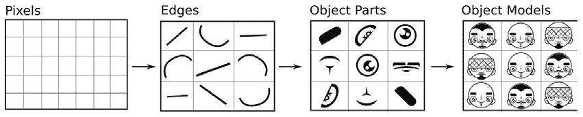

图 1.1：基于输入数据的一系列更高层次的表示

注意

*图 1.1* 是基于 Yann LeCun、Yoshua Bengio 和 Geoffrey Hinton 在《深度学习》一书中所提供的原始图像制作的派生图像，该书发表于 *Nature, 521, 436–444 (2015 年 5 月 28 日) doi:10.1038/ nature14539*。你可以在以下网址找到该论文：[`www.nature.com/articles/nature14539`](https://www.nature.com/articles/nature14539)。

用正式的语言来说，神经网络是计算图，其中每一步都会根据输入数据计算出更高层次的抽象表示。每一步表示进入一个不同的抽象层次。数据通过这些层次进展，从而构建出更高层次的表示。该过程最终会完成最高层次的表示：模型试图预测的结果。

## 函数逼近

当神经网络学习数据的新表示时，它们通过将不同层次的神经元与权重和偏置相结合来进行学习。在每次训练周期中，它们都会使用一种叫做**反向传播**的数学方法调整这些连接的权重。每一轮中，权重和偏置都会得到改进，直到达到一个最优解。这意味着神经网络可以测量每次训练周期中它的错误程度，调整每个神经元的权重和偏置，并再次尝试。如果它确定某种修改比前一轮的结果更好，它会继续投资于这个修改，直到达到最优解。

基本上，在一个周期中，发生了三件事。首先是前向传播，我们使用权重、偏置和输入来计算结果。第二步，我们使用损失函数计算计算值与期望值之间的差距。最后一步是更新权重和偏置，朝着与前向传播相反的方向调整，这个过程叫做反向传播。

由于早期层次的权重和偏置与后期层次没有直接联系，我们使用一个叫做链式法则的数学工具来计算早期层次的新权重。基本上，早期层次的变化等于其下方所有层次的梯度或导数的乘积。

简而言之，这个过程是神经网络能够逼近函数的原因。然而，神经网络无法完美预测一个函数的原因有很多，其中最主要的原因包括以下几点：

+   许多函数具有随机特性（即随机性质）。

+   可能会出现对训练数据特性的过拟合。过拟合是指我们训练的模型在面对从未见过的数据时，无法很好地泛化。它只是学习了训练数据，而不是发现一些有趣的模式。

+   可能缺乏训练数据。

在许多实际应用中，简单的神经网络可以以合理的精度逼近一个函数。这类应用将是本书的重点。

## 深度学习的局限性

深度学习技术最适用于那些可以用正式的数学规则（例如数据表示）来定义的问题。如果一个问题很难用这种方式定义，那么深度学习可能无法提供有效的解决方案。此外，如果给定问题的数据有偏差或仅包含生成该问题的潜在函数的部分表示，深度学习技术将只能复制该问题，而无法学会解决它。

记住，深度学习算法通过学习数据的不同表示来近似给定的函数。如果数据不能恰当地表示一个函数，那么神经网络可能会错误地表示该函数。可以考虑以下类比：你正在尝试预测全国汽油价格（即燃料价格），并创建一个深度学习模型。你将信用卡账单中每日的汽油消费作为输入数据。该模型最终可能学会你的汽油消费模式，但它可能会错误地表示由于其他因素（例如政府政策、市场竞争、国际政治等）引起的汽油价格波动，这些因素在你的数据中只是每周表示一次。最终，当模型投入生产使用时，可能会得出错误的结果。

为了避免这个问题，确保用于训练模型的数据尽可能准确地代表模型试图解决的问题。

## 固有偏差与伦理考量

研究人员建议，在使用深度学习模型时，如果没有考虑训练数据中的固有偏差，不仅可能导致表现不佳的解决方案，还可能引发伦理上的问题。

例如，2016 年底，中国上海交通大学的研究人员创建了一个神经网络，能够仅通过面部照片正确识别犯罪分子。研究人员使用了 1,856 张中国男性的照片，其中一半是已定罪的。该模型以 89.5%的准确率识别了这些囚犯。

注意

若要了解更多信息，请参考 [`blog.keras.io/the-limitations-of-deep-learning.html`](https://blog.keras.io/the-limitations-of-deep-learning.html) 和 *MIT Technology Review. 神经网络通过面部识别犯罪分子*，*2016 年 11 月 22 日*，可在 [`www.technologyreview.com/2016/11/22/107128/neural-network-learns-to-identify-criminals-by-their-faces/`](https://www.technologyreview.com/2016/11/22/107128/neural-network-learns-to-identify-criminals-by-their-faces/) 阅读。

该论文在科学界和大众媒体中引起了极大轰动。该解决方案的一个关键问题是未能正确识别输入数据中固有的偏差。即，该研究使用的数据来自两个不同的来源：一个是罪犯数据，另一个是非罪犯数据。一些研究人员建议，他们的算法识别的是与研究中使用的不同数据来源相关的模式，而不是识别来自人脸的相关模式。虽然我们可以从技术角度讨论模型的可靠性，但主要的批评是在伦理方面：研究人员应当明确认识到深度学习算法所使用的输入数据中固有的偏见，并考虑其应用会如何影响人们的生活。 *Timothy Revell. 当面部识别技术被用来“识别”罪犯时的担忧. 新科学家. 2016 年 12 月 1 日\. 访问链接：* [`www.newscientist.com/article/2114900-concerns-as-face-recognition-tech-used-to-identify-criminals/`](https://www.newscientist.com/article/2114900-concerns-as-face-recognition-tech-used-to-identify-crim)

数据集可能会出现不同类型的偏差。考虑一个例子，假设你正在构建一个可以在白天和夜间都能运行的自动监控系统。如果你的数据集仅包含白天的图像，那么你就会在模型中引入样本偏差。通过包含夜间数据，并覆盖所有可能的不同情况，例如晴天、雨天的图像，可以消除这种偏差。另一个例子是，假设在一个工作场所安装了类似的系统，用于分析工人及其活动。如果你的模型输入了成千上万的例子，图像中男人在编程，女人在做饭，那么这些数据显然反映了刻板印象。解决这个问题的方法与之前相同：将模型暴露于更加均衡分布的数据。

注意

要了解更多关于学习算法（包括深度学习）伦理的话题，请参考由 AI Now Institute 所做的研究（[`ainowinstitute.org/`](https://ainowinstitute.org/)），该组织致力于理解智能系统的社会影响。

## 神经网络的常见组件和操作

神经网络有两个关键组件：层和节点。

节点负责特定的操作，层是节点的组合，用于区分系统的不同阶段。典型的神经网络由以下三层组成：

+   **输入层**：接收并解读输入数据

+   **隐藏层**：进行计算并在数据传递过程中修改数据

+   **输出层**：在此处将输出结果组装并进行评估

以下图展示了神经网络层的工作原理：

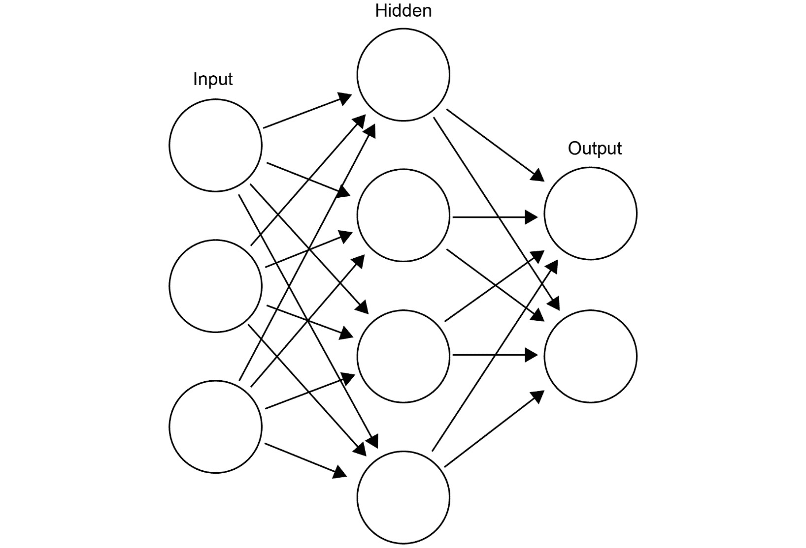

图 1.2：神经网络中最常见层的示意图

隐藏层是神经网络中最重要的层。它们被称为*隐藏层*，因为在这些层中生成的表示数据并不直接出现在数据中，而是从数据中学习到的。正是这些层内进行的主要计算构成了神经网络的核心。

节点是数据在网络中表示的位置。节点有两个与之相关的值：偏置和权重。这两个值影响数据在节点中的表示方式，并将数据传递给其他节点。当网络*学习*时，它实际上会调整这些值，以满足优化函数。

神经网络中的大部分工作发生在隐藏层中。不幸的是，目前没有明确的规则来确定网络应有多少层或节点。在实现神经网络时，你可能会花费时间实验不同的层和节点组合。建议从单层开始，并且使用一个节点数量来反映输入数据的特征数量（也就是说，数据集中有多少*列*）。

你可以继续添加层和节点，直到达到满意的性能——或者当网络开始对训练数据过拟合时停止。另外，注意这很大程度上依赖于数据集——如果你训练一个模型来识别手写数字，那么两个隐藏层的神经网络就足够了，但如果你的数据集更复杂，比如检测图像中的汽车和救护车等物体，那么即使是 10 层也可能不足以正确识别物体，你需要更深的网络。

同样，如果你使用一个有 100 个隐藏层的网络来训练手写数字，那么很有可能会导致模型过拟合，因为如此复杂的结构对模型来说并非必需。

现代神经网络实践通常局限于实验节点和层的数量（例如，网络的深度）以及每层执行的操作类型。在许多成功的实例中，神经网络仅通过调整这些参数就超越了其他算法。

最开始，想象数据通过输入层进入神经网络系统，然后在网络中从节点到节点流动。数据流动的路径取决于节点之间的连接方式、每个节点的权重和偏置、每层所执行的操作类型以及在这些操作完成后的数据状态。神经网络通常需要多次**迭代**（或周期），以不断调整节点的权重和偏置，这意味着数据会在图的不同层之间流动多次。

# 配置深度学习环境

在本章结束之前，我们希望你能够与一个真实的神经网络进行交互。我们将首先介绍本书中使用的主要软件组件，并确保它们正确安装。接着，我们将探索一个预训练的神经网络，并探讨在*什么是神经网络？*一节中讨论的一些组件和操作。

## 深度学习的软件组件

我们将使用以下软件组件进行深度学习：

### Python 3

本书将使用 Python 3。Python 是一种通用编程语言，在科学界非常流行——因此它在深度学习中得到了广泛采用。本书不支持 Python 2，但可以用它来训练神经网络，代替 Python 3。即使你选择在 Python 2 中实现你的解决方案，也建议迁移到 Python 3，因为其现代化的特性集远比其前身更为强大。

### TensorFlow

TensorFlow 是一个用于执行图形形式数学运算的库。TensorFlow 最初由 Google 开发，今天它已经成为一个开源项目，拥有众多贡献者。它的设计是为了神经网络而构建的，也是创建深度学习算法时最受欢迎的选择之一。

TensorFlow 也以其生产组件而著名。它包含 TensorFlow Serving（[`github.com/tensorflow/serving`](https://github.com/tensorflow/serving)），这是一个用于服务深度学习模型的高性能系统。此外，训练好的 TensorFlow 模型可以在其他高性能编程语言中使用，如 Java、Go 和 C。这意味着你可以将这些模型部署在从微型计算机（即树莓派）到安卓设备等各种设备上。截止 2019 年 11 月，TensorFlow 2.0 版本是最新版本。

### Keras

为了高效地与 TensorFlow 交互，我们将使用 Keras（[`keras.io/`](https://keras.io/)），这是一个具有高级 API 的 Python 包，用于开发神经网络。虽然 TensorFlow 专注于相互交互的计算图中的组件，Keras 则专注于神经网络的开发。Keras 使用 TensorFlow 作为其后台引擎，使得开发此类应用变得更加简便。

截至 2019 年 11 月，Keras 是 TensorFlow 的内置和默认 API。它位于`tf.keras`命名空间下。

### TensorBoard

TensorBoard 是一个数据可视化工具套件，用于探索 TensorFlow 模型，并且与 TensorFlow 原生集成。TensorBoard 通过读取 TensorFlow 在训练神经网络时创建的检查点和摘要文件来工作。这些文件可以在近实时（延迟 30 秒）或训练完成后进行探索。TensorBoard 使得实验和探索神经网络的过程变得更加轻松——而且，跟踪你网络的训练过程是非常激动人心的。

### Jupyter Notebook、Pandas 和 NumPy

在使用 Python 创建深度学习模型时，通常会从交互式工作开始；逐步开发一个最终变成更具结构化的软件的模型。在此过程中，经常使用三种 Python 包：Jupyter Notebooks、Pandas 和 NumPy：

+   Jupyter Notebook 创建交互式 Python 会话，使用网页浏览器作为其界面。

+   Pandas 是一个用于数据处理和分析的包。

+   NumPy 常用于数据形状处理和执行数值计算。

这些软件包在本书中偶尔使用。它们通常不构成生产系统的一部分，但在探索数据和开始构建模型时经常使用。我们将更详细地关注其他工具。

注意

Michael Heydt（2017 年 6 月，Packt Publishing）出版的《*学习 Pandas*》和 Dan Toomey（2016 年 11 月，Packt Publishing）出版的《*学习 Jupyter*》是两本关于如何使用这些技术的综合指南。它们都可以在[`www.packtpub.com/big-data-and-business-intelligence/learning-pandas-second-edition`](https://www.packtpub.com/big-data-and-business-intelligence/learning-pandas-second-edition)和[`www.packtpub.com/big-data-and-business-intelligence/learning-jupyter-5-second-edition`](https://www.packtpub.com/big-data-and-business-intelligence/learning-jupyter-5-second-edition)找到。这些书籍是继续学习的好参考。

以下表格详细列出了成功创建本书中解释的深度学习模型所需的软件要求：

![图 1.3：创建深度学习环境所需的软件组件]

](img/B15911_01_03.jpg)

图 1.3：创建深度学习环境所需的软件组件

Anaconda 是一个免费的 Python 包分发工具，适用于 Windows、Mac 或其他平台。我们建议您按照[`docs.anaconda.com/anaconda/install/`](https://docs.anaconda.com/anaconda/install/)上的说明进行操作。标准的 Anaconda 安装将安装大多数这些组件，第一个练习将演示如何安装其他组件。

## 练习 1.01：验证软件组件

在我们探索一个训练好的神经网络之前，让我们先验证所需的软件组件是否齐全。我们已经包括了一个脚本，用来验证这些组件是否工作。让我们花点时间运行脚本并解决可能遇到的问题。我们现在将测试在您的工作环境中是否具备本书所需的软件组件。首先，我们建议使用 Python 的原生模块`venv`来创建 Python 虚拟环境。虚拟环境用于管理项目依赖关系。我们建议每个项目都有自己的虚拟环境。

1.  可以使用以下命令创建 Python 虚拟环境：

    ```py
    $ python -m venv venv
    $ source venv/bin/activate
    ```

    后面的命令将把字符串`venv`附加到命令行的开头。

    确保在进行项目开发时始终激活你的 Python 虚拟环境。要停用虚拟环境，请运行 `$ deactivate`。

1.  激活虚拟环境后，请通过在 `requirements.txt` 文件上执行 `pip`，确保正确的组件已安装（[`packt.live/300skHu`](https://packt.live/300skHu)）。

    ```py
    $ pip install –r requirements.txt
    ```

    输出如下：

    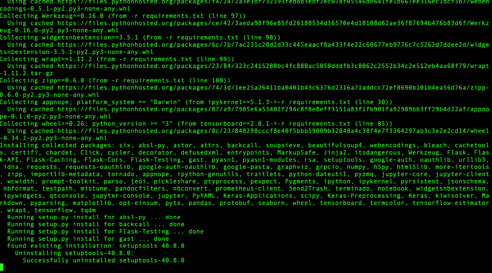

    图 1.4：终端截图，显示使用 pip 安装 requirements.txt 中的依赖

1.  这将会在虚拟环境中安装本书中使用的库。如果这些库已经存在，它将不会做任何操作。如果库正在安装，将显示进度条，否则会提示“`requirement is already specified`”。要检查已安装的可用库，请使用以下命令：

    ```py
    $ pip list
    ```

    输出将如下所示：

    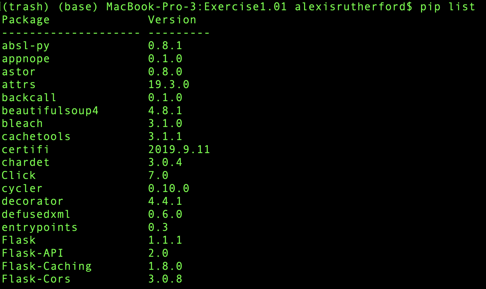

    图 1.5：终端截图，显示运行 pip 列出可用库

    注意

    这些库对于本书中的所有代码活动至关重要。

1.  作为此练习的最后一步，执行脚本 `test_stack.py`。该文件可以在以下地址找到：[`packt.live/2B0JNau`](https://packt.live/2B0JNau)。它验证本书所需的所有软件包是否已安装并且可用。

1.  运行以下脚本检查 Python 3、TensorFlow 和 Keras 的依赖项是否可用。使用以下命令：

    ```py
    $ python3 Chapter01/Exercise1.01/test_stack.py
    ```

    脚本返回有用的消息，说明已安装的内容以及需要安装的内容：

    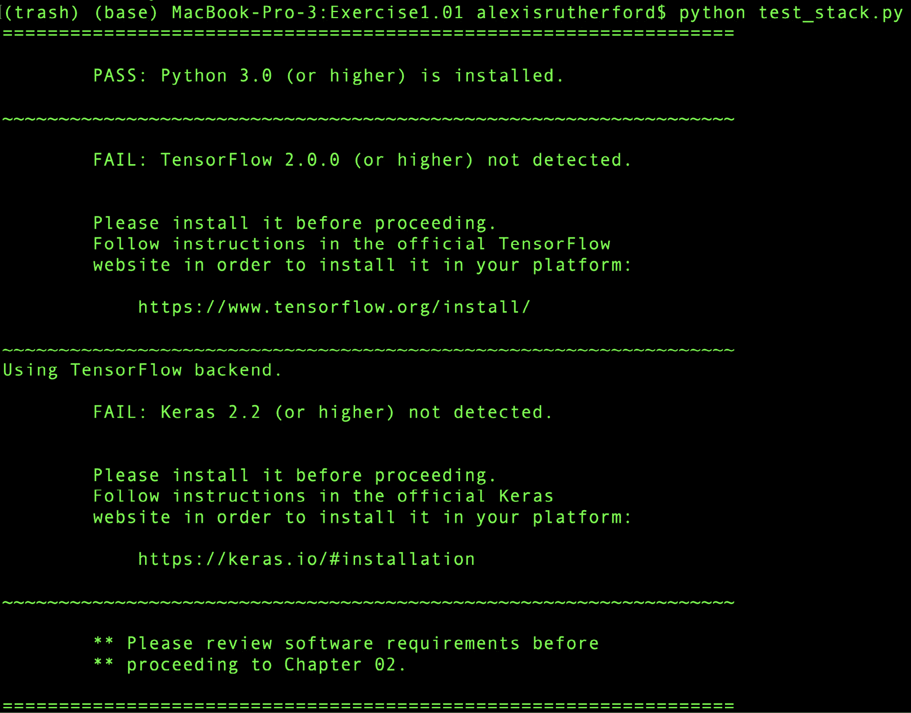

    图 1.6：终端截图，显示并非所有要求都已安装

    例如，在前面的截图中，它显示 TensorFlow 2.0 未被检测到，但检测到了 Keras 2.2 或更高版本。因此，你会看到错误消息 `Please review software requirements before proceeding to Lesson 2`。如果所有要求都已满足，则会显示已安装 Python、TensorFlow 和 Keras，如下图所示：

    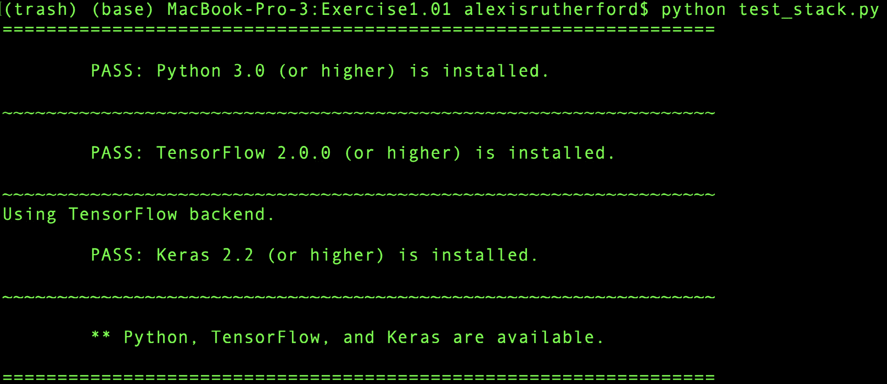

    图 1.7：显示所有元素已安装的终端截图

1.  在终端中运行以下脚本命令，获取有关如何配置 TensorBoard 的更多信息：

    ```py
    $ tensorboard –help
    ```

    输出如下：

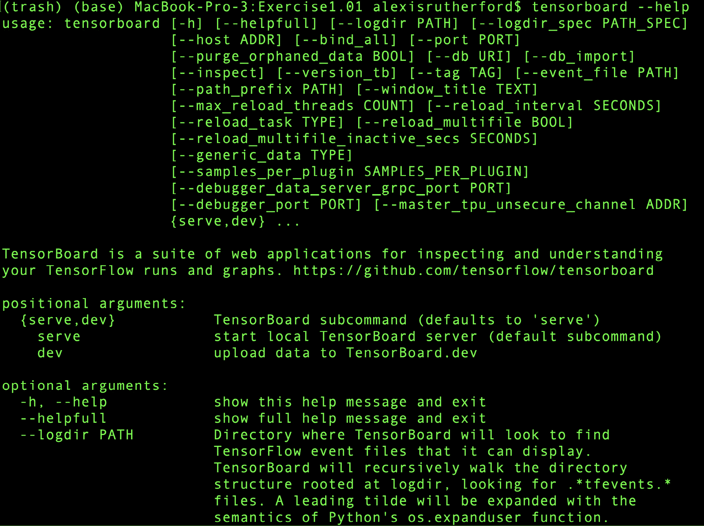

图 1.8：--help 命令的输出

你应该能看到相关的帮助信息，解释每个命令的作用，如 *图 1.8* 所示。

如上图所示，脚本返回消息，通知你所有依赖项已正确安装。

注意

要访问本节的源代码，请参阅[`packt.live/2B0JNau`](https://packt.live/2B0JNau)。

本节目前没有在线互动示例，需要在本地运行。

一旦我们确认安装了 Python 3、TensorFlow、Keras、TensorBoard 和 `requirements.txt` 中列出的所有包，就可以继续进行如何训练神经网络的演示，然后使用这些相同的工具来探索训练好的网络。

# 探索训练好的神经网络

在本节中，我们将探索一个训练好的神经网络。我们这样做是为了理解神经网络如何解决实际问题（预测手写数字），并熟悉 TensorFlow API。在探索这个神经网络时，我们将识别出许多在前面章节中介绍过的组件，比如节点和层，但也会看到许多我们不认识的组件（比如激活函数）；我们将在后续章节中进一步探索这些组件。接着，我们将演示如何训练这个神经网络，并自己动手训练同样的网络。

我们将要探索的神经网络已经过训练，能够识别数字（整数），使用的是手写数字的图像。它使用了 MNIST 数据集（[`yann.lecun.com/exdb/mnist/`](http://yann.lecun.com/exdb/mnist/)），这是一个经典的数据集，常用于探索模式识别任务。

## MNIST 数据集

**修改版国家标准与技术研究院**（**MNIST**）数据集包含 60,000 张训练图像和 10,000 张测试图像。每张图像包含一个手写的数字。这个数据集源自美国政府创建的一个数据集，最初用于测试不同的计算机系统识别手写文字的方法。能够做到这一点对于提高邮政服务、税务系统和政府服务的效率非常重要。MNIST 数据集被认为对于当代方法来说过于简单。现在的研究中使用了不同且更新的数据集（例如，**加拿大高级研究院**（**CIFAR**）数据集）。然而，MNIST 数据集仍然非常有用，因为已知的模型能够高效地达到很高的准确度，从而帮助理解神经网络的工作原理。

注意

CIFAR 数据集是一个机器学习数据集，包含按不同类别组织的图像。与 MNIST 数据集不同，CIFAR 数据集包含来自多个不同领域的类别，包括动物、活动和物体。CIFAR 数据集可以在[`www.cs.toronto.edu/~kriz/cifar.html`](https://www.cs.toronto.edu/~kriz/cifar.html)获取。

然而，MNIST 数据集仍然非常有助于理解神经网络的工作原理，因为已知模型能够以极高的效率达到很高的准确率。在下图中，每张图片都是一张包含单个手写数字的 20x20 像素图像。你可以在 [`yann.lecun.com/exdb/mnist/`](http://yann.lecun.com/exdb/mnist/) 找到原始数据集。


图 1.9：MNIST 数据集训练集的摘录

## 使用 TensorFlow 训练神经网络

现在，让我们使用 MNIST 数据集训练一个神经网络来识别新的数字。我们将实现一个名为**卷积神经网络**（**CNN**）的特殊神经网络来解决这个问题（我们将在后续部分中更详细地讨论它们）。我们的完整网络包含三个隐藏层：两个全连接层和一个卷积层。模型由以下 TensorFlow Python 代码片段定义：

注意

```py
\ ) to split the logic across multiple lines. When the code is executed, Python will ignore the backslash, and treat the code on the next line as a direct continuation of the current line.
model = Sequential()
model.add(Convolution2D(filters = 10, kernel_size = 3, \
                        input_shape=(28,28,1)))
model.add(Flatten())
model.add(Dense(128, activation = 'relu'))
model.add(Dropout(0.2))
model.add(Dense(10, activation = 'softmax'))
```

注意

使用 `mnist.py` 文件作为参考，地址为 [`packt.live/2Cuhj9w`](https://packt.live/2Cuhj9w)。在代码编辑器中打开该脚本并跟随练习。

我们在训练神经网络时只执行一次前面的代码片段。

我们将在*第二章*《*使用 TensorFlow 和 Keras 进行真实世界的深度学习：预测比特币的价格*》中详细探讨每个组件的使用。现在，我们将重点理解网络在每次运行时如何改变每一层的`权重`和`偏置`值。这些 Python 代码是数十年神经网络研究的结晶。

现在，让我们训练这个网络，评估它在 MNIST 数据集上的表现。

## 练习 1.02：使用 MNIST 数据集训练神经网络

在这个练习中，我们将训练一个神经网络，用于检测 MNIST 数据集中的手写数字。按照以下步骤来设置这个练习：

1.  打开两个终端实例。

1.  访问 [`packt.live/2BWNAWK`](https://packt.live/2BWNAWK)。确保你的 Python 3 虚拟环境已激活，并且已安装 `requirements.txt` 中列出的所有依赖项。

1.  在其中一个终端中，使用以下命令启动 TensorBoard 服务器：

    ```py
    $ tensorboard --logdir logs/fit
    ```

    输出结果如下：

    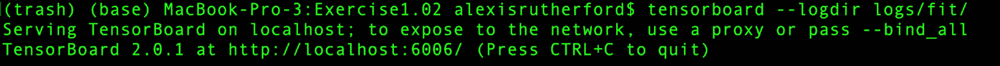

    ```py
    $ python mnist.py
    ```

    当你开始运行脚本时，你会看到如下的进度条：

    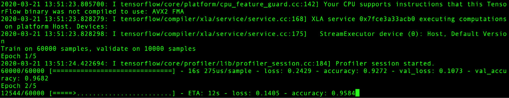

    图 1.11：mnist.py 脚本的结果

1.  打开浏览器并导航到启动服务器时提供的 TensorBoard URL，在*步骤 3*中可能是 `http://localhost:6006/` 或类似的网址。在你运行 `mnist.py` 脚本的终端中，你将看到模型的训练轮次进度条。当你打开浏览器页面时，你会看到几个图表，包括 `epoch_accuracy` 和 `epoch_loss` 图表。理想情况下，准确度应随着每次迭代而提高，而损失应随着每次迭代而减少。你可以通过图表直观地确认这一点。

1.  点击 `epoch_accuracy` 图表，放大它，并让页面刷新（或点击 `refresh` 图标）。你将看到随着训练轮次的增加，模型的准确度逐渐提高：

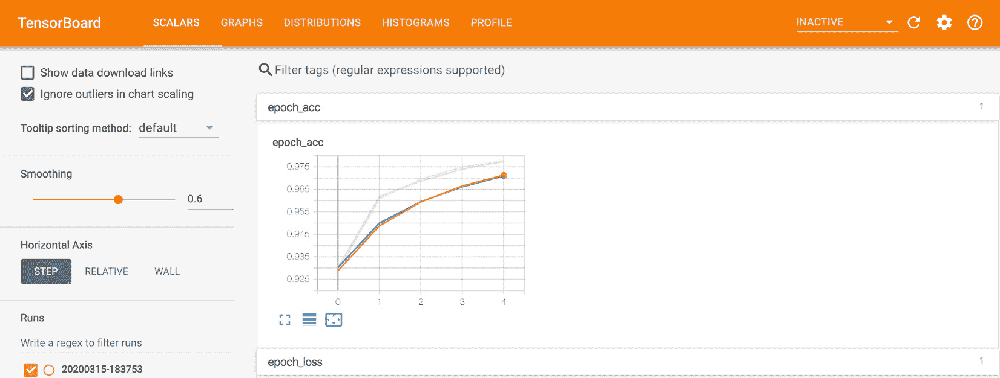

图 1.12：使用 TensorBoard 可视化准确度和损失图表

我们可以看到，在大约 5 个训练轮次（或步骤）后，网络的准确度超过了 97%。也就是说，到这一点为止，网络已经正确识别了测试集中的 97% 数字。

注意

要获取此特定部分的源代码，请访问 [`packt.live/2Cuhj9w`](https://packt.live/2Cuhj9w)。

本节目前没有在线互动示例，需在本地运行。

现在，让我们测试这些网络在未见过的数据上的表现。

## 使用未见过的数据测试网络性能

在浏览器中访问网站 [`mnist-demo.herokuapp.com/`](http://mnist-demo.herokuapp.com/) 并在指定的白色框中画一个 0 到 9 之间的数字：

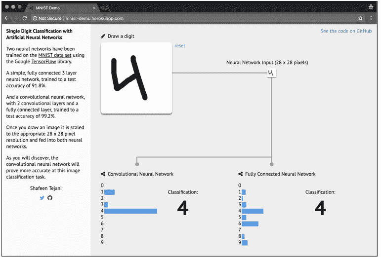

图 1.13：一个用于手动绘制数字并测试两个训练网络准确度的 Web 应用程序

注意

我们使用的这个 Web 应用程序是由 *Shafeen Tejani* 创建的，目的是探索训练过的网络是否能够正确预测我们手写的数字。

来源：[`github.com/ShafeenTejani/mnist-demo`](https://github.com/ShafeenTejani/mnist-demo)。

在应用程序中，你可以看到两个神经网络的结果 —— 如下图所示，数字 `1` 被绘制在绘图区域的右边缘附近：

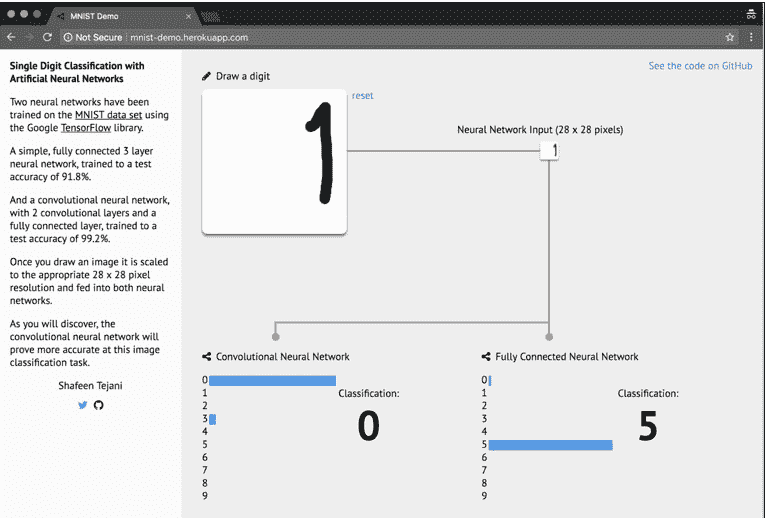

图 1.14：两个网络在估计绘制在区域边缘的值时遇到了困难

在这个示例中，我们看到数字 1 被画在绘图区域的右侧。在两个网络中，该数字是 1 的概率为 0。

MNIST 数据集的图像边缘没有数字。因此，两个网络都没有给位于该区域的像素分配相关的值。如果我们把数字画得更靠近指定区域的中心，两个网络在正确分类数字方面会表现得更好。这是因为在训练集中，我们只有图像中间部分绘制的数字。这表明神经网络的强大程度取决于用于训练的数据。如果用于训练的数据与我们要预测的目标差异很大，网络很可能会产生令人失望的结果。

## 活动 1.01：使用不同超参数训练神经网络

在本节中，我们将探索在*练习 1.02*，*使用 MNIST 数据集训练神经网络*中训练的神经网络，那个时候我们在 MNIST 数据集上训练了自己的卷积神经网络（CNN）。我们已经将该训练好的网络作为二进制文件放在本书的目录中。在本活动中，我们将仅介绍你可以通过 TensorBoard 完成的操作，并通过更改一些超参数来训练其他几个网络。

这里是你需要遵循的步骤：

1.  通过输入相应命令打开 TensorBoard。

1.  打开 TensorBoard 的准确率图表，并调整平滑滑块的值来观察变化。

1.  通过改变超参数来训练另一个模型。

1.  尝试减小学习率并增加训练轮数。

1.  现在尝试理解超参数调优对在 TensorBoard 上生成的图表有什么影响。

1.  尝试增加学习率并减少训练轮数，然后重复*步骤 5*。

    注意：

    本活动的解决方案可以在第 130 页找到。

# 总结

在本章中，我们使用 TensorFlow 训练的神经网络进行了 TensorBoard 探索，并用不同的训练轮数和学习率训练了我们自己修改版的网络。这让你获得了训练一个高效神经网络的实战经验，并且可以探索其一些局限性。

你认为我们能使用真实的比特币数据达到类似的准确度吗？我们将在*第二章*，*使用 TensorFlow 和 Keras 进行实际深度学习：预测比特币价格*中尝试使用常见的神经网络算法来预测未来的比特币价格。在*第三章*，*使用 TensorFlow 和 Keras 进行实际深度学习：评估比特币模型*中，我们将评估并改进该模型，最后在*第四章*，*产品化*中，我们将创建一个程序，通过 HTTP API 提供该系统的预测服务。
