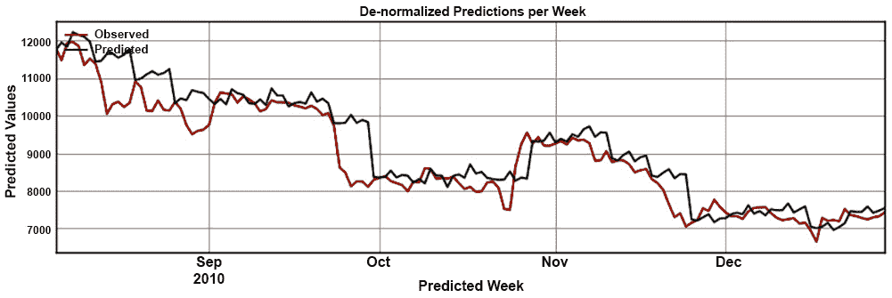

# 第三章：3. 实际深度学习：评估比特币模型

概述

本章重点讲解如何评估神经网络模型。我们将修改网络的超参数以提升其性能。然而，在更改任何参数之前，我们需要先衡量模型的表现。在本章结束时，您将能够使用不同的函数和技术评估模型。您还将通过实现函数和正则化策略，学习超参数优化。

# 介绍

在上一章中，您已经训练了您的模型。那么，您如何检查它的性能以及它是否表现良好呢？让我们通过评估模型来找出答案。在机器学习中，通常会定义两个不同的术语：**参数**和**超参数**。参数是影响模型如何从数据中做出预测的属性，比如来自特定数据集的预测。超参数则是模型如何从数据中学习的方式。参数可以从数据中学习并动态修改。而超参数则是在训练开始之前定义的高层次属性，通常不会从数据中学习。在本章中，您将详细了解这些因素，并理解如何使用它们与不同的评估技术相结合，以提高模型的性能。

注意事项

如需更详细的机器学习概述，请参阅 *Python Machine Learning*（Sebastian Raschka 和 Vahid Mirjalili 著，Packt Publishing，2017 年）。

## 问题类别

通常，神经网络可以解决两类问题：**分类**和**回归**。分类问题关注从数据中预测正确的类别——例如，温度是热还是冷。回归问题则是关于预测连续标量中的值——例如，实际的温度值。

这两类问题的特点如下：

+   `yes` 或 `no`。然而，它们必须清楚地分配给每个数据元素。分类问题的一个例子是使用卷积神经网络将图像标记为 `car` 或 `not a car`。我们在《第一章：神经网络与深度学习概述》中探索的 MNIST 示例也是一个分类问题的例子。

+   **回归**：这些问题的特点是具有连续变量（即标量）。它们按范围进行度量，其评估考虑网络与实际值的接近程度。一个例子是时间序列分类问题，其中使用递归神经网络预测未来的温度值。比特币价格预测问题是另一个回归问题的例子。

尽管这两类问题的模型评估结构相同，但我们使用不同的技术来评估模型的表现。在接下来的部分，我们将探讨这些评估分类或回归问题的技术。

## 损失函数、准确率与误差率

神经网络使用衡量网络与**验证集**表现的函数——即，保留出来的部分数据，在训练过程中作为验证使用。这些函数被称为**损失函数**。

损失函数评估神经网络预测的错误程度。然后，它们将这些错误反向传播并调整网络，改变单个神经元的激活方式。损失函数是神经网络的关键组成部分，选择正确的损失函数会对网络的表现产生重大影响。误差通过一种叫做**反向传播**的过程传播，这是一种将损失函数返回的误差传播到神经网络中每个神经元的技术。传播的误差影响神经元的激活方式，最终影响网络输出的结果。

许多神经网络框架，包括 Keras，默认使用这一技术。

注意

有关反向传播数学原理的更多信息，请参考*《深度学习》*，*Ian Goodfellow 等著，MIT 出版社，2016 年*。

对于回归和分类问题，我们使用不同的损失函数。对于分类问题，我们使用准确率函数（即，预测正确的次数与总预测次数的比例）。例如，如果你预测抛硬币的结果，当抛掷 `n` 次时，其中会出现 `m` 次正面，且预测正确，那么准确率将计算为 *m/n*。对于回归问题，我们使用误差率（即，预测值与观察值的接近程度）。

以下是一些常见的损失函数总结及其常见应用：


](img/B15911_03_01.jpg)

图 3.1：用于分类和回归问题的常见损失函数

对于回归问题，MSE 函数是最常用的选择；而对于分类问题，二元交叉熵（适用于二分类问题）和多元交叉熵（适用于多分类问题）是常见的选择。建议从这些损失函数开始，然后在神经网络演变的过程中，尝试其他函数，以期提升性能。

我们在*第二章*中开发的网络，*《用 TensorFlow 和 Keras 进行真实世界的深度学习：预测比特币的价格》*，使用均方误差（MSE）作为损失函数。在接下来的部分，我们将探讨该函数在网络训练过程中的表现。

## 不同的损失函数，相同的架构

在继续下一部分之前，让我们从实际操作的角度探讨一下这些问题在神经网络中的不同之处。

*TensorFlow Playground*（[`playground.tensorflow.org/`](https://playground.tensorflow.org/)）应用程序是由 TensorFlow 团队提供的，旨在帮助我们理解神经网络是如何工作的。在这里，我们可以看到一个由输入层（左侧）、隐藏层（中间）和输出层（右侧）组成的神经网络。

注：

这些图像可以在 GitHub 上的仓库中查看：[`packt.live/2Cl1t0H`](https://packt.live/2Cl1t0H)。

我们还可以选择不同的示例数据集进行实验，这些数据集位于最左侧。最后，在最右侧，我们可以看到网络的输出：


图 3.2：TensorFlow Playground 网络应用程序

通过查看此可视化中的神经网络参数，您可以了解每个参数如何影响模型的结果。此应用程序帮助我们探索上一部分中讨论的不同问题类别。当我们选择`回归`（右上角）时，点的颜色会在橙色和蓝色之间的颜色范围内变化：


图 3.3：TensorFlow Playground 中的回归问题示例

当我们选择`分类`作为`问题类型`时，数据集中的点只有两种颜色：蓝色或橙色。在处理分类问题时，网络根据网络错误分类的蓝色和橙色点的数量来评估其损失函数。它检查每个点在网络中颜色值右侧的偏移量，如下截图所示：


图 3.4：TensorFlow Playground 应用程序的详细信息。不同的颜色被分配给分类问题中的不同类别

点击播放按钮后，我们会注意到`训练损失`区域中的数字不断下降，因为网络在持续训练。这些数字在每个问题类别中非常相似，因为损失函数在神经网络中起着相同的作用。

然而，每个类别实际使用的损失函数是不同的，具体选择哪个函数取决于问题的类型。

## 使用 TensorBoard

评估神经网络是 TensorBoard 的强项。正如我们在*第一章*，*神经网络与深度学习简介*中解释的那样，TensorBoard 是与 TensorFlow 一起提供的一套可视化工具。除了其他功能，我们可以在每个 epoch 后探索损失函数评估的结果。TensorBoard 的一个很棒的特点是，我们可以将每次运行的结果单独组织，并比较每次运行的损失函数度量标准。然后，我们可以决定调整哪些超参数，并对网络的表现有一个大致的了解。最棒的是，这一切都能实时完成。

为了在我们的模型中使用 TensorBoard，我们将使用 Keras 的`callback`函数。我们通过导入 TensorBoard 的`callback`并将其传递给模型，在调用`fit()`函数时实现这一点。以下代码展示了如何在我们在*第二章*，*TensorFlow 和 Keras 的实际深度学习：预测比特币价格*中创建的比特币模型中实现这一点： 

```py
from tensorflow.keras.callbacks import TensorBoard
model_name = 'bitcoin_lstm_v0_run_0'
tensorboard = TensorBoard(log_dir='logs\\{}'.format(model_name)) \
                          model.fit(x=X_train, y=Y_validate, \
                          batch_size=1, epochs=100, verbose=0, \
                          callbacks=[tensorboard])
```

Keras 的`callback`函数会在每个 epoch 运行结束时被调用。在这种情况下，Keras 会调用 TensorBoard 的`callback`，将每次运行的结果存储到磁盘上。还有许多其他有用的`callback`函数，你可以使用 Keras API 创建自定义的回调函数。

注意

请参考 Keras 回调文档（[`keras.io/callbacks/`](https://keras.io/callbacks/)）以获取更多信息。

在实现 TensorBoard 回调后，损失函数的度量标准现在可以在 TensorBoard 界面中查看。你可以运行 TensorBoard 进程（使用`tensorboard --logdir=./logs`），并在训练网络时保持它运行（通过`fit()`）。

评估的主要图形通常称为损失。我们可以通过将已知度量标准传递给`fit()`函数中的 metrics 参数来添加更多度量标准。这些度量标准会在 TensorBoard 中进行可视化，但不会用于调整网络的权重。交互式图形会持续实时更新，帮助你了解每个 epoch 的进展。在下面的截图中，你可以看到一个 TensorBoard 实例，展示了损失函数的结果，以及已添加到 metrics 参数中的其他度量标准：

![图 3.5：展示损失函数结果的 TensorBoard 实例截图]

](img/B15911_03_05.jpg)

图 3.5：展示损失函数结果的 TensorBoard 实例截图

在下一节中，我们将详细讨论如何实现本节中讨论的不同度量标准。

## 实现模型评估度量标准

在回归和分类问题中，我们将输入数据集拆分为另外三个数据集：训练集、验证集和测试集。训练集和验证集都用于训练网络。训练集作为输入提供给网络，而验证集则被损失函数用来将神经网络的输出与真实数据进行比较，并计算预测的误差。最后，测试集在网络训练完成后用于衡量网络在未见过的数据上的表现。

注意

没有明确的规则来确定训练集、验证集和测试集如何划分。常见的方法是将原始数据集划分为 80% 的训练集和 20% 的测试集，然后将训练集再划分为 80% 的训练集和 20% 的验证集。有关此问题的更多信息，请参阅 *Python 机器学习*，作者 *Sebastian Raschka 和 Vahid Mirjalili (Packt Publishing, 2017)*。

在分类问题中，您将数据和标签作为相关但不同的数据传递给神经网络。然后，网络学习数据与每个标签之间的关系。在回归问题中，我们不是传递数据和标签，而是将感兴趣的变量作为一个参数传递，将用于学习模式的变量作为另一个参数。Keras 提供了适用于这两种情况的接口，使用的是 `fit()` 方法。

注意

`fit()` 方法可以使用 `validation_split` 或 `validation_data` 参数，但不能同时使用两者。

请参见以下代码片段，了解如何使用 `validation_split` 和 `validation_data` 参数：

```py
model.fit(x=X_train, y=Y_ train, \
          batch_size=1, epochs=100, verbose=0, \
          callbacks=[tensorboard], validation_split=0.1, \
          validation_data=(X_validation, Y_validation))
```

`X_train`：训练集中的特征

`Y_train`：训练集中的标签

`batch_size`：每批的大小

`epochs`：迭代次数

`verbose`：您希望的输出级别

`callbacks`：在每个 epoch 后调用一个函数

`validation_split`：如果您没有显式创建验证集，则为验证集的百分比分割

`validation_data`：如果您显式创建了验证集，则为验证数据

损失函数评估模型的进展，并在每次运行时调整其权重。然而，损失函数仅描述训练数据和验证数据之间的关系。为了评估模型是否正确执行，我们通常会使用第三个数据集——该数据集不用于训练网络——并将我们模型的预测与该数据集中的真实值进行比较。这就是测试集的作用。

Keras 提供了 `model.evaluate()` 方法，使得对已训练神经网络在测试集上的评估变得简单。以下代码展示了如何使用 `evaluate()` 方法：

```py
model.evaluate(x=X_test, y=Y_test)
```

`evaluate()` 方法返回损失函数的结果以及传递给 `metrics` 参数的函数的结果。我们将在比特币问题中频繁使用该函数，以测试模型在测试集上的表现。

你会注意到我们之前训练的比特币模型与这个示例有些不同。这是因为我们使用了 LSTM 架构。LSTM 被设计用来预测序列。

因此，我们不使用一组变量来预测另一个单一的变量——即使这是一个回归问题。相反，我们使用来自单一变量（或变量集）的先前观察值来预测该变量（或变量集）未来的观察值。`keras.fit()`中的`y`参数与`x`参数包含相同的变量，但仅包含预测的序列。那么，让我们看看如何评估之前训练的比特币模型。

## 评估比特币模型

我们在*第一章*，*神经网络与深度学习简介*中的活动中创建了一个测试集。该测试集包含 21 周的每日比特币价格观察数据，相当于原始数据集的约 10%。

我们还使用了其余 90%的数据（即训练集，包含 187 周数据，减去 1 周用于验证集）在*第二章*，*使用 TensorFlow 和 Keras 进行真实世界的深度学习：预测比特币价格*中训练了我们的神经网络，并将训练好的网络保存在磁盘上（`bitcoin_lstm_v0`）。现在，我们可以使用`evaluate()`方法来评估测试集中的每一周数据，并查看第一个神经网络的表现。

但是，要做到这一点，我们需要提供 186 周的前期数据。我们必须这么做，因为我们的网络是通过使用恰好 186 周的连续数据来预测一周数据进行训练的（我们将在*第四章*，*产品化*中通过定期用更长时间段的数据重新训练网络来处理这种行为，当我们将神经网络部署为 Web 应用程序时）。以下代码片段实现了`evaluate()`方法，用于评估我们模型在测试数据集中的表现：

```py
combined_set = np.concatenate((train_data, test_data), axis=1) \
               evaluated_weeks = []
for i in range(0, validation_data.shape[1]):
    input_series = combined_set[0:,i:i+187]
X_test = input_series[0:,:-1].reshape(1, \
         input_series.shape[1] – 1, ) \
         Y_test = input_series[0:,-1:][0]
result = B.model.evaluate(x=X_test, y=Y_test, verbose=0) \
         evaluated_weeks.append(result)
```

在前面的代码中，我们使用 Keras 的`model.evaluate()`方法评估每一周的数据，然后将其输出存储在`evaluated_weeks`变量中。接着，我们绘制每周的 MSE 结果，如下图所示：


图 3.6：测试集每周的 MSE

我们模型的 MSE（均方误差）结果表明，我们的模型在大多数周内表现良好，除了第 2、8、12 和 16 周，其值从大约 0.005 增加到 0.02。我们模型似乎在几乎所有其他测试周内表现得都很好。

## 过拟合

我们第一个训练的网络（`bitcoin_lstm_v0`）可能正遭遇一种被称为**过拟合**的现象。过拟合是指模型在优化验证集时，虽然在验证集上表现得很好，但却牺牲了从我们想要预测的现象中学习到的更具泛化能力的模式。过拟合的主要问题是模型学会了如何预测验证集，但却无法预测新的数据。

我们在模型中使用的损失函数在训练过程结束时达到了非常低的水平。不仅如此，这一过程发生得很早：用于预测我们数据最后一周的 MSE 损失函数在大约第 30 个周期时降到了一个稳定的平稳值。这意味着我们的模型几乎完美地预测了第 187 周的数据，使用了前 186 周的数据。这会不会是过拟合的结果呢？

让我们再看一遍前面的图表。我们知道我们的 LSTM 模型在验证集上达到了极低的值（大约为 2.9 × 10^-6），但它在测试集上的表现也很低。然而，关键的区别在于规模。在我们的测试集中，每周的 MSE 大约是验证集的 4,000 倍（平均值）。这意味着模型在我们的测试数据中的表现远不如在验证集中的表现。这一点值得考虑。

然而，规模掩盖了我们 LSTM 模型的强大能力；即使在我们的测试集上表现较差，预测的 MSE 误差仍然非常、非常低。这表明我们的模型可能正在从数据中学习模式。

## 模型预测

比较 MSE 误差来衡量我们的模型是一回事，而能够直观地解释其结果是另一回事。

使用相同的模型，让我们为接下来的几周创建一系列预测，使用 186 周的数据作为输入。我们通过将 186 周的滑动窗口应用于完整的序列（即训练集加测试集），并为每个窗口做出预测来实现这一点。

以下代码片段使用`Keras model.predict()`方法对测试数据集的所有周进行预测：

```py
combined_set = np.concatenate((train_data, test_data), \
               axis=1) predicted_weeks = []
for i in range(0, validation_data.shape[1] + 1): 
    input_series = combined_set[0:,i:i+186]
    predicted_weeks.append(B.predict(input_series))
```

在前面的代码中，我们使用`model.predict()`方法进行预测，然后将这些预测存储在`predicted_weeks`变量中。然后，我们绘制结果图，生成以下图表：


图 3.7：测试集中每周的 MSE

我们模型的结果表明，它的表现并没有那么糟糕。通过观察`Predicted`线（灰色）的模式，我们可以看到网络已经识别出了每周波动的模式，规范化价格在一周的中间上涨，到周末时下降。然而，仍然有很大的改进空间，因为它无法捕捉到更大的波动。除了几个星期外——与我们之前的 MSE 分析相同——大多数周的数据接近正确的值。

现在，让我们对预测结果进行反归一化，以便能够使用与原始数据相同的尺度（即美元）来分析预测值。我们可以通过实现一个反归一化函数来完成这一步，该函数利用预测数据中的日期索引来识别测试数据中的等效周。识别出该周后，函数将取该周的第一个值，并利用相同的点相对归一化技术（但反向）来反归一化预测值。以下代码段展示了如何使用反向点相对归一化技术来反归一化数据：

```py
def denormalize(reference, series, normalized_variable=\
                'close_point_relative_normalization', \
                denormalized_variable='close'):
    if('iso_week' in list(series.columns)):
        week_values = reference[reference['iso_week'] \
                      == series['iso_week'].values[0]]
        last_value = week_values[denormalized_variable].values[0]
        series[denormalized_variable] = \
        last_value * (series[normalized_variable] + 1)
    return series
predicted_close = predicted.groupby('iso_week').apply(lambda x: \
                  denormalize(observed, x))
```

`denormalize()`函数会取测试集等效周第一天的收盘价。

我们的结果现在使用美元比较预测值与测试集。如下图所示，`bitcoin_lstm_v0`模型在预测未来 7 天比特币价格时似乎表现得相当好。但我们如何用可解释的术语来衡量这种表现呢？


图 3.8：每周反归一化预测

## 解释预测结果

我们的最后一步是为预测结果添加可解释性。前面的图表似乎显示我们的模型预测与测试数据的匹配度较高，但到底有多接近呢？

Keras 的`model.evaluate()`函数对理解模型在每个评估步骤中的表现非常有用。然而，考虑到我们通常使用归一化数据集来训练神经网络，`model.evaluate()`方法生成的指标也很难解释。

为了解决这个问题，我们可以收集模型的完整预测集，并使用来自*图 3.1*的另外两个更易解释的函数进行比较：MAPE 和 RMSE，分别通过`mape()`和`rmse()`实现。

注意

这些函数是使用 NumPy 实现的。原始实现来自[`stats.stackexchange.com/questions/58391/mean-absolute-percentage-error-mape-in-scikit-learn`](https://stats.stackexchange.com/questions/58391/mean-absolute-percentage-error-mape-in-scikit-learn)和[`stackoverflow.com/questions/16774849/mean-squared-error-in-numpy`](https://stackoverflow.com/questions/16774849/mean-squared-error-in-numpy)

我们可以在以下代码段中看到这些方法的实现：

```py
def mape(A, B):
    return np.mean(np.abs((A - B) / A)) * 100
def rmse(A, B):
    return np.sqrt(np.square(np.subtract(A, B)).mean())
```

在使用这两个函数比较我们的测试集和预测值之后，我们得到了以下结果：

+   **反归一化 RMSE**：$596.6 美元

+   **反归一化 MAPE**：4.7%

这表明我们的预测与实际数据的差异平均约为$596。这表示与实际比特币价格相比，差异约为 4.7%。

这些结果有助于我们理解预测结果。我们将继续使用`model.evaluate()`方法来跟踪 LSTM 模型的改进，同时也会计算`rmse()`和`mape()`，并在每个版本的模型上对完整数据系列进行计算，以解释我们距离预测比特币价格有多近。

## 练习 3.01：创建一个主动训练环境

在本练习中，我们将为神经网络创建一个训练环境，以便于其训练和评估。这个环境对于接下来的主题尤为重要，我们将在其中寻找超参数的最佳组合。

首先，我们将启动 Jupyter Notebook 实例和 TensorBoard 实例。这两个实例可以在本练习的剩余部分保持打开。让我们开始吧：

1.  在终端中，导航到`Chapter03/Exercise3.01`目录，并执行以下代码以启动 Jupyter Notebook 实例：

    ```py
    $ jupyter-lab
    ```

    服务器应该会自动在你的浏览器中打开。

1.  打开名为`Exercise3.01_Creating_an_active_training_environment.ipynb`的 Jupyter Notebook：

    图 3.9：Jupyter Notebook 高亮显示了“Evaluate LSTM Model”部分

1.  同时在你的终端中，通过执行以下命令启动一个 TensorBoard 实例：

    ```py
    $ cd ./Chapter03/Exercise3.01/
    $ tensorboard --logdir=logs/
    ```

    确保`logs`目录在仓库中是空的。

1.  打开屏幕上出现的 URL，并保持该浏览器标签页打开。还要执行包含导入语句的初始单元格，以确保加载了所需的依赖项。

1.  执行“Validation Data”下的两个单元格，以在 Jupyter Notebook 中加载训练和测试数据集：

    ```py
    train = pd.read_csv('data/train_dataset.csv')
    test = pd.read_csv('data/test_dataset.csv')
    ```

    注意

    不要忘记根据文件在你系统上的保存位置更改路径（高亮部分）。

1.  添加 TensorBoard 回调并重新训练模型。执行“Re-Train model with TensorBoard”下的单元格。

    现在，让我们评估我们的模型在测试数据上的表现。我们的模型是用 186 周的数据来预测未来一周的数据——也就是接下来的 7 天。当我们构建第一个模型时，我们将原始数据集分为训练集和测试集。现在，我们将这两个数据集的结合版本（我们称之为“合并集”）进行滑动窗口操作，窗口大小为 186 周。在每个窗口中，我们执行 Keras 的`model.evaluate()`方法，评估网络在该特定周的表现。

1.  执行标题为`Evaluate LSTM Model`下的单元格。这些单元格的关键概念是为测试集中的每一周调用`model.evaluate()`方法。这行代码是最重要的：

    ```py
    result = model.evaluate(x=X_test, y=Y_test, verbose=0)
    ```

1.  每个评估结果现在都存储在`evaluated_weeks`变量中。该变量是一个简单的数组，包含测试集每一周的 MSE 预测序列。继续绘制结果：

    图 3.10：从 model.evaluate()方法返回的每周测试集的 MSE 结果

    正如我们已经讨论过的，MSE 损失函数很难解释。为了帮助我们理解模型的表现，我们还调用`model.predict()`方法，在测试集中的每一周进行预测，并将其预测结果与测试集中的真实值进行比较。

1.  转到*解释模型结果*部分，并在`进行预测`子标题下执行代码单元。请注意，我们正在调用`model.predict()`方法，但使用的是略有不同的参数组合。我们不再同时使用`X`和`Y`值，而只使用`X`：

    ```py
    predicted_weeks = []
    for i in range(0, test_data.shape[1]):
        input_series = combined_set[0:,i:i+186]
        predicted_weeks.append(model.predict(input_series))
    ```

    在每个窗口中，我们将为接下来的一周发布预测结果并存储。现在，我们可以将标准化的结果与测试集中的标准化值一起绘制，如下图所示：

    

    图 3.11：绘制从 model.predict()返回的每周标准化值

    我们还将使用反标准化值进行相同的比较。为了反标准化我们的数据，我们必须找出测试集和预测结果之间的对应周。然后，我们可以获取该周的第一个价格值，并利用它来逆转《第二章》中的基于点的标准化方程，即《现实世界的深度学习与 TensorFlow 和 Keras：预测比特币价格》。

1.  转到`反标准化预测`标题，并执行该标题下的所有单元格。

1.  在本节中，我们定义了`denormalize()`函数，该函数执行完整的反标准化过程。与其他函数不同，这个函数接收一个 pandas DataFrame，而不是 NumPy 数组。我们这样做是为了使用日期作为索引。以下是该标题下最相关的单元格块：

    ```py
    predicted_close = predicted.groupby('iso_week').apply(\
                      lambda x: denormalize(observed, x))
    ```

    我们的反标准化结果（如以下图所示）表明，我们的模型的预测与真实的比特币价格非常接近。那么，接近程度如何呢？

    

    图 3.12：绘制从 model.predict()返回的每周反标准化值

    LSTM 网络使用 MSE 值作为其损失函数。然而，正如我们已经讨论过的，MSE 值很难解释。为了解决这个问题，我们需要实现两个函数（从`utilities.py`脚本中加载），它们实现`rmse()`和`mape()`函数。这些函数通过返回与我们原始数据使用相同尺度的度量，并通过将差异按百分比进行比较，从而为我们的模型增加了可解释性。

1.  转到`反标准化预测`标题，并从`utilities.py`脚本中加载两个函数：

    ```py
    from scripts.utilities import rmse, mape
    ```

    这个脚本中的函数其实非常简单：

    ```py
    def mape(A, B):
      return np.mean(np.abs((A - B) / A)) * 100
    def rmse(A, B):
      return np.sqrt(np.square(np.subtract(A, B)).mean())
    ```

    每个函数都是使用 NumPy 的矢量操作实现的。它们在相同长度的向量中工作良好，旨在应用于一整套结果。

    使用 `mape()` 函数，我们现在可以理解我们的模型预测与测试集中的价格大约相差 4.7%。这相当于一个通过 `rmse()` 函数计算的 RSME，大约为 $596.6。

    在进入下一部分之前，返回到笔记本，找到 `Re-train Model with TensorBoard` 这个标题。你可能已经注意到我们创建了一个名为 `train_model()` 的辅助函数。这个函数是我们模型的一个封装，负责训练（使用 `model.fit()`）我们的模型，并将结果存储在一个新的目录下。这些结果随后会被 TensorBoard 使用，用于显示不同模型的统计信息。

1.  继续修改一些传递给 `model.fit()` 函数的参数值（例如尝试调整 epochs）。然后，运行加载模型的单元格，将模型从磁盘载入内存（这将替换你训练的模型）：

    ```py
    model = load_model('bitcoin_lstm_v0.h5')
    ```

1.  现在，再次运行 `train_model()` 函数，但使用不同的参数，表示一个新的运行版本。当你运行这个命令时，你将能够训练一个新的版本的模型，并在版本参数中指定该版本：

    ```py
    train_model(model=model, X=X_train, Y=Y_train, \
                epochs=10, version=0, run_number=0)
    ```

    注意

    要访问该部分的源代码，请参考 [`packt.live/2ZhK4z3`](https://packt.live/2ZhK4z3)。

    你也可以在线运行这个示例，访问 [`packt.live/2Dvd9i3`](https://packt.live/2Dvd9i3)。你必须执行整个笔记本，才能得到预期的结果。

在这个练习中，我们学习了如何使用损失函数评估网络。我们了解到损失函数是神经网络的关键元素，因为它们评估网络在每一轮中的表现，并且是反向传播调整到各层和节点的起点。我们还探讨了为什么某些损失函数（例如，MSE 函数）可能难以解释，并通过使用另外两个函数——RMSE 和 MAPE，来解释我们 LSTM 模型的预测结果。

最重要的是，我们已经结束了这个练习，并创建了一个活跃的训练环境。现在我们有了一个可以持续训练深度学习模型并评估其结果的系统。当我们进入下一主题，优化网络时，这将是关键。

# 超参数优化

到目前为止，我们已经训练了一个神经网络，利用前 76 周的比特币价格预测接下来 7 天的比特币价格。平均而言，这个模型的预测与实际比特币价格的偏差约为 8.4%。

本节描述了提高神经网络模型性能的常见策略：

+   添加或移除层，调整节点数量

+   增加或减少训练的轮次

+   实验不同的激活函数

+   使用不同的正则化策略

我们将使用在*模型评估*章节末尾开发的相同主动学习环境来评估每一个修改，衡量这些策略如何帮助我们开发出更精确的模型。

## 层和节点 – 添加更多层

使用单一隐藏层的神经网络在许多问题上可以表现得相当不错。我们的第一个比特币模型（`bitcoin_lstm_v0`）就是一个很好的例子：它可以用一个 LSTM 层预测接下来的 7 天比特币价格（来自测试集），误差率约为 8.4%。然而，并非所有问题都可以用单一层来建模。

你所要预测的函数越复杂，你就越有可能需要添加更多的层。判断是否需要添加新层的一个好方法是理解它们在神经网络中的作用。

每一层都会对其输入数据创建一个模型表示。链中的早期层创建较低级的表示，而后续层创建更高级的表示。

尽管这个描述可能难以直接转化为现实世界的问题，但其实际直觉非常简单：在处理具有不同表示层次的复杂函数时，你可能希望尝试添加层。

### 添加更多节点

层所需的神经元数量与输入和输出数据的结构有关。例如，如果你正在处理一个二分类问题，要对一个 4 x 4 像素的图像进行分类，那么你可以尝试如下操作：

+   设置一个包含 12 个神经元的隐藏层（每个可用像素一个神经元）

+   设置一个只包含两个神经元的输出层（每个预测类别一个神经元）

通常，在添加新层的同时也会添加新神经元。然后，我们可以添加一个层，其神经元数量可以与前一层相同，或者是前一层神经元数量的倍数。例如，如果你的第一隐藏层有 12 个神经元，你可以尝试添加第二层，神经元数量为 12、6 或 24 个。

添加层和神经元可能会带来显著的性能限制。可以自由地尝试添加层和节点。通常，从一个较小的网络开始（即一个包含较少层和神经元的网络），然后根据性能提升进行扩展。

如果这听起来不够精确，你的直觉是正确的。

注意

引用*Aurélien Géron*（YouTube 前视频分类负责人）的话：“*找到合适数量的神经元仍然有些像黑魔法*。”

最后，提醒一句：你添加的层越多，超参数的调节就越多——网络训练所需的时间也会更长。如果你的模型表现良好且没有对数据过拟合，在添加新层之前，可以尝试本章节中概述的其他策略。

## 层和节点 – 实现

现在，我们将通过添加更多的层来修改原始 LSTM 模型。在 LSTM 模型中，我们通常将 LSTM 层按顺序添加，形成 LSTM 层之间的链条。在我们的例子中，新的 LSTM 层具有与原始层相同数量的神经元，因此我们不需要配置该参数。

我们将修改后的模型命名为 `bitcoin_lstm_v1`。通常的做法是根据不同的超参数配置命名每一个模型，这有助于你追踪每个不同架构的表现，同时也能在 TensorBoard 中方便地比较模型之间的差异。我们将在本章结束时比较所有不同的修改架构。

注意

在添加新的 LSTM 层之前，我们需要将第一个 LSTM 层的 `return_sequences` 参数设置为 `True`。我们这么做是因为第一个层期望接收与其输入相同的数据序列。当该参数设置为 `False` 时，LSTM 层输出的预测参数与原来的不兼容。

以下代码示例将第二个 LSTM 层添加到原始的 `bitcoin_lstm_v0` 模型中，生成 `bitcoin_lstm_v1`：

```py
period_length = 7
number_of_periods = 186
batch_size = 1
model = Sequential() 
model.add(LSTM(
units=period_length,
batch_input_shape=(batch_size, number_of_periods, period_length), \
                  input_shape=(number_of_periods, period_length), \
                  return_sequences=True, stateful=False))
model.add(LSTM(units=period_length,\
               batch_input_shape=(batch_size, number_of_periods, \
                                  period_length), \
               input_shape=(number_of_periods, period_length), \
               return_sequences=False, stateful=False))
model.add(Dense(units=period_length)) \
model.add(Activation("linear"))
model.compile(loss="mse", optimizer="rmsprop")
```

## 训练轮次

**训练轮次**是指网络在响应通过的数据及其导致的损失函数时调整其权重的次数。运行模型更多轮次可以让模型从数据中学到更多东西，但也有可能导致过拟合的风险。

在训练模型时，建议将训练轮次指数级增加，直到损失函数开始趋于平稳。在 `bitcoin_lstm_v0` 模型的情况下，它的损失函数大约在 100 轮时趋于平稳。

我们的 LSTM 模型使用的数据量较少，因此增加训练轮次不会显著影响其性能。例如，如果我们尝试在 103 轮时训练模型，几乎没有任何提升。如果所训练的模型使用的是庞大的数据量，情况就不同了。在这种情况下，大量的训练轮次对取得良好的性能至关重要。

我建议你遵循以下经验法则：*用于训练模型的数据越大，所需的训练轮次就越多，以达到良好的性能*。

### 训练轮次 - 实现

我们的比特币数据集相对较小，因此增加模型的训练轮次可能对其性能的影响很小。为了让模型训练更多轮次，我们只需要在 `model.fit()` 方法中更改 `epochs` 参数。在下面的代码片段中，你将看到如何更改模型的训练轮次：

```py
number_of_epochs = 10**3 
model.fit(x=X, y=Y, batch_size=1,\
          epochs=number_of_epochs, \
          verbose=0, \
          callbacks=[tensorboard])
```

这个更改将我们的模型升级到 `v2`，有效地使其成为 `bitcoin_lstm_v2`。

## 激活函数

**激活函数**评估你需要多大程度地激活单个神经元。它们决定每个神经元将传递给网络下一个元素的值，这个值既包括来自上一层的输入，也包括损失函数的结果——或者决定一个神经元是否需要传递任何值。

注意

激活函数是神经网络研究领域中科学界关注的一个重要话题。有关当前研究概况以及激活函数如何工作的更详细审查，请参阅 *Ian Goodfellow 等人所著《深度学习》，MIT 出版社，2017 年*。

TensorFlow 和 Keras 提供了许多激活函数——并且偶尔会增加新的激活函数。作为介绍，以下三种是需要特别考虑的；让我们一起探讨它们。

注意

本节内容深受 Avinash Sharma V 撰写的文章 *理解神经网络中的激活函数* 的启发，文章可在 [`medium.com/the-theory-of-everything/understanding-activation-functions-in-neural-networks-9491262884e0`](https://medium.com/the-theory-of-everything/understanding-activation-functions-in-neural-networks-9491262884e0) 阅读。

## 线性（恒等）函数

线性函数仅基于常数值激活神经元。它们由以下方程定义：


图 3.13：线性函数的公式

在这里，`c` 是常数值。当 *c = 1* 时，神经元将按原样传递值，不需要激活函数进行任何修改。使用线性函数的问题在于，由于神经元是线性激活的，链式层现在作为一个单一的大层工作。换句话说，我们失去了构建多层网络的能力，在这些网络中，一个层的输出会影响另一个层：


图 3.14：线性函数的示意图

由于线性函数无法计算复杂特征，且不会在神经元中引入适当的非线性，因此它们通常被认为对于大多数网络来说已经过时。

### 双曲正切（Tanh）函数

Tanh 是一个非线性函数，其表示公式如下：


图 3.15：双曲正切函数的公式

这意味着它们对节点的影响是持续评估的。而且，由于其非线性特性，我们可以使用该函数来改变一个层如何影响链中的下一个层。当使用非线性函数时，层以不同方式激活神经元，使得从数据中学习不同的表示变得更加容易。然而，它们具有类似于 sigmoid 的模式，会重复惩罚极端节点值，从而导致一种称为梯度消失的问题。梯度消失对网络学习能力产生负面影响：


图 3.16：双曲正切函数的示意图

虽然 Tanh 是一种常见选择，但由于其计算开销较大，因此通常使用 ReLU 函数作为替代。

### 修正线性单元函数（ReLU）

**ReLU** 代表 **修正线性单元**。它滤除负值，仅保留正值。ReLU 函数通常被推荐作为在尝试其他函数之前的一个很好的起点。其公式如下：


图 3.17：ReLU 函数的公式

ReLU 具有非线性特性：


图 3.18：ReLU 函数的示意图

ReLU 倾向于惩罚负值。因此，如果输入数据（例如，标准化后在 -1 到 1 之间）包含负值，这些值将被 ReLU 惩罚。这可能不是预期的行为。

我们不会在网络中使用 ReLU 函数，因为我们的标准化过程会产生许多负值，导致学习模型变得更加缓慢。

## 激活函数 – 实现

在 Keras 中实现激活函数的最简单方法是实例化 `Activation()` 类并将其添加到 `Sequential()` 模型中。`Activation()` 可以用 Keras 中任何可用的激活函数来实例化（完整列表请参见 [`keras.io/activations/`](https://keras.io/activations/)）。

在我们的案例中，我们将使用 `tanh` 函数。在实现激活函数后，我们将模型版本提升到 `v2`，使其成为 `bitcoin_lstm_v3`：

```py
model = Sequential() model.add(LSTM(
                               units=period_length,\
                               batch_input_shape=(batch_size, \
                               number_of_periods, period_length), \
                               input_shape=(number_of_periods, \
                                            period_length), \
                               return_sequences=True, \
                               stateful=False))
model.add(LSTM(units=period_length,\
          batch_input_shape=(batch_size, number_of_periods, \
                             period_length), \
          input_shape=(number_of_periods, period_length), \
          return_sequences=False, stateful=False))
model.add(Dense(units=period_length)) \
model.add(Activation("tanh"))
model.compile(loss="mse", optimizer="rmsprop")
```

执行 `compile` 命令后，您的模型已经根据指定的层构建完毕，现在可以开始训练了。有许多其他激活函数值得尝试。TensorFlow 和 Keras 都在各自的官方文档中提供了已实现函数的列表。在实现自己的函数之前，可以先使用我们在 TensorFlow 和 Keras 中已经实现的函数。

## 正则化策略

神经网络特别容易发生过拟合。过拟合是指网络学习到训练数据的模式，但无法找到可以应用于测试数据的可泛化模式。

正则化策略指的是通过调整网络学习的方式来处理过拟合问题的技术。在接下来的章节中，我们将讨论两种常见的策略：

+   L2 正则化

+   Dropout

### L2 正则化

**L2 正则化**（或 **权重衰减**）是处理过拟合模型的常用技术。在某些模型中，某些参数的变化幅度非常大。L2 正则化会惩罚这些参数，减少它们对网络的影响。

L2 正则化使用  参数来确定惩罚模型神经元的程度。我们通常将该值设置为非常低的数值（即 0.0001）；否则，我们可能会完全消除给定神经元的输入。

### Dropout

Dropout 是一种基于简单问题的正则化技术：*如果我们随机去除一部分层中的节点，其他节点将如何适应？* 结果证明，剩下的神经元会适应，学会表示那些原本由缺失神经元处理的模式。

Dropout 策略简单易实现，并且通常能有效避免过拟合。这将是我们首选的正则化方法。

### 正则化策略 – 实现

为了使用 Keras 实现 Dropout 策略，我们将导入`Dropout()`方法，并在每个 LSTM 层后立即将其添加到网络中。这个添加将使我们的网络变为`bitcoin_lstm_v4`。在这个代码片段中，我们将`Dropout()`步骤添加到我们的模型（`bitcoin_lstm_v3`）中，使其变为`bitcoin_lstm_v4`：

```py
model = Sequential()
model.add(LSTM(\
          units=period_length,\
          batch_input_shape=(batch_size, number_of_periods, \
                             period_length), \
          input_shape=(number_of_periods, period_length), \
          return_sequences=True, stateful=False))
model.add(Dropout(0.2))
model.add(LSTM(\
          units=period_length,\
          batch_input_shape=(batch_size, number_of_periods, \
                             period_length), \
          input_shape=(number_of_periods, period_length), \
          return_sequences=False, stateful=False))
model.add(Dropout(0.2))
model.add(Dense(units=period_length))
model.add(Activation("tanh"))
model.compile(loss="mse", optimizer="rmsprop")
```

我们本可以使用 L2 正则化来替代 Dropout。Dropout 在每一轮中随机丢弃神经元，而 L2 正则化则惩罚那些具有高权重值的神经元。为了应用 L2 正则化，只需实例化`ActivityRegularization()`类，并将 L2 参数设置为一个较低的值（例如 0.0001）。然后，将它放入原本添加了`Dropout()`类的位置。可以自由尝试将其添加到网络中，同时保留两个`Dropout()`步骤，或者直接用`ActivityRegularization()`替换所有的`Dropout()`实例。

## 优化结果

总的来说，我们创建了四个版本的模型。三个版本，即`bitcoin_lstm_v1`、`bitcoin_lstm_v2`和`bitcoin_lstm_v3`，是通过应用本章中介绍的不同优化技术创建的。现在，我们需要评估哪个模型表现最好。为此，我们将使用与第一个模型相同的指标：MSE、RMSE 和 MAPE。MSE 用于比较模型在每一周预测中的误差率。RMSE 和 MAPE 则用于使模型结果更易解释。下表显示了这一点：


图 3.19：所有模型的结果

有趣的是，我们的第一个模型（`bitcoin_lstm_v0`）在几乎所有定义的指标中表现最好。我们将使用该模型来构建我们的 Web 应用程序，并持续预测比特币价格。

## 活动 3.01：优化深度学习模型

在本活动中，我们将在*第二章*中创建的模型上实现不同的优化策略，*《真实世界的深度学习：使用 TensorFlow 和 Keras 预测比特币价格》*（`bitcoin_lstm_v0`）。该模型在完整的反标准化测试集上实现了约 8.4%的 MAPE 性能。我们将尝试缩小这个差距，获得更准确的预测。

以下是步骤：

1.  从终端启动 TensorBoard。

1.  启动一个 Jupyter Notebook。

1.  加载训练和测试数据，并将`lstm`输入拆分为模型所需的格式。

1.  在之前的练习中，我们创建了一个模型架构。复制该架构并添加一个新的 LSTM 层。编译并创建模型。

1.  在*步骤 4*中更改 epoch 的数量，创建一个新模型。编译并创建新模型。

1.  更改激活函数为`tanh`或`relu`，并创建一个新模型。编译并训练新模型。

1.  在 LSTM 层之后添加一个 dropout 层并创建新模型。保持 dropout 值为`0.2`或`0.3`。编译并训练新模型。

1.  评估并比较在本活动中训练的所有模型。

    注意

    该活动的解决方案可以在第 141 页找到。

# 总结

在本章中，我们学习了如何使用 MSE、RMSE 和 MAPE 指标来评估我们的模型。我们在第一次神经网络模型做出的 19 周预测中计算了后两个指标。通过这样做，我们了解到模型表现良好。

我们还学习了如何优化模型。我们研究了通常用于提高神经网络性能的优化技术。此外，我们实现了这些技术并创建了几个新模型，用不同的误差率预测比特币价格。

在下一章中，我们将把我们的模型转化为一个 Web 应用程序，该应用程序有两个功能：定期使用新数据重新训练我们的模型，并能通过 HTTP API 接口进行预测。
