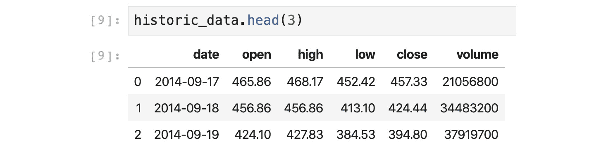
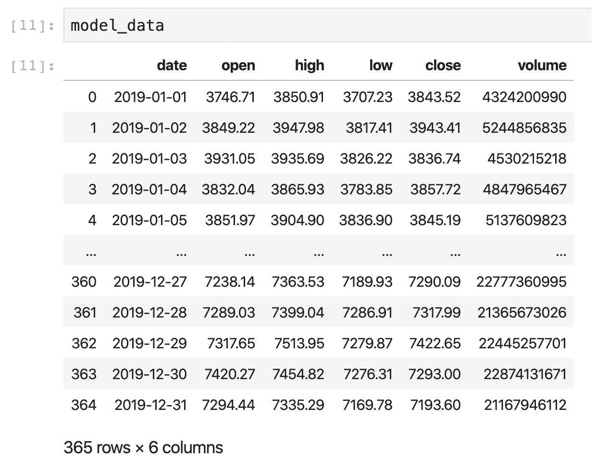
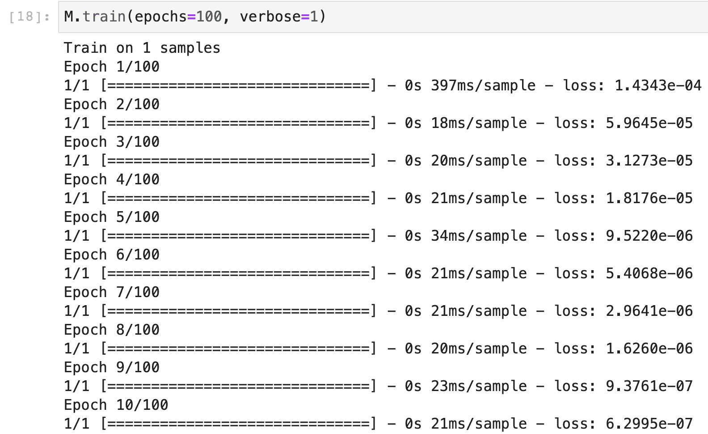
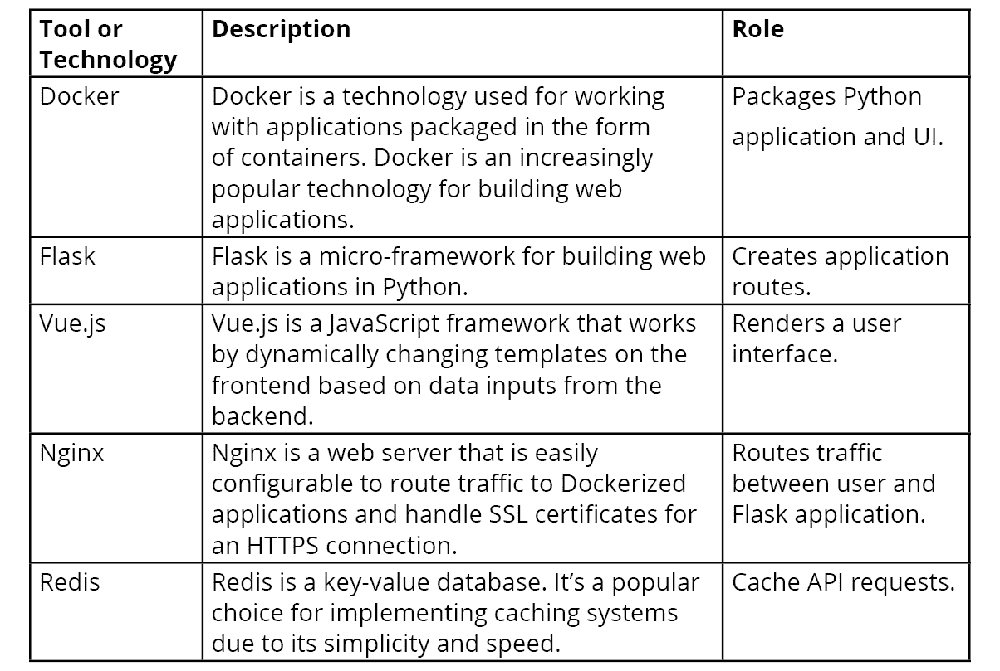
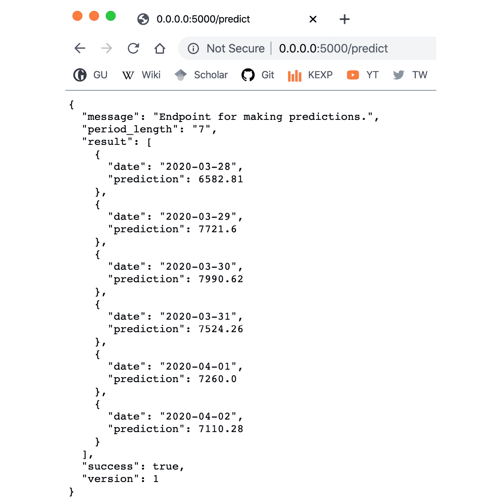

# 第四章：4\. 产品化

概览

在本章中，你将处理新数据，并创建一个能够从展示的模式中持续学习并帮助做出更好预测的模型。我们将以网页应用程序为例，展示如何部署深度学习模型，不仅因为网页应用程序的简单性和普及性，还因为它们提供了不同的可能性，比如通过网页浏览器在移动设备上获取预测结果，并为用户制作 REST API。

# 介绍

本章的重点是如何将深度学习模型*产品化*。我们使用“产品化”这个词来定义从深度学习模型创建软件产品的过程，使其可以被其他人和应用程序使用。

我们关注的是那些使用新数据并在数据可用时进行学习的模型，这些模型能够从新数据中持续学习模式，并因此做出更好的预测。在本章中，我们将研究两种处理新数据的策略：一种是重新训练现有模型，另一种是创建一个完全新的模型。然后，我们将在比特币价格预测模型中实现后一种策略，以使其能够持续预测新的比特币价格。

在本章结束时，我们将能够部署一个可工作的网页应用程序（具有有效的 HTTP API），并根据需要进行修改。

# 处理新数据

模型可以使用一组数据进行一次性训练，然后用来进行预测。这类静态模型非常有用，但通常情况下，我们希望模型能够从新数据中持续学习——并在此过程中不断改进。

在本节中，我们将讨论处理新数据的两种策略，并展示如何在 Python 中实现它们。

## 数据和模型的分离

在构建深度学习应用程序时，最重要的两个领域是数据和模型。从架构角度来看，建议将这两个领域分开。我们认为这是一个好建议，因为这两个领域本质上包含了彼此独立的功能。数据通常需要收集、清洗、整理和标准化，而模型需要训练、评估，并能够进行预测。

根据这个建议，我们将使用两个不同的代码库来帮助构建我们的网页应用程序：Yahoo Finance API 和 `Model()`：

+   Yahoo Finance API：可以使用以下命令通过 `pip` 安装该 API：

    ```py
    pip install yfinance
    ```

    安装完成后，我们将能够访问所有与金融领域相关的历史数据。

+   `Model()`：这个类将我们目前所写的所有代码整合成一个单独的类。它提供了与我们先前训练的模型交互的功能，并允许我们使用去标准化的数据进行预测，这样更容易理解。`Model()` 类是我们的模型组件。

这两个代码库在我们的示例应用程序中被广泛使用，定义了数据和模型组件。

## 数据组件

Yahoo Finance API 帮助检索并解析股票的历史数据。它包含一个相关方法 `history()`，其详细代码如下：

```py
import yfinance as yf
ticker =  yf.Ticker("BTC-USD")
historic_data = ticker.history(period='max')
```

这个 `history()` 方法从 Yahoo Finance 网站收集数据，解析数据并返回一个已准备好供 `Model()` 类使用的 pandas DataFrame。

Yahoo Finance API 使用参数 `ticker` 来确定要收集的加密货币。Yahoo Finance API 还提供了许多其他加密货币，包括以太坊（Ethereum）和比特币现金（Bitcoin Cash）等流行的加密货币。通过使用 `ticker` 参数，你可以更改加密货币，并训练一个与本书中创建的比特币模型不同的模型。

## 模型组件

`Model()` 类是我们实现应用程序模型组件的地方。`Model()` 类包含五个方法，这些方法实现了本书中的所有不同建模主题。它们分别是：

+   `build()`：这个方法使用 TensorFlow 构建一个 LSTM 模型。该方法作为一个简单的包装器，用于手动创建的模型。

+   `train()`：这个方法使用类实例化时提供的数据来训练模型。

+   `evaluate()`：这个方法使用一组损失函数来评估模型。

+   `save()`：这个方法将模型保存为本地文件。

+   `predict()`：这个方法基于按周排序的观察输入序列进行预测并返回结果。

我们将在本章中使用这些方法来工作、训练、评估和发出预测。`Model()` 类是如何将 TensorFlow 的核心功能包装成 Web 应用程序的一个示例。前面提到的方法几乎可以像以前的章节一样实现，但有增强的接口。例如，以下代码中实现的 `train()` 方法使用来自 `self.X` 和 `self.Y` 的数据训练 `self.model` 中的模型：

```py
def train(self, data=None, epochs=300, verbose=0, batch_size=1): 
    self.train_history = self.model.fit(x=self.X, y=self.Y, \
                                        batch_size=batch_size, \
                                        epochs=epochs, \
                                        verbose=verbose, \
                                        shuffle=False)
    self.last_trained = datetime.now()\
    .strftime('%Y-%m-%d %H:%M:%S') 
    return self.train_history
```

一般来说，Keras 工作流程中的每个过程（构建或设计、训练、评估和预测）都可以轻松地转化为程序中的独立部分。在我们的案例中，我们将它们转化为可以从 `Model()` 类调用的方法。这组织了我们的程序，并提供了一系列约束（例如关于模型架构或某些 API 参数的约束），帮助我们在稳定的环境中部署模型。

在接下来的章节中，我们将探讨处理新数据的常见策略。

## 处理新数据

机器学习模型的核心理念（包括神经网络）是它们可以从数据中学习模式。假设一个模型已经使用某个数据集进行训练，现在它开始进行预测。现在，假设有新的数据可用。你可以采用不同的策略，让模型利用这些新数据学习新模式并改进其预测。在本节中，我们将讨论两种策略：

+   重新训练旧模型

+   训练新模型

### 重新训练旧模型

在这个策略中，我们通过使用新数据来重新训练现有模型。通过这种策略，你可以持续调整模型参数，以适应新的现象。然而，后期训练期间使用的数据可能与早期数据有显著差异。这些差异可能导致模型参数发生重大变化，比如让模型学习新的模式并遗忘旧的模式。这种现象通常被称为**灾难性遗忘**。

注意

灾难性遗忘是一个常见的现象，影响着神经网络。深度学习研究人员多年来一直在努力解决这个问题。DeepMind（一个来自英国、隶属于谷歌的深度学习研究团队）在寻找解决方案方面取得了显著进展。文章《克服神经网络中的灾难性遗忘》，*James Kirkpatrick* 等人，提供了很好的参考，相关资料可以在[`arxiv.org/pdf/1612.00796.pdf`](https://arxiv.org/pdf/1612.00796.pdf)找到。

用于第一次训练的接口（`model.fit()`）也可以用于用新数据进行训练。以下代码段加载数据并帮助训练一个模型，指定了训练的轮数（epochs）和批量大小（batch size）：

```py
X_train_new, Y_train_new = load_new_data()
model.fit(x=X_train_new, y=Y_train_new, batch_size=1, \
          epochs=100, verbose=0)
```

在 TensorFlow 中，当模型训练时，模型的状态会作为权重保存在磁盘上。当你使用 `model.save()` 方法时，该状态也会被保存。而当你调用 `model.fit()` 方法时，模型会使用新的数据集进行重新训练，且以之前的状态作为起点。

在典型的 Keras 模型中，这种技术可以正常使用而不会遇到问题。然而，在处理 LSTM 模型时，这种技术有一个关键限制：训练数据和验证数据的形状必须相同。例如，在*第三章*，*使用 TensorFlow 和 Keras 进行真实世界深度学习：评估比特币模型*中，我们的 LSTM 模型（`bitcoin_lstm_v0`）使用了 186 周的数据来预测未来的一周。如果我们尝试用 187 周的数据来重新训练模型以预测下一周，模型会抛出异常，并提供有关数据形状不正确的信息。

解决这个问题的一种方法是将数据安排成模型所期望的格式。例如，为了基于一年的数据（52 周）进行预测，我们需要配置一个模型，用 40 周的数据预测未来一周。在这种情况下，我们首先使用 2019 年初的 40 周数据训练模型，然后继续在接下来的周数中进行重新训练，直到达到第 51 周。我们使用 `Model()` 类在以下代码中实现了这一重新训练技术：

```py
M = Model(data=model_data[0*7:7*40 + 7], variable='close', \
          predicted_period_size=7)
M.build()
M.train()
for i in range(41, 52):
    j = i - 40
    M.train(model_data.loc[j*7:7*i + 7])
```

这种技术通常训练速度较快，并且适用于较大的序列数据。接下来的技术更容易实现，并且在较小的序列中表现良好。

### 训练新模型

另一种策略是每当有新数据时，创建并训练一个新模型。这种方法通常能减少灾难性遗忘，但随着数据量的增加，训练时间也会增加。其实现相当简单。

以比特币模型为例，假设我们有 2019 年 49 周的旧数据，并且在一周后，新的数据可用。我们通过以下代码片段中的`old_data`和`new_data`变量来表示这一点，并在新数据可用时实现训练新模型的策略：

```py
old_data = model_data[0*7:7*48 + 7]
new_data = model_data[0*7:7*49 + 7]
M = Model(data=old_data,\
          variable='close', predicted_period_size=7)
M.build()
M.train()
M = Model(data=new_data,\
          variable='close', predicted_period_size=7)
M.build()
M.train()
```

这种方法非常简单，通常适用于小型数据集。这将是我们比特币价格预测应用的首选解决方案。

## 练习 4.01: 动态重新训练模型

在这个练习中，你需要重新训练一个模型，使其具备动态功能。每当加载新数据时，模型应能根据数据做出预测。以下是需要遵循的步骤：

首先导入 `cryptonic`。Cryptonic 是一本书中为实现这一节的步骤而开发的简单软件应用，使用 Python 类和模块实现了所有步骤。可以将 Cryptonic 视为创建应用程序的模板。作为本练习的 Python 模块，Cryptonic 可以在以下 GitHub 链接找到：[`packt.live/325WdZQ`](https://packt.live/325WdZQ)。

1.  首先，我们将启动一个 Jupyter Notebook 实例，然后加载 `cryptonic` 包。

1.  使用终端，导航到 `Chapter04/Exercise4.01` 目录，并执行以下代码来启动 Jupyter Notebook 实例：

    ```py
    $ jupyter-lab
    ```

    服务器会自动在浏览器中打开，然后打开名为 `Exercise4.01_Re_training_a_model_dynamically.ipynb` 的 Jupyter Notebook。

1.  现在，我们将从`cryptonic`包中导入类：`Model()`和 Yahoo Finance API。这些类简化了操作我们模型的过程。

1.  在 Jupyter Notebook 实例中，导航到标题为 `Fetching Real-Time Data` 的部分。我们将通过调用 `history()` 方法，从 Yahoo Finance 获取更新的历史数据：

    ```py
    import yfinance as yf
    ticker =  yf.Ticker("BTC-USD")
    historic_data = ticker.history(period='max')
    ```

    `historic_data` 变量现在包含一个 pandas DataFrame，其中包含比特币汇率的历史数据，直到运行此代码的时刻为止。这非常好，并且使得在获取更多数据时重新训练我们的模型变得更容易。

1.  你可以使用以下命令查看存储在`historic_data`中的前三行数据：

    ```py
    historic_data.head(3)
    ```

    然后，你可以查看存储在`historic_data`中的数据：

    

    图 4.1: 显示数据头部的输出

    数据包含与我们使用的比特币数据集几乎相同的变量。然而，大部分数据来自较早的时间段，即 2017 年到 2019 年。

1.  使用 pandas API，筛选出 2019 年可用的数据，并将其存储在`model_data`中。你应该能够通过使用日期变量作为筛选索引来实现这一点。确保在继续之前已经过滤好数据：

    ```py
    start_date = '01-01-2019'
    end_date = '31-12-2019'
    mask = ((historic_data['date'] \
             >= start_date) & (historic_data['date'] \
             <= end_date))
    model_data = historic_data[mask]
    ```

    在下一个单元格中运行`model_data`，输出模型如下所示：

    

    图 4.2: model_data 变量显示历史数据

    `Model()` 类将我们在所有活动中编写的所有代码进行了汇编。我们将在本活动中使用该类来构建、训练和评估我们的模型。

1.  我们将使用筛选后的数据来训练模型：

    ```py
    M = Model(data=model_data, \
              variable='close', predicted_period_size=7)
    M.build()
    M.train()
    M.predict(denormalized=True)
    ```

1.  运行以下命令查看训练后的模型：

    ```py
    M.train(epochs=100, verbose=1)
    ```

    训练后的模型显示在以下截图中：

    

    图 4.3：显示我们训练好的模型的输出

    上述步骤展示了使用 `Model()` 类训练模型时的完整工作流。

    注意

    完整代码请参阅 `Chapter04/Exercise4.01` 文件夹。

1.  接下来，我们将重点关注每次新数据可用时重新训练我们的模型。这样可以根据新数据调整网络权重。

    为此，我们已将模型配置为使用 40 周来预测一周。现在我们想利用剩余的 11 周完整数据来创建 40 周的重叠周期。每个周期包括这 11 周中的一个，并为每个周期重新训练模型。

1.  在 Jupyter Notebook 中导航到`Re-Train Old Model`标题。现在，使用索引完成`range`函数和`model_data`筛选参数，按七天为一组进行数据拆分，形成重叠组。然后，重新训练我们的模型并收集结果：

    ```py
    results = []
    for i in range(A, B): 
        M.train(model_data[C:D])
        results.append(M.evaluate())
    ```

    `A`、`B`、`C` 和 `D` 变量是占位符。使用整数来创建重叠的七天组，其中重叠部分为一天。

    将这些占位符替换为周数后，我们按照以下方式运行循环：

    ```py
    results = []
    for i in range(41, 52):
        j = i-40
        print("Training model {0} for week {1}".format(j,i))
        M.train(model_data.loc[j*7:7*i+7])
        results.append(M.evaluate())
    ```

    这是显示该循环结果的输出：

    ```py
    Training model 1 for week 41
    Training model 2 for week 42
    Training model 3 for week 43
    Training model 4 for week 44
    Training model 5 for week 45
    Training model 6 for week 46
    Training model 7 for week 47
    Training model 8 for week 48
    Training model 9 for week 49
    Training model 10 for week 50
    Training model 11 for week 51
    ```

1.  重新训练模型后，继续调用`M.predict(denormalized=True)`函数并检查结果：

    ```py
    array([7187.145 , 7143.798 , 7113.7324, 7173.985 , 7200.346 ,
           7300.2896, 7175.3203], dtype=float32)
    ```

1.  接下来，我们将专注于每次有新数据时创建和训练一个新模型。为此，我们假设我们有 2019 年 49 周的旧数据，并且过了一周后我们有了新数据。我们用`old_data`和`new_data`变量表示这一点。

1.  导航到 `New Data New Model` 标题，并将数据分为 `old_data` 和 `new_data` 两个变量：

    ```py
    old_data = model_data[0*7:7*48 + 7]
    new_data = model_data[0*7:7*49 + 7]
    ```

1.  然后，首先使用`old_data`训练模型：

    ```py
    M = Model(data=old_data,\
              variable='close', predicted_period_size=7)
    M.build()
    M.train()
    ```

    现在我们已经拥有了训练动态模型所需的所有组成部分。

    注意

    要访问该特定部分的源代码，请参考 [`packt.live/2AQb3bE`](https://packt.live/2AQb3bE)。

    你也可以在线运行这个示例，访问 [`packt.live/322KuLl`](https://packt.live/322KuLl)。你必须执行整个 Notebook 才能获得期望的结果。

在下一部分中，我们将把模型部署为 Web 应用程序，使其预测结果通过 HTTP API 在浏览器中可用。

## 将模型部署为 Web 应用程序

在本节中，我们将把模型部署为 Web 应用程序。我们将使用 Cryptonic Web 应用程序来部署模型，探索其架构，以便我们将来能够进行修改。我们的目的是让您使用此应用程序作为更复杂应用程序的起点——一个完全可用并可以根据需要扩展的起点。

除了熟悉 Python，本主题还假设您了解创建 Web 应用程序的相关知识。具体来说，我们假设您对 Web 服务器、路由、HTTP 协议和缓存有一定的了解。您可以在没有深入了解 Web 服务器、HTTP 协议和缓存的情况下，本地部署所演示的 Cryptonic 应用程序，但学习这些知识将使未来的开发更加轻松。

最后，Docker 用于部署我们的 Web 应用程序，因此对该技术的基本了解也是有帮助的。

在继续之前，请确保您的计算机上已安装并可以使用以下应用程序：

+   Docker（社区版）17.12.0-ce 或更高版本

+   Docker Compose (`docker-compose`) 1.18.0 或更高版本

这两个组件可以从 [`docker.com/`](http://docker.com/) 下载并安装在所有主要系统上。这些组件对于完成本次活动至关重要。确保在继续之前，它们已经安装并可在系统中使用。

## 应用程序架构与技术

为了部署我们的 Web 应用程序，我们将使用 *图 4.4* 中描述的工具和技术。Flask 是关键，因为它帮助我们为模型创建一个 HTTP 接口，使我们能够访问 HTTP 端点（例如 `/predict`）并以通用格式接收数据。其他组件之所以被使用，是因为它们在开发 Web 应用程序时非常流行：



](img/B15911_04_04.jpg)

图 4.4：用于部署深度学习 Web 应用程序的工具和技术

这些组件按如下图所示组合在一起：


](img/B15911_04_05.jpg)

图 4.5：本项目中构建的 Web 应用程序的系统架构

用户通过浏览器访问 Web 应用程序。然后，流量由 Nginx 路由到包含 Flask 应用程序的 Docker 容器中（默认情况下，运行在 `5000` 端口）。Flask 应用程序在启动时已实例化我们的比特币模型。如果指定了一个模型，它将使用该模型而不进行训练；如果没有，它会创建一个新模型，并使用来自 Yahoo Finance 的数据从头开始训练。

在模型准备好之后，应用程序会验证请求是否已缓存到 Redis 中；如果缓存存在，它会返回缓存的数据。如果没有缓存，它将继续进行预测，并在用户界面中渲染结果。

## 练习 4.02：部署和使用 Cryptonic

Cryptonic 被开发为一个容器化应用程序。在 Docker 术语中，这意味着该应用程序可以作为 Docker 镜像构建，然后在开发或生产环境中作为 Docker 容器部署。

在这个练习中，我们将学习如何使用 Docker 和 Cryptonic 部署应用程序。在开始之前，请从 [`www.docker.com/products/docker-desktop`](https://www.docker.com/products/docker-desktop) 下载 Docker Desktop，确保在开始练习之前该应用程序已在后台运行。

注意

该练习的完整代码可以在 [`packt.live/2AM5mLP`](https://packt.live/2AM5mLP) 找到。

1.  Docker 使用名为 `Dockerfile` 的文件来描述如何构建镜像的规则以及当镜像作为容器部署时会发生什么。Cryptonic 的 Dockerfile 可在以下代码中找到：

    ```py
    FROM python:3.6 
    ENV TZ=America/New_York
    """
    Setting up timezone to EST (New York)
    Change this to whichever timezone your data is configured to use.
    """
    RUN ln -snf /usr/share/zoneinfo/$TZ /etc/localtime && echo $TZ > /etc/timezone
    COPY . /cryptonic
    WORKDIR "/cryptonic"
    RUN pip install -r requirements.txt
    EXPOSE 5000
    CMD ["python", "run.py"]
    ```

1.  可以使用以下命令构建 Docker 镜像：

    ```py
    $ docker build --tag cryptonic:latest
    ```

    此命令将使 `cryptonic:latest` 镜像可用于作为容器部署。构建过程可以在生产服务器上重复执行，或者直接部署该镜像并作为容器运行。

1.  在镜像构建完成并可用后，您可以使用 `docker run` 命令运行 Cryptonic 应用程序，如下所示的代码所示：

    ```py
    $ docker run --publish 5000:5000 \
    --detach cryptonic:latest
    ```

    `--publish` 标志将本地 `5000` 端口绑定到 Docker 容器的 `5000` 端口，`--detach` 使容器在后台以守护进程模式运行。

    如果您已经训练了一个不同的模型，并且希望使用该模型而不是训练新模型，您可以在 `docker-compose.yml` 文件中修改 `MODEL_NAME` 环境变量。该变量应包含您训练并希望提供的模型的文件名（例如，`bitcoin_lstm_v1_trained.h5`）；它也应该是一个 Keras 模型。如果您这样做，请确保将本地目录挂载到 `/models` 文件夹中。您决定挂载的目录必须包含您的模型文件。

    Cryptonic 应用程序还包括一些在部署您自己的模型时可能会用到的环境变量：

    `MODEL_NAME`：允许我们提供一个经过训练的模型供应用程序使用。

    `BITCOIN_START_DATE`：确定用于比特币系列的起始日期。近年来，比特币价格的波动比早期更大。此参数过滤数据，仅保留感兴趣年份的数据。默认值为 `2017 年 1 月 1 日`。

    `PERIOD_SIZE`：设置以天为单位的周期大小。默认值为 `7`。

    `EPOCHS`：配置模型在每次运行时训练的轮数。默认值为 `300`。

    这些变量可以在 `docker-compose.yml` 文件中进行配置。该文件的一部分在以下代码片段中显示：

    ```py
    version: "3" 
       services:
          cache:
             image: cryptonic-cache:latest
             build:
                context: ./cryptonic-cache
                dockerfile: ./Dockerfile
             volumes:
                - $PWD/cache_data:/data
             networks:
                - cryptonic
          cryptonic:
             image: cryptonic:latest
             build:
                context: .
                dockerfile: ./Dockerfile
             ports:
                - "5000:5000"
             environment:
                - BITCOIN_START_DATE=2019-01-01
                - EPOCH=50
                - PERIOD_SIZE=7
    ```

1.  部署 Cryptonic 最简单的方法是使用仓库中的 `docker-compose.yml` 文件 ([`packt.live/2AM5mLP`](https://packt.live/2AM5mLP))。

    这个文件包含了应用程序运行所需的所有规范，包括如何连接 Redis 缓存以及使用哪些环境变量的说明。导航到`docker-compose.yml`文件所在的位置后，可以通过`docker-compose up`命令启动 Cryptonic，示例如下代码：

    ```py
    $ docker-compose up -d
    ```

    `-d`标志会将应用程序在后台执行。

1.  部署后，Cryptonic 可以通过 Web 浏览器在端口`5000`访问。该应用程序具有一个 HTTP API，在调用时会进行预测。API 有一个端点`/predict`，该端点返回一个包含未来一周比特币价格预测的去归一化 JSON 对象。以下是显示`/predict`端点的示例 JSON 输出片段：

    ```py
    {
      message: "API for making predictions.",
      period_length: 7,
        result: [ 15847.7,
          15289.36,
          17879.07,
          …
          17877.23,
          17773.08
        ],
        success: true,
        7
    }
    ```

    注意

    要访问此特定章节的源代码，请参考[`packt.live/2ZZlZMm`](https://packt.live/2ZZlZMm)。

    本节目前没有在线互动示例，需要在本地运行。

现在可以将应用程序部署到远程服务器上，然后你可以使用它持续预测比特币价格。在接下来的活动中，你将部署一个应用程序。

## 活动 4.01：部署深度学习应用程序

在本节中，基于到目前为止解释的概念，尝试将模型作为本地 Web 应用程序进行部署。你需要按照以下步骤进行：

1.  导航到`cryptonic`目录。

1.  为所需组件构建 Docker 镜像。

1.  更改`docker-compose.yml`中的必要参数。

1.  在本地使用 Docker 部署应用程序。

预期输出如下：



图 4.6：预期输出

注意

本活动的解决方案可以在第 150 页找到。

# 总结

本课程结束了我们创建深度学习模型并将其作为 Web 应用程序部署的旅程。我们的最后一步包括部署一个使用 Keras 和 TensorFlow 引擎构建的比特币价格预测模型。我们通过将应用程序打包为 Docker 容器并进行部署，使得其他人可以通过其 API 使用我们模型的预测结果，以及其他应用程序。

除此之外，你还学到了很多可以改进的地方。我们的比特币模型只是一个模型可以做的示例（特别是 LSTM）。现在的挑战有两个：如何让模型随着时间推移表现得更好？你还可以为 Web 应用程序添加哪些功能，使得你的模型更易于访问？通过你在本书中学到的概念，你将能够开发模型并不断改进它们，以实现更精确的预测。
