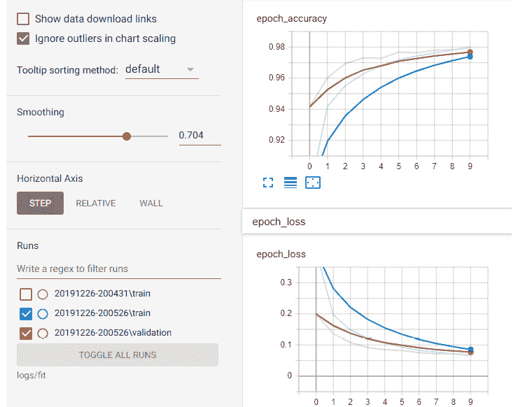
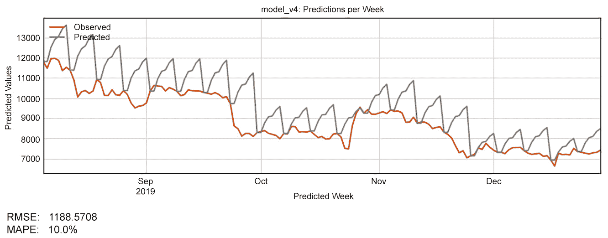
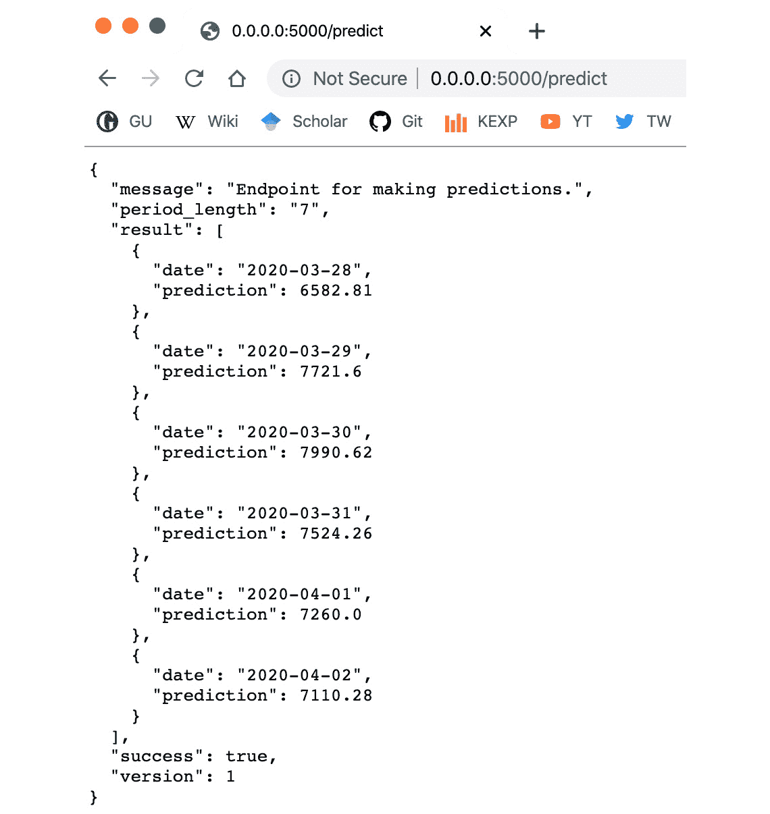

# 附录

# 第一章：神经网络与深度学习简介

## 活动 1.01：使用不同的超参数训练神经网络

解决方案：

1.  使用终端，导航至从 [`packt.live/2ZVyf0C`](https://packt.live/2ZVyf0C) 克隆的目录，并执行以下命令启动 TensorBoard：

    ```py
    $ tensorboard --logdir logs/fit
    ```

    输出如下：

    

    图 1.15：启动 TensorBoard 实例后的终端截图

1.  现在，在浏览器中打开 TensorBoard 提供的 URL。你应该能看到 TensorBoard `SCALARS` 页面：

    图 1.16：TensorBoard SCALARS 页面截图

1.  在 TensorBoard 页面中，点击 `SCALARS` 页面并放大 `epoch_accuracy` 图表。现在，将平滑滑块移至 `0.6`。

    准确率图表衡量了网络预测测试集标签的准确性。最初，网络完全错误地预测这些标签。这是因为我们用随机值初始化了网络的权重和偏置，所以它的第一次尝试只是猜测。然后，网络会在第二次运行时改变它层的权重和偏置；网络将继续通过改变权重和偏置来投资于那些给出正面结果的节点，并通过逐渐减少它们对网络的影响来惩罚那些没有效果的节点（最终达到 `0`）。如你所见，这是一种高效的技术，能迅速取得良好的结果。

1.  要通过更改不同的超参数训练另一个模型，请在 `Chapter01/Activity1.01` 中打开终端，激活环境。修改 `mnist.py` 中的以下几行：

    ```py
    learning_rate = 0.0001 (at line number 47)
    epochs = 10 (at line number 56)
    ```

    `mnist.py` 文件将如下所示：

    

    图 1.17：mnist.py 文件截图以及需要更改的超参数

1.  现在，为这个新训练的模型重复 *步骤 1-3*。启动 TensorFlow，打开 TensorBoard 上看到的 URL 中的 `Scalar` 页面，并查看 `epoch_accuracy` 图表。你将看到与之前图表的差异：

    图 1.18：TensorBoard 截图，显示步骤 4 中指定的参数

1.  现在重复 *步骤 4*。在 `Chapter01/Activity1.01` 中打开终端，激活环境。将 `mnist.py` 中的以下几行修改为以下值：

    ```py
    learning_rate = 0.01 (at line number 47)
    epochs = 5 (at line number 56)
    ```

    可视化结果。你将得到如下图表：

    

图 1.19：TensorBoard 图表截图

现在尝试使用你的自定义值运行模型，看看图表如何变化。

注意

请参考 `mnist.py` 文件，网址：[`packt.live/2ZVyf0C`](https://packt.live/2ZVyf0C)。

你可以修改神经网络中的许多其他参数。目前，先尝试调整网络的训练轮数（epochs）和学习率（learning rate）。你会发现，单独调整这两个参数就能显著改变网络的输出——但变化幅度有限。尝试通过仅调整这两个参数，看是否能在当前架构下更快地训练网络。

注意

要访问本节的源代码，请参阅[`packt.live/3eiFdC3`](https://packt.live/3eiFdC3)。

本节目前没有在线互动示例，需要在本地运行。

使用 TensorBoard 验证你的网络训练情况。通过将初始值乘以 10 多次来调整这些参数，直到你注意到网络在改进。这个过程，即调整网络并找到更高准确度，实际上就是今天工业应用中用于改进现有神经网络模型的方式。

# 第二章：现实世界中的深度学习：预测比特币的价格

## 活动 2.01：组建深度学习系统

解决方案：

我们将继续使用 Jupyter Notebooks 和第二章之前练习中准备的数据（`data/train_dataset.csv`），以及我们本地保存的模型（`bitcoin_lstm_v0.h5`）：

1.  导入加载和训练深度学习模型所需的库：

    ```py
    import numpy as np
    import pandas as pd
    import matplotlib.pyplot as plt
    %matplotlib inline
    from tensorflow.keras.models import load_model
    plt.style.use('seaborn-white')
    ```

    注意

    `close_point_relative_normalization` 变量将用于训练我们的 LSTM 模型。

    我们将首先加载在之前活动中准备的数据集。我们将使用 pandas 将该数据集加载到内存中。

1.  使用 pandas 将训练数据集加载到内存中，如下所示：

    ```py
    train = pd.read_csv('data/train_dataset.csv')
    ```

1.  现在，快速检查数据集，执行以下命令：

    ```py
    train.head()
    ```

    如本章所述，LSTM 网络需要三维的张量。这三维分别是周期长度、周期数和特征数。

    现在，继续创建每周分组，然后重新排列结果数组以匹配这些维度。

1.  随时使用提供的 `create_groups()` 函数来执行此操作：

    ```py
    create_groups(data=train, group_size=7)
    ```

    该函数的默认值是 `7` 天。

    现在，确保将数据分为两组：训练集和验证集。我们通过将比特币价格数据集的最后一周分配给评估集来做到这一点。然后，我们训练网络以评估最后一周的数据。将训练数据的最后一周分开，并使用 `numpy.reshape()` 重新调整其形状。重新调整形状很重要，因为 LSTM 模型只接受以这种方式组织的数据：

    ```py
    X_train = data[:-1,:].reshape(1, 186, 7)
    Y_validation = data[-1].reshape(1, 7)
    ```

    现在我们的数据已经准备好用于训练。接下来，我们加载之前保存的模型，并用指定的训练轮数对其进行训练。

1.  导航到 `Load Our Model` 标题并加载我们之前训练的模型：

    ```py
    model = load_model('bitcoin_lstm_v0.h5')
    ```

1.  现在，使用我们的训练数据 `X_train` 和 `Y_validation` 来训练该模型：

    ```py
    %%time
    history = model.fit( x=X_train, y=Y_validation, epochs=100)
    ```

    请注意，我们将模型的日志存储在一个名为`history`的变量中。模型日志对于探索其训练精度的具体变化以及观察损失函数的表现非常有用：

    

    图 2.27：Jupyter Notebook 的一部分，其中我们加载了之前的模型并用新数据进行训练

1.  最后，让我们用训练好的模型进行预测。使用相同的数据`X_train`，调用以下方法：

    ```py
    model.predict(x=X_train)
    ```

1.  模型立即返回一个包含下 7 天预测的归一化值的列表。使用`denormalize()`函数将数据转换为美元值。使用最新可用的值作为参考，来缩放预测结果：

    ```py
    denormalized_prediction = denormalize(predictions, \
                                          last_weeks_value)
    ```

    输出结果如下：

    

    图 2.28：使用我们刚构建的 LSTM 模型预测未来 7 天比特币价格

    注意

    我们在这张图中结合了两个时间序列：真实数据（垂直线之前）和预测数据（垂直线之后）。模型展示了与之前看到的模式相似的变化，并且暗示在接下来的 7 天内价格将会上涨。

1.  当你完成实验后，使用以下命令保存你的模型：

    ```py
    model.save('bitcoin_lstm_v0_trained.h5')
    ```

    我们将保存这个训练好的网络，以备将来参考，并与其他模型的性能进行比较。

网络可能已经从我们的数据中学习到了某些模式，但它如何能在如此简单的架构和如此少的数据下做到这一点呢？LSTM 是从数据中学习模式的强大工具。然而，在接下来的课程中我们将学习到，LSTM 也可能会遭遇过拟合问题，这是一种神经网络常见的现象，表现为它们从训练数据中学习到的模式在预测现实世界中的模式时没有用处。我们将学习如何应对这种情况，并改进我们的网络，使其能够做出有用的预测。

注意

要访问此特定部分的源代码，请参考[`packt.live/2ZWfqub`](https://packt.live/2ZWfqub)。

你也可以在线运行这个示例，网址是[`packt.live/3gIhhcT`](https://packt.live/3gIhhcT)。你必须执行整个 Notebook 才能获得期望的结果。

# 第三章：现实世界深度学习：评估比特币模型

## 活动 3.01：优化深度学习模型

解决方案：

1.  使用终端，通过执行以下命令启动 TensorBoard 实例：

    ```py
    $ cd ./Chapter03/Activity3.01/
    $ tensorboard --logdir=logs/
    ```

    当 TensorBoard 在浏览器中打开时，你将看到`SCALARS`页面：

    

    图 3.20：TensorBoard 显示 SCALARS 页面的截图

1.  打开屏幕上出现的网址，并保持该浏览器标签页打开。同时，使用以下命令启动一个 Jupyter Notebook 实例：

    ```py
    $ jupyter-lab
    ```

    这是显示 Jupyter Notebook 的截图：

    

    图 3.21：Jupyter Notebook

    打开出现在不同浏览器窗口中的 URL。

1.  现在，打开名为`Activity3.01_Optimizing_a_deep_learning_model.ipynb`的 Jupyter Notebook，导航到 Notebook 的标题。运行单元格以导入所有必需的库。

1.  设置种子以避免随机性：

    ```py
    np.random.seed(0)
    ```

    我们将像之前的活动中那样加载训练数据和测试数据。我们还将使用`split_lstm_input()`工具函数将其分为训练组和测试组：

    

    图 3.22：显示加载数据集结果的截图

    在这个 Notebook 的每个部分，我们将实现新的优化技术到模型中。每次进行优化时，我们都会训练一个新的模型，并将其训练后的实例存储在一个描述模型版本的变量中。例如，我们的第一个模型`bitcoin_lstm_v0`在这个 Notebook 中被称为`model_v0`。在 Notebook 的最后，我们将使用 MSE、RMSE 和 MAPE 来评估所有模型。

1.  要使这些模型运行，请执行**参考模型**部分下的单元格。

1.  现在，在打开的 Jupyter Notebook 中，导航到`添加层和节点`标题。你将在下一个单元格中看到我们的第一个模型。这是我们在*第二章*中构建的基本 LSTM 网络，*《使用 TensorFlow 和 Keras 进行真实世界深度学习：预测比特币价格》*。现在，我们需要为这个网络添加一个新的 LSTM 层：

    图 3.23：带有添加新 LSTM 层代码的 Jupyter Notebook

    利用你在本章中学到的知识，继续添加一个新的 LSTM 层，然后编译并训练模型。

    在训练模型时，记得频繁访问正在运行的 TensorBoard 实例。你将能够看到每个模型运行并比较其损失函数的结果：

    

    图 3.24：不同模型的损失函数输出

    TensorBoard 实例显示了许多不同的模型运行。TensorBoard 对于实时跟踪模型训练非常有用。

1.  在本节中，我们关注探索不同规模的训练周期（epoch）。使用`train_model()`工具函数为不同的模型版本和运行命名：

    ```py
    train_model(model=model_v0, X=X_train, \
                Y=Y_validate, epochs=100, \
                version=0, run_number=0)
    ```

    使用不同的 epoch 参数训练模型。

    此时，你要确保模型不会对训练数据发生过拟合。你需要避免这种情况，因为如果模型过拟合，它将无法预测在训练数据中已表示但在测试数据中具有不同表示的模式。

    在完成对 epoch 的实验后，继续进行下一个优化技术：激活函数。

1.  现在，导航到 Notebook 中的`激活函数`标题。在此部分，你只需更改以下变量：

    ```py
    activation_function = "relu”
    ```

    本节中我们使用了 `tanh` 函数，但您可以尝试其他激活函数。查看 [`keras.io/activations/`](https://keras.io/activations/) 上的可用列表，尝试其他选项。

    我们的最终选择是尝试不同的正则化策略。这通常更复杂，可能需要几次迭代才能看到任何改进，尤其是在数据较少的情况下。此外，添加正则化策略通常会增加网络的训练时间。

1.  现在，导航到笔记本中的 `Regularization Strategies` 章节。在本节中，您需要实现 `Dropout()` 正则化策略。找到合适的位置将此步骤添加到我们的模型中：

    图 3.25：显示正则化策略代码的 Jupyter 笔记本

1.  您还可以在此尝试 L2 正则化（或将两者结合）。像使用 `Dropout()` 一样操作，但现在使用 `ActivityRegularization(l2=0.0001)`。

    最后，让我们使用 RMSE 和 MAPE 来评估我们的模型。

1.  现在，导航到笔记本中的 `Evaluate Models` 章节。在本节中，我们将评估模型对测试集下一个 19 周数据的预测结果。然后，我们将计算预测序列与测试序列的 RMSE 和 MAPE。

    第一个图表如下所示：


图 3.26：预测序列与测试序列 #1

第二个图表如下所示：


图 3.27：预测序列与测试序列 #2

第三个图表如下所示：


图 3.28：预测序列与测试序列 #3

第四个图表如下所示：


图 3.29：预测序列与测试序列 #4

第五个图表如下所示：



图 3.30：预测序列与测试序列 #5

我们实现了与*练习 2.01*、*探索比特币数据集*，[`packt.live/3ehbgCi`](https://packt.live/3ehbgCi)中相同的评估技术，所有内容都封装在工具函数中。只需运行本节的所有单元格，直到笔记本结束，就能看到结果。

注意

若要访问此特定章节的源代码，请参考 [`packt.live/2ZgAo87`](https://packt.live/2ZgAo87)。

您还可以在 [`packt.live/3ft5Wgk`](https://packt.live/3ft5Wgk) 在线运行此示例。必须执行整个笔记本才能获得预期的结果。

在本次活动中，我们使用了不同的评估技术来获得更准确的结果。我们尝试了更多的训练周期，改变了激活函数，添加了正则化，并在不同场景中比较结果。利用这个机会调整前述优化技术的参数，尝试超越该模型的表现。

# 第四章：产品化

## 活动 4.01：部署深度学习应用

解决方案：

在本次活动中，我们将模型作为 Web 应用程序本地部署。这使我们可以通过浏览器连接到 Web 应用程序，或者通过应用程序的 HTTP API 使用其他应用程序。你可以在[`packt.live/2Zdor2S`](https://packt.live/2Zdor2S)找到本活动的代码。

1.  使用你的终端，导航到`cryptonic`目录并构建所有所需组件的 Docker 镜像：

    ```py
    $ docker build --tag cryptonic:latest .
    $ docker build --tag cryptonic-cache:latest       cryptonic-cache/
    ```

    这两个命令构建了我们将在此应用中使用的两个镜像：`cryptonic`（包含 Flask 应用）和`cryptonic-cache`（包含 Redis 缓存）。

1.  构建完镜像后，找到`docker-compose.yml`文件并用文本编辑器打开它。将`BITCOIN_START_DATE`参数更改为`2017-01-01`以外的日期：

    ```py
    BITCOIN_START_DATE = # Use other date here
    ```

1.  最后一步，使用`docker-compose up`在本地部署你的 Web 应用，如下所示：

    ```py
    docker-compose up
    ```

    你应该能看到终端中的活动日志，其中包括模型完成的训练周期。

1.  在模型训练完成后，你可以访问`http:// localhost:5000`并在`http://localhost:5000/predict`进行预测：

图 4.7：Cryptonic 应用程序本地部署的截图

注意

要访问本节的源代码，请参考[`packt.live/2Zg0wjd`](https://packt.live/2Zg0wjd)。

本节目前没有在线交互示例，需要在本地运行。
