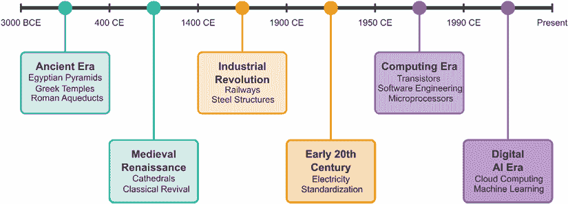
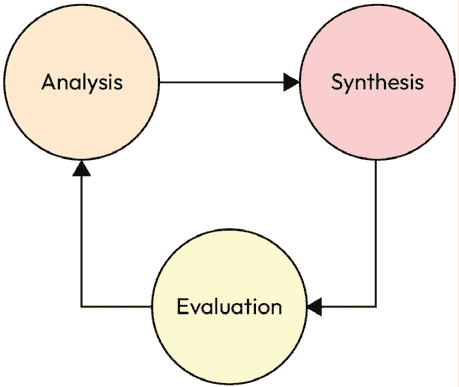
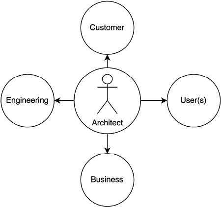
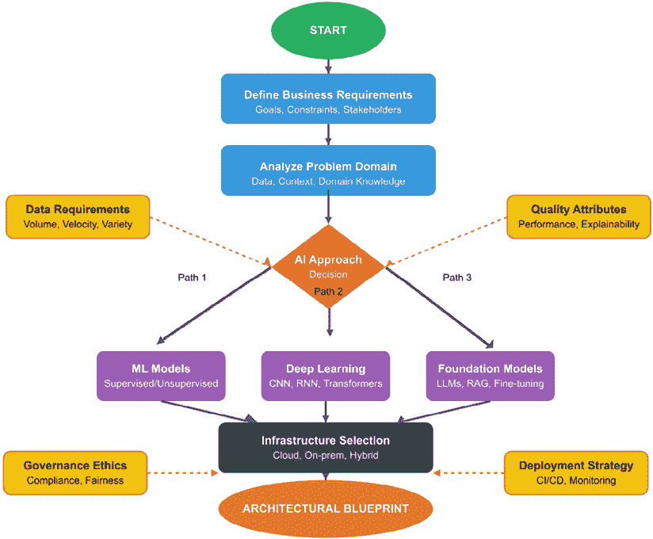
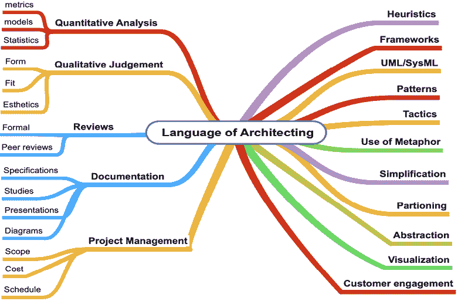
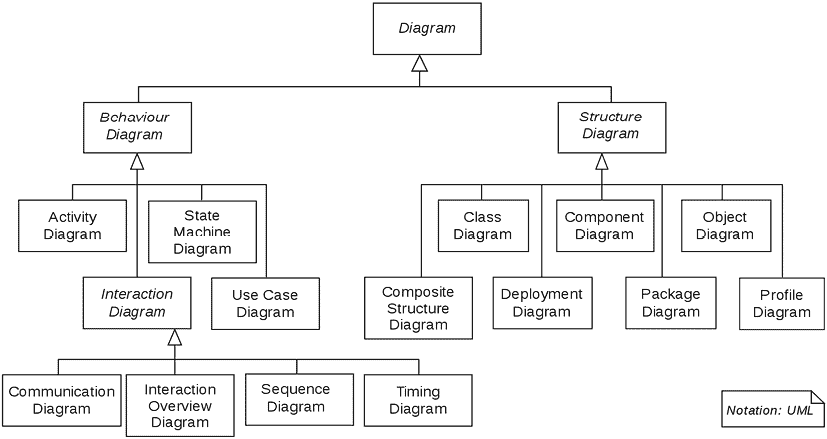

# 第二章：架构的案例

如果没有公共建筑，世界会是什么样子？建筑将随意建造，健康和安全法规可能无法实施，与市政实体的协调将不存在，由于建造者之间的协调缺乏基础凝聚力，实际建造时间会更长。建筑师，凭借愿景、目的、流程、工具和方向，确保建造出正确的系统。严格架构的系统还允许统一努力，并确保整个项目团队了解要建造的内容。

在复杂系统开发中也需要架构。一个复杂系统包含许多不同的工程领域，这些领域必须结合起来才能构建出一个单个领域无法独立完成的系统。所有团队之间都存在竞争需求和知识不完整。很多时候，甚至存在基本挑战，即不知道如何相互沟通。在复杂系统中，通常有不同的利益相关者，他们对最终系统的需求相互矛盾——架构师必须调解这些需求。

架构师的角色是制定统一愿景，指导技术上可行的设计，并实现符合预算目标和开发进度的系统创建。

架构师的角色起源于古代，对现代系统至关重要。在软件系统中，架构师的角色与民用建筑师一样关键。软件架构师执行关键功能，确保构建出正确的系统，并作为系统最终用户的首要倡导者。架构师还负责确保系统保持凝聚力。这是一个艰巨的任务。接受架构的角色和流程可以提高最终系统的质量和成功率。

# 架构失败的影响

为了开始讨论复杂软件架构，让我们进行一个快速的思想实验。

想象一下，你的团队被分配了一个任务，要构建一个应用程序，用于在网络上对数据存储进行查询并将结果返回给远程用户。现在，你的团队中有四位软件工程师：一位负责数据存储，一位负责服务层，一位将用户界面与数据存储应用程序集成，还有一位工程师负责用户界面。

这里是七种会损害项目成功的实践：

1.  团队成员之间无方向的沟通和协调，因为通常没有共同的理解或参考点来统一行动

1.  在没有需求验证的情况下，将所有工程假设视为同等有效

1.  通过多数投票而非技术专长来做出设计决策

1.  将客户沟通限制在用户界面工程师

1.  将集成和测试视为可选活动

1.  消除中间里程碑和审查检查点

1.  仅将最终交付日期视为有意义的里程碑

在这种情况下，不会交付可用的软件。每个未完成的列表项都将被视为架构失败。这是一个简单的系统——当系统需求增长或领域变得更加具有挑战性时，架构的重要性就会凸显出来。AI 赋能的软件是异常复杂的软件。

本章将介绍架构的概念背景，如何用它来减轻失败，更重要的是，阐述正确的架构可以使人能够交付稳健的 AI 赋能软件的合理性。

本章我们将涵盖以下主要主题：

+   构建学的起源

+   架构师的角色

+   持有愿景的人

+   构建过程

+   架构的语言

# 构建学的起源

建筑学这一职业的根源可以追溯到远古时代。建筑师这个词来自希腊语“arche”，意为第一，以及“techion”，意为建造者。因此，建筑师是那个将概念带到将服务于某一目的的系统的人。对于现代 AI 软件架构师来说，这意味着他们必须努力构建一个能够以算法方式正确做出决策或推理的系统。

古代建筑师为人类提供了古埃及的金字塔、纪念希腊化神祇的美丽结构，以及罗马的水渠等。埃及建筑师构思并领导了持续数千年的巨大结构的发展。他们在协调数千名工人以及使用数学来指导工艺和岩石的尺寸（需要正确切割和放置）方面发挥了关键作用，这些岩石需要以惊人的精度和对称性进行切割和放置，从而展示了数学和工程协调的掌握。希腊化时期的建筑师发展了建造具有美丽对称性的寺庙和结构的技术，利用设计模式和做出决策，尽管通常不是最优的，但结果是一个既美观又实用的系统。

他们还协调和指导了工艺和规划，以实现他们的愿景。这些结构规模巨大，其结构的稳固性和负载平衡使它们能够持续数千年。罗马建筑师建造了令人惊叹的斗兽场，规划了道路、寺庙和水渠。这展示了灵活性和具有指导复杂系统建造的工程深度。

水渠不仅展示了建造结构的指挥能力，还展示了利用流体动力学原理和高级工程将水输送到各自城市许多部分的能力。这种新型结构对城市产生了变革性的影响。水，作为人类必需的液体，不仅用于饮用，还用于清洁和娱乐，现在可以被人口享受和使用。

图 2.1：建筑演变时间线

**快速提示**：需要查看此图像的高分辨率版本？请使用下一代 Packt Reader 打开此书或查看 PDF/ePub 副本。

**下一代 Packt Reader**以及此书的**免费 PDF/ePub 副本**包含在您的购买中。扫描二维码或访问[`packtpub.com/unlock`](https://packtpub.com/unlock)，然后使用搜索栏通过名称查找此书。请仔细检查显示的版本，以确保您获得正确的版本。

从历史上看，架构师通常是推动最终系统愿景到开发的单一个人。架构师是整合力量，确保构建的组件能够结合并实现系统级效果。架构既是古老又是现代艺术的见解源于古老的格言，即最好的系统来自单一愿景，系统应展示某些关键属性和设计模式的使用。

随着现代时代的到来，特别是欧洲历史的文艺复兴时期，技术的持续和加速发展爆炸式增长，且没有减缓。在现代世界，我们见证了令人叹为观止的发展，如铁路、航海船只、大规模电力、汽车、飞机、雷达、电信、计算机、核能、太空飞行、医疗设备、卫星、互联网和个人智能手机。作为一个工程学科的初生儿，软件是一个关键系统。在进一步讨论之前，我想澄清，这是一本关于**软件架构**和**AI 赋能系统**的书。因此，从现在开始，我将使用“系统”一词来指代**软件系统**。

系统架构师连接用户需求和科技实施，通过学科协调、需求定义和开发监督来协调复杂项目。

在 AI 赋能系统中，架构师平衡传统软件关注点与专业挑战：

+   数据管道管理和模型开发工作流程。

+   在保持输出稳定性的同时，系统适应性。

+   算法组件与软件基础设施的集成。

与通过图纸可视化的物理结构不同，软件架构需要多个视角：

+   逻辑模型和功能规范。

+   运营场景和用例。

+   接口控件和服务协议。

+   原型、模拟和分析。

现代复杂性需要架构团队与领域专家合作，同时保持单一责任架构师的明确决策权——避免基于委员会的设计决策的陷阱。

# 架构师的角色

架构师究竟交付了什么？一个贬义词是，他们只是文档创作者，因为他们提供规范、操作概念文档、建模图、白皮书和技术评估。这些都是架构过程和沟通工具的产物，引导后续的工程活动。思考和协作必须在创建相关且具有影响力的文档之前完成。

例如，如果数据库工程师只负责构建应用程序会发生什么？

没有统一的愿景，专家自然会根据他们的专业知识进行优化——数据库工程师优先考虑数据结构，而界面设计师则专注于用户体验。这种专业化需要中心角色来提供凝聚力。架构师平衡客户期望和技术要求，指导设计决策，并协调项目执行。

本节探讨了架构师的责任，提供了对角色范围和重要性的洞察。这个崇高的头衔承载着重大的责任。

从古代纪念碑到现代系统，架构师的功能保持一致：满足多样化的利益相关者，同时提供功能性解决方案。埃及金字塔建筑师在统治者颂扬与建设可行性之间取得平衡；现代建筑师同样在确保在预算和进度约束内适当实施的同时，协调竞争性优先事项。

## 平衡人工智能架构中的愿景和精确度

人工智能架构师必须同时作为战略家和技术分析师发挥作用。他们的双重责任要求在确定关键实施细节的同时，制定与价值一致的路线图，这些细节可能会损害系统完整性。

成功的架构师采用 5W+H 框架来连接宏观和微观视角：

+   **Who**：受人工智能系统影响的用户、利益相关者和角色。

+   **What**：目的、约束、技术、数据需求和计算复杂性。

+   **Why**：对需求、技术和实施决策的正当性。

+   **When**：交付时间表、再训练周期和集成里程碑。

+   **Where**：系统定位、数据源、执行环境和存储解决方案。

+   **How**：测试方法、集成方法、错误处理和性能指标。还有如何满足非功能性考虑，如安全性、隐私、历史数据存储和整体系统可观察性。

每项调查都必须通过成本、进度和性能的视角进行评估，同时解决合规性和安全约束。不存在通用的模板——有效的架构师应用情境启发式方法，从压倒性的复杂性中筛选关键细节。

# 人工智能系统和架构

人工智能赋能的系统在软件中实现。通过使用一系列模型、原型设计、审查和设计指导，架构可以改善工程努力。鉴于人工智能赋能系统的抽象性质，架构设计是一种风险降低活动，通过系统地包括许多视角并吸引利益相关者，以确保不犯第一级错误。架构师可以定义、指导和评估原型设计工作，以确保原型设计为项目增加价值。使用文档和演示文稿的审查确保在工程团队、利益相关者和最终用户之间有连贯的沟通。这些文档提供给客户，以证明工程努力被理解，并给客户机会影响项目方向。工程团队使用这些文档来协助执行各自的过程和活动。文档帮助项目规划者确定项目的范围和时间表以及预算。最后，这些文档是架构师用来定义和更新待建系统最终愿景的活文档。

架构师的角色要求他们执行以下任务：

+   理解并定义对利益相关者的需求。

+   开发模型、图表、图纸、文档和设计工件。

+   与建设者或工程师沟通，以便建设者能够实际创建结构或系统。

+   监督并可能领导系统的设计。

+   协调和解决开发过程中出现的问题和问题。

+   对已建成的系统进行最终验收。

随着技术的进步，对系统的需求呈指数级增长，因此使得架构师的角色变得更加重要。对于现代系统，在尽可能的范围内，需要深入到利益相关者的领域，例如客户、监管机构、合作伙伴，甚至内部员工。架构师必须知道如何利用新系统为客户创造价值。需要理解必须处理的多种约束，例如安全、合规性和监管约束。一个常见的情况是，许多软件系统失败并不是因为系统的任何部分没有正确构建或测试，而是因为构建了错误的系统。

架构师的主要工件种类繁多。架构师需要创建和裁决系统愿景文档，指导全面范围的模型，编写和沟通规范文档，协助设计审查，并为测试开发计划、验证流程以及最终系统验收提供指导。架构师的角色也与项目和项目执行交织在一起。

对于人工智能赋能的系统，架构师必须执行以下任务：

+   明确沟通人工智能技术如何为利益相关者创造价值，定义使用和业务影响。

+   使数据科学家能够构建需要强大数学和算法理解的复杂模型。标准软件图必须通过性能模拟、详细的决策映射和强大的状态机技术来增强。

+   与人工智能工程师紧密合作，确保支持文档能够实现统一系统操作。人工智能工程师寻求整合机器学习模型。他们还负责构建满足非功能性要求系统，使得分析管道可扩展、可靠且可控。人工智能工程师还寻求开发与系统愿景一致的设计。人工智能工程师需要平衡各自的详细设计，以符合或与系统的整体愿景保持一致。

+   确定系统在没有人为干预的情况下做出自主决策的关键非功能性需求、模式和策略。

+   引导测试团队通过决策正确性验证，跨越各种输入，包括系统鲁棒性的非标准场景。

建筑师必须领导需求推导和用例开发，以确保围绕人工智能功能的支持系统被正确构建。

# 愿景的持有者

想象一下，你和你的两位朋友想要一起去吃午餐。在这个场景中，你最终决定去哪里，但你必须充分考虑你两位朋友的愿望。这个简单的决定可能会变得复杂：你们吃什么？在哪里吃？费用是多少？必须做出决定，但如何决定呢？在这种情况下，影响决策的其他考虑因素必须被提出来，比如生活方式、节俭、过敏和类似的因素。作为决策者，你必须制定一个决策，综合你朋友表达出的愿望和限制。作为做出决策的人，你必须制定一个愿景，协调你两位朋友的竞争需求，同时确保结果能够带来价值。这就是建筑师所做的事情。他们为系统制定一个愿景，然后根据这个愿景引导系统的建设。系统的愿景支撑着系统的许多方面，因此必须正确制定、传达并确保它满足利益相关者的需求。

对于人工智能系统，建筑师必须阐明技术如何为利益相关者创造价值，定义明确的企业影响和使用模式。他们的建模责任需要强大的数学理解，以创建性能模拟、决策映射和状态机，这些超出了标准软件图的范围。

建筑师与人工智能工程师合作，确保文档能够实现统一系统操作。他们确定非功能性需求和自主决策的架构模式，无需人为干预。

测试指南侧重于在多种输入和故障场景中进行决策正确性验证，确保系统健壮性。在整个开发过程中，架构师领导需求推导和用例开发，以正确集成 AI 功能与支持系统。

# 架构周期

架构周期是一个迭代过程，其中进行分析和综合以及评估以开发第一级概念。

分析活动包括分解系统需要提供的重大功能和子功能，识别对 AI 系统最相关的非功能性需求，以及识别可以用来判断系统性能或作为其他关键属性衡量标准的驱动指标或措施。其他关键属性的例子可以是成本限制、故障之间的时间、可用性指标等。

综合活动是一个创造性的过程，其中执行第一级设计以得出可行概念。这是架构师最初可以使用模式和策略来描述逻辑框架、识别必须执行以满足客户需求的过程，以及识别可以使用的技术的地方。

评估过程被执行以对不同的综合概念进行排序和优先排序。建模和系统分析可用于测试和理解不同概念的范围。如果评估中出现太多不确定性或困难，则可能进行原型设计以帮助这一阶段。可以使用决策矩阵。一旦定义了一组概念，那么最终一步是与所有相关利益相关者进行审查过程，但最终决定由利益相关者决定如何进行。

图 2.2：架构周期

## 像架构师一样思考

一个常见的问题是人们如何像架构师一样思考？这是一种可以学习并随着经验而磨练的技能。如果一个人专注于某个领域或技术方法，这一点尤为重要。像架构师一样思考的主要主题是深入理解结构和过程如何影响系统的设计。例如，架构师应识别或发现系统的关键非功能性需求。系统如何满足最终目标或主要目标？在软件中，至少这需要开发、理解和评估功能、逻辑结构和行为过程。

在像架构师一样思考时，利益相关者至关重要，因为他们是接受系统并为其建设付费的人。通过与利益相关者的互动，无论是正式的还是半正式的，都可以获得参与和验证。

用于此的工具包括以下内容：

1.  审查客户可能已经拥有的文档。

1.  对该领域的市场研究。

1.  客户竞争对手的检查或审查。

1.  访谈、研讨会和专注会议。

1.  快速原型设计，受限制的演示。

1.  开发关键技术文档，并经过客户的审查和接受。

让我们用一个假设的例子来思考，就像是一个金融服务领域的建筑师。金融机构必须时刻警惕欺诈交易或欺骗行为。AI 的使用是这类用例的理想选择。对于建筑师来说，挑战在于从众多现有方法中选择合适的技术。深度网络在识别交易中的异常或异常模式方面非常有效，但深度网络不能提供识别交易所需的推理链，这是合规要求所必需的。符号方法在识别异常交易方面不如深度网络稳健，但它可以为将交易分类为异常提供推理链。

建筑师应该怎么做？考虑使用两种技术的逻辑结构。

在分析领域时，能够快速识别异常情况的速度是一个驱动因素。异常情况发现得越快，负面影响就能越快得到缓解。深度网络随后用作第一个过滤器，将异常条件标记出来，然后输入到使用符号方法的分类引擎中。

以下是一些需要提出的问题，以推动架构考虑：

+   推动分类的推理是什么？一个长期未活跃的账户突然活跃？交易的大小？

+   系统将要接收哪些数据？每秒的交易量？客户元数据？外部数据源？

+   将使用的数据质量如何？需要进行哪些过滤和转换？系统需要一个公共时间戳吗？客户需要匿名化吗？

+   系统如何影响客户的商业模式？这个系统会推动收入增长吗？它会降低成本吗？它符合合规要求吗？

+   需要哪些计算硬件、软件和网络基础设施？

+   设计是否直观？谁在使用它？初级员工？会计师？财务专业人士？运营人员？

+   交付时间表是否与客户的资金能力和使用该技术的员工资源相匹配？

+   解决方案能否满足成本和进度约束？

+   将引入客户组织的新风险有哪些？系统会阻止交易吗？如果错过交易会发生什么？

在像建筑师一样思考时，可以获得全局视角，并区分可能产生重大架构影响的关键细节。

## 维护架构愿景

向利益相关者传达系统愿景是至关重要的，需要清晰地阐述利益、价值和潜在风险。架构师必须在整个开发过程中保持一致性——确保一致性，同时整合利益相关者的反馈并适应不断变化的需求。

尽管不可避免地会有变化，但架构师必须防止组件和接口的分歧，以保持连续性。利益相关者需要详细了解实施如何满足在预算和时间限制内的功能需求。

对于人工智能赋能的系统，愿景必须解决系统核心的算法决策问题。这包括定义适当的检查和平衡、建立严格的数据质量要求和可观察性，以及设计建立对自动化操作信任的人机交互。

在人工智能赋能的项目中，清晰地记录和传达系统愿景至关重要。这涉及到协作努力创建关键文档和视觉辅助工具，包括以下内容：

+   **操作概念文档**：在人工智能项目中，这些文档尤为重要，因为它们描述了人工智能系统将在各种现实世界场景中如何运作以及如何与用户互动。

+   **高级用例图**：对于人工智能系统，这些图非常重要，因为它们展示了人工智能与其环境和用户交互的不同方式，突出了自动决策和响应。

+   **逻辑和功能分解**：在人工智能的背景下，这些分解有助于利益相关者理解底层人工智能架构以及不同的组件，如机器学习模型和数据处理单元是如何相互配合的。

+   **支持性叙述**：这些叙述对于用可理解的方式解释复杂的 AI 功能和算法至关重要，帮助非技术利益相关者理解人工智能如何实现其预期任务。

+   **模型**：逻辑数据模型工件、数据流图以及关于数据治理方法的指导。

图 2.3：平衡利益相关者

*图 2.3*概述了架构师在制定愿景时需要平衡利益相关者可能提出的众多需求。为了有效地做到这一点，需要进行大量的沟通、图表和参与。对于人工智能赋能的系统，架构师通常承担最大的责任，能够沟通并解释系统的算法决策如何影响利益相关者。

# 现代系统架构

将人类送上月球并将他们带回地球的系统与先进的医疗设备、现代汽车和微处理器有什么共同之处？

它们是提供极其专业化的能力系统，在 20 世纪之前，这些能力是无法想象的。让我们短暂地偏离一下，看看现代系统开发的历史是如何导致架构的发展的。

第二次世界大战通过科学整合和协调工程催化了变革性的系统——通信、雷达、火箭和核技术。这种方法产生了数百项战后创新，彻底改变了现代生活。

今天的组织雇佣了系统架构师，他们像他们的民用同行一样，创造愿景、代表客户、推动复杂系统设计。随着航空航天、电子、医疗、核能和海军领域性能需求的增加，这一学科变得至关重要。

尽管工程专业各不相同，但集成开发的必要性仍然是普遍的。复杂系统需要跨多个团队和利益相关者的协调——通过架构模型、沟通和使不同学科朝着统一实施方向发展的工件实现统一。

对于本书的重点——具有人工智能功能的系统，架构师必须处理两个重要的考虑因素：

+   人工智能组件的使用和影响旨在满足客户的需求和性能要求。

+   人工智能组件通常根植于复杂的软件系统，因此与软件开发相关的风险并不简单。

对于复杂系统需要一个统一且一致的架构这一事实，实际上并不存在争议。值得讨论的是如何创建一个能够推动系统开发的架构。作者的一个核心观点是，严格的架构设计对于驾驭现代人工智能/机器学习系统开发和成功部署的复杂性是必要的。

软件开发的执行必须涉及从源文档中获取信息，以便界定范围、追踪需求、指导设计、允许集成，并最终进行测试。设计过程需要一个总的原理、目标和约束，以便构建系统、测试它并部署它。集成和测试团队需要了解要构建的内容，因此测试资源被分配并定义得很好。一系列相互关联的文档、治理模型和清晰的文档满足了项目关键利益相关者的许多需求。还必须存在显著的口头和领导力存在，以便能够在不同的技术团队之间导航，确保设计决策忠实于愿景，并提供指导以阐明规格和验证，确保给定的实现是正确的。正是通过文档、演示和沟通，架构师可以确保实现一个连贯的实施。

现在已经有了软件架构的标准，对于这个受众来说，最相关的是 IEEE 42010 系统和软件工程 – 架构描述。

## 人工智能架构的决策框架

构建人工智能系统需要一种结构化的决策过程，该过程平衡业务目标、技术可行性和伦理考量。架构师必须为选择适当的 AI 方法建立一个概念基础，尤其是在与大型语言模型、向量数据库和网页搜索集成等先进技术合作时。

## 选择正确的 AI 方法

在开发人工智能系统的架构愿景时，架构师必须评估哪种技术路径将最好地服务于业务需求。这些通常分为三类：

+   **传统机器学习模型**: 这些适用于与结构化数据和工作定义明确的问题合作的系统，例如欺诈检测、预测性维护或客户细分系统。

+   **深度学习架构**: 当处理需要复杂模式识别的非结构化数据时，例如图像识别、自然语言处理或音频处理，这些架构变得必要。

+   **具有检索增强生成的基座模型 (RAG)**: 这种现代方法利用了预训练的基座模型，并增强了特定领域知识检索系统。这些架构在知识密集型任务、对话界面和需要实时信息访问的系统方面表现出色。

在这些方法之间的选择不仅仅是技术决策，还必须由每个方法与整体系统愿景和利益相关者需求的契合度来指导。

*图 2.4* 展示了人工智能架构的结构化决策过程，展示了业务需求、数据特性和质量属性如何影响适当 AI 方法和基础设施的选择。该工作流程引导架构师定义需求、分析问题域、选择 AI 技术和配置基础设施，以产生一个统一的架构蓝图。

## 多维决策框架

为了确保架构师做出明智的决定，从而实现人工智能的成功实施，他们应该从三个关键维度评估架构选择：

### 业务一致性

+   **价值创造**: 该架构将如何直接支持收入生成或成本降低？

+   **运营效率**: 维护所选架构的持续运营成本是多少？

+   **风险概况**: 这种方法是否引入了需要缓解的合规性、安全或伦理风险？

### 数据科学考量

+   **数据准备**: 是否有足够的高质量数据来支持所选的方法？

+   **性能要求**: 系统必须达到哪些准确度、精确度和召回率指标？

+   **模型演进**: 架构将如何支持持续进行的模型更新和微调？

### 技术约束

+   **计算资源**: 系统将需要多少处理能力、内存和存储？

+   **集成复杂性**：AI 组件将如何与现有企业系统接口？

+   **实时要求**：架构必须满足哪些延迟约束？

### 结构化决策过程

为了解决这些多维度的关注点，架构师应实施一个结构化的决策工作流程：

1.  **定义愿景和需求**：建立明确的企业目标，并将它们转化为功能和非功能性需求。

1.  **评估数据景观**：评估可用的数据源、质量问题、隐私和可能影响模型性能的潜在偏差。

1.  **架构选择**：根据需求和数据评估，确定哪种 AI 方法在能力与限制之间取得最佳平衡。

1.  **基础设施规划**：设计部署架构，考虑扩展需求、安全要求和性能约束。

1.  **原型和验证**：开发概念验证实现，以在全面实施之前验证关键架构决策。

1.  **实施策略**：创建一个包括监控和反馈机制的、涵盖开发、测试和部署的路线图。

这种结构化方法确保架构决策不是孤立做出的，而是作为一个连贯愿景的一部分，该愿景既关注技术卓越，也关注商业价值。

图 2.4：AI 系统的架构决策流程

### 平衡创新与实用性

架构师必须在利用尖端 AI 能力和确保系统可靠性之间取得平衡。新颖的方法可能提供强大的功能，但也会引入实施挑战或运营不确定性。架构师应考虑以下因素：

+   **技术成熟度**：所选技术是否已准备好投入生产，还是仍处于实验阶段？

+   **团队能力**：组织是否有实施和维护所选架构的技能？

+   **回退机制**：系统将如何处理 AI 组件故障或意外行为？

通过在结构化决策框架内系统地解决这些考虑因素，架构师可以开发出一个 AI 系统架构，它不仅满足当前需求，而且可以随着业务需求和 AI 技术的进步而发展。

### 软件架构的语言

软件架构通过工件、分析和综合来传达系统愿景，这些工件、分析和综合通过利益相关者的参与得到验证。架构师使用抽象来对组件、接口和功能进行组织，以进行技术规划和执行。

如《软件架构实践》中所述，三个基本架构工具构成了这种语言：

**启发式方法**通过基于经验的原则来降低复杂性：

+   预测数据损坏和模型漂移

+   理解数学限制和可接受的误差

+   了解计算边界和数据流限制

**策略**解决特定问题：

+   将数据存储操作限制为 CRUD 功能

+   实施冗余控制以提高可靠性

+   安全考虑，如基于角色的访问、加密和公钥基础设施

**模式**提供可重用的模板：

+   层功能以管理复杂性

+   结构化集成数据管道

尽管比传统工程学科出现得晚，但 AI 架构已成为关键，因为智能系统构成了操作基础，创造了商业价值，在实施选项中广泛传播，建立了人类信任，并促进了人机协作。

*图 2.5*显示了作者认为架构语言的主要方面的思维导图。

图 2.5：架构语言

# AI 系统的治理和合规性考虑

在开发 AI 赋能系统时，架构师必须解决不仅包括功能和性能要求，还包括治理、可解释性和合规性维度。这些方面代表了关键的“大局”关注点，这些关注点在系统的众多详细实施决策中体现出来。

## AI 架构的治理框架

AI 治理包括确保道德和负责任的 AI 发展的政策、程序和监督机制。对于软件架构师来说，这意味着建立以下内容：

+   **偏差缓解策略**：架构必须包含可衡量的机制来识别和缓解训练数据和模型输出中的偏差。这通常需要在管道中包含特定的模型验证组件。

+   **问责结构**：**人工介入**（**HITL**）机制必须架构到关键决策路径中，尤其是在高风险领域。这意味着设计明确点，以便在不确定性下进行高价值决策的人类审查。

+   **数据来源跟踪**：系统必须维护数据来源和模型版本的综合记录，并确保所有用于训练和推理的数据源都符合数据法规和使用权。

+   **可审计性组件**：日志机制必须记录模型决策、推理数据和响应，以便进行回顾性审查和验证。

## AI 架构设计中的可解释性

与行为确定的传统软件系统不同，AI 系统引入了非确定性元素，这需要为可解释性进行特殊的架构考虑：

+   **可解释性层**：对于复杂模型，如深度神经网络，架构师应考虑提供特征归因的额外组件，使用户能够了解哪些输入对特定输出影响最大。

+   **置信度评分**：AI 响应应包括置信度指标，以表明可靠性，这需要在架构中包含特定的测量组件。

+   **决策追踪**：架构应能够记录人工智能管道中的中间步骤，以便进行模型行为的回顾性分析和调试。

+   **透明接口**：用户界面应提供适当的环境信息，包括引用或对推理过程的解释。

## 法规合规性集成

架构师必须确保人工智能系统符合适用的法规，这可能包括以下内容：

+   **数据隐私要求**：系统必须遵守 GDPR（欧盟）和 CCPA（美国）等法规，这可能需要特定的用户同意管理、数据访问控制和数据删除功能组件。

+   **特定行业法规**：在医疗保健（HIPAA）或金融等领域，架构必须纳入特定领域的保障措施和文档。

+   **算法问责制**：新兴法规要求人工智能系统可测试其偏差和公平性，要求架构师设计全面测试和验证。

## 实施考虑因素

考虑以下内容以在人工智能架构中实施治理：

+   **治理仪表板**：应集成实时监控工具以可视化人工智能决策、标记异常并跟踪偏差指标。

+   **自动合规性测试**：架构应包含验证机制，定期测试人工智能决策是否符合合规标准。

+   **联邦方法**：在隐私问题至关重要的地方，考虑如联邦学习等架构模式，以保持敏感数据去中心化。

+   **以可解释性为首要设计**：而不是将可解释性视为事后考虑，它应在模型开发阶段集成。

+   **变更控制**：能够执行回滚、故障转移和决策管理，例如何时禁用非确定性决策。

通过在架构过程中早期解决这些治理方面的问题，系统将更好地满足技术要求和道德标准，最终为利益相关者带来更大的价值，并建立用户信任。

# 建模和仿真

就像许多其他学科一样，软件架构有其自己的工具、概念和语言。强大的 AI 架构工作需要一套稳健且文档化的模型。

我们将讨论与该领域相关的不同类型模型，然后给出一些它们如何应用于人工智能系统的示例。

## 什么是软件系统建模？

模型可以被视为任何可以用来推理待构建或已构建系统的工具、分析或图表。这影响了软件系统的实际设计、实现、集成、测试和部署。这里的模型采用非常广泛和通用的方式。例如，它不仅仅是软件工程社区中标准建模的发展。以下是一些例子：

+   统一建模语言模型：例如类图、序列图和状态模型。

+   决策树：一个关注算法决策的模型。

+   系统功能图表建模：模拟业务和 n 平方图的流程。

+   统计建模和数据描述技术。

+   基于分析的模型：使用依赖于领域的数学模型来限制或限制 AI 技术的参数空间。例如，如果一个人正在开发车辆配送技术，那么限制道路上卡车速度的动力学模型是合适的。

+   数据建模：开发实体关系模型、图模型和概念数据模型

+   用户界面原型。

存在特定或更详细的模型，适用于构建 AI/ML 系统。这些模型在本质上更具有数学技术性。以下是一些例子：

+   描述性统计工具，用于帮助理解 AI/ML 输出的数据输入、数据处理和结果，例如直方图、箱线图、相关图和相关矩阵。

+   使用假设检验（p 值、统计显著性）是衡量性能或创建预期数据范围和数量的界限的考虑因素。这也有助于开发“断路器”——即控制逻辑，以确保输入数据和速率不会对 AI/ML 的性能产生不利影响。

+   使用决策映射图或流程图来绘制可实现的控制路径。

## 模型和模拟在 AI/ML 系统中的作用

构建人工智能/机器学习系统的一个重要方面是使用模拟，合成数据类似于被摄入生产环境中的数据，而模拟本身也是某些模型的一种实现。模拟允许测试系统以查看实际的人工智能算法表现如何，同时也为了了解系统的性能。模拟开发不必过于复杂，但其复杂性应在一定程度上反映目标系统想要实现的内容。模拟需要自己的开发努力，并且应该从项目的开始阶段就开始。在许多方面，随着目标系统软件的开发，模拟也在增长。模拟既是一种测试工具，也是一种提出和验证设计选择工具。一个应用实例是使用已知错误的数据来评估管道的决策逻辑——例如，从低级、不可靠的温度传感器收集温度数据。人们还会使用合成数据来测试高交易领域的存储流程和内存管理，如在金融情况中看到的那样。合成数据的使用还可以在检测到模型漂移时评估模型更新，其中领域是动态的——比如在天气预报中。

下图是不同类型的 UML 图概述，这些图可以用来建模软件系统。并非所有图都需要创建，但应该进行定制工作。

图 2.6：UML 图类型概述

# 建筑和接口

建筑师在技术基线之上工作。他们需要理解如何通过数据和控制信号使相互作用的组件进行集成。数据和控制信号的交换是通过各种接口实现的，从直接的应用到应用调用，从用户界面的命令到网络服务。由于建筑师具有更广阔的视角，他们在接口的创建、更新和退役方面是主要权威。

## 接口

最后关于接口的性质以及接口在软件工程中的作用的一些说明。在软件系统中，几乎所有所需的数据和功能很少都封装在一个代码库区域中。通常，为了满足子系统的需求，它需要从系统的另一部分获取数据。

通常，当查看软件系统的逻辑或功能模型时，连接线通常表示数据交换、决策流程或两者兼而有之。接口工程对于系统内聚至关重要，以确保某个开发团队需要更改关键功能部件时不会无意中导致架构其他部分的错误。此外，很多时候，一个系统认为的“原始数据”是另一个系统的“元数据”处理结果。确保系统内聚的机制是实施接口工程。接口工程需要确保数据在正确的时间、正确的地点、正确的以正确的方式和格式到达。与其他任何角色相比，接口应由架构团队控制和指导。

## 接口与人工智能

数据接口主要影响处理管道和算法决策组件。这个核心功能不能执行所有可能的验证和验证技术。因此，它必须信任发送数据的组件在格式、规模、时序和正确性方面符合接口设计。接口对于确保“模型集成”至关重要。也就是说，当做出算法决策时，输出驱动后续功能。接口工程确保决策意图得到正确执行，并且与整个系统的工程要求保持一致。

# 摘要

总之，有人提出，进行有系统和严格的架构设计是开发成功人工智能系统的推动因素。制定架构几乎肯定可以降低整体成本，让您能够按时完成并实现预期的最终性能。需要抵制那种由于时间压力过大，编码需要“立即”开始的诱惑。在下一章中，我们将结合这一更抽象的讨论，探讨它如何具体影响软件工程。

# 相关阅读

+   巴斯，L.，克莱门茨，P.，& 卡兹曼，R. (2012). *软件架构实践*。Addison-Wesley Professional。

+   雷希特，E.，& 马伊尔，M. W. (2010). *系统架构的艺术*（第 3 版）。CRC Press。

+   韦恩斯，D. (2021). *软件架构：原理与实践*。MIT Press。

+   国际系统工程理事会。 (2015). *INCOSE 系统工程手册：系统生命周期过程和活动指南*（第 4 版）。Wiley。

+   克鲁切滕，P. (1995). 架构蓝图——“4+1”视图模型软件架构。*IEEE 软件，12*(6)，42-50。

+   巴赫蒂，P. R.，& 吉尔，H. (2011). 网络物理系统。*控制技术的影响*，161-166。

+   斯库利，D.，霍尔特，G.，戈洛温，D.，达维多夫，E.，菲利普斯，T.，埃布纳，D.，查德哈里，V.，扬，M.，克雷索，J. F.，& 丹尼森，D. (2015). 机器学习系统中的隐藏技术债务。*神经信息处理系统进展*，2503-2511。

+   Hazelwood, K., Bird, S., Brooks, D., Chintala, S., Diril, U., Dzhulgakov, D., Fawzy, M., Jia, B., Jia, Y., Kalro, A., Law, J., Lee, K., Lu, J., Noordhuis, P., Smelyanskiy, M., Xiong, L., & Wang, X. (2018). Applied Machine Learning at Facebook: A Datacenter Infrastructure Perspective. *IEEE 国际高性能计算机架构研讨会（HPCA）*，620-629.

|

#### 现在解锁这本书的独家优惠

扫描此二维码或访问[`packtpub.com/unlock`](https://packtpub.com/unlock)，然后通过书名搜索此书。 |  |

| **注意**：在开始之前准备好您的购买发票。* |
| --- |
