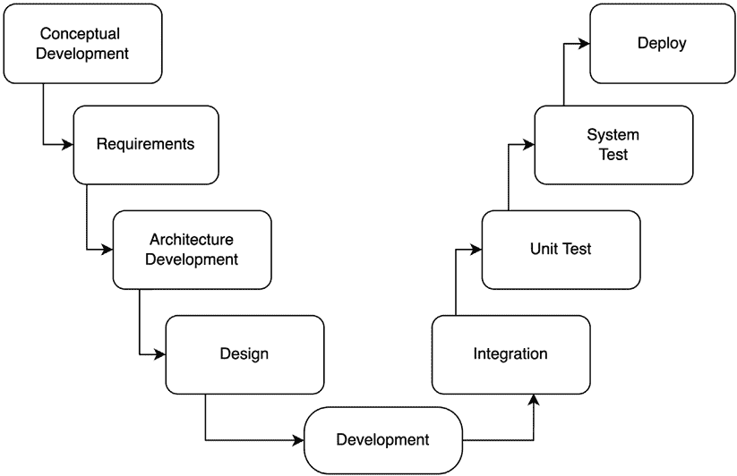
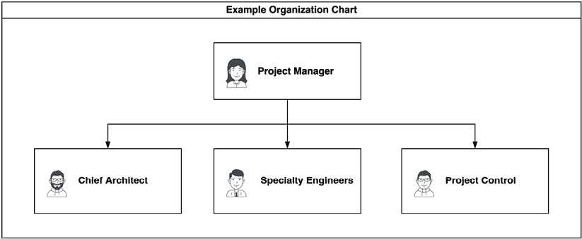
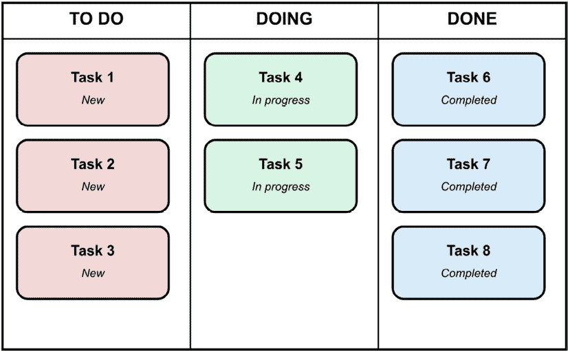
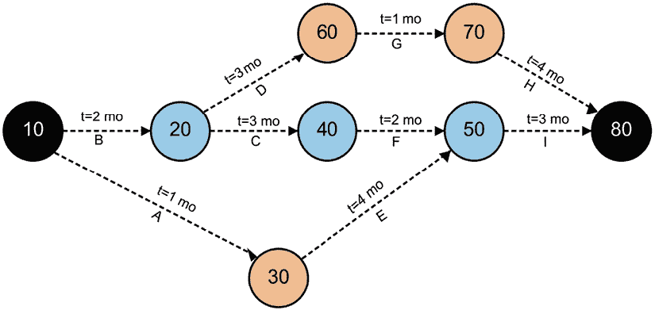

# 第三章：软件工程与架构

AI 赋能的软件在系统复杂性方面实现了重大飞跃。与遵循确定性规则的传统软件不同，AI 赋能的软件试图通过启发式算法手段模仿人类的决策、推理和目标寻求。在这个过程中，创造了多维复杂性，因此是一个非确定性系统。与传统软件工程相比，需要解决不同类型的问题。

这种复杂性以各种方式表现出来，从集成专门的机器学习组件到需要强大的数据处理管道，从处理模型不确定性到确保适当的人类监督。考虑来自 Gartner 的令人警醒的统计数据，到 2022 年，由于数据、算法或负责管理它们的团队中的偏差，85%的 AI 项目交付了错误的结果[1]。这突出了在 AI 系统开发中稳健架构的至关重要的意义。

为了理解我们讨论的复杂性的规模，考虑一下，截至 2021 年，Linux 操作系统有超过 30.34 百万行源代码（www.kernel.org）。Linux 驱动着数百万台计算机，从关键任务系统到爱好套件，由数千名工程师在几十年的时间里通过自我组织的团队构建。这样一个复杂的系统能够可靠地运行，是现代奇迹，这得益于稳定的模块化架构，它为系统开发提供了框架。

> “复杂性是我们从事的业务，也是限制我们的因素。”
> 
> 弗雷德里克·布鲁克斯，《人月神话》

软件架构与其他工程领域（如土木、航空航天和医疗）共享一些共同元素，尽管每个领域实施不同的模型、模式和分解。核心目标保持一致：确保构建正确的系统。对于复杂的软件，尤其是 AI 赋能的系统，采用严格的架构方法对于简化问题空间和通过抽象和建模范围技术解决方案至关重要。

在本章中，我们将探讨软件在 AI 系统中变得复杂的原因，概述减轻这些复杂性的架构过程和文档，并检查架构师在项目管理中的作用，以确保项目成功完成。

# 理解 AI 系统中的软件复杂性

在 AI 赋能系统中存在几种不同但相互依赖的软件复杂性类型。架构作为工具，通过建模来管理这种复杂性，帮助架构团队对系统进行推理，并为详细规范和团队沟通提供基础。

图 3.1：AI 系统的软件开发生命周期

如*图 3.1*所示，人工智能系统的开发过程遵循一个结构化的生命周期，始于概念开发，然后通过需求收集和架构开发，接着进入设计和开发阶段。开发完成后，流程继续进行集成、单元测试、系统测试，最后部署。这种系统方法通过确保在开发早期就解决架构考虑因素，有助于管理人工智能系统固有的复杂性。关于系统方法的优秀资源可以在*INCOSE 系统工程手册* [5]中找到。作者认为，这种循环可以应用于不同的开发方法，无论是瀑布式开发还是敏捷方法。

## 集成复杂性

当开发团队必须整合他们没有创建或不受控制的代码库时，软件集成变得特别具有挑战性。这跨越了软件堆栈的多个层次，从操作系统内核到应用框架。这些不同的软件包对库、操作系统、版本和编程语言的依赖性各不相同。

对于具有人工智能功能的系统，利用开源或商业软件包中的核心算法比从头开始构建功能在经济上更有优势。我们可以在 TensorFlow、PyTorch 和 scikit-learn 等框架的广泛应用中看到这一点，它们提供了复杂机器学习算法的现成实现。因此，软件架构的其余部分通常需要适应以容纳这些组件。

### 案例研究：医疗保健人工智能集成

一家实施诊断辅助系统的医疗保健提供商在整合用于医学图像分析的预训练深度学习模型时面临了重大的集成挑战。该模型使用 TensorFlow 构建，需要特定版本的支撑库，这与医院现有的基于 Java 的基础设施相冲突。架构团队通过实施一个带有容器化组件的微服务架构来解决这个问题，使人工智能系统能够在隔离环境中运行，同时通过定义良好的 API 与现有系统进行通信。然而，也存在 API 管理的复杂性。这包括处理更新或修订的 API。这迫使 API 的版本控制和兼容性基于模型或应用的演变。

## 功能复杂性

自主决策或推理的需求引入了显著的功能复杂性。决策过程必须正确执行，以便系统能够实现其目标。这需要通过监控、警报和警报来实现稳健的检查，因为人类监督并不总是可用以确保决策的正确性。

当模型变得不正确或过时时，AI 技术还引入了模型重新训练和部署的要求。必须实施警报系统和断点，以便在系统运行不正确时允许人工干预。此外，广泛的日志记录对于实现检查、警报和诊断功能是必要的。

在涉及敏感数据的人工智能系统中，如医疗保健、金融或政府应用，隐私问题和大量日志数据的管理变得尤为重要。一个良好的架构系统必须包括数据匿名化、安全存储和对日志的受控访问机制。

## 技术复杂性

AI 算法对底层硬件提出了巨大的需求。算法的计算复杂性、数据预处理需求以及性能边际增加了硬件部署决策的复杂性。例如，训练大型语言模型如 GPT-3 大约需要 3.14 x 10²³ FLOPS 的计算能力[2]，突显了现代人工智能系统的极端计算需求。

查询和数据处理的及时性要求引入了额外的挑战。在实时应用中，如自动驾驶汽车或金融交易系统，AI 组件必须在严格的时间约束内做出决策，这要求对整个处理管道进行仔细优化。

处理管道需要仔细考虑易失性内存和数据存储需求。例如，处理高分辨率图像的计算机视觉系统可能会生成数以千计的中间数据，这些数据必须被高效地管理。此外，网络安全要求通过监控、加密和日志记录需求增加了另一层复杂性。

随着人工智能系统从开发阶段过渡到生产阶段，可扩展性成为一个关键关注点。架构必须考虑到数据量、用户负载和计算需求的增加，通常需要分布式计算方法和基于云的基础设施。

## 验证复杂性

确保算法和测试用例的正确实现是人工智能系统中的独特挑战。与传统的软件不同，其输出是确定性的，AI 系统产生基于训练数据、初始化参数以及训练过程中引入的随机因素的概率性结果。

对于 AI 组件，理解和定义正常或意外的数据输入对于证明系统鲁棒性至关重要。这涉及到使用对抗性示例、边缘情况和分布外数据来测试，以确保系统在面对不熟悉的输入时也能适当行为。

虽然单元测试很有价值，但集成测试往往能揭示单元测试中遗漏的失败。一个更微妙的验证挑战在于确保所有逻辑路径和潜在的执行路径都得到了充分的测试，这在具有复杂决策边界的 AI 系统中变得指数级困难。

### 示例：计算机视觉中的验证

考虑自动驾驶汽车的行人检测系统。单元测试可能验证模型在测试数据集中以高精度正确识别行人的能力。然而，集成测试可能会揭示，当摄像头输入受到恶劣天气条件或异常照明的影响时，系统会失败。更令人担忧的是，对抗性测试可能会显示特定图案的衣物可能导致系统完全错过检测行人。稳健的验证必须考虑到所有这些场景。

## 人机界面复杂性

用户与 AI 功能之间的角色和交互必须清晰理解。这定义了信息、警告、警报和警报将在整个系统中如何激活、呈现和执行。

自动化层次的概念，由 Parasuraman 等人[3]提出，为理解人类用户与自动化系统之间责任划分提供了一个框架。即使是高度自主的 AI 系统，也需要人类进行配置、监督和干预能力。

如果用户命令与 AI 系统推荐之间出现冲突，系统必须具有明确的裁决协议。同样，用户在 AI 学习框架中参与模型更新或改进的方法也必须明确定义。

可解释性是 AI 系统中人机界面设计的关键方面。用户需要了解为什么 AI 系统做出了特定的推荐或决策，尤其是在高风险领域，如医疗保健、金融和法律应用。这需要精心设计解释机制，以弥合复杂数学模型与人类理解之间的差距。

# 实践中的架构

复杂的软件系统很少是从零开始构建的，架构师通常并不完全掌握所有相关的技术或领域专业知识。这需要将架构功能分散到一个小团队中，该团队通常包括*图 3.2*中提到的关键角色。

图 3.2：AI 项目团队的示例组织结构图

**快速提示**：需要查看此图像的高分辨率版本？在下一代 Packt Reader 中打开此书或在其 PDF/ePub 副本中查看。

**下一代 Packt Reader**以及本书的**免费 PDF/ePub 副本**包含在您的购买中。扫描二维码或访问[`packtpub.com/unlock`](https://packtpub.com/unlock)，然后使用搜索栏通过名称查找此书。请仔细核对显示的版本，以确保您获得正确的版本。

如*图 3.2*的组织结构所示，AI 项目团队通常由项目经理位于顶层，直接向他们汇报三个关键角色：首席架构师、专业工程师，如数据工程师、数据科学家、用户界面开发者、全栈开发者、DevOps 工程师、安全工程师、运营分析师、合规分析师和项目控制分析师。这种结构确保了在项目决策中给予架构问题适当的重视，首席架构师在将业务需求转化为技术规范中扮演着关键角色。以下是一些关键角色的概述：

+   **愿景持有者**：这个角色专注于最终客户的需求，并通过技术文档、演示、图表和工作层面的会议传达愿景。对于 AI 系统，这个角色必须理解业务目标和 AI 技术的功能和限制。

+   **技术专家**：这个角色提供对软件系统中所需主要组件的特定理解，包括数据库技术、中间件、用户界面设计、计算需求、网络和存储需求。在 AI 系统中，这种专业知识扩展到机器学习框架、模型部署技术和数据管理系统。

+   **AI 工程师**：这个角色理解数据科学或分析过程，以确保 AI 组件符合架构愿景，在技术约束范围内运行，并向最终客户提供价值。这包括对机器学习算法、数据准备技术和模型评估指标的了解。

领域知识和 AI/ML 工程角色应该紧密耦合，因为最终目标是让 AI/ML 技术为最终客户提供独特的价值。这些功能共同来记录和传达系统愿景。

系统工程社区的一个普遍规则是，架构设计类型的努力应消耗大约 12-15%的项目资源[5]。虽然这最初可能看起来不具生产力，但这种前期工作可以节省时间并防止项目后期出现重大技术错误，尤其是在 AI 系统中，架构决策可能对系统性能、可维护性和可扩展性产生深远的影响。

# 软件复杂性控制方法

架构过程最明显的成果是与系统开发相关的相互关联的文档。这些包括操作概念文档、用例、活动图、逻辑图、非功能性需求规范、指标定义以及识别软件开发策略和模式。

## 构建架构

即使是最小的项目也应该开发一个**操作概念**（**CONOPS**）文件，以证明 AI 系统的合理性并解释用户如何与之交互。CONOPS 文件应描述用户如何利用系统的 AI 方面，AI 将如何向客户展示，以及客户如何影响 AI 决策或输出。

本文件还将确定与系统相关的关键参与者以及 AI/ML 组件如何与他们交互（如果有的话）。CONOPS 文件应界定 AI 系统将与之接口的其他系统以及它如何适应更大的系统体系。推荐的标准是 IEEE 标准 1362-1998，“信息技术——系统定义——**操作概念**（**ConOps**）文件指南。”

架构师开发的一组关键工件是通过**统一建模语言**（**UML**）或**系统建模语言**（**SysML**）的图表来描述系统。并非所有 UML 或 SML 图表都需要开发。

最常见的图表包括以下内容：

1.  **UML 用例图**：识别参与者、角色和创造价值的动作

1.  **SysML 块定义图**：捕捉系统的主要逻辑组件

1.  **SysML 活动图**：显示控制流的一般流程

1.  **UML 状态转换图**：捕捉系统状态和转换

1.  **SysML 接口控制文档**：定义组件之间的数据交换

1.  **IDEF0 图**：显示 AI/ML 决策的输入、目标、约束和输出

这些图表必须捕捉 AI/ML 功能的完整周期，包括决策过程。这些图表应捕捉主要逻辑决策、错误处理方法、模型维护、验证和再训练过程。此外，图表应显示人类交互和对整个系统的控制。它们应突出关键数据工程方面，包括数据清洗、转换和质量检查。

数据交换接口对于 AI 系统尤其关键，它定义了数据交换的执行方式，包括质量检查、数量、速率和格式。此接口管理和数据交换的服务级别协议是数据工程的一部分，确保系统可扩展、有弹性和在计算约束内运行。在接下来的章节中，将提供更多关于这些图表的细节和示例。

如 Bass 等人[4]所述，软件架构是由施加在系统上的非功能性需求驱动的。例如，可靠性、可扩展性和可用性。对于 AI/ML 系统，常见的非功能性需求包括以下内容：

1.  **可靠性**：系统如何处理故障并保持运行

1.  **可解释性**：系统如何解释其决策和建议

1.  **公平性**：系统如何确保对用户群体进行公平对待

1.  **隐私性**：系统如何保护敏感数据

1.  **适应性**：系统如何随着数据模式的变化而发展

理解和定义 AI/ML 组件的这些需求对于成功开发系统至关重要。

## 集成与协同

复杂的 AI/ML 软件系统需要团队开发，在集成活动开始之前，需要建立稳健的集成方法。架构团队不需要完整的实现细节，但必须有效地指导过程。

四个主要的集成活动如下：

1.  **设计充分性评估**：确定设计是否满足功能和非功能需求

1.  **非功能性需求评估**：评估系统满足质量属性的程度

1.  **度量测量**：关键系统性能指标的初步确定

1.  **接口验证**：确保接口正确实施和使用

架构师必须了解不同的系统组件和数据工程如何影响整体系统。集成问题不可避免地会出现，架构师必须仔细评估系统范围内需求变更的影响。

例如，数据库查询响应时间的一个看似简单的变化可能导致 AI 组件接收不同步的数据，从而导致决策错误。架构师必须在开发早期阶段识别并解决这些依赖关系。

集成通常是首次测试非功能性需求。在开发生命周期早期解决架构级问题至关重要。后期架构变更可能对系统产生重大级联效应。集成还提供了首次测量关键系统指标和测试组件之间接口的机会。存在几种机制和流程有助于解决集成挑战。使用 DevOps **持续集成/持续部署**（**CI/CD**）技术可以自动测试新代码。这种自动化设置了步骤，在新代码开发和合并到配置的预生产系统基线时，预先定义的集成测试就会发生。DevOps 的使用还允许进行变更管理，以识别导致集成错误的基线更改区域。DevOps 流程的另一个优点是在出现问题或生产发布中的不期望行为时，可以回滚基线。

# 项目管理

尽管由于其他职责，架构师不应担任项目经理，但在项目管理中，架构师发挥着至关重要的作用。架构师为项目管理研究所定义的《项目管理知识体系指南》中规定的五大主要项目管理活动做出贡献：

## 项目启动

架构师帮助制定关键文档，包括目标、工作说明书、工作分解结构、进度表以及其他项目管理文档。他们明确工作范围，定义里程碑，并确定必要的资源，包括人员类型、努力程度和支持材料。根据项目规模或组织的工程文化，可能存在系统工程团队。如果这个团队存在，他们将与架构师紧密合作，确定关键特性和工作规划——例如，在敏捷开发方法中，他们帮助创建史诗和用户故事。

架构师还会对项目执行方法提供意见，例如敏捷或螺旋方法。

图 3.3：敏捷人工智能开发的看板

对于人工智能项目，像看板（如图 3.3 所示）这样的敏捷方法通常效果很好，允许在模型通过迭代不断优化和改进时，持续流动的任务和软件开发。看板将工作可视化在三个列中：*待办*（TO DO）表示尚未开始的任务，*进行中*（DOING）表示当前正在进行的任务，*完成*（DONE）表示已完成的任务。看板板的组织方法还有其他方式，有更多阶段。作者选择突出最基本类型的看板。任务可能发生在单个或多个执行周期中。在敏捷中，这被称为“冲刺”。

满足冲刺中“完成”标准的示例活动如下：

1.  已经进行了代码审查

1.  已经进行了单元测试

1.  新代码已经通过 CI/CD 管道运行

1.  人工验收测试

重要的一点是，一个功能可能需要跨越较长时间完成多个任务才能被认为是“完成”。使用文档和来自架构师的指导有助于跟踪和验证一个跨多个迭代的任务是“完成”的。

这个视觉管理工具帮助团队跟踪进度并识别开发过程中的瓶颈，这对于人工智能项目尤其有价值，因为任务可能具有不同复杂性和不确定性水平。

## 项目规划

在规划阶段，架构师会确定主要里程碑和里程碑完成所需的技术证据要求。他们帮助确定团队构成、努力分配和财务规划。架构师为架构团队建立报告要求和配置控制策略。

对于人工智能系统，规划必须考虑到模型开发的迭代性、算法性能的不确定性以及持续数据收集和质量保证的需要。

图 3.4：人工智能系统开发的临界路径分析

此规划过程通常涉及关键路径分析，如图 3.4 所示，它展示了不同的活动和依赖关系如何影响整体项目时间表。在这个网络图中，节点代表项目里程碑（编号 10 至 80），而边代表活动（标记为 A 至 I）及其相关持续时间（t=1 个月至 t=4 个月）。关键路径分析帮助项目经理和建筑师确定哪些活动必须按时完成以防止项目延误，以及哪些活动具有可利用的松弛时间，如果需要重新分配资源。

## 项目执行

在执行过程中，建筑师监督分配给其团队的工作项，并通过提供见解和澄清支持其他工程团队。他们帮助项目经理跟踪整体项目执行，并确保集成活动将产生一个连贯的系统。

建筑师作为解决技术冲突、明确需求和确保设计决策与整体愿景一致的关键资源。在人工智能系统中，模型精度、计算效率和可解释性之间的权衡必须仔细平衡，这一角色变得尤为重要。

## 监控与控制

对于监控与控制，建筑师提供对工程努力的质控和审查，向项目经理更新进度和资源利用情况。建筑师帮助解释技术进展并识别潜在风险，以防止其对项目结果产生影响。

在人工智能项目中，监控扩展到跟踪模型性能指标、数据质量和漂移检测，以确保系统在现实世界中的运行过程中继续满足要求。

## 项目收尾

在收尾阶段，建筑师确保测试和认证完成，在最终系统验证期间代表客户。他们与项目经理合作进行系统部署和交付，提供合同和工作说明书所需的关键工件。

对于人工智能系统，关闭活动可能包括模型维护流程的知识转移、监控工具的移交以及记录未来改进机会的文档。

### 案例研究：人工智能项目管理的实际应用

一家实施机器学习欺诈检测系统的金融服务公司面临重大的项目管理挑战。基于传统瀑布软件开发方法的初始项目计划未能考虑到模型开发的迭代性质以及与现有交易处理系统集成复杂性。

架构团队使用围绕三周冲刺的敏捷方法重构了项目，每个冲刺都专注于提高模型性能的特定方面，同时逐渐扩展集成点。敏捷方法的一个关键点是倡导以迭代的方式开发功能，以便从利益相关者那里获得快速而有力的反馈。此外，通过更早地交付可工作的代码，系统可以更快地进行测试和验证，从而减少总开发时间。他们使用合成数据进行早期集成测试，允许模型组件和系统接口的并行开发。这种方法使他们能够及早识别和解决集成问题，最终交付的系统通过 37%的欺诈损失减少同时满足所有合规要求。

作者并不打算仅仅提倡敏捷方法。瀑布机制的优点是：进行了稳健的需求收集，并且通过定义进度表和资源监督，项目控制更加紧密。此外，通常还会分配时间进行稳健的文档。敏捷方法的缺点是：没有考虑到主要功能或接口，敏捷方法可能会失去架构一致性。这发生在过多的并行开发使得执行冲突的主要设计决策时。尽管如此，我们认为，如本文所述的具有架构方面的敏捷方法在开发复杂 AI 系统方面更为有效。

# 摘要

在本章中，我们讨论了 AI 系统中算法决策引入的独特形式的软件复杂性。我们确定了这种复杂性的几个维度——集成、功能、技术、验证和人类界面——并解释了在开发项目早期应用架构流程和文档如何帮助管理这些挑战。

AI 赋能的系统不仅仅是传统软件加上一个 AI 组件；它们代表了一种本质上不同的系统类别，需要深思熟虑的架构来实现其潜力。在这些系统中，架构师的角色不仅限于技术设计，还包括项目管理、利益相关者沟通以及确保最终系统交付预期的价值。

随着我们继续阅读这本书，我们将基于这些基础概念来探讨特定的 AI 技术、实现示例以及详细的架构流程和开发工件。这些工具将使你能够成功导航 AI 系统开发的复杂性，并创建出利用 AI 能力有效的强大、有价值的解决方案。

作者认为，通过实践学习架构是最好的。随着进行更多的架构任务和项目，一个人可以磨练他们的技能。以下是一些在不同类型的系统上进行的练习，这些练习将有助于架构技能的发展。

# 练习

1.  为 AI/ML 系统识别几个组件和流程架构产品。

1.  研究并确定 CONOPS 和需求文档的使用和集成方式。

1.  识别复杂网站的主要组成部分——例如亚马逊（Amazon）、谷歌地图（Google Maps）、Zillow 或其他需要集成许多组件的系统。

# 参考文献

1.  Gartner，“Gartner 称近一半的首席信息官计划部署人工智能”，2018 年 2 月。

1.  Brown, T.，等人，“语言模型是少量样本学习者”，神经信息处理系统进展，2020 年。

1.  Parasuraman, R.，Sheridan, T.B.，和 Wickens, C.D.，“自动化与人交互的类型和水平模型”，IEEE 系统、人、和网络-第 A 部分：系统和人类，第 30 卷，第 3 期，第 286-297 页，2000 年。

1.  Bass, L.，Clements, P.，和 Kazman, R.，“软件架构实践”，Addison-Wesley，2012 年。

1.  国际系统工程委员会（International Council on Systems Engineering），“INCOSE 系统工程手册：系统生命周期过程和活动指南”，第 4 版，2015 年。

|

#### 现在解锁这本书的独家优惠。

扫描此二维码或访问[`packtpub.com/unlock`](https://packtpub.com/unlock)，然后通过书名搜索此书。 |  |

| **注意**：在开始之前准备好您的购买发票。* |
| --- |
