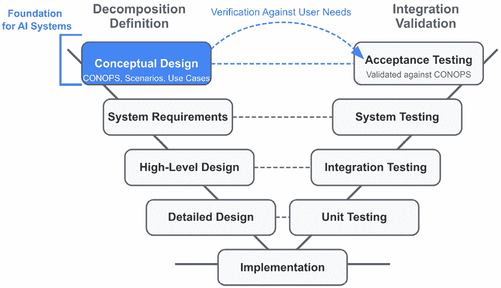
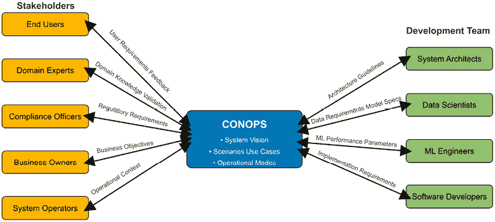
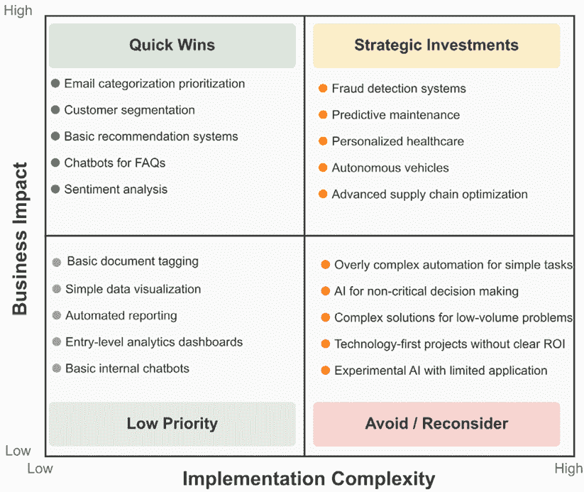
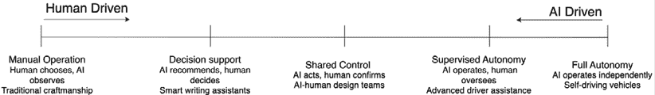
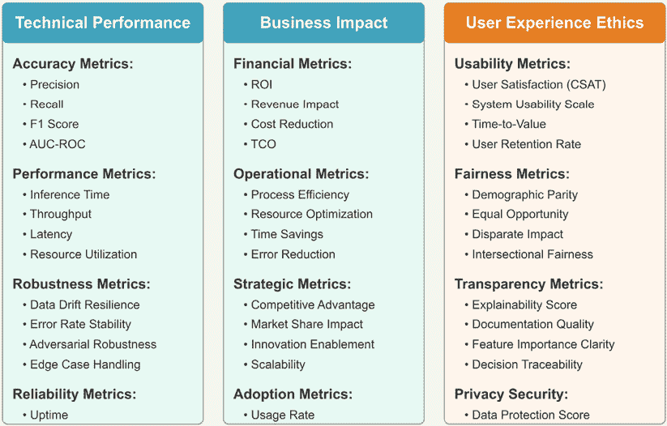
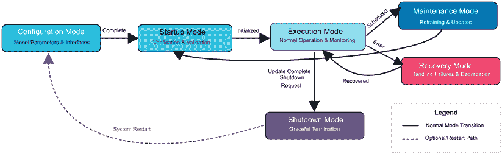
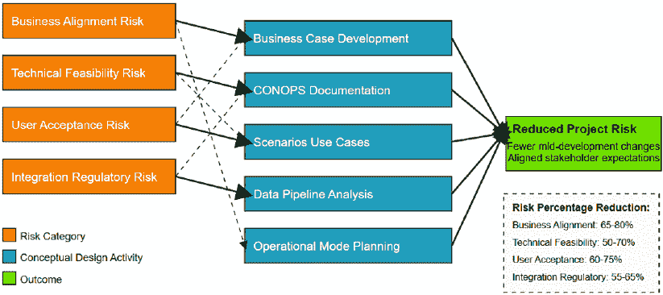

# 第四章：人工智能系统概念设计

想象一下走进一家餐厅，服务员立即告诉你将吃什么，而不提供菜单、询问你的偏好或讨论你的预算——然而你仍然需要付钱。这样的餐厅很快就会失败。缺少了什么？客户参与以了解实际需求以及反馈机制。这种情况与复杂软件开发中经常发生的情况相似，尤其是在人工智能驱动的系统中[1]。

通过进行彻底的概念设计活动，我们降低了误解用户和利益相关者需求的风险。在此阶段开发出的工件为架构师提供了对系统最终目标和约束以及客户如何看待价值的视角。相反，这些工件允许客户具体化他们的目标，揭示主要隐含假设，与其他利益相关者沟通，并确信系统构建者理解他们的愿望。

图 4.1：系统工程“V”模型中的概念设计

**快速提示**：需要查看此图像的高分辨率版本吗？在下一代 Packt Reader 中打开此书或查看 PDF/ePub 副本。

**下一代 Packt Reader** 和此书的**免费 PDF/ePub 副本**包含在您的购买中。扫描二维码或访问 [`packtpub.com/unlock`](https://packtpub.com/unlock)，然后使用搜索栏通过名称查找此书。仔细检查显示的版本，以确保您获得正确的版本。

如*图 4.1*所示，概念设计构成了系统工程“V”模型的基础。该模型显示了概念设计如何作为影响所有后续开发阶段的起点，以及系统最终如何根据这些初始概念进行验证。特别是对于人工智能系统，适当的概念设计对于降低由于数据依赖性而导致的错位成本呈指数级增加的风险至关重要。

本章的关键学习成果是理解概念设计是制定系统愿景的第一支柱。适当的概念设计可以降低构建错误系统的风险——由于人工智能系统的数据依赖性和复杂交互，这种风险随着人工智能系统的应用而呈指数级增加。

概念设计工件包括操作文档、场景和用例的概念。这个工件具有多重用途：它为最终用户和资助客户提供了一个讨论关键活动、目标、约束和性能预期的机制。它还成为指导整个工程“V”模型中系统开发的更详细技术活动的起点。

在本章中，我们将讨论以下内容：

+   运作概念

+   人工智能系统的业务案例

+   AI 赋能系统中的角色、场景和用例

# 运作概念（CONOPS）

如果在建造房屋时，没有计划来指导木匠构建结构，会发生什么？结果将是混乱不堪，几乎可以保证项目失败。构建复杂的软件系统，尤其是那些包含 AI 和 ML 组件的系统，并无不同。建筑师不仅必须为系统制定愿景，还必须对其进行彻底的文档记录，以便后续工作能够有效执行、协调和规划。

**运作概念**（**CONOPS**）正是这样的文档。在概念设计中，CONOPS 充当即将构建的系统的初始定义。它为关键利益相关者提供了关于最终系统将做什么、应该表现得多好、关键约束以及不应该做什么的见解。

图 4.2：CONOPS 利益相关者关系图

如*图 4.2*所示，CONOPS 文档作为连接不同利益相关者与开发团队的重要沟通桥梁。在左侧，包括最终用户、领域专家、合规官员、业务所有者和系统操作员在内的利益相关者提供需求和背景信息。在右侧，由系统架构师、数据科学家、ML 工程师和软件开发人员组成的开发团队接收与其角色相关的具体指导。中央 CONOPS 文档捕捉系统愿景、场景、用例和操作模式，促进双向信息流，确保一致性和共同理解。

## 以 AI 为中心的系统的 CONOPS

对于以 AI 为中心的系统，CONOPS 是您首先界定 AI/ML 技术如何创造价值的地方。AI 组件将如何增加收入、降低成本或改变运营？AI 系统将影响的职能组件和流程必须明确识别。AI 方面并非孤立存在——它们的接口和耦合功能需要清晰的识别和理解。

对于现代 AI 系统，这意味着定义和理解关键数据流，包括以下内容：

+   数据摄取管道和来源

+   数据预处理和特征工程需求

+   模型训练、验证和部署工作流程

+   推理过程和集成点

+   持续学习的反馈循环

控制流程和执行过程必须被捕捉，以了解 AI 组件如何以及在哪里影响各种系统操作模式。IEEE 1362-2022 为开发以软件为中心的系统的 CONOPS 文档提供了一个良好的模板[1]。对 CONOPS 的彻底审查是必要的，因为许多后续工作都源于这一套工件。

## 理解当前系统

要构建一个新系统，首先了解当前或先前系统的局限性。新系统必须超越现有价值——无论是通过增加收入、降低成本还是改善对最终客户重要的其他方面。定义将要构建的内容需要描述当前系统。

需要突出的项目包括为当前系统利益相关者带来价值的现有流程。您需要识别所有利益相关者：用户、客户、支持人员、业务分析师、数据科学家、合规官员和管理层。AI 组件不可避免地影响新系统的所有利益相关者，因此理解当前系统如何影响这些利益相关者是推动新设计的关键。确定显示当前系统功能的指标。

## 以数据为中心的 AI 系统视图

对于以 AI 为中心的系统，数据是系统的核心。在这个阶段，确定当前系统中使用的核心数据源。关注支持当前系统的数据过滤、转换或处理。确定合规或监管要求，以确保新的以 AI 为中心的系统满足这些要求。以 AI 为中心的系统可能需要在这个领域替换、适应或创建新的功能。

描述当前系统的计算设计以及它是如何转换数据并得出推理或控制动作的。计算设计包括处理、存储和网络技术以及相关的性能规范。在现代 AI 系统中，这包括理解以下内容：

+   当前模型架构及其局限性

+   训练和推理基础设施

+   数据存储和访问模式

+   延迟需求瓶颈

+   扩展能力和限制

+   DevOps 和 MLOps 实践

## AI 系统的非功能性需求

以 AI 为中心的系统显著推动了系统的非功能性需求。通常使用架构策略和模式来满足非功能性需求。为了确保新的以 AI 为中心的系统能够一致或更好地替换、适应或引入新的策略和模式，必须理解当前系统的架构策略和模式。

尽可能地了解当前系统的局限性。这有助于获得对新系统的支持并指导其他技术活动。提供分析，并在可能的情况下，提供支持新系统优于被替换系统的经验证据。变革的理由应描述未实现的机会或当前系统如何因市场竞争而面临过时风险。例如，Atlassian 工具套件 Jira 和 Confluence 的扩展增加了协作和集成的功能。尽管这并不是功能增加的巨大飞跃。这些系统现在是行业公认和常用工具。一个更早的 AI 技术例子是当谷歌改变他们的广告定价模式，只有在链接被执行时，客户才会为在谷歌上的广告付费。这种简单的 CONOPS 变化对雅虎公司的商业模式产生了重大影响。

# AI 系统的商业案例

关于复杂 AI 软件经常被问到的尖锐问题是：“AI 有多少价值？”

尽管应用 AI 技术以增加盈利的热情很高，但确保开发的软件系统符合预期需要明确优势和优势将如何体现。需要管理 AI 启用系统的软件复杂性，以便理解和减轻在满足成本和时间因素时产生的技术债务 [2]。

对于一个新系统，首先讨论并说明 AI/ML 技术将如何为组织带来益处 [3]。AI/ML 将如何增加收入、降低成本、使组织更高效或更安全，或改善其他价值指标？

图 4.3：AI 商业价值矩阵

*图 4.3* 展示了一个 AI 商业价值矩阵，该矩阵有助于组织根据其实施复杂性和商业影响优先考虑 AI 创新项目。矩阵将潜在的 AI 应用分为四个象限：

+   **快速胜利（高影响，低复杂度）**：如电子邮件分类、客户细分、基本推荐系统、FAQ 聊天机器人和情感分析等应用，提供了显著的商业价值，且实施相对简单。

+   **战略投资（高影响，高复杂度）**：如欺诈检测系统、预测性维护、个性化医疗保健、自动驾驶汽车和先进的供应链优化等项目需要大量资源，但能带来高商业价值。

+   **低优先级（低影响，低复杂度）**：基本功能，如文档标记、简单的数据可视化、自动化报告、入门级分析仪表板和基本内部聊天机器人，尽管易于实施，但提供的商业影响有限。

+   **避免/重新考虑（低影响，高复杂度）**：例如，过于复杂的自动化简单任务、非关键决策的人工智能、低量问题的复杂解决方案、没有明确投资回报率的技术优先项目以及应用有限的实验性人工智能等项目应避免或重新考虑。

此矩阵为组织提供了一个战略框架，以评估和优先考虑其人工智能计划，确保资源分配到平衡技术可行性和商业价值的项目。

## 人工智能技术对商业运营的影响

人工智能技术从端到端影响整个系统。这种系统视角使得评估技术的局限性以及哪些标准操作或错误可能影响最终系统成为可能。

理解技术将影响到的性能指标或要求至关重要——特别是那些影响客户收入或支出的指标——这一点至关重要。现代人工智能系统通常影响以下方面：

+   通过自动化提高运营效率

+   通过高级分析提高决策质量

+   通过个性化提升客户体验

+   通过预测能力进行风险管理

+   通过优化算法进行资源配置

+   通过加速流程提高市场速度

图 4.4：人工智能-人类交互谱系

*图 4.4*展示了人工智能-人类交互谱系，显示了从人类驱动到人工智能驱动的系统的连续性。这个谱系帮助组织构想其人工智能系统中预期的自主程度和人类参与度：

+   **手动操作**：人类选择，人工智能观察（例如，传统工艺）

+   **决策支持**：人工智能推荐，人类决策（例如，智能写作助手）

+   **共享控制**：人工智能行动，人类确认（例如，人工智能-人类设计团队）

+   **监督自主**：人工智能运行，人类监督（例如，高级驾驶辅助）

+   **完全自主**：人工智能独立运行（例如，自动驾驶汽车）

了解您的 AI 系统在这个谱系中的位置对于定义适当的交互模型、建立控制协议和设定用户期望至关重要。它还有助于识别潜在风险，并根据人工智能自主程度确定适当的监督机制。

## 组织整合和人力资源影响

人工智能技术必须适应组织维护和开发框架。最后，明确说明对用户和人类的具体影响。人工智能技术不可避免地改变或调整人类执行的过程，包括以下方面：

+   从手动任务到监督职能的岗位角色转变

+   决策权限和责任的变化

+   运营和维护的新技能要求

+   修改后的工作流程和业务流程

+   伦理考虑和透明度要求

+   需要可解释性以符合监管要求 [4]

# 人工智能赋能系统的场景

在正确的环境中使用正确的工具会产生惊人的结果——想想米开朗基罗的凿子。相反，错误使用工具可能会带来灾难。考虑 Zillow 公司因错误使用指导其房屋翻新业务的 AI 模型而造成的超过 6 亿美元的巨额损失 [6]。

作为概念设计的一部分，概述用户的各种角色和责任。这些角色从外部客户到系统分析师、最终用户、系统开发人员和系统运维人员。人工智能技术的角色和影响要求架构师捕捉这些观点并在目标基线中进行调整。

## 创建有效的场景

角色文档应说明系统如何在相关场景中完成其使命和任务。为功能和非功能性需求定义一组初始的高层次指标。解决关键参与者和如何满足利益相关者的关注点。在操作概念中识别所提议系统的主要架构元素。

例如，确定系统将是集中式还是分布式，识别规范参与者、主要外部用户或需要集成的系统，以及任何硬约束，如监管或合规要求。场景和用例有助于具体理解系统必须做什么，并确定后续工程活动的依据。另一个重要方面是进行威胁建模场景，以确保系统在面对敌对行为和整个网络攻击范围时既安全又具有弹性。

图 4.5：人工智能系统成功指标框架

*图 4.5* 展示了一个涵盖三个基本领域的全面人工智能系统成功指标框架：

+   技术性能：

    +   准确性指标：精确度、召回率、F1 分数、AUC-ROC

    +   性能指标：推理时间、吞吐量、延迟、资源利用率

    +   坚韧性指标：数据漂移韧性、错误率稳定性、对抗性鲁棒性、边缘情况处理

    +   可靠性指标：正常运行时间

+   商业影响：

    +   财务指标：投资回报率（ROI）、收入影响、成本降低、总拥有成本（TCO）

    +   运营指标：流程效率、资源优化、时间节省、错误减少

    +   战略指标：竞争优势、市场份额影响、创新赋能、可扩展性

    +   采用指标：使用率

+   用户体验和伦理：

    +   用户体验指标：用户满意度（CSAT）、系统可用性量表、价值实现时间、用户留存率

    +   公平性指标：人口统计学平等、平等机会、差异影响、交叉公平性

    +   透明度指标：可解释性得分、文档质量、特征重要性清晰度、决策可追溯性

    +   隐私和安全：数据保护得分

此框架确保人工智能系统在技术准确性之外得到全面评估，包括其商业价值和伦理影响。场景应参考这些指标来定义人工智能系统的成功标准。

## 场景中的人工智能技术使用

为了更好地理解技术的影响，需要有一定的背景。场景是定义背景的绝佳工具。场景从更广泛的角度描述了挑战和主要操作模式。以下是一些例子：

+   人工智能驱动的推荐引擎将如何个性化客户体验

+   预测性维护系统将如何分析传感器数据以防止设备故障

+   自然语言处理系统将如何处理客户服务咨询

+   计算机视觉系统将如何识别制造中的质量问题

一个场景可能描述客户如何使用系统在人工智能驱动的个性化电子商务网站上购买商品。或者，它可能概述医疗专业人员如何使用系统进行人工智能辅助医疗诊断。这些场景应捕捉与系统互动的主要参与者，确定关键功能，并概述评估系统性能的相关指标。

## 定义成功和约束

场景需要定义系统成功意味着什么，什么构成正常操作，以及什么会是故障条件。此外，场景应更详细地描述技术约束。

约束条件的例子可能包括精度要求、可接受的误报概率或最大推理时间限制。对于现代人工智能系统，约束条件可能还包括以下内容：

+   不同人口群体的公平性和偏见指标

+   对于高风险决策的可解释性要求

+   数据隐私和安全标准

+   模型漂移阈值触发重新训练

+   高峰负载期间的资源利用率限制

+   当信心阈值未达到时，应采取安全机制

这些场景不需要详尽无遗，但应该足够详细，以便主要利益相关者同意这些场景的正确执行表明系统操作成功。

# 人工智能系统用例

用例在原则上与场景非常相似，但它们更注重细节，以便能够指导实际的软件开发。这些图捕获了交互和更详细的功能以执行。以层次结构开发用例，其中第 1 级用例共同覆盖 CONOPS 的系统执行。从第 1 级用例中推导出低级用例。在用例中捕获详细的人机交互，以确保系统的正确操作和维护。

## 有效用例的结构

用例至少应包括以下内容：

+   标题

+   作者

+   系统级和可追溯性

+   主要参与者

+   假设

+   前置条件

+   执行摘要

+   成功的后置条件

+   信息输出、警告、警报、警报和错误

+   用例失败后的后置条件

+   数据来源

+   数据输出

用例可以明确预期的数据来源、频率、格式和质量。在系统架构的这个阶段，不需要非常详细地分解用例——而是关注突出系统主要正常操作阶段的用例。随着设计的进一步发展，它应该追溯到更高层次的用例。用例还有助于确定关键系统功能、非功能性需求和系统技术性能的指标和需求。

## 用户类别和人工智能交互

在此阶段正式定义用户类别。确定人工智能组件和所有不同的人类角色如何互动。确定每个角色需要的数据以及人工智能如何支持该角色。定义系统与不同角色之间的交互方式。使用自动化规模可以帮助更好地解释人工智能组件和人类角色的定义和构建。

# 智能化系统的操作模式

操作概念、场景和用例有助于定义系统的主要模式。对于每种模式，理解并记录人工智能组件将如何工作以及它们在整个系统中的支持需求。

图 4.6：人工智能系统的六个操作模式及其转换

*图 4.6*展示了人工智能系统的操作模式流程图，显示了六个关键操作状态及其转换：

1.  **配置模式**：设置模型参数和接口

1.  **启动模式**：系统的验证和验证

1.  **执行模式**：正常操作和监控

1.  **维护模式**：再培训和更新

1.  **恢复模式**：处理故障和退化

1.  **关闭模式**：优雅终止

该图显示了从配置到启动再到执行的正常流程路径（实线），以及计划维护或错误触发的恢复路径。虚线表示可选的重启路径。这个操作模式框架对于全面的 AI 系统规划至关重要，因为它确保在系统设计中解决了所有关键状态。

## 配置模式

确定所需的模型参数并阐明人工智能组件获取它们的机制。配置并确保外部数据接口、数据来源和人类界面参数的可用性。提供日志或输出以确认人工智能组件启动就绪。对于现代人工智能系统，配置包括以下内容：

+   模型版本控制和工件管理

+   特征存储和预处理管道

+   A/B 测试基础设施

+   监控和可观察性设置

+   隐私保护机制

+   超参数设置和优化策略

## 启动模式

在启动期间，人工智能组件提供与系统其余部分的集成状态。使用已知数据和预期输出运行测试，以确保人工智能组件正常工作。记录并积极沟通人工智能组件和系统已准备好执行。现代实践包括以下内容：

+   金丝雀部署以限制初始曝光

+   与现有系统并行的影子模式操作

+   逐步功能推出

+   自动验证基准数据集

+   性能基线测量

+   基础设施扩展验证

## 执行模式

收集系统性能（通常是机器学习指标）、操作计数和管道健康状况的统计数据，并捕获警告、警报、警报或故障以向用户或系统操作员报告。现代执行监控包括以下内容：

+   实时模型性能仪表板

+   漂移检测和异常监控

+   特征重要性跟踪

+   资源利用率监控

+   服务延迟和吞吐量指标

+   数据质量监控

## 维护模式

由于预期模型漂移或过时，模型通常需要基于分类或回归输出进行定期维护。定义如何将人工智能组件离线，以及其余管道（s）在没有此组件的情况下应如何执行。现代维护策略包括以下内容：

+   由性能下降触发的自动重新训练管道

+   冠军挑战者模型评估

+   模型的持续集成/持续部署

+   模型治理和审批工作流程

+   用于可重复性的版本化数据集

+   用于受控推出的 A/B 测试框架

## 恢复模式

在重大故障或非标准条件下，人工智能组件需要重新配置、测试，并准备重新部署到生产系统。根据恢复性质，可能需要重新训练模型，这需要冷备用策略。现代恢复方法包括以下内容：

+   模型回滚功能

+   具有快速切换功能的版本化模型注册表

+   电路断路器优雅地失败到更简单的模型

+   集成技术以减少对单个模型的依赖

+   关键路径的缓存推理结果

+   降级模式操作计划

## 关闭模式

在关闭期间，保存模型和日志操作以帮助系统重启。实施安全触发器，以确保管道组件不会因人工智能组件关闭而受到不适当的干扰。现代关闭考虑因素包括以下内容：

+   对进行中的请求进行优雅处理

+   状态化组件的状态保留

+   清理终止资源密集型进程

+   用于事后分析的最后遥测捕获

+   带有依赖关系的协调关闭顺序

+   正确释放云资源以控制成本

# 通过概念设计进行风险缓解

概念设计的作用也影响着整个系统开发的风险管理。概念设计确定了主要场景、相关用例、需求和要完成建模。还有全面的人工智能技术评估和选择。这项练习为系统开发者提供了一个全面的系统视角。这种全面的视角本身可以分解和分析各种风险维度。

图 4.7：概念设计活动如何减轻人工智能系统开发中的关键风险

*图 4.7* 展示了概念设计活动如何直接应对和缓解人工智能系统开发中的关键风险。图表将风险类别（橙色）映射到解决这些问题的特定概念设计活动（蓝色），从而降低项目风险（绿色）：

+   通过业务案例开发（减少 65-80%）缓解业务一致性风险

+   通过 CONOPS 文档（减少 50-70%）解决技术可行性风险

+   通过场景和用例（减少 60-75%）降低用户接受风险

+   通过数据管道分析和运营模式规划（减少 55-65%）缓解集成和监管风险

图表展示了这些活动如何共同降低项目风险，从而减少开发过程中的变更，并使利益相关者的期望更加一致。这种强大的可视化展示了彻底的概念设计在降低人工智能项目风险中的可量化价值。

## 数据质量风险缓解

人工智能系统在本质上依赖于数据质量，这是传统软件所不具备的。CONOPS 应包括明确的数据质量要求和补救策略。常见的数据质量风险包括以下：

+   不完整或存在偏差的训练数据

+   系统间不一致的标识符跟踪

+   随时间推移的数据漂移

+   输入数据损坏或篡改

+   隐私和安全漏洞

在概念设计阶段解决这些风险可以防止开发后期昂贵的补救工作。

## 利益相关者期望管理

人工智能系统的利益相关者通常对模型性能和能力有不切实际的期望。概念设计阶段应包括以下方面的利益相关者教育：

+   人工智能系统的实际性能轨迹

+   人工智能输出的概率性质

+   持续监控和改进的需求

+   性能维度之间的权衡（准确性对可解释性等）

+   使用变更管理确保系统稳定性和变更记录

早期设定适当的期望可以防止后续的失望和项目重新评估。

## 集成风险缓解

人工智能系统很少孤立存在。它们必须与遗留系统、数据源和运营流程集成。概念设计应彻底解决以下问题：

+   系统间的数据兼容性

+   延迟要求与限制

+   API 规范和合同定义

+   当 AI 组件表现不佳时的回退机制

在实施前早期考虑集成挑战可以防止在实施期间进行昂贵的架构修订。NIST 的**AI 风险管理框架**（**AI RMF**）是帮助在 AI 系统开发中降低风险的优秀参考[5]。AI 失败的悲剧性例子是 2003 年的一次事件，当时美国爱国者电池的自主软件错误地将一架英国战斗机识别为威胁并将其击落，导致机上所有飞行员丧生。

# 案例研究：零售推荐系统

为了说明本章讨论的概念，让我们考察一个零售推荐系统的真实世界例子。一家大型电子商务零售商希望改进他们的产品推荐系统，以提高客户参与度和销售额。

## CONOPS 开发

CONOPS 文档定义了 AI 推荐系统如何与现有的电子商务基础设施集成，包括以下内容：

+   **数据来源**：客户浏览历史、购买历史、产品目录和库存系统

+   **性能预期**：50 毫秒推荐生成延迟，转化率提高 15%

+   **限制**：符合 GDPR，对营销团队的解释性

## 商业案例

商业案例量化了预期的收益：

+   预计平均订单价值增加 12%

+   购物车放弃率降低 8%

+   通过个性化增强客户忠诚度

## 场景和用例

关键场景包括以下内容：

+   浏览时的实时推荐

+   电子邮件营销个性化

+   库存感知推荐以防止推广缺货物品

浏览时的实时推荐是一个选择的场景，因为它迫使设计决策关注速度和模型复杂性。电子邮件营销个性化处理涉及使用自然语言处理和其他标识符正确生成名称，向客户展示他们正在获得定制化的体验。

库存感知推荐迫使技术要求处理最新的数据存储、查询复杂性、分析执行时间以及系统能够应对缺货物品的情况。

## 操作模式

推荐系统需要广泛的配置能力，包括以下内容：

+   设置产品之间相似度分数的阈值

+   配置特征权重以平衡近期、频率和货币价值

+   与库存管理系统建立集成参数

+   为新用户和产品定义冷启动策略

在正常操作期间，系统实施了以下功能：

+   实时性能仪表板跟踪推荐的相关性

+   A/B 测试基础设施以持续评估算法变体和超参数

+   当转化率低于定义的阈值时自动发出警报

+   基于会话的推荐跟踪以捕捉短期意图

系统集成了强大的恢复机制：

+   如果个性化失败，则回退到基于流行度的推荐

+   在流量高峰期间自动切换到预计算的推荐

+   电路断路器用于隔离故障组件，而不会对整个系统造成破坏

+   优先考虑速度而牺牲个性化准确性的降级操作模式

## 实施挑战和经验教训

在开发推荐系统时，团队发现历史购买记录中存在重大的数据质量问题。客户 ID 在不同平台上的跟踪不一致，为构建准确的用户画像带来了挑战。概念设计不得不进行修订，以包括更健壮的数据清洗管道和身份解析机制。

市场团队最初期望推荐引擎能够立即达到人类水平的个性化准确度。系统架构师必须教育利益相关者关于人工智能系统现实性能轨迹的知识，解释模型精度如何随着更多数据和反馈随时间提高。

与现有电子商务基础设施的集成比最初预期的要复杂。遗留库存系统与实时推荐所需的数据模型和更新延迟有显著差异。团队修订了他们的架构方法，包括一个中间数据同步层，将推荐服务从遗留系统中解耦。

# 摘要

在本章中，我们探讨了概念设计对于人工智能系统至关重要的意义。概念设计阶段为所有后续的工程活动奠定了基础。对于人工智能系统来说，这个基础尤其关键，因为它们具有独特的特性：数据依赖性、学习行为、概率性结果以及人机交互的复杂性。

关键要点包括以下内容：

+   理解所提出的系统将如何为最终客户带来价值

+   理解 AI/ML 将为新系统提供什么

+   确定新系统必须做什么，什么是有帮助的，以及新系统不能做什么

+   从客户的角度识别性能和非功能性需求

+   在面向客户和利益相关者的操作概念中记录见解，并使一般公众能够访问

+   确定端到端系统的关键角色、参与者和用例，突出显示 AI/ML 组件的突出位置

当正确执行时，概念设计可以减轻人工智能系统开发中最重大的风险：构建错误的系统。通过在这一阶段投入足够的资源，组织大大增加了交付满足用户需求、实现业务目标，并在预期环境中安全有效运行的人工智能系统的可能性。

本章的内容必然是广泛的，因为每个软件系统、环境和客户都是独特的。在架构设计中的一个共同点是概念设计可以减轻许多风险。产生的工件构成了后续工程活动的基石，这对于具备人工智能的系统尤为重要，因为不匹配的成本可能非常高。

下一章将在此基础上构建，探讨概念设计工件如何指导详细需求、架构设计决策和人工智能系统实施策略的制定。

# 练习

1.  **人工智能商业价值矩阵应用**

考虑你熟悉的行业（医疗保健、零售、制造业等）。为该行业识别四个潜在的 AI 应用，将每个应用放在人工智能商业价值矩阵的每个象限中（快速胜利、战略投资、低优先级、避免/重新考虑）。根据实施复杂性和业务影响因素来论证你的放置决策。

1.  **人工智能与人类交互场景开发**

为一个位于人工智能与人类交互谱“共享控制”部分的 AI 系统创建一个详细的场景。你的场景应描述背景、主要角色、AI 组件责任、人类操作员责任和关键交互点。包括潜在的故障模式及其处理方式。

1.  **用例规范**

为一个具备人工智能预测维护功能的系统中的维护模式操作编写一个完整的用例。遵循“有效用例结构”部分中概述的结构，确保包含所有 12 个必需元素。特别注意前置条件、后置条件和错误处理机制。

1.  **风险缓解规划**

对于一个具备人工智能的医疗诊断辅助系统，在以下每个类别中识别三个具体风险：数据质量风险、利益相关者期望风险和集成风险。对于每个风险，描述你在概念设计阶段如何应对它，以防止实施过程中出现问题。

# 参考文献

1.  IEEE 计算机协会. (2022). IEEE 1362-2022: IEEE 信息技术 - 系统定义 - **操作概念**（ConOps）文档指南. IEEE 标准协会. DOI: 10.1109/IEEESTD.2022.9767507

1.  Sculley, D., Holt, G., Golovin, D., Davydov, E., Phillips, T., Ebner, D., Chaudhary, V., Young, M., Crespo, J. F., & Dennison, D. (2015). 隐藏在机器学习系统中的技术债务. 神经信息处理系统进展，28，2503-2511\. https://papers.nips.cc/paper/2015/hash/86df7dcfd896fcaf2674f757a2463eba-Abstract.html

1.  Amershi, S., Begel, A., Bird, C., DeLine, R., Gall, H., Kamar, E., Nagappan, N., Nushi, B., & Zimmermann, T. (2019). 软件工程与机器学习：一个案例研究. IEEE/ACM 第 41 届国际软件工程会议：软件工程实践 (ICSE-SEIP), 291-300. DOI: 10.1109/ICSE-SEIP.2019.00042

1.  Arrieta, A. B., Díaz-Rodríguez, N., Del Ser, J., Bennetot, A., Tabik, S., Barbado, A., García, S., Gil-López, S., Molina, D., Benjamins, R., Chatila, R., & Herrera, F. (2020). **可解释人工智能** (**XAI**)：概念、分类、机遇与挑战，迈向负责任的人工智能. 信息融合, 58, 82-115. DOI: 10.1016/j.inffus.2019.12.012

1.  国家标准与技术研究院. (2022). 人工智能风险管理框架 (AI RMF 1.0). 美国商务部. [`doi.org/10.6028/NIST.AI.100-1`](https://doi.org/10.6028/NIST.AI.100-1)

1.  “Zillow iBuying: What Happened”，Robust Intelligence，观点 2021 年 11 月 16 日，[`www.robustintelligence.com/blog-posts/zillows-ibuying-failures`](https://www.robustintelligence.com/blog-posts/zillows-ibuying-failures)

|

#### 现在解锁这本书的独家优惠

扫描此二维码或访问 [`packtpub.com/unlock`](https://packtpub.com/unlock)，然后通过书名搜索此书. |  |

| **注意**：在开始之前准备好您的购买发票.* |
| --- |
