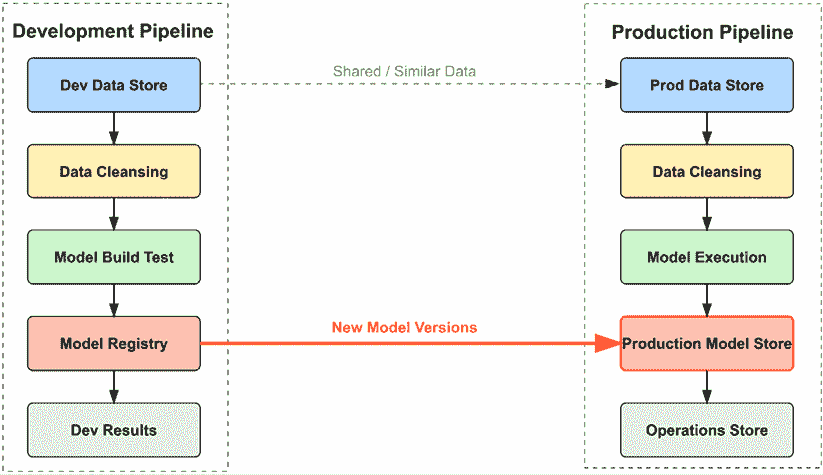
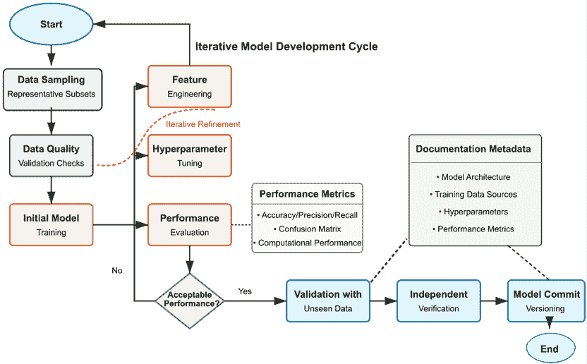
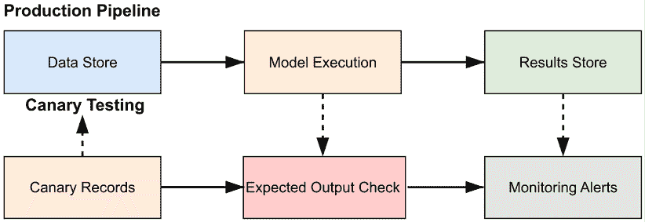
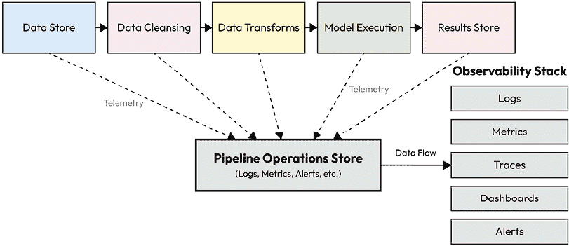
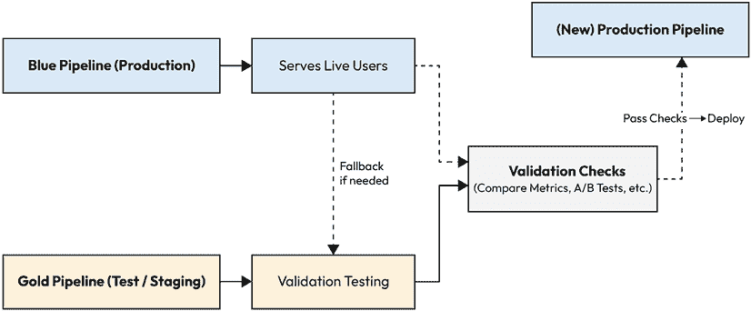

# 第五章：人工智能管道的需求和架构

机器学习模型开发在其实验和迭代性质上与传统软件工程有根本的不同。虽然软件工程师通常基于明确的规格设计系统，但数据科学家必须应对数据特性、特征相关性和模型行为固有的不确定性。这要求在模型创建、优化和验证方面采取系统且灵活的方法，以适应人工智能开发的独特挑战。

本章探讨了“人工智能管道系统”——目前企业人工智能中占主导地位的架构，它由利用互联人工智能模型的渐进处理阶段组成。这些管道构成了现代人工智能实施的骨架，使组织能够系统地开发、部署和维护大规模的人工智能能力。

人工智能系统很少作为独立模块运行；相反，它们通常嵌入到更大的软件生态系统中，并遵循结构化的开发和部署工作流程。本章详细探讨了开发和生产管道的架构和需求，特别强调了将模型从实验环境过渡到稳健的生产系统的关键过程[1][2]。

本章将提供以下方面的全面指导：

+   创建有效的开发和生产管道所需的主要方面

+   如何利用模块化架构来提高人工智能系统性能并满足关键的非功能性需求

+   为人工智能系统专门设计的必要架构策略和模式

# 开发管道

架构源于需求，形成了一种递归模式，其中从初始需求中合成的组件本身又成为后续架构综合的需求。这种递归持续进行，直到系统构建者不能再有意义地影响相关的子组件，此时实现细节将优先考虑。

一个稳健的开发环境是测试和验证管道在生产发布之前的基础。全面的架构模型确定了系统中的主要组件、外部接口、用户参与点和数据需求。多个架构视图捕捉流程流和操作线程，展示了人工智能系统将如何系统地满足明确和隐含的需求[3]。

模块化设计显著提高了系统的灵活性和可维护性，尤其是在复杂的 AI 流程中。AI 流程中的每个阶段都应该是独立可验证的、可配置的，并且可扩展以适应不断变化的需求和技术进步。流程需要版本控制，并对其数据来源有清晰的追溯性。架构必须捕捉功能组件和非功能需求，如可扩展性、可靠性和可观察性，从而创建实施的整体蓝图。

图 5.1：高级 AI 流程概述

在图 5.1 中，我们看到了 AI 系统中开发和生产流程之间的关系。左侧描述了模型构建和实验发生的开发流程，而右侧显示了操作模型部署和推理的生产流程。这种视觉表示突出了这些环境的并行性质及其关键互连。

开发流程由几个关键组件协同工作组成：

+   **开发数据存储**作为训练和测试数据的存储库

+   **数据清洗**过程确保数据质量和一致性

+   **模型构建测试**环境提供模型训练和评估的基础设施

+   **模型注册表**允许对模型进行版本控制和跟踪，包括模型中使用的参数

+   **开发结果**存储库存储开发成果以供分析和比较

生产流程采用这种结构，并设计了用于操作使用的组件：

+   **生产数据存储**维护操作数据

+   类似的**数据清洗**过程确保生产数据质量

+   **模型执行**提供推理发生的基础设施

+   **生产模型存储**安全地存放已部署的模型

+   **操作存储**组件实现全面的监控和管理

图 5.1 中的中心箭头展示了经过彻底验证后，模型如何从开发环境过渡到生产环境。两个流程共享相似的数据结构和处理方法（由顶部连接表示），以确保生产部署条件与开发环境非常相似，从而降低模型上线时出现意外行为的风险。

这些架构视图直接输入到系统分析活动中，确定哪些部分需要详细建模以驱动设计决策，并提供对预期性能指标的初步评估。它们还有助于识别所有 AI 系统组件的具体指标和数据需求，确保对功能和非功能需求进行全面覆盖。

在明确指定的架构到位后，可以有效地分配实施工作。团队通常沿着系统架构边界组织，使用配置控制的图表来传达整体愿景，促进跨团队沟通，并在项目演变过程中高效地引入新团队成员。

人工智能系统需要全面的需求工程，因为人工智能组件从不孤立存在，而是在复杂的技术生态系统中运行。需求必须全面指定数据工程方面、计算硬件需求以及更广泛系统如何摄取和执行人工智能生成的决策。

# 数据存储需求

数据存储作为管道的基础和事实来源，通常通过最小化处理来维护数据完整性。在设计这个关键组件时，必须解决几个关键考虑因素。

## 数据量和速度

理解预期处理的数据总量对于适当的基础设施规划至关重要。这包括对数据随时间增长和峰值处理需求的预测。同样，数据存储的数据速度要求必须明确指定，包括数据流模式和在整个操作周期中的预期变化。

## 数据格式和处理方法

需求必须解决结构化和非结构化数据类型，包括标准化和兼容性的规范。处理类型决策——无论是批量处理、流处理还是混合方法——对架构有重大影响，应由系统目标和性能要求驱动。

## 及时性和技术选择

处理速度要求和可接受的延迟必须根据业务需求明确定义。数据存储技术选择——无论是关系数据库、对象存储、图数据库还是专门的 AI 数据存储——应受系统目标和性能要求指导，而不是技术偏好。

## 非功能性需求和治理

存储冗余、复制策略和备份频率必须根据数据重要性和恢复目标建立。安全协议、治理框架和合规要求在降低风险和确保合规性方面发挥着关键作用，尤其是在敏感数据方面。

## 支持操作和专用存储

状态信息、监控能力和警报系统必须集成到数据架构中，以实现主动管理。现代人工智能系统越来越多地利用专用数据存储，包括用于相似性搜索的向量数据库、用于一致转换的特征存储以及结合数据湖灵活性和数据仓库结构的湖仓。

| **存储技术** | **领域考虑因素** | **合规性** |
| --- | --- | --- |
| 关系型 | 高一致性性能结构化数据 | 数据来源最新的记录 |
| 对象 | 非结构化数据存储速度最小索引灵活的数据架构 | 维护完整数据量的记录 |
| 关键值 | 灵活的架构需要快速查询搜索 | 快速恢复数据完整数据量的记录 |
| 图 | 查找速度简单数据模型可以模拟领域 | 数据来源快速数据摘要 |
| 向量 | 自然语言处理大型语言模型 | 数据关联训练数据集的证明 |

表 5.1：数据存储技术比较

# 算法开发组件

如前所述，构建人工智能系统的核心是构建预期能够做出决策的组件。将要做出的决策在很大程度上或几乎完全依赖于进入系统的数据。一个决策的好坏和有效性取决于所使用的数据。接下来的几节将描述可以用来确保最高质量的数据进入系统的关键任务。这些任务可能既繁琐又具有挑战性，因为对于初始系统开发，需要人工参与。尽管如此，对于进一步的系统开发，这些任务可以通过自动化的方式进行，包括检查和警报。

## 数据质量检查

理解数据质量对于有效地训练、调整和维护人工智能管道至关重要。质量检查应严格配置控制并经过测试，明确指定最低要求。这包括对数据完整性的全面评估，以确保记录具有所有必需字段的值，损坏检测以识别格式错误的数据，时间跨度规律性验证以保持时间一致性，格式验证以确认预期的数据结构，以及范围检查以验证字段值保持在预期的边界内。

现代质量控制方法还结合了自动验证，以检测数据漂移和异常，以及复杂的偏差测试方法，以主动识别和减轻潜在偏差，防止其影响模型性能。这些机制构成了在整个人工智能管道生命周期中维护数据完整性的基本基础。

## 数据转换

管道数据很少以机器学习模型可以直接使用的格式到达。数据转换使数据标准化并准备用于推理，其实现必须彻底理解、精确制定和严格检查。常见的转换包括在不同地理数据格式之间转换，标准化物理单位以实现一致表示，应用降维技术以提高模型效率，以及实施特征存储以确保开发和生产环境中的转换一致性。

高级转换方法结合了表示学习来自动发现有用的数据表示和数据增强策略以人工扩展训练数据集。这些转换必须在管道架构中被视为一等公民，并具有适当的版本控制和监控以确保一致性。

## 数据摘要

数据摘要具有双重目的：验证模型一致性并支持持续管道监控。有效的摘要包括全面的数据集统计（均值、中位数、变异度指标）、数据字段关联分析以识别关系、分布拟合以理解潜在模式，以及通过箱线图和交互式仪表板等技术进行可视化表示。

现代方法结合了分布中的异常检测以识别潜在的数据质量问题，以及相关性分析以理解特征关系。这些摘要提供了对影响模型性能的数据特性的关键可见性，应在管道生命周期中保持。

## 模型构建、调整和验证

模型构建应被视为一个持续迭代的流程，而不是一个终端任务，因为 AI 管道必须持续适应不断变化的数据模式和业务需求。管道架构必须支持可重复的训练、系统的调整和严格的评估，以确保随着时间的推移保持一致的性能。

图 5.2：模型构建、调整和验证工作流程

在*图 5.2*中，我们可以看到从初始数据采样到部署的模型开发的迭代性质。工作流程从数据采样以创建代表性子集开始，然后是数据质量验证、初始模型训练和根据既定指标进行性能评估。工作流程随后达到一个关键决策点：根据预定义的标准，性能是否可接受？如果不可以，则过程会回环进行细化，通过特征工程优化模型输入，以及通过超参数调整来调整模型配置。

一旦性能达到可接受的阈值，模型将通过验证未见数据来测试泛化能力，由未参与开发的人员进行独立验证以减少偏差，并通过正式的模型提交程序来为部署版本化最终模型。在整个过程中，维护全面的文档元数据，包括模型架构细节、训练数据来源、超参数设置和性能指标。

几个关键的基础设施考虑因素支持此工作流程：

### 配置控制

成功的 AI 管道在其生命周期中需要纪律性的跟踪，包括数据集的时间阶段和时标，全面的元数据参考和活动日志，以及用于版本控制的强大模型注册表。现代实现利用 Git、MLflow 或 DVC 等工具的实验跟踪平台，以保持开发过程的完整可追溯性。

### 机器学习性能

有效的管道需要明确理解预期的输出和处理时间，全面的性能指标（混淆矩阵、准确率、AUC），用于比较结果与预期的可视化工具，以及考虑公平性和可解释性的多指标评估方法。对模型漂移的持续监控对于保持长期性能至关重要。

### 计算基础设施

管道设计必须包括在目标计算基础设施上的彻底测试，以确保满足性能要求，基准测试存储和网络影响以识别潜在的瓶颈，以及在适当的地方实施量化剪枝等模型优化技术。现代实现通常结合硬件加速和推理优化以最大化效率。

### 规模处理

企业级管道需要用于在生产规模上测试模型的基础设施，与生产级流量模式相结合的全面负载测试，阴影部署能力以在新模型与现有系统并行运行，以及在不利条件下验证系统弹性的混沌工程方法。

### 模型调整和验证

模型通常需要系统性的微调来满足超出初始性能指标的全端系统需求。全面的验证应包括第二次检查，将测试数据与生产样本进行比较以验证一致性，由未参与开发的人员进行的独立审查以减少偏差，结果可视化以识别潜在的异常值，以及接口检查以确保与下游系统的兼容性。

高级方法结合了超参数优化技术以最大化性能，对抗性测试方法以识别潜在弱点，红队过程，以及可解释人工智能技术以增强模型透明度。这些验证过程确保模型在部署到生产环境时将可靠地执行。

### 代码提交和 DevOps

最后的开发步骤涉及将验证过的模型集成到预生产基线中。此代码将用于全面测试和预演，使用代表性的数据样本和生产数据来识别潜在的集成影响，在全面部署之前。

现代处理这一阶段的方案包括专门为机器学习工作流程设计的自动化 CI/CD 流水线，用于在不同环境中一致部署的容器化技术，用于可重复性的基础设施即代码实践，用于控制功能推出的功能标志，以及用于最小化过渡期间中断的蓝绿部署策略。

# 生产管道

生产管道代表了广泛开发工作和利益相关者期望的最终成果——在规划和开发期间必须持续履行承诺的运营“厨房”。本节提供了关于生产管道架构和技术要求的详细指导。

## 数据存储

许多管道问题可以追溯到对数据存储的要求或实现决策的误解。工程努力应从仔细考虑预期的输出特征开始：速度要求、质量阈值、时间约束和预期的接收者。

数据存储技术考虑因素包括具有不同优势和局限性的几个选项。

关系型数据存储在稳定的数据模型和最小的可扩展性担忧方面表现出色，提供强大的一致性保证和事务支持。对象存储处理不适合标准模式的多样化组件，允许轻松修改属性和快速水平扩展，但以牺牲一些一致性保证为代价。文档存储结合了对象存储的灵活性和模式结构，为半结构化数据提供了一个中间地带。图存储利用数学图结构来表示数据关系，为以图为中心的分析和关系查询提供卓越的延迟性能。

日志存储以最小处理将数据作为不可变的事件流处理，将分析负担转移到下游管道组件，同时提供强大的可审计性。现代专门存储，如向量数据库、特征存储和时间序列数据库，为特定的 AI 工作负载提供专用功能，通常为其目标用例带来显著的性能改进。

## 数据操作

数据存储必须通过几个关键操作能力来持续满足管道性能要求。

对数据速率和操作的全面基准测试确保基础设施可以在各种条件下处理预期的负载。灵活的架构和强大的报告功能使系统能够适应不断变化的需求，同时保持可见性。数据质量监控系统主动识别潜在问题，在它们影响下游流程之前。自动和半自动模式演变功能允许系统在不中断的情况下适应不断变化的数据结构。如果使用自动模式更改，则必须在架构级别有诸如警报、存档和版本控制等安全措施，以防止数据丢失。数据血缘跟踪提供了对数据如何在复杂的管道系统中流动的完整可见性。

## 数据清洗

此阶段精心准备数据以确保在生产环境中正确执行模型。关键方面包括完整性检查以验证数据在传输过程中没有被损坏或不完整，格式检查以确保值与预期的编码和格式规范匹配，以及一致性检查，该检查实施基于领域驱动的语义验证以验证逻辑有效性。

数据清洗作为构建对管道输出信心的基本质量关卡，尽管它有固有的局限性——在实际中检查复杂数据流中所有潜在问题几乎是不可能的。精心设计的清洗过程侧重于基于领域知识和历史错误模式的高影响验证。

## 数据转换

在模型执行之前的最后预处理步骤在各个维度上对数据进行归一化，包括时间戳、地理参考、术语标准和数值范围。这些转换应该经过彻底的测试和验证，以防止细微错误传播到模型执行。

现代转换方法包括用于在环境之间保持一致性的特征存储、用于生成鲁棒表示的迁移学习技术、基于神经网络的转换用于复杂模式提取，以及用于发现最佳表示的自动特征工程。

## 模型执行

在生产环境中，模型执行应被视为一个精心管理的黑盒，在操作期间不进行直接更新。关键运营方面包括以下内容。

### 运营状态监控

生产管道需要对数据流、处理时间和硬件性能进行全面的指标收集，以保持可见性。此状态信息应通过多个互补渠道呈现：用于快速评估的视觉仪表板，用于趋势分析的详细图表和图形，关键性能指标，用于故障排除的日志输出摘要，以及需要立即关注的性能问题的实时警报。

图 5.3：生产推理执行金丝雀检查

**快速提示**：需要查看此图像的高分辨率版本？请在下一代 Packt Reader 中打开此书或在其 PDF/ePub 副本中查看。

**下一代 Packt Reader**以及此书的**免费 PDF/ePub 副本**包含在您的购买中。扫描二维码或访问[`packtpub.com/unlock`](https://packtpub.com/unlock)，然后使用搜索栏通过名称查找此书。仔细检查显示的版本，以确保您获得正确的版本。

在*图 5.3*中，我们看到如何在生产管道中实施金丝雀测试以监控模型健康。该图说明了从**数据存储**通过**模型执行**到顶部行中的**结果存储**的标准生产管道流程，底部行显示了金丝雀测试基础设施。该基础设施包括精心挑选的金丝雀记录，包含已知输入和预期输出，预期输出检查组件将实际模型输出与预期结果进行比较，以及当偏差超过阈值值时触发通知的监控警报。

这些金丝雀数据提供了一连串的验证，具有已知的输入和预期的输出，以验证持续模型的健康状况。与预期结果偏差触发警报，表明可能存在需要调查的模型漂移或管道问题。这个早期预警系统通过在问题对业务运营产生重大影响之前识别问题，有助于在生产环境中保持模型可靠性。

实施这些金丝雀检查对于检测模型随时间发生的微妙漂移至关重要，可以识别影响模型性能的基础设施问题，建立对持续模型操作的利益相关者信心，并在不影响正常操作的情况下提供生产环境中受控测试的机制。

### 模型维护

持续监控过程确定何时根据数据集的变化、性能下降或业务需求的变化需要重新部署模型。这些过程应在模型稳定性的需要与纳入新数据和改进的好处之间取得平衡。

## 结果和最终用户存储

这些组件收集模型输出和相关元数据，作为下游系统和人类用户的接口。它们应提供强大的查询机制以实现灵活的数据访问，通过标准化 API 实现机器到机器的数据摄取，支持全面的可视化功能，维护输入和输出之间的可追溯性，为非技术用户提供适当的解释，并与商业智能平台无缝集成。

## 管道操作存储

此组件专注于管道生态系统的整体控制和维护，提供几个关键功能。

人工操作输入允许在必要时进行授权干预，由一个强大的警报框架支持，该框架根据严重性和影响优先排序通知。操作数据收集将管道遥测数据集中化，以便进行分析，管道日志可视化工具将复杂数据转换为可操作的见解。现代实现包括复杂的故障响应系统来管理中断，以及全面的合规性文档以满足监管要求。

图 5.4：管道操作存储可观察性

在*图 5.4*中，我们看到了 AI 管道的可观察性架构的示意图。图中显示了顶部行中的主要管道组件（**数据存储库**、**数据清洗**、**数据转换**、**模型执行**和**结果存储**），每个组件都向中央的**管道操作存储库**发送遥测数据。这个集中式存储库收集日志、指标、警报和其他运营数据，输入到右侧显示的全面的**可观察性堆栈**。

这种架构使得在管道组件之间进行复杂的性能相关性分析成为可能，允许操作员识别处理瓶颈，跟踪数据流通过所有系统组件，实时监控系统健康，具有全面可见性的故障排除，并分析历史性能趋势以指导优化工作。

一个强大的操作存储作为 AI 管道的神经系统，对于出现问题时进行反应性故障排除以及预防性性能优化以防止问题影响操作至关重要。

## 持续开发/集成

DevOps 方法允许在不干扰生产操作的情况下快速进行管道原型设计和测试。在 AI 环境中，“蓝金”部署概念特别有效：

1.  一个管道在生产中运行，而另一个并行构建。

1.  准备就绪后，测试管道连接到生产数据进行比较评估。

1.  如果性能令人满意，它将无缝地成为新的生产管道。

图 5.5：AI 管道的 CI/CD – “蓝金”部署

在*图 5.5*中，我们看到了 AI 管道的“蓝金”部署策略的示意图。图中显示了当前的生产管道（**蓝**）正在为实时用户提供服务，而带有新模型或更新的测试/预演管道（**金**）正在进行验证测试。全面的验证检查比较了两个环境之间的指标、A/B 测试结果和其他性能指标。

工作流程遵循特定的流程，其中代码更改触发持续集成/持续部署（CI/CD）管道，"黄金"环境执行新的模型版本，验证检查比较蓝金实现之间的性能，如果成功，黄金环境将过渡到生产状态，而先前的生产管道仍然可用作为紧急回滚的备用方案。

此方法确保在不会干扰生产操作的情况下安全测试新模型，在相同条件下直接比较当前和新的实现，当质量阈值得到验证时，受控过渡到生产状态，如果部署后发现问题，将提供简单的回滚机制。

现代机器学习操作（MLOps）实践通过实验跟踪来扩展这些能力，以维护开发历史，模型注册表用于版本控制，特征存储用于转换一致性，自动化测试框架用于质量保证，以及持续训练管道，该管道自动纳入新数据。

# 架构模式和策略

建筑学不仅超越了功能描述，还解决了决定现实世界系统成功的关键非功能性需求。软件策略（解决特定问题的第一级方法）和模式（解决复杂问题的策略组合）是复杂系统的基础构建块。

几种特定的架构模式专门支持人工智能管道的开发：

+   管道和过滤器架构实现了顺序和并行处理，其中每个阶段转换数据并将其传递到下游，从而实现关注点的清晰分离并促进独立扩展

+   分布式存储方法将数据分散到多个系统中，以改善性能、弹性和可扩展性，超越单节点限制

+   黑板架构创建了一个共享的中间件存储库，具有基于拉的组件，使得灵活的处理工作流程和简化的组件交互成为可能

+   服务导向将功能封装到松散耦合的服务中，通过定义良好的 API 进行通信，提高可维护性并使组件的独立演进成为可能

在这些模式中采用的关键策略包括以下内容：

+   Ping-echo 机制使组件能够查询其他组件以获取响应，验证连接性和基本功能

+   心跳监控建立定期的信号，表明持续运行和管道健康，提供组件故障的早期预警

+   N 方投票实现共识机制，其中多个实体对行动进行投票，在不确定的情境中提高决策可靠性

+   金丝雀测试通过将结果与已知良好参考进行比较，系统性地在全面部署之前识别模型漂移或错误

+   版本化的模型和数据集使得在整个系统生命周期中实现全面的回滚能力和可追溯性

## 非功能性需求

一个关键概念是，软件系统的架构考虑因素是由非功能性需求驱动的。存在数十个非功能性需求。架构师的角色是理解客户的需求、业务案例和技术维度，以制定给定系统的关键非功能性需求。接下来讨论的非功能性需求是通常在系统中出现的重大需求。你不应该将这些视为唯一的需求，或者认为所有这些都必须使用，或者认为其他需求不能被识别。

### 可靠性

AI 管道必须通过多种机制确保系统在需要时可用：错误隔离以防止级联故障，对瞬时故障具有鲁棒性的消息基础设施，冗余和回滚机制以实现快速恢复，混沌工程实践以验证弹性，以及自动事件响应以最小化人为干预需求。

### 可维护性

支持持续模型开发和更新需要谨慎的架构决策：技术最小化以降低复杂性，组件之间定义明确的接口，微服务架构以实现独立演进，以及基础设施即代码实践以确保跨环境的可重复性。

### 可用性

有效的管道在组件之间提供一致的配置方法，具有集中信息访问的强大日志记录，所有工件都清晰的版本控制，用于监控和管理的直观图形界面，以及允许数据科学家在受控框架内独立操作的自我服务平台。

# 摘要

构建 AI 管道需要在数据管理、模型开发、基础设施设计和软件集成实践之间进行谨慎的协调。综合管道架构包括并行开发管道（用于模型创建和测试）和生产管道（用于部署和交付价值），通过定义明确的过渡过程连接。

成功实施的关键考虑因素包括以数据为中心的设计，专注于具有特定工作负载适当特性的存储，模块化架构，具有定义明确且可独立验证的组件，通过全面的数据检查和转换进行的质量保证，对所有管道组件的监控和可观察性，DevOps 集成以实现快速迭代和受控部署，非功能性需求驱动架构决策超越基本功能，以及嵌入在管道环境中的治理和合规框架。

一个成功的管道必须满足 AI 模型训练和推理的功能性需求，以及确定实际操作成功的可扩展性、可观察性和治理等非功能性需求。现代 AI 系统越来越多地采用 MLOps 实践，在创新和灵活性以及生产稳定性之间取得平衡，为持续发展创造可持续的框架。

架构最终必须支持技术卓越、业务价值交付、用户采用和负责任的 AI 实践——这是一个多方面的挑战，需要既具备技术专长又具有战略眼光才能成功应对。随着系统的大部分概念设计已经就绪，我们现在将转向讨论实现的关键步骤。在下一章中，我们将讨论设计、集成和测试。

# 练习

1.  列出 AI 开发管道的三个关键组件，并描述它们在模型生命周期中的相应角色。

1.  描述 AI 系统中功能性和非功能性要求之间的基本区别，并提供每个类别的示例。

1.  解释配置控制如何有助于在整个 AI 管道中提高模型可靠性和可重复性。

1.  比较批处理和流式架构在管道需求、优点和局限性方面的基本差异。

1.  确定对受监管行业中的 AI 组件最关键的非功能性需求，并解释其重要性。

1.  解释在 AI 系统中使用如管道-过滤器等架构模式的好处，并提供一个具体的实现示例。

1.  在 AI 环境中，为不同的数据存储技术制定全面的函数性和非函数性需求。

1.  研究并总结优秀需求规格说明的属性，特别是针对机器学习系统。

# 参考文献

1.  Kreuzberger, D., Kühl, N., & Hirschl, S. (2022). 机器学习操作（MLOps）：概述、定义和架构。*IEEE Access*，10，66631-66648。

1.  Mäkinen, S., Skogström, H., Laaksonen, E., & Mikkonen, T. (2021). 谁需要 MLOps：数据科学家寻求实现的目标以及 MLOps 如何帮助？*IEEE/ACM 首届 AI 工程研讨会 - AI 的软件工程*，109-112。

1.  Kästner, C., & Kang, E. (2020). 为 AI 赋能系统教授软件工程。*ACM/IEEE 第 42 届国际软件工程会议：软件工程教育与实践*，45-48。

|

#### 现在即可解锁此书的独家优惠

扫描此二维码或访问[`packtpub.com/unlock`](https://packtpub.com/unlock)，然后通过书名搜索此书。 |  |

| **注意**：在开始之前，请准备好您的购买发票。* |
| --- |
