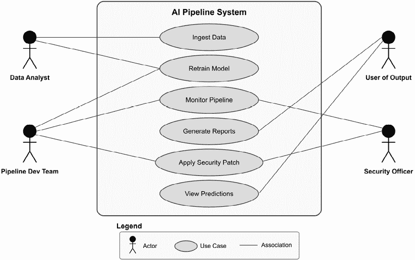
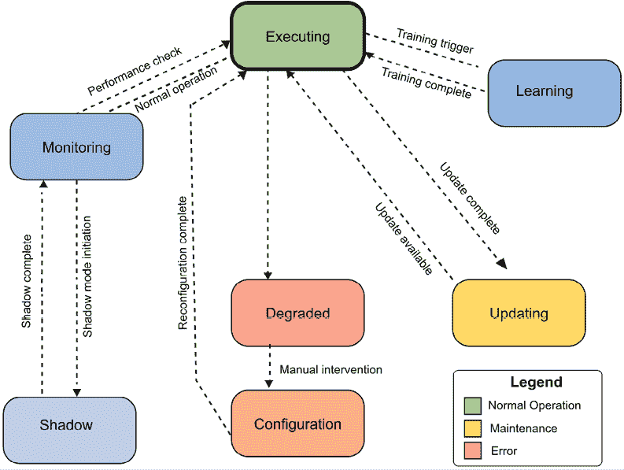
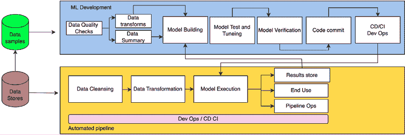
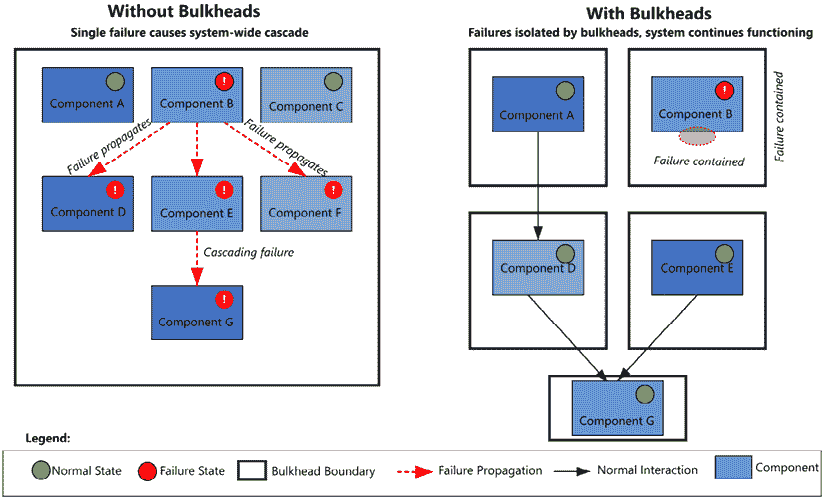
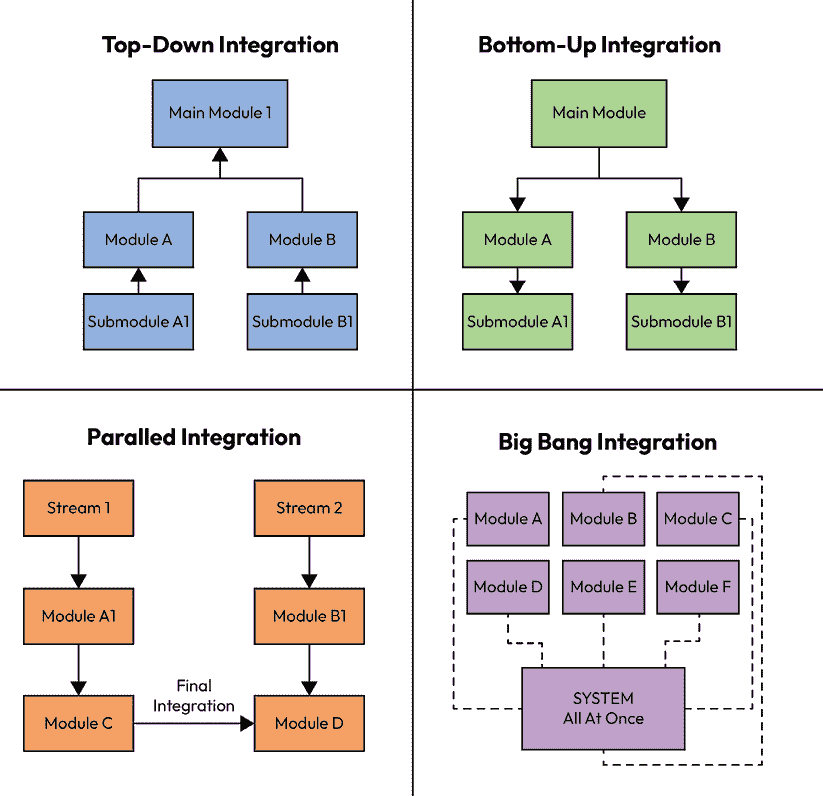
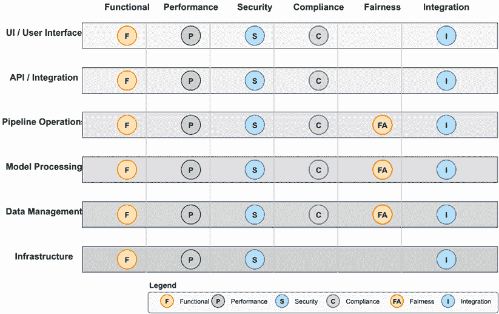
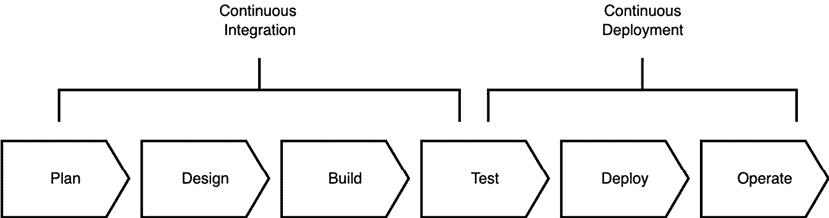

# 第六章：设计、集成和测试

我们是如何将莫扎特和贝多芬的作品称为杰作的？这是否仅仅是由阅读乐谱的人决定的？当然不是——当我们真正听到音乐时，我们才认可这些作曲家的才华。同样，虽然一个建筑可能构思得很好，但在实施之前它仅仅是一个纸面上的艺术品。

本章提供了关于架构如何支持人工智能系统开发的各个阶段（设计、集成和测试）的实际见解。我们专注于生产管道，因为开发管道通常是特定领域的，并不适用于生产环境。

在本章中，我们将讨论以下内容：

+   设计基础

+   系统模式和状态识别

+   逻辑组件定义

+   系统策略和模式

+   集成方法

+   测试

# 设计基础

设计是在特定配置下定义组件、它们之间的关系和流程，这些配置与底层架构相一致。让我们从主要工件（包括需求、用例、模式、策略和战术）中探索最相关的设计。

## 需求

构建生产管道需要定义管道必须满足的要求。存在几个需求类别，共同确保系统满足生产级操作所需的功能性和非功能性方面。

### 性能需求

性能需求集中在事务、量、转换和处理执行时间上。这些指标为可接受的性能设定了明确的阈值，并为最佳操作设定了追求目标：

| **指标** | **描述** | **阈值** | **目标** |
| --- | --- | --- | --- |
| AP-1 | 数据清洗的总时间 | 30 秒/GB | 10 秒/GB |
| AP-2 | 数据转换的总时间 | 30 秒/GB | 10 秒/GB |
| AP-3 | 执行模型的时间 | 10 秒 | 5 秒 |
| AP-4 | 写入结果存储的时间 | 5 秒/GB | 3 秒/GB |
| AP-5 | 写入最终用户存储的时间 | 5 秒/GB | 3 秒/GB |
| AP-6 | 数据存储事务 | 10,000 事件/秒 | 20,000 事件/秒 |
| AP-7 | 机器学习模型准确度 | 0.88 | 0.94 |
| AP-8 | 机器学习 **曲线下面积**（**AUC**） | 0.9 | 0.95 |
| AP-9 | 更新管道操作的时间 | 1 秒 | 0.5 秒 |
| AP-10 | 重配置到安全配置的时间 | 1 秒 | 0.5 秒 |
| AP-11 | 模型在人口统计学群体间的公平性 | 90% 平等性 | 95% 平等性 |
| AP-12 | 模型可解释性得分 | 0.7 | 0.8 |
| AP-13 | 模型对输入扰动的鲁棒性 | ±10% 准确度变化 | ±5% 准确度变化 |

### 非功能性需求

非功能性需求关注管道的持续运行能力。这些需求确保系统在其整个生命周期中保持弹性、响应性和可靠性：

| **指标** | **描述** | **阈值** | **目标** |
| --- | --- | --- | --- |
| NF-1 | 可用性 - 运行时间 | > 99.9% | > 99.99% |
| NF-2 | 错误恢复时间 | < 1 分钟 | < 30 秒 |
| NF-3 | 没有单点故障 | N/A | N/A |
| NF-4 | 更新管道的时间 | < 3 分钟 | < 1 分钟 |
| NF-5 | 检测故障的时间 | < .5 秒 | < .1 秒 |
| NF-6 | 部署安全补丁 | < 600 秒 | < 180 秒 |
| NF-7 | 报告管道健康更新 | < 10 秒 | < 5 秒 |
| NF-8 | 模型漂移检测延迟 | < 1 小时 | < 10 分钟 |
| NF-9 | 特征管道隔离 | N/A | N/A |

### 安全要求

安全考虑必须包括模型安全。现代人工智能系统面临超越传统软件的独特安全挑战，包括模型提取攻击和对抗性输入：

| **度量** | **描述** | **阈值** | **目标** |
| --- | --- | --- | --- |
| SEC-1 | 管道应使用公钥基础设施进行外部接口 | N/A | N/A |
| SEC-2 | 管道应记录所有用户在管道中执行的操作的时间、日期和执行情况 | N/A | N/A |
| SEC-3 | 所有硬件都应能够在不干扰管道操作的情况下更新安全补丁 | N/A | N/A |
| SEC-4 | 管道应保护模型免受对抗性攻击 | N/A | N/A |
| SEC-5 | 管道应实施数据访问控制以防止未经授权的数据访问 | N/A | N/A |
| SEC-6 | 管道应监控模型提取攻击 | N/A | N/A |

### 合规要求

管道操作通常自动化流程和决策，需要特定的合规措施。随着人工智能系统越来越多地做出或影响高风险决策，合规性成为关键的设计考虑因素：

| **度量** | **描述** | **阈值** | **目标** |
| --- | --- | --- | --- |
| CP-1 | 管道应仅允许授权用户查看客户的个人信息 | N/A | N/A |
| CP-2 | 所有财务交易都应存档 | N/A | N/A |
| CP-3 | 所有财务识别信息在静止状态下都应加密 | N/A | N/A |
| CP-4 | 所有财务识别信息在使用时都应加密 | N/A | N/A |
| CP-5 | 所有模型决策都应保持完整的审计跟踪 | N/A | N/A |
| CP-6 | 所有模型版本都应在模型注册表中记录，并带有血缘关系 | N/A | N/A |
| CP-7 | 管道应支持模型治理审查工作流程 | N/A | N/A |

## 行为者和用例

在检查高级用例时，生产管道的复杂性变得明显。人工智能管道系统涉及多个利益相关者之间的交互，每个利益相关者在整个生态系统中都扮演着特定的角色和责任。

图 6.1：人工智能管道系统：用例图

*图 6.1*展示了 AI 管道系统中关键角色和主要用例之间的交互。该图显示了四个主要角色：主要处理数据摄取和模型再训练的数据分析师；负责监控、报告生成和安全补丁的管道开发团队；专注于安全补丁管理的安全官；以及消费模型预测的用户。相互关联的用例展示了这些角色如何跨越系统功能边界进行协作。

此用例图作为理解系统范围和角色责任的基础。每个椭圆形代表系统所需的一个独立功能部分，而连接线表示哪些角色与每个功能进行交互。对于系统架构师来说，这种可视化有助于建立清晰的边界并识别可能需要组件进行通信或共享资源的潜在区域。

在 AI 管道系统中确定的关键角色如下：

1.  **数据分析师**：负责数据准备、特征工程和模型验证

1.  **输出用户**：模型预测和洞察的消费者

1.  **管道开发团队**：构建和维护管道基础设施的工程师

1.  **运维团队**：确保系统日常可靠性的专业人士

1.  **管道开发团队消费者**：向开发团队提供需求的利益相关者

1.  **站点可靠性工程师**：维护系统稳定性和性能的专家

1.  **模型验证者**：验证模型准确性和公平性的专家

1.  **安全官**：负责保护系统资产和数据的专业人士

1.  **合规官**：确保遵守监管要求的专家

一个全面的用例模板应包括上下文信息以指导实施和测试。该模板通常包括用例标识符、使用行为动词的描述性标题、详细上下文、主要角色识别、前提条件和后续条件、主要成功场景、潜在扩展、使用频率估计、跨团队的所有权分配以及相对优先级以指导实施顺序。

## 系统模式

设计过程必须捕捉反映 AI 系统可能占据的各种操作状态的系统模式。现代 AI 系统需要复杂的状态管理来处理不同操作模式之间的转换。

图 6.2：系统模式状态图

**快速提示**：需要查看此图像的高分辨率版本？请使用下一代 Packt Reader 打开此书或在其 PDF/ePub 副本中查看。

**随书附赠下一代 Packt Reader**以及本书的**免费 PDF/ePub 副本**。扫描二维码或访问[`packtpub.com/unlock`](https://packtpub.com/unlock)，然后使用搜索栏通过名称查找此书。请仔细检查显示的版本，以确保您获得正确的版本。

*图 6.2* 综合展示了人工智能管道在不同操作状态之间的转换过程。中心的**执行**模式（以绿色显示）代表正常操作，各种转换路径连接到专门的操作模式。蓝色状态（**监控**、**学习**和**影子**）代表系统在保持服务的同时执行额外功能的操作变体。黄色**更新**状态表示系统正在进行维护或修改，而红色**降级**状态代表功能受损的错误条件。橙色**配置**状态通常在从降级状态手动干预后出现。

此状态图在设计过程中具有多重作用。首先，它帮助工程师理解在系统实现中必须明确处理的哪些转换。其次，它建立了从错误状态恢复到正常操作的道路。第三，它为操作团队提供了一个当系统行为偏离预期时的故障排除心智模型。

现代人工智能系统通常实现以下操作模式：

+   **执行模式**是系统的基本操作状态，其中系统处理传入的请求并使用部署的模型生成预测或洞察。这代表了系统的正常、稳态操作。

+   **监控模式**专注于观察系统行为、模型性能和数据质量，而不必做出改变。此模式使持续评估管道的健康和有效性成为可能。

+   **学习模式**在模型使用新数据更新或进行超参数调整时激活。在此状态下，系统可能会为训练过程分配额外资源，同时保持推理能力。

+   **影子模式**允许新模型在生产模型旁边运行，而不会影响用户界面输出。这允许在不会影响生产的情况下，比较不同模型在真实世界条件下的性能。

+   **降级模式**代表系统继续运行但功能或性能降低的状态。这可能在组件故障或资源限制期间发生，需要优雅降级策略。

+   **更新模式**发生在系统组件被修改、替换或增强时。在此状态下谨慎管理对于在升级期间最小化服务中断至关重要。

+   **配置模式**代表系统设置或重新配置，通常需要专门的访问和验证程序来确保更改不会损害系统完整性和安全性。

我们现在将转向逻辑建模的开发，我们试图直观地捕捉主要系统组件及其相关关系。

# 块定义图

以管道架构作为起点，我们定义了开发管道的关键组件。每个组件都解决特定的功能需求，同时贡献于整体系统能力。

图 6.3：管道系统的块定义图

## 数据清洗

数据清洗功能确保进入管道的数据质量最高。在生产人工智能系统中，数据质量直接影响模型性能和系统可靠性。现代实现包括自动化的数据验证管道，可以检测模式违规和格式不一致；具有识别异常值和潜在错误值的异常检测框架；以及应用预定义规则以标准化、归一化或纠正问题数据点的数据质量强制机制。

数据清洗组件通常包含反馈循环，随着时间的推移不断改进，从数据问题的模式中学习，以预测和解决常见问题。这些系统必须在彻底性和性能考虑之间取得平衡，因为过度清洗操作可能会在高吞吐量环境中造成瓶颈。

## 数据转换

数据转换功能处理传入的数据流，为人工智能模型做准备。这个关键的管道阶段将清洗后的数据转换为适合模型消费的格式。当代人工智能系统可能实施特征存储，以集中计算特征并允许多个模型之间特征的重用，自动化的特征工程能力可以从原始数据中发现和生成相关特征，以及将结构化或非结构化数据转换为适合深度学习模型的维度向量空间的服务。

有效的数据转换组件维护训练和推理管道之间的转换一致性，确保模型在两种情况下都遇到相同的特征分布。它们通常还提供版本控制功能，以跟踪转换逻辑随时间的变化，从而实现可重复性和便于调试。

## 机器学习模型

机器学习功能处理输入数据以生成推论、回归或其他数据摘要。作为人工智能管道的分析核心，该组件不仅包括模型本身，还包括支持其部署和操作的基础设施。生产级实现包括模型注册集成以进行版本控制和谱系跟踪，复杂的 A/B 测试框架，它允许对模型变体进行受控实验，以及可解释性组件，这些组件提供了对模型决策的见解。

成熟人工智能系统中的模型组件提供一致的接口，从而抽象出实现细节，允许在不影响下游消费者的情况下交换不同的算法或方法。它们还包含监控钩子，这些钩子公开性能指标和内部状态信息，以提供操作可见性。

## 管道操作

管道操作功能从其他管道部分收集状态并可视化管道操作。该组件作为人工智能管道的神经系统，提供可观察性和控制能力。现代 MLOps 平台通过自动警报系统扩展基本监控，这些系统可以检测异常或性能下降，自我修复能力可以在无需人工干预的情况下解决常见问题，以及复杂的可视化，帮助操作员理解复杂的系统行为。

管道操作组件必须在全面监控与性能影响考虑之间取得平衡，因为过度的仪器化可能会产生开销。它们通常实现可配置的日志级别和采样策略来管理这种权衡，同时在需要时仍能提供可操作的见解。

## 结果存储

结果存储提供模型结果和索引的中心点。该组件既是模型预测的输出目的地，也是一个历史存储库，它支持分析和审计功能。现代实现包括特征归因存储，它捕捉了哪些输入特征对特定预测影响最大，决策解释日志记录了推理链或置信水平，以及与商业智能平台的集成，使利益相关者能够从聚合的预测数据中提取见解。

有效的结果存储实现必须在性能考虑与保留策略之间取得平衡，通常实施分层存储策略，在高性能存储中维护最近的结果，同时在更具成本效益的解决方案中存档旧数据。它们还通常实现访问控制，限制敏感预测数据仅对授权用户开放，同时允许适当的分析访问。

# 系统策略和模式

软件策略和模式推动整体软件架构向一致的设计发展。策略是一个一般原则，而模式是这个原则的具体实现。它们共同提供设计指导，帮助架构师实现所需的质量属性。这里描述的概念得到了详细阐述，并来自 Bass 等人编写的优秀参考书[1]。

## 关键属性

两个特别重要的高级属性是可维护性和可用性，分别解决系统随时间演化和对故障的恢复能力。

### 维护策略和模式

可维护性包括系统适应变化、进行测试、适应新需求和支持配置管理的能力。这个质量属性分解为几个战术领域：

1.  **可修改性**侧重于通过组件隔离、抽象和标准化接口等策略最小化变更成本。在人工智能系统中，这可能表现为明确分离的数据处理、模型训练和推理管道，它们可以独立发展。

1.  **可测试性**通过内省点、测试工具和沙盒环境实现有效的验证。人工智能系统受益于专门的测试性功能，如模型版本控制、预测解释和数据集版本控制，这些功能支持可重复评估。

1.  **适应性**允许系统在不进行重大重工作的前提下适应不断变化的环境或需求。技术包括插件架构、功能开关和配置驱动的行为。在人工智能环境中，这可能包括模型架构抽象层，允许在不修改管道的情况下进行算法交换。

1.  **可配置性**提供了在不更改代码的情况下改变系统行为的机制。这通常涉及外部化配置、参数管理系统和动态重新配置能力。人工智能系统通常通过模型超参数管理和功能标志系统来扩展这些功能。

### 可用性策略和模式

可用性关注系统在需要时提供服务的功能，侧重于防止、检测和从故障中恢复。这个质量属性集中在以故障为中心的策略上：

1.  **故障检测**涉及监控、心跳和异常处理，以确定组件何时偏离预期行为。人工智能系统通常实施针对概念漂移、数据质量问题以及模型性能退化的专门检测。

1.  **故障恢复**包括冗余、回滚和优雅降级等策略，有助于系统在故障后恢复到操作状态。在人工智能管道中，这可能包括模型回退机制、预测缓存、人工干预和自动化重新训练工作流程。

1.  **故障预防**侧重于通过输入验证、资源隔离和事务完整性控制来避免故障。AI 特定的预防策略包括对抗样本检测、鲁棒特征处理以及在部署前的模型验证。

## AI 系统的基本模式

几种架构模式在 AI 系统设计中特别有价值，每个都针对特定的质量属性挑战。

图 6.4：防波板模式可视化

*图 6.4*展示了 AI 系统中最关键的弹性模式之一。在左侧，我们看到一个没有防波板的系统，单个组件的故障（**组件 B**）会触发整个系统的级联故障，因为错误在没有检查的情况下传播。在右侧，相同的组件故障发生，但保持在它的隔离边界内，允许系统的其余部分继续正常工作。

从海军建筑中借鉴的**防波板模式**，其中船只被分成隔舱以防止单个破损导致整个船只沉没，涉及将系统组件分区以防止故障级联。这个可视化展示了组件周围的隔离边界如何限制故障的“爆炸半径”，从而实现优雅降级而不是完全的系统故障。现代实现可能包括容器化、带有断路器的服务边界或进程隔离技术。

对于处理关键工作负载的 AI 系统，在实现高可用性架构时，防波板变得至关重要。它们在模型服务基础设施中尤其有价值，在那里，有问题的模型不应影响其他模型或共享资源。

除了防波板之外，还有几个其他模式在 AI 系统中非常有价值：

+   **面向服务的模式**通过将功能组织成具有良好定义接口的独立服务来启用可扩展性。这允许在不破坏现有组件的情况下添加新功能。在 AI 系统中，这可能表现为独立的功能服务、模型服务和解释服务，它们可以独立发展。

+   **平衡模式**通过在多个资源之间分配负载来防止过载并确保性能的一致性。AI 系统通常会对计算密集型操作，如训练和推理，实施专门的平衡策略，并考虑到硬件加速的需求。

+   **失败重试模式**通过适当的回退策略实现重试逻辑，以处理瞬态故障。这在分布式 AI 系统中特别有价值，因为网络分区或资源竞争可能导致暂时不可用。

+   **节流模式**通过限制处理速率或并发操作来控制资源利用率。在 AI 环境中，这有助于管理如专用硬件上的推理或特征检索的数据库访问等昂贵的操作。

+   **电路模式**（也称为断路器）监控故障条件，并在故障超过阈值时暂时禁用操作。这防止了在恢复期间系统过载，并在部分中断期间允许优雅降级。

+   **N 方投票控制模式**将决策权限分散到多个组件中，对于关键操作需要达成共识。在 AI 系统中，这可能表现为多个算法必须就预测达成一致性的集成模型，或者数据质量联合验证。

现代 AI 系统也发展了专门的模式来解决独特的挑战：

+   **特征存储模式**集中计算和存储特征，在训练和部署过程中实现一致的特征定义，同时减少冗余计算。这种模式支持跨多个模型的特征重用，并提供了一个监控特征漂移的中心点。

+   **冠军-挑战者模式**（也称为 A/B 测试）允许对新模型与当前生产模型进行受控评估。这种模式使得在管理风险的同时，能够基于数据驱动决策来更新模型。

+   **影子部署模式**在新模型与生产模型并行运行，捕获用于比较的预测，而不实际用于决策。这提供了无操作风险的现实世界性能数据。

+   **漂移检测模式**持续监控输入和输出的分布，以确定模型因条件变化而变得不那么有效的时间。这种模式使得在性能显著下降之前进行主动的模型更新成为可能。

+   **可解释性包装器模式**通过添加关于预测理由的可解释信息来增强模型输出。这满足了透明度要求，同时允许使用复杂模型。

+   **金丝雀部署模式**逐渐将越来越多的流量路由到新模型版本，通过有限的暴露于潜在问题来逐步验证。这有助于在模型性能显著下降之前进行主动的模型更新。

我们现在将讨论转向集成与测试，在这一过程中，系统的许多相互作用的组件被汇集在一起，以实现一个统一的系统。

# 集成与测试

尽管架构师在集成中不扮演主要角色——主要由实施工程师完成——集成问题不可避免地会出现。架构师被咨询以帮助进行设计变更，同时保持系统概念完整性。

## 集成类型

存在几种集成方法，每种方法在 AI 系统开发中都有其独特的优势和挑战。

图 6.5：集成方法比较

*图 6.5* 提供了四种常见集成策略的视觉比较。自上而下的方法（蓝色）从主模块开始，逐步集成较低级别的组件，允许早期验证高级架构概念。自下而上的方法（绿色）从最小的组件开始，向上构建，确保在系统级集成开始之前有良好的测试基础。

并行方法（橙色）发展独立的集成流，最终在最终集成点合并，使团队能够分布和并行开发。最后，“大爆炸”方法（紫色）试图同时集成所有组件，这简化了规划，但一旦出现问题时，会引入显著的调试挑战。

每种方法都有其独特的权衡。自上而下的集成提供了对架构问题的早期可见性，但需要为不完整的组件创建复杂的存根或模拟。自下而上的集成建立在经过充分测试的组件之上，但会延迟系统级测试。并行集成使团队能够分布，但引入了协调挑战。大爆炸集成简化了规划，但一旦多个集成问题同时发生，会复杂化调试。

现代人工智能系统通常采用混合方法，结合多种策略的元素。例如，一个团队可能会为单个管道组件使用自下而上的集成，同时为独立的数据处理和模型服务管道应用并行方法。在许多开发环境中，持续集成实践在很大程度上取代了这些离散方法，自动化构建和测试管道在组件演变过程中持续集成组件。

## 集成 harness

集成 harness 作为生产管道的数字孪生，为组件测试和集成验证提供受控环境。有效的 harness 实现了几个关键功能，以支持人工智能系统的集成。

首先，它们提供模拟数据输入和组件交互的机制，允许开发者模拟各种场景而不影响生产系统。它们通过受控环境隔离模块性能，使得对 AI 组件至关重要的资源利用率和时间特性能够精确测量。

集成 harness 还测量数据存储和读写模式，在它们影响生产系统之前识别潜在的瓶颈或不效率。它们支持数据完整性测试，无需完整管道集成，允许数据驱动的验证独立于组件开发进行。

对于并行工作的团队，集成 harness 定义了存根接口，允许针对不完整的依赖进行开发。它们还在管道中提供特定的日志点，便于在集成活动期间进行调试和性能分析。

现代 AI 系统通过以下专门能力扩展了这些传统的工具概念，包括确保开发和生产一致性的容器化环境、模拟模型服务器（无需完整模型即可模拟推理行为）、生成具有已知特征的逼真测试数据的合成数据生成器、维护版本化工件的特征存储和模型注册库，以及允许并行比较替代实现的影子部署能力。

## 测试类型

需要的测试数量和类型取决于机器学习系统的关键性、复杂性和合规性要求。AI 系统需要超越传统软件验证的专门测试方法。

图 6.6：测试范围图

*图 6.6* 展示了 AI 管道组件的全面测试覆盖矩阵。矩阵将系统层（从**UI/用户界面**到**基础设施**）与测试类型（**功能**、**性能**、**安全**、**合规性**、**公平性**和**集成**）相对应。每个单元格指示特定的测试类型是否适用于该系统层。

这种可视化突出了 AI 系统测试中的几个重要模式。首先，它表明所有系统层都需要多种测试类型——没有单一的测试方法足以满足任何组件。其次，它揭示了某些测试关注点（如**公平性**）主要适用于管道操作、模型处理和数据管理，但不适用于 UI/API 层或基础设施。第三，它强调集成测试跨越所有系统层，反映了 AI 系统的相互关联性。

测试范围图作为测试策略的规划工具，帮助团队确保系统层和品质属性的综合覆盖。它特别有助于识别测试覆盖的差距或可能需要专门测试方法的地方。

### 需求测试

需求测试验证系统实现了预期的关键功能。对于 AI 系统，这包括传统软件验证之外的几个专门领域。

模型准确性和性能指标验证确保系统使用适当的评估指标（如精确度、召回率、F1 分数或均方误差）满足指定的预测能力阈值。跨不同群体的公平性测试验证模型在不同人口统计群体中表现一致，避免差异影响或算法偏差。

健壮性测试检查系统对输入变化的抵抗能力，包括可能使模型混淆的对抗性示例或扰动。可解释性能力测试验证系统能否提供适当的透明度，关于其决策过程，尤其是对于高风险决策。

数据隐私保护测试确认在整个管道中敏感信息得到适当的保护，在需要时实施适当的访问控制和匿名化。道德考量测试评估系统是否符合定义的道德指南或原则，确保与组织价值观和社会期望保持一致。

### 用例和场景测试

用例和场景测试模拟系统在实际操作中的表现，验证端到端功能而不是孤立组件。对于 AI 系统，这包括反映其独特操作特性的专用场景。

模型性能测试在不同输入分布下考察系统如何处理各种数据配置文件，包括边缘情况和异常模式。自动重新训练工作流程验证确保模型更新过程正确运行，无需人工干预即可维持模型质量。

特征管道执行测试验证数据转换过程是否正确准备输入以供模型消费，并适当处理缺失值、异常值和分类编码。模型监控行为验证检查系统如何检测和响应漂移、性能下降或其他操作问题。

在负载下的优雅降级测试确保系统即使在请求量接近或超过容量限制时也能保持可接受的性能，必要时可能利用回退模型或缓存预测。

### 负载测试

负载测试在现实或压力条件下测试整个技术范围，在它们影响生产系统之前识别瓶颈和性能限制。对于 AI 管道，几个专门的负载测试场景尤其相关。

在并发请求下的推理延迟测试衡量了当多个用户或系统同时请求预测时，模型服务性能的变化。使用大数据集进行训练吞吐量测试评估系统处理训练数据的效率，识别潜在的优化以提升计算效率。

大规模特征计算测试考察数据转换过程如何处理大量或高速到来的数据。在线学习场景测试验证系统在同时处理传入数据和更新模型时的表现。批处理性能测试在非交互式环境中处理大量数据时的效率。

### 模型预测测试

模型预测测试验证模型输出与模型创建过程中的输出相匹配，确保开发和生产环境之间的一致性。这个测试类别包括针对 AI 系统的几个专门方法。

对抗性测试检查模型在故意设计成导致错误预测的输入下表现如何。概念漂移模拟测试了模型如何响应逐渐变化的数据分布，这些分布类似于它们可能在生产中随时间遇到的情况。

反事实测试评估模型预测与“如果...会怎样”场景的对比，在这些场景中，输入特征被系统地变化，以理解决策边界和模型敏感性。基于数据子群体的切片测试检查了数据特定段落的模型性能，识别特定用例或用户组的潜在弱点。

集成一致性检查验证了在集成架构中组合的多个模型能够产生适当协调的输出，且没有矛盾或不一致。

### 数据质量测试

数据质量测试确保管道对输入数据中的错误和损坏具有弹性。这个测试类别对于 AI 系统尤为重要，因为数据质量直接影响模型性能和系统可靠性。

自动化模式验证测试验证了传入数据符合预期的格式和类型约束。数据漂移检测测试验证了监控系统是否正确识别输入分布与训练数据显著变化的情况。缺失值处理测试检查了管道如何处理不完整的数据，确保优雅地处理而不会导致系统故障。

异常值处理测试验证了对可能不成比例地影响模型行为的极端值的适当处理。数据血缘跟踪测试确认系统维护有关数据来源和转换的适当元数据，支持可审计性和调试。

### 错误和故障恢复测试

错误和故障恢复测试确保系统在面对组件故障或意外条件时具有弹性。对于具有高可用性要求的 AI 系统，一些专门的测试方法相关。

模型回退机制测试验证了当主要模型失败或表现不佳时，系统可以切换到替代模型。特征管道隔离测试确认了单个模型在特征计算中的失败不会影响共享该管道的其他模型。模型注册表故障转移测试验证了如果主要注册表不可用，系统可以从替代来源检索模型。

电路断路器行为验证检查系统如何检测和响应持续故障条件，包括适当的服务禁用和恢复程序。组件故障下的优雅降级测试确保系统即使在某些组件不可用或表现不佳的情况下也能保持核心功能。

### 合规性测试

合规性测试确保在系统实施过程中不会忽视法律规范和需求。对于具有监管影响的人工智能系统，这一测试类别变得尤为重要。

模型治理工作流程验证确认审批和文档流程符合组织和管理要求。针对受保护群体的偏差测试检查模型行为是否存在基于敏感属性（如种族、性别或年龄）的潜在歧视。

高风险决策的可解释性测试验证系统可以为具有重大后果的决策提供足够的透明度。审计跟踪完整性测试确认系统捕获了所有必要的问责制和监管审查信息。

数据隐私和保护措施测试验证在整个管道中适当处理敏感信息。监管文档生成测试确认系统可以生成符合合规目的所需的报告和披露。

### 用户界面测试

用户界面测试关注操作员和利益相关者使用的界面在理解系统行为和结果方面的有效性。对于人工智能系统，需要验证几种专门的界面类型。

模型监控仪表板测试评估操作员是否可以通过可视化界面有效地理解模型健康和性能。可解释性可视化工具测试确认利益相关者可以通过特征重要性或决策逻辑的适当可视化表示来解释模型决策。

警报分级界面测试检查操作员识别、优先排序和响应系统警报或异常的有效性。模型比较工具测试验证允许并行评估不同模型或模型版本的接口。

数据质量监控显示测试确认数据问题已有效传达给相关利益相关者。模型行为调试工具测试验证开发人员和数据科学家可以有效地调试意外的模型输出或性能问题。

## 持续开发和集成

持续集成对于开发健壮的机器学习管道操作至关重要。现代人工智能系统通过解决其独特的开发特性，扩展了传统的 CI/CD 实践。

自动化模型验证管道确保模型在部署前满足质量阈值，包括准确性、公平性和鲁棒性检查。特征验证测试验证数据转换产生预期的分布和格式，保持训练和服务的连贯性。

数据质量门通过自动验证传入数据是否符合定义的质量标准，防止生产系统受到问题数据的污染。模型性能回归测试将新模型与现有基线进行比较，以确保在某些领域的改进不会以其他领域的降级为代价。

A/B 测试框架允许对模型变体进行受控实验，收集性能数据以指导部署决策。金丝雀部署自动化逐渐增加新模型的流量，同时监控问题，实现风险管理的推出。回滚机制在部署后出现意外问题时提供对先前版本的紧急恢复。

图 6.7：持续集成和持续部署管道

# 摘要

本章通过设计、集成和测试，探讨了从架构概念到功能人工智能系统的关键旅程。就像一个音乐作品在表演之前保持理论状态一样，人工智能架构必须通过深思熟虑的设计决策、系统化的集成方法和全面的测试策略来实现其预期的价值。

*设计基础*部分阐述了需求、用例和系统模式如何构成将架构愿景转化为具体组件的基础。用例图（*图 6.1*）展示了不同利益相关者和系统功能之间的复杂交互，而系统模式状态图（*图 6.2*）映射了人工智能系统在其生命周期中必须导航的操作状态。

块定义图详细说明了人工智能管道的核心组件——数据清洗、数据转换、机器学习模型、管道操作和结果存储——每个组件都针对特定的功能需求，同时为系统的整体能力做出贡献。这些组件必须考虑到它们各自的责任以及它们之间的协作交互。

系统战术和模式提供了实现质量属性（如可维护性和可用性）的经过验证的方法。隔舱模式可视化（*图 6.4*）展示了架构决策如何直接影响系统弹性，展示了隔离边界如何防止可能损害整个系统的级联故障。

集成方法比较（*图 6.5*）揭示了自上而下、自下而上、并行和大规模策略之间的权衡，突出了现代人工智能系统通常采用针对其特定开发环境的混合方法。集成工具提供受控环境，用于在生产部署之前验证组件交互。

测试范围图（*图 6.6*）展示了一个跨系统层的测试类型综合矩阵，强调人工智能系统需要多方面的验证策略，以解决功能性正确性、性能、安全性、合规性、公平性和集成问题。针对需求、用例、负载条件、模型预测、数据质量、错误处理、合规性和用户界面的专门测试方法共同确保系统质量。

在从架构到实现的整个演变过程中，架构师的角色仍然至关重要——不是作为主要实施者，而是作为概念完整性的守护者，确保设计决策和实施权衡与系统的架构愿景和质量属性相一致。随着人工智能系统变得越来越复杂和重要，这种架构指导变得越发必要，以创建不仅按指定方式运行，而且在生产环境中提供持久价值的系统。

在下一章中，我们将深入研究一个案例研究，旨在将本书中讨论的许多概念聚焦起来。

# 练习

1.  为数据摄入块图创建类图。

1.  为模型执行组件的输入和输出开发数据流图。

1.  为可维护性非功能性需求开发块图。

1.  为可用性非功能性需求开发块图。

1.  选择三个用例和参与者，并完全开发这些用例。

1.  定义一组测试，以展示数据摄入和模型执行中的故障和错误处理。

1.  描述如何模拟高数据负载以进行管道负载测试。

1.  从*第五章*中选择两个用例，并确定如何定义测试。

1.  定义两个测试，以确保管道数据质量部分正确运行。

1.  对于您的领域，定义一个测试，以确保符合性要求将得到满足。

1.  设计一个测试，以验证机器学习模型是否满足不同人口统计群体中的公平性要求。

1.  为在高风险决策环境中验证模型可解释性能力制定测试计划。

1.  设计一个监控系统，用于检测和警报生产中的模型漂移。

# 参考文献

1.  Bass, L., Clements, P., & Kazman, R. (2021). *软件架构实践*（第 4 版）。Addison-Wesley Professional。

|

#### 现在解锁此书的独家优惠

扫描此二维码或访问[`packtpub.com/unlock`](https://packtpub.com/unlock)，然后通过书名搜索此书。 |  |

| **注意**：在开始之前准备好您的购买发票。* |
| --- |
