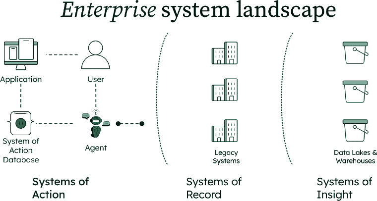
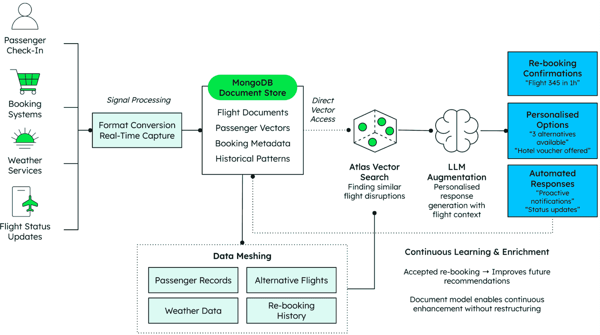

# 第三章：行动系统

数据是将通用人工智能（GenAI）转化为可衡量的商业成果的基础。AI 赋能的能力，如非结构化数据的向量编码、跨部门实时合成以及闭环中的代理，正在改变我们进行商业交易的方式。掌握这些能力的企业可以从被动、孤立的决策转变为主动、智能驱动的运营，实时应对市场变化，降低运营成本，并推动更强大的客户成果。

通过闭环中的代理增强和自动化业务工作流程对底层数据层提出了更高的要求。代理可以访问和分析众多孤立的来源，构建丰富的上下文，并告知业务决策。但那个上下文在哪里持续存在？业务用户如何查看、交互或甚至编辑该信息？

为了支持这一演变，企业必须超越静态的*记录系统*，这些系统被动地存储和提供数据，转向动态的*行动系统*：为实时决策、自动化以及人类、AI 辅助用户和完全自主代理之间的协作而设计的系统，以对数据进行*行动*。虽然传统的记录系统在维护数据完整性和合规性方面表现出色，但行动系统可以自主触发决策、执行工作流程并从结果中学习。例如，在零售领域，一个 AI 代理可以在客户需求变化时实时重新订购库存。

本章探讨了行动系统如何将数据转化为决策：这种转变正在变得不可避免。它们必须处理多种形式的数据（从原始来源和文本搜索索引到向量嵌入），甚至需要上下文敏感重排序的 LLM 输入，这是一个优先排序最相关结果的过程。满足这些需求需要一个统一、上下文化的企业数据视图，这超出了它们的记录系统和*洞察系统*前辈所能提供的。这种转变也带来了可扩展性、性能、安全和治理方面的新挑战。

到本章结束时，你将了解以下内容：

+   行动系统数据库通过打破传统的数据建模约束，并允许使用响应式、基于文档的数据层进行信号处理，支持实时 AI 和 RAG 应用

+   统一的数据访问使 GenAI 能够在一致框架内处理多种格式，如源数据、嵌入和实时信号

+   数据质量和一致性通过全源追踪和来源意识减少幻觉并提高可靠性

+   准备好的 AI 数据架构与传统仓库和洞察系统不同，支持动态、多模型工作负载

+   管理和安全策略与 AI 特定的需求相一致，例如隐私、访问控制和加密

+   模型训练和微调管道为 GenAI 应用准备和优化数据

+   实施模式遵循从信号摄取到丰富再到智能响应的流程，提供部署蓝图。

# 建立 AI 就绪的数据基础。

履行行动系统的承诺需要一个全新的数据基础——一个为速度、上下文和适应性而构建的数据基础。

代理 AI 系统在运营需求上与传统记录系统有根本的不同。传统系统侧重于捕获和存储历史交易，而由代理 AI 驱动的行动系统需要实时决策、动态数据综合和即时响应能力。这种转变要求我们的数据架构选择超越传统企业系统的僵化、孤岛式结构。

对核心企业的统一视图至关重要。它必须将自主代理依赖的多种数据类型（实时运营信号、上下文文档、向量嵌入）整合到一个单一、连贯的平台中。该平台必须建立在灵活的数据结构之上，能够随着代理行为的演变而适应。

从支持被动记录系统到启用主动行动系统的转变，引入了六个关键架构要求，这些要求将代理 AI 基础设施与旧方法区分开来：

+   **统一数据访问**以消除管理多个不同数据存储的复杂性。

+   **数据质量和一致性**机制，减少不同步系统中的幻觉和错误。

+   **实时上下文**能力，使 RAG 应用能够立即处理信号。

+   **可扩展性和性能**特征支持操作 AI，而不仅仅是面向后视镜的分析。

+   **治理和安全**框架在保护敏感信息的同时促进创新。

+   **高效的模型训练工作流程**，优化数据准备以适应 GenAI 应用。

这些元素共同构成了自主、智能系统的数据基础。在接下来的章节中，我们将逐一审视这些元素，了解行动系统数据库如何与传统数据管理不同，并使更智能、响应更快、可扩展性更强的 AI 应用成为可能。

## 什么是行动系统？

行动系统是一类新的企业应用，旨在实时执行决策和驱动工作流程。它们使人们、AI 辅助用户和 AI 代理之间的协作成为可能，支持从辅助决策到完全自主执行的一切。

与被动存储历史交易的记录系统或回顾性分析数据的洞察系统不同，行动系统在当下运作。它们处理动态环境，触发决策，并通过 AI 代理执行任务。例如，它们可能会实时重新安排延误的航班或自动调整医院的人事配置以应对突发高峰。

构建行动系统需要不仅仅是分析能力。它们必须摄取流信号，跨非结构化和结构化来源进行推理，并实时响应。它们需要能够管理高速、多模态数据流并支持随时间复杂状态转换的专用数据库架构。大多数传统系统，设计用于静态、批量导向的工作流程，根本无法支持这种持续智能。

图 3.1：企业系统景观：从记录系统到行动系统

*图 3.1*展示了企业景观中的这种演变。与被动存储或回顾性分析数据的传统系统不同，行动系统使用户、应用程序和代理之间能够进行实时交互；这一切都由一个实时、可适应的数据层提供支持。

## 统一数据访问架构

任何 GenAI 系统的基石始于对多样化、多模态数据的快速访问，这些数据是 AI 可以推理的格式。不幸的是，这也是大多数企业挣扎的地方。传统的企业数据架构在数十个不兼容的系统之间是碎片化的，每个系统都针对狭窄的用例进行了优化。结果是集成痛苦、访问摩擦和巨大的开销。

现代 AI 应用需要根本性的转变：统一访问必须被视为一个前提条件，而不仅仅是便利性。

今天的模型必须导航各种输入：文本文档、应用程序日志、产品目录、支持记录和流传感器数据。关系型和传统系统通常将半结构化数据（如 JSON 或 XML）存储为**二进制大对象**（**BLOBs**）或**字符大对象**（**CLOBs**），这限制了它们在 AI 系统中的可用性。在这些情况下，实际数据隐藏在单个条目中，必须在推理或操作之前提取和解释。当目标是存储和检索文件时，这是可以容忍的。但对于 GenAI 系统，其中模型需要立即访问结构化和半结构化数据，通常在同一个查询中，这种格式成为了一个瓶颈。甚至视频也可以有自己的可寻址元数据结构，而不是仅仅作为一个不透明的 BLOB 存在，这说明了为了支持 AI 原生推理所需的转变。

格式问题之外，还有一个更加紧迫的挑战：**碎片化**。

一个 AI 应用可能需要将来自 CRM（客户资料和账户层级）、产品目录（SKU 级细节、定价、可用性）、数据仓库（历史交易）、流平台（实时行为信号）和文档存储（合同、支持记录、政策文件）的上下文拼接起来。每个来源都有自己的模式、访问模式和通常自己的 API。这种复杂性产生了两个持续的挑战：

+   **开发者集成摩擦**：每一层都引入了自己的问题，从身份验证和授权到模式不匹配、脆弱的连接器和不一致的格式。

+   **系统脆弱性/维护拖累**：随着时间的推移，这些集成会积累，引入无声的故障、版本问题以及下游可靠性风险，使创新变得缓慢且成本高昂。

MongoDB 的文档模型采用了根本不同的方法。它不是将多样化的数据强制纳入僵化的模式或隐藏在难以阅读的块中，而是启用丰富、层次化的数据结构，这些结构反映了企业实际运作的方式 [1]。开发者可以在单个文档中建模完整的客户、订单或事件，包括嵌套上下文、版本历史和行为属性。这消除了复杂连接的需求，同时保留了有效代理推理所需的关键关系。

更重要的是，**灵活的架构设计**，即存储和查询数据而不锁定在僵化的蓝图中的能力，允许字段和文档形状随着需求的变化而适应。这使得数据可以进化——可以添加新的属性而无需停机，并且可以集成新的信号类型而无需昂贵的迁移。对于 AI 系统（尤其是那些学习、适应和扩展自己的系统），这种敏捷性是必不可少的。

这种架构的趋同使得结构化事务、实时信号和非结构化内容可以在单个查询或操作中一起实现。模型更新、丰富作业或下游代理操作都可以直接从相同的数据平台 [2] 触发。这种统一模型为复杂的、AI 原生的工作流程奠定了基础。

可能更重要的是，统一的数据访问改变了开发者的生产力。而不是花费周期来协调格式或调试脆弱的连接器，团队可以专注于构建智能系统。而且，正如我们将在接下来的章节中看到的，从数据质量和治理到实时编排的一切都建立在这个基础上。

## 确保数据质量和一致性

对于生成式 AI 解决方案，数据质量和一致性是不可或缺的。与传统的分析不同，数据质量问题可能会产生错误的报告或延迟的洞察，而在 AI 系统中，数据质量差可能导致幻觉、引入有偏的输出，以及从根本上不可靠的行为，这损害了用户信任和商业价值。

传统的质量方法试图通过规范化、去重和与外部来源的验证来解决这一问题。考虑一个熟悉的失败模式：一个系统通过邮政 API 和信用检查验证了“Joe Miller，12 High Street”，却无法区分同一地址上的三位不同的 Joe Miller（祖父、父亲和儿子）。对于需要精确关系映射的实体分析，这是一个关键的缺陷。

在这种情况下，在线商店可能无意中将三位个体视为同一客户，从而失去了定制互动或提供优惠的能力。关系星型模式通过在多个表中分割上下文信息而加剧了这个问题。当客户数据在事实表、维度表和查找表之间分割时，能够实现准确实体解析的丰富上下文变得分散且难以重建。

在我们的 Joe Miller 示例中，基于文档的方法将为每个个体维护单独的文档，包括详细的人口统计信息、购买历史、行为模式和关系数据，这些数据能够实现清晰的区分。

在文档中，您可以在同一数据集中存储原始值以及增强和改进的内容。这种方法提高了输出可靠性并减少了幻觉或矛盾的结果。当人工智能系统生成输出时，可以通过文档结构追溯整个数据源、转换和推理步骤的完整链，从而实现调试和合规性报告。

这种血缘能力对于提高输出可靠性并减少幻觉或矛盾的结果至关重要。当人工智能模型不仅可以访问数据的当前状态，还可以访问其来源和转换历史时，它们可以做出更明智的数据可靠性和置信水平决策。例如，客户服务人工智能可能会更重视最近的直接客户互动，而不是较老的推断偏好，或者当多个数据源提供冲突信息时，标记潜在的不一致性。

对于实施基于文档的数据质量策略的组织，MongoDB 提供了全面的最佳实践，以及与行业领先的数据建模和编目工具的兼容性，这使得大规模的高级质量管理成为可能[3]。当高质量、具有血缘感知的数据成为默认设置时，人工智能系统可以提供准确、可解释和值得信赖的结果。

## 实时上下文和 RAG

“实时”的定义因用例和行业而异，但与生成人工智能（GenAI）一起使用的数据的实时需求不容忽视。例如，对冲基金交易系统需要毫秒级响应，而人寿保险承保流程的时间以天为单位衡量。虽然应用响应时间持续下降，但许多架构使用缓存层，以牺牲数据新鲜度为代价，创造出实时性能的假象。

典型的实时环境遵循一个简单的模式，即交互产生一个信号，该信号能够实现即时解释。这些信号可能来自不同的来源，例如记录购物车添加的零售网站、传输电力使用情况的智能电表，或完成癌症分析数据的病理实验室。所有信号，当与现有数据集结合时，能够实现文本搜索、向量搜索和 LLM 推理及因果分析。这同样适用于交互式系统，如零售购物车，以及自主代理系统，如自动保险索赔处理系统。

实时将信号与元数据、参考数据和历史信息集成，可以瞬间生成新的知识。考虑一下这种演变。传统的基于规则的系统可能会建议“你订购了一个汉堡，想要薯条吗？”相比之下，一个由 AI 驱动的系统可以识别出诸如“你每两周订购一次猫粮，总是同一品牌”这样的模式，并通过与产品推荐相关的推理进行情境化思考，例如“根据你的购买历史，你可能对我们的新、更健康的配方感兴趣。你想我们给你发送免费样品吗？”系统通过将购买模式与产品推荐联系起来，识别重复客户并增强他们的体验，这需要更深入地了解客户偏好和宠物特征。

图 3.2：实时 AI 数据流

*图 3.2*中的架构流程展示了现代 AI 应用如何通过使用行动数据库系统处理实时信号，以航空旅客辅助场景为例。流程从左侧的多种信号源开始：**旅客登机**、**预订系统**、**天气服务**和**航班状态更新**，这些信号输入到**信号处理**和**格式转换/实时捕获**组件。然后，这些信号被摄入到中央的**MongoDB 文档存储库**中，该存储库包含**航班文档**、**旅客向量**、**预订元数据**和**历史模式**，并具有**直接向量访问**功能。

系统通过**Atlas 向量搜索**（寻找类似的航班中断）和**LLM 增强**（生成具有航班上下文的个性化响应）来处理这些数据，以产生三种类型的智能输出：**重新预订确认**、**个性化选项**和**自动响应**。基础是**操作数据层**（**ODL**），这是一种将孤岛化企业数据集中整合和组织的架构模式，作为现有数据源和消费应用之间的中介。在这种情况下，ODL 通过乘客记录、替代航班、天气数据和重新预订历史中的上下文信息丰富信号。

持续学习和丰富反馈循环确保每一次交互结果，无论是接受重新预订还是用户偏好，都能回流以改善未来的推荐。文档模型允许持续增强而不需要系统重构，创建一个随着每位乘客交互而变得更聪明的系统，同时提供对现代人工智能应用至关重要的实时、上下文感知的响应。

关键的是，反馈循环确保持续改进，确保每一次交互结果丰富动作数据库系统，使未来的响应更加准确和具有上下文。这种循环流动体现了基于文档架构的关键优势：*能够在没有约束传统关系系统的模式刚性下演变和改进的能力*。结果是，系统随着每一次交互变得更聪明，提供现代人工智能应用所需的实时、上下文感知的响应。

## 可扩展性、可用性和性能

从历史上看，企业数据仓库代表了最大的数据库实现，具有为分析查询设计的去规范化、列导向的星型模式。这些系统在执行如“按地区显示酸奶销售”之类的查询时表现良好，其中大型数据集通过特定标准（地区、商店、价格）进行筛选以生成见解。多个来源的集成导致了**提取**、**转换**、**加载**（**ETL**）过程和主数据管理系统的开发。虽然这些平台增加了机器学习功能，并声称支持生成人工智能能力，但它们仍然主要设计为面向后视的分析工具，不适合实时、代理和因果人工智能应用。

考虑对比。一个帮助错过航班的航空乘客的聊天机器人需要与回答“去年有多少乘客在法兰克福经历了全天延误？”的问题有根本不同的能力。聊天机器人和其背后的代理系统必须解决即时需求，找到可用座位，提供缓解服务，并对沮丧的乘客表示同情。所需的数据是实时、上下文敏感的，并且简单地无法从历史仓库中获得。

要在乘客请求中取得成功，系统需要实时座位信息访问（通过通常的预订系统 API 容易实现），以及更重要的关于乘客及其情况的详细上下文和信息。是家庭滞留，还是单身成人？存在哪些其他票务依赖？乘客能否通过不同的轨道重新路由，或者最好的选择是过夜？

这种场景要求所有乘客数据都驻留在最新的动作数据库系统中，因为没有当前信息，实时交互将失败。随着这些系统实现全球覆盖，非功能性需求不仅要求 24/7/365 的可用性，还要能够处理从平静时期到高峰旅游季节（如感恩节）的交易量波动。即使是微小的中断也变得不可接受，而仅仅解决数据可用性挑战的缓存解决方案，通过引入数据陈旧问题，在数据*准确性*上做出了妥协。

基于文档的架构，如 MongoDB 所提供的，在特定场景下为这种数据可用性和可扩展性提供了优势。与需要跨多个表进行复杂连接以重建用户上下文不同，文档模型可以在单个、高效可检索的记录中存储完整的上下文信息。这种方法减少了上下文重建的计算开销，同时使更复杂的缓存和优化策略成为可能。

人工智能工作负载的性能特征与传统分析模式也显著不同。虽然分析查询通常处理大量数据以生成汇总结果，但人工智能应用程序通常需要快速访问特定、上下文相关的信息。这种模式有利于优化为高并发、低延迟访问单个记录的架构，而不是大量数据集的批量处理。

## 治理、安全和合规

治理和合规要求源于保护个人免受缺乏足够自我调节的系统中的错误决策的基本需求。这些保障措施旨在防止真正的危害，从有偏见的贷款审批到不安全的产品推荐。

通用人工智能（GenAI）在准确性方面面临严格的审查，媒体对幻觉的报道将这一担忧推到了前台。因此，对于任何通用人工智能解决方案来说，数据来源、推理过程和结果解释的透明度变得至关重要。动作数据库系统中的文档模型能够跟踪与特定数据集相关的所有更改、转换和操作。与传统的关联数据库不同，文档在整个过程中提供了增强和丰富性的灵活性，而无需预先规划。

从治理的角度来看，这使精确和全面跟踪沟通和决策过程成为可能。当出现合规挑战时，它促进了决策审计和纠正措施，通常是由于决策标准逐渐变化需要调整。

安全性代表了一个额外的关键维度。MongoDB 的可查询加密确保数据绝对安全，不受未经授权的访问。虽然乘客数据可能具有适度的敏感性，但关于潜在疾病的医疗提供者咨询需要最高的安全级别。动作数据库系统使得透明安全实施成为可能，这在协调具有可能不兼容的安全和政策系统的多个数据源时更具挑战性[4]。

## 模型训练和微调

训练或微调模型需要大量干净、标记和多样化的数据。动作数据库系统确保了训练管道的高效数据整理、采样和预处理。数据丰富变得至关重要，因为像 MongoDB 的聚合管道这样的功能使得数据标注和持续分析诸如最小值、最大值和移动平均数等标准成为可能，以验证推理过程。

对于生成式 AI 的数据准备这一主题常常被误解，这源于早期支持机器学习系统（源自**商业智能**（**BI**）架构的系统）的 AI 解决方案的演变。这有时会导致错误的假设，即所有用于 AI 使用和交互的数据都必须首先在湖、仓库或集市中准备或准备好，需要大量的转换和数据管道处理。结果数据对象通常以包含数百列和伴随的维度表的形式存储为星型模式，每个维度表都包含事实表。星型模式，这是一种最初设计用来解决针对关系数据库对象执行高效分析查询的数据建模格式，引入了需要复杂查询和连接操作来提取洞察的需求，这种架构仍然被 Snowflake 等平台采用。

Apache Spark 对象存储实现，例如 Databricks，通过分布式计算框架和内存处理提供更复杂的查询能力，这比传统的批量处理系统有显著进步。这两种方法，星型模式和 Spark 操作的对象存储文件，无论当代术语如*数据湖*或*湖屋*如何，都基于向后看的数据仓库。

这些系统针对处理沿维度轴对齐的大量同质数据进行优化。对于操作处理，对单个数据集的实时访问超出了它们的设计参数。历史上，这曾是**在线事务处理**（**OLTP**）系统的领域。虽然事务日志不是生成式 AI 数据结构的核心，但访问模式仍然相似。

通常，构建嵌入模型示例被引用为数据仓库必须成为 GenAI 数据来源的理由，但这是一种误导。首先，许多商业解决方案成功部署了标准嵌入模型用于 PDF、图像和音频，而不需要定制开发。其次，更重要的是，这种比较并不成立，因为分析季度销售的仓库与销售点和交易登记无关。

# AI 数据设计的实际考虑

虽然动作数据库系统的理论基础为 AI 就绪的动作架构提供了概念框架，但成功的实施需要关注实际的设计原则和运营现实。本节探讨了决定现实世界 GenAI 实施成功与否的三个关键方面：结构良好和组织有序的数据的基本重要性、数据通过 AI 系统的流动模式，以及部署和维护这些架构所需的运营考虑。

## 一个好的数据结构至关重要

组织良好的数据，如文档、索引和嵌入，能够实现快速和相关的信息访问，这对于 RAG 至关重要。

相比之下，传统的关系型数据库存储模式与 GenAI 应用之间存在根本性的阻抗不匹配，这些应用需要统一、上下文丰富的数据对象，以保留语义关系和业务意义。当业务实体跨越多个规范化表中的参考数据、元数据和运营信息时，通常需要大量的连接操作和额外的应用层代码来将碎片化的数据重构为连贯的业务对象，以便 AI 处理。这种关系型碎片化不仅降低了查询性能和增加了系统复杂性，还掩盖了有效 AI 消费所必需的自然数据关系，创建了需要持续维护的相互依赖的架构关系的人工边界。因此，GenAI 应用需要能够原生地表示复杂、分层业务实体而不需要大量重构逻辑的数据架构，青睐与 AI 模型消费数据方式更自然对齐的文档型架构，即丰富、上下文化的对象，而不是分解、规范化的片段。

基于文档模型精心设计的动作数据库系统是解决上述所有挑战的同时，还能带来丰富的无形效益的解决方案，包括减轻开发者的认知负担和基础设施技术蔓延。

各种来源的结合增强了元数据理解，并提高了模型的准确性和相关性。从开发者的角度来看，文档结构使得提示构建更优越，因为去规范化文档对开发者和 LLM 来说都更容易处理，从而提高了提示的质量。此外，结构更简单、规范化减少的简化结构减少了生成适当上下文所需的数据对象数量。数据对象越少，就越容易确保数据质量，以减少幻觉并提高事实性。

在之前的航空公司例子中，多个模型可能贡献不同的推理方面：一个通用的 LLM 来处理聊天机器人通信，以及一个特定领域的微调模型来确定路由选项。次要的 LLM 可能专门从事总结与数据验证，这表明依赖于单个 LLM 可能无法在智能系统中实现合理质量。

文档模型通过迭代丰富来提升输出质量，它随着用例的发展而进化，而不是需要重新架构或重构以适应新的或变化的需求（这是关系系统中不可避免的痛点）。最终，丰富的文档提高了基于推理的智能系统的流畅性、连贯性和创造力。

由于数据检索设计不佳，源于组织松散的来源，导致性能缓慢、结果不相关或不准确的信息。相反，对齐良好的架构确保了快速、上下文相关的检索，支持有意义的模型输出。

简而言之，当数据结构和模型设计被深思熟虑地对齐时，结果是更准确、响应更快、可扩展性更强的 GenAI 解决方案。

## 数据流

GenAI 解决方案的数据流通常从机器、过程或人类交互中捕获的交易数据开始。然后，它可以与相关的非结构化工件向量编码或现有参考数据进行丰富，以便在智能系统工作流中使其可操作。在 MongoDB 中，这种实时业务对象丰富导致一个包含所有相关信息、丰富到最大程度的单一文档。相比之下，在传统的架构设计中，数据只会从其来源进行引用，最好需要调用 API，最坏的情况可能是直接访问数据库。

基于文档的方法进行数据流，允许在一个对象和格式中传递所有上下文信息，从而促进多个智能系统之间在单一流程或工作流中的协作工作。在我们的例子中，航班中断被编译成一个单独的文档，管理案件的所有不同方面，包括乘客互动、航班信息、合同数据，甚至包括天气条件等情境因素。

这使得多个代理系统能够在相同业务对象或事务交互的不同方面进行协作。例如，当聊天机器人与乘客沟通并提供实时状态更新时，另一个系统组件会主动处理根本问题，这是由事务系统检测到航班延误并计算乘客错过转机航班的概率触发的。这意味着在乘客甚至开始联系之前，*案例*就已经开始处理。

在此案例创建过程中，系统通过特定的嵌入生成多个向量，并对类似的历史案例进行语义搜索。这允许 LLM 在尽可能早的时刻准备自然语言响应，例如“我们识别出多个航班选择……”。在最佳情况下，代理系统可以主动生成多个解决方案，并通过类似“我们很抱歉您错过了航班。我们有三个可选方案继续您的旅程……”的消息与乘客沟通。

一旦案例成功解决，文档将丰富全面的成果数据，例如“乘客接受了 345 航班一小时后的重新预订，对主动沟通表示满意，并拒绝了餐券优惠”。然后可以解释与乘客的互动，并对整体结果进行分类。这允许进行关键的质量保证，帮助识别新兴趋势，并验证和测试新的模型及其建议的结果。

# 实施行动数据库系统

从架构原则到生产部署的转变需要解决区分 AI 数据系统与传统数据库的操作复杂性。GenAI 工作负载的独特特性，包括实时向量搜索、持续模型演变和动态模式要求，需要专门的部署、监控和维护方法，这些方法远远超出了传统的数据库管理实践。

## 部署模式

实施行动数据库系统需要围绕部署架构进行仔细规划。组织通常遵循三种主要模式之一：为新的 AI 项目进行绿色 field 实施、逐步迁移策略，逐渐从旧系统过渡，或者混合方法，在保持现有系统的同时，构建新的 AI 能力。

云原生部署提供了最大的灵活性和可扩展性，例如 MongoDB Atlas 等托管服务提供了自动扩展、备份和安全功能。对于有严格数据主权要求的组织，本地部署可能是必要的，而混合云方法可以平衡安全需求与运营效率。

## 性能监控和优化

实时人工智能应用需要在多个维度上持续监控性能。查询性能指标不仅要跟踪响应时间，还要跟踪向量搜索的相关性分数以及人工智能生成输出的准确性指标。基于文档的系统需要监控集合大小、索引有效性和聚合管道的性能。

关键性能指标应包括数据摄入的吞吐量指标、检索操作的延迟测量以及高峰人工智能处理负载期间的资源利用率模式。当性能低于可接受阈值时，自动警报系统应触发，尤其是在实时应用中，延迟会直接影响用户体验。

## 成本管理和资源分配

人工智能数据基础设施的经济效益与传统数据库系统大不相同。向量存储和相似性搜索消耗的资源模式与关系查询不同，需要新的容量规划和成本优化方法。

存储成本随着文档大小和嵌入维度成比例增长，而计算成本则根据模型复杂性和查询频率变化。组织应实施分层存储策略，将较旧或访问频率较低的数据移动到访问频率较低、成本较低的存储层，同时将频繁访问或热数据保留在高性能系统中以实现实时访问。

## 维护工作流程和数据生命周期管理

基于文档的人工智能系统需要专门的维护程序，这些程序考虑到模式演变、嵌入模型更新以及随时间推移的数据质量漂移。与传统数据库不同，其中模式更改需要仔细的迁移规划，文档存储允许更灵活的演变，但这种灵活性并不否定需要治理框架来确保数据一致性的需求。

随着更新、更有效的模型的出现，定期重新处理嵌入变得可取。应利用自动化管道来管理嵌入更新，同时保持高系统可用性，可能利用蓝绿部署策略在主要模型转换期间最小化系统中断。

## 从旧系统迁移的策略

组织在实施行动数据存储系统时很少从一张白纸开始。从现有的关系系统、数据仓库和不同的运营系统迁移数据需要分阶段的方法，以最小化业务中断并最大化统一数据访问的好处。

来自众多行业广泛客户的经验表明，最成功的迁移始于能够快速展示价值的试点项目，然后逐步扩大范围。数据同步策略应在过渡期间保持新旧系统之间的业务数据一致性，通过自动化验证确保整个迁移过程中的数据完整性。

## 团队培训和采用考虑因素

成功实施行动数据库系统需要投资于团队能力。传统的数据库管理员可能需要接受文档建模原则的培训，而应用程序开发者可能需要学习针对人工智能工作负载的新查询模式和优化技术。

数据科学家和机器学习工程师需要了解文档结构如何影响模型训练和推理性能，而 DevOps 团队需要熟悉人工智能特定的监控和扩展要求。在行动系统架构中，数据工程、人工智能开发和运营之间的界限变得模糊时，跨职能协作变得至关重要。

# 摘要

本章探讨了行动数据库系统在构建有效通用人工智能（GenAI）解决方案中的关键作用。我们分析了传统数据管理方法的局限性，并提出了以文档模型为中心的替代范式。讨论的关键方面包括对多样化数据源的统一访问、改进数据质量和一致性、为 RAG 提供实时上下文、可扩展性、安全性和治理，以及将数据结构与模型设计对齐以实现最佳性能和准确性的重要性。

基于文档模型精心设计的行动数据库的主要优势是能够提供实时、上下文相关和全面访问多样化的数据，这对于推理、因果分析和生成准确、相关的输出至关重要。这种方法与传统数据仓库不同，它提供了一个统一视图，优化了 RAG、模型训练和微调的数据。这导致通用人工智能解决方案更安全、更准确、响应更快、可扩展且更安全。

在下一章中，我们将探讨可信赖人工智能的关键基础，探讨组织如何导航复杂的伦理框架、法规遵从性和数据治理要求。随着人工智能系统在关键决策过程中的日益嵌入，确保它们在伦理、法律和社会界限内运行变得至关重要。我们将讨论适当的数据治理，即我们通过行动数据库系统建立的基础，如何使组织能够构建透明、公平、负责任且符合不同行业和司法管辖区不断变化的法规的人工智能系统。

# 参考文献

1.  *MongoDB 的文档模型方法*: [`www.mongodb.com/docs/manual/data-modeling/`](https://www.mongodb.com/docs/manual/data-modeling/)

1.  *数据建模全面指南*: [`www.mongodb.com/resources/basics/databases/data-modeling`](https://www.mongodb.com/resources/basics/databases/data-modeling)

1.  *实施有效的数据质量模式*: [`www.mongodb.com/developer/products/mongodb/modernizing-rdbms-schemas-mongodb-document/`](https://www.mongodb.com/developer/products/mongodb/modernizing-rdbms-schemas-mongodb-document/)

1.  *MongoDB 的高级安全功能*: [`www.mongodb.com/docs/manual/core/queryable-encryption/`](https://www.mongodb.com/docs/manual/core/queryable-encryption/)
