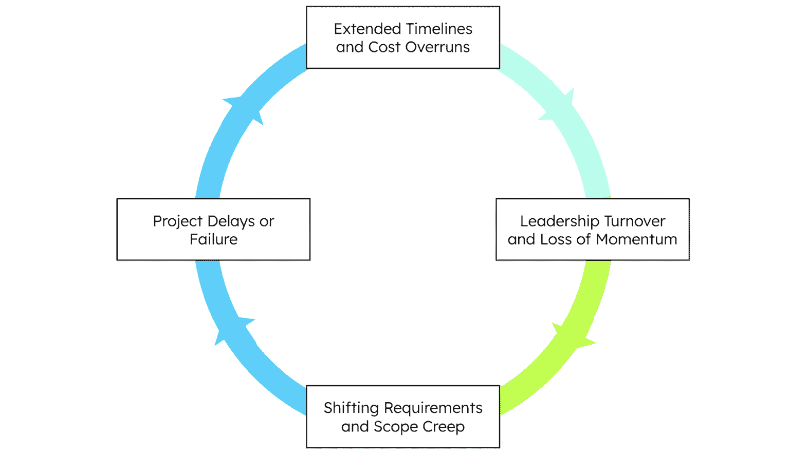
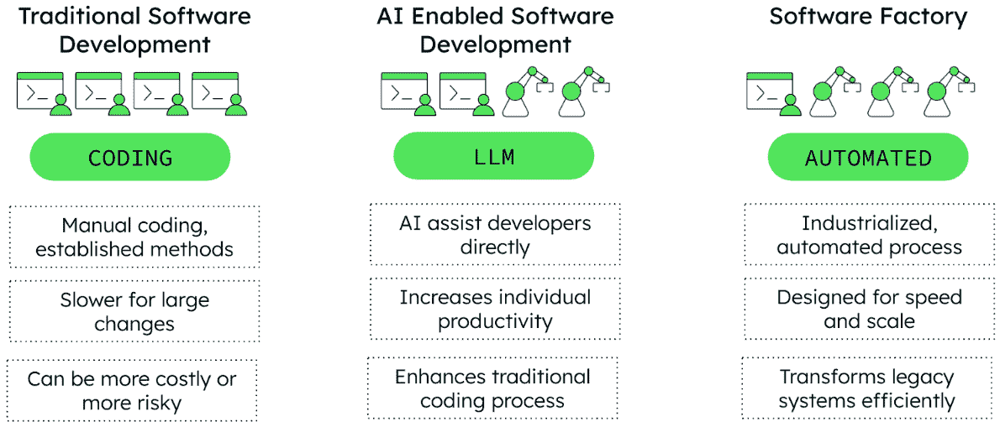
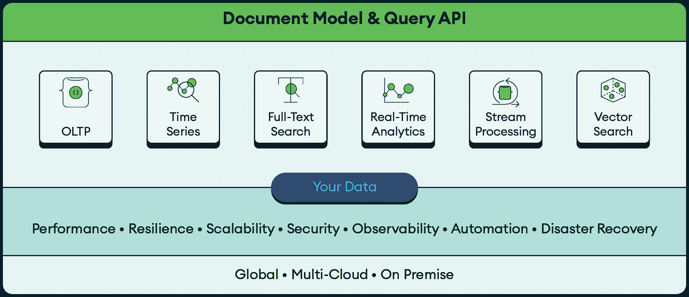
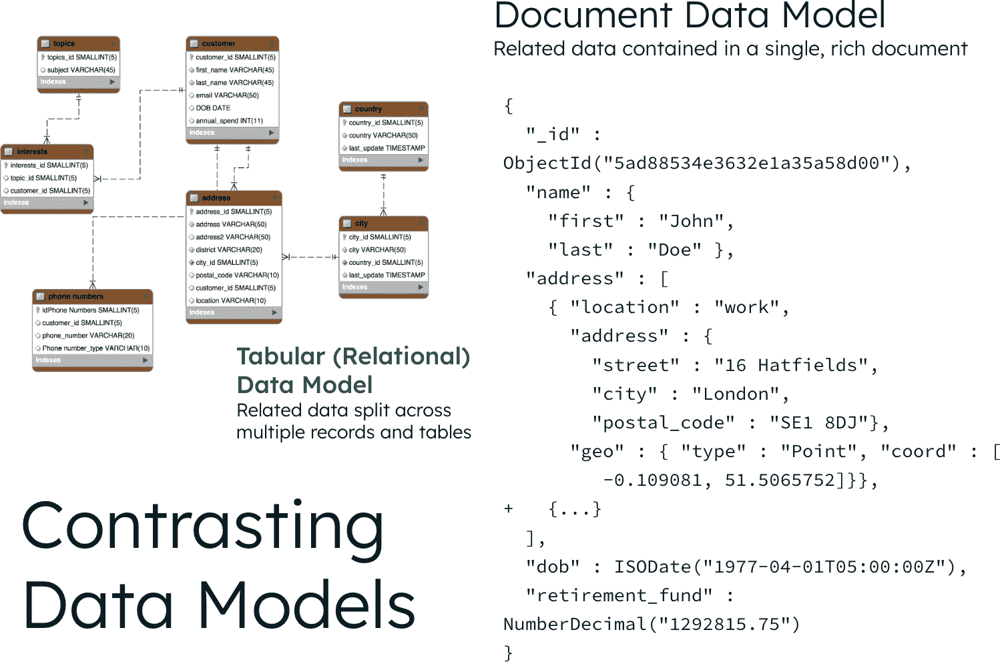
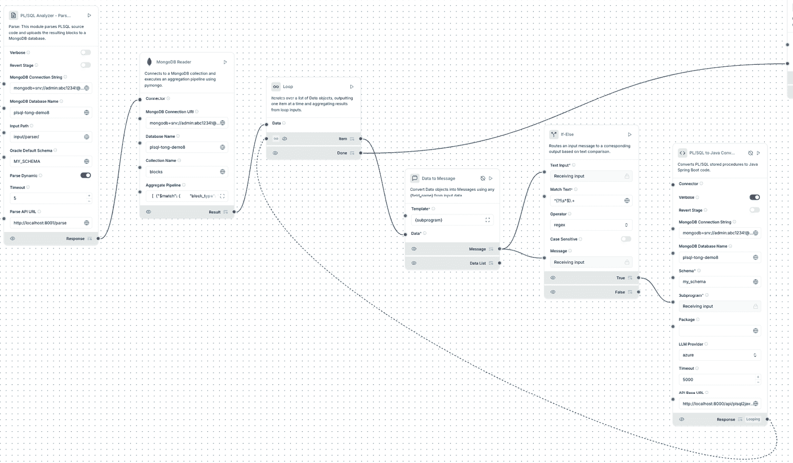
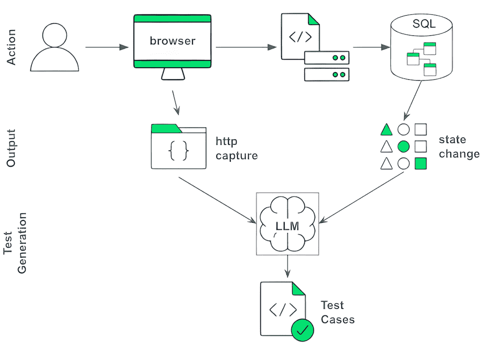
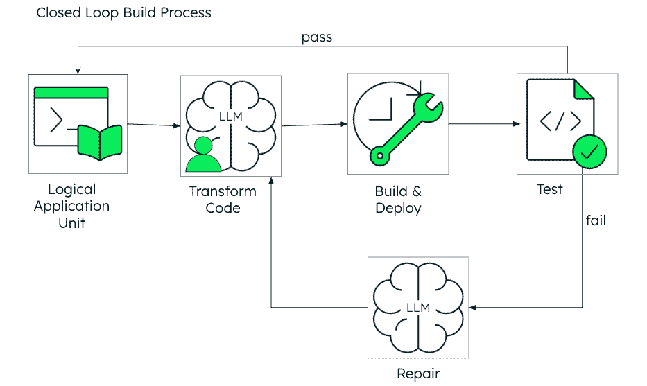
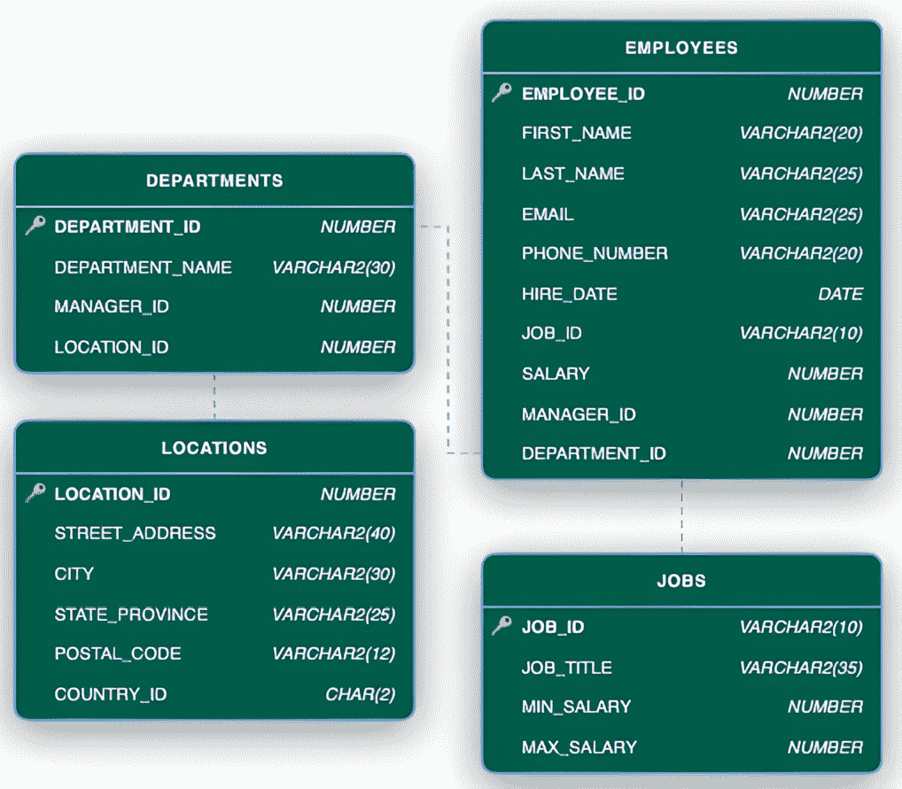
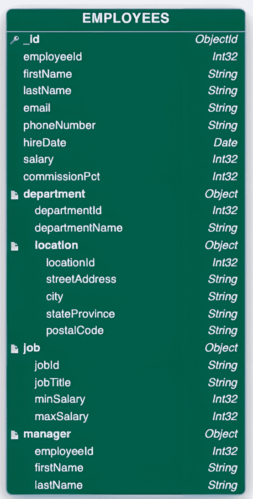

# 第五章：使用人工智能进行现代化

在今天快速发展的数字环境中，企业面临着关键的转折点，这是一个他们可以维持现状或重新定义可能性的时刻。对于全球的组织来说，这个转折点集中在现代化那些已经成为运营关键且越来越难以维护的遗留系统上。根据最近的研究，80-90%的应用现代化项目失败，突显了组织在尝试更新其关键系统时所面临的巨大挑战 [1,2]。

本章探讨了人工智能如何改变现代化格局，提供了新的方法来克服传统障碍并加速通往现代、灵活和可扩展系统的旅程。

到本章结束时，你将了解以下内容：

+   导致大多数现代化项目失败的根本挑战

+   为什么传统的现代化方法越来越不可持续

+   人工智能如何加速现代化进程的特定方面

+   人工智能的限制以及人类专业知识仍然至关重要的地方

+   现代数据平台（如 MongoDB）在成功现代化中的作用

+   使用人工智能实施可重复现代化方法的实用方法

+   如何通过人工智能增强测试策略以降低现代化风险

+   来自领先私人银行成功转型的实际成果

# 现代化挑战

全球企业都在努力现代化其过时的软件。他们面临着削减运营成本、加速新功能的交付、集成人工智能以及满足安全和合规标准的压力。人工智能（尤其是生成式人工智能）的出现，为解决这些现代化挑战重新激发了热情。

然而，达到这一目标并不容易。应用现代化过程中的一些关键障碍包括以下内容：

+   **延长的时间表和成本超支**：大规模应用程序的重写通常难以准确估计。它们往往将项目的时间表和预算延长到不可持续的水平，造成财务压力并削弱组织支持。最初 18 个月的项目经常延长到三年或更长时间，成本远超初始预期。

+   **领导层更迭和动力的丧失**：现代化项目的长期性质可能会受到领导层变化的影响，最初的改革倡导者可能会离开。这导致新的管理层继承一个昂贵、持续进行且通常理解不足的项目，这可能会削弱信心并导致项目放弃。

+   **移动目标现象**：当新系统正在构建时，旧系统仍在不断进化。在旧代码中添加新功能和修复错误。重写团队必须不断追赶，试图与移动目标实现功能对等。这种并行开发实际上将他们的工作量翻倍，使得新系统真正取代旧系统变得几乎不可能。

+   **未记录的复杂性和第二系统效应**：旧系统通常包含多年的累积业务逻辑、未记录的边缘情况和最初是错误的*功能*。完全重写可能会丢失这种关键的组织知识。此外，开发者可能会成为*第二系统效应*的受害者，过度设计新系统，添加过多的功能和过于通用的架构，增加不必要的复杂性并延迟完成。正如一项关于大型机应用程序重写的研究发现，“*10 个重写项目中只有 1 个在初次尝试中成功*”，原因包括复杂的集成和工具不足 [3]。

*图 5.1*展示了许多组织在尝试现代化旧系统时面临的恶性循环。它显示了延长的时间表如何导致领导层变化，进而导致需求变化和范围蔓延，最终导致项目延迟或失败。这个循环突出了为什么传统的现代化方法往往不足，以及为什么需要新的 AI 辅助方法来打破这种模式。最终，这些综合因素为大规模重写创造了很高的失败概率，导致重大经济损失，并使组织在未来不愿进行类似的现代化努力。

图 5.1：尝试旧系统现代化时的恶性循环

MongoDB 已经开发了一种全面的现代化方法，包括熟练的工程师、全面的 AI 工具，以及从与世界各地许多客户合作的经验中提炼出的流程。许多客户谈论了一个理想的场景，即涉及一个 AI 系统自主管理整个现代化生命周期，从环境创建和代码重构到测试和生产迁移。然而，这种自动化程度仍然是一个遥远的愿望。

## 现代化的动机

尽管存在挑战，但组织仍然继续追求现代化倡议，因为不采取行动的成本超过了改变的风险。了解这些动机为 AI 如何帮助解决潜在需求提供了重要背景。大多数组织现代化背后的两个主要动机是：由于脆弱、不灵活的旧系统导致的缺乏敏捷性而落后于竞争的恐惧，以及保持旧业务关键系统的运行所面临的日益增长的压力和投资。

## 商业必要性：竞争压力和创新

组织不是简单地因为技术老化而进行技术栈的现代化；他们这样做是因为传统系统越来越多地限制了业务目标。现代数字基础设施使公司能够快速适应市场变化和客户期望的变化。当竞争对手可以在几天内而不是几个月内推出新功能时，现代化成为战略上的必要，而不是技术上的偏好。

在激烈的竞争背景下，传统应用程序对大多数组织来说是一个生存威胁，常常创造无形的技术创新障碍。开发团队的大部分时间都花在维护这些脆弱的系统上，而不是投资于他们需要以有效竞争的新能力。通过解决这些限制，现代化释放了人力和计算资源，以便专注于创新和竞争优势，包括 AI 集成、实时服务和高级分析。

## 技术限制：传统架构日益增长的压力

在大多数现代化倡议的背后，都存在几个共同的技术挑战，最终变得无法忽视：

+   **架构僵化**：单体传统应用程序由于其本质而抵制变化。在现代模块化系统中可能只是一个简单的功能添加，在较老的架构中通常需要跨紧密耦合组件进行级联修改。这种僵化性大大增加了即使是微小变更的成本和风险，导致需要改进的待办事项不断积压，一次又一次地因为担心服务中断而推迟。

+   **性能限制**：传统系统通常不是为了云部署或处理当今的交易量和数据增长而设计的。随着需求的增加，这些系统会遇到无法通过根本性重新设计克服的性能瓶颈。当组织试图实施需要实时数据处理和分析的 AI 能力时，这些限制变得尤为突出。

+   **安全风险**：过时的框架和未修补的组件创造了不断增长的安全漏洞。虽然许多供应商愿意为这些传统系统提供扩展支持，但这种支持的成本通常令人震惊，远远超过即使是复杂的现代化项目。这种无法更新的能力增加了合规风险，尤其是在 GDPR、HIPAA 和 PCI-DSS 等法规继续随着更严格的要求而演变的情况下，正如在*第四章**，*可信 AI、合规性和数据治理*中更详细讨论的那样。

现代化的动机是明确的；今天没有哪家规模较大的公司没有某种现代化计划在运行，且效果各不相同。事实上，许多公司已经开始质疑这个承诺如此之多的 GenAI 新世界，是否正是他们摆脱遗留链束缚所需要的良方。

## 为什么 AI 单独不是答案

虽然 AI 工具提供了令人印象深刻的性能，但任何有哪怕一点使用经验的开发者都会很快意识到，由于以下几个原因，它们作为完整的现代化解决方案存在不足：

+   **可靠性问题**：GenAI 模型产生非确定性输出，这意味着你不能保证用相同的输入得到相同的结果。这种不可预测性带来了重大风险，因为 AI 生成的代码可能包含微妙的逻辑错误、安全漏洞或合规性问题，这些问题只有在生产环境中才会显现。

+   **上下文限制**：LLMs 在处理企业应用程序的广度和复杂性方面存在困难。大多数现代化工作涉及数十或数百个组件的互联系统。LLMs 缺乏在如此广泛的代码中保持上下文的能力，这使得它们容易在系统边界处引入错误，而依赖性在这里最为关键。

+   **工程判断**：AI 系统无法复制经验丰富的架构师和工程师在现代化项目中带来的积累的智慧以及细微的决策能力。在评估遗留代码时，资深工程师会基于业务影响、风险评估和未来可扩展性需求，做出关于哪些组件需要重构、替换或保留的关键判断。虽然 AI 可以分析代码，但它无法有效地平衡短期迁移需求与长期战略目标，也不能根据业务价值与技术努力来优先考虑现代化工作。

编码助手通过自动化常规任务，标志着开发者生产力的转型时期。然而，这些助手面临着与 GenAI 相似的固有局限性，因为它们的基础依赖于这些技术。但这并没有阻止许多负责现代化应用程序的开发者拿起这些编码工具，思考他们能将这些工具推进到现代化目标的何种程度。很快就会变得明显，你给编码助手的工作越复杂，你花费在寻找和修复 LLM 引入的 bug 上的时间就越多。显然，存在一个收益递减定律，到了没有经验、流程和工具支持的情况下，仅仅使用传统的软件开发实践进行现代化更为容易和安全。

图 5.2：从传统软件开发到软件工厂的演变

*图 5.2* 展示了软件开发演化的三个阶段：传统软件开发（使用既定方法进行手动编码，对大型变更较慢，成本更高且风险更大）、AI 赋能的软件开发（LLM 辅助的开发提高了个人生产力并增强了传统编码流程，但难以处理复杂性），以及软件工厂（为速度和规模而设计的工业化、自动化流程，能够高效地转换遗留系统）。每个阶段都显示了自动化和能力的不断提高，展示了 AI 集成如何从个人辅助发展到全面的自动化开发工厂。

# 利用 AI 赋能的现代化释放创新

MongoDB 对现代化的结构化、经过验证的方法帮助组织利用 AI 将遗留应用程序转换为现代、可扩展和性能卓越的解决方案。该方法的开发是为了应对近 80%的企业应用程序仍在使用过时技术的现实，它结合了 AI 工具、专门的自动化和人类软件开发专业知识，以降低现代化风险并加速结果 [2]。

MongoDB 的现代化方法的核心是一个软件驱动的流程，它加速了现代化旅程的各个步骤。它从应用程序发现开始，其中 AI 工具分析现有的代码库和数据库结构，映射系统依赖关系，并生成早期文档。与客户紧密合作，MongoDB 团队随后生成测试用例，这对于缺乏正式测试框架的应用程序尤其有价值，并迭代地将遗留代码转换为现代代码，根据测试结果进行优化，直到系统通过所有质量检查。虽然目前还不是完全自动化的*装配线*过程，但该方法随着每次迭代正朝着更高的效率和自动化方向发展。

在企业规模和复杂性方面实现现代化需要一套强大的工具集，**利用 AI**、**自动化**和**现代数据平台**。目前没有任何单一工具能够提供针对复杂代码重构、依赖分析、SQL 转换和大规模数据迁移的完整端到端解决方案。这就是为什么 MongoDB 在其现代化努力中采用工具链方法，整合了超过 25（且仍在增长）个针对不同任务的专用工具。

本节剩余部分将分解该工厂方法的基本组件，从其数据基础和编排模式到其 GenAI 加速步骤、测试原则和现实世界的性能基准。

## 从正确的数据基础开始

关系型数据库已经作为企业工作马超过 40 年，但它们的设计对现代应用程序开发施加了基本限制。开发者必须在多个表中分割数据，实现复杂的连接，并维护抗拒变化的刚性模式。随着应用程序需求的发展，这种架构不匹配减缓了速度，增加了认知负荷，并考验了创新。

今天的负载，包括实时分析和人工智能驱动的功能，需要一个能够处理多种数据类型、水平扩展并能快速适应变化需求的数据平台。像 MongoDB 这样的高级文档数据库平台提供了这个基础。通过将数据存储与开发者已经在应用程序中结构化信息的方式对齐，文档模型消除了减缓交付和复杂系统设计的阻抗不匹配。

MongoDB 提供了一个统一的数据平台，它原生支持广泛的使用案例：操作事务、时间序列数据、文本和向量搜索、物联网遥测等，所有这些都可以通过单个文档模型和查询接口实现。这消除了对特定工作负载数据库的需求，降低了复杂性、安全风险和运营成本，同时加速了创新。

图 5.3：MongoDB 的统一数据平台架构

*图 5.3*展示了 MongoDB 如何通过单一核心数据集实现多样化的工作负载。所有工作负载都运行在相同的底层架构上，该架构针对性能、可扩展性、弹性和安全性进行了优化，适用于全球、多云和本地环境。

除了运营效率之外，MongoDB 的文档模型使开发者能够以传统关系型系统无法比拟的速度构建现代人工智能驱动的应用程序。因为大多数现代应用程序已经使用 JSON 格式的数据用于内部对象、API、事件和集成，将数据以相同的形式存储可以解锁有意义的优势：

+   **自然数据映射**：文档直接映射到 Java 等语言中的对象，减少了样板代码并简化了现代框架和开发库的使用

+   **敏捷性和开发者生产力**：灵活的模式与敏捷开发实践和现代语言中常见的快速迭代相一致，无需复杂 SQL 模式迁移的摩擦

+   **可读性和降低认知负荷**：开发者可以与完整的、自包含的对象（如用户资料或产品 SKU）交互，而无需在多个表中拼接数据

+   **性能和基础设施效率**：非规范化 JSON（BSON）文档减少了查询复杂性，加快了结果，并在规模上提高了基础设施效率

当关系型和基于文档的模型并排放置时，这种对比变得尤为清晰。

图 5.4：对比关系型和文档数据模型

*图 5.4*比较了规范化的关系模式与基于文档的模型。在左侧，相关数据分散在多个表中，需要连接才能重新组装完整的记录。在右侧，MongoDB 将整个对象存储在单个 JSON 文档中，反映了它在应用程序中的使用方式。

一起，文档模型和统一数据平台构成了软件开发的一个强大基础。MongoDB 已经在现代应用程序中得到验证，现在也被视为人工智能应用程序的理想解决方案。越来越多的组织发现，这些相同的属性对于可扩展的现代化也是必不可少的。当与经验丰富的工程团队和可重复的框架结合时，这种方法打开了以前行业未曾见过的规模化应用程序转型的门户。

## 自动化现代化工厂流程

任何传统工厂都依赖于可重复的过程来提供一致和可靠的结果。MongoDB 对企业应用程序的现代化方法遵循相同的原则：使用自动化以受控和高效的方式扩展对遗留系统的转换。无论工具如何，现代化方法都遵循一个共同的模式。在这个模式中，每个项目都有其独特的细微差别，需要人类根据客户的独特环境、架构和优先级调整工具和流程。

工厂的每次迭代都包括以下内容：

1.  **分析**：了解遗留系统的结构、依赖关系和业务逻辑。

1.  **测试生成**：构建全面的测试以验证系统行为。

1.  **代码转换和测试**：将遗留代码和数据转换为现代格式，同时保持功能等效性。

1.  **部署和迁移**：以最小的干扰将转换后的应用程序迁移到新平台。

1.  **重复**：对每个现代化阶段迭代应用这些步骤。

每次迭代的规模和范围取决于客户部署策略和工具等因素。一般来说，较小且更频繁的迭代可以降低风险并提供更早的反馈。

本节探讨了人工智能如何增强和加速这些过程，同时保持必要的人类监督。首先，我们将考察工厂本身的协调方式以及人工智能如何优化现代化过程。

## **编排**：工厂的自动化方式

以人工智能为重点的工作流程正在引领编排工具的新时代。MongoDB 由于其与 LLMs 的紧密集成以及创建和更新代理流程的速度，使用 LangFlow 作为其现代化工厂自动化的基础。这个编排层的一个关键能力是 LLMs 不仅能够生成代码或脚本，还能够诊断和修复它们产生的错误。这些自我纠正的工作流程是使用 LangFlow 的视觉界面设计的，如图*图 5.5*所示。

图 5.5：用于 AI 代理开发的 LangFlow 编排工作流

*图 5.5* 展示了 MongoDB 在创建和管理 AI 编排工作流时使用的 LangFlow 可视化工作流界面。该界面显示了一个基于能力的流程设计，包含各种连接的组件，展示了 LangFlow 如何实现与 LLMs 的紧密集成，并提供了一种创建和更新代理工作流的视觉方法，通过其拖放工作流构建器简化了 AI 驱动的自动化流程的开发。

当然，编排只有在与自动化工具结合使用时才能产生价值。在下一节中，我们不会关注特定的工具，而是关注 AI 在现代生命周期中产生最大影响的战略领域。鉴于工具领域的发展速度如此之快，关注 AI 的使用“哪里”和“如何”将比分析单个工具提供更持久的价值。

## AI 加速流程的地方

如前所述，MongoDB 的现代化方法并不将 GenAI 视为魔杖。任何尝试使用 LLMs 完全自动化现代化的人都知道其中的陷阱：脆弱的输出、隐藏的错误，以及耗时且无效的重工作，这些都违背了初衷。相反，MongoDB 工程师将 AI 视为精心组装的工具包的一部分，以加速关键任务，同时保持控制、精确和问责制。

本节探讨了 AI 在分析中实现的最大性能和生产率提升。

### 分析

任何现代化工作的第一步是明确了解遗留系统，它的构建方式，它做什么，以及它真正有多复杂。在一个案例中，MongoDB 的分析显示，代码库的规模几乎是客户最初认为的四倍。这一早期洞察有助于合理调整项目范围，避免后续的昂贵意外。

下面是 AI 如何帮助加速和增强分析过程的方法：

+   **系统分析和文档**：许多大型系统缺乏最新的文档。LLMs 通过分析代码来生成应用程序功能核心能力的摘要，帮助填补这一空白。它们可以有效地提供一个应用程序的概述，并识别核心领域、编程语言、框架和业务流程。结合静态代码解析器和特定数据库的工具，它们还可以扩展到存储过程、触发器和数据库模式。然而，系统分析通常会导致一个缺口，即下游影响。虽然 LLMs 可以帮助记录直接集成，但它们通常缺乏整个生态系统的背景。这就是一个组织的架构或集成模型库变得有价值的地方，因为 LLMs 可以使用它们来突出集成关注的关键区域。

+   **依赖关系映射**：AI 辅助的依赖关系图的一个关键成果是帮助团队可视化代码库中的深层依赖关系。从**叶节点**开始，即具有少量或没有依赖关系的组件，可以更快、更低风险地取得进展。这种有针对性的方法有助于避免尝试一次性解决整个大型、相互关联的代码库的低效性。现代化努力通常涉及迁移到微服务架构。依赖关系图提供了有价值的见解，有助于识别潜在的边界上下文和服务依赖关系。虽然 LLM 提供了合理的建议，但仍然需要主题专家来确保服务是适当的。

+   **模式转换**：分析的一个主要领域涉及理解数据库模式并确定适当的文档集合和结构。首先，MongoDB 的**关系迁移器**（**RM**）工具在幕后利用 AI 来完成这项工作。除了提供推荐外，RM 还允许用户调整文档结构。其次，利用大型语言模型（LLM）评估应用程序实体，如**普通 Java 对象（POJOs**）或**企业 JavaBeans（EJBs**），可以提供对应用程序结构的额外见解。通常，存在 LLM 无法考虑的细微差别或情境性考虑，需要人工介入。一个需要记住的关键点是，MongoDB 的灵活性意味着在进展过程中很容易更改文档结构。不花费无数小时争论文档的每一个细节，可以让团队开始转换代码，节省宝贵的时间和金钱。当团队发现文档中需要更改的内容时，更改的成本非常低。

+   **知识增强**：使用 MongoDB Atlas Vector Search，团队可以创建 RAG 系统来存储和语义搜索项目文档、代码和最佳实践。利用 RAG 对于创建内部聊天机器人或搜索工具非常有用，这些工具使开发者能够查询大量的项目文档、代码、分析报告和现代化最佳实践。拥有易于访问的、最新的知识库是 AI 带来的另一个节省时间的功能。

对于领导者来说，所有这些都增加了信心。现代化可以在安全、规模化的情况下进行，而不会干扰核心运营。正如我们将在下一节中看到的，这个分析基础使得测试优先策略不仅成为可能，而且是必要的。

### 测试生成

早期现代化阶段关注测试对于确保业务功能保持完整至关重要。许多努力因担心破坏多年来一直有效的解决方案而停滞不前、失败或从未开始。积极应对这种风险对于最小化问题和在整个现代化过程中建立信心至关重要。

#### 端到端测试

许多大型应用程序缺乏足够的端到端测试，迫使领域专家手动验证每个更改。虽然单元测试是必不可少的（并在下一节中介绍），但早期现代化工作从端到端行为测试中获益最大，尤其是当使用真实的应用活动生成而不是仅使用代码提示时。

*图 5.6* 展示了一个更可靠的策略：在运行时捕获输入、输出和数据库状态变化，以准确反映现实世界的业务工作流程。有了这个上下文，包括 API 流量（HTTP、JSON、HTML）、数据库状态变化和底层架构，LLMs 可以生成准确、有意义的测试用例。

图 5.6：使用应用程序行为捕获进行端到端测试生成

此方法优于仅代码提示，后者往往由于缺少业务逻辑和应用状态而失败。一旦捕获了行为上下文，LLMs 可以在 Cucumber、Karate 或其他框架中生成测试，从而加速以与现有 QA 管道集成的格式进行覆盖。此外，将这些生成的测试矢量化并存储在知识库中增加了长期价值：开发者可以以语义方式查询系统的业务逻辑并跨领域重用关键模式。

#### 基于纸张的测试

旧应用程序通常依赖于静态的、可读的测试计划，以文档形式存储但从未自动执行。LLMs 在这里提供了一个快速实现自动化的途径。如果可以访问数字测试文档，它们可以解析并转换成可执行的场景。如果文档太长或不一致，团队可以手动拆分它们或将它们矢量化以支持通过 RAG 进行语义搜索和测试生成。

LLM 解析文档并生成测试场景是一件简单的事情。然而，LLMs 的上下文限制可能存在问题。有几种方法可以解决这个挑战。一种是将测试手动拆分，另一种是将文档矢量化。文档矢量化使人们能够对数据进行测试特定的提问并生成测试。

除了缺乏自动化测试外，许多应用程序还缺乏测试数据或测试环境。本书的范围不包括构建测试环境或定义您的测试数据管理策略，因为这些项目对每个组织及其测试成熟度都是独特的。在关闭最关键的测试差距之后，下一步是开始实际的代码转换。

### 代码转换和测试

应用程序现代化有多种不同的形式和规模。现代化努力可能包括以下一个或多个领域：将逻辑从存储过程迁移出来并迁移到 MongoDB，替换应用程序服务器/运行时（如 JBoss 和 WebLogic），现代化较旧的框架（包括 Oracle Forms 和 WCF），以及迁移到不同的语言（如 Kotlin、Scala 等）。

现代化的通用方法并不独特，遵循一个常见的模式：

+   测试生成

+   代码转换和测试

+   比较测试

+   代码清理和优化

一旦所有问题都得到解决，代码在功能上等效，优化所需的努力就会大大减少。一些团队可能会选择在转换阶段进行优化，但这会引入更多的复杂性，并可能使调试更加困难。本章重点介绍核心转换过程，并不深入探讨转换后的优化过程，因为这些情况对每个现代化努力都非常独特。让我们深入了解整个过程。

通过采用测试驱动的方法，MongoDB 的现代化策略旨在安全地交付复杂的现代化。因此，第一步是关闭任何低级测试差距。无论使用哪种测试技术，LLMs 都可以显著减少生成或改进测试所需的时间。

+   **单元测试**：存在许多生成单元测试的现有解决方案，因此本章不会深入探讨该主题。市场上出现了新的、基于代理的工具，如 Qodo Cover [5]，旨在利用 LLMs 识别和关闭单元测试差距。MongoDB 现代化解决方案中的一个巧妙方法是通过依赖报告确保为所有依赖类生成单元测试。这种方法使迭代交付方法成为可能，同时确保所有依赖类都是可测试的。通过自动化测试生成并利用依赖图，组织可以实现一致且安全的迁移策略。

+   **集成测试**：首先，让我们就“集成测试”这个术语达成一致，在这个书的背景下，集成测试是指测试代码和其他基础设施组件，例如数据库。由于测试应用更广泛范围的复杂性增加，需要不同的方法来进行集成测试。一种有效策略是遵循与端到端测试相似的模式。执行代码块（Java、存储过程等），并捕获输入、输出和状态变化。然后，将此信息、相关源代码和测试策略（边界测试、模糊测试、猴子测试等）输入 LLM 以生成自动化测试。为了减少验证生成结果是否有效所需的工作量，利用 LLM 对输出测试进行评分。这是通过将原始提示、输入和生成的测试用例输入 LLM，并提示它评分测试来完成的。然后，人类可以检查评分较低的测试用例以验证其有效性。集成测试必须解决当前解决方案和新解决方案。在现代化过程的每个步骤中，都应针对当前解决方案和新解决方案运行等效测试，以确保等效性。这将在“比较测试”部分中更详细地讨论。

+   **端到端测试**：随着识别出更多的测试场景，它们将遵循前面的方法。一旦团队专注于转换特定的业务能力，识别边缘情况并不罕见。

#### AI 驱动的代码转换

代码现代化复杂度差异很大，但以下方法在加速交付方面，无论复杂度如何都已被证明是成功的：

+   **推荐**：大型语言模型（LLM）在推荐代码转换方法的能力上有了显著提升。通过向 LLM 提供依赖报告和迁移目标，例如将 Java 转换为 Kotlin，来提供代码转换的策略。您必须在提示中包含关于您如何进行转换的基本细节，例如从没有任何依赖的能力开始，或者专注于一个业务能力，例如添加新客户。为了获得最佳结果，请审查 LLM 的响应，识别任何差距或关注点，并要求它根据这些细节改进提示。经过几次迭代后，您将获得一个针对您的现代化目标的定制提示，从而产生一个周密的现代化方法。这不能取代那些对 LLM 处理范围之外的上下文有深入了解的主题专家，但它提供了一个坚实的基础来开始。

+   **转换/编译/修复/测试**：基于工厂的 MongoDB 方法使用代理式、闭环策略来自动化转换并消除大量繁琐的工作。人类参与整个过程，以指导应用程序迁移的各个方面。他们还参与其中，当自动转换、构建、测试和修复循环陷入停滞且 LLM 无法正确解决问题时介入。*图 5.7*展示了自动化的闭环代码转换工作流程。当测试通过时，过程成功完成。当测试失败时，系统自动回退到 LLM 修复阶段，分析失败原因并尝试在重新进入转换周期之前修复问题，创建一个具有人类监督的自我纠正自动化现代化管道，仅在自动循环无法解决问题时才需要人类介入。

除了解决过程中的问题外，还需要人类来审查代码并完善代码转换提示。在过程的早期，你需要尝试各种提示以确定哪种方法能产生最佳结果。LLM 在生成和改进提示方面变得越来越熟练。向 LLM 提供原始提示和期望的改进。为应用程序的每个独特方面重复此过程。例如，将 EJB 转换为 POJOs 以及针对数据库的存储库的提示需要为异步通信进行修改。

图 5.7：闭环构建过程

**翻译挑战**

MongoDB 对现代化的方法采用 AI 驱动的工具和工作流程，针对特定的代码转换进行定制，包括 SQL 到 Java、Java 到 Kotlin、SQL 到**MongoDB 查询语言**（**MQL**）等。大型语言模型需要特定的上下文才能有效地执行这些翻译。例如，将 PL/SQL 转换为 Java 需要相关的数据库模式和 PL/SQL 代码。

为了克服 LLM 在大型或复杂代码翻译中的挑战，采用了多种策略，并根据具体情况进行了定制。在许多情况下，代码首先被分解成逻辑单元或代码块。然后，LLM 转换每个代码块，并使用先前转换的代码作为提示的输入。因此，转换后的代码是逐层迭代构建的。

然而，在极端情况下，由于代码的大小，这种迭代、复利的做法不起作用。为了克服这些情况，我们开发了一种专利待批技术，采用不同的方法。这种替代方法通过非常小的增量构建和测试来避免复利代码挑战。每个增量被翻译成目标语言并随后进行测试。虽然增量是相互依赖的，但每个翻译都是独立的，确保 LLM 不会面对过大的代码文件。通过一次测试一个增量，任何错误都能迅速被发现。

随着每个逻辑单元的现代化，测试新旧解决方案产生相同结果至关重要。下一节将讨论在比较测试中，AI 已经证明具有令人难以置信的加速水平。

#### 比较测试

现代化过程中最关键的步骤之一是对比旧系统和新系统，以确保业务逻辑保持完整，流程按预期运行，数据得到保留。MongoDB 的现代化方法在早期阶段采用类似转换策略，以最小化比较结果时的挑战。在此阶段，新系统的性能和规模可能不是最优的，但可以接受，因为初始目标是现代化而不破坏业务逻辑。一旦新代码被确认正确，就开始针对非功能性需求进行优化，从而释放现代化系统的真正灵活性和性能。

虽然 LLMs 在直接比较大型或复杂的数据结果方面尚未证明有效，但它们在生成验证数据等价性的实用工具和测试脚本方面表现出色。

*图 5.8* 展示了一个简化的关系模式（左侧）和现代文档结构（右侧）。在关系模型中，字段使用如 `FIRST_NAME` 这样的名称，而文档模型使用 `firstName` 并嵌入相关数据，如职位和部门详情。LLMs 可以识别这些结构模式并生成执行并行比较所需的代码。

图 5.8：数据库结构

采用这种迭代和测试驱动的方法，集成错误通常很容易捕捉，尤其是在数据被隔离的情况下。更有趣的挑战出现在下游系统在数据编写后开始与数据交互时。

一旦代码经过验证并被证明是准确的，我们就可以开始对其进行优化。

#### 代码清理和优化

一旦转换后的代码通过了初始测试，就有机会利用 LLMs 进行代码改进和系统优化。因为在整个过程中已经构建了足够的测试，这些更改可以迭代、快速且安全地进行：

+   **代码注释**：LLMs 在注释代码方面证明非常有效，甚至可以推断出晦涩的变量名称或缩写的含义。这些注释还可以作为其他工件（如 Swagger API 文档或入职指南）的源材料。

+   **代码可读性**：另一个常见的做法是让大型语言模型（LLMs）提高代码的可读性。常见的用例包括以下：

    +   改进变量和函数名称以提高可读性

    +   将大型方法重构为更小、可测试的单元

    +   重写复杂的条件逻辑以提高可维护性

    +   强制代码格式以符合组织的编码标准

    +   删除重复或不可达的代码

+   **代码优化**：LLMs 可以帮助识别瓶颈，但这个过程可能很棘手，并可能产生一些意外的结果。在开始代码优化之前，始终要建立一个清晰的性能基线。当负责任地使用时，LLMs 可以帮助做到以下几点：

    +   减少内存使用

    +   提高执行速度

    +   优化线程或并发处理

### 部署和迁移

组织在部署代码方面有独特的方法，包括环境传播、门控检查、使用功能开关、CI/CD 管道工具等。AI 可以协助这些领域，但由于每个管道的定制性质，加速收益通常很小。然而，大多数成熟组织已经自动化了这些工作流程，使它们非常适合工厂型模型。

在整个过程中生成的额外测试提供了进一步优化管道以提高效率和自动化的机会。AI 可以推荐持续的变化来提高部署速度、减少人工干预并提高可靠性。

每个应用程序现代化工作都将有其迁移到新解决方案的独特要求。一些团队可能会选择并行运行遗留和现代系统，并缓慢迁移，而其他团队可能会选择分割出单个功能并逐个迁移。

对于对迁移策略的更深入探讨，我们推荐阅读 Martin Fowler 的《遗留系统替换模式》[4]。

### 建立可重复的现代化过程

采用软件工厂方法进行现代化改造的关键成果，尤其是通过 AI 增强的，是能够建立可重复的过程。一旦确定了针对特定类型的遗留系统或应用程序组件的测试生成、代码转换、部署和迁移的成功模式，并且对这些模式进行了识别和优化，这些模式就可以在类似的现代化工作中重复使用。这种可重复性并不仅仅是简单地重复做同样的事情，而是关于创建一个定义明确、高效且持续改进的工作流程。

持续改进周期是由每个现代化迭代中的反馈驱动的。随着团队完成转换和部署，他们可以收集有关 AI 工具的有效性、生成的测试的准确性、转换工作流程的效率以及迁移过程中遇到的挑战的见解。这些反馈被用于：

+   精炼 AI 提示和模型：改进 LLMs 在代码推荐、转换和测试生成等任务中给出的指令，以在未来的迭代中获得更好的结果。

+   优化工作流程：简化自动转换、构建、测试和修复循环，以减少人工干预并加快流程。

+   增强测试策略：根据在之前的现代化工作中发现的问题类型，调整和改进测试方法。

+   更新文档和最佳实践：在文档中捕捉到已学到的经验和成功的技术，这些可以用来指导后续的现代化项目。

通过积极采用这些改进，可重复的现代化过程随着时间的推移变得更加高效和有效。这使组织能够以更高的速度和更低的风险处理更大数量的遗留现代化，更接近完全现代化的数字景观。目标是创造一个自我维持的循环，其中每个完成的现代化项目都有助于使下一个项目更加顺畅和成功。

为了说明这些原则及其现实世界的影响，可以考虑以下案例研究。

**AI 驱动的现代化转型改变了核心银行系统**

一家历史悠久的私人银行面临着现代化数百个遗留应用程序的挑战，这些应用程序已成为创新的障碍。作为一项多年转型计划的一部分，该银行与 MongoDB 合作，利用 GenAI 驱动的工具和方法加速其现代化。

该工作始于银行最关键的两大系统：其投资组合管理平台和其在线银行界面。MongoDB 为银行的架构开发了定制的 AI 工具，结合了脚本、提示和适应其技术堆栈的迁移逻辑。GenAI 被应用于多个现代化任务中，包括：

+   遗留代码分析和翻译

+   从关系型模型到 MongoDB 的架构迁移

+   数据移动和转换

+   中间件迁移（从 Java 堆栈到云原生运行时）

+   功能测试生成和自动化

与 MongoDB 的专家协同工作，银行采用了一种以测试为先、迭代的策略。这保留了业务逻辑，降低了风险，并使项目在整个过程中持续交付价值。

结果是显著的：

+   代码迁移比之前的手动工作快 60 倍

+   应用迁移速度提高了 20 倍

+   回归测试从几天缩短到几小时

+   自动化重复性任务，释放专家资源并压缩时间表

几个核心原则有助于银行的成功：

+   基于文档的数据模型与应用设计自然对齐

+   自动化测试脚手架保留了业务逻辑并减少了人为错误

+   人机协作使交付速度更快，同时不牺牲控制

+   增量交付支持早期成功和更广泛的采用

这个案例强调了 GenAI 与合适的数据平台、技术专长和交付方法相结合时的变革潜力。曾经被认为风险太大或过于复杂的事情，现在在企业规模上变得可行。

这个成功案例表明，当人工智能与合适的数据模型、专家监督和迭代方法相结合时，可以大规模实现现代化。虽然遗留系统转型项目历史上失败率高达 80-90%，但这些结果证明，通过人工智能能力、经过验证的方法、强大的数据基础和专家指导的组合，可以扭转这一趋势。此示例已被匿名化以增强编辑清晰度。了解更多信息，请参阅：[`mdb.link/private-bank-modernizes-legacy-banking-technology`](https://mdb.link/private-bank-modernizes-legacy-banking-technology)。

# 摘要

现代化遗留系统是组织可以采取的最具挑战性但也是最有回报的举措之一。虽然风险很大，因为 80-90%的现代化项目因延长的时间表、领导层变动、移动的目标和未记录的复杂性而失败，但采取不行动的成本持续增长，因为遗留系统限制了商业敏捷性和创新。

人工智能为加速和降低现代化旅程的风险提供了强大的新能力，但它不是万能的。人工智能的非确定性、其上下文限制以及持续需要人为工程判断意味着人工智能最好作为综合现代化方法的一部分，该方法结合了自动化工具和人类专业知识。

MongoDB 对现代化的方法体现了这种混合策略，利用人工智能进行系统分析、测试生成和代码转换，同时保持对架构决策和业务逻辑验证的人为监督。该方法强调迭代、测试优先的方法，通过小步骤和持续验证来降低风险。通过在转换前生成全面的测试，并使用闭环自动化进行构建-测试-修复周期，组织可以更有信心和速度地实现现代化。

从正确的数据基础开始，并超越关系型数据库的限制，转向文档模型的灵活性和强大功能，组织不仅能够现代化其遗留系统，还能为未来的创新和增长定位自己。文档模型与现代化应用开发模式的自然对齐消除了阻抗不匹配，并满足了由人工智能驱动的应用程序所需求的各种工作负载。

在第一部分“人工智能和关键概念”中，我们探讨了使人工智能驱动的现代化成为可能的基本概念、技术和方法。在第二部分“现实世界的案例研究和实施”中，我们将研究人工智能如何被应用于各个行业垂直领域，下一章将重点关注制造和运动。这些案例研究将展示所讨论的原则和方法如何转化为可衡量的商业成果和竞争优势。

# 参考文献

1.  *为什么技术现代化项目/计划会失败!*：[`www.linkedin.com/pulse/why-technology-modernization-projectsprograms-fail-root-phil-harman/`](https://www.linkedin.com/pulse/why-technology-modernization-projectsprograms-fail-root-phil-harman/)

1.  *为什么 84%的公司在数字化转型中失败*：[`www.forbes.com/sites/brucerogers/2016/01/07/why-84-of-companies-fail-at-digital-transformation/`](https://www.forbes.com/sites/brucerogers/2016/01/07/why-84-of-companies-fail-at-digital-transformation/)

1.  *大多数主机应用重写第一次都失败了*：[`www.ciodive.com/news/mainframe-application-modernization-hybrid-cloud/727958/`](https://www.ciodive.com/news/mainframe-application-modernization-hybrid-cloud/727958/)

1.  *遗产位移模式*：[`martinfowler.com/articles/patterns-legacy-displacement/`](https://martinfowler.com/articles/patterns-legacy-displacement/)

1.  *Qodo Cover*：[`github.com/qodo-ai/qodo-cover`](https://github.com/qodo-ai/qodo-cover)
