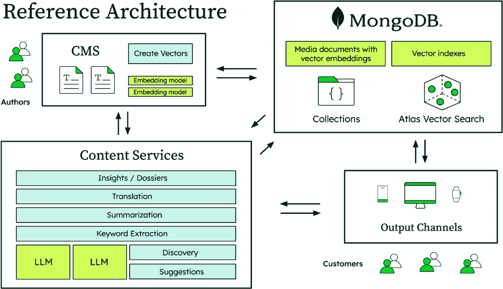
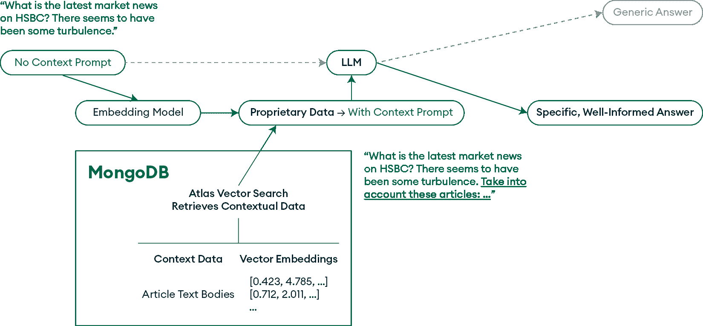
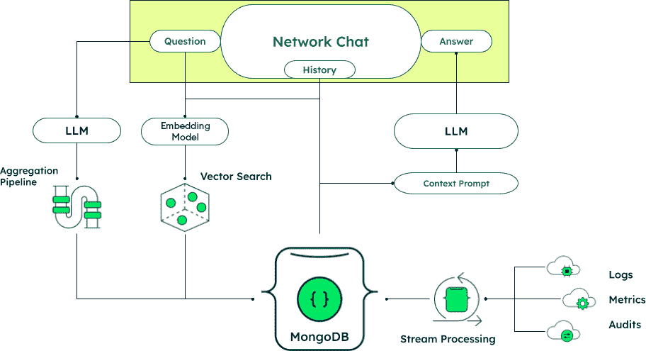
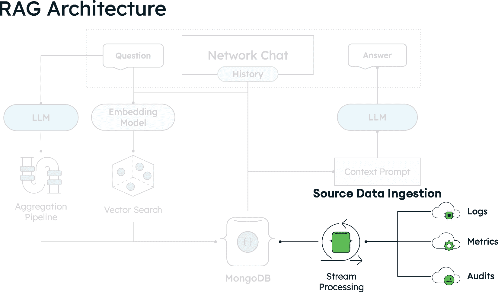
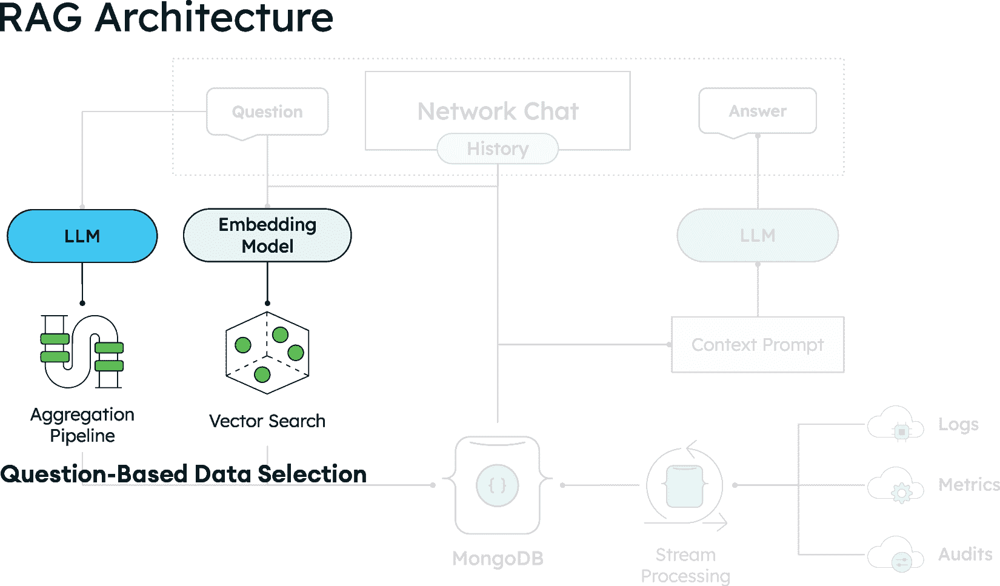
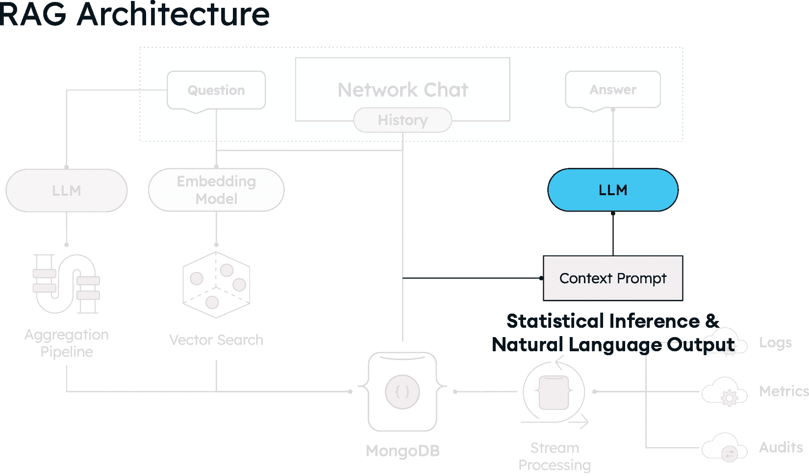
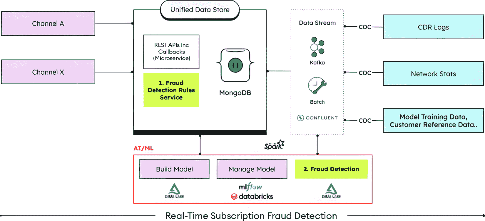

# 第八章：媒体和电信行业的 AI 驱动策略

在内容泛滥但相关性匮乏的世界里，电信和媒体行业面临着一种矛盾性的挑战。尽管全球电信支出持续攀升至数万亿美元，但媒体领导者报告称，社交推荐流量急剧下降，平台驱动的访问量大幅下降。与此同时，AI 的采用正在以惊人的速度加速，预计电信中的 AI 市场将以惊人的速度增长，从根本上改变这些行业的运营方式。

这不仅仅是一个技术周期；这是我们对连接、消费和沟通方式的根本性重塑。对于电信运营商和媒体公司来说，风险不容小觑：那些掌握 AI 驱动个性化的人正在看到数十亿美元的回报（Netflix 仅从 AI 推荐中每年产生 10 亿美元的收入[1]），而那些坚持传统模式的人则看到他们的观众和收入蒸发。

在本章中，你将了解以下内容：

+   使用行为分析和向量搜索来提供定制推荐和提升转化率的个性化内容系统架构

+   通过**搜索生成体验**（**SGE**）将信息检索转变为对话式、上下文感知的交互，以降低跳出率并提高参与度

+   自动化电信工作流程的 AI Ops 框架，实现预测性维护，并可能增加收入

+   通过模式识别和风险评估实时处理数百万事件的 AI 驱动的欺诈检测系统，通过减少损失

+   通过 AI 驱动的流程、自适应格式化和对话式界面自动化内容工作流程的策略，以减少人工工作并提高参与度

# 媒体和电信行业的发展格局

近年来，媒体行业面临着严峻的挑战，从适应数字平台和按需消费，到数字化内容的货币化和与科技巨头及新媒体新贵竞争。加上数字内容的激增，已经饱和了媒体市场，使得吸引和保持观众注意力变得更加困难。

因此，媒体组织不断被迫重新评估其策略并探索新的成功路径。一项涵盖 326 位数字领导者的全球行业调查[2]突出了他们在未来几年必须应对的几个趋势，包括以下内容：

+   **下降的推荐流量**：大约四分之三（74%）的受访者担心随着人工智能概述的实施，搜索引擎的推荐流量可能下降。在过去两年中，新闻和媒体属性的 Facebook 流量下降了三分之二（67%），而来自 X（前身为 Twitter）的流量下降了半数（50%）。平台所有者的意图是明确的：保留用户流量在其自己的生态系统中。

+   **优先考虑平台策略**：出版商正在关注 ChatGPT 和 Perplexity 等平台，同时保持对 YouTube、TikTok 和 Instagram 等视频网络的兴趣。

+   **聚焦创新**：在吸引观众方面，有很强的重点放在开发新产品上，大约四分之一（42%）的计划是针对年轻人的产品，还有四分之一到三分之一在探索音频（26%）或视频（30%）产品和服务。

人工智能通过提高内容研究、生产和分发来支持媒体组织克服这些变化。例如，人工智能可以从多篇文章中总结关键点，使研究更加高效。您还可以利用大型语言模型（LLMs）根据指定的主题起草新内容，简化生产流程。此外，人工智能能够为不同受众定制内容，例如为年轻读者或外语使用者量身定制材料。它还通过个性化内容推荐和互动来增强用户体验，这一点在 Netflix 上得到了著名的展示。

尤其是 AI 驱动的工具，如 SGE 和 AI 驱动的聊天机器人，预计将提供更快、更直观的信息访问方式，显著改变用户与内容互动的方式。SGE 指的是将 GenAI 集成到搜索引擎中，使其能够对用户查询产生对话式、综合性的响应，而不仅仅是显示链接列表。这种方法可以减少点击外部网站的需求，可能改变传统的流量模式。因此，这些创新不仅正在改变整个行业的观众行为和财务动态，而且也为出版商提供了多样化收入来源的新机会。

现在，让我们将重点转向电信行业的挑战和机遇，该行业在利润率紧张和连接服务压力不断增长的环境中运营。随着数字化转型加速，电信运营商必须不断重新定义其商业模式和服务产品，人工智能作为一股变革力量正在重塑整个行业。

由于语音、数据和互联网接入等服务在很大程度上同质化和低利润，电信公司需要区分和多样化其收入来源，以创造价值并在市场中脱颖而出。该行业在全球范围内持续经历显著增长，投资额达到数万亿美元，运营商在扩展基础设施和发展新的服务能力。

随着数字原住民以敏捷和创新的方法颠覆传统商业模式，传统公司不仅相互竞争，还与新人竞争，以提供增强的客户体验并适应不断变化的消费者需求。例如，星链的卫星互联网服务完全绕过传统的宽带基础设施，提供具有竞争力的定价，低于传统的卫星服务提供商，同时提供卓越的性能，并通过服务于传统电信公司因高基础设施部署成本而 largely ignored 的农村和偏远地区而迅速增长 [3]。

在一个越来越期望高级连接的环境中繁荣，电信运营商必须在他们的**运营支持系统**（**OSS**）和**业务支持系统**（**BSS**）中优先考虑成本效率。OSS 指的是用于管理网络基础设施的系统，例如服务提供和故障管理，而 BSS 处理面向客户的活动，如计费、订单管理和客户关系管理。通过优化这些系统，运营商可以提高客户服务标准并增强整体客户体验——这是确保市场份额和获得竞争优势的关键步骤。

为了实施这些变化，人工智能帮助电信运营商采用创新解决方案来导航数字景观。根据 **Neuralt**，“*人工智能不仅仅是一种附加技术，而是一种推动力，正在重塑电信公司如何运营、提供服务以及改善客户体验的方式*” [4]。例如，它为网络运营提供自动化流程，为网络管理提供优化机制，并快速检测可疑的数据使用模式以保护收入和防止欺诈。

印度尼维尔的调查指出，“*代理人工智能正在成为电信创新的下一个前沿，它使系统能够在最小的人类监督下做出决策和解决复杂问题。这种新的自主水平正帮助企业大幅提高运营效率，并实现自我优化网络的承诺*” [5]。

总的来说，媒体和电信行业的领先公司正在使用人工智能来优化其运营，保护其业务并推动创新。

## 内容发现和个人化

从流媒体服务到在线出版物，媒体机构预计将提供一定程度的内容个性化。观众寻求基于其兴趣的内容推荐。

利用人工智能可以显著提高推荐阅读或展示的下一篇文章的建议。最强大的内容个性化系统实时跟踪用户行为，例如搜索的内容、在发生下一次点击之前花费的时间以及用户探索的类别。这些参数允许个性化系统通过展示相关内容来提高参与度，或者作为替代方案，显示帮助用户发现不同媒体类型并检查他们消费兴趣的新内容。

为了在正确的时间将正确的内容推荐给正确的人，内容个性化系统需要维护多个信息维度，这为适当的建议奠定了基础。借助现代文档数据库，如 MongoDB 及其灵活的数据模型，所有这些信息都可以轻松管理。

此外，与处理关系表相比，基于 JSON 的内容层开发更快、更直观、更少出错。此外，这种方法将向量化内容与运营数据相结合。向量搜索功能允许创建高级内容建议系统，该系统支持语义搜索，超越了基本的关键词或属性匹配。

## 内容建议和个性化平台

通过利用用户数据、行为分析和媒体内容的多元维度向量化，现代数据平台提升了终端用户体验。媒体组织现在可以建议与个人偏好和以往互动紧密相关的内容。

高级数据平台通过整合高级用户体验功能，如图 8.1 所示，增强了内容个性化策略。这些功能包括个性化推荐、内容摘要、关键词提取和自动洞察生成，使系统更加动态和以用户为中心：

图 8.1：在 MongoDB 中使用 Atlas 向量搜索创建个性化用户体验的参考架构

此图展示了综合内容个性化平台，其中作者通过使用 Voyage AI 生成向量嵌入并通过具有 Atlas 向量搜索功能的 MongoDB 存储媒体文档的 CMS 创建内容。该系统包括由 LLM 提供的内容洞察、翻译、摘要、关键词提取、发现和建议的内容服务。所有组件通过 MongoDB 集合和向量索引集成，向多个输出渠道（移动、网页和平板）提供超个性化的内容推荐，通过 MongoDB 数据平台的先进功能创造动态体验。

## 内容建议和个性化

媒体平台可以通过引用用户数据、行为分析和媒体项目的向量化，建议与个人偏好和以往互动一致的内容。这种机制增强了用户参与度，并增加了将免费用户转化为付费订阅者的可能性。对于此解决方案，向量有时会直接嵌入到文档中。

此外，在处理向量搜索操作时，内置的可扩展性和弹性具有优势。组织可以垂直或水平扩展其 MongoDB 数据库，甚至可以选择独立于操作数据库节点扩展搜索节点，以成本效益的方式适应特定的负载场景。

## 内容摘要和重新格式化

除了建议向用户展示哪些内容之外，媒体平台还可以使用相同的用户数据和用户行为洞察来调整内容的展示方式。例如：

+   **设备特定格式**：推荐的文章可能会自动重新格式化为项目符号，供移动用户阅读，而桌面用户则看到全文。

+   **个性化摘要**：通常快速阅读的用户会收到简化的版本，而其他人则会获得详细的解释。

+   **格式适配**：基于消费模式，相同推荐内容可以以文本形式提供给某些用户，以音频形式提供给其他用户，或以视频摘要形式提供。

+   **渠道优化**：当在不同平台之间共享内容时，系统会自动创建带有关键高亮的简短版本，供社交媒体使用，同时通过其他渠道提供全面覆盖。

此方法利用与内容推荐相同的用户偏好数据和用户行为分析数据，以确定每个个体的最佳格式和长度，通过匹配人们想要阅读的内容和他们的偏好消费方式，进一步改善参与度。

### 关键词和实体提取

媒体平台可以通过高级关键词和实体提取从内容中提取关键信息，使用户能够快速且轻松地找到他们喜欢的新内容。关键词是内容在搜索引擎中索引和发现的基础，并且它们对数字内容的搜索引擎优化（SEO）性能有重大影响。借助底层 LLM，媒体平台可以自动提取更广泛且复杂的关键词，从而进一步提高用于搜索的元数据质量。

### 自动创建见解和摘要

媒体平台如在线新闻或体育服务可以通过分析其存档或外部来源中的相关内容的多篇相关内容，自动生成全面的见解和摘要。例如，新闻平台可以创建综合信息摘要，这些摘要综合了关于同一事件的几篇相关新闻故事，而体育平台可以通过结合比赛报告、球员统计数据和专家评论来生成全面的概述。

对于对特定主题或事件进行深入研究感兴趣的用户来说，此功能尤其有价值，因为它可以揭示可能难以找到的相关内容，或生成每日新闻摘要，通过以可消化的形式提供他们所需的所有内容来节省时间。这是通过使用一个或多个 LLMs 生成自然语言输出，增强来自多个来源材料的信息的可访问性来实现的。

总的来说，AI 驱动的个性化成为出版商的重要工具。通过使用 AI 提供定制内容并自动化后台流程，出版商可以更好地应对传统推荐量的下降，并与他们的受众建立更强、更直接的关系。

# 搜索生成式体验（SGEs）

随着 AI 吸引公众注意力的兴起，很明显，一个仅返回普通链接列表的基本搜索框已不再满足用户需求。SGEs 代表了媒体和内容产业在处理用户信息请求（搜索）方面的一次转型。SGEs 利用 AI 生成搜索结果，这些结果不仅仅是现有内容的链接，而是针对实际用户意图的全面、自然语言响应。这些即时、简洁的答案有助于媒体平台保持用户更长时间的参与，降低跳出率，并增加更深入内容互动的可能性。

使用现代数据平台，这些平台以内置的向量搜索能力为核心构建 SGE 解决方案（见*图 8.2*），组织可以开发出强大的**检索增强生成**（**RAG**）系统。这些系统通过提供作为提示上下文的信息来增强 LLMs，生成更准确、相关和有趣的响应。

SGE 系统的多功能性开辟了广泛的应用场景，包括智能研究工具、智能对话界面和游戏化学习体验。将这些解决方案定制到行业需求中，为创新、货币化和参与打开了新的机会。

图 8.2：创建 SGE 的参考架构

此图展示了 SGE 如何通过使用 AI 生成全面、自然语言响应来改变传统的搜索方式，而不是仅仅列出链接。架构展示了用户关于汇丰市场新闻的查询如何通过嵌入模型，如 Voyage AI，流向 MongoDB 的 Atlas Vector Search，该搜索从文章正文和向量嵌入中检索上下文数据。这些专有数据增强了 LLM 提示，使其能够生成具体、信息丰富的答案，而不是泛泛的响应，并展示了从简单的信息检索到智能、上下文感知的内容生成的转变。

## 智能对话界面

如果与烤面包机或冰箱讨论早餐计划听起来仍然像是科幻小说，那么欢迎来到未来。智能对话界面通过智能手表、可穿戴设备和汽车等设备，使日常生活中的数据访问无缝连接。这种新的互动机会创造了通过直观体验吸引用户的新方法，这些体验感觉自然舒适。

根据世界著名未来学家、影响者和商业与技术领域的思想领袖 Bernard Marr 的说法，“*2025 年将带来电信行业对生成式人工智能的进一步广泛采用，毫无疑问，最突出的用例之一将是客户体验的转型*” [6]。这包括超个性化服务和人工智能聊天机器人承担越来越复杂的客户互动。

## 游戏化学习体验

教育技术平台正在利用人工智能创造更具吸引力的学习体验，类似于 Duolingo 等流行的应用程序。这些系统使用人工智能算法持续监控学生表现并实时调整内容难度，创建个性化的学习路径，提供以下内容：

+   **自适应内容交付**：当用户犯错时调整难度并提供个性化解释，帮助他们更好地理解概念

+   **智能反馈系统**：当用户在特定主题上遇到困难时，通过人工智能提供上下文提示和解释

+   **进度优化**：利用行为数据识别为个别学习者提供最佳学习计划和内容类型

对于媒体公司来说，这代表着进入不断增长的教育内容市场的重大机遇，数字叙事和互动学习正经历着显著增长。

## 服务保证

从媒体应用回到电信基础设施，提供商需要提供符合客户期望和**服务水平协议**（**SLAs**）的高质量网络服务。服务保证的关键方面包括性能监控、**服务质量**（**QoS**）管理和预测分析，以预测潜在的服务退化或网络故障。随着电信网络的日益复杂化和客户对始终在线服务的期望不断增长，服务保证的标准已经提高，这要求公司大量投资于能够自动化这些流程的解决方案，仅仅是为了保持竞争优势。

通过几个关键能力，人工智能已经彻底改变了服务保证：

+   **预测性维护**：机器学习分析模式以预测网络故障，实现预防性维护并减少停机时间

+   **根本原因分析**：人工智能识别网络问题的根本原因，提高故障排除的有效性

+   **网络优化**：AI 评估日志数据以找到改进机会，降低运营成本并实时优化性能

这些能力共同展示了 AI 如何改变网络可靠性和运营效率。

# 网络管理的 Agentic AIOps

在服务保证系统基于 AI 的洞察力基础上，Agentic AI Ops 通过实现自主决策和行动将自动化推进了一步。虽然传统的 AI 系统提供推荐，但代理 AI 可以独立执行解决方案，无需等待人工批准。

代理 AI Ops 框架帮助**通信服务提供商**（**CSPs**）部署能够自主：

+   **执行纠正措施**：在网络拥塞期间自动重新配置路由器以进行负载管理

+   **实时决策**：确定并部署适当的响应以应对出现的网络问题

+   **直接调用 API**：与网络基础设施接口以立即实施更改

+   **管理流程**：以最小的人为干预协调复杂的运营流程

例如，当这些系统检测到网络延迟问题时，它们不仅会通知操作员，还可以自动重新分配流量负载、调整路由协议或实时扩展资源以保持最佳性能。

这些自主能力使 CSPs 能够以最小的人为干预管理复杂的流程，加速新服务的部署，并可能将年度收入提高高达 5% [7]。

## 为电信构建基于 AI 的网络系统

利用现代数据平台，电信提供商可以构建集成了语义搜索和生成式文本响应的定制网络管理应用程序，如下面的图所示。

图 8.3：使用 MongoDB 创建网络聊天机器人的参考架构

该图展示了电信提供商如何使用 MongoDB 作为核心数据平台构建 AI 驱动的网络聊天机器人。该架构集成了三个主要组件：通过聚合管道和向量搜索能力进行数据摄取；问题分析，其中用户查询被转换为嵌入以找到相关的网络数据，并使用嵌入模型和 LLM 进行上下文提示生成适当的数据库查询；以及自然语言输出生成。系统处理网络聊天交互（问题、答案、历史记录），而 MongoDB 处理数据存储和流处理，输出包括日志、指标和审计，以实现全面的网络系统管理和客户支持。

首先，网络管理员捕获日志条目和遥测事件，存储诸如 IP 地址、地理信息、请求路径、时间戳、路由器日志和传感器数据等详细信息。使用 Atlas 流处理，数据可以实时收集和丰富，提供网络活动的完整视图。

图 8.4：使用 Atlas 流处理进行数据摄取

此图说明了网络聊天机器人的 RAG 架构，展示了如何使用 Atlas 流处理摄取和丰富源数据。

图 8.5：使用 MongoDB 聚合管道和 Atlas 向量搜索进行基于问题的数据选择

此图展示了 RAG 系统如何处理网络管理员的自然语言查询，例如，“多伦多客户端的视频流问题是由什么引起的？”

LLM 首先创建聚合管道以检索结构化数据，同时嵌入模型执行语义向量搜索以找到上下文相关的信息。

一旦系统识别出相关数据，后续的 LLM 将此信息翻译成用户的自然语言解释。在此过程中，LLM 分析检索到的数据以检测模式和异常，从而精确识别根本原因候选者并支持明智的决策。例如，它可能会发现一个过载的本地 CDN 节点，以及来自较老路由器的高请求，是导致问题的原因。

图 8.6：推理和自然语言输出

此图展示了 RAG 架构的最终阶段。通过上下文提示，LLM 对所选数据进行统计推理和模式检测，将网络指标转换为自然语言解释和可操作的见解。

## AI 驱动操作的下个时代

此用例突出了代理式 AIOps 和现代数据平台如何相互补充，通过以下方式通过以下方式转变网络管理：

+   **模式灵活性**：基于文档的模型可以轻松地将日志、性能指标和用户反馈存储在单一、一致的环境中。

+   **实时性能**：通过横向扩展，您可以在任何一天中的任何时间摄取由网络日志和用户请求生成的海量数据。

+   **向量搜索集成**：通过嵌入文本数据（如日志、用户投诉或常见问题解答）并将这些向量存储在数据库中，您可以使用即时检索语义相关内容，使 LLM 轻松找到所需内容。

+   **LLM 构建聚合管道**：LLM 可以轻松生成聚合管道来检查数值数据，而第二次 LLM 的遍历则组成一个最终摘要，该摘要合并了数值和文本分析。

采用这种端到端的工作流程可以节省时间和精力，同时使组织能够实现可扩展性。它简化了诸如分析特定地区流量激增、诊断安全事件和管理高峰时段等任务。通过结合 MongoDB Atlas、LLM 和 RAG 架构等现代数据平台，电信提供商可以将网络运营转变为对话式、自动化和智能系统。

## 欺诈检测与预防

今天的电信提供商正在使用一系列技术来检测和预防欺诈，不断适应这个领域欺诈的动态性质。常规的欺诈检测活动包括跟踪异常的通话趋势和数据使用，以及防范 SIM 卡交换事件，这是一种常用于身份盗窃的方法。为了预防欺诈，策略在多个层面上得到应用，从对新客户进行严格的验证开始，到 SIM 卡交换或重大交易，都要考虑每位客户的风险概况。这些措施对于减轻欺诈的有害影响至关重要，例如财务损失、声誉损害、监管罚款以及威胁网络完整性的安全风险。

机器学习为电信公司提供了一种强大的工具，通过在诸如**通话详细记录**（**CDRs**）等数据上训练模型，来增强其欺诈检测能力。此外，这些算法可以评估每位客户的个人风险概况，根据他们特定的使用模式定制检测策略，如*图 8.7*所示。

图 8.7：由机器学习驱动的欺诈检测系统

此架构图展示了处理来自多个电信渠道（**通道 A**和**通道 X**）数据的全面欺诈检测系统，这些数据通过 MongoDB Atlas 等统一数据存储进行处理。

机器学习模型可以随着时间的推移进行适应，从新的数据和新兴的欺诈策略中学习，实现实时检测和欺诈预防措施的自动化，从而加快响应时间。

要成功处理欺诈，需要考虑众多数据维度。反应时间是防止最坏结果的关键因素，因此解决方案必须支持快速决策。通过使用适当的机器学习模型对数据进行矢量化，可以定义正常（健康）的商业行为，并识别出偏离正常的行为。除了矢量搜索之外，MongoDB 的查询 API 支持流处理，允许实时丰富和过滤数据。

**使用 MongoDB 进行大规模实时欺诈检测**

一家利用 MongoDB 进行反欺诈策略的美国电信提供商是 MongoDB 的客户之一。该公司选择 MongoDB 是因为其能够快速摄取和存储变化的数据。MongoDB Atlas 还满足了提供商对性能、可用性和安全性的关键要求。现在，反欺诈平台运行着超过 50 个不同的 AI 模型，利用超过 1200 个特征，存储 30 TB 的数据，并每天处理高达 2000 万事件。事件处理时间在 200 毫秒以下，实现了实时欺诈检测和预防。因此，欺诈，尤其是与 iPhone 相关的欺诈，之前是一个价值 10 亿美元的难题，现在已减少了超过 80%。

此示例已被匿名化以增强编辑清晰度。了解更多信息，请参阅：[`www.youtube.com/watch?v=gRw5xYAsz4U`](https://www.youtube.com/watch?v=gRw5xYAsz4U)。

# 人工智能在媒体和电信中的扩展作用

人工智能通过实现更智能、更快、更个性化的内容，同时使运营敏捷性和创新成为可能，正在重塑媒体和电信行业。从人工智能增强的内容发现到网络自动化，智能系统的集成已成为一项关键的商业需求。然而，人工智能在这些行业中的变革潜力远远超出了这些核心领域。

人工智能（AI）也通过差异定价策略、后端自动化和遗产现代化努力推动创新。这些用例进一步说明了人工智能如何提高电信和媒体提供商的运营效率并转变流程。通过利用优先考虑自主决策和持续优化的新兴技术，企业能够适应不断变化的市场。

## 差异定价

对于媒体和电信组织，AI 驱动的应用程序可以通过进行 A/B 测试和用机器学习算法分析数据，来了解客户愿意在内容或服务上花费多少。

利用这些信息，组织可以采用动态定价模型，而不是坚持标准价格表，从而增加整体收入并扩大付费客户群。

## 视频搜索和剪辑

随着**Voyage AI** [8]的新嵌入模型，该模型于 2025 年成为 MongoDB 的一部分，现在可以创建多模态嵌入，为视频提供全新的搜索体验。您可以使用自然语言描述您想观看的视频序列（例如，`“Show me Mario Götze shooting the winning goal at the FIFA world cup final in 2014”`），系统将能够找到正确的视频，包括视频内请求动作发生的位置偏移，并将剪辑返回给用户。

**全球电信领导者如何加速开发者速度**

一家领先的电信服务提供商通过采用 MongoDB Atlas 的**电信即服务**（**TaaS**）模式，对其软件开发进行了革命性的改变。这一战略性的无服务器计算转型加速了安全应用的交付，降低了成本，并使开发者能够更快地部署代码，从而提升了创新能力和客户体验。

为了编辑清晰，此示例已被匿名化。欲了解更多信息，请参阅：[`mdb.link/new-developer-speed-and-dexterity`](https://mdb.link/new-developer-speed-and-dexterity)。

如需更多信息及资源，请访问[MongoDB 媒体和娱乐页面](https://www.mongodb.com/solutions/industries/media-and-entertainment)和[MongoDB 电信页面](https://www.mongodb.com/solutions/industries/telecommunications)。

# 摘要

在本章中，我们探讨了人工智能如何通过个性化内容体验、SGE、增强的网络管理和欺诈预防，革命性地改变媒体和电信行业。这些由人工智能驱动的策略正在提高运营效率，从根本上改变这些行业与客户互动和服务交付的方式。

现代数据平台如 MongoDB 提供了灵活、可扩展的基础，以支持这些人工智能项目，使组织能够存储多种数据类型，执行向量搜索，并与 LLMs 进行自然语言处理集成。将人工智能能力与数据基础设施相结合，正帮助媒体和电信公司克服一些最大的行业挑战，从下降的推荐流量到不断缩小的利润空间，同时创造了创新的新机遇。

下一章将探讨人工智能如何改变零售行业。我们将深入探讨零售商如何利用人工智能实现个性化的购物体验、库存优化、需求预测以及无缝的多渠道集成，以满足日益竞争的市场中不断变化的消费者期望。

# 参考文献

1.  *50 个新的人工智能统计数据*：[`explodingtopics.com/blog/ai-statistics`](https://explodingtopics.com/blog/ai-statistics)

1.  *新闻业、媒体和技术趋势及预测 2025*：[`reutersinstitute.politics.ox.ac.uk/journalism-media-and-technology-trends-and-predictions-2025`](https://reutersinstitute.politics.ox.ac.uk/journalism-media-and-technology-trends-and-predictions-2025)

1.  *星链和 2180 亿美元电信行业的颠覆：对未来连接性的战略赌注*：[`www.ainvest.com/news/starlink-disruption-2-18-trillion-telecom-industry-strategic-bet-future-connectivity-2508/`](https://www.ainvest.com/news/starlink-disruption-2-18-trillion-telecom-industry-strategic-bet-future-connectivity-2508/)

1.  *电信消费者转变：一个新时代的期望*: [`www.neuralt.com/news-insights/ai-next-frontier-in-telecom-what-to-expect-in-2025`](https://www.neuralt.com/news-insights/ai-next-frontier-in-telecom-what-to-expect-in-2025)

1.  *电信业的未来：MWC 2025 的 7 大关键趋势和启示*: [`www.capgemini.com/in-en/insights/expert-perspectives/whats-next-for-telecoms-7-key-trends-and-takeaways-from-mwc-2025/`](https://www.capgemini.com/in-en/insights/expert-perspectives/whats-next-for-telecoms-7-key-trends-and-takeaways-from-mwc-2025/)

1.  *2025 年 9 大关键电信趋势：行业领导者需要了解的信息*: [`bernardmarr.com/9-critical-telecom-trends-in-2025-what-industry-leaders-need-to-know/`](https://bernardmarr.com/9-critical-telecom-trends-in-2025-what-industry-leaders-need-to-know/)

1.  *诺基亚：实现网络自主性的下一个层次（研究报告）*: [`onestore.nokia.com/asset/214230?_gl=1*qmnhb0*_ga*MTU4NTI3MTAxMy4xNzM5ODI4OTY3*_ga_D6GE5QF247*MTczOTgyODk2Ni4xLjAuMTczOTgyODk2OS4wLjAuMA`](https://onestore.nokia.com/asset/214230?_gl=1*qmnhb0*_ga*MTU4NTI3MTAxMy4xNzM5ODI4OTY3*_ga_D6GE5QF247*MTczOTgyODk2Ni4xLjAuMTczOTgyODk2OS4wLjAuMA)

1.  Voyage AI: [`www.voyageai.com`](https://www.voyageai.com)
