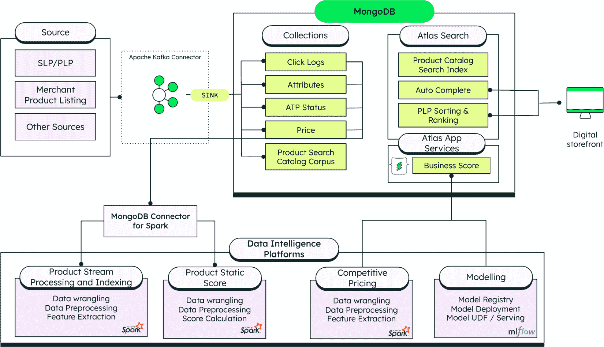
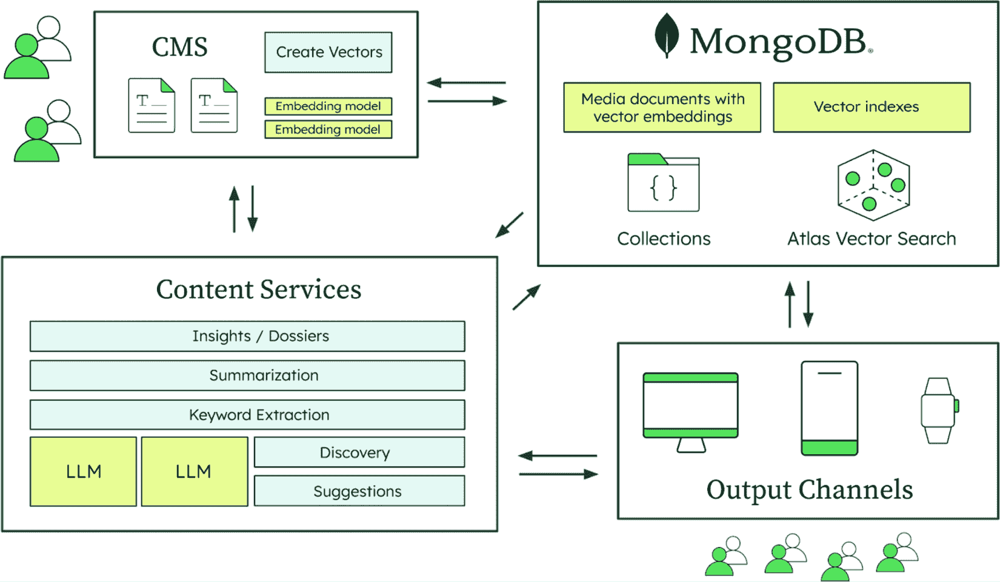
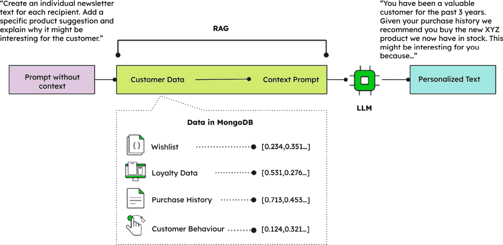
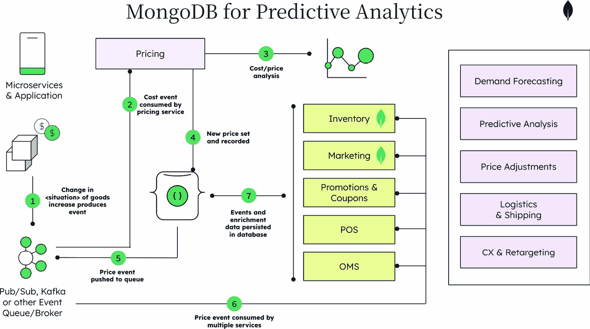
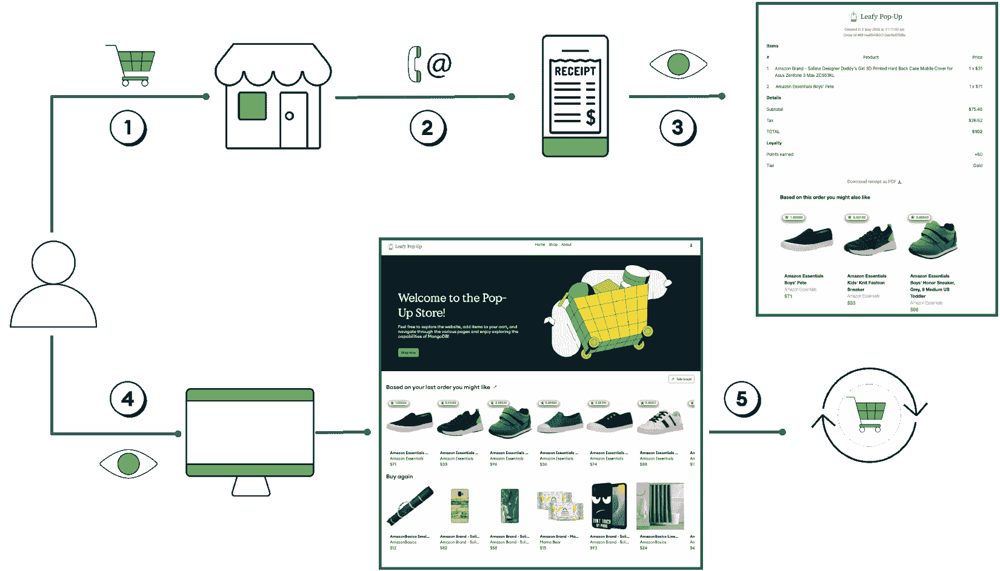
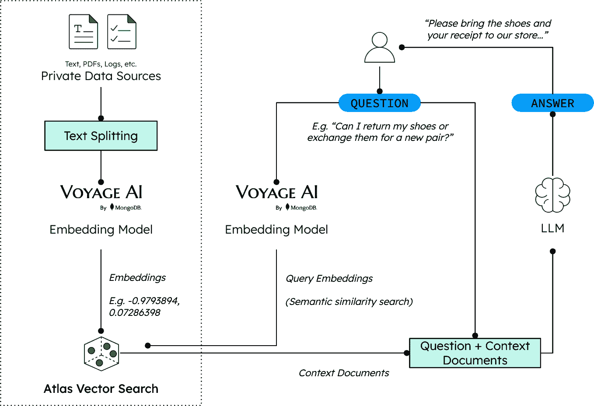

# 第十章：利用人工智能转型零售业

零售业已经发生了变化。它不再仅仅是应对客户的需求。领先的零售商现在明白，为了获胜，他们必须预测客户的每一个需求，并个性化每一次互动。人工智能是实现这一可能性的关键技术。为了创建这种预测和高度个性化的未来，零售商现在就需要将人工智能整合到他们的解决方案中。

一直以来，零售业依靠其理解和回应客户需求的能力而繁荣。但在今天这个互联、以体验驱动的世界中，这已经不再足够。现代客户的旅程是碎片化、快速移动且极具个人特色的。零售商现在必须做的不仅仅是反应，他们必须预测、适应，并在每个接触点上以智慧和精确的方式参与。

人工智能不仅仅是这个领域的一个新兴趋势；它是推动零售业下一个时代的引擎。从产品发现到履行，从内容创建到客户支持，人工智能正在改变零售商的运营、创新和竞争方式。然而，正如许多 IT 决策者所知，以有意义、可扩展的方式利用人工智能往往说起来容易做起来难。成功不仅仅需要插入一个模型；它需要以数据为先的方法、集成平台、实时响应能力，以及能够随着业务发展而演变的架构。

在本章中，你将了解以下内容：

+   由向量搜索驱动的语义搜索正在通过实时、意图驱动的体验改变产品发现和客户互动

+   个性化营销和内容生成利用生成式人工智能和**检索增强生成**（**RAG**）在所有渠道上创建动态、可扩展的客户体验

+   需求预测和预测分析利用人工智能从被动转向主动规划，优化库存和供应链管理

+   通过智能数据捕获和实时个性化，数字化店内互动弥合了线上线下零售之间的差距

+   对话式和代理式聊天机器人通过自主、自适应和情境感知的交互革命性地改变了客户服务

+   零售业各公司的通过智能、数据驱动的 AI 实施取得了可衡量的业务成果

+   MongoDB 的统一数据库提供了支持人工智能驱动的零售工作负载所需的灵活和可扩展的基础设施

+   代理式人工智能正在成为下一个前沿领域，它使主动、自主的系统能够持续优化零售运营

+   现代零售商正在将人工智能应用扩展到损失预防、商品执行、员工编排和可持续性优化

# 由向量搜索驱动的语义搜索

顾客的旅程通常从查看展示的商品开始，这可以快速地在实体店和网店之间切换。在当今竞争激烈的在线零售环境中，传统的搜索栏已经从仅仅是一个功能性工具转变为一个复杂的引擎，它能够捕捉顾客的意图并将其转化为收入。成功的零售商现在正在利用他们在顾客旅程中拥有的实时运营数据，并通过 AI 来丰富这些数据，以创建智能的、**搜索生成体验**（**SGE**）。这种演变，由向量搜索等创新推动，使他们能够理解顾客的意图，呈现高度相关的结果，并实现主动、个性化的互动，从而提升销售额。

随着在线购物竞争加剧和顾客期望的提高，传统的搜索功能已不再足够。本节探讨了搜索，曾经只是一个功能性工具，如何成为顾客参与和收入的有力驱动因素。我们将深入了解现代零售商如何通过整合实时分析、AI 和运营数据来演变他们的搜索基础设施，以提供智能、自适应的搜索体验。这些进步，包括语义向量搜索，使零售商能够呈现更多相关的结果，理解顾客的意图，并创建主动、意图感知的互动。

## 转变零售搜索

随着顾客在这个日益个性化的零售环境中探索，他们的旅程通常从关键的搜索互动开始。虽然零售商通过利用大量客户数据来提供差异化的购物体验，但这种个性化的有效性取决于搜索结果能够多么精确和迅速地定制。传统上，实现这一点需要复杂的数据仓库和 AI 模型来细分客户。然而，零售搜索的未来在于更加动态和实时的个性化，以真正引导顾客通过他们独特的购物之旅。

然而，搜索的世界不仅仅局限于找到顾客感兴趣的那一个商品。零售商有机会以某种方式对结果进行排名，从而为顾客提供多个有吸引力的选择。传统上，如何以个性化的方式对搜索结果进行排名的决策是通过从各种运营系统中收集客户数据，将其全部移入数据仓库，然后通过各种机器学习算法来进行的。通常，这会在批量模式下运行（每 24 小时、48 小时，甚至 72 小时或几天），下一次顾客登录时，他们会获得个性化的体验。然而，这并没有实时捕捉到顾客的真实需求。

现代零售商现在正在通过实时数据和人工智能驱动的分析增强他们的搜索结果。通过整合购物车数据、客户点击流和趋势购买活动数据，零售商可以提供高度相关且与客户意图完美对齐的产品推荐。这导致转换率提高、更好的交叉销售机会，以及能够利用正在发展的新兴趋势，而不是几天后。

此外，在通用人工智能时代，零售商正开始从基于关键词的搜索转向模仿自然对话的基于提示的交互。现在，客户可以用普通语言表达他们的需求，例如，“我需要给我那位热爱远足的父亲买一份礼物”，并立即收到定制的结果。这种方法通过解释意图而不是仅仅匹配术语来解锁更深层次的个性化。它还允许零售商更直观地展示相关产品，即使客户不确定要搜索什么。基于提示的搜索在提供更智能、更类似人类的数字购物体验方面迈出了重要一步。

视觉搜索代表了另一种变革性能力，允许客户上传他们想要找到的物品的照片或发现类似的产品。客户可以拍下朋友的外套或他们在杂志上看到的一件家具的照片，并立即在零售商的目录中找到匹配或类似的项目。这项技术使用计算机视觉和人工智能来分析视觉特征，如颜色、图案、纹理和风格，然后将它们与产品图像进行匹配。视觉搜索消除了用文字描述复杂视觉属性带来的挑战，并开辟了传统基于文本的搜索无法提供的发现机会。

除了个性化之外，零售商还战略性地影响搜索排名以满足商业目标。搜索结果越来越受到库存水平、利润率和促销活动等因素的影响。零售商可能会提高库存过剩的产品，以清理仓库空间，或者优先考虑利润更高的商品以提高盈利能力。赞助产品定位允许品牌为在相关搜索中获得突出位置付费，从而创造额外的收入来源。这种商业智能排名确保搜索既满足客户需求，又满足商业目标，在相关性、库存水平和季节性库存管理等运营现实之间取得平衡。

## 构建统一的客户视图

真正理解客户的第一步是建立一个客户操作数据存储，该存储整合了组织内部的数据：支持、电子商务交易、店内互动、愿望清单、评论等。灵活的基于文档的数据库架构使得将不同类型和格式的数据汇集到一个文档中，以便在一个地方清晰地了解客户。客户记录存储正是如此，它是一个包含所有客户历史的单个文档，而不是多个表格，数据分散在不同的行中。随着零售商收集更多关于客户的数据点，他们可以轻松地添加字段，而无需因模式更改而停机。数据以它需要被消费的方式存储。

然后是实时运行分析的能力，而不是在另一个独立的系统中事后进行。例如，MongoDB 的架构允许工作负载隔离，这意味着操作工作负载（客户在电子商务网站上的操作）和分析或 AI 工作负载（计算下一个最佳出价应该是多少）可以同时运行，而不会相互干扰。零售商可以使用 MongoDB 聚合框架进行高级分析查询或实时触发 AI 模型以给出可以嵌入到搜索排名中的答案。

全能平台的益处巨大，因为无需更新您的搜索索引以包含您的 AI 增强功能，MongoDB 内置了搜索功能。整个流程可以在一个数据平台上自动完成；当您的数据通过 AI 结果得到丰富时，搜索索引将同步更新以匹配。

如*第二章*“什么使通用人工智能、RAG 和代理人工智能与众不同”中所述，向量搜索通过在向量空间中找到与用户查询邻近的内容来实现语义理解。在零售应用中，这意味着当客户搜索“舒适的跑步鞋”时，系统会根据相似度评分返回产品，这些评分表明它们与查询意图的匹配程度有多接近，可能包括运动鞋、性能鞋或运动鞋，即使产品描述中没有使用这些确切术语。

图 10.1：MongoDB Atlas 的统一客户视图架构，包含 AI 增强搜索和分析

此架构图显示了 MongoDB Atlas 如何通过将多个数据源集成到一个平台上来创建统一的客户视图。该系统结合了传统的数据库操作和向量搜索功能，实现了实时分析、语义搜索和个性化推荐。关键组件包括来自各种来源的数据摄取、MongoDB 灵活的文档存储、Atlas 向量搜索进行语义匹配以及用于产品智能和竞争分析的下游分析。

零售中的向量搜索技术提供了显著的经济效益。行业研究显示，与个性化搜索结果互动的客户，其转化率比未互动的客户高出 2-3 倍[1]。

## 从被动反应到主动

将*第二章*中提到的代理式 AI 原则应用于零售搜索，这些系统持续监控客户行为，评估变化趋势，并自主优化排名策略或启动促销工作流程，无需人工干预。这解决了大多数当前搜索实现方式的反应性，即使实时模型也等待明确输入而不是自主驱动计划。通过填补这一差距，代理式 AI 使零售商能够大规模提供适应性、情境感知的体验。

对于最终客户来说，这导致了一个更加直观和满意的购物体验。代理式 AI 不仅呈现相关产品，还确保搜索结果随着客户的实时旅程而演变，不仅建议类似产品，还根据推断的意图编排捆绑包、重新订购提醒或提供优惠。这使体验从被动推荐转变为智能辅助，推动客户满意度、忠诚度和最终转化率的提升。

**全球食品配送平台如何应对库存挑战**

一家领先的全球食品配送平台通过 AI 转变实时客户互动的例子。面对易腐库存经常缺货的挑战，这家公司开发了一个提供实时个性化产品替代方案的物品替换工具。该解决方案由先进的 AI 模型和实时库存数据驱动，确保客户总能找到合适的选项，减少购物车放弃率并保留收入。建立在现代数据基础设施之上，该工具已在中东进行试点，预计将增加月度总商品价值。通过加速 AI 创新，这家食品配送平台不仅提高了客户满意度，也为可扩展的智能增长做好了未来准备。

为了编辑清晰，此示例已被匿名化。了解更多信息，请参阅：[`mdb.link/food-delivery-platform-ai-innovation`](https://mdb.link/food-delivery-platform-ai-innovation)。

# 个性化营销和内容生成

今天的零售环境由多样化的数字景观定义，其中社交媒体、电子邮件、网站和移动应用作为至关重要的消费者接触点。然而，真正的挑战在于定制个性化的内容，使其在每个不同的渠道中都能产生独特的共鸣。在社交媒体上吸引消费者的内容可能与在电子邮件中吸引他们的注意力或在移动应用中促使他们采取行动的内容存在显著差异。随着客户对相关和动态体验的期望不断增长，通用的营销活动已不再有效。

零售商需要可扩展的解决方案来创造深入个性化的互动，从而推动参与度、培养忠诚度并将兴趣转化为实际成果。本节探讨了如何通过先进的技术，特别是生成式和代理式 AI，赋予零售商实现这种复杂的渠道特定个性化水平的能力。AI 通过生成多样化的内容变体在创建这些个性化功能中扮演关键角色，从电子邮件的个性化主题行到移动应用的动态布局。对于测试，AI 驱动的 A/B 测试和多变量分析可以快速评估不同个性化策略在各个渠道中的有效性，确定最佳方法。最后，在部署时，AI 系统可以自动触发并通过电子邮件、短信和在应用通知中交付个性化内容，确保基于实时客户行为和偏好的及时和相关性沟通。

我们将探讨**大型语言模型**（**LLMs**）、向量数据库和实时数据处理如何以前所未有的规模和速度实现个性化内容创作。通过利用现代数据库（例如，MongoDB）和 RAG 等工具，零售商可以将客户偏好、行为和产品可用性直接集成到营销工作流程中。此外，我们介绍了**代理式 AI**，它赋予营销系统实时自我优化营销活动的功能，响应客户信号并持续适应以改善结果。这些创新共同重新定义了营销内容的生产、交付和优化方式。

## 利用 GenAI 满足现代零售的内容需求

现在，通用人工智能（GenAI）可以创建大量内容，包括个性化的广告文案、多语言的产品描述以及多样化的视觉资产，如生活方式摄影和图形。这种集成到零售工作流程中简化了整个内容生成过程，极大地减少了传统上对文案写作、编辑和视觉制作的劳动力需求。例如，通用人工智能（GenAI）可以自动调整产品文献以反映不同地区的特定品牌语气，并为不同受众生成相关的产品图片。这加快了新产品和活动的上市时间，使零售商能够跟上快速变化的消费者购买模式和产品目录。通过自动化内容创建，通用人工智能（GenAI）释放了人力资源，使其能够专注于战略举措，提高整体营销效率和效果。

在零售业中，广告和营销材料对于吸引顾客兴趣并推动购买至关重要。社交媒体的出现为接触顾客创造了更多的接触点：Instagram、Facebook、电子邮件推广、新闻通讯以及网站上的促销横幅。这既为零售商提供了机会，也带来了关于内容生成量的挑战，这些问题可以通过采用通用人工智能（GenAI）来有效解决。

顾客购买模式、不断更新的产品目录和库存可用性是零售运营的关键组成部分。此外，还有确保产品文献以正确的语气反映品牌在多种语言中的形象的任务。产品图片需要与当地受众相关。传统上，这需要大量的文案写作和编辑工作、不同型号的摄影以及视觉和图形的生成。

零售商还必须实时了解活动的效果，以便他们可以迅速调整营销支出和策略，以反映哪些措施有效。在一个营销和品牌推广是关键业务活动的行业中，零售商需要尽可能多的客户洞察，以便他们能够在正确的时间向客户传达正确的信息。

公司将利用消费者接触点的显著增加来个性化并触及使用数字渠道发现、考虑和购买产品的不断增长的消费者群体。65%的消费者在网上研究产品，30%在线购买。这些数字在过去三到四年间翻了一番。这为品牌提供了针对在线消费者进行个性化内容营销的巨大需求，这是由通用人工智能（GenAI）较低的内容创建成本所提供的机遇[2]。

## 利用通用人工智能（GenAI）和大型语言模型（LLMs）加速个性化内容

通用人工智能（GenAI）是整个零售行业创新的催化剂，从时尚行业的个性化到后台运营的简化。通过与大型语言模型（LLMs）的 RAG，时尚零售商现在可以在几秒钟内创建个性化的营销材料、新闻通讯、社交媒体帖子以及针对每位客户的电子邮件接触。这还包括利用现有客户数据生成独特的视觉、图形，甚至逼真的图像。这种自动化显著减少了之前创建活动所需的手动工作，并大幅缩短了新系列和促销的市场投放时间。

在后台运营中，通用人工智能（GenAI）可以快速轻松地分析活动效果，提供可操作见解，推动关于库存管理、供应链优化和客户关系管理的智能战略决策。这种将复杂数据迅速综合为明确建议的能力，使时尚品牌能够做出更明智的选择，从而提高效率和盈利能力。

创建针对客户和品牌的个性化内容的秘诀是利用零售商内部拥有的大量数据，为大型语言模型（LLM）提供上下文。一个令人信服的数据驱动个性化行动的例子来自美容行业。

**用 MongoDB Atlas 推动美容零售业的创新**

一家领先的全球美容零售商通过内部技术加速器加速了其数字化转型，构建了支持复杂实时分析的高性能应用程序，以指导更好的商业决策。面对之前 NoSQL 数据库在延迟和代码复杂性方面的限制，该团队迁移到了谷歌云上的 MongoDB Atlas。这一转变显著提高了后端性能和开发者敏捷性，将延迟从秒级降低到毫秒级，并促进了更快的技术创新。简化的架构使产品团队能够快速迭代和高效扩展，与其使命相符，即通过技术提供个性化且包容性的美容体验。

这个例子已被匿名化以提高编辑清晰度。了解更多信息，请参阅：[`mdb.link/leader-in-beauty-digital-transformation`](https://mdb.link/leader-in-beauty-digital-transformation)。

## 利用现代数据库进行可扩展、人工智能驱动的营销

在大规模实现个性化内容创建需要强大的数据基础设施，能够无缝集成客户数据与人工智能模型。在 MongoDB 中，Apache Spark 连接器允许对大型语言模型（LLMs）进行模型训练，因此如“为每位客户创建一个个性化的新闻通讯，建议一个基于当前优惠和其以往购买的商品”这样的提示可以使用数据、图像和语气或语言参考来创建接触。

通过使用如 MongoDB 这样的集成平台方法，当新产品或视觉元素被添加到产品目录中时，变更流可以触发新数据的矢量化，使整个过程无缝进行。使用内部数据进行模型训练为零售商提供了有效触及其受众的无价资源。

图 10.2：AI 驱动的个性化架构

前面的图示显示了参考架构，突出了 MongoDB 如何被利用来实现 AI 驱动的个性化。通过利用用户数据和媒体内容的多维矢量化，MongoDB Atlas 可以应用于多个 AI 用例。这允许利用媒体渠道更有效地提升最终用户体验。

通过这样做，零售商可以推荐与个人偏好和以往互动更紧密一致的内容。这不仅增强了用户参与度，还增加了将免费用户转化为付费订阅者的可能性。

图 10.3：基于 RAG 的 MongoDB 客户数据个性化新闻通讯生成

此工作流程展示了客户数据（愿望清单、忠诚度数据、购买历史和客户行为）如何被摄入 MongoDB。这些原始数据通过嵌入模型进行转换和矢量化。每个向量代表客户属性和交互的数值表示，捕捉他们的偏好、以往购买和浏览行为。这些向量存储在 MongoDB 内部的向量数据库中，从而实现高效的相似性搜索。当收到用户对新闻内容提示的请求时（例如，`"为对户外装备感兴趣的顾客生成个性化的新闻通讯"`），RAG 系统立即启动。首先，将用户的提示矢量化。然后，使用此提示向量查询 MongoDB 向量数据库以检索最相关的客户数据向量。例如，如果提示是关于户外装备的，系统将检索与户外产品购买相关的客户档案及其历史数据、露营设备的愿望清单或徒步靴的浏览行为。这些检索到的客户数据，针对性强且与个人上下文相关，构成了*上下文*的基础。

然后将提取的客户上下文以及初始用户提示输入到大型语言模型（LLM）中。LLM 利用这个丰富、个性化的上下文生成高度相关和定制的时事通讯内容。例如，如果检索到的客户数据表明过去购买过特定品牌的徒步靴，LLM 可以生成一份突出该品牌新到货品、与靴子相配的配件或类似户外装备即将到来的销售的时事通讯。这个过程使零售商能够大规模地创建定制化的营销沟通，超越通用活动，为每位客户提供真正个性化的体验。LLM 理解和综合上下文信息的能力确保了生成的内容不仅个性化，而且连贯且引人入胜，最终推动更高的客户参与度和转化率。

## 代理人工智能如何革命性地改变零售业的适应性营销

代理人工智能通过引入能够不仅生成个性化内容，还能根据客户参与信号实时监控、评估和调整营销活动的自主系统，将这一过程进一步推进。这些智能代理可以评估哪些信息与不同的受众群体产生共鸣，并动态调整语气、格式、渠道和时间，以最大化性能而无需人工干预。

内容营销的最大挑战是内容部署和响应之间的滞后。通常，营销团队必须等待分析，解读数据，然后手动调整他们的活动。代理人工智能消除了这个循环，实时优化接触，完全消除了这种延迟。

对于最终消费者来说，这意味着内容感觉真正相关和及时；在需要时提供优惠，以引起共鸣的语气，并通过他们偏好的沟通渠道。对于零售商来说，这意味着提高了营销支出的回报率，提高了转化率，并减少了依赖于可能随时间失去影响力的静态活动的依赖。通过代理人工智能，个性化营销从基于历史洞察的静态过程转变为一个动态系统，该系统能够智能地适应消费者的即时行为。

# 需求预测和预测分析

准确的需求预测是区分运营效率和成本高昂的错误的关键因素。随着消费者期望的提高和供应链的日益复杂化，精确预测需求的能力可以显著影响零售商的盈利能力、库存管理和客户满意度。本节探讨了人工智能驱动的需求预测和预测分析如何帮助零售商从被动转向主动规划。在大量历史数据和实时输入的支持下，企业可以生成预测，从而指导更明智的采购、补充和促销决策。

我们将探讨从传统机器学习模型到尖端技术如 GenAI 和代理 AI 的演变。本节将检查现代预测方法如何整合上下文信号，如季节性、经济变化和行为模式，以提高准确性。您将了解 RAG 如何增强数据的相关性，以及代理 AI 如何通过实时自动化调整和行动更进一步。这些创新共同使零售商能够高效地满足需求，同时最小化浪费并最大化客户满意度。

## 驱动 AI 的需求预测，以实现更智能的库存和供应链管理

零售商通常通过构建自己的应用程序或购买专门的预测产品来预测需求。虽然自建系统可能有效，但它们也带来了一些挑战：

+   **显著的基础设施需求**：自建系统需要大量基础设施来存储和处理数据，以及进行**机器学习操作**（**MLOps**）。这意味着需要大量的硬件、软件和网络资源。

+   **专门的技术专长**：这些系统的发展、管理和维护需要专业的技术知识。在寻找和留住熟练的专业人员方面，这可能是一个挑战。

+   **持续的关注和维护**：这些系统需要持续的关注以确保最佳性能并为业务提供价值。这导致了对监控、故障排除、更新和一般维护的持续需求，这可能需要大量的资源和时间。

随后，特征工程用于提取季节性、促销、影响和一般经济指标。可以整合 RAG 模型来提高需求预测的准确性并减少幻觉的可能性。可以从历史数据中利用相同的数据集来训练和微调模型，以提高准确性。

这些努力带来了以下商业效益：

+   需求预测的精确度

+   优化的产品/供应计划

+   库存管理的准确性

+   提高客户满意度

## GenAI 如何重塑零售业的预测分析

传统 AI 通过整合来自不同来源的数据，如销售交易、社交媒体和天气模式，在零售业中用于需求预测和预测分析，从而实现高度准确和及时的预测。

GenAI，与传统的机器学习不同，可以创建新颖的数据，例如逼真的图像、文本和音频，而不仅仅是分析现有数据以进行预测。这种能力使得内容创作、用于训练的合成数据生成以及个性化体验等应用成为可能，超越了传统机器学习的分析和预测限制。

生成式人工智能可以通过快速生成新颖的设计迭代、在各种条件下模拟性能以及针对特定标准进行优化，显著提升产品设计和发展。这加速了原型设计阶段，减少了昂贵物理样机的需求，并允许探索更广泛的创意解决方案，最终导致更多创新且市场准备的产品。

图 10.4：一个价格变化场景的插图，其中燃料成本上升导致运输成本上升，进而导致定价上升

让我们分解图像中提到的步骤：

+   [1] 这会产生关于成本增加的事件，并将它们放入消息流中，事件队列使它们可供所有微服务监听。

+   [2–4] 定价微服务消费事件，将其与现有数据进行对比分析，并将新的定价信息传递到消息流中。

+   [5–6] 数据库将这些消息推送到事件队列，使得所有监听消息的消费方都能访问到。受定价变化直接影响的服务，例如管理库存、营销、促销、优惠券、**销售点**（**POS**）以及电子商务提供商的**订单管理系统**（**OMS**），会消费价格变化事件并相应地更新各自的数据库。

+   [7] 集中式数据库聚合并持久化事件，通过来自其他来源的数据（包括历史数据）丰富事件流，并为多个事件流提供一个中央存储库。

## 在零售业中，通过代理人工智能转型预测分析

在这一演变过程中，使用代理人工智能是一个强大的下一步，它不仅超越了静态预测，还能在实时中主动监控、适应并采取行动。代理人工智能引入了自主代理，它们会持续评估预测准确性、市场变化和供应链中断，然后无需人工提示即可调整定价、补充订单和促销策略。这解决的是传统系统中洞察与执行之间的滞后问题，在传统系统中，预测被生成但通常需要手动执行，这导致了延迟并降低了其有效性。

通过自动化响应循环，代理人工智能显著缩小了这一差距。对于最终客户来说，这意味着更好的购物体验，产品更有可能处于库存中，定价更加动态且能及时响应实际需求，促销活动的时间安排和目标也更加精准。对于零售商来说，这意味着减少销售损失、减少浪费，以及一个真正能够响应现实世界动态的供应链。代理人工智能将需求预测从决策支持工具转变为智能运营引擎。

与通常基于静态模型和预定义规则的预测分析系统不同，代理人工智能通过动态适应并从持续的交互和更广泛的实时信号中学习而表现出色。这允许进行更细致和准确的预测。

考虑一个零售场景：一位客户在网上浏览新的服装系列。一个传统的系统可能会根据过去的购买或一般流行度推荐类似的项目。然而，一个代理人工智能系统不仅会考虑历史数据，还会积极观察客户在网站上的当前行为——他们在特定产品图片上停留了多久，他们添加到购物车后又移除的项目，他们的鼠标移动，甚至他们的滚动速度。如果客户反复查看特定颜色或面料类型的商品，代理人工智能可以立即调整其推荐，优先考虑新到货或完美匹配该偏好的配件。它甚至可以检测到犹豫，并针对他们正在考虑的特定商品提供针对性的折扣，这一切都在实时进行。这种动态、响应式的做法远远超出了静态模型所能达到的。 

零售业中的代理人工智能系统可以监听各种信号，包括以下内容：

+   **行为信号**：点击流数据、页面上的时间、滚动深度、搜索查询、添加到/从购物车中移除的项目、产品查看以及与促销活动的互动

+   **上下文信号**：一天中的时间、一周中的某一天、位置（如果允许）、设备类型以及与品牌的先前互动

+   **外部信号**：天气模式、当地事件、社交媒体趋势、新闻标题和竞争对手的促销活动（如果数据可访问且符合道德规范）

+   **隐含信号**：浏览时的犹豫、重复查看特定产品属性以及浏览模式的变化

通过持续分析这些多方面的信号，代理人工智能可以构建更全面和实时的客户意图理解，从而实现更有效的预测分析和个性化体验。

# 用智能数字化店内互动

随着数字化转型在零售业加速，一个具有巨大潜力的领域是店内体验。虽然在线渠道长期以来一直在捕获客户信号以实现个性化互动，但实体零售仍然分散，客户行为往往未被记录或隔离。这在大渠道客户旅程中造成了关键差距，尤其是当消费者越来越期望在店内获得与在线相同的个性化、实时体验时。

通用人工智能（GenAI）正在重塑零售商在数字环境中解读客户意图的方式，将基本的搜索和细分转化为对话式推荐和实时个性化。当这些技术与数字化的店内互动，如数字收据相结合时，可以将这种智能带入实体零售。通过将传统上模拟的事件，如 POS 交易，转变为结构化、可分析的数据，零售商可以全面了解客户，个性化推荐，并通过有意义的、数据驱动的互动推动忠诚度。

例如，贝恩公司进行的一项研究发现，“*消费品公司领导者们在数字意图和资源分配方面优于落后者，并且拥有代表过去五年约 2 倍增长的技术投资预算，这代表着约 30%更高的数字变革和转型预算（按收入百分比计算）*” [2]。

## 从纸张到洞察：数字收据作为数据催化剂

传统的收据，曾经是一种静态且可丢弃的物品，正成为现代零售中最有价值的资产之一。当数字化后，收据提供了一种结构化、高保真的店内交易记录，捕捉到诸如购买的商品、定价、折扣、支付方式、位置和客户标识等详细信息。与传统的基于批次的忠诚度系统不同，后者需要花费大量时间才能从交易中提取出情报，而数字收据则提供了对客户偏好和意图的即时、细粒度的洞察。

例如，当客户在店内购买运动鞋和补水包时，数字收据会立即将这一背景信息输入到统一的客户数据平台。通用人工智能（GenAI）可以利用这一输入来通过电子邮件、应用程序或甚至数字标牌推荐互补商品，如性能型袜子或跑步应用程序订阅，下次他们访问时。

图 10.5：数字收据客户旅程：从购买到个性化推荐。

此工作流程图展示了数字收据如何通过五个关键步骤来改变客户体验：

1.  客户在店内进行购买。

1.  他们通过电子邮件或短信接收数字收据。

1.  他们通过移动应用程序验证购买。

1.  客户访问购买历史记录并接收由人工智能生成的个性化产品推荐。

1.  他们可以直接通过应用程序重新购买商品。

该流程展示了数字收据如何作为数据催化剂，为创建无缝的全渠道零售体验服务。

适用于存储这些类型动态、多格式数据记录的灵活文档数据库，如 MongoDB，是理想的。具有模式灵活性和对复杂、嵌套文档的原生支持，零售商可以随着时间的推移演变收据结构，整合新的元数据字段，并即时查询洞察，无需停机或重构遗留表。

**如何通过数字化店内收据来推动个性化并降低成本**

一家主要欧洲超市连锁企业是公司向店内数字化演变的一个例子。该零售商使用 MongoDB Atlas 在其移动应用中数字化店内收据，为顾客提供实时和历史购买可见性。这些数据现在为个性化推荐和促销提供动力。统一的数据方法改善了客户体验，提高了开发效率，并促进了更快的技术创新。因此，这家零售商实现了 25%的年度成本节约。这为更高级的、基于 AI 的互动奠定了基础，例如预测库存管理、基于实时行为的个性化营销活动以及智能客户服务聊天机器人。

为了编辑清晰，此示例已被匿名化。了解更多信息，请参阅：[`mdb.link/innovation-largest-netherlands-supermarket`](https://mdb.link/innovation-largest-netherlands-supermarket)。

## 构建实时全渠道客户档案

数字化收据不仅仅是数字化购买；它们将线下行为与在线身份连接起来。通过将每个店内交易与一个统一的客户 ID 相链接，零售商可以构建一个全面的跨所有接触点的行为档案：客户在网上浏览了什么，他们在店内尝试了什么，他们退回了什么，哪些折扣影响了他们的选择，等等。

使用 MongoDB 的零售商可以将来自店内系统、移动应用、网络门户、忠诚度计划和客户服务渠道的实时数据合并到一个单一的操作数据层中。这使得即时个性化逻辑成为可能：如果客户最近在店内购买了冬季装备，他们下次打开应用或收到跟进电子邮件时，可以收到关于配件或基于当地天气的促销活动的推荐。

这种方法将个性化从反应性的、渠道特定的活动转变为主动的、实时的参与策略，无论互动起源于何处，都能响应客户不断变化的环境和偏好。

## 销售点的个性化

数字化店内互动也为店内实时个性化打开了大门。例如，一位回头客进入商店，店员使用移动 POS 或客户洞察应用，可以查看最近的购买记录、忠诚度等级以及基于他们上次访问的相关产品建议。例如，如果客户购买了咖啡豆和磨豆机，店员可以推荐清洁套件或同一品牌的优质混合咖啡。

这些建议越来越多地由在客户旅程数据上训练的 GenAI 系统提供支持。关键推动力是基础设施：MongoDB 支持操作和分析工作负载并行运行的能力，使得 AI 模型能够无延迟或重复地访问最新的交易数据。无论是构建用于产品推荐的定制向量嵌入，还是生成包含精选优惠的智能收据，MongoDB 都提供了实现大规模个性化零售所需的数据灵活性和性能。

## 智能代理 AI：从洞察到智能行动

虽然 GenAI 使响应式、情境化的个性化成为可能，但下一步是智能代理 AI，这些系统能够不仅解释客户行为，还能自主采取行动。而不是等待输入，智能系统会观察模式，预测客户需求，并在多个渠道上编排体验以满足业务目标，如保留、升级销售或转化。

在数字化店内互动的背景下，智能代理 AI 可能会自动识别一位客户经常购买婴儿护理产品，并启动智能订阅优惠。它可能会注意到一位之前忠诚的客户店内访问量下降，并部署个性化重新激活活动。这些行动需要不仅仅是静态规则；它们需要实时编排工作流程、数据和 AI 驱动的推理。

通过在支持智能触发器、事件驱动架构和实时分析的平台上，如 MongoDB，整合数据，零售商可以为与客户共同演进的智能代理 AI 系统奠定基础，无论是在物理渠道还是数字渠道。

# 对话式和智能代理聊天机器人

在当今的数字化零售环境中，客户期望与品牌进行即时、个性化且无缝的互动。对话式聊天机器人，尤其是那些由生成式和智能代理 AI 驱动的聊天机器人，正在满足这些期望，并重塑零售商提供客户支持、推动产品发现和建立品牌忠诚度的方式。本节深入探讨了零售业对话式 AI 的兴起，探讨了聊天机器人如何不仅用于改善客户服务，还用于提高营销有效性、推动运营效率，并通过智能数据处理解锁更深入的洞察。本节还介绍了高级架构和技术，如 RAG 和向量搜索，以展示聊天机器人如何随着每一次互动变得更加智能、更快、更相关。

在对话人工智能日益广泛的应用基础上，了解当今零售客户不断变化的需求至关重要。购物者现在不仅要求快速响应，还要求深度个性化的体验，这些体验反映了他们的偏好、历史和情境。具有记忆能力、能够通过复杂查询进行推理并采取主动行动的代理聊天机器人，使企业能够提供这些提升的客户体验。例如，嵌入 RAG 的聊天机器人可以立即检索客户的过去购买记录，并根据实时库存推荐互补产品。同样，一个代理支持机器人可以在对话中检测到挫败感信号，并自主升级到人工代理或提供定制折扣，将潜在流失转化为忠诚度。通过智能地策划内容和动态调整其响应，这些高级聊天机器人帮助零售商从交易性服务转变为同理心驱动的价值互动。它们能够记住互动并逻辑地行动，从而实现这一点。这些高级聊天机器人通过智能选择信息和实时适应，帮助零售商建立同理心和有价值的客户关系，而不仅仅是处理交易。

随着我们探索这些创新，我们将探讨对话代理如何从脚本响应者演变为动态、自主的实体，这些实体能够实时适应。本节涵盖了代理人工智能的变革潜力，这是一种新兴方法，它使聊天机器人能够根据实时客户反馈优化其行为，而无需人工干预。这种转变解决了反应性系统的局限性，并为主动、情境感知的数字互动新时代奠定了基础。通过架构示例、用例和商业影响故事，您将全面了解对话人工智能如何成为零售业中的战略差异化因素。

## 通用人工智能（GenAI）驱动的聊天机器人如何革命性地改变零售互动

由通用人工智能（GenAI）驱动的对话聊天机器人正在通过提升客户服务的方式革命性地改变零售行业。这些聊天机器人可以处理各种客户查询，从产品推荐到订单跟踪，提供即时准确的响应。这减少了等待时间，改善了整体客户体验，导致更高的满意度和忠诚度的提升。此外，聊天机器人可以 24/7 在实时数据上运行，确保客户在任何时候都能获得支持，这对全球零售商尤其有益。最近在美国的研究表明，人工智能驱动的聊天机器人可以将在线销售额每年提高近 4% [3]，这进一步证实了人工智能不仅仅是一个趋势，而且是零售增长的一个持久驱动力。

除了客户服务之外，人工智能聊天机器人也在改变零售业的营销和销售策略。它们可以分析客户数据以个性化购物体验，根据个人偏好和行为提供定制化的推荐和促销。这种个性化帮助零售商提高转化率并增加销售额。此外，聊天机器人可以通过各种数字渠道与客户互动，包括社交媒体、网站和消息应用，扩大营销活动的覆盖范围和效果。

运营效率是另一个 AI 聊天机器人产生重大影响的领域。通过自动化常规任务，如回答常见问题、管理库存查询和处理退货，聊天机器人让员工能够专注于更复杂和增值的活动。这不仅降低了运营成本，还提高了服务交付的准确性和一致性。此外，聊天机器人收集的数据可以提供有关客户偏好和行为的宝贵见解，帮助零售商完善其策略并改进其产品。

在数字熟练和非熟练用户中，50-60%的人表示对在日常使用案例中转向对话式旅程有很高的偏好[4]。

## 使用搜索和人工智能推动智能对话

以下是一个聊天机器人 RAG 架构的示例。这个聊天机器人是使用 RAG 架构构建的。RAG 通过检索用户查询的相关信息并使用这些信息在 LLM 生成的响应中，来增强 LLMs 的知识。MongoDB 的公共文档被用作聊天机器人生成答案的信息来源。

为了根据用户查询检索相关信息，MongoDB Atlas Vector Search 被利用。在这个例子中，OpenAI 与 Vector Search 结合使用，以生成对客户问题的答案。通过使用私有数据源的数据，并增强 LLMs，数据被增强，赋予上下文，然后返回给用户。Azure OpenAI 嵌入 API 用于将 MongoDB 文档和用户查询转换为向量嵌入，以帮助使用 Atlas Vector Search 找到与查询最相关的内容。

图 10.6：聊天机器人 RAG 架构的数据流示例

人工智能正在通过提供对客户行为的更深入洞察和通过智能决策过程优化利润率，革命性地改变零售商增强其竞争优势的方式。通过结合传统 AI 和 GenAI，零售商可以利用由向量搜索驱动的增强和语义搜索的好处，根据当前市场趋势创建有针对性的营销内容，有效利用预测分析进行需求预测，使用对话式聊天机器人，并显著提升整体客户体验。

## 从脚本到智能：通过代理人工智能改造零售聊天机器人

代理式人工智能通过引入能够从客户互动中持续学习和实时优化行为的自主代理，将聊天机器人的能力提升了一步。与传统聊天机器人遵循脚本路径或完全依赖预训练模型不同，代理式人工智能可以独立监控参与度信号，调整语气和信息，在需要时升级问题，甚至决定最佳的时间和渠道来与客户互动，所有这些都不需要人工干预。该系统解决的主要挑战是传统聊天机器人工作流程的被动性质，其中改进通常依赖于事后分析和手动重新编程。代理式系统消除了这种滞后，使聊天机器人能够随着每次互动而进化。

对于最终用户来说，这意味着一个真正直观且适应性强的服务。用户不再收到模板化的回复，而是与能够理解上下文、动态个性化对话并采取主动智能行为的机器人互动，在需要的时候提供优惠、答案或支持。零售商通过提高参与度、提高转化率和增强品牌信任，同时降低运营成本，从这一持续优化的循环中受益。随着代理式人工智能的成熟，零售中的对话旅程将越来越像人类，使数字客户体验比以往任何时候都更加相关、响应迅速且有效。

# 人工智能在零售中的扩展作用

人工智能在零售中的力量远不止于搜索、个性化预测。它现在正在转变店铺运营的核心，从安全和人力资源管理到可持续性。

人工智能在零售中的扩展作用通过新兴的代理式技术得到体现，这些技术超越了洞察力的生成，转向自主行动和持续优化。

麦肯锡的一项研究表明：“*在未来三年内，92%的公司计划增加其人工智能投资。尽管几乎所有公司都在投资人工智能，但在部署谱系上，只有 1%的领导者称他们的公司为‘成熟’*” [5]。

主动损失预防、人工智能驱动的商品销售、自我修复的店铺运营、动态劳动力编排和实时可持续性优化展示了人工智能如何从支持工具转变为零售管理的积极参与者。通过从被动转向主动，从孤立的自动化转向集成、上下文感知的智能，零售商正在解锁新的效率，降低风险，并提升员工和客户的体验。本节深入探讨这些尖端应用，展示了人工智能的作用如何持续增长，使零售商能够自信地领导不断变化的市场。

## 主动损失预防

AI 正在将零售安全从以人为核心的被动监控转变为主动干预。现代计算机视觉系统与代理 AI 相结合，现在实时分析视频流以检测可疑行为模式，如产品隐藏、商品更换或反复违法者。这些模型不仅标记异常，还启动如通知员工或调整出口门协议的工作流程。零售商在减少缩水损失和改善资产保护方面看到了可衡量的影响，而无需增加人工监督。

## 驱动型商品执行

代理 AI 通过持续比较货架数据与预期布局来优化商品陈列图合规性和促销执行。利用店内摄像头或员工移动设备中的图像，这些系统自动识别错位、缺货场景或错误的标志。AI 不仅显示警报，还建议具体行动，如重新订购、补货或标记供应商问题，从而实现更快的纠正措施和更一致的顾客体验。

## 自我修复的商店运营

通过由 AI 驱动的智能边缘基础设施，商店正在获得自我修复的能力。从冻结的自助服务亭到故障的 POS 系统，代理 AI 监控性能遥测并启动实时诊断和修复。在许多情况下，它能够自动解决问题，重新启动服务，调整配置或隔离故障，无需等待 IT 干预。这一自主操作层提高了正常运行时间，并确保了店面上的客户体验更加顺畅。

## 动态劳动力编排

零售劳动力排班长期以来一直难以平衡人员配置与需求激增和员工偏好的平衡。代理 AI 现在通过持续学习商店客流量、天气模式、当地事件和个人生产力趋势，实现了自适应劳动力编排。这些系统不仅预测劳动力需求，还提出并甚至实施最佳班次计划，通知员工，并做出符合商业目标的选择。这导致了更好的覆盖范围，更高的员工满意度，以及更灵活的运营。

## 实时可持续性优化

零售商面临着在不牺牲性能的情况下削减碳排放和减少浪费的压力。代理 AI 通过实时跟踪能源使用、制冷效率和包装浪费来支持这些努力。这项技术可以自主调整照明、HVAC 或冷链设置，并在它们变得成本高昂之前标记低效。一些系统甚至可以优化配送路线以实现可持续性目标。这些持续、渐进的优化带来了显著的环境和财务效益。

如需更多信息资源，请访问 MongoDB 零售页面[`www.mongodb.com/solutions/industries/retail`](https://www.mongodb.com/solutions/industries/retail)。

# 摘要

本章探讨了通过 AI 实现的零售全面转型，展示了现代零售商如何利用 AI 创造更智能、更快速、更个性化的客户体验，同时推动运营卓越。从超越关键词匹配的 AI 增强搜索到以 GenAI 和 RAG 生成大规模动态内容的意图驱动、对话式产品发现，再到个性化的营销，我们看到了零售商如何从根本上重新构想客户互动。需求预测与预测分析的集成使得主动式库存管理和供应链优化成为可能，而通过数字收据等技术数字化店内互动则弥合了线上线下体验之间的关键差距。由具有代理能力的 AI 驱动的先进对话式聊天机器人正在通过提供自主的、上下文感知的辅助，并持续学习和适应客户需求，从而革命性地改变客户服务。

代理人工智能的出现代表了零售转型的下一个前沿，它超越了反应式系统，转向了在多个领域自主运行的、以目标为导向的智能。我们已经见证了零售行业中的公司如何通过智能数据驱动的实施获得可衡量的商业成果。AI 作用的扩展现在包括主动式损失预防、AI 驱动的商品执行、自我修复的店铺运营、动态劳动力编排和实时可持续性优化。这些进步共同表明，零售中的 AI 已经从辅助工具发展成为业务管理的积极参与者，推动效率、降低成本、提升客户体验，同时使零售商能够在日益竞争的市场中自信地领导。

在下一章中，我们将探讨金融服务行业如何超越预测分析，部署自主的、具有代理能力的 AI 系统，这些系统能够在定义的参数内独立感知、推理和行动。这种转型涵盖了从通用人工智能革命性改变监管合规和文档分析到创建*数字关系经理*和*虚拟合规官员*的各个方面，这些经理和官员能够主动监控市场并在实时与客户互动，同时满足该行业的严格安全和可解释性要求。

# 参考文献

1.  *2025 年你必须知道的 5 个电子商务搜索趋势*：[`searchanise.io/blog/site-search-trends/`](https://searchanise.io/blog/site-search-trends/)

1.  *捕捉消费品数字未来的机遇*：[`www.bain.com/insights/capturing-the-future-of-digital-in-consumer-products/`](https://www.bain.com/insights/capturing-the-future-of-digital-in-consumer-products/)

1.  *Salesforce 数据显示，AI 影响下的购物推动了在线假日销售额增长*: [`www.reuters.com/business/retail-consumer/ai-influenced-shopping-boosts-online-holiday-sales-salesforce-data-shows-2025-01-06/`](https://www.reuters.com/business/retail-consumer/ai-influenced-shopping-boosts-online-holiday-sales-salesforce-data-shows-2025-01-06/)

1.  *通过对话赢得胜利*: [`www.bain.com/insights/win-with-conversations/`](https://www.bain.com/insights/win-with-conversations/)

1.  *职场超级机构：赋能人们释放 AI 的完整潜力*: [`www.mckinsey.com/capabilities/mckinsey-digital/our-insights/superagency-in-the-workplace-empowering-people-to-unlock-ais-full-potential-at-work`](https://www.mckinsey.com/capabilities/mckinsey-digital/our-insights/superagency-in-the-workplace-empowering-people-to-unlock-ais-full-potential-at-work)
