# 第十一章：金融服务业和人工智能的下一波浪潮

在今天快速发展的金融环境中，人工智能已成为现代银行转型的基石。随着全球金融机构竞相拥抱人工智能技术，一个新的范式正在形成，其中智能系统从简单的预测发展到自主行动，从客户体验到风险管理，在整个金融服务价值链上实现革命性变革。

本章探讨了人工智能如何改变金融服务并创造前所未有的效率、个性化和创新机会。

到本章结束时，你将了解以下内容：

+   **生成式人工智能**（**GenAI**）如何改变银行业的核心用例

+   人工智能通过智能、对话式交互增强客户体验的方式

+   使用人工智能进行金融犯罪预防和监管合规的先进方法

+   实际操作数据存储的实例，这些实例也可以作为人工智能特征存储，为预测和生成提供动力

+   如何使特定领域的嵌入革命性地改变金融领域的搜索、合规和上下文分析

+   构建和部署代理式人工智能的设计原则和参考架构，平衡创新、安全和监管信任

# 金融领域人工智能的演变

人工智能在金融领域的旅程始于预测分析：利用历史和实时数据来评估信用风险、标记欺诈、预测市场变化和预测客户流失。这些用例仍然是基础性的，提供了关键的商业价值并推动了运营效率。金融机构需要强大的、实时的特征存储，以实现可扩展地访问预测模型所需的丰富、受控数据，以优化决策和结果。

生成式人工智能的到来扩大了该领域。随着**大型语言模型**（**LLMs**）和**检索增强生成**（**RAG**），金融机构现在正在自动化和增强以前被认为过于复杂的任务：生成政策文件、回应监管查询、总结大量合规文件，并为客户和员工提供对话式银行服务。生成式人工智能将智能从“*可能发生什么*”提升到“*让我生成、综合和解释*”，从而从结构化和非结构化数据中释放出更多价值。

今天，我们站在下一个重大进步的门槛上：代理式人工智能。与支持决策或内容创建的预测和生成方法不同，代理式人工智能提供的是自主、目标驱动的代理，它们可以在定义的参数内感知、推理和行动。将代理式人工智能视为*数字关系经理*或*虚拟合规官员*，它们积极监控市场、适应监管变化、管理工作流程，并在实时与客户互动，同时不断学习和改进。

从预测人工智能到通用人工智能再到代理人工智能的这种演变，需要既灵活又强大的数据平台：

+   对于**预测人工智能**，金融机构需要稳健、实时的特征存储，其中机器学习特征被存储、版本化并无缝访问

+   对于**通用人工智能（GenAI**），这需要整合结构化数据和非结构化数据，涵盖交易记录、文档、电子邮件、图像、语音录音、视频内容以及特定领域的知识库，以加速语言模型、向量搜索和上下文检索

+   对于**代理人工智能**，统一的底层和操作敏捷性对于代理感知世界、记住上下文、做出明智的决策并自信地行动至关重要

在金融服务领域，这些人工智能浪潮并非孤立存在；它们相互依存。领导者继续依赖稳健的预测模型，这些模型通过生成自动化得到增强，由能够实时适应和管理的代理系统进行编排。现代智能数据库，如 MongoDB，凭借其灵活的架构和深度集成能力，例如 MongoDB 与 Voyage AI 的集成，提供一流的嵌入模型和重排器，并独特地定位以支持这种混合环境。

## 财务特定嵌入的力量

在金融服务中，精确性、情境和可解释性至关重要。无论是分析监管披露、自动化合规工作流程还是与智能助手互动，人工智能系统都必须以高精度解释复杂语言和特定领域的结构。

**特定领域的嵌入**，尤其是那些针对财务领域进行调整的嵌入，是解决这一挑战的基础性解决方案。这些嵌入旨在捕捉行业特有的语义、模式和监管环境，使人工智能模型能够做到以下方面：

+   **准确解读财务文件**，从收益电话会议和申报文件到合同和风险评估报告

+   使用 RAG 或语义搜索**呈现相关见解**，提高准确性并减少幻觉

+   **支持可解释性**，使输出更具可审计性并符合监管预期

+   **提供即时情报**，即时利用领域知识来指导决策

该领域最近的发展，如 Voyage AI 的`voyage-finance-2`嵌入，展示了如何针对特定领域调整的模型在财务特定任务中优于通用替代品。基准测试结果表明，在金融文本的信息检索和问答方面，相关性显著提高。

这些特定于财务的嵌入允许开发者构建不仅更加情境感知，而且与金融行业严格标准更加一致的 AI 应用。

随着金融机构采用通用人工智能和代理人工智能，*将领域知识直接嵌入到模型表示中将成为构建智能、值得信赖且具有操作弹性的系统的关键*。

在这篇博客文章中了解更多关于 Voyages AI 的金融嵌入技术：[`blog.voyageai.com/2024/06/03/domain-specific-embeddings-finance-edition-voyage-finance-2/`](https://blog.voyageai.com/2024/06/03/domain-specific-embeddings-finance-edition-voyage-finance-2/).

## 利用 AI 改造信用申请

从预测人工智能到通用人工智能再到代理人工智能的相同 AI 进步，正在深刻地重塑信用申请的评估、处理和评分方式。传统上，信用评分基于僵化的规则和有限的历史数据，通常排除了信用记录薄弱或没有信用记录的个人。预测人工智能开始通过使用机器学习来预测基于信用行为历史模式的贷款违约，从而开始解决这些限制。

随着行业向替代信用评分转变，AI 模型开始整合非传统数据源，如租赁历史、公用事业支付和数字足迹，提供了一个更广泛、更具包容性的信用价值评估视角。这一转变使贷方能够以更细微的方式评估风险，并为以前被忽视的细分市场提供服务。

今天，通用人工智能（GenAI）和代理人工智能正在推动下一个飞跃，创造一个更加适应、智能和包容的信用生态系统：

+   通用人工智能增强了数据理解和综合能力，使得从银行对账单、收入证明或电子邮件往来等非结构化来源中提取和结构化信息成为可能。它还可以生成对复杂决策的人类可读解释，并创建填补有限数据集空白的合成数据，从而提供对金融行为的更全面视角。

+   代理人工智能带来了自主、目标驱动的功能，使系统能够管理整个信用工作流程，自动化文件收集、验证身份、根据监管变化调整评分逻辑，甚至以交互式和智能的方式引导申请人通过流程。

这种进步在多个维度上带来益处：

+   **适应性**：AI 模型会持续学习并适应不断变化的经济条件和消费者行为，这确保了信用评分系统在动态的金融环境中保持准确性、响应性和相关性。

+   **欺诈检测**：AI 通过分析申请和交易历史中的模式，实时检测异常和可疑活动。

+   **预测分析**：机器学习技术从庞大的、复杂的数据集中揭示出信用风险的关联性和指标，超越了基于规则的系统能够检测到的范围。

+   **行为评分**：对于缺乏信用历史的人来说，AI 可以根据实时金融行为和消费习惯生成动态风险评估。

+   **拒绝的透明度**：人工智能可以帮助解释为什么拒绝信用申请，超越二元决策，提供可操作的、人类可读的反馈。

尽管有明显的益处，**透明度和可解释性**仍然是常见的担忧，尤其是在受到监管审查的金融机构中。深度学习模型的复杂性历史上使得向消费者和监管机构解释决策变得困难。幸运的是，**可解释人工智能**（**XAI**），包括如**SHapley Additive exPlanations**（**SHAP**）值和**Local Interpretable Model-agnostic Explanations**（**LIME**）图等技术，现在可以提供模型得出结论的可见性，有助于揭开“黑盒”的面纱并恢复对人工智能驱动决策的信任。

此外，GenAI 可以通过生成关于信用结果的自然语言解释来补充这些技术，进一步弥合复杂模型逻辑与人类理解之间的差距。

## 使用 MongoDB 构建更智能的信用系统

支持这一演变需要一个现代、灵活的数据平台。MongoDB，凭借其基于文档的数据模型和开发者友好的架构，非常适合为人工智能驱动的信用工作流程提供动力。

主要优势包括以下内容：

+   **简化的数据捕获和处理**：通过利用 JSON 在线应用程序表单，机构可以简化数据摄取，减少冗余，并提高处理速度。文档模型擅长管理多种数据类型，如个人、财务和就业数据，而不会牺牲结构。

+   **人工智能增强的信用评分**：借助 MongoDB 的开发者数据平台，一个围绕云原生数据库构建的统一数据服务套件，金融机构可以通过结合结构化、半结构化和非结构化数据源来构建每个客户的 360 度视图。

+   **使用 LLMs 进行透明的拒绝**：与 MongoDB 集成的 LLMs 可以解释复杂机器学习模型（如 XGBoost）的输出。LLMs 可以生成个性化的、可理解的解释，而不是发布模糊或模板化的拒绝，从而改善客户体验并帮助合规。

例如，图*11.1*中所示的信用决策流程用于预测违约概率和信用评分。此流程涉及几个关键阶段：数据收集、处理、风险概貌生成、模型开发、数据转换和决策收集。

信用评分的结果可能意味着信用申请被批准或拒绝。理解拒绝的原因对于合规性和客户体验都至关重要。与 MongoDB 等平台集成的 LLMs 可以增强可解释性。例如，LLMs 可以解释复杂模型如 XGBoost 的输出，为申请被拒绝的原因生成清晰、易于理解的解释，而不仅仅是传达最终状态的简单模板信息。

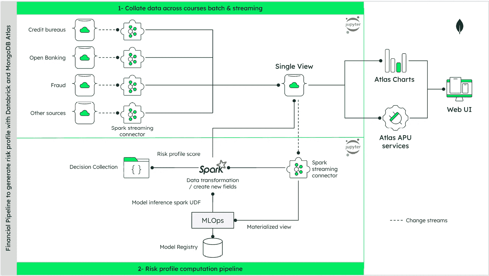

图 11.1：预测违约概率和信用评分的数据处理流程架构

该图展示了信用风险评估的端到端数据处理流程，展示了客户数据如何通过收集、处理、风险评估、模型开发和决策阶段流动，以产生准确的违约预测。在*图 11.2*中，你可以看到使用 LLM 解释信用评分的架构。

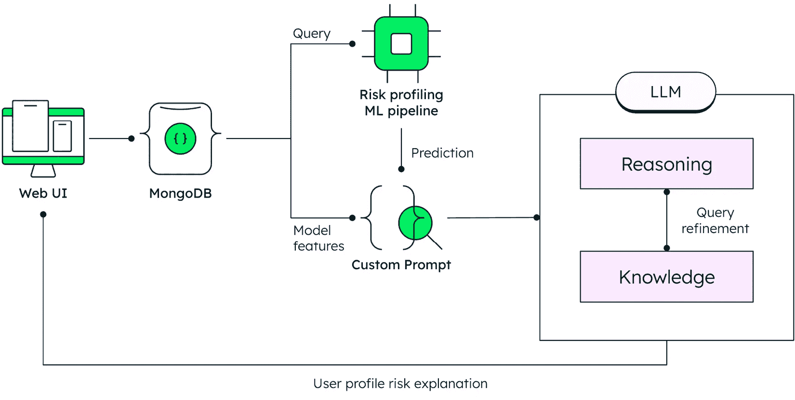

图 11.2：信用申请拒绝的架构

该可视化展示了如何将 LLMs（大型语言模型）集成到信用决策系统中，为申请拒绝提供清晰、易懂的解释，从而提高透明度和客户体验。在信用申请被拒绝的情况下，互动不应以拒绝结束。相反，这为机构提供了一个宝贵的机会，通过提供与申请者财务状况更匹配的个性化替代信用产品来保持参与度。

传统的推荐引擎通常依赖于静态的基于规则的系统或协同过滤模型，这些模型可能缺乏灵活性，无法响应细微的客户需求或不断变化的产品供应。这些系统往往难以解释为什么申请者被拒绝以及存在哪些可行的替代方案。GenAI 完全改变了这种动态。

通过利用客户数据、信用评分结果和实时产品可用性，GenAI 模型可以作为智能推荐引擎，主动建议适合申请者风险状况、收入、信用行为和偏好的替代方案。例如，如果个人贷款申请因信用记录不足而被拒绝，GenAI 模型可能会推荐一张费用较低且无额外功能的更基本的信用卡，或是一笔条款宽松的小额分期贷款，以及/或一个金融素养产品来建立信用。

除了生成产品匹配之外，LLMs 还可以解释为什么提供特定的替代方案，提高透明度并建立信任。这种程度个性化与清晰度在传统的推荐系统中难以实现。

以下架构展示了如何将生成式人工智能集成到信用决策流程中，不仅用于评估风险，还提供*最佳下一步行动建议*，以保持客户在财务旅程中的参与、知情和支持：

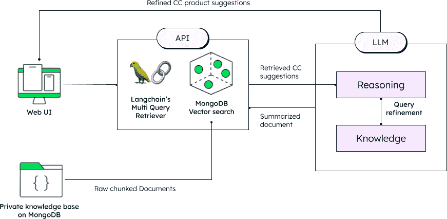

图 11.3：替代信用产品推荐架构

*图 11.3*展示了替代信用产品推荐系统的综合架构。它展示了用户通过 Web UI 进行交互如何触发 API 调用，利用 LangChain 的 MultiQueryRetriever 和 MongoDB 向量搜索处理来自 MongoDB 私有知识库的原始分块文档。它检索相关的信用卡建议和总结文档，然后输入到由 LLM 驱动的推理引擎中进行查询优化和知识处理。最终，通过结合基于向量的文档检索、多查询处理和 LLM 推理的智能系统，提供个性化的金融产品推荐。

了解替代数据、人工智能和生成式人工智能的融合如何重塑信用评分的基础，请参阅[`www.mongodb.com/docs/atlas/architecture/current/solutions-library/credit-card-application-with-generative-ai/`](https://www.mongodb.com/docs/atlas/architecture/current/solutions-library/credit-card-application-with-generative-ai/)。

**Base39 的 AI 驱动信用分析**

除了使用替代数据、预测人工智能和生成式人工智能外，代理人工智能现在也被应用于信用决策领域。其中一家公司是 Base39。Base39 是一家位于巴西圣保罗的金融科技公司。其核心服务集中在提供信用和风险评估的高级服务。Base39 成立是为了利用 MongoDB Atlas 向量搜索和 Amazon Bedrock 的 AI 力量颠覆信用分析。

Base39 意识到现有的信用分析产生的金融决策不够全面，这主要是因为数据稀缺。必要的数据，如收入验证、就业历史和信用评分，仅占所需信息的很小一部分。此外，收集和选择这些数据点高度依赖于主观过程。这个复杂且高度手动的过程可能需要几天时间，并产生不准确和不完整的结果。

虽然预测机器学习算法旨在处理基本评分，但与生成式人工智能的结合增强了数据输入、结果解释和“如果...将会发生什么”分析。生成式人工智能通过分析历史数据模式简化了模型参数的更新，从而消除了在电子表格或配置中进行手动更新的需求。LLM 作为风险分析师的智能助手，提供推荐并指导分析师为每种贷款场景选择最相关的数据源和字段。

*“MongoDB 为数据层提供支撑，提供灵活的架构支持、LLM 上下文的向量搜索以及与 Base39 开发者优先哲学相一致的管理部署模式。”*

— **布鲁诺·努内斯，Base39 首席执行官**

MongoDB Atlas 是 Base39 特性存储的核心组件。特性存储是机器学习中用于存储、管理和提供称为“特性”的数据的工具或系统。特性是用于机器学习模型进行预测的个别可测量属性或特征。MongoDB 通过 Atlas 向量搜索在结构化（丰富金融）和非结构化（行为）数据上的原生搜索能力，对于评估过程至关重要。

通过 Atlas 向量搜索，Base39 能够加速特性检索并动态更新其机器学习模型。这种灵活性对于实时调整信用政策至关重要。通过使用向量搜索检索到的数据，Base39 可以用特定领域的上下文增强 LLM 的推荐，从而提高其对于风险评估者的可靠性和准确性。这避免了手动筛选大量文档或配置文件。最后但同样重要的是，Base39 解决方案的一个尖端创新和关键差异化因素在于其通过代理式 AI 方法实现的自主性。Base39 的模型可以根据数据感知、推理和行动。它采用 **思维链**（**CoT**）方法，这是一种将复杂问题分解为连续步骤的推理方法。这为分析信息和针对特定个人贷款内容做出决策所需的自主性提供了可能。这使得收集信用信息变得动态和高度个性化，而无需像传统基于规则的 AI 自动化系统那样规定许多规则（这些系统无论如何也无法穷尽决定需要从信用申请人那里收集哪些信息）。这种代理式 AI 方法为更准确和全面的信用档案以及最终的信用决策开辟了无限潜力。了解更多关于 Base39 的故事，请访问 [`www.mongodb.com/solutions/customer-case-studies/base39`](https://www.mongodb.com/solutions/customer-case-studies/base39)。

随着 AI 改变面向客户的信用决策，它在银行如何管理内部知识和运营方面同样具有革命性。

# 利用 GenAI 革新银行的企业知识管理

高效获取和使用企业知识至关重要。各个部门的内部员工依赖于大量的信息，从政策和程序到监管指南和产品细节。传统的**企业知识管理系统**（**EKM**）往往无法提供无缝且直观的信息访问。通用人工智能（GenAI）为银行内的 EKM 革命提供了变革性的机会，通过智能工具赋能员工，显著提高生产力和决策能力。

## 传统 EKM 系统在银行业中的挑战

传统的 EKM 系统在银行内部信息组织方面发挥了核心作用，但随着商业和监管需求的演变，它们正面临越来越多的挑战。这些系统往往难以提供准确、及时和上下文相关的信息，存在几个局限性：

+   **信息孤岛**：知识可能分散在不同的系统和部门中，使员工难以找到特定主题的全面视角。

+   **复杂的搜索界面**：基于关键词的搜索往往产生不相关的结果，需要员工花费大量时间筛选文档以找到所需信息。

+   **过时或难以理解的内容**：政策和程序可能冗长、复杂且不易消化，阻碍了快速理解和应用。

+   **缺乏上下文意识**：传统系统往往无法理解员工查询的具体上下文，导致提供通用的、无用的回答。

+   **高维护成本**：保持知识库的更新和相关性需要大量的手动工作。

这些局限性阻碍了运营效率和合规性。克服这些挑战需要采用更先进、上下文感知的 EKM 解决方案。

## GenAI 如何改变银行业 EKM 系统

GenAI 提供强大的功能来克服这些限制，为内部银行员工创建更有效和用户友好的 EKM 系统。许多银行已经开始实施 GenAI 聊天机器人，通常首先将数据整合到一个中央企业知识库中，以支持其新一代智能知识管理应用。

以下是一些此类服务中经常实施的关键功能：

+   **自然语言查询和对话式搜索**：GenAI 使员工能够用自然语言提问，就像向同事提问一样。AI 可以理解查询背后的意图，并提供精确和相关的答案，显著减少搜索时间和挫折感。

+   **智能文档摘要**：GenAI 可以自动总结冗长的政策、程序和监管文件，为员工提供简洁的概述和关键要点。这有助于更快地理解和应用关键信息。

+   **情境化信息检索**：通过理解用户的角色、其部门以及查询的上下文，GenAI 可以提供更定制化和相关的信息，避免泛泛的回答。

+   **动态知识生成**：GenAI 可以从多个来源综合信息来回答可能未在单一文档中明确解决的问题。这使得员工能够获得对复杂查询的全面答案。

+   **个性化知识推荐**：根据员工的过去查询和其角色，GenAI 系统可以主动推荐相关的知识和更新，确保他们了解关键信息。

+   **自动知识库更新**：GenAI 可以通过识别过时信息并根据新法规或内部政策变化提出修订建议来帮助保持知识库的更新，从而减少手动维护。

+   **增强知识共享和协作**：GenAI 可以通过根据员工查询识别主题专家并将他们连接起来进行直接协作来促进内部知识共享。它还可以总结内部论坛和会议中的关键讨论要点，使知识更易于获取。

这些能力不仅提高了运营效率，还加强了整个组织的合规性和决策能力。随着银行继续采用 GenAI 驱动的 EKM 系统，它们正在为更敏捷、更信息丰富和更协作的知识生态系统打下基础，这些系统与监管和业务需求同步发展。

## 银行内部 EKM 系统中 GenAI 的应用用例

几个实际用例突出了银行如何利用或可以利用 GenAI 进行内部 EKM：

+   **合规和监管查询**：员工可以通过自然语言提问，GenAI 系统会综合来自各种合规文件的信息，快速获得复杂的监管问题的答案。

+   **产品知识支持**：前台工作人员可以快速访问关于银行产品和服务的详细信息，以便准确高效地回答客户咨询。

+   **内部政策和程序指导**：员工可以通过自然语言查询和摘要轻松理解和导航内部政策和程序。

+   **IT 支持和故障排除**：内部 IT 团队可以通过使用自然语言查询知识库和文档来快速找到技术问题的解决方案。

+   **入职和培训**：新员工可以通过询问关于内部流程的问题并通过 GenAI 驱动的 EKM 系统访问相关培训材料来快速熟悉情况。

+   **风险管理洞察**：风险分析师可以利用 GenAI 从各种风险报告中综合信息，识别新兴趋势和潜在问题。

这些用例展示了 GenAI 驱动的 EKM 如何简化对关键信息的访问，减少运营瓶颈，并提高员工生产力，最终使银行能够更快、更有效地响应内部需求和外部需求。

## GenAI 驱动的 EKM 系统的架构考虑

在银行环境中实施 GenAI 用于 EKM 需要仔细的架构设计，重点关注集成、安全和可扩展性。该设计的关键方面是数据平台考虑，因为 GenAI 的有效性高度依赖于存储、管理和高效检索各种企业知识的能力。主要考虑因素包括以下内容：

+   **与现有知识基础设施的集成**: GenAI 系统必须与银行现有的系统无缝集成。这通常涉及构建连接器和 API 以访问来自不同系统的信息。一个中央操作数据存储库可以整合来自各种来源的数据，为 GenAI 系统提供一个统一的视图。

+   **数据平台选择**: 选择合适的数据平台是基础。能够处理结构化、半结构化和非结构化数据，并支持高级索引和搜索能力的现代数据库是必不可少的。文档存储在管理多样化的企业知识资产方面表现出色。这种多模态方法对于有效的 GenAI 应用至关重要。

+   **安全数据访问和治理**: 由于银行数据的敏感性极高，稳健的安全措施至关重要。包括访问控制和加密在内的功能确保数据保护和合规性。

+   **GenAI 模型和平台的选择**: 银行需要选择合适的 LLM（大型语言模型）及其底层基础设施（云或本地）。架构应允许轻松集成这些模型。

+   **RAG**: 为了确保生成式人工智能（GenAI）的响应准确，并基于银行的具体知识，实施 RAG（Retrieval-Augmented Generation）至关重要。集成搜索和向量搜索功能特别适合支持 RAG 的实施，能够高效地存储、索引和检索各种数据类型，包括文本内容和相应的向量嵌入，用于语义相似度搜索，确保 GenAI 的响应有上下文支持。

+   **可扩展性和性能**: EKM 系统必须处理大量查询。自动扩展功能确保可扩展性和低延迟响应，以满足高峰需求。

+   **监控和可解释性**: 对 GenAI 系统性能和准确性的稳健监控是必不可少的。存储有关查询和响应的日志和元数据有助于分析和可解释性。

+   **用户界面和工作流程集成**: GenAI 驱动的 EKM 系统应具有直观的用户界面，并集成到现有的工作流程中。灵活的数据模型允许轻松适应不断变化的需求，并实现无缝集成。

通过全面解决这些考虑因素，银行可以创建一个由 GenAI 驱动的 EKM 架构，不仅满足严格的安保和合规要求，还能在效率、知识可访问性和决策质量方面带来可衡量的收益。

**亚洲银行的 GenAI 聊天机器人实施**

亚洲一家进步银行实施了一个 GenAI 聊天机器人，用于内部应用，以增强员工的工作效率。聊天机器人提供内容生成、文本摘要和语言翻译等功能，帮助员工提高工作效率。它还协助检索法规、程序、业务联系人、申请表和文件，为员工节省了大量信息搜索时间。

银行的技术领导层公开承认，开发有效的 GenAI 应用面临独特的挑战，其中最重要的是提示工程的艺术和科学——即制定提供给 AI 模型的指令。AI 输出的质量高度依赖于这些提示的清晰度和具体性。认识到这一点，银行正在积极演变其应用开发文化。他们战略性地调整责任，鼓励业务用户、那些具有深厚领域知识的人成为 GenAI 开发生命周期的*冠军*，特别是在完善和调整提示方面。这标志着与传统软件开发的不同，在传统软件开发中，IT 通常负责大部分技术实施。

为了促进这种文化转变，银行已经建立了内部 GenAI 培训计划，旨在为业务人员提供必要的提示工程技能。这种组织适应旨在弥合技术能力与业务需求之间的差距，确保 GenAI 工具和应用最大限度地相关和有效，通过直接将用户专业知识纳入微调过程。银行还在探索自动提示增强技术，以进一步简化这一过程。

此外，银行认识到内部聊天机器人并非孤立存在，而是银行集团及其子公司更广泛、相互关联的 AI 应用生态系统的一部分。尽管它服务于特定的内部目的，但它共享了底层 GenAI 技术推动力，并可能与其他领域的倡议共享共同的数据基础设施。

下图显示了知识工作流程：

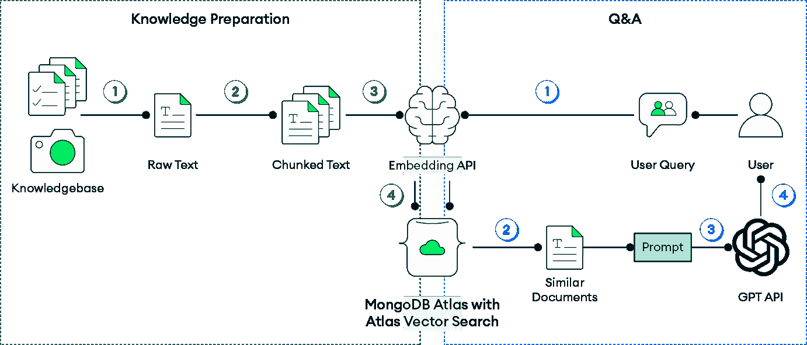

图 11.4：RAG 知识系统工作流程

此图展示了 AI 驱动的客户支持系统中各个组件之间信息无缝流动的情况，展示了用户查询是如何通过向量搜索处理，增加上下文，并转化为自然语言响应的。

## GenAI 对 EKM 系统的影响

将 GenAI 集成到 EKM 系统中为银行带来了显著的好处：

+   **提高员工生产力**：更快、更轻松地获取知识使员工能够更高效地完成任务

+   **改进决策**：获取全面和上下文相关的信息使员工能够做出更明智和及时的决策

+   **增强员工体验**：用户友好的通用人工智能驱动的 EKM 系统可以通过使员工更容易找到所需信息来减少挫折感并提高工作满意度

+   **减少错误和改进合规性**：对政策和法规的准确和易于获取的知识可以帮助减少错误并确保更好的合规性

+   **更快地入职和培训**：新员工可以通过智能访问培训材料和内部知识更快地变得富有生产力

+   **更好的知识保留**：通用人工智能系统可以通过使其易于访问和搜索来帮助保存机构知识，即使员工离职或角色发生变化也是如此

虽然通用人工智能的这些内部应用正在改变银行幕后运营的方式，但这项技术在面向客户的应用中同样具有革命性，重塑了金融机构与客户互动和服务的方式。

# 通过 AI 驱动的交互提供更好的数字银行体验

这种向以客户为中心的 AI 的转变正在创造更直观、个性化、智能的银行体验。为了满足不断增长的需求，银行正在采用基于大型语言模型（LLMs）和智能自动化的 AI 平台。这种转型需要灵活、可扩展的数据基础，这对于现代 AI 驱动的银行至关重要。

## 提升客户体验的通用人工智能

通用人工智能引入了高级功能，如智能聊天机器人和虚拟助手，使银行能够提供实时、上下文感知的支持。这些 AI 驱动的工具可以解释复杂的客户查询，访问相关信息，并立即提供简洁、个性化的响应。这不仅提高了客户满意度，还通过减少对传统客户服务渠道的依赖来简化运营。

除了提供帮助之外，通用人工智能（GenAI）还使主动银行成为可能。AI 系统可以挖掘来自交易数据、使用趋势和行为分析得出的见解，以推荐个性化的金融产品，通知用户关于异常活动的信息，或引导他们通过生活中的事件，如购买房屋或为教育储蓄。银行现在不仅可以简单地响应查询，还可以预测客户需求，提供无缝且价值丰富的体验。

将通用人工智能融入银行工作流程从根本上改变了金融服务提供的方式。客户通过与银行的天然对话而非僵化的表格或下拉菜单进行互动。他们不再需要阅读密集的政策文件，而是收到针对他们问题的 AI 生成的摘要和解释。银行成为真正的金融伙伴，全天候可用，可扩展且智能。

## AI 驱动的数字银行数据基础

在现代银行中实施 AI 不仅需要强大的模型，还需要灵活、实时的数据基础。基于文档的架构非常适合管理复杂的银行数据，如客户档案、交易历史、账户行为以及 FAQ 或政策文档等非结构化内容，所有这些都在一个地方。这种统一模型允许 AI 系统即时访问丰富的上下文信息，从而推动更准确、个性化、响应迅速的客户体验。

现代数据平台如 MongoDB 也支持如 RAG 等高级 AI 模式，允许银行助手即时检索相关文档并生成针对客户查询的精确答案，无论是解释抵押贷款条款还是标记可疑费用。

此外，强大的聚合框架允许智能代理分析实时账户活动、支出趋势或贷款余额，结合历史数据，从而实现主动洞察和决策支持。安全和合规性至关重要，加密、细粒度访问控制和审计等特性对于处理敏感个人金融数据的任何 AI 都至关重要。

通过无缝集成到现代 AI 生态系统并支持事件驱动架构，合适的数据平台使银行能够自动化工作流程，大规模个性化互动，并更快地将智能服务推向市场，使其成为 AI 驱动数字银行的核心推动力。

## AI 驱动的客户支持参考解决方案架构

为了实现这些功能，一个旨在通过 GenAI 增强客户交互的参考架构是必不可少的。该架构的核心是 MongoDB，作为存储和访问结构化和非结构化数据的集中化平台。

该流程始于数据摄取和转换，其中政策文件、常见问题、产品信息和其他文本密集型资源使用**自然语言处理**（**NLP**）技术进行处理。NLP 使用计算方法来分析和理解人类语言，从非结构化文本中提取意义、结构和上下文。这些文件被分解成更小的片段并转换为向量嵌入。原始文本和嵌入都存储在 MongoDB 中，利用其向量搜索功能进行高效检索。

当发生新的交互时，无论是由语音、聊天机器人还是表单输入触发的，用户查询都会以相同的方式进行向量化。应用程序随后在存储的向量上执行语义相似度搜索，检索与用户意图最相关的最相关内容。这种方法可以实现准确、上下文感知的响应，从而提高效率和客户满意度。

*图 11.5* 展示了 AI 驱动的客户支持系统的端到端流程。

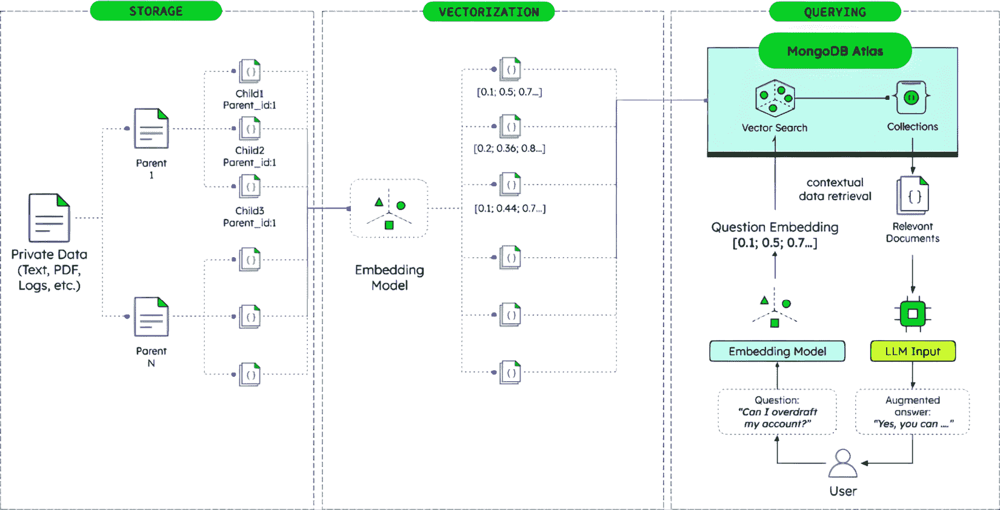图 11.5：AI 驱动的客户支持流程和组件交互

该图展示了用户查询是如何被处理的，通过整合向量搜索、语言模型和运营数据，这些查询被丰富上下文信息，并转化为个性化的响应。这些检索到的文档，通过运营数据（如账户历史或资格标准）的额外上下文信息进行丰富，然后传递给一个语言模型，该模型生成自然语言响应。

此架构严重依赖于对多种形式数据的实时访问。例如，交易元数据、用户配置文件和行为信号都存储在 MongoDB 中，并且可以根据需要聚合。通过使用 Atlas 触发器，系统还可以动态响应。例如，如果客户询问透支问题，系统可以在响应之前触发对当前余额和支付计划的查找。

这种模块化架构旨在与更广泛的 AI 堆栈集成，包括 LLM 编排框架（如 LangChain 或 LlamaIndex），以及管理 AI 模型和工作流程的部署环境。MongoDB 位于所有这些层级的交汇处，使得 AI 代理依赖的高价值数据的存储和动态检索成为可能。

随着银行通过人工智能增强客户互动，它们必须同时加强防御，以应对日益复杂的金融犯罪。

# 增强人工智能的金融犯罪缓解和合规性

人工智能正在通过实时欺诈检测、自动法规解释和更智能的决策，改变金融服务中的风险和合规性。MongoDB 为这些 AI 系统提供了灵活、可扩展的数据基础，尤其是在处理**了解你的客户**（**KYC**）和**反洗钱**（**AML**）过程中的多样化数据，从文件到声音和图像。随着金融犯罪变得更加复杂，法规变得越来越复杂，人工智能和尖端数据平台正在帮助机构保持领先，将风险转化为弹性，将合规性转化为竞争优势。

近年来，金融犯罪发生了巨大变化，犯罪分子利用先进的技术并利用数字系统中的漏洞。依赖于静态规则和预定义阈值的传统检测方法难以跟上这些复杂的计划。同时，监管要求持续扩大，给金融机构带来了重大的合规负担。不充分的金融犯罪预防成本巨大，包括货币损失、监管罚款、声誉损害和客户信任度下降。为了应对这些挑战，机构需要能够应对新兴威胁的同时保持运营效率的适应性解决方案。

## 利用人工智能加强金融犯罪缓解

从广义上讲，**fincrime** 代表了一整套政策、控制、分析和调查措施，旨在预防、检测、报告和从任何可能不仅损害客户，而且更关键的是损害金融机构声誉的犯罪活动中恢复。因此，它被视为需要相应应对的主要操作风险。

在不同的潜在威胁中，最常见的是欺诈管理（资产损失）、反洗钱（资产来源）、制裁合规（资产合法性），以及主要由于治理薄弱、筛选过时、缺乏流程控制或数据质量差和验证不足而导致的所有运营风险。所有这些威胁都可能被大幅增强，并在网络空间中变得难以检测，使得人工检查变得徒劳。因此，必须用相应的现代技术来应对网络威胁，使 AI 成为优化 fincrime 缓解技术能力的理想解决方案。

## 重新定义 AI 在合规领域未来趋势的新趋势

AI，尤其是生成式 AI，正在成为帮助组织从被动风险缓解转向主动治理的关键工具。这一变革的核心是灵活的数据平台，旨在支持大规模的实时、AI 驱动决策。例如，传统的欺诈检测系统依赖于静态规则和预定义的阈值。这些规则越来越无法有效对抗现代欺诈技术，这些技术快速、适应性强，通常隐藏在合法活动中。AI 通过学习历史和实时数据、检测异常和识别可疑行为模式来增强风险管理。

生成式 AI 更进一步，通过实现场景建模和合成欺诈模拟，帮助组织测试假设并揭露以前未知的威胁向量。AI 驱动的系统不仅可以检测单个欺诈行为，还可以检测协调的、多渠道的欺诈网络。通过与如 MongoDB 等现代数据平台集成，这些系统可以访问来自多个来源的统一、上下文化的数据视图，从而提高检测和决策的准确性。

实现所有这些 AI 能力需要一个数据平台，它不仅能存储大量的历史和实时交易数据，还能高效地为各种 AI 模型提供服务，从预测异常检测器到用于模拟的生成模型，通常在实时或接近实时。通过拥有现代化的数据平台，金融机构可以解锁以下智能能力：

+   **XAI**：随着监管审查的加强，金融机构需要能够解释其决策的 AI 系统。XAI 方法提供了对 AI 模型如何得出结论的透明度，满足监管要求的问责制，同时保持检测的准确性。领先的数据平台通过保留数据点和决策之间的关系来支持这种可解释性。

+   **主动风险感知**：不仅仅是响应已知的模式，先进的 AI 系统可以通过分析行为和市场条件中的微妙变化来预测新兴风险。这种前瞻性方法需要一个灵活的数据基础，能够整合各种信号并支持实时分析。

+   **联邦学习以协作防御**：金融机构正在探索联邦学习技术，允许它们在不共享敏感客户数据的情况下集体训练欺诈检测模型。这种协作方法加强了整个金融生态系统，同时保护隐私和机密性。具有复杂安全功能的现代数据平台对于实施这些复杂方法至关重要。

这些能力共同使金融机构能够领先于不断发展的威胁，自信地满足监管要求，并将合规性从防御性的必要性转变为战略优势。

## 用于监管智能和政策自动化的 AI

犯罪预防的主要目标是阻止犯罪活动，同时确保符合监管要求。GenAI 通过创建强大的新能力来检测和预防金融犯罪，正在改变这一领域：

+   **合成欺诈数据集**：GenAI 可以创建模拟野外尚未观察到的全新攻击模式的欺诈交易合成数据集。这允许金融机构主动训练其检测系统，在真实攻击发生之前为新兴威胁做好准备。

+   **对抗性测试**：通过模拟复杂的欺诈尝试，GenAI 帮助机构识别其现有控制中的漏洞。这些模拟可以模拟复杂的多渠道攻击，而传统的测试方法可能会错过。

+   **异常生成**：而不是等待罕见的欺诈事件自然发生，GenAI 可以生成逼真的异常数据，有助于改进检测模型，特别是对于低频但影响大的欺诈场景。

AI 还帮助机构解释法规，将它们转化为内部政策，并监控持续的遵守情况。GenAI 可以阅读并总结法律文本，提取义务，并建议执行政策。智能自主代理，即能够感知其环境、做出决策并采取行动以实现特定目标的 AI 系统，可以持续验证运营活动是否符合监管要求，实时标记不合规行为。

以现代数据平台作为基础，合规系统从实时访问关键数据中受益：客户档案、交易、通信和审计日志。MongoDB 等平台文档模型允许组织以易于搜索和追踪的格式存储法规解释、合规规则和上下文元数据，从而实现高效的自动化合规检查和可审计的报告。

## MongoDB 在 KYC 和 AML 中的作用

通过实时欺诈检测、自动法规解释和更智能的决策，AI 正在改变金融服务中的风险和合规性。现代数据平台，如 MongoDB，为这些 AI 系统提供了灵活、可扩展的数据基础，尤其是在处理客户身份识别（KYC）和反洗钱（AML）中的多样化数据时，从文件到语音和图像。

MongoDB 允许金融机构同时摄取和存储非结构化数据，例如扫描的身份证件、生物识别信息和客户支持语音记录，以及结构化数据，如交易和账户历史记录。这使得 AI 模型能够执行更深入的多模态分析。例如，GenAI 可以转录和分析语音交互以检测可疑意图，或使用图像数据检测文件伪造。

MongoDB Atlas 通过提供内置功能进一步增强了这一点，例如全文搜索、向量搜索（用于相似度匹配）以及与机器学习管道的集成。有了这些功能，机构可以将客户提交的文件与已知的欺诈模式进行比较，运行面部识别或声纹验证，并在客户交互中执行语义搜索，从而实现更丰富的 KYC/AML 风险评估流程。

首先采用以 AI 为中心的风险管理方法，从动态的单客户视图开始，如图 11.6 所示。MongoDB Atlas 从内部系统、客户接触点和外部来源摄取结构化和非结构化数据，然后由 AI 模型处理，根据学习到的行为和法规逻辑检测潜在的欺诈或合规违规。包括结构化交易数据、非结构化文档和外部数据集在内的多样化数据源被整合到一个统一的个人资料中，从而实现全面的风险评估和个性化的服务交付。

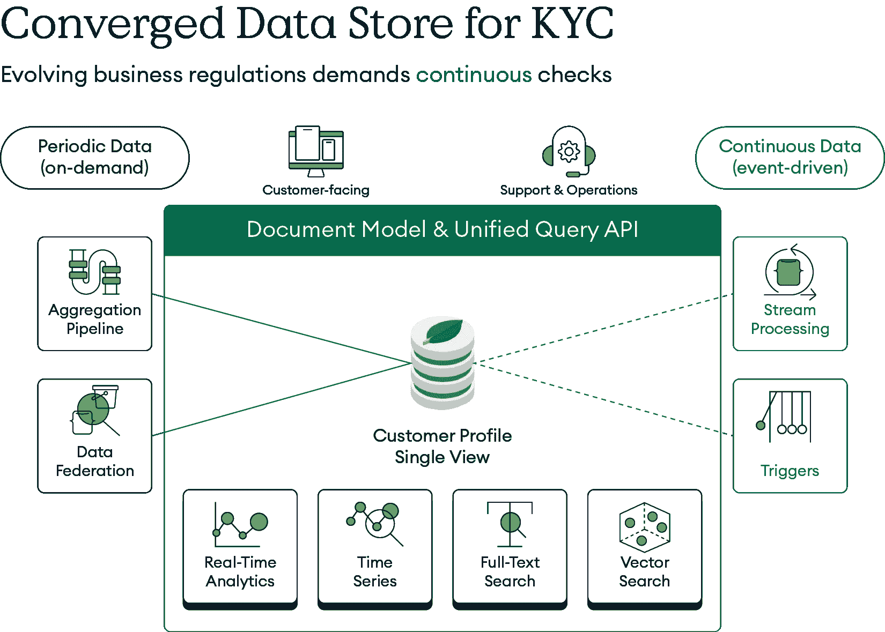

图 11.6：构建动态客户资料的融合数据存储

一旦构建了这一单一视图，它可以与额外的非结构化数据相结合，例如制裁观察名单和 AML 政策，以及交易数据，进行综合分析。MongoDB 文档模型的灵活性使得这种多模态数据库方法成为可能。数据汇聚成完整数据集后，MongoDB 的向量搜索可以识别已知可疑活动的相似向量表示，如图*图 11.7*所示。这确保了只有高概率的欺诈交易被标记为审查，从而减少误报同时保持检测准确性。

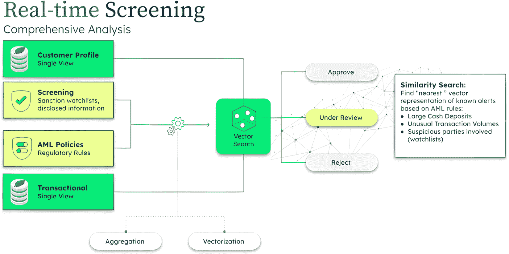图 11.7：使用向量搜索进行实时交易筛选

向量搜索在实时交易筛选中发挥着关键作用，它使得将传入交易与已建立的可疑活动模式进行比较成为可能。通过利用这种方法，金融机构可以显著减少误报，提高检测准确性，并更快地应对潜在威胁。

## 战略业务优势

AI 驱动的实时交易筛选和向量搜索功能的实现可以为金融机构带来以下可衡量的战略能力：

+   **更好的欺诈检测**：由 MongoDB 的实时数据访问支持的 AI 模型可以在大型数据集中捕捉微妙的欺诈信号，减少误报并加快响应时间。

+   **改进的合规性**：自动解释和执行法规减少了人工成本和审计风险。

+   **增强的 KYC/AML**：存储和分析非结构化客户数据的能力丰富了身份验证和风险评估。

+   **提高的敏捷性**：IT 部门可以快速适应新的监管要求或新兴的欺诈类型，因为 MongoDB 的灵活模式支持迭代开发和快速部署新的数据模型和 AI 驱动规则，无需漫长的数据库重新设计周期。

+   **运营效率**：AI 自动化和集成数据工作流程释放了人力资源，使其能够专注于高价值任务。

+   **监管信任**：通过提供统一的数据平台和 AI 驱动决策的全面审计跟踪，IT 决策者可以帮助其机构更有效地向监管机构展示稳健的控制和问责制，从而增强信任并可能减少审查。

随着金融犯罪不断演变，AI 驱动的预防系统将变得越来越复杂。如联邦学习等综合技术，允许模型在多个机构之间进行训练而不共享敏感数据，有望提高检测能力同时保护隐私和机密性。

自主智能代理代表了下一个前沿，拥有能够主动寻找可疑模式、实时调整防御措施，甚至在它们实现之前预测新兴威胁的系统。这些系统将需要能够处理复杂、相互关联的数据并支持大规模实时决策的强大数据平台。

通过投资基于灵活、可扩展的数据平台（如 MongoDB）的 AI 驱动的金融犯罪预防，金融机构可以在降低运营成本的同时保持合规，并保持对不断发展的威胁的领先地位。

除了传统的风险管理之外，AI 也在改变机构如何处理环境和社会责任。

# 多模态和 AI 驱动的 ESG 分析

**环境、社会和治理**（**ESG**）原则的深远影响显而易见，这得益于监管变革，尤其是在欧洲，迫使金融机构将 ESG 整合到投资和贷款决策中。例如，欧盟的**可持续金融披露法规**（**SFDR**）和欧盟分类法规是此类指令的例子，要求金融机构在其运营和投资产品中考虑环境可持续性。投资者对可持续选项的需求激增，导致专注于 ESG 的资金增加。监管和商业需求反过来又促使银行改善其绿色贷款实践。这种转变对金融机构来说是战略性的，可以吸引客户、管理风险并创造长期价值。

然而，金融机构在管理提高其 ESG 分析的不同方面时面临着许多挑战。主要挑战包括定义和协调标准及流程，以及管理为 ESG 分析目的而包括的快速变化和多样化的数据洪流。

AI 可以通过机器学习等技术以自动和自适应的方式帮助解决这些关键挑战。金融机构和 ESG 解决方案提供商已经使用 AI 从企业报告、社交媒体和环境数据中提取见解，提高了 ESG 分析的准确性和深度。随着市场对更可持续和公平社会的需求增加，预测 AI 与 GenAI 的结合也有助于减少贷款中的偏见，创造更公平、更具包容性的融资，同时提高预测能力。AI 的力量有助于促进复杂可持续模型和策略的发展，标志着将 ESG 融入更广泛的金融和公司实践的重大进步。

在更广泛的 ESG 框架下，环境和气候风险对金融和非金融机构都是一个关键挑战。随着气候变化以前所未有的速度加速，数百万资产面临风险。机构将需要智能气候数据分析来管理气候风险并找到更好的风险调整机会。

**Ambee 的气候数据平台**

Ambee 是一家总部位于印度的快速成长的气候技术初创公司，以其创造可持续未来的使命在环境数据领域引起了轰动。拥有超过 100 万日活跃用户，Ambee 提供专有的气候和环境数据服务，以帮助政府、医疗保健组织和私营公司就其政策和商业战略做出明智的决策。

MongoDB Atlas 一直是 Ambee 数据库架构的核心，支持他们的 AI 和机器学习模型。该公司利用 MongoDB Atlas 来管理其广泛且多样化的环境数据集。Ambee 每天处理来自超过 80 万个传感器和 11 颗地球观测卫星的大约 4 太字节的数据，面临着扩展和确保快速 API 响应的挑战。通过采用 MongoDB Atlas，公司集中了其数据存储，简化了数据访问，并减少了在多个表之间进行复杂连接的需求。这一转型使 Ambee 从 2020 年每月处理 60,000 次 API 调用扩展到 2023 年约 79 亿次，同时将 API 响应时间从 2 秒缩短到 300 毫秒以下。

Ambee 的数据为用户提供了一个半径小于 1 平方公里范围内的精确环境洞察。为了达到这种高精度和粒度，Ambee 需要一个平台，不仅能够支持大量数据，还能够支持广泛的地理空间需求。MongoDB Atlas 因其快速地理空间查询能力完美地满足了他们的需求。例如，使用 MongoDB，他们可以在 20 毫秒内查询给定坐标最近的地点，即使有数百万个地理空间数据点。

MongoDB Atlas 的性能、可扩展性和多模态能力支持 Ambee 的 AI 驱动服务，例如预测森林火灾和提供实时空气质量和花粉数据。此外，MongoDB Atlas Search 促进了文本搜索功能，包括部分搜索、通配符搜索和自动完成搜索，增强了平台快速提供精确信息的能力。

## MongoDB 在 ESG 数据管理中的作用

MongoDB 的动态架构革新了 ESG 数据管理，能够处理半结构化和非结构化数据。其灵活的架构特性允许数据模型随着 ESG 策略的发展而适应。高级文本搜索功能能够高效地分析大量半结构化数据，为 ESG 报告提供信息。支持向量搜索则通过多媒体内容洞察丰富了 ESG 分析。

结合 LLM（大型语言模型）增强了 MongoDB 处理 ESG 文本内容的能力，自动化情感提取、总结和趋势识别。结合 LLM 与矢量数据管理能力，可以创建 GenAI 应用来解释复杂且不断演变的可持续性分类法，并指导合规的投资和融资流程。这种由 AI 驱动的、由 MongoDB 强大的数据管理支持的途径，为分析 ESG 报告中大量叙事数据提供了一种复杂的方法。

此外，MongoDB 支持地理空间和网络图分析，提供了一种强大的分析组合，以识别与气候变化（例如洪水或野火）相关的物理风险，这些风险与银行或投资公司融资的资产相关，并评估气候风险对供应链的影响。风险分析可以随后实现针对风险缓解和供应链弹性的针对性策略。

随着代理 AI 的发展，新的可持续性用例正在出现。例如，代理 AI 应用可以作为绿色贷款发起过程中关系经理的智能副驾驶，确保实时 ESG 合规性和资格。代理 AI 可以持续监控 ESG 披露和外部媒体，以检测漂绿行为，自主触发风险警报，并为合规团队推荐缓解措施。在供应链管理中，代理 AI 代理可以主动绘制供应商的气候脆弱性，模拟中断场景，并编排自动化的弹性措施，推动更可持续的采购和运营。

利用即插即用、丰富、多模态的功能和集成 AI 工具，MongoDB 的数据平台是推进 AI 在代理 AI 应用中使用的理想基础，因为它可以作为实时操作和分析数据存储，用于摄取、存储和组织代理 AI 代理做出明智、自主决策所需的所有相关 ESG、监管和情境数据。通过无缝集成 AI 模型并支持实时事件处理，MongoDB 使代理 AI 能够监控 ESG 风险、触发警报，并在贷款、合规或供应链模块中编排工作流程，所有这些均使用操作 ESG 数据。

## 驱动 ESG 政策和监管合规的 AI

AI 可以通过自动化跨司法管辖区复杂且经常变化的法规的摄入、理解和综合，在 ESG 政策分析和监管解释中发挥变革性作用。利用先进的 NLP 和机器学习模型，AI 可以快速分析冗长的监管文本，准确提取关键要求，并将其与组织的当前政策和实践进行比较。这使得合规团队能够快速识别差距、重叠或潜在的违规行为，并收到政策更新的可操作建议。AI 驱动的工具还可以实时跟踪监管变化，生成简洁的摘要，并提醒相关利益相关者新的义务或机会，显著减少人工努力和监管风险。

智能代理 AI 系统可以自主监控多个监管司法管辖区，在检测到新的 ESG 要求时，主动启动审查或政策更新，协调跨部门合规的内部工作流程，甚至协助起草对监管机构的初步回应或披露。

例如，在一个实时用例中，智能代理 AI 可以持续扫描国际监管机构的官方出版物，并在检测到新的 ESG 规则后，在法规发布后的几分钟内自动更新内部政策文件，为合规团队创建定制的行动项，并触发受影响业务单元的通知。然而，认识到机构控制和问责制的重要性，许多组织可以实施*人工介入*的方法，其中 AI 驱动的建议、更新和行动项在做出任何最终决定或公开披露之前，都会被路由到人类专家进行审查和批准。这确保了虽然 AI 为 ESG 政策流程带来了速度和一致性，但关键判断和最终控制仍然掌握在经验丰富的专业人士手中。对于在全球不断变化的 ESG 监管环境中航行的全球金融机构，传统和智能代理 AI 驱动的政策分析，结合人类监督，提供了一种可扩展且一致的方法来维持合规性、优化报告并自信地追求可持续性目标。

MongoDB 的价值不仅限于 ESG 数据管理，它还能加速开发人员和数据科学团队的效率。其直观的数据模型、分析工具和 AI 集成简化了数据驱动应用程序的开发和部署，使 MongoDB 对于推进 ESG 议程的组织至关重要。

*图 11.8* 表示了一个企业 ESG 解决方案架构，其中标有叶子的框表示 MongoDB 可以部署以支持 ESG 数据分析服务。

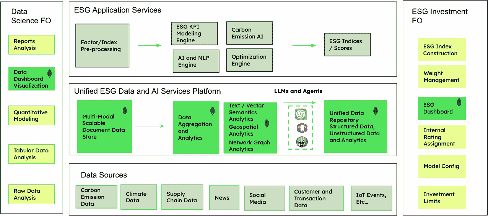

图 11.8：使用 MongoDB 的企业 ESG 解决方案架构蓝图

这展示了完整的 ESG 解决方案架构，突出了 MongoDB 可以部署以支持 ESG 领域数据收集、分析和报告的集成点。

# 由人工智能驱动的端到端支付处理

支付行业正在经历快速转型。随着企业客户对更快、更智能、更高效的服务的要求增加，金融机构正在转向人工智能来实现实时、数据驱动的决策和自动化。解锁这些益处的关键不仅在于人工智能本身，还在于支持它的基础技术，尤其是灵活、可扩展和性能卓越的数据基础设施，如 MongoDB。

本节探讨了如何通过人工智能革命性地改变**端到端支付处理**（**STP**），即无需人工干预的支付交易的无缝执行，以及 MongoDB 如何为这一转型提供关键的支持。

## 商业展望

支付行业正处于深刻转型的边缘，这一转型由人工智能驱动。随着实时交易、数字银行期望和复杂的合规要求的兴起，银行和金融机构面临着越来越大的压力，需要提供更智能、自动化和个性化的服务。人工智能不再仅仅是创新项目；它正成为一项业务必要性。

几种力量正汇聚在一起，使人工智能成为现代支付处理的基础：

+   **客户期望**：零售和公司客户现在都要求实时洞察、无缝支付体验以及现金流量预测或异常警报等预测服务。

+   **运营复杂性**：由于交易量的增长，传统的手动工作流程在支付对账、欺诈检查和路由方面越来越难以维持。

+   **竞争压力**：金融科技颠覆者和数字原生银行正在利用人工智能来区分自己。如果传统银行不能快速进化，它们可能会落后。

+   **监管需求**：如 PSD2、ISO 20022 和实时支付方案（例如，RTP、FedNow）等法规要求金融机构现代化基础设施和数据工作流程，这与人工智能对数据的渴求性质相吻合。

在公司银行业务中，人工智能的采用尤其具有战略意义。根据 Celent 的研究，73%的公司银行报告称，从投资高级分析中获得了明确的收入机会。另一方面，30%增加支付技术投资银行将人工智能列为高优先级[1]。

这种强调不仅在于增量效率，还在于新的商业模式和可货币化的增值服务，例如实时财务仪表板、自动化预测和智能流动性工具。

## 通用人工智能（GenAI）的作用

通用人工智能（GenAI）和大型语言模型（LLMs）的出现为人工智能在支付中的作用增添了新的维度：

+   **自然语言界面**：客户现在可以通过对话查询支付数据（例如：“这个季度我超过 10,000 美元的未收账款是什么？”），从而改变用户体验

+   **代码生成和测试**：生成式人工智能工具提高了开发者的生产力，允许更快地创建支付处理逻辑、验证和合规性检查

+   **数据汇总和报告**：大型语言模型可以将大量交易数据综合成见解、摘要或监管报告，减少对人工数据处理的依赖

然而，生成式人工智能的应用在数据安全、可解释性和合规性方面带来了挑战，尤其是在处理敏感的财务信息时，使数据架构和治理成为关键推动因素。

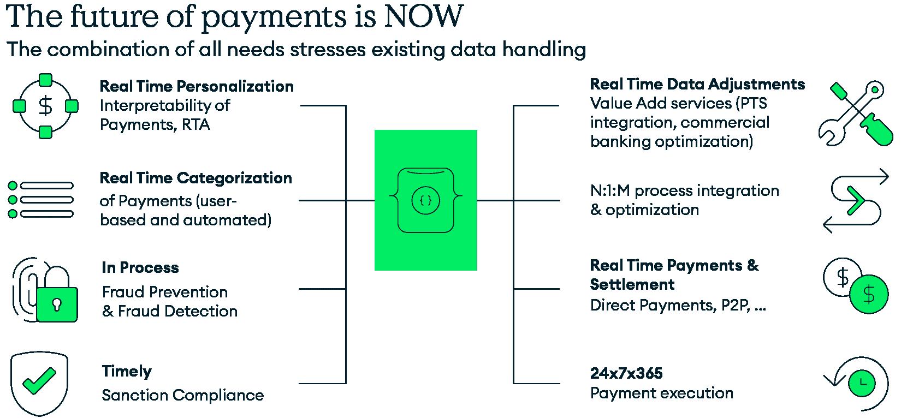

图 11.9：支付关键驱动因素

此图展示了现代实时支付系统的基本架构，展示了中央处理核心如何通过集成输入能力（如实时个性化、自动分类、欺诈预防和合规监控）以及输出服务（包括数据调整、流程集成、支付结算和全天候执行）来管理全面的支付工作流程，以实现具有实时操作能力的无缝、安全、连续的支付处理。

人工智能在支付领域的成功从根本上取决于一个强大的数据基础设施。人工智能模型的好坏取决于它们训练的数据，它们产生的见解的可信度也取决于管理这些数据系统的可靠性。这正是 MongoDB 发挥关键作用的地方：

+   **统一数据层**：MongoDB 使组织能够将不同的数据源（支付消息、账户数据、客户资料和日志）统一到一个视图，结构化并准备好进行数据分析或机器学习管道

+   **实时分析和人工智能就绪性**：其支持流式、时间序列和高容量事务性工作负载的能力确保人工智能应用具有响应性和可扩展性

+   **现代开发者体验**：MongoDB 丰富的开发者生态系统，与 Python、Spark、TensorFlow 和向量数据库集成，使其成为构建和迭代人工智能驱动功能的理想选择

借助统一、可扩展和人工智能就绪的数据基础，MongoDB 使支付提供商能够快速、准确、有信心地利用人工智能，推动创新，同时确保每一笔交易的可信度。

尽管前景光明，但将人工智能集成到 STP（Straight-Through Processing）中仍然面临着重大的数据挑战：

+   **数量和多样性**：支付系统以不同的格式和来自不同来源处理数百万笔交易

+   **实时处理**：许多人工智能应用依赖于流式或接近实时的数据处理

+   **数据质量和标准化**：遗留格式和不一致的数据结构阻碍了模型性能

+   **可审计性和治理**：人工智能，尤其是生成式人工智能，需要透明的数据处理以符合监管要求

这些挑战需要一种能够敏捷和可扩展地处理结构化、半结构化和非结构化数据的数据库平台。MongoDB 为 AI 驱动的 STP 系统提供独特的功能：

+   **灵活的数据建模**：MongoDB 的文档型模型允许无缝地将各种金融数据源，如交易历史、发票和市场数据，整合到统一格式中。这种灵活性对于准确的现金流预测或支持包括 ISO 20022 在内的多种支付方案至关重要，它有助于智能路由决策。

+   **高性能查询**：数据库的索引和聚合功能允许快速分析交易模式，有助于检测欺诈活动。

+   **安全的数据处理**：包括静态和传输中的加密以及基于角色的访问控制等功能，确保在分析过程中敏感的金融数据得到保护。

+   **数据验证**：内置的架构验证有助于识别和纠正支付数据中的异常，减少手动干预的需求。

+   **实时数据处理**：凭借变更流和时间序列集合等特性，MongoDB 能够实时跟踪和分析金融交易，促进对现金头寸的及时洞察。

+   **与分析工具的集成**：MongoDB 与 Apache Spark 等工具的兼容性及其自身的聚合框架支持复杂的分析查询，这对于预测模型是必要的。

+   **运营弹性**：MongoDB 的复制和分片功能确保了高可用性和可伸缩性，这对于高效处理和重新路由支付至关重要。

+   **多云和混合云就绪**：MongoDB Atlas，这个完全管理的云平台，使银行能够在本地、公共云或混合环境中运行 AI 工作负载，这对于全球银行业的合规性和数据居住需求至关重要。

最终目标是加速开发和 AI 的采用，同时使实时分析成为现代支付处理的关键技术推动者。

## 前方的道路

随着支付行业进入数字化的新阶段，AI 和可扩展数据基础设施的结合将定义未来的领导者。STP（Straight-Through Processing）不再是一个技术愿景；它是一个战略需求。MongoDB 通过简化实时管理、分析和采取支付数据的行动，使银行能够实现这一愿景。通过投资灵活的数据架构和 AI 赋能技术，银行不仅可以增强其当前的产品，还可以为明天的持续创新奠定基础。

# 资本市场

资本市场部门在管理大量多样化数据方面面临着独特的挑战，这些数据需要在快速、高风险的环境中处理。现代金融机构需要灵活且可扩展的数据平台，能够满足数据密集型交易操作的需求。有效的数据架构能够整合实时市场趋势、替代数据源、监管信息和客户档案，同时促进资本市场业务中各个职能之间的无缝连接。

人工智能可以解决金融服务业的几个挑战，包括以下内容：

+   **风险管理**：通过实时监控、适应性决策和自动化风险缓解来提高对市场波动的抗性，从而减少人为错误。

+   **数据分析**：通过无缝摄取非结构化输入，如新闻情绪和社交媒体数据，利用生成式人工智能（GenAI）和 RAG 解决方案进行更深入的分析和更精确的见解来增强数据处理。

+   **合规监管**：通过自动化报告、检测异常、预防欺诈和提升可审计性来简化运营。

+   **客户服务**：通过人工智能助手优化客户服务，改善人机协作，同时自动化工作流程，使金融机构更加敏捷、响应迅速且成本效益高。

具有强大高性能数据摄取、实时分析、高级安全和支持时间序列数据功能的现代数据平台，增强了金融服务组织解锁可操作见解和推动更明智决策的能力。人工智能能力和向量搜索技术使资本市场能够适应不断变化的市场条件、监管要求变化和客户需求。无论是转型市场数据管理、增强交易策略、优化风险管理还是简化合规报告，合适的数据架构提供了在快速变化的金融服务领域中创新和卓越的灵活性。

## 利用代理人工智能重新构想投资组合管理

资本市场的风险管理正变得越来越复杂和以数据驱动，这对投资组合经理提出了重大挑战。从实时市场数据到非结构化社交媒体数据的大量多样化数据处理需求，要求具备传统系统难以跟上水平的灵活性和可扩展性。

AI 代理，一种可以自主操作并根据目标和现实世界交互采取行动的 AI 类型，预计将改变投资组合的管理方式[2]。根据 Gartner 的预测，到 2028 年，将有 33%的企业级软件应用包含代理 AI，而到 2024 年这一比例将低于 1%。至少有 15%的日常工作决策是通过 AI 代理自主做出的[3]。合适的数据架构可以支持这些 AI 代理有效地改变投资组合管理的格局。通过利用 LLM、RAG 和高级向量搜索能力的组合，AI 代理可以分析庞大的金融数据集，检测模式，并实时动态地适应变化条件。这种高级智能提升了决策水平，并赋予投资组合经理增强投资组合表现、更有效地管理市场风险和执行精确的资产影响分析的能力。

## 智能投资组合管理

投资组合管理是选择、平衡和监控股票、债券、商品和衍生品等金融资产组合的过程，以在有效且主动地管理风险的同时实现更高的**投资回报率**（**ROI**）。它涉及深思熟虑的资产配置、多元化以减轻市场波动、持续监控市场状况和底层资产的表现，以保持与投资目标的一致性。

为了保持相关性，投资组合管理需要整合多样化的非结构化替代数据，如金融新闻、社交媒体情绪和宏观经济指标，以及结构化的市场数据，如价格变动、成交量、指数、价差和历史执行记录。这种复杂的数据集成在投资组合分析中呈现出新的复杂程度，如*图 11.10*所示。它需要一个灵活、可扩展、统一的数据平台，能够高效地存储、检索和管理这些多样化的数据集，并为构建下一代投资组合管理解决方案铺平道路。

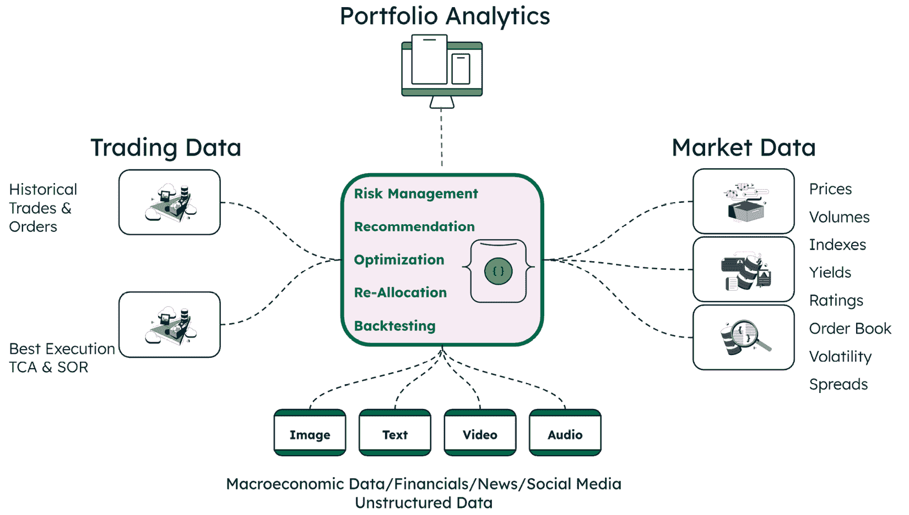

图 11.10：投资组合分析

此图展示了现代投资组合分析系统的综合架构，展示了中心分析引擎如何整合多样化的数据输入，包括交易数据（历史交易、订单和最佳执行指标）、市场数据（价格、成交量、指数、收益率、评级、订单簿数据、波动性和价差），以及来自多种格式的非结构化宏观经济数据（图像、文本、视频和音频），以提供核心的投资组合管理功能，包括风险管理、推荐生成、优化、再分配和回测能力，这些能力通过 MongoDB 灵活的模式加速跨各种来源的数据摄取，从而实现智能决策和主动的市场风险缓解。

通过 MongoDB 的灵活模式加速跨各种数据源的数据摄取，如实时市场流、历史表现记录和风险指标。新的投资组合管理解决方案，通过替代数据启用，支持更智能的决策和主动的市场风险缓解。这种范式转变实现了更深入的洞察，增强了 alpha 生成，并提高了资产再分配的精确度，强调了数据在智能投资组合管理中的关键作用。

## MongoDB 如何解锁人工智能驱动的投资组合管理

人工智能驱动的投资组合资产配置已成为现代投资策略的一个理想特性。通过利用基于人工智能的投资组合分析，投资组合经理可以获取到提供针对特定财务目标和风险承受能力的洞察力的先进工具。这种方法通过推荐从股票和债券到**交易所交易基金（ETFs**）和新兴机会的替代资产组合来优化投资组合构建，同时持续评估不断变化的市场条件。

下图展示了人工智能驱动的投资组合管理流程，该流程将包括股价、**波动率指数（VIX**）和宏观经济指标（如 GDP、利率和失业率）在内的多样化市场数据引入人工智能分析层，以生成可操作且更智能的洞察：

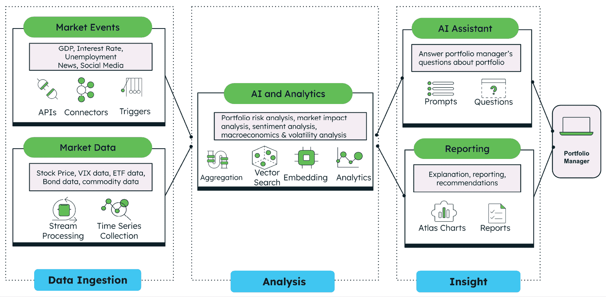

图 11.11：人工智能驱动的投资组合管理流程

此图展示了人工智能驱动的投资组合管理系统端到端架构。它显示了三个阶段的流程，从处理来自市场事件（如 GDP、利率、失业、新闻和社交媒体）的数据摄取和市场数据（如股价、VIX、ETF、债券和商品数据）开始，通过流处理和时间序列收集。然后，它输入到集中的 AI 和数据分析能力（如使用聚合、向量搜索、嵌入和数据分析进行的投资组合风险分析、市场影响分析、情绪分析、宏观经济分析和波动率分析）。最后，通过 AI 助手（如通过提示和查询回答投资组合经理的问题）和全面报告（通过 Atlas 图表和报告的解释和建议）提供可操作的洞察，以实现投资组合经理的智能、数据驱动的投资决策。

MongoDB 的多功能文档模型为存储和检索结构化、半结构化和非结构化数据提供了一种更直观的方式。这与开发者构建应用程序内部对象的方式相一致。

在资本市场中，时间序列通常用于存储基于时间的交易数据和市场数据。MongoDB 时间序列集合非常适合分析随时间变化的数据。它们设计用于高效地以高性能和动态可伸缩性摄取大量市场数据。由于底层摄取和检索机制的快速，从 MongoDB 时间序列集合中发现洞察力和模式更加容易和高效。

通过利用 MongoDB Atlas Charts 的商业智能仪表板和评估高级 AI 生成的投资洞察力，投资组合经理可以访问集成来自不同数据集的高维洞察力的复杂功能，揭示可能导致增强决策、alpha 生成和更高投资组合绩效的新模式。

MongoDB Atlas 向量搜索在市场新闻情感分析中发挥着关键作用，通过启用相关新闻文章的上下文感知检索。传统的基于关键词的搜索往往无法捕捉新闻故事之间的语义关系，而由嵌入模型驱动的向量搜索允许对不同文章如何与股票情感相关联有更语境化的理解。以下能力为市场新闻情感分析提供了一种更上下文感知和准确的方法：

+   **将新闻存储为向量**：当摄取与股票相关的新闻时，每篇新闻文章都使用嵌入模型将其矢量化为一个高维数值表示。这些嵌入封装了文本的意义和上下文，而不仅仅是单个单词。原始新闻文章被嵌入并存储在 MongoDB 中作为向量。

+   **查找相关新闻**：向量搜索用于根据相似性算法查找新闻文章，即使它们不包含完全相同的股票信息。这有助于根据上下文相似性在多篇文章中识别模式和趋势。

+   **增强情感计算**：不是依赖于单一的新闻情感，而是从多个相关新闻文章中聚合最终的情感得分，这些文章具有相似和相关的内容。这防止了单个异常新闻文章影响结果，并提供了对市场新闻情感的更全面视角。

MongoDB Atlas 向量搜索通过超越简单的关键词，捕捉更深层次的上下文和关联，从而将市场新闻情感分析提升到新的高度，为更明智、更可靠的洞察力提供支持，以做出更好的投资决策。

## 智能投资组合管理，配备 AI 代理

AI 代理旨在通过从基于规则的决策转向自适应、情境感知和 AI 驱动的决策来革新投资组合管理。AI 赋能的投资组合管理应用持续学习、适应和更主动、更有效地优化投资策略。未来不是 AI 取代投资组合经理，而是人类与 AI 合作，创建更智能、自适应和风险意识强的投资组合。利用 AI 的投资组合经理将获得竞争优势和更深入的见解，从而显著提升投资组合表现。

在*图 11.12*中展示的解决方案包括一个数据摄取应用、三个 AI 代理和一个市场洞察应用，它们协同工作，为投资组合管理创造一个更智能、以洞察力驱动的途径。

数据摄取应用持续收集市场数据，将其作为时间序列或标准集合存储在 MongoDB 中。摄取的数据集包括以下内容：

+   **市场数据**：收集和处理实时市场数据，包括价格、成交量、交易活动和 VIX

+   **市场新闻**：捕捉和提取与市场和股票相关的新闻。新闻数据被矢量化并存储在 MongoDB 中

+   **市场指标**：检索关键宏观经济金融指标，如 GDP、利率和失业率

市场分析代理和市场新闻代理具有 AI 分析工作流程。它们根据每日日程以完全自动化的方式运行，生成预期的输出并将其存储在 MongoDB 中。市场助理代理具有更动态的工作流程，旨在扮演投资组合经理的助手角色。它基于提示工程和代理决策工作。市场助理代理能够根据当前市场条件回答关于资产再分配和市场风险的问题，并将新的 AI 驱动的见解带给投资组合经理。

每个代理在整体工作流程中扮演着独特的角色，以产生智能见解：

+   **市场分析代理**：分析市场趋势、波动性和模式，以生成与投资组合资产风险相关的见解

+   **市场新闻代理**：通过分析直接影响和间接影响投资组合表现的新闻，评估每个资产的新闻情绪。此代理由 MongoDB 矢量搜索赋能

+   **市场助理代理**：根据需求和使用其他代理创建的数据和见解，通过提示回答投资组合经理关于市场趋势、风险敞口和投资组合配置的问题

市场洞察应用是一个可视化层，为投资组合经理提供图表、仪表板和报告，其中包括由 AI 代理生成的系列可操作投资见解。这些信息基于预定的每日日程自动生成，并呈现给投资组合经理。

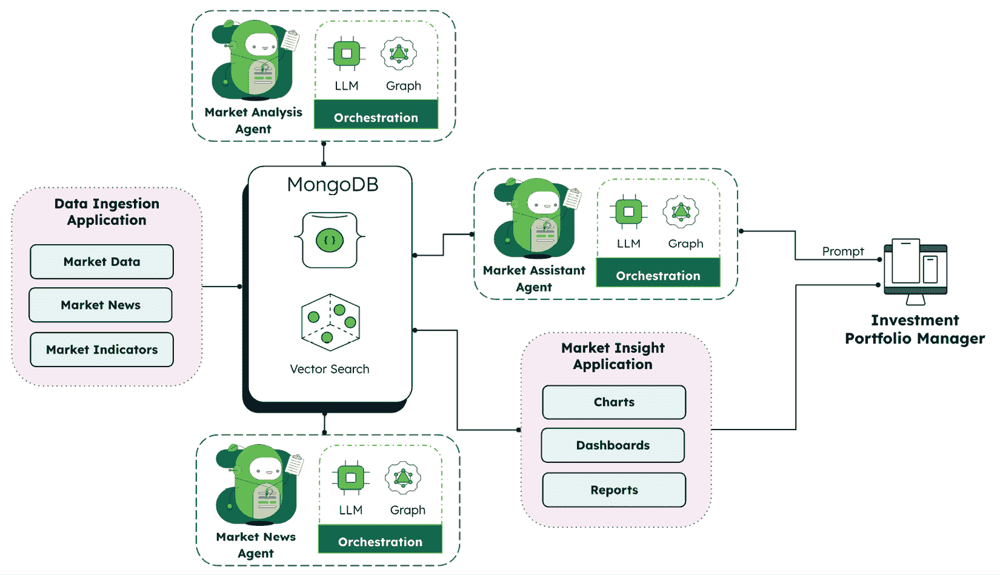

如此所示，投资组合管理是由 MongoDB 人工智能代理驱动的，展示了如何通过专门的 AI 代理（市场分析代理、市场助手代理和市场新闻代理）利用 LLM 和图编排能力处理来自数据摄取应用（市场数据、新闻和指标）的数据，通过 MongoDB 的向量搜索功能，实现与市场洞察应用（图表、仪表板和报告）的无缝集成，通过一个结合实时数据处理、高级分析和对话界面的统一人工智能生态系统，为投资组合经理提供智能、即时驱动的响应，以增强投资决策。

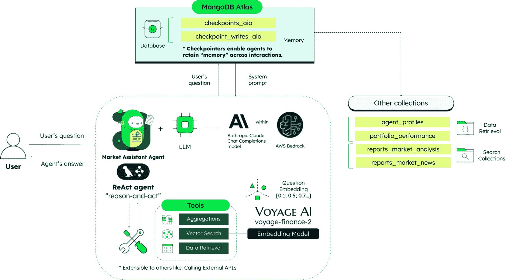

图 11.13：市场助手 ReAct 代理架构

人工智能代理使投资组合经理能够通过分析市场条件对投资组合及其投资目标的影响，采取智能和基于风险的方法。人工智能代理利用 MongoDB 强大的功能，包括聚合框架和向量搜索，结合嵌入和生成式 AI 模型，进行智能分析和提供有洞察力的投资组合推荐。

更多关于人工智能代理的详细信息，请参阅*第二章*，*什么是生成式 AI、RAG 和代理式 AI 的区别*。

## 人工智能在金融服务中的扩展作用

在我们结束本节时，很明显，人工智能是一个强大的力量，正在重塑金融服务的前景，MongoDB 正在推动人工智能转型之旅。人工智能的成功是正确数据架构、可扩展性、质量、可访问性和敏捷性的函数。MongoDB 灵活的文档模型、向量搜索和全面的开发者数据平台为人工智能应用提供了基础。从实验到企业采用的人工智能转变需要战略性地重新思考数据、模型和决策如何在组织中流动。无论你是推动创新、管理风险还是构建下一代客户体验，未来十年领先的金融机构不仅会采用人工智能；它们会将人工智能嵌入到每一个决策、每一个产品和每一次客户互动中。

随着代理人工智能的兴起，金融服务机构有巨大的潜力重新定义如何更智能地管理风险、优化复杂的工作流程，并交付高度个性化的客户体验。随着自主人工智能代理的进步，它们提供了将决策从被动转变为主动、结合推理和行动的潜力，超越了仅仅是对数据的响应，进入对因果关系更深入的理解，赋予金融机构更高的精度和更智能的解决方案。展望未来，那些有效利用人工智能潜力的人将处于领先地位，引领快速发展的金融服务领域，设定新的敏捷性、创新和客户信任标准。

以下是一些人工智能如何改变金融服务领域的额外示例：

+   **高级客户行为和 KYC 分析**：向量搜索通过将行为模式与包括电子邮件、社交媒体活动和交易叙述在内的非结构化数据源相关联，实现复杂的客户画像。这提供了对客户风险配置文件的更深入见解，并使身份验证过程更加准确。

+   **智能市场研究**：人工智能系统可以通过搜索大量的研究报告、收益电话、监管文件和新闻来源，快速综合市场情报。语义相似性使分析师能够在不同的市场细分和地理区域发现非显而易见的联系和新兴趋势。

+   **大型文档智能用于监管文件**：人工智能驱动的文档处理改变了金融机构处理复杂监管提交的方式。系统可以自动提取、验证和交叉引用数百页监管文件中的数据，确保合规性，同时将手动审查时间从数周缩短至数小时。

+   **人工智能驱动的金融应用程序代码生成**：开发团队利用人工智能通过生成符合规定的代码片段、API 集成和监管验证逻辑来加速金融应用程序的创建。这使新金融产品的部署更加迅速，同时保持严格的安全和合规标准。

+   **零售银行业务动态产品定价**：通过人工智能驱动的实时定价，银行能够根据市场条件、服务成本和客户行为即时调整费用和返利。通过分析实时数据，人工智能可以优化定价以增强竞争力、盈利性和响应速度，确保在动态支付环境中保持灵活性。

+   **财务流动性现金流预测**：使用人工智能驱动的仪表板进行动态现金流定位，提供实时现金流可见性和预测。通过在情景分析和建模各种经济条件时利用人工智能，银行可以主动调整资金策略。

+   **支付智能路由**：人工智能驱动的支付智能路由利用动态决策和持续学习，实时智能优化每一笔交易。人工智能分析多个条件、费用、汇率和历史模式，主动选择最有效和成本效益最高的路线。随着支付生态系统变得更加复杂和全球化，更智能的人工智能驱动路由对于应对不断变化的法规、不断增长的交易量以及日益增长的对速度、成本效率和可靠性的需求至关重要。

这些新兴应用展示了人工智能如何持续推动金融服务领域的可能性边界，使机构能够以前所未有的智能、效率和客户关注度进行运营。

如需更多信息及资源，请访问[`www.mongodb.com/solutions/industries/financial-services`](https://www.mongodb.com/solutions/industries/financial-services)上的*MongoDB for Financial Services*页面。

# 摘要

在本章中，我们探讨了人工智能对金融服务行业的变革性影响，追溯了其从预测分析到生成式人工智能，再到代理式人工智能的演变。我们看到了这些技术如何正在革命性地改变企业知识管理、客户体验、金融犯罪预防、ESG 分析、信贷申请和支付处理。

金融服务行业正处于一个关键时刻，人工智能不仅正在增强现有流程，而且从根本上重新构想了金融机构的运营和价值交付方式。从提供个性化客户支持的人工智能聊天机器人到能够预测新攻击向量的复杂欺诈检测系统，人工智能正在实现前所未有的效率、个性化和安全性。

展望未来，代理式人工智能的持续发展预示着更加深刻的变化，具有感知、推理和在一定参数内行动的自主系统。这些智能代理将越来越多地作为数字关系经理、虚拟合规官员和自动化风险分析师，与人类专家并肩工作，为金融机构及其客户创造更好的结果。

这一转型的基础是底层数据基础设施。现代、灵活的数据平台，如 MongoDB，为人工智能系统提供了访问、分析和实时采取行动的多样化数据的基础。将特定领域的智能，如金融专业嵌入模型，进一步提高了人工智能在此高度监管行业中的应用的准确性和相关性。

正如我们从各种案例研究中看到的，从亚洲银行的 GenAI 聊天机器人到 Ambee 的气候数据平台，再到 Base39 的信用分析解决方案，那些拥抱 AI 并建立在稳健数据基础上的金融机构正在获得显著的竞争优势。他们能够更快地做出更好的决策，提供更加个性化的客户体验，并更有信心地应对复杂的监管环境。

随着我们进入下一章，关于保险，我们将看到许多相同的 AI 技术和方法是如何应用于转变金融服务业的另一个关键领域，该领域具有其独特的挑战和机遇。

# 参考文献

1.  *Celent 报告：利用 AI 在支付中的优势*：[`www.mongodb.com/resources/solutions/use-cases/celent-report-harnessing-the-benefits-of-ai-in-payments`](https://www.mongodb.com/resources/solutions/use-cases/celent-report-harnessing-the-benefits-of-ai-in-payments)

1.  *揭秘 AI 代理：初学者指南*：[`www.mongodb.com/resources/basics/artificial-intelligence/ai-agents`](https://www.mongodb.com/resources/basics/artificial-intelligence/ai-agents)

1.  *AI 中的智能代理真的可以独立工作。这是如何做到的*：[`www.gartner.com/en/articles/intelligent-agent-in-ai`](https://www.gartner.com/en/articles/intelligent-agent-in-ai)
