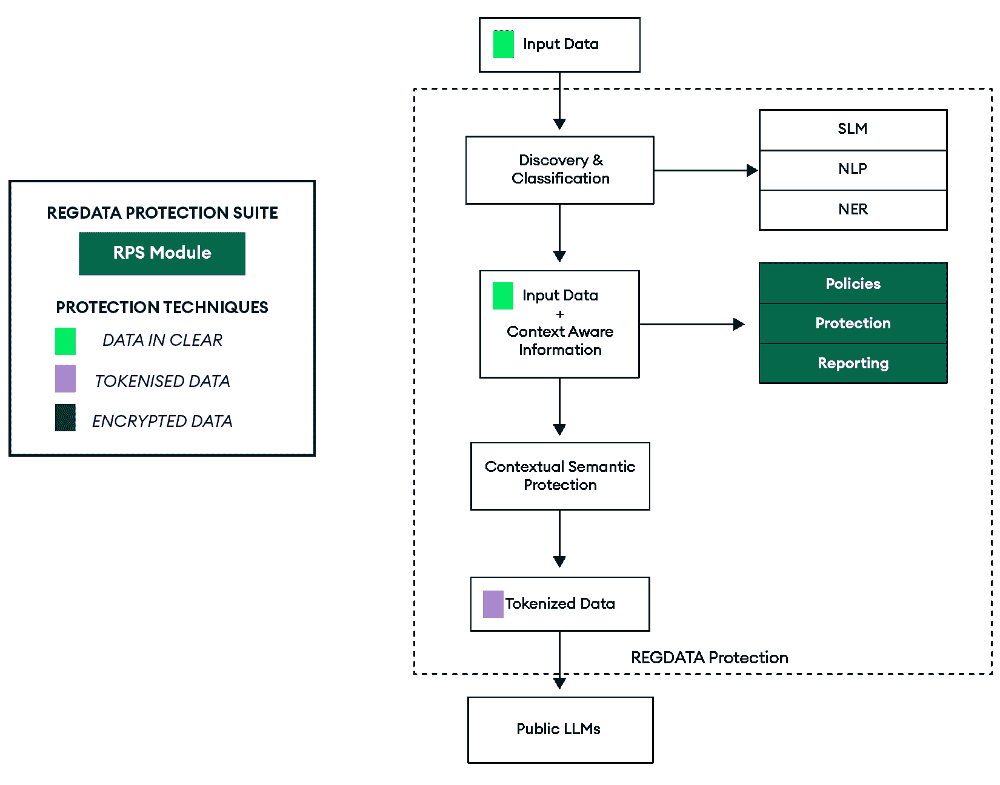
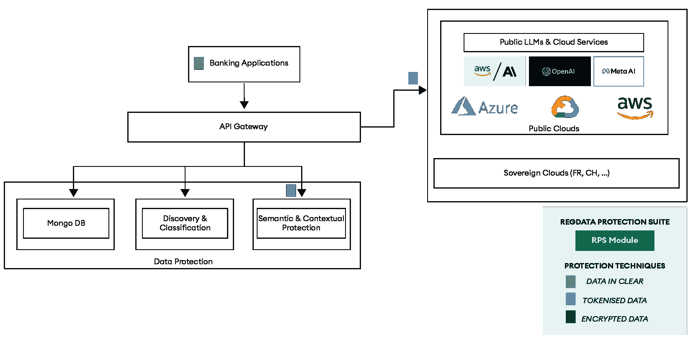
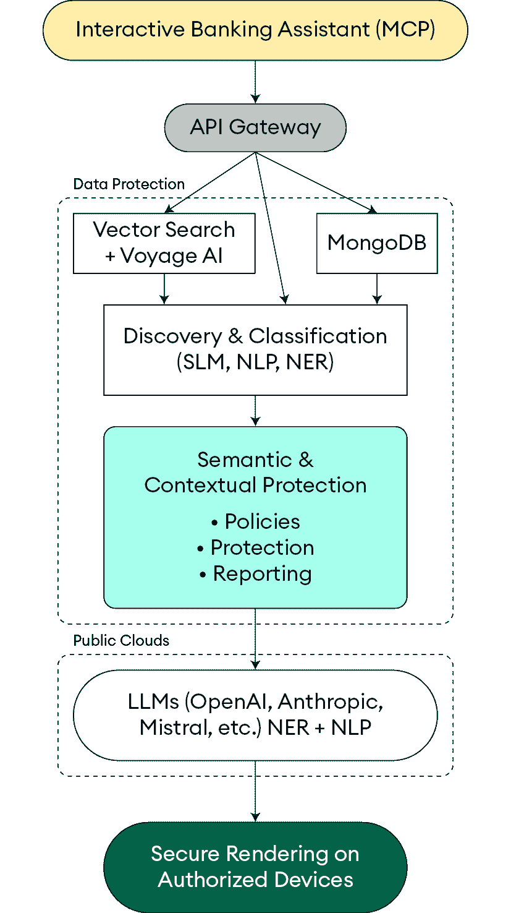
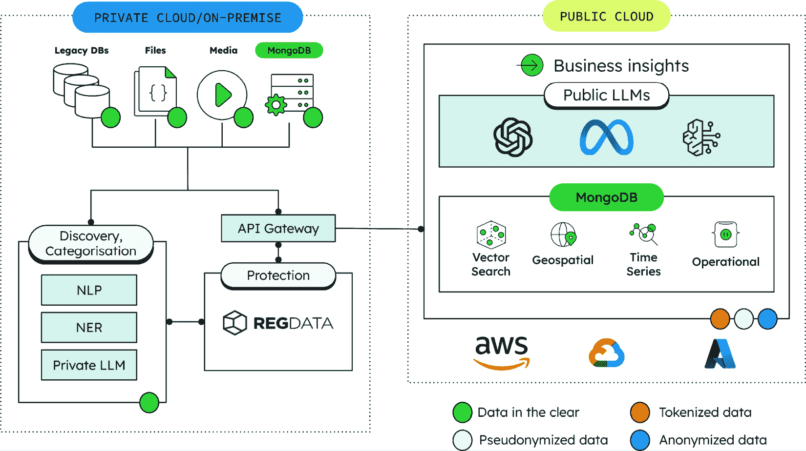
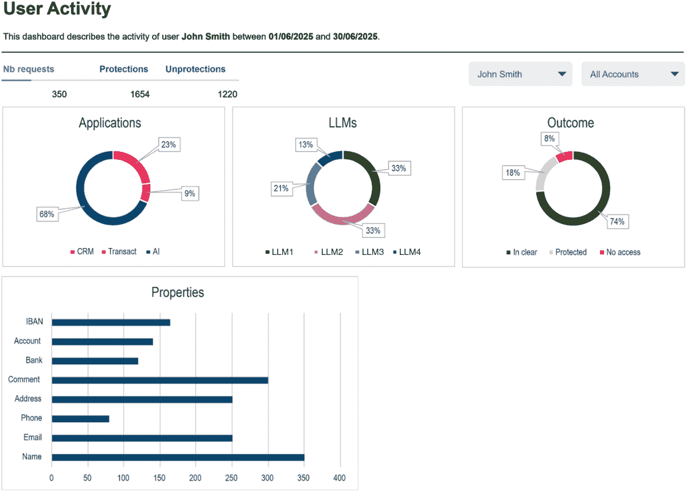

# 第十二章：RegData、MongoDB 和 Voyage AI：金融服务业的语义数据保护

人工智能已成为现代银行转型中越来越重要的部分。然而，随着全球金融服务行业（**FSI**）拥抱人工智能技术，它面临着一项关键挑战：如何在不损害定义金融行业的隐私、合规性和控制要求的情况下利用人工智能。

本章探讨了 MongoDB、RegData 和 Voyage AI 如何通过语义数据保护形成一个强大的联盟来应对这一挑战，这是一种复杂的方法，允许金融机构在执行严格的数据安全标准的同时，保持人工智能输出的质量和效用。它还支持人工智能代理的安全部署，这些代理越来越多地在复杂的金融工作流程中自主处理受监管的信息。这些技术共同提供了一种针对金融服务中人工智能高安全、高风险需求的综合解决方案。

到本章结束时，你将理解以下内容：

+   为什么传统的保护方法，如加密和屏蔽，在人工智能驱动的金融服务中不足

+   语义数据保护如何在保护意义、上下文和格式的同时，不暴露敏感数据

+   金融机构安全人工智能架构的核心组件，从令牌化到提示装饰

+   如何在金融人工智能应用中通过特定领域的嵌入提高保护和性能

+   人工智能代理的安全部署模式，包括**模型上下文协议**（**MCP**）和混合云策略

+   与 GDPR、FINMA 和欧盟人工智能法案等框架对齐的合规策略

# 金融人工智能中的数据保护困境

金融机构处于两种强大但看似矛盾的力量交汇处：利用人工智能进行创新的驱动和保护敏感数据的命令。银行和金融服务公司拥有大量高度监管的信息库，从**个人身份信息**（**PII**），包括姓名、地址和社会安全号码等可以识别个人的数据，到**客户识别数据**（**CID**），指的是任何可以用来识别特定客户或客户的信息，以及交易历史。这些数据既是他们人工智能创新的最大资产，也是他们最大的脆弱性。如果处理不当，它可能导致欺诈、隐私侵犯或昂贵的监管罚款。如果过于严格地锁定，它将无法用于创新。

传统的数据安全方法，如完全加密、数据遮蔽和受限访问，通常会使数据对人工智能应用不可用或显著降低人工智能输出的质量。当金融机构试图利用基于云的人工智能服务时，他们面临额外的挑战，因为敏感数据可能会离开他们的控制环境，使他们面临违规和安全隐患。

这种困境为金融服务中人工智能的采用设置了重大障碍。根据行业研究，许多金融机构将数据安全和合规问题列为实施高级人工智能解决方案的主要障碍。后果是严重的：创新受限、竞争劣势以及无法提供客户日益期望的个性化、智能服务。

传统数据保护方法在人工智能环境中存在不足，原因有几个关键点：

+   **上下文丢失**：遮蔽或加密剥夺了人工智能模型生成有意义输出所需的语义关系和上下文。例如，一个欺诈检测系统将无法看到标记可疑行为的消费模式。

+   **二分法**：传统方法通常采取全有或全无的方法；要么数据完全可访问，要么完全受限，没有中间地带供人工智能处理。例如，要么每个分析师都能看到客户的完整 SSN，要么没有人能看到，这两种方法都不适用于人工智能处理。

+   **静态保护**：数据保护固定的规则无法适应人工智能交互和用例的动态、上下文性质。考虑一个在训练期间有效但在模型在生产中遇到新颖输入时失败的规则。

+   **效用降低**：过于强硬的保护技术显著降低了人工智能输出的质量和相关性。在这种情况下，洞察变得如此泛泛，以至于它们不再帮助关系经理或产品团队。

这些不足解释了为什么传统方法与金融人工智能的需求不兼容，并指出了新范式——语义数据保护的必要性。

# 理解 MongoDB、RegData 和 Voyage AI 的语义数据保护方法

将 MongoDB、RegData 和 Voyage AI 的集成代表了金融机构在保护敏感信息的同时保持人工智能功能的一种范式转变。与仅关注隐藏或限制数据的传统方法不同，这种综合解决方案在替换敏感值的同时，保留了信息的意义、上下文和格式。

MongoDB 通过其文档模型和 Atlas 向量搜索功能提供了一种灵活、可扩展的数据基础。RegData 贡献了其先进的保护方法和合规专业知识。Voyage AI（被 MongoDB 收购）提供了解释金融术语和概念的特定领域嵌入。它们共同创造了一种全面的方法来应对金融服务中 AI 安全的独特挑战。这个联盟使银行在监管审查下采用 AI 变得实用，而非理论化。

## 什么是语义数据保护？

语义数据保护保护信息的**意义**和**上下文**，而不仅仅是其原始值或表面格式。虽然传统数据保护方法（如加密、掩码和访问控制）通常侧重于保护数据值或格式，但语义数据保护则更深入。它以保留格式、关系和监管上下文的方式替换敏感值，从而使 AI 系统保持有用性，而不暴露真实身份。

语义数据保护的核心原则包括以下内容：

+   **语义保护**：保护保持语义或原始数据。一个电话号码被另一个电话号码所替代；一个城市名称被另一个城市名称所替代。

+   **上下文语义保护**：保护依赖于数据的含义和用法，而不仅仅是其类型或标签。例如，一个电话号码可能根据它是个人、与业务相关还是公共的而以不同的方式处理。一个城市的名称可能被替换为同一司法管辖区内的城市名称，在那里将适用相同类型的法律。

除了这些基础方法之外，语义数据保护还纳入了几个额外的复杂功能。数据分类和控制由语义敏感性而非简单的数据类型决定，确保保护级别与信息的实际风险和重要性相匹配。系统利用诸如本体、分类法或知识图谱之类的语义模型来定义数据关系和含义，使复杂数据生态系统中的一致政策执行成为可能。此外，数据治理变得真正具有上下文性，使用户用规则根据数据的上下文含义、用户角色、预期用例以及适用的监管框架（如 GDPR、FINMA 或 HIPAA）动态适应。

图 12.1：语义数据保护框架架构和数据流

此图展示了语义数据保护框架的关键组件，展示了数据如何在发现、分类、保护和安全处理阶段流动，同时保持语义完整性。它展示了敏感信息在保留上下文和格式的同时被转换，使 AI 系统能够在不损害安全或输出质量的情况下处理受保护的数据。

**发现与分类**模块分析输入数据以识别任何敏感信息，对其进行适当的分类，并理解查询的上下文和范围。基于这些发现，数据保护模块应用最合适的保护技术来保护敏感数据，确保所选方法与发现和分类模块提供的分类和上下文理解相一致。数据保护模块负责保护输入中包含的敏感数据。基于**发现与分类**模块确定的分类和上下文，选择最合适的技巧来保护敏感数据。

RegData 支持保留信息格式或类型的技巧（例如，匹配**国际银行账户号码**（**IBAN**）格式和校验和，或用一个国家的城市名称替换另一个城市名称）。通过增加语义逻辑，它现在可以根据对信息的理解来选择技术。输出是经过标记的数据，可以被公共 LLMs 处理，同时不泄露 PII。

## 语义数据保护的关键技术

金融服务中的语义数据保护依赖于旨在保护敏感信息同时保留其有用性的高级技术。让我们更详细地看看这些技术。

### 格式保留标记化

其中一种方法是*格式保留标记化*，它用保持相同格式（长度、字符类别、模式）的代理标记替换敏感数据。例如，一个像**CH93 0076 2011 6238 5295 7**这样的 IBAN 号码可能被替换为**CH93 [BANK_TOKEN_001]**，其中标记保留了格式，同时隐藏了实际的账户详情。这种技术在金融数据（如账户号码、信用卡号码、IBAN 和路由代码以及交易 ID）方面尤其有价值。

### 上下文语义保护

另一种强大的方法是*上下文语义保护*，它将真实实体映射到一致的化名，这些化名在数据中具有相同的类型和角色。例如，让我们关注一个搬迁申请。这个申请包含有关人们的位置信息：他们从哪里搬走以及他们要搬到哪里。如果我们只对隐藏位置感兴趣，那么语义保护就足够了。我们会用其他随机城市名称替换城市名称，或者用目标国家所在国家的城市名称替换。

但如果我们对提供建议或在估计搬迁成本（包括生活成本以及将在目标位置适用的当地税收）感兴趣，那么随机化名将无法提供建议。这就是上下文语义保护发挥作用的地方。目标城市的名称将被伪匿名化为另一个城市，在那里将适用相同的规则或税收。 

例如，问题：“如果约翰·史密斯搬到苏黎世，税收会增加多少？”可能会被匿名化成“如果马库斯·里德搬到艾尔萨乌，税收会增加多少？”在这个转换中，语义得到了保留。*马库斯·里德*作为一个个人（单个客户）被清楚地识别出来。艾尔萨乌是一个合法的城市名称，艾尔萨乌的税收规则与苏黎世的规则一致。

我们还可以考虑银行转账，其中我们可以使用格式保留方案对 IBAN 值进行匿名化。在上下文语义保护中，我们会选择符合某些公司规则的目标匿名化 IBAN。例如，一个欧洲国家的 IBAN 会被替换为另一个欧洲国家的**IBAN**，而美国的 IBAN 会被替换为**另一个美国的 IBAN**。

例如，所有客户名称都可能被替换为一致的匿名名称，以保留他们作为人的身份，同时隐藏他们的真实身份。

通过保持要保护的数据之间的一致关系，我们允许 AI 模型生成有意义的见解，同时不暴露真实身份。

### 基于标记类的语义分区

这种技术将标记分类到语义桶（PII、客户标识符、财务、位置等）中，并为每个类别使用其自己的命名空间进行标记化。以下是一些示例：

+   [PII_001] 用于 PII

+   [CID_017] 用于 CID

+   [FIN_042] 用于财务信息

基于标记类的语义分区允许基于数据类型和上下文实现细粒度保护策略，同时仍然使 AI 模型能够理解每个标记的语义角色。

### 确定性标记

确定性标记化确保相同的输入总是产生相同的标记（例如，`Alice`总是映射到相同的标记）。这种一致性对于多步推理或对话至关重要，其中模型必须识别交互之间的引用。例如，如果客户在一则消息中询问“我的 UBS 账户”，然后在后续消息中将其称为“那个账户”，确定性标记确保 AI 理解这两个引用都指向同一个实体，从而保持连续性。

## 构建全面的语义保护架构

有效的语义数据保护不仅限于个别技术；它需要一个整体架构，该架构与金融机构 AI 生态系统的所有组件集成。MongoDB、RegData 和 Voyage AI 联盟在这方面开创了全面的方法，开发了一个端到端架构，解决了安全性和合规性的全面挑战。本节概述了这一集成语义保护框架的关键组件。

图 12.2：端到端语义保护架构

此图展示了通过语义保护的人工智能系统中的数据完整流程，从初始数据摄取到通过云人工智能服务处理，再到安全输出渲染。可视化突出了银行系统、保护层、API 网关和云服务之间的集成点，展示了敏感数据在整个生命周期中如何保持保护状态。

输入数据可以是多种类型，并可能来自不同的来源，例如文件、数据库、应用程序和音频文件。对公共 LLM 的调用通常是通过 API 网关的 API 调用完成的。API 网关确保在发送到公共 LLM 之前保护 PII。因此，网关使用保护服务对敏感数据进行分类和保护。数据保护模块在发送到 LLM 之前用标记化数据替换敏感字段。

### MongoDB 作为基础，结合 RegData 的数据安全平台

MongoDB 是该集成解决方案的基础数据平台，RegData 的**数据安全平台**（**DSP**）提供专业的保护层。这种组合提供了以下功能：

+   **统一数据存储**：MongoDB 的灵活文档模型将结构化、半结构化和非结构化数据存储在单一平台上，消除了孤岛并简化了架构

+   **发现和分类**：RegData 使用先进的 NLP 和**命名实体识别**（**NER**）技术自动识别非结构化内容中的敏感数据，这是一种识别和分类文本中特定实体的技术

+   **可扩展性能**：MongoDB 的分布式架构确保解决方案可以处理任何规模的数据，从数千到数十亿条记录

+   **保护技术选择**：根据数据类型和上下文智能应用最合适的保护方法

+   **令牌保险库管理**：安全存储原始值与其标记表示之间的映射

+   **策略执行**：在所有人工智能交互中一致应用保护策略

一起，MongoDB 和 RegData 为金融服务提供了一个弹性且智能的骨干，使机构能够统一其数据，执行强大的保护策略，并加速人工智能的采用，而不会牺牲安全性。

### 带有 MongoDB 和 RegData 提示装饰的 API 网关

集成解决方案具有一个 API 网关，充当金融应用程序和人工智能模型之间的智能 AI 感知安全中间件（连接不同应用程序的中间软件）。MongoDB 提供数据基础设施，而 RegData 贡献了提示装饰功能：

+   **MongoDB Atlas 作为数据枢纽**：作为通过 API 网关流动的所有数据的中央存储库，确保一致性和持久性

+   **提示装饰**：RegData 的包装层在将提示（提供给 AI 模型的指令）发送到 AI 模型之前对其进行修改、注释或增强

+   **规范化**：标准化语义标记和包装的格式，以确保一致的处理

+   **保护应用**：在向云基础 AI 模型发送请求之前应用所有必需的保护技术

+   **MCP**：一个标准化的框架，定义了如何在用户会话、AI 模型和后端系统之间传递上下文（关于对话或任务的相关信息）

通过将 MongoDB 的集中式数据基础设施与 RegData 的智能提示处理相结合，该解决方案在金融系统和模型之间创建了一个安全、AI 就绪的桥梁，简化了交互，同时在每一步保护敏感内容。

### 使用 MongoDB Atlas 和 Voyage AI 进行受保护的向量搜索

MongoDB Atlas 向量搜索，结合 RegData 的保护技术和 Voyage AI 的特定领域嵌入，创建了一个强大的受保护搜索能力，这对于金融 AI 应用中的 RAG 至关重要：

+   **MongoDB Atlas 向量搜索**：提供存储和查询数十亿向量并实现亚秒级性能的基础设施

+   **Voyage AI 的金融嵌入**：生成理解金融术语和概念的特定领域向量表示

+   **RegData 的标记嵌入**：以标记形式存储文档和数据的向量嵌入（捕获语义意义的文本的数值表示）

+   **语义保留**：确保即使表面文本被屏蔽，向量相似性仍然有效

+   **情境回忆**：允许 AI 记住[ADDR_42]与其他地址在语义上相似，而不暴露实际地址

这种集成方法提供了一种高性能、隐私保护向量搜索，适用于金融环境，允许 AI 系统检索细微、领域感知的见解，同时将所有敏感细节保密。

### 安全输出渲染

最后一个组件确保受保护的数据仅在适当的情况下被揭示：

+   **令牌重映射**：在授权设备或安全环境中，令牌被映射回其原始值

+   **情境授权**：根据用户角色、位置和目的授权访问原始值

+   **审计日志**：记录对原始值的所有访问，以进行合规性和安全监控

最后的保障措施确保只有在满足条件时才会透露敏感信息，在保持合规性和信任的同时，授权用户访问他们所需的数据；不多也不少。

## 针对特定领域的智能，以增强安全和性能

虽然语义保护为金融服务中的安全 AI 提供了基础，但特定领域的智能将安全和性能提升到了新的水平。如在第十一章*“金融服务与 AI 的下一波”*中详细探讨的那样，金融服务涉及专业语言、复杂法规和细微的概念，这些是通用 AI 模型往往难以准确解释的。

### 利用金融特定嵌入进行增强保护

MongoDB、RegData 和 Voyage AI 的集成建立在第十一章*“金融服务与 AI 的下一波”*中详细描述的特定领域嵌入能力之上。通过整合 Voyage AI 的金融特定嵌入模型，语义保护框架获得了几个关键优势：

+   **增强检测精度**：金融嵌入更好地识别需要保护的安全信息，提高了 RegData 分类系统的精确度

+   **上下文保护**：特定领域的理解使基于金融上下文的保护决策更加细腻，而不是简单的模式匹配

+   **改进检索质量**：与 MongoDB Atlas Vector Search 结合使用时，金融嵌入确保受保护的搜索保持相关性和准确性

这种方法在通用模型之上实现了显著的性能提升，尤其是在合规相关任务和敏感数据识别方面。它确保语义保护不仅安全，而且还能保持金融机构对有效 AI 应用所需的高质量、上下文相关的输出。将 RegData 的保护技术与金融特定智能相结合，为要求严格的金融服务环境提供了一个全面的解决方案，该解决方案解决了安全和性能需求。

### 现实世界的创新：互动银行

为了说明集成的 MongoDB、RegData 和 Voyage AI 解决方案在实际中的应用，让我们考察一个私人银行为其**超高净值**（**UHNW**）客户提供数字通用人工智能（GenAI）驱动的聊天助手的用例场景。这种实施展示了将 MongoDB 的数据平台、**RegData 的保护套件**（**RPS**）和 Voyage AI 的特定领域嵌入相结合以在高度监管的环境中实现安全且有效的 AI 交互的力量。

银行的超高净值（UHNW）客户使用 AI 银行助手完成各种任务：

+   检查账户余额和交易历史

+   请求转账（例如，*将 30 万瑞士法郎转账给我的律师*）

+   接收市场警报和投资洞察

+   检查投资组合表现和资产配置

+   安排与客户经理的会议

这些交互涉及高度敏感的数据：账户号码、交易历史、个人标识符和行为模式。通过基于云的 GenAI 模型处理这些数据可能会将其暴露给第三方平台，可能违反法规并损害客户机密性。那么我们如何在保护高度敏感数据的同时利用公共 GenAI 服务或 LLM 模型呢？

图 12.3：交互式银行系统工作流程和用户界面组件

此图展示了语义保护银行助手的综合架构，展示了客户查询如何通过多个保护层处理，然后到达 AI 模型。系统集成了 MongoDB 的数据平台、Voyage AI 的特定领域嵌入和 RPS，以提供语义和上下文保护。

该架构展示了语义保护如何维护数据意义和格式（用语义等价令牌替换敏感值），同时上下文保护根据数据使用、用户角色和监管要求调整安全措施。客户查询通过 API 网关流向**发现与分类**层（利用 SLM、NLP 和 NER 技术），然后通过集成了策略、保护机制和报告能力的**语义与上下文保护**模块。

受保护的数据随后由公共云 LLM 处理，响应安全呈现，仅在授权设备上显示原始值。可视化突出了整个对话流程中敏感金融信息的端到端保护，确保合规性同时保持 AI 驱动的银行交互的质量和实用性。

下面是如何通过 MongoDB、RegData 和 Voyage AI 的集成实现安全且有效的 AI 交互：

+   **数据发现与分类**：当客户说*将 20 万瑞士法郎转账给 Pierre*时，系统使用 RegData AI 驱动的 PII 识别和 Voyage AI 的特定金融模型将*Pierre*识别为 PII，将*200K CHF*识别为需要保护的金融信息。

+   **使用 RegData 进行语义数据保护**：在将详细信息发送到 GenAI 模型之前，**RegData 保护套件（RPS**）应用以下操作：

    +   **保留语义的保护**：*我想知道，如果我想将 20 万瑞士法郎转账到这个 IBAN CH93 0076 2011 6238 5295 7，费用和条件是什么？*变为*我想知道，* *费用，* *和条件，* *如果我想将 20 万瑞士法郎转账到* *CH2008770435380216999？*

    +   **上下文语义保护**：*提供我 UBS 账户上所有交易列表*变为*提供我* *Bank_CH 账户* *上所有交易列表*

    +   **确定性令牌**：*Pierre*始终映射到*Jacques*，而*IBAN CH2008770435380216999*始终映射到 CH93 0076 2011 6238 5295 7，在所有交互中

+   **MCP 的提示装饰**：提示装饰器确保 GenAI 模型仅接收受保护的令牌，并相应地处理它们，同时通过 MCP 保留其语义意义

+   **使用 MongoDB Atlas 的受保护向量搜索**：当客户询问“我上个月在慈善活动上花了多少钱？”时，系统使用 Voyage AI 将受保护的查询转换为向量（文本的数学表示）。MongoDB Atlas 向量搜索在标记化交易数据中找到类似的内容，RegData 确保仅检索受保护的数据，而不暴露实际交易细节

+   **安全的输出渲染**：在客户的授权设备上，应用程序将令牌重新映射到真实值（例如，雅克 → 皮埃尔）。客户看到自然流畅的响应，其中包含实际数据，而 AI 模型仅处理受保护的令牌

这种集成的 MongoDB、RegData 和 Voyage AI 实现带来了显著的好处：

+   **合规性**：通过从不向第三方 AI 提供商暴露敏感数据，满足 FINMA（瑞士金融市场监督局）、GDPR 和其他法规的要求

+   **增强的用户体验**：即使在底层保护的情况下，客户也能收到个性化的、上下文感知的响应

+   **运营效率**：关系经理专注于高价值活动，而 AI 处理常规查询

+   **可扩展的安全性**：MongoDB 的分布式架构与 RegData 的保护相结合，确保解决方案可以扩展以处理不断增长的 AI 用例，而不会损害数据保护

+   **优越的相关性**：Voyage AI 的特定领域嵌入确保响应与金融环境高度相关

这些核心能力构成了基础，而高级技术可以在此基础上构建，以解锁更大的可能性

# 使用高级技术和新兴标准构建未来

随着金融机构继续提升其 AI 能力，一些新兴的技术和标准正在塑造语义数据保护的未来

## MCP

MCP 代表了在 AI 交互中标准化上下文管理方面的重大进步。正如将在*第十九章*中详细阐述的，*展望：超越今天的 AI*，MCP 正在改变 AI 应用程序的构建和集成方式，超越了之前为每个集成创建一次性工具的方法

MCP 为语义数据保护系统提供了几个关键优势：

+   **标准化的上下文管理**：一个一致的框架，用于在用户会话、AI 模型、AI 代理和后端系统之间传递上下文

+   **增强的互操作性**：通过标准化 AI 模型与业务应用程序的交互，消除数据孤岛

+   **减少云处理时间**：更高效的上下文处理减少了敏感数据在云环境中花费的时间

在 MongoDB、RegData 和 Voyage AI 联盟的背景下，MCP 使保护工作流程与人工智能代理和外部系统的集成更加无缝。这种标准化对于需要在整个复杂的、多步骤的人工智能交互中保持上下文，同时确保数据保护保持一致性的金融机构来说尤其有价值。

正如您将发现的，MongoDB 的 MCP 服务器展示了这种集成潜力，使人工智能代理能够直接与 MongoDB 数据库交互，同时尊重现有的访问控制，这对于在代理人工智能环境中保持语义保护是一个关键能力。

## 混合保护策略

建立混合云方法可以通过在私有和公共云环境中实现安全数据处理来增强安全和性能。通过智能数据编排和受保护数据的选择性暴露，混合云架构确保敏感信息保持安全，同时仍支持高级分析和人工智能工作负载。RegData 通过支持混合和多云部署进一步强化了这种方法，使组织能够选择最适合其运营和合规需求的架构。

在此架构中，多层保护通过将结构化和非结构化文档以及知识图谱纳入统一的生态系统框架中发挥关键作用。这种集成确保所有形式的数据都得到一致的保护和授权访问。结果是，一个系统性地保护敏感信息的同时，在多样化的环境中启用人工智能能力，既增强了安全性，又提供了灵活的部署选项。

图 12.4：安全的金融 AI 混合云架构

此图展示了支持在私有/本地和公共云环境中进行安全金融人工智能处理的混合云架构。可视化显示了敏感数据如何在私有云/本地基础设施（包括传统数据库、文件和媒体）中保持保护，同时通过 RegData 保护层利用强大的公共云人工智能服务。API 网关确保只有语义保护的数据（标记化、匿名化或脱敏）进入公共云环境，其中 MongoDB 提供统一的数据编排，公共 LLM 提供高级人工智能能力。这种混合方法通过在整个过程中保持敏感数据的安全，同时通过全面的数据保护访问前沿的云人工智能服务，最大程度地提高了安全合规性和人工智能性能。

## 遵守性和监管考量

金融机构在实施具有语义数据保护的 AI 时必须应对复杂的监管要求。本节概述了关键考虑事项和最佳实践。

### 监管框架对齐

语义保护架构必须与详细说明在*第四章*，“可信 AI、合规性和数据治理”中的复杂监管环境和框架保持一致。正如该章节对不同行业和司法管辖区监管要求的分析所讨论的，组织必须解决多个重叠的监管框架，例如以下内容：

+   **GDPR**：确保以数据最小化和目的限制等原则正确处理个人数据[1]

+   **FINMA**：解决瑞士金融监管机构的数据安全和客户保密要求[2]

+   **MAS**：符合新加坡金融管理局的 AI 治理和数据保护指南[3]

+   **EU AI Act**：符合欧盟对高风险 AI 应用的风险管理、透明度和问责制的要求[4]

+   **ECB**：符合欧洲中央银行的操作弹性标准和数据安全标准[5]

语义保护方法直接支持可信 AI 原则，特别是透明度、问责制和稳健的数据治理，通过确保即使在启用 AI 可解释性和合规性时，敏感数据保护也得到维持。这种一致性展示了技术解决方案如何将伦理和监管框架转化为负责 AI 实施的必要操作化。

### 审计性和可解释性

监管合规性需要全面的审计能力，包括详细访问日志，记录谁访问了特定数据，何时发生访问以及访问的目的。它还要求进行保护验证，以提供证据证明敏感数据在整个 AI 处理过程中得到了适当保护。此外，决策可追溯性至关重要，确保清晰的审计轨迹，记录 AI 生成的建议是如何产生的。

图 12.5：每个用户敏感数据消耗

此仪表板可视化显示了金融机构如何监控和证明其 AI 系统在遵守各种监管要求方面的合规性。界面显示关键指标，包括保护覆盖率、访问日志以及不同法规和数据类型的合规状态。

仪表板显示了特定用户如何获取敏感数据。这可能是当使用内部应用程序，如 CRM 或交易工具，或将数据发送到 LLM 时。

然后，可以知道在哪个 LLM 中使用了这些敏感数据，以及响应中的结果：用户完整访问数据的次数、没有访问数据的次数或仅访问受保护数据的次数。在此屏幕截图中，我们还可以看到用户消耗的敏感数据类型（**姓名**、**电子邮件**、**IBAN**、（自由文本）评论等）。

此仪表板之所以成为可能，是因为 RegData 监控了所有访问敏感数据的请求，以及 RegData 对这些请求的响应。然后可以构建定制的报告，展示敏感数据的合理使用，以及在外部或公共 LLMs 中安全使用敏感数据。

# 摘要

本章展示了 MongoDB、RegData 和 Voyage AI 联盟如何应对金融机构面临的重大挑战：在保持严格的数据保护和监管合规的同时，利用人工智能的能力。您了解了语义数据保护的概念，它超越了传统的加密和掩码方法，这些方法使数据对人工智能应用不可用。语义数据保护在移除或替换敏感值的同时，保留了信息的意义、上下文和格式，使人工智能模型能够生成有意义的输出，而不会损害安全性。

然而，仅凭语义保护对于金融应用中的高质量人工智能输出是不够的。本章强调，上下文语义保护对于提供有意义的 AI 响应至关重要。虽然基本的语义保护只是用语义上等效的替代品替换敏感数据（一个电话号码用另一个电话号码，一个城市名称用另一个城市名称），但上下文语义保护会根据意义和用法上下文进行调整，以保持分析相关性。例如，在搬迁申请中，上下文语义保护会用适用相同税收规则和法规的另一个城市替换目标城市，使人工智能能够提供关于生活成本和地方税收的准确建议，同时保持隐私。这种复杂的方法，结合 MongoDB 的统一数据平台、RegData 的保护技术和 Voyage AI 的特定领域嵌入，创建了一个综合解决方案，该解决方案在要求严格的金融服务环境中解决了安全和性能需求。

在下一章中，我们将探讨如何通过解决扩大个性化客户关系而不损害服务质量的基本困境，GenAI 共飞行员可以改变财富管理。我们将研究人工智能辅助如何将关系经理从行政任务转移到高价值的客户互动，同时通过智能自动化带来显著的收入提升。

# 参考文献

1.  您需要了解的 7 项 GDPR 原则：[`usercentrics.com/knowledge-hub/principles-of-gdpr/`](https://usercentrics.com/knowledge-hub/principles-of-gdpr/)

1.  FINMA：理解客户识别数据（CID）：[`bigid.com/blog/finma-making-sense-of-client-identifying-data-cid/`](https://bigid.com/blog/finma-making-sense-of-client-identifying-data-cid/)

1.  漫步人工智能模型风险：MAS 指南的关键见解：[`www.coriniumintelligence.com/content/navigating-ai-model-risks-key-insights-from-the-mas-guidelines`](https://www.coriniumintelligence.com/content/navigating-ai-model-risks-key-insights-from-the-mas-guidelines)

1.  关于欧盟人工智能法案（EU AI Act）你需要知道的一切（迄今为止）：[`www.isms.online/iso-42001/everything-you-need-to-know-so-far-about-the-eu-ai-act/`](https://www.isms.online/iso-42001/everything-you-need-to-know-so-far-about-the-eu-ai-act/ )

1.  数字运营弹性法案（DORA）：[`www.eiopa.europa.eu/digital-operational-resilience-act-dora_en`](https://www.eiopa.europa.eu/digital-operational-resilience-act-dora_en)
