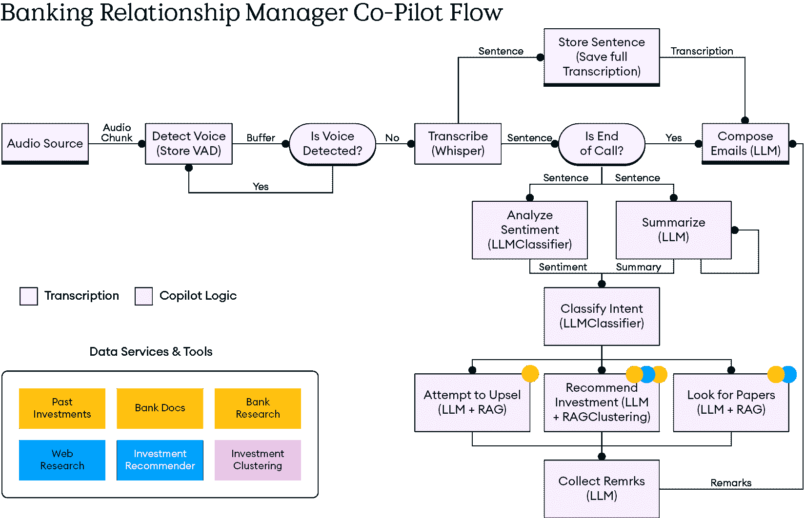
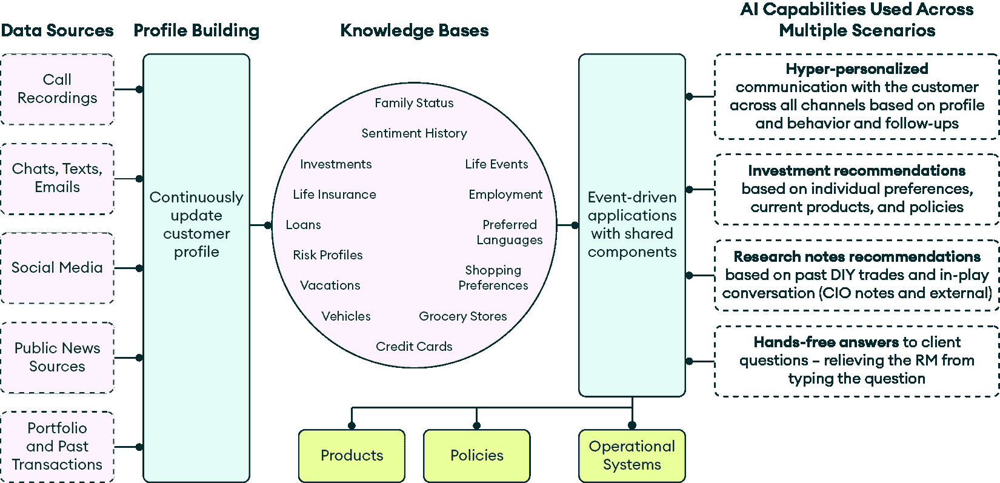
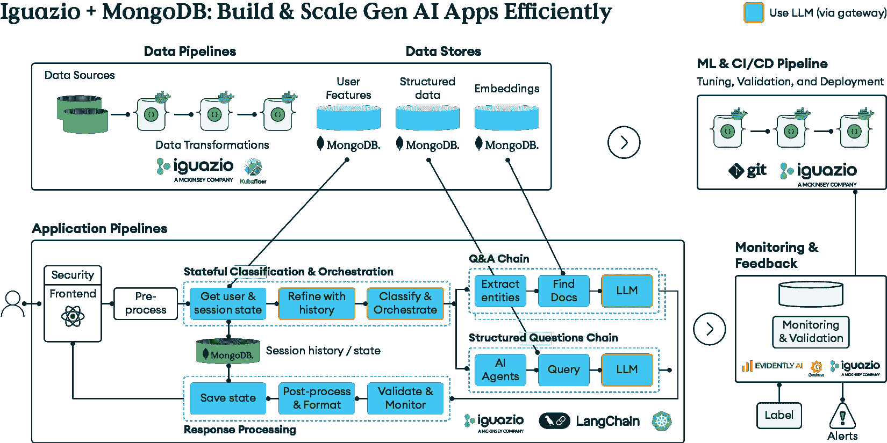

# 第十三章：利用生成式人工智能共飞行员在银行业推动客户成功

财富管理行业站在十字路口。虽然关系经理一直是个性化金融服务的基石，但他们现在面临着前所未有的挑战：如何在不牺牲推动客户忠诚度和业务增长的服务质量的前提下，扩展亲密、高接触的客户关系。像 QuantumBlack、麦肯锡的 AI 这样的公司一直在跟踪这一变化及其对商业和技术领导者的意义。

银行业在过去几十年中数字化转型加速，从基于分支机构的互动转变为满足客户在任何地方的需求的全渠道体验。客户对即时、个性化服务的期望从未如此之高，而监管压力和竞争力量要求更高的效率和更广泛的覆盖范围。这种演变既创造了机会，也带来了紧张；银行必须在更广泛的地理区域内服务更多客户，同时保持区分高端财富管理服务的个性化接触。

但仍然存在一个核心挑战：人际关系经理只能有效地管理有限数量的有意义客户关系。传统的模式严重依赖个人记忆、手动研究和一对一的互动，这些方式根本无法扩展。随着客户组合的增长和市场复杂性的增加，关系经理发现自己花更多的时间在行政工作上，而花在为客户关系增加真正价值上的时间却越来越少。

到本章结束时，你将了解以下内容：

+   财富关系管理的困境如何为人工智能转型创造机会

+   为什么传统的关系管理严重依赖手动努力和个人记忆，限制了可扩展性

+   生成式人工智能共飞行员如何将关系经理的生产力从 20-30%的客户互动时间提升到 70%以上

+   支持实时人工智能推荐和自动跟进生成的技术架构

+   如何实施四个必要的 AI 工厂管道，以生产级生成式人工智能应用

+   为什么防止幻觉的护栏和合规框架对金融服务至关重要

+   在呼叫中心分析、虚拟代理支持和欺诈检测等方面的实际用例

+   如何通过战略基础设施规划和用户参与来构建组织采用

+   生成式人工智能实施的业务影响：每位关系经理收入增长 10-25%，管理的活跃客户增加 5-15%

# 财富关系管理的困境

财富管理关系经理长期以来一直是高净值客户和金融机构之间个性化的桥梁。他们为他们的精英客户提供白手套服务：个性化的财务建议、投资建议、财政规划服务等等。但他们也面临着前所未有的压力，需要增加他们管理的客户数量。

这种双重使命使关系经理陷入了两难境地。一方面，银行机构需要可扩展性和收入增长。另一方面，没有牺牲服务质量，人类进行高接触客户关系管理的能力无法实现规模化。

传统财富管理严重依赖关系经理的个人记忆和手动努力。例如，他们亲自评估投资组合位置、风险和机会，手动联系客户，手动研究相关的新闻和市场更新，在对话中临时收集见解，并依赖广泛的泛化想法和策略，而不是个性化的策略。

QuantumBlack，麦肯锡 AI 部门与客户的广泛合作揭示了关系经理通常只花费 20-30% 的时间与客户互动，而 70-80% 的时间用于研究、准备和文书工作。这代表了通过 AI 实现转型的巨大机会。

## 规模化成功的客户关系管理 GenAI 协同助手

GenAI 协同助手正在改变关系经理的工作方式，使他们能够在不降低（有时甚至提高）服务质量的情况下吸引和管理更多客户。GenAI 协同助手位于关系经理的桌面，监听客户通话，并利用来自各种来源的银行大量数据存储库，提供高度个性化的实时推荐、下一步行动和增值机会。

例如，由 MongoDB 和 Iguazio 等先进 AI 解决方案驱动的 GenAI 协同助手——Iguazio 是一家被 QuantumBlack 收购的 AI 平台公司，QuantumBlack 是麦肯锡的 AI 部门——帮助关系经理识别与客户投资组合相一致的投资。协同助手还会主动分享相关研究，根据客户的措辞、语调和语境进行情感分析，确定并分类意图以识别潜在机会，甚至突出相关的生命事件，从而触发对额外银行产品的推荐（例如，根据客户的孩子刚刚满 18 岁的事实，为客户的孩子开设新的学生账户）。

图 13.1：实时 GenAI 协同助手工作流程：从语音检测到自动跟进

此流程图展示了银行关系经理 GenAI 协同助手在实时客户互动中的端到端操作工作流程。该过程从使用**语音活动检测**（**VAD**）进行音频源检测开始，然后通过 Whisper 技术进行实时转录。然后，系统通过使用基于 LLM 的**自然语言处理**（**NLP**）分析情感并分类客户意图。基于此分析，协同助手访问多个数据源，包括过去的投资、银行文件、研究数据库和投资聚类算法，以生成三种类型的智能推荐：使用 LLM 和**检索增强生成**（**RAG**）的增值机会，通过 RAG 和聚类提供的个性化投资建议，以及通过 LLM 和 RAG 的相关研究论文。此工作流程说明了 AI 如何在实时中协调复杂的数据处理和决策，以增强关系经理的有效性。

所有这些洞察都呈现给关系经理，他们可以实时决定是否与客户分享。通话结束后，协同助手自动生成一封个性化的电子邮件总结通话内容，以及根据讨论所需的任何额外文件，使关系经理能够简单地检查、编辑并通过点击按钮发送文件。

通过自动将这些洞察提供给关系经理，GenAI 协同助手释放了经理的准备时间，使他们能够将更多时间分配给与客户的增值互动。根据我们与客户合作的经验，我们发现这些数字可以发生显著变化，从与客户相处时间的 20-30% 提高到超过 70%。结果是每位关系经理的潜在收入提升 10-25%，以及管理的活跃客户增加 5-15%。

## 关系管理 GenAI 协同助手在内部是如何工作的

GenAI 协同助手的应用程序通过利用银行的各种数据源来运行，包括 MongoDB Atlas 这样的结构化数据库作为统一的数据平台，其中包含历史和实时数据。它持续从通话录音、过去的电子邮件、聊天和短信互动、社交媒体活动、公开新闻、客户的投资组合和交易历史中摄取内部和外部数据，以构建和维护动态的客户档案。

银行的知识库随着时间的积累，包括家庭状况、生活事件、情感历史、贷款和信用活动、风险概况以及购物偏好等详细信息，这些信息来自内部和外部数据源以及互动。银行特定的数据，如产品信息、政策和运营系统，也被整合。

图 13.2：AI 驱动的客户智能架构：从数据源到个性化的银行体验

本图展示了如何通过综合的档案构建系统，将 GenAI 副驾驶将多样化的数据源转化为智能客户洞察。在左侧，包括通话记录、通讯、社交媒体、公共新闻和交易历史在内的多个数据流输入到一个集中的档案构建引擎。该系统创建包含家庭状况、财务偏好、风险概况和行为模式在内的丰富知识库。这些洞察为事件驱动的应用提供四个核心 AI 能力：跨所有渠道的超个性化沟通、针对个人偏好和当前产品的投资建议、基于以往互动和市场情报的研究笔记，以及无需手动操作即可回答客户问题的解决方案，从而减轻关系经理的日常查询负担。这种架构展示了现代银行 AI 系统如何统一结构化和非结构化数据，以实现大规模的实时、情境化客户参与。

所有这些信息都流入事件驱动的应用和实时管道。这些数据由 GenAI 副驾驶实时利用，向人类代理推荐策略。为关系经理输出的结果是超个性化的沟通、定制化的投资想法、相关的研硏笔记以及客户查询的答案。

支持此架构的 AI 工作流程旨在实时使用 AI 处理客户通话中的语音，为关系经理提供洞察和建议，并根据实时进行的对话自动进行跟进。

要将 AI 应用，如面向关系经理的 GenAI 副驾驶产品化，需要哪些条件？这正是 GenAI 工厂发挥作用的地方。

# GenAI 工厂：为副驾驶、代理和 GenAI 应用提供动力

支持大规模使用副驾驶的 AI 架构基于四个管道：

+   数据管道用于处理原始数据（消除风险、提高质量、编码等）。

+   应用管道用于处理传入的请求，利用 MongoDB 统一数据平台支持的结构化、非结构化和向量数据进行丰富，运行代理逻辑，并应用各种安全线和监控任务。

+   开发和 CI/CD 管道用于微调和验证模型，测试应用以检测准确性风险挑战，并自动部署应用。

+   一个治理和监控系统，用于收集应用程序和数据遥测数据，以识别资源使用、应用程序性能、风险等。监控数据可用于进一步改进应用程序性能。

图 13.3：Iguazio 和 MongoDB 为生产规模 GenAI 应用集成的 AI 工厂架构

这张综合架构图说明了 Iguazio 的 AI 工厂平台如何与 MongoDB 集成，以大规模提供企业级通用人工智能（GenAI）应用。该系统包括四个关键的操作层：**数据管道**通过 Iguazio 的处理能力将原始数据源转换为 MongoDB 的统一数据平台，该平台在单一系统中处理用户特征、结构化数据和向量嵌入；**应用管道**具有具有状态分类和编排的安全控制、用于实体提取和文档检索的问答链，以及由 AI 代理驱动的结构化问题链；**机器学习和 CI/CD 管道**通过 Git 和 Iguazio 工作流程提供自动调整、验证和部署；以及全面的**监控和反馈**系统，具有实时验证和警报功能。该架构展示了 MongoDB 的融合数据存储方法如何通过在一个平台上原生支持结构化、非结构化和向量数据类型来消除管理多个数据库技术的复杂性，同时 Iguazio 协调生产金融服务应用所需的复杂 AI 工作流程、会话管理和响应处理。这种集成方法使管道编排、可扩展性和治理能力成为金融服务行业（FSI）合规性的必要条件，同时保持银行业务所要求的性能和可靠性。

此外，AI 工厂应支持本地和混合部署，并能够轻松地从一种环境迁移到另一种环境，以满足金融部门的严格监管、数据隐私和安全要求，并在一个非常动态的世界中提供灵活性。本地部署提供了对敏感数据和基础设施的完全控制，这对于满足 GDPR 或欧盟 AI 法案等合规性要求是必需的。同时，混合模型使银行能够利用基于云的 AI 的可扩展性和创新，同时保留敏感工作负载在本地。

## AI 工厂如何解决 FSI 工程需求

通过实施 AI 工厂，银行、保险公司和其他金融机构可以以多种方式受益。

其中最主要的好处是用户可以以最小的工程量获得管道编排的访问权限。工厂简化了跨四个管道（数据、应用、开发和 LiveOps）的端到端稳健且可重复的工作流程的开发和管理。这是以简单和弹性的方式完成的，无需大量的工程努力。

AI 工厂还增加了可扩展和快速部署的选项。工厂使企业规模、数百万银行客户、全球地区和团队以简化和无摩擦的方式构建和部署模型，无论是在云上、本地还是混合环境中，都不会产生成本效率低下的问题。例如，与 MongoDB 等数据库结合使用，可以轻松处理大量数据和复杂的数据转换，同时保持高性能并确保可靠性和准确性。

来自多个来源的数据统一也变得更加可行。GenAI 应用涉及多种类型的数据，例如地理空间数据、图、表格和向量。每种数据类型都需要考虑诸如安全性、可扩展性和元数据管理等问题。这创造了数据管理的复杂性。结合 MongoDB 的统一平台，AI 工厂可以处理所有数据类型，包括结构化、非结构化和向量数据，在一个解决方案中。这确保了一致性、更快的性能和显著减少的额外开销。

工厂的通用性也是一个巨大的好处。一旦构建，工厂可以适应多个用例，而无需重建的额外开销或挑战。如果需要任何更改，架构是模块化的，组件可以轻松交换或替换，而无需完全重新设计。

GPU 和计算优化变得更容易管理。随着计算（尤其是 GPU）变得昂贵且难以获得，工厂确保计算资源的有效分配、共享和自动扩展，包括分布和并行性。

MLOps 编排得到改善，因为 AI 工厂有助于快速、安全、可靠地将模型和 AI 应用从原型转移到生产。

工厂通过缓解业务和伦理风险（如幻觉、偏见、毒性和不准确输出）来帮助保证性能和输出完整性，确保高性能、准确性和可靠性。这是通过引入整个 AI 生命周期的中央管理和治理，包括在整个开发、培训和部署过程中的嵌入式护栏来实现的。

**幻觉护栏**

例如，防止幻觉可以在数据管道的早期阶段进行。这需要 RAG 工作流程和 MongoDB 的统一数据平台。

结构化和可靠的数据（如产品手册、常见问题解答、定价政策、客户数据等）被转换为嵌入并存储在 MongoDB 中。当用户提出查询时，相关的记录从数据库中检索出来，并以自然文本的形式结构化。这确保了响应基于真实事实，最大限度地减少幻觉。

AI 工厂通过实施安全模型访问的护栏、可解释性、审计日志记录、与 GDPR 和**金融行业监管局**（**FINRA**）法规的一致性以及公平性，来提高合规性、隐私性和安全性。

许多银行系统仍在使用遗留堆栈。AI 工厂通过 API 桥接、包装或微调的连接器抽象化复杂性，从而简化新旧系统之间的集成，易于且无缝。

即使在概念验证成功之后，大多数企业仍然未能扩大人工智能的规模并创造真正的商业影响。AI 工厂有助于确保生产级交付和管理，从而使企业看到实际的回报率。

AI 工厂是一个具有模块化和可扩展性的未来保障型基础设施，可以适应任何人工智能运营需求，例如 AI 代理。

代理是自主的人工智能系统，能够感知其环境，做出决策，并采取行动以实现特定目标。它们不仅遵循特定任务，还可以遵循一系列目标，适应不断变化的数据输入，独立或与人类团队协作操作。这有助于加快决策速度，提升客户体验，并提高金融服务价值链的运营弹性。

对于金融服务，AI 代理可以自动化复杂的工作流程，作为始终在线的财务助手，持续监控交易并标记欺诈，提出投资策略，个性化财务咨询，等等。

## 领先的金融服务用例，其中生成式人工智能带来了真正的价值

生成式人工智能对私人银行和金融机构的价值不仅限于关系管理。它还可以扩展到以下用例：

+   **智能呼叫中心分析**：使用人工智能实时转录、总结和分析支持电话，以识别情绪、产品痛点以及交叉销售机会，并将信息反馈给下游应用程序以获得战略洞察

+   **虚拟代理支持**：部署人工智能代理来处理常规查询，释放人类代理处理复杂案例

+   **超个性化产品推荐**：结合行为数据与客户信息，推荐定制的信用卡、贷款或投资产品

+   **欺诈预测和异常检测**：实时检测可疑的交易模式，提高响应时间

让我们详细看看一个例子。

## 案例研究：一个由生成式人工智能驱动的智能呼叫中心分析应用程序

一家大型成功的欧洲银行构建了一个生成式人工智能呼叫中心分析应用程序，以改善呼叫中心运营，简化代理培训，提升客户体验，并降低成本。该生成式人工智能应用程序在本地部署，总结了客户通话，分析了情绪和主题，并移除了**个人身份信息**（**PII**）。数据被输送到下游应用程序，如实时代理支持、客户档案、自动生成的内容、定制推荐、定制优惠等。

这导致了运行时间提高了 2 倍，呼叫日记化速度提高了 60 倍，GPU 利用率提高了 3 倍。这样的代理还可以访问 MongoDB 数据平台，提取有助于信息检索和使用的相关信息。

# 接下来是什么？企业如何利用 GenAI 取得成功

GenAI 解决方案的成功不仅仅在于实施正确的技术。相反，它取决于与人们的互动、确保高管层的一致性、建立正确的流程和引入治理策略。以合作的方式将 GenAI 集成到关系经理的工作流程中，或任何其他部门，是其成功的基础，同时也为公司和个人员工的成功驱动。

因此，建议在人员、流程和技术方面实施以下实践：

+   **战略基础设施规划**: 根据监管、合规性和资源需求，制定针对云、本地或混合部署的定制部署策略。数据基础设施应设计为利用现有系统，同时确保与现有流程的顺利集成。

+   **强大的治理和监管一致性**: 内嵌内部政策并与欧盟 AI 法案等法规保持一致，以加速进步并最小化风险。

+   **推动用户接受度**: 吸引表现优异的关系经理参与塑造工具的功能和用户体验。这确保并推动了一种所有权感。它包括突出提升洞察力、提升专业技能、提高生产力和增加收入的潜力，并通过与高绩效者合作进行试点，以产生快速胜利、建立信誉并激发组织内的同伴驱动力。

通过将 GenAI 解决方案如共飞行员锚定在其数字战略中，银行可以转型客户关系，并在日益竞争和动荡的格局中为可持续的、收入驱动的增长定位自己。

# 摘要

通过 GenAI 共飞行员实现的财富管理转型代表了从无法实现的个人服务规模化的二难困境到一个增强效率和客户体验的 AI 解决方案的根本转变。由于关系经理目前将超过一半的时间花在研究和文书工作上，而不是与客户互动，GenAI 共飞行员提供了一条清晰的路径来翻转这一比例，使管理者能够专注于价值创造活动，而 AI 则处理数据处理、情感分析和行政任务。

这次转型的技术基础需要一种全面的 AI 工厂方法，包括数据管道、应用编排、开发工作流程和治理框架。MongoDB 的统一数据平台能够实现结构化和非结构化数据的实时处理，这对于实现上下文 AI 响应至关重要，而内置的护栏则确保符合金融服务法规，并防止幻觉。现实世界的实施已经证明了显著的商业影响，每位关系经理的潜在收入提升可达 10-25%，管理的活跃客户数量增加 5-15%，同时还有如运行时改进 2 倍和呼叫处理速度提高 60 倍等运营改进。

下一章将探讨如何在保险业中利用 AI 创造商业价值，研究 AI 在保险行业中的战略整合，以推动有意义的商业成果。超越银行应用，它展示了如何构建与保险业务目标一致的 AI 增强型应用工作流程，涵盖了数据架构的演变以及 AI 在承保、理赔处理和客户体验方面的实际应用，以转型保险运营。
