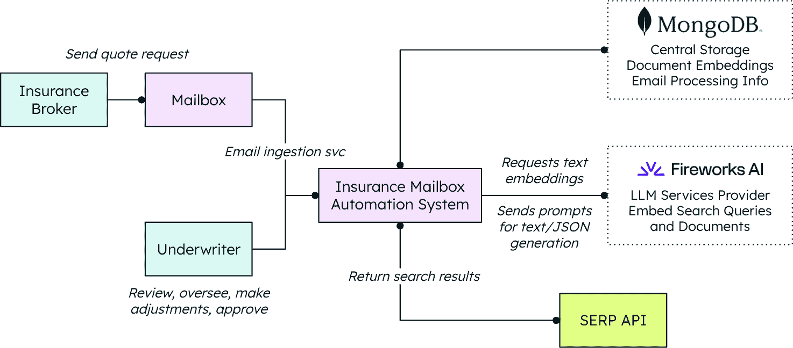
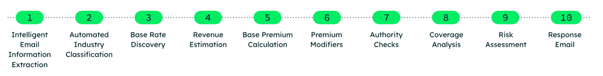
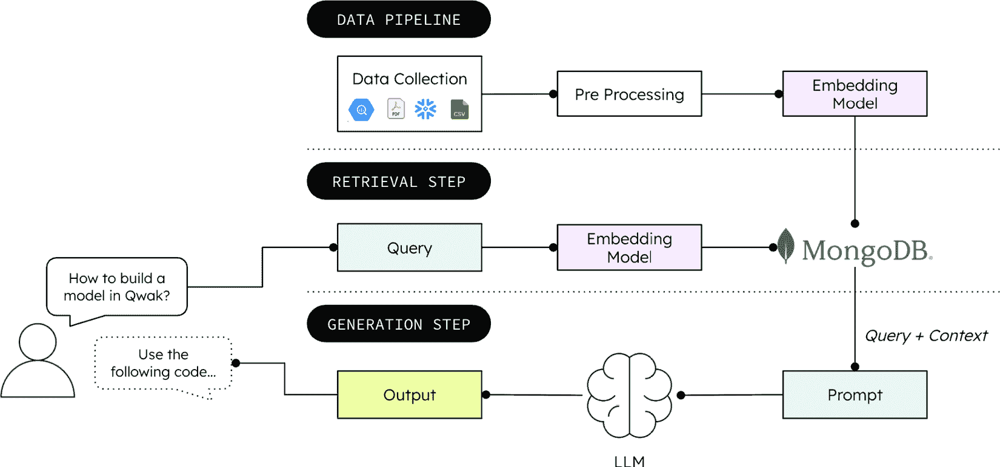

# 第十五章：使用 Fireworks AI 和 MongoDB 自动化保险承保

虽然上一章探讨了人工智能应用如何改变保险行业，从数据架构的演变到智能商业应用，但本章则考察了一个具体且影响深远的应用实例，展示了人工智能如何通过自动化革命性地改变核心保险操作。承保过程，传统上是商业保险中最耗时和劳动密集型的方面之一，展示了之前讨论的 AI 就绪数据架构和智能代理如何通过自动化提供即时的、可衡量的业务价值，同时保持准确性并显著提高速度。

考虑这个假设场景：下午 2:47，一位经纪人发送了一份价值 1500 万美元的建筑公司的报价请求。到下午 2:53，一份全面的报价和完整的承保分析已经到达他们的收件箱。这六分钟的周转时间代表了从传统报价周期到实时处理的根本转变，展示了之前章节中涵盖的架构原则和 AI 能力的实际应用。

到本章结束时，你将清楚地了解以下内容：

+   使实时保险自动化成为可能的技術架构，结合 Fireworks AI 的推理能力与 MongoDB Atlas 的智能文档存储和检索系统

+   完整的 10 步 AI 流程，将非结构化经纪人电子邮件转换为结构化报价，从电子邮件解析到风险评估再到最终报价生成

+   如何通过 RAG 原则确保 AI 决策基于权威的承保文件，同时保持合规性和准确性标准

+   生产级实现细节，包括向量搜索架构、结构化输出生成以及使 30 分钟内报价经济可行的成本效益扩展策略

+   实际应用案例，展示了系统如何处理实际的报价请求，从初始电子邮件解析到最终报价交付，并包含完整的审计跟踪

+   保险行业转型的更广泛影响，包括对承保人、经纪人和承运人的影响，这些影响超越了简单的流程自动化，到根本性的商业模式演变

# 理解速度的重要性

在商业保险中，时间就是一切。当经纪人提交一份新的商业保单的报价请求时，他们在高度竞争的市场中与时间赛跑，最快响应往往赢得交易。这种现实创造了一个行业悖论，即速度决定成功，但推动业务的基本流程仍然顽固地锚定在过时的方法中，这些方法优先考虑彻底性而不是敏捷性。

人工智能将标准保单的平均核保决策时间从 3-5 天缩短到 12.4 分钟，同时保持 99.3%的准确率[*1*]。然而，许多保险公司仍在使用手动流程运营，这导致它们在竞争中处于劣势，因为 InsurTech 公司通过简化和自动化操作获得了业务。

手动核保工作流程包含系统性的低效率，其中核保人员的大部分时间都花在手动数据处理上。这个过程涉及邮件混乱、非结构化沟通、通过碎片化系统查找文档、在多个费率表中进行手动计算，以及创建瓶颈的审批层级。这些低效率导致每天每个核保人员仅处理 2-3 个报价，准确性可变，且指导原则应用不一致。

## 破碎的工作流程

今天的核保流程是一个低效率的案例研究，涉及八个脱节的步骤，将本应几分钟的工作转变为数周延误：

1.  **邮件混乱**：经纪人发送非结构化邮件，客户详情隐藏在段落中。信息以不一致的格式到达，通常缺少关键的核保数据。

1.  **手动数据录入**：核保人员手动提取公司名称、行业分类、收入数据和承保限额，常常引入转录错误，影响最终报价。

1.  **文档搜索**：这涉及在多个系统、不一致的组织中搜索存储的多个 PDF 手册、费率表和指南。

1.  **碎片化分析**：风险评估涉及检查多个数据库和孤岛系统中的历史数据，这些系统之间不进行沟通。

1.  **手动计算**：这涉及参考各种费率表并应用多个修正因子，这是一个耗时且易出错的流程。

1.  **审查瓶颈**：复杂案例需要多个审批级别，通常涉及可能无法立即到场的资深核保人。

1.  **响应生成**：这包括从头开始编写报价回复邮件，用经纪人友好的语言解释复杂术语。

1.  **跟进混乱**：这包括手动管理多个报价版本、跟踪截止日期和经纪人沟通。

结果是每个核保人员每天处理 2 个或 3 个报价，错误率很高，质量不一致。

## 视野

基于第十四章中讨论的 AI 就绪数据架构，*在保险中用 AI 创造商业价值*，这个核保解决方案展示了如何将汇聚数据存储原则应用于解决一个关键业务问题：将长达数周的报价流程转变为实时决策。

我们将探讨使用**Fireworks AI**的实用实现，这是一个针对快速、成本效益高的**大型语言模型**（**LLM**）部署进行优化的高性能推理平台，以及 MongoDB Atlas 的面向文档的数据库，该数据库内置向量搜索功能。这种组合实现了语义理解和实时处理，这对于智能自动化至关重要。

考虑以下适用系统的情况：

+   非结构化经纪人邮件会立即解析并理解

+   相关的承保指南会自动检索并应用

+   风险评估会生成完整的引用轨迹

+   报价生成的准确性等同于经验丰富的承保人

+   整个过程是可审计的且符合规范

我们将首先概述该系统的关键概念，然后通过一个实际、真实世界的例子来展示系统的实际实施情况以及其组件如何交互。

# 设置核心技术组件

Fireworks AI 提供了驱动系统 NLP 的高性能推理引擎。Llama 3.3 70B 模型处理非结构化经纪人通信并生成结构化输出。模型选择标准包括推理速度、在提取任务上的准确性和生产规模化的成本效率。

如前所述，MongoDB Atlas 提供了一个面向文档的数据库，内置向量搜索功能，这使语义文档检索成为可能。对于承保而言，这意味着使用向量嵌入存储政策文档、评级手册和监管指南，以便在报价处理过程中进行上下文感知的信息访问。

## 文档架构

MongoDB 集合存储各种类型的承保知识，例如政策信息、评级手册和监管指南。这些知识被转换为向量嵌入，这使后续使用 RAG 进行快速语义搜索成为可能。

系统的智能依赖于复杂的语义搜索实现：

```py
# Assemble vector-search pipeline
pipeline = [
    {
        "$vectorSearch": {
            "queryVector": query_embedding,   # the user's embedding
            "path": vector_field,             # field that stores each doc's embedding
            "numCandidates": limit * 10,      # oversampling for recall
            "limit": limit,                   # top-k to return
            "index": "vector_index"           # name of Atlas search index
        }
    }
]
# Execute search and fetch results
results = list(collection.aggregate(pipeline)) 
```

为了检索最相关的文档，该管道将查询嵌入与存储在`vector_index`中的每个嵌入进行比较，根据相似度分数对候选者进行排名，并返回得分最高的匹配项（或如果请求多个结果，则返回前-*k*个）。

以下图表展示了完整的 AI 驱动承保系统架构，展示了 Fireworks AI 如何处理经纪人邮件，同时 MongoDB Atlas 在承保文档中提供语义搜索：



图 15.1：保险承保系统架构

该系统包括一个**保险经纪人**向**邮箱**发送报价请求，该邮箱连接到**保险邮箱自动化系统**。系统连接到 MongoDB 进行**中央存储**（文档嵌入、邮件处理信息）和 Fireworks AI 进行**LLM 服务**（嵌入搜索查询和文档）。**承保人**审查并批准决策，并通过连接到**SERP API**获取额外的数据源。

## 10 步 AI 流程：从电子邮件到报价

处理管道通过 10 个智能步骤将非结构化电子邮件转换为结构化报价，每个步骤都由 Fireworks-MongoDB 组合提供动力：

1.  **智能电子邮件信息提取**: 当经纪人的电子邮件进入系统时，旅程开始。使用 Fireworks 的自然语言理解，平台从非结构化文本中提取结构化信息：

    ```py
    # Email extraction using structured output
    email_info = pipeline.extract_email_info(email_content)
    # Returns: {
    #   "client_name": "ABC Construction Corp",
    #   "industry": "Commercial Construction", 
    #   "coverage_requested": {
    #     "type": "General Liability",
    #     "limits": "$2M/$4M"
    #   },
    #   "annual_revenue": 15000000,
    #   "employee_count": 85
    # } 
    ```

1.  **自动化行业分类**: 一旦收集了公司详细信息，系统通过查询 MongoDB 的行业分类文档来确定精确的**业务行业分类**（**BIC**）代码：

    ```py
    # Semantic search for industry classification
    industry_results = vector_search(
        query=f"Industry classification for {company_industry}",
        collection="bic_codes"
    )
    bic_code = llm_client.classify_industry(industry_results, company_description) 
    ```

1.  **基础费率发现**: 确定了 BIC 代码后，它从存储在 MongoDB 中的评级手册中检索行业特定的基础费率：

    ```py
    # Vector search for base rates
    base_rate_docs = vector_search(
        query=f"Base rates for BIC code {bic_code}",
        collection="rating_manuals",
        filters={"document_type": "base_rates"}
    ) 
    ```

剩余步骤展示了 AI 推理和文档检索之间复杂的交互。

1.  **收入估算**: 当未提供收入时，AI 驱动的承保自动化系统会根据行业标准、公司规模和其他可用数据点尝试估算收入。然而，由于从有限的数据中预测公司财务的固有不确定性，收入估算会被标记为需要承保人审查。

1.  **基础保费计算**: 在行业分类（BIC 代码）、基础费率和收入确定后，系统通过将检索到的费率应用于公司的年度收入来计算基础保费。

1.  **保费调整因子**: 通过查询调整因子表并让 Fireworks 推理其适用性来应用风险因素。

1.  **权限检查**: 系统通过将覆盖限额与权限矩阵交叉引用来确定审批要求。

1.  **覆盖分析**: 通过对覆盖指南的语义搜索确定推荐的批注和限制。

1.  **风险评估**: 集成外部数据源以提供全面的风险概览。

1.  **回复邮件**: 系统生成专业、经纪人友好的报价邮件，包含全面的覆盖细节、保费分解和清晰的承保解释。



图 15.2：AI 驱动的保险报价生成流程

此流程图展示了将非结构化电子邮件咨询转换为结构化保险报价的 10 步自动化流程。

## RAG 优势

以下步骤和代码展示了完整的 RAG 工作流程。它首先使用向量相似度搜索定位最相关的承保文档，将其内容作为可信上下文串联到提示中，然后指示模型返回一个经过模式验证的 JSON 答案：

1.  获取与用户提示最相关的源文档：

    ```py
    relevant_docs = self.retrieve_relevant_documents(prompt, limit=max_documents) 
    ```

1.  将它们的内容串联成一个单一上下文块：

    ```py
    doc_content = "\n\n".join(
        f"Document: {d.get('name','')}\n{d.get('content','')}" for d in relevant_docs
    ) 
    ```

1.  构建一个嵌入用户问题的上下文增强提示：

    ```py
    augmented_prompt = f"""Use the following documents as reference.
    Documents:
    {doc_content}
    Question/Task:
    {prompt}
    """ 
    ```

1.  向 LLM 请求符合预定义模式的结构化 JSON 答案：

    ```py
    response = self.client.chat.completions.create(
        model=self.model,
        messages=[{"role": "user", "content": augmented_prompt}],
        response_format={"type": "json_object",
                         "schema": schema_model.model_json_schema()}
    ) 
    ```

1.  解析并返回模型输出：

    ```py
    return json.loads(response.choices[0].message.content) 
    ```

首先检索相关文档，然后直接注入到提示中，这样模型在形成回复时必须引用它们。

在下一节中，我们将看到 MongoDB 如何提供完美的基础设施。

## 使用 MongoDB Atlas 构建现代数据库基础设施

在此系统中，MongoDB Atlas 被用作面向文档的数据存储库，支持上下文感知检索并支持实时 AI 驱动的流程。

系统智能的基础在于 MongoDB Atlas 的向量搜索功能。我们通过 Fireworks 使用 Nomic AI 嵌入策略实现了复杂的嵌入策略：

```py
def generate_embeddings(self, input_texts: List[str], prefix: str = "") -> List[float]:
        """Generate embeddings from Fireworks python library"""
        start_time = time.time()

        if prefix:
            input_texts = [prefix + text for text in input_texts]

        response = self.client.embeddings.create(
            input=input_texts,
            model=self.embedding_model,
        )

        return response.data[0].embedding 
```

此代码演示了系统如何将文本转换为可搜索的向量。在设置过程中，每个承保文档、费率手册和政策指南都通过此嵌入函数进行处理，创建一个语义搜索索引，使 AI 能够根据意义而不是精确的单词匹配来查找相关信息。当收到报价请求时，用户查询会经过相同的嵌入过程以找到最适用的承保规则。

## 推理层实现：Fireworks AI

Fireworks AI 被选为推理引擎，基于其性能。它通过其 **FireOptimizer** 适应引擎运行推理层，该引擎为每个工作负载自动调整硬件映射、量化以及自适应推测执行。这种方法在生产测试中实现了高达 3 倍的生成延迟降低和大约 4 倍的每令牌成本节省，而像 Cursor 这样的客户通过一键部署确认了 2 倍的速度提升，这证明了该平台满足承保流程严格的延迟和预算要求。

Fireworks 的 **JSON** 模式确保语言模型生成机器可读的输出，消除了对额外解析的需求：

```py
# Guaranteed structured output
response = self.client.chat.completions.create(
    model="accounts/fireworks/models/llama-v3p3-70b-instruct",
    messages=[{"role": "user", "content": prompt}],
    response_format={"type": "json_object"},
    temperature=0.1  # Low temperature for consistent outputs
) 
```

使用 Fireworks 的 JSON 响应模式迫使模型输出严格的、机器可读的对象，这样下游服务就可以在不进行脆弱的后处理的情况下消费数据。由于 JSON 是一种通用的交换格式，输出可以直接集成到现有的管道和 API 中，让开发者以最少的粘合代码将 AI 功能集成到生产系统中。

Fireworks 的定价模型允许组织以经济的方式处理大量报价：

+   **令牌效率**：优化的提示减少了 40% 的令牌使用量

+   **批量处理**：后台处理报价降低每请求成本

+   **智能缓存**：缓存常见行业模式以减少重复推理

这些成本优化共同使得保险公司能够在不产生相应成本增加的情况下实现前所未有的规模。系统效率的提高意味着每天处理 1,000 个报价的成本与处理 100 个报价的成本大致相同，这为自动化提供了一个有说服力的经济案例，将承保从成本中心转变为竞争优势。

## 探索结果

这一实施展示了承保操作中可衡量的变化，特别是在处理速度、可扩展性和成本效率方面。

### 定量影响

自动化显著改变了承保工作流程的操作基准。以下指标比较了传统手动流程与 AI 辅助实施观察到的结果：

| **度量标准** | **手动处理前** | **AI 赋能后** | **改进** |
| --- | --- | --- | --- |
| 平均报价周转时间 | 20–30 天 | 15–30 分钟 | 快 98% |
| 每日报价容量 | 5–10 份报价/承保人 | 千份报价/系统 | 增加 100–1,000 倍 |
| 每份报价的处理成本 | $125（人工+管理费） | $12（计算+管理费） | 减少 90% |
| 高风险检测率 | 60%（手动审查） | 89%（AI 标记） | 增加 29 个百分点 |
| 合规一致性 | 可变 | 100%（标准化） | 消除了差异 |

表 15.1：定量影响比较 – 手动与 AI 赋能的承保性能指标

数据揭示了根本性的转变。98%的速度提升与 100–1,000 倍的容量增加表明，自动化使业务能力发生了质的飞跃，而 90%的成本降低和改进的准确性指标显示，这一转变既具有经济上的吸引力，又具有操作上的优越性。

### 定性转变

除了数字之外，这个平台本身已经改变了承保职业本身。

对于**承保人**来说，该平台通过让他们从重复的数据录入任务中解放出来，从根本上提升了他们的角色，使他们能够将专业知识集中在复杂的风险分析和战略决策上。AI 提供全面的风险评估报告和支撑文件，使承保人能够做出更加明智和自信的承保决策。系统会持续从承保人的反馈中学习，随着时间的推移不断改进其推荐，并创建一个协作的人机伙伴关系。

**经纪人**通过实时状态更新和快速报价响应立即获得好处，这些响应符合现代客户的期望。对承保决策和推理的全面了解有助于经纪人通过提供对覆盖建议和定价理由的明确解释来更好地服务客户。最重要的是，更快的报价周转时间使经纪人在赢得新业务方面具有显著的竞争优势。

**保险公司**通过能够立即响应新机会的能力获得了前所未有的市场敏捷性，而不是受到处理瓶颈的限制。系统的可扩展性允许承保人处理季节性高峰和市场波动，而无需雇佣额外人员，而标准化的承保流程降低了监管风险并确保所有决策中指南的一致应用。

既然我们已经清楚地了解了这些好处，让我们更深入地了解一下它是如何运作的。

# 深入技术创新

让我们深入探讨 Fireworks 和 MongoDB 实现为何成为一个如此创新解决方案的原因。

## 量产级 RAG 实现

RAG 系统代表了高级 AI 技术的成熟实现：



图 15.3：量产级 RAG 实现工作流程

RAG 系统是一个强大且成熟的尖端 AI 方法实现。这个系统经过精心设计，旨在解决独立 LLMs 的局限性，通过无缝集成信息检索机制和强大的文本生成模块。这种架构允许模型实时访问并整合来自外部知识源的相关信息，从而产生更准确、上下文丰富和有信息量的生成响应。

我们 RAG 实现的核心组件包括一个高度高效的文档索引和检索管道，以及一个针对整合检索信息而微调的复杂生成模型。检索组件旨在速度和准确性，能够高效地搜索大量文档，并识别给定查询的最相关信息。这涉及到高级的语义理解和向量嵌入技术，以捕捉查询和文档的潜在含义。

一旦检索到相关信息，它将被仔细注入提供给生成模型的提示中。这个过程确保模型能够访问必要的上下文，以生成一个信息丰富且基于事实的响应。生成模块利用最先进的 transformer 架构，并专门训练以有效地利用检索到的信息，避免常见的陷阱，如忽略上下文或生成相互矛盾的陈述。

通过结合信息检索和 GenAI 的优势，这个量产级 RAG 系统在传统 LLMs 之上提供了显著的优势。它提高了生成文本的准确性和事实正确性，减少了幻觉的可能性，并允许模型提供基于最新和具体信息的响应。这使得它成为广泛应用的强大解决方案，包括问答、内容创作、聊天机器人和知识密集型任务。

## 现实世界应用：报价请求之旅

让我们跟随一个典型的报价请求通过系统，看看这项技术的实际应用。这个例子展示了章节中先前描述的 10 步 AI 流程中的关键步骤，重点关注最关键的过程，以说明系统如何处理现实世界场景。

让我们从启动整个过程的电子邮件开始：

```py
Subject: Quote Request - ABC Construction Corp
Hi there,
I need a quote for ABC Construction Corp. They're a mid-size commercial 
construction company based in Texas, doing about $15M in annual revenue. 
They need General Liability coverage with $2M/$4M limits, plus Auto 
Liability for their fleet of 25 vehicles.
The company has been in business for 12 years, 85 employees. They've had 
two small workers comp claims in the past 3 years but nothing major. 
They're looking for coverage to start March 1st.
This is somewhat urgent; they're shopping around and want to make a 
decision by end of week.
Thanks,
Sarah Johnson
ABC Insurance Brokerage 
```

这封电子邮件包含了 AI 系统生成准确报价所需的所有基本数据点，尽管它们嵌入在自然、对话性的语言中。注意电子邮件如何清楚地说明公司的年收入（$15M）、员工人数（85）、具体的承保需求（一般责任保险，2M/4M 限额，加上汽车责任保险）和车队规模（25 辆车）。AI 还将提取关键风险指标，如公司的 12 年运营历史和损失经验（两个小型工人赔偿索赔），以及运营细节，如德克萨斯州的地理位置和 3 月 1 日的生效日期。甚至细微的提示，如决策时间表的*有些紧急*和*本周末*，也有助于系统适当地优先处理此请求。

现在，我们将按照 Fireworks 和 MongoDB 的逐步处理过程来查看 AI 如何将这份非结构化电子邮件转换为可操作的承保数据，使用我们之前概述的相同管道步骤：

1.  **智能电子邮件信息提取**：自然语言处理（NLP）从非结构化的经纪人通讯中提取结构化信息，以高精度识别客户详情、承保需求和紧急指示。在 Sarah 的邮件中，AI 识别出*ABC Construction Corp*作为客户名称，将*$15M 的年收入*解析为数值，并从诸如*“一般责任保险，2M/4M 限额，加上 25 辆车的汽车责任保险”*之类的短语中提取具体的承保需求：

    ```py
    # Fireworks extracts structured data
    extracted_info = {
        "client_name": "ABC Construction Corp",
        "industry": "Commercial Construction",
        "annual_revenue": 15000000,
        "employee_count": 85,
        "coverage_requested": {
            "type": "General Liability + Auto Liability",
            "limits": "$2M/$4M"
        },
        "fleet_size": 25,
        "urgency": "urgent",
        "loss_history": "Two small workers comp claims in past 3 years",
        "broker_contact": {
            "name": "Sarah Johnson",
            "brokerage": "ABC Insurance Brokerage"
        }
    } 
    ```

1.  **自动化行业分类**：通过 BIC 代码数据库进行语义搜索（向量搜索），通过将公司描述与标准分类系统相匹配来确定精确的行业分类：

    ```py
    # MongoDB vector search finds relevant BIC codes
    industry_docs = vector_search(
        query="Commercial construction company building contractor",
        collection="bic_codes"
    )
    # Returns: BIC Code 44 - Construction/Contracting 
    ```

1.  **基础费率发现**：向量搜索从评级手册中检索行业特定的基础费率，确保基于既定的承保指南的准确基础定价。使用确定的 BIC 代码`44`（建筑行业），系统检索适用于 ABC Construction Corp 的一般责任保险的特定基础费率，即每$1,000 收入$8.50：

    ```py
    # Retrieve construction industry base rates
    rate_docs = vector_search(
        query="Base rates BIC 44 construction general liability",
        collection="rating_manuals"
    )
    # Returns: $8.50 per $1000 of revenue for construction GL 
    ```

1.  **风险评估**：它通过文档检索和 AI 推理分析风险因素。AI 特别处理了 Sarah 提到的*过去 3 年中的两个小型工人赔偿索赔*和公司的 12 年运营历史，以确定风险调整因子：

    ```py
    # Vector search for construction risk factors
    risk_docs = vector_search(
        query="Construction company risk factors workers comp claims",
        collection="underwriting_guidelines"
    )
    # AI analyzes: Previous claims suggest 15% modifier increase 
    ```

1.  **响应电子邮件/报价生成**：最后一步是生成一份包含完整文档和专业格式的综合报价。最终的报价直接针对 Sarah 的时间表（*本周末*）并整合了她邮件中的所有具体细节（3 月 1 日的开始日期、请求的确切承保限额和车队规模）到一个专业的回复中：

    ```py
    Subject: Quote for ABC Construction Corp - General Liability Coverage
    Dear Sarah,
    Thank you for your quote request for ABC Construction Corp. We're pleased to provide the following quote:
    **Coverage Summary:**
    - General Liability: $2,000,000 / $4,000,000
    - Auto Liability: $1,000,000 Combined Single Limit
    - Effective Date: March 1, 2024
    **Premium Calculation:**
    - Base Premium (GL): $127,500 
      (Based on $15M revenue × $8.50 per $1000 - BIC Code 44)
    - Loss History Modifier: +15% ($19,125)
    - Auto Liability Premium: $18,750 (25 vehicles × $750 base rate)
    - **Total Annual Premium: $165,375**
    **Underwriting Notes:**
    - Previous workers compensation claims reviewed and factored into pricing
    - Construction operations fall within our standard appetite
    - No additional endorsements required for this risk profile
    This quote is valid for 30 days. Please let me know if you need any 
    modifications or have questions.
    Best regards,
    Automated Underwriting System 
    ```

这完成了自动核保过程，从 Sarah 的初始电子邮件到一份全面、专业的报价，准备交付。传统上需要几天或几周的手动工作，现在在不到 6 分钟内完成，展示了 AI 驱动自动化在保险运营中的变革力量。

整个过程在以下技术指标下完成，耗时不到 6 分钟：

+   **MongoDB 查询**：8 个向量搜索

+   **Fireworks API 调用**：10 个完成请求

+   **平均每个查询使用的令牌数**：15,847（输入：9,234；输出：6,613）

+   **向量搜索准确性**：平均 94%的相关性评分

+   **生成的引用**：23 个支持性文件引用

总结来说，一个曾经需要大量手动努力的过程现在以前所未有的速度和精度执行，提供了准确性、效率和可靠性，为现代核保设定了新的标准。

## 转变日常运营

在此解决方案之前，核保人的一天可能会有所不同。他们之前的日常流程可能如下所示：

+   上午 8:00：审查 15 个新的电子邮件报价请求

+   上午 8:30：开始手动录入第一个报价

+   上午 10:00：搜索评级手册以找到适当的费率

+   上午 11:30：计算基本保费和调整因子

+   下午 1:00：午餐休息

+   下午 2:00：继续进行第二个报价请求

+   下午 4:00：审查和批准流程

+   下午 5:30：起草回复电子邮件

这导致每天处理 2-3 个报价。

现在，借助 Fireworks 和 MongoDB，当前的日常流程看起来更像这样：

+   上午 8:00：审查夜间批次处理的 25 个 AI 处理的报价

+   上午 8:30：专注于需要人类判断的三个复杂风险

+   上午 10:00：审查和批准 15 个标准报价（每个 2 分钟）

+   上午 11:00：对具有挑战性的案例进行深入的风险分析

+   下午 1:00：午餐休息

+   下午 2:00：经纪人关系管理和市场分析

+   下午 4:00：关于新 AI 功能的培训会议

+   下午 5:00：投资组合管理战略规划

这导致处理了 15+个报价，并完成了战略工作。

这样，一个人的日子可能会发生变化。让我们考虑它对整个行业可能产生的影响。

## 行业影响和影响

除了量化的改进之外，这个由人工智能驱动的平台从根本上改变了保险专业人士在整个价值链上的日常体验。对于承保人来说，这种变化代表着他们专业角色的全面提升。他们不再需要花费数小时进行重复的数据输入和手动文档搜索，现在可以将专业知识集中在真正需要人类判断的复杂风险评估和战略决策上。人工智能提供了全面的风险评估报告和相应的文件，使承保人能够做出更明智、更有信心的承保决策，同时从反馈中不断学习，随着时间的推移改进建议。这创造了一个人机协作伙伴关系，其中技术放大了人类专业知识，而不是取代它。

经纪人在服务客户和有效竞争的能力上也经历了同样戏剧性的改进。实时状态更新和快速报价响应使他们能够满足现代客户对即时服务的日益增长的需求。系统对承保决策和推理的透明度使经纪人能够提供清晰、详细的保险建议和定价理由解释，通过改善沟通加强客户关系。最重要的是，报价周转时间的显著减少使经纪人在赢得新业务方面获得了显著的竞争优势，因为他们可以在竞争对手仍在收集信息时提供报价。

保险公司从前所未有的运营灵活性和市场响应能力中受益。系统立即处理报价的能力使得保险公司能够迅速响应新的市场机会，避免了传统延迟可能导致的业务损失。可扩展性成为战略优势而非限制，因为保险公司可以处理季节性高峰、灾难性事件和市场波动，而无需承担雇佣额外人员的费用和复杂性。也许最重要的是，标准化的承保流程降低了监管风险，并确保了所有决策中指南的一致应用，提供了运营效率和合规信心。

## 更广泛的技术采用

这个人工智能驱动的承保解决方案的成功正在整个保险行业产生涟漪效应，推动着多个运营领域的更广泛人工智能应用。索赔处理已成为下一个主要前沿，保险公司正在实施自动索赔评估和结算系统，这些系统能够评估损坏照片、处理文件，甚至在没有人为干预的情况下授权简单索赔的支付。通过人工智能驱动的系统，保单管理正在被改造，这些系统能够实时处理保单变更、续保和修改，大大减轻了保险人和保单持有人的行政负担。客户服务运营越来越多地利用智能聊天机器人和支持自动化，这些系统能够处理复杂查询，引导客户了解保单选项，并以人类水平理解和同理心提供 24/7 的支持。通过先进的模式识别系统，欺诈检测变得更加复杂，这些系统能够通过分析大量数据集中微妙的模式来识别欺诈索赔，而这些模式对于人类审阅者来说是难以发现的。

## 监管考虑因素

随着人工智能在保险行业的日益普及，监管框架正在迅速演变，以应对新的挑战并确保消费者保护。算法透明度已成为一个关键焦点，监管机构越来越多地要求可解释的人工智能决策，这允许监管机构和消费者理解自动化系统如何得出结论，尤其是在影响覆盖范围和定价的领域。偏见预防已成为一个主要关注点，新的监控要求旨在检测和防止可能不公平影响受保护类别或造成意外覆盖范围获取差异的歧视性定价做法。数据隐私保护得到了显著加强，对客户信息在人工智能系统中收集、存储和使用的要求更加严格，反映了人们对这些系统可以处理的大量个人数据日益增长的担忧。专业责任标准正在被重新定义，以解决人工智能辅助承保的独特挑战，为自动化系统做出影响覆盖范围和索赔的决定时建立新的问责框架。

# 摘要

我们通过 Fireworks AI 和 MongoDB 实现的转型代表了保险运营的根本性转变，展示了人工智能平台如何在不牺牲准确性和合规性的情况下彻底改变传统流程。我们的实施证明，速度确实是一个竞争优势，将报价周转时间从周缩短到分钟，同时实现了 98%的处理速度提升，90%的成本降低和 100-1000 倍的能力提升。智能自动化、语义搜索和可解释人工智能的结合创造了一个基础，在这里，人类专业知识得到增强而不是被取代，让承保人能够专注于复杂的风险分析和战略决策。

这个平台的成功不仅超越了运营指标，还扩展到了根本性的商业模式演变。通过实现基于全面数据分析的实时承保决策，我们创造了一个将保险行业从被动转变为主动的系统。这里展示的架构原则（面向文档的数据基础、向量搜索能力以及 RAG 驱动的决策制定）为组织提供了一个蓝图，它们可以根据自己的需求进行适应，以推动自身的竞争性转型。

随着时间的推移，这些由人工智能驱动的转型原则正在彻底改变医疗保健的提供方式，其积极影响远远超出了商业指标，对人类健康和福祉的根本性改善。下一章将探讨如何通过融合数据架构和智能自动化解决医疗保健最紧迫的挑战，从提供者倦怠到患者护理协调。

# 参考文献

1.  *人工智能如何改变保险承保流程*：[`biztechmagazine.com/article/2025/03/how-artificial-intelligence-transforming-insurance-underwriting-process`](https://biztechmagazine.com/article/2025/03/how-artificial-intelligence-transforming-insurance-underwriting-process)
