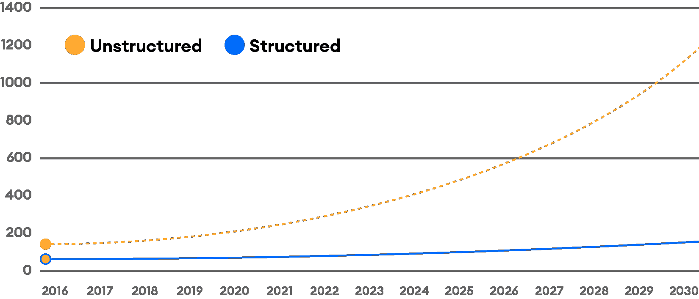
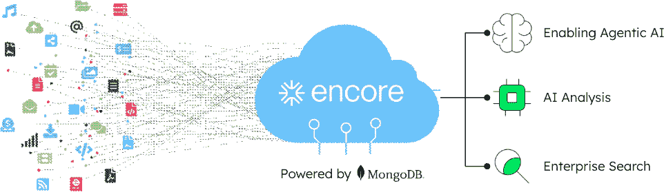
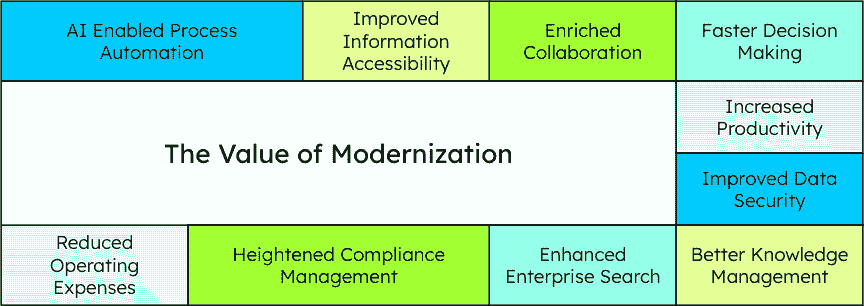

# 第十七章：使用 MongoDB 和 AI 的企业文档管理

智能企业的转型始于一个基本真理：AI 的强大程度取决于它可以访问和理解的数据。虽然组织已经花费了几十年积累大量信息库，但其中许多关键业务智能仍然被困在那些从未为 AI 时代设计的传统系统中。

本书最后一部分探讨了企业平台必须如何演变以支持真正智能的操作：从重新构想我们存储和访问非结构化内容的方式，到民主化代理 AI 能力，再到实施下一代因果和协调的智能系统。每一次转型都建立在上一代的基础上，为企业奠定基础，这些企业不仅使用 AI 工具，而且本身作为智能系统运行。

我们从可能被忽视但最基本挑战开始：将每个组织中存在的庞大暗数据档案转化为 AI 就绪的智能内容平台。

但这一切正在迅速改变。AI 终于能够弥合结构化/非结构化数据差距。多亏了像**Encore**这样的平台，它建立在 MongoDB 之上，**企业文档管理（EDM**）正成为生产力、合规性和客户体验的动态、AI 驱动的基石。

到本章结束时，你将理解以下内容：

+   为什么传统的 EDM 系统创建了大量无法访问的暗数据，这限制了决策

+   非结构化数据在增长和相关性方面都超过了结构化数据

+   为什么 AI 特别适合将被动文档转化为活跃的、智能的内容资产

+   如何通过 MongoDB 驱动的平台（如 Encore）通过灵活的架构和本地 AI 集成来创造价值

+   通过现代 EDM 用例（如索赔处理、客户支持和审计准备）组织所取得的成果

+   文档导向架构和集成矢量搜索如何使 AI 驱动的内容管理成为可能

+   如何通过 Encore 与 AWS Bedrock 的集成实现即时内容智能，而无需复杂的配置

+   AI 转型的最后一英里涉及的内容，以及为什么内容就绪是关键因素

+   如何将电子文档管理（EDM）现代化视为业务价值加速器，而不是存储升级

+   为什么随着 AI 成为企业运营的核心，EDM 的作用越来越重要

# 数字文件柜时代

传统电子文档管理系统是为不同的时代设计的。它们被设计用来存档扫描文档、满足合规性要求，如果你很幸运的话，还能让你找到和检索文档。内容通过基于传统 SQL 数据库结构的严格分类法进行索引。搜索依赖于简单的关键字查询，针对有限的索引字段，当处理大型文档库时，往往会产生令人沮丧的结果。这些系统无法理解内容，提供动态搜索，处理自然语言，或集成到 AI 工作流程中。最好的情况下，它们只是数字文件柜。

## 传统系统的隐藏成本

传统电子文档管理的局限性远不止不便。它们创造了可衡量的业务影响，大多数组织从未完全计算过。例如，当团队搜索例如 Q3 的*合同*时，典型的系统会返回数百个无关的文件，与相关文件混合在一起，迫使手动在大量的错误正例中进行排序。知识工作者每天花费高达 3.6 小时仅仅是为了寻找信息，对于大型组织来说，这代表着数百万的生产力损失 [1]。

合规性变成了一个反复出现的噩梦。当审计员到来时，团队会花费数周时间收集本应立即可访问的文件。版本控制混乱意味着关键决策是基于过时的信息做出的，多个文档版本散布在电子邮件、共享驱动器和本地存储中。隐藏的成本是惊人的；文档检索失败代表着企业巨大的生产力损失，搜索所花费的时间转化为大型组织数百万的价值损失。

## 传统的架构限制

基于关系数据库构建的传统电子文档管理平台创造了基本的架构限制，随着内容量和组织复杂性的增长，这些问题变得越来越突出。理解这些限制有助于解释为什么许多组织在文档管理转型方面遇到困难。

**模式刚性**代表了最大的限制。每个新的文档类型或元数据字段都需要仔细的数据库模式规划，通常涉及实施期间的系统停机。这造成了一个根本的不匹配：业务文档本质上是多变且不可预测的，而关系结构则要求一致性和预定义的关系。PDF、图像、电子邮件和多媒体内容不得不强行适应表格结构，在这个过程中往往丢失了有价值的相关信息。

**可扩展性瓶颈**随着存储库的增长而出现。传统架构在地理分布上遇到困难，使得全球组织难以在时区之间提供一致的文档访问。随着复杂连接和**原子性**、**一致性**、**隔离性**和**持久性**（**ACID**）合规性要求带来的计算开销随着数据量的增加而恶化，性能的下降是可预测的。在高峰使用期间搜索超时成为了一种常见的挫折。

**集成复杂性**加剧了这些问题。每个业务系统都需要与文档存储库进行点对点连接，从而创建维护密集型的架构。当底层系统发生变化（它们经常发生变化）时，集成就会中断，需要持续的 IT 关注，这会分散资源，使其无法用于增值能力。

**现代替代方案**通过各种方法解决这些限制：处理非结构化内容的面向文档的数据库、动态扩展的云原生架构、减少集成复杂性的微服务设计以及支持全球操作的分布式系统。关键洞察力并不是关系数据库本身有缺陷，而是电子文档管理系统（EDM）的要求已经超越了传统架构设计所能处理的能力。

## 当数字承诺未能实现时

数字转型的承诺常常与实施现实相冲突。组织在企业内容管理系统上投入了大量资金，却发现数字化破旧流程只是创造了更快的无效方式。麦肯锡的研究表明，66%的企业软件项目存在成本超支，这表明整个行业在实施方面存在系统性挑战[2]。

组织经历了代价高昂的文档管理失败，这是更广泛模式的一部分，其中大型 IT 项目经常超出预算，未能实现承诺的好处。基本问题不在于技术；而是遗留的电子文档管理系统（EDM）架构无法随着业务需求的发展而发展，也无法与新兴的人工智能能力集成。

结果呢？堆积如山的数据暗物质，实际上无法有效搜索或用于决策[3]。

## 非结构化数据挑战

这就是挑战：非结构化数据不遵循模式。它存在于 PDF 文件、图像和电子邮件中，散布在各个系统中，通常没有可靠的元数据。没有专门的基础设施，很难搜索、治理或分析。

这为人工智能（AI）设置了一个障碍。**大型语言模型**（**LLMs**）需要丰富上下文、组织良好的数据。标签不良或无法访问的内容阻止了 AI 提供有意义的价值。

数字告诉我们故事：非结构化数据现在占所有企业信息的 90%以上，包括电子邮件、文档、视频、社交媒体内容和传感器输出。这种数据类型每年增长 55-65%[4]，远远超过结构化数据增长。

图 17.1：显示非结构化数据与结构化数据增长对比的图表

*图 17.1* 展示了这种指数级增长模式。虚线橙色线表示非结构化数据从 2016 年的不到 200 个单位急剧上升到 2029 年的超过 1000 个单位，而代表结构化数据的蓝色线则相对平坦，在同一时期内仅从大约 100 个单位增长到 200 个单位。

尽管其数量和潜在价值巨大，但非结构化数据通常仍然被孤立、未分类和未充分利用，给旨在利用人工智能和数据分析的组织带来挑战。随着企业越来越多地采用人工智能技术，有效管理和分析非结构化数据的能力变得至关重要。如果没有强大的策略来处理和解释这个庞大的信息库，企业可能会错失关键见解，在竞争格局中落后。

# 使用 Encore 重新定义文档管理

现在，组织需要的不仅仅是内容存储；他们需要能够从非结构化数据中提取关键见解，将这些见解输入到下游自动化和数据分析中，并在不造成过度运营负担的情况下确保合规性的系统。这就是人工智能的用武之地。当人工智能能够理解你的档案时，你的文档就不再仅仅是被动、不透明的记录，而是成为活跃的商业资产。让我们看看在这个领域人工智能的一些实际成果。

## 索赔处理

保险索赔通常涉及大量文档，包括事故报告、评估、医疗记录、照片、电子邮件等等。传统上，团队需要花费数小时追踪文件并将所有内容拼凑在一起。

使用 Encore，这些文档在通过电子邮件、第三方门户或分支上传到达的瞬间就会被摄取。Encore 会自动标记和组织它们，提取关键细节，如索赔编号和日期，并以清晰、可搜索的时间线呈现所有内容。

现在，处理者只需简单地说，“给我展示 John Doe 2024 年 3 月的汽车索赔的所有文档”，就能立即获得包含相关文档和缺失信息的即时摘要。

这导致索赔处理速度更快、准确性更高，客户也更满意。

## 呼叫中心支持

支持代表在同时处理过时系统和散乱的文档的同时，还要回答棘手的问题。大量支持电话无法仅凭业务应用中的数据解决。许多关键政策和索赔文档的细节仅存在于存储的文档图像中。这会导致长时间的等待和沮丧的呼叫者。

Encore 通过将政策文件、历史互动、常见问题解答和通话记录集中在一个智能内容中心来简化混乱。当客户问：“我的挡风玻璃损坏是否受保？”时，代理可以搜索那个确切的问题，并立即获得正确的摘录，以及相关的案例和类似查询。

这导致回答更快，通话更短，客户体验更好。

## 合规性和审计准备

当进行审计或合规性检查时，团队通常会急忙寻找多年的文档，如表格、证书和批准文件，这些文件通常被埋藏在孤立的系统中。

Encore 简化了审计流程。随着文档的上传或捕获，Encore 对其进行索引和分类，将每个文档与正确的流程或案例关联起来。在审计期间，团队可以立即调出所需的内容，查看摘要，甚至标记缺失的项目，如未签署的表格或过期的文件。

这导致审计响应更快，合规差距更少，且心情更舒畅。

## 使用 MongoDB 和 Encore 构建新的 EDM 平台

那么，Encore 有何不同之处？从根本上讲，Encore 从零开始重新构想 EDM。基于 MongoDB 构建，它摆脱了传统内容平台的僵化结构。文档被视为灵活的、智能的数据对象，而不仅仅是带有名称和日期的附件。

图 17.2：Encore 的 AI 驱动的内容智能平台

本图展示了 Encore 将非结构化企业内容转化为智能商业资产的方法。在左侧，来自组织各处的不同文档类型、电子邮件、图像和文件流入 Encore 的云原生平台。系统随后通过 AI 驱动的分类和组织处理这些分散的内容，在右侧提供三个核心智能能力：**启用代理 AI**以实现自主内容处理、**AI 分析**以实现自动化洞察和总结，以及**企业搜索**以实现即时内容发现。这个可视化展示了现代 EDM 平台如 Encore 如何突破传统数字文件柜的限制，创建活跃的智能内容生态系统，从而推动 AI 驱动的业务运营和决策。

即使在我们讨论 AI 之前，MongoDB 的 NoSQL 架构和丰富的搜索功能集也为传统 EDM 平台提供了实际的优势。例如，Atlas 的**分面搜索**功能提供了传统系统所不具备的直观内容过滤级别。

在向 AI 能力发展过程中，Encore 利用 MongoDB 对向量嵌入和向量搜索的支持，这些工具使 Encore 能够充分利用 AWS Bedrock LLM 和 GenAI 套件。几乎无需额外的配置或设置，用户发现他们的非结构化内容得以释放，进入 AI 的力量。

下面是 Encore 和 MongoDB 一起立即提供的内容：

+   **灵活性**：无需重新设计数据库即可存储和演进您的内容

+   **实时搜索和访问**：立即检索您所需的内容

+   **AI 驱动的洞察**：自动分类、提取和总结内容，无需更多手动标记或翻阅文件夹

这是为 AI 时代构建的 EDM。Encore 不仅允许您管理内容，还允许您激活内容。

## EDM 现代化的紧迫性

组织拥有堆积如山的文档，其中大部分仍然无法搜索、非结构化和利用率低。无论是客户服务、合规、索赔处理还是审计，团队都在浪费时间挖掘静态文件。

现代化传统文档管理的业务案例远不止简单的存储改进。采用智能内容平台的组织在多个运营维度上实现变革性价值，从流程自动化到增强的安全框架。

图 17.3：现代化对 EDM 的价值

此图展示了当组织使用 AI 驱动的平台现代化其文档管理基础设施时实现的全面业务效益。这种转型创造了相互关联的价值链，其中改进相互增强。**AI 驱动的流程自动化**是催化剂。当文档自动分类和路由时，**信息可访问性**自然会提高。这种增强的可查找性直接促进了**丰富的协作**，因为团队花在搜索上的时间减少，而花在共同处理内容上的时间增加。结果是**决策速度更快**，因为关键信息在需要时浮现。这些运营收益创造了生产力乘数效应。在文档任务上节省的时间在每位员工的互动中累积。同时，数据安全和合规管理协同工作。组织内容以实现可访问性的相同 AI 系统还识别敏感信息以进行保护。财务效益相互关联，因为自动化减少的运营成本使组织能够投资于战略举措，而增强的搜索和知识管理则防止了重复工作。这些相互关联的改进说明了为什么现代化的 EDM 代表了一种战略性的商业投资，而不仅仅是简单的技术升级。

AI 可以解决这个问题，但前提是它能够访问高质量、可读、结构化的内容。AI 创新通常失败并非因为模型薄弱，而是因为数据准备不足。非结构化内容是 AI 转型的“最后一公里”，而由 MongoDB 驱动的 Encore 则填补了这一差距。它使组织能够现代化其内容基础设施，释放隐藏的价值，并加速企业 AI 的道路。

现代解决方案如 Encore 展示了 MongoDB 的面向文档的架构如何使组织超越传统的数字文件系统。当与人工智能功能相结合时，这些平台将传统档案转化为可搜索的、智能的内容库，能够积极支持业务运营，而不仅仅是存储文档。

# 摘要

电子文档管理（EDM）从尘封的数字文件柜转变为人工智能驱动的智能内容平台，这一转变是由解锁暗数据的迫切需求所驱动的根本性转变。随着 90%的企业信息作为无法访问的非结构化内容被困住，年增长率为 55-65%，组织面临一个关键选择：进化他们的文档管理方法，或者眼睁睁地看着宝贵的商业智能被埋藏在旧系统中。基于 MongoDB 灵活的面向文档架构的现代 EDM 平台，如 Encore，展示了人工智能如何通过自动分类、向量搜索能力和与 AWS Bedrock 的无缝集成，将被动存储转化为积极的企业资产。

在索赔处理、呼叫中心支持和合规管理等方面的实际应用证明，智能文档平台通过大幅减少搜索时间、提高准确性和简化审计流程，能够立即带来可衡量的价值。现代面向文档的架构与人工智能驱动的内容智能的结合，使组织能够超越僵化的、依赖于模式的系统，转向能够自主理解、分类和综合信息的动态平台。这一演变将电子文档管理（EDM）定位为人工智能转型的关键最后一公里，适当的数据准备决定了企业人工智能项目能否成功实现可衡量的业务成果。

下一章探讨了组织如何通过与 MongoDB 的合作伙伴 Dataworkz 合作，在他们的企业中民主化代理人工智能，超越文档管理，构建能够自主工作以实现特定商业目标并带来即时运营转型的智能代理。

# 参考文献

1.  *报告：员工每天花费 3.6 小时寻找信息，导致倦怠增加*：[`venturebeat.com/business/report-employees-spend-3-6-hours-each-day-searching-for-info-increasing-burnout/`](https://venturebeat.com/business/report-employees-spend-3-6-hours-each-day-searching-for-info-increasing-burnout/)

1.  *按时、按预算、按价值交付大规模 IT 项目*：[`www.mckinsey.com/capabilities/mckinsey-digital/our-insights/delivering-large-scale-it-projects-on-time-on-budget-and-on-value`](https://www.mckinsey.com/capabilities/mckinsey-digital/our-insights/delivering-large-scale-it-projects-on-time-on-budget-and-on-value)

1.  *暗数据*：[`www.gartner.com/en/information-technology/glossary/dark-data`](https://www.gartner.com/en/information-technology/glossary/dark-data)

1.  *数据未来：你应该了解的非结构化数据统计信息*：[`www.congruity360.com/blog/the-future-of-data-unstructured-data-statistics-you-should-know/`](https://www.congruity360.com/blog/the-future-of-data-unstructured-data-statistics-you-should-know/)
