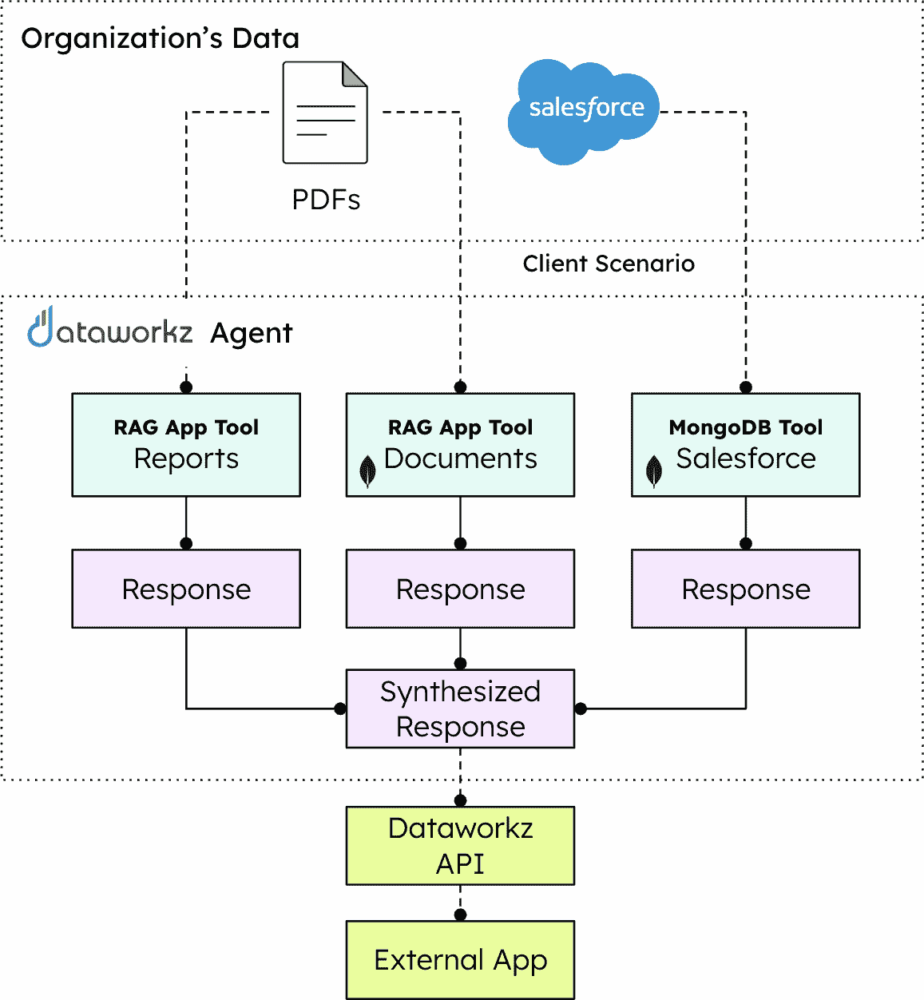
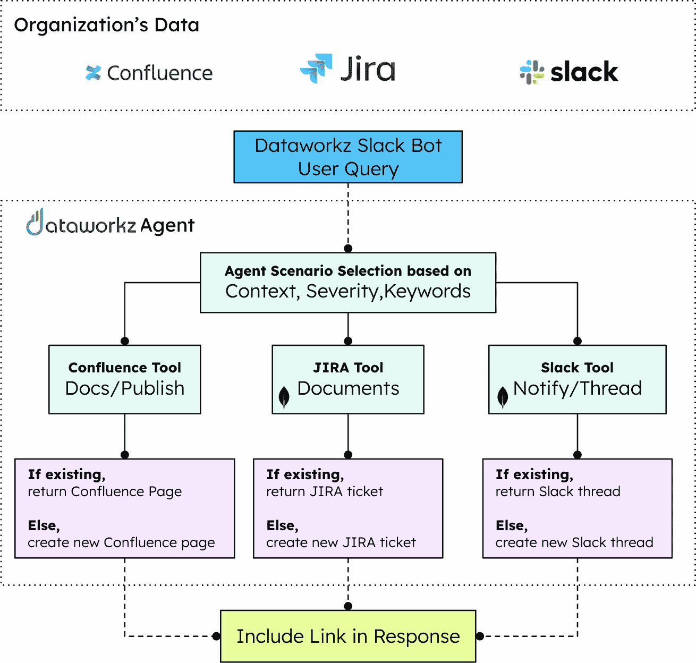
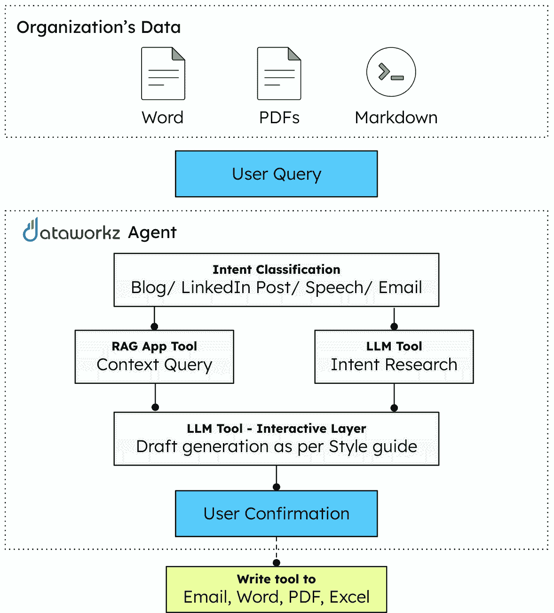

# 第十八章：使用 Dataworkz 和 MongoDB 民主化企业代理 AI

围绕人工智能的喧嚣比以往任何时候都要大，然而，大多数组织都难以将人工智能的潜力转化为有形、即时的商业价值。核心问题通常在于决策，因为公司陷入等待完美的数据基础设施、尝试需要数年才能完成的巨大变革，或者部署无法扩展的孤立解决方案。

代理人工智能系统自主工作以实现特定的商业目标，在无需持续人工监督的情况下做出决策和采取行动。这种向主动智能的转变使组织能够实施能够立即产生价值的同时，朝着更复杂的自动化方向发展的 AI 解决方案。

成功的 AI 采用不需要大量前期投资或数年的开发周期。通过涵盖金融服务、开发者运营和品牌管理的现实案例研究，我们将探讨不同成熟度的组织如何部署代理 AI 解决方案，以改变特定的业务流程，并在几周内而不是几年内实现可衡量的投资回报率。

在本章中，您将了解以下内容：

+   数据成熟度光谱上不同组织如何实施适合其当前能力和基础设施的 AI 解决方案

+   代理人工智能在金融服务、DevOps 和品牌传播等现实世界应用中，通过实际应用实现即时商业价值的作用

+   客户洞察引擎通过动态场景生成和个性化反馈，将金融顾问培训进行变革的能力

+   如何通过自动化管理任务和简化工作流程，DevOps 效率代理消除开发者生产力瓶颈

+   品牌传播代理如何通过复杂的 RAG 和代理编排确保大规模通信的一致性

+   简单有效的 AI 实施，无需大量前期投资或复杂的开发周期，就能提供可衡量的投资回报率

+   现代数据架构，如 MongoDB Atlas，为快速 AI 开发和部署提供支持，适用于各种用例

+   代理人工智能的未来轨迹，指向作为虚拟员工和值得信赖的伙伴的自主系统

# 为每个组织定制 AI

成功实施 AI 不是一项一刀切的任务。组织存在于数据成熟度的光谱上，每个组织都有其独特的挑战和机遇。了解您的组织在这个光谱上的位置对于制定能够利用当前能力产生即时影响的 AI 战略至关重要。以下是它在光谱上的表现：

+   **新兴组织**：如果您正在处理碎片化的数据、有限的基础设施和内部技术人才的短缺，您的重点应放在建立基础数据实践和展示快速、有影响力的胜利，以建立势头和内部对 AI 采用的认可。

+   **发展中的组织**：如果你被孤岛式数据系统、大量不无缝集成的点解决方案以及难以在整个企业中扩展初始人工智能成功所困扰，那么你的首要任务应该是统一数据、优化现有投资并构建可扩展的人工智能框架。

+   **成熟组织**：这些组织数据丰富，通常拥有显著的技术能力，但仍可能面临诸如模型可解释性、从复杂数据流中获得实时洞察或在没有广泛人工监督的情况下完全自动化复杂流程等问题。对于这些公司来说，挑战通常在于解锁更深层次的智能和实现全面运营效率。

在您的组织中实现人工智能民主化的关键是实施适合您当前阶段的解决方案。一个关键推动者是采用现代数据架构。例如，**MongoDB 向量搜索**等技术提供了处理不同数据类型和支持人工智能驱动洞察动态需求的灵活性和可扩展性，使得无论您的成熟程度如何，快速的人工智能开发和部署都成为可能。

以下案例研究展示了不同成熟阶段的组织如何成功实施代理人工智能解决方案。

## 案例研究 1：客户洞察引擎 – 代理人工智能为金融顾问

Dataworkz 代理人工智能的一个领先案例是**客户洞察引擎**。该解决方案解决了金融服务中的一个关键需求：在不断变化的监管和市场环境中，金融顾问的持续、实用的技能发展。传统的培训方法往往无法提供构建信心和磨练金融咨询微妙艺术所需的动态、动手经验。

客户洞察引擎通过多代理架构运行，集成了各种数据源和处理能力。如图*图 18.1*所示，系统从组织的现有数据资产开始，包括 PDF 和 Salesforce 记录，这些数据被输入到一个由专门的 RAG 应用程序组成的协调网络中。中央 Dataworkz 代理协调不同工具之间的交互，从报告分析到文档处理再到 Salesforce 集成，综合每个组件的响应，通过 API 向外部应用程序提供全面的洞察。

图 18.1：客户洞察引擎架构

客户洞察引擎的主要目标简单而深刻。它提高了顾问的专业能力，确保了坚定不移的合规性，并最终显著改善了客户结果。它通过超越静态学习，转向由代理人工智能驱动的自主、互动式辅导系统来实现这一点。

这是您如何利用其代理组件来转变顾问培训的方法：

+   **动态场景生成**：您可以根据具体的学习目标、当前市场状况和个别顾问的需求，生成无限量的真实和多样化的客户场景。这创造了一个真正动态的实践环境，它随着您的培训需求而发展。

+   **实时性能分析**：当您的顾问在模拟客户交互中导航时，您可以监控他们的响应是否符合您建立的最佳实践框架、合规性指南和有效的客户参与策略。系统使用您直接提供给代理的指南实时分析性能。

+   **个性化反馈和指导**：您可以超越简单的*正确/错误*评估，为您的顾问提供具体、可操作的改进建议。系统解释*为什么*某些方法更有效，以及如何改变响应的情感以更加专业。这使您能够提供全天候可用的个性化辅导。

+   **集成**：您可以利用现有的内部知识库、行业最佳实践和现实世界的案例研究来指导场景生成和反馈机制。通过 RAG 技术，您可以找到并利用与顾问经验中最相似的场景。

通过部署客户洞察引擎，您可以为个人顾问以及您的整个金融公司带来显著和即时的价值：加速技能发展、增强信心、提高合规性、保持咨询质量的一致性、增强客户保留，最终实现业务增长。

## 案例研究 2：DevOps 效率代理 – 提升开发者生产力

除了面向外部的解决方案之外，代理 AI 在内部运营效率方面具有巨大的潜力。对于大型企业，尤其是在软件开发和 IT 运营领域，大量的开发者时间往往被行政开销、信息检索和常规任务自动化所消耗。Dataworkz 通过其**DevOps 效率代理**等解决方案应对这一挑战，这是代理 AI 如何为家庭办公室员工，尤其是开发者提高效率的一个例子。

DevOps 效率代理通过协调多个企业平台之间的交互，简化了开发者工作流程。如图*图 18.2*所示，系统通过集中的 Dataworkz 代理与您现有的工具，如 Confluence、Jira 和 Slack 无缝集成。当用户通过 Slack 机器人界面提交查询时，代理会根据上下文、严重性和关键词智能选择合适的工具，然后在响应中包含相关链接之前，根据需要检索现有信息或创建新项目。

图 18.2：DevOps 效率代理工作流程

考虑企业开发者的典型工作流程：在多个平台之间导航，如内部知识库、任务跟踪系统、代码库和服务管理工具。每次上下文切换、每次搜索和每次手动创建工单都消耗了宝贵的时间，这些时间本可以用来创新和建设。研究表明，开发者的日常工作中，可能高达 25% 的时间，对于拥有数千名开发者的大型组织来说，被用于这些非编码任务。这代表着巨大的未被挖掘的效率提升。

DevOps 效率代理旨在成为开发和运维团队的高级副驾驶。它是一个面向内部的代理，简化了复杂的流程，自动化了日常的行政任务，并提供了对分散系统中的关键信息的即时访问。它作为开发者和他们日常使用的工具之间的智能中介，提供以下功能：

+   **智能信息检索和上下文问答**：开发者可以与 AI 代理进行对话式交互，查询存储在各个存储库中的信息，如内部知识库、代码库、任务管理系统和服务管理系统。代理利用其对自然语言的理解以及从这些跨领域数据源访问和综合信息的能力，提供精确、可操作的反应。

+   **自动化行政任务执行**：代理使开发者和利益相关者能够自动化常见的、耗时较长的行政任务。例如，开发者可以简单地要求代理创建一个针对“影响“Analytics Reporting”服务的“Sev 2”问题的“创建一个事件工单””，代理将与服务管理系统交互，以草稿状态创建一个工单，预先填充字段并关联相关数据。它还可以管理对较低环境的常规发布，所有这些操作都使用现有的草稿作为参考点。

DevOps 效率代理通过提供显著的时间节省、减少上下文切换、提高信息可访问性、增强开发者体验以及更快的故障事件解决和变更管理，为组织提供了实质性的、可衡量的价值。

## 案例研究 3：品牌信息代理 – 确保大规模的品牌沟通一致性

考虑到业务需求变化之快，在所有沟通中保持一致和真实的品牌信息至关重要，这对于信誉和认可至关重要。然而，对于大型组织来说，确保每个内部电子邮件、外部社交媒体帖子或客户沟通都遵循特定的风格指南可能是一项挑战。Dataworkz 利用代理式 AI 直接应对这一挑战，提供如 **品牌信息代理** 这样的解决方案，使组织能够创建始终如一地反映独特和已建立的品牌人格的内容。

品牌信息代理通过一个复杂的内容生成管道运行，确保所有沟通中的风格一致性。如图 18.3 所示，系统首先通过各种格式（Word 文档、PDF 和 Markdown 文件）摄取您组织现有的内容资产。当您提交内容请求时，Dataworkz 代理首先对意图进行分类（您是在创建博客文章、LinkedIn 更新、演讲还是电子邮件），然后使用 RAG 技术进行上下文研究和 LLM 能力进行意图分析。交互层根据您的特定风格指南生成草稿，允许用户确认和改进，并最终以您首选的格式输出内容。

图 18.3：品牌信息代理架构

目标很简单：赋予从营销和传播到内部利益相关者等各个团队权力，让他们每次都能生成听起来和感觉上完全正确的内 容。这不仅仅是关于语法或拼写；这是关于细微差别、语气、特定措辞，甚至格式，所有这些都对独特的品牌身份做出了贡献。

品牌信息代理是一个智能系统，它结合了 RAG 和复杂的代理编排，以实现这种风格一致性。它旨在复制特定角色（让我们称其为*Alex*）的独特沟通风格，确保每一块内容都带有 Alex 所体现的权威而又平易近人的语气。

这里是如何实现这种代理解决方案的：

+   **专用上下文 AI 应用**：对于 Alex 可能创建的每种内容类型（例如，内部团队更新、面向公众的思想领导力文章和销售接触信息），Dataworkz 使用我们的上下文 AI 框架构建一个专门的 RAG 应用。每个这些应用都精心配置了针对该内容类型的 Alex 特定风格指南，以及作为参考知识库的其过往沟通的全面集合。

+   **智能代理编排**：当用户请求在特定主题上生成特定类型的内容时，中央品牌信息代理介入。该代理智能地识别适合请求内容类型的适当 RAG 应用，然后将用户的主题作为查询发送。RAG 应用作为一位高度见闻的策展人，从 Alex 过往内容的存档中检索出最符合风格和主题的相似示例。

+   **具有上下文指导的 GenAI**：最后，代理将用户的原始请求以及由 MongoDB 驱动的 RAG 应用检索到的丰富、风格相关的示例结合起来，并指导一个 GenAI 模型创建新的内容。这种内容不仅解决了用户的具体主题，而且与 Alex 确立的风格、语气甚至首选格式保持一致。

品牌信息代理通过确保一致的品牌身份、加速内容创作、降低偏离品牌信息的风险、赋权非专家用户以及使沟通工作具有可扩展性，从而提供有形的价值。

这三个案例研究展示了一个关键见解。代理 AI 解决方案不需要多年的开发或大规模的基础设施改造，就能带来有意义的商业影响。无论您是在培训财务顾问、简化开发者工作流程，还是维护品牌一致性，关键在于识别特定的痛点，并实施与现有系统协同工作的针对性解决方案。这种实用的 AI 实施方法构成了任何组织都可以遵循以实现类似结果的框架基础。

# 使用 Dataworkz 和 MongoDB 实施有效的 AI 解决方案

一个常见的误解是，有影响力的 AI 需要多年的复杂开发和大量的前期投资。然而，我们探索的案例研究表明了一个不同的现实。简单的、有效的 AI 解决方案可以立即带来可衡量的商业价值。关键在于关注务实的实施，使 AI 在组织的各个部分都变得可访问和有用。

## 将您的 AI 策略付诸实践

您可以通过遵循强调快速部署而非完美解决方案的框架来实现可衡量的结果。从您当前的能力开始，并根据结果进行迭代。

以下关键原则概述了一个有效实施的框架：

+   **识别高影响用例**：确定 AI 可以快速提供明确、可衡量价值的特定痛点或机会。

+   **利用现有数据**：通过使用现代工程技术来摄取、转换和统一来源，从结构化数据库到半结构化云存储和 SaaS 应用程序，解锁现有、通常孤立的、数据的价值，使其为即时使用做好准备。

+   **敏捷原型设计和迭代**：优先考虑快速原型设计和迭代开发，以快速看到工作的 AI 解决方案，尽早展示价值，并在整个生命周期中提供反馈，以完善代理的能力。这种敏捷方法最小化了风险并加速了价值实现的时间。通过灵活的 A/B 测试，您可以确保您的应用程序表现最佳。

+   **关注用户采用**：一个 AI 工具的好坏取决于其采用率。您应该优先考虑直观的无代码和低代码界面，以及与现有工作流程的无缝集成。对于财务顾问、开发者和传播团队来说，这意味着对话式 AI 和自然、辅助的用户体验，确保工具真正被使用和接受，而不是成为技术上的奇观。

+   **架构考虑因素**：任何成功 AI 实施的基石是一个可扩展的架构。你可以设计和实施可扩展的数据解决方案，通常利用 MongoDB Atlas 等技术与向量搜索相结合来为 AI 应用提供动力。其灵活的文档模型和可扩展性使其适合存储 AI 代理所需的各种数据，从用户交互到知识库，促进快速 AI 开发和部署。

这些实施原则为部署能够带来即时价值的智能代理 AI 解决方案提供了一个实用的路线图。然而，随着组织开始体验到这些自主系统的变革力量，值得考虑的是这项技术将何去何从，以及它将如何在未来几年重塑企业运营。

## 企业智能代理 AI 的未来方向

企业中 AI 的发展轨迹指向越来越复杂和自主的智能代理系统，这些系统作为虚拟员工行动。由 MongoDB 提供动力的 Dataworkz 等解决方案设想了一个未来，其中 AI 代理不仅仅是工具，而是企业运营中不可或缺的、积极主动的合作伙伴。

虽然 AI 将继续增强人类能力，但智能代理 AI 将越来越多地承担更复杂、积极主动的角色。想象一下，代理可以自主监控实时市场情绪，识别新兴风险，或在没有直接人类提示的情况下启动初步合规性检查。

这并不是关于取代人类专业知识，而是提升它。AI 代理将成为值得信赖的合作伙伴，处理常规或数据密集型任务，使人类专业人士能够专注于战略思考、复杂问题解决和关系建立。本章涵盖的案例研究都是这一现象的缩影，在同时提高输出质量的同时释放人力资源。

Dataworkz 致力于使高级 AI 对所有类型的组织都变得可访问，从大型金融机构到繁忙的 IT 部门和动态的营销团队。我们相信，智能代理 AI 的好处不应仅限于科技巨头。

随着 AI 系统获得更多自主权，道德考量变得至关重要。实施智能代理 AI 的组织必须优先考虑负责任的发展实践，确保在所有企业应用中公平、透明和强大的安全性。可解释的 AI 架构，允许利益相关者了解决策是如何做出的，对于在自主系统中培养信任和问责制变得越来越关键。

# 摘要

本章解决了一个当今组织面临的关键挑战：如何超越 AI 炒作和试点项目，实施能够带来切实、即时商业价值解决方案。核心问题不是技术能力，而是实施瘫痪；公司陷入等待完美的数据基础设施，尝试需要数年才能完成的巨大变革，或者部署无法在整个企业中扩展的孤立解决方案。

我们探讨了代理人工智能提供了一种根本不同的方法，从反应模型转向主动智能，这种智能能够自主工作以实现特定的商业目标。通过三个全面的案例研究，我们展示了实际应用：客户洞察引擎通过动态场景生成和个性化反馈，改变了金融顾问培训；DevOps 效率代理通过在多个平台（如 Confluence、Jira 和 Slack）上自动化行政任务，消除了开发者生产力瓶颈；品牌信息代理通过使用复杂的 RAG 和代理编排技术，确保大规模通信的一致性。我们提出的实施框架强调识别高影响用例、利用现有数据资产、敏捷原型设计和迭代、关注用户采用，以及使用现代技术（如具有向量搜索功能的 MongoDB Atlas）构建稳健的架构基础。

在下一章中，我们将探讨实现这一未来愿景的技术基础，研究如何像**模型上下文协议**（**MCP**）这样的新兴标准正在革命性地改变人工智能的集成，并为由因果人工智能和上下文感知系统的发展所推动的更高级智能架构铺平道路。
