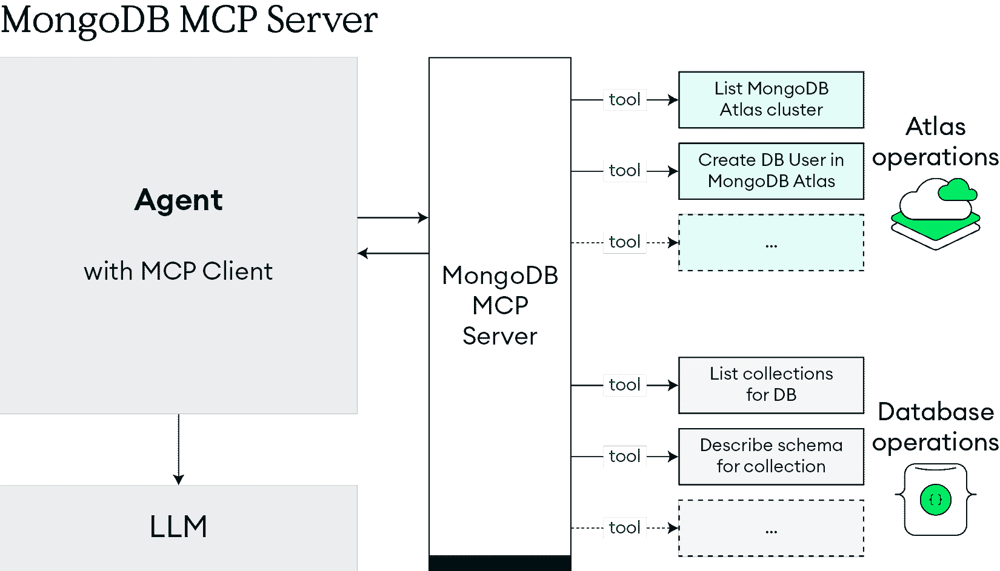

# 第十九章：展望：超越今天的 AI

当我们开始这本书时，我们知道存在一种风险，即到读者阅读时，技术可能已经发生了变化。这就是 AI 的速度。但建筑原则超越了任何单一模型发布。这就是为什么我们专注于构建多年后仍保持相关性和适应性的概念。

在这些章节中，我们追踪了从现代化基础设施到智能架构的生动、有生命力的现实的轨迹：感知、适应和演化的系统。我们看到行业在野外证明了这些概念，将它们从抽象转化为运营优势。

这不是猜测。这些模式已经进入生产阶段。问题不再是它们是否会塑造企业系统，而是领导者将如何快速适应它们。未来不会属于单体或狭窄的点解决方案。它属于为上下文、互操作性和持续进化而构建的智能架构。随着代理对其网络拓扑和环境（无需早期时代的痛苦）的认识增强，自我配置的适应性将出现。随着软件能力的增强，连接性也将随之出现。系统将越来越多地捕捉其创造者的意图，而不仅仅是用来描述它们的代码、文字或图像。

因此，最后一章不仅仅是为了作为结论。它是下一阶段的起点。你今天做出的决定将决定你的系统能否跟上已经出现在地平线上的事物。

# 从工具到上下文：智能架构的兴起

传统的软件系统执行孤立的任务。当存在智能时，它是脆弱和反应性的。传统的*记录系统*只能跟踪发生了什么。几十年来，这些记录系统定义了企业 IT。它们仍然有其位置，但下一波企业系统将决定接下来应该发生什么。

智能架构正在出现，它们可以：

+   **感知**和解释其环境，无需手动编码进行调整，例如，在移动到新的部署环境时自动重新配置。

+   **根据**实时数据**调整其行为，例如，调整摄入功能以处理新的智能电表。

+   **通过**多模态输入与人类和其他系统**进行交互，例如，外科医生在手术过程中在声音、视频和输入之间切换。

+   **从**先前结果**中学习并优化未来表现**。

这些转变反映了人类行为，不是作为孤立的功能，而是作为模块化、记忆丰富、目标驱动的协作者。在企业中，这意味着构建数据访问、推理、工具执行和决策权本身就内置到架构中的系统。

## MCP：构建上下文智能的基石

这一转变到自主智能体的最重要加速器之一是**模型上下文协议**（**MCP**）。由 Anthropic 于 2024 年[1]提出，并被包括 MongoDB 在内的多个组织迅速采用，MCP 定义了智能体访问工具、管理权限和跨任务保留记忆的标准。

与传统的 ETL-like 方法（将上下文映射到数据可能需要数月或数年）不同，MCP 绕过了这一负担。考虑传统的元数据管理项目，其中全球产品 ID 必须痛苦地在品牌和国家之间进行协调。MCP 通过允许 LLMs 直接解释上下文并相应地采取行动，避免了这种复杂性，大大减少了集成时间。

实际上，MCP 提供：

+   一种结构化的方式，让智能体发现和调用外部工具

+   明确的授权边界，定义何时以及如何使用这些工具

+   持久上下文，使智能体能够从过去的交互中学习

将 MCP 视为 AI 智能体及其操作工具之间的共享语言。它不是依赖于一次性集成，而是一个可组合的生态系统，其中上下文和治理被整合到每一次交互中。

MongoDB 的 MCP 服务器通过充当智能体接口（如 IDE、支持工具、内部共飞行员）和 MongoDB 功能库之间的连接组织体现这一方法。智能体可以做到以下几点：

+   列出 Atlas 集群或集合

+   创建或管理数据库用户

+   在 MongoDB 集合中读取、写入或索引数据

+   描述模式或提出性能优化建议

图 19.1：MongoDB MCP 服务器如何使智能体能够访问上下文工具

*图 19.1* 展示了 MongoDB MCP 服务器如何将 Atlas 管理连接到数据库操作，为智能体提供安全、策略感知的工作流程。

使用 MCP，这些操作成为安全、策略感知的工作流程。它们不仅连接工具，还通过记忆、实时适应和累积经验来协调它们。所有这些都保持在定义的范围内。

## 因果 AI：超越预测，迈向影响

单一的预测并不能定义企业 AI 的下一阶段。为了塑造结果，系统必须理解事件发生的原因，而不仅仅是可能发生的事情。

因果 AI 映射表示因果关系，使干预措施既可解释又以结果为导向。它将系统从对模式的反应转变为塑造决策。在金融服务中，除了将投资组合标记为表现不佳之外，因果系统可以确定确切的驱动因素（宏观经济指标、行业转变、投资组合构成），并在采取行动之前模拟干预措施（如重新分配或对冲）的影响。在客户体验方面，它可能揭示流失更多是由延迟的入职而不是定价驱动的，从而清楚地表明应该拉动哪个杠杆。

因果 AI 通过使结果可追溯、可解释和可问责，使决策更加清晰。但挑战是显著的：它们需要更干净的数据、更强的模型设计，以及将统计推断与领域专业知识相结合的判断。

随着自主性的增长，对可解释性的需求也将增加。在高风险行业中，领导者将坚持要求系统不仅能够展示其推荐的内容，还要说明为什么这个推荐会有效以及它将如何改变结果。在企业架构中，因果 AI 将与预测和生成系统并肩而立，提供将感知与行动联系起来的推理层。其集成将取决于：

+   **数据准备**：支持因果推理的强大、良好管理的数据集。

+   **模拟环境**：在部署前测试干预措施的安全的沙盒。

+   **治理框架**：确保因果模型反映道德、监管和业务约束的政策。

在企业架构中，因果 AI 更像是一个信任加速器，而不是一个新功能。当系统能够用人类语言解释其推理时，利益相关者更有可能采用并依赖它们做出关键决策。

## **内存架构**：为智能代理提供持久上下文

随着代理能力的增强，它们从无状态的实用工具转变为高度情境化的合作者。像人一样，它们发展历史、偏好和连续性意识，但只有当它们的架构被设计为能够记住时。如果没有这一点，它们就像健忘症患者一样，每次互动都像是从头开始。

软件代理也面临着任何托管服务相同的日常风险：停电、网络故障，甚至一个任性的清洁工拔掉服务器。与可以无后果替换的相同、无状态的容器群不同，智能代理依赖于它们随着时间的推移所建立的环境。这就是记忆进入架构的地方。

传统数据库提供**CRUD**（**创建**、**读取**、**更新**、**删除**）。代理需要更多，我们可以将其总结为**RALF**：**记住**、**适应**、**学习**、**遗忘**。他们需要灵活、具有偏差意识、高性能的数据层，能够承受故障、跨越多个实例，并在时间上保持上下文。这些不是老式 RDBMS 的优势。它们是现代文档数据库（如 MongoDB）的标志，尤其是在与以下结合使用时：

+   **向量数据库**用于语义回忆（例如，MongoDB Atlas Vector Search）

+   **RAG 管道**用于动态上下文注入

+   **代理记忆框架**，例如 LangGraph、MemGPT 或 MongoDB 自身的代理记忆功能

这些模式共同使代理能够回忆先前的互动，随着时间的推移进行个性化，并保持目标导向的状态。它们还带来了责任：防止过时或带有偏见的知识，执行隐私保护，并设计可以解释为什么某些事物被记住或遗忘的生命周期。

投入是值得的。记忆将代理从反应性工具转变为主动的合作伙伴。在客户服务中，它们不会重复提出相同的问题。在工业维护中，它们将根据多年的性能数据预测故障。在每一个领域，它们将根据所需的上下文和连续性采取行动，以在一段时间内更可靠地做出更好的决策。

## 宪法 AI：用原则治理智能

如果因果 AI 关乎推理，那么宪法 AI 关乎价值观。它确保智能系统不仅具有能力，而且受到可以阅读、辩论和随时间改进的原则的引导。

由 Anthropic 开发和推广的宪法 AI 不仅训练模型以人类反馈或真实情况为基础，还基于一套书面指导规则，这种类似于*宪法*的规则塑造了系统的行为、响应和对其行为的推理方式[2]。这些规则可能包括对有益性、无害性、诚实、公平以及在不明确时刻尊重人类判断的承诺。

这种方法部分源于**从人类反馈中进行强化学习**（**RLHF**）的局限性。虽然 RLHF 有效，但它成本高昂、不透明，并且高度依赖于人类评分者的质量。结果听起来可能很礼貌，但并不始终一致。宪法 AI 将一致性提升到上游。它不是在每一个转折点都依赖人类判断，而是允许模型根据明确的原则对其输出进行批判，并根据自己的响应调整这些原则，从而实现：

+   **可扩展性**：一旦原则被写下来，就可以广泛应用，无需数百万次的手动标注

+   **透明度**：行为可以追溯到书面规则，而不是隐藏的评分函数

+   **一致性**：响应在边缘情况和随时间推移中保持更稳定

但这并不意味着难题会消失。谁决定哪些原则最重要？冲突如何解决？我们如何处理文化细微差别？即使像“*避免冒犯*”这样的规则在不同行业或地区也可能意味着非常不同的含义。

然而，架构上的含义是明确的。可治理性必须内置于设计之中，而不是作为事后考虑的补充。正如 MCP 标准化了代理的行为，因果 AI 结构化了他们的推理方式，宪法 AI 设定了评判他们行为的标准。这些元素共同为设计上强大、可解释且值得信赖的 AI 系统构建了框架。

## 多代理系统：从单一模型到协作智能

如果一个 AI 模型可以学习、推理、计划和行动，那么当你将数百个这样的模型放在一起，每个模型都有自己的角色、记忆和视角时，会发生什么？

这不再是一个理论问题。多智能体系统已经在现实世界中运行：在制造业中，协调预测性维护、流程优化和质量控制；在医疗保健中，整合多个专业的输入以实现协调护理；在金融中，将投资组合管理和风险评估分配给专业代理。这些实施展示了多智能体架构如何迅速从实验转向生产。

这种模式简单明了，但具有变革性。多个相互作用的代理，每个代理都针对特定功能进行了优化，合作解决任何单一模型都无法触及的问题。AutoGPT、BabyAGI、OpenDevin 和 ChatDev 等项目通过模拟具有定义角色（规划者、编码者、评论家、测试员）的工作流程，并在迭代循环中传递任务来证明这一点。斯坦福、伯克利和谷歌 DeepMind 的研究小组现在正在调查这种模式的潜力和风险。

优势是令人信服的：

+   **任务分解**到专业角色

+   **并行执行**以加快工作流程

+   **交叉检查**以减少错误

+   **通过代理之间的交互产生**的**涌现创造力**

然而，随着复杂性的增加，风险也随之而来。多智能体系统可以产生反馈循环、未预见的依赖关系或满足即时目标但错过预期结果的战略。

为了这些系统能够运行，它们需要一个共享的环境，其中代理可以实时存储、读取和更新上下文。MongoDB 通过灵活的文档模式支持这一点，以适应不同的代理输出，通过变更流实现即时事件传播，通过向量搜索实现语义协调，以及基于角色的访问控制来维护边界。在实践中，分布式计算的原则正在应用于推理实体以及服务。

多智能体系统也不孤立存在。它们依赖于本章前面描述的治理框架、因果推理和记忆架构。这就是这些元素汇聚的地方。智能架构在作为相互依赖的社会而不是孤立的表现者时，在规模上证明了自己的价值。

# 回顾过去，展望未来：领域的模式

当我们进入最后阶段时，停下来反思这段旅程是值得的。在这些章节中，我们追踪了现代计算中最重大的转变之一：将人工智能操作化为现实世界系统的结构。最初是学术研究，现在已经成熟为一个分层、细腻且准备扩展的建筑学科，其中智能代理、基于检索的定位和多模态数据集成汇聚在一起，以支持跨行业的决策、个性化、优化和发现。

这本书并非旨在用抽象术语预测 AI 的未来。相反，它的目的是为实践者、架构师和决策者提供一个实际和概念性的基础，以理解今天的 AI 系统是如何构建的，性能良好的架构与脆弱架构的区别，以及这些系统是如何在制造业、媒体、零售、金融、保险和医疗保健等多样化的行业中大规模部署的。

在本节的结尾部分，我们总结了全书探讨的关键思想。我们通过回顾早期章节中阐述的核心架构原则和第二部分讨论的特定领域部署来实现这一点。

# 基础架构：从理论到实践

本书的前半部分定义了使生成和代理 AI 成为可能的架构原语和系统级概念。我们首先澄清了常被误用或误解的术语：**生成 AI**（**GenAI**）、**检索增强生成**（**RAG**）和代理系统。

这些都代表了不同的架构类别。基于**大型语言模型**（**LLMs**）构建的 GenAI 系统可以生成连贯且上下文合理的输出，但默认情况下缺乏基础。RAG 系统通过实时检索外部知识并附加到模型上下文窗口来增强生成模型。这种模式引入了可追溯性和事实基础，减轻了幻觉，并使输出可解释。

代理系统进一步扩展了这一点。它们不仅在一个输入-输出循环上操作，而是维护记忆、调用工具、跨步骤协调，甚至与其他代理交互。它们不仅从狭义上的提示，而且在更广泛的意义上，即不断演变的状态和目标导向上具有情境意识。这些系统使我们更接近自主软件，尽管始终受政策、记忆和架构的限制。

为了支持这些系统，本书深入探讨了向量嵌入的作用，这是语义的数值表示，允许系统在非结构化内容上进行搜索、聚类和推理。嵌入实现了语义搜索、个性化推荐、文档分类以及文本、图像和结构化数据之间的跨模态对齐。我们展示了嵌入如何在 RAG 和代理架构中成为基础，尤其是在向量启用文档数据库中存储时。

通过这个视角，我们介绍了行动系统概念：这些数据库不仅设计用来存储数据，还能实现人类与 AI 代理之间的实时决策、自动化和协作。我们探讨了面向文档的架构如何提供所需的灵活性来处理多种数据类型，同时保持智能应用所需的性能特征。

这本书的基础部分以对可信赖的人工智能和现代化的处理结束。我们确定，成功的 AI 实施不仅需要技术能力，还需要确保公平、透明和法规合规的治理结构。然后，我们展示了 AI 如何加速现代化努力，通过智能自动化将遗留代码和系统进行转型。在这个过程中，我们确立了理解*第二部分：现实世界案例研究和实施*中探讨的应用所需的架构背景。

## 行业应用：通过多样性进行验证

这本书的第二部分从基础转向应用。每一章都基于一个特定的行业，但共同来看，这些用例揭示了超越领域的架构模式。变化的不在于系统的结构，而在于数据的形式、监管约束和运营需求。从这个比较分析中，出现了一套共享的设计原则。

**制造业**展示了人工智能在物理操作上最直观的影响。在这里，智能系统将供应链从反应式转变为预测式，通过多标准分类优化库存，这种分类结合了定量指标和来自客户评价及供应商沟通的定性洞察。最引人注目的架构是多智能体系统，它协调预测性维护、流程优化和质量保证，每个智能体都有独立的记忆和反馈循环，通过文档数据库中的共享上下文实现统一。制造业还揭示了如何通过 GenAI 保留机构知识，否则这些知识将在经验丰富的工人退休时丢失，将机构知识转化为可搜索、可操作的见解。在汽车应用中，我们探讨了人工智能如何推动下一代车内体验和自动驾驶车队管理，这需要在不同数据速度的系统之间进行实时协调，而不创建危险的代理孤岛。

**媒体和电信行业**展示了那些面临推荐流量下降和平台依赖的部门如何利用人工智能进行转型。在这里，人工智能增强的搜索将传统的关键词匹配转变为以意图驱动的体验，理解用户上下文和偏好。内容个性化成为关键的区别因素，RAG 系统使大规模生成动态、定制化的体验成为可能。搜索生成式体验展示了传统信息检索如何演变成为对话式、上下文感知的交互，降低跳出率并加深用户参与度。在电信领域，代理式 AIOps 框架展示了复杂网络操作如何自动化和优化，实时欺诈检测系统处理数百万事件。这些行业强调了关键洞察：推动内容推荐的同一种架构，根据数据源和界面要求，也可以推动运营卓越。

**零售业**展示了人工智能在客户旅程的各个方面所展现的力量。在这里，人工智能增强的搜索功能使客户能够通过自然语言查询找到产品，超越了简单的关键词匹配，理解意图和上下文。个性化的营销和内容生成展示了人工智能的可扩展性优势，系统能够同时为数百万客户提供定制化的体验。需求预测和预测分析展示了零售商如何从被动转向主动规划，通过智能预测优化库存和供应链管理。店内互动的数字化揭示了实体零售如何从与数字渠道相同的智能中受益，通过数字收据和实时个性化等技术弥合线上线下体验之间的差距。对话式和代理式聊天机器人成为客户服务的变革性工具，提供自主、上下文感知的辅助，不断学习和适应客户需求。

**金融服务**提出了可能最复杂的监管和安全要求，需要平衡创新与合规的解决方案。在这里，我们追溯了从预测分析到生成式 AI 再到代理系统的演变，展示了每个阶段都是基于前一个阶段来创建更高级的能力。信贷申请的转型展示了人工智能如何使金融服务更具包容性，同时保持风险管理标准。企业知识管理系统展示了生成式 AI 如何革命性地改变内部运营，帮助员工访问和综合大量的监管和程序信息。客户体验转型成为了一个关键主题，AI 驱动的交互提供了个性化、实时的支持，同时保持了金融服务所必需的信任和安全标准。在环境、社会和治理（**ESG**）分析、支付处理和资本市场的高级应用展示了人工智能在整个金融生态系统中的潜在影响范围。从这个行业的一个关键洞察是语义数据保护的重要性，这些方法在保护敏感信息的同时保留了数据的含义和效用。

**保险业**揭示了人工智能如何改变世界上数据密集型产业之一。在这里，我们探讨了领域驱动的人工智能实施，展示了如何通过集成的数据存储统一处理结构化保单数据和如照片和报告等非结构化文档。承保自动化案例研究展示了书中最戏剧性的变革，将报价周期从数周缩短至数分钟，同时保持准确性和合规性。这展示了 RAG 架构与高性能推理的结合如何带来变革性的商业价值。索赔处理展示了人工智能在处理涉及多种数据类型和利益相关者的复杂工作流程中的力量。在客户沟通、损失评估、保单解释和监管合规之间协调的代理系统，展示了自主代理如何编排复杂的企业流程。保险行业验证了一个关键架构原则：成功的 AI 应用必须直接嵌入到业务工作流程中，而不是作为独立的系统运行。

**医疗保健**既代表了我们最大的机遇，也代表了我们最关键的挑战，因为 AI 的错误可能会影响人类的生活。在这里，我们探讨了如何碎片化的数据系统导致了*47 分钟问题*，有经验的临床医生在寻找信息上花费的时间比提供病人护理的时间还要多。面向文档的架构和外观模式可以在保持医疗保健标准如 HL7 FHIR 的同时，促进 AI 创新。AI 驱动的护理协调展示了多智能体系统如何能够在保持人类监督和合规性的同时，跨专业综合信息。医学影像 AI 揭示了统一临床背景的重要性，展示了诊断准确性如何依赖于完整的病人信息，而不是孤立的分析。自然语言临床智能将提供者与数据之间的交互从复杂的数据库查询转变为对话式的临床沟通。医疗保健的转型验证了我们的核心论点：AI 代理需要统一、全面的数据背景才能有效和安全。碎片化的系统创造了危险的代理孤岛，在那里 AI 在没有完整的临床图像的情况下运作。

## 合作伙伴生态系统：在统一基础上实现的专业卓越

在我们的行业探索过程中，我们见证了如何一个繁荣的合作伙伴生态系统将平台能力扩展到特定领域的应用。**Cognigy**展示了在危机情况下，对话式 AI 如何扩展到每分钟处理数千次交互，将客户沟通从被动支持转变为智能、情境化的参与。**RegData**展示了语义数据保护如何能够在保持严格的安全标准的同时，促进 AI 创新，证明了合规性和能力不必是相互对立的力量。

**Iguazio**通过通用人工智能共飞行员改变了财富管理，允许关系经理从行政任务转向高价值的客户互动。这一举措在生产力客户满意度方面都带来了可衡量的改进。**Fireworks AI**通过高性能推理能力实现了实时保险承保，将长达数周的过程缩短为几分钟的决定，而不会牺牲准确性。**Encore**通过将静态存储转变为智能、AI 驱动的平台，从而激活而不是仅仅归档组织知识，彻底改变了文档管理。

**Dataworkz**展示了如何将代理 AI 民主化，应用于不同技术成熟度的组织中，提供定制解决方案，无论现有基础设施的复杂性如何，都能提供即时的商业价值。在这些合作伙伴关系中，一个清晰的模式出现了：当统一的数据架构与专业领域的专业知识相结合时，就会产生变革性的 AI 应用，这些应用是单独的组件无法实现的。

## 领域间的通用模式

尽管用例多样，但一些原则在每个章节和每个合作伙伴的实施中都反复出现：

+   **情境是一等公民**。将大型语言模型建立在语义相关数据上，这是新颖性和实用性的区别。每个成功的实施都将丰富、全面的情境置于模型复杂性之上。

+   **记忆是基础设施**。长期运行的代理需要持久、可查询和可检查的记忆。无论是用于知识重用的向量搜索还是持久代理状态，那些记住的系统能够提供更多情境智能的结果。

+   **检索是一个控制面**。大型语言模型所知的内容不再仅限于其训练权重；它由其可以检索的内容所中介。RAG 架构被证明对于在组织知识中确立人工智能至关重要。

+   **架构是命运**。从文档管理到承保自动化，那些构建灵活、模块化系统的人适应得最快。系统结果、准确性、可追溯性和性能更多地取决于组件如何交互，而不是选择了哪个模型。

+   **治理不再是可选项**。我们自动化程度越高，就越需要使价值观和政策机器可读。宪法人工智能、语义数据保护和可解释决策制定成为监管行业的关键要求。

+   **可组合性获胜**。从医疗保健中的语义管道到银行业的可配置人工智能工厂，即插即用的架构使实验免于混乱。最成功的组织构建了组件可以混合、匹配和独立演化的系统。

+   **统一数据基础促进专用应用**。每个行业、每个合作伙伴、每个用例的成功都归功于灵活、统一的数据架构，这些架构能够适应多样化的需求，而不会损害性能或一致性。

本书不仅提供了一组词汇，还提供了一种参考架构。它展示了如何使生成人工智能、RAG 和代理系统可组合、可观察和可扩展，无论领域如何。随着人工智能应用的深入，成功将更多地取决于应用正确的系统思维，而不是拥有正确的模型。这种方法必须建立在清晰的基础上，以开放数据原则为基石，并与明确的运营目的保持一致。

# 最后的想法：架构是智慧

我们正站在人工智能新范式的前沿，不仅仅是更强大的模型，还有更有意图的架构。轨迹是清晰的：从孤立的预测到集成、情境化和受控的系统，这些系统能够在动态环境中推理、行动和适应。正是在这样的背景下，我们见证了从**记录系统**到**行动系统**的过渡。

# 参考文献

1.  *介绍模型上下文协议*：[`www.anthropic.com/news/model-context-protocol`](https://www.anthropic.com/news/model-context-protocol)

1.  *宪法 AI：来自 AI 反馈的无害性*：[`www.anthropic.com/research/constitutional-ai-harmlessness-from-ai-feedback`](https://www.anthropic.com/research/constitutional-ai-harmlessness-from-ai-feedback)
