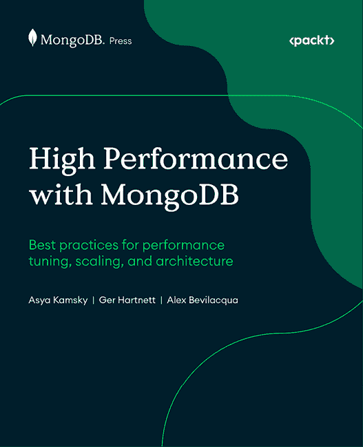
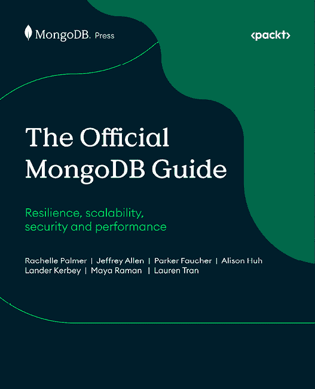
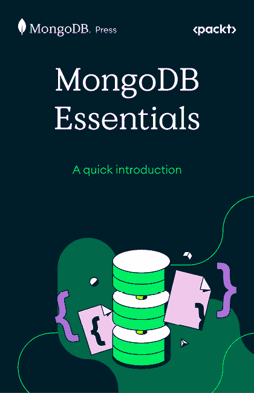

# 第二十一章：索引

A

高级代理架构，组件

代理 169

大脑 169

记忆 169

工具 169

代理人工智能 37，252，381

基础 38，39

用于将零售预测分析进行转型 238，239

用于将零售聊天机器人进行转型 246

工作 42，43

用于网络管理的代理人工智能操作 200

人工智能驱动的网络系统，用于电信 200-203

人工智能驱动的运营 204

欺诈检测和预防 204，205

代理人工智能解决方案

案例研究 419-426

代理人工智能系统 331，332

与 LLMs 相比 332

代理系统

架构特性 336-340

代理配置文件 185

人工智能

用于库存优化 123

制造 116，117

定制化，适用于每个组织 418，419

人工智能代理 39，40，380

特性 38

核心组件 40

人工智能数据设计

实际考虑因素 56

人工智能驱动的数字银行体验 266

人工智能驱动的数字银行数据 267

客户体验，通过通用人工智能提升 266

参考解决方案架构 268

人工智能驱动的客户支持参考解决方案架构 267

人工智能驱动的 ESG 分析 275，276

政策和法规合规 278，279

在理赔流程中的人工智能驱动的改进

领域驱动的人工智能实施 343-346

集成 340

层 341-343

成熟度和实施策略 341

承保和风险管理 346-350

人工智能驱动的营销

现代数据库，用于可扩展 231-234

AI 增强的金融犯罪减轻和合规 269

利用 AI 减轻金融犯罪 270

MongoDB 在 AML 中的作用 272，274

MongoDB 在 KYC 中的作用 272-274

监管智能和政策自动化 271，272

战略商业效益 274，275

趋势重新定义，新兴 270

AI 演变 16

LLMs 的兴起 18，19

AI 在制造业中的扩展作用 187

连接的车队事件经理 188

维护优化 188

生产再优化 187

质量检验报告 187

供应链编排 187

AI 金融演变 252

信用申请，利用 AI 进行转型 254

领域特定嵌入 253

更智能的信用系统，使用 MongoDB 构建 255-258

AI 在保险业

未来 354

用例 350-353

AI 在零售业

AI 驱动的商品执行 247

动态劳动力编排 247

扩展 246

主动损失预防 247

实时可持续性优化 248

自愈的商店运营 247

AI 模式 438

AI 驱动的信用分析 259

AI 驱动的现代化

使用，以解锁创新 92，93

AI 驱动的网络系统

电信领域构建，范围 200-203

AI 驱动的运营 204

AI 就绪数据架构

构建 359

AI 就绪数据基础

可用性 53

构建 46

合规性 54

数据一致性 50

数据质量 50

治理 54

模型微调 55

模型训练 55

性能 53

RAG 51

实时上下文 51

可扩展性 53

安全性 54

统一数据访问架构 48，49

人工智能革命 378，379

传统解决方案 379

人工智能解决方案

实施，使用 Dataworkz 427

实施，使用 MongoDB 427

人工智能战略

未来，在企业中使用 Dataworkz 428

转化为行动 427

人工智能术语 380

代理人工智能 381

人工智能代理 380

通用人工智能 (GenAI) 380

AlphaGo 18

年度美元使用量 (adu) 131

反洗钱 (AML) 269

Apache Spark 17

API 网关

使用 MongoDB 302

使用 RegData 的提示装饰 302

应用架构

操作性结构化和非结构化数据，管理 336

应用程序管道 321

近似最近邻 (ANN) 27

架构模式

人工智能驱动的护理协调 391

临床上下文 393

用于视觉诊断的通用人工智能 (GenAI)，使用 395，396

实施 391

医学视觉问答 396

自然语言临床智能 393

语义搜索 394

专用代理角色，协调 392，393

向量嵌入，应用 397，398

人工智能 (AI) 17

Atlas 向量搜索

参考链接 31

原子性、一致性、隔离性和持久性 (ACID) 409

平均处理时间 (AHT) 217

B

银行、金融服务和保险 (BFSI) 领域 67

偏差审计 68

二进制大对象 (BLOBs) 48

品牌信息代理 424-426

破碎的工作流程 358，359

牛鞭效应 118

商业行业分类 (BIC) 362

商业智能 (BI) 55

商业模式创新 4

商业支持系统 (BSS) 193

C

通话详细记录 (CDRs) 205

资本市场部门 283

人工智能驱动的投资组合管理 286, 287

人工智能在金融服务中的作用 290-292

智能投资组合管理 284, 285

使用人工智能 (AI) 代理的智能投资组合管理 288-290

投资组合管理，通过代理人工智能重新构想 284

随意人工智能地图 434

CentralReach 394

思维链 (Chain-of-Thought, CoT) 20

思维链 (Chain-of-Thought, CoT) 260

字符大对象 (CLOBs) 48

分块 25

参考链接 29

客户识别数据 (CID) 296

客户洞察引擎 419

临床研究报告 (CSRs) 399

革命性的，与通用人工智能 (GenAI) 399

革命性的，与 MongoDB 399

临床试验叙述 (CTNs) 400

通信服务提供商 (CSPs) 200

合规性 54

合规性和监管考虑因素 310-312

综合语义保护架构

建设 301-304

计算机化维护管理系统 (CMMS) 157

基于条件的维护 (CBM) 148

宪法人工智能 436

联系中心即服务 (CCaaS) 平台 214

内容发现和个性化 194

内容建议和个性化平台 195, 196

内容摘要和重新格式化 196

自动创建见解和摘要 197

关键词和实体提取 196

上下文语义保护 299, 300

集成数据存储 335

对话式和代理聊天机器人 243

核心技术组件

文档架构 360, 361

Fireworks AI365，366

MongoDB Atlas，用于现代数据库基础设施 364，365

管道转换，处理 361-363

RAG 优势 363，364

设置 360

创建、读取、更新、删除（CRUD）435

CUDA17

D

数据 19

数据架构

发展 329

发展，阶段 328

数据架构，具备 AI 能力

保险领域的 AI，频谱 330-334

应用 334-336

索赔处理，例如 329，330

数据基础 93，95

利益 94

数据湖 55

数据管道 320

数据保护困境

在金融 AI 中 296，297

Dataworkz

用于实施有效的 AI 解决方案 427

确定性分词 301

DevOps 效率代理 421，423

故障诊断代码（DTCs）168

数字专家 41

医学数字成像与通信（DICOM）388

数字收据

作为数据催化剂 239，241

发现与分类模块 299

基于文档的数据模型 385

文档管理

通过 Encore 重新定义 411

文档管理，使用 Encore

客户服务中心支持 412

索赔处理 411

合规性和审计准备 412

领域驱动 AI

实施 343-346

领域特定嵌入 253

E

电子健康记录（EHRs）377

嵌入器 24

嵌入模型 24

AI 应用策略 28，29

关键阶段 25

关键词匹配 30，31

语义搜索的多模态应用 32

语义搜索 30

向量数据库 26-28

Encore 407

重要性 413, 414

用于构建 EDM 平台 412, 413

用于重新定义文档管理 411

端到端测试 99, 100

企业文档管理 (EDM) 407

平台，使用 MongoDB 构建 412, 413

企业 JavaBeans (EJBs) 99

企业知识管理 (EKM) 251

GenAI 的集成 265

由 GenAI 驱动的架构考虑 263, 264

GenAI 在银行中的应用案例 262

革命性，在银行中使用 GenAI 260

系统，在银行中的转型 261, 262

传统挑战，在银行中 261

环境、社会和治理 (ESG) 5, 275, 441

基于事件的架构

用于自主行动 339, 340

交易所交易基金 (ETFs) 286

可解释人工智能 (XAI) 255

提取、转换、加载 (ETL) 53

F

门面模式 386

快速医疗互操作性资源 (FHIR) 378

金融 AI

数据保护困境 296, 297

金融行业监管局 (FINRA) 322

金融服务业 (FSI) 295, 321

金融犯罪 270

FireOptimizer 365

爆竹 AI 359, 365, 366

舰队运营优化 173

逻辑和物理架构 174, 176

MongoDB 用于车队管理的优势 186

MongoDB 用于车队调度 176

调度代理 173, 174

食品配送平台

库存挑战，应对 228

格式保留令牌化 299

基础架构 438, 439

生态系统 442

行业应用 439-441

通用模式 442, 443

碎片化 49

欺诈检测和预防 204, 205

G

游戏化学习体验 199

Gear Transmission Systems Ltd 150

GenAI 252, 380

层 341-343

使用，以满足现代零售的内容需求 229, 230

使用，以重塑零售领域的预测分析 236, 237

使用，以革新临床研究报告 (CSRs) 399

GenAI 聊天机器人 264

GenAI 共同飞行员

规模化 317, 318

工作 318, 319

GenAI 时代 18

GenAI 工厂 320, 321

FSI 工程学，需要 321-323

FSI 用例 323

由 GenAI 驱动的智能呼叫中心分析应用 324

GenAI 库存分类演示

由 AI 驱动的标准，生成 135, 136

分析，运行 137, 138

基本分类 134, 135

标准，整合到分类中 136, 137

权重控制 137, 138

由 GenAI 驱动的库存分类 123, 124

代理应用程序，创建以执行基于标准的转换 129, 130

评估标准，设计 126, 127

评估标准，存储 128

实施，方法论 124, 125

重新运行 131, 132

向量嵌入，从非结构化数据存储 125, 126

由 GenAI 驱动的供应链优化 118, 119

多级规划方法 119, 120

生成式人工智能（GenAI）解决方案 324

生成式人工智能（GenAI）改变医疗保健 381

架构，建设 382

数据架构挑战 383

生成式人工智能（GenAI） 3, 15, 115, 223, 251, 331, 413

挑战 22

内容，从模式中创建 19, 20

数据转换，进入向量 23, 24

局限性 22

需要 121, 122

驱动库存分类 123

工作 20, 21

生成式人工智能（GenAI），检索增强生成（RAG） 438

谷歌云

人工智能领导力 171

云平台 171

开发者工具 172

集成人工智能 171

可扩展的基础设施 172

谷歌云集成 167

治理 54

H

Hadoop MapReduce 17

医疗保健数据未来

基于文档的数据模型 385

灵活性和互操作性，388

灵活性和互操作性，通过外观模型增强 386

需要 384

堆栈 389, 390

健康水平七（HL7）的 378

层次可导航小世界（HNSW） 27

HL7 FHIR 379

人在回路（HITL） 38

混合保护策略 309, 310

混合搜索方法 35, 36

超个性化车内体验 164

高级代理架构 168, 169

人工智能集成车内系统优势 172

生成式人工智能（GenAI） 166

谷歌云 171

车载语音助手，人工智能解决方案 165

车载语音助手，挑战 165

MongoDB 171

车辆手册的 RAG 实施 170

解决方案架构 167, 168

I

识别和验证 (ID&V) 217

车载助手

转型 166

创新 4

商业模式创新 4

流程创新 4

产品创新 4

社会创新 5

解锁，借助人工智能现代化 92, 93

创新，借助人工智能现代化

分析 98, 99

代码转换和测试 101-107

部署和迁移 107, 108

工厂流程，自动化 96

协调 96, 97

测试生成 99, 101

工作，基于数据基础 93, 95

智力和发展障碍 (IDD) 394

智能架构 432

智能护理交付系统 398, 401

国际银行账户号码 (IBAN) 格式 299

物联网 (IoT) 8

库存分类和优化方法 120

ABC 分析 120, 121

MCIC 121

J

JavaScript 对象表示法 (JSON) 337, 365

K

关键绩效指标 (KPIs) 217

关键词匹配 30, 31

知识管理和保存 161

人工智能解决方案 161, 162

机构知识挑战 161, 162

实时知识应用 163

知识管理方法

文档 161

导师制 161

培训计划 161

了解你的客户 (KYC) 269

L

湖屋 55

大型语言模型（LLMs） 5，16，124，214，229，252，331，359，410，438

通过上下文数据增强 32，33

用于 RAG 的索赔管理 351

用于 PDF 搜索应用 353

与代理式 AI 系统 332

传统系统 8

本地可解释模型无关解释（LIME） 255

长期记忆 185

M

机器学习（ML） 17

机器学习模型 330

机器学习操作（MLOps） 235

媒体和电信

内容发现和个人化 194

内容建议和个人化 196

内容建议和个人化平台 195

内容摘要和重新格式化 196

进化 192，193

媒体和电信，AI 的作用 206

定价模型 206

视频搜索和剪辑 207

内存架构 435

机器学习（ML）和 CI/CD 管道 321

模型

微调 55

模型上下文协议（MCP） 296，308，309，432

模型训练 55

现代人工智能代理

突破 211

案例研究 210

Cognigy 的代理式 AI 212

进化 210

卓越，扩展 216-218

局限性 211

现代数据需求 213

MongoDB 的作用 213

个人化 218

实时性能，在关键时刻 215

真实世界应用 213，214

技术基础，实现无缝集成 215

现代数据平台 12

AI 力量 13

创新，通过敏捷性和速度实现 12

现代化，简化 13

现代化 8

驱动创新的人工智能 10

人工智能局限性 10, 11

挑战 88-92

常见策略 9

动机 89

现代零售商，进化

语义向量搜索 225-228

MongoDB

加速开发 172

带有 302 的 API 网关

汽车行业存在感 172

面向文档的数据模型 172

故障预测 153, 154

用于库存优化 123

机器优先级 152

维护指南生成 156, 157

带有 303 的保护向量搜索

维修计划生成器 155

用于构建 EDM 平台 412, 413

用于实施有效的 AI 解决方案 427

用于革命性的临床试验报告 (CSRs) 399

规模化的向量存储 172

MongoDB Atlas 132, 160, 167

人工智能驱动的库存分类管道 132, 133

对于库存管理的益处 142

需求预测 141

GenAI 库存分类演示 134

库存管理，为工业 5.0 重新构想 142

库存优化 140, 141

通过代理人工智能进行原材料管理 139, 140

用于现代数据库基础设施 364, 365

MongoDB 在车队管理中的优势 186

MongoDB 用于车队调度 176, 177

代理配置文件和说明 177

连接的车队事件顾问 180, 181

数据类型和存储 184, 186

事件顾问架构 181-183

短期和长期记忆 178-180

MongoDB 查询语言 (MQL) 104

MongoDB 的作用

在 ESG 数据管理中 277

MongoDB 矢量搜索 419

监控和反馈系统 321

多智能体协作 146

多智能体系统 41, 437

优势 437

多标准库存分类 (MCIC) 121

多模态 275, 276

语义搜索的多模态应用 32

N

自然语言处理 (NLP) 18, 116

Novo Nordisk 400

NovoScribe 400

O

在线事务处理 (OLTP) 55

运营支持系统 (OSS) 193

最佳维护策略 148

基于条件的维护 (CBM) 148

预测性维护 148

预防性维护 148

反应性维护 148

订单管理系统 (OMS) 237

总体设备效率 (OEE) 153

P

基于纸张的测试 101

PDF 搜索应用

使用大型语言模型 (LLMs) 353

使用矢量搜索 353

个性化，人工智能代理 218

架构 218

综合要求 220

管理和合规框架 220

准确性的风险 219

技术基础 218, 219

个人可识别信息 (PII) 220, 296, 324

简单旧式 Java 对象 (POJOs) 99

销售点 (POS) 237

在 242 进行个性化

实际考虑因素，人工智能数据设计 56

数据流 57, 58

数据结构 56, 57

预测性人工智能 252

预测分析

通过在零售中使用通用人工智能进行重塑 236, 237

通过在零售中使用代理人工智能进行转型 238, 239

预测性维护 146, 148

人工智能 (AI) 151

MongoDB 151

多代理协作系统 158

最佳维护策略 148

生产环境，优化 159，160

状态和挑战 149-151

工作 147

预测性维护代理 159

预防性维护 148

流程创新 4

流程优化代理 159

产品创新 4

生产级 RAG 实现 368

提示工程 19

提示 19

Q

定性转型 367

质量保证代理 159

服务质量（QoS） 199

定量影响 366

可查询加密 54

引用请求 369，371，372

R

RAG 优势 363，364

反应性维护 148

实时上下文 51

实时全渠道客户档案

建设 241

RegData 的数据安全平台（DSP）

MongoDB，作为基础 302

RegData 的提示装饰

带有 302 的 API 网关

RegData 的保护套件（RPS） 305

强化学习 18

从人类反馈中进行强化学习（RLHF） 436

关系迁移器（RM）工具 99

记住，适应，学习，忘记（RALF） 435

零售聊天机器人

转型，使用代理式 AI 246

零售行业，采用先进技术

对话式和代理式聊天机器人 243-246

需求预测 235-239

店内互动，智能数字化 239，240，241，242

个性化营销和内容生成 229-234

预测分析 235-239

零售搜索

转型 225，226

检索增强生成 (RAG) 5, 15, 32, 33, 51, 153, 197, 223, 252

实施，以增强人工智能应用 34

局限性 34

工作 33, 34

投资回报率 (ROI) 152, 284

机器人流程自动化 (RPA) 4

根域名实体 336

S

搜索引擎优化 (SEO) 196

搜索生成体验 (SGEs) 197, 198, 224

游戏化学习体验 199

服务保证 199

智能对话界面 198

搜索结果

精炼 36, 37

安全 54

语义数据保护

高级技术 299

领域特定智能，以增强安全和性能 304-308

MongoDB 方法 297

分区，使用标记类别 300

原则 297-299

RegData 方法 297

Voyage AI 方法 297

语义数据保护，高级技术

上下文语义保护 301

语义数据保护，高级技术和标准 308

合规性和监管考虑因素 310-312

混合保护策略 309, 310

MCP 308, 309

语义搜索 30

语义向量搜索 224-228

服务保证 199

服务级别协议 (SLAs) 199, 336

SHapley Additive exPlanations (SHAP) 255

短期记忆 185

智能对话界面 198

更智能的信用系统

优势 255

健康的社会决定因素 (SDOH) 384

社会创新 5

SQL 紧身衣 409

利益相关者参与 68

直达支付处理 (STP) 279

商业展望 280

未来领导者，定义 283

GenAI 角色 280-282

战略转折点 5

概述临床有效性 (SCE) 400

概述临床安全性 (SCS) 400

供应链规划

运营层面 120

战略层面 120

战术层面 120

可持续金融披露法规 (SFDR) 275

系统集成商 (SI) 150

行动系统 48

行动数据库系统

成本管理 59

数据生命周期管理 59

部署模式 58

维护工作流程 59

迁移策略，从遗留系统 60

实施运营 58

优化 59

性能监控 59

资源分配 59

团队培训和采用，考虑因素 60

T

技术创新 368

更广泛的技术采用 375

每日运营，转型 373, 374

行业影响和影响 374

生产级 RAG 实施 368

报价请求 369-372

监管考虑因素 375

技术现代化 8

网络安全改进 8

数字化 8

数字化 8

集成 8

系统升级 8

电信即服务 (TaaS) 207

文本搜索 35

存活时间 (TTL) 27

总拥有成本 (TCO) 389

传统 EDM 系统

数字文件柜时代 408, 410, 411

转换器 18

翻译层 126

透明度和可解释性 255

可信人工智能

原则，在紫罗兰织物中 67

U

超高净值 (UHNW) 305

统一客户视图

构建 226，227

统一数据访问

架构 48，49

V

矢量数据库 26

需要 26，27，28

矢量搜索 35

矢量搜索

用于 RAG 的索赔管理 351

用于 PDF 搜索应用程序 353

语音活动检测 (VAD) 318

波动率指数 (VIX) 286

Voyage AI 207

使用 303 进行受保护的矢量搜索

Voyage AIs 嵌入模型

参考链接 26

W

财富关系管理 316

GenAI 协作者，扩展 317，318

GenAI 协作者，工作 318，319

[packtpub.com](https://www.packtpub.com)

订阅我们的在线数字图书馆，全面访问超过 7,000 本书和视频，以及领先的行业工具，帮助你规划个人发展和职业进步。欲了解更多信息，请访问我们的网站。

# 为什么订阅？

+   通过来自 4,000 多位行业专业人士的实用电子书和视频，节省学习时间，增加编码时间

+   通过为你量身定制的技能计划提高你的学习效果

+   每月免费获得一本电子书或视频

+   完全可搜索，便于轻松访问关键信息

+   复制粘贴、打印和收藏内容

在 [www.packtpub.com](https://www.packtpub.com)，你还可以阅读一系列免费的技术文章，订阅各种免费通讯，并享受 Packt 书籍和电子书的独家折扣和优惠。

# 你可能还会喜欢的其他书籍

如果你喜欢这本书，你可能对 Packt 出版的其他书籍也感兴趣：

**使用 MongoDB 的高性能**

Asya Kamsky, Ger Hartnett, Alex Bevilacqua

ISBN: 978-1-83702-263-2

+   诊断和解决部署中的常见性能瓶颈

+   设计架构和索引以最大化吞吐量和效率

+   调整 WiredTiger 存储引擎并管理系统资源以实现最佳性能

+   利用分片和复制进行扩展并确保正常运行时间

+   积极监控、调试和维护部署以预防问题

+   通过客户端驱动配置提高应用程序响应速度

**官方 MongoDB 指南**

Rachelle Palmer, Jeffrey Allen, Parker Faucher, Alison Huh, Lander Kerbey, Maya Raman, Lauren Tran

ISBN: 978-1-83702-197-0

+   构建安全、可扩展和性能卓越的应用程序

+   为实际工作负载设计高效的数据模型和索引

+   编写强大的查询以排序、过滤和投影数据

+   使用身份验证和加密保护应用程序

+   使用 AI 驱动和 IDE 工具加速编码

+   有信心启动、扩展和管理 MongoDB Atlas

+   解锁高级功能，如 Atlas Search 和 Atlas Vector Search

+   应用 MongoDB 自己的工程领导者证明的技术

**MongoDB Essentials**

ISBN: 978-1-80670-609-9

+   理解 MongoDB 的文档模型和架构

+   快速设置 MongoDB 本地部署

+   设计符合应用程序访问模式的架构

+   高效执行 CRUD 和聚合操作

+   使用工具优化查询性能和可伸缩性

+   探索 AI 驱动的功能，如 Atlas Search 和 Atlas Vector Search

# Packt 正在寻找像你这样的作者

如果你有兴趣成为 Packt 的作者，请访问[authors.packt.com](https://www.authors.packt.com)并今天申请。我们已与成千上万的开发者和技术专业人士合作，就像你一样，帮助他们将见解分享给全球技术社区。你可以提交一般申请，申请我们正在招募作者的特定热门话题，或者提交你自己的想法。

# 分享你的想法

现在你已经完成了《面向智能 AI 就绪企业的架构》，我们很乐意听听你的想法！如果你在亚马逊购买了这本书，请[点击此处直接转到该书的亚马逊评论页面](https://packt.link/r/1806117150)并分享你的反馈或在该购买网站上留下评论。

你的评论对我们和整个技术社区都很重要，并将帮助我们确保我们提供高质量的内容。

# 下载此书的免费 PDF 副本

感谢您购买此书！

你喜欢在路上阅读，但无法携带你的印刷书籍到处走吗？

你的电子书购买是否与你的选择设备不兼容？

别担心，现在每购买一本 Packt 书籍，你都可以免费获得该书的 DRM 免费 PDF 版本。

在任何地方、任何设备上阅读。从你最喜欢的技术书籍中直接搜索、复制和粘贴代码到你的应用程序中。

优惠远不止这些，你还可以获得独家折扣、时事通讯和每日收件箱中的精彩免费内容。

按照以下简单步骤获取这些好处：

1.  扫描下面的二维码或访问以下链接：

[`packt.link/free-ebook/9781806117154`](https://packt.link/free-ebook/9781806117154)

1.  提交你的购买证明。

1.  就这样！我们将直接将你的免费 PDF 和其他好处发送到你的电子邮件。
