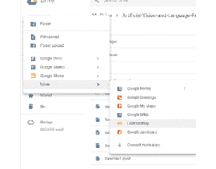
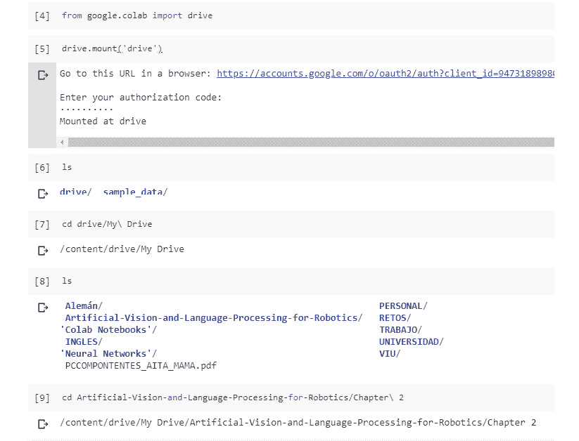
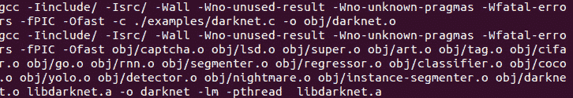
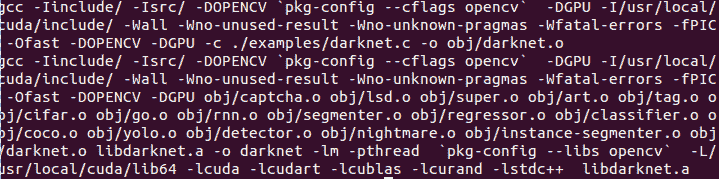

# 第一章：*前言*

## 关于

本节简要介绍了作者、本书的内容、你开始时所需的技术技能，以及完成所有包括的活动和练习所需的硬件和软件要求。

## 本书介绍

*机器人学中的人工视觉与语言处理* 书籍首先讨论了机器人的理论。你将比较不同的机器人工作方法，探索计算机视觉、其算法和局限性。然后你将学习如何通过自然语言处理命令来控制机器人。在这本书的过程中，你将学习 Word2Vec 和 GloVe 嵌入技术、非数值数据以及循环神经网络（RNN）及其高级模型。你将使用 Keras 创建一个简单的 Word2Vec 模型，构建一个卷积神经网络（CNN），并通过数据增强和迁移学习来改进它。你将学习 ROS 并构建一个对话代理来管理你的机器人。你还将把你的代理与 ROS 集成，并将图像转换为文本，文本转换为语音。你将学习如何借助视频剪辑构建一个物体识别系统。

本书结束时，你将具备构建一个功能性应用程序的技能，该应用程序可以与 ROS 集成，从你的环境中提取有用的信息。

### 作者介绍

**Álvaro Morena Alberola** 是一名计算机工程师，热爱机器人技术和人工智能。目前，他正在担任软件开发人员。他对 AI 的核心部分——人工视觉非常感兴趣。Álvaro 喜欢使用新技术并学习如何利用先进工具。他认为机器人技术是改善人类生活的一种方式，是帮助人们完成他们自己无法完成的任务的一种手段。

**Gonzalo Molina Gallego** 是一名计算机科学毕业生，专注于人工智能和自然语言处理。他有丰富的文本对话系统工作经验，创建过对话代理，并提供过良好的方法论建议。目前，他正在研究混合领域对话系统的新技术。Gonzalo 认为对话用户界面是未来的发展趋势。

**Unai Garay Maestre** 是一名计算机科学毕业生，专注于人工智能和计算机视觉领域。他曾成功地为 2018 年 CIARP 会议贡献了一篇论文，提出了使用变分自编码器的新数据增强方法。他还从事机器学习开发工作，使用深度神经网络处理图像。

### 目标

+   探索 ROS 并构建一个基本的机器人系统

+   使用 NLP 技术识别对话意图

+   学习并使用 Word2Vec 和 GloVe 的词嵌入

+   使用深度学习实现人工智能（AI）和物体识别

+   开发一个简单的物体识别系统，使用 CNN

+   将 AI 与 ROS 集成，使你的机器人能够识别物体

### 读者群体

*人工视觉和语言处理技术在机器人学中的应用* 针对想要学习如何集成计算机视觉和深度学习技术以创建完整机器人系统的机器人工程师。如果你具备 Python 的工作知识和深度学习背景，那将会很有帮助。对 ROS 的了解是一个加分项。

### 方法

*人工视觉和语言处理技术在机器人学中的应用* 采用实用方法，为你提供了创建集成计算机视觉和自然语言处理控制机器人系统的工具。本书分为三个部分：自然语言处理、计算机视觉和机器人学。它在详细介绍基础知识后引入高级主题。书中还包含多个活动，供你在高度相关的背景下练习和应用你的新技能。

### 最低硬件要求

为了最佳的学生体验，我们建议以下硬件配置：

+   处理器：2GHz 双核处理器或更好

+   内存：8 GB RAM

+   存储空间：5 GB 可用硬盘空间

+   良好的互联网连接

为了训练神经网络，我们建议使用 **Google Colab**。但如果你想用自己的计算机训练这些网络，你需要：

+   NVIDIA GPU

### 软件要求

不推荐在本书中使用 Ubuntu 16.04，因为它与 ROS Kinetic 存在兼容性问题。但如果你想使用 Ubuntu 18.04，有一个 ROS 支持的版本，名为 Melodic。在项目进行过程中，你需要安装几个库以完成所有练习，如 `NLTK` (<= 3.4)、`spaCy` (<=2.0.18)、`gensim` (<=3.7.0)、`NumPy` (<=1.15.4)、`sklearn` (<=0.20.1)、`Matplotlib` (<=3.0.2)、`OpenCV` (<=4.0.0.21)、`Keras` (<=2.2.4) 和 `Tensorflow` (<=1.5, >=2.0)。每个库的安装过程在练习中有详细说明。

要在 Ubuntu 系统中使用 YOLO，你需要安装你的 GPU 的 **NVIDIA** 驱动程序和 NVIDIA **CUDA** 工具包。

### 约定

文本中的代码词、数据库表名、文件夹名、文件名、文件扩展名、路径名、虚拟的 URL、用户输入和 Twitter 句柄显示如下："使用 `TfidfVectorizer` 方法，我们可以将语料库中的文档集合转换为 TF-IDF 特征矩阵"

代码块如下所示：

```py
vectorizer = TfidfVectorizer()
X = vectorizer.fit_transform(corpus)
```

新术语和重要词汇以粗体显示。在屏幕上看到的词汇，例如菜单或对话框中的内容，会在文本中这样显示："**形态分析**：专注于分析句子中的词和其形态素"

### 安装和设置

在你开始本书之前，你需要安装以下软件。你可以在这里找到安装步骤：

**安装 Git LFS**

为了从本书的 GitHub 下载所有资源并能够使用图像来训练你的神经网络模型，你需要安装 **Git LFS**（Git Large File Storage）。它用 Git 内部的文本指针替换大文件，如音频样本、视频、数据集和图形。

如果你还没有克隆存储库：

1.  安装 Git LFS

1.  克隆 Git 仓库

1.  从仓库文件夹执行 `gitlfs pull`

1.  完成

如果仓库已经克隆：

1.  安装 Git LFS

1.  从仓库文件夹执行：`gitlfs pull`

1.  完成

安装 Git LFS：[`github.com/git-lfs/git-lfs/wiki/Installation`](https://github.com/git-lfs/git-lfs/wiki/Installation)

**[推荐] Google Colaboratory**

如果可能，使用 Google Colaboratory。它是一个免费的 Jupyter notebook 环境，无需设置，完全运行在云端。你还可以利用 GPU 来运行它。

使用它的步骤如下：

1.  将整个 GitHub 上传到你的 Google Drive 账户中，这样你就可以使用存储在仓库中的文件。确保你先使用 Git LFS 加载了所有文件。

1.  前往你想打开新 Google Colab Notebook 的文件夹，点击“新建”>“更多”>“Colaboratory”。现在，你有一个已打开并保存在相应文件夹中的 Google Colab Notebook，你可以开始使用 Python、Keras 或任何已安装的库。

1.  如果你想安装特定的库，你可以使用“pip”包安装或其他命令行安装，并在开头加上“！”。例如，“!pip install sklearn”将安装 scikit-learn。

1.  如果你想从 Google Drive 加载文件，你需要在 Google Colab 单元格中执行以下两行代码：

    ```py
    from google.colab import drive
    drive.mount(‘drive’)
    ```

1.  然后，打开输出中出现的链接，并使用你创建 Google Colab Notebook 时所用的 Google 账户登录。

1.  现在，你可以使用`ls`列出当前目录中的文件，并使用`cd`导航到特定的文件夹，以便找到上传的文件位置。

1.  现在，Google Colab Notebook 可以像在该文件夹中打开的 Jupyter notebook 一样加载任何文件并执行任何任务。

**安装 ROS Kinetic**

这是你必须遵循的步骤，以在你的 Ubuntu 系统上安装该框架：

1.  准备 Ubuntu 接受 ROS 软件：

    ```py
    sudosh -c ‘echo “deb http://packages.ros.org/ros/ubuntu $(lsb_release -sc) main” > /etc/apt/sources.list.d/ros-latest.list’
    ```

1.  配置下载密钥：

    ```py
    sudo apt-key adv --keyserver hkp://ha.pool.sks-keyservers.net:80 --recv-key 421C365BD9FF1F717815A3895523BAEEB01FA116
    ```

1.  确保系统已更新：

    ```py
    sudo apt-get update
    ```

1.  安装完整框架，以免遗漏功能：

    ```py
    sudo apt-get install ros-kinetic-desktop-full
    ```

1.  初始化并更新 `rosdep`：

    ```py
    sudo rosdep init
    rosdep update
    ```

1.  如果你不想每次工作时都声明环境变量，可以将它们添加到 `bashrc` 文件中：

    ```py
    echo “source /opt/ros/kinetic/setup.bash” >> ~/.bashrcsource ~/.bashrc
    ```

    #### 注意

    完成此过程后，可能需要重启计算机以使系统应用新的配置。

1.  通过启动框架检查它是否正常工作：

    ```py
    roscore
    ```

**配置 TurtleBot**

#### 注意

可能会出现 TurtleBot 与你的 ROS 发行版不兼容的情况（我们使用的是 Kinetic Kame），但不用担心，Gazebo 中有很多机器人可以模拟。你可以查找不同的机器人并尝试在你的 ROS 发行版中使用它们。

这是 TurtleBot 的配置过程：

1.  安装其依赖项：

    ```py
    sudo apt-get install ros-kinetic-turtlebotros-kinetic-turtlebot-apps ros-kinetic-turtlebot-interactions ros-kinetic-turtlebot-simulator ros-kinetic-kobuki-ftdiros-kinetic-ar-track-alvar-msgs
    ```

1.  在你的 `catkin` 工作空间中下载 TurtleBot 模拟器包：

    ```py
    cd ~/catkin_ws/src
    git clone https://github.com/turtlebot/turtlebot_simulator
    ```

1.  之后，您应该能够在 Gazebo 中使用 TurtleBot。

    如果在 Gazebo 中尝试可视化 TurtleBot 时遇到错误，请从我们的 GitHub 下载 `turtlebot_simulator` 文件夹并替换它。

    启动 ROS 服务：

    ```py
    roscore
    ```

    启动 TurtleBot World：

    ```py
    cd ~/catkin_ws
    catkin_make
    sourcedevel/setup.bash
    roslaunchturtlebot_gazeboturtlebot_world.launch
    ```

**Darknet 基本安装**

按照以下步骤安装 Darknet：

1.  下载框架：

    ```py
    git clone https://github.com/pjreddie/darknet
    ```

1.  切换到下载的文件夹并运行编译命令：

    ```py
    cd darknet
    make
    ```

    如果编译过程正确完成，您应该看到类似以下的输出：



###### Darknet 编译输出

**Darknet 高级安装**

这是您必须完成的安装过程，以实现章节目标。这将允许您使用 GPU 计算实时检测和识别物体。在执行此安装之前，您必须在 Ubuntu 系统上安装一些依赖项，如下所示：

+   **NVIDIA 驱动程序**：这些驱动程序将使您的系统能够正确地与 GPU 配合工作。正如您所知，它必须是 NVIDIA 型号。

+   **CUDA**：这是一个 NVIDIA 工具包，为构建需要 GPU 使用的应用程序提供开发环境。

+   **OpenCV**：这是一个免费的人工视觉库，非常适合处理图像。

    #### 注意

    需要注意的是，所有这些依赖项都有多个版本。您必须找到与您的特定 GPU 和系统兼容的每个工具的版本。

    一旦系统准备就绪，您可以执行高级安装：

1.  如果您还没有完成基本安装，请下载框架：

    ```py
    git clone https://github.com/pjreddie/darknet
    ```

1.  修改 Makefile 文件的前几行以启用 OpenCV 和 CUDA，内容应该如下：

    ```py
    GPU=1
    CUDNN=0
    OPENCV=1
    OPENMP=0
    DEBUG=0
    ```

1.  保存 Makefile 修改，切换到 `darknet` 目录并运行编译命令：

    ```py
    cd darknet
    make
    ```

    现在，您应该看到类似以下的输出：



###### Darknet 编译带有 CUDA 和 OpenCV

**安装 YOLO**

在执行此安装之前，您必须在 Ubuntu 系统上安装一些依赖项，如 *Darknet 的高级安装* 部分所述。

#### 注意

需要考虑的是，所有这些依赖项都有多个版本。您必须找到与您的特定 GPU 和系统兼容的每个工具的版本。

一旦系统准备好，您可以执行高级安装：

1.  下载框架：

    ```py
    git clone https://github.com/pjreddie/darknet
    ```

1.  修改 Makefile 文件的前几行以启用 OpenCV 和 CUDA，内容应该如下：

    ```py
    GPU=1
    CUDNN=0
    OPENCV=1
    OPENMP=0
    DEBUG=0
    ```

1.  保存 Makefile 修改，切换到 darknet 目录并运行编译命令：

    ```py
    cd darknet
    Make
    ```

### 额外资源

本书的代码包也托管在 GitHub 上，地址为：[`github.com/PacktPublishing/Artificial-Vision-and-Language-Processing-for-Robotics`](https://github.com/PacktPublishing/Artificial-Vision-and-Language-Processing-for-Robotics)。

我们还有其他代码包，来自我们丰富的书籍和视频目录，可以在[`github.com/PacktPublishing/`](https://github.com/PacktPublishing/)找到。快来看看吧！

文档链接：

ROS Kinetic - [`wiki.ros.org/kinetic/Installation`](http://wiki.ros.org/kinetic/Installation)

Git 大文件存储 - [`git-lfs.github.com/`](https://git-lfs.github.com/)
