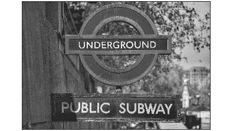

# 第三章

# 计算机视觉简介

## 学习目标

到本章结束时，你将能够：

+   解释人工智能和计算机视觉的影响

+   部署一些基本的计算机视觉算法

+   开发一些基本的机器学习算法

+   构建你的第一个神经网络

本章介绍了计算机视觉的基本概念，接着介绍了一些重要的计算机视觉和机器学习基本算法。

## 介绍

**人工智能**（**AI**）正在改变一切。它试图模拟人类智能，以完成各种任务。

处理图像的人工智能领域称为计算机视觉。计算机视觉是一个跨学科的科学领域，旨在模拟人类眼睛。它不仅从图像中提取像素并进行解读，还通过执行自动化任务和使用算法，从特定图像中获得更高层次的理解。

其中一些算法在物体识别、人脸识别、图像分类、图像编辑，甚至图像生成方面表现更好。

本章将从计算机视觉的介绍开始，首先讲解一些最基本的算法，并通过练习将它们付诸实践。接着，会介绍机器学习的基本算法到神经网络的概念，并通过多个练习来巩固所学的知识。

## 计算机视觉中的基本算法

在本节中，我们将讨论图像是如何形成的。我们将介绍一个非常有用的库，用于执行计算机视觉任务，并了解一些任务和算法的工作原理以及如何编码它们。

### 图像术语

要理解计算机视觉，我们首先需要了解图像是如何工作的以及计算机是如何解释它们的。

计算机将图像理解为一组数字的集合。更具体地说，图像被视为一个二维数组，一个包含从 0 到 255（在灰度图像中，0 代表黑色，255 代表白色）值的矩阵，表示图像的像素值（**像素值**），如下例所示：


###### 图 2.1：没有像素值和有像素值的图像表示

在左侧的图像中，数字 3 以低分辨率显示。在右侧，显示了相同的图像，并附有每个像素的值。随着像素值的增加，颜色会变亮，而值减小时，颜色会变暗。

这张图像是灰度图像，这意味着它只是一个从 0 到 255 的二维数值数组，但彩色图像呢？彩色图像（或红/绿/蓝（RGB）图像）有三层二维数组堆叠在一起。每一层代表一种颜色，将它们组合在一起就形成了彩色图像。

上述图像的矩阵大小为 14x14 像素。在灰度模式下，它表示为 14x14x1，因为只有一个矩阵和一个通道。而对于 RGB 格式，它表示为 14x14x3，因为有三个通道。从中计算机只需理解这些图像是由这些像素构成的。

### OpenCV

OpenCV 是一个开源的计算机视觉库，支持 C++、Python 和 Java 接口，并且支持 Windows、Linux、macOS、iOS 和 Android。

在本章中提到的所有算法，我们将使用 OpenCV。OpenCV 帮助我们通过 Python 实现这些算法。如果你想实践这些算法，建议使用 Google Colab。你需要安装 Python 3.5 或更高版本、OpenCV 和 NumPy，以便继续本章的内容。为了在屏幕上显示结果，我们将使用 Matplotlib。这两个库都是人工智能领域的优秀工具。

### 基本图像处理算法

为了让计算机理解图像，首先必须对图像进行处理。处理图像的算法有很多种，输出的结果取决于具体任务的要求。

一些最基本的算法包括：

+   阈值化

+   形态学变换

+   模糊

### 阈值化

**阈值化**通常用于简化计算机和用户对图像的可视化方式，以便更容易进行分析。它基于用户设置的一个值，每个像素的值根据是否高于或低于设定值，转换为白色或黑色。如果图像是灰度图，输出图像将是黑白图像，但如果你选择保持 RGB 格式，阈值将应用于每个通道，这意味着图像仍然是彩色的。

有多种方法可以进行阈值化，以下是一些常用的阈值方法：

1.  **简单阈值化：**如果像素值低于用户设定的阈值，则该像素将被赋值为 0（黑色）或 255（白色）。简单阈值化中也有不同的阈值化方式：

    阈值二进制

    阈值二进制反转

    截断

    阈值设为零

    阈值设为零反转

    不同类型的阈值如图 2.2 所示

    

    ###### 图 2.2：不同类型的阈值

    阈值二进制反转与二进制类似，但原本为黑色的像素变为白色，反之亦然。全局阈值化是简单阈值化下的另一种名称。

    截断显示阈值以上的像素值和实际像素值。

    阈值设为零时，如果像素值高于阈值，它将输出该像素的实际值，否则输出黑色图像，而阈值设为零反转则正好相反。

    #### 注意

    阈值值可以根据图像或用户的需求进行调整。

1.  **自适应阈值法**：简单阈值使用全局值作为阈值。如果图像某些部分的光照条件不同，算法的表现会比较差。在这种情况下，自适应阈值法会自动为图像的不同区域猜测不同的阈值，从而在不同光照条件下得到更好的整体效果。

    自适应阈值有两种类型：

    自适应均值阈值

    自适应高斯阈值

    自适应阈值与简单阈值的区别如图 2.3 所示

    

    ###### 图 2.3：自适应阈值与简单阈值的区别

    在自适应均值阈值法中，阈值值是邻域区域的均值，而在自适应高斯阈值法中，阈值值是邻域值的加权和，其中权重是一个高斯窗口。

1.  **大津二值化法**：在全局阈值法中，我们使用一个任意值作为阈值值。考虑一张双峰图像（像素分布在两个主要区域的图像）。你如何选择正确的阈值？大津二值化法会自动根据图像的直方图计算出适合双峰图像的阈值。**图像直方图**是一种[直方图](https://en.wikipedia.org/wiki/Histogram)，它作为[图形表示](https://en.wikipedia.org/wiki/Graphical_representation)显示了[色调](https://en.wikipedia.org/wiki/Lightness_(color))在[数字图像](https://en.wikipedia.org/wiki/Digital_image)中的分布：


###### 图 2.4：大津阈值法

### 练习 4：将不同的阈值应用于图像

#### 注意

由于我们在 Google Colab 上训练人工神经网络，我们应该使用 Google Colab 提供的 GPU。为此，我们需要进入 `runtime > Change runtime type > Hardware accelerator: GPU > Save`。

所有的练习和活动将主要在 Google Colab 中开发。除非另有指示，否则建议为不同的作业保持单独的文件夹。

`Dataset` 文件夹可以在 GitHub 的 Lesson02 | Activity02 文件夹中找到。

在这个练习中，我们将加载一张地铁图像，并应用阈值处理：

1.  打开你的 Google Colab 界面。

1.  创建一个书籍文件夹，下载 GitHub 上的 `Dataset` 文件夹，并将其上传到该文件夹中。

1.  按如下方式导入驱动器并挂载：

    ```py
    from google.colab import drive
    drive.mount('/content/drive')
    ```

    #### 注意

    每次使用新协作者时，都需要将驱动器挂载到所需文件夹中。

    一旦你第一次挂载了驱动器，你将需要输入授权码，这个授权码可以通过点击 Google 提供的 URL 并按下键盘上的 **Enter** 键获得：

    

    ###### 图 2.5：显示 Google Colab 授权步骤的图像

1.  现在你已经挂载了驱动器，需要设置目录的路径：

    ```py
    cd /content/drive/My Drive/C13550/Lesson02/Exercise04/
    ```

    #### 注意

    第 5 步中提到的路径可能会根据你在 Google Drive 上的文件夹设置发生变化。路径总是以`cd /content/drive/My Drive/`开头。

    `Dataset` 文件夹必须出现在你设置的路径中。

1.  现在你需要导入相应的依赖：OpenCV `cv2` 和 Matplotlib：

    ```py
    import cv2
    from matplotlib import pyplot as plt
    ```

1.  现在输入代码加载 `subway.jpg` 图像，我们将使用 OpenCV 对其进行灰度处理并使用 Matplotlib 显示：

    #### 注意

    ```py
    img = cv2.imread('subway.jpg',0)
    plt.imshow(img,cmap='gray')
    plt.xticks([]),plt.yticks([])
    plt.show()
    ```

    

    ###### 图 2.6：绘制加载的地铁图像结果

1.  让我们通过使用 OpenCV 方法应用简单的阈值化处理。

    在 OpenCV 中执行此操作的方法称为 **cv2.threshold**，它需要三个参数：**image**（灰度图像）、**threshold value**（用于分类像素值的阈值），以及 **maxVal**，它表示当像素值大于（有时小于）阈值时所给出的值：

    ```py
    _,thresh1 = cv2.threshold(img,107,255,cv2.THRESH_BINARY)
    _,thresh2 = cv2.threshold(img,107,255,cv2.THRESH_BINARY_INV) 
    _,thresh3 = cv2.threshold(img,107,255,cv2.THRESH_TRUNC) 
    _,thresh4 = cv2.threshold(img,107,255,cv2.THRESH_TOZERO)
    _,thresh5 = cv2.threshold(img,107,255,cv2.THRESH_TOZERO_INV) 
    titles = ['Original Image','BINARY', 'BINARY_INV', 'TRUNC','TOZERO','TOZERO_INV']
    images = [img, thresh1, thresh2, thresh3, thresh4, thresh5]
    for i in range(6):
        plt.subplot(2,3,i+1),plt.imshow(images[i],'gray')
        plt.title(titles[i])
        plt.xticks([]),plt.yticks([])
    plt.show()
    ```

    

    ###### 图 2.7：使用 OpenCV 进行简单阈值化

1.  我们将对自适应阈值化做同样的操作。

    执行此操作的方法是 **cv2.adaptiveThreshold**，它有三个特殊的输入参数和一个输出参数。输入参数为自适应方法、块大小（邻域区域的大小）和 C（从计算得到的均值或加权均值中减去的常数），而输出参数只有阈值化后的图像。这与全局阈值化不同，后者有两个输出：

    ```py
    th2=cv2.adaptiveThreshold(img,255,cv2.ADAPTIVE_THRESH_MEAN_C,cv2.THRESH_BINARY,71,7)
    th3=cv2.adaptiveThreshold(img,255,cv2.ADAPTIVE_THRESH_GAUSSIAN_C,cv2.THRESH_BINARY,71,7)
    titles = ['Adaptive Mean Thresholding', 'Adaptive Gaussian Thresholding']
    images = [th2, th3]
    for i in range(2):
        plt.subplot(1,2,i+1),plt.imshow(images[i],'gray')
        plt.title(titles[i])
        plt.xticks([]),plt.yticks([])
    plt.show()
    ```

    

    ###### 图 2.8：使用 OpenCV 进行自适应阈值化

1.  最后，让我们将 Otsu 二值化付诸实践。

1.  该方法与简单的阈值化相同，**cv2.threshold**，只是多了一个额外的标志，**cv2.THRESH_OTU**：

    ```py
    ret2,th=cv2.threshold(img,0,255,cv2.THRESH_BINARY+cv2.THRESH_OTSU)
    titles = ['Otsu\'s Thresholding']
    images = [th]
    for i in range(1):
        plt.subplot(1,1,i+1),plt.imshow(images[i],'gray')
        plt.title(titles[i])
        plt.xticks([]),plt.yticks([])
    plt.show()
    ```


###### 图 2.9：使用 OpenCV 进行 Otsu 二值化

现在你可以对任何图像应用不同的阈值化变换。

### 形态学变换

形态学变换由一组基于图像形状的简单图像操作组成，通常用于二值图像。它们通常用于区分文本与背景或其他形状。它们需要两个输入，一个是原始图像，另一个称为**结构元素**或**核**，它决定了操作的性质。**核**通常是一个矩阵，它在图像上滑动，将其值与图像像素的值相乘。两个基本的形态学操作是腐蚀和膨胀。它们的变体形式是开运算和闭运算。应该使用哪种操作取决于具体任务：

+   **腐蚀**：对于给定的二值图像，它会将图像的厚度在内部和外部各收缩一个像素，这些像素由白色像素表示。此方法可以多次应用。根据你想要实现的目标，该方法可以用于不同的目的，但通常它与膨胀一起使用（如图 2.10 所示），用于去除孔洞或噪声。这里展示的是腐蚀的示例，数字是 3：


###### 图 2.10：腐蚀示例

+   **膨胀**：该方法与腐蚀相反。它通过在二值图像的内部和外部各增加一个像素来增加物体的厚度。该方法也可以对图像多次应用。根据你想要实现的目标，这种方法可以用于不同的目的，但通常它与腐蚀结合使用，以去除图像中的孔洞或噪声。下面是膨胀的示例（我们已对图像应用了多次膨胀操作）：


###### 图 2.11：膨胀示例

+   **开运算**：该方法首先进行腐蚀，然后进行膨胀，通常用于去除图像中的噪声。

+   **闭运算**：该算法与开运算相反，首先进行膨胀再进行腐蚀。它通常用于去除物体中的孔洞：


###### 图 2.12：开运算和闭运算示例

如你所见，开运算方法可以去除图像中的随机噪声，而闭运算方法则能有效修复图像中的小随机孔洞。为了去除开运算输出图像中的孔洞，可以应用闭运算方法。

还有更多的二值操作，但这些是基本操作。

### 练习 5：将各种形态学变换应用于图像

在本练习中，我们将加载一个数字图像，并对其应用我们刚刚学到的形态学变换：

1.  打开你的 Google Colab 界面。

1.  设置目录路径：

    ```py
    cd /content/drive/My Drive/C13550/Lesson02/Exercise05/
    ```

    #### 注意

    步骤 2 中提到的路径可能会发生变化，具体取决于你在 Google Drive 上的文件夹设置。

1.  导入 OpenCV、Matplotlib 和 NumPy 库。NumPy 是 Python 科学计算的基础包，将帮助我们创建应用的卷积核：

    ```py
    import cv2
    import numpy as np
    from matplotlib import pyplot as plt
    ```

1.  现在输入代码，加载我们将使用 OpenCV 处理并通过 Matplotlib 显示的`Dataset/three.png`图像：

    #### 注意

    ```py
    img = cv2.imread('Dataset/three.png',0)
    plt.imshow(img,cmap='gray')
    plt.xticks([]),plt.yticks([])
    plt.savefig('ex2_1.jpg', bbox_inches='tight')
    plt.show()
    ```

    

    ###### 图 2.13：加载图像的绘制结果

1.  让我们使用 OpenCV 方法应用腐蚀操作。

    这里使用的方法是**cv2.erode**，它有三个参数：图像、在图像上滑动的卷积核和迭代次数，表示执行的次数：

    ```py
    kernel = np.ones((2,2),np.uint8)
    erosion = cv2.erode(img,kernel,iterations = 1)
    plt.imshow(erosion,cmap='gray')
    plt.xticks([]),plt.yticks([])
    plt.savefig('ex2_2.jpg', bbox_inches='tight')
    plt.show()
    ```

    

    ###### 图 2.14：使用 OpenCV 的腐蚀方法的输出结果

    如我们所见，图形的厚度减少了。

1.  我们将对膨胀进行相同的操作。

    这里使用的方法是**cv2.dilate**，它有三个参数：图像、内核和迭代次数：

    ```py
    kernel = np.ones((2,2),np.uint8)
    dilation = cv2.dilate(img,kernel,iterations = 1)
    plt.imshow(dilation,cmap='gray')
    plt.xticks([]),plt.yticks([])
    plt.savefig('ex2_3.jpg', bbox_inches='tight')
    plt.show()
    ```

    

    ###### 图 2.15：使用 OpenCV 的膨胀方法的输出结果

    如我们所见，图形的厚度增加了。

1.  最后，让我们把开运算和闭运算应用到实践中。

    这里使用的方法是**cv2.morphologyEx**，它有三个参数：图像、应用的方法和内核：

    ```py
    import random
    random.seed(42)
    def sp_noise(image,prob):
        '''
        Add salt and pepper noise to image
        prob: Probability of the noise
        '''
        output = np.zeros(image.shape,np.uint8)
        thres = 1 - prob 
        for i in range(image.shape[0]):
            for j in range(image.shape[1]):
                rdn = random.random()
                if rdn < prob:
                    output[i][j] = 0
                elif rdn > thres:
                    output[i][j] = 255
                else:
                    output[i][j] = image[i][j]
        return output
    def sp_noise_on_figure(image,prob):
        '''
        Add salt and pepper noise to image
        prob: Probability of the noise
        '''
        output = np.zeros(image.shape,np.uint8)
        thres = 1 - prob 
        for i in range(image.shape[0]):
            for j in range(image.shape[1]):
                rdn = random.random()
                if rdn < prob:
                    if image[i][j] > 100:
                        output[i][j] = 0
                else:
                    output[i][j] = image[i][j]
        return output
    kernel = np.ones((2,2),np.uint8) 
    # Create thicker figure to work with
    dilation = cv2.dilate(img, kernel, iterations = 1)
    # Create noisy image
    noise_img = sp_noise(dilation,0.05)
    # Create image with noise in the figure
    noise_img_on_image = sp_noise_on_figure(dilation,0.15)
    # Apply Opening to image with normal noise
    opening = cv2.morphologyEx(noise_img, cv2.MORPH_OPEN, kernel)
    # Apply Closing to image with noise in the figure
    closing = cv2.morphologyEx(noise_img_on_image, cv2.MORPH_CLOSE, kernel)
    images = [noise_img,opening,noise_img_on_image,closing]
    for i in range(4):
        plt.subplot(1,4,i+1),plt.imshow(images[i],'gray')
        plt.xticks([]),plt.yticks([])
    plt.savefig('ex2_4.jpg', bbox_inches='tight')
    plt.show()
    ```


###### 图 2.16：使用 OpenCV 的开运算方法（左）和闭运算方法（右）的输出结果

#### 注意

整个代码文件可以在 GitHub 的 Lesson02 | Exercise05 文件夹中找到。

### 模糊（平滑）

图像模糊通过滤波器内核在图像上执行卷积，简而言之，就是在图像的每一部分上乘以特定值的矩阵，以平滑图像。它有助于去除噪声和边缘：

+   **均值滤波**：在这种方法中，我们考虑一个盒子滤波器或内核，它计算内核区域内像素的平均值，通过卷积将中央元素替换为整个图像的平均值。

+   **高斯模糊**：这里应用的内核是高斯内核，而不是盒子滤波器。它用于去除图像中的高斯噪声。

+   **中值模糊**：类似于均值滤波，但它用内核像素的中位数值替代中央元素。它对去除椒盐噪声（即图像中可见的黑白斑点）有很好的效果。

在图 2.17 中，我们应用了上述方法：


###### 图 2.17：不同模糊方法对比的结果

还有许多其他算法可以应用，但这些是最重要的。

### 练习 6：将各种模糊方法应用于图像

在这个练习中，我们将加载一张地铁图像，并对其应用模糊方法：

1.  打开你的 Google Colab 界面。

1.  设置目录的路径：

    ```py
    cd /content/drive/My Drive/C13550/Lesson02/Exercise06/
    ```

    #### 注意

    第 2 步中提到的路径可能会根据你在 Google Drive 上的文件夹设置有所不同。

1.  导入 OpenCV、Matplotlib 和 NumPy 库：

    ```py
    import cv2
    from matplotlib import pyplot as plt
    import numpy as np
    ```

1.  输入代码以加载我们将要处理的`Dataset/subway.png`图像，使用 OpenCV 将其转换为灰度图像，并用 Matplotlib 显示：

    #### 注意

    ```py
    img = cv2.imread('Dataset/subway.jpg')
    #Method to convert the image to RGB
    img = cv2.cvtColor(img, cv2.COLOR_BGR2RGB)
    plt.imshow(img)
    plt.savefig('ex3_1.jpg', bbox_inches='tight')
    plt.xticks([]),plt.yticks([])
    plt.show()
    ```

    

    ###### 图 2.18：以 RGB 格式绘制加载的地铁图像的结果

1.  让我们应用所有的模糊方法：

    应用的方法有**cv2.blur**、**cv2.GaussianBlur**和**cv2.medianBlur**。它们都以图像作为第一个参数。第一种方法只接受一个参数，即内核。第二种方法需要内核和标准差（sigmaX 和 sigmaY），如果这两个参数都为零，则根据内核大小计算。最后提到的方法只需再加一个参数，即内核大小：

    ```py
    blur = cv2.blur(img,(51,51)) # Apply normal Blurring
    blurG = cv2.GaussianBlur(img,(51,51),0) # Gaussian Blurring
    median = cv2.medianBlur(img,51) # Median Blurring
    titles = ['Original Image','Averaging', 'Gaussian Blurring', 'Median Blurring']
    images = [img, blur, blurG, median]
    for i in range(4):
        plt.subplot(2,2,i+1),plt.imshow(images[i])
        plt.title(titles[i])
        plt.xticks([]),plt.yticks([])
    plt.savefig('ex3_2.jpg', bbox_inches='tight')
    plt.show()
    ```


###### 图 2.19：使用 OpenCV 的模糊方法

现在你已经知道如何将几种模糊技术应用于任何图像。

### 练习 7：加载图像并应用已学方法

在这个练习中，我们将加载一张数字图像，并应用我们到目前为止学到的方法。

#### 注意

整个代码可以在 GitHub 的 Lesson02 | Exercise07-09 文件夹中找到。

1.  打开一个新的 Google Colab 界面，并按照本章*练习 4*中提到的方法，挂载你的 Google Drive。

1.  设置目录的路径：

    ```py
    cd /content/drive/My Drive/C13550/Lesson02/Exercise07/
    ```

    #### 注意

    第 2 步中提到的路径可能根据你在 Google Drive 上的文件夹设置有所不同。

1.  导入相应的依赖项：NumPy、OpenCV 和 Matplotlib：

    ```py
    import numpy as np  #Numpy
    import cv2          #OpenCV
    from matplotlib import pyplot as plt #Matplotlib
    count = 0
    ```

1.  输入代码加载 `Dataset/number.jpg` 图像，我们将使用 OpenCV 将其处理为灰度图像，并使用 Matplotlib 显示：

    #### 注意

    ```py
    img = cv2.imread('Dataset/number.jpg',0)
    plt.imshow(img,cmap='gray')
    plt.xticks([]),plt.yticks([])
    plt.show()
    ```

    

    ###### 图 2.20：加载带数字的图像结果

1.  如果你想使用机器学习或任何其他算法来识别这些数字，你需要简化它们的可视化。使用阈值处理似乎是进行此操作的第一步。我们已经学习了一些阈值处理方法，但最常用的就是大津二值化法，因为它能够自动计算阈值，而不需要用户手动提供细节。

    对灰度图像应用大津二值化，并使用 Matplotlib 显示：

    ```py
    _,th1=cv2.threshold(img,0,255,cv2.THRESH_BINARY+cv2.THRESH_OTSU
    th1 = (255-th1) 
    # This step changes the black with white and vice versa in order to have white figures
    plt.imshow(th1,cmap='gray')
    plt.xticks([]),plt.yticks([])
    plt.show()
    ```

    

    ###### 图 2.21：在图像上使用大津二值化阈值处理

1.  为了去除背景中的线条，我们需要进行一些形态学变换。首先，从应用闭操作方法开始：

    ```py
    open1 = cv2.morphologyEx(th1, cv2.MORPH_OPEN, np.ones((4, 4),np.uint8))
    plt.imshow(open1,cmap='gray')
    plt.xticks([]),plt.yticks([])
    plt.show()
    ```

    

    ###### 图 2.22：应用闭操作方法

    #### 注意

    背景中的线条已经完全去除，现在数字的预测会更加容易。

1.  为了填补这些数字中可见的空洞，我们需要应用开操作方法。对前面的图像应用开操作方法：

    ```py
    close1 = cv2.morphologyEx(open1, cv2.MORPH_CLOSE, np.ones((8, 8), np.uint8))
    plt.imshow(close1,cmap='gray')
    plt.xticks([]),plt.yticks([])
    plt.show()
    ```

    

    ###### 图 2.23：应用开操作方法

1.  数字周围仍然有一些杂质和不完美的地方。为了去除这些，使用更大内核的闭操作方法会是最佳选择。现在应用相应的方法：

    ```py
    open2 = cv2.morphologyEx(close1, cv2.MORPH_OPEN,np.ones((7,12),np.uint8))
    plt.imshow(open2,cmap='gray')
    plt.xticks([]),plt.yticks([])
    plt.show()
    ```

    

    ###### 图 2.24: 使用更大大小的核应用闭运算方法

    根据你用于预测数字的分类器或给定图像的条件，可能会应用其他算法。

1.  如果你想预测数字，你需要逐一进行预测。因此，你应该将数字分解为更小的数字。

    幸运的是，OpenCV 有一个方法可以实现这一点，它叫做**cv2.findContours**。为了找到轮廓，我们需要将黑色反转为白色。这个代码块较大，但只有在你想要逐个字符进行预测时才需要使用：

    ```py
    _, contours, _ = cv2.findContours(open2, cv2.RETR_EXTERNAL, cv2.CHAIN_APPROX_SIMPLE) #Find contours
    cntsSorted = sorted(contours, key=lambda x: cv2.contourArea(x), reverse=True) #Sort the contours
    cntsLength = len(cntsSorted)
    images = []
    for idx in range(cntsLength): #Iterate over the contours
    	x, y, w, h = cv2.boundingRect(contour_no) #Get its position and size
    	... # Rest of the code in Github
    	images.append([x,sample_no]) #Add the image to the list of images and the X position
    images = sorted(images, key=lambda x: x[0]) #Sort the list of images using the X position
    {…}
    ```

    #### 注意

    带有注释的完整代码可在 GitHub 上的 Lesson02 | Exercise07-09 文件夹中找到。


###### 图 2.25: 提取的数字作为输出

在代码的第一部分，我们正在寻找图像的**轮廓**（连接所有边界上连续点的曲线，这些点的颜色或强度相同），以找到每个数字，之后我们根据每个轮廓（每个数字）的区域进行排序。

接下来，我们遍历轮廓，使用给定的轮廓裁剪原始图像，最终将每个数字裁切成不同的图像。

接下来，我们需要让所有的图像具有相同的形状，因此我们使用 NumPy 将图像调整为给定的形状，并将图像与 X 位置一起添加到图像列表中。

最后，我们根据 X 位置对图像列表进行排序（从左到右，这样它们就保持顺序），并绘制结果。我们还将每个数字保存为单独的图像，以便之后可以单独使用每个数字进行任何任务。

恭喜！你已经成功处理了一张包含文本的图像，提取出了文本并且分离了每个字符，现在机器学习的魔法可以开始了。

## 机器学习简介

**机器学习**（**ML**）是让计算机从数据中学习而不需要定义规则的科学。机器学习主要基于通过大量数据训练的模型，例如数字图像或不同物体的特征，并与它们相应的标签一起使用，如数字的数量或物体的类型。这被称为**有监督学习**。还有其他类型的学习，例如**无监督学习**和**强化学习**，但我们将重点关注有监督学习。监督学习和无监督学习的主要区别在于，模型从数据中学习聚类（具体的聚类数量取决于你指定的聚类数），这些聚类会被转化为类别。而强化学习则关注软件代理如何在环境中采取行动，以增加奖励，奖励在代理执行正确操作时为正，反之为负。

在本章的这一部分，我们将理解机器学习并检查各种模型和算法，从最基本的模型到解释人工神经网络。

### 决策树和提升算法

在本节中，我们将解释决策树和提升算法作为最基本的机器学习算法之一。

**装袋**（决策树和随机森林）和**提升**（AdaBoost）将在本主题中进行解释。

### 装袋：

**决策树**或许是最基本的机器学习算法，用于分类和回归，但基本上主要用于教学和进行测试。

在决策树中，每个节点表示正在训练的数据的属性（是否为真），每个分支（节点之间的线）表示一个决策（如果某事为真，则选择这个方向；否则，选择另一个方向），每个叶子表示最终的结果（如果所有条件满足，则是一朵向日葵或雏菊）。

现在我们将使用鸢尾花数据集。该数据集考虑萼片宽度和长度以及花瓣宽度和长度，以便将鸢尾花分类为山鸢尾、变色鸢尾或维吉尼亚鸢尾。

#### 注

可以使用 Python 从 scikit-learn 下载鸢尾花数据集：

[`scikit-learn.org/stable/modules/generated/sklearn.datasets.load_iris.html`](https://scikit-learn.org/stable/modules/generated/sklearn.datasets.load_iris.html)

Scikit-learn 是一个提供数据挖掘和数据分析有用工具的库。

下面的流程图显示了在这个数据集上训练的决策树的学习表示。X 代表数据集中的特征，X0 代表萼片长度，X1 代表萼片宽度，X2 代表花瓣长度，X3 代表花瓣宽度。'value'标签表示每个类别的样本落入每个节点的数量。我们可以看到，在第一步中，决策树仅通过考虑 X2 特征，花瓣长度，就能区分 setosa 与其他两个类别：


###### 图 2.26：鸢尾花数据集的决策树图

由于 scikit-learn，可以只用几行代码在 Python 中实现决策树：

```py
from sklearn.tree import DecisionTreeClassifier
dtree=DecisionTreeClassifier()
dtree.fit(x,y)
```

`x`和`y`分别是训练集的特征和标签。

`x`，除了仅代表这些长度和宽度的数据列，还可以是图像的每个像素。在机器学习中，当输入数据是图像时，每个像素被视为一个特征。

决策树是针对一个特定任务或数据集进行训练的，不能被转移到另一个类似的问题上。尽管如此，可以将多个决策树组合起来以创建更大的模型，并学习如何泛化。这些被称为**随机森林**。

"森林"这个名字指的是多种决策树算法的集合，遵循**袋装法**，即多个算法的组合能够取得最佳的整体结果。出现“随机”一词是因为该算法在选择特征来分割节点时具有随机性。

再次感谢 scikit-learn，我们可以通过几行代码实现随机森林算法，代码与前面非常相似：

```py
from sklearn.ensemble import RandomForestClassifier
rndForest=RandomForestClassifier(n_estimators=10)
rndForest.fit(x,y)
```

`n_estimators`表示底层决策树的数量。如果你使用这个方法测试结果，结果一定会有所提高。

还有其他一些方法也遵循**提升法**的方法论。提升法包含了所谓的**弱学习器**，这些学习器被组合成加权和，从而生成一个强学习器，并给出输出。这些弱学习器是顺序训练的，也就是说，每个学习器都会尝试解决前一个学习器所犯的错误。

有许多算法使用这种方法，最著名的有 AdaBoost、梯度提升和 XGBoost。我们这里只看 AdaBoost，因为它是最著名且最容易理解的。

### 提升法

**AdaBoost**将多个弱学习器组合在一起，形成一个强学习器。AdaBoost 的名字代表自适应提升，意味着该策略在每个时刻的权重是不同的。在一次迭代中被错误分类的例子，会在下一次迭代中得到更高的权重，反之亦然。

该方法的代码如下：

```py
from sklearn.ensemble import AdaBoostClassifier
adaboost=AdaBoostClassifier(n_estimators=100)
adaboost.fit(x_train, y_train)
```

`n_estimators`是提升完成后的最大估算器数量。

这个方法的初始化是基于决策树的，因此其性能可能不如随机森林。但为了构建一个更好的分类器，应该使用随机森林算法：

```py
AdaBoostClassifier(RandomForestClassifier(n_jobs=-1,n_estimators=500,max_features='auto'),n_estimators=100)
```

### 练习 8：使用决策树、随机森林和 AdaBoost 算法预测数字

在这个练习中，我们将使用上一练习中获得的数字和我们在本主题中学习到的模型来正确预测每个数字。为此，我们将从`Dataset/numbers`文件夹中的一些样本中提取几个数字，并结合 MNIST 数据集以获得足够的数据，从而使模型能够正确学习。MNIST 数据集由手写数字组成，数字范围从 0 到 9，形状为 28 x 28 x 3，主要供研究人员测试他们的方法或进行实验。然而，即使这些数字不完全相同，它也能帮助预测某些数字。你可以在[`yann.lecun.com/exdb/mnist/`](http://yann.lecun.com/exdb/mnist/)查看这个数据集。

由于安装 Keras 需要 TensorFlow，我们建议使用 Google Colab，它类似于 Jupyter Notebook，不同之处在于，它不会占用你的本地系统资源，而是使用远程虚拟机，并且所有机器学习和 Python 相关的库已经预安装好了。

让我们开始这个练习：

#### 注意

我们将在本笔记本中继续从练习 7 的代码。

1.  前往 Google Colab 界面，在那里你执行了*练习 7*，*加载图像并应用已学方法*。

1.  导入库：

    ```py
    import numpy as np
    import random
    from sklearn import metrics
    from sklearn.ensemble import RandomForestClassifier, AdaBoostClassifier
    from sklearn.tree import DecisionTreeClassifier
    from sklearn.utils import shuffle
    from matplotlib import pyplot as plt
    import cv2
    import os
    import re
    random.seed(42)
    ```

    #### 注意

    我们将随机方法的种子设为 42，以保证可重复性：所有随机步骤具有相同的随机性，始终给出相同的输出。它可以设定为任何不变的数字。

1.  现在我们将导入 MNIST 数据集：

    ```py
    from keras.datasets import mnist
    (x_train, y_train), (x_test, y_test) = mnist.load_data()
    ```

    在代码的最后一行，我们加载了数据到`x_train`，即训练集（60,000 个数字示例），`y_train`，即这些数字的标签，`x_test`，即测试集，和`y_test`，即相应的标签。这些数据是 NumPy 格式的。

1.  我们使用 Matplotlib 来展示其中一些数字：

    ```py
    for idx in range(5):
        rnd_index = random.randint(0, 59999)
        plt.subplot(1,5,idx+1),plt.imshow(x_train[idx],'gray')
        plt.xticks([]),plt.yticks([])
    plt.show()
    ```

    

    ###### 图 2.27: MNIST 数据集

    #### 注意

    这些数字看起来和我们在上一个练习中提取的数字不同。为了使模型能够正确预测第一练习中处理过的图像中的数字，我们需要将一些这些数字添加到数据集中。

    这是添加新数字的过程，这些数字看起来像我们想要预测的数字：

    添加一个包含从 0 到 9 编号的子文件夹的 Dataset 文件夹（已完成）。

    获取前一个练习中的代码。

    使用代码提取存储在`'Dataset/numbers/'`中的所有数字（已完成）。

    将生成的数字粘贴到相应的文件夹中，文件夹名称与生成的数字对应（已完成）。

    将这些图像添加到原始数据集中（此练习中的步骤 5）。

1.  要将这些图像添加到训练集中，应该声明以下两个方法：

    ```py
    # ---------------------------------------------------------
    def list_files(directory, ext=None):
        return [os.path.join(directory, f) for f in os.listdir(directory)
                if os.path.isfile(os.path.join(directory, f)) and ( ext==None or re.match('([\w_-]+\.(?:' + ext + '))', f) )]
       # -------------------------------------------------------
    def load_images(path,label):
        X = []
        Y = []
        label = str(label)
        for fname in list_files( path, ext='jpg' ): 
            img = cv2.imread(fname,0)
            img = cv2.resize(img, (28, 28))
            X.append(img)
            Y.append(label)
        if maximum != -1 :
            X = X[:maximum]
            Y = Y[:maximum]
        X = np.asarray(X)
        Y = np.asarray(Y)
        return X, Y
    ```

    第一个方法，`list_files()`，列出文件夹中所有具有指定扩展名的文件，在本例中是`jpg`。

    在主方法`load_images()`中，我们从这些文件夹中加载图像，这些图像来自数字文件夹，并附带相应的标签。如果最大值与-1 不同，我们会设定一个加载每个数字的数量的限制。这样做是因为每个数字应有相似的样本。最后，我们将列表转换为 NumPy 数组。

1.  现在我们需要将这些数组添加到训练集中，以便我们的模型可以学习如何识别提取的数字：

    ```py
    print(x_train.shape)
    print(x_test.shape)
    X, Y = load_images('Dataset/%d'%(0),0,9)
    for digit in range(1,10):
      X_aux, Y_aux = load_images('Dataset/%d'%(digit),digit,9)
      print(X_aux.shape)
      X = np.concatenate((X, X_aux), axis=0)
      Y = np.concatenate((Y, Y_aux), axis=0)
    ```

    使用前面代码中声明的方法添加这些数字后，我们将这些数组与前面创建的集合连接：

    ```py
    from sklearn.model_selection import train_test_split
    x_tr, x_te, y_tr, y_te = train_test_split(X, Y, test_size=0.2)
    ```

    之后，使用`sklearn`中的`train_test_split`方法将这些数字分开—20%用于测试，其余部分用于训练：

    ```py
    x_train = np.concatenate((x_train, x_tr), axis=0)
    y_train = np.concatenate((y_train, y_tr), axis=0)
    x_test = np.concatenate((x_test, x_te), axis=0)
    y_test = np.concatenate((y_test, y_te), axis=0)
    print(x_train.shape)
    print(x_test.shape)
    ```

    完成后，我们将这些数据与原始的训练集和测试集进行合并。我们在合并之前和之后打印了`x_train`和`x_test`的形状，因此可以看到那额外的 60 个数字。形状从(60,000, 28, 28)和(10,000, 28, 28)变为(60,072, 28, 28)和(10,018, 28, 28)。

1.  对于我们将在本练习中使用的从 sklearn 导入的模型，我们需要将数组格式化为形状(n 个样本和数组)，目前我们有的是(n 个样本，数组高度和数组宽度)：

    ```py
    x_train = x_train.reshape(x_train.shape[0],x_train.shape[1]*x_train.shape[2])
    x_test = x_test.reshape(x_test.shape[0],x_test.shape[1]*x_test.shape[2])
    print(x_train.shape)
    print(x_test.shape)
    ```

    我们将数组的高度和宽度相乘，以得到数组的总长度，但只在一个维度中： (28*28) = (784)。

1.  现在我们准备将数据输入到模型中。我们将开始训练一个决策树：

    ```py
    print ("Applying Decision Tree...")
    dtc = DecisionTreeClassifier()
    dtc.fit(x_train, y_train)
    ```

    为了查看该模型的表现，我们使用准确率作为度量指标。这表示已被预测的来自`x_test`的样本数，我们已经从`metrics`模块和 sklearn 导入了该模块。现在，我们将使用该模块中的`accuracy_score()`来计算模型的准确率。我们需要使用模型中的`predict()`函数预测来自`x_test`的结果，并查看输出是否与`y_test`标签匹配：

    ```py
    y_pred = dtc.predict(x_test)
    accuracy = metrics.accuracy_score(y_test, y_pred)
    print(accuracy*100)
    ```

    之后，计算并打印准确率。得到的准确率为**87.92%**，对于决策树来说，这并不是一个坏的结果，但它还是可以改进的。

1.  让我们尝试随机森林算法：

    ```py
    print ("Applying RandomForest...")
    rfc = RandomForestClassifier(n_estimators=100)
    rfc.fit(x_train, y_train)
    ```

    使用相同的计算准确率的方法，得到的准确率是**94.75%**，这比之前的结果好多了，应该可以归类为一个好的模型。

1.  现在，我们将尝试使用初始化为随机森林的 AdaBoost：

    ```py
    print ("Applying Adaboost...")
    adaboost = AdaBoostClassifier(rfc,n_estimators=10)
    adaboost.fit(x_train, y_train)
    ```

    使用 AdaBoost 获得的准确率为**95.67%**。这个算法比之前的算法花费更多的时间，但得到了更好的结果。

1.  现在我们将对上一个练习中获得的数字应用随机森林。我们选择这个算法是因为它比 AdaBoost 花费的时间要少得多，并且能提供更好的结果。在检查以下代码之前，你需要运行第一个练习中的代码，图像存储在`Dataset/number.jpg`文件夹中，这个图像是第一个练习使用的，还有从`Dataset/testing/`文件夹中提取的另外两张测试图像。完成这些后，你应该在你的目录中有五张数字图像，每张图像都可以加载。下面是代码：

    ```py
    for number in range(5):
        imgLoaded = cv2.imread('number%d.jpg'%(number),0)
        img = cv2.resize(imgLoaded, (28, 28))
        img = img.flatten()
        img = img.reshape(1,-1)
        plt.subplot(1,5,number+1),
        plt.imshow(imgLoaded,'gray')
        plt.title(rfc.predict(img)[0])
        plt.xticks([]),plt.yticks([])
    plt.show()
    ```


###### 图 2.28：随机森林对数字 1、6、2、1 和 6 的预测

在这里，我们应用了随机森林模型的`predict()`函数，将每个图像传递给它。随机森林似乎表现相当好，因为它正确预测了所有数字。让我们尝试另一个未使用过的数字（在`Dataset`文件夹内有一个文件夹包含一些测试图像）：


###### 图 2.29：随机森林对数字 1、5、8、3 和 4 的预测

它在其余数字上依然表现不错。让我们再尝试一个数字：


###### 图 2.30：随机森林对数字 1、9、4、7 和 9 的预测

数字 7 似乎存在问题。这可能是因为我们没有引入足够的样本，并且模型的简单性也导致了问题。

#### 注释

本次练习的完整代码可以在 GitHub 的 Lesson02 | Exercise07-09 文件夹中找到。

现在，在下一个主题中，我们将探索人工神经网络的世界，这些网络在完成这些任务时更为强大。

### 人工神经网络（ANNs）

**人工神经网络**（**ANNs**）是模仿人脑并受其启发的信息处理系统，它们通过学习如何识别数据中的模式来模拟人脑。它们通过具有良好结构的架构来完成任务。该架构由多个小的处理单元（即神经元）组成，这些神经元通过相互连接来解决主要问题。

人工神经网络（ANNs）通过处理数据集中足够的示例来进行学习，足够的示例意味着成千上万，甚至是数百万个示例。这里的数据量可能成为一个劣势，因为如果你没有这些数据，你将不得不自己创建，这意味着你可能需要大量资金来收集足够的数据。

这些算法的另一个缺点是它们需要在特定的硬件和软件上进行训练。它们在高性能的 GPU 上训练效果最佳，而这些 GPU 价格昂贵。你仍然可以使用价格较低的 GPU 做某些事情，但数据训练的时间会更长。你还需要特定的软件，如**TensorFlow**、**Keras**、**PyTorch** 或 **Fast.AI**。对于本书，我们将使用 TensorFlow 和 Keras，它们运行在 TensorFlow 之上。

这些算法通过将所有数据作为输入来工作，其中第一层神经元作为输入层。之后，每个输入都会传递到下一层神经元，在那里它们会与某些值相乘，并通过激活函数进行处理，该函数做出“决策”并将这些值传递给下一层。网络中间的层被称为隐藏层。这个过程一直持续到最后一层，在那里输出结果。当将 MNIST 图像作为输入引入神经网络时，网络的最后一层应该有 10 个神经元，每个神经元代表一个数字，如果神经网络猜测某个图像是特定的数字，那么对应的神经元将被激活。人工神经网络检查其决策是否成功，如果没有，它会执行一个叫做**反向传播**的修正过程，在该过程中每次通过网络时都会被检查和修正，调整神经元的权重。图 2.31 展示了反向传播过程：


###### 图 2.31：反向传播过程

这是一个人工神经网络的图形表示：


###### 图 2.32：ANN 架构

在前面的图中，我们可以看到神经元，它们是所有处理发生的地方，以及它们之间的连接，它们是网络的权重。

我们将了解如何创建这些神经网络，但首先，我们需要查看我们所拥有的数据。

在前面的练习中，我们使用了形状为（60,072 和 784）以及（10,018 和 784）的整数类型，并且像素值为 0 到 255，分别用于训练和测试。人工神经网络（ANN）在使用**归一化数据**时表现得更好，速度也更快，但这到底是什么意思呢？

拥有归一化数据意味着将 0-255 范围的值转换为 0-1 的范围。这些值必须适应在 0 和 1 之间，这意味着它们将是浮动数字，因为没有其他方法可以将更大的数字范围压缩到较小的范围内。因此，首先我们需要将数据转换为浮动类型，然后进行归一化。以下是执行此操作的代码：

```py
x_train = (x_train.astype(np.float32))/255.0 #Converts to float and then normalize
x_test = (x_test.astype(np.float32))/255.0 #Same for the test set
x_train = x_train.reshape(x_train.shape[0], 28, 28, 1)
x_test = x_test.reshape(x_test.shape[0], 28, 28, 1)
```

对于标签，我们也需要将格式转换为独热编码。

为此，我们需要使用 Keras 中 `utils` 包（现已更名为 `np_utils`）中的一个函数 `to_categorical()`，该函数将每个标签的数字转换为**独热编码**。以下是代码：

```py
y_train = np_utils.to_categorical(y_train, 10)
y_test = np_utils.to_categorical(y_test, 10)
```

如果我们打印 `y_train` 的第一个标签 5，然后打印转换后的 `y_train` 的第一个值，它将输出 [0\. 0\. 0\. 0\. 0\. 1\. 0\. 0\. 0\. 0.]。这种格式将在一个包含 10 个位置的数组的第六个位置放置 1（因为有 10 个数字），对应数字 5（第六个位置是为了 0，而不是 1）。现在我们可以继续进行神经网络的架构设计了。

对于一个基础的神经网络，使用了密集层（或**全连接层**）。这些神经网络也被称为**全连接神经网络**。它们包含一系列神经元，代表人类大脑的神经元。它们需要指定一个激活函数。激活函数是一个对输入进行加权求和、加上偏置并决定是否激活的函数（分别输出 1 或 0）。

最常用的激活函数是 Sigmoid 和 ReLU，但 ReLU 在整体上表现更好。它们在下图中表示：


###### 图 2.33：Sigmoid 和 ReLU 函数

Sigmoid 和 ReLU 函数计算加权和并添加偏置。然后它们根据该计算的值输出一个值。Sigmoid 函数会根据计算结果的值给出不同的值，范围从 0 到 1。而 ReLU 函数则对于负值输出 0，对于正值输出计算结果的值。

在神经网络的最后，通常会使用 **softmax** 激活函数，它将为每个类别输出一个非概率数值，该数值对于最可能与输入图像匹配的类别来说会更高。还有其他激活函数，但对于多分类问题，softmax 是最适合的输出函数。

在**Keras**中，神经网络的代码如下：

```py
model = Sequential()
model.add(Dense(16, input_shape=input_shape))
model.add(Activation('relu'))
model.add(Dense(8))
model.add(Activation('relu'))
model.add(Flatten())
model.add(Dense(10, activation="softmax"))
```

模型创建为 `Sequential()`，因为层是按顺序创建的。首先，我们添加一个包含 16 个神经元的密集层，并传递输入的形状，以便神经网络知道输入的形状。接着，应用 `ReLU` 激活函数。我们使用这个函数是因为它通常能给出很好的结果。然后，我们叠加另一个具有 8 个神经元且使用相同激活函数的层。

最后，我们使用 `Flatten` 函数将数组转换为一维，然后叠加最后一个密集层，其中类别数应表示神经元的数量（在这种情况下，MNIST 数据集有 10 个类别）。应用 softmax 函数，以便获得一热编码的结果，正如我们之前提到的。

现在我们需要编译模型。为此，我们使用如下的 `compile` 方法：

```py
model.compile(loss='categorical_crossentropy', optimizer=Adadelta(), metrics=['accuracy'])
```

我们传入损失函数，用于计算反向传播过程中的误差。对于这个问题，我们将使用分类交叉熵作为损失函数，因为这是一个分类问题。使用的优化器是**Adadelta**，它在大多数情况下表现很好。我们将准确率作为模型的主要评价指标。

我们将使用在 Keras 中的回调函数。这些函数在每个 epoch 训练过程中都会被调用。我们将使用 `Checkpoint` 函数，以便在每个 epoch 上保存我们具有最佳验证结果的模型：

```py
ckpt = ModelCheckpoint('model.h5', save_best_only=True,monitor='val_loss', mode='min', save_weights_only=False)
```

用于训练这个模型的函数叫做 `fit()`，其实现如下：

```py
model.fit(x_train, y_train, batch_size=64, epochs=10, verbose=1, validation_data=(x_test, y_test),callbacks=[ckpt])
```

我们传入训练集及其标签，并设置批次大小为 64（这些是每个 epoch 步骤中传递的图像），我们选择设置 10 次训练 epoch（每个 epoch 都会处理数据）。还传入验证集，以便查看模型在未见数据上的表现，最后，我们设置之前创建的回调函数。

所有这些参数必须根据我们面临的问题进行调整。为了将这一切付诸实践，我们将进行一个练习——这是我们在决策树中做过的相同练习，但这次使用的是神经网络。

### 练习 9：构建你的第一个神经网络

#### 注意

我们将继续在这里编写练习 8 中的代码。

本练习的完整代码可以在 GitHub 的 Lesson02 | Exercise07-09 文件夹中找到。

1.  前往你在 Google Colab 上执行 *练习 8*，*使用决策树、随机森林和 AdaBoost 算法预测数字* 的界面。

1.  现在从 Keras 库导入所需的包：

    ```py
    from keras.callbacks import ModelCheckpoint
    from keras.layers import Dense, Flatten, Activation, BatchNormalization, Dropout
    from keras.models import Sequential
    from keras.optimizers import Adadelta
    from keras import utils as np_utils
    ```

1.  我们按照本章中解释的方法对数据进行归一化处理。我们还声明了将传递给神经网络的`input_shape`实例，并打印出来：

    ```py
    x_train = (x_train.astype(np.float32))/255.0
    x_test = (x_test.astype(np.float32))/255.0
    x_train = x_train.reshape(x_train.shape[0], 28, 28, 1)
    x_test = x_test.reshape(x_test.shape[0], 28, 28, 1)
    y_train = np_utils.to_categorical(y_train, 10)
    y_test = np_utils.to_categorical(y_test, 10)
    input_shape = x_train.shape[1:]
    print(input_shape)
    print(x_train.shape)
    ```

    输出结果如下：

    

    ###### 图 2.34：通过神经网络归一化处理后的数据输出

1.  现在，我们将声明模型。我们之前构建的模型在这个问题上表现并不理想，所以我们创建了一个更深的模型，增加了更多神经元，并加入了一些新的方法：

    ```py
    def DenseNN(input_shape):
        model = Sequential()
        model.add(Dense(512, input_shape=input_shape))
        model.add(Activation('relu'))
        model.add(BatchNormalization())
        model.add(Dropout(0.2))
        model.add(Dense(512))
        model.add(Activation('relu'))
        model.add(BatchNormalization())
        model.add(Dropout(0.2))
        model.add(Dense(256))
        model.add(Activation('relu'))
        model.add(BatchNormalization())
        model.add(Dropout(0.2))
        model.add(Flatten())
        model.add(Dense(256))
        model.add(Activation('relu'))
        model.add(BatchNormalization())
        model.add(Dropout(0.2))
        model.add(Dense(10, activation="softmax"))
    ```

    我们添加了一个`BatchNormalization()`方法，它帮助网络更快地收敛，并可能整体上获得更好的结果。

    我们还添加了`Dropout()`方法，它帮助网络避免**过拟合**（训练集的准确率远高于验证集的准确率）。它通过在训练过程中断开一些神经元（0.2 -> 20%的神经元），从而实现更好的问题泛化（更好地分类未见过的数据）。

    此外，神经元的数量大幅增加。层数也有所增加。随着层数和神经元的增加，理解会更深，学习到的特征也更复杂。

1.  现在我们使用分类交叉熵来编译模型，因为有多个类别，并且使用 Adadelta，它在这些任务中表现非常好。同时，我们将准确率作为主要度量标准：

    ```py
    model.compile(loss='categorical_crossentropy', optimizer=Adadelta(), metrics=['accuracy'])
    ```

1.  让我们创建`Checkpoint`回调函数，其中模型将存储在`Models`文件夹中，文件名为`model.h5`。我们将使用验证损失作为主要的追踪方法，模型会被完整保存：

    ```py
    ckpt = ModelCheckpoint('Models/model.h5', save_best_only=True,monitor='val_loss', mode='min', save_weights_only=False)
    ```

1.  开始使用`fit()`函数训练网络，就像我们之前解释的那样。我们使用 64 作为批次大小，10 个 epochs（足够了，因为每个 epoch 会持续很长时间，而且每个 epoch 之间的改善不会太大），并引入 Checkpoint 回调函数：

    ```py
    model.fit(x_train, y_train, 
              batch_size=64,
              epochs=10,
              verbose=1,
              validation_data=(x_test, y_test),
              callbacks=[ckpt])
    ```

    这将花费一些时间。

    输出应该是这样的：

    

    ###### 图 2.35：神经网络输出

    模型的最终准确率对应于最后的`val_acc`，为**97.83%**。这个结果比我们使用 AdaBoost 或随机森林时获得的结果更好。

1.  现在，让我们进行一些预测：

    ```py
    for number in range(5):
        imgLoaded = cv2.imread('number%d.jpg'%(number),0)
        img = cv2.resize(imgLoaded, (28, 28))
        img = (img.astype(np.float32))/255.0
        img = img.reshape(1, 28, 28, 1)
        plt.subplot(1,5,number+1),plt.imshow(imgLoaded,'gray')
        plt.title(np.argmax(model.predict(img)[0]))
        plt.xticks([]),plt.yticks([])
    plt.show()
    ```

    代码与上一练习中使用的代码相似，但有一些细微的不同。其中之一是，由于我们更改了输入格式，我们也需要更改输入图像的格式（浮动和归一化）。另一个是预测采用了 one-hot 编码，因此我们使用`argmax()`的 NumPy 函数来获取 one-hot 输出向量中最大值的位置，这将是预测的数字。

    让我们看看我们之前使用随机森林时尝试的最后一个数字的输出：


###### 图 2.36：使用神经网络预测数字

预测已成功——即使是随机森林模型困难的 7 也分类成功。

#### 注意

完整代码可以在 GitHub 的 Lesson02 | Exercise07-09 文件夹中找到。

如果你尝试其他数字，它都会很好地分类——它已经学会了如何分类。

恭喜！你已经构建了你的第一个神经网络，并将其应用于现实世界的问题！现在你可以继续进行本章的活动了。

### 活动 2：从 Fashion-MNIST 数据库中分类 10 种衣物类型

现在你将面临一个与之前类似的问题，但这次涉及的是衣物类型的分类。这个数据库与原始 MNIST 非常相似，包含 60,000 张 28x28 的灰度图像用于训练，10,000 张用于测试。你需要按照第一个练习中的步骤进行，因为这个活动并不聚焦于现实世界。你将需要通过构建神经网络来实践在上一个练习中学到的能力。为此，你需要打开一个 Google Colab 笔记本。以下步骤将引导你朝着正确的方向前进：

1.  从 Keras 加载数据集：

    ```py
    from keras.datasets import fashion_mnist
    (x_train, y_train), (x_test, y_test) = fashion_mnist.load_data()
    ```

    #### 注意

    数据已像 MNIST 一样预处理，因此接下来的步骤应该类似于*练习 5*，*对图像应用各种形态学变换*。

1.  导入`random`并设置种子为 42。导入`matplotlib`并绘制数据集中的五个随机样本，方法与上一个练习相同。

1.  现在对数据进行归一化，并重新调整其形状，以便适配神经网络，并将标签转换为 one-hot 编码。

1.  开始构建神经网络的架构，使用全连接层。你需要在一个方法中构建它，该方法将返回模型。

    #### 注意

    我们建议从构建一个非常小且简单的架构开始，通过在给定数据集上进行测试来不断改进它。

1.  使用合适的参数编译模型并开始训练神经网络。

1.  一旦训练完成，我们应该进行一些预测以测试模型。我们已经将一些图像上传到上一个练习的`Dataset`文件夹中的`testing`文件夹。使用这些图像进行预测，方法与上一个练习中相同。

    #### 注意

    你需要考虑到输入神经网络的图像背景是黑色的，而衣物是白色的，因此你应该做相应的调整，以使图像看起来像这些图像。如果需要，应该将白色和黑色反转。NumPy 有一个方法可以做到这一点：`image = np.invert(image)`。

1.  查看结果：


###### 图 2.37：预测的输出是该列表中位置的索引

#### 注意

此活动的解决方案可以在第 302 页找到。

## 总结

计算机视觉是人工智能中的一个重要领域。通过理解这个领域，你可以实现一些目标，例如从图像中提取信息，或生成看起来与现实生活中一模一样的图像。本章介绍了使用 OpenCV 库进行图像预处理和特征提取的方法，借此可以轻松地训练和预测机器学习模型。还介绍了一些基础的机器学习模型，如决策树和提升算法。这些内容作为机器学习的入门，主要用于实验和玩耍。最后，介绍了神经网络，并使用 Keras 和 TensorFlow 作为后端进行编码。讲解了归一化并进行了实践操作，还涉及了全连接层，尽管卷积层比全连接层更适合处理图像，卷积层将在书的后续章节中讲解。

还介绍了避免过拟合的概念，最后我们使用该模型进行了预测，并通过真实世界的图像进行了实践操作。

在下一章，将介绍**自然语言处理**（**NLP**）的基本概念，并展示一些最广泛使用的技术，这些技术用于从语料库中提取信息，以便创建语言预测的基本模型。
